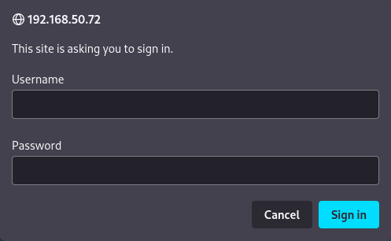

# Active Directory Introduction and Enumeration

# Giới thiệu và Enumeration Active Directory

---

Trong Learning Module này, chúng ta sẽ bao gồm các Learning Unit sau:

- Giới thiệu về Active Directory
- Enumeration Active Directory bằng các công cụ thủ công
- Enumeration Active Directory bằng các công cụ tự động

Active Directory Domain Services, thường được gọi là Active Directory (AD), là một dịch vụ cho phép quản trị viên hệ thống cập nhật và quản lý hệ điều hành, ứng dụng, người dùng và quyền truy cập dữ liệu trên quy mô lớn. Active Directory được cài đặt với cấu hình tiêu chuẩn, tuy nhiên, các quản trị viên hệ thống thường tùy chỉnh nó để phù hợp với nhu cầu của tổ chức.

Từ góc nhìn của một penetration tester, Active Directory là một mục tiêu rất đáng chú ý vì nó thường chứa một lượng lớn thông tin. Nếu chúng ta xâm nhập thành công vào một số đối tượng nhất định trong domain, chúng ta có thể giành được toàn quyền kiểm soát đối với hạ tầng của tổ chức.

Trong Learning Module này, chúng ta sẽ tập trung vào khía cạnh enumeration của Active Directory. Thông tin mà chúng ta thu thập được trong suốt Module này sẽ có tác động trực tiếp đến các kỹ thuật tấn công mà chúng ta sẽ thực hiện trong các Module tiếp theo về **Attacking Active Directory Authentication** và **Lateral Movement in Active Directory**.

---

# 1. Active Directory - Giới thiệu

---

Learning Unit này sẽ bao gồm các Learning Objectives sau:

- Giới thiệu về Active Directory
- Xác định mục tiêu enumeration

Mặc dù bản thân Active Directory là một dịch vụ, nhưng nó đồng thời cũng hoạt động như một lớp quản lý. AD chứa các thông tin quan trọng về môi trường, lưu trữ thông tin về người dùng, nhóm và máy tính, mỗi thành phần này được gọi là một **object**. Các quyền được thiết lập trên từng object sẽ quyết định các đặc quyền mà object đó có trong domain.

Việc cấu hình và duy trì một instance của Active Directory có thể là một thách thức lớn đối với quản trị viên, đặc biệt là do khối lượng thông tin đồ sộ được lưu trữ bên trong, vốn thường tạo ra một bề mặt tấn công rất lớn.

Bước đầu tiên trong việc cấu hình một instance AD là tạo một tên domain, ví dụ như `corp.com`, trong đó `corp` thường là tên của chính tổ chức. Bên trong domain này, quản trị viên có thể thêm nhiều loại object khác nhau liên quan đến tổ chức, chẳng hạn như máy tính, người dùng và các group object.

Một môi trường AD có sự phụ thuộc mang tính sống còn vào dịch vụ Domain Name System (DNS). Do đó, một domain controller điển hình cũng sẽ đồng thời lưu trữ một DNS server, đóng vai trò authoritative cho domain tương ứng.

Để đơn giản hóa việc quản lý các object khác nhau và hỗ trợ công tác quản trị, quản trị viên hệ thống thường tổ chức các object này vào các **Organizational Unit (OU)**.

OU có thể được so sánh với các thư mục trong hệ thống file, ở chỗ chúng là các container dùng để lưu trữ object bên trong domain. Computer object đại diện cho các server và workstation thực tế đã được join vào domain (là một phần của domain), trong khi user object đại diện cho các tài khoản có thể được sử dụng để đăng nhập vào các máy đã join domain. Ngoài ra, tất cả các AD object đều chứa các attribute, và các attribute này sẽ khác nhau tùy theo loại object. Ví dụ, một user object có thể bao gồm các attribute như tên, họ, username, số điện thoại, v.v.

AD phụ thuộc vào nhiều thành phần và các dịch vụ giao tiếp khác nhau. Ví dụ, khi một người dùng cố gắng đăng nhập vào domain, một yêu cầu sẽ được gửi tới Domain Controller (DC), nơi sẽ kiểm tra xem người dùng đó có được phép đăng nhập vào domain hay không. Một hoặc nhiều DC đóng vai trò là trung tâm và lõi của domain, lưu trữ toàn bộ OU, object và các attribute của chúng. Do DC là một thành phần trung tâm như vậy của domain, chúng ta sẽ đặc biệt chú ý đến nó trong quá trình enumeration AD.

Các object có thể được gán vào các AD group để quản trị viên có thể quản lý các object đó như một đơn vị duy nhất. Ví dụ, các user trong một group có thể được cấp quyền truy cập vào một file server share hoặc được cấp quyền quản trị trên nhiều client khác nhau trong domain. Các attacker thường nhắm tới các group có mức đặc quyền cao.

Các thành viên của nhóm **Domain Admins** là những object có đặc quyền cao nhất trong domain. Nếu một attacker xâm nhập được vào một thành viên của nhóm này (thường được gọi là domain administrator), họ về cơ bản sẽ giành được toàn quyền kiểm soát domain.

Vector tấn công này có thể mở rộng ra ngoài một domain duy nhất, bởi vì một instance AD có thể lưu trữ nhiều domain trong một domain tree hoặc nhiều domain tree trong một domain forest. Mặc dù mỗi domain trong forest đều có một nhóm Domain Admins riêng, nhưng các thành viên của nhóm **Enterprise Admins** được cấp toàn quyền kiểm soát đối với tất cả các domain trong forest và có đặc quyền Administrator trên tất cả các DC. Đây rõ ràng là một mục tiêu có giá trị rất cao đối với attacker.

Chúng ta sẽ tận dụng các khái niệm này và nhiều khái niệm khác trong Module này khi tập trung vào khía cạnh cực kỳ quan trọng là enumeration Active Directory. Kỷ luật quan trọng này có thể cải thiện đáng kể khả năng thành công của chúng ta trong giai đoạn tấn công. Chúng ta sẽ sử dụng nhiều công cụ khác nhau để thực hiện enumeration AD thủ công, trong đó phần lớn dựa trên Lightweight Directory Access Protocol (LDAP). Sau khi đã giới thiệu các kỹ thuật nền tảng, chúng ta sẽ sử dụng tự động hóa để thực hiện enumeration ở quy mô lớn.

---

## 1.1. Enumeration - Xác định mục tiêu của chúng ta

---

Trước khi bắt đầu, chúng ta hãy thảo luận về kịch bản và xác định các mục tiêu.

Trong kịch bản này, chúng ta sẽ thực hiện enumeration domain `corp.com`. Chúng ta đã có được thông tin xác thực của một domain user thông qua một cuộc tấn công phishing thành công. Ngoài ra, tổ chức mục tiêu cũng có thể đã cung cấp cho chúng ta thông tin xác thực của người dùng để chúng ta thực hiện penetration testing dựa trên giả định rằng hệ thống đã bị xâm nhập (assumed breach). Cách tiếp cận này sẽ giúp đẩy nhanh quá trình kiểm thử, đồng thời cung cấp cho tổ chức cái nhìn rõ ràng về việc attacker có thể di chuyển dễ dàng như thế nào bên trong môi trường của họ sau khi đã có được quyền truy cập ban đầu.

Người dùng mà chúng ta có quyền truy cập là **stephanie**, người có quyền Remote Desktop trên một máy Windows 11 là thành viên của domain. Người dùng này không phải là local administrator trên máy, đây là một yếu tố mà chúng ta có thể cần phải cân nhắc trong quá trình tiếp theo.

Trong một bài đánh giá thực tế, tổ chức cũng có thể xác định phạm vi và mục tiêu của penetration test. Tuy nhiên, trong trường hợp của chúng ta, chúng ta bị giới hạn trong domain `corp.com` trong các phòng lab PWK. Mục tiêu của chúng ta sẽ là enumeration toàn bộ domain, bao gồm việc tìm ra các khả năng để đạt được mức đặc quyền cao nhất có thể (trong trường hợp này là domain administrator).

Trong Module này, chúng ta sẽ thực hiện enumeration từ một máy client duy nhất với domain user có đặc quyền thấp là **stephanie**. Tuy nhiên, khi chúng ta bắt đầu thực hiện các cuộc tấn công và có thể giành được quyền truy cập vào các user và máy tính khác, chúng ta có thể phải lặp lại một số phần của quá trình enumeration từ góc nhìn mới. Sự thay đổi góc nhìn này (hay pivot) là yếu tố then chốt trong quá trình enumeration, xét đến sự phức tạp của các quyền trong toàn domain. Mỗi lần pivot có thể mang lại cho chúng ta một cơ hội để đẩy cuộc tấn công tiến xa hơn.

Ví dụ, nếu chúng ta giành được quyền truy cập vào một tài khoản user khác có đặc quyền thấp và có vẻ như có cùng mức truy cập như **stephanie**, chúng ta không nên đơn giản là bỏ qua. Thay vào đó, chúng ta luôn phải lặp lại quá trình enumeration với tài khoản mới này, bởi vì quản trị viên thường cấp thêm quyền cho từng người dùng dựa trên vai trò riêng của họ trong tổ chức. Quá trình “rinse and repeat” liên tục này chính là chìa khóa để enumeration thành công và hoạt động cực kỳ hiệu quả, đặc biệt là trong các tổ chức lớn.

---

# 2. Active Directory - Enumeration Thủ công

---

Learning Unit này sẽ bao gồm các Learning Objectives sau:

- Enumeration Active Directory bằng các ứng dụng Windows legacy
- Sử dụng PowerShell và .NET để thực hiện enumeration Active Directory bổ sung

Có rất nhiều cách để thực hiện enumeration Active Directory và rất nhiều công cụ khác nhau mà chúng ta có thể sử dụng. Trong Learning Unit này, chúng ta sẽ bắt đầu enumeration domain bằng các công cụ đã được cài đặt sẵn trong Windows. Chúng ta sẽ khởi đầu với các “low-hanging fruit”, tức là những thông tin có thể thu thập một cách nhanh chóng và dễ dàng. Cuối cùng, chúng ta sẽ tận dụng các kỹ thuật mạnh mẽ hơn, chẳng hạn như gọi các lớp .NET thông qua PowerShell để giao tiếp với Active Directory thông qua LDAP.

---

## 2.1. Active Directory - Enumeration bằng các công cụ Windows Legacy

---

Vì chúng ta đang bắt đầu trong kịch bản assumed breach và đã có thông tin xác thực của **stephanie**, chúng ta sẽ sử dụng các thông tin xác thực này để xác thực với domain thông qua một máy Windows 11 (CLIENT75). Chúng ta sẽ sử dụng Remote Desktop Protocol (RDP) với **xfreerdp** để kết nối tới client và đăng nhập vào domain. Chúng ta sẽ cung cấp tên người dùng bằng `/u`, tên domain bằng `/d` và nhập mật khẩu, trong trường hợp này là `LegmanTeamBenzoin!!`.

```
kali@kali:~$ xfreerdp /u:stephanie /d:corp.com /v:192.168.50.75
```

                                           *Listing 1 – Kết nối tới Windows 11 client bằng “xfreerdp”*

Active Directory chứa một lượng thông tin rất lớn, đến mức đôi khi rất khó để xác định nên bắt đầu enumeration từ đâu. Tuy nhiên, vì mọi cài đặt AD về cơ bản đều bao gồm user và group, chúng ta sẽ bắt đầu từ đây.

Để bắt đầu thu thập thông tin về user, chúng ta sẽ sử dụng **net.exe**, một công cụ được cài đặt mặc định trên tất cả các hệ điều hành Windows. Cụ thể hơn, chúng ta sẽ sử dụng sub-command **net user**. Mặc dù chúng ta có thể sử dụng công cụ này để enumerate các local account trên máy, nhưng thay vào đó chúng ta sẽ sử dụng tùy chọn `/domain` để in ra danh sách user trong domain.

```
C:\Users\stephanie>net user /domain
The request will be processed at a domain controller for domain corp.com.

User accounts for \\DC1.corp.com

-------------------------------------------------------------------------------
Administrator            dave                     Guest
iis_service              jeff                     jeffadmin
jen                      krbtgt                   pete
stephanie
The command completed successfully.
```

                                *Listing 2 – Chạy “net user” để hiển thị các user trong domain*

Kết quả đầu ra của lệnh này sẽ thay đổi tùy theo quy mô của tổ chức. Khi đã có danh sách user, chúng ta có thể tiếp tục truy vấn thông tin chi tiết về từng user cụ thể.

Quản trị viên thường có xu hướng thêm tiền tố hoặc hậu tố vào username để xác định chức năng của tài khoản. Dựa trên kết quả ở Listing 2, chúng ta nên kiểm tra user **jeffadmin** vì rất có thể đây là một tài khoản quản trị.

Hãy kiểm tra user này bằng **net.exe** với tùy chọn `/domain`:

```
C:\Users\stephanie>net user jeffadmin /domain
The request will be processed at a domain controller for domain corp.com.

User name                    jeffadmin
Full Name
Comment
User's comment
Country/region code          000 (System Default)
Account active               Yes
Account expires              Never

Password last set            9/2/2022 4:26:48 PM
Password expires             Never
Password changeable          9/3/2022 4:26:48 PM
Password required            Yes
User may change password     Yes

Workstations allowed         All
Logon script
User profile
Home directory
Last logon                   9/20/2022 1:36:09 AM

Logon hours allowed          All

Local Group Memberships      *Administrators
Global Group memberships     *Domain Users         *Domain Admins
The command completed successfully.
```

                                           *Listing 3 – Chạy “net user” đối với một user cụ thể*

Dựa vào kết quả trên, **jeffadmin** là thành viên của nhóm **Domain Admins**, đây là một thông tin mà chúng ta cần đặc biệt lưu ý. Nếu chúng ta có thể xâm nhập được tài khoản này, chúng ta về cơ bản sẽ nâng quyền lên domain administrator.

Chúng ta cũng có thể sử dụng **net.exe** để enumerate các group trong domain bằng lệnh **net group**:

```
C:\Users\stephanie>net group /domain
The request will be processed at a domain controller for domain corp.com.

Group Accounts for \\DC1.corp.com

-------------------------------------------------------------------------------
*Cloneable Domain Controllers
*Debug
*Development Department
*DnsUpdateProxy
*Domain Admins
*Domain Computers
*Domain Controllers
*Domain Guests
*Domain Users
*Enterprise Admins
*Enterprise Key Admins
*Enterprise Read-only Domain Controllers
*Group Policy Creator Owners
*Key Admins
*Management Department
*Protected Users
*Read-only Domain Controllers
*Sales Department
*Schema Admins
The command completed successfully.
```

                            *Listing 4 – Chạy “net group” để hiển thị các group trong domain*

Kết quả này bao gồm một danh sách dài các group trong domain. Một số group được cài đặt mặc định. Những group khác, chẳng hạn như các group được làm nổi bật ở trên, là các group tùy chỉnh do quản trị viên tạo ra. Trước tiên, chúng ta sẽ enumerate một group tùy chỉnh.

Chúng ta sẽ tiếp tục sử dụng **net.exe** để enumerate các thành viên của group, lần này tập trung vào group **Sales Department**.

```
PS C:\Tools> net group "Sales Department" /domain
The request will be processed at a domain controller for domain corp.com.

Group name     Sales Department
Comment

Members

-------------------------------------------------------------------------------
pete                     stephanie
The command completed successfully.
```

                        *Listing 5 – Chạy “net group” để hiển thị các thành viên trong một group cụ thể*

Kết quả này cho thấy **pete** và **stephanie** là thành viên của group **Sales Department**.

Mặc dù thông tin này có vẻ không tiết lộ nhiều điều, nhưng mỗi mảnh thông tin nhỏ thu được thông qua enumeration đều có thể mang lại giá trị. Trong một bài đánh giá thực tế, chúng ta có thể enumerate từng group và ghi lại kết quả. Điều này đòi hỏi khả năng tổ chức tốt, nội dung mà chúng ta sẽ thảo luận sau. Tuy nhiên, hiện tại chúng ta sẽ tiếp tục, vì trong phần tiếp theo chúng ta sẽ đề cập đến các phương án linh hoạt hơn so với **net.exe**.

---

## 2.2. Enumeration Active Directory bằng PowerShell và các class .NET

---

Có nhiều công cụ khác nhau mà chúng ta có thể sử dụng để enumerate Active Directory. Các PowerShell cmdlet như **Get-ADUser** hoạt động rất tốt, nhưng chúng chỉ được cài đặt mặc định trên domain controller như một phần của **Remote Server Administration Tools (RSAT)**. RSAT rất hiếm khi có mặt trên các máy client trong domain và chúng ta phải có quyền quản trị để cài đặt chúng. Mặc dù về mặt lý thuyết chúng ta có thể tự import các DLL cần thiết cho enumeration, nhưng chúng ta sẽ xem xét các lựa chọn khác.

Chúng ta sẽ phát triển một công cụ chỉ yêu cầu quyền cơ bản và đủ linh hoạt để sử dụng trong các engagement thực tế. Chúng ta sẽ mô phỏng các truy vấn diễn ra như một phần trong hoạt động thông thường của AD. Điều này sẽ giúp chúng ta hiểu các khái niệm cơ bản được sử dụng trong các công cụ dựng sẵn mà chúng ta sẽ sử dụng sau này.

Cụ thể, chúng ta sẽ sử dụng PowerShell và các lớp .NET để tạo một script thực hiện enumeration domain. Mặc dù việc phát triển bằng PowerShell có thể trông phức tạp, nhưng chúng ta sẽ đi từng bước một.

Để enumerate AD, trước tiên chúng ta cần hiểu cách giao tiếp với dịch vụ này. Trước khi bắt đầu xây dựng script, hãy thảo luận một chút về lý thuyết.

Enumeration AD dựa trên **LDAP**. Khi một máy trong domain tìm kiếm một object, chẳng hạn như máy in, hoặc khi chúng ta truy vấn các user hoặc group object, LDAP được sử dụng làm kênh giao tiếp cho truy vấn đó. Nói cách khác, LDAP là giao thức được sử dụng để giao tiếp với Active Directory.

LDAP không chỉ được sử dụng riêng cho AD. Các directory service khác cũng sử dụng nó.

Việc giao tiếp LDAP với AD không phải lúc nào cũng đơn giản, nhưng chúng ta sẽ tận dụng **Active Directory Services Interface (ADSI)** (một tập hợp các interface được xây dựng trên COM) như một LDAP provider.

Theo tài liệu của Microsoft, chúng ta cần một **LDAP ADsPath** cụ thể để có thể giao tiếp với dịch vụ AD. Prototype của LDAP path có dạng như sau:

```
LDAP://HostName[:PortNumber][/DistinguishedName]
```

                                                              *Listing 6 – Định dạng LDAP path*

Chúng ta cần ba tham số để có một LDAP path đầy đủ: **HostName**, **PortNumber** và **DistinguishedName**. Hãy cùng phân tích từng thành phần.

**Hostname** có thể là tên máy tính, địa chỉ IP hoặc tên domain. Trong trường hợp của chúng ta, chúng ta đang làm việc với domain `corp.com`, vì vậy chúng ta có thể đơn giản thêm nó vào LDAP path và rất có thể sẽ lấy được thông tin. Lưu ý rằng một domain có thể có nhiều DC, vì vậy việc đặt tên domain có thể sẽ resolve tới địa chỉ IP của bất kỳ DC nào trong domain.

Mặc dù cách này nhiều khả năng vẫn trả về thông tin hợp lệ, nhưng nó có thể không phải là phương pháp enumeration tối ưu nhất. Thực tế, để enumeration chính xác nhất có thể, chúng ta nên tìm DC đang giữ thông tin cập nhật nhất. DC này được gọi là **Primary Domain Controller (PDC)**. Trong một domain chỉ có duy nhất một PDC. Để tìm PDC, chúng ta cần tìm DC giữ thuộc tính **PdcRoleOwner**. Chúng ta sẽ sử dụng PowerShell và một lớp .NET cụ thể để tìm thông tin này.

**PortNumber** cho kết nối LDAP là tùy chọn theo tài liệu của Microsoft. Trong trường hợp này, chúng ta sẽ không thêm port number vì hệ thống sẽ tự động chọn port dựa trên việc chúng ta có sử dụng kết nối SSL hay không. Tuy nhiên, cần lưu ý rằng nếu trong tương lai chúng ta gặp một domain sử dụng port không mặc định, chúng ta có thể cần phải thêm port này thủ công vào script.

Cuối cùng, **DistinguishedName (DN)** là một phần của LDAP path. DN là một tên định danh duy nhất cho một object trong AD, bao gồm cả chính domain. Nếu chúng ta chưa quen với LDAP, phần này có thể hơi khó hiểu, vì vậy hãy đi sâu hơn một chút.

Để LDAP hoạt động, các object trong AD (hoặc các directory service khác) phải được định dạng theo một chuẩn đặt tên cụ thể. Để minh họa một DN, chúng ta có thể sử dụng domain user **stephanie**. Chúng ta biết rằng stephanie là một user object trong domain `corp.com`. Với thông tin này, DN có thể (mặc dù chúng ta chưa thể chắc chắn) có dạng như sau:

```
CN=Stephanie,CN=Users,DC=corp,DC=com
```

                                                         *Listing 7 – Ví dụ về Distinguished Name*

Listing trên cho thấy một số tham chiếu mới mà chúng ta chưa gặp ở các phần trước của Module này, chẳng hạn như **CN** và **DC**. **CN** là viết tắt của **Common Name**, dùng để chỉ định danh của một object trong domain. Mặc dù trong thuật ngữ AD chúng ta thường gọi “DC” là Domain Controller, nhưng trong Distinguished Name, “DC” có nghĩa là **Domain Component**. Domain Component đại diện cho đỉnh của cây LDAP và trong trường hợp này, nó chính là Distinguished Name của domain.

Khi đọc một DN, chúng ta bắt đầu từ các Domain Component ở phía bên phải và di chuyển dần sang bên trái. Trong ví dụ trên, chúng ta có bốn thành phần, bắt đầu với hai thành phần **DC=corp,DC=com**. Như đã đề cập, các Domain Component đại diện cho đỉnh của cây LDAP theo chuẩn đặt tên yêu cầu.

Tiếp theo trong DN, **CN=Users** đại diện cho Common Name của container nơi user object được lưu trữ (còn được gọi là parent container). Cuối cùng, ở phía ngoài cùng bên trái, **CN=Stephanie** đại diện cho Common Name của chính user object, đồng thời là mức thấp nhất trong hệ thống phân cấp.

Trong trường hợp LDAP path của chúng ta, chúng ta quan tâm đến Domain Component object, tức là **DC=corp,DC=com**. Nếu chúng ta thêm **CN=Users** vào LDAP path, chúng ta sẽ tự giới hạn bản thân chỉ có thể tìm kiếm các object nằm trong container đó.

Hãy bắt đầu viết script bằng cách lấy hostname cần thiết cho PDC.

Trong các lớp .NET của Microsoft liên quan đến AD, chúng ta có namespace **System.DirectoryServices.ActiveDirectory**. Mặc dù có một số lớp để lựa chọn, chúng ta sẽ tập trung vào **Domain Class**. Lớp này chứa tham chiếu đến thuộc tính **PdcRoleOwner**, đúng với thứ chúng ta cần. Khi kiểm tra các method, chúng ta thấy có method **GetCurrentDomain()**, method này sẽ trả về domain object của user hiện tại, trong trường hợp này là stephanie.

Để gọi Domain Class và method GetCurrentDomain, chúng ta sẽ chạy lệnh sau trong PowerShell:

```
PS C:\Users\stephanie> [System.DirectoryServices.ActiveDirectory.Domain]::GetCurrentDomain()

Forest                  : corp.com
DomainControllers       : {DC1.corp.com}
Children                : {}
DomainMode              : Unknown
DomainModeLevel         : 7
Parent                  :
PdcRoleOwner            : DC1.corp.com
RidRoleOwner            : DC1.corp.com
InfrastructureRoleOwner : DC1.corp.com
Name                  	: corp.com
```

             *Listing 8 – Domain class từ namespace System.DirectoryServices.ActiveDirectory*

Kết quả đầu ra hiển thị thuộc tính **PdcRoleOwner**, trong trường hợp này là **DC1.corp.com**. Mặc dù chúng ta hoàn toàn có thể thêm trực tiếp hostname này vào script như một phần của LDAP path, nhưng chúng ta muốn tự động hóa quá trình này để có thể sử dụng script trong các engagement tương lai.

Chúng ta sẽ thực hiện từng bước một. Trước tiên, chúng ta tạo một biến để lưu domain object, sau đó in biến này ra để xác nhận rằng nó vẫn hoạt động đúng trong script. Phần đầu của script được liệt kê bên dưới:

```
# Store the domain object in the $domainObj variable
$domainObj = [System.DirectoryServices.ActiveDirectory.Domain]::GetCurrentDomain()

# Print the variable
$domainObj
```

                                               *Listing 9 – Lưu domain object vào biến đầu tiên*

Để chạy script, chúng ta phải bypass execution policy, vốn được thiết kế để ngăn việc vô tình chạy các PowerShell script. Chúng ta sẽ thực hiện điều này bằng **powershell -ep bypass**:

```
PS C:\Users\stephanie> powershell -ep bypass
Windows PowerShell
Copyright (C) Microsoft Corporation. All rights reserved.

Install the latest PowerShell for new features and improvements! https://aka.ms/PSWindows

PS C:\Users\stephanie>
```

Bây giờ hãy chạy script và xác minh rằng nó in ra domain object:

```
PS C:\Users\stephanie> .\enumeration.ps1

Forest                  : corp.com
DomainControllers       : {DC1.corp.com}
Children                : {}
DomainMode              : Unknown
DomainModeLevel         : 7
Parent                  :
PdcRoleOwner            : DC1.corp.com
RidRoleOwner            : DC1.corp.com
InfrastructureRoleOwner : DC1.corp.com
Name                    : corp.com
```

                         *Listing 10 – Output hiển thị thông tin được lưu trong biến đầu tiên*

Biến **$domainObj** giờ đã chứa thông tin về domain object. Mặc dù việc in biến ra không bắt buộc, nhưng đây là một cách tốt để xác minh rằng lệnh và biến đã hoạt động đúng như mong đợi.

Vì hostname trong thuộc tính **PdcRoleOwner** là cần thiết cho LDAP path, chúng ta có thể trích xuất trực tiếp giá trị này từ domain object. Trong trường hợp chúng ta cần thêm thông tin từ domain object ở các phần sau của script, chúng ta sẽ giữ lại **$domainObj** và tạo thêm một biến mới là **$PDC**, biến này sẽ trích xuất giá trị từ thuộc tính PdcRoleOwner được lưu trong **$domainObj**:

```
# Store the domain object in the $domainObj variable
$domainObj = [System.DirectoryServices.ActiveDirectory.Domain]::GetCurrentDomain()

# Store the PdcRoleOwner name to the $PDC variable
$PDC = $domainObj.PdcRoleOwner.Name

# Print the $PDC variable
$PDC
```

                                    *Listing 11 – Thêm biến $PDC và trích xuất tên PdcRoleOwner*

Bây giờ hãy chạy lại script và kiểm tra output:

```
PS C:\Users\stephanie> .\enumeration.ps1
DC1.corp.com
```

                                                                 *Listing 12 – In ra biến $PDC*

Trong trường hợp này, chúng ta đã trích xuất PDC một cách động từ thuộc tính **PdcRoleOwner** bằng cách sử dụng Domain Class. Tốt.

Mặc dù chúng ta cũng có thể lấy DN cho domain thông qua domain object, nhưng giá trị đó không tuân theo chuẩn đặt tên mà LDAP yêu cầu. Trong ví dụ của chúng ta, chúng ta biết domain cơ sở là `corp.com` và DN thực tế sẽ là **DC=corp,DC=com**. Trong trường hợp này, chúng ta có thể lấy `corp.com` từ thuộc tính **Name** trong domain object và yêu cầu PowerShell tách chuỗi này rồi thêm tham số **DC=** cần thiết. Tuy nhiên, có một cách đơn giản hơn, đồng thời đảm bảo chúng ta luôn lấy được DN chính xác.

Chúng ta có thể sử dụng **ADSI** trực tiếp trong PowerShell để truy xuất DN. Chúng ta sẽ dùng hai dấu nháy đơn để chỉ định rằng truy vấn bắt đầu từ đỉnh của hệ thống phân cấp AD.

```
PS C:\Users\stephanie> ([adsi]'').distinguishedName
DC=corp,DC=com
```

                                              *Listing 13 – Sử dụng ADSI để lấy DN của domain*

Lệnh này trả về DN theo đúng định dạng cần thiết cho LDAP path.

Bây giờ chúng ta có thể thêm một biến mới vào script để lưu DN của domain. Để đảm bảo script vẫn hoạt động, chúng ta sẽ thêm một lệnh in ra nội dung của biến mới:

```
# Store the domain object in the $domainObj variable
$domainObj = [System.DirectoryServices.ActiveDirectory.Domain]::GetCurrentDomain()

# Store the PdcRoleOwner name to the $PDC variable
$PDC = $domainObj.PdcRoleOwner.Name

# Store the Distinguished Name variable into the $DN variable
$DN = ([adsi]'').distinguishedName

# Print the $DN variable
$DN
```

                                                 *Listing 14 – Tạo biến mới lưu DN của domain*

Hãy chạy script.

```
PS C:\Users\stephanie> .\enumeration.ps1
DC=corp,DC=com
```

                                              *Listing 15 – Sử dụng script để in DN của domain*

Tại thời điểm này, chúng ta đã lấy được **Hostname** và **DN** một cách động bằng script. Bây giờ chúng ta cần ghép các thành phần này lại để xây dựng LDAP path hoàn chỉnh. Để làm điều này, chúng ta sẽ thêm một biến mới **$LDAP** vào script, biến này sẽ chứa các biến **$PDC** và **$DN**, được tiền tố bởi chuỗi `"LDAP://"`.

Script cuối cùng sẽ tạo ra LDAP path như bên dưới. Lưu ý rằng để làm cho script gọn gàng hơn, chúng ta đã loại bỏ các comment. Vì chúng ta chỉ cần giá trị **Name** của thuộc tính **PdcRoleOwner** từ domain object, chúng ta sẽ lấy trực tiếp giá trị đó trong biến **$PDC** ngay từ dòng đầu tiên, nhằm giảm lượng code cần thiết:

```
$PDC = [System.DirectoryServices.ActiveDirectory.Domain]::GetCurrentDomain().PdcRoleOwner.Name
$DN = ([adsi]'').distinguishedName 
$LDAP = "LDAP://$PDC/$DN"
$LDAP
```

                                    *Listing 16 – Script tạo LDAP path đầy đủ phục vụ enumeration*

Hãy chạy script.

```
PS C:\Users\stephanie> .\enumeration.ps1
LDAP://DC1.corp.com/DC=corp,DC=com
```

                                     *Listing 17 – Output của script hiển thị LDAP path đầy đủ*

Tuyệt vời. Chúng ta đã sử dụng thành công các lớp .NET và ADSI để tự động lấy LDAP path đầy đủ cần thiết cho quá trình enumeration. Ngoài ra, script của chúng ta mang tính động, vì vậy có thể dễ dàng tái sử dụng trong các engagement thực tế.

---

## 2.3. Thêm chức năng tìm kiếm vào Script của chúng ta

---

Cho đến thời điểm này, script của chúng ta đã xây dựng được LDAP path cần thiết. Bây giờ chúng ta có thể xây dựng thêm chức năng tìm kiếm.

Để làm điều này, chúng ta sẽ sử dụng hai lớp .NET nằm trong namespace **System.DirectoryServices**, cụ thể hơn là các lớp **DirectoryEntry** và **DirectorySearcher**. Hãy thảo luận về chúng trước khi triển khai.

Lớp **DirectoryEntry** đóng gói một object trong hệ thống phân cấp dịch vụ AD. Trong trường hợp của chúng ta, chúng ta muốn tìm kiếm từ tận đỉnh của hệ thống phân cấp AD, vì vậy chúng ta sẽ cung cấp LDAP path đã lấy được cho lớp DirectoryEntry.

Một điều cần lưu ý với DirectoryEntry là chúng ta có thể truyền thông tin xác thực vào để xác thực với domain. Tuy nhiên, do chúng ta đã đăng nhập sẵn, nên ở đây không cần làm điều đó.

Lớp **DirectorySearcher** thực hiện các truy vấn tới AD bằng LDAP. Khi tạo một instance của DirectorySearcher, chúng ta phải chỉ định dịch vụ AD mà chúng ta muốn truy vấn dưới dạng thuộc tính **SearchRoot**. Theo tài liệu của Microsoft, thuộc tính này chỉ ra vị trí bắt đầu tìm kiếm trong hệ thống phân cấp AD. Vì lớp DirectoryEntry đã đóng gói LDAP path trỏ tới đỉnh của hệ thống phân cấp, chúng ta sẽ truyền nó vào DirectorySearcher dưới dạng một biến.

Tài liệu của DirectorySearcher liệt kê phương thức **FindAll()**, phương thức này trả về một collection chứa tất cả các entry được tìm thấy trong AD.

Hãy triển khai hai lớp này vào script của chúng ta. Đoạn code dưới đây hiển thị phần liên quan của script:

```
$PDC = [System.DirectoryServices.ActiveDirectory.Domain]::GetCurrentDomain().PdcRoleOwner.Name
$DN = ([adsi]'').distinguishedName 
$LDAP = "LDAP://$PDC/$DN"

$direntry = New-Object System.DirectoryServices.DirectoryEntry($LDAP)

$dirsearcher = New-Object System.DirectoryServices.DirectorySearcher($direntry)
$dirsearcher.FindAll()
```

                           *Listing 18 – Thêm DirectoryEntry và DirectorySearcher vào script*

Như thể hiện trong Listing 18, chúng ta đã thêm biến **$direntry**, biến này đóng gói LDAP path mà chúng ta đã lấy được. Biến **$dirsearcher** chứa biến $direntry và sử dụng thông tin này làm SearchRoot, trỏ tới đỉnh của hệ thống phân cấp nơi DirectorySearcher sẽ chạy phương thức FindAll().

Bây giờ, vì chúng ta bắt đầu tìm kiếm từ đỉnh và không lọc kết quả, nó sẽ tạo ra rất nhiều output. Tuy nhiên, hãy chạy thử:

```
PS C:\Users\stephanie> .\enumeration.ps1

Path
----
LDAP://DC1.corp.com/DC=corp,DC=com
LDAP://DC1.corp.com/CN=Users,DC=corp,DC=com
LDAP://DC1.corp.com/CN=Computers,DC=corp,DC=com
LDAP://DC1.corp.com/OU=Domain Controllers,DC=corp,DC=com
LDAP://DC1.corp.com/CN=System,DC=corp,DC=com
LDAP://DC1.corp.com/CN=LostAndFound,DC=corp,DC=com
LDAP://DC1.corp.com/CN=Infrastructure,DC=corp,DC=com
LDAP://DC1.corp.com/CN=ForeignSecurityPrincipals,DC=corp,DC=com
LDAP://DC1.corp.com/CN=Program Data,DC=corp,DC=com
LDAP://DC1.corp.com/CN=Microsoft,CN=Program Data,DC=corp,DC=com
LDAP://DC1.corp.com/CN=NTDS Quotas,DC=corp,DC=com
LDAP://DC1.corp.com/CN=Managed Service Accounts,DC=corp,DC=com
LDAP://DC1.corp.com/CN=Keys,DC=corp,DC=com
LDAP://DC1.corp.com/CN=WinsockServices,CN=System,DC=corp,DC=com
LDAP://DC1.corp.com/CN=RpcServices,CN=System,DC=corp,DC=com
LDAP://DC1.corp.com/CN=FileLinks,CN=System,DC=corp,DC=com
LDAP://DC1.corp.com/CN=VolumeTable,CN=FileLinks,CN=System,DC=corp,DC=com
LDAP://DC1.corp.com/CN=ObjectMoveTable,CN=FileLinks,CN=System,DC=corp,DC=com
...
```

                                                 *Listing 19 – Sử dụng script để tìm kiếm AD*

Như thể hiện trong phần output đã được cắt bớt ở Listing 19, script thực sự tạo ra rất nhiều văn bản. Thực tế, chúng ta đang nhận về tất cả các object trong toàn bộ domain. Điều này ít nhất cũng chứng minh rằng script đang hoạt động đúng như mong đợi.

Việc lọc output khá đơn giản, và có nhiều cách để thực hiện. Một cách là thiết lập một filter để sàng lọc theo attribute **samAccountType**, đây là một attribute được áp dụng cho tất cả user, computer và group object.

Tài liệu chính thức đưa ra các giá trị khác nhau của attribute samAccountType, nhưng chúng ta sẽ bắt đầu với **0x30000000** (thập phân **805306368**), giá trị này sẽ enumerate tất cả user trong domain. Để triển khai filter trong script, chúng ta chỉ cần thêm filter vào **$dirsearcher.filter** như bên dưới:

```
$PDC = [System.DirectoryServices.ActiveDirectory.Domain]::GetCurrentDomain().PdcRoleOwner.Name
$DN = ([adsi]'').distinguishedName 
$LDAP = "LDAP://$PDC/$DN"

$direntry = New-Object System.DirectoryServices.DirectoryEntry($LDAP)

$dirsearcher = New-Object System.DirectoryServices.DirectorySearcher($direntry)
$dirsearcher.filter="samAccountType=805306368"
$dirsearcher.FindAll()
```

                       *Listing 20 – Dùng samAccountType để lọc các tài khoản user thông thường*

Chạy script sẽ hiển thị tất cả các user object trong domain:

```
PS C:\Users\stephanie> .\enumeration.ps1

Path                                                         Properties
----                                                         ----------
LDAP://DC1.corp.com/CN=Administrator,CN=Users,DC=corp,DC=com {logoncount, codepage, objectcategory, description...}
LDAP://DC1.corp.com/CN=Guest,CN=Users,DC=corp,DC=com         {logoncount, codepage, objectcategory, description...}
LDAP://DC1.corp.com/CN=krbtgt,CN=Users,DC=corp,DC=com        {logoncount, codepage, objectcategory, description...}
LDAP://DC1.corp.com/CN=dave,CN=Users,DC=corp,DC=com          {logoncount, codepage, objectcategory, usnchanged...}
LDAP://DC1.corp.com/CN=stephanie,CN=Users,DC=corp,DC=com     {logoncount, codepage, objectcategory, dscorepropagatio...
LDAP://DC1.corp.com/CN=jeff,CN=Users,DC=corp,DC=com          {logoncount, codepage, objectcategory, dscorepropagatio...
LDAP://DC1.corp.com/CN=jeffadmin,CN=Users,DC=corp,DC=com     {logoncount, codepage, objectcategory, dscorepropagatio...
LDAP://DC1.corp.com/CN=iis_service,CN=Users,DC=corp,DC=com   {logoncount, codepage, objectcategory, dscorepropagatio...
LDAP://DC1.corp.com/CN=pete,CN=Users,DC=corp,DC=com          {logoncount, codepage, objectcategory, dscorepropagatio...
LDAP://DC1.corp.com/CN=jen,CN=Users,DC=corp,DC=com           {logoncount, codepage, objectcategory, dscorepropagatio
```

                  *Listing 21 – Nhận tất cả user trong domain bằng cách lọc theo samAccountType*

Đây là thông tin rất hữu ích, nhưng chúng ta cần phát triển thêm. Khi enumerate AD, chúng ta đặc biệt quan tâm đến các attribute của từng object, và chúng được lưu trong trường **Properties**.

Biết điều này, chúng ta có thể lưu kết quả nhận được từ tìm kiếm vào một biến mới. Chúng ta sẽ lặp qua từng object và in từng property trên một dòng riêng thông qua một vòng lặp lồng nhau như bên dưới.

```
$domainObj = [System.DirectoryServices.ActiveDirectory.Domain]::GetCurrentDomain()
$PDC = $domainObj.PdcRoleOwner.Name
$DN = ([adsi]'').distinguishedName 
$LDAP = "LDAP://$PDC/$DN"

$direntry = New-Object System.DirectoryServices.DirectoryEntry($LDAP)

$dirsearcher = New-Object System.DirectoryServices.DirectorySearcher($direntry)
$dirsearcher.filter="samAccountType=805306368"
$result = $dirsearcher.FindAll()

Foreach($obj in $result)
{
    Foreach($prop in $obj.Properties)
    {
        $prop
    }

    Write-Host "-------------------------------"
}
```

                  *Listing 22 – Thêm vòng lặp lồng nhau để in từng property trên một dòng riêng*

Script hoàn chỉnh này sẽ tìm kiếm trong AD và lọc kết quả dựa trên samAccountType mà chúng ta lựa chọn, sau đó đưa kết quả vào biến mới **$result**. Sau đó, script sẽ tiếp tục lọc sâu hơn thông qua hai vòng foreach. Vòng lặp đầu tiên trích xuất các object được lưu trong $result và đưa vào biến **$obj**. Vòng lặp thứ hai trích xuất toàn bộ property cho mỗi object và lưu thông tin vào biến **$prop**. Script sau đó sẽ in $prop và hiển thị output trong terminal.

Lệnh **Write-Host** không bắt buộc để script hoạt động, nhưng nó in ra một dòng phân cách giữa từng object. Điều này giúp output dễ đọc hơn một chút.

Script sẽ xuất ra rất nhiều thông tin, có thể gây choáng ngợp tùy theo số lượng domain user hiện có. Listing dưới đây hiển thị một phần các attribute của jeffadmin:

```
PS C:\Users\stephanie> .\enumeration.ps1
...
logoncount                     {173}
codepage                       {0}
objectcategory                 {CN=Person,CN=Schema,CN=Configuration,DC=corp,DC=com}
dscorepropagationdata          {9/3/2022 6:25:58 AM, 9/2/2022 11:26:49 PM, 1/1/1601 12:00:00 AM}
usnchanged                     {52775}
instancetype                   {4}
name                           {jeffadmin}
badpasswordtime                {133086594569025897}
pwdlastset                     {133066348088894042}
objectclass                    {top, person, organizationalPerson, user}
badpwdcount                    {0}
samaccounttype                 {805306368}
lastlogontimestamp             {133080434621989766}
usncreated                     {12821}
objectguid                     {14 171 173 158 0 247 44 76 161 53 112 209 139 172 33 163}
memberof                       {CN=Domain Admins,CN=Users,DC=corp,DC=com, CN=Administrators,CN=Builtin,DC=corp,DC=com}
whencreated                    {9/2/2022 11:26:48 PM}
adspath                        {LDAP://DC1.corp.com/CN=jeffadmin,CN=Users,DC=corp,DC=com}
useraccountcontrol             {66048}
cn                             {jeffadmin}
countrycode                    {0}
primarygroupid                 {513}
whenchanged                    {9/19/2022 6:44:22 AM}
lockouttime                    {0}
lastlogon                      {133088312288347545}
distinguishedname              {CN=jeffadmin,CN=Users,DC=corp,DC=com}
admincount                     {1}
samaccountname                 {jeffadmin}
objectsid                      {1 5 0 0 0 0 0 5 21 0 0 0 30 221 116 118 49 27 70 39 209 101 53 106 82 4 0 0}
lastlogoff                     {0}
accountexpires                 {9223372036854775807}
...
```

                                         *Listing 23 – Chạy script, in từng attribute cho “jeffadmin”*

Chúng ta có thể lọc dựa trên bất kỳ property nào của bất kỳ loại object nào. Trong ví dụ bên dưới, chúng ta đã thực hiện hai thay đổi. Thứ nhất, chúng ta đã đổi filter để sử dụng property **name** nhằm chỉ hiển thị thông tin cho jeffadmin. Ngoài ra, chúng ta đã thêm **.memberof** vào biến $prop để chỉ hiển thị các group mà jeffadmin là thành viên:

```
$dirsearcher = New-Object System.DirectoryServices.DirectorySearcher($direntry)
$dirsearcher.filter="name=jeffadmin"
$result = $dirsearcher.FindAll()

Foreach($obj in $result)
{
    Foreach($prop in $obj.Properties)
    {
        $prop.memberof
    }

    Write-Host "-------------------------------"
}
```

*Listing 24 – Thêm property name vào filter và chỉ in attribute “memberof” trong vòng lặp lồng nhau*

Hãy chạy script:

```
PS C:\Users\stephanie> .\enumeration.ps1
CN=Domain Admins,CN=Users,DC=corp,DC=com
CN=Administrators,CN=Builtin,DC=corp,DC=com
```

             *Listing 25 – Chạy script để chỉ hiển thị jeffadmin và các group mà anh ta là thành viên*

Điều này xác nhận rằng jeffadmin đúng là thành viên của nhóm Domain Admins.

Chúng ta có thể sử dụng script này để enumerate bất kỳ object nào có sẵn cho chúng ta trong AD. Tuy nhiên, ở trạng thái hiện tại, điều này sẽ yêu cầu chúng ta phải chỉnh sửa thêm chính script dựa trên thứ chúng ta muốn enumerate.

Thay vào đó, chúng ta có thể làm script linh hoạt hơn, cho phép chúng ta thêm các tham số cần thiết qua command line. Ví dụ, chúng ta có thể để script nhận samAccountType mà chúng ta muốn enumerate dưới dạng một đối số dòng lệnh.

Có nhiều cách để thực hiện điều này. Một cách là đơn giản đóng gói chức năng hiện tại của script thành một function thực sự. Một ví dụ được hiển thị bên dưới.

```
function LDAPSearch {
    param (
        [string]$LDAPQuery
    )

    $PDC = [System.DirectoryServices.ActiveDirectory.Domain]::GetCurrentDomain().PdcRoleOwner.Name
    $DistinguishedName = ([adsi]'').distinguishedName

    $DirectoryEntry = New-Object System.DirectoryServices.DirectoryEntry("LDAP://$PDC/$DistinguishedName")

    $DirectorySearcher = New-Object System.DirectoryServices.DirectorySearcher($DirectoryEntry, $LDAPQuery)

    return $DirectorySearcher.FindAll()

}
```

                                   *Listing 26 – Một function chấp nhận input từ người dùng*

Ở ngay phần đầu, chúng ta khai báo function với tên do chúng ta chọn, trong trường hợp này là **LDAPSearch**. Sau đó, function sẽ lấy động connection string LDAP path cần thiết và đưa vào biến $DirectoryEntry.

Tiếp theo, DirectoryEntry và tham số **$LDAPQuery** của chúng ta được đưa vào DirectorySearcher. Cuối cùng, truy vấn được chạy và output được đưa vào một array, array này được hiển thị trong terminal tùy theo nhu cầu.

Để sử dụng function, hãy import nó vào bộ nhớ:

```
PS C:\Users\stephanie> Import-Module .\function.ps1
```

                                                    *Listing 27 – Import function vào bộ nhớ*

Trong PowerShell, bây giờ chúng ta có thể dùng lệnh **LDAPSearch** (tên function đã khai báo) để lấy thông tin từ AD. Để lặp lại một phần enumeration user mà chúng ta đã làm trước đó, chúng ta có thể lọc theo samAccountType cụ thể:

```
PS C:\Users\stephanie> LDAPSearch -LDAPQuery "(samAccountType=805306368)"

Path                                                         Properties
----                                                         ----------
LDAP://DC1.corp.com/CN=Administrator,CN=Users,DC=corp,DC=com {logoncount, codepage, objectcategory, description...}
LDAP://DC1.corp.com/CN=Guest,CN=Users,DC=corp,DC=com         {logoncount, codepage, objectcategory, description...}
LDAP://DC1.corp.com/CN=krbtgt,CN=Users,DC=corp,DC=com        {logoncount, codepage, objectcategory, description...}
LDAP://DC1.corp.com/CN=dave,CN=Users,DC=corp,DC=com          {logoncount, codepage, objectcategory, usnchanged...}
LDAP://DC1.corp.com/CN=stephanie,CN=Users,DC=corp,DC=com     {logoncount, codepage, objectcategory, dscorepropagatio...
LDAP://DC1.corp.com/CN=jeff,CN=Users,DC=corp,DC=com          {logoncount, codepage, objectcategory, dscorepropagatio...
LDAP://DC1.corp.com/CN=jeffadmin,CN=Users,DC=corp,DC=com     {logoncount, codepage, objectcategory, dscorepropagatio...
LDAP://DC1.corp.com/CN=iis_service,CN=Users,DC=corp,DC=com   {logoncount, codepage, objectcategory, dscorepropagatio...
LDAP://DC1.corp.com/CN=pete,CN=Users,DC=corp,DC=com          {logoncount, codepage, objectcategory, dscorepropagatio...
LDAP://DC1.corp.com/CN=jen,CN=Users,DC=corp,DC=com           {logoncount, codepage, objectcategory, dscorepropagatio
```

                                    *Listing 28 – Thực hiện truy vấn user bằng function mới*

Chúng ta cũng có thể tìm trực tiếp theo **Object Class**, đây là một thành phần của AD dùng để xác định loại object. Trong trường hợp này, hãy dùng **objectClass=group** để liệt kê tất cả các group trong domain:

```
PS C:\Users\stephanie> LDAPSearch -LDAPQuery "(objectclass=group)"

...                                                                                 ----------
LDAP://DC1.corp.com/CN=Read-only Domain Controllers,CN=Users,DC=corp,DC=com            {usnchanged, distinguishedname, grouptype, whencreated...}
LDAP://DC1.corp.com/CN=Enterprise Read-only Domain Controllers,CN=Users,DC=corp,DC=com {iscriticalsystemobject, usnchanged, distinguishedname, grouptype...}
LDAP://DC1.corp.com/CN=Cloneable Domain Controllers,CN=Users,DC=corp,DC=com            {iscriticalsystemobject, usnchanged, distinguishedname, grouptype...}
LDAP://DC1.corp.com/CN=Protected Users,CN=Users,DC=corp,DC=com                         {iscriticalsystemobject, usnchanged, distinguishedname, grouptype...}
LDAP://DC1.corp.com/CN=Key Admins,CN=Users,DC=corp,DC=com                              {iscriticalsystemobject, usnchanged, distinguishedname, grouptype...}
LDAP://DC1.corp.com/CN=Enterprise Key Admins,CN=Users,DC=corp,DC=com                   {iscriticalsystemobject, usnchanged, distinguishedname, grouptype...}
LDAP://DC1.corp.com/CN=DnsAdmins,CN=Users,DC=corp,DC=com                               {usnchanged, distinguishedname, grouptype, whencreated...}
LDAP://DC1.corp.com/CN=DnsUpdateProxy,CN=Users,DC=corp,DC=com                          {usnchanged, distinguishedname, grouptype, whencreated...}
LDAP://DC1.corp.com/CN=Sales Department,DC=corp,DC=com                                 {usnchanged, distinguishedname, grouptype, whencreated...}
LDAP://DC1.corp.com/CN=Management Department,DC=corp,DC=com                            {usnchanged, distinguishedname, grouptype, whencreated...}
LDAP://DC1.corp.com/CN=Development Department,DC=corp,DC=com                           {usnchanged, distinguishedname, grouptype, whencreated...}
LDAP://DC1.corp.com/CN=Debug,CN=Users,DC=corp,DC=com                                   {usnchanged, distinguishedname, grouptype, whencreated...}
```

                                     *Listing 29 – Tìm kiếm tất cả các group có thể có trong AD*

Script của chúng ta enumerate được nhiều group hơn net.exe, bao gồm Print Operators, IIS_IUSRS và các group khác. Điều này là do nó enumerate tất cả các AD object bao gồm cả **Domain Local group** (không chỉ global group).

Để in các property và attribute cho object, chúng ta sẽ cần triển khai các vòng lặp mà chúng ta đã thảo luận trước đó. Tạm thời, hãy thực hiện trực tiếp việc này từ PowerShell command.

Để enumerate mọi group có trong domain và đồng thời hiển thị user member, chúng ta có thể pipe output vào một biến mới và dùng một vòng foreach để in từng property cho một group. Điều này cho phép chúng ta chọn các attribute cụ thể mà chúng ta quan tâm. Ví dụ, hãy tập trung vào các attribute **CN** và **member**:

```
PS C:\Users\stephanie\Desktop> foreach ($group in $(LDAPSearch -LDAPQuery "(objectCategory=group)")) {
>> $group.properties | select {$_.cn}, {$_.member}
>> }
```

                            *Listing 30 – Dùng “foreach” để lặp qua các object trong biến $group*

Mặc dù môi trường này khá nhỏ, chúng ta vẫn nhận được rất nhiều output. Hãy tập trung vào ba group mà chúng ta đã chú ý trước đó trong quá trình enumeration với net.exe:

```
...
Sales Department              {CN=Development Department,DC=corp,DC=com, CN=pete,CN=Users,DC=corp,DC=com, CN=stephanie,CN=Users,DC=corp,DC=com}
Management Department         {CN=jen,CN=Users,DC=corp,DC=com}
Development Department        {CN=Management Department,DC=corp,DC=com, CN=pete,CN=Users,DC=corp,DC=com, CN=dave,CN=Users,DC=corp,DC=com}
...
```

                                              *Listing 31 – Một phần output từ truy vấn trước*

Theo truy vấn của chúng ta, chúng ta đã mở rộng properties cho từng object, trong trường hợp này là các group object, và chúng ta đã in attribute **member** cho mỗi group.

Listing 31 cho thấy một điều bất ngờ. Trước đó khi chúng ta enumerate group Sales Department bằng net.exe, chúng ta chỉ tìm thấy hai user trong đó: pete và stephanie. Tuy nhiên ở đây, có vẻ như **Development Department** cũng là một member.

Vì output có thể hơi khó đọc, hãy một lần nữa tìm kiếm các group, nhưng lần này chỉ định Sales Department trong query và pipe nó vào một biến trong PowerShell command line:

```
PS C:\Users\stephanie> $sales = LDAPSearch -LDAPQuery "(&(objectCategory=group)(cn=Sales Department))"
```

                                                     *Listing 32 – Đưa truy vấn vào biến $sales*

Bây giờ vì chúng ta chỉ có một object trong biến, chúng ta có thể in trực tiếp attribute member:

```
PS C:\Users\stephanie\Desktop> $sales.properties.member
CN=Development Department,DC=corp,DC=com
CN=pete,CN=Users,DC=corp,DC=com
CN=stephanie,CN=Users,DC=corp,DC=com
PS C:\Users\stephanie\Desktop>
```

                             *Listing 33 – In attribute member của group object Sales Department*

Development Department đúng là một member của group Sales Department như được chỉ ra trong Listing 33. Đây là điều mà chúng ta đã bỏ lỡ trước đó khi dùng net.exe.

Đây là một group nằm trong một group, được gọi là **nested group**. Nested group tương đối phổ biến trong AD và có khả năng mở rộng tốt, cho phép sự linh hoạt và tùy biến membership một cách động ngay cả trong các triển khai AD lớn nhất.

Công cụ net.exe bỏ lỡ điều này vì nó chỉ liệt kê user object, không liệt kê group object.

Ngoài ra, net.exe không thể hiển thị các attribute cụ thể. Điều này nhấn mạnh lợi ích của các công cụ tùy chỉnh.

Bây giờ khi chúng ta biết Development Department là một member của Sales Department, hãy enumerate nó:

```
PS C:\Users\stephanie> $group = LDAPSearch -LDAPQuery "(&(objectCategory=group)(cn=Development Department*))"

PS C:\Users\stephanie> $group.properties.member
CN=Management Department,DC=corp,DC=com
CN=pete,CN=Users,DC=corp,DC=com
CN=dave,CN=Users,DC=corp,DC=com
```

                   *Listing 34 – In attribute member của group object Development Department*

Dựa trên output ở trên, chúng ta có thêm một trường hợp nested group vì **Management Department** là một member của Development Department. Hãy kiểm tra group này nữa:

```
PS C:\Users\stephanie\Desktop> $group = LDAPSearch -LDAPQuery "(&(objectCategory=group)(cn=Management Department*))"

PS C:\Users\stephanie\Desktop> $group.properties.member
CN=jen,CN=Users,DC=corp,DC=com
```

                   *Listing 35 – In attribute member của group object Management Department*

Cuối cùng, sau khi tìm kiếm qua nhiều group, có vẻ chúng ta đã tìm thấy điểm kết thúc. Theo output ở Listing 35, **jen** là thành viên duy nhất của group Management Department. Mặc dù chúng ta đã thấy jen là một member của Management Department trước đó ở Listing 31, lần này chúng ta đã thu được thêm thông tin về membership bằng cách enumerate các group từng cái một.

Một điểm bổ sung cần lưu ý ở đây là mặc dù có vẻ như jen chỉ là một phần của Management Department group, cô ấy cũng là một member gián tiếp của Sales Department và Development Department, vì các group thường kế thừa lẫn nhau. Đây là hành vi bình thường trong AD; tuy nhiên, nếu bị cấu hình sai, user có thể nhận được nhiều đặc quyền hơn so với dự kiến. Điều này có thể cho phép attacker tận dụng sai cấu hình để mở rộng phạm vi bên trong domain đã bị xâm nhập.

Phần này kết thúc hành trình với PowerShell script của chúng ta, script gọi các lớp .NET để chạy truy vấn tới AD thông qua LDAP. Như chúng ta đã xác minh, cách tiếp cận này mạnh hơn nhiều so với việc chạy các công cụ như net.exe và cung cấp rất nhiều tùy chọn enumeration.

Mặc dù script này chắc chắn có thể được phát triển thêm bằng cách bổ sung các tùy chọn và function khác, điều này có thể đòi hỏi nghiên cứu thêm về PowerShell scripting, vốn nằm ngoài phạm vi của Module này.

Với hiểu biết cơ bản về LDAP và cách chúng ta có thể sử dụng nó để giao tiếp với AD bằng PowerShell, ở phần tiếp theo chúng ta sẽ chuyển trọng tâm sang một script đã được phát triển sẵn để tăng tốc quá trình của chúng ta.

---

## 2.4. Enumeration AD với PowerView

---

Cho đến thời điểm này, chúng ta mới chỉ chạm vào bề mặt của việc enumerate Active Directory khi chủ yếu tập trung vào user và group. Mặc dù các công cụ mà chúng ta đã sử dụng cho đến nay đã cho chúng ta một khởi đầu tốt và hiểu được cách chúng ta có thể giao tiếp với AD và lấy thông tin, các researcher khác đã tạo ra các công cụ tinh vi hơn cho cùng mục đích.

Một lựa chọn phổ biến là PowerShell script **PowerView**, script này bao gồm nhiều function nhằm cải thiện hiệu quả enumeration của chúng ta.

Để giới thiệu PowerView, hãy đi lại qua một số bước enumeration từ phần trước. PowerView đã được cài sẵn trong thư mục `C:\Tools` trên CLIENT75. Để sử dụng nó, trước tiên chúng ta sẽ import nó vào bộ nhớ:

```
PS C:\Tools> Import-Module .\PowerView.ps1
```

                                                  *Listing 36 – Import PowerView vào bộ nhớ*

Sau khi PowerView được import, chúng ta có thể bắt đầu khám phá các lệnh khác nhau có sẵn. Để xem danh sách các lệnh có sẵn trong PowerView, hãy tham khảo tài liệu tham chiếu được liên kết.

Hãy bắt đầu bằng cách chạy **Get-NetDomain**, lệnh này sẽ cung cấp cho chúng ta thông tin cơ bản về domain (trước đó chúng ta đã dùng GetCurrentDomain cho việc này):

```
PS C:\Tools> Get-NetDomain

Forest                  : corp.com
DomainControllers       : {DC1.corp.com}
Children                : {}
DomainMode              : Unknown
DomainModeLevel         : 7
Parent                  :
PdcRoleOwner            : DC1.corp.com
RidRoleOwner            : DC1.corp.com
InfrastructureRoleOwner : DC1.corp.com
Name                    : corp.com
```

                                                           *Listing 37 – Lấy thông tin domain*

Tương tự như script mà chúng ta đã tạo trước đó, PowerView cũng đang sử dụng các lớp .NET để lấy LDAP path cần thiết và dùng nó để giao tiếp với AD.

Bây giờ hãy lấy danh sách tất cả user trong domain bằng **Get-NetUser**:

```
PS C:\Tools> Get-NetUser

logoncount             : 113
iscriticalsystemobject : True
description            : Built-in account for administering the computer/domain
distinguishedname      : CN=Administrator,CN=Users,DC=corp,DC=com
objectclass            : {top, person, organizationalPerson, user}
lastlogontimestamp     : 9/13/2022 1:03:47 AM
name                   : Administrator
objectsid              : S-1-5-21-1987370270-658905905-1781884369-500
samaccountname         : Administrator
admincount             : 1
codepage               : 0
samaccounttype         : USER_OBJECT
accountexpires         : NEVER
cn                     : Administrator
whenchanged            : 9/13/2022 8:03:47 AM
instancetype           : 4
usncreated             : 8196
objectguid             : e5591000-080d-44c4-89c8-b06574a14d85
lastlogoff             : 12/31/1600 4:00:00 PM
objectcategory         : CN=Person,CN=Schema,CN=Configuration,DC=corp,DC=com
dscorepropagationdata  : {9/2/2022 11:25:58 PM, 9/2/2022 11:25:58 PM, 9/2/2022 11:10:49 PM, 1/1/1601 6:12:16 PM}
memberof               : {CN=Group Policy Creator Owners,CN=Users,DC=corp,DC=com, CN=Domain Admins,CN=Users,DC=corp,DC=com, CN=Enterprise
                         Admins,CN=Users,DC=corp,DC=com, CN=Schema Admins,CN=Users,DC=corp,DC=com...}
lastlogon              : 9/14/2022 2:37:15 AM
...
```

                                                        *Listing 38 – Truy vấn user trong domain*

Get-NetUser tự động enumerate toàn bộ attribute trên các user object. Điều này tạo ra rất nhiều thông tin, có thể khó để tiếp nhận.

Trong script mà chúng ta tạo trước đó, chúng ta đã dùng các vòng lặp để in một số attribute nhất định dựa trên thông tin thu được. Tuy nhiên, với PowerView chúng ta có thể đơn giản pipe output vào **select**, nơi chúng ta có thể chọn các attribute mà chúng ta quan tâm.

Output ở Listing 38 cho thấy attribute **cn** chứa username của user. Hãy pipe output vào select và chọn attribute cn:

```
PS C:\Tools> Get-NetUser | select cn

cn
--
Administrator
Guest
krbtgt
dave
stephanie
jeff
jeffadmin
iis_service
pete
jen
```

                                               *Listing 39 – Truy vấn user bằng select statement*

Điều này tạo ra một danh sách user trong domain đã được làm sạch.

Khi enumerate AD, có nhiều attribute thú vị để tìm kiếm. Ví dụ, nếu một user đang dormant (họ chưa thay đổi mật khẩu hoặc đăng nhập gần đây) chúng ta sẽ gây ít nhiễu hơn và thu hút ít chú ý hơn nếu chiếm quyền tài khoản đó trong quá trình engagement. Ngoài ra, nếu một user chưa thay đổi mật khẩu kể từ khi có một thay đổi gần đây về password policy, mật khẩu của họ có thể yếu hơn so với policy hiện tại. Điều này có thể khiến nó dễ bị tấn công mật khẩu hơn.

Đây là điều mà chúng ta có thể dễ dàng điều tra. Hãy chạy Get-NetUser lần nữa, lần này pipe output vào select và trích xuất các attribute này.

```
PS C:\Tools> Get-NetUser | select cn,pwdlastset,lastlogon

cn            pwdlastset            lastlogon
--            ----------            ---------
Administrator 8/16/2022 5:27:22 PM  9/14/2022 2:37:15 AM
Guest         12/31/1600 4:00:00 PM 12/31/1600 4:00:00 PM
krbtgt        9/2/2022 4:10:48 PM   12/31/1600 4:00:00 PM
dave          9/7/2022 9:54:57 AM   9/14/2022 2:57:28 AM
stephanie     9/2/2022 4:23:38 PM   12/31/1600 4:00:00 PM
jeff          9/2/2022 4:27:20 PM   9/14/2022 2:54:55 AM
jeffadmin     9/2/2022 4:26:48 PM   9/14/2022 2:26:37 AM
iis_service   9/7/2022 5:38:43 AM   9/14/2022 2:35:55 AM
pete          9/6/2022 12:41:54 PM  9/13/2022 8:37:09 AM
jen           9/6/2022 12:43:01 PM  9/13/2022 8:36:55 AM
```

                                   *Listing 40 – Truy vấn user hiển thị pwdlastset và lastlogon*

Như thể hiện ở Listing 40, chúng ta có một danh sách tốt cho thấy thời điểm các user lần cuối thay đổi mật khẩu, cũng như lần cuối đăng nhập vào domain.

Tương tự, chúng ta có thể dùng **Get-NetGroup** để enumerate các group:

```
PS C:\Tools> Get-NetGroup | select cn

cn
--
...
Key Admins
Enterprise Key Admins
DnsAdmins
DnsUpdateProxy
Sales Department
Management Department
Development Department
Debug
```

                                 *Listing 41 – Truy vấn group trong domain bằng PowerView*

Enumeration các group cụ thể với PowerView rất dễ. Mặc dù trong trường hợp này chúng ta sẽ không đi qua quá trình “unraveling” nested group, hãy kiểm tra Sales Department bằng Get-NetGroup và pipe output vào **select member**:

```
PS C:\Tools> Get-NetGroup "Sales Department" | select member

member
------
{CN=Development Department,DC=corp,DC=com, CN=pete,CN=Users,DC=corp,DC=com, CN=stephanie,CN=Users,DC=corp,DC=com}
```

                                             *Listing 42 – Enumerate group “Sales Department”*

Bây giờ khi chúng ta về cơ bản đã tái tạo lại chức năng của script trước đó, chúng ta đã sẵn sàng để khám phá thêm nhiều attribute và kỹ thuật enumeration khác.

---

# 3. Enumeration Thủ công - Mở rộng Repertoire của chúng ta

---

Learning Unit này bao gồm các Learning Objectives sau:

- Enumeration hệ điều hành
- Enumeration quyền và các user đang đăng nhập
- Enumeration thông qua Service Principal Names
- Enumeration quyền trên object
- Khám phá các domain share

Bây giờ khi chúng ta đã quen thuộc với LDAP và đã có một số công cụ trong bộ toolkit của mình, hãy tiếp tục khám phá sâu hơn domain.

Mục tiêu của chúng ta là sử dụng toàn bộ thông tin này để tạo ra một **domain map**. Mặc dù chúng ta không nhất thiết phải tự vẽ một bản đồ, nhưng việc cố gắng hình dung cách domain được cấu hình và hiểu mối quan hệ giữa các object là một ý tưởng rất tốt. Việc trực quan hóa môi trường có thể giúp chúng ta dễ dàng hơn trong việc tìm ra các vector tấn công tiềm năng.

---

## 3.1. Enumeration Hệ điều hành

---

Trong một penetration test điển hình, chúng ta sử dụng nhiều công cụ recon khác nhau để xác định hệ điều hành mà một client hoặc server đang sử dụng. Tuy nhiên, chúng ta cũng có thể enumerate thông tin này trực tiếp từ Active Directory.

Hãy sử dụng lệnh **Get-NetComputer** của PowerView để enumerate các computer object trong domain.

```
PS C:\Tools> Get-NetComputer

pwdlastset                    : 10/2/2022 10:19:40 PM
logoncount                    : 319
msds-generationid             : {89, 27, 90, 188...}
serverreferencebl             : CN=DC1,CN=Servers,CN=Default-First-Site-Name,CN=Sites,CN=Configuration,DC=corp,DC=com
badpasswordtime               : 12/31/1600 4:00:00 PM
distinguishedname             : CN=DC1,OU=Domain Controllers,DC=corp,DC=com
objectclass                   : {top, person, organizationalPerson, user...}
lastlogontimestamp            : 10/13/2022 11:37:06 AM
name                          : DC1
objectsid                     : S-1-5-21-1987370270-658905905-1781884369-1000
samaccountname                : DC1$
localpolicyflags              : 0
codepage                      : 0
samaccounttype                : MACHINE_ACCOUNT
whenchanged                   : 10/13/2022 6:37:06 PM
accountexpires                : NEVER
countrycode                   : 0
operatingsystem               : Windows Server 2022 Standard
instancetype                  : 4
msdfsr-computerreferencebl    : CN=DC1,CN=Topology,CN=Domain System Volume,CN=DFSR-GlobalSettings,CN=System,DC=corp,DC=com
objectguid                    : 8db9e06d-068f-41bc-945d-221622bca952
operatingsystemversion        : 10.0 (20348)
lastlogoff                    : 12/31/1600 4:00:00 PM
objectcategory                : CN=Computer,CN=Schema,CN=Configuration,DC=corp,DC=com
dscorepropagationdata         : {9/2/2022 11:10:48 PM, 1/1/1601 12:00:01 AM}
serviceprincipalname          : {TERMSRV/DC1, TERMSRV/DC1.corp.com, Dfsr-12F9A27C-BF97-4787-9364-D31B6C55EB04/DC1.corp.com, ldap/DC1.corp.com/ForestDnsZones.corp.com...}
usncreated                    : 12293
lastlogon                     : 10/18/2022 3:37:56 AM
badpwdcount                   : 0
cn                            : DC1
useraccountcontrol            : SERVER_TRUST_ACCOUNT, TRUSTED_FOR_DELEGATION
whencreated                   : 9/2/2022 11:10:48 PM
primarygroupid                : 516
iscriticalsystemobject        : True
msds-supportedencryptiontypes : 28
usnchanged                    : 178663
ridsetreferences              : CN=RID Set,CN=DC1,OU=Domain Controllers,DC=corp,DC=com
dnshostname                   : DC1.corp.com
```

                           *Listing 43 – Tổng quan một phần các computer object trong domain*

Có rất nhiều attribute thú vị, nhưng hiện tại chúng ta sẽ tập trung tìm hệ điều hành và hostname. Hãy pipe output vào **select** để làm gọn danh sách.

```
PS C:\Tools> Get-NetComputer | select operatingsystem,dnshostname

operatingsystem              dnshostname
---------------              -----------
Windows Server 2022 Standard DC1.corp.com
Windows Server 2022 Standard web04.corp.com
Windows Server 2022 Standard FILES04.corp.com
Windows 11 Pro               client74.corp.com
Windows 11 Pro               client75.corp.com
Windows 10 Pro               CLIENT76.corp.com
```

                                              *Listing 44 – Hiển thị hệ điều hành và hostname*

Output cho thấy tổng cộng có sáu máy tính trong domain này, trong đó có ba server, bao gồm một domain controller.

Việc thu thập thông tin này sớm trong quá trình assessment là một ý tưởng tốt để xác định độ “tuổi đời” tương đối của các hệ thống và xác định các mục tiêu tiềm năng yếu hơn. Dựa trên thông tin mà chúng ta đã thu thập cho đến nay, máy có hệ điều hành cũ nhất dường như đang chạy Windows 10. Ngoài ra, có vẻ như chúng ta đang đối mặt với một web server và một file server, những hệ thống sẽ cần được chúng ta chú ý ở một thời điểm nào đó.

Cho đến thời điểm này trong quá trình enumeration, chúng ta đã thu thập được một danh sách khá đầy đủ tất cả các object trong domain cũng như các attribute của chúng. Trong phần tiếp theo, chúng ta sẽ tiếp tục sử dụng thông tin này để xác định mối quan hệ giữa các object khác nhau nhằm tìm kiếm các vector tấn công tiềm năng.

---

## 3.2. Tổng quan - Quyền và các User đang đăng nhập

---

Bây giờ khi chúng ta đã có một danh sách rõ ràng về máy tính, user và group trong domain, chúng ta sẽ tiếp tục enumeration và tập trung vào mối quan hệ giữa càng nhiều object càng tốt. Những mối quan hệ này thường đóng vai trò then chốt trong quá trình tấn công, và mục tiêu của chúng ta là xây dựng một bản đồ domain để tìm các vector tấn công tiềm năng.

Ví dụ, khi một user đăng nhập vào domain, thông tin xác thực của họ sẽ được cache trong bộ nhớ trên máy tính mà họ đăng nhập từ đó.

Nếu chúng ta có thể đánh cắp các thông tin xác thực đó, chúng ta có thể sử dụng chúng để xác thực với tư cách là domain user và thậm chí có thể leo thang đặc quyền trong domain.

Tuy nhiên, trong một bài đánh giá AD, chúng ta có thể không phải lúc nào cũng muốn leo thang đặc quyền ngay lập tức.

Thay vào đó, việc thiết lập một foothold tốt là rất quan trọng, và tối thiểu mục tiêu của chúng ta nên là duy trì quyền truy cập. Nếu chúng ta có thể compromise các user khác có cùng quyền với user mà chúng ta đã có quyền truy cập, điều này cho phép chúng ta duy trì foothold. Ví dụ, nếu mật khẩu bị reset cho user mà chúng ta ban đầu có được quyền truy cập, hoặc quản trị viên hệ thống phát hiện hoạt động đáng ngờ và vô hiệu hóa tài khoản đó, chúng ta vẫn sẽ có quyền truy cập vào domain thông qua các user khác mà chúng ta đã compromise.

Khi đến lúc leo thang đặc quyền, chúng ta không nhất thiết phải leo thang lên Domain Admins ngay lập tức vì có thể có các tài khoản khác có đặc quyền cao hơn một domain user thông thường, ngay cả khi chúng không nhất thiết là một phần của group Domain Admins. **Service Account**, mà chúng ta sẽ thảo luận sau, là một ví dụ điển hình cho điều này. Mặc dù chúng có thể không phải lúc nào cũng có đặc quyền cao nhất có thể, chúng có thể có nhiều quyền hơn một domain user thông thường, chẳng hạn như quyền local administrator trên các server cụ thể.

Ngoài ra, dữ liệu nhạy cảm và quan trọng nhất của một tổ chức có thể được lưu ở những nơi không yêu cầu quyền domain administrator, chẳng hạn như một database hoặc một file server. Điều này có nghĩa là việc đạt được quyền domain administrator không nên luôn là mục tiêu cuối cùng trong một bài đánh giá, vì chúng ta có thể tiếp cận “crown jewels” của tổ chức thông qua các user khác trong domain.

Tuy vậy, trong Challenge Labs của chúng ta, mục tiêu là đạt được quyền domain administrator.

Khi một attacker hoặc penetration tester cải thiện quyền truy cập thông qua nhiều tài khoản cấp cao hơn để đạt được một mục tiêu, điều này được gọi là một **chained compromise**.

Để tìm các đường tấn công khả thi, chúng ta cần tìm hiểu thêm về user ban đầu của mình và xem chúng ta còn có quyền truy cập gì khác trong domain. Chúng ta cũng cần tìm xem các user khác đang đăng nhập ở đâu. Hãy đi sâu vào phần này ngay bây giờ.

Lệnh **Find-LocalAdminAccess** của PowerView sẽ quét mạng để cố gắng xác định liệu user hiện tại của chúng ta có quyền quản trị trên bất kỳ máy tính nào trong domain hay không. Lệnh này dựa trên hàm **OpenServiceW**, hàm này sẽ kết nối tới **Service Control Manager (SCM)** trên các máy mục tiêu. SCM về cơ bản duy trì một cơ sở dữ liệu các service và driver đã được cài đặt trên các máy Windows. PowerView sẽ cố gắng mở cơ sở dữ liệu này với quyền truy cập **SC_MANAGER_ALL_ACCESS**, quyền này yêu cầu đặc quyền quản trị, và nếu kết nối thành công, PowerView sẽ kết luận rằng user hiện tại của chúng ta có đặc quyền quản trị trên máy mục tiêu.

Hãy chạy Find-LocalAdminAccess đối với corp.com. Mặc dù lệnh hỗ trợ các tham số như Computername và Credentials, chúng ta sẽ chạy nó không kèm tham số trong trường hợp này vì chúng ta quan tâm đến việc enumerate tất cả các máy tính, và chúng ta đã đăng nhập với tư cách stephanie. Nói cách khác, chúng ta đang spray môi trường để tìm khả năng có quyền quản trị cục bộ trên các máy tính dưới ngữ cảnh user hiện tại.

Tùy theo quy mô môi trường, Find-LocalAdminAccess có thể mất vài phút để hoàn tất.

```
PS C:\Tools> Find-LocalAdminAccess
client74.corp.com
```

              *Listing 45 – Quét domain để tìm đặc quyền quản trị cục bộ cho user của chúng ta*

Điều này cho thấy stephanie có đặc quyền quản trị trên CLIENT74. Mặc dù có thể rất hấp dẫn khi đăng nhập vào CLIENT74 và kiểm tra quyền ngay lập tức, đây là một cơ hội tốt để zoom out và khái quát hóa.

Penetration testing có thể dẫn chúng ta đi theo rất nhiều hướng khác nhau và mặc dù chúng ta chắc chắn nên follow up các đường đi khác nhau dựa trên tương tác của mình, phần lớn thời gian chúng ta nên bám theo lịch trình/kế hoạch để giữ cách tiếp cận có kỷ luật.

Hãy tiếp tục bằng cách cố gắng hình dung cách các máy tính và user được kết nối với nhau. Bước đầu tiên trong quá trình này là thu thập thông tin như user nào đang đăng nhập vào máy tính nào.

Trong lịch sử, hai Windows API đáng tin cậy nhất có thể (và có thể vẫn còn) giúp chúng ta đạt được các mục tiêu này là **NetWkstaUserEnum** và **NetSessionEnum**. API thứ nhất yêu cầu đặc quyền quản trị, trong khi API thứ hai thì không. Tuy nhiên, Windows đã trải qua các thay đổi trong vài năm gần đây, có thể khiến việc enumerate user đang đăng nhập trở nên khó hơn đối với chúng ta.

Lệnh **Get-NetSession** của PowerView sử dụng các API NetWkstaUserEnum và NetSessionEnum bên dưới. Hãy thử chạy nó với một số máy trong domain và xem liệu chúng ta có thể tìm được user đang đăng nhập hay không:

```
PS C:\Tools> Get-NetSession -ComputerName files04

PS C:\Tools> Get-NetSession -ComputerName web04
PS C:\Tools>
```

                            *Listing 46 – Kiểm tra user đang đăng nhập bằng Get-NetSession*

Như chỉ ra ở trên, chúng ta không nhận được output nào. Một lời giải thích đơn giản là không có user nào đang đăng nhập trên các máy đó. Tuy nhiên, để đảm bảo rằng chúng ta không bỏ lỡ các thông báo lỗi, hãy thêm cờ **-Verbose**:

```
PS C:\Tools> Get-NetSession -ComputerName files04 -Verbose
VERBOSE: [Get-NetSession] Error: Access is denied

PS C:\Tools> Get-NetSession -ComputerName web04 -Verbose
VERBOSE: [Get-NetSession] Error: Access is denied
```

                                           *Listing 47 – Thêm verbosity vào lệnh Get-NetSession*

Thật không may, có vẻ như NetSessionEnum không hoạt động trong trường hợp này và trả về thông báo lỗi “Access is denied”. Điều này nhiều khả năng có nghĩa là chúng ta không được phép chạy truy vấn, và dựa trên thông báo lỗi, có thể nó liên quan đến đặc quyền.

Vì chúng ta có thể có đặc quyền quản trị trên CLIENT74 với stephanie, hãy chạy Get-NetSession đối với máy đó và kiểm tra output:

```
PS C:\Tools> Get-NetSession -ComputerName client74

CName        : \\192.168.50.75
UserName     : stephanie
Time         : 8
IdleTime     : 0
ComputerName : client74
```

                                         *Listing 48 – Chạy Get-NetSession trên CLIENT74*

Lần này chúng ta nhận được thêm thông tin. Tuy nhiên, khi nhìn kỹ hơn vào output, địa chỉ IP trong CName (192.168.50.75) không khớp với địa chỉ IP của CLIENT74. Thực tế, nó khớp với địa chỉ IP của máy hiện tại của chúng ta, tức CLIENT75. Vì chúng ta chưa spawn bất kỳ session nào tới CLIENT74, có vẻ như trường hợp này cũng có vấn đề.

Trong một engagement thực tế, hoặc thậm chí trong Challenge Labs, chúng ta có thể chấp nhận rằng enumerate session bằng PowerView không hoạt động và thử một công cụ khác. Tuy nhiên, hãy tận dụng đây như một cơ hội học tập và đi sâu hơn vào NetSessionEnum API để cố gắng tìm ra chính xác vì sao nó không hoạt động trong trường hợp của chúng ta.

Theo tài liệu của NetSessionEnum, có năm query level có thể: 0, 1, 2, 10, 502. Level 0 chỉ trả về tên máy đang thiết lập session. Level 1 và 2 trả về nhiều thông tin hơn nhưng yêu cầu đặc quyền quản trị.

Điều này để lại Level 10 và 502. Cả hai đều nên trả về thông tin như tên máy và tên user đang thiết lập kết nối. Theo mặc định, PowerView sử dụng query level 10 với NetSessionEnum, điều này sẽ cung cấp cho chúng ta thông tin mà chúng ta quan tâm.

Các quyền cần thiết để enumerate session với NetSessionEnum được định nghĩa trong registry key **SrvsvcSessionInfo**, key này nằm trong hive **HKEY_LOCAL_MACHINE\SYSTEM\CurrentControlSet\Services\LanmanServer\DefaultSecurity**.

Chúng ta sẽ sử dụng máy Windows 11 mà chúng ta đang đăng nhập để kiểm tra quyền. Mặc dù nó có thể có các quyền khác so với các máy khác trong môi trường, nó vẫn có thể cho chúng ta một ý tưởng về những gì đang xảy ra.

Để xem quyền, chúng ta sẽ dùng PowerShell cmdlet **Get-Acl**. Lệnh này về cơ bản sẽ lấy các quyền của object mà chúng ta chỉ định bằng cờ -Path và in chúng ra trong PowerShell prompt.

```
PS C:\Tools> Get-Acl -Path HKLM:SYSTEM\CurrentControlSet\Services\LanmanServer\DefaultSecurity\ | fl

Path   : Microsoft.PowerShell.Core\Registry::HKEY_LOCAL_MACHINE\SYSTEM\CurrentControlSet\Services\LanmanServer\DefaultSecurity\
Owner  : NT AUTHORITY\SYSTEM
Group  : NT AUTHORITY\SYSTEM
Access : BUILTIN\Users Allow  ReadKey
         BUILTIN\Administrators Allow  FullControl
         NT AUTHORITY\SYSTEM Allow  FullControl
         CREATOR OWNER Allow  FullControl
         APPLICATION PACKAGE AUTHORITY\ALL APPLICATION PACKAGES Allow  ReadKey
         S-1-15-3-1024-1065365936-1281604716-3511738428-1654721687-432734479-3232135806-4053264122-3456934681 Allow  ReadKey
```

                               *Listing 49 – Hiển thị quyền trên hive registry DefaultSecurity*

Phần output được làm nổi bật ở Listing 49 cho thấy các group và user có **FullControl** hoặc **ReadKey**, nghĩa là tất cả họ đều có thể đọc key SrvsvcSessionInfo.

Tuy nhiên, BUILTIN group, NT AUTHORITY group, CREATOR OWNER và APPLICATION PACKAGE AUTHORITY được hệ thống định nghĩa, và không cho phép NetSessionEnum enumerate key registry này từ xa.

Chuỗi dài ở cuối output, theo tài liệu của Microsoft, là một **capability SID**. Thực tế, tài liệu có đề cập đúng SID xuất hiện trong output của chúng ta.

Capability SID là một token thẩm quyền không thể giả mạo, cấp cho một thành phần Windows hoặc một Universal Windows Application quyền truy cập đến nhiều tài nguyên khác nhau. Tuy nhiên, nó sẽ không cho chúng ta quyền truy cập từ xa tới key registry mà chúng ta quan tâm.

Trong các phiên bản Windows cũ hơn (Microsoft không chỉ rõ), **Authenticated Users** được phép truy cập hive registry và lấy thông tin từ key SrvsvcSessionInfo. Tuy nhiên, theo nguyên tắc least privilege, domain user thông thường không nên có khả năng thu thập thông tin này trong domain, và đây nhiều khả năng là một phần lý do khiến quyền trên hive registry đã thay đổi. Trong trường hợp này, do quyền hạn, chúng ta có thể chắc chắn rằng NetSessionEnum sẽ không thể lấy loại thông tin này trên Windows 11 mặc định.

Bây giờ hãy có một cảm nhận tốt hơn về các phiên bản hệ điều hành đang được sử dụng. Chúng ta có thể làm điều này với Get-NetComputer, lần này bao gồm attribute **operatingsystemversion**:

```
PS C:\Tools> Get-NetComputer | select dnshostname,operatingsystem,operatingsystemversion

dnshostname       operatingsystem              operatingsystemversion
-----------       ---------------              ----------------------
DC1.corp.com      Windows Server 2022 Standard 10.0 (20348)
web04.corp.com    Windows Server 2022 Standard 10.0 (20348)
FILES04.corp.com  Windows Server 2022 Standard 10.0 (20348)
client74.corp.com Windows 11 Pro               10.0 (22000)
client75.corp.com Windows 11 Pro               10.0 (22000)
CLIENT76.corp.com Windows 10 Pro               10.0 (16299)
```

                                                  *Listing 50 – Truy vấn hệ điều hành và phiên bản*

Như chúng ta đã phát hiện trước đó, Windows 10 là hệ điều hành cũ nhất trong môi trường, và dựa trên output ở trên, nó chạy phiên bản 16299, còn được gọi là build 1709.

Mặc dù tài liệu của Microsoft không rõ họ đã thay đổi hive registry **HKEY_LOCAL_MACHINE\SYSTEM\CurrentControlSet\Services\LanmanServer\DefaultSecurity** khi nào, có vẻ như nó rơi vào khoảng thời điểm phát hành đúng build này. Nó cũng dường như ảnh hưởng đến tất cả các hệ điều hành Windows Server kể từ Windows Server 2019 build 1809. Điều này tạo ra vấn đề cho chúng ta vì chúng ta sẽ không thể dùng PowerView để xây dựng domain map như dự định.

Mặc dù NetSessionEnum không hoạt động trong trường hợp này, chúng ta vẫn nên giữ nó trong toolkit của mình vì không hiếm khi gặp các hệ thống cũ hơn trong môi trường thực tế.

May mắn là vẫn có các công cụ khác mà chúng ta có thể sử dụng, chẳng hạn như ứng dụng **PsLoggedOn** từ SysInternals Suite. Tài liệu nói rằng PsLoggedOn sẽ enumerate các registry key bên dưới **HKEY_USERS** để lấy security identifier (SID) của các user đang đăng nhập và chuyển đổi SID thành username. PsLoggedOn cũng sẽ sử dụng NetSessionEnum API để xem ai đang đăng nhập vào máy thông qua các resource share.

Tuy nhiên, một hạn chế là PsLoggedOn phụ thuộc vào dịch vụ **Remote Registry** để quét key tương ứng. Dịch vụ Remote Registry không được bật mặc định trên các Windows workstation kể từ Windows 8, nhưng quản trị viên hệ thống có thể bật nó cho nhiều tác vụ quản trị khác nhau, để tương thích ngược, hoặc để cài các công cụ giám sát/triển khai, script, agent, v.v.

Nó cũng được bật mặc định trên các hệ điều hành Windows Server mới hơn như Server 2012 R2, 2016 (1607), 2019 (1809) và Server 2022 (21H2). Nếu được bật, service sẽ dừng sau mười phút không hoạt động để tiết kiệm tài nguyên, nhưng nó sẽ bật lại (với một trigger tự động) khi chúng ta kết nối bằng PsLoggedOn.

Với phần lý thuyết tạm thời đủ rồi, hãy thử chạy PsLoggedOn đối với các máy mà chúng ta đã cố enumerate trước đó, bắt đầu với FILES04 và WEB04. PsLoggedOn nằm trong `C:\Tools\PSTools` trên CLIENT75. Để dùng nó, chúng ta chỉ cần chạy nó với hostname mục tiêu:

```
PS C:\Tools\PSTools> .\PsLoggedon.exe \\files04

PsLoggedon v1.35 - See who's logged on
Copyright (C) 2000-2016 Mark Russinovich
Sysinternals - www.sysinternals.com

Users logged on locally:
     <unknown time>             CORP\jeff
Unable to query resource logons
```

                               *Listing 51 – Dùng PsLoggedOn để xem user đăng nhập trên Files04*

Trong trường hợp này, chúng ta phát hiện rằng **jeff** đang đăng nhập trên FILES04 với tài khoản domain user của anh ta. Đây là thông tin rất tốt, gợi ý một vector tấn công tiềm năng khác. Chúng ta sẽ ghi chú lại trong tài liệu.

Hãy enumerate WEB04 nữa:

```
PS C:\Tools\PSTools> .\PsLoggedon.exe \\web04

PsLoggedon v1.35 - See who's logged on
Copyright (C) 2000-2016 Mark Russinovich
Sysinternals - www.sysinternals.com

No one is logged on locally.
Unable to query resource logons
```

                          *Listing 52 – Dùng PsLoggedOn để xem user đăng nhập trên Web04*

Theo output, không có user nào đăng nhập trên WEB04. Đây có thể là một false positive vì chúng ta không thể biết chắc dịch vụ Remote Registry có đang chạy hay không, nhưng chúng ta không nhận được thông báo lỗi nào, điều này gợi ý rằng output là chính xác. Tạm thời, chúng ta sẽ tin vào kết quả enumeration và chấp nhận rằng không có user nào đăng nhập trên server cụ thể này.

Như chúng ta đã phát hiện trước đó trong phần này, có vẻ như chúng ta có đặc quyền quản trị trên CLIENT74 thông qua stephanie, vì vậy đây là một máy có mức độ quan tâm cao, và chúng ta cũng nên enumerate các session có thể có ở đó. Hãy làm điều đó ngay bây giờ. Vì mục đích giáo dục, chúng ta đã bật dịch vụ Remote Registry trên CLIENT74.

```
C:\Tools\PSTools> .\PsLoggedon.exe \\client74

PsLoggedon v1.35 - See who's logged on
Copyright (C) 2000-2016 Mark Russinovich
Sysinternals - www.sysinternals.com

Users logged on locally:
     <unknown time>             CORP\jeffadmin

Users logged on via resource shares:
     10/5/2022 1:33:32 AM       CORP\stephanie
```

                         *Listing 53 – Dùng PsLoggedOn để xem user đăng nhập trên CLIENT74*

Có vẻ như **jeffadmin** đang có một session mở trên CLIENT74, và output tiết lộ một số mảnh thông tin rất thú vị. Nếu enumeration của chúng ta chính xác và chúng ta thực sự có đặc quyền quản trị trên CLIENT74, chúng ta sẽ có thể đăng nhập vào đó và có thể đánh cắp thông tin xác thực của jeffadmin. Sẽ rất hấp dẫn để thử ngay lập tức, nhưng best practice là giữ đúng lộ trình và tiếp tục enumeration. Rốt cuộc, mục tiêu của chúng ta không phải là lấy một chiến thắng nhanh, mà là cung cấp một phân tích kỹ lưỡng.

Một điểm thú vị khác trong output là stephanie đăng nhập thông qua resource share. Điều này được hiển thị vì PsLoggedOn cũng sử dụng NetSessionEnum API, trong trường hợp này yêu cầu một logon để hoạt động. Điều này cũng có thể giải thích vì sao trước đó chúng ta thấy một logon cho stephanie khi dùng PowerView.

Phần này kết thúc enumeration đối với user mà chúng ta đã compromise, bao gồm cả việc enumerate các session đang hoạt động trong domain. Dựa trên thông tin mà chúng ta đã thu thập, chúng ta có một đường tấn công rất thú vị có thể dẫn chúng ta tới domain administrator nếu theo đuổi.

Trong phần tiếp theo, chúng ta sẽ tiếp tục enumeration bằng cách tập trung vào một loại user khác, cụ thể hơn là **Service Accounts**.

---

## 3.3. Enumeration Thông qua Service Principal Names

---

Cho đến thời điểm này, chúng ta đã thu thập được khá nhiều thông tin, và chúng ta bắt đầu thấy mọi thứ được kết nối với nhau như thế nào bên trong domain. Để kết thúc phần thảo luận về enumeration user, chúng ta sẽ chuyển trọng tâm sang **Service Accounts**, các tài khoản này cũng có thể là thành viên của các group có đặc quyền cao.

Các ứng dụng phải được thực thi trong ngữ cảnh của một user hệ điều hành. Nếu một user khởi chạy một ứng dụng, tài khoản user đó sẽ xác định ngữ cảnh. Tuy nhiên, các service do chính hệ thống khởi chạy sẽ chạy trong ngữ cảnh của một **Service Account**.

Nói cách khác, các ứng dụng độc lập có thể sử dụng một tập các service account được định nghĩa sẵn, chẳng hạn như **LocalSystem**, **LocalService**, và **NetworkService**.

Đối với các ứng dụng phức tạp hơn, một tài khoản domain user có thể được sử dụng để cung cấp ngữ cảnh cần thiết trong khi vẫn duy trì quyền truy cập tới các tài nguyên bên trong domain.

Khi các ứng dụng như Exchange, MS SQL, hoặc Internet Information Services (IIS) được tích hợp vào AD, một định danh instance service duy nhất được gọi là **Service Principal Name (SPN)** sẽ liên kết một service với một service account cụ thể trong Active Directory.

**Managed Service Accounts**, được giới thiệu cùng Windows Server 2008 R2, được thiết kế cho các ứng dụng phức tạp, những ứng dụng này yêu cầu tích hợp chặt chẽ hơn với Active Directory.

Các ứng dụng lớn hơn như MS SQL và Microsoft Exchange thường yêu cầu dự phòng server khi chạy để đảm bảo tính sẵn sàng, nhưng Managed Service Accounts không hỗ trợ điều này. Để khắc phục, **Group Managed Service Accounts** đã được giới thiệu cùng Windows Server 2012, nhưng điều này yêu cầu các domain controller phải chạy Windows Server 2012 trở lên. Vì lý do này, một số tổ chức vẫn có thể dựa vào các Service Account cơ bản.

Chúng ta có thể lấy địa chỉ IP và số port của các ứng dụng đang chạy trên các server được tích hợp với AD bằng cách đơn giản enumerate tất cả SPN trong domain, nghĩa là chúng ta không cần chạy một port scan diện rộng.

Vì thông tin được đăng ký và lưu trong AD, nó tồn tại trên domain controller. Để lấy dữ liệu, chúng ta sẽ truy vấn DC, lần này tìm kiếm các SPN cụ thể.

Để enumerate SPN trong domain, chúng ta có nhiều lựa chọn. Trong trường hợp này, chúng ta sẽ dùng **setspn.exe**, công cụ này được cài mặc định trên Windows. Chúng ta sẽ dùng **-L** để chạy đối với cả server và client trong domain.

Mặc dù chúng ta có thể lặp qua danh sách domain user, trước đó chúng ta đã phát hiện user **iis_service**. Hãy bắt đầu với user này:

```
c:\Tools>setspn -L iis_service
Registered ServicePrincipalNames for CN=iis_service,CN=Users,DC=corp,DC=com:
        HTTP/web04.corp.com
        HTTP/web04
        HTTP/web04.corp.com:80
```

                             *Listing 54 – Liệt kê SPN được liên kết với một user account nhất định*

Trong Listing ở trên, một SPN được liên kết với tài khoản iis_service.

Một cách khác để enumerate SPN là để PowerView enumerate tất cả các account trong domain. Để có một danh sách SPN rõ ràng, chúng ta có thể pipe output vào select và chọn các attribute **samaccountname** và **serviceprincipalname**:

```
PS C:\Tools> Get-NetUser -SPN | select samaccountname,serviceprincipalname

samaccountname serviceprincipalname
-------------- --------------------
krbtgt         kadmin/changepw
iis_service    {HTTP/web04.corp.com, HTTP/web04, HTTP/web04.corp.com:80}
```

                                          *Listing 55 – Liệt kê các SPN account trong domain*

Mặc dù chúng ta sẽ khám phá tài khoản krbtgt trong các Module liên quan đến AD sắp tới, hiện tại chúng ta sẽ tiếp tục tập trung vào iis service. serviceprincipalname của tài khoản này được đặt là “HTTP/web04.corp.com, HTTP/web04, HTTP/web04.corp.com:80”, điều này mang tính chỉ báo của một web server.

Hãy thử resolve web04.corp.com bằng nslookup:

```
PS C:\Tools\> nslookup.exe web04.corp.com
Server:  UnKnown
Address:  192.168.50.70

Name:    web04.corp.com
Address:  192.168.50.72
```

                                                  *Listing 56 – Resolve tên web04.corp.com*

Từ kết quả, rõ ràng là hostname resolve về một địa chỉ IP nội bộ. Nếu chúng ta truy cập tới IP này, chúng ta tìm thấy một website yêu cầu đăng nhập:



                                                                     *Figure 1: Web04 Login*

Vì các loại tài khoản này được dùng để chạy service, chúng ta có thể giả định rằng chúng có nhiều đặc quyền hơn so với các tài khoản domain user thông thường. Hiện tại, chúng ta sẽ chỉ ghi chú rằng iis_service có một SPN được liên kết, điều này sẽ có giá trị đối với chúng ta trong các Module liên quan đến AD sắp tới.

---

## 3.4. Enumeration Quyền trên Object

---

Trong phần này, chúng ta sẽ enumerate các quyền cụ thể được gán cho các object trong Active Directory. Mặc dù các chi tiết kỹ thuật của những quyền này khá phức tạp và nằm ngoài phạm vi của Module này, việc thảo luận các nguyên tắc cơ bản trước khi bắt đầu enumeration là rất quan trọng.

Tóm lại, một object trong AD có thể được áp dụng một tập các quyền với nhiều **Access Control Entry (ACE)**. Các ACE này tạo thành **Access Control List (ACL)**. Mỗi ACE xác định liệu quyền truy cập tới object cụ thể đó được cho phép hay bị từ chối.

Lấy một ví dụ rất cơ bản: giả sử một domain user cố gắng truy cập vào một domain share (cũng là một object). Object mục tiêu, trong trường hợp này là share, sẽ thực hiện một bước kiểm tra xác thực dựa trên ACL để xác định xem user có quyền đối với share hay không. Quá trình xác thực ACL này bao gồm hai bước chính. Khi cố gắng truy cập share, user sẽ gửi một **access token**, token này bao gồm danh tính user và các quyền của họ. Object mục tiêu sau đó sẽ xác thực token này với danh sách các quyền (ACL). Nếu ACL cho phép user truy cập share, quyền truy cập sẽ được cấp. Ngược lại, yêu cầu sẽ bị từ chối.

AD bao gồm rất nhiều loại quyền có thể được sử dụng để cấu hình một ACE. Tuy nhiên, từ góc nhìn của attacker, chúng ta chủ yếu quan tâm đến một vài loại quyền then chốt. Dưới đây là danh sách các quyền đáng chú ý nhất cùng với mô tả quyền mà chúng cung cấp:

- **GenericAll**: Toàn quyền trên object
- **GenericWrite**: Chỉnh sửa một số attribute nhất định trên object
- **WriteOwner**: Thay đổi quyền sở hữu object
- **WriteDACL**: Chỉnh sửa các ACE được áp dụng cho object
- **AllExtendedRights**: Thay đổi mật khẩu, reset mật khẩu, v.v.
- **ForceChangePassword**: Thay đổi mật khẩu cho object
- **Self (Self-Membership)**: Thêm chính chúng ta vào, ví dụ như một group

                                                        *Listing 57 – Các loại quyền trong AD*

Tài liệu của Microsoft liệt kê thêm nhiều quyền khác và mô tả chi tiết từng quyền.

Chúng ta có thể sử dụng **Get-ObjectAcl** của PowerView để enumerate các ACE. Để bắt đầu, hãy enumerate chính user của chúng ta để xác định những ACE nào đang được áp dụng cho nó. Chúng ta có thể làm điều này bằng cách lọc theo **-Identity**:

```
PS C:\Tools> Get-ObjectAcl -Identity stephanie

...
ObjectDN               : CN=stephanie,CN=Users,DC=corp,DC=com
ObjectSID              : S-1-5-21-1987370270-658905905-1781884369-1104
ActiveDirectoryRights  : ReadProperty
ObjectAceFlags         : ObjectAceTypePresent
ObjectAceType          : 4c164200-20c0-11d0-a768-00aa006e0529
InheritedObjectAceType : 00000000-0000-0000-0000-000000000000
BinaryLength           : 56
AceQualifier           : AccessAllowed
IsCallback             : False
OpaqueLength           : 0
AccessMask             : 16
SecurityIdentifier     : S-1-5-21-1987370270-658905905-1781884369-553
AceType                : AccessAllowedObject
AceFlags               : None
IsInherited            : False
InheritanceFlags       : None
PropagationFlags       : None
AuditFlags             : None
...
```

                                      *Listing 58 – Chạy Get-ObjectAcl với user của chúng ta*

Lượng output có thể trông khá choáng ngợp vì chúng ta đã enumerate mọi ACE cho phép hoặc từ chối một loại quyền nào đó đối với stephanie. Mặc dù có nhiều thuộc tính trông có vẻ hữu ích, chúng ta chủ yếu quan tâm đến những thuộc tính được làm nổi bật trong phần output rút gọn của Listing 58.

Output liệt kê hai **Security Identifier (SID)**, là các giá trị duy nhất đại diện cho một object trong AD. SID đầu tiên (nằm trong thuộc tính ObjectSID được làm nổi bật) có giá trị `S-1-5-21-1987370270-658905905-1781884369-1104`, khá khó đọc. Để hiểu SID này đại diện cho gì, chúng ta có thể dùng lệnh **Convert-SidToName** của PowerView để chuyển nó sang tên object thực tế trong domain:

```
PS C:\Tools> Convert-SidToName S-1-5-21-1987370270-658905905-1781884369-1104
CORP\stephanie
```

                                                    *Listing 59 – Chuyển ObjectSID sang tên*

Việc chuyển đổi cho thấy SID trong thuộc tính ObjectSID thuộc về user stephanie mà chúng ta đang sử dụng. Thuộc tính **ActiveDirectoryRights** mô tả loại quyền được áp dụng cho object. Để xác định ai có quyền **ReadProperty** trong trường hợp này, chúng ta cần chuyển đổi giá trị **SecurityIdentifier**.

Hãy dùng PowerView để chuyển nó sang tên dễ đọc:

```
PS C:\Tools> Convert-SidToName S-1-5-21-1987370270-658905905-1781884369-553
CORP\RAS and IAS Servers
```

                                              *Listing 60 – Chuyển SecurityIdentifier sang tên*

Theo PowerView, SID trong thuộc tính SecurityIdentifier thuộc về một group mặc định của AD có tên **RAS and IAS Servers**.

Kết hợp các thông tin này lại, group RAS and IAS Servers có quyền **ReadProperty** đối với user của chúng ta. Đây là một cấu hình khá phổ biến trong AD và có lẽ sẽ không mang lại vector tấn công, nhưng ví dụ này giúp chúng ta hiểu rõ hơn về thông tin mà chúng ta thu thập được.

Tóm lại, khi tiếp tục enumeration, chúng ta quan tâm chủ yếu đến **ActiveDirectoryRights** và **SecurityIdentifier** của mỗi object.

Quyền truy cập cao nhất mà chúng ta có thể có trên một object là **GenericAll**. Mặc dù còn nhiều quyền thú vị khác như đã thảo luận trước đó trong phần này, chúng ta sẽ dùng GenericAll làm ví dụ trong trường hợp này.

Chúng ta có thể tiếp tục sử dụng **Get-ObjectAcl** và chỉ chọn các thuộc tính mà chúng ta quan tâm, cụ thể là **ActiveDirectoryRights** và **SecurityIdentifier**. Mặc dù ObjectSID cũng hữu ích, nhưng khi enumerate các object cụ thể trong AD, chúng ta không cần nó vì nó chỉ chứa SID của chính object đang được enumerate.

Mặc dù chúng ta nên enumerate tất cả các object trong domain, trước mắt hãy bắt đầu với group **Management Department**. Chúng ta sẽ kiểm tra xem có user nào có quyền **GenericAll** hay không.

Để tạo output gọn gàng và dễ quản lý, chúng ta sẽ dùng toán tử **-eq** của PowerShell để lọc thuộc tính ActiveDirectoryRights, chỉ hiển thị các giá trị bằng GenericAll. Sau đó pipe kết quả vào **select**, chỉ hiển thị các thuộc tính SecurityIdentifier và ActiveDirectoryRights:

```
PS C:\Tools> Get-ObjectAcl -Identity "Management Department" | ? {$_.ActiveDirectoryRights -eq "GenericAll"} | select SecurityIdentifier,ActiveDirectoryRights

SecurityIdentifier                            ActiveDirectoryRights
------------------                            ---------------------
S-1-5-21-1987370270-658905905-1781884369-512             GenericAll
S-1-5-21-1987370270-658905905-1781884369-1104            GenericAll
S-1-5-32-548                                             GenericAll
S-1-5-18                                                 GenericAll
S-1-5-21-1987370270-658905905-1781884369-519             GenericAll
```

                                           *Listing 61 – Enumerating ACL của Management Group*

Trong trường hợp này, có tổng cộng năm object có quyền **GenericAll** trên object Management Department. Để hiểu rõ hơn, hãy chuyển tất cả các SID sang tên thực tế:

```
PS C:\Tools> "S-1-5-21-1987370270-658905905-1781884369-512","S-1-5-21-1987370270-658905905-1781884369-1104","S-1-5-32-548","S-1-5-18","S-1-5-21-1987370270-658905905-1781884369-519" | Convert-SidToName
CORP\Domain Admins
CORP\stephanie
BUILTIN\Account Operators
Local System
CORP\Enterprise Admins
```

                     *Listing 62 – Chuyển tất cả SID có quyền GenericAll trên Management Group*

SID đầu tiên thuộc về group **Domain Admins**, và quyền GenericAll ở đây không có gì đáng ngạc nhiên vì Domain Admins có đặc quyền cao nhất trong domain. Tuy nhiên, điều đáng chú ý là việc **stephanie** cũng xuất hiện trong danh sách này. Thông thường, một domain user thông thường không nên có quyền GenericAll trên các object khác trong AD, vì vậy đây có thể là một lỗi cấu hình.

Phát hiện này rất quan trọng và cho thấy stephanie là một tài khoản có sức mạnh đáng kể.

Khi enumerate Management Group, chúng ta phát hiện rằng **jen** là thành viên duy nhất của group này. Để minh họa sức mạnh của các quyền object bị cấu hình sai, hãy thử dùng quyền của stephanie để tự thêm mình vào group này bằng **net.exe**.

```
PS C:\Tools> net group "Management Department" stephanie /add /domain
The request will be processed at a domain controller for domain corp.com.

The command completed successfully.
```

                      *Listing 63 – Dùng “net.exe” để thêm user của chúng ta vào domain group*

Dựa trên output, chúng ta bây giờ là thành viên của group. Chúng ta có thể xác minh điều này bằng **Get-NetGroup**.

```
PS C:\Tools> Get-NetGroup "Management Department" | select member

member
------
{CN=jen,CN=Users,DC=corp,DC=com, CN=stephanie,CN=Users,DC=corp,DC=com}
```

                     *Listing 64 – Chạy “Get-NetGroup” để enumerate “Management Department”*

Kết quả cho thấy jen không còn là thành viên duy nhất của group và chúng ta đã thêm thành công user stephanie vào group.

Bây giờ khi đã lạm dụng quyền **GenericAll**, hãy dùng nó để dọn dẹp dấu vết bằng cách xóa user của chúng ta khỏi group:

```
PS C:\Tools> net group "Management Department" stephanie /del /domain
The request will be processed at a domain controller for domain corp.com.

The command completed successfully.
```

                       *Listing 65 – Dùng “net.exe” để xóa user của chúng ta khỏi domain group*

Một lần nữa, chúng ta có thể dùng PowerView để xác minh rằng jen là thành viên duy nhất của group:

```
PS C:\Tools> Get-NetGroup "Management Department" | select member

member
------
CN=jen,CN=Users,DC=corp,DC=com
```

      *Listing 66 – Chạy “Get-NetGroup” để xác minh user của chúng ta đã bị xóa khỏi domain group*

Tốt, việc dọn dẹp đã thành công.

Từ góc nhìn của quản trị viên hệ thống, việc quản lý quyền trong Active Directory có thể là một nhiệm vụ khó khăn, đặc biệt trong các môi trường phức tạp. Các quyền yếu như trường hợp chúng ta vừa thấy thường là vector tấn công ưa thích của attacker vì chúng thường giúp leo thang đặc quyền trong domain.

Trong trường hợp cụ thể này, chúng ta đã enumerate object Management Group và tận dụng quyền GenericAll của stephanie để thêm chính user của mình vào group. Mặc dù điều này không mang lại thêm đặc quyền domain, bài thực hành này đã minh họa quy trình phát hiện và lạm dụng một tập quyền rất lớn mà chúng ta có thể tận dụng trong các engagement thực tế.

---

## 3.5. Enumeration Domain Shares

---

Để kết thúc phần thảo luận về manual enumeration, chúng ta sẽ chuyển trọng tâm sang **domain shares**. Domain shares thường chứa các thông tin quan trọng về môi trường, mà chúng ta có thể tận dụng.

Chúng ta sẽ dùng function **Find-DomainShare** của PowerView để tìm các share trong domain. Chúng ta cũng có thể thêm cờ **-CheckShareAccess** để chỉ hiển thị các share mà chúng ta truy cập được. Tuy nhiên, hiện tại chúng ta sẽ bỏ qua cờ này để trả về danh sách đầy đủ, bao gồm cả các share mà chúng ta có thể nhắm tới sau này. Lưu ý rằng PowerView có thể mất vài khoảnh khắc để tìm các share và liệt kê chúng.

```
PS C:\Tools> Find-DomainShare

Name           Type Remark                 ComputerName
----           ---- ------                 ------------
ADMIN$   2147483648 Remote Admin           DC1.corp.com
C$       2147483648 Default share          DC1.corp.com
IPC$     2147483651 Remote IPC             DC1.corp.com
NETLOGON          0 Logon server share     DC1.corp.com
SYSVOL            0 Logon server share     DC1.corp.com
ADMIN$   2147483648 Remote Admin           web04.corp.com
backup            0                        web04.corp.com
C$       2147483648 Default share          web04.corp.com
IPC$     2147483651 Remote IPC             web04.corp.com
ADMIN$   2147483648 Remote Admin           FILES04.corp.com
C                 0                        FILES04.corp.com
C$       2147483648 Default share          FILES04.corp.com
docshare          0 Documentation purposes FILES04.corp.com
IPC$     2147483651 Remote IPC             FILES04.corp.com
Tools             0                        FILES04.corp.com
Users             0                        FILES04.corp.com
Windows           0                        FILES04.corp.com
ADMIN$   2147483648 Remote Admin           client74.corp.com
C$       2147483648 Default share          client74.corp.com
IPC$     2147483651 Remote IPC             client74.corp.com
ADMIN$   2147483648 Remote Admin           client75.corp.com
C$       2147483648 Default share          client75.corp.com
IPC$     2147483651 Remote IPC             client75.corp.com
sharing           0                        client75.corp.com
```

                                                            *Listing 67 – Truy vấn Domain Share*

Listing 67 cho thấy các share từ ba server khác nhau và một vài client. Mặc dù một số trong đó là default domain share, chúng ta nên điều tra từng share để tìm các thông tin thú vị.

Trong trường hợp này, trước tiên chúng ta sẽ tập trung vào **SYSVOL**, vì nó có thể bao gồm các file và folder nằm trên chính domain controller. Share này thường được dùng cho các domain policy và script khác nhau. Theo mặc định, folder SYSVOL được map tới `%SystemRoot%\SYSVOL\Sysvol\domain-name` trên domain controller và mọi domain user đều có quyền truy cập vào nó.

```
PS C:\Tools> ls \\dc1.corp.com\sysvol\corp.com\

    Directory: \\dc1.corp.com\sysvol\corp.com

Mode                 LastWriteTime         Length Name
----                 -------------         ------ ----
d-----         9/21/2022   1:11 AM                Policies
d-----          9/2/2022   4:08 PM                scripts
```

                                               *Listing 68 – Liệt kê nội dung share SYSVOL*

Trong quá trình assessment, chúng ta nên điều tra mọi folder mà chúng ta phát hiện để tìm các mục đáng chú ý. Hiện tại, hãy kiểm tra folder **Policies**:

```
PS C:\Tools> ls \\dc1.corp.com\sysvol\corp.com\Policies\

    Directory: \\dc1.corp.com\sysvol\corp.com\Policies

Mode                 LastWriteTime         Length Name
----                 -------------         ------ ----
d-----         9/21/2022   1:13 AM                oldpolicy
d-----          9/2/2022   4:08 PM                {31B2F340-016D-11D2-945F-00C04FB984F9}
d-----          9/2/2022   4:08 PM                {6AC1786C-016F-11D2-945F-00C04fB984F9}
```

                                      *Listing 69 – Liệt kê nội dung của share “SYSVOL\policies”*

Tất cả các folder đều có thể thú vị, nhưng chúng ta sẽ khám phá **oldpolicy** trước. Bên trong nó, như hiển thị ở Listing 70, chúng ta thấy một file tên **old-policy-backup.xml**:

```
PS C:\Tools> cat \\dc1.corp.com\sysvol\corp.com\Policies\oldpolicy\old-policy-backup.xml
<?xml version="1.0" encoding="utf-8"?>
<Groups   clsid="{3125E937-EB16-4b4c-9934-544FC6D24D26}">
  <User   clsid="{DF5F1855-51E5-4d24-8B1A-D9BDE98BA1D1}"
          name="Administrator (built-in)"
          image="2"
          changed="2012-05-03 11:45:20"
          uid="{253F4D90-150A-4EFB-BCC8-6E894A9105F7}">
    <Properties
          action="U"
          newName=""
          fullName="admin"
          description="Change local admin"
          cpassword="+bsY0V3d4/KgX3VJdO/vyepPfAN1zMFTiQDApgR92JE"
          changeLogon="0"
          noChange="0"
          neverExpires="0"
          acctDisabled="0"
          userName="Administrator (built-in)"
          expires="2016-02-10" />
  </User>
</Groups>
```

                                         *Listing 70 – Kiểm tra nội dung file old-policy-backup.xml*

Dựa trên tên folder và tên file, có vẻ đây là một file domain policy cũ. Đây là một artifact phổ biến trên domain share vì quản trị viên hệ thống thường quên chúng khi triển khai policy mới. Trong trường hợp này, file XML mô tả một policy cũ (hữu ích để tìm hiểu thêm về policy hiện tại) và một mật khẩu được mã hóa cho tài khoản local built-in Administrator. Mật khẩu mã hóa này có thể cực kỳ giá trị đối với chúng ta.

Trong lịch sử, quản trị viên hệ thống thường thay đổi mật khẩu local workstation thông qua **Group Policy Preferences (GPP)**.

Tuy nhiên, mặc dù mật khẩu được lưu bởi GPP được mã hóa bằng AES-256, private key của cơ chế mã hóa này đã được đăng trên MSDN. Chúng ta có thể dùng key này để giải mã các mật khẩu được mã hóa. Trong trường hợp này, chúng ta sẽ dùng script ruby **gpp-decrypt** trên Kali Linux để giải mã chuỗi GPP đã mã hóa:

```
kali@kali:~$ gpp-decrypt "+bsY0V3d4/KgX3VJdO/vyepPfAN1zMFTiQDApgR92JE"
P@$$w0rd
```

                                          *Listing 71 – Dùng gpp-decrypt để giải mã mật khẩu*

Như thể hiện ở Listing 71, chúng ta đã giải mã mật khẩu thành công và sẽ ghi chú điều này trong tài liệu của mình.

Listing 67 cũng cho thấy các share khác có khả năng đáng quan tâm. Hãy kiểm tra **docshare** trên FILES04.corp.com (đây không phải là default share).

```
PS C:\Tools> ls \\FILES04\docshare

    Directory: \\FILES04\docshare

Mode                 LastWriteTime         Length Name
----                 -------------         ------ ----
d-----         9/21/2022   2:02 AM                docs
```

                                                       *Listing 72 – Liệt kê nội dung của docshare*

Đi sâu hơn trong cấu trúc folder, chúng ta tìm thấy một folder **do-not-share** chứa file **start-email.txt**:

```
PS C:\Tools> ls \\FILES04\docshare\docs\do-not-share

    Directory: \\FILES04\docshare\docs\do-not-share

Mode                 LastWriteTime         Length Name
----                 -------------         ------ ----
-a----         9/21/2022   2:02 AM           1142 start-email.txt
```

                                               *Listing 73 – Liệt kê nội dung của do-not-share*

Mặc dù đây là một cái tên rất kỳ lạ cho một folder thực tế đang được share, hãy kiểm tra nội dung file:

```
PS C:\Tools> cat \\FILES04\docshare\docs\do-not-share\start-email.txt
Hi Jeff,

We are excited to have you on the team here in Corp. As Pete mentioned, we have been without a system administrator
since Dennis left, and we are very happy to have you on board.

Pete mentioned that you had some issues logging in to your Corp account, so I'm sending this email to you on your personal address.

The username I'm sure you already know, but here you have the brand new auto generated password as well: HenchmanPutridBonbon11

As you may be aware, we are taking security more seriously now after the previous breach, so please change the password at first login.

Best Regards
Stephanie

...............

Hey Stephanie,

Thank you for the warm welcome. I heard about the previous breach and that Dennis left the company.

Fortunately he gave me a great deal of documentation to go through, although in paper format. I'm in the
process of digitalizing the documentation so we can all share the knowledge. For now, you can find it in
the shared folder on the file server.

Thank you for reminding me to change the password, I will do so at the earliest convenience.

Best regards
Jeff
```

                                                      *Listing 74 – Kiểm tra file “start-email.txt”*

Theo nội dung trong file này, jeff đã lưu một email với một mật khẩu plaintext có thể có: **HenchmanPutridBonbon11**! Mặc dù mật khẩu có thể đã bị thay đổi, chúng ta sẽ ghi chú nó trong tài liệu. Giữa mật khẩu này và mật khẩu mà chúng ta phát hiện trước đó, chúng ta đang xây dựng một profile sơ bộ về password policy được dùng cho cả user và computer trong tổ chức. Chúng ta có thể dùng điều này để tạo các wordlist cụ thể phục vụ cho password guessing và brute force, nếu cần.

---

# 4. Active Directory - Enumeration Tự động

---

Learning Unit này bao gồm các Learning Objectives sau:

- Thu thập dữ liệu domain bằng SharpHound
- Phân tích dữ liệu bằng BloodHound

Như chúng ta đã thấy cho đến nay trong Module này, quá trình enumeration thủ công có thể tương đối tốn thời gian và có thể tạo ra một lượng lớn thông tin, khiến việc tổ chức và phân tích trở nên khó khăn.

Mặc dù việc hiểu các khái niệm của enumeration thủ công là rất quan trọng, chúng ta cũng có thể tận dụng các công cụ tự động để tăng tốc quá trình enumeration và nhanh chóng làm lộ ra các đường tấn công tiềm năng, đặc biệt trong các môi trường lớn. Các công cụ thủ công và tự động đều có những ưu điểm riêng, và hầu hết các chuyên gia đều kết hợp cả hai trong các engagement thực tế.

Một số công cụ tự động, chẳng hạn như **PingCastle**, tạo ra các báo cáo rất đẹp, mặc dù phần lớn yêu cầu giấy phép trả phí để sử dụng cho mục đích thương mại. Trong trường hợp của chúng ta, chúng ta sẽ tập trung vào **BloodHound**, một công cụ miễn phí xuất sắc và cực kỳ hữu ích cho việc phân tích môi trường Active Directory.

Cũng cần lưu ý rằng các công cụ tự động tạo ra một lượng lớn lưu lượng mạng, và nhiều quản trị viên rất có thể sẽ nhận ra sự gia tăng đột biến của lưu lượng khi chúng ta chạy các công cụ này.

---

## 4.1. Thu thập dữ liệu với SharpHound

---

Ở phần tiếp theo, chúng ta sẽ sử dụng **BloodHound** để phân tích, tổ chức và trình bày dữ liệu, và sử dụng công cụ thu thập dữ liệu đi kèm là **SharpHound** để thu thập dữ liệu. SharpHound được viết bằng C# và sử dụng các hàm Windows API cùng các hàm trong namespace LDAP tương tự như những gì chúng ta đã sử dụng thủ công trong các phần trước.

Ví dụ, SharpHound sẽ cố gắng sử dụng **NetWkstaUserEnum** và **NetSessionEnum** để enumerate các phiên đăng nhập, giống như chúng ta đã làm trước đó. Nó cũng sẽ thực hiện các truy vấn tới dịch vụ **Remote Registry**, thứ mà chúng ta cũng đã khai thác ở các phần trước.

Khi đánh giá Active Directory, việc kết hợp giữa enumeration tự động và thủ công thường mang lại hiệu quả tốt nhất. Mặc dù về mặt lý thuyết chúng ta có thể thu thập cùng một lượng thông tin bằng phương pháp thủ công, nhưng việc biểu diễn các mối quan hệ dưới dạng đồ họa thường làm lộ ra những đường tấn công mà nếu không thì rất dễ bị bỏ sót.

Hãy bắt đầu chạy SharpHound.

SharpHound tồn tại dưới một số định dạng khác nhau. Chúng ta có thể tự biên dịch, sử dụng file thực thi đã được biên dịch sẵn, hoặc sử dụng dưới dạng script PowerShell.

Trong trường hợp này, chúng ta sẽ sử dụng **script PowerShell**. Để dùng phiên bản mới nhất, chúng ta sẽ không sử dụng file nằm trong `C:\Tools` trên CLIENT75. Thay vào đó, chúng ta sẽ tải file zip SharpHound hiện tại về máy Kali. Sau đó, chúng ta giải nén file `Sharphound.ps1` từ file zip và chuyển nó sang máy CLIENT75. Khi hoàn tất, chúng ta mở một cửa sổ PowerShell và import script vào bộ nhớ:

```
PS C:\Users\stephanie> cd .\Downloads\

PS C:\Users\stephanie\Downloads> powershell -ep bypass
Windows PowerShell
Copyright (C) Microsoft Corporation. All rights reserved.

Install the latest PowerShell for new features and improvements! https://aka.ms/PSWindows
PS C:\Users\stephanie\Downloads> Import-Module .\Sharphound.ps1
```

                                              *Listing 75 – Import script SharpHound vào bộ nhớ*

Sau khi SharpHound đã được import, chúng ta có thể bắt đầu thu thập dữ liệu domain. Tuy nhiên, để chạy SharpHound, trước tiên chúng ta phải chạy **Invoke-BloodHound**. Điều này không quá trực quan vì tại thời điểm này chúng ta mới chỉ đang chạy SharpHound. Hãy sử dụng `Get-Help` để tìm hiểu thêm về command này:

```
PS C:\Users\stephanie\Downloads> Get-Help Invoke-BloodHound

NAME
    Invoke-BloodHound

SYNOPSIS
    Runs the BloodHound C# Ingestor using reflection. The assembly is stored in this file.

SYNTAX
    Invoke-BloodHound [-CollectionMethods <String[]>] [-Domain <String>] [-SearchForest] [-Stealth] [-LdapFilter
    <String>] [-DistinguishedName <String>] [-ComputerFile <String>] [-OutputDirectory <String>] [-OutputPrefix
    <String>] [-CacheName <String>] [-MemCache] [-RebuildCache] [-RandomFilenames] [-ZipFilename <String>] [-NoZip]
    [-ZipPassword <String>] [-TrackComputerCalls] [-PrettyPrint] [-LdapUsername <String>] [-LdapPassword <String>]
    [-DomainController <String>] [-LdapPort <Int32>] [-SecureLdap] [-DisableCertVerification] [-DisableSigning]
    [-SkipPortCheck] [-PortCheckTimeout <Int32>] [-SkipPasswordCheck] [-ExcludeDCs] [-Throttle <Int32>] [-Jitter
    <Int32>] [-Threads <Int32>] [-SkipRegistryLoggedOn] [-OverrideUsername <String>] [-RealDNSName <String>]
    [-CollectAllProperties] [-Loop] [-LoopDuration <String>] [-LoopInterval <String>] [-StatusInterval <Int32>]
    [-Verbosity <Int32>] [-Help] [-Version] [<CommonParameters>]

DESCRIPTION
    Using reflection and assembly.load, load the compiled BloodHound C# ingestor into memory
    and run it without touching disk. Parameters are converted to the equivalent CLI arguments
    for the SharpHound executable and passed in via reflection. The appropriate function
    calls are made in order to ensure that assembly dependencies are loaded properly.

RELATED LINKS

REMARKS
    To see the examples, type: "get-help Invoke-BloodHound -examples".
    For more information, type: "get-help Invoke-BloodHound -detailed".
    For technical information, type: "get-help Invoke-BloodHound -full".
```

                                        *Listing 76 – Kiểm tra các tùy chọn của SharpHound*

Chúng ta sẽ bắt đầu với tham số **-CollectionMethod**, tham số này mô tả các phương pháp thu thập khác nhau. Trong trường hợp này, chúng ta sẽ cố gắng thu thập **All**, tức là thực hiện tất cả các phương pháp thu thập ngoại trừ local group policies.

Theo mặc định, SharpHound sẽ thu thập dữ liệu dưới dạng các file JSON và tự động nén chúng lại thành một file zip. Điều này giúp việc chuyển file sang Kali Linux sau đó trở nên dễ dàng. Chúng ta sẽ lưu file output này trên Desktop, với prefix là **“corp audit”** như sau:

```
PS C:\Users\stephanie\Downloads> Invoke-BloodHound -CollectionMethod All -OutputDirectory C:\Users\stephanie\Desktop\ -OutputPrefix "corp audit"
```

                                      *Listing 77 – Chạy SharpHound để thu thập dữ liệu domain*

Lưu ý rằng quá trình thu thập dữ liệu có thể mất một khoảng thời gian ngắn, tùy thuộc vào kích thước của môi trường mà chúng ta đang enumerate. Hãy xem output của SharpHound:

```
2024-08-10T20:16:00.6554069-07:00|INFORMATION|This version of SharpHound is compatible with the 5.0.0 Release of BloodHound
2024-08-10T20:16:00.7960323-07:00|INFORMATION|Resolved Collection Methods: Group, LocalAdmin, GPOLocalGroup, Session, LoggedOn, Trusts, ACL, Container, RDP, ObjectProps, DCOM, SPNTargets, PSRemote, UserRights, CARegistry, DCRegistry, CertServices
2024-08-10T20:16:00.8429091-07:00|INFORMATION|Initializing SharpHound at 8:16 PM on 8/10/2024
2024-08-10T20:16:00.8741609-07:00|INFORMATION|Resolved current domain to corp.com
2024-08-10T20:16:00.9835316-07:00|INFORMATION|Flags: Group, LocalAdmin, GPOLocalGroup, Session, LoggedOn, Trusts, ACL, Container, RDP, ObjectProps, DCOM, SPNTargets, PSRemote, UserRights, CARegistry, DCRegistry, CertServices
2024-08-10T20:16:01.0616591-07:00|INFORMATION|Beginning LDAP search for corp.com
2024-08-10T20:16:01.1241627-07:00|INFORMATION|Beginning LDAP search for corp.com Configuration NC
2024-08-10T20:16:01.1397817-07:00|INFORMATION|Producer has finished, closing LDAP channel
2024-08-10T20:16:01.1554037-07:00|INFORMATION|LDAP channel closed, waiting for consumers
2024-08-10T20:16:01.7022783-07:00|INFORMATION|Consumers finished, closing output channel
Closing writers
2024-08-10T20:16:01.7179066-07:00|INFORMATION|Output channel closed, waiting for output task to complete
2024-08-10T20:16:01.8272851-07:00|INFORMATION|Status: 309 objects finished (+309 Infinity)/s -- Using 118 MB RAM
2024-08-10T20:16:01.8272851-07:00|INFORMATION|Enumeration finished in 00:00:00.7702863
2024-08-10T20:16:01.8897888-07:00|INFORMATION|Saving cache with stats: 19 ID to type mappings.
 2 name to SID mappings.
 6 machine sid mappings.
 4 sid to domain mappings.
 0 global catalog mappings.
2024-08-10T20:16:01.9054062-07:00|INFORMATION|SharpHound Enumeration Completed at 8:16 PM on 8/10/2024! Happy Graphing!
```

                                                        *Listing 78 – Output của SharpHound*

Dựa trên output trong Listing 78, chúng ta đã scan tổng cộng **309 objects**. Con số này sẽ thay đổi tùy theo số lượng object và session tồn tại trong domain.

Trong trường hợp này, SharpHound về cơ bản đã chụp một **snapshot của domain** từ góc nhìn của user **stephanie**, và chúng ta sẽ có thể phân tích mọi thứ mà user này có quyền truy cập. Dữ liệu thu thập được được lưu trong file zip nằm trên Desktop:

```
PS C:\Users\stephanie\Downloads> ls C:\Users\stephanie\Desktop\

    Directory: C:\Users\stephanie\Desktop

Mode                 LastWriteTime         Length Name
----                 -------------         ------ ----
-a----         8/10/2024   8:16 PM          26255 corp audit_20240810201601_BloodHound.zip
-a----         8/10/2024   8:16 PM           2110 MTk2MmZkNjItY2IyNC00MWMzLTk5YzMtM2E1ZDcwYThkMzRl.bin
```

                                                     *Listing 79 – Các file do SharpHound tạo ra*

Chúng ta sẽ sử dụng file zip này ở phần tiếp theo khi phân tích dữ liệu bằng BloodHound. SharpHound đã tạo file cache `.bin` để tăng tốc quá trình thu thập dữ liệu. File này không cần thiết cho việc phân tích và chúng ta có thể xóa nó một cách an toàn.

Một điểm cần lưu ý là SharpHound cũng hỗ trợ **looping**, tức là collector sẽ chạy các truy vấn lặp lại theo chu kỳ trong một khoảng thời gian nhất định. Trong khi phương pháp thu thập mà chúng ta sử dụng ở trên chỉ tạo một snapshot của domain, việc chạy ở chế độ loop có thể thu thập thêm dữ liệu khi môi trường thay đổi. File cache sẽ giúp tăng tốc quá trình này.

Ví dụ, nếu một user đăng nhập sau khi chúng ta đã thu thập snapshot, thì chúng ta sẽ bỏ lỡ thông tin đó trong quá trình phân tích. Chúng ta sẽ không sử dụng chức năng looping trong bài này, nhưng khuyến nghị bạn thử nghiệm nó trong các lab huấn luyện và kiểm tra kết quả trong BloodHound.

---

## 4.2. Phân tích dữ liệu bằng BloodHound

---

Trong phần này, chúng ta sẽ phân tích dữ liệu domain bằng **BloodHound** trên Kali Linux, tuy nhiên cần lưu ý rằng chúng ta cũng có thể cài đặt ứng dụng và các dependency cần thiết trên các hệ thống Windows-based.

Để sử dụng BloodHound, chúng ta cần khởi động dịch vụ **Neo4j**, dịch vụ này được cài đặt theo mặc định. Lưu ý rằng khi BloodHound được cài đặt bằng APT, dịch vụ Neo4j cũng sẽ được cài đặt tự động.

Neo4j về cơ bản là một graph database (NoSQL) mã nguồn mở tạo ra **nodes**, **edges**, và **properties** thay vì các hàng và cột đơn giản. Điều này giúp việc biểu diễn trực quan dữ liệu mà chúng ta thu thập được trở nên dễ dàng. Hãy khởi động dịch vụ Neo4j:

```
kali@kali:~$ sudo neo4j start
Directories in use:
home:         /usr/share/neo4j
config:       /usr/share/neo4j/conf
logs:         /usr/share/neo4j/logs
plugins:      /usr/share/neo4j/plugins
import:       /usr/share/neo4j/import
data:         /usr/share/neo4j/data
certificates: /usr/share/neo4j/certificates
licenses:     /usr/share/neo4j/licenses
run:          /usr/share/neo4j/run
Starting Neo4j.
Started neo4j (pid:334819). It is available at http://localhost:7474
There may be a short delay until the server is ready.
```

                                             *Listing 80 - Khởi động dịch vụ Neo4j trên Kali Linux*

Như thể hiện trong output, dịch vụ Neo4j hiện đang chạy và có thể truy cập qua web interface tại `http://localhost:7474`. Hãy truy cập địa chỉ này và xác thực bằng thông tin đăng nhập mặc định (neo4j cho cả username và password):


                                                                Figure 2: Neo4j First Login

Sau khi xác thực bằng thông tin mặc định, chúng ta sẽ được yêu cầu đổi mật khẩu.


                                                            Figure 3: Neo4j Password Change

Trong trường hợp này, chúng ta có thể chọn bất kỳ mật khẩu nào; tuy nhiên, chúng ta phải nhớ nó vì chúng ta cũng sẽ dùng nó để xác thực với database sau này.

Sau khi đổi mật khẩu, chúng ta có thể xác thực vào database và chạy các truy vấn của riêng mình trên đó. Tuy nhiên, vì chúng ta chưa import dữ liệu nào nên không có nhiều thứ để làm và chúng ta muốn để BloodHound chạy các truy vấn cho chúng ta.

Khi Neo4j đã chạy, đã đến lúc khởi động BloodHound. Chúng ta có thể làm điều này trực tiếp từ terminal:

```
kali@kali:~$ bloodhound
```

                                         *Listing 81 - Khởi động BloodHound trên Kali Linux*

Khi khởi động BloodHound, chúng ta sẽ thấy một cửa sổ xác thực, yêu cầu đăng nhập vào Neo4j Database:


                                                                  Figure 4: BloodHound Login  

Như được chỉ ra bởi dấu check màu xanh ở cột đầu tiên, BloodHound đã tự động phát hiện rằng Neo4j database đang chạy. Để đăng nhập, chúng ta dùng username neo4j và mật khẩu mà chúng ta đã tạo trước đó.

Vì chúng ta chưa import dữ liệu, tại thời điểm này chúng ta chưa có bất kỳ biểu diễn trực quan nào về domain. Để import dữ liệu, trước hết chúng ta phải chuyển file zip từ máy Windows sang máy Kali Linux. Sau đó chúng ta có thể dùng chức năng **Upload Data** ở phía bên phải GUI để upload file zip, hoặc kéo-thả nó vào cửa sổ chính của BloodHound. Dù cách nào, progress bar sẽ chỉ ra tiến trình upload.


                                                      Figure 5: Uploading Collected Data

Khi upload hoàn tất, chúng ta có thể đóng cửa sổ Upload Progress.

Giờ là lúc bắt đầu phân tích dữ liệu. Trước hết hãy có một ý tưởng về việc database thực sự chứa bao nhiêu dữ liệu. Để làm điều này, hãy bấm vào **Hamburger menu** ở góc trên bên trái. Thao tác này hiển thị Database Info như bên dưới:


                                                               Figure 6: BloodHound DB Info

Môi trường nhỏ của chúng ta không chứa nhiều dữ liệu. Nhưng trong một số trường hợp, đặc biệt là trong môi trường lớn hơn, database có thể mất một khoảng thời gian để cập nhật. Trong các trường hợp này, chúng ta có thể dùng nút **Refresh Database Stats** để hiển thị một góc nhìn đã được cập nhật.

Nhìn vào thông tin, chúng ta đã phát hiện tổng cộng năm session trong domain, những session này đã được enumerate (dùng các kỹ thuật NetSessionEnum và PsLoggedOn mà chúng ta đã dùng trước đó). Ngoài ra, chúng ta cũng phát hiện một lượng lớn ACL, tổng cộng 10 users, 57 groups, và nhiều hơn nữa.

Chúng ta sẽ giải thích Node Info sau, vì hiện tại không có nhiều thứ ở đây. Bây giờ, chúng ta chủ yếu quan tâm đến nút **Analysis**. Khi bấm vào đó, chúng ta sẽ thấy nhiều tùy chọn phân tích được dựng sẵn:


                                                       Figure 7: BloodHound Analysis Overview

Có rất nhiều truy vấn phân tích dựng sẵn để thử nghiệm ở đây, và chúng ta sẽ không thể bao phủ hết chúng trong Module này. Tuy nhiên, để bắt đầu, hãy dùng **Find all Domain Admins** trong phần Domain Information. Thao tác này hiển thị graph như bên dưới:


                                                        Figure 8: BloodHound Domain Admins

Mỗi biểu tượng hình tròn được gọi là **node**, và chúng ta có thể kéo chúng để di chuyển trong giao diện. Trong trường hợp này ba node được kết nối và BloodHound đã đặt chúng cách xa nhau, nên chúng ta có thể di chuyển chúng lại gần nhau để mọi thứ gọn gàng và rõ ràng.

Để xem hai node bên trái đại diện cho điều gì, chúng ta có thể hover chuột lên chúng, hoặc bật/tắt thông tin bằng cách nhấn nút control. Trong khi việc bật/tắt thông tin cho từng node có thể được ưu tiên với một số phân tích, chúng ta cũng có thể bảo BloodHound luôn hiển thị thông tin này theo mặc định bằng cách bấm **Settings** (biểu tượng hai bánh răng) ở phía bên phải giao diện và đặt **Node Label Display** thành **Always Display**:


                                                        Figure 9: BloodHound Node Display

Sau khi thay đổi, chúng ta có thể đóng bằng dấu x ở góc trên bên phải.

Quay lại view của BloodHound, các Domain Admins cho domain thực sự là **jeffadmin** và tài khoản **administrator**. Như hiển thị trong Figure bên dưới, BloodHound hiển thị một **edge** dưới dạng một đường thẳng giữa các user objects và group Domain Admins, chỉ ra mối quan hệ, trong trường hợp này cho chúng ta biết rằng các user cụ thể là thành viên của group đó:


                                                         Figure 10: BloodHound Node Display2

Mặc dù BloodHound có khả năng phân tích sâu, phần lớn chức năng của nó nằm ngoài phạm vi Module này. Hiện tại, chúng ta sẽ tập trung vào **Shortest Paths** được hiển thị trong tab Analysis.

Một trong các điểm mạnh của BloodHound là khả năng tự động cố gắng tìm đường đi ngắn nhất có thể để đạt tới mục tiêu của chúng ta, dù mục tiêu đó là chiếm quyền một computer, user, hay group cụ thể.

Hãy quay lại màn hình Analysis và cuộn xuống phần **Shortest Path** rồi chọn **Find Shortest Paths to Domain Admins**. Tùy chọn này cung cấp một overview tốt và không yêu cầu tham số nào.


                                                     Figure 11: BloodHound Shortest Path DA

Điều này bộc lộ sức mạnh thực sự của BloodHound.

Khi chạy, chúng ta có thể phân tích graph này để xác định hướng tấn công tốt nhất. Trong trường hợp này, graph sẽ cho thấy một vài thứ mà chúng ta đã không bắt được trong enumeration trước đó.

Ví dụ, hãy tập trung vào mối quan hệ giữa **stephanie** và **CLIENT74**, thứ mà chúng ta đã thấy trong enumeration trước đó. Để có thêm thông tin, chúng ta có thể hover chuột lên chuỗi thể hiện kết nối giữa các node để xem loại kết nối thực sự là gì:


                                                           Figure 12: BloodHound Stephanie RDP

Pop-up nhỏ hiển thị **AdminTo**, và điều này chỉ ra rằng stephanie thực sự có quyền quản trị trên CLIENT74. Nếu chúng ta nhấp chuột phải vào đường nối giữa các node và bấm **? Help**, BloodHound sẽ hiển thị thông tin bổ sung:


                                                                Figure 13: BloodHound Help

Như thể hiện trong thông tin ở trên, stephanie có quyền quản trị trên CLIENT74 và có một số cách để đạt được code execution trên nó.

Trong menu **? Help**, BloodHound cũng cung cấp thông tin trong tab **Abuse**, tab này sẽ cho chúng ta biết thêm về các cuộc tấn công có thể thực hiện theo đường đi đã cho. Nó cũng chứa thông tin Opsec về những gì cần lưu ý liên quan tới việc bị phát hiện, cũng như các tham chiếu tới thông tin được hiển thị.

Sau khi đọc thêm Figure 11, và sau khi kiểm tra kỹ graph, chúng ta phát hiện kết nối mà **jeffadmin** có tới **CLIENT74**. Điều này có nghĩa là credential của jeffadmin có thể được cache trên máy, điều này có thể là thảm họa đối với tổ chức. Nếu chúng ta có thể tận dụng đường tấn công đã cho và đánh cắp credential của jeffadmin, chúng ta sẽ có thể đăng nhập dưới danh nghĩa anh ta và trở thành domain administrator thông qua việc anh ta là thành viên của Domain Admins.

Điều này dẫn trực tiếp tới Shortest Path thứ hai mà chúng ta muốn trình bày trong Module này, đó là **Shortest Paths to Domain Admins from Owned Principals**. Nếu chúng ta chạy truy vấn này trên corp.com mà không cấu hình BloodHound, chúng ta sẽ nhận được thông báo **"NO DATA RETURNED FROM QUERY"**.

Tuy nhiên, **Owned Principals** có vai trò lớn ở đây, và nó đề cập tới các object mà hiện tại chúng ta đang kiểm soát trong domain. Để phân tích, chúng ta có thể đánh dấu bất kỳ object nào mà chúng ta muốn là owned trong BloodHound, ngay cả khi chúng ta chưa có quyền truy cập tới chúng. Đôi khi việc suy nghĩ theo hướng “what if” là một ý tưởng tốt khi đánh giá AD. Nhưng trong trường hợp này, chúng ta sẽ gạt việc tưởng tượng sang một bên và tập trung vào các object mà chúng ta thực sự kiểm soát.

Object duy nhất mà chúng ta biết chắc chúng ta kiểm soát là user **stephanie**, và chúng ta có kiểm soát một phần đối với **CLIENT75**, vì đó là nơi chúng ta đang đăng nhập. Chúng ta không có quyền quản trị, nên chúng ta có thể cần nghĩ tới việc privilege escalation trên máy sau, nhưng hiện tại, hãy giả sử rằng chúng ta có quyền kiểm soát nó.

Để có một owned principal trong BloodHound, chúng ta sẽ chạy một tìm kiếm (góc trên bên trái), nhấp chuột phải vào object hiển thị ở giữa màn hình, và bấm **Mark User as Owned**. Vì chúng ta đã đang ở user stephanie, chúng ta có thể nhấp chuột phải và chọn **Mark User as Owned**. Một principal được đánh dấu là owned sẽ được hiển thị trong BloodHound với một biểu tượng đầu lâu bên cạnh node đó.


                                                      Figure 14: BloodHound Mark Owned

Một điểm cần lưu ý là nếu chúng ta bấm vào icon của object mà chúng ta đang tìm kiếm, nó sẽ được đưa vào nút **Node Info**, nơi chúng ta có thể đọc thêm về object đó.

Chúng ta cũng sẽ lặp lại quy trình cho CLIENT75, tuy nhiên trong trường hợp này chúng ta bấm **Mark Computer as Owned**, và chúng ta sẽ có hai owned principals.

Info

Đây là một ý tưởng tốt để đánh dấu mọi object mà chúng ta có quyền truy cập là owned để cải thiện khả năng quan sát các đường tấn công tiềm năng. Có thể có một đường đi ngắn tới mục tiêu của chúng ta phụ thuộc vào việc sở hữu một object cụ thể.

Bây giờ, khi chúng ta đã thông báo cho BloodHound về các owned principals, chúng ta có thể chạy truy vấn **Shortest Paths to Domain Admins from Owned Principals**:


                                Figure 15: BloodHound Shortest Path DA from Owned Principals

Hãy đọc graph này bằng cách bắt đầu từ node bên trái, đó là CLIENT75. Như mong đợi, stephanie có một session ở đó. User stephanie nên có thể kết nối tới CLIENT74, nơi jeffadmin có một session. jeffadmin là thành viên của group Domain Admins, nên nếu chúng ta có thể chiếm quyền tài khoản của anh ta bằng cách impersonate hoặc đánh cắp credentials trên CLIENT74, chúng ta sẽ là domain administrators.

BloodHound đi kèm với rất nhiều chức năng và tùy chọn mà chúng ta không thể bao phủ đầy đủ trong Module này. Mặc dù chúng ta tập trung chủ yếu vào shortest paths, chúng ta rất khuyến nghị làm quen với các truy vấn dựng sẵn khác của BloodHound trong Challenge Labs.

Trong domain cụ thể này, chúng ta đã có thể enumerate phần lớn thông tin bằng các phương pháp thủ công trước, nhưng trong một môi trường production quy mô lớn với hàng ngàn users và computers, thông tin có thể rất khó để tiêu hóa. Mặc dù các truy vấn từ SharpHound tạo ra tiếng ồn trong mạng và rất có thể sẽ bị các security analyst phát hiện, đây vẫn là một công cụ đáng để chạy nếu tình huống cho phép, vì nó cung cấp một overview trực quan tốt về môi trường tại thời điểm chạy.

---

# Luyện tập

---

## TryHackMe

---

[AD: Basic Enumeration](https://tryhackme.com/room/adbasicenumeration)

[AD: Authenticated Enumeration](https://tryhackme.com/room/adauthenticatedenumeration)

[AD: BadSuccessor](https://tryhackme.com/room/adbadsuccessor)

[Windows and AD Fundamentals](https://tryhackme.com/module/windows-and-active-directory-fundamentals)

[Compromising Active Directory](https://tryhackme.com/module/hacking-active-directory)