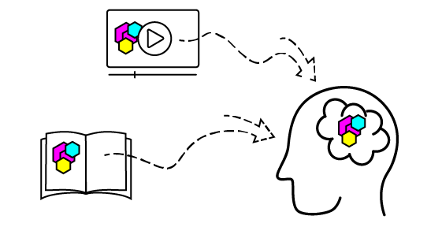

# Effective Learning Strategies

# Các Chiến lược Học tập Hiệu quả

---

Mô-đun Học tập này nhằm giúp người học hiểu rõ hơn về các chiến lược học tập, đồng thời giới thiệu trước về phong cách giảng dạy của OffSec và những điều sẽ gặp. Sau khi hoàn thành Mô-đun này, người học sẽ có thể lên kế hoạch hiệu quả để tiếp cận tốt nhất các khóa học phía trước.

Hãy điểm qua nhanh lý do vì sao đây là một Mô-đun quan trọng. Những thông tin được đề cập không chỉ giúp người học chuẩn bị để thành công trong quá trình đào tạo sắp tới mà còn hữu ích lâu dài cho các chuyên gia an ninh mạng. Vì cả công nghệ lẫn bức tranh an ninh luôn phát triển và thay đổi (chúng ta sẽ tìm hiểu kỹ hơn ở phần sau), các chuyên gia buộc phải liên tục học hỏi và trưởng thành. Thành công và sự hài lòng trong lĩnh vực này thường gắn liền với khả năng trở thành những người học hiệu quả và thoải mái với việc học.

Chúng ta sẽ đề cập các Đơn vị Học tập sau trong Mô-đun này:

- Lý thuyết Học tập
- Những Thách thức Đặc thù khi Học Kỹ năng Kỹ thuật
- Phương pháp Đào tạo của OffSec
- Nghiên cứu Tình huống về Quyền Thực thi (Executable Permission)
- Các Phương pháp và Chiến lược Phổ biến
- Lời khuyên và Gợi ý cho Kỳ thi
- Các Bước Thực tiễn

---

# 1. Lý thuyết Học tập

---

Hãy bắt đầu với phần thảo luận rất cơ bản về Lý thuyết Học tập. Chúng ta sẽ đưa ra một vài quan sát khái quát về lĩnh vực này và xem xét trạng thái hiện tại của sự hiểu biết (luôn tiến hóa) về cách người học tiếp thu kiến thức.

Nhìn chung, Đơn vị Học tập này và đơn vị kế tiếp sẽ làm rõ một số vấn đề và khó khăn mà cá nhân thường gặp khi học các chủ đề mới.

**Mục tiêu Học tập của Đơn vị này:**

- Hiểu bức tranh tổng quan về mức độ hiểu biết hiện nay của chúng ta đối với giáo dục và lý thuyết giáo dục.
- Nắm được các nguyên lý cơ bản về cơ chế trí nhớ và mã hóa kép (dual encoding).
- Nhận diện một số vấn đề người học thường gặp, bao gồm “Đường cong Quên lãng” (The Curve of Forgetting) và tải nhận thức (cognitive load).

---

## 1.1. Chúng ta Biết Gì và Chưa Biết Gì

---

Mặc dù con người luôn dạy và học, chỉ mới gần đây (trong khoảng 100 năm trở lại đây) chúng ta mới bắt đầu nghiên cứu có hệ thống về lý thuyết học tập.

Một phần nghiên cứu tập trung vào chính cấu trúc và mục đích của nhà trường. Chẳng hạn, rất nhiều công trình bàn về sĩ số lớp học “lý tưởng”, liệu hoạt động trong giờ thể dục có thể giúp người học ở lớp khoa học hay không, v.v. Dù những nghiên cứu này thoạt nhìn có vẻ không sát với trọng tâm an ninh mạng, một vài khía cạnh then chốt vẫn rất đáng lưu ý.

**Thứ nhất**, việc học không hoàn toàn phụ thuộc vào bản thân người học. Giáo viên, học liệu, hình thức đào tạo và nhiều yếu tố khác tác động đến thành công còn mạnh hơn “năng lực thô” của người học. Thành tích quá khứ là một chỉ báo kém cho thành công tương lai, và các sự kiện/hoàn cảnh bên ngoài có thể ảnh hưởng mạnh đến hiệu suất học tập.

**Thứ hai**, khi liên tục xuất hiện các nghiên cứu giáo dục mới, rõ ràng vẫn còn rất nhiều điều cần khám phá về “cơ chế” trí nhớ của chúng ta. Điều này bao gồm các kết quả cho thấy “kiểu học tập” (learning styles/modes) có lẽ là một huyền thoại nhiều hơn chúng ta từng nghĩ.

Hai bài viết tiêu biểu về chủ đề này:

- **American Psychological Association - “Belief in Learning Styles Myth May Be Detrimental”** (Niềm tin vào “kiểu học tập” có thể gây hại)
- **Scientific American - “The Problem with ‘Learning Styles’”** (Vấn đề với “kiểu học tập”)

Với tinh thần đó, tại OffSec chúng tôi thiết kế khóa học dựa trên những nghiên cứu học thuật hiện hành, vững chắc về lý thuyết học tập - vì mục tiêu là trở thành những người học suốt đời. Chúng tôi thường xuyên rà soát các công trình mới và không ngừng tìm cách cải tiến phương pháp.

Với vai trò giảng viên, mục tiêu tối hậu của chúng tôi là tạo ra một môi trường học tập hiệu quả cao, giúp người học xuất sắc trong lĩnh vực an ninh thông tin luôn thay đổi - bất kể kinh nghiệm hay thành tích quá khứ.

Tuy nhiên, trước khi bàn đến các chiến lược thực tiễn hơn, hãy cùng điểm qua một số nghiên cứu hiện tại trong lĩnh vực lý thuyết học tập để hiểu cách áp dụng tối ưu.

---

## 1.2. Cơ chế Trí nhớ và Mã hóa Kép

---

Nghĩ về giáo dục như một tổng thể có thể hơi “quá tải”, nên trước hết hãy đơn giản hóa. Một cách để chứng minh ta “đã học” là: ta tạo được ký ức và truy hồi (nhớ lại) được nó.

Ví dụ, ta học lệnh đổi tên tệp trong Linux: `mv oldfilename.txt newfilename.txt`. Sau này, khi cần đổi tên tệp trên máy (không có giáo trình bên cạnh), ta hi vọng sẽ nhớ đúng cú pháp này. Lý tưởng nhất là chỉ từ trí nhớ, ta nhập lệnh và đổi tên thành công.

Có rất nhiều nghiên cứu về cách trí nhớ vận hành, cách tạo ký ức mạnh và học kỹ năng mới. Toàn bộ chi tiết vượt phạm vi Mô-đun này, nhưng có thể tóm tắt: ta cải thiện trí nhớ bằng cách:

- **Cải thiện chất lượng thông tin đầu vào**
- **Cải thiện cách thức/kênh tiếp nhận thông tin**
- **Cải thiện việc luyện tập truy hồi thông tin**

Ta sẽ đào sâu từng điểm sau, còn hiện tại điểm nhanh:

**Cải thiện chất lượng thông tin đầu vào:** Ở mức cơ bản, tài liệu đào tạo phải **chính xác**. Ta có thể cần các đoạn giải thích (như đoạn này), viết **đơn giản, dễ hiểu**. Trách nhiệm này thường thuộc về giảng viên/đơn vị đào tạo.

**Cải thiện cách thức/kênh tiếp nhận thông tin:** Có thể áp dụng nhiều cách. Thông tin thường **dễ ghi nhớ hơn** nếu được trình bày qua **nhiều định dạng** (video, hình ảnh…). Điều này cũng bao gồm **môi trường học không xao nhãng**.

**Cải thiện việc luyện tập truy hồi thông tin:** Thoạt nhìn giống “luyện thi”, nhưng không chỉ thế. Người học **đọc** đoạn hướng dẫn cách tạo tệp rồi **tự làm theo** để tạo tệp độc lập - chính là đang **luyện truy hồi**.

Càng cải thiện ở **ba mảng** này, ta càng nhớ lâu và học tốt. Ta cũng biết rằng **lặp lại thông tin** đồng thời **thay đổi cách truyền tải** cũng rất hữu ích.

Việc tiếp nhận **cùng một thông tin** qua **một phương thức thứ hai** - ví dụ đọc lời giải thích rồi **xem video** về đúng Mô-đun đó - được gọi là **Mã hóa Kép (Dual Coding)**. Nguyên lý cơ bản: **học đi học lại cùng nội dung bằng các kênh khác nhau** sẽ **tăng khả năng ghi nhớ**.



Hình minh họa ở phía trên không chỉ mô tả Dual Coding; **bản thân nó là một ví dụ Dual Coding**: kết hợp **văn bản** giải thích với **hình ảnh** minh họa giúp thông tin **in sâu** hơn vào não.

Ngày càng có nhiều nghiên cứu - bao gồm **thí nghiệm lặp lại được** và **bằng chứng từ kỹ thuật chụp não** - ủng hộ **Dual Coding** như một **chiến lược học tập hiệu quả**.

---

## 1.3. Đường cong Quên lãng và Tải Nhận thức

---

Trong một câu chuyện hư cấu của Jorge Luis Borges, nhân vật **Funes the Memorious** có thể ghi nhớ chi tiết sống động mọi thứ anh ta chứng kiến. Tiếc là hầu hết chúng ta không có “món quà” đó. Hai vấn đề phổ biến nhất khi ta cố học (hay tạo ký ức) là **“quá lâu rồi”** hoặc **“quá nhiều thông tin cùng lúc”**.

Hãy bắt đầu với vấn đề **quên lãng**. Năm 1885, nhà khoa học học tập **Hermann Ebbinghaus** tự học thuộc một số tài liệu rồi tự kiểm tra nhiều lần. Ông chỉ có thể nhớ **đầy đủ** chi tiết nếu kiểm tra **ngay lập tức** sau khi ghi nhớ. Ebbinghaus nhận thấy mình nhớ **100%** thông tin tại thời điểm tiếp thu. Sau đó, ông bắt đầu quên rất nhanh. Khi chờ **20 phút**, ông chỉ còn nhớ **58%**. **Một ngày** sau, chỉ còn **23%**. Ông gọi sự suy giảm này là **Đường cong Quên lãng** (*The Forgetting Curve*).


May mắn là gần **150 năm** sau, hầu hết chúng ta có các **công cụ tìm kiếm** và nhiều trợ giúp khác mà Ebbinghaus không có. Ví dụ, nếu quên lệnh đổi tên tệp trong Linux như `mv oldfilename.txt newfilename.txt`, ta có thể **tìm Google** nhanh chóng.

Điều này thật tuyệt vì nó có nghĩa **cách học** của ta **không nhất thiết** phải xoay quanh việc **học vẹt các sự kiện**. Thay vào đó, ta có thể chuyển trọng tâm sang **học phương pháp** (trong ví dụ này, phương pháp có thể là “Google lệnh mình cần”).

Vấn đề thứ hai - chúng ta đã gọi là **“quá nhiều thông tin cùng lúc”** - thường được gọi là **tải nhận thức** (*Cognitive Load*).

Để hiểu rõ hơn **tải nhận thức**, hãy hình dung não bộ như **một căn phòng**, trong đó các mảnh thông tin (chiếm chỗ) **ra vào liên tục**. Đến một lúc nào đó, nếu càng lúc càng nhiều thông tin đi vào, **không còn đủ chỗ** để mọi thứ được sắp xếp ngăn nắp. Chẳng mấy chốc, **phòng quá đầy** và không còn khoảng trống để thêm thứ mới.

Để khắc phục, giảng viên có thể giảm bớt thứ gọi là **“tải ngoại lai”** (*extraneous load*) - tức **những thông tin thừa**, **không quan trọng** hoặc **không cần thiết**.

Quay lại ví dụ đổi tên tệp. Hãy tưởng tượng giảng viên còn giải thích rằng lệnh này **giống hệt** như lệnh dùng để **di chuyển tệp** đến **chính thư mục hiện tại** rồi đặt tên mới. Dù **đúng về mặt kỹ thuật**, thông tin này **không giúp** ta hiểu việc đổi tên tốt hơn. Ngược lại, cố gắng lĩnh hội ý **“di chuyển về đúng chỗ cũ”** có thể **chiếm thêm dung lượng tinh thần**, **cản trở** việc học.

Dễ hình dung **tài liệu giảng dạy rối rắm** sẽ làm tăng tải nhận thức; nhưng điều tương tự cũng đúng với **không gian lớp học/môi trường** nơi người học hiện diện. Một **quán cà phê ồn** chứa đầy mùi hương, cuộc trò chuyện, người qua lại, chuyển động - tất cả đều **được não tiếp nhận** liên tục. Với **học trực tuyến**, người học có thể cần **giảm tải ngoại lai** ngay trong **không gian vật lý** nơi họ học. Ta sẽ bàn thêm ở phần sau.

Giờ hãy **tạm dừng** ngắn và **ôn lại** những gì đã học qua một chuỗi câu hỏi.

---

## Labs

---

1. Phần lớn nghiên cứu giáo dục tập trung vào nhóm đối tượng nào? (Trả lời bằng một ký tự)
    
    A. Trẻ em trong độ tuổi đi học
    
    B. Thợ rèn thời Trung Cổ
    
    C. Những người đã đi làm
    
    D. Hacker
    
    → **A**
    
2. Để hỗ trợ ghi nhớ, tài liệu có thể được trình bày đồng thời bằng văn bản và video. Phương pháp học này gọi là gì?
    
    → **Dual Coding (Mã hóa kép)**
    
3. Ebbinghaus ghi nhận rằng sau 20 phút, chúng ta quên khoảng bao nhiêu? (Trả lời bằng một ký tự)
    
    A. Mất dưới 10% thông tin.
    
    B. Mất khoảng 40% những gì đã ghi nhớ.
    
    C. Mất 95% thông tin sau 20 phút.
    
    D. Không mất gì; sau 40 phút mới bắt đầu giảm.
    
    → **B**
    
4. Thuật ngữ “Tải nhận thức” (Cognitive Load) mô tả điều nào sau đây? (Trả lời bằng một ký tự)
    
    A. Các lĩnh vực chuyên môn của một người.
    
    B. Gánh nặng cảm xúc của người “biết quá nhiều”.
    
    C. Mức độ khó khi học một thứ gì đó.
    
    D. Lượng nội dung hữu hạn mà người học có thể giữ trong một phiên học.
    
    → **D**
    

---

# 2. Những thách thức đặc thù khi học kỹ năng kỹ thuật

---

Tiếp theo, hãy cùng xem xét một số **thách thức đặc biệt** mà chúng ta sẽ gặp phải khi cố gắng học các **kỹ năng kỹ thuật**.

**Đơn vị học tập này bao gồm các Mục tiêu học tập sau:**

- Nhận biết **sự khác biệt và ưu điểm** của các tài liệu học tập kỹ thuật số
- Hiểu **thách thức trong việc chuẩn bị cho các tình huống chưa biết trước**
- Hiểu **các thách thức tiềm ẩn của việc học từ xa hoặc học không đồng bộ**

---

## 2.1. Tài liệu số vs. Tài liệu in

---

Hãy xem xét sự khác biệt giữa việc học trên Offensive Security Portal và những trải nghiệm học tập truyền thống hơn như đọc sách. Các kỹ năng kỹ thuật như lập trình thường được dạy bằng tài liệu trên **cùng môi trường** nơi công việc thực hành diễn ra (màn hình). OffSec Library cũng đi theo cách này.

Đã có một số nghiên cứu về sự khác biệt giữa học trên màn hình và học từ sách ([https://healthland.time.com/2012/03/14/do-e-books-impair-memory/](https://healthland.time.com/2012/03/14/do-e-books-impair-memory/)), thậm chí các nhà nghiên cứu còn xem xét **kích thước màn hình** có ảnh hưởng hay không. Thú vị là các kết quả nghiên cứu cho thấy những thông tin liên quan đáng chú ý.

Trong số các phát hiện có việc **màn hình nhỏ có thể khiến việc học khó hơn**, và **người đọc sách giấy thường hiểu thông tin đầy đủ hơn**. Cả hai cách đều có **lợi thế và hạn chế**. Đọc trên màn hình đôi khi gây **mỏi mắt/ quá tải giác quan**. Người học trong bối cảnh số lại dễ dàng tiếp cận nhiều công cụ, như tra cứu nhanh định nghĩa của một từ mới. Ở chiều ngược lại, đọc sách đôi khi buộc ta vào **môi trường ít xao nhãng**, cho phép **tập trung sâu hơn** ([https://www.oxfordlearning.com/reading-online-vs-offline-whats-best-for-learning/](https://www.oxfordlearning.com/reading-online-vs-offline-whats-best-for-learning/)).

Điểm thứ hai - và có lẽ **quan trọng hơn -** liên quan đến khái niệm **Học theo ngữ cảnh (Contextual Learning)** ([https://files.eric.ed.gov/fulltext/ED448304.pdf](https://files.eric.ed.gov/fulltext/ED448304.pdf)). Dù không thể đi sâu trong mô-đun này, khái niệm này gợi ý rằng ngay ở mức trực giác, ta biết **học cách xây một ngôi nhà ngay tại công trường** sẽ dễ hơn.

Nói cách khác, khi **tài liệu đào tạo được trình bày trong cùng ngữ cảnh** với kỹ năng ta đang học, bộ não **ít phải “dịch” hơn** và **dễ tiếp nhận** thông tin mới hơn. Điều này **không** có nghĩa sách về máy tính là vô dụng - chỉ là não ta sẽ **phải làm nhiều việc hơn** để **đồng hóa** thông tin trên trang giấy và **hình dung** chúng trong bối cảnh trên màn hình máy tính.

---

## 2.2. Chuẩn bị cho những điều không thể lường trước

---

Có một thách thức đặc biệt khác mà chúng ta sẽ gặp phải khi học **an ninh mạng** - đó là lĩnh vực này **luôn tập trung vào việc chuẩn bị cho những tình huống không thể dự đoán trước**.

Hãy xem xét một vài ví dụ đơn giản:

Chúng ta có thể học về **Kiến trúc mạng doanh nghiệp (Enterprise Network Architecture)** - nơi phân tích cách một công ty tổ chức máy chủ, máy trạm và thiết bị trong mạng. Tuy nhiên, dù mô-đun đó có chi tiết đến đâu, **nó khó có thể bao quát chính xác cấu trúc mạng** mà ta sẽ gặp trong tương lai.

Trong một mô-đun khác, ta có thể hiểu rõ **một vector tấn công cụ thể**, thậm chí thực hiện được nó trong môi trường lab - nhưng điều đó **không có nghĩa ta sẽ gặp đúng vector đó** trong tất cả các môi trường thực tế sau này.

Ngoài ra, cần nhớ rằng **toàn bộ lĩnh vực an ninh mạng luôn thay đổi không ngừng**. Lỗ hổng mới được phát hiện **liên tục**. Một mạng **an toàn hôm nay có thể không còn an toàn sau sáu tháng**. Vì vậy, người học cần **vượt qua giới hạn của khóa học ban đầu** để tiếp tục hiệu quả trong nghề.

Theo cách này, việc học an ninh mạng giống như học các **kỹ năng chuyển giao (transversal skills)** như **lãnh đạo, giao tiếp, và làm việc nhóm** ([https://ervet-journal.springeropen.com/articles/10.1186/s40461-020-00100-0](https://ervet-journal.springeropen.com/articles/10.1186/s40461-020-00100-0)). Với những kỹ năng này, chúng ta **không thể chỉ ghi nhớ một loạt các bước có sẵn**. Không có quy trình chuẩn đơn giản nào để “xây dựng tinh thần đồng đội tốt hơn”, cũng như không có quy trình cố định để “phát triển một exploit”.

→ Thay vào đó, ta cần **hiểu phương pháp, kỹ thuật và mục đích** đằng sau từng hành động.

Quay lại ví dụ **bảo mật mạng**, ta đã nói rằng *“một mạng an toàn hôm nay có thể không còn an toàn sau sáu tháng”*.

Cách tiếp cận tốt nhất **không phải** là học thuộc một chuỗi bước cố định rồi sáu tháng sau học lại chuỗi mới, mà là **học phương pháp luận và mục tiêu** đằng sau từng bước bảo mật. Khi rủi ro mới xuất hiện, ta **áp dụng cùng phương pháp đó**, **thích nghi và phát triển** theo bối cảnh mối đe dọa thay đổi.

Trong phần sau của mô-đun này, chúng ta sẽ thảo luận về **một số phương pháp tiềm năng** có thể giúp thực hiện điều này hiệu quả hơn.

---

## 2.3. Những thách thức của việc học từ xa và học không đồng bộ

---

Có một khía cạnh khác trong hình thức học tập này mà chúng ta cần xem xét - **đó là việc học trong môi trường từ xa (remote learning)**.

Trong thời kỳ đại dịch COVID-19 toàn cầu, nhiều trường học lần đầu tiên áp dụng hình thức **học trực tuyến**, và người học ở mọi lứa tuổi đã phải đối mặt với những **thách thức mới** ([https://careerwise.minnstate.edu/education/successonline.html](https://careerwise.minnstate.edu/education/successonline.html)) khi cố gắng học qua màn hình máy tính tại nhà.

Ngoài ra, cần lưu ý rằng một số khóa học trực tuyến được tổ chức theo hình thức **không đồng bộ (asynchronous learning)** - nghĩa là giảng viên **không có mặt trực tiếp** trong buổi Zoom hay lớp học để giảng bài, hướng dẫn, hoặc trả lời câu hỏi. Thay vào đó, **người học có thể tham gia vào bất cứ thời điểm hoặc tốc độ nào phù hợp nhất với họ**.

Hình thức học này có **những ưu điểm và hạn chế rõ ràng** mà người học cần nhận thức được:

1. **Những lợi ích từ việc giao tiếp, hỗ trợ đồng học và tinh thần cộng đồng** trong lớp học truyền thống **không còn được đảm bảo**.
2. **Tốc độ và thời gian học tập** giờ đây **phần lớn phụ thuộc vào người học**.

Trong phần tiếp theo, chúng ta sẽ thảo luận **một số giải pháp thực tế** cho vấn đề thứ hai.

Còn để **kết nối với cộng đồng người học rộng hơn**, học viên của **Offensive Security** có thể tham gia **máy chủ Discord của OffSec** ([https://offs.ec/discord](https://offs.ec/discord)) - nơi có cộng đồng học tập năng động và sẵn sàng hỗ trợ lẫn nhau. Ngoài ra, người học cũng có thể tìm đến **các nhóm học tập địa phương hoặc cộng đồng khác**.

Việc **chủ động tìm kiếm sự hỗ trợ và giúp đỡ người khác** không chỉ mang lại lợi ích trong học tập mà còn là **một kỹ năng quý giá vượt ra ngoài lớp học**.

👉 Hãy tạm dừng tại đây để **tổng kết nhanh** những nội dung đã học trong **Đơn vị học tập này**.

---

## Labs

---

1. **Phần này bao gồm tổng quan cấp cao về nhiều nghiên cứu khác nhau. Các nghiên cứu này đi đến kết luận gì?**
    
    A. Có những khác biệt nhỏ nhưng đáng chú ý giữa tài liệu kỹ thuật số và tài liệu in.
    
    B. Việc chuyển đổi ngữ cảnh là khó khăn, nên học “những thứ trên màn hình” bằng chính màn hình có thể hiệu quả hơn học từ sách.
    
    C. Chất lượng nội dung quan trọng hơn nhiều so với định dạng thể hiện.
    
    D. Tất cả các ý trên.
    
    → **D**
    
2. **Phát biểu nào sau đây về việc chuẩn bị cho bối cảnh an ninh thông tin luôn thay đổi là sai?**
    
    A. Việc ghi nhớ và làm theo checklist có thể là điểm khởi đầu tốt, nhưng cần hiểu sâu hơn về phương pháp luận để thích ứng với sự thay đổi không ngừng.
    
    B. Ngay cả một “chuyên gia” trong lĩnh vực an ninh thông tin cụ thể cũng cần liên tục cập nhật và học các kỹ thuật, phương pháp mới.
    
    C. Người học chỉ có thể chuẩn bị cho những tình huống được đề cập trong khóa học.
    
    D. Việc học một mô-đun như “Phân tích mã độc” có nhiều điểm chung với mô-đun “Làm việc nhóm”: trong cả hai trường hợp, ta không thể dự đoán chính xác tình huống sẽ áp dụng kỹ năng mới.
    
    → **C**
    
3. **Phát biểu nào sau đây về thách thức của việc học từ xa, không đồng bộ là sai?**
    
    A. Học từ xa có nhiều thách thức hơn so với việc học trong môi trường lớp học truyền thống.
    
    B. Kết nối với cộng đồng học tập, ví dụ như trên Discord, có thể mang lại sự hỗ trợ đáng kể.
    
    C. Người học trong lớp học truyền thống thường có cộng đồng đồng học sẵn có.
    
    D. Khi không có giảng viên, trách nhiệm của người học sẽ ít hơn.
    
    → **D**
    

---

# 3. Phương pháp đào tạo của OffSec

---

Bây giờ, sau khi chúng ta đã xem xét một số thách thức mà người học sẽ phải đối mặt, hãy cùng tìm hiểu cách mà **cấu trúc và thiết kế của các tài liệu đào tạo OffSec** sẽ giúp chúng ta vượt qua những khó khăn đó.

Chúng ta sẽ **không đi sâu vào mọi chi tiết** liên quan đến việc xây dựng một chương trình đào tạo có ý nghĩa và hữu ích ([nguồn: eric.ed.gov/EJ1092139](https://eric.ed.gov/?id=EJ1092139)).

Thay vào đó, chúng ta sẽ **tập trung vào một vài chiến lược nổi bật** mà người học có thể **trực tiếp tận dụng** trong quá trình học.

**Đơn vị học này bao gồm các mục tiêu học tập sau:**

- Hiểu ý nghĩa của **phương pháp đào tạo minh họa (Demonstrative Methodology)**.
- Hiểu được **thách thức của việc chuẩn bị cho những tình huống không xác định**.
- Hiểu được **các khó khăn tiềm ẩn trong việc học từ xa hoặc học không đồng bộ (asynchronous learning)**.

---

## 3.1. Phương pháp minh họa

---

Như tên gọi gợi ý, sử dụng Phương pháp Minh họa nghĩa là **trình diễn (hoặc thực hiện)** những gì ta kỳ vọng người học có thể làm được. Để minh họa, hãy quay lại ví dụ học cách **đổi tên tệp trong Linux**.

Một cách truyền đạt thông tin rất trực tiếp là:

```
Use the "mv" command.
```

*Liệt kê 1 – Không sử dụng phương pháp minh họa.*

Mặc dù về mặt kỹ thuật là đúng, người học có thể **chưa thật sự hiểu** cách vận dụng thông tin này. Một giảng viên sử dụng phương pháp minh họa sẽ **làm đúng các bước** mà người học nên làm, bao gồm cả **kết quả đầu ra** khi chạy lệnh. Khi đó, thông tin phù hợp hơn nếu được trình bày trong **khối mã**.

Trước khi đưa khối mã, ta sẽ **lập kế hoạch** và nêu chi tiết **các lệnh mới hoặc đáng chú ý** sắp chạy. Ở đây, ta có thể nói rằng sẽ dùng `ls *.txt` để liệt kê mọi tệp `.txt` trong thư mục. Tiếp theo, ta chạy lệnh đổi tên: `mv oldfilename.txt newfilename.txt`. Cuối cùng, ta dùng `ls *.txt` để kiểm tra lệnh có hoạt động hay không.

```bash
kali@kali:~$ ls *.txt
oldfilename.txt

kali@kali:~$ mv oldfilename.txt newfilename.txt

kali@kali:~$ ls *.txt
newfilename.txt
```

*Liệt kê 2 – Đổi tên tệp và kiểm tra kết quả.*

Sau khối mã, ta sẽ **giải thích kết quả**. Trong trường hợp này, ta đã liệt kê các tệp `.txt` và chỉ có một tệp tên `oldfilename.txt`. Sau đó ta chạy lệnh đổi tên và **không nhận được đầu ra -** điều này là bình thường. Cuối cùng, ta kiểm tra lại bằng cách chạy `ls *.txt` lần nữa. Lần này, đầu ra cho thấy tệp `.txt` duy nhất trong thư mục là `newfilename.txt`. Ta có thể thực hiện thêm các bước để đảm bảo **nội dung tệp vẫn như trước**, chỉ **tên tệp** thay đổi.

Mặc dù có vẻ không cần thiết phải bổ sung những phần này, kiểu minh họa và diễn giải như vậy bắt đầu **bộc lộ cách tư duy** mà người học cần rèn luyện. Ở đây, ta **xác minh công việc** và kiểm tra lệnh đã chạy đúng chưa. Dù đó không hẳn là “một phần” của thao tác đổi tên tệp, **hình thành thói quen kiểm tra lại** là một thói quen rất tốt.

Đôi khi tài liệu sẽ chọn **con đường dài hơn** để vừa trình bày kỹ năng mới vừa cung cấp **bối cảnh hữu ích**. Tài liệu cũng có thể **cố ý bộc lộ và thảo luận “lỗi”** của giảng viên và cách điều chỉnh. Việc **trình diễn quy trình tư duy** theo cách này được gọi là **mô hình hóa** (*modeling*), và được phát triển như một phương pháp dạy **kỹ năng tư duy phản biện**.

---

## 3.2. Học thông qua thực hành

---

Làm một việc giúp chúng ta học được nó. Có một lượng nghiên cứu vô cùng phong phú ủng hộ việc học thông qua thực hành như một phương pháp giúp tăng khả năng ghi nhớ và cải thiện tổng thể trải nghiệm giáo dục của người học.([http://pact.cs.cmu.edu/pubs/koedinger,%20Kim,%20Jia,%20McLaughlin,%20Bier%202015.pdf),(https://opentextbc.ca/teachinginadigitalage/chapter/4-4-models-for-teaching-by-doing/),(https://www.the-learning-agency-lab.com/the-learning-curve/learning-by-doing/),(https://www.centreforbrainhealth.ca/news/learning-doing-better-retention-learning-watching/](http://pact.cs.cmu.edu/pubs/koedinger,%20Kim,%20Jia,%20McLaughlin,%20Bier%202015.pdf),(https://opentextbc.ca/teachinginadigitalage/chapter/4-4-models-for-teaching-by-doing/),(https://www.the-learning-agency-lab.com/the-learning-curve/learning-by-doing/),(https://www.centreforbrainhealth.ca/news/learning-doing-better-retention-learning-watching/))

Chúng ta biết phương pháp này hoạt động tốt đối với người học, và OffSec đã áp dụng nó theo một số cách.

1. The Training Materials
2. The Module Exercises
3. The Challenge Labs
4. Proving Grounds

Bản thân tài liệu đào tạo sẽ luôn có xu hướng tập trung vào các kịch bản mà chúng ta có thể làm theo. Có những lúc chúng ta cần thảo luận một chút lý thuyết để có đủ nền tảng đi sâu hơn, nhưng nhìn chung, nếu tài liệu có thể trình bày việc giải quyết một vấn đề, thì kỳ vọng là người học sẽ có thể làm theo. Thường thì một máy ảo (VM) được xây dựng riêng để phục vụ việc này.

Bản thân các Bài tập trong Mô-đun sẽ thường liên quan đến việc làm việc với một VM. Đây là cách tiếp cận thường xuyên nhất trong phạm vi hợp lý, nhưng với một số Mô-đun (ví dụ như mô-đun này) mang tính lý thuyết hơn, các bài tập được trình bày theo dạng câu hỏi và trả lời tiêu chuẩn hơn.

Thư viện OffSec cũng bao gồm các Challenge Labs, đưa các bài tập tiến thêm một bước nữa. Về bản chất, một Challenge Lab là một môi trường gồm các bài luyện tập bổ sung được tạo ra đặc biệt để giúp người học chuẩn bị cho kỳ thi (vốn, như có thể dự đoán, cũng là thực hành). Chúng tôi rất khuyến khích người học tận dụng cơ hội bổ sung này.

Cuối cùng, chúng tôi tận dụng các bài đánh giá và kỳ thi. Đây là các bài tập và môi trường phòng lab có kết nối mạng được thiết kế riêng để chứng minh các kỹ năng mà chúng ta đã học. Vì môi trường thực tế sẽ không cung cấp cho chúng ta chỉ dẫn rõ ràng về những lỗ hổng nào có thể tồn tại trên một hệ thống, chúng tôi không tạo mối liên kết 1:1 giữa một Mô-đun khóa học và một bài đánh giá (ví dụ, chúng tôi không quảng bá liệu một máy có dễ bị leo thang đặc quyền hay không).

Với điều này trong tâm trí, các kỹ năng và phương pháp mà người học sẽ học trong các khóa học được áp dụng trực tiếp cho các môi trường bài đánh giá và kỳ thi.

---

## 3.3. Đối mặt với khó khăn

---

Có một câu nói quen thuộc rằng “practice makes perfect”. Điều đó có thể đúng, nhưng nó đặt ra câu hỏi: thế nào là thực hành lý tưởng?

Hãy xem xét thí nghiệm sau được thực hiện vào năm 1978.([https://pubmed.ncbi.nlm.nih.gov/662537/](https://pubmed.ncbi.nlm.nih.gov/662537/)) Một nhóm trẻ 8 tuổi được chia thành hai nhóm để luyện tập một nhiệm vụ đơn giản: ném một túi đậu nhỏ vào một lỗ mục tiêu. Sau khi được giới thiệu nhiệm vụ với mục tiêu ở khoảng cách ba feet (khoảng 90 cm), các nhóm dành ba tháng tiếp theo để luyện tập. Một nhóm tiếp tục luyện tập với mục tiêu ở cùng khoảng cách đó. Nhóm còn lại nhắm vào một cặp mục tiêu - luyện tập với khoảng cách hai feet (60 cm) và bốn feet (120 cm).

Ở bài kiểm tra cuối cùng, nhiệm vụ là ném túi đậu vào mục tiêu cách ba feet. Nhóm đã dành toàn bộ thời gian luyện tập ở đúng khoảng cách đó đã bị vượt qua bởi nhóm đã luyện tập ở khoảng cách hai và bốn feet.

Nghiên cứu này và các nghiên cứu khác cho thấy rằng sự chật vật không chỉ quan trọng đối với trải nghiệm học tập, mà còn quan trọng hơn sự lặp lại đơn thuần trong việc tạo ra các đường dẫn thần kinh giúp chúng ta học kỹ năng mới.

Sự cần thiết của việc chật vật này đồng nghĩa với việc chúng ta sẽ không thực hiện nhiều sự lặp lại chính xác trong các tài liệu học tập của OffSec. Vì việc học là tự định hướng, những người học muốn có thêm sự lặp lại có thể quay lại các phần cụ thể của tài liệu bao nhiêu lần tùy thích.

Thay vì kiểu lặp lại đó, chúng tôi thường chọn đi đường vòng để đến đích. Ví dụ, chúng tôi có thể thử những thứ không hiệu quả để có thể trải nghiệm hành động tự đứng dậy và thử lại. Đây là tương đương ẩn dụ của việc di chuyển mục tiêu một chút.

Nói một cách đơn giản, chúng tôi cho rằng việc ghi nhớ cú pháp kém quan trọng hơn việc quen với các thách thức và thoải mái với một chút chật vật như một phẩm chất cần thiết đối với người làm trong lĩnh vực an ninh thông tin.

Hãy ghi thêm một lưu ý khác khi đang bàn về chủ đề này. Chúng tôi kỳ vọng hầu như mọi người học sẽ bị “mắc kẹt” ở một thời điểm nào đó trong hành trình học tập của họ. Chúng tôi không xem đó là điều tiêu cực.

Bị mắc kẹt thì không vui, nhưng chúng tôi tin rằng việc thoải mái trong tình huống có thể không có đầy đủ thông tin và xử lý vấn đề là điều then chốt để thành công trong lĩnh vực an ninh mạng. Vì mục tiêu đó, đôi khi chúng tôi vừa đi đường vòng để đến đích (để gặp tình huống “mắc kẹt”) vừa cung cấp các bài tập kỹ thuật yêu cầu người học phải vượt ra ngoài việc lặp lại những nội dung đã được trình bày. Mục tiêu của chúng tôi là giúp bạn luyện tập việc bị mắc kẹt đủ nhiều để bạn trở nên khá thoải mái với việc phục hồi.

Vì mục tiêu đó, chúng tôi đã viết về khái niệm này, mà chúng tôi gọi là Tư duy Try Harder, chi tiết hơn và kèm một số chiến lược cụ thể ở nơi khác.([https://www.offsec.com/offsec/what-it-means-to-try-harder/](https://www.offsec.com/offsec/what-it-means-to-try-harder/))

---

## 3.4. Học theo ngữ cảnh và phương pháp xen kẽ

---

Bất cứ khi nào có thể, tài liệu học tập của OffSec sẽ trình bày một kỹ năng mới như một phần của **kịch bản thực tế**. Điều này có thể khó thực hiện với các kỹ năng cơ bản hơn, như lệnh dùng để đổi tên tệp, nhưng khi chúng ta đi sâu hơn vào tài liệu, chúng ta sẽ thấy mình đang làm việc trong các **tình huống thực hành mô phỏng thế giới thật** nhất có thể.

Giảng dạy theo cách này tốn nhiều thời gian hơn; tuy nhiên, **học kỹ năng mới trong bối cảnh thực tế** giúp **cải thiện đáng kể khả năng ghi nhớ và thành công** của người học.

([https://www.timeshighereducation.com/campus/contextual-learning-linking-learning-real-world](https://www.timeshighereducation.com/campus/contextual-learning-linking-learning-real-world))

Người học cũng có thể nhận thấy rằng khi thông tin được trình bày trong ngữ cảnh, họ **thực sự đang học nhiều thứ cùng một lúc**. Ví dụ, nếu chúng ta đang học về một **phương pháp tấn công** có thể vừa được **thực thi** vừa được **phát hiện** cùng lúc, bộ não của chúng ta có thể **tạo ra nhiều mối liên kết hơn** để giúp việc học hiệu quả hơn.

Phương pháp này được gọi là **interleaving**.

([https://academicaffairs.arizona.edu/l2l-strategy-interleaving](https://academicaffairs.arizona.edu/l2l-strategy-interleaving))

Một lần nữa, chúng ta sẽ kết thúc Đơn vị học này bằng việc **ôn lại một số nội dung đã học**.

---

## Labs

---

1. Thuật ngữ **“Phương pháp minh họa (Demonstration Method)”** có nghĩa là gì?
    
    A. Giảng viên giao một bài kiểm tra để người học thể hiện kỹ năng của mình.
    
    B. Giảng viên **mô phỏng và thực hiện kỹ năng** mà người học đang muốn học.
    
    C. Người học phải thể hiện năng lực trước khi được học tiếp.
    
    D. Người học thể hiện khả năng hiện tại để giảng viên biết nên bắt đầu từ đâu.
    
    → **B**
    
2. Hoạt động nào sau đây trong tài liệu đào tạo của **OffSec** **không cho phép người học tự mình áp dụng kỹ năng theo cách “thực hành”**?
    
    A. Làm theo hướng dẫn trên các máy ảo đi kèm với tài liệu viết.
    
    B. Hoàn thành các bài tập trên máy ảo.
    
    C. Hoàn thành các Challenge Labs (môi trường bài tập ảo) đi kèm một số khóa học.
    
    D. **Xem các video hướng dẫn (video walkthroughs).**
    
    → **D**
    

---

# 4. Nghiên cứu tình huống: `chmod -x chmod`

---

Có thể sẽ hơi khó để hiểu hoàn toàn một số ý tưởng về việc dạy và học khi chúng được trình bày tách biệt khỏi ngữ cảnh. Để quan sát những ý tưởng này “trong thực tế”, hãy cùng dành chút thời gian để tìm hiểu về một khái niệm gọi là **quyền thực thi (executable permissions)**.

(Tham khảo thêm: [The Geek Stuff – Sticky Bit](https://www.thegeekstuff.com/2013/02/sticky-bit/))

Chúng ta sẽ sử dụng chủ đề này như một **nghiên cứu tình huống (case study)** nhằm hiểu rõ hơn cách mà **OffSec** trình bày tài liệu đào tạo, cũng như cách chúng ta có thể tiếp cận việc học.

Ở phần tiếp theo, **bạn không cần lo lắng nếu nội dung có vẻ kỹ thuật hơn khả năng hiện tại của mình**, hoặc nếu bạn không thể theo kịp hoàn toàn.

Ví dụ, chúng ta sẽ bắt đầu bằng câu:

> “Mỗi tệp trong một hệ thống Linux đều có một số thuộc tính đi kèm.”
> 

Nếu bạn chưa biết “máy Linux” là gì, “thuộc tính (properties)” nghĩa là gì, hay thậm chí “tệp (file)” là gì - **điều đó hoàn toàn ổn**.

Chúng ta sẽ bắt đầu với những điều rất cơ bản, sau đó sẽ đi sâu hơn một chút. Nếu bạn đã có kinh nghiệm với Linux, bạn có thể sẽ thấy thú vị với **“câu đố”** mà chúng ta sẽ cùng nhau giải trong quá trình này.

Một lần nữa, **mục tiêu của phần này không phải là học chi tiết về quyền thực thi**, mà là **dùng nó làm ví dụ để thảo luận về cách chúng ta có thể dạy và học một chủ đề kỹ thuật như vậy**.

Mục tiêu học tập của phần này:

1. Xem xét một ví dụ về tài liệu học nói về **quyền thực thi (executable permission)**.
2. Mở rộng kiến thức vượt ra ngoài phần thông tin ban đầu và **giải quyết một vấn đề thực hành**.
3. Hiểu cách **phương pháp giảng dạy của OffSec** được thể hiện trong ví dụ học liệu này.

---

## 4.1. Quyền thực thi là gì?

---

Mỗi tệp trên một máy Linux có một số thuộc tính bổ sung đi kèm. Chúng bao gồm thời điểm tệp được tạo, người dùng nào đã tạo ra nó, những người dùng nào có quyền đọc tệp đó, và thậm chí cả tên của chính tệp.

Quyền đối với tệp đặc biệt quan trọng. Chúng cho biết liệu chúng ta có được phép đọc, ghi, hay thực thi một tệp cụ thể hay không. Chúng ta có thể hiểu từ *ghi* (write) trong ngữ cảnh này là khả năng thực hiện một số thay đổi đối với tệp. Ví dụ, quyền có thể được đặt để không cho phép chúng ta ghi vào một tệp, điều này có thể ngăn tệp bị xóa nhầm. Quyền cũng có thể được đặt để không cho phép chúng ta đọc một tệp có chứa thông tin mà chúng ta không được phép xem.

Những điều này được gọi là **quyền tệp**([https://www.studytonight.com/linux-guide/understanding-file-permissions-in-linux-unix](https://www.studytonight.com/linux-guide/understanding-file-permissions-in-linux-unix)), và chúng liên quan đến một vài loại người dùng có thể có trên máy tính này: **chủ sở hữu tệp**, **nhóm sở hữu người dùng**, và **bất kỳ ai khác**. Các lớp người dùng khác nhau này có thể được cấp (hoặc bị từ chối) quyền đối với từng hành động trong ba hành động ở trên: **đọc**, **ghi**, và **thực thi**. Trong phạm vi của Mô-đun này, chúng ta sẽ chỉ tập trung vào **chủ sở hữu của tệp**, trong trường hợp này là chính chúng ta.

Hãy mở một terminal và xem cách hoạt động trên thực tế. Chúng ta sẽ dùng lệnh **touch**([https://www.geeksforgeeks.org/touch-command-in-linux-with-examples/](https://www.geeksforgeeks.org/touch-command-in-linux-with-examples/)) để tạo một tệp (**newfilename.txt**), thao tác này sẽ tạo tệp và tự động đặt chúng ta làm chủ sở hữu. Sau đó, chúng ta sẽ dùng lệnh liệt kê **ls**([https://www.geeksforgeeks.org/practical-applications-ls-command-linux/](https://www.geeksforgeeks.org/practical-applications-ls-command-linux/)) để thu thập thông tin về tệp, truyền tham số **-l** để tạo danh sách dạng dài bao gồm các quyền của tệp.

```
kali@kali:~$ touch newfilename.txt

kali@kali:~$ ls -l newfilename.txt
-rw-r--r-- 1 kali kali 0 Jun  6 12:31 newfilename.txt
```

**Danh sách 3 - Kiểm tra quyền tệp**

Trong một số tình huống, lệnh **touch** của chúng ta có thể thất bại do **quyền của thư mục**.([https://www.linuxfoundation.org/blog/blog/classic-sysadmin-understanding-linux-file-permissions](https://www.linuxfoundation.org/blog/blog/classic-sysadmin-understanding-linux-file-permissions)) Mặc dù điều này nằm ngoài phạm vi phần giới thiệu này, nhưng hiện tại, đáng để biết rằng quyền của thư mục áp dụng cho tất cả các tệp và thư mục bên trong một thư mục. Nếu quyền của thư mục không cho phép chúng ta tạo tệp tại vị trí này, thì lệnh **touch** rõ ràng sẽ thất bại.

Lệnh **touch** không tạo ra đầu ra. Điều này là bình thường. Đầu ra của lệnh **ls** bao gồm thông tin về quyền như được biểu thị bởi các chữ cái **rwx**, trong đó "**r**" là đọc (*read*), "**w**" là ghi (*write*), và "**x**" là thực thi (*execute*). Dấu gạch ngang (**-**) cho biết lớp người dùng không có quyền tương ứng. Trong trường hợp này, chúng ta có quyền đọc và ghi đối với tệp mới, nhưng không có ký tự "**x**" trong đầu ra, nghĩa là không có lớp nào có quyền thực thi.

Là chủ sở hữu của một tệp cụ thể, chúng ta được cấp mặc định quyền đọc và ghi khi tạo tệp, nhưng không được cấp quyền thực thi. Nói cách khác, nếu **newfilename.txt** là một chương trình, chúng ta sẽ không thể thực thi nó. Đây là một tính năng bảo mật nhỏ nhưng hữu ích nhằm ngăn chúng ta vô tình chạy thứ gì đó mà chúng ta có thể không muốn.

Hãy tiếp tục. Trong kịch bản này, giả sử chúng ta có một chương trình đơn giản sẽ cung cấp danh sách đầy đủ tên nhân viên. Chương trình này là một tập lệnh Python chúng ta đã tạo tên là **find_employee_names.py**. Hãy thử chạy tập lệnh.

```
kali@kali:~$ ./find_employee_names.py
zsh: permission denied: ./find_employee_names.py

kali@kali:~$ ls -l find_employee_names.py
-rw-r--r-- 1 kali kali 206 Jun  7 12:31 find_employee_names.py
```

**Danh sách 4 - Lần thử đầu tiên chạy tập lệnh của chúng ta.**

Chúng ta thử chạy tập lệnh bằng cách đơn giản là nhập tên tệp, **find_employee_names.py**, trong terminal. Phần **./** của lệnh chỉ đơn giản là hướng dẫn hệ thống nơi tìm tệp. Điều này lẽ ra phải hoạt động, nhưng đầu ra lại không như mong đợi. Thông báo lỗi "**zsh: permission denied**" cho biết vì một lý do nào đó, chúng ta không thể thực thi (hay chạy) tập lệnh của mình.

Chúng ta cũng đã chạy cùng lệnh **ls** như trước. Cũng như với tệp mới tạo, không có ký tự "**x**" trong đầu ra, điều đó có nghĩa là chúng ta không có quyền thực thi. Điều này giải thích cho đầu ra "**permission denied**".

Hãy thay đổi quyền thực thi cho tệp này và cấp cho chính mình quyền thực thi tệp (nói cách khác, chạy nó như một chương trình). Chúng ta có thể dùng **`chmod +x`** để thêm quyền thực thi vào tệp tập lệnh của mình. Hãy làm như vậy và thử chạy lại tập lệnh.

```
kali@kali:~$ chmod +x find_employee_names.py

kali@kali:~$ ls -l find_employee_names.py
-rwxr-xr-x 1 kali kali 206 Jun  7 12:31 find_employee_names.py

kali@kali:~$  ./find_employee_names.py
R. Jones
R. Diggs
G. Grice
C. Smith
C. Woods
D. Coles
J. Hunter
L. Hawkins
E. Turner
D. Hill
```

**Danh sách 5 - Lần thử thứ hai sau khi dùng chmod.**

Sau khi tự cấp quyền, chúng ta đã kiểm tra nhanh bằng **ls** để xem đầu ra có thay đổi không. Có! Lần này, đầu ra chứa ký tự "**x**", cho thấy quyền thực thi được cho phép đối với cả ba lớp người dùng.

Tiếp theo, chúng ta chạy lại tập lệnh, và thật may, lần này nhận được đầu ra như mong đợi. Tập lệnh đã cung cấp cho chúng ta danh sách các nhân viên hiện tại.

Bây giờ, hãy đổi lại để chúng ta không còn quyền thực thi tệp nữa. Để thêm quyền, chúng ta đã dùng **chmod +x**, vì vậy lần này, chúng ta sẽ dùng **chmod -x**.

```
kali@kali:~$ chmod -x find_employee_names.py

kali@kali:~$ ./find_employee_names.py
zsh: permission denied: ./find_employee_names.py
```

**Danh sách 6 - Đưa mọi thứ trở lại như ban đầu**

Giờ chúng ta đã quay về điểm xuất phát với cùng thông báo lỗi như trước. Từ thử nghiệm nhỏ này, chúng ta nên có hiểu biết rất cơ bản về **bit quyền thực thi**, công cụ **chmod**, và các tùy chọn **+x** và **-x**.

---

## 4.2. Đi sâu hơn: Gặp phải một vấn đề kỳ lạ

---

Hãy dành chút thời gian để nhắc lại rằng không sao nếu chúng ta không theo kịp tất cả các bước kỹ thuật đã trình bày. Một số ví dụ sau đây được đưa vào đặc biệt để gây hứng thú cho những người học có hiểu biết tốt hơn về Linux.

Hãy tiếp tục khám phá và đẩy việc học của chúng ta xa hơn.

Chúng ta sẽ xem xét thực tế là chính lệnh **chmod** cũng chỉ là một tệp. Nó tuân theo các quy tắc giống như các tệp khác trên hệ thống, bao gồm các quy tắc về quyền. Nó tồn tại ở một vị trí hơi khác (trong thư mục **`/usr/bin/`**) so với tập lệnh của chúng ta, nhưng lý do duy nhất khiến chúng ta có thể chạy lệnh **`chmod +x find_employee_names.py`** là vì tệp `chmod` có các quyền được đặt để cho phép chúng ta chạy nó như một chương trình.

Bây giờ, hãy tự hỏi một câu hỏi thú vị: vì `chmod` là công cụ cho phép chúng ta đặt quyền, vậy chúng ta sẽ làm gì nếu chúng ta **không có quyền thực thi** nó?

May mắn thay, không dễ để vô tình xóa quyền thực thi của chúng ta đối với tệp này. Mặc dù vậy, chúng ta đã làm điều đó trên hệ thống của mình.

Hãy khám phá cách sửa lại tập lệnh của chúng ta. Chúng ta sẽ bắt đầu với tập lệnh đã hoạt động trước đó.

```
kali@kali:~$ ./find_employee_names.py
zsh: permission denied: ./find_employee_names.py

kali@kali:~$ chmod +x find_employee_names.py
zsh: permission denied: chmod
```

**Danh sách 7 - Có điều gì đó không ổn ở đây.**

Trong trường hợp ban đầu này, tập lệnh đơn giản của chúng ta không chạy được. Đây là cùng một vấn đề mà chúng ta đã gặp trước đó. Chúng ta đã thử giải pháp từng hiệu quả trước đây, nhưng lần này chúng ta nhận được một thông báo lỗi mới.

Chúng ta có thể thử chạy `chmod` trên chính tệp `chmod`, nhưng chúng ta sẽ gặp cùng vấn đề. Hãy chạy nó trên **`/usr/bin/chmod`**, vì đây là vị trí cụ thể của tệp.

```
kali@kali:~$ chmod +x /usr/bin/chmod
zsh: permission denied: chmod
```

**Danh sách 8 - Cố gắng chmod tệp nhị phân chmod.**

Một lần nữa quyền của chúng ta bị từ chối, nhưng chúng ta vẫn chưa bế tắc.

Một người học đặc biệt tinh ý có thể hợp lý hỏi tại sao chúng ta cần dùng “**./**” cho tập lệnh Python của mình, nhưng lại không cần cho `chmod`. Câu trả lời, nằm ngoài phạm vi của Mô-đun này, liên quan đến biến môi trường **PATH**. Những người học quan tâm hoặc tò mò có thể tìm hiểu thêm về điều này bằng việc tự nghiên cứu bên ngoài.

Phần lớn thời gian, chúng ta đã kiểm tra quyền bằng cách đơn giản là cố gắng thực thi chương trình. Hãy nhớ lại phương pháp chúng ta đã dùng trước đó để kiểm tra quyền này - sử dụng lệnh **ls** với tùy chọn **-l**. Nếu chúng ta chạy **ls -l** mà không có gì ở cuối, chúng ta sẽ có thể quan sát thông tin cho mọi tệp trong thư mục hiện tại. Vì chúng ta chỉ quan tâm đến một tệp, chúng ta sẽ theo sau lệnh của mình bằng một tên tệp cụ thể.

Hãy chạy lệnh này cho hai tệp khác nhau.

```
kali@kali:~$ ls -l find_employee_names.py
-rw-r--r-- 1 kali kali 206 Jun  7 12:31 find_employee_names.py

kali@kali:~$ ls -l /usr/bin/ls
-rwxr-xr-x 1 root root 147176 Sep 24  2020 /usr/bin/ls
```

**Danh sách 9 - Chạy ls -l trên các tệp khác nhau.**

Trong ví dụ này, chúng ta đã kiểm tra một số thông tin trên hai tệp khác nhau. Chúng ta đã chạy điều này trên tập lệnh Python của mình trước đó và đầu ra thiếu ký tự “x” là điều có thể dự đoán.

Lần thứ hai, chúng ta chạy **ls** trên tệp **ls**. Lần này chúng ta sẽ nhận thấy đầu ra có chứa ký tự “x”. Điều này giải thích tại sao chúng ta không thể chạy **find_employee_names.py**, nhưng lại có thể chạy **ls**.

---

## 4.3. Một giải pháp khả dĩ

---

Có nhiều cách để sửa vấn đề chmod của chúng ta. Giải pháp đơn giản nhất liên quan đến việc tìm một phiên bản “sạch” của tệp chmod và thay thế nó. Các giải pháp phức tạp hơn bao gồm chạy một nhị phân trong ngữ cảnh của một nhị phân khác có quyền đúng. Hãy khám phá một giải pháp khá thú vị.

Chúng ta cần làm những gì tệp chmod của chúng ta có thể làm, nhưng đồng thời chúng ta cũng cần có quyền để làm điều đó. Nói cách khác, mục tiêu cuối cùng của chúng ta là có một tệp có thể làm những gì chmod làm, nhưng lại có quyền của một tệp khác, chẳng hạn như ls.

Chúng ta sẽ bắt đầu bằng cách tạo một bản sao của một tệp mà chúng ta biết có thiết lập quyền như mong muốn. Vì chúng ta đã kiểm tra lệnh ls trước đó, hãy sao chép tệp đó vào một tệp mới tên là chmodfix.

```
kali@kali:~$ cp /usr/bin/ls chmodfix

kali@kali:~$ ls -l chmodfix
-rwxr-xr-x 1 kali kali 147176 Jun  8 08:16 chmodfix
```

**Danh sách 10 - Sao chép tệp bằng cp.**

Tệp chmodfix mới của chúng ta có cùng quyền với tệp chúng ta đã sao chép. Đây là khởi đầu đầy hứa hẹn.

Tệp chmodfix mới là một bản sao hoàn hảo của ls. Nó có thể được chạy giống như ls, có thể dùng cùng các tùy chọn, v.v. Nói cách khác, bất cứ nơi nào chúng ta đã dùng ls, giờ có thể dùng cái này. Hãy thử chạy nó trên chính nó.

```
kali@kali:~$ ./chmodfix -l chmodfix
-rwxr-xr-x 1 kali kali 147176 Jun  8 08:16 chmodfix
```

**Danh sách 11 - Bất cứ điều gì ls làm được, chmodfix cũng làm được.**

Đầu ra giống như trước. Đây là tiến bộ!

Vì điều duy nhất có vẻ “hỏng” với tệp chmod của chúng ta là quyền (theo như chúng ta biết, nội dung tệp tự nó vẫn ổn), hãy thử chỉ sao chép **nội dung** của tệp mà không sao chép quyền. Nói cách khác, chúng ta chỉ cần nội dung tệp - không cần toàn bộ tệp.

Vì chúng ta biết cp sẽ sao chép toàn bộ tệp, chúng ta không thể dùng cách đó. Lệnh **cat**([https://linuxize.com/post/linux-cat-command/](https://linuxize.com/post/linux-cat-command/)) thường được dùng để hiển thị nội dung tệp, vì vậy ta sẽ dùng nó. Thay vì chỉ gửi nội dung tệp để hiển thị trong cửa sổ terminal, chúng ta có thể dùng ký tự “>” để gửi chúng vào tệp chmodfix của mình.

Đầu tiên, chúng ta sẽ chạy ls -l để dễ xác nhận xem nội dung tệp có thay đổi hay không.

```
kali@kali:~$ ls -l chmodfix
-rwxr-xr-x 1 kali kali 147176 Jun  8 08:20 chmodfix

kali@kali:~$ cat /usr/bin/chmod > chmodfix

kali@kali:~$ ls -l chmodfix
-rwxr-xr-x 1 kali kali 64448 Jun  8 08:21 chmodfix
```

**Danh sách 12 - Gửi nội dung của chmod vào chmodfix.**

Trước đó chúng ta đã xem phần -rwxr-xr-x của đầu ra. Chúng ta cũng sẽ nhận thấy một con số, “147176” trong trường hợp của lệnh đầu tiên, trong đầu ra. Số này cho biết kích thước tệp. Sau khi chạy lệnh cat, ta sẽ quan sát rằng tên tệp và quyền vẫn giống trước, nhưng kích thước tệp bây giờ là “64448”. Đầu ra này cho thấy nội dung tệp đã thay đổi, nhưng quyền vẫn nguyên.

Hãy quay trở lại đầu và thử chạy chmodfix +x trên tập lệnh của chúng ta.

```
kali@kali:~$ ./chmodfix +x find_employee_names.py

kali@kali:~$ ./find_employee_names.py
R. Jones
R. Diggs
G. Grice
C. Smith
C. Woods
D. Coles
J. Hunter
L. Hawkins
E. Turner
D. Hill
```

**Danh sách 13 - Cách sửa của chúng ta đã hiệu quả!**

Tuyệt vời! Chúng ta đã phục hồi quyền thực thi cho tập lệnh và chạy nó. Thật nhẹ nhõm khi lại nhận được danh sách nhân viên.

Hãy tiến thêm một bước nữa và khôi phục hệ thống để tránh gặp lại vấn đề này. Hãy thử chạy lệnh chmodfix trên tệp chmod gốc để sửa nó.

```
kali@kali:~$ ./chmodfix +x /usr/bin/chmod
./chmodfix: changing permissions of '/usr/bin/chmod': Operation not permitted
```

**Danh sách 14 - Một chướng ngại khác.**

Chúng ta đã gặp một chướng ngại khác. Chúng ta không có quyền sửa **`/usr/bin/chmod`**.

Người thiết lập hệ thống này đã cấu hình sao cho người dùng bình thường không thể can thiệp vào các tệp hệ thống trong **`/usr/bin/`** (như chmod). Việc sao chép tệp hoặc nội dung tệp rõ ràng được phép, nhưng chúng ta đang cố ghi vào một tệp trong thư mục đó, và chúng ta không có quyền làm điều đó.

Hiện tại chúng ta đang chạy lệnh này với người dùng **kali**. Hãy thử chạy lại lệnh, nhưng lần này với quyền Super User. Để làm điều này, ta sẽ dùng lệnh **sudo**([https://www.baeldung.com/linux/sudo-command](https://www.baeldung.com/linux/sudo-command)), theo sau là lệnh gốc. Hệ thống sẽ nhắc chúng ta nhập mật khẩu.

```
kali@kali:~$ sudo ./chmodfix +x /usr/bin/chmod
[sudo] password for kali:
```

**Danh sách 15 - Yo dawg, I heard you like chmod, so I chmod +x your chmod.**

Lệnh này đã thành công.

Có thể còn quá sớm để tự gọi mình là “hacker”. Tuy nhiên, tìm cách độc đáo để giành được các quyền không tính đến ý định ban đầu của hệ thống là cốt lõi của an ninh mạng. Ví dụ nhanh này là một khởi đầu vững chắc.

---

## 4.4. Phân tích cách tiếp cận này

---

Nếu phần lớn ví dụ trước đây là điều mới đối với bạn, xin chúc mừng! Bạn đã vượt qua phần đầu tiên trong quá trình đào tạo an ninh mạng của mình. Hãy nhớ rằng, các giải pháp và lệnh cụ thể không quan trọng bằng việc hiểu (ở thời điểm này) **cách mà tài liệu được giảng dạy**.

Mặc dù chúng ta đã đề cập đến một phần đơn giản trong tài liệu học, hãy dành chút thời gian để xem xét **cách** mà chúng ta đã dạy phần đó. Chúng ta sẽ làm nổi bật một vài điểm cụ thể sau:

- Sử dụng **phương pháp minh họa (demonstration method)**
- **Học thông qua thực hành (learning by doing)**
- **Kỹ năng, không phải công cụ (the skill, not the tool)**
- **Đan xen (interleaving)**
- **Kỳ vọng điều bất ngờ (expecting the unexpected)**

Hãy nhanh chóng khám phá từng điểm một.

Phương pháp **minh họa** được thể hiện cụ thể trong giọng điệu và cách trình bày của ví dụ, nhưng cũng trong **chuỗi hành động** mà chúng ta thực hiện. Chúng ta không bỏ qua bước nào, kể cả việc xác minh xem giải pháp có hoạt động hay không.

Đáng chú ý, chúng ta gặp “một vấn đề” (không thể thực thi tập lệnh) gần như ngay lập tức - điều này mô phỏng lại trải nghiệm thực tế hàng ngày của người học sau khi khóa học kết thúc.

Nghiên cứu cũng chỉ ra rằng **giải quyết vấn đề** là một chiến lược học tập rất hiệu quả cho cả mức độ hứng thú và khả năng ghi nhớ.

(Tham khảo: [ERIC - Problem Solving as a Learning Strategy](https://files.eric.ed.gov/fulltext/EJ1069715.pdf))

Cách tiếp cận giải quyết vấn đề này được sử dụng có chủ ý xuyên suốt các Mô-đun. Một cách để người học tận dụng điều này là **cố gắng dự đoán kết quả**. Ví dụ, chúng ta có thể thử đoán bước tiếp theo trong quá trình giải quyết vấn đề. Nếu kết quả thực tế khác với dự đoán và chúng ta cảm thấy tò mò, hãy thử nghiệm cách giải của riêng mình!

Đây là một cách tuyệt vời để theo dõi tài liệu, nhưng hãy xem xét điều gì đó **thực tế hơn và trực tiếp hơn**:

**Học bằng cách làm (learning by doing)** cho phép người học chủ động nắm quyền kiểm soát và tăng tốc quá trình phát triển của bản thân.

Cách tốt nhất để làm điều này là **theo dõi và thực hành cùng nội dung**.

Chúng ta có thể thừa nhận rằng trong ví dụ ở Mô-đun này, việc làm theo thủ công sẽ khá khó khăn. Thông thường, một Mô-đun sẽ bao gồm ít nhất một **máy ảo** được cấu hình đặc biệt để người học có thể thực hành theo tài liệu đi kèm. Trong trường hợp này, chúng ta sẽ sử dụng một máy Linux có sẵn tập lệnh **find_employee_names.py**.

Hãy nói về **nơi** và **cách** để thực hành, tập trung vào đoạn mã trong Mô-đun.

Một người học tinh ý có thể nhận thấy rằng tất cả các đoạn mã đều có **phong cách định dạng tương tự**.

Hãy xem lại một ví dụ nhanh:

```
kali@kali:~$ ls -l chmodfix
-rwxr-xr-x 1 kali kali 64448 Jun  8 08:21 chmodfix
```

**Danh sách 16 - Ví dụ về đoạn mã.**

Phần **"kali@kali:~$"** là những gì xuất hiện trên màn hình của người dùng khi họ thực hành theo.

Mọi thứ in **đậm** (trong trường hợp này là `ls -l chmodfix`) là **lệnh** chúng ta có thể nhập vào terminal.

Phần văn bản theo sau là **đầu ra (output)**.

Điều quan trọng là phải hiểu **trọng tâm** nằm ở đâu - điều này đưa chúng ta đến khái niệm **“kỹ năng, không phải công cụ”**.

Nếu bạn đã quen với **chmod**, có thể bạn nhận thấy rằng chúng ta chỉ chọn một trong nhiều cách khác nhau để sử dụng công cụ này.

Ví dụ, chúng ta đã **không đề cập** đến việc quyền của tập lệnh (trước khi được thực thi) có thể được biểu diễn bằng **biểu thức số 644**, và ta có thể sửa bằng cách chạy `chmod 755`.

Tất nhiên, gần như không thể nhớ mọi lệnh và cú pháp cụ thể, và việc dồn nạp quá nhiều thông tin sẽ **tăng tải nhận thức (cognitive load)**, khiến việc ghi nhớ khó khăn hơn.

Ngay cả các nhà nghiên cứu an ninh kỳ cựu cũng thường xuyên phải tra cứu lại, nên chúng ta khuyến khích người học **tập trung vào lý do vì sao chạy lệnh**, thay vì chỉ học thuộc **lệnh nào cần chạy**.

Đôi khi, khi có ý tưởng mới hoặc cơ hội mở rộng kiến thức ngoài tài liệu chính, chúng ta sẽ thêm **chú thích (footnote)**.

Làm quen với việc “tạm rời” vấn đề chính để **tự nghiên cứu** cũng là một kỹ năng quan trọng.

Trong Mô-đun này, đã có nhiều chú thích như vậy, và chúng xuất hiện dưới dạng **số nhỏ trên đầu dòng (superscript)** trong văn bản.

**Đan xen (interleaving)** là điều không thể tránh khỏi với kiểu học thực hành này.

Nhắc lại nhanh: trong giáo dục, **interleaving** là việc **trộn lẫn nhiều chủ đề**.

Trong trường hợp này, chúng ta đã xem qua các lệnh **touch**, **cat**, và **ls**, mặc dù chúng không trực tiếp liên quan đến chủ đề chính. Tuy nhiên, chúng lại có liên quan đến khả năng thao tác chmod và tập lệnh nhân viên của chúng ta.

Một cách khác để nhìn nhận là:

**Tài liệu đào tạo của OffSec được tổ chức xoay quanh các khái niệm (concepts), chứ không phải các lệnh (commands).**

Cuối cùng, **dạy người học cách “kỳ vọng điều bất ngờ”** không phải lúc nào cũng dễ dàng.

Tuy nhiên, chúng ta thường đạt được điều này bằng cách **đi đường vòng** để làm nổi bật những vấn đề thực tế mà người học có thể gặp phải trong công việc.

Mục tiêu là giúp người học hiểu **logic đằng sau quyết định**, chứ không chỉ là ghi nhớ cú pháp hay lệnh.

Trong ví dụ này, chúng ta đã đề cập đến khả năng gặp sự cố với **quyền thư mục (directory permissions)**.

Chúng ta cũng biết rằng lệnh `./chmodfix +x /usr/bin/chmod` sẽ không hoạt động, nhưng vẫn thực hiện và kiểm chứng.

Khi giới thiệu Mô-đun mới, chúng ta thường **đưa vào những kịch bản “bất ngờ”** như vậy, và nhiều **thử thách** cũng bao gồm những kết quả ngoài dự kiến.

Là người học, điều quan trọng là phải **tập quen với việc ở trong những tình huống mình không hiểu hoàn toàn**, và **thử những cách có thể thất bại**.

Cách duy nhất để thực sự chuẩn bị cho “điều bất ngờ” là **trở nên thoải mái trong những tình huống không chắc chắn**.

Không chỉ vậy, chúng ta không thể tránh né những tình huống khiến mình **mắc kẹt**.

Trong an ninh mạng, rất hiếm khi giải pháp đầu tiên hoạt động ngay.

Để phản ánh đúng thực tế của lĩnh vực này, cách tiếp cận của **OffSec** là giảng dạy sao cho người học **phát triển khả năng linh hoạt và bền bỉ**, làm việc với một vấn đề cho đến khi **thoát khỏi bế tắc**.

Thường có nhiều hơn một cách để đạt được mục tiêu, và chúng ta khuyến khích bạn thử **các con đường khác nhau**.

Một người học tò mò có thể hỏi rằng, trong ví dụ trên, liệu có thể đơn giản giải quyết vấn đề bằng cách chạy `sudo chmod +x /usr/bin/chmod` hay không.

Đây chính là kiểu tư duy mà chúng ta khuyến khích - và cũng là lý do tại sao nhiều thử thách được cung cấp trong **môi trường ảo**, nơi người học có thể tự do **thử nghiệm và khám phá**.

Thử một cách tiếp cận không hiệu quả cũng là **một trải nghiệm học tập quý giá**.

Tư duy **“thử và thử lại”** nằm ở **trung tâm triết lý đào tạo của OffSec**.

Và để nhấn mạnh thêm, mục tiêu của chương trình đào tạo **luôn là dạy phương pháp luận và tư duy** - không chỉ là câu trả lời.

Vì Mô-đun học này được thiết kế như một **nghiên cứu tình huống (Case Study)**, nên **các câu hỏi tiếp theo sẽ không liên quan đến nội dung kỹ thuật về quyền thực thi** mà chúng ta vừa đề cập.

---

## Labs

---

1. Câu nào sau đây **không phải** là chiến lược được sử dụng trong phần học này?
    
    A. Trình bày lời giải trước, sau đó mới giải thích lý do và cách hoạt động.
    
    B. Gặp phải vấn đề để có thể quan sát cách khắc phục sự cố.
    
    C. Bao gồm các bước “bổ sung”, như việc xác minh rằng giải pháp của chúng ta đã thành công.
    
    D. Mô phỏng quá trình tư duy cần có để giải quyết vấn đề.
    
    → **A**
    
2. Trong phần Học ngắn này, chúng ta tập trung vào Mô-đun chính là **quyền thực thi**, nhưng cũng đã giới thiệu và thảo luận về các lệnh khác cho phép sao chép tệp và liệt kê thuộc tính tệp. Việc bổ sung thêm các nội dung liên quan như vậy được gọi là chiến lược nào?
    
    A. Mã hóa kép (Dual Coding)
    
    B. Đan xen (Interleaving)
    
    C. Phương pháp minh họa (The Demonstration Method)
    
    D. Đường cong quên lãng của Ebbinghaus (Ebbinghaus' Forgetting Curve)
    
    → B
    
3. Ở một thời điểm trong phần này, chúng ta đã thử chạy một lệnh (**chmod**) trên một tệp nhưng không thành công. Thay vì nhanh chóng bỏ qua hướng đó, chúng ta lại thử chạy **chính lệnh đó trên chính nó**, và cũng không hoạt động.
    
    Dạng **kiên trì lạc quan** như vậy là điều quan trọng cần học. OffSec có một cụm hai từ để chỉ tinh thần này. Đó là gì?
    
    → **Try Harder (Cố gắng hơn nữa)**
    
4. Giả sử trong một Mô-đun bình thường, phần học này sẽ đi kèm với **máy ảo** cho phép người học thực hành theo. Cách tiếp cận được sử dụng ở đây đã giải quyết nhiều thách thức được đề cập trước đó trong Mô-đun. Tuy nhiên, ví dụ này chưa hoàn hảo - vậy **thách thức nào chắc chắn chưa được giải quyết** trong phương pháp giảng dạy này (nhưng có thể được khắc phục bằng cách học chủ động của người học)?
    
    A. Thiếu cơ hội thực hành, làm giảm khả năng ghi nhớ.
    
    B. Quá nhiều thông tin cùng lúc, dẫn đến quá tải nhận thức.
    
    C. Khó khăn khi học những điều mới ở dạng trừu tượng, thiếu ngữ cảnh.
    
    D. Thiếu trải nghiệm với sự thất bại, dẫn đến bối rối khi gặp trở ngại sau này.
    
    → **A**
    

---

# 5. Chiến thuật và Phương pháp Phổ biến

---

Tiếp theo, chúng ta cần suy nghĩ về chiến lược và chiến thuật. Hãy xem xét câu nói sau của Tôn Tử:
                           *Chiến lược mà không có chiến thuật là con đường chậm nhất dẫn đến chiến thắng.* 

                                             *Chiến thuật mà không có chiến lược là tiếng ồn trước thất bại*

Theo nghĩa cơ bản nhất, chúng ta có thể coi chiến lược là tầm nhìn dài hạn, trong khi chiến thuật là những hành động ngắn hạn, tức thời mà chúng ta thực hiện. Chiến lược là bản đồ, còn chiến thuật là những bước đi.

Đối với người học trong một cơ cấu trường lớp chính quy, chiến lược và chiến thuật học tập thường được tích hợp sẵn trong chính cơ cấu của nhà trường. Thời khóa biểu của người học và các Mô-đun học tập, và thậm chí cả cách người học đó sẽ tiếp cận tài liệu học, đều do học khu hoặc giảng viên quyết định.

Khi không có cấu trúc trường học cứng nhắc đó, một sai lầm phổ biến của người học trưởng thành là tiếp cận việc học một cách xuề xòa, không nghĩ về cả chiến thuật lẫn chiến lược. Chẳng hạn, chúng ta có thể biết rằng “ghi chép” là quan trọng, nhưng chính xác thì chúng ta nên viết xuống những gì? Và chúng ta nên làm gì với những ghi chép đó?

Đơn vị Học tập này sẽ trình bày một loạt các chiến thuật cụ thể để người học lựa chọn. Đơn vị Học tập tiếp theo sẽ thảo luận một vài chiến lược mà chúng ta có thể sử dụng để tiếp cận việc học của mình.

Những chiến thuật dưới đây không nhằm là một danh sách đầy đủ hay mang tính áp đặt. Điều hiệu quả với một người học có thể không hiệu quả với người khác. Người học nên tiếp thu các ý tưởng và tự quyết định xem điều gì có thể phù hợp với họ.

Đơn vị Học tập này bao gồm các Mục tiêu Học tập sau:

- Hiểu một phương pháp ghi chép tiềm năng gọi là Ghi chú Cornell
- Tìm hiểu về Luyện tập Hồi tưởng
- Hiểu Luyện tập Giãn cách
- Khám phá Phương pháp SQ3R và PQ4R
- Xem xét Kỹ thuật Feynman
- Hiểu Hệ thống Leitner

Vì Đơn vị Học tập này được định hướng như một danh sách tham khảo về các chiến thuật, chúng tôi sẽ không cung cấp câu hỏi bài tập ở cuối như đã làm với các Đơn vị Học tập khác trong Mô-đun này.

---

## 5.1. Ghi chú Cornell

---

Có rất nhiều hệ thống ghi chép khác nhau. Hãy cùng xem qua một hệ thống gọi là Ghi chú Cornell,([https://lsc.cornell.edu/how-to-study/taking-notes/cornell-note-taking-system/](https://lsc.cornell.edu/how-to-study/taking-notes/cornell-note-taking-system/)) được phát triển bởi một Giáo sư Đại học Cornell tên là Walter Pauk vào những năm 1950. Phương pháp này liên quan đến việc sử dụng bút và giấy, điều này giúp hỗ trợ mã hoá kép (dual coding).

Bước đầu tiên là chia trang giấy thành ba khu vực. Đó là gợi ý (ở bên trái trang), ghi chú (khu vực lớn ở bên phải trang), và tóm tắt (vài dòng ở cuối trang).


                                                         *Hình 3: Minh hoạ Ghi chú Cornell*

Phần gợi ý có thể là những câu hỏi chúng ta có về văn bản hoặc các từ khoá hay cụm từ chính. Để minh hoạ một ví dụ, hãy thảo luận một Mô-đun như băm mật khẩu. Mô-đun này có thể có các thuật ngữ chính cần học như mã hoá một chiều, thêm muối (salting), và bẻ khoá mật khẩu. Chúng ta cũng có thể có một câu hỏi, ví dụ, “Một số phương pháp băm có tốt hơn những phương pháp khác không?”

Phần ghi chú cho trang đó nên liên quan trực tiếp đến các mục trong phần gợi ý. Ví dụ, gần chỗ chúng ta đã viết “mã hoá một chiều”, chúng ta có thể viết một định nghĩa dạng dài về ý nghĩa của thuật ngữ này.

Cuối cùng, chúng ta sẽ hoàn thành phần tóm tắt khi xem lại ghi chú. Tiếp tục ví dụ, chúng ta có thể viết “băm mật khẩu = bảo vệ bổ sung. Quan tâm tìm hiểu thêm về bẻ khoá.” Nội dung ở đây không nhất thiết phải liên quan trực tiếp đến tài liệu

- Đây là cơ hội để phản tư về mối quan tâm của chính chúng ta, kiến thức, và cả trải nghiệm học tập. Sau này trong Mô-đun, chúng ta sẽ khám phá cách mà tự phản tư có thể hữu ích.

---

## 5.2. Luyện tập Hồi tưởng

---

Luyện tập Hồi tưởng, như tên gọi của nó, là việc thực hành xác định xem thông tin có thể được nhớ lại hay không.

([https://psychology.ucsd.edu/undergraduate-program/undergraduate-resources/academic-writing-resources/effective-studying/retrieval-practice.html](https://psychology.ucsd.edu/undergraduate-program/undergraduate-resources/academic-writing-resources/effective-studying/retrieval-practice.html)),

([https://www.learningscientists.org/blog/2016/6/23-1](https://www.learningscientists.org/blog/2016/6/23-1))

Chúng ta có thể hiểu đơn giản điều này như việc tự kiểm tra bản thân.

Phương pháp này có thể được thực hiện dưới nhiều hình thức khác nhau, bao gồm việc che phần ghi chú của mình và cố gắng nhớ lại những gì đã viết, hoặc tạo ra các thử thách hay thẻ ghi nhớ (flashcards).

Hãy nói về thẻ ghi nhớ trước.

Hệ thống Leitner ([https://www.mindedge.com/learning-science/the-leitner-system-how-does-it-work/](https://www.mindedge.com/learning-science/the-leitner-system-how-does-it-work/)) được đặt theo tên của nhà khoa học người Đức Sebastian Leitner và liên quan đến việc tạo các thẻ ghi nhớ như một phương pháp ôn tập và lặp lại việc học. Cả hành động tạo thẻ và việc luyện tập với thẻ ghi nhớ đều có thể cực kỳ hữu ích.

Một thẻ ghi nhớ là một tấm thẻ nhỏ bằng giấy có câu hỏi hoặc thuật ngữ ở một mặt, và câu trả lời hoặc định nghĩa ở mặt còn lại. Việc luyện tập bao gồm đọc câu hỏi và đoán câu trả lời.

Có rất nhiều ứng dụng có thể giúp tạo thẻ ghi nhớ, nhưng hãy cân nhắc lợi ích của việc sử dụng những tấm thẻ nhỏ và một cây bút hoặc bút chì để tự tạo. Hành động viết ra thông tin và tạo thẻ ghi nhớ của riêng mình chính là ví dụ điển hình của mã hoá kép (dual coding).

Phương pháp này có thể được sử dụng theo nhiều cách khác nhau, nhưng thường tận dụng tối đa Luyện tập Giãn cách, cũng như việc xáo trộn các thẻ và ôn lại những thẻ khác nhau vào các ngày khác nhau.

Hệ thống Leitner không đặc biệt hữu ích cho việc học các phương pháp luận hoặc kỹ năng giải quyết vấn đề, nhưng lại rất hữu ích khi cần ghi nhớ các chi tiết, chẳng hạn như cú pháp của một công cụ cụ thể.

Việc tạo ra các thử thách thực tế có thể khó khăn. Người học có một vài lựa chọn ở đây.

Cách rõ ràng nhất là hoàn thành các thử thách được bao gồm trong mỗi Mô-đun. Bất cứ khi nào có thể, những thử thách này không chỉ đơn giản lặp lại thông tin hoặc phương pháp trong Mô-đun, mà yêu cầu người học tiến thêm một bước nữa.

Một lựa chọn khác là quay lại một bài thực hành đã hoàn thành và làm lại nó.

Cuối cùng, một số khóa học bao gồm các phòng thí nghiệm thử thách (challenge labs), là những máy ảo cho phép người học thực hành hồi tưởng hoặc tự kiểm tra theo cách thực hành hơn.

---

## 5.3. Luyện tập Giãn cách

---

Nhiều người học đã từng có trải nghiệm “nhồi nhét” - tức là thức khuya để học và cố gắng ghi nhớ thật nhiều thông tin vào đêm trước một kỳ thi lớn. Bất kỳ ai từng thử phương pháp này đều có thể xác nhận rằng nó kém hiệu quả như thế nào, đặc biệt chỉ vài ngày sau khi kỳ thi kết thúc.

Luyện tập giãn cách ([https://www.learningscientists.org/blog/2016/7/21-1](https://www.learningscientists.org/blog/2016/7/21-1)) là điều ngược lại với kiểu học này.

Luyện tập giãn cách liên quan đến **thời điểm và thời lượng** của thời gian học.

Người ta khuyến nghị nên **trải đều thời gian học trong nhiều ngày hoặc nhiều tuần**, thay vì dồn toàn bộ vào một lần.

Các buổi học dài theo kiểu “nhồi nhét” thực ra tốn nhiều thời gian hơn, thường ảnh hưởng đến giấc ngủ, và (vì làm quá tải nhận thức của chúng ta) **kém hiệu quả hơn rất nhiều**.

Thời lượng chính xác và khoảng cách giữa các buổi học sẽ khác nhau đối với từng cá nhân.

**Việc nghỉ giải lao và rời khỏi màn hình máy tính trong 5 hoặc 10 phút có thể rất hữu ích.**

Hãy ngủ trưa hoặc nghỉ ngơi. Làm một hoạt động **hoàn toàn không liên quan đến việc học** cũng là một cách để thực hành giãn cách hiệu quả.

---

## 5.4. Phương pháp SQ3R

---

Phương pháp SQ3R ([https://ucc.vt.edu/academic_support/study_skills_information/sq3r_reading-study_system.html](https://ucc.vt.edu/academic_support/study_skills_information/sq3r_reading-study_system.html)) hướng dẫn người học tuân theo một chuỗi hoạt động học tập gồm: **Survey (khảo sát), Question (đặt câu hỏi), Read (đọc), Recite (nhắc lại), Review (ôn tập)**.

Chúng ta sẽ trình bày chi tiết phương pháp SQ3R tại đây, nhưng cần lưu ý rằng nó **rất giống với phương pháp PQ4R** ([https://www.verywellfamily.com/strategy-improves-reading-comprehension-2162266](https://www.verywellfamily.com/strategy-improves-reading-comprehension-2162266)), một phương pháp hữu ích cho việc **hiểu nội dung khi đọc**.

Những người học thấy chiến thuật sau đây hiệu quả có thể muốn tìm hiểu thêm về phương pháp PQ4R.

Người học bắt đầu bằng cách **khảo sát (survey)** Mô-đun, hoặc xem qua bản phác thảo tổng quan, lướt qua tài liệu sẽ được đề cập trong buổi học.

Đặc biệt, cần chú ý xem qua **phần văn bản được tô sáng, sơ đồ và tiêu đề**.

Ví dụ, trong trường hợp Mô-đun hiện tại, người học có thể thấy các tiêu đề và tiêu đề phụ khác nhau như: *Lý thuyết học tập (Learning Theory)*, *Thách thức đặc thù trong việc học kỹ năng kỹ thuật (Unique Challenges to Learning Technical Skills)*, *Phương pháp đào tạo của OffSec (OffSec Training Methodology)*, v.v...

Sau đó, họ có thể xem xét các tiêu đề phụ chi tiết hơn.

Tiếp theo, người học sẽ **tạo ra (tốt nhất là bằng văn bản)** một danh sách các câu hỏi mà họ hy vọng sẽ được trả lời thông qua tài liệu học.

Những câu hỏi này có thể đúng hoặc không đúng với nội dung thực sự được trình bày, nhưng **nên được xây dựng chủ yếu dựa trên bước khảo sát ban đầu**.

Đây là một bước **rất quan trọng**, vì người học sẽ quay lại các câu hỏi này nhiều lần trong quá trình học.

Tiếp theo, người học **đọc (read)** tài liệu từng phần một.

Nếu có video hoặc hoạt động kèm theo cho phần đó, họ cũng có thể hoàn thành chúng.

Sau đó, người học **quay lại danh sách câu hỏi** của phần nhỏ đó.

Họ nên cố gắng **nhắc lại (recite)** các câu hỏi từ trí nhớ và xác định xem giờ đây họ có thể trả lời được chúng hay chưa.

Cuối cùng, trong bước **ôn tập (review)**, người học quay lại **tất cả các phần nhỏ trong một Mô-đun hoặc chương lớn hơn** để kiểm tra xem các câu hỏi đã được trả lời hay chưa và liệu họ có thể nhớ lại các câu trả lời không.

Đối với những người học từng được dạy rằng việc ghi chép chỉ đơn giản là “viết lại những gì có vẻ quan trọng”, thì **phương pháp SQ3R là một lựa chọn thay thế hiệu quả hơn rất nhiều**.

---

## 5.5. Kỹ thuật Feynman

---

Kỹ thuật Feynman ([https://fs.blog/feynman-technique/](https://fs.blog/feynman-technique/)) được đặt theo tên Richard Feynman, một nhà vật lý đoạt giải Nobel nổi tiếng với khả năng giải thích những chủ đề phức tạp bằng ngôn ngữ đời thường. Kỹ thuật mang tên ông có bốn bước đơn giản:

1. Học một Module
2. Giải thích nó cho người mới bắt đầu
3. Xác định những chỗ còn thiếu
4. Quay lại học tiếp

Điều làm cho phương pháp học này trở nên độc đáo là Bước 2. Nhiều mô tả về kỹ thuật này dùng ví dụ giải thích Module cho một đứa trẻ chưa quen với nó. Nếu chúng ta không có sẵn một đứa trẻ (hoặc không có đứa trẻ nào chịu lắng nghe lời giải thích, ví dụ như về lập trình mạng), kỹ thuật này vẫn hữu ích.

Trong quá trình giải thích cho trẻ em, chúng ta thay đổi cách dùng từ để làm mọi thứ đơn giản hơn. Chẳng hạn, khi thảo luận về một Cuộc tấn công Brute Force ([https://en.wikipedia.org/wiki/Brute-force_attack](https://en.wikipedia.org/wiki/Brute-force_attack)) với một chuyên gia khác, chúng ta có thể nhanh chóng trượt vào cuộc bàn luận về sức mạnh tính toán khổng lồ cần thiết để bẻ một khóa nhất định. Còn khi giải thích cho một đứa trẻ, ta chỉ cần nói: “đó là cách cứ đoán rất, rất nhiều mật khẩu cho đến khi, hy vọng, một cái sẽ hoạt động.”

Bản thân lời giải thích không quan trọng bằng việc bộ não phải làm để vật lộn với các khái niệm và khiến chúng trở nên dễ hiểu mà không cần biệt ngữ. Tương tự, khi chúng ta rất khó để “bẻ nhỏ” thứ gì đó theo cách này, đó có thể là dấu hiệu cho thấy chính bản thân ta vẫn chưa hiểu nó thật rõ. Tất cả công việc đó giúp chúng ta tăng cường mức độ hiểu biết của chính mình.

---

# 6. Lời khuyên và gợi ý về kỳ thi

---

Chúng ta muốn dành vài phút để bàn về các kỳ thi và bài đánh giá, vì trải nghiệm và cách tiếp cận khi làm bài thi rất khác so với phần còn lại của quá trình học.

Trước hết, cần nói về sự khác biệt giữa hai hình thức này. Một số Lộ trình Học tập của OffSec kết thúc bằng **bài đánh giá tùy chọn** (assessment), thường là một chuỗi bài tập thực hành có giới hạn thời gian. Người học có nhiều tự do trong việc sắp xếp lịch cũng như thi lại bài đánh giá, và có thể hoàn thành các bài tập này rồi nộp đáp án.

Trong những trường hợp khác, các khóa học OffSec kết thúc bằng **kỳ thi có giám thị** (proctored exam), trong đó người học có một khoảng thời gian cố định để hoàn thành một tập thử thách thực hành cụ thể. Vượt qua kỳ thi sẽ nhận được **chứng chỉ OffSec**.

Nội dung của phần này tập trung vào **các kỳ thi** nói riêng, vì chúng tôi biết đây là điểm gây lo lắng cho một số người học. Tuy vậy, nhiều gợi ý đưa ra cũng sẽ hữu ích cho những ai chuẩn bị làm **bài đánh giá**.

Đơn vị học này bao gồm các Mục tiêu Học tập sau:

- Phát triển các chiến lược đối phó với căng thẳng liên quan đến kỳ thi
- Nhận biết khi nào bạn có thể đã sẵn sàng dự thi
- Hiểu một cách tiếp cận thực tiễn đối với các kỳ thi

Phần này được soạn như tài liệu tham khảo dành riêng cho những ai có ý định dự thi. Phần lớn nội dung cũng hữu ích cho các kỳ thi và bài đánh giá ngoài phạm vi đào tạo của OffSec. **Không** có câu hỏi bài tập ở cuối phần này.

---

## 6.1. Đối phó với căng thẳng

---

Chứng chỉ OffSec là **được giành lấy**, không phải **được ban tặng**. Cách nói này là có chủ ý. Sở hữu một chứng chỉ từ OffSec là một thành tựu đáng kể. Bạn không thể “diễn” để về đích hay đoán mò để đạt điểm qua môn.

Với một số người, kỳ thi - và cả những tuần, tháng dẫn đến kỳ thi - có thể trở thành giai đoạn rất căng thẳng. Chúng tôi muốn dành ít phút để đề cập đến trải nghiệm đó ngay bây giờ.

Đã có rất nhiều tài liệu viết về quản lý căng thẳng nói chung, nhưng ở đây chúng ta sẽ tập trung vào **căng thẳng trong các kỳ thi mang tính quyết định**. Có nhiều nguồn tham khảo tuyệt vời xoay quanh **Kỳ thi Luật sư (Bar Exam)** ở Hoa Kỳ. Mỗi bang có yêu cầu riêng, nhưng ví dụ kỳ thi bang California có **5 giờ** dành cho câu hỏi tự luận, một **Bài kiểm tra Thực hành (Performance Test)** kéo dài **1 giờ 30 phút**, và một phần trắc nghiệm bổ sung thường khoảng **200 câu hỏi**. Ngoài ra còn có các chứng chỉ bổ sung chỉ để đủ điều kiện dự thi.

Vì kỳ thi này rất nổi tiếng và nổi tiếng là gây căng thẳng, nên có nhiều nguồn hướng dẫn xuất sắc về cách quản lý trải nghiệm đó. Hãy điểm qua một vài chủ đề chung:

([https://www.kaptest.com/study/bar/getting-mentally-prepared-for-the-bar/](https://www.kaptest.com/study/bar/getting-mentally-prepared-for-the-bar/)), ([https://ms-jd.org/blog/article/dealing-with-bar-exam-stress-and-anxiety](https://ms-jd.org/blog/article/dealing-with-bar-exam-stress-and-anxiety)), ([https://www.americanbar.org/groups/gpsolo/publications/gp_solo/2022/september-october/healthy-lifestyle-tips-lawyers-maintain-wellness-well-being/](https://www.americanbar.org/groups/gpsolo/publications/gp_solo/2022/september-october/healthy-lifestyle-tips-lawyers-maintain-wellness-well-being/))

- **Chăm sóc bản thân**
- **Lên lịch và lập kế hoạch học tập**
- **Nuôi dưỡng tư duy phát triển (growth mindset)**

Trước hết, **không ai có thể kỳ vọng đạt phong độ tốt** khi đang quá đói, quá mệt hoặc mệt bệnh đến mức không thể tiếp tục. Quản lý căng thẳng có thể bắt đầu từ việc **nhận biết tình trạng sinh lý** của bản thân. Thiếu ngủ và chế độ ăn kém có thể khiến ta **bất lợi ngay từ vạch xuất phát**.

**Sự tích cực và lạc quan** cũng rất quan trọng. Đảm bảo rằng ta **có điều gì đó để mong chờ** - dù là một khoảng nghỉ học hay thời gian bên bạn bè - có thể tiếp thêm nhiên liệu khi ta nản chí với việc học. **Phần thưởng** có thể đơn giản như một **cuộc dạo bộ** dễ chịu ngoài thiên nhiên hoặc **ngồi xem một chương trình** yêu thích.

Thứ hai, **tự xây dựng một kế hoạch** là điều then chốt. (Chúng tôi sẽ mô tả chi tiết hơn ngay sau đây.)

Thứ ba, **tư duy phát triển** (growth mindset) có thể **cực kỳ mạnh mẽ** ([https://www.edweek.org/leadership/opinion-carol-dweck-revisits-the-growth-mindset/2015/09](https://www.edweek.org/leadership/opinion-carol-dweck-revisits-the-growth-mindset/2015/09)). Về bản chất, tư duy phát triển liên quan đến **niềm tin vào tiềm năng của chính mình**. Nếu người học tin rằng họ **có khả năng chinh phục** thử thách, họ đã có một **xuất phát điểm vượt trội**. Ngược lại, nếu người học **mặc định sẽ thất bại**, hiếm khi họ “vô tình” thành công.

Trước đó, chúng tôi đã nhắc đến **tư duy “Try Harder”** để mô tả **sự bền bỉ và kiên định**. Tư duy phát triển có thể được mô tả tốt hơn là **tư duy “Chưa… đâu” (Not Yet)**. Một người học gặp tài liệu khó trong quá trình ôn thi căng thẳng rất dễ có cảm giác **“mình không làm nổi bài tập này”** hoặc **“mình không hiểu nổi khái niệm này”**. Nếu dừng ở đó, tác động cảm xúc của kiểu tự nhận thức này có thể **rất tiêu cực**. Ngược lại, cũng người học ấy nhưng với tư duy “Chưa… đâu” sẽ nghĩ, ví dụ: **“Mình *chưa* làm được bài này”**, hoặc **“Mình *chưa* hiểu được khái niệm này.”**

Người học thứ hai **vẫn trung thực** về mức độ hiểu của mình, nhưng giờ đây họ **mở cánh cửa cho thành công trong tương lai**. **Chỉ một từ nhỏ “chưa”** mà có thể **mang sức mạnh lớn lao**.

---

## 6.2. Biết khi nào bạn sẵn sàng

---

Một trong những câu hỏi phổ biến nhất chúng tôi nhận được về kỳ thi là: “Làm sao tôi biết mình đã sẵn sàng?” Đôi khi câu hỏi này ở dạng khác, như: “Tôi có cần làm hết tất cả bài tập để chuẩn bị cho kỳ thi không?” hoặc “Tôi có thể chuẩn bị cho kỳ thi bằng cách hoàn thành một bộ/ một số máy nhất định trên VulnHub không?”

Rất khó để trả lời vì mỗi người học đều khác nhau. Có người có hàng chục năm kinh nghiệm làm việc và chỉ cần ôn nhanh một vài Module là có thể hoàn thành kỳ thi. Người khác thì gần như chưa có nhiều kinh nghiệm thực tế và sẽ phải học chăm hơn.

Vậy nên câu trả lời nhanh nhất là: “còn tùy vào từng cá nhân.” Tuy nhiên, thay vì dừng lại ở đó, hãy nhìn kỹ hơn vào một dữ kiện cụ thể cho thấy có một nhóm người học sở hữu lợi thế rõ rệt trong kỳ thi.

Biểu đồ sau tập trung vào chứng chỉ OSCP. Nó cho thấy mối tương quan trực tiếp giữa mức độ sẵn sàng (làm nhiều máy trong phòng lab PEN-200 hơn) và khả năng vượt qua kỳ thi.


Có lẽ không ngạc nhiên, dành nhiều thời gian chuẩn bị cho kỳ thi thì khả năng thành công càng cao. Đáng tiếc là không có lối tắt ở đây. Như câu nói: “chuẩn bị tốt thì sẽ vượt qua.”

---

## 6.3. Lời khuyên thực tế cho người sắp thi

---

Nhìn chung, chúng tôi khuyến nghị hai chiến lược cho những người chuẩn bị thi:

1. **Chuẩn bị cho kỳ thi**
2. **Hiểu rõ về kỳ thi**

Phần đầu tiên – chuẩn bị – gắn liền với tất cả những gì chúng ta đã đề cập trong Module này.

Mỗi kỳ thi đều bao quát nội dung của khóa học, vì vậy việc đọc kỹ tài liệu, xem video hướng dẫn và làm các bài tập thực hành đều cực kỳ hữu ích. Sử dụng các **chiến lược học hiệu quả** cũng sẽ mang lại lợi thế lớn cho người học.

Chúng tôi cũng khuyên bạn nên **tìm hiểu kỹ về kỳ thi**.

Trang hỗ trợ của OffSec cung cấp mô tả chi tiết cho từng kỳ thi, bao gồm:

- Những gì thí sinh có thể mong đợi,
- Các mẹo hữu ích khi thực hiện **nhiệm vụ liệt kê (enumeration)**,
- Và cách **nộp bằng chứng (proof)** rằng bạn đã hoàn thành các yêu cầu cần thiết.

Các mô tả này được đặt cùng với nhiều tài nguyên khác dành riêng cho từng khóa học:

👉 [OffSec Help – Course-Specific Resources for Learners](https://help.offsec.com/hc/en-us/categories/6965809783316-Course-Specific-Resources-for-Offsec-learners)

Ngoài tài nguyên chính thức, bạn có thể tìm thêm:

- Các **webinar** (hội thảo trực tuyến),
- Các **bài viết blog** có thể tìm kiếm,
- Và các **video trên YouTube** của những người học trước chia sẻ kinh nghiệm thi.

Bước vào kỳ thi với **hiểu biết rõ ràng** về nội dung, cấu trúc và cách thức tiến hành không chỉ giúp **giảm căng thẳng**, mà còn **nâng cao hiệu suất** trong phòng thi.

---

# 7. Các bước thực hành

---

Chúng ta đã thảo luận rất nhiều về các chiến thuật và chiến lược mang tính khái niệm. Bây giờ, đã đến lúc chúng ta suy nghĩ thực tế hơn và lập kế hoạch cho cách tiếp cận của mình đối với khóa học sắp tới.

**Đơn vị học tập này bao gồm các Mục tiêu học tập sau:**

- Xây dựng **chiến lược dài hạn**
- Hiểu cách **phân bổ thời gian học tập hợp lý**
- Học cách và thời điểm **thu hẹp trọng tâm** để đạt hiệu quả cao nhất
- Hiểu được **tầm quan trọng của nhóm bạn học** và **việc tìm kiếm cộng đồng học tập**
- Khám phá **cách tập trung hiệu quả** và **tận dụng các chiến lược học tập đã chứng minh thành công** của bản thân

---

## 7.1. Xây dựng chiến lược dài hạn

---

Việc chọn **một trọng tâm, một Khóa học hoặc một Lộ trình học (Learning Path) cụ thể** là bước đầu tiên mang tính quyết định để xây dựng chiến lược dài hạn. Có **mục tiêu cụ thể** sẽ giúp bạn định hướng các quyết định: học **bao nhiêu**, vào **thời điểm nào**, và chọn **những Module** nào để nghiên cứu.

Hoàn toàn có thể sau **vài tuần** bạn sẽ cần **điều chỉnh hoặc thay đổi** kế hoạch - và điều đó **hoàn toàn bình thường**. Thực tế, những kế hoạch tốt nhất thường cần được tinh chỉnh theo thời gian. Ngược lại, **không có kế hoạch** sẽ khiến bạn học một cách **tùy hứng**, nhặt (rồi bỏ) tài liệu lúc nào tiện.

**Lập kế hoạch** cũng giúp **giảm căng thẳng** đáng kể ([https://healthland.time.com/2011/05/31/study-25-of-happiness-depends-on-stress-management/](https://healthland.time.com/2011/05/31/study-25-of-happiness-depends-on-stress-management/)). Về bản chất, lập kế hoạch giúp ta **hình dung trước điều sẽ xảy ra** thay vì để mọi thứ **xảy ra với ta**; nhờ đó, ta **kiểm soát tình huống** tốt hơn và **giảm lo âu**.

Đáng tiếc là câu nói “**không lập kế hoạch tức là lập kế hoạch cho thất bại**” thường đúng; đôi khi chúng ta **tự đẩy mình** vào một thất bại **căng thẳng và kiệt sức** về mặt cảm xúc.

Hãy dành thêm chút thời gian để xem **kế hoạch ấy cụ thể trông như thế nào**.

---

## 7.2. Sử dụng chiến lược phân bổ thời gian học tập

---

Hãy bắt đầu với **thời điểm học**. Như đã đề cập nhiều lần, **một trong những chiến lược hiệu quả nhất** là **phân bổ thời gian học thành nhiều buổi ngắn**, thay vì **nhồi nhét** thật nhiều kiến thức trong các buổi học dài.

Chiến lược này được gọi là **“Spaced Practice” (Luyện tập giãn cách)** [(tham khảo)](https://psychology.ucsd.edu/undergraduate-program/undergraduate-resources/academic-writing-resources/effective-studying/spaced-practice.html).

Nó yêu cầu bạn **xem lịch cá nhân**, **chọn các khung giờ hợp lý**, và **tuân thủ thời gian biểu**. Ngoài việc tránh các buổi “marathon học tập” bất cứ khi nào có thể, bạn cũng nên cân nhắc một số yếu tố khi chọn thời điểm học phù hợp nhất.

Trước khi đi sâu hơn, cần **thừa nhận thực tế** rằng nhiều người học của chúng ta còn có **công việc, gia đình**, và **nhiều hoạt động cá nhân khác**. Khi chúng tôi gợi ý (như sắp tới) rằng nên học vào **buổi tối**, điều đó **không có nghĩa là ai cũng bắt buộc phải làm vậy** - đây chỉ là một **yếu tố để cân nhắc** khi lên kế hoạch học tập.

Một số nghiên cứu [(Medical News Today)](https://www.medicalnewstoday.com/articles/321161) cho thấy rằng **học trước khi ngủ** có thể là **thời điểm lý tưởng**. Tuy nhiên, **rủi ro** ở đây là bạn dễ **trì hoãn giờ đi ngủ** để học thêm. Trực giác mách bảo rằng **thức khuya để học nhiều hơn** là hiệu quả, nhưng **thiếu ngủ** [(ScienceDaily)](https://www.sciencedaily.com/releases/2019/10/191001083956.htm) lại **làm giảm khả năng ghi nhớ** và **tiếp thu của não bộ**. Vì thế, **lên kế hoạch học cũng phải kèm theo kế hoạch kết thúc buổi học đúng giờ**.

Nếu **giấc ngủ quan trọng** cho việc học, thì **vận động thể chất** cũng quan trọng không kém [(WebMD)](https://www.webmd.com/diet/news/20061103/exercise-fights-fatigue-boosts-energy).

Các hoạt động thể chất cường độ cao **tăng lưu thông máu lên não** và **kích hoạt các nơ-ron trong hồi hải mã** (khu vực xử lý trí nhớ). Ngoài việc cải thiện **sức khỏe não bộ nói chung**, **tập thể dục trước hoặc sau khi học** còn giúp **tăng khả năng ghi nhớ và hồi tưởng** [(Scientific American)](https://www.scientificamerican.com/article/hit-the-gym-after-studying-to-boost-recall/).

---

## 7.3. Thu hẹp trọng tâm học tập

---

Giờ đây khi ta đã biết cách **lên lịch học tập**, hãy tiếp tục xem xét **tổ chức không gian học tập** của mình. Trong một thời gian dài, các nhà khoa học giáo dục đã cố gắng xác định **không gian học lý tưởng**, nhưng vẫn **chưa có sự đồng thuận rõ ràng**. Lý do là bởi một số nghiên cứu [(tham khảo)](https://link.springer.com/content/pdf/10.3758/BF03197465.pdf) cho thấy **việc thay đổi môi trường học thỉnh thoảng lại mang đến lợi ích**.

Có thể một tuần bạn học ở **bàn ăn trong nhà**, và tuần sau lại học ở **bàn yên tĩnh trong thư viện** — điều đó **hoàn toàn bình thường**. Tuy nhiên, **dù bạn học ở đâu**, vẫn có những yếu tố **cốt lõi** mà không gian học cần có.

Một trong những **vấn đề lớn nhất** cần giải quyết là **đa nhiệm (multitasking)**.

Hàng loạt nghiên cứu đã chỉ ra **tác động tiêu cực của việc làm nhiều việc cùng lúc** đối với **khả năng học, hiệu suất làm việc và sức khỏe não bộ** nói chung [(nguồn 1)](https://www.sciencedirect.com/science/article/abs/pii/S036013151100340X), [(nguồn 2)](https://www.forbes.com/sites/travisbradberry/2014/10/08/multitasking-damages-your-brain-and-career-new-studies-suggest/?sh=3cdbceba56ee), [(nguồn 3)](https://hbr.org/2010/12/you-cant-multi-task-so-stop-tr), [(nguồn 4)](https://www.discovermagazine.com/mind/why-multitasking-does-more-harm-than-good).

Dù ta **cảm thấy** như mình **làm được nhiều hơn**, thực tế **hiệu quả lại giảm đáng kể**.

Tạo ra một **không gian học hiệu quả** không chỉ là **tập trung vào một việc**, mà còn là **giảm thiểu tiếng ồn và yếu tố gây xao nhãng**.

Nghe nhạc khi học **có vẻ vô hại**, nhưng việc xử lý âm thanh nền **vẫn chiếm dụng năng lực nhận thức**. Nghiên cứu cho thấy rằng **nghe nhạc nhanh, có lời** thường **ảnh hưởng tiêu cực đến việc học** [(nguồn)](https://www.theguardian.com/teacher-network/2018/mar/14/sound-how-listening-music-hinders-learning-lessons-research).

Tuy nhiên, một số nghiên cứu khác chỉ ra rằng **nhạc chậm, không lời** có thể **hỗ trợ học tập** trong một số trường hợp [(nguồn)](https://www.utm.utoronto.ca/~w3psygs/ThompsonEtAl2012.pdf).

Khi nhạc thật sự giúp ích, có thể là vì nó **che bớt các âm thanh gây nhiễu khác** — chẳng hạn người học ở quán cà phê sẽ **tập trung hơn** với **tai nghe chống ồn**.

Quan trọng là hãy **tạo một không gian học mà bạn cảm thấy dễ chịu**, thoải mái và muốn ở trong đó.

Ngoài ra, **thông báo điện thoại, tin nhắn, email hoặc người xung quanh** cũng là **dạng “đa nhiệm” gây gián đoạn**.

Một vài **thói quen nhỏ**, như **bật chế độ máy bay** hoặc **chọn nơi yên tĩnh hơn**, có thể giúp **tăng đáng kể khả năng tập trung**.

---

## 7.4. Lựa chọn chiến lược học tập

---

Hãy quay lại với các **phương pháp học** đã được giới thiệu trong Module này - như **SQ3R**, **Feynman Technique**, và **Retrieval Practice**.

Giống như việc chọn thời gian và địa điểm học, bạn **hoàn toàn có thể thay đổi chiến lược giữa chừng** hoặc **điều chỉnh dần dần** để tìm ra **phong cách học phù hợp nhất với bản thân**.

Ví dụ:

- Một số học viên **thích đọc trước rồi mới xem video**, trong khi người khác **thích xem video trước**.
- Có người muốn **xem qua các bài tập thử thách (Challenge Exercises)** trước khi đọc lý thuyết.
- Một số khác thích **làm theo từng lệnh ngay trong máy ảo** trong lúc đọc.

Danh sách phương pháp học tập đã đề cập **không phải là toàn bộ**, và bạn có thể **tự kết hợp** các phương pháp để tối ưu.

Điều quan trọng là phải **có kế hoạch và ý thức rõ ràng về chiến lược mình đang dùng**.

Nếu không nhận thức được chiến lược học của mình, ta **khó có thể đánh giá xem nó có hiệu quả hay không.**

---

## 7.5. Tìm cộng đồng học tập

---

Hãy tạm dừng một chút để nói về **sức mạnh tích cực của cộng đồng**.

Học tập trong **một nhóm cộng đồng** mang lại **rất nhiều lợi ích** [(tham khảo)](https://ctl.wustl.edu/resources/benefits-of-group-work/), bao gồm cả **việc phát triển kỹ năng mềm (soft skills)** mới.

Làm việc nhóm giúp người học **rèn luyện kỹ năng xã hội**, điều cần thiết cho môi trường hợp tác.

Ngay cả khi bạn muốn **làm việc độc lập trong tương lai**, những kỹ năng học được từ việc **tương tác nhóm** vẫn **cực kỳ hữu ích cho sự nghiệp**.

Một lợi ích lớn khác là khi ta **giải thích lại khái niệm cho người khác** - đây chính là **cốt lõi của Feynman Technique**.

Việc này không chỉ giúp **người khác hiểu**, mà còn giúp ta **nắm vững bản chất kiến thức**.

Cuối cùng, **niềm vui và sự đồng hành** trong nhóm học tập là yếu tố không thể bỏ qua.

Người Đức có câu **“Geteiltes Leid ist halbes Leid”** - nghĩa là *“Khi chia sẻ nỗi khó, nỗi khó sẽ vơi đi một nửa.”*

Chia sẻ khó khăn trong một khóa học, Module hay bài tập với người khác sẽ khiến ta **cảm thấy nhẹ nhõm hơn nhiều**.

Học viên OffSec có thể:

- **Tham gia các nhóm an toàn thông tin địa phương** hoặc **lập nhóm học riêng với đồng nghiệp**.
- Tham gia **máy chủ Discord của OffSec**, nơi có thể **học tập và thảo luận toàn cầu** cùng học viên khác, **cựu học viên**, **mentor**, và **đội ngũ hỗ trợ OffSec**.

---

## 7.6. Tự đánh giá việc học của chính mình

---

Chúng ta sẽ kết thúc Module này bằng việc xem xét **trách nhiệm của người học không chỉ là học, mà còn là đánh giá cách mình học**.

Vì “lớp học” ở đây được **chính bạn tự thiết kế**, bạn cũng **chịu trách nhiệm đánh giá và cải thiện** phương pháp đó.

Điều này nghe có vẻ nhiều, nhưng thực ra có thể **bắt đầu rất đơn giản**:

👉 **Cuối mỗi buổi học, dành 10 giây để tự đánh giá buổi học đó.**

Chỉ một hành động nhỏ, nhưng có thể **mang lại sự thay đổi lớn**.

Hãy xem hai trường hợp trái ngược nhau để hiểu rõ hơn:

### 🔸 Khi buổi học diễn ra khó khăn

Khoảnh khắc tự phản chiếu giúp bạn **nhìn ra phần kiến thức gây khó khăn nhất**.

Thay vì chỉ nói “bài SQL Injection này khó quá”, hãy **tự hỏi tại sao**:

- Có phải do **kiến thức nền chưa vững**?
- Hay do **mệt, thiếu tập trung, học sai thời điểm**?

Tập trung vào **những yếu tố bạn có thể kiểm soát**, chẳng hạn:

- Bắt đầu học lúc mấy giờ?
- Học trong bao lâu?
- Có bị gián đoạn không?
- Trước khi học bạn đã ăn/uống gì?
- Không gian học yên tĩnh hay ồn ào?
- Trong buổi học bạn làm gì cụ thể?

Những câu hỏi nhỏ này giúp **xác định nguyên nhân cụ thể**.

Ví dụ, nếu bạn phát hiện **ăn quá no trước khi học khiến mình uể oải**, thì lần sau có thể **điều chỉnh lại thời điểm hoặc lượng ăn**.

### 🔹 Khi buổi học diễn ra tốt đẹp

Ngược lại, nếu buổi học **hiệu quả và trôi chảy**, đừng chỉ nghĩ “vì bài SQL Injection thú vị”, mà hãy xem **điều gì giúp bạn học tốt**.

Ví dụ:

> Bạn học 1 tiếng vào buổi sáng, sau bữa sáng nhẹ, ở bàn ăn, có cà phê, dùng phương pháp Feynman.
> 

Nếu đó là **buổi học thành công**, hãy **ghi chú lại** và **tái tạo hoàn cảnh tương tự** cho các buổi học sau.

Cuối cùng, OffSec nhấn mạnh rằng họ **không thể bao quát mọi chiến lược học hiệu quả**, nhưng hy vọng **các nội dung trong Module này** sẽ giúp bạn **học tập chủ động và bền vững hơn**.

Nếu bạn **mới bắt đầu hành trình học tập với OffSec**, xin chúc bạn **may mắn và kiên trì trên con đường chinh phục mục tiêu của mình.**

> 🧩 Bài tập duy nhất trong phần này yêu cầu bạn tự phản tư — hãy sử dụng phần ghi chú của đơn vị học tập (Learning Unit Notes) để viết ra suy nghĩ của mình. Đây là phần riêng tư chỉ mình bạn thấy, hoặc bạn có thể viết ở nơi nào dễ xem lại nhất.
> 

---

## Labs

---

1. Hãy tận dụng phần **“Notes” (Ghi chú)** tại đây và **viết ra một chiến lược học tập mà bạn tin rằng phù hợp với bản thân**.
    
    Nhấn **“Add Note”** và mô tả một kế hoạch vừa **thực tế** vừa **tràn đầy hy vọng** — ví dụ như: bạn muốn học bao lâu mỗi buổi, học bao nhiêu lần trong tuần, và vào thời điểm nào trong ngày bạn tập trung nhất.
    
    Sau khi hoàn thành, **lưu ghi chú** để có thể **quay lại xem và điều chỉnh sau này**.
    
    Cuối cùng, nhập từ khóa **`planned`** làm **câu trả lời** cho câu hỏi này.
    
    → planned