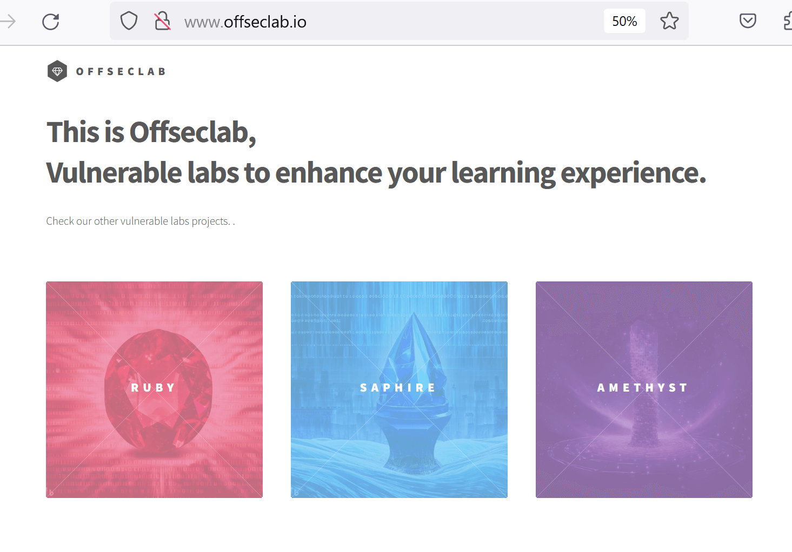

# Enumerating AWS Cloud Infrastructure

# **Enumerating AWS Cloud Infrastructure**

---

Trong Learning Module này, chúng ta sẽ bao gồm các Learning Unit sau:

- Trinh sát các tài nguyên Cloud trên Internet
- Trinh sát thông qua API của nhà cung cấp dịch vụ Cloud
- Trinh sát IAM ban đầu
- Liệt kê các tài nguyên IAM

Là một phần của khóa học **PEN-200**, module này sẽ tập trung vào các kỹ thuật then chốt để thực hiện trinh sát và liệt kê **cụ thể trong Amazon Web Services (AWS)**, một trong những nền tảng cloud được sử dụng rộng rãi nhất.

Trinh sát (reconnaissance), còn được gọi là thu thập thông tin (information gathering), thường là giai đoạn đầu tiên trong các phương pháp kiểm thử xâm nhập hoặc trong chuỗi kill chain của một cuộc tấn công mạng. Đây là một giai đoạn quan trọng vì nó giúp chúng ta khám phá tất cả thông tin có thể thu thập được về mục tiêu nhằm mở rộng bề mặt tấn công của nó.

Trong giai đoạn trinh sát, chúng ta có thể mô tả **enumeration** là quá trình xác định, phân loại và liệt kê các thành phần cũng như tài nguyên trong mục tiêu.

Khi tiến hành các lab, chúng ta sẽ nhận thấy rằng quá trình này mang tính **đệ quy**. Trong khi thực hiện giai đoạn trinh sát và liệt kê, chúng ta có thể xác định được một lỗ hổng cho phép chúng ta truy cập sâu hơn vào môi trường. Khi điều này xảy ra, việc tiến hành lại toàn bộ giai đoạn trinh sát đối với các tài sản mới được phát hiện trở nên cần thiết, với sự hiểu biết và quyền hạn lớn hơn của chúng ta.

Trong Module này, chúng ta sẽ tập trung vào trinh sát và liệt kê các mục tiêu được lưu trữ trên các nhà cung cấp dịch vụ cloud công cộng (Cloud Service Providers – CSPs). Đối với phần thực hành, chúng ta sẽ sử dụng **Amazon Web Services (AWS)** làm môi trường lab.

Trước tiên, chúng ta sẽ tiếp cận từ **góc nhìn bên ngoài**, nghĩa là chỉ phân tích những gì có thể truy cập công khai. Chúng ta sẽ học cách xác định liệu một mục tiêu có đang lưu trữ tài nguyên trên nền tảng cloud hay không, sau đó tiếp tục khám phá các kỹ thuật để liệt kê tài nguyên cloud từ góc nhìn bên ngoài.

Tiếp theo, chúng ta sẽ chuyển sang **góc nhìn bên trong**, hành động như thể chúng ta đã giành được quyền truy cập vào môi trường của mục tiêu. Chúng ta sẽ khám phá cách liệt kê các tài nguyên cloud từ bên trong bằng cách sử dụng API của nhà cung cấp dịch vụ cloud.

Bằng việc hiểu và mô phỏng các kỹ thuật này, chúng ta cũng sẽ thu được những góc nhìn giá trị về cách bảo vệ môi trường cloud một cách hiệu quả.

---

# 1. Về các Public Cloud Labs

---

Trước khi bắt đầu, chúng ta hãy xem qua một tuyên bố miễn trừ trách nhiệm tiêu chuẩn.

Module này sử dụng **Public Cloud Labs của OffSec** cho các thử thách và phần walkthrough. Public Cloud Labs của OffSec là một dạng môi trường lab được thiết kế để bổ trợ cho trải nghiệm học tập thông qua thực hành trực tiếp. Khác với các lab VM phổ biến hơn được sử dụng trong những Learning Module khác của OffSec (trong đó học viên kết nối tới lab thông qua VPN hoặc VM chạy trong trình duyệt), khi sử dụng Public Cloud Labs, học viên sẽ tương tác trực tiếp với môi trường cloud thông qua Internet.

OffSec tin tưởng mạnh mẽ vào những lợi ích của việc học tập và rèn luyện trong môi trường thực hành, và chúng tôi tin rằng Public Cloud Labs của OffSec đại diện cho một cơ hội tuyệt vời cho cả người học mới lẫn các practitioner muốn duy trì và nâng cao kỹ năng.

Vui lòng lưu ý những điểm sau:

- Môi trường lab **không được sử dụng cho các hoạt động không được mô tả hoặc yêu cầu trong tài liệu học tập** mà bạn đang theo dõi. Môi trường này không được thiết kế để làm sân chơi thử nghiệm các nội dung nằm ngoài phạm vi của Learning Module.
- Môi trường lab **không được sử dụng để thực hiện bất kỳ hành động nào đối với các tài sản bên ngoài lab**. Điều này đặc biệt quan trọng vì một số Module có thể mô tả hoặc thậm chí minh họa các cuộc tấn công vào các triển khai cloud dễ bị tổn thương nhằm mục đích giải thích cách các triển khai đó có thể được bảo vệ.
- Các quy định và yêu cầu hiện hành về việc **không chia sẻ tài liệu đào tạo của OffSec vẫn được áp dụng**. Thông tin xác thực và các chi tiết khác của lab không được phép chia sẻ. OffSec theo dõi hoạt động trong Public Cloud Labs (bao gồm cả việc sử dụng tài nguyên) và giám sát các sự kiện bất thường không liên quan đến các hoạt động được mô tả trong learning modules.
- Các hoạt động bị gắn cờ là đáng ngờ sẽ dẫn đến một cuộc điều tra. Nếu cuộc điều tra xác định rằng học viên đã hành động ngoài các nguyên tắc được mô tả ở trên, hoặc cố ý lạm dụng Public Cloud Labs của OffSec, OffSec có thể lựa chọn thu hồi quyền truy cập của học viên vào Public Cloud Labs và/hoặc chấm dứt tài khoản của học viên.
- **Tiến trình giữa các phiên làm việc không được lưu lại**. Lưu ý rằng một Public Cloud Lab khi được khởi động lại sẽ trở về trạng thái ban đầu. Sau khi một giờ trôi qua, Public Cloud Lab sẽ hiển thị lời nhắc để xác định xem phiên làm việc còn đang hoạt động hay không. Nếu không có phản hồi, phiên lab sẽ kết thúc. Học viên có thể chủ động gia hạn phiên làm việc tối đa lên đến mười giờ.

Tài liệu học tập được thiết kế để phù hợp với các giới hạn của môi trường. Không có học viên nào được kỳ vọng hoặc yêu cầu phải hoàn thành toàn bộ các hoạt động trong một Module chỉ trong một phiên lab duy nhất. Tuy vậy, học viên có thể lựa chọn chia nhỏ quá trình học thành nhiều phiên làm việc với lab. Chúng tôi khuyến nghị ghi chú lại chuỗi các lệnh và hành động đã thực hiện trước đó để thuận tiện cho việc khôi phục môi trường lab về trạng thái mà học viên đã dừng lại. Điều này đặc biệt quan trọng khi làm việc với các lab phức tạp yêu cầu nhiều bước thao tác.

---

# 2. Trinh sát các tài nguyên Cloud trên Internet

---

Learning Unit này bao gồm các Learning Objectives sau:

- Thực hiện trinh sát domain và subdomain
- Xác định các domain đặc thù theo từng dịch vụ

Phần đầu trong **định nghĩa của NIST về mô hình điện toán đám mây** nêu rõ:

<aside>
💡

*Điện toán đám mây là một mô hình cho phép truy cập mạng một cách phổ biến, thuận tiện, theo yêu cầu, tới một tập hợp các tài nguyên tính toán có thể cấu hình và được chia sẻ…*

</aside>

Ngoài ra, mô hình này còn có một đặc tính thiết yếu khác:

<aside>
💡

*Khả năng truy cập mạng rộng rãi (Broad network access): Các khả năng được cung cấp thông qua mạng và được truy cập bằng các cơ chế tiêu chuẩn nhằm thúc đẩy việc sử dụng bởi nhiều nền tảng client mỏng hoặc dày khác nhau (ví dụ: điện thoại di động, máy tính bảng, laptop và workstation).*

</aside>

Các thuật ngữ *“phổ biến”* và *“thuận tiện”* trong mô tả, kết hợp với đặc tính *“khả năng truy cập mạng rộng rãi”*, cho thấy một khía cạnh vốn có của việc **truy cập công khai** đối với các tài nguyên cloud.

Mô hình điện toán đám mây đã tiếp tục phát triển kể từ định nghĩa ban đầu đó. Hiện nay, chúng ta có thể tìm thấy các tài nguyên cloud **không được thiết kế để truy cập công khai theo mặc định hoặc thậm chí hoàn toàn không cho phép truy cập công khai**, chẳng hạn như các network interface, virtual disk, v.v. Đây là những thành phần nội bộ của các tài nguyên lớn hơn có giao diện hướng ra Internet, nhưng dù vậy, chúng ta vẫn có thể xem chúng là các tài nguyên cloud. Một số thành phần trong số đó thậm chí còn có khả năng được chia sẻ với những người dùng khác.

Trong Module này, mục tiêu của kẻ tấn công trong giai đoạn discovery và reconnaissance là **tìm ra các tài nguyên có thể truy cập công khai**, cũng như các tài nguyên **không được thiết kế để truy cập công khai** (thường là do cấu hình sai).

Trong Learning Unit này, chúng ta sẽ thảo luận về các kỹ thuật để phát hiện các tài nguyên cloud có thể truy cập được trên mạng công cộng **mà không yêu cầu tương tác xác thực với API của nhà cung cấp dịch vụ cloud (CSP)**.

---

## 2.1. Truy cập Lab

---

Đối với phần thực hành trong Module này, chúng ta sẽ đảm nhận vai trò của kẻ tấn công trong giai đoạn trinh sát, tập trung vào **một tổ chức duy nhất** làm mục tiêu. Không có bất kỳ thông tin nào ngoài tên miền, các bước ban đầu của chúng ta sẽ là thu thập tất cả thông tin có thể có được.

Có một số bước chuẩn bị cần thiết để thiết lập môi trường lab, được trình bày ở cuối phần này. Quá trình triển khai sẽ mất vài phút để hoàn tất và, sau khi hoàn tất, các dịch vụ bổ sung có thể cần từ **5 - 10 phút** để khởi động.

Khi lab hoàn tất quá trình triển khai, chúng ta sẽ nhận được một số thông tin cần thiết để sử dụng trong quá trình làm việc với lab:

- Địa chỉ IP DNS công khai
- Tên miền của mục tiêu
- Thông tin xác thực cho user IAM *attacker*
    - `ACCESS_KEY_ID`
    - `SECRET_ACCESS_KEY`

Trước tiên, chúng ta cần cấu hình DNS trong môi trường cục bộ để sử dụng DNS công khai được thiết lập cho lab này.

Do đây là một bài tập mô phỏng, chúng ta sẽ **không thực hiện bất kỳ hành động nào đối với một domain được công bố thực tế**. Thay vào đó, chúng ta sẽ nhắm tới một DNS công khai tùy chỉnh được triển khai bên trong lab. Tuy nhiên, các kỹ thuật và công cụ được sử dụng vẫn áp dụng cho bất kỳ domain công khai nào. Sau khi lab được khởi động, sẽ mất khoảng **năm phút** để DNS server tùy chỉnh bắt đầu phản hồi. Chúng ta có thể xác nhận rằng tất cả các dịch vụ đã khởi động thành công khi có thể truy vấn DNS server một cách bình thường.

<aside>
💡

Chúng ta cũng cần lưu ý rằng địa chỉ IP công khai của DNS server sẽ **thay đổi mỗi lần khởi động lại lab**, và khi đó chúng ta sẽ cần thực hiện lại cấu hình này.

</aside>

Trên máy Kali, chúng ta có thể kiểm tra DNS server hiện tại bằng cách đọc file `/etc/resolv.conf`.

```
kali@kali:~$ cat /etc/resolv.conf
# Generated by NetworkManager
nameserver 1.1.1.1
```

                                              *Listing 1 – Lấy thông tin DNS server trên máy Kali*

Chúng ta cần thêm một dòng `nameserver` mới ở **đầu file** để các truy vấn DNS của hệ thống trước tiên được gửi tới DNS server của lab. Chúng ta sẽ sử dụng `nano` để chỉnh sửa file, như minh họa bên dưới:

```
kali@kali:~$ sudo nano /etc/resolv.conf
[sudo] password for kali:

kali@kali:~$ cat /etc/resolv.conf
# Generated by NetworkManager
nameserver 44.205.254.229
nameserver 1.1.1.1
```

                                *Listing 2 – Chỉnh sửa /etc/resolv.conf để thêm nameserver mới*

Chúng ta có thể kiểm tra cấu hình bằng các công cụ dòng lệnh như `host`, một công cụ dùng để thực hiện tra cứu DNS và thường được cài đặt sẵn trên Linux.

Giả sử `www.offseclab.io` tồn tại trong domain mục tiêu. Trước hết, chúng ta sẽ chạy truy vấn DNS và **chỉ định trực tiếp địa chỉ IP công khai của DNS server**. Việc này nhằm xác nhận rằng DNS server đang phản hồi đúng như mong đợi.

Tiếp theo, chúng ta sẽ chạy lại truy vấn DNS **không chỉ định DNS server**. Công cụ sẽ sử dụng cấu hình DNS của hệ thống. Điều này giúp xác nhận rằng cấu hình DNS của hệ thống cũng đang hoạt động chính xác.

<aside>
💡

Một số ISP hạn chế khách hàng truy vấn các DNS server bên ngoài. Nếu điều này xảy ra, hai lệnh trong listing bên dưới sẽ bị lỗi. Mặc dù không phổ biến, tình huống này vẫn có thể xảy ra. Một biện pháp khắc phục là sử dụng thiết bị di động làm hotspot để kết nối lab ra Internet. Trong kịch bản xấu nhất, vấn đề này chỉ ảnh hưởng đến khả năng làm việc với phần *Domain Reconnaissance*.

</aside>

```
kali@kali:~$ host www.offseclab.io 44.205.254.229
www.offseclab.io has address 52.70.117.69

kali@kali:~$ host www.offseclab.io 
www.offseclab.io has address 52.70.117.69
```

                                   *Listing 3 – Kiểm tra cấu hình DNS trong Kali bằng công cụ host*

Cuối cùng, chúng ta cần ghi nhớ rằng cấu hình DNS mà chúng ta thiết lập **không mang tính vĩnh viễn**. Cấu hình mạng mặc định trong Kali sử dụng NetworkManager, và dịch vụ này sẽ ghi đè nội dung của file `resolv.conf` mỗi khi chúng ta khởi động lại dịch vụ mạng hoặc toàn bộ hệ điều hành.

Khi hoàn tất việc làm lab, chúng ta cần **khôi phục lại cấu hình DNS** cho máy Kali cục bộ. Để thực hiện điều này, chúng ta có thể chỉnh sửa lại file `/etc/resolv.conf` và xóa dòng `nameserver` đã thêm khi cấu hình lab. Một cách đơn giản hơn là khởi động lại dịch vụ NetworkManager, thao tác này sẽ đưa file về trạng thái ban đầu.

```
kali@kali:~$ sudo systemctl restart NetworkManager
[sudo] password for kali:

kali@kali:~$ cat /etc/resolv.conf
# Generated by NetworkManager
nameserver 1.1.1.1
```

                                                           *Listing 4 – Khôi phục cấu hình DNS*

Chúng ta có thể đảm bảo rằng mọi thứ đang hoạt động đúng như mong đợi bằng cách truy cập bất kỳ website công khai nào thông qua trình duyệt web.

Ở thời điểm này, chúng ta sẽ khởi động lab để lấy **địa chỉ IP DNS công khai** và cấu hình mạng trên máy cục bộ để sử dụng DNS phụ này. Thông tin xác thực của user sẽ được tạm thời để sang một bên và sẽ được sử dụng ở các phần sau của module.

---

## 2.2. Trinh sát Domain và Subdomain

---

Hãy bắt đầu phân tích mục tiêu từ góc nhìn của kẻ tấn công. Hiện tại, tất cả những gì chúng ta biết về mục tiêu chỉ là tên miền của nó: **offseclab.io**.

Có nhiều thông tin chúng ta có thể thu thập bằng cách phân tích domain và địa chỉ IP công khai. Trong phần này, chúng ta sẽ tập trung chủ yếu vào các thông tin liên quan đến cloud.

Trước hết, chúng ta sẽ lấy các DNS server có thẩm quyền (authoritative DNS servers), tức là các name server chứa toàn bộ bản ghi của domain này. Chúng ta sẽ sử dụng lệnh `host` với tham số `-t ns` để truy vấn các bản ghi nameserver của domain offseclab.io.

```
kali@kali:~$ host -t ns offseclab.io
offseclab.io name server ns-1536.awsdns-00.co.uk.
offseclab.io name server ns-512.awsdns-00.net.
offseclab.io name server ns-0.awsdns-00.com.
offseclab.io name server ns-1024.awsdns-00.org.
```

                            *Listing 5 – Truy vấn các bản ghi Nameserver của domain offseclab.io*

Các tên này mang tính mô tả rất rõ ràng, và chúng ta có thể suy ra rằng domain này được quản lý bởi AWS. Chúng ta có thể xác thực điều này bằng cách chạy lệnh `whois` để kiểm tra thông tin nhà đăng ký DNS của các domain đó. Chúng ta sẽ pipe output sang lệnh `grep` để chỉ lọc dòng chứa tên tổ chức.

```
kali@kali:~$ whois awsdns-00.com | grep "Registrant Organization"
Registrant Organization: Amazon Technologies, Inc.
```

                               *Listing 6 – Lấy thông tin nhà đăng ký của domain awsdns-00.com*

Lúc này, chúng ta có thể chắc chắn rằng domain offseclab.io được quản lý bởi AWS, rất có khả năng sử dụng dịch vụ Route53. Tuy nhiên, điều này **không có nghĩa** là toàn bộ hạ tầng còn lại cũng được lưu trữ trên AWS, vì vậy chúng ta cần tiếp tục đào sâu hơn.

Tiếp theo, chúng ta sẽ tiếp tục sử dụng lệnh `host` để lấy địa chỉ IP công khai của website [**www.offseclab.io**](http://www.offseclab.io/).

<aside>
💡

Địa chỉ IP công khai trong listing bên dưới sẽ khác nhau mỗi lần chúng ta khởi động lại lab.

</aside>

```
kali@kali:~$ host www.offseclab.io
www.offseclab.io has address 52.70.117.69
```

                                          *Listing 7 – Lấy địa chỉ IP công khai của [www.offseclab.io](http://www.offseclab.io/)*

Tương tự như trước, chúng ta có thể thu thập thêm thông tin bằng cách truy vấn DNS và thực hiện reverse DNS lookup. Chúng ta sẽ tiếp tục sử dụng lệnh `host`, nhưng lần này truy vấn trực tiếp địa chỉ IP công khai. Đồng thời, chúng ta cũng sử dụng `whois` để tìm hiểu thêm chi tiết về địa chỉ IP công khai này, đặc biệt chú ý tới giá trị **OrgName**.

```
kali@kali:~$ host 52.70.117.69
69.117.70.52.in-addr.arpa domain name pointer ec2-52-70-117-69.compute-1.amazonaws.com

kali@kali:~$ whois 52.70.117.69 | grep "OrgName"
OrgName:        Amazon Technologies Inc.
```

                           *Listing 8 – Lấy thông tin chi tiết về địa chỉ IP công khai của website*

Từ kết quả `whois`, chúng ta nhận ra rằng địa chỉ IP công khai này thuộc về Amazon. Kết hợp với kết quả reverse lookup, chúng ta học được hai điều: đây là một tài nguyên được lưu trữ trên AWS (amazonaws.com), và tài nguyên này là một instance của Amazon Elastic Compute Cloud (Amazon EC2).

<aside>
💡

EC2 instance là một máy ảo trong cloud AWS. EC2 là một dịch vụ phổ biến được sử dụng để lưu trữ website, ứng dụng và các dịch vụ khác cần đến máy chủ.

</aside>

Bằng cách thực hiện trinh sát trên domain, chúng ta đã xác định được rằng tài nguyên này được lưu trữ trên một CSP công cộng. Điều này giúp chúng ta điều chỉnh phương pháp và kỹ thuật pentest cho phù hợp với môi trường cloud mục tiêu.

Trong khi thực hiện trinh sát thụ động xung quanh domain và địa chỉ IP công khai, chúng ta cũng nên kết hợp thêm các hoạt động OSINT để thu thập nhiều thông tin hơn về mục tiêu. Dữ liệu thu thập được trong giai đoạn này có thể hữu ích cho các bước trinh sát sau này. Tuy nhiên, vì mục tiêu trong lab này không phải là một tổ chức thực, chúng ta sẽ không tìm thấy thêm dữ liệu ở giai đoạn này và do đó sẽ bỏ qua phần này.

Cần lưu ý rằng giai đoạn này nên được thực hiện **một cách đệ quy**, nghĩa là chúng ta nên lặp lại các bước tương tự đối với các domain, subdomain và địa chỉ IP công khai khác mà chúng ta phát hiện được.

Cuối cùng, chúng ta sẽ chạy một công cụ tự động để thu thập lại một số thông tin mà chúng ta đã có, đồng thời thực hiện một cuộc tấn công dictionary để phát hiện thêm các subdomain. Có rất nhiều công cụ hỗ trợ việc này. Trong lab này, chúng ta sẽ sử dụng công cụ `dnsenum` đi kèm với Kali. Tham số duy nhất bắt buộc là tên domain mà chúng ta muốn nhắm tới, cụ thể là **offseclab.io**. Chúng ta cũng sẽ thêm tham số `--threads 500` để tăng số luồng thực hiện các truy vấn DNS, từ đó tăng tốc quá trình trong trường hợp có throttling.

```
kali@kali:~$ dnsenum offseclab.io --threads 100
dnsenum VERSION:1.2.6

-----   offseclab.io   -----

Host's addresses:
__________________

offseclab.io.                            60       IN    A        52.70.117.69

Name Servers:
______________

ns-1536.awsdns-00.co.uk.                 0        IN    A        205.251.198.0
ns-0.awsdns-00.com.                      0        IN    A        205.251.192.0
ns-512.awsdns-00.net.                    0        IN    A        205.251.194.0
ns-1024.awsdns-00.org.                   0        IN    A        205.251.196.0

Mail (MX) Servers:
___________________

Trying Zone Transfers and getting Bind Versions:
_________________________________________________

Trying Zone Transfer for offseclab.io on ns-512.awsdns-00.net ...
AXFR record query failed: corrupt packet

Trying Zone Transfer for offseclab.io on ns-1024.awsdns-00.org ...
AXFR record query failed: corrupt packet

Trying Zone Transfer for offseclab.io on ns-0.awsdns-00.com ...
AXFR record query failed: corrupt packet

Trying Zone Transfer for offseclab.io on ns-1536.awsdns-00.co.uk ...
AXFR record query failed: corrupt packet

Brute forcing with /usr/share/dnsenum/dns.txt:
_______________________________________________
mail.offseclab.io.                       60       IN    A        52.70.117.69
www.offseclab.io.                        60       IN    A        52.70.117.69
...
```

           *Listing 9 – Sử dụng dnsenum để tự động hóa trinh sát DNS cho domain offseclab.io*

Output xác nhận lại các nameserver và địa chỉ IP công khai mà chúng ta đã thu thập trước đó. Chúng ta cũng đã phát hiện thêm một số subdomain. Hai site còn lại là hư cấu cho mục đích của lab này và không chứa lỗ hổng thực, do đó chúng ta không cần phân tích sâu hơn trong lab này.

Hãy kết thúc phần này bằng cách tổng hợp những gì chúng ta đã học được về mục tiêu thông qua trinh sát:

- Dịch vụ domain được lưu trữ trên AWS, vì vậy rất có khả năng đang sử dụng dịch vụ AWS Route53.
- Tên domain phân giải tới một địa chỉ IP công khai, địa chỉ này cũng được cung cấp bởi AWS, cụ thể là dịch vụ EC2.
- Địa chỉ IP công khai này phục vụ nhiều website, bao gồm site chính [www.offseclab.io](http://www.offseclab.io/), cho thấy chúng đang chạy bên trong một EC2 instance.

Trong phần tiếp theo, chúng ta sẽ phân tích site chính trong khi tiếp tục thực hiện các hoạt động trinh sát liên quan đến cloud.

---

## 2.3. Domain đặc thù theo dịch vụ

---

Chúng ta đã thực hiện một số hoạt động trinh sát xoay quanh tên miền của mục tiêu. Trong phần này, chúng ta sẽ tìm kiếm dựa trên các domain đặc thù theo từng dịch vụ để tìm các tài nguyên cloud thuộc về tổ chức mục tiêu.

Các CSP công cộng thường sử dụng một tên miền cụ thể để định địa chỉ các tài nguyên cloud. Chúng ta đã thấy một ví dụ về điều này ở phần trước khi thực hiện reverse DNS lookup đối với địa chỉ IP công khai và, thông qua phản hồi (`ec2-52-70-117-69.compute-1.amazonaws.com`), chúng ta phát hiện domain `amazonaws.com` và biết rằng họ đang sử dụng dịch vụ EC2. Đây là cách đặt tên tùy chỉnh mà AWS sử dụng để tạo các bản ghi PTR cho các IP công khai được gán cho các EC2 instance.

Chúng ta có thể tận dụng các quy ước đặt tên này trong các tài nguyên cloud công khai để liệt kê các tài nguyên cloud.

Hãy tiếp tục với lab để khám phá một ví dụ. Chúng ta sẽ tương tác với các tài nguyên công khai mà chúng ta đã tìm thấy, bắt đầu từ website.

<aside>
💡

Trước khi tiếp tục lab, chúng ta nên đảm bảo lab đang chạy và IP công khai của DNS đã được cấu hình trong OS cục bộ.

</aside>

Chúng ta sẽ dùng trình duyệt để bắt đầu phân tích site. Mục tiêu chính là tìm hiểu các công nghệ đứng sau nó. Sau đó, chúng ta có thể quyết định có dùng các công cụ khác để phân tích sâu hơn hay không.

Hãy mở trình duyệt web và truy cập `http://www.offseclab.io`.



                                                                   *Figure 1: Offseclab's Website*

Bằng cách tương tác với site, chúng ta có thể biết rằng offseclab.io là một tổ chức lưu trữ các môi trường lab dễ bị tấn công cho mục đích học tập.

<aside>
⚠️

Chúng ta cần lưu ý rằng site này là hư cấu cho lab; nó không thực sự triển khai hoặc cung cấp quyền truy cập tới các dự án được hiển thị.

</aside>

Khi truy cập domain, chúng ta nhận được một file HTML. Ở thời điểm này, chúng ta chưa chắc site có sử dụng ngôn ngữ scripting phía server nào hay không, hoặc thậm chí có sử dụng hay không. Để kiểm tra kỹ hơn, hãy dùng Developer Tools để xác định các tài nguyên (assets) mà site tải về khi chúng ta duyệt nó.

Chúng ta sẽ dùng Firefox vì nó có sẵn trong bản cài đặt mặc định của Kali Linux, và mở Developer Tools bằng phím tắt `+`. Các trình duyệt khác cũng hỗ trợ phím tắt này cho developer tools của riêng chúng, dù giao diện có thể khác.


                                                *Figure 2: Opening the Developer Tools in Firefox*

Bên trong cửa sổ Developer Tools, chúng ta sẽ chuyển sang tab **Network**. Tab này sẽ hiển thị tất cả các request được thực hiện khi tải website. Khi đã ở tab Network, chúng ta có thể reload trang hiện tại.

Chúng ta sẽ nhận được một bảng gồm nhiều phần tử mà website tải, bao gồm các file stylesheet (.css), file script (.js), hình ảnh (.png, .jpg), v.v. Cột **File** xác định tên file của phần tử và cột **Domain** xác định domain mà trình duyệt gửi request tới.

Nếu cuộn qua danh sách, chúng ta sẽ thấy trình duyệt request các phần tử đến từ một số domain, bao gồm offseclab.io, một số font từ các domain bên ngoài, và đáng chú ý hơn là một số hình ảnh từ `s3.amazonaws.com`.

Chúng ta có thể click vào một trong các hình ảnh này để lấy thêm chi tiết của request, bao gồm đường dẫn tài nguyên đầy đủ (full resource path) của phần tử.


                                                  *Figure 3: Getting the URL of the S3 Object*

Chúng ta có thể copy URL hoặc double-click vào dòng để mở hình ảnh trong một tab khác của trình duyệt, sau đó phân tích URL.


                                                                 *Figure 4: Analyzing the S3 URL*

Bằng cách xác định domain trong URL là `s3.amazonaws.com`, chúng ta có thể suy ra rằng các hình ảnh được lưu trong một AWS S3 bucket.

<aside>
💡

Nếu chúng ta gặp vấn đề cục bộ khi giao tiếp với public DNS server, chúng ta có thể lấy tên bucket từ AWS CLI bằng cách chạy subcommand `s3 ls` với profile attacker.

</aside>

Từ path `offseclab-assets-public-axevtewi/sites/www/images/amethyst.png`, chúng ta có thể biết tên S3 bucket là `offseclab-assets-public-axevtewi` và object key là `sites/www/images/ruby-expanded.png`.

Định dạng URL này được mô tả trong *Methods for accessing a bucket*.

<aside>
💡

Tài liệu có bao gồm AWS Region trong URL. Trong ví dụ này, AWS nội bộ redirect `s3.amazonaws.com` sang `s3.us-east-1.amazonaws.com`. Hành vi này có thể không giống với các dịch vụ khác.

</aside>

Trước khi đi sâu vào enumeration, hãy nhanh chóng kiểm tra xem chúng ta có thể liệt kê nội dung của bucket hay không. Chúng ta có thể kiểm tra bằng cách truy cập URL của bucket trong trình duyệt.

Chúng ta sẽ loại bỏ object key khỏi URL như sau: `http://domain/bucket_name`, sau đó truy cập URL đó. Lý tưởng nhất, chúng ta sẽ nhận được lỗi Access Denied.


                                           *Figure 5: List the offseclab-assets-public Bucket*

Thay vì lỗi Access Denied, chúng ta nhận được một phản hồi XML chứa toàn bộ các key object trong bucket. Đây không phải là một best practice trong cấu hình bucket. Đáng tiếc là ngoài các hình ảnh, không có object nào khác trong bucket có thể giúp chúng ta khai thác mục tiêu sâu hơn.

<aside>
💡

Object có thể public bên trong một bucket mà không cần bật public access cho toàn bộ bucket.

</aside>

Tiếp theo, hãy phân tích tên bucket: `offseclab-assets-public-axevtewi`. Chúng ta có thể giả định có một quy ước đặt tên đang được sử dụng gồm tên tổ chức theo sau là mô tả bucket và một chuỗi ngẫu nhiên. Bucket name phải là duy nhất trong region, do đó chuỗi ngẫu nhiên có thể được dùng để đảm bảo tên không bị trùng. Nó cũng có thể giúp tránh bị phát hiện thông qua enumeration.

Dựa trên một số giả định về quy ước đặt tên, hãy thử truy cập các bucket với tên `offseclab-assets-dev`. Trong URL ban đầu, chúng ta sẽ thay từ “public” bằng “dev”.


                                         *Figure 6: List the offseclab-assets-dev Bucket*

Phản hồi XML của `offseclab-assets-dev` cho biết rõ ràng rằng bucket không tồn tại.

Hãy thử lại, lần này dùng tên `offseclab-assets-private`.


                                             *Figure 7: List the offseclab-assets-private Bucket*

Lần này chúng ta nhận được một thông báo khác. Mã này nghĩa là bucket tồn tại, nhưng bị từ chối truy cập do không có quyền public read. Đây là một cấu hình tốt cho bucket.

<aside>
💡

Chuỗi ngẫu nhiên lẽ ra nên giúp tránh bị phát hiện thông qua enumeration, nhưng vì cùng một chuỗi ngẫu nhiên đã được sử dụng, hiệu ứng này bị triệt tiêu. Việc thêm chuỗi ngẫu nhiên hoặc hash là thông lệ bình thường, nhưng trong trường hợp này nó đã được triển khai kém.

</aside>

Khám phá này đòi hỏi một chút sáng tạo và giả định, nhưng nó cho thấy một ví dụ về việc liệt kê tài nguyên cloud. Quá trình này cũng dễ tự động hóa bằng cách tự viết script hoặc tìm một công cụ có sẵn như `cloudbrute` hoặc `cloud-enum`.

Tương tự dịch vụ S3, các dịch vụ cloud khác được thiết kế để truy cập công khai thường sử dụng một URL tùy chỉnh hoặc một quy ước chuẩn để hiển thị tài nguyên. Điều này cũng đúng với các CSP công cộng khác. Bảng dưới đây liệt kê một số ví dụ.

| AWS | Azure | GCP |
| --- | --- | --- |
| s3.amazonaws.com | web.core.windows.net | appspot.com |
| awsapps.com | file.core.windows.net | storage.googleapis.com |
|  | blob.core.windows.net |  |
|  | azurewebsites.net |  |
|  | cloudapp.net |  |

*Table 1 – Custom URLs of All The Three Major CSPs*

Chúng ta có thể tận dụng các domain này để tìm kiếm tài nguyên trên nhiều cloud dựa trên một keyword liên quan đến mục tiêu. Multi-cloud deployment nằm ngoài phạm vi của Module này, nhưng chúng ta sẽ dùng công cụ `cloud-enum` để tìm thêm bucket thuộc về offseclab.io.

<aside>
💡

Dù đây là lab, chúng ta vẫn đang tương tác trực tiếp với AWS API. Chúng ta sẽ giữ môi trường này trong tầm kiểm soát bằng cách chạy enumeration với một dictionary kích thước nhỏ.

</aside>

Kali đã có `cloud-enum` trong repository chính thức. Hãy cài đặt nó sau khi cập nhật packages.

```
kali@kali:~$ sudo apt update
[sudo] password for kali:
...

kali@kali:~$ sudo apt install cloud-enum
[sudo] password for kali:
Reading package lists... Done
Building dependency tree... Done
Reading state information... Done
...
Unpacking cloud-enum (0.7-3) over (0.7-2) ...
Setting up cloud-enum (0.7-3) ...
Processing triggers for man-db (2.11.2-2) ...
Processing triggers for kali-menu (2023.1.7) ...
```

*Listing 10 – Cập nhật packages và cài đặt cloud-enum trong Kali Linux*

<aside>
⚠️

Lưu ý rằng tên package của công cụ là `cloud-enum` nhưng tên lệnh thực thi trên command line là `cloud_enum`.

</aside>

Sau khi cài đặt xong, chúng ta có thể xác nhận bằng cách chạy `cloud_enum --help`. Lệnh này sẽ in ra cách sử dụng cơ bản.

```
kali@kali:~$ cloud_enum --help
usage: cloud_enum [-h] (-k KEYWORD | -kf KEYFILE) [-m MUTATIONS] [-b BRUTE]
                  [-t THREADS] [-ns NAMESERVER] [-l LOGFILE] [-f FORMAT]
                  [--disable-aws] [--disable-azure] [--disable-gcp] [-qs]

Multi-cloud enumeration utility. All hail OSINT!

options:
  -h, --help            show this help message and exit
  -k KEYWORD, --keyword KEYWORD
                        Keyword. Can use argument multiple times.
  -kf KEYFILE, --keyfile KEYFILE
                        Input file with a single keyword per line.
  -m MUTATIONS, --mutations MUTATIONS
                        Mutations. Default: /usr/lib/cloud-
                        enum/enum_tools/fuzz.txt
  -b BRUTE, --brute BRUTE
                        List to brute-force Azure container names. Default:
                        /usr/lib/cloud-enum/enum_tools/fuzz.txt
  -t THREADS, --threads THREADS
                        Threads for HTTP brute-force. Default = 5
  -ns NAMESERVER, --nameserver NAMESERVER
                        DNS server to use in brute-force.
  -l LOGFILE, --logfile LOGFILE
                        Appends found items to specified file.
  -f FORMAT, --format FORMAT
                        Format for log file (text,json,csv) - default: text
  --disable-aws         Disable Amazon checks.
  --disable-azure       Disable Azure checks.
  --disable-gcp         Disable Google checks.
  -qs, --quickscan      Disable all mutations and second-level scans
```

                                *Listing 11 – Xem các tùy chọn sử dụng công cụ cloud_enum*

Công cụ cloud-enum sẽ tìm qua nhiều CSP công cộng để phát hiện các tài nguyên chứa keyword được chỉ định bằng tham số `--keyword KEYWORD` (`-k KEYWORD`). Chúng ta có thể chỉ định nhiều keyword, hoặc chỉ định một danh sách bằng tham số `--keyfile KEYFILE` (`-kf KEYFILE`).

Chúng ta cũng có thể dùng tùy chọn `--mutations` (`-m`) để chỉ định một file nhằm thêm các từ bổ sung vào keyword. Nếu không chỉ định file nào, mặc định sẽ dùng file `/usr/lib/cloud-enum/enum_tools/fuzz.txt`. Chúng ta có thể tắt tùy chọn này bằng tham số `--quickscan` (`-qs`).

Trước tiên, hãy thử nghiệm bằng bucket name mà chúng ta đã biết. Chúng ta sẽ chạy quickscan với `cloud_enum -k offseclab-assets-public-axevtewi -qs`. Chúng ta cũng sẽ chỉ kiểm tra trong AWS, tắt các CSP khác bằng tham số `--disable-azure` và `--disable-gcp`.

```
kali@kali:~$ cloud_enum -k offseclab-assets-public-axevtewi --quickscan --disable-azure --disable-gcp

...

Keywords:    offseclab-assets-public-axevtewi
Mutations:   NONE! (Using quickscan)
Brute-list:  /usr/lib/cloud-enum/enum_tools/fuzz.txt

[+] Mutated results: 1 items

++++++++++++++++++++++++++
      amazon checks
++++++++++++++++++++++++++

[+] Checking for S3 buckets
  OPEN S3 BUCKET: http://offseclab-assets-public-axevtewi.s3.amazonaws.com/
      FILES:
      ->http://offseclab-assets-public-axevtewi.s3.amazonaws.com/offseclab-assets-public-axevtewi
      ->http://offseclab-assets-public-axevtewi.s3.amazonaws.com/sites/www/images/amethyst-expanded.png
      ->http://offseclab-assets-public-axevtewi.s3.amazonaws.com/sites/www/images/amethyst.png
      ->http://offseclab-assets-public-axevtewi.s3.amazonaws.com/sites/www/images/logo.svg
      ->http://offseclab-assets-public-axevtewi.s3.amazonaws.com/sites/www/images/pic02.jpg
      ->http://offseclab-assets-public-axevtewi.s3.amazonaws.com/sites/www/images/pic05.jpg
      ->http://offseclab-assets-public-axevtewi.s3.amazonaws.com/sites/www/images/pic13.jpg
      ->http://offseclab-assets-public-axevtewi.s3.amazonaws.com/sites/www/images/ruby-expanded.png
      ->http://offseclab-assets-public-axevtewi.s3.amazonaws.com/sites/www/images/ruby.jpg
      ->http://offseclab-assets-public-axevtewi.s3.amazonaws.com/sites/www/images/saphire-expanded.png
      ->http://offseclab-assets-public-axevtewi.s3.amazonaws.com/sites/www/images/saphire.jpg
                            
                            
 Elapsed time: 00:00:00

[+] Checking for AWS Apps
[*] Brute-forcing a list of 1 possible DNS names
                            
 Elapsed time: 00:00:00

[+] All done, happy hacking!
```

*Listing 12 – Chạy Quick Scan đối với bucket offseclab-assets-public-axevtewi bằng cloud_enum trong AWS*

Chúng ta có thể xác nhận công cụ hoạt động đúng như mong đợi. Nó tìm thấy bucket và cũng liệt kê nội dung. Tiếp theo, chúng ta sẽ thử liệt kê với nhiều keyword hơn. Vì chúng ta đang kiểm tra một naming pattern cụ thể, việc tạo một key file tùy chỉnh sẽ hữu ích.

Có nhiều cách để làm điều này. Chúng ta sẽ dùng Bash scripting để chạy một oneliner vòng lặp `for` nhằm lặp qua một số keyword và `echo` keyword đó, chèn prefix (`offseclab-assets`) và suffix (`-axevtewi`) vào xung quanh. Cuối cùng, chúng ta sẽ dùng lệnh `tee` để in kết quả ra màn hình đồng thời ghi vào file `/tmp/keyfile.txt`. Kết quả là chúng ta có key file chứa tên các bucket để kiểm tra xem chúng có tồn tại hay không.

```
kali@kali:~$ for key in "public" "private" "dev" "prod" "development" "production"; do echo "offseclab-assets-$key-axevtewi"; done | tee /tmp/keyfile.txt
offseclab-assets-public-axevtewi
offseclab-assets-private-axevtewi
offseclab-assets-dev-axevtewi
offseclab-assets-prod-axevtewi
offseclab-assets-development-axevtewi
offseclab-assets-production-axevtewi
```

                                         *Listing 13 – Tạo dictionary keyword để tìm S3 bucket*

Bây giờ, chúng ta có thể chạy `cloud_enum` lại bằng cách chỉ định key file vừa tạo (`/tmp/keyfile.txt`) với tham số `--keyfile` (`-kf`).

```
kali@kali:~$ cloud_enum -kf /tmp/keyfile.txt -qs --disable-azure --disable-gcp

...

Keywords:    offseclab-assets-public-axevtewi, offseclab-assets-private-axevtewi, offseclab-assets-dev-axevtewi, offseclab-assets-prod-axevtewi, offseclab-assets-development-axevtewi, offseclab-assets-production-axevtewi
Mutations:   NONE! (Using quickscan)
Brute-list:  /usr/lib/cloud-enum/enum_tools/fuzz.txt

[+] Mutated results: 6 items

++++++++++++++++++++++++++
      amazon checks
++++++++++++++++++++++++++

[+] Checking for S3 buckets
  OPEN S3 BUCKET: http://offseclab-assets-public-axevtewi.s3.amazonaws.com/
      FILES:
      ->http://offseclab-assets-public-axevtewi.s3.amazonaws.com/offseclab-assets-public-axevtewi
      ->http://offseclab-assets-public-axevtewi.s3.amazonaws.com/sites/www/images/amethyst-expanded.png
      ->http://offseclab-assets-public-axevtewi.s3.amazonaws.com/sites/www/images/amethyst.png
      ->http://offseclab-assets-public-axevtewi.s3.amazonaws.com/sites/www/images/logo.svg
      ->http://offseclab-assets-public-axevtewi.s3.amazonaws.com/sites/www/images/pic02.jpg
      ->http://offseclab-assets-public-axevtewi.s3.amazonaws.com/sites/www/images/pic05.jpg
      ->http://offseclab-assets-public-axevtewi.s3.amazonaws.com/sites/www/images/pic13.jpg
      ->http://offseclab-assets-public-axevtewi.s3.amazonaws.com/sites/www/images/ruby-expanded.png
      ->http://offseclab-assets-public-axevtewi.s3.amazonaws.com/sites/www/images/ruby.jpg
      ->http://offseclab-assets-public-axevtewi.s3.amazonaws.com/sites/www/images/saphire-expanded.png
      ->http://offseclab-assets-public-axevtewi.s3.amazonaws.com/sites/www/images/saphire.jpg
  Protected S3 Bucket: http://offseclab-assets-private-axevtewi.s3.amazonaws.com/
                            
 Elapsed time: 00:00:06

[+] Checking for AWS Apps
[*] Brute-forcing a list of 6 possible DNS names
                            
 Elapsed time: 00:00:00

[+] All done, happy hacking!
```

                                        *Listing 14 – Chạy cloud_enum với keyfile.txt đã tạo*

Từ output, chúng ta có thể xác nhận có một bucket khác, nhưng nó ở trạng thái Protected, nghĩa là không public-readable.

Chúng ta cũng có thể thử xác thực xem có bucket nào khác dựa trên các thông tin khác đã thu thập trong giai đoạn trinh sát hay không. Ví dụ, có thể có các bucket chứa tên các dự án offseclab như `offseclab-assets-ruby-axevtewi` hoặc `offseclab-ruby-axevtewi`. Chúng ta sẽ để phần này như một bài tập cho học viên.

Hãy tổng kết những gì chúng ta đã học được trong phần này.

Một số tài nguyên trong cloud được thiết kế để truy cập công khai, và việc phát hiện những tài nguyên này không hoàn toàn là một vấn đề về bảo mật. Tuy nhiên, chúng ta có thể gặp các tài nguyên bị cấu hình sai dẫn tới việc cấp các quyền quá mức.

Việc hosting trong cloud linh hoạt, nghĩa là các tổ chức có thể triển khai tài nguyên trên nhiều cloud. Việc phát hiện một tổ chức sử dụng một nhà cung cấp cloud không đồng nghĩa rằng họ không sử dụng các dịch vụ CSP khác.

---

# 3. Trinh sát thông qua API của nhà cung cấp dịch vụ Cloud

---

Learning Unit này bao gồm các Learning Objectives sau:

- Thu thập thông tin từ các tài nguyên được chia sẻ công khai
- Thu thập account ID từ các S3 bucket công khai
- Liệt kê IAM user ở các account khác

Thông thường, các CSP công cộng sẽ cung cấp ít nhất hai cách để khách hàng tương tác với môi trường cloud của họ.

Một cách là thông qua một ứng dụng web đóng vai trò như một portal cho các dịch vụ cloud do CSP cung cấp. Quyền truy cập được bảo vệ bằng thông tin xác thực (username, password, MFA, v.v.).

Một cách khác là thông qua các API cho phép khách hàng tương tác theo cách lập trình, tích hợp với các giải pháp tùy chỉnh và thậm chí cả các nền tảng cloud khác. API được public, nhưng yêu cầu xác thực để có thể tương tác với nó.

Trong phần này, chúng ta sẽ học một số kỹ thuật mà kẻ tấn công có thể sử dụng để khám phá thêm thông tin về mục tiêu bằng cách tương tác với API của nhà cung cấp. Trong trường hợp này, kẻ tấn công tạo một account tại cloud provider để nhận thông tin xác thực dùng để tương tác với API.

Chúng ta cũng sẽ xem qua một số ví dụ về việc lạm dụng API để lấy thông tin nội bộ của mục tiêu, cụ thể là user và role.

---

## 3.1. Chuẩn bị Lab - Cấu hình AWS CLI

---

Trong các phần tiếp theo của Learning Unit này, chúng ta sẽ tương tác với AWS API từ dòng lệnh bằng cách sử dụng **AWS CLI**, được cấu hình với các thông tin xác thực sẽ được cung cấp khi chúng ta khởi động lab. Mặc dù các access key trong lab này thuộc về một user bên trong account mục tiêu, chúng ta sẽ mô phỏng rằng chúng thuộc về một kẻ tấn công đến từ một AWS account bên ngoài.

Trong AWS, dịch vụ quản lý user và các quyền của họ trong môi trường AWS cloud được gọi là **Identity and Access Management**. Chúng ta sẽ gọi dịch vụ này là **IAM** và các user là **IAM user**.

Nếu AWS CLI chưa được cài đặt sẵn, chúng ta có thể dễ dàng cài đặt trong Kali bằng package manager.

```
kali@kali:~$ sudo apt update
...

kali@kali:~$ sudo apt install -y awscli
...
The following NEW packages will be installed:
  awscli docutils-common python3-awscrt python3-docutils python3-jmespath python3-roman
(Reading database ... 461429 files and directories currently installed.)
...
```

                                                *Listing 15 – Cài đặt AWS CLI trong Kali Linux*

Để cấu hình thông tin xác thực trong AWS CLI, chúng ta sẽ sử dụng một **named profile**. Đây là một best practice, vì trong quá trình làm lab, chúng ta có thể cần tương tác với AWS dưới vai trò của các IAM user khác nhau; việc sử dụng profile sẽ giúp dễ dàng phân biệt các IAM user và nhanh chóng chuyển đổi giữa chúng.

Chúng ta sẽ chạy lệnh `aws --profile attacker configure` trong terminal. Lệnh này sẽ tạo một profile có tên là **attacker**. Khi được yêu cầu, chúng ta sẽ nhập các giá trị `attacker_access_key_id` và `attacker_access_key_secret` được cung cấp khi khởi động lab.

Để sử dụng profile này, chúng ta cần thêm tham số `--profile attacker` vào mỗi lệnh AWS mà chúng ta chạy. Hãy kiểm tra điều này bằng cách chạy lệnh `aws --profile attacker sts get-caller-identity`. Một phản hồi JSON chứa thông tin user là bằng chứng cho thấy thông tin xác thực hợp lệ và chúng ta đang tương tác với AWS API với tư cách IAM user attacker.

```
kali@kali:~$ aws configure --profile attacker
AWS Access Key ID []: AKIAQO...
AWS Secret Access Key []: REDACTED_AWS_SECRET_ACCESS_KEY
Default region name []: us-east-1
Default output format []: json

kali@kali:~$ aws --profile attacker sts get-caller-identity
{
    "UserId": "AIDAQOMAIGYU5VFQCHOI4",
    "Account": "123456789012",
    "Arn": "arn:aws:iam::123456789012:user/attacker"
}
```

                           *Listing 16 – Cấu hình profile và xác thực việc giao tiếp với AWS API*

Khi AWS CLI đã được cấu hình đúng với profile **attacker**, chúng ta có thể tiếp tục với các phần tiếp theo của lab.

---

## 3.2. Các tài nguyên được chia sẻ công khai

---

Một số tài nguyên cloud, do bản chất chức năng của chúng, được thiết kế để công bố trên Internet, chẳng hạn như các image hệ điều hành tiêu chuẩn (Ubuntu, Debian, v.v.) mà các tổ chức sử dụng làm khối xây dựng cho các EC2 instance. Các CSP thường cung cấp những cách thân thiện với người dùng để truy cập các tài nguyên này.

Ngược lại, một số tài nguyên cloud khác được thiết kế cho mục đích sử dụng nội bộ, ví dụ như các machine image tự xây dựng hoặc các snapshot của ổ đĩa ảo và cơ sở dữ liệu. Mặc dù vậy, các tổ chức lớn có thể có nhiều account cloud công khai và cần chia sẻ các tài nguyên này giữa các account hoặc thậm chí chia sẻ công khai.

<aside>
⚠️

Lý tưởng nhất, các tài nguyên được chia sẻ công khai này sẽ không chứa dữ liệu nhạy cảm và khách hàng cần thực hiện đúng phần trách nhiệm của mình trong mô hình trách nhiệm chia sẻ để bảo vệ tài sản. Tuy nhiên, điều này không phải lúc nào cũng đúng.

</aside>

Trong phần này, chúng ta sẽ tìm kiếm và phát hiện các tài nguyên được chia sẻ công khai từ `offseclab.io`. Chúng ta sẽ tập trung vào các tài nguyên thường được sử dụng sau:

- Amazon Machine Images (AMI) được chia sẻ công khai
- Elastic Block Storage (EBS) snapshot được chia sẻ công khai
- Relational Databases (RDS) snapshot

Các tài nguyên được chia sẻ này thường không có domain name hoặc URL để truy cập trực tiếp, vì vậy chúng ta cần sử dụng API của CSP để truy vấn chúng.

Hãy mở CLI, nơi chúng ta đã cấu hình AWS CLI với thông tin xác thực của attacker. Chúng ta sẽ tìm kiếm “Publicly Shared AMIs” như một ví dụ.

AMI là các image máy ảo chứa hệ điều hành đã được cài đặt sẵn cùng với phần mềm và file. Để triển khai một EC2 instance trong AWS, chúng ta phải chỉ định một AMI. Thông thường, chúng ta chọn một AMI từ public AMI Catalog, nơi chứa các image được chia sẻ công khai bởi AWS, các đối tác bên thứ ba, cộng đồng và các account khác. Hãy sử dụng AWS CLI để liệt kê tất cả các AMI này.

<aside>
⚠️

Trừ khi có chỉ định khác, chúng ta sẽ sử dụng profile attacker, vì vậy trong mọi lệnh chúng ta sẽ thêm tham số `--profile attacker`.

</aside>

Lệnh `ec2 describe-images` sẽ liệt kê tất cả các image mà account có quyền đọc. Điều này sẽ trả về một danh sách rất lớn. Hãy thêm tham số `--owners amazon` để lọc danh sách và chỉ hiển thị các AMI do AWS cung cấp.

Tùy chọn, chúng ta có thể thêm tham số `--executable-users all` để đảm bảo rằng tất cả các AMI công khai sẽ được liệt kê, bao gồm cả các AMI công khai do chính account sở hữu.

<aside>
⚠️

Ngay cả khi đã lọc kết quả, lệnh bên dưới vẫn sẽ mất từ 30–60 giây để hoàn tất.

</aside>

```
kali@kali:~$ aws --profile attacker ec2 describe-images --owners amazon --executable-users all
{
    "Images": [
        {
            "Architecture": "x86_64",
            "CreationDate": "2022-06-29T09:46:55.000Z",
            "ImageId": "ami-0d4f490f4e62171b4",
            "ImageLocation": "amazon/Deep Learning Base AMI (Amazon Linux 2) Version 53.4",
            "ImageType": "machine",
            "Public": true,
            "OwnerId": "898082745236",
            "PlatformDetails": "Linux/UNIX",
            "UsageOperation": "RunInstances",
            "State": "available",
            "BlockDeviceMappings": [
                {
                    "DeviceName": "/dev/xvda",
                    "Ebs": {
                        "DeleteOnTermination": true,
                        "Iops": 3000,
                        "SnapshotId": "snap-0ce7f231ea72dd0ea",
                        "VolumeSize": 100,
...
```

                          *Listing 17 – Liệt kê tất cả các AMI công khai do Amazon AWS sở hữu*

Output hiển thị danh sách các AMI công khai do Amazon sở hữu. Chúng ta có thể thấy nhiều thuộc tính của AMI như `ImageId`, `ImageLocation`, `CreationDate`, `PlatformDetails`, v.v.

Để liệt kê tất cả các AMI do một account khác sở hữu, chúng ta có thể thay đổi giá trị của tham số `--owners` thành Account ID của mục tiêu. Account ID là một định danh duy nhất cho AWS account, được cấp khi chúng ta đăng ký AWS.

Chúng ta không biết Account ID của mục tiêu. Tuy nhiên, chúng ta có thể tận dụng tính năng lọc của API để tìm tài nguyên bằng cách chỉ định các thuộc tính khác.

Cấu trúc của một biểu thức filter như sau:

```
--filters "Name=filter-name,Values=filter-value1,filter-value2,..."
```

                                                   *Listing 18 – Định dạng biểu thức filter*

`Name` tham chiếu tới thuộc tính của đối tượng mà chúng ta muốn lọc và `Values` tham chiếu tới nội dung của thuộc tính đó. Do đó, để lọc các AMI có chứa từ “offseclab” trong thuộc tính `description`, chúng ta sẽ thiết lập:

```
--filters "Name=description,Values=*Offseclab*"
```

                                       *Listing 19 – Định dạng biểu thức filter cho từ “offseclab”*

Lưu ý rằng giá trị `*Offseclab*` sử dụng wildcard `*`. Điều này có nghĩa là nó sẽ khớp với bất kỳ số lượng ký tự nào (kể cả không có ký tự) ở đầu và cuối xung quanh từ “Offseclab”.

```
kali@kali:~$ aws --profile attacker ec2 describe-images --executable-users all --filters "Name=description,Values=*Offseclab*"
{
    "Images": []
}
```

                 *Listing 20 – Liệt kê các AMI công khai sau khi lọc bằng keyword “description”*

Chúng ta nhận được phản hồi với danh sách rỗng, nghĩa là không có image nào khớp với filter này.

Một thuộc tính khác mà người dùng có thể đặt khi tạo image là `name`, vì vậy hãy thử lọc theo thuộc tính này.

```
kali@kali:~$ aws --profile attacker ec2 describe-images --executable-users all --filters "Name=name,Values=*Offseclab*"
{
    "Images": [
        {
            "Architecture": "x86_64",
            "CreationDate": "2023-08-05T19:43:29.000Z",
            "ImageId": "ami-0854d94958c0a17e6",
            "ImageLocation": "123456789012/Offseclab Base AMI",
            "ImageType": "machine",
            "Public": true,
            "OwnerId": "123456789012",
            "PlatformDetails": "Linux/UNIX",
            "UsageOperation": "RunInstances",
            "State": "available",
            "BlockDeviceMappings": [
                {
                    "DeviceName": "/dev/xvda",
                    "Ebs": {
                        "DeleteOnTermination": true,
                {
                    "DeviceName": "/dev/xvda",
                    "Ebs": {
                        "DeleteOnTermination": true,
                        "DeleteOnTermination": true,
                        "SnapshotId": "snap-098dc18c797e4f255",
                        "VolumeSize": 8,
                        "VolumeType": "gp2",
                        "Encrypted": false
                    }
                }
            ],
            "EnaSupport": true,
            "Hypervisor": "xen",
            "Name": "Offseclab Base AMI",
            "RootDeviceName": "/dev/xvda",
            "RootDeviceType": "ebs",
            "SriovNetSupport": "simple",
            "Tags": [
                {
                    "Key": "Name",
                    "Value": "Offseclab Base AMI"
                }
            ],
            "VirtualizationType": "hvm",
            "DeprecationTime": "2023-08-05T21:43:00.000Z"
        }
    ]
}
```

                         *Listing 21 – Liệt kê các AMI công khai sau khi lọc bằng keyword “name”*

Lần này chúng ta đã có kết quả khớp và tìm thấy một AMI. Chúng ta cũng thu được Account ID, rất có khả năng thuộc về tổ chức mục tiêu. Với Account ID này, chúng ta có thể tìm thêm các AMI hoặc các tài nguyên khác; phần này sẽ được để lại như một bài tập ở cuối section.

Tương tự, chúng ta có thể tìm các EBS snapshot được chia sẻ công khai bằng lệnh `ec2 describe-snapshots`.

```
kali@kali:~$ aws --profile attacker ec2 describe-snapshots --filters "Name=description,Values=*offseclab*"
{
    "Snapshots": []
}
```

                *Listing 22 – Liệt kê các snapshot công khai sau khi lọc bằng keyword “description”*

Chúng ta không tìm thấy tài nguyên nào khác, nhưng đã có được hình dung về cách sử dụng các tính năng của API CSP để tìm kiếm các tài nguyên được chia sẻ công khai.

Không có một quy tắc vàng cho việc này. Việc tìm kiếm sẽ phụ thuộc vào loại tài nguyên, API của dịch vụ, CSP công cộng, v.v. Cách tiếp cận tốt nhất là nghiên cứu các tài nguyên có thể bị công khai trong từng CSP cụ thể (ví dụ: AWS) và tham khảo tài liệu của các dịch vụ mà chúng ta muốn thử.

Việc tìm thấy các loại tài nguyên này sẽ mở rộng bề mặt tấn công và tạo ra các vector tấn công mới để thử nghiệm. Ví dụ, với AMI được tìm thấy trong offseclab.io, chúng ta có thể thử khởi chạy một EC2 instance từ image đó và tìm kiếm thêm dữ liệu nhạy cảm. Ngay cả khi không tìm được thông tin nhạy cảm giúp chúng ta truy cập trực tiếp vào hạ tầng cloud, chúng ta vẫn có thể học được nhiều hơn về mục tiêu.

---

## 3.3. Thu thập Account ID từ S3 Bucket

---

Trong phần trước, chúng ta đã phát hiện AWS account ID của mục tiêu bằng cách tìm các tài nguyên được chia sẻ công khai thông qua AWS API. Trong trường hợp này, chúng ta sẽ giả định rằng **không có tài nguyên nào được chia sẻ công khai**, vì vậy chúng ta không thể lấy account ID theo cách đó.

Trong phần này, chúng ta sẽ học một kỹ thuật cho phép **lạm dụng các tính năng và khả năng của API** để thu thập account ID của mục tiêu từ một **S3 bucket hoặc object được chia sẻ công khai**.

Để thực hiện kỹ thuật này, kẻ tấn công cần có một AWS account để tương tác với AWS API. Chúng ta sẽ sử dụng profile **attacker** trong AWS CLI để mô phỏng kịch bản này. Ngoài ra, account mục tiêu phải có một S3 bucket có thể đọc công khai, và account mục tiêu trong lab này đáp ứng điều kiện đó.

<aside>
⚠️

Trong lab này, profile attacker mà chúng ta cấu hình là một user thuộc về account mục tiêu. Tuy nhiên, trong một kịch bản thực tế, user này sẽ thuộc về một account bên ngoài.

</aside>

Chúng ta sẽ bắt đầu bằng cách tạo một IAM user mà theo mặc định **không có bất kỳ quyền nào** để thực thi hành động. Sau đó, chúng ta sẽ thêm một policy để cấp quyền đọc bucket với **Condition** rằng quyền này **chỉ áp dụng nếu account ID sở hữu bucket bắt đầu bằng chữ số “x”**. Nếu chúng ta không thể đọc bucket, chúng ta sẽ tiếp tục thử với các chữ số khác cho đến khi có thể đọc được bucket, từ đó chứng minh rằng chúng ta đã xác định được chữ số đầu tiên của account ID nơi bucket tồn tại. Chúng ta có thể lặp lại quy trình này cho các chữ số tiếp theo cho đến khi thu thập được toàn bộ account ID.

Trước tiên, chúng ta sẽ chọn một bucket hoặc object **có thể đọc công khai** bên trong account mục tiêu. Vì bucket/object này có thể đọc công khai, về lý thuyết chúng ta có thể liệt kê nội dung của nó bằng bất kỳ IAM user nào từ bất kỳ AWS account nào. Trong lab này, chúng ta sẽ chọn một trong các bucket có thể đọc công khai.

Tiếp theo, chúng ta sẽ tạo một IAM user mới trong account attacker. Theo mặc định, IAM user không có bất kỳ quyền nào để thực thi hành động, vì vậy user mới sẽ **không thể** liệt kê nội dung của tài nguyên công khai ngay cả khi tài nguyên đó được public.

Sau đó, chúng ta sẽ tạo một policy để cấp quyền liệt kê bucket và đọc object. Tuy nhiên, chúng ta sẽ thêm **Condition** rằng quyền đọc **chỉ áp dụng nếu account ID sở hữu bucket bắt đầu bằng chữ số “x”**.

Sau khi gán policy cho IAM user mới, chúng ta sẽ kiểm tra xem có thể liệt kê bucket bằng thông tin xác thực của user mới hay không. Chúng ta sẽ thử giá trị `x` từ 0 đến 9 cho đến khi có thể liệt kê được bucket, điều này cho thấy chúng ta đã tìm ra chữ số đầu tiên của account ID.


                                *Figure 8: Getting AccountID from a Public S3 Bucket or Object*

<aside>
⚠️

Kỹ thuật này được thiết kế riêng cho AWS. Tuy nhiên, nó cho thấy cách API có thể bị khai thác để thu thập thông tin vượt quá mục đích ban đầu, một chiến thuật có thể áp dụng trong nhiều nền tảng và bối cảnh khác nhau.

</aside>

Hãy xem cách kỹ thuật này hoạt động trong lab của chúng ta. Chúng ta có thể sử dụng bucket `offseclab-assets-public-...`, vốn có thể đọc công khai. Nếu bucket này không thể đọc, chúng ta cũng có thể sử dụng một object công khai trong bucket, chẳng hạn như bất kỳ hình ảnh nào của website.

Để bắt đầu, hãy lấy lại tên bucket.

<aside>
⚠️

Tên bucket có chứa một chuỗi ngẫu nhiên thay đổi mỗi lần chúng ta khởi động lại lab. Chúng ta cần kiểm tra lại tên mới mỗi lần restart lab.

</aside>

Chúng ta có thể truy cập website `www.offseclab.io` và lấy tên bucket từ URL của bất kỳ hình ảnh nào trên website như đã làm trước đó. Tuy nhiên, lần này chúng ta sẽ sử dụng **curl** để thực hiện.

Đầu tiên, chúng ta sẽ lấy mã nguồn HTML của trang chính bằng lệnh `curl -s www.offseclab.io`. Tham số `-s` sẽ loại bỏ các dòng thống kê tải mà curl xuất ra theo mặc định.

Ở bước tiếp theo, chúng ta sẽ pipe output sang `grep` để lọc một chuỗi hoặc pattern cụ thể, nhằm trích xuất tên bucket. Tên bucket này bắt đầu với prefix `offseclab-assets-public-` và theo sau là một chuỗi ngẫu nhiên gồm tám ký tự chữ và số. Điều này được biểu diễn bằng biểu thức chính quy `offseclab-assets-public-\w{8}`. Tham số `-P` yêu cầu grep sử dụng cú pháp perl-regexp. Vì hành vi mặc định của grep là hiển thị toàn bộ dòng chứa pattern, chúng ta sẽ dùng thêm `-o` để chỉ hiển thị phần khớp.

```
kali@kali:~$ curl -s www.offseclab.io | grep -o -P 'offseclab-assets-public-\w{8}'
offseclab-assets-public-kaykoour
offseclab-assets-public-kaykoour
offseclab-assets-public-kaykoour
offseclab-assets-public-kaykoour
```

                                            *Listing 23 – Lấy tên bucket công khai bằng curl*

Output hiển thị bốn kết quả khớp, tương ứng với mỗi hình ảnh trong mã nguồn trang chủ. Chúng ta có thể copy tên bucket từ output này.

Lần trước, chúng ta đã xác thực rằng bucket có thể truy cập công khai bằng cách liệt kê nội dung trong trình duyệt web. Lần này, chúng ta sẽ sử dụng AWS CLI. Để liệt kê nội dung bucket, chúng ta có thể dùng lệnh `s3 ls`.

```
kali@kali:~$ aws --profile attacker s3 ls offseclab-assets-public-kaykoour
                           PRE sites/
```

                                       *Listing 24 – Liệt kê bucket công khai với user attacker*

Lý tưởng nhất, chúng ta đang chạy lệnh này từ AWS account của riêng mình, vì vậy có thể giả định rằng bucket có ACL hoặc policy cấp quyền đọc cho tất cả các account.

Bây giờ, hãy tạo một IAM user mới bằng lệnh `iam create-user --user-name enum`. Cần lưu ý rằng user này nằm trong AWS account do attacker kiểm soát.

Tiếp theo, chúng ta sẽ tạo access key cho IAM user này để có thể tương tác với AWS API thông qua AWS CLI. Chúng ta sẽ chạy lệnh `iam create-access-key --user-name enum` và ghi lại các giá trị `AccessKeyId` và `SecretAccessKey` trong output.

```
kali@kali:~$ aws --profile attacker iam create-user --user-name enum
{
    "User": {
        "Path": "/",
        "UserName": "enum",
        "UserId": "AIDAQOMAIGYU4HTPEJ32K",
        "Arn": "arn:aws:iam::123456789012:user/enum",
    }
}

kali@kali:~$ aws --profile attacker iam create-access-key --user-name enum
{
    "AccessKey": {
        "UserName": "enum",
        "AccessKeyId": "REDACTED_AWS_ACCESS_KEY_ID",
        "Status": "Active",
        "SecretAccessKey": "REDACTED_AWS_SECRET_ACCESS_KEY",
    }
}
```

         *Listing 25 – Tạo IAM user “enum” và sinh AccessKeyId cùng SecretAccessKey cho user đó*

Để tương tác với tư cách IAM user mới, chúng ta sẽ tạo một profile trong AWS CLI với các access key vừa tạo. Chúng ta sẽ chạy `aws configure --profile enum` và nhập Access Key ID cùng Secret Access Key.

Sau khi profile được tạo, chúng ta chỉ cần thêm tham số `--profile enum` vào mỗi lệnh muốn chạy với tư cách user enum. Hãy thử bằng cách chạy `aws sts get-caller-identity --profile enum`. Lệnh này sẽ trả về `UserId`, `Account` và `ARN` (Amazon Resource Name) của identity đang tương tác với API.

```
kali@kali:~$ aws configure --profile enum
AWS Access Key ID [None]: REDACTED_AWS_ACCESS_KEY_ID
AWS Secret Access Key [None]: REDACTED_AWS_SECRET_ACCESS_KEY
Default region name [None]: us-east-1
Default output format [None]: json

kali@kali:~$ aws sts get-caller-identity --profile enum
{
    "UserId": "AIDAQOMAIGYU4HTPEJ32K",
    "Account": "123456789012",
    "Arn": "arn:aws:iam::123456789012:user/enum"
}
```

                                          *Listing 26 – Cấu hình AWS CLI với profile “enum”*

Các user mới tạo chưa gắn policy gần như bị hạn chế hoàn toàn trong việc truy cập tài nguyên, ngay cả việc liệt kê các bucket công khai trong AWS account khác. Tuy nhiên, chúng ta có thể cấp quyền bằng cách tạo một policy cho phép một hành động rất cụ thể, chẳng hạn như liệt kê một bucket công khai. Nếu chúng ta thêm một condition kiểm tra xem account ID sở hữu S3 bucket có bắt đầu bằng một số cụ thể hay không, chúng ta có thể liệt kê và trích xuất account ID.

Trước khi tiếp tục, chúng ta cần làm rõ một điểm khác biệt quan trọng giữa môi trường lab và một cuộc tấn công thực tế. Trong một cuộc tấn công thực, user enum nằm trong AWS account của attacker. Trong môi trường lab này, cả user enum và bucket mục tiêu đều nằm trong cùng một AWS account. Điều này buộc chúng ta phải **điều chỉnh nhẹ exploit**. Thay vì liệt kê bucket công khai, chúng ta sẽ liệt kê **bucket private**. Lý do là ngay cả khi IAM user không có policy cấp quyền liệt kê bucket, user đó vẫn có thể đọc các bucket công khai trong cùng account mà user cư trú. Đây là hành vi mong đợi của AWS API.

Phần còn lại của exploit vẫn giữ nguyên. Chúng ta chỉ cần liệt kê bucket private thay vì bucket public. Điều này sẽ mô phỏng việc attacker liệt kê từ một AWS account khác.


                 *Figure 9: Getting AccountID from a Public S3 Bucket or Object. Lab Modification*

Vì user enum mới chưa có policy nào, theo mặc định nó sẽ **Deny tất cả** các hành động. Điều này có nghĩa là nếu chúng ta thử liệt kê nội dung bucket bằng user này, chúng ta sẽ nhận được lỗi AccessDenied.

```
kali@kali:~$ aws --profile enum s3 ls offseclab-assets-private-kaykoour

An error occurred (AccessDenied) when calling the ListObjectsV2 operation: Access Denied
```

                                             *Listing 27 – Liệt kê bucket private bằng user enum*

Bây giờ, hãy viết một policy cho phép liệt kê nội dung bucket và đọc object bên trong.

Chúng ta sẽ đặt tên file policy là `policy-s3-read.json`.

```
# policy-s3-read.json
{
    "Version": "2012-10-17",
    "Statement": [
        {
            "Sid": "AllowResourceAccount",
            "Effect": "Allow",
            "Action": [
                "s3:ListBucket",
                "s3:GetObject"
            ],
            "Resource": "*",
            "Condition": {
                "StringLike": {"s3:ResourceAccount": ["0*"]}
            }
        }
    ]
}
```

                                    *Listing 28 – Policy cho phép liệt kê bucket và đọc object*

Chúng ta có thể sử dụng trình soạn thảo văn bản ưa thích để viết policy. Trong ví dụ dưới đây, chúng ta dùng nano. Sau khi copy nội dung policy, chúng ta sẽ hiển thị lại và phân tích nó.

```
kali@kali:~$ nano policy-s3-read.json

kali@kali:~$ cat -n policy-s3-read.json 
     1  {
     2      "Version": "2012-10-17",
     3      "Statement": [
     4          {
     5              "Sid": "AllowResourceAccount",
     6              "Effect": "Allow",
     7              "Action": [
     8                  "s3:ListBucket",
     9                  "s3:GetObject"
    10              ],
    11              "Resource": "*",
    12              "Condition": {
    13                  "StringLike": {"s3:ResourceAccount": ["0*"]}
    14              }
    15          }
    16      ]
    17  }

```

                                                                    *Listing 29 – Tạo file policy*

Policy này cho phép (dòng 6) liệt kê bucket (dòng 8) và đọc bất kỳ object nào trong bucket (dòng 9). Ký tự wildcard `*` ở thuộc tính Resource (dòng 11) nghĩa là các hành động này được cho phép với mọi bucket và object trong mọi account. Ở dòng 12–14, chúng ta thêm condition để policy **chỉ hợp lệ nếu account ID chứa tài nguyên bắt đầu bằng “0”**.

Chúng ta sẽ gán policy này cho IAM user enum dưới dạng inline policy bằng lệnh `iam put-user-policy`.

Với tham số `--user-name enum`, chúng ta chỉ định tên IAM user.

Tham số `--policy-name` cho phép đặt tên policy, chỉ mang tính tham chiếu. Chúng ta đặt tên policy là `s3-read`.

Tham số `--policy-document` nhận một chuỗi JSON. Tiền tố `file://` yêu cầu công cụ đọc policy từ file `policy-s3-read.json`.

Lệnh này sẽ không trả về output nếu policy được áp dụng thành công. Tuy nhiên, chúng ta có thể xác thực bằng lệnh `iam list-user-policies --user-name enum`.

```
kali@kali:~$ aws --profile attacker iam put-user-policy \
--user-name enum \
--policy-name s3-read \
--policy-document file://policy-s3-read.json

kali@kali:~$ aws --profile attacker iam list-user-policies --user-name enum
{
    "PolicyNames": [
        "s3-read"
    ]
}
```

                                     *Listing 30 – Gán inline policy s3-read cho IAM user enum*

Theo policy đã thiết lập, user chỉ có thể đọc nội dung bucket nếu account ID nơi bucket tồn tại bắt đầu bằng “0”. Trong lab của chúng ta, account là `123456789012`, không bắt đầu bằng “0”, vì vậy chúng ta sẽ nhận lỗi AccessDenied khi thử liệt kê bucket.

Nếu chúng ta chỉnh sửa policy trong file và áp dụng lại cho user enum, chúng ta sẽ có thể liệt kê bucket. Lần này thành công vì account bắt đầu bằng chữ số “1”.

<aside>
⚠️

Policy cần vài giây để có hiệu lực sau khi áp dụng, vì vậy chúng ta có thể cần đợi 10–15 giây mỗi lần kiểm tra.

</aside>

Chúng ta có thể chạy `aws --profile attacker sts get-caller-identity` để lấy account ID của lab nhằm xác thực kỹ thuật này.

```
kali@kali:~$ aws --profile enum s3 ls offseclab-assets-private-kaykoour

An error occurred (AccessDenied) when calling the ListObjectsV2 operation: Access Denied  

kali@kali:~$ nano policy-s3-read.json

kali@kali:~$ cat -n policy-s3-read.json 
     1  {
     2      "Version": "2012-10-17",
     3      "Statement": [
     4          {
     5              "Sid": "AllowResourceAccount",
     6              "Effect": "Allow",
     7              "Action": [
     8                  "s3:ListBucket",
     9                  "s3:GetObject"
    10              ],
    11              "Resource": "*",
    12              "Condition": {
    13                  "StringLike": {"s3:ResourceAccount": ["1*"]}
    14              }
    15          }
    16      ]
    17  }

kali@kali:~$ aws --profile attacker iam put-user-policy \
--user-name enum \
--policy-name s3-read \
--policy-document file://policy-s3-read.json

kali@kali:~$ aws --profile enum s3 ls offseclab-assets-private-kaykoour
                           PRE sites/
```

                                     *Listing 31 – Thay đổi Condition trong policy và kiểm tra lại*

Khi đã xác định được chữ số đầu tiên, chúng ta có thể chuyển sang chữ số tiếp theo bằng cách sửa condition của policy như sau:

```bash
"StringLike": {"s3:ResourceAccount": ["10*"]}
"StringLike": {"s3:ResourceAccount": ["11*"]}
...
"StringLike": {"s3:ResourceAccount": ["18*"]}
"StringLike": {"s3:ResourceAccount": ["19*"]}
```

                          *Listing 32 – Thay đổi Condition trong policy để brute force AccountID*

Chúng ta có thể tự động hóa quy trình này bằng cách viết chương trình để thu thập account ID từ một bucket hoặc object có thể truy cập công khai.

Các công cụ như **s3-account-search** cũng triển khai kỹ thuật này, mặc dù công cụ đó sử dụng role thay vì user để liên kết policy với condition.

Như chúng ta có thể thấy, có nhiều cách để triển khai kỹ thuật này. Khái niệm cốt lõi là **tận dụng tính năng Condition của IAM policy để kiểm soát truy cập cross-account**. Chúng ta sử dụng S3 vì thường dễ tìm thấy các object S3 có thể đọc công khai hơn các tài nguyên khác, nhưng về mặt lý thuyết, kỹ thuật này cũng có thể áp dụng cho các dịch vụ khác.

---

## 3.4. Liệt kê IAM User ở các account khác

---

Trong phần trước, chúng ta đã xem xét một trường hợp API bị lạm dụng để thu thập account ID của mục tiêu. Trong phần này, chúng ta sẽ tiếp tục phát triển dựa trên lab trước đó. Chúng ta sẽ học thêm một ví dụ khác về việc lạm dụng API nhằm liệt kê các IAM identity nội bộ khi chúng ta đã biết AWS account ID của mục tiêu.

Trước đó, chúng ta đã tận dụng các tài nguyên hoặc có quyền truy cập công khai, hoặc tối thiểu là có quyền cho phép account của attacker đọc được. Chúng ta cần lưu ý về trường hợp thứ hai, vì một khái niệm quan trọng ở đây là: đôi khi chúng ta muốn một tài nguyên cloud có thể truy cập công khai trên Internet, nhưng ở những lúc khác, chúng ta có thể muốn tài nguyên chỉ truy cập được bởi các account cụ thể. Trong AWS, điều này được gọi là **cross-account access**.

Để cấu hình cross-account access thông qua IAM policy, chúng ta có thể chỉ định cả account sẽ được cấp quyền truy cập và IAM identity (User, Group, hoặc Role) bên trong account đó. Nếu identity không tồn tại, nó sẽ gây lỗi khi cố gắng áp dụng policy.

Để cấp quyền truy cập cho một identity ở một account khác, chúng ta cần tạo một policy và cấu hình thuộc tính **Principal**, thuộc tính này sẽ chứa IAM identity trong một account cụ thể. AWS sẽ xác thực sự tồn tại của identity và sẽ trả về lỗi nếu nó không tồn tại.

Thông thường, chúng ta sử dụng **AWS Resource Name (ARN)** để chỉ định một IAM identity, như minh họa bên dưới:

```
"Principal": {
  "AWS": ["arn:aws:iam::AccountID:user/user-name"]
}
```

                                    *Listing 33 - Ví dụ về định nghĩa Principal bên trong một policy*

ARN của identity tuân theo một định dạng tiêu chuẩn. Chúng ta có thể tự tạo nó bằng cách thay đổi Account ID và username của IAM user. Ví dụ, nếu attacker muốn kiểm tra xem user `cloudadmin` có tồn tại trong account `123456789012` hay không, thì phần định nghĩa Principal của policy sẽ là:

```
"Principal": {
  "AWS": ["arn:aws:iam::123456789012:user/cloudadmin"]
}
```

                             *Listing 34 - Ví dụ về định nghĩa Principal chỉ định ARN của một IAM user*

Sau đó attacker có thể áp dụng/gắn policy này vào một tài nguyên và nếu thất bại, điều đó có nghĩa là user không tồn tại.

Hãy quan sát cách việc này hoạt động trong lab của chúng ta.

<aside>
⚠️

Trong phần trước, chúng ta đã lấy được account ID của AWS account mục tiêu. Account này sẽ thay đổi sau khi khởi động lại lab. Chúng ta có thể lặp lại kỹ thuật hoặc lấy account trong hộp thông tin sau khi khởi động lab.

</aside>

Trước tiên, hãy tạo một S3 bucket bên trong AWS account của attacker. Lệnh `aws s3 mb s3://offseclab-dummy-bucket-$RANDOM-$RANDOM-$RANDOM` sẽ tạo một bucket có tên `offseclab-dummy-bucket`, theo sau bởi các giá trị số nguyên ngẫu nhiên để đảm bảo tên bucket là duy nhất.

```bash
kali@kali:~$ aws --profile attacker s3 mb s3://offseclab-dummy-bucket-$RANDOM-$RANDOM-$RANDOM
make_bucket: offseclab-dummy-bucket-28967-25641-13328
```

                                    *Listing 35 - Tạo một S3 bucket trong account của attacker*

Theo mặc định, bucket mới tạo là private. Bây giờ chúng ta sẽ định nghĩa một policy document trong đó chúng ta cấp quyền đọc chỉ cho một IAM user cụ thể trong account mục tiêu. Chúng ta có thể sử dụng bất kỳ trình soạn thảo văn bản nào. Chúng ta sẽ sử dụng ARN đã tạo trước đó để kiểm tra xem user `cloudadmin` có tồn tại trong account `123456789012` hay không.

```
kali@kali:~$ nano grant-s3-bucket-read.json

kali@kali:~$ cat grant-s3-bucket-read.json
{
    "Version": "2012-10-17",
    "Statement": [
        {
            "Sid": "AllowUserToListBucket",
            "Effect": "Allow",
            "Resource": "arn:aws:s3:::offseclab-dummy-bucket-28967-25641-13328",
            "Principal": {
                "AWS": ["arn:aws:iam::123456789012:user/cloudadmin"]
            },
            "Action": "s3:ListBucket"

        }
    ]
}
```

                     *Listing 36 - Policy cấp quyền liệt kê bucket cho một IAM user duy nhất*

Giờ chúng ta đã có policy document, chúng ta sẵn sàng gắn nó vào bucket bằng lệnh `aws s3api put-bucket-policy`.

Cờ `--bucket` chỉ định tên S3 bucket mà policy sẽ được áp dụng. Trong trường hợp này, tên bucket là `offseclab-dummy-bucket-28967-25641-13328`.

Tham số `--policy file://grant-s3-bucket-read2.json` chỉ định policy sẽ được gắn. Vì policy của chúng ta được định nghĩa trong `grant-s3-bucket-read2.json`, chúng ta phải dùng tiền tố `file://` để yêu cầu AWS CLI đọc policy từ file đó.

Nếu không có lỗi nào được trả về sau khi chạy lệnh, policy đã được áp dụng thành công. Điều này cũng có nghĩa rằng user `cloudadmin` tồn tại trong account mục tiêu.

```bash
kali@kali:~$ aws --profile attacker s3api put-bucket-policy --bucket offseclab-dummy-bucket-28967-25641-13328 --policy file://grant-s3-bucket-read.json 

kali@kali:~$ 
```

                                    *Listing 37 - Gắn resource-based policy vào bucket thử nghiệm*

Tiếp theo, hãy copy policy để tạo một policy mới - nhưng lần này, chúng ta sẽ cấp đặc quyền cho một principal không tồn tại.

```
kali@kali:~$ cp grant-s3-bucket-read.json grant-s3-bucket-read-userDoNotExist.json

kali@kali:~$ nano grant-s3-bucket-read-userDoNotExist.json

kali@kali:~$ cat grant-s3-bucket-read-userDoNotExist.json
{
    "Version": "2012-10-17",
    "Statement": [
        {
            "Sid": "AllowUserToListBucket",
            "Effect": "Allow",
            "Resource": "arn:aws:s3:::offseclab-dummy-bucket-28967-25641-13328",
            "Principal": {
                "AWS": ["arn:aws:iam::123456789012:user/nonexistant"]
            },
            "Action": "s3:ListBucket"

        }
    ]
}

kali@kali:~$ aws --profile attacker s3api put-bucket-policy --bucket offseclab-dummy-bucket-28967-25641-13328  --policy file://grant-s3-bucket-read-userDoNotExist.json 

An error occurred (MalformedPolicy) when calling the PutBucketPolicy operation: Invalid principal in policy
```

                     *Listing 38 - Chỉnh sửa policy chỉ định một user không tồn tại và kiểm tra lại*

Khi chúng ta cố gắng gắn một resource-based policy vào bucket để cấp quyền cho một Principal không tồn tại, nó trả về thông báo lỗi ‘Invalid principal in policy’. Thông báo lỗi này có thể khiến người ta nghĩ rằng có vấn đề với cách định nghĩa principal trong policy, nhưng thực tế điều này xảy ra vì API không thể xác thực nội bộ sự tồn tại của principal.

Chúng ta có thể tự động hóa quá trình này để tạo ra một kỹ thuật enumeration hợp lệ nhằm cho biết một Principal có tồn tại hay không. Trong ví dụ của chúng ta, chúng ta kiểm tra sự tồn tại của một IAM user, nhưng chúng ta cũng có thể định nghĩa các principal khác như group và role.

Khái niệm lạm dụng API để liệt kê user trong một account khác cũng có thể được áp dụng bằng cách sử dụng role và hành động **AssumeRole**. Khi tạo một role, chúng ta cần thiết lập một trust policy chỉ định các principal sẽ có quyền assume role đó. Tương tự như khi áp dụng resource-based policy cho S3 bucket, một lỗi sẽ xảy ra nếu Principal không tồn tại.

Giả sử chúng ta có một danh sách lớn các tên role tiềm năng mà chúng ta muốn kiểm tra bằng cách brute force kỹ thuật enumeration này. Trong lab này, chúng ta sẽ giới hạn danh sách ở một vài lựa chọn. Cách tiếp cận này không chỉ tiết kiệm thời gian, mà còn cân nhắc rằng phần demo của chúng ta được thực hiện trên một nhà cung cấp dịch vụ thực. Hãy tạo một danh sách 10 tên role tiềm năng mà chúng ta muốn thử. Thông thường, chúng ta sẽ thử các role liên quan đến các hoạt động của mục tiêu. Chúng ta thậm chí có thể dùng các công cụ AI để giúp xây dựng danh sách lớn hơn.

```
kali@kali:~$ echo -n "lab_admin
security_auditor
content_creator
student_access
lab_builder
instructor
network_config
monitoring_logging
backup_restore
content_editor" > /tmp/role-names.txt
```

                                  *Listing 39 - Tạo danh sách role để tìm kiếm trong account*

Trong trường hợp này, chúng ta sẽ sử dụng một công cụ phổ biến tên là **pacu** có thể tự động hóa kỹ thuật liệt kê user và role này. Công cụ này có sẵn trong repository chính thức của Kali và có thể được cài đặt bằng các lệnh sau:

```bash
kali@kali:~$ sudo apt update

kali@kali:~$ sudo apt install pacu
```

                              *Listing 40 - Cài đặt pacu trong Kali Linux bằng package manager*

Sau khi cài đặt hoàn tất, chúng ta có thể sử dụng công cụ. Chúng ta có thể chạy `pacu -h` để hiển thị usage help. Việc này cũng xác nhận rằng công cụ đã được cài đặt thành công.

```
kali@kali:~$ pacu -h                                     
usage: pacu [-h] [--session] [--activate-session] [--new-session] [--set-keys] [--module-name] [--data] [--module-args]
            [--list-modules] [--pacu-help] [--module-info] [--exec] [--set-regions  [...]] [--whoami]

options:
  -h, --help            show this help message and exit
  --session             <session name>
  --activate-session    activate session, use session arg to set session name
  --new-session         <session name>
  --set-keys            alias, access id, secrect key, token
  --module-name         <module name>
  --data                <service name/all>
  --module-args         <--module-args='--regions us-east-1,us-east-1'>
  --list-modules        List arguments
  --pacu-help           List the Pacu help window
  --module-info         Get information on a specific module, use --module-name
  --exec                exec module
  --set-regions  [ ...]
                        <region1 region2 ...> or <all> for all
  --whoami              Display information on current IAM user
```

*Listing 41 - Xem usage help của pacu*

Tiếp theo, chúng ta sẽ chạy `pacu` mà không thêm tham số nào để khởi động ở chế độ interactive. Pacu tách quá trình assessment theo session. Lần đầu chạy pacu, nó sẽ yêu cầu tên để tạo session. Hãy tạo một session và đặt tên là `offseclab`.

Sau khi session được tạo, nó sẽ hiển thị danh sách các lệnh khả dụng và cuối cùng, chúng ta sẽ có một prompt mới cho thấy chúng ta đang ở chế độ interactive trong session offseclab.

```bash
kali@kali:~$ pacu

....
Database created at /root/.local/share/pacu/sqlite.db

What would you like to name this new session? offseclab
Session offseclab created.

...

Pacu (offseclab:No Keys Set) > 
```

                                           *Listing 42 - Khởi động pacu ở chế độ Interactive*

Trước tiên, chúng ta sẽ thấy thông báo **No Keys Set** trong prompt. Chúng ta có thể nhanh chóng set keys từ file AWS CLI credentials bằng lệnh `import-keys`. Chúng ta có thể chỉ định profile đã cấu hình trong AWS CLI. Hãy import profile attacker. Chúng ta cũng có thể kiểm tra prompt đã thay đổi, cho thấy hiện tại đã có keys sẵn dùng.

```
Pacu (offseclab:No Keys Set) > import_keys attacker
  Imported keys as "imported-attacker"
Pacu (offseclab:imported-attacker) > 
```

                                    *Listing 43 - Import credential của profile attacker vào pacu*

Pacu triển khai các module để tiến hành nhiều loại assessment khác nhau đối với AWS account. Chúng ta có thể liệt kê tất cả module bằng lệnh `ls`.

Phần lớn module yêu cầu có credential trong account mục tiêu. Chúng ta sẽ duyệt danh sách module và tìm category **Recon_UNAUTH**. Chúng ta quan tâm tới module có vẻ liên quan đến việc liệt kê roles.

```
Pacu (offseclab:imported-attacker) > ls
...
[Category: RECON_UNAUTH]

  iam__enum_roles
  iam__enum_users

...
```

                                                     *Listing 44 - Liệt kê các module trong pacu*

Để hiển thị thông tin về module, chúng ta cần dùng lệnh `help` theo sau là tên module. Hãy tìm hiểu thêm về module `iam__enum_roles`.

```
Pacu (offseclab:imported-attacker) > help iam__enum_roles

iam__enum_roles written by Spencer Gietzen of Rhino Security Labs.

usage: pacu [--word-list WORD_LIST] [--role-name ROLE_NAME] --account-id
            ACCOUNT_ID

This module takes in a valid AWS account ID and tries to enumerate existing
IAM roles within that account. It does so by trying to update the
AssumeRole policy document of the role that you pass into --role-name if
passed or newlycreated role. For your safety, it updates the policy with an
explicit deny against the AWS account/IAM role, so that no security holes
are opened in your account during enumeration. NOTE: It is recommended to
use personal AWS access keys for this script, as it will spam CloudTrail
with "iam:UpdateAssumeRolePolicy" logs and a few "sts:AssumeRole" logs. The
target account will not see anything in their logs though, unless you find
a misconfigured role that allows you to assume it. The keys used must have
the iam:UpdateAssumeRolePolicy permission on the role that you pass into
--role-name to be able to identify a valid IAM role and the sts:AssumeRole
permission to try and request credentials for any enumerated roles.
...
```

                      *Listing 45 - Hiển thị thông tin về module iam__enum_roles trong pacu*

Output trả về thêm thông tin về module, bao gồm hướng dẫn sử dụng và chi tiết các tham số có thể truyền vào.

Cờ `--account-id` là bắt buộc và chỉ định AccountID của mục tiêu nơi chúng ta sẽ liệt kê roles.

Cờ `--word-list` cho phép chỉ định wordlist các role để thử. Chúng ta sẽ sử dụng danh sách đã tạo ở `/tmp/role-names.txt`.

Module này yêu cầu có một role sẵn có trong account của attacker. Nếu chúng ta không chỉ định role, công cụ sẽ tạo một role tạm thời (giả định rằng credential trong account attacker có đủ quyền thực hiện hành động đó). Chúng ta sẽ để công cụ tự tạo role, vì vậy chúng ta sẽ không dùng cờ `--role-name`.

Chúng ta có thể chạy module bằng lệnh `run`, theo sau bởi tên module và các tham số cần truyền.

```
Pacu (offseclab:imported-attacker) > run iam__enum_roles --word-list /tmp/role-names.txt --account-id 123456789012
  Running module iam__enum_roles...
...

[iam__enum_roles] Targeting account ID: 123456789012

[iam__enum_roles] Starting role enumeration...

[iam__enum_roles]   Found role: arn:aws:iam::123456789012:role/lab_admin

[iam__enum_roles] Found 1 role(s):

[iam__enum_roles]     arn:aws:iam::123456789012:role/lab_admin

[iam__enum_roles] Checking to see if any of these roles can be assumed for temporary credentials...

[iam__enum_roles]   Role can be assumed, but hit max session time limit, reverting to minimum of 1 hour...

[iam__enum_roles]   Successfully assumed role for 1 hour: arn:aws:iam::123456789012:role/lab_admin

[iam__enum_roles] {
  "Credentials": {
    "AccessKeyId": "REDACTED_AWS_ACCESS_KEY_ID",
    "SecretAccessKey": "REDACTED_AWS_SECRET_ACCESS_KEY",
    "SessionToken": "FwoGZXIvYXdzEO///////////wEaDCv5...",
    "Expiration": "2023-08-18 22:07:49+00:00"
  },
  "AssumedRoleUser": {
    "AssumedRoleId": "AROAQOMAIGYUR5KMGWT7V:dCkQ0O1y6n9KSQmGBaKJ",
    "Arn": "arn:aws:sts::123456789012:assumed-role/lab_admin/dCkQ0O1y6n9KSQmGBaKJ"
  }
}
Cleaning up the PacuIamEnumRoles-XbsIV role.
```

                                                  *Listing 46 - Chạy module enum_roles trong pacu*

Tuyệt vời! Công cụ không chỉ giúp liệt kê và phát hiện một role, mà còn kiểm tra xem role đó có đủ quyền để chúng ta sử dụng thông qua assumeRole hay không.

Bây giờ chúng ta đang ở trạng thái “Initial Compromise” và bước tiếp theo sẽ là xác định phạm vi (scoping) những gì chúng ta có thể đạt được với mức quyền truy cập mới.

Những ví dụ này cho thấy cách một attacker có thể tận dụng API để thu thập thông tin vượt ra ngoài mục đích dự kiến. Hơn nữa, vì các tương tác với API này diễn ra trong account của attacker, mọi sự kiện liên quan đều được ghi log tại đó, không để lại dấu vết trong account của mục tiêu.

---

# 4. Trinh sát IAM ban đầu

---

Learning Unit này bao gồm các Learning Objectives sau:

- Phân tích thông tin xác thực đã bị xâm phạm
- Xác định phạm vi quyền IAM

Sau khi thực hiện enumeration thành công và đạt được một **initial compromise**, kẻ tấn công thường sẽ tận dụng các kỹ thuật footprinting bên trong môi trường đã bị xâm phạm. Họ sẽ xác định những account hoặc access key nào đã bị ảnh hưởng và cố gắng xác định mức độ quyền truy cập của chúng trong môi trường đó. Quá trình này thường làm nổi bật các vector tấn công tiềm năng có thể dẫn đến việc đạt được các mục tiêu cuối cùng của cuộc tấn công.

Các nền tảng cloud công cộng thường ghi log các sự kiện hoạt động của người dùng theo mặc định. Tuy nhiên, mức độ giám sát, phát hiện và cảnh báo sẽ khác nhau tùy thuộc vào cấu hình của từng tổ chức. Các nỗ lực truy cập vào tài nguyên bị hạn chế hoặc các hành động không được phép có nhiều khả năng kích hoạt cảnh báo hơn. Những kẻ tấn công có kỹ năng sẽ giữ các hoạt động của mình nằm trong phạm vi các hành động được cho phép bởi thông tin xác thực đã bị xâm phạm, nhằm giảm khả năng bị phát hiện trong những giai đoạn đầu này.

Ở giai đoạn này, chúng ta sẽ **chưa bắt đầu liệt kê tài nguyên**. Thay vào đó, chúng ta sẽ tập trung vào việc thu thập thông tin ban đầu từ các thông tin xác thực đã bị xâm phạm, bao gồm việc hiểu rõ **phạm vi quyền truy cập** trong môi trường AWS. Chúng ta sẽ khám phá nhiều kỹ thuật khác nhau cho mục đích này, một số mang tính stealth cao và một số thì ít hơn.

---

## 4.1. Truy cập Lab

---

Đối với phần thực hành trong Learning Unit này, chúng ta sẽ giả định vai trò của một kẻ tấn công đã đạt được **initial compromise** đối với mục tiêu, qua đó giành được quyền truy cập vào các thông tin xác thực cho phép thực thi các hành động trong môi trường AWS cloud.

Chúng ta sẽ tương tác với hạ tầng AWS bằng **AWS CLI**, một công cụ hợp nhất được sử dụng để quản lý các dịch vụ AWS trực tiếp từ dòng lệnh. Mặc dù AWS CLI có thể chạy trên nhiều hệ điều hành khác nhau, chúng ta sẽ sử dụng nó trên Kali Linux. Vì AWS CLI có sẵn trong repository chính thức của Kali, chúng ta sẽ cài đặt nó bằng package manager với lệnh `sudo apt install awscli`.

Sau khi triển khai lab, chúng ta sẽ nhận được thông tin xác thực để tương tác với AWS dưới vai trò của **ba user khác nhau**.

- **Target user** sẽ mô phỏng quyền truy cập cloud đã bị xâm phạm. Đây là user mà chúng ta sẽ sử dụng thường xuyên nhất khi học các kỹ thuật để thu thập thông tin từ initial access này.
- **Challenge user** là một user phụ trợ với quyền truy cập rất hạn chế, chúng ta sẽ dùng để kiểm tra các khái niệm và thực hiện các tác vụ bổ sung, nhằm xác thực những kỹ năng mới học được.
- **Monitor user** sẽ mô phỏng một operator có quyền truy cập vào **CloudTrail**, dịch vụ ghi log của AWS.


                                                      *Figure 10: Obtaining Lab Information*

Ở thời điểm này, hãy bắt đầu triển khai lab và ghi lại các thông tin này. Chúng ta có thể tổ chức dữ liệu như sau:

- **Thông tin xác thực truy cập với target user**
    - Target ACCESS KEY ID
    - Target SECRET ACCESS KEY
- **Thông tin xác thực truy cập với challenge user**
    - Challenge ACCESS KEY ID
    - Challenge SECRET ACCESS KEY
- **Thông tin xác thực truy cập với monitor user**
    - Management Console login URL
    - Username
    - Password

Chúng ta sẽ cấu hình và sử dụng các thông tin xác thực này trong các phần tiếp theo.

---

## 4.2. Phân tích thông tin xác thực đã bị xâm phạm

---

Chúng ta bắt đầu kịch bản với giả định rằng mình đã thu được **thông tin xác thực bị xâm phạm** cho phép tương tác với môi trường cloud của mục tiêu.

Trước tiên, hãy chạy `aws configure` để cấu hình AWS CLI với các thông tin xác thực bị xâm phạm này. Chúng ta cũng sẽ thêm `--profile target` để tạo một profile có tên là **target**. Mặc dù bước này là tùy chọn, nhưng nó sẽ giúp chúng ta dễ dàng nhận biết khi nào mình đang thực thi lệnh với tư cách target user. Nếu sau này chúng ta có thêm các thông tin xác thực mới, chúng ta có thể chuyển đổi giữa các user một cách liền mạch chỉ bằng cách chỉ định profile, thay vì phải cấu hình lại AWS CLI mỗi lần.

Ở giai đoạn ban đầu này, chúng ta không cần biết chính xác region, vì vậy chúng ta sẽ chọn **us-east-1** làm region mặc định.

Định dạng output mặc định là **json**. Chúng ta có thể chỉ định hoặc để trống, cả hai đều phù hợp cho mục đích của chúng ta.

```
kali@kali:~$ aws configure --profile target
AWS Access Key ID []: REDACTED_AWS_ACCESS_KEY_ID...
AWS Secret Access Key []: REDACTED_AWS_SECRET_ACCESS_KEY
Default region name []: us-east-1
Default output format []: json
```

                                                      *Listing 47 – Cấu hình AWS CLI với profile*

Lệnh cấu hình này sẽ không trả về output. Tiếp theo, ưu tiên hàng đầu của attacker là xác định xem account này có hợp lệ hay không.

Một cách để làm điều này là sử dụng lệnh `aws sts get-caller-identity`, lệnh này sẽ cung cấp cho chúng ta một số thông tin về IAM identity đang được sử dụng để gọi API. Bao gồm account ID, loại identity (IAM user hay role) và tên của identity.

Hãy thử chạy lệnh này với các thông tin xác thực đã bị xâm phạm.

<aside>
⚠️

Trừ khi có chỉ định khác, trong toàn bộ section này chúng ta sẽ sử dụng profile **target** đã cấu hình trong AWS CLI. Điều này có nghĩa là chúng ta cần thêm `--profile target` vào mọi lệnh được chạy.

</aside>

```
kali@kali:~$ aws --profile target sts get-caller-identity
{
    "UserId": "AIDAQOMAIGYUYNMOIF46I",
    "Account": "123456789012",
    "Arn": "arn:aws:iam::123456789012:user/support/clouddesk-plove"
}
```

          *Listing 48 – Lấy thông tin từ thông tin xác thực bị xâm phạm bằng lệnh get-caller-identity*

Output này tiết lộ khá nhiều thông tin về IAM user (hoặc role) hiện tại của chúng ta. Đầu tiên, **UserId** của account bị xâm phạm là `AIDAQOMAIGYUYNMOIF46I`, đây là định danh duy nhất của IAM user này. Chúng ta cũng biết được **AWS account ID** của account đang quản lý IAM user này. Account ID này có thể được sử dụng để xác định mục tiêu hoặc để xác nhận rằng thông tin xác thực này thực sự thuộc về mục tiêu mà chúng ta đang tập trung vào. Cuối cùng, chúng ta xác định được **Amazon Resource Name (ARN)** của entity đang gọi API. ARN định danh duy nhất các tài nguyên AWS và trong trường hợp này, tên IAM user là **clouddesk-plove**, được gắn với path `/support/`.

<aside>
💡

Path là một định danh tùy chọn, được dùng để nhóm các identity có liên quan nhằm phù hợp với cấu trúc tổ chức của công ty.

</aside>

Subcommand `get-caller-identity` là một cách tốt để xác định account và identity của thông tin xác thực, và hành động này **không bao giờ trả về lỗi AccessDenied**. Tuy nhiên, chúng ta cần lưu ý rằng hành động này **được ghi log trong CloudTrail event history**. Ở góc độ phòng thủ, các tổ chức nên thiết lập cảnh báo cho những loại API call này, vì chúng thường được attacker thực hiện ngay sau khi chiếm được thông tin xác thực.

<aside>
💡

Không cần quyền nào để thực hiện thao tác này. Ngay cả khi administrator gắn một policy vào identity và explicit deny hành động `sts:GetCallerIdentity`, chúng ta vẫn có thể thực hiện lệnh này. Quyền không cần thiết vì cùng một thông tin vẫn được trả về ngay cả khi access bị deny.

</aside>

Ngoài ra, chúng ta có thể sử dụng một kỹ thuật **stealth hơn** là lệnh `aws iam get-access-key-info`. Lệnh này sẽ trả về account identifier tương ứng với Access Key ID được chỉ định bằng tham số `--access-key-id`. Việc thực thi lệnh này từ một **external account** sẽ khiến sự kiện được log trong account của attacker thay vì account của mục tiêu.

Chúng ta sẽ chạy lệnh này bằng **challenge user** để mô phỏng một cuộc tấn công từ account bên ngoài. Chúng ta sẽ chỉ định Access Key ID của thông tin xác thực target. Lưu ý rằng giá trị này sẽ thay đổi mỗi lần chúng ta khởi động lab.

Chúng ta sẽ cấu hình AWS CLI để sử dụng thông tin xác thực của challenge user bằng cách tạo một profile và sau đó sử dụng `--profile challenge` để tương tác với AWS với tư cách challenge user.

```
kali@kali:~$ kali@kali:~$ aws configure --profile challenge
AWS Access Key ID []: AKIAVXW...
AWS Secret Access Key []: REDACTED_AWS_SECRET_ACCESS_KEY
Default region name []: us-east-1
Default output format []: json

kali@kali:~$ aws --profile challenge sts get-access-key-info --access-key-id REDACTED_AWS_ACCESS_KEY_ID
{
    "Account": "123456789012"
}
```

                      *Listing 49 – Lấy account ID từ access key bằng lệnh get-access-key-info*

Penetration tester cũng có thể sử dụng subcommand `get-access-key-info` để xác định liệu thông tin xác thực bị xâm phạm có nằm trong phạm vi (scope) của bài đánh giá hay không.

Một cách tiếp cận stealth khác là **lạm dụng các thông báo lỗi** không được log theo mặc định trong CloudTrail event history. Ví dụ, hãy thử gọi một Lambda function không tồn tại bằng thông tin xác thực bị xâm phạm.

Thông thường, chúng ta có thể gọi một function bằng lệnh

`aws lambda invoke --function-name <function_name_or_arn> <outfile>`,

trong đó `--function-name` chỉ định tên hoặc ARN của function và `outfile` là tên file output. Hãy tạo một ARN cho một Lambda function không tồn tại.

```
kali@kali:~$ aws --profile target lambda invoke --function-name arn:aws:lambda:us-east-1:123456789012:function:nonexistent-function outfile

An error occurred (AccessDeniedException) when calling the Invoke operation: User: arn:aws:iam::123456789012:user/support/clouddesk-plove is not authorized to perform: lambda:InvokeFunction on resource: arn:aws:lambda:us-east-1:123456789012:function:nonexistent-function because no resource-based policy allows the lambda:InvokeFunction action
```

                                           *Listing 50 – Thu thập thông tin từ thông báo lỗi*

Chúng ta gặp lỗi xác thực, điều này là dự kiến vì đang cố tương tác với một tài nguyên không tồn tại. Tuy nhiên, thông báo lỗi đã cung cấp cho chúng ta thông tin giá trị, bao gồm **account ID**, **loại identity** (IAM user hay role) và **tên identity** đang thực thi hành động này.

Chúng ta đã thu được cùng thông tin này từ lệnh `sts get-caller-identity`, và mặc dù lệnh này sinh ra lỗi, nó **không tạo log event** có khả năng cảnh báo administrator.

Không có một “danh sách” chính thức các hành động không được log trong CloudTrail event history. Tuy nhiên, tài liệu CloudTrail nêu rõ rằng **data events** và **insights events** không được hiển thị. Vì việc invoke một Lambda function được xem là data event, nên nó không xuất hiện trong event history. Cần lưu ý rằng mặc dù các sự kiện này không được log mặc định trong event history, chúng **vẫn có thể được ghi lại** (nếu được cấu hình) thông qua trails.

Một cân nhắc cuối cùng là attacker có thể cố gắng xác định **những AWS region** mà account đang hoạt động và thực thi các lệnh này ở một region khác. Điều này làm tăng khả năng né tránh phát hiện.

<aside>
⚠️

AWS cho phép chúng ta đặt tài nguyên ở một hoặc nhiều region trên toàn cầu. Theo mặc định, nhiều region được bật trong account, ngay cả khi chúng ta chỉ sử dụng một hoặc hai region.

</aside>

Bây giờ, hãy tạm thời vào vai administrator để xác thực rằng kỹ thuật này hoạt động. Chúng ta sẽ đăng nhập vào **Management Console** bằng thông tin xác thực của monitor user đã nhận khi khởi động lab. Sau đó, điều hướng đến trang dịch vụ **CloudTrail**, có thể tìm thấy trong Services Menu hoặc thông qua Search Box.

<aside>
💡

Khi lần đầu mở trang CloudTrail, một lỗi AccessDenied sẽ xuất hiện ở đầu trang với nội dung “The option to create an organization trail is not available for this AWS account”. Chúng ta có thể bỏ qua lỗi này vì nó không ảnh hưởng đến các thao tác tiếp theo.

</aside>

Trên trang CloudTrail, chúng ta sẽ nhấp vào **Event History** từ menu bên trái. Nếu menu CloudTrail không hiển thị, chúng ta có thể mở nó bằng cách nhấp vào biểu tượng hamburger ở góc trên bên trái.


                                                 *Figure 11: Navigating to CloudTrail Event History*

Tiếp theo, với vai trò attacker, chúng ta sẽ dùng thông tin xác thực bị xâm phạm để kiểm tra xem các sự kiện này có được ghi lại trong CloudTrail hay không.

Hãy thực thi lại `sts get-caller-identity`, nhưng lần này chỉ định một region khác bằng `--region us-east-2`.

```
kali@kali:~$ aws --profile target sts get-caller-identity --region us-east-2
{
    "UserId": "AIDAQOMAIGYUYVDBXFNVF",
    "Account": "123456789012",
    "Arn": "arn:aws:iam::123456789012:user/support/clouddesk-plove"
}
```

                                              *Listing 51 – Thực thi API request tới một region khác*

Trong vòng vài phút, một log entry từ region **us-east-2** sẽ xuất hiện trong CloudTrail event history. Tuy nhiên, **không có entry nào từ us-east-1**. Chúng ta có thể cần điều chỉnh bộ lọc để truy vấn log theo **Event Name** và giá trị **GetCallerIdentity**. Chúng ta cũng có thể sử dụng các liên kết truy cập nhanh đã được cấu hình sẵn region và filter mong muốn.

Liên kết truy cập nhanh tới CloudTrail ở region us-east-2 với filter theo Event Name.

Hình động dưới đây minh họa quá trình so sánh log trong CloudTrail khi chuyển đổi giữa hai region khác nhau. Log của sự kiện **GetCallerIdentity** không hiển thị ở region mặc định us-east-1, nhưng lại xuất hiện khi chuyển sang region us-east-2.


*Figure 12: Comparing CloudTrail Events Between Regions in the AWS Management Console*

Một cách để tránh vấn đề này là chỉ định rõ những AWS region mà account được phép sử dụng và giám sát toàn bộ hoạt động trong các region đó.

Ở giai đoạn ban đầu này, bất kể chúng ta đang đánh giá nhà cung cấp dịch vụ cloud nào, việc xác định và sử dụng các dịch vụ cũng như hành động có thể cung cấp thông tin giá trị về môi trường cloud của user bị xâm phạm là vô cùng quan trọng. Nếu yếu tố stealth là ưu tiên, chúng ta nên tập trung trước vào các hoạt động **không được ghi log mặc định**, để thu thập thông tin về mục tiêu một cách kín đáo.

---

## 4.3. Xác định phạm vi quyền IAM

---

Tất cả các nhà cung cấp cloud đều triển khai một số cơ chế xác thực và phân quyền nhằm đảm bảo rằng người dùng chỉ có thể tương tác với API của nhà cung cấp trong phạm vi quyền được chỉ định, và không thể hành động thay mặt cho các user hoặc account khác. Tất cả các cơ chế này thường được gom chung dưới thuật ngữ **Identity and Access Management (IAM)**.

Nguyên tắc **Least Privilege (PoLP)** thường được áp dụng như một best practice cho mọi triển khai cloud. Nguyên tắc này đề xuất rằng người dùng chỉ nên được cấp đúng những quyền cần thiết để thực hiện công việc của họ, và không hơn. Điều này giúp giảm số lượng hành động có thể thực hiện và hạn chế các vector tấn công tiềm năng mà kẻ tấn công có thể khai thác từ một account bị xâm phạm. Tuy nhiên, các identity được cấp quyền quá mức vẫn là một phát hiện rất phổ biến và là nguyên nhân chính gây ra các vụ xâm nhập trong môi trường cloud.

Tiếp tục với lab, chúng ta sẽ một lần nữa vào vai attacker để xác định mức độ quyền hạn gắn liền với các thông tin xác thực đã bị xâm phạm trong môi trường mục tiêu.

Chúng ta đã thu được một số thông tin giá trị từ subcommand `get-caller-identity` trước đó, cho thấy identity bị xâm phạm là một **IAM User** với username là **clouddesk-plove**. Chúng ta cũng xác định được path **support**:

```
kali@kali:~$ aws --profile target sts get-caller-identity
{
    "UserId": "AIDAQOMAIGYUYNMOIF46I",
    "Account": "123456789012",
    "Arn": "arn:aws:iam::123456789012:user/support/clouddesk-plove"
}
```

                                                    *Listing 52 – Chạy lệnh get-caller-identity*

Điều này gợi ý mục đích của user và những quyền mà user đó có thể được cấp. Ví dụ, các từ khóa “clouddesk” và “support” có thể cho thấy user này có một số đặc quyền liên quan đến IAM, chẳng hạn như cấp quyền truy cập hoặc reset thông tin xác thực. Kiểu giả định này rất hữu ích vì nó cung cấp thêm thông tin trong khi vẫn giữ mức độ stealth thấp.

Chúng ta cũng có thể tiếp cận trực tiếp hơn. Hãy thử liệt kê các policy gắn với identity bị xâm phạm bằng cách tương tác trực tiếp với API của nhà cung cấp. Một identity là một tài nguyên IAM có thể được cấp quyền thực hiện hành động và truy cập tài nguyên. Identity bao gồm user, group và role. Trong AWS IAM, có hai cách chính để gắn policy vào một identity. **Inline Policies** được gắn trực tiếp vào một identity duy nhất và chỉ tồn tại trong phạm vi của identity đó. **Managed Policies** là các policy độc lập, có thể tái sử dụng và gắn với nhiều identity khác nhau.

Một identity cũng có thể kế thừa policy từ các identity khác. Ví dụ, một IAM user là thành viên của một User Group sẽ kế thừa các policy của group đó.

Chúng ta có thể liệt kê các inline policy và managed policy gắn với user bằng cách chạy lần lượt `list-user-policies` và `list-attached-user-policies`. Cả hai lệnh đều yêu cầu tham số `--user-name` để chỉ định user mục tiêu.

```
kali@kali:~$ aws --profile target iam list-user-policies --user-name clouddesk-plove

{
    "PolicyNames": []
}

kali@kali:~$ aws --profile target iam list-attached-user-policies --user-name clouddesk-plove
{
    {
    "AttachedPolicies": [
        {
            "PolicyName": "deny_challenges_access",
            "PolicyArn": "arn:aws:iam::123456789012:policy/deny_challenges_access"
        }
    ]
}
}
```

                         *Listing 53 – Liệt kê inline policy và managed policy gắn với một IAM user*

Vì chúng ta không nhận được thông báo lỗi, nên có thể kết luận rằng IAM user này có quyền thực thi hành động `iam:ListAttachedUserPolicies`. Tuy nhiên, chúng ta vẫn chưa phát hiện được policy nào thực sự hữu ích gắn trực tiếp với user. Policy `deny_challenges_access` liên quan đến một challenge ở phần sau, nên hiện tại chúng ta sẽ bỏ qua.

Hãy thử chạy thêm các lệnh IAM khác và ưu tiên việc truy xuất policy áp dụng cho user này.

Trước tiên, chúng ta sẽ kiểm tra xem IAM user có kế thừa policy nào từ các group được gán hay không. Để làm điều này, chúng ta cần xác định user có là thành viên của group nào không bằng subcommand `list-groups-for-user`, chỉ định tên user với `--user-name clouddesk-plove`.

```
kali@kali:~$ aws --profile target iam list-groups-for-user --user-name clouddesk-plove

{
    "Groups": [
        {
            "Path": "/support/",
            "GroupName": "support",
            "GroupId": "AGPAQOMAIGYUSHSVDSYIP",
            "Arn": "arn:aws:iam::123456789012:group/support/support",
        }
    ]
}
```

                                                 *Listing 54 – Liệt kê các group mà user thuộc về*

Chúng ta phát hiện rằng IAM user này chỉ thuộc về một group duy nhất, tên là **support**.

Tiếp theo, chúng ta sẽ kiểm tra các policy gắn với group support. Chúng ta sẽ tìm inline policy và managed policy theo cách tương tự như trước. Hãy sử dụng `list-group-policies` để liệt kê inline policy của group và `list-attached-group-policies` để liệt kê managed policy gắn với group. Cả hai lệnh đều cần tham số `--group-name`.

```
kali@kali:~$ aws --profile target iam list-group-policies --group-name support

{
    "PolicyNames": []
}

kali@kali:~$ aws --profile target iam list-attached-group-policies --group-name support
{
    "AttachedPolicies": [
        {
            "PolicyName": "SupportUser",
            "PolicyArn": "arn:aws:iam::aws:policy/job-function/SupportUser"
        }
    ]
}
```

                         *Listing 55 – Liệt kê inline policy và managed policy gắn với một IAM group*

Từ output, chúng ta biết rằng group không có inline policy, nhưng có một managed policy được gắn. Policy này được phân loại là **AWS Managed Policy**, một tập policy đặc biệt do AWS cung cấp với các quyền được định nghĩa sẵn để gắn nhanh vào IAM identity. Tuy nhiên, cần lưu ý rằng các policy này thường cấp quyền rộng hơn mức mong muốn. Lý tưởng nhất, chúng nên được kết hợp với các policy hạn chế hơn để đảm bảo kiểm soát quyền một cách chi tiết.

<aside>
⚠️

Mặc dù AWS Managed Policies mang lại sự linh hoạt trong quản lý IAM, chúng thường quá rộng quyền và tiềm ẩn rủi ro bảo mật khi được sử dụng một cách đơn lẻ.

</aside>

Chúng ta phát hiện user này có policy **SupportUser**, đây là một loại AWS managed policy đặc biệt dựa trên **Job Functions**. Chúng ta có thể nhận biết điều này thông qua từ khóa `job-function` trong ARN của policy như đã thấy ở Listing trên.

Hãy ghi lại chuỗi ARN này, vì chúng ta sẽ cần nó ngay sau đây.

Tài liệu cho biết policy SupportUser cho phép nhiều hành động chỉ-đọc đối với nhiều dịch vụ AWS. Hãy xác thực điều này trong lab.

Trước tiên, chúng ta cần xác định version hiện tại của policy, vì policy hỗ trợ versioning. Chúng ta sẽ sử dụng `aws iam list-policy-versions` và chỉ định policy bằng ARN với `--policy-arn`.

```
kali@kali:~$ aws --profile target iam list-policy-versions --policy-arn "arn:aws:iam::aws:policy/job-function/SupportUser"

{
    "Versions": [
        {
            "VersionId": "v8",
            "IsDefaultVersion": true
        },
        {
            "VersionId": "v7",
            "IsDefaultVersion": false,
        },
...
```

                                                        *Listing 56 – Liệt kê các version của policy*

Chúng ta ghi nhận version mới nhất là **v8**.

Bây giờ, chúng ta có thể truy xuất policy document bằng lệnh `aws iam get-policy-version`. Một lần nữa, chúng ta sẽ chỉ định ARN của policy và version ID (v8) với `--version-id`.

```
kali@kali:~$ aws --profile target iam get-policy-version --policy-arn arn:aws:iam::aws:policy/job-function/SupportUser --version-id v8

{
    "PolicyVersion": {
        "Document": {
            "Version": "2012-10-17",
            "Statement": [
                {
                    "Action": [
                        "support:*",
                        "acm:DescribeCertificate",
                        "acm:GetCertificate",
                        "acm:List*",
                        "acm-pca:DescribeCertificateAuthority",
                        "autoscaling:Describe*",
...
                        "workdocs:Describe*",
                        "workmail:Describe*",
                        "workmail:Get*",
                        "workspaces:Describe*"
                    ],
                    "Effect": "Allow",
                    "Resource": "*"
                }
            ]
        },
        "VersionId": "v8",
        "IsDefaultVersion": true,
...
    }
}
```

                                            *Listing 57 – Liệt kê định nghĩa policy theo version*

Tóm lại, policy này định nghĩa một danh sách các **Action** cho nhiều dịch vụ AWS. Một số phần tử xác định hành động cụ thể, ví dụ `acm:DescribeCertificate` xác định hành động DescribeCertificate cho dịch vụ AWS Certificate Manager. Các phần tử khác sử dụng wildcard `*` để mô tả mọi hành động bắt đầu bằng các từ khóa chỉ-đọc như Get, Describe và List. Các hành động này được phép thực thi trên mọi tài nguyên của các dịch vụ tương ứng, như được chỉ rõ trong dòng `"Resource": "*"`.

Ở thời điểm này, chúng ta **không có khả năng tạo hoặc chỉnh sửa tài nguyên cloud mới**, nhưng chúng ta **có quyền đọc thông tin** về nhiều loại tài nguyên.

Cuối cùng, hãy giả sử rằng thông tin xác thực bị xâm phạm **không có quyền** truy vấn các thông tin liên quan đến IAM. Trong trường hợp này, chúng ta cần áp dụng một cách tiếp cận brute-force, nghĩa là chúng ta sẽ chạy nhiều hành động trên các dịch vụ khác nhau với hy vọng tìm được một hành động không trả về lỗi authorization.

Chúng ta có thể xây dựng một script để tự động hóa cách tiếp cận brute-force này hoặc sử dụng các công cụ AWS phổ biến như **pacu** (Module: `iam__bruteforce_permissions`), **awsenum** hoặc **enumerate-iam**. Bất kỳ cách tiếp cận nào trong số này cũng có thể được dùng để phát hiện các quyền có trong thông tin xác thực bị xâm phạm.

Giống như nhiều cuộc tấn công brute-force khác, các công cụ này sẽ tạo ra rất nhiều sự kiện **ActionDenied** trong account, điều này có thể kích hoạt cảnh báo ở phía mục tiêu. Trong một số bài đánh giá pentest không yêu cầu stealth, điều này có thể không phải vấn đề. Tuy nhiên, trong các bài đánh giá red-team ưu tiên stealth, chúng ta có thể áp dụng cách tiếp cận thủ công, cách này sẽ tạo ra ít lỗi hơn và kích hoạt ít cảnh báo hơn. Chúng ta nên luôn tận dụng thông tin từ giai đoạn reconnaissance để hỗ trợ việc này. Ví dụ, nếu chúng ta đã xác định được danh sách các dịch vụ mà account đang sử dụng, chúng ta có thể ưu tiên kiểm tra các dịch vụ đó trước, từ đó giảm lượng “noise” tạo ra.

Ở giai đoạn này, chúng ta đã sử dụng các API của CSP để cố gắng xác định phạm vi quyền truy cập mà chúng ta thu được từ các thông tin xác thực bị xâm phạm. Khi có quyền truy cập vào các hành động liên quan đến IAM, chúng ta có thể trực tiếp truy vấn thông tin này. Ngược lại, tùy thuộc vào bài đánh giá, chúng ta có thể cố gắng liệt kê các đặc quyền bằng cách sử dụng phương pháp tự động hoặc thủ công để xác định phạm vi quyền truy cập.

---

# 5. Liệt kê tài nguyên IAM

---

Learning Unit này bao gồm các Learning Objectives sau:

- Lựa chọn giữa cách tiếp cận enumeration thủ công hoặc tự động
- Liệt kê các tài nguyên IAM
- Xử lý dữ liệu phản hồi API bằng JMESPath
- Thực hiện enumeration tự động với Pacu
- Trích xuất insight từ dữ liệu enumeration

Trong Learning Unit trước, chúng ta đã thiết lập bối cảnh của kịch bản này từ góc nhìn của một attacker đã xâm phạm mục tiêu và thu được thông tin xác thực để tương tác với API của nhà cung cấp. Sau đó, chúng ta tiến hành footprinting môi trường đã bị xâm phạm, cố gắng xác định những account hoặc access key nào mà chúng ta có quyền truy cập, và xác định mức độ quyền hạn của mình trong môi trường đó. Bằng cách kết hợp các phát hiện này với thông tin thu thập được từ việc probing bên ngoài, chúng ta đã xây dựng được một nền tảng hiểu biết ban đầu về một số dịch vụ mà account này có quyền truy cập.

Tiếp theo, chúng ta sẽ thu thập thêm dữ liệu từ mục tiêu. Không có một cách tiếp cận “một cho tất cả” cho nhiệm vụ này. Dữ liệu mà chúng ta kỳ vọng thu được sẽ thay đổi tùy theo nhiều yếu tố, và các kỹ thuật chúng ta sử dụng sẽ phụ thuộc vào môi trường cloud và nhà cung cấp dịch vụ của mục tiêu.

Trong các phần tiếp theo, chúng ta sẽ liệt kê thêm các tài nguyên IAM trong một môi trường AWS, tuy nhiên nhiều chiến thuật và quy trình được trình bày cũng có thể áp dụng cho các nhà cung cấp dịch vụ cloud khác.

---

## 5.1. Lựa chọn giữa cách tiếp cận enumeration thủ công hoặc tự động

---

Nhiều công cụ thương mại và mã nguồn mở đã được phát triển để thực hiện thu thập thông tin đối với các hạ tầng dựa trên cloud. Một số công cụ được thiết kế riêng cho từng nhà cung cấp cloud cụ thể, trong khi các công cụ khác hỗ trợ nhiều nhà cung cấp. Một số có giao diện đồ họa (GUI), một số chạy trên dòng lệnh. Một số được tự động hóa hoàn toàn, trong khi những công cụ khác yêu cầu can thiệp thủ công.

Phần lớn các công cụ này tạo ra số lượng lớn log event và có thể kích hoạt các hệ thống giám sát. Điều này có thể không phải là mối quan tâm lớn khi thực hiện một bài đánh giá red team hoặc penetration test mà stealth không phải là yêu cầu bắt buộc. Tuy nhiên, khi stealth là một yếu tố quan trọng, chúng ta cần phải kiểm thử các công cụ trước để xác định tác động tiềm tàng của chúng trước khi tiến hành engagement.

Với sự đa dạng của các công cụ hiện có, mục tiêu đánh giá khác nhau, sở thích của người dùng, yêu cầu về ngân sách và nhiều yếu tố khác, hiếm khi tồn tại một “công cụ tốt nhất” cho mọi tình huống. Nói chung, chúng ta nên rèn luyện và làm quen với nhiều công cụ khác nhau để hiểu rõ khả năng và giới hạn của chúng, từ đó có thể sử dụng và kết hợp chúng một cách hiệu quả nhất trong từng hoàn cảnh cụ thể. Tuy nhiên, điều quan trọng là chúng ta luôn phải hiểu rõ các công nghệ nền tảng mà mỗi công cụ sử dụng, để tránh hình thành thói quen xấu là chỉ đơn thuần chạy hàng loạt công cụ cho mọi tình huống - điều này vừa nguy hiểm vừa kém hiệu quả.

---

## 5.2. Enumeration các tài nguyên IAM

---

Khi bắt đầu enumerate các tài nguyên IAM, ta đặt mình vào kịch bản đã **chiếm được một tài khoản (compromised account)**. Trước tiên, hãy tóm tắt những gì ta đã biết từ bộ credentials bị lộ:

| Resource Type | Name | ARN |
| --- | --- | --- |
| IAM::User | clouddesk-plove | arn:aws:iam::123456789012:user/support/clouddesk-plove |
| IAM::Group | support | arn:aws:iam::123456789012:group/support/support |
| IAM::Policy | SupportUser | arn:aws:iam::aws:policy/job-function/SupportUser |

Thông tin xác thực bị xâm phạm mà chúng ta đang có thuộc về user IAM **clouddesk-plove**, user này là thành viên của group **support** và thừa hưởng policy được gắn với group đó. Policy này là một **AWS custom-managed policy** dựa trên job function **Support Users**.

<aside>
⚠️

AWS custom-managed policies cho phép người dùng định nghĩa một tập quyền có thể tái sử dụng và gắn cho nhiều IAM user, group hoặc role. Mặc dù các policy này mang lại sự linh hoạt trong việc quản lý IAM, chúng cũng tiềm ẩn rủi ro bảo mật nếu được xây dựng quá rộng rãi.

</aside>

**SupportUser** là một AWS custom-managed policy cấp quyền để xử lý sự cố và khắc phục vấn đề trong một AWS account. Policy này cấp quyền **read-only** để khám phá nhiều dịch vụ.

Hãy kiểm tra xem policy này cho phép những action nào liên quan đến việc liệt kê tài nguyên IAM. Để làm điều này, chúng ta sẽ chạy `iam get-policy-version` để hiển thị định nghĩa policy. Sau đó, chúng ta sẽ pipe output sang `grep` để lọc và chỉ hiển thị các dòng chứa chuỗi `iam`.

```
kali@kali:~$ aws --profile target iam get-policy-version --policy-arn arn:aws:iam::aws:policy/job-function/SupportUser --version-id v8 | grep "iam"
                        "iam:GenerateCredentialReport",
                        "iam:GenerateServiceLastAccessedDetails",
                        "iam:Get*",
                        "iam:List*",
```

                   ***Listing 58 - Lấy các quyền liên quan đến dịch vụ IAM của policy SupportUser***

Với policy này, chúng ta có thể chạy bất kỳ subcommand IAM nào bắt đầu bằng `get` và `list`, cùng với hai action cụ thể khác. Để liệt kê các subcommand khả dụng trong AWS CLI, chúng ta có thể sử dụng tùy chọn `help`.

Hãy chạy `aws iam help` để hiển thị mô tả cách sử dụng lệnh, bao gồm danh sách tất cả các subcommand khả dụng. Chúng ta cũng sẽ thêm `| grep -E "list-|get-|generate-"` để lọc tất cả các dòng chứa các từ `"list-"`, `"get-"` và `"generate-"`.

```
kali@kali:~$ aws --profile target iam help | grep -E "list-|get-|generate-"

       o generate-credential-report
       o generate-organizations-access-report
       o generate-service-last-accessed-details
       o get-access-key-last-used
       o get-account-authorization-details
       o get-account-password-policy
       o get-account-summary
       o get-context-keys-for-custom-policy
       o get-context-keys-for-principal-policy
       o get-credential-report
       o get-group
       o get-group-policy
       o get-instance-profile
       o get-login-profile
       o get-open-id-connect-provider
       o get-organizations-access-report
       o get-policy
       o get-policy-version
       o get-role
       o get-role-policy
       o get-saml-provider
       o get-server-certificate
       o get-service-last-accessed-details
       o get-service-last-accessed-details-with-entities
       o get-service-linked-role-deletion-status
       o get-ssh-public-key
       o get-user
       o get-user-policy
       o list-access-keys
       o list-account-aliases
       o list-attached-group-policies
       o list-attached-role-policies
       o list-attached-user-policies
       o list-entities-for-policy
       o list-group-policies
       o list-groups
       o list-groups-for-user
       o list-instance-profile-tags
       o list-instance-profiles
       o list-instance-profiles-for-role
       o list-mfa-device-tags
       o list-mfa-devices
       o list-open-id-connect-provider-tags
       o list-open-id-connect-providers
       o list-policies
       o list-policies-granting-service-access
       o list-policy-tags
       o list-policy-versions
       o list-role-policies
       o list-role-tags
       o list-roles
       o list-saml-provider-tags
       o list-saml-providers
       o list-server-certificate-tags
       o list-server-certificates
       o list-service-specific-credentials
       o list-signing-certificates
       o list-ssh-public-keys
       o list-user-policies
       o list-user-tags
       o list-users
       o list-virtual-mfa-devices
```

                                  ***Listing 59 - Lấy danh sách các subcommand IAM khả dụng***

IAM là một thành phần quan trọng của AWS, quản lý tất cả các hành động liên quan đến xác thực và phân quyền danh tính. Có được mức truy cập này, dù chỉ là read-only, vẫn là một vấn đề rất lớn.

Chúng ta sẽ không đề cập đến toàn bộ danh sách subcommand trong lab này. Tuy nhiên, chúng ta có thể tìm hiểu bất kỳ subcommand nào bằng cách chạy `aws iam <command> help`. Lệnh này sẽ hiển thị chi tiết về subcommand và cách sử dụng cơ bản của nó, bao gồm các tham số bắt buộc và tùy chọn.

Hãy bắt đầu bằng cách lấy bản tóm tắt các thông tin liên quan đến IAM trong account. Chúng ta sẽ chạy `aws iam get-account-summary` mà không truyền thêm tham số nào.

Để hạn chế mức độ gây nhiễu, chúng ta sẽ redirect output sang một file tiêu chuẩn. Cách này cho phép chúng ta xem lại output sau mà không cần tương tác lại với AWS API. Chúng ta sẽ sử dụng `tee` để vừa hiển thị output ra console vừa ghi nội dung vào file.

```
kali@kali:~$ aws --profile target iam get-account-summary | tee account-summary.json

aws --profile target iam get-account-summary
{
    "SummaryMap": {
        "GroupPolicySizeQuota": 5120,
        "InstanceProfilesQuota": 1000,
        "Policies": 8,
        "GroupsPerUserQuota": 10,
        "InstanceProfiles": 0,
        "AttachedPoliciesPerUserQuota": 10,
        "Users": 18,
        "PoliciesQuota": 1500,
        "Providers": 1,
        "AccountMFAEnabled": 0,
        "AccessKeysPerUserQuota": 2,
        "AssumeRolePolicySizeQuota": 2048,
        "PolicyVersionsInUseQuota": 10000,
        "GlobalEndpointTokenVersion": 1,
        "VersionsPerPolicyQuota": 5,
        "AttachedPoliciesPerGroupQuota": 10,
        "PolicySizeQuota": 6144,
        "Groups": 8,
        "AccountSigningCertificatesPresent": 0,
        "UsersQuota": 5000,
        "ServerCertificatesQuota": 20,
        "MFADevices": 0,
        "UserPolicySizeQuota": 2048,
        "PolicyVersionsInUse": 27,
        "ServerCertificates": 0,
        "Roles": 20,
        "RolesQuota": 1000,
        "SigningCertificatesPerUserQuota": 2,
        "MFADevicesInUse": 0,
        "RolePolicySizeQuota": 10240,
        "AttachedPoliciesPerRoleQuota": 10,
        "AccountAccessKeysPresent": 0,
        "GroupsQuota": 300
    }
}
```

                                              ***Listing 60 - Lấy bản tóm tắt IAM Account***

Output hiển thị một số thông tin phù hợp hơn cho quản trị viên như quota tài nguyên, nhưng đồng thời cũng cung cấp cái nhìn tổng quan về số lượng tài nguyên IAM đã được tạo trong account như Users, Roles, Groups và Policies.

Dữ liệu này cũng làm nổi bật một số thực hành cấu hình kém có thể dẫn đến việc bị khai thác thêm. Đáng chú ý, `"MFADevices": 0` và `"MFADevicesInUse": 0` cho thấy không có IAM user nào trong số mười tám user đang sử dụng xác thực đa yếu tố (MFA). Việc thiếu lớp xác thực thứ hai này khiến account dễ bị tổn thương hơn nếu thông tin xác thực bị lộ. Ngoài ra, `"AccountMFAEnabled": 0` cho thấy MFA không được bật cho user quan trọng nhất của account: **root**.

Cần lưu ý thêm một số thành phần khác, mặc dù chúng nằm ngoài phạm vi của module này. **`InstanceProfiles`** rất quan trọng trong việc phân quyền cho các EC2 instance. Chúng quản lý permission và role cho instance theo cách an toàn. **`Providers`** đề cập đến Identity Providers, vốn rất quan trọng trong việc quản lý các danh tính bên ngoài AWS. Chúng cho phép các danh tính bên ngoài truy cập tài nguyên AWS trong account. Cuối cùng, **`ServerCertificates`** là cần thiết cho các dịch vụ yêu cầu mã hóa SSL/TLS.

Hãy tiếp tục liệt kê tất cả các IAM identity (users, user groups và roles) trong account. Chúng ta sẽ lần lượt sử dụng các subcommand `list-users`, `list-groups` và `list-roles`.

```
kali@kali:~$ aws --profile target iam list-users | tee  users.json

{
    "Users": [
        {
            "Path": "/admin/",
            "UserName": "admin-alice",
            "UserId": "AIDAQOMAIGYU3FWX3JOFP",
            "Arn": "arn:aws:iam::123456789012:user/admin/admin-alice",
        },
...

kali@kali:~$ aws --profile target iam list-groups | tee groups.json

{
    "Groups": [
        {
            "Path": "/admin/",
            "GroupName": "admin",
            "GroupId": "AGPAQOMAIGYUXBR7QGLLN",
            "Arn": "arn:aws:iam::123456789012:group/admin/admin",
        },
...

kali@kali:~$ aws --profile target iam list-roles | tee roles.json

{
    "Roles": [
        {
            "Path": "/",
            "RoleName": "aws-controltower-AdministratorExecutionRole",
            "RoleId": "AROAQOMAIGYU6PUFJYD7W",
            "Arn": "arn:aws:iam::123456789012:role/aws-controltower-AdministratorExecutionRole",
...
```

                                                              ***Listing 61 - Liệt kê các IAM identity***

Ba lệnh này sẽ output một mảng chứa tất cả users, groups và roles trong account, cung cấp thông tin chi tiết về từng identity, bao gồm tên, ARN và path. Những thuộc tính này có thể giúp chúng ta xác định các identity có giá trị để phân tích sâu hơn. Ví dụ, chúng ta có thể tìm thấy một số identity có từ khóa `"admin"` trong cả tên và path. Mặc dù cần xác minh thêm, chúng có thể đặc biệt quan trọng cho việc khai thác.

Cho đến thời điểm này, chúng ta đã lưu dữ liệu vào các file tương ứng để có thể phân tích sau và trích xuất các thông tin giá trị từ account. Trước khi đi sâu vào dữ liệu này, hãy tiếp tục thu thập thêm thông tin.

Chúng ta có thể liệt kê tất cả managed policy bằng `list-policies`. Chúng ta sẽ sử dụng `--scope Local` để chỉ hiển thị các **Customer Managed Policies** và bỏ qua các **AWS Managed Policies**, đồng thời sử dụng `--only-attached` để chỉ liệt kê các policy đang được gắn với một IAM identity.

```
kali@kali:~$ aws --profile target iam list-policies --scope Local --only-attached | tee policies.json

{
    "Policies": [
        {
            "PolicyName": "manage-credentials",
            "PolicyId": "ANPAQOMAIGYU3LK3BHLGL",
            "Arn": "arn:aws:iam::123456789012:policy/manage-credentials",
            "Path": "/",
            "DefaultVersionId": "v1",
            "AttachmentCount": 1,
            "PermissionsBoundaryUsageCount": 0,
            "IsAttachable": true,
            "UpdateDate": "2023-10-19T15:45:59+00:00"
        },
...
```

                                                           ***Listing 62 - Liệt kê các policy***

Tiếp theo, để lấy các inline policy cho từng identity liên quan đến thông tin xác thực bị xâm phạm, chúng ta có thể chạy các subcommand sau:

```
list-user-policies
get-user-policy
list-group-policies
get-group-policy
list-role-policies
get-role-policy
```

Tương tự, chúng ta có thể kiểm tra tất cả managed policy bằng các subcommand sau:

```
list-attached-user-policies
list-attached-group-policies
list-attached-role-policies
```

Sau đó, chúng ta cần chạy subcommand `get-policy-version` để đọc policy document cho từng managed policy đã tìm thấy.

Lưu ý rằng cách thu thập thông tin thủ công này có thể khá tẻ nhạt. Các công cụ tự động sẽ vượt trội hơn trong việc xử lý toàn bộ thông tin này và trình bày chúng dưới dạng tổng hợp.

Chúng ta cũng có thể áp dụng một cách tiếp cận đơn giản hơn bằng cách chạy subcommand `iam get-account-authorization-details`. Lệnh này sẽ truy xuất thông tin về tất cả IAM users, groups, roles và policies trong một AWS account, bao gồm cả mối quan hệ giữa chúng.

<aside>
💡

Để thực thi `get-account-authorization-details`, account chạy lệnh phải có quyền `GetAccountAuthorizationDetails` được gắn trong policy. Mặc dù hiếm khi quyền này tồn tại độc lập, nó thường được bao gồm khi sử dụng wildcard cho tất cả quyền get (`iam:Get*`), điều này khá phổ biến.

</aside>

Chúng ta có thể lọc kết quả bằng `--filter` và một danh sách các phần tử cách nhau bằng dấu cách, bao gồm `User`, `Role`, `Group`, `LocalManagedPolicy` và `AWSManagedPolicy`. Chúng ta không quan tâm đến AWS managed policies nên sẽ loại bỏ giá trị này.

```
kali@kali:~$ aws --profile target iam get-account-authorization-details --filter User Group LocalManagedPolicy Role | tee account-authorization-details.json

{
    "UserDetailList": [
        {
            "Path": "/admin/",
            "UserName": "admin-alice",
            "UserId": "AIDAQOMAIGYU3FWX3JOFP",
            "Arn": "arn:aws:iam::123456789012:user/admin/admin-alice",
            "GroupList": [
                "amethyst_admin",
                "admin"
            ],
    ...
    "GroupDetailList": [
        {
            "Path": "/admin/",
            "GroupName": "admin",
            "GroupId": "AGPAQOMAIGYUXBR7QGLLN",
            "Arn": "arn:aws:iam::123456789012:group/admin/admin",
            "GroupPolicyList": [],
    ...
    "RoleDetailList": [
        {
            "Path": "/",
            "RoleName": "aws-controltower-AdministratorExecutionRole",
            "RoleId": "AROAQOMAIGYU6PUFJYD7W",
            "Arn": "arn:aws:iam::123456789012:role/aws-controltower-AdministratorExecutionRole",
    ...
    "Policies": [
        {
            "PolicyName": "ruby_admin",
            "PolicyId": "ANPAQOMAIGYU3I3WDCID3",
            "Arn": "arn:aws:iam::123456789012:policy/ruby/ruby_admin",
            "Path": "/ruby/",
...
```

   ***Listing 63 - Lấy snapshot cấu hình IAM bằng subcommand get-account-authorization-details***

Lệnh này trả về một lượng lớn thông tin về các identity và policy trong account. Đáng chú ý, đây chính là cùng một thông tin mà chúng ta đã thu thập trước đó, nhưng được lấy chỉ qua một request duy nhất, nghĩa là chúng ta đã tạo ra ít event hơn trong event history logs. Khi xây dựng các công cụ riêng để truy vấn thông tin này, chúng ta nên bắt đầu bằng lệnh này do mức độ “low profile” của nó.

Tiếp theo, hãy kiểm tra một điểm khá thú vị liên quan đến authorization details mà chúng ta vừa phát hiện.

IAM user **clouddesk-plove** được gắn với một policy từ chối quyền truy cập vào một số tài nguyên nhất định. Chúng ta đã quan sát điều này khi xác định phạm vi quyền IAM của user bị xâm phạm, nhưng đã tạm thời bỏ qua. Hãy chạy lại lệnh đó và xem danh sách các managed policy được gắn với user này.

```
kali@kali:~$ aws --profile target iam list-attached-user-policies --user-name clouddesk-plove
{
    "AttachedPolicies": [
        {
            "PolicyName": "deny_challenges_access",
            "PolicyArn": "arn:aws:iam::12345678912:policy/deny_challenges_access"
        }
    ]
}
```

                          ***Listing 64 - Liệt kê các managed policy của IAM user clouddesk-plove***

Chúng ta xác định được một managed policy (tên là `deny_challenges_access`) được gắn với user. Để hiểu chức năng của policy này, chúng ta cần đọc policy document của nó. Hãy lấy ARN của policy này và thử liệt kê các policy version để có thêm thông tin.

```
kali@kali:~$ aws --profile target iam list-policy-versions --policy-arn arn:aws:iam::12345678912:policy/deny_challenges_access

An error occurred (AccessDenied) when calling the ListPolicyVersions operation: User: arn:aws:iam::12345678912:user/support/clouddesk-plove is not authorized to perform: iam:ListPolicyVersions on resource: policy arn:aws:iam::12345678912:policy/deny_challenges_access with an explicit deny in an identity-based policy
```

                   ***Listing 65 - Gặp lỗi AccessDenied khi cố gắng liệt kê policy version của policy                                                                                     deny_challenges_access***

Thông báo lỗi cho biết thao tác bị “explicitly denied”, điều này cho thấy quản trị viên đã hạn chế quyền truy cập của user này đối với một số tài nguyên nhất định.

Mọi thứ sắp trở nên rất thú vị. Hãy chạy `get-account-authorization-details --filter LocalManagedPolicy` để truy xuất tất cả các custom managed policy của account và duyệt danh sách cho đến khi tìm thấy chi tiết của policy `deny_challenges_access`.

```
kali@kali:~$ aws --profile target iam get-account-authorization-details --filter LocalManagedPolicy
...
        {
            "PolicyName": "deny_challenges_access",
            "PolicyId": "ANPATV2ULYL4RBGWQT5SE",
            "Arn": "arn:aws:iam::253043131129:policy/deny_challenges_access",
            "Path": "/",
            "DefaultVersionId": "v1",
            "AttachmentCount": 1,
            "PermissionsBoundaryUsageCount": 0,
            "IsAttachable": true,
            "CreateDate": "2023-12-11T23:25:03+00:00",
            "UpdateDate": "2023-12-11T23:25:03+00:00",
            "PolicyVersionList": [
                {
                    "Document": {
                        "Statement": [
                            {
                                "Action": "*",
                                "Condition": {
                                    "StringEquals": {
                                        "aws:ResourceTag/challenge": "true"
                                    }
                                },
                                "Effect": "Deny",
                                "Resource": "*",
                                "Sid": "DenyAllIAMActionsOnChallengedResources"
                            }
                        ],
                        "Version": "2012-10-17"
                    },
                    "VersionId": "v1",
                    "IsDefaultVersion": true,
                    "CreateDate": "2023-12-11T23:25:03+00:00"
                }
            ]
        }
    ]
}
```

  ***Listing 66 - Lấy danh sách policy version từ output của lệnh get-account-authorization-details***

Sau khi kiểm tra chi tiết và thuộc tính `PolicyVersionList`, chúng ta nhận ra rằng mình đã thu được policy document trước đó bị từ chối của policy `deny_challenges_access`. Policy này từ chối tất cả các action trên mọi tài nguyên được gắn tag `"challenge: true"`. Policy này đã ngăn user đọc trực tiếp nội dung của chính policy đó. Tuy nhiên, chúng ta đã xem được nó thông qua output của một action khác được cho phép, từ đó thực tế đã vượt qua cơ chế bảo vệ dự định.

Đây là một ví dụ về việc lạm dụng các action được cho phép để thu thập thông tin vốn được thiết kế là bị từ chối trong các IAM policy. Trong trường hợp này, chúng ta bypass cơ chế bảo vệ bằng một action khác trong cùng dịch vụ IAM, nhưng điều tương tự cũng có thể xảy ra với các action từ những dịch vụ khác, ví dụ như liệt kê tài nguyên bằng cách đọc log trong CloudTrail. Với vai trò là defender, điều quan trọng là phải hiểu rõ tất cả các action được cấp quyền cho identity và phạm vi tài nguyên mà chúng có thể truy cập.

---

## 5.3. Xử lý dữ liệu phản hồi API bằng JMESPath

---

Như đã đề cập trước đó, chúng ta đang sử dụng AWS client, công cụ này mặc định trả về output ở định dạng JSON. Trong phần này, chúng ta sẽ xử lý output JSON bằng **JMESPath** để lọc kết quả.

JMESPath là một ngôn ngữ truy vấn dành cho JSON. Nó được sử dụng để trích xuất và biến đổi các phần tử từ một tài liệu JSON. Không cần phải học toàn bộ ngôn ngữ này ngay lập tức. Chúng ta chỉ cần biết rằng có thể sử dụng nó để tạo các truy vấn nâng cao hơn nhằm xử lý thông tin thu thập được trong giai đoạn enumeration.

Trong phần này, chúng ta sẽ học một số truy vấn cơ bản với JMESPath bằng cách chạy các ví dụ trên output của subcommand `iam get-account-authorization-details`.

Trước tiên, hãy sử dụng `--filter User` để hiển thị dữ liệu liên quan đến user.

```
kali@kali:~$ aws --profile target iam get-account-authorization-details --filter User

{
    "UserDetailList": [
        {
            "Path": "/admin/",
            "UserName": "admin-alice",
            "UserId": "AIDAQOMAIGYUSSOCFCREC",
            "Arn": "arn:aws:iam::123456789012:user/admin/admin-alice",
            "GroupList": [
                "admin"
            ],
            "AttachedManagedPolicies": [],
            "Tags": []
        },
        {
            "Path": "/amethyst/",
            "UserName": "admin-cbarton",
            "UserId": "AIDAQOMAIGYUTHT4D5YLG",
            "Arn": "arn:aws:iam::123456789012:user/amethyst/admin-cbarton",
            "GroupList": [
                "amethyst_admin"
            ],
            "AttachedManagedPolicies": [],
            "Tags": []
        },
...
```

***Listing 67 - Chạy subcommand get-account-authorization-details để lấy toàn bộ thông tin IAM Users***

Output hiển thị một tài liệu JSON với phần tử `UserDetailList`. Đây là một mảng các object User với một số cặp key-value đại diện cho các thuộc tính của object. Ví dụ, listing phía trên hiển thị key `UserName` với giá trị tương ứng là `admin-alice`.

Bây giờ, hãy truy vấn chỉ riêng các key `UserName` cho tất cả các object. Đây là một tình huống lý tưởng để sử dụng biểu thức JMESPath `"UserDetailList[].UserName"`. Biểu thức này sẽ lấy tất cả các object trong mảng `UserDetailList` và output giá trị của key `UserName`. Chúng ta sẽ sử dụng tham số `--query` để chỉ định biểu thức JMESPath.

<aside>
💡

AWS CLI cho phép chúng ta `--filter` output được hiển thị. Một điểm khác biệt quan trọng là tham số `--filter` được xử lý ở phía server, trong khi `--query` được xử lý ở phía client bằng các biểu thức JMESPath.

</aside>

```
kali@kali:~$ aws --profile target iam get-account-authorization-details --filter User --query "UserDetailList[].UserName"

[
    "admin-alice",
    "admin-cbarton",
    "admin-srogers",
    "admin-tstark",
    "clouddesk-bob",
...
```

                                        ***Listing 68 - Truy vấn key UserName từ tài liệu JSON***

Chúng ta đã lấy được tất cả các object nhưng lọc để chỉ hiển thị giá trị của key `UserName`. Tuy nhiên, chúng ta có thể chọn nhiều hơn một key. Hãy truy vấn các key `UserName`, `Path` và `GroupList`.

Có hai cách để thực hiện điều này. Chúng ta có thể sử dụng một mảng như `[key1, key2, key3]` hoặc một object như `{Identifier1: key1, Identifier2: key2, IdentifierN: keyN}`, trong đó `"Identifier"` chỉ đơn giản là tên do chúng ta tự đặt cho key. Listing bên dưới hiển thị cả hai output.

Chúng ta sẽ sử dụng biểu thức `"UserDetailList[0]"` để chỉ chọn object đầu tiên của mảng.

```
kali@kali:~$ aws --profile target iam get-account-authorization-details --filter User --query "UserDetailList[0].[UserName,Path,GroupList]"

[
    "admin-alice",
    "/admin/",
    [
        "admin"
    ]
]

kali@kali:~$ aws --profile target iam get-account-authorization-details --filter User --query "UserDetailList[0].{Name: UserName,Path: Path,Groups: GroupList}"

{
    "Name": "admin-alice",
    "Path": "/admin/",
    "Groups": [
        "admin"
    ]
}
```

                                                        ***Listing 69 - Truy vấn nhiều giá trị key***

Cả hai biểu thức đều cho ra cùng một kết quả, do đó việc lựa chọn cách tiếp cận nào chỉ phụ thuộc vào sở thích cá nhân.

Trong ví dụ trước, chúng ta đã sử dụng biểu thức `"UserDetailList[0]"` để chọn object đầu tiên của mảng. Chúng ta có thể suy ra rằng `[1]` sẽ chọn object thứ hai, và cứ tiếp tục như vậy. Tuy nhiên, chúng ta có thể sử dụng tính năng mạnh mẽ **Filter Projections**, cho phép xây dựng các truy vấn nâng cao hơn.

Ví dụ, hãy liệt kê tất cả IAM User có username chứa từ `admin`. Chúng ta sẽ sử dụng biểu thức `UserDetailList[?contains(UserName, 'admin')]`. Hãy chạy lệnh này ngay bây giờ.

```
kali@kali:~$ aws --profile target iam get-account-authorization-details --filter User --query "UserDetailList[?contains(UserName, 'admin')].{Name: UserName}"

[
    {
        "Name": "admin-alice"
    },
    {
        "Name": "admin-cbarton"
    },
    {
        "Name": "admin-srogers"
    },

...
```

                                         ***Listing 70 - Lọc tất cả IAM User có tên chứa admin***

Chúng ta đã nhận được một response đã được lọc với tên của một số user có khả năng sở hữu quyền cao.

Trong ví dụ cuối cùng, chúng ta sẽ xây dựng một biểu thức chọn các phần tử từ nhiều object khác nhau. Trong trường hợp này, hãy thu thập tất cả tên của IAM Users và Groups có chứa `/admin/` trong key `Path`.

Nếu viết riêng rẽ, hai biểu thức sẽ là `UserDetailList[?Path=='/admin/'].UserName` và `GroupDetailList[?Path=='/admin/'].GroupName`. Hãy xây dựng một JSON object chứa các phần tử mong muốn. Listing bên dưới hiển thị JSON object này. Lưu ý rằng chúng ta phải sử dụng tham số `--filter User Group` để lấy thêm các object Group.

```
kali@kali:~$ aws --profile target iam get-account-authorization-details --filter User Group --query "{Users: UserDetailList[?Path=='/admin/'].UserName, Groups: GroupDetailList[?Path=='/admin/'].{Name: GroupName}}"

{
   "Users": [
       "admin-alice"
   ],
   "Groups": [
       {
           "Name": "admin"
       }
   ]
}
```

                                           ***Listing 71 - Xây dựng các truy vấn nâng cao hơn***

Điều này cho thấy chúng ta có thể xây dựng các JSON object tùy chỉnh bằng cách lọc bất kỳ thông tin nào mong muốn từ response JSON ban đầu.

Chúng ta có thể tìm thêm nhiều ví dụ về chủ đề này trên trang **JMESPath Examples** và trong tài liệu **AWS CLI Filter Output**.

Trong phần tiếp theo, chúng ta sẽ trích xuất một số insight giá trị từ môi trường này.

Là một khuyến nghị cuối cùng, chúng ta nên luôn cố gắng giảm số lượng request gửi đi bằng cách lưu toàn bộ output vào file cục bộ, sau đó sử dụng các công cụ bên ngoài như **jp** để lọc output đó bằng các biểu thức JMESPath.

Tóm lại, tham số `--query` là một tính năng rất mạnh của AWS CLI, tận dụng các biểu thức JMESPath. Azure CLI cũng triển khai một tính năng tương tự với JMESPath. Các CSP khác như Google Cloud không triển khai trực tiếp tính năng này, nhưng chúng hỗ trợ hiển thị output ở định dạng JSON, do đó chúng ta có thể sử dụng các công cụ bên ngoài để xử lý dữ liệu.

---

## 5.4. Thực hiện Enumeration tự động với Pacu

---

Trong phần này, chúng ta sẽ khám phá một số module enumeration của **Pacu** như một case study cho việc enumeration AWS tự động. Mục tiêu của tự động hóa không chỉ là tinh giản công việc, mà quan trọng hơn là giúp chúng ta hiểu rõ hơn quy trình, thậm chí có thể tự xây dựng các công cụ và workflow của riêng mình.

Hãy bắt đầu bằng việc cài đặt pacu (nếu chưa được cài). Gói này có sẵn trong repository của Kali nên chúng ta có thể cài đặt bằng cách chạy `sudo apt install pacu` trong terminal.

```
kali@kali:~$ sudo apt update

kali@kali:~$ sudo apt install pacu
```

                              ***Listing 72 - Cài đặt pacu trên Kali Linux bằng package manager***

Tiếp theo, chúng ta sẽ chạy pacu mà không truyền đối số nào để khởi động Pacu ở chế độ interactive. Pacu tổ chức các bài đánh giá theo session. Lần đầu tiên chạy pacu, công cụ sẽ yêu cầu đặt tên session và tạo session đó.

Hãy tạo một session và đặt tên là `enumlab`.

```
kali@kali:~$ pacu

....
Database created at /root/.local/share/pacu/sqlite.db

What would you like to name this new session? enumlab
Session enumlab created.

...

Pacu (enumlab:No Keys Set) >
```

                                             ***Listing 73 - Khởi động pacu ở chế độ interactive***

Sau khi session được tạo, pacu hiển thị danh sách các command khả dụng và đưa ra một command prompt mới, cho thấy chúng ta đang ở chế độ interactive bên trong session `enumlab`.

Lưu ý thông báo **No Keys Set** hiển thị trong prompt. Chúng ta có thể nhanh chóng thiết lập key từ file AWS CLI credentials bằng command `import-keys`, theo sau là tên profile đã được cấu hình trong AWS CLI. Hãy import profile `target`.

```
Pacu (enumlab:No Keys Set) > import_keys target
  Imported keys as "imported-target"
Pacu (enumlab:imported-target) > 
```

                                  ***Listing 43 - Import credential của profile target vào pacu***

Command prompt giờ đây cho thấy chúng ta đang sử dụng các key được import từ profile `target`.

Trước khi chạy bất kỳ command nào, điều quan trọng là phải theo dõi **CloudTrail event history** bằng thông tin xác thực của monitoring user. Điều này giúp chúng ta nghiên cứu các action mà module đang thực thi, hiểu rõ hơn một cuộc tấn công thực tế sẽ trông như thế nào và xác định mức độ log noise mà các hành động của chúng ta tạo ra. Chúng ta cũng có thể sử dụng kiến thức này làm nền tảng để xây dựng các công cụ của riêng mình. Nếu bạn đã đóng cửa sổ CloudTrail event history, hãy mở lại ngay bây giờ trước khi tiếp tục.

Bây giờ chúng ta đã sẵn sàng khám phá các module enumeration. Chúng ta có thể sử dụng `ls` để liệt kê tất cả các module khả dụng.

```
Pacu (enumlab:imported-target) > ls
...
[Category: ENUM]

  enum__secrets
  codebuild__enum
  ecs__enum
  dynamodb__enum
  aws__enum_spend
  iam__enum_permissions
  aws__enum_account
  route53__enum
  ec2__download_userdata
  lightsail__enum
  ecs__enum_task_def
  ecr__enum
  rds__enum
  ebs__enum_volumes_snapshots
  cloudformation__download_data
  inspector__get_reports
  guardduty__list_findings
  guardduty__list_accounts
  iam__detect_honeytokens
  iam__bruteforce_permissions
  lambda__enum
  apigateway__enum
  ec2__check_termination_protection
  iam__enum_users_roles_policies_groups
  ec2__enum
  iam__get_credential_report
  glue__enum
  acm__enum
  systemsmanager__download_parameters
...
```

                                          ***Listing 74 - Liệt kê tất cả các Module trong Pacu***

Bây giờ hãy chạy `help iam__enum_users_roles_policies_groups` để tìm hiểu về module này.

```
Pacu (enumlab:imported-target) > help iam__enum_users_roles_policies_groups

iam__enum_users_roles_policies_groups written by Spencer Gietzen of Rhino Security Labs.

usage: pacu [--users] [--roles] [--policies] [--groups]

This module requests the info for all users, roles, customer-managed
policies, and groups in the account. If no arguments are supplied, it
will enumerate all four, if any are supplied, it will enumerate those
only.

options:
  --users     Enumerate info for users in the account
  --roles     Enumerate info for roles in the account
  --policies  Enumerate info for policies in the account
  --groups    Enumerate info for groups in the account
```

                       ***Listing 75 - Xem hướng dẫn sử dụng của một Module trong Pacu***

Module này hoạt động tương tự subcommand `get-account-authorization-details`. Nó trả về toàn bộ thông tin liên quan đến IAM identities và policies. Hãy chạy module này mà không truyền đối số nào để nó trả về toàn bộ thông tin.

```
Pacu (enumlab:imported-target) > run iam__enum_users_roles_policies_groups
  Running module iam__enum_users_roles_policies_groups...
[iam__enum_users_roles_policies_groups] Found 18 users
[iam__enum_users_roles_policies_groups] Found 20 roles
[iam__enum_users_roles_policies_groups] Found 8 policies
[iam__enum_users_roles_policies_groups] Found 8 groups
[iam__enum_users_roles_policies_groups] iam__enum_users_roles_policies_groups completed.

[iam__enum_users_roles_policies_groups] MODULE SUMMARY:

  18 Users Enumerated
  20 Roles Enumerated
  8 Policies Enumerated
  8 Groups Enumerated
  IAM resources saved in Pacu database.
```

               ***Listing 76 - Chạy module iam__enum_users_roles_policies_groups trong Pacu***

Module đã tìm thấy các tài nguyên, nhưng lưu ý rằng dữ liệu đã được lưu vào database của Pacu như đã được nhấn mạnh ở trên. Để hiển thị danh sách các service đã thu thập dữ liệu trong session hiện tại, chúng ta sẽ chạy command `services`. Sau đó, chúng ta có thể chạy `data <service>` để hiển thị toàn bộ dữ liệu cho service được chỉ định trong session. Lưu ý rằng chạy command `data` mà không truyền đối số nào sẽ in ra toàn bộ dữ liệu được lưu trong session hiện tại.

```
Pacu (enumlab:imported-target) > services
  IAM

Pacu (enumlab:imported-target) > data IAM
{
  "Groups": [
    {
      "Arn": "arn:aws:iam::123456789012:group/admin/admin",
      "GroupId": "AGPAQOMAIGYUZQMC6G5NM",
      "GroupName": "admin",
      "Path": "/admin/"
    },
    {
      "Arn": "arn:aws:iam::123456789012:group/amethyst/amethyst_admin",
      "GroupId": "AGPAQOMAIGYUYF3JD3FXV",
      "GroupName": "amethyst_admin",
      "Path": "/amethyst/"
    },
...
```

                                                 ***Listing 77 - Xem lại dữ liệu được Pacu thu thập***

Theo output, pacu thu thập các thuộc tính mà tác giả công cụ cho là liên quan, và chúng trùng khớp với những gì chúng ta đã nhấn mạnh trước đó: **name**, **ARN** và **path**.

Các công cụ như Pacu trừu tượng hóa quá trình thu thập dữ liệu, loại bỏ nhu cầu phải học các AWS CLI command cụ thể. Tuy nhiên, cần lưu ý rằng nếu thông tin xác thực bị xâm phạm thuộc về một identity không có quyền truy cập các thông tin này, thì sẽ không có dữ liệu nào được thu thập.

Trong phần này, chúng ta đã trình bày một cách khác để thu thập thông tin IAM từ một account đã bị xâm phạm. Trong phần tiếp theo, chúng ta sẽ phân tích dữ liệu để trích xuất các insight giá trị.

---

## 5.5. Trích xuất Insight từ dữ liệu Enumeration

---

Sau khi thu thập dữ liệu, bước quan trọng tiếp theo là sàng lọc dữ liệu để trích xuất các thông tin và insight có giá trị. Giai đoạn này mang tính then chốt vì dữ liệu enumeration thô thường rất dài và chứa nhiều loại thông tin, trong đó một số có thể dư thừa, không liên quan hoặc lành tính. Việc phân tích đúng cách giúp chúng ta xác định các khía cạnh quan trọng của dữ liệu có thể mang lại intelligence có ý nghĩa và có thể hành động được.

Để xác định chính xác các insight có giá trị, chúng ta cần có mục tiêu rõ ràng và hiểu mình đang cố gắng đạt được điều gì. Chúng ta đang tìm kiếm lỗ hổng, insight về nghiệp vụ hay các điểm kém hiệu quả của hệ thống? Chúng ta có cần leo thang đặc quyền để thu được nhiều insight hơn không? Việc có một mục tiêu rõ ràng giúp chúng ta tập trung vào dữ liệu liên quan.

Ví dụ, giả sử rằng sau khi đạt được quyền truy cập ban đầu vào môi trường cloud lab, mục tiêu của kẻ tấn công là leo thang đặc quyền hiện tại lên mức **Administrator**. Chúng ta sẽ không đi sâu vào các kỹ thuật leo thang đặc quyền và khai thác môi trường vì điều đó nằm ngoài phạm vi của module này. Thay vào đó, chúng ta sẽ tập trung vào việc phân tích và phát hiện các con đường tấn công tiềm năng.

Từ thông tin đã thu thập được cho đến thời điểm này, sau khi xác định phạm vi quyền IAM, chúng ta nhận thấy rằng với quyền truy cập bị xâm phạm hiện tại, chúng ta có thể thực thi nhiều action read-only nhưng không thể thay đổi bất cứ thứ gì trong môi trường. Tuy nhiên, phạm vi các action có thể thực thi là khá rộng và chúng ta đã thu thập được toàn bộ cấu hình IAM cũng như liệt kê các tài nguyên khác. Điều này là đủ để xác định một số con đường leo thang nhằm đạt được mục tiêu.

Hãy bắt đầu với một con đường hiển nhiên. Chúng ta sẽ phân tích dữ liệu của IAM user **admin-alice** từ output của subcommand IAM `get-account-authorization-details`.

```
kali@kali:~$ aws --profile target iam get-account-authorization-details --filter User Group --query "UserDetailList[?UserName=='admin-alice']"

[
    {
        "Path": "/admin/",
        "UserName": "admin-alice",
        "UserId": "AIDAQOMAIGYU3FWX3JOFP",
        "Arn": "arn:aws:iam::123456789012:user/admin/admin-alice",
        "GroupList": [
            "amethyst_admin",
            "admin"
        ],
        "AttachedManagedPolicies": [],
        "Tags": [
            {
                "Key": "Project",
                "Value": "amethyst"
            }
        ]
    }
]
```

                                               ***Listing 78 - Lấy chi tiết IAM user “admin-alice”***

Một số chi tiết cho thấy đây có thể là một user có toàn quyền. Ví dụ, username chứa từ “admin”, và user này cũng là thành viên của User Group **admin**. Có thêm một chỉ dấu khác mà chúng ta có thể nhận ra, nhưng sẽ để lại như một bài tập cho sau này.

Ngoài ra, hãy lưu ý rằng IAM resource này có một **tag**, một thuộc tính tùy chỉnh có thể gán để định danh và tổ chức các AWS resource. Quản trị viên thường sử dụng tag để phân quyền truy cập và thao tác. Mỗi tag có hai phần: **tag key** và một trường tùy chọn gọi là **tag value**. Trong trường hợp này, tag có key là `Project` và value là `amethyst`. Chúng ta nên chú ý đến tag vì chúng có thể tiết lộ thêm thông tin về một resource.

<aside>
💡

Attribute-Based Access Control (ABAC) là một chiến lược phân quyền trong đó quyền của một subject để thực hiện một tập các thao tác được xác định bằng cách đánh giá các thuộc tính gắn với subject đó. Tag thường được sử dụng làm thuộc tính để triển khai ABAC trong các môi trường public cloud.

</aside>

Chúng ta cũng nhận thấy rằng IAM user này không có bất kỳ inline policy hay managed policy nào được gắn trực tiếp, cho thấy user này nhiều khả năng kế thừa policy từ các group. Hãy kiểm tra thông tin của hai group mà user này là thành viên.

```
kali@kali:~$ aws --profile target iam get-account-authorization-details --filter User Group --query "GroupDetailList[?GroupName=='admin']"

[
    {
        "Path": "/admin/",
        "GroupName": "admin",
        "GroupId": "AGPAQOMAIGYUXBR7QGLLN",
        "Arn": "arn:aws:iam::123456789012:group/admin/admin",
        "GroupPolicyList": [],
        "AttachedManagedPolicies": [
            {
                "PolicyName": "AdministratorAccess",
                "PolicyArn": "arn:aws:iam::aws:policy/AdministratorAccess"
            }
        ]
    }
]

kali@kali:~$ aws --profile target iam get-account-authorization-details --filter User Group --query "GroupDetailList[?GroupName=='amethyst_admin']"

[
    {
        "Path": "/amethyst/",
        "GroupName": "amethyst_admin",
        "GroupId": "AGPAQOMAIGYUX23CDL3AN",
        "Arn": "arn:aws:iam::123456789012:group/amethyst/amethyst_admin",
        "GroupPolicyList": [],
        "AttachedManagedPolicies": [
            {
                "PolicyName": "amethyst_admin",
                "PolicyArn": "arn:aws:iam::123456789012:policy/amethyst/amethyst_admin"
            }
        ]
    }
]
```

                              ***Listing 79 - Lấy chi tiết User Group “admin” và “amethyst_admin”***

Policy **AdministratorAccess** là một AWS managed policy cấp toàn quyền truy cập tới tất cả các dịch vụ và tài nguyên AWS. Cách đơn giản nhất để lấy policy document của bất kỳ AWS managed policy nào, bao gồm cả AdministratorAccess, là từ tài liệu chính thức, có sẵn tại trang **AdministratorAccess Policy Document**.

Từ trang tài liệu đó, chúng ta thu được policy document sau. Hãy phân tích nó.

```
{
  "Version" : "2012-10-17",
  "Statement" : [
    {
      "Effect" : "Allow",
      "Action" : "*",
      "Resource" : "*"
    }
  ]
}
```

                         ***Listing 80 - Phân tích Policy Document của AdministratorAccess***

Lưu ý rằng policy document JSON này sử dụng wildcard `"*"` cho cả phần **Action** và **Resource**. Điều này là quá mức cho phép, vì bất kỳ user nào trong group admin, chẳng hạn như **admin-alice**, đều trở thành một mục tiêu tiềm năng cho việc leo thang đặc quyền trong môi trường.

Hãy tạm dừng một chút để phân tích tình huống. Cho đến nay, chúng ta đã xác định được hai con đường dẫn đến quyền truy cập toàn quyền.

Một con đường có thể là tìm cách thực thi các action với quyền của user **admin-alice**. Một cách tiếp cận từ bên ngoài có thể là social engineering để lấy mật khẩu của Alice nhằm đăng nhập vào management console, đặc biệt khi trước đó chúng ta đã xác nhận rằng không có multi-factor authentication nào được cấu hình cho bất kỳ user nào. Một cách khác là tìm kiếm các credential khác có quyền sửa đổi credential của **admin-alice**. Trong trường hợp này, chúng ta có thể tìm các policy cho phép `iam:"*"` hoặc các action như `iam:CreateAccessKey`.

Con đường thứ hai là lấy credential của một thành viên khác trong group **admin**, hoặc tìm một user có quyền thêm user vào group admin. Để làm được điều này, chúng ta có thể tìm các policy cho phép `iam:"*"` hoặc action `iam:AddUserToGroup`.

Để tiếp tục phân tích, hãy hiển thị các policy được gắn với user group **amethyst_admin** để tìm hiểu những action mà user **admin-alice** kế thừa từ group này. Chúng ta sẽ tiếp tục sử dụng subcommand IAM `get-account-authorization-details` để lấy thông tin này.

```
kali@kali:~$ aws --profile target iam get-account-authorization-details --filter LocalManagedPolicy --query "Policies[?PolicyName=='amethyst_admin']"

[
    {
        "PolicyName": "amethyst_admin",
        "PolicyId": "ANPAQOMAIGYUUA3PZUK57",
        "Arn": "arn:aws:iam::123456789012:policy/amethyst/amethyst_admin",
        "Path": "/amethyst/",
        "DefaultVersionId": "v7",
        "AttachmentCount": 1,
        "PermissionsBoundaryUsageCount": 0,
        "IsAttachable": true,
        "PolicyVersionList": [
            {
                "Document": {
                    "Statement": [
                        {
                            "Action": "iam:*",
                            "Effect": "Allow",
                            "Resource": [
                                "arn:aws:iam::123456789012:user/amethyst/*",
                                "arn:aws:iam::123456789012:group/amethyst/*",
                                "arn:aws:iam::123456789012:role/amethyst/*",
                                "arn:aws:iam::123456789012:policy/amethyst/*"
                            ],
                            "Sid": "AllowAllIAMActionsInUserPath"
                        },
                        {
                            "Action": "iam:*",
                            "Condition": {
                                "StringEquals": {
                                    "aws:ResourceTag/Project": "amethyst"
                                }
                            },
                            "Effect": "Allow",
                            "Resource": "arn:aws:iam::*:user/*",
                            "Sid": "AllowAllIAMActionsInGroupMembers"
                        },
                        {
                            "Action": [
                                "ec2:*",
                                "lambda:*"
                            ],
                            "Condition": {
                                "StringEquals": {
                                    "aws:ResourceTag/Project": "amethyst"
                                }
                            },
                            "Effect": "Allow",
                            "Resource": "*",
                            "Sid": "AllowAllActionsInTaggedResources"
                        },
                        {
                            "Action": [
                                "ec2:*",
                                "lambda:*"
                            ],
                            "Condition": {
                                "StringEquals": {
                                    "aws:RequestTag/Project": "amethyst"
                                }
                            },
                            "Effect": "Allow",
                            "Resource": "*",
                            "Sid": "AllowAllActionsInTaggedResources2"
                        },
                        {
                            "Action": "s3:*",
                            "Effect": "Allow",
                            "Resource": [
                                "arn:aws:s3:::amethyst*",
                                "arn:aws:s3:::amethyst*/*"
                            ],
                            "Sid": "AllowAllS3ActionsInPath"
                        }
                    ],
                    "Version": "2012-10-17"
                },
                "IsDefaultVersion": true,
            },
    }
]
```

                                  ***Listing 81 - Lấy các statement của policy “amethyst_admin”***

Output này cung cấp chi tiết về policy **amethyst_admin**. Hãy tập trung vào phần **PolicyVersionList**, nơi chứa các **Policy Statement**, về bản chất là các định nghĩa permission.

Policy Document này chứa một số Statement: `AllowAllIAMActionsInUserPath`, `AllowAllIAMActionsInGroupMembers`, `AllowAllActionsInTaggedResources`, `AllowAllActionsInTaggedResources2` và `AllowAllS3ActionsInPath`. Các statement này được thiết kế để cho phép các action liên quan đến IAM, cũng như các dịch vụ compute và storage khác. Tuy nhiên, các action này bị giới hạn chỉ áp dụng cho các resource liên quan đến project **amethyst**, thông qua tag hoặc path. Có thể coi rằng các statement này có khả năng **over-permissive**.

<aside>
⚠️

Việc sử dụng wildcard `"*"` trong policy thường làm dấy lên lo ngại về khả năng policy đó được cấp quyền quá rộng.

</aside>

Hãy phân tích statement `AllowAllIAMActionsInGroupMembers`. Rule này cho phép thực thi bất kỳ IAM action nào trên bất kỳ resource nào có tag với cặp key-value bằng `"Project:amethyst"`. Điều này nhằm ngăn các administrator của project này chỉnh sửa user thuộc các project khác.

Vì một lý do nào đó, user **admin-alice**, một user có quyền rất cao, lại là thành viên của group **amethyst_admin**, và user này cũng được gắn tag với tên project. Vấn đề chính nằm ở tag, bởi vì bất kỳ user nào là thành viên của group **amethyst_admin** đều có thể thực thi các action nguy hiểm như tạo access key mới (`iam:CreateAccessKey`) cho user **admin-alice**, từ đó cấp quyền truy cập với đặc quyền của user này. Do đó, việc lấy được credential của IAM user **admin-cbarton** có thể dẫn đến leo thang đặc quyền.

Hình dưới đây mô tả một con đường mà kẻ tấn công có thể đi theo để leo thang user **admin-cbarton** thành **Effective Admin**. Hình ảnh này được tạo bởi **Awspx**, một công cụ dựa trên đồ thị để trực quan hóa quyền truy cập hiệu lực và mối quan hệ giữa các resource trong AWS.


               ***Figure 13: Minh họa con đường leo thang đặc quyền từ IAM user admin-cbarton***

Con đường này cho thấy user **admin-cbarton**, nằm ở phía dưới bên trái, là thành viên của group **amethyst_admin** và do đó kế thừa policy **amethyst_admin**. Ở phía trên, chúng ta thấy **admin-alice**, một thành viên của group **admin**, được gắn với policy **AdministratorAccess**, khiến user này trở thành một **Effective Admin**. Con đường này chỉ ra rằng user **admin-cbarton** có quyền giả mạo user **admin-alice** có đặc quyền cao hơn.

Đây là một ví dụ về việc suy luận các insight có giá trị từ dữ liệu enumeration. Chúng ta đã phát hiện ra một con đường tấn công mới. Mặc dù đây không phải là một con đường trực tiếp với mức quyền truy cập hiện tại của chúng ta, nhưng việc xác định được các insight này có thể định hướng cho các quyết định và hành động chiến lược tiếp theo để đạt được mục tiêu.

Trong lab, chúng ta có thể thử nghiệm các vector tấn công bằng cách sử dụng IAM user **challenge**. User này được cấp action `iam:CreateAccessKey`, cho phép nó tạo credential để tương tác với bất kỳ user nào khác trong môi trường lab. Ví dụ, chúng ta có thể tạo access key cho IAM user **admin-cbarton** và xác minh rằng chúng ta có thể leo thang đặc quyền như đã học trước đó.

Trong lab này, chúng ta đã làm việc với một môi trường đơn giản hóa, chủ yếu tập trung vào các IAM resource. Tuy nhiên, trong thực tế, việc sàng lọc một khối lượng lớn dữ liệu enumeration để tìm ra các insight có thể hành động được có thể tiêu tốn rất nhiều công sức.

Các công cụ tự động có thể giúp quản lý dữ liệu này. Chúng thường được thiết kế để trình bày dữ liệu theo cách có tổ chức và trực quan hơn, giúp việc hiểu chi tiết trở nên dễ dàng hơn. Ví dụ, **Cloudmapper** cung cấp các biểu diễn trực quan của cấu hình AWS, giúp xác định các vấn đề tiềm ẩn. Chúng ta cũng đã đề cập đến **Awspx**, công cụ hữu ích để phân tích cách các IAM resource liên kết với nhau. Việc lựa chọn công cụ cụ thể thường phụ thuộc vào loại đánh giá và mục tiêu mong muốn.

---

# 6. Tổng kết

---

AWS reconnaissance là một giai đoạn quan trọng cho phép chúng ta thu thập thông tin từ mục tiêu. Bằng cách tương tác với các dịch vụ và tài nguyên công khai, chúng ta tìm hiểu về nhà cung cấp dịch vụ cũng như các tài nguyên cloud mà mục tiêu đang sử dụng. Chúng ta cũng đã khám phá một số ví dụ trong AWS về cách lạm dụng API công khai của CSP để thu thập thông tin về mục tiêu từ một account bên ngoài.

Sử dụng thông tin thu được từ reconnaissance, chúng ta có thể xác định các điểm yếu tiềm năng trong hạ tầng và dịch vụ của mục tiêu. Phân tích này cho phép chúng ta điều chỉnh các vector tấn công và xây dựng các chiến thuật social engineering nhằm xâm nhập hệ thống của mục tiêu một cách hiệu quả và tối ưu hơn.

Trong module này, chúng ta đã thảo luận các phương pháp AWS reconnaissance thường diễn ra sau khi đạt được một bước compromise ban đầu trong môi trường public cloud. Chúng ta tập trung vào việc thu thập thông tin quan trọng về phạm vi quyền truy cập mà mình đã giành được trong môi trường. Đôi khi, chúng ta có thể xác định mức độ phân quyền bằng cách trực tiếp truy vấn thông tin đó với các credential đã bị xâm phạm. Tuy nhiên, nếu không có quyền truy cập dữ liệu này, chúng ta buộc phải dựa vào một số phỏng đoán hoặc sử dụng các công cụ tự động để xác định phạm vi quyền truy cập thông qua brute force, mặc dù cách tiếp cận này không được khuyến khích nếu mục tiêu của chúng ta là duy trì tính bí mật và tránh bị phát hiện.

Sau đó, chúng ta đã liệt kê thêm các tài nguyên IAM trong account bị xâm phạm và thảo luận sự khác biệt giữa enumeration thủ công và enumeration tự động. Để kết thúc, chúng ta đã phân tích thông tin thu thập được nhằm xác định các con đường tiềm năng để đạt được quyền truy cập quản trị trong môi trường đã bị xâm phạm.