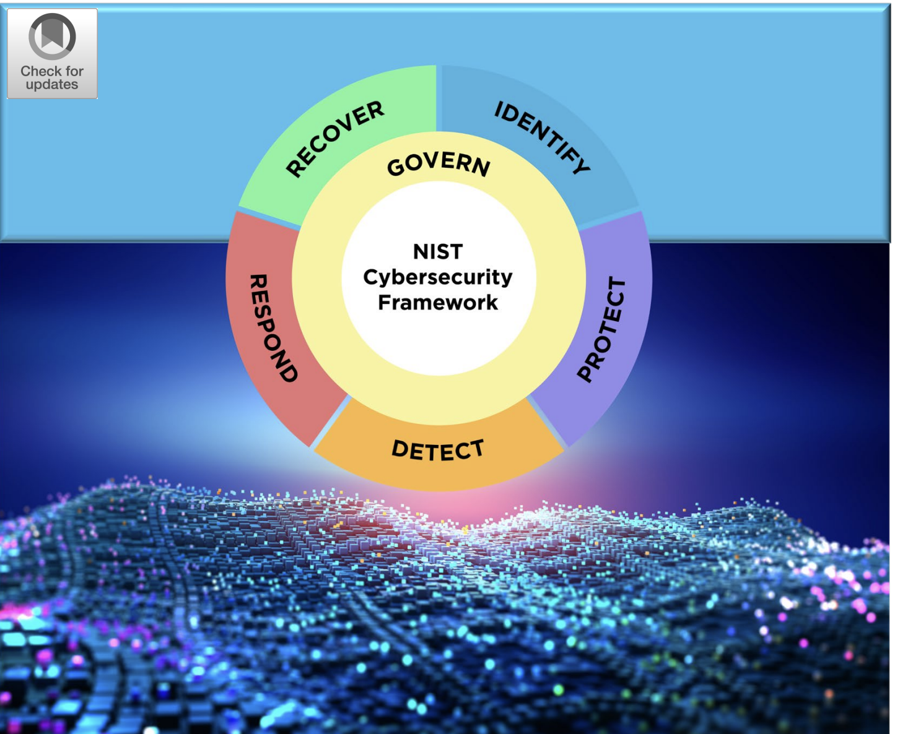

# Introduction To Cybersecurity

# Giới thiệu về An ninh mạng

---

Chúng ta sẽ tìm hiểu các Đơn vị Học tập (Learning Units) sau trong Mô-đun Học tập này:

- The Practice of Cybersecurity: Thực hành An ninh mạng
- Threats and Threat Actors: Các mối đe dọa và Tác nhân đe dọa
- The CIA Triad: Bộ ba CIA (Confidentiality, Integrity, Availability)
- Security Principles, Controls, and Strategies: Nguyên tắc, Biện pháp kiểm soát và Chiến lược An ninh
- Cybersecurity Laws, Regulations, Standards, and Frameworks: Luật, Quy định, Tiêu chuẩn và Khung làm việc về An ninh mạng
- Career Opportunities in Cybersecurity: Cơ hội nghề nghiệp trong lĩnh vực An ninh mạng

Mô-đun này được thiết kế để cung cấp cho người học, bất kể trình độ hay kinh nghiệm hiện tại, một sự hiểu biết vững chắc về các nguyên tắc cơ bản của an ninh mạng. Nó dành cho nhiều đối tượng khác nhau - từ nhân viên làm việc liên quan đến công nghệ thông tin hoặc quản lý các nhóm kỹ thuật cho đến những người mới bắt đầu trong lĩnh vực an ninh thông tin đầy năng động này.

Hoàn thành Mô-đun này sẽ giúp người học xây dựng nền tảng kiến thức hữu ích để tiến tới các Mô-đun kỹ thuật và thực hành hơn.

Phân tích chuyên sâu từng khái niệm nằm ngoài phạm vi của Mô-đun này. Để tìm hiểu thêm về các khái niệm được giới thiệu ở đây, người học được khuyến khích tiếp tục học các nội dung cấp độ 100 trong Thư viện Học tập của OffSec.

Xuyên suốt Mô-đun này, chúng ta sẽ xem xét một số ví dụ gần đây về các cuộc tấn công mạng và phân tích tác động của chúng cũng như các bước phòng ngừa hoặc giảm thiểu có thể thực hiện. Chúng tôi cũng sẽ cung cấp nhiều liên kết đến các bài viết, tài liệu tham khảo và nguồn tài nguyên để bạn khám phá thêm trong tương lai. Vui lòng xem qua các liên kết này để có thêm ngữ cảnh và sự rõ ràng.

---

# 1. Thực hành An ninh mạng

---

Đơn vị Học tập này bao gồm các Mục tiêu Học tập sau:

- Nhận biết những thách thức đặc thù của bảo mật thông tin
- Hiểu cách mà bảo mật “tấn công” (offensive) và “phòng thủ” (defensive) phản chiếu lẫn nhau
- Bắt đầu xây dựng mô hình tư duy về các cách tiếp cận hữu ích có thể áp dụng trong bảo mật thông tin

---

## 1.1 Những thách thức trong An ninh mạng

---

An ninh mạng đã nổi lên như một lĩnh vực độc lập và không phải là một nhánh nhỏ hay lĩnh vực con của kỹ thuật phần mềm hoặc quản trị hệ thống. Có một số đặc điểm riêng biệt của an ninh mạng giúp nó khác biệt với các lĩnh vực kỹ thuật khác. Trước hết, bảo mật liên quan đến các tác nhân độc hại và có trí thông minh (tức là đối thủ).

Vấn đề khi đối phó với một đối thủ thông minh đòi hỏi một cách tiếp cận, kỷ luật và tư duy khác so với việc đối mặt với một vấn đề tự nhiên hoặc ngẫu nhiên. Dù chúng ta đang mô phỏng một cuộc tấn công hay đang phòng thủ trước một cuộc tấn công, chúng ta đều cần xem xét góc nhìn và hành động tiềm năng của đối thủ, đồng thời cố gắng dự đoán những gì họ có thể làm. Bởi vì đối thủ của chúng ta là con người có ý chí, họ có thể suy luận, dự đoán, phán đoán, phân tích, giả định và cân nhắc. Họ cũng có thể cảm nhận được các cảm xúc như vui mừng, buồn bã, tham lam, sợ hãi, chiến thắng và tội lỗi. Cả kẻ tấn công và người phòng thủ đều có thể tận dụng cảm xúc của đối thủ con người của họ. Ví dụ, một kẻ tấn công có thể dựa vào sự xấu hổ bằng cách chiếm quyền điều khiển hệ thống máy tính và đe dọa công khai dữ liệu của nó. Trong khi đó, người phòng thủ có thể tận dụng nỗi sợ để ngăn cản kẻ tấn công xâm nhập vào mạng lưới của mình. Thực tế này có nghĩa là con người là một yếu tố then chốt của an ninh mạng.

Một khía cạnh quan trọng khác của bảo mật là nó thường liên quan đến việc lập luận trong điều kiện không chắc chắn. Mặc dù chúng ta có nhiều kỹ năng suy luận logic, nhưng chúng ta hoàn toàn không phải là những sinh vật toàn tri. Chúng ta không thể xác định mọi hệ quả của một chân lý đã biết, và cũng không thể biết hoặc ghi nhớ vô hạn số lượng sự kiện.

Hãy xem xét sự khác biệt giữa trò chơi cờ vua và trò chơi poker. Trong cờ vua, bạn biết tất cả những gì đối thủ biết về trạng thái của ván cờ (và ngược lại). Bạn có thể không biết họ đang nghĩ gì, nhưng bạn có thể dự đoán nước đi tiếp theo của họ dựa trên cùng một lượng thông tin mà họ đang sử dụng để đưa ra quyết định. Tuy nhiên, khi chơi poker, bạn không có toàn bộ thông tin mà đối thủ có, nên bạn phải đưa ra dự đoán dựa trên dữ liệu không đầy đủ.

Khi xem xét góc độ tư duy của kẻ tấn công và người phòng thủ, an ninh thông tin giống với poker hơn là cờ vua. Ví dụ, khi chúng ta mô phỏng một cuộc tấn công, chúng ta sẽ không bao giờ biết tất cả thông tin về máy chủ/hệ thống/mạng/tổ chức mà chúng ta đang nhắm mục tiêu. Do đó, chúng ta phải đưa ra giả định và ước tính xác suất - đôi khi một cách ngầm định, đôi khi một cách rõ ràng.

Ngược lại, với tư cách là người phòng thủ, chúng ta sẽ không nhận biết được mọi vectơ tấn công hoặc lỗ hổng tiềm ẩn mà mình có thể bị phơi bày. Vì vậy, chúng ta cần “đặt cược an toàn”, đảm bảo rằng những bề mặt tấn công có khả năng bị khai thác cao nhất được bảo vệ đầy đủ.

Vấn đề về đối thủ thông minh và vấn đề về sự không chắc chắn đều cho thấy rằng để hiểu được an ninh mạng, chúng ta cần học nhiều hơn về cách con người suy nghĩ và giải quyết vấn đề. Điều này có nghĩa là chúng ta cần áp dụng và nuôi dưỡng những tư duy cụ thể sẽ giúp ích cho chúng ta trong quá trình học tập và áp dụng kỹ năng của mình.

---

## 1.2 Về tư duy (Mindset)

---

Bảo mật không chỉ là việc hiểu về công nghệ và mã nguồn mà còn là hiểu về chính tư duy của bạn và tư duy của đối thủ. Chúng ta có xu hướng coi “tư duy” là một tập hợp các niềm tin định hình quan điểm cá nhân của mình về một vấn đề nào đó.

Hai ví dụ trái ngược nhau về các loại tư duy nổi tiếng là **tư duy cố định (fixed mindset)** và **tư duy phát triển (growth mindset)**.

Một người có tư duy cố định tin rằng kỹ năng, tài năng hoặc khả năng học hỏi của họ là cố định và rằng việc cố gắng cải thiện sẽ không mang lại kết quả đáng kể.

Ngược lại, tư duy phát triển khuyến khích niềm tin rằng khả năng tư duy là linh hoạt và có thể thích nghi - rằng con người có thể mở rộng năng lực học hỏi của mình theo thời gian.

Các nghiên cứu cho thấy rằng, ví dụ, nếu chúng ta tin rằng bản thân có khả năng phục hồi sau sai lầm, thì chúng ta thực sự sẽ làm tốt hơn trong việc đó. Đây chỉ là một khía cạnh của tư duy phát triển, nhưng là một khía cạnh quan trọng - vì bảo mật đòi hỏi chúng ta phải mắc lỗi, học hỏi từ chúng, và liên tục học tập, đánh giá lại.

Một kiểu tư duy cực kỳ giá trị khác là **tư duy bảo mật (security mindset)** - một khái niệm được đề xuất bởi nhà nghiên cứu bảo mật **Bruce Schneier**. Tư duy này khuyến khích việc liên tục đặt câu hỏi: “Làm thế nào để tấn công (hoặc phòng thủ) một hệ thống?” Nếu chúng ta bắt đầu tự động đặt câu hỏi này khi tiếp cận một ý tưởng, máy móc, hệ thống, mạng hoặc vật thể mới, chúng ta sẽ bắt đầu nhận ra nhiều mẫu hình lặp lại.

Tại **OffSec**, chúng tôi khuyến khích người học áp dụng **tư duy “Try Harder” (Cố gắng hơn nữa)**. Để hiểu rõ hơn về tư duy này, hãy xem xét hai góc nhìn có thể có trong khoảnh khắc “thất bại”:

- Nếu cuộc tấn công hoặc phòng thủ của tôi thất bại, điều đó phản ánh sự thật về kỹ năng/quy trình/cấu hình/cách tiếp cận hiện tại của tôi, cũng giống như nó phản ánh sự thật về hệ thống.
- Nếu cuộc tấn công hoặc phòng thủ của tôi thất bại, điều đó cho phép tôi học được điều gì đó mới, thay đổi cách tiếp cận và làm khác đi.

Hai góc nhìn này giúp một người có được sức mạnh tinh thần để mắc sai lầm và học hỏi từ chúng - điều tối quan trọng trong bất kỳ lĩnh vực con nào của an ninh mạng.

Thông tin chi tiết hơn về cách học tập và tư duy **Try Harder** có thể được tìm thấy trong Mô-đun **“Chiến lược Học tập Hiệu quả” (Effective Learning Strategies)**, là một phần của Lộ trình Học tập nhập môn này.

---

## 1.3 Về việc mô phỏng tư duy của đối thủ của chúng ta

---

Đáng để dừng lại suy nghĩ về sự chú ý đặc biệt mà chúng ta sẽ dành cho phía tấn công của bảo mật, ngay cả trong nhiều khóa học và Mô-đun mang tính phòng thủ của chúng ta. Người ta có thể tự hỏi tại sao một chuyên gia an ninh mạng mà mối quan tâm và mục tiêu chính là bảo vệ mạng, tổ chức hoặc chính phủ cũng nên học về phía tấn công.

Hãy lấy phép ẩn dụ về một vị quân chủ thời trung cổ xây một lâu đài. Nếu vị quân chủ biết rằng kẻ thù của họ có những máy phóng đá (cătapault) có khả năng ném những tảng đá lớn, họ có thể thiết kế lâu đài có tường dày hơn. Tương tự, nếu kẻ thù được trang bị thang, vị quân chủ có thể trang bị cho binh lính công cụ để đẩy thang khỏi tường thành.

Càng nhiều hiểu biết về kẻ tấn công tiềm năng và càng có khả năng suy nghĩ như một kẻ tấn công, vị quân chủ càng có thể xây dựng phòng thủ tốt hơn. Vị quân chủ có thể tiến hành các hoạt động hoặc kiểm toán mang tính “tấn công” để hiểu những lỗ hổng trong phòng thủ của chính mình. Ví dụ, họ có thể tổ chức các "trò chơi chiến tranh" nơi họ chỉ đạo binh lính tự diễn tập đánh nhau, giúp họ hiểu đầy đủ khả năng và mức độ phá hoại của một kẻ tấn công thực thụ.

Trong lĩnh vực an ninh mạng, các doanh nghiệp có thể thuê một cá nhân hoặc công ty để thực hiện kiểm thử xâm nhập, còn được gọi là pentest. Một chuyên gia kiểm thử xâm nhập đóng vai trò kẻ tấn công để hiểu rõ hơn các lỗ hổng và điểm yếu bị phơi bày của hệ thống.

Tận dụng bộ kỹ năng và tư duy của kẻ tấn công cho phép chúng ta trả lời tốt hơn các câu hỏi như:

"Liệu kẻ tấn công có thể truy cập như thế nào?"
"Họ có thể làm gì với quyền truy cập đó?"
"Những hậu quả xấu nhất có thể xảy ra từ một cuộc tấn công là gì?"

Trong khi việc học các kỹ năng hack là (tất nhiên) cần thiết cho những người muốn trở thành chuyên gia kiểm thử xâm nhập, chúng tôi cũng tin rằng những người phòng thủ, quản trị hệ thống và nhà phát triển sẽ hưởng lợi lớn từ việc được giáo dục sơ lược về các kỹ thuật và công nghệ mang tính tấn công.

Ngược lại, theo kinh nghiệm của chúng tôi, nhiều chuyên gia kiểm thử xâm nhập và các hacker ứng dụng web giỏi nhất là những người đã có tiếp xúc rộng rãi với việc phòng thủ mạng, xây dựng ứng dụng web hoặc quản trị hệ thống.

---

## Labs

---

1. Hai đặc điểm nào của kẻ đối địch khiến An ninh mạng trở nên đặc biệt khó khăn?
    
    a. Ác ý và thù hận
    
    b. Ác ý và trí tuệ
    
    c. Trí tuệ và lòng hào phóng
    
    d. Bút và giấy
    
    → Vì kẻ tấn công trong lĩnh vực an ninh mạng là **những tác nhân có chủ đích, thông minh và độc hại**, khác với các lỗi ngẫu nhiên hoặc tự nhiên.
    
2. “Tư duy Bảo mật” (Security Mindset) lần đầu tiên được giới thiệu bởi ai?
    
    Bruce Schneier
    
    → Ông là nhà nghiên cứu bảo mật nổi tiếng, người đã đề xuất khái niệm Security Mindset, khuyến khích việc luôn tự hỏi “làm thế nào để tấn công hoặc phòng thủ một hệ thống”.
    
3. An ninh mạng gần như luôn đòi hỏi việc lập luận trong điều kiện ________?
    
    uncertainty
    
    → Vì trong an ninh mạng, chúng ta không bao giờ có đầy đủ thông tin - cả kẻ tấn công lẫn người phòng thủ đều phải đưa ra quyết định dựa trên dữ liệu không hoàn chỉnh.
    

---

# 2. Các mối đe dọa và Tác nhân đe dọa

---

Đơn vị Học tập này bao gồm các Mục tiêu Học tập sau:

- Hiểu cách mà kẻ tấn công và người phòng thủ học hỏi lẫn nhau
- Hiểu sự khác biệt giữa rủi ro, mối đe dọa, lỗ hổng và khai thác
- Liệt kê và mô tả các loại tác nhân đe dọa khác nhau
- Nhận biết một số cuộc tấn công an ninh mạng gần đây
- Học cách các cuộc tấn công và mối đe dọa độc hại có thể ảnh hưởng đến tổ chức và cá nhân

Thuật ngữ **an ninh mạng (cybersecurity)** có nguồn gốc từ lĩnh vực quân sự trước khi được sử dụng rộng rãi. Để rõ ràng hơn, chúng ta sẽ sử dụng “an ninh mạng” để mô tả việc **bảo vệ quyền truy cập và thông tin trên Internet hoặc các mạng kỹ thuật số khác**.

Trong khi đó, **an ninh thông tin (information security)** - mặc dù nằm trong phạm vi rộng hơn của an ninh mạng - còn xem xét cả việc **bảo vệ các tài sản lưu trữ thông tin vật lý**, chẳng hạn như máy chủ hoặc kho dữ liệu vật lý.

Khi chúng ta khám phá các mối đe dọa và tác nhân đe dọa khác nhau trong Mô-đun này, trọng tâm chính sẽ là **khả năng trực tuyến của họ**. Do đó, chúng ta sẽ chủ yếu sử dụng thuật ngữ **an ninh mạng (cybersecurity)** ở đây, nhưng cũng **không quá khắt khe** khi dùng **an ninh thông tin (information security)** như một từ đồng nghĩa.

---

## 2.1 Sự phát triển của tấn công và phòng thủ

---

An ninh mạng có thể đặc biệt hấp dẫn vì nó liên quan đến nhiều tác nhân cố gắng đạt được những kết quả loại trừ lẫn nhau. Ở ví dụ cơ bản nhất, một người phòng thủ muốn kiểm soát quyền truy cập vào một tài sản mà họ sở hữu, và một kẻ tấn công muốn giành quyền kiểm soát cùng tài sản đó. Điều này trở nên thú vị vì cả hai vai trò, người phòng thủ và kẻ tấn công, tồn tại dựa trên sự tồn tại liên tục của bên kia. Đặc biệt, mỗi bên sẽ trở nên ngày càng có kỹ năng và tinh vi hơn nhờ vào nỗ lực (hoặc nỗ lực được tưởng tượng) của đối phương.

Mối quan hệ năng động giữa kẻ tấn công và người phòng thủ giúp giải thích một cách cơ bản tại sao an ninh mạng trở nên phức tạp theo cấp số nhân theo thời gian. Để hiểu rõ hơn về mối quan hệ năng động này, chúng ta hãy giới thiệu hai nhân vật hư cấu là Alice và Bob. Chúng ta sẽ thường xuyên sử dụng họ trong suốt Thư viện Học tập OffSec và trong các tài liệu về mật mã học trong nhiều ngữ cảnh khác nhau để minh họa các ví dụ và thí nghiệm tư duy.

Trong câu chuyện cụ thể này, hãy tưởng tượng rằng Bob có một tài sản mà anh ấy muốn bảo vệ: một cây chuối tuyệt vời! Bob muốn đảm bảo rằng chỉ mình anh ấy có thể hái những quả chuối của nó. Trong khi đó, kẻ tấn công Alice không muốn gì hơn là đánh cắp những quả chuối của Bob.

Ban đầu, Bob không chú ý đặc biệt đến việc bảo vệ cây của mình. Thật tương đối dễ dàng để Alice chỉ cần đi đến đó và hái một quả chuối. Tuy nhiên, khi Alice ngày càng giỏi hơn trong việc trộm cắp, Bob cũng sẽ ngày càng giỏi hơn trong việc bảo vệ cây của mình.

Khi Bob lần đầu tiên nhận ra sự phản bội của Alice, anh ta học được rằng việc canh gác ngăn cản Alice cố gắng ăn trộm chuối. Nhưng Alice giả thuyết rằng Bob hẳn phải ngủ vào một thời điểm nào đó. Cô ta chú ý đến thời điểm Bob đi ngủ, rồi lặng lẽ lẻn đến cây chuối để trộm.

Sau đó, Bob nghĩ ra cách xây một bức tường đá cao xung quanh cây. Alice gặp khó khăn trong việc phá vỡ hoặc trèo qua nó. Cuối cùng, cô ta học được cách đào bên dưới bức tường.

Tiếp theo, Bob huấn luyện một con chó giữ để bảo vệ cây. Alice học được rằng cô ta có thể làm dịu con chó bằng đồ ăn.

Bob tham gia một khóa học về bảo mật phần cứng và lắp đặt camera cùng chuông báo động để cảnh báo anh ta bất cứ khi nào Alice ở gần. Alice học được cách vô hiệu hóa camera và chuông báo động.

Chu kỳ này có thể tiếp tục gần như vô hạn. Thật kỳ lạ, cả kẻ tấn công và người phòng thủ đều phụ thuộc vào nhau để nâng cao kỹ năng của mình và hiểu rõ hơn về nghề nghiệp tương ứng.

Chúng ta có thể mở rộng phép so sánh này để bao gồm các khía cạnh về tuân thủ và quản lý rủi ro trong an ninh. Ở một thời điểm nào đó, Bob chấp nhận rủi ro rằng Alice có thể ăn trộm chuối và quyết định mua bảo hiểm. Nhưng bảo hiểm chuối của anh ta sẽ không chi trả cho những quả chuối bị đánh cắp trừ khi anh ta tuân thủ các yêu cầu của họ về việc giảm thiểu rủi ro, bao gồm việc có một bức tường kiên cố và một con chó giữ.

---

## 2.2 Rủi ro, Mối đe dọa, Lỗ hổng và Khai thác

---

Giống như nhiều lĩnh vực kỹ thuật khác, an ninh mạng dựa vào một lượng lớn thuật ngữ, từ viết tắt và chữ viết tắt. Trong suốt Thư viện Học tập OffSec, chúng ta sẽ cố gắng giới thiệu các thuật ngữ và từ vựng này khi chúng xuất hiện một cách tự nhiên. Tuy nhiên, trước khi tìm hiểu các lý thuyết và nguyên tắc khác nhau của an ninh mạng, điều quan trọng là phải định nghĩa một vài thuật ngữ cơ bản để có thể theo dõi những gì mình đang học. Hãy bắt đầu bằng việc xem qua một số khái niệm cơ bản mà an ninh mạng xoay quanh: rủi ro (risk), mối đe dọa (threat), lỗ hổng (vulnerability) và khai thác (exploit).

Trong bốn thuật ngữ này, cơ bản nhất là **rủi ro**, vì nó áp dụng cho nhiều lĩnh vực ngoài an ninh mạng và công nghệ thông tin. Một cách đơn giản để định nghĩa **rủi ro** là xem xét hai yếu tố: **xác suất** rằng một sự kiện tiêu cực sẽ xảy ra, và **mức độ ảnh hưởng** lên thứ mà chúng ta coi trọng nếu sự kiện đó xảy ra. Định nghĩa này cho phép chúng ta hình dung rủi ro qua bốn nhóm:

1. Sự kiện có xác suất thấp, ảnh hưởng thấp
2. Sự kiện có xác suất thấp, ảnh hưởng cao
3. Sự kiện có xác suất cao, ảnh hưởng thấp
4. Sự kiện có xác suất cao, ảnh hưởng cao

Là các chuyên gia an ninh mạng, chúng ta nên luôn xem xét rủi ro bằng cách đặt ra các câu hỏi:

- Mức độ có thể xảy ra của một cuộc tấn công cụ thể là bao nhiêu?
- Kết quả tồi tệ nhất có thể xảy ra nếu cuộc tấn công đó diễn ra là gì?

Khi chúng ta có thể quy một rủi ro cụ thể cho một nguyên nhân cụ thể, chúng ta đang mô tả một **mối đe dọa (threat)**. Trong an ninh mạng, mối đe dọa là thứ đặt ra rủi ro đối với tài sản mà chúng ta muốn bảo vệ. Không phải tất cả mối đe dọa đều do con người gây ra; ví dụ, nếu mạng của chúng ta phụ thuộc vào lưới điện địa phương, một cơn bão sét dữ dội có thể là một mối đe dọa đối với hoạt động liên tục của hệ thống.

Tuy nhiên, trong nhiều trường hợp, chúng ta tập trung vào **mối đe dọa từ con người**, bao gồm các chương trình độc hại do con người tạo ra. Một cá nhân hoặc nhóm người thể hiện mối đe dọa được gọi là **tác nhân đe dọa (threat actor)** - một thuật ngữ thể hiện ý chí, động cơ và trí tuệ. Chúng ta sẽ tìm hiểu thêm về các loại tác nhân đe dọa khác nhau trong phần tiếp theo.

Để một mối đe dọa trở thành **rủi ro thực tế**, mục tiêu bị đe dọa phải tồn tại **lỗ hổng (vulnerability)** ở một mức độ nào đó. Lỗ hổng là một khiếm khuyết cho phép mối đe dọa gây hại. Không phải mọi khiếm khuyết đều là lỗ hổng. Lấy ví dụ ngoài lĩnh vực an ninh mạng - hãy tưởng tượng một cây cầu. Cây cầu có thể có một vài khiếm khuyết về thẩm mỹ; có thể vài viên gạch lát bị trầy xước hoặc cây cầu không hoàn toàn thẳng. Tuy nhiên, những khiếm khuyết này không phải là lỗ hổng, vì chúng không gây nguy cơ hư hại cho cây cầu. Ngược lại, nếu cây cầu có lỗi trong kết cấu, nó có thể dễ bị tổn thương trước những mối đe dọa cụ thể như quá tải hoặc gió mạnh.

Hãy đi sâu vào một ví dụ thực tế. Vào tháng 12 năm 2021, một **lỗ hổng** đã được phát hiện trong thư viện **Apache Log4J**, một thư viện ghi log phổ biến viết bằng Java. Lỗ hổng này có thể dẫn đến **thực thi mã tùy ý (arbitrary code execution)** bằng cách lợi dụng một tính năng của bộ công cụ JNDI Java - mặc định cho phép tải xuống các yêu cầu để mở rộng chức năng ghi log. Nếu một tệp Java hợp lệ được tải xuống, chương trình này sẽ được máy chủ thực thi. Điều này có nghĩa là nếu dữ liệu do người dùng nhập vào (chẳng hạn như tên người dùng hoặc tiêu đề HTTP) không được xử lý đúng cách trước khi ghi log, thì có thể khiến máy chủ tải về một tệp Java độc hại cho phép kẻ tấn công từ xa thực thi lệnh trên máy chủ.

Do **mức độ phổ biến** của thư viện Log4j, lỗ hổng này đã được chấm **điểm cao nhất (10.0 - Critical)** theo Hệ thống Chấm điểm Lỗ hổng Phổ biến (CVSS). Điểm số này dẫn đến một **cuộc khủng hoảng quy mô toàn cầu**, khi các nhà cung cấp, công ty và cá nhân phải khẩn trương xác định và vá các hệ thống dễ bị tấn công, đồng thời kiểm tra dấu hiệu xâm nhập. Các lỗ hổng bổ sung trong Log4J cũng được phát hiện ngay sau đó, khiến tình hình càng thêm nghiêm trọng.

Lỗ hổng này **có thể được ngăn chặn** nếu dữ liệu do người dùng nhập được xử lý đúng cách. Vấn đề cũng **có thể được giảm thiểu** nếu các tính năng tiềm ẩn nguy hiểm (chẳng hạn như cho phép tải web và thực thi mã) được tắt theo mặc định.

Trong các chương trình máy tính, lỗ hổng xảy ra khi ai đó tương tác với chương trình có thể đạt được các mục tiêu **ngoài ý định của lập trình viên**. Khi những mục tiêu này mang lại cho người dùng **quyền truy cập hoặc đặc quyền mà họ không được phép có**, và khi họ cố tình, có chủ đích lợi dụng điều đó, hành động đó được gọi là **khai thác (exploit)**.

Từ “exploit” trong an ninh mạng có thể được dùng **vừa như danh từ vừa như động từ**. Là danh từ, **exploit** là **một quy trình hoặc kỹ thuật** nhằm lợi dụng một lỗ hổng cụ thể. Là động từ, **to exploit** nghĩa là **thực hiện quy trình** đó để khai thác lỗ hổng.

Chúng ta sẽ kết thúc phần này bằng cách xem xét **bề mặt tấn công (attack surface)** và **vector tấn công (attack vector)**.

- **Bề mặt tấn công** mô tả **tất cả các điểm tiếp xúc** trên hệ thống hoặc mạng của chúng ta có thể bị khai thác.
- **Vector tấn công** là **sự kết hợp cụ thể** giữa một lỗ hổng và cách khai thác nó để đạt được mục tiêu của tác nhân đe dọa.

Người phòng thủ cố gắng **giảm thiểu bề mặt tấn công** càng nhiều càng tốt, trong khi kẻ tấn công tìm cách **thăm dò bề mặt đó** để xác định **những vector tấn công tiềm năng**.

---

## 2.3 Phân loại các Tác nhân Đe dọa

---

Phần trước đã giới thiệu về các mối đe dọa và tác nhân đe dọa. Các chuyên gia an ninh mạng đặc biệt quan tâm đến **tác nhân đe dọa (threat actors)**, vì thông thường, hầu hết các mối đe dọa mà hệ thống, mạng và doanh nghiệp của chúng ta phải đối mặt đều có **nguồn gốc từ con người**. Một số đặc điểm chính khiến **tội phạm mạng** khác với tội phạm vật lý bao gồm:

- **Tính ẩn danh tương đối.**
- **Khả năng thực hiện tấn công từ xa.**
- Và (thường) **thiếu nguy hiểm thể chất** cũng như **chi phí tài chính thấp**.

Có rất nhiều loại tác nhân đe dọa khác nhau. Mỗi cá nhân hoặc nhóm người có **mức độ tinh vi kỹ thuật khác nhau**, **nguồn lực khác nhau**, **động cơ cá nhân khác nhau**, và tuân theo **hệ thống pháp lý và đạo đức khác nhau**. Mặc dù không thể liệt kê hết tất cả, nhưng có một số **phân loại cấp cao** quan trọng cần ghi nhớ:

### Cá nhân độc hại

Ở mức độ cơ bản nhất, bất kỳ ai cố gắng làm điều gì đó mà họ **không được phép làm** đều thuộc loại này.

Trong an ninh mạng, những cá nhân này có thể khai thác **các kỹ thuật số không được nhà phát triển dự định**, chẳng hạn như:

- Truy cập vào các dịch vụ bị hạn chế,
- Đánh cắp thông tin xác thực,
- Hoặc làm biến dạng giao diện trang web (deface websites).

**Ví dụ:**

Vụ việc của **Paige Thompson** là minh chứng cho việc một cá nhân tấn công có thể gây thiệt hại cực kỳ nghiêm trọng.

Tháng 7 năm 2019, Thompson bị bắt vì đã **khai thác một router có đặc quyền cao quá mức** để tải xuống thông tin cá nhân của **100 triệu người dùng Capital One**, bao gồm:

- Số An sinh xã hội (SSN),
- Số tài khoản,
- Địa chỉ, số điện thoại, email, v.v.

Cuộc tấn công này một phần là do **tường lửa ứng dụng web (WAF)** được **cấu hình sai**, với **quyền truy cập quá mức** cho phép liệt kê và đọc tệp.

Cuộc tấn công **có thể đã được ngăn chặn** bằng cách áp dụng **nguyên tắc đặc quyền tối thiểu (least privilege)** và **xác minh cấu hình đúng của WAF**.

Vì kẻ tấn công đã **đăng bài về hành động của mình lên mạng xã hội**, nên một biện pháp giảm thiểu khác có thể là **giám sát mạng xã hội (social media monitoring)**.

### Nhóm độc hại

Khi các cá nhân **hợp lại thành nhóm**, họ thường trở nên **mạnh hơn từng cá nhân riêng lẻ**.

Điều này đặc biệt đúng trong thế giới mạng, nơi **khả năng giao tiếp tức thời trên phạm vi toàn cầu** cho phép họ đạt được những mục tiêu mà trước đây là **bất khả thi**.

Ví dụ, **khả năng phối hợp nhanh chóng** qua các dịch vụ nhắn tin tức thời có giá trị **với các nhóm tấn công mạng** không kém gì với các doanh nghiệp hiện đại.

Các nhóm độc hại có thể có **nhiều mục tiêu khác nhau**, nhưng thường **mục đích rõ ràng hơn**, **tổ chức tốt hơn**, và **nguồn lực dồi dào hơn** cá nhân - khiến họ trở thành **một trong những tác nhân đe dọa nguy hiểm nhất**.

**Ví dụ:**

Nhóm **Lapsus$** đã thực hiện **nhiều cuộc tấn công** trong vài tháng, nhắm vào hàng loạt công ty, **đánh cắp thông tin độc quyền** và **tống tiền**.

Các cuộc tấn công này gây ra:

- Mất dữ liệu doanh nghiệp (bao gồm mã nguồn, sơ đồ, tài liệu kỹ thuật),
- Rò rỉ thông tin ra công chúng,
- Và **thiệt hại tài chính** cho các công ty bị ép nộp tiền chuộc.

Các kỹ thuật mà nhóm này sử dụng **đa dạng và tinh vi**, cho thấy mức độ nguy hiểm của loại tác nhân này.

Mỗi thành viên trong nhóm có thể **đóng góp chuyên môn riêng**, giúp nhóm **phát động nhiều kiểu tấn công khác nhau** với **tần suất và tốc độ cao** - điều mà một cá nhân đơn lẻ không thể đạt được.

Một câu nói phổ biến trong ngành an ninh mạng là:

> “Kẻ tấn công chỉ cần thành công một lần, còn người phòng thủ phải thành công mọi lần.”
> 

Điều này thể hiện **bất cân xứng (asymmetry)** giữa tấn công và phòng thủ.

**Biện pháp giảm thiểu:**

Vì nhóm này từng **tuyển dụng nhân viên nội bộ** để hỗ trợ tấn công, nên cần:

- Nâng cao nhận thức về **mối đe dọa nội bộ (insider threat)**,
- Sử dụng **hệ thống phát hiện bất thường (anomaly detection)**,
- Áp dụng các thực hành bảo mật như **MFA**, **kiểm soát truy cập**, và **phân đoạn mạng (network segmentation)** (được khuyến nghị bởi Palo Alto Networks)

### Mối đe dọa nội bộ

Đây là một trong những loại **tác nhân đe dọa nguy hiểm nhất** - bởi vì họ **đã có quyền truy cập đặc quyền** trong hệ thống và có thể **lạm dụng quyền đó** để tấn công.

Thông thường, đây là **nhân viên hoặc cựu nhân viên** của doanh nghiệp, bị thúc đẩy bởi **động cơ cá nhân hoặc thù địch**.

Họ đặc biệt nguy hiểm vì **được tin tưởng sẵn**, điều này cho phép họ:

- Mở rộng quyền truy cập,
- Hoặc lợi dụng **kiến thức nội bộ** không công khai để gây hại.

**Ví dụ:**

Vào tháng 3 năm 2020, trong giai đoạn thiếu hụt thiết bị y tế do đại dịch COVID-19,

**Christopher Dobbins** - cựu Phó Chủ tịch của một công ty bao bì y tế - đã sử dụng **tài khoản giả** mà ông ta tạo ra khi còn làm việc để **truy cập vào hệ thống công ty**, **xóa và thay đổi dữ liệu quan trọng** cho hoạt động phân phối vật tư y tế.

Kết quả là:

- Việc giao hàng bị trì hoãn,
- Chuỗi cung ứng y tế bị gián đoạn trong giai đoạn nghiêm trọng nhất của đại dịch.

**Cuộc tấn công này có thể đã được ngăn chặn** bằng cách:

- Áp dụng **nguyên tắc đặc quyền tối thiểu (least privilege)**,
- **Kiểm toán tài khoản (account auditing)** thường xuyên để phát hiện tài khoản giả,
- Và **giám sát hành vi bất thường** của người dùng sau khi chấm dứt hợp đồng lao động.

### Các quốc gia

Mặc dù **chính trị mạng, chiến tranh mạng và tình báo số** là chủ đề rộng và vượt ngoài phạm vi của bài học này, nhưng cần ghi nhận rằng **một số tác nhân tấn công mạng tinh vi, có tổ chức và được tài trợ mạnh nhất** chính là **các quốc gia**.

**Ví dụ:**

Từ năm 2009, **nhóm Lazarus** (liên quan đến Triều Tiên) đã thực hiện nhiều cuộc tấn công, bao gồm:

- **Đánh cắp dữ liệu** (Sony, 2014),
- **Tấn công ransomware WannaCry (2017)**,
- **Đánh cắp tài chính** từ ngân hàng (Bangladesh Bank, 2016),
- Và **tấn công vào tiền điện tử** - nổi bật là vụ **Axie Infinity năm 2022**.

Những cuộc tấn công này dẫn đến:

- Mất và rò rỉ dữ liệu doanh nghiệp,
- Thiệt hại tài chính lớn,
- Và gây ảnh hưởng toàn cầu.

**Các biện pháp phòng ngừa được khuyến nghị** bởi công ty bảo mật **NCC Group** gồm:

- **Phân đoạn mạng (network segmentation)**,
- **Cập nhật và vá lỗi** cho các tài nguyên kết nối Internet,
- **Triển khai đúng cách xác thực đa yếu tố (MFA)**,
- **Giám sát hành vi người dùng bất thường** (ví dụ: đăng nhập đồng thời từ nhiều vị trí),
- **Bảo đảm có đủ log hệ thống và thường xuyên phân tích log**.

---

## 2.4 Các sự cố vi phạm An ninh mạng hiện nay

---

Trong khi phần trước tập trung vào việc **ai** là người thực hiện các cuộc tấn công, thì trong phần này chúng ta sẽ tìm hiểu về **các loại vi phạm an ninh mạng** đã xảy ra trong vài năm gần đây. Chúng ta sẽ phân tích một số cuộc tấn công mạng gần đây, thảo luận về **tác động** của chúng đối với doanh nghiệp, người dùng và nạn nhân, đồng thời xem xét **cách mà chúng có thể được ngăn chặn hoặc giảm thiểu**.

Có rất nhiều ví dụ về các vụ vi phạm gần đây để lựa chọn. Với mỗi vụ, chúng ta sẽ chỉ rõ **loại tấn công** đã cho phép vi phạm xảy ra. Danh sách này **không nhằm đại diện cho tất cả các loại tấn công**, mà chỉ nhằm **minh họa phạm vi và tác động** của các vi phạm an ninh mạng.

### Tấn công Kỹ nghệ Xã hội

Kỹ nghệ xã hội là một nhóm tấn công rộng, trong đó kẻ tấn công **thuyết phục hoặc thao túng con người** để họ cung cấp thông tin hoặc quyền truy cập mà họ không nên cung cấp.

Vào **tháng 7 năm 2020**, tin tặc đã sử dụng kỹ thuật kỹ nghệ xã hội có tên **spearphishing** để truy cập vào **một công cụ nội bộ của Twitter**, cho phép họ **đặt lại mật khẩu của một số tài khoản nổi tiếng**. Họ đã sử dụng những tài khoản này để **đăng quảng bá cho một trò lừa đảo Bitcoin**.

Hậu quả bao gồm **thiệt hại tài chính** cho người dùng Twitter, **rò rỉ dữ liệu** của nhiều tài khoản nổi tiếng, và **tổn hại uy tín** của chính Twitter.

Cuộc tấn công bắt đầu bằng **spear-phishing qua điện thoại** và **kỹ nghệ xã hội**, giúp kẻ tấn công lấy được **thông tin xác thực của nhân viên**. Cuộc tấn công này có thể đã được **ngăn chặn nếu nhân viên được đào tạo** để nhận biết kỹ nghệ xã hội. Ngoài ra, việc **giới hạn quyền truy cập theo nguyên tắc đặc quyền tối thiểu (least privilege)** và **giám sát hoạt động người dùng bất thường** cũng có thể đã giúp **phòng ngừa hoặc giảm thiểu** cuộc tấn công này.

### Phishing

Phishing là một hình thức tấn công phổ biến hơn so với spear-phishing. Trong khi spear-phishing **nhắm đến một số cá nhân cụ thể**, thì phishing **nhắm đến số lượng lớn nạn nhân** để tăng khả năng có người mắc bẫy.

Vào **tháng 9 năm 2021**, một công ty con của **Toyota** xác nhận rằng họ đã trở thành nạn nhân của **một vụ lừa đảo Business Email Compromise (BEC)**, dẫn đến việc **chuyển nhầm 4 tỷ yên Nhật (khoảng 37 triệu USD)** vào tài khoản của kẻ lừa đảo.

Cuộc tấn công xảy ra vì **một nhân viên bị thuyết phục thay đổi thông tin tài khoản thanh toán**.

FBI khuyến nghị các bước sau để **ngăn chặn BEC**:

- Xác minh **tính hợp lệ** của mọi yêu cầu thanh toán hoặc thay đổi thông tin tài khoản **trực tiếp hoặc qua điện thoại**.
- Cẩn trọng với các yêu cầu mang tính **khẩn cấp hoặc gấp gáp**.
- Kiểm tra kỹ **địa chỉ email, URL, và tệp đính kèm**.
- **Không mở email lạ** và luôn kiểm tra người gửi **trước khi trả lời**.

### Ransomware

Ransomware là một loại phần mềm độc hại làm khóa quyền truy cập của người dùng hợp pháp vào máy tính hoặc tài liệu của họ, sau đó yêu cầu tiền chuộc để mở khóa.

Vào tháng 5 năm 2021, một vụ tấn công ransomware đã xảy ra tại Colonial Pipeline, một công ty dầu khí lớn của Mỹ. Cuộc tấn công này làm gián đoạn việc phân phối nhiên liệu trong nhiều ngày, gây ra thiệt hại dữ liệu, mất hàng triệu USD tiền chuộc, tăng giá xăng, và nỗi lo thiếu hụt nhiên liệu.

Tin tặc đã xâm nhập chỉ bằng một mật khẩu bị lộ. Cuộc tấn công này có thể đã được ngăn chặn nếu hệ thống được bật xác thực đa yếu tố (MFA) và ngăn việc tái sử dụng mật khẩu.

### Lạm dụng Thông tin Đăng nhập

Credential abuse xảy ra khi kẻ tấn công có được **thông tin đăng nhập hợp lệ**, cho phép họ **truy cập dịch vụ hoặc máy tính** mà họ không được phép.

Vào **tháng 12 năm 2020**, phát hiện ra rằng **các bản cập nhật độc hại** đã được chèn vào **nền tảng SolarWinds Orion**. Khi cài đặt các bản cập nhật này, **mã độc được cài trên môi trường của khách hàng**, dẫn đến **rò rỉ dữ liệu của các tổ chức lớn**, bao gồm **các cơ quan chính phủ Mỹ**.

Theo **cựu CEO Kevin Thompson**, vụ tấn công bắt nguồn từ **một mật khẩu yếu bị công khai trên GitHub**. Cuộc tấn công có thể đã được **ngăn chặn bằng cách đảm bảo mật khẩu mạnh**, **giám sát rò rỉ bí mật trên Internet**, và **chặn lưu lượng ra khỏi máy chủ Orion** như khuyến nghị của CISA.

### Vượt qua Xác thực

Khác với Credential Abuse (đăng nhập bằng thông tin thật), Authentication Bypass cho phép kẻ tấn công **bỏ qua hoàn toàn cơ chế xác thực**.

Vào **ngày 2 tháng 7 năm 2021**, phát hiện ra **một vụ tấn công lợi dụng lỗ hổng** trong **công cụ quản lý từ xa Kaseya VSA**. Kẻ tấn công đã **bỏ qua hệ thống xác thực** để **triển khai mã độc REvil ransomware** qua **bản cập nhật độc hại** đến các máy của khách hàng.

Vì Kaseya phục vụ **nhiều nhà cung cấp dịch vụ (MSP)**, quy mô của cuộc tấn công **lan rộng sang cả khách hàng của MSP đó**. Theo nhà báo **Brian Krebs**, **lỗ hổng này đã được biết đến ít nhất 3 tháng** trước khi bị khai thác. Cuộc tấn công có thể **được ngăn chặn** bằng cách **ưu tiên khắc phục các lỗ hổng đã biết một cách khẩn cấp**.

---

## Labs

---

1. Loại tấn công nào chiếm quyền một máy tính hoặc một tập hợp máy tính và giữ chúng làm con tin cho đến khi chủ sở hữu trả một khoản phí?
    
    → Ransomware
    
2. Điền vào chỗ trống. Kỹ nghệ xã hội (Social Engineering) thường lợi dụng lỗ hổng trong __________?
    
    → Hành vi con người (human behavior / people)
    
3. Alice và Bob là hai nhân vật hư cấu thường được dùng minh họa trong mật mã học. Các nhân vật khác được tạo để đảm nhiệm vai trò bổ sung. Tên của nhân vật thường được dùng làm “kẻ nghe lén” (eavesdropper) trong tài liệu mật mã là gì?
    
    → Eve
    

---

# 3. Bộ ba CIA

---

Đơn vị học tập này bao gồm các Mục tiêu Học tập sau:

- Hiểu tại sao việc bảo vệ **tính** **bí mật** của thông tin là quan trọng
- Tìm hiểu tại sao việc bảo vệ **tính toàn vẹn** của thông tin là quan trọng
- Khám phá tại sao việc bảo vệ **tính sẵn sàng** của thông tin là quan trọng

Để hiểu các kỹ thuật tấn công, chúng ta cần hiểu các nguyên tắc mà người phòng thủ nên tuân theo để có thể nhanh chóng xác định các cơ hội khai thác sai lầm của họ. Tương tự, những người phòng thủ giỏi sẽ được lợi khi hiểu cách kẻ tấn công hoạt động, bao gồm những loại thiên kiến và sai sót mà họ dễ mắc phải.

Một trong những mô hình thường được sử dụng để mô tả mối quan hệ giữa bảo mật và các đối tượng của nó được gọi là **bộ ba CIA**. CIA là viết tắt của **Confidentiality (Bí mật), Integrity (Toàn vẹn), và Availability (Sẵn sàng)**. Mỗi yếu tố này là một đặc tính mong muốn của những thứ mà chúng ta muốn bảo vệ, và mỗi đặc tính trong ba yếu tố này đều có thể bị tấn công. Hầu hết (mặc dù không phải tất cả) các cuộc tấn công vào hệ thống và mạng máy tính sẽ đe dọa một trong những thuộc tính này. Hãy bắt đầu với một cái nhìn tổng quan trước khi đi sâu vào từng yếu tố:

- **Confidentiality (Bí mật):** Liệu những tác nhân không nên có quyền truy cập vào hệ thống hoặc thông tin có thể truy cập được vào hệ thống hoặc thông tin đó không?
- **Integrity (Toàn vẹn):** Liệu dữ liệu hoặc hệ thống có thể bị sửa đổi theo cách không được phép không?
- **Availability (Sẵn sàng):** Liệu dữ liệu hoặc hệ thống có thể truy cập được khi và theo cách mà chúng được dự định không?

Cũng cần lưu ý rằng trong một số trường hợp, chúng ta có thể quan tâm nhiều hơn đến một khía cạnh của bộ ba CIA so với các khía cạnh khác. Ví dụ, nếu ai đó có một cuốn nhật ký cá nhân chứa những suy nghĩ bí mật nhất của họ, thì **tính bí mật** của cuốn nhật ký có thể quan trọng hơn nhiều đối với chủ sở hữu so với tính toàn vẹn hoặc tính sẵn sàng của nó. Nói cách khác, họ có thể không quá lo lắng về việc ai đó có thể **viết** vào nhật ký (so với việc **đọc** nó) hoặc liệu cuốn nhật ký có luôn có thể truy cập được hay không.

Mặt khác, nếu chúng ta đang bảo mật một hệ thống theo dõi **đơn thuốc y tế**, thì **tính toàn vẹn của dữ liệu** sẽ là điều quan trọng nhất. Mặc dù việc ngăn người khác đọc thông tin về các loại thuốc mà ai đó sử dụng là quan trọng, và việc đảm bảo những người phù hợp có thể truy cập danh sách thuốc này cũng quan trọng, nhưng nếu ai đó có thể thay đổi nội dung của hệ thống, điều đó có thể dẫn đến hậu quả đe dọa tính mạng.

Khi chúng ta đang bảo mật một hệ thống và phát hiện ra một vấn đề, chúng ta sẽ muốn xem xét vấn đề đó ảnh hưởng đến khái niệm nào trong ba yếu tố trên, hoặc là sự kết hợp của chúng. Điều này giúp chúng ta hiểu vấn đề một cách toàn diện hơn và cho phép phân loại cũng như ứng phó với các vấn đề một cách phù hợp.

---

## 3.1 Tính bảo mật (C)

---

Một hệ thống được coi là **bảo mật** nếu chỉ những người được phép rõ ràng mới có thể truy cập vào nó. Thông tin đăng nhập tài khoản mạng xã hội của một người được xem là bảo mật miễn là mật khẩu của người dùng chỉ được biết bởi chính chủ sở hữu. Nếu một hacker đánh cắp hoặc đoán được mật khẩu và có thể truy cập vào tài khoản, điều đó được xem là một **cuộc tấn công vào tính bảo mật**. Những kiểu tấn công phổ biến vào tính bảo mật bao gồm **nghe lén mạng (network eavesdropping)** và **tấn công nhồi thông tin xác thực (credential stuffing)**.

Hãy xem xét một ví dụ về một cuộc tấn công vào tính bảo mật, đánh giá tác động của nó và hiểu cách mà nó có thể được ngăn chặn hoặc giảm thiểu.

Vào tháng 8 năm 2021, **T-Mobile** thông báo rằng các hacker đã truy cập vào dữ liệu liên quan đến hơn **50 triệu khách hàng hiện tại, cũ và tiềm năng**. Mặc dù không có thông tin thanh toán, mật khẩu hoặc mã PIN nào bị truy cập, nhưng một số dữ liệu bao gồm **họ và tên, ngày sinh, số an sinh xã hội, và thông tin thẻ căn cước/giấy phép lái xe**. Dữ liệu này sau đó đã được rao bán trên **dark web**.

Cuộc tấn công này đã ảnh hưởng đến **tính bảo mật của thông tin cá nhân** của hàng triệu khách hàng hiện tại, cũ và tiềm năng. Tính bảo mật của thông tin này sau đó tiếp tục bị xâm phạm hơn nữa khi nó được rao bán trên dark web. Điều này cũng dẫn đến **thiệt hại về uy tín** cho T-Mobile, vì cuộc tấn công là một trong số nhiều vụ vi phạm xảy ra gần thời điểm đó.

Có rất ít thông tin chi tiết về **phương pháp tấn công chính xác** mà hacker đã sử dụng; tuy nhiên, họ tuyên bố rằng họ **đã xâm nhập một router trước tiên** để có được quyền truy cập vào **hơn 100 máy chủ**, bao gồm cả cơ sở dữ liệu hoặc các cơ sở dữ liệu chứa dữ liệu khách hàng bị ảnh hưởng.

Vụ vi phạm này **có thể đã được ngăn chặn** nếu tất cả các tài nguyên hướng ra internet được **cấu hình, vá lỗi và cập nhật đúng cách**. Sau đó, mạng nên được **giám sát hành vi người dùng bất thường** và thực hiện **phân đoạn mạng tốt hơn (network segmentation)**.

Các tài liệu cá nhân như **giấy phép lái xe** cần được bảo mật vì chúng chứa thông tin có thể **nhận dạng cá nhân**.

Tuy nhiên, **không phải tất cả thông tin mà một công ty sở hữu đều là bảo mật**. Ví dụ, **các thành viên hội đồng quản trị của T-Mobile** được liệt kê công khai trên trang web của họ. Do đó, nếu một cuộc tấn công tiết lộ thông tin đó, thì **nó sẽ không được xem là vi phạm tính bảo mật**.

---

## 3.2 Tính toàn vẹn (I)

---

Một hệ thống có **tính toàn vẹn** nếu thông tin và chức năng mà nó lưu trữ **chỉ bao gồm những gì mà chủ sở hữu dự định lưu trữ**. Tính toàn vẹn liên quan đến việc **duy trì độ chính xác và độ tin cậy của dữ liệu và dịch vụ**.

Chỉ đơn giản đăng nhập vào tài khoản mạng xã hội của người dùng bằng cách đoán mật khẩu **không phải** là một cuộc tấn công vào tính toàn vẹn. Tuy nhiên, nếu kẻ tấn công bắt đầu **đăng bài hoặc xóa thông tin**, thì đó sẽ trở thành **một cuộc tấn công vào tính toàn vẹn**.

Một kiểu tấn công phổ biến vào tính toàn vẹn là **thực thi mã tùy ý (arbitrary code execution)**.

Vào **tháng 1 năm 2022**, các nhà nghiên cứu đã xác định một loại **phần mềm độc hại xóa dữ liệu mới** có tên là **WhisperGate**, được sử dụng để tấn công các mục tiêu ở **Ukraine**. Phần mềm độc hại này có **hai giai đoạn**:

- **Giai đoạn một** ghi đè **Master Boot Record (MBR)** để hiển thị một **thông báo giả mạo ransomware**.
- **Giai đoạn hai** tải xuống thêm phần mềm độc hại, ghi đè các **tệp có phần mở rộng cụ thể**, khiến chúng bị **hỏng và không thể khôi phục**.

Cuộc tấn công này ảnh hưởng đến **tính toàn vẹn của dữ liệu** trên hệ thống bị ảnh hưởng bằng cách **ghi đè các tệp theo cách không thể khôi phục**, về cơ bản là **xóa sạch chúng**.

Trong khuyến cáo của mình, **Microsoft** đã đề nghị các mục tiêu tiềm năng thực hiện các bước sau để tự bảo vệ:

- **Bật xác thực đa yếu tố (MFA)** để giảm thiểu rủi ro khi thông tin đăng nhập bị xâm phạm.
- **Bật tính năng Controlled Folder Access (CFA)** trong **Microsoft Defender** để ngăn chặn việc giả mạo **MBR/VBR**.
- **Sử dụng các chỉ báo xâm nhập (IoC)** được cung cấp để tìm kiếm các vi phạm tiềm ẩn.
- **Xem xét và xác minh hoạt động xác thực** cho tất cả truy cập từ xa.
- **Điều tra các hoạt động bất thường khác**.

Thông tin chi tiết kỹ thuật của cuộc tấn công đã được **CrowdStrike** công bố thêm.

Nói một cách đơn giản, **tính toàn vẹn rất quan trọng đối với một doanh nghiệp** vì **các doanh nghiệp và người tiêu dùng khác cần có thể tin tưởng vào thông tin mà doanh nghiệp đó nắm giữ**.

---

## 3.3 Tính sẵn sàng (A)

---

Một hệ thống được xem là có **tính sẵn sàng** nếu những người được phép truy cập vào nó **có thể thực hiện việc truy cập đó**.

Hãy tưởng tượng một kẻ tấn công đã xâm nhập vào tài khoản mạng xã hội và đăng tải nội dung tùy ý của mình. Cho đến thời điểm này, đây được xem là **một cuộc tấn công vào tính bảo mật và tính toàn vẹn**. Tuy nhiên, nếu kẻ tấn công **thay đổi mật khẩu của người dùng và ngăn họ đăng nhập**, thì điều đó cũng trở thành **một cuộc tấn công vào tính sẵn sàng**.

Một kiểu tấn công phổ biến vào tính sẵn sàng là **tấn công từ chối dịch vụ (Denial of Service – DoS)**.

Vào **ngày 24 tháng 2 năm 2022**, khi **cuộc xâm lược Ukraine của Nga** bắt đầu, **dịch vụ Internet băng thông rộng vệ tinh của Viasat** đã bị tấn công **từ chối dịch vụ (DoS)**, khiến **Internet vệ tinh tại Ukraine** bị ngắt, bao gồm cả kết nối của **chính phủ và quân đội Ukraine**. Cuộc tấn công này sử dụng một loại **phần mềm độc hại xóa dữ liệu mới** có tên là **AcidRain**.

Tác động của cuộc tấn công này là **dịch vụ Internet vệ tinh của Viasat tạm thời không khả dụng tại Ukraine** vào **thời điểm then chốt đầu cuộc xâm lược**, gây **gián đoạn liên lạc và phối hợp**.

Rất ít thông tin được công bố về cách thức chi tiết mà cuộc tấn công diễn ra. **Viasat** cho biết rằng một **“lỗi cấu hình VPN”** đã cho phép kẻ tấn công có được quyền truy cập ban đầu. Mặc dù không rõ lỗi cấu hình cụ thể đó là gì, nhưng **cuộc tấn công này có thể đã được ngăn chặn** nếu cấu hình VPN được **thiết lập đúng cách**.

Có thể rằng cuộc tấn công này **đã có thể được ngăn chặn**, mặc dù cần thừa nhận rằng việc phòng ngừa là **rất khó khăn**, bằng cách **tuân thủ các hướng dẫn chung để phòng thủ trước các mối đe dọa thường trực nâng cao (Advanced Persistent Threats – APTs)**.

Những hướng dẫn này khuyến nghị:

- Đảm bảo **khả năng quan sát toàn diện** trong môi trường của mình,
- **Tham gia vào hoạt động tình báo mối đe dọa (threat intelligence)**,
- Và **thực hiện săn tìm mối đe dọa (threat hunting)**, cùng với một số biện pháp khác.

---

## 3.4 Cân bằng bộ ba CIA với các mục tiêu của tổ chức

---

Trước khi kết thúc phần này, hãy nhìn tổng thể hơn và xem xét cách việc **ưu tiên các yếu tố trong bộ ba CIA** có thể ảnh hưởng đến một tổ chức.

Đặc biệt, một điểm tinh tế quan trọng cần lưu ý là **chính các biện pháp kiểm soát bảo mật đôi khi có thể gây bất lợi cho tính sẵn sàng**.

Bảo mật cực kỳ mạnh mẽ **không phải lúc nào cũng là tối ưu** cho một tổ chức.

Nếu hệ thống bảo mật quá chặt chẽ đến mức người dùng **không thể sử dụng hệ thống**, hoặc **thường xuyên cảm thấy khó chịu khi sử dụng**, điều này có thể dẫn đến **giảm hiệu suất, tinh thần làm việc thấp**, và thậm chí **sự sụp đổ của tổ chức**.

**Cân bằng giữa kiểm soát bảo mật và tính sẵn sàng** là một **quá trình liên tục và mang tính then chốt**, bao gồm **đánh giá, khám phá, mô hình hóa mối đe dọa, thảo luận, thử nghiệm và triển khai**.

Việc **đặt ra các quy tắc ngăn nhân viên tham gia vào quá trình cải tiến** là **một cách dễ dàng để phá hỏng một chương trình bảo mật**.

**Bảo mật là trách nhiệm của mọi người**, và các quy trình **nhận phản hồi từ toàn bộ tổ chức** cũng như **giáo dục nhân viên về cách sử dụng các biện pháp kiểm soát bảo mật** thường là **những yếu tố quan trọng cho một chương trình bảo mật thành công**.

---

## Labs

---

1. Chính sách độ dài mật khẩu hợp lý giúp bảo vệ thuộc tính nào trong bộ ba CIA?
    
    → Bảo mật (Confidentiality)
    
2. Thuật toán mã hóa mạnh giúp bảo vệ thuộc tính nào trong bộ ba CIA?
    
    → Bảo mật (Confidentiality)
    
3. Băm (hashing) và kiểm tra tổng (checksums) giúp bảo vệ thuộc tính nào trong bộ ba CIA?
    
    → Toàn vẹn (Integrity)
    
4. Công ty Bank Corp có một biểu mẫu trên trang web. Mã xử lý biểu mẫu không lọc (sanitize) một số tham số, cho phép người dùng thay đổi các giá trị trong bảng cơ sở dữ liệu SQL. Kết quả là người dùng có thể thay đổi số tiền trong tài khoản của mình. Đây là ví dụ về vi phạm thuộc tính nào trong bộ ba CIA?
    
    → Toàn vẹn (Integrity)
    
5. Công ty Acme Co vô tình để mở một AWS S3 bucket, cho phép bất kỳ ai truy cập dữ liệu cá nhân nhạy cảm. Đây là ví dụ về vi phạm thuộc tính nào trong bộ ba CIA?
    
    → Bảo mật (Confidentiality)
    
6. Bệnh viện Hope lưu trữ toàn bộ dữ liệu trên một máy chủ duy nhất mà không có bản sao lưu. Một ngày nọ, nhân viên vệ sinh vô tình vấp dây điện, rút phích cắm và ngắt kết nối máy chủ mà nhân viên cần sử dụng. Đây là ví dụ về vi phạm thuộc tính nào trong bộ ba CIA?
    
    → Sẵn sàng (Availability)
    
7. Tình huống Linux Mint (2016):
Năm 2016, Linux Mint bị tấn công. Kẻ tấn công đã truy cập được vào máy chủ web chứa các tệp ISO để tải xuống, và thay thế chúng bằng các tệp ISO khác có cài backdoor. Họ cũng thay đổi các checksum công khai hiển thị trên cùng trang web. Quản trị viên của Linux Mint phát hiện và khắc phục sự cố trong vòng 24 giờ. Họ phát hiện rằng các tệp ISO và checksum được tải xuống qua torrent không bị ảnh hưởng.
    
    Thuộc tính nào trong bộ ba CIA bị ảnh hưởng khi kẻ tấn công thay đổi các tệp ISO trên trang web?
    
    → Toàn vẹn (Integrity)
    
8. Thuộc tính nào trong bộ ba CIA bị ảnh hưởng khi kẻ tấn công truy cập được vào máy chủ web trước khi thực hiện bất kỳ thay đổi nào?
    
    → Bảo mật (Confidentiality)
    
9. Giả sử kẻ tấn công xóa toàn bộ tệp quan trọng trên máy chủ web, khiến máy chủ không thể hoạt động như dự định. Thuộc tính nào trong bộ ba CIA sẽ bị ảnh hưởng?
    
    → Sẵn sàng (Availability)
    
10. Bằng việc có hai vị trí tải xuống khác nhau, Linux Mint đang bảo vệ thuộc tính nào trong bộ ba CIA?
    
    → Sẵn sàng (Availability)
    

---

# 4. Nguyên tắc, Biện pháp kiểm soát và Chiến lược An ninh

---

Đơn vị học tập này bao gồm các **Mục tiêu học tập** sau:

- Hiểu được **tầm quan trọng của việc sử dụng nhiều lớp phòng thủ** trong một chiến lược an ninh.
- Mô tả **tình báo mối đe dọa (threat intelligence)** và các **ứng dụng của nó trong tổ chức**.
- Tìm hiểu lý do vì sao **quyền truy cập và đặc quyền của người dùng** nên được **hạn chế ở mức tối thiểu có thể**.
- Hiểu lý do **tại sao an ninh không nên phụ thuộc vào sự bí mật**.
- Xác định **các chính sách** có thể **giảm thiểu các mối đe dọa** đối với một tổ chức.
- Hiểu **các mô hình an ninh khác nhau**.
- Xác định **các biện pháp kiểm soát** mà một tổ chức có thể sử dụng để **giảm thiểu các mối đe dọa an ninh mạng**.

---

## 4.1 Nguyên tắc An ninh

---

Trong đơn vị học này, chúng ta sẽ bắt đầu khám phá một số nguyên tắc an ninh thường gặp trong suốt **Hành trình Học tập OffSec**.

Hai nguồn tài liệu tuyệt vời để tìm hiểu về các nguyên tắc an ninh là **trang web của David Wheeler** và **bộ “cheatsheet” của OWASP**.

Mặc dù chủ đề này có thể được phát triển thành một mô-đun chuyên sâu riêng, nhưng hiện tại chúng ta sẽ chỉ tìm hiểu một vài khái niệm ở cấp độ tổng quan.

### Nguyên tắc Đặc quyền Tối thiểu

Nguyên tắc này nêu rõ rằng **mỗi thành phần trong hệ thống chỉ nên được cấp quyền ở mức thấp nhất cần thiết để hoàn thành nhiệm vụ của nó**.

Dù nói đến người dùng trên máy tính hay các dòng mã trong chương trình, việc tuân thủ đúng nguyên tắc này có thể **giảm đáng kể bề mặt tấn công**.

Ví dụ, trong **cuộc tấn công Capital One năm 2019**, kẻ tấn công đã lợi dụng **tường lửa ứng dụng web (Web Application Firewall – WAF)** có quyền truy cập **cao hơn mức cần thiết** cho chức năng của nó.

Điều này cho thấy **nguyên tắc đặc quyền tối thiểu không chỉ áp dụng cho con người**, mà còn cho **mọi thực thể** có khả năng **đọc, ghi, hoặc chỉnh sửa dữ liệu** - bao gồm **máy móc, bộ định tuyến (router)**, và **tường lửa**.

### **Mô hình An ninh Không Tin Cậy**

Mô hình này đưa nguyên tắc đặc quyền tối thiểu lên **mức cao nhất**, bằng cách **loại bỏ hoàn toàn sự tin cậy ngầm định** trong mạng.

Mục tiêu của Zero Trust là **bảo vệ quyền truy cập vào tài nguyên**, thường bằng **các quy trình cấp phép chi tiết (granular authorization)** cho **mỗi yêu cầu truy cập**.

Zero Trust bao gồm **năm yếu tố cốt lõi**:

1. **Just in Time Access (JITA)** – quyền truy cập chỉ được xác thực **ngay trước khi cấp quyền**.
2. **Just Enough Access (JEA)** – chỉ cấp **đủ quyền cần thiết**, tương tự nguyên tắc đặc quyền tối thiểu.
3. **Mã hóa (Encryption)** và **token hóa (Tokenization)** – để **bảo vệ dữ liệu**.
4. **Chính sách truy cập động (Adaptive Access Control Policies)** – đảm bảo **chính sách luôn phù hợp với mục đích sử dụng**.
5. **Phân đoạn vi mô (Microsegmentation)** – **giới hạn quyền truy cập** ở **mức chi tiết phù hợp**.

### **Nguyên tắc An ninh Mở**

Đây là một nguyên tắc có vẻ **nghịch lý**, nhưng lại **rất quan trọng**:

**Tính an ninh của hệ thống không nên phụ thuộc vào việc giữ bí mật**.

Nói cách khác, **ngay cả khi kẻ tấn công biết rõ cách hệ thống được bảo vệ**, họ **vẫn không thể vượt qua nó**.

Tất nhiên, điều này **không có nghĩa là không cần giữ bí mật gì cả**.

Ví dụ, **mật khẩu** là thông tin cần được giữ kín - vì **tính bảo mật của mật khẩu phụ thuộc fvào sự bí mật của nó**.

Tuy nhiên, hệ thống vẫn phải **an toàn ngay cả khi kẻ tấn công biết rằng có mật khẩu**, và **biết thuật toán mã hóa được sử dụng**.

### **Phòng thủ theo Chiều sâu**

Nguyên tắc này khuyến khích **bổ sung các lớp phòng thủ ở nhiều tầng khác nhau trong hệ thống**, để **nếu một lớp bị vượt qua, các lớp khác vẫn có thể ngăn chặn việc xâm nhập hoàn toàn**.

Ví dụ ngoài lĩnh vực an ninh mạng:

> Một nhà để xe yêu cầu nhập mã điện tử, sau đó dùng chìa khóa mở khóa cửa, và cuối cùng phải vô hiệu hóa hệ thống báo động kích hoạt bằng giọng nói trước khi mở được gara.
> 

Nhiều tổ chức **không triển khai đủ các lớp bảo vệ cần thiết** cho hệ thống của họ.

Họ **quá phụ thuộc vào các công cụ hoặc nhà cung cấp bên ngoài**, vốn chỉ **tập trung vào một lớp phòng thủ duy nhất**.

Điều này dễ dẫn đến **“điểm yếu đơn lẻ” (single point of failure)**, làm cho **toàn bộ hệ thống trở nên dễ bị tổn thương**.

Do đó, chúng ta cần **áp dụng nhiều lớp kiểm soát (multiple layers of controls)** và **thiết kế hệ thống theo nguyên tắc phòng thủ theo chiều sâu (defense in depth)** để:

- **Chống chịu tốt hơn trước các mối đe dọa**, và
- **Phản ứng hiệu quả hơn khi xảy ra sự cố an ninh**.

---

## 4.2 Biện pháp Kiểm soát và Chiến lược An ninh

---

Để đạt được các mục tiêu của những khái niệm như **đặc quyền tối thiểu (least privilege)**, **an ninh mở (open security)** và **phòng thủ theo chiều sâu (defense in depth)**, chúng ta cần **triển khai các chiến lược an ninh (security strategies)**.

Những chiến lược này có thể bao gồm các biện pháp như:

- Giám sát **24/7 (liên tục ngày đêm)**
- **Mô hình hóa mối đe dọa (Threat modeling)**
- **Thảo luận mô phỏng tình huống (Tabletop discussions)**
- **Đào tạo liên tục** về chiến thuật, quy trình và thủ tục
- **Tự động vá lỗi liên tục (Continuous automated patching)**
- **Xác minh chuỗi cung ứng liên tục (Continuous supply chain verification)**
- **Thiết kế và lập trình an toàn (Secure coding and design)**
- **Xem xét nhật ký hệ thống hằng ngày (Daily log reviews)**
- **Nhiều lớp kiểm soát an ninh được triển khai hiệu quả (Multiple layers of well-implemented security controls)**

Ban đầu, việc này có thể gây cảm giác quá tải.
Đặc biệt, chiến lược phòng thủ theo chiều sâu (defense-in-depth) đòi hỏi sự phối hợp giữa con người và công nghệ, nhằm tạo ra nhiều lớp rào chắn bảo vệ tài nguyên.

Trong bộ ba CIA (Confidentiality, Integrity, Availability), ta đã đề cập rằng một hệ thống bảo mật mạnh có thể làm giảm tính sẵn sàng (availability).
Nếu bảo mật được ưu tiên cao hơn khả năng sẵn sàng, hệ thống có thể thường xuyên ngừng hoạt động và dẫn đến sự khó chịu của người dùng.

Ví dụ:
Một tổ chức sử dụng giao thức xác thực Kerberos mà không có phương án dự phòng (fallback).
Trong GNU/Linux, nếu Kerberos được cấu hình mà không có cơ chế truy cập mạng thay thế, thì khi Kerberos gặp sự cố, không ai có thể truy cập dịch vụ mạng.

Nếu bảo mật là ưu tiên hàng đầu, thì cách tiếp cận này có thể phù hợp với mục tiêu của tổ chức.

Nhưng nếu tính sẵn sàng (availability) quan trọng hơn, thì cách làm này có thể gây thiệt hại, do tăng cường bảo mật mà thiếu cân nhắc tổng thể.

Ngoài ra, các biện pháp kiểm soát an ninh (security controls) cũng có thể tốn rất nhiều thời gian và công sức để triển khai và duy trì đúng cách.
Nếu một biện pháp kiểm soát quá tốn kém, tổ chức có thể mất lợi nhuận.
Vì vậy, các biện pháp này phải được cân bằng với nguồn lực tài chính và hạn chế về nhân sự.

Tiếp theo, chúng ta sẽ **tìm hiểu các loại biện pháp kiểm soát an ninh khác nhau** mà một tổ chức có thể **triển khai để giảm thiểu các mối đe dọa an ninh mạng**.

---

## 4.3 Mô hình An ninh

---

Một **mô hình an ninh (security model)** là một **dạng sơ đồ hoặc khuôn mẫu lý thuyết** được sử dụng để **triển khai các biện pháp kiểm soát an ninh (security controls)** trong các hệ thống thông tin.

Các mô hình này **hiếm khi quy định chính xác phải dùng biện pháp nào**, mà thay vào đó, **đưa ra khung lý thuyết** hoặc **bộ quy tắc** có thể **được áp dụng trong nhiều bối cảnh khác nhau**.

Nhiều mô hình an ninh nổi tiếng **tập trung vào kiểm soát truy cập (access control)**.

Trong phần này, chúng ta sẽ **xem xét một số ví dụ điển hình** – một số mô hình hướng đến **bảo mật thông tin (confidentiality)**, số khác hướng đến **toàn vẹn dữ liệu (integrity)**, và có mô hình **mang tính tổng quát hơn**.

### Mô hình Bell–LaPadula (Bảo mật – C)

Mô hình **Bell–LaPadula (BLP)** được dùng để **thực thi kiểm soát truy cập** trong các hệ thống có **nhiều cấp độ bảo mật**, ví dụ:

> Unclassified (Không mật) → Confidential (Mật) → Secret (Tối mật) → Top Secret (Tuyệt mật)
> 

Mô hình này thường được **sử dụng trong chính phủ hoặc quân đội** để xác định **ai được phép truy cập tài nguyên nào** ở từng cấp độ bảo mật.

**Ba thuộc tính chính của Bell–LaPadula gồm:**

1. **Simple Security Property (“Không đọc lên” – *No Read Up*)**:
    
    → Người dùng **không thể đọc dữ liệu có cấp độ bảo mật cao hơn** cấp của mình.
    
2. **Star Security Property (“Không ghi xuống” – *No Write Down*)**:
    
    → Người dùng **không thể ghi dữ liệu xuống cấp độ thấp hơn** của mình.
    
3. **Discretionary Security Property**:
    
    → Trong một số hệ thống, **người dùng chỉ được phép đọc/ghi ở cấp độ của chính họ**.
    

➡️ Mục tiêu: **Bảo vệ tính bí mật (Confidentiality)** của thông tin.

### Mô hình Brewer và Nash (Tránh xung đột lợi ích)

Mô hình Brewer–Nash, còn được gọi là “Chinese Wall Model”, cũng nhằm duy trì tính bảo mật, nhưng với mục tiêu đặc biệt là ngăn ngừa xung đột lợi ích.
Mô hình này thường được các công ty kiểm toán, tư vấn hoặc tài chính sử dụng.

Sử dụng phân tách dữ liệu (data segregation) và kiểm soát truy cập động (dynamic access control).

Ví dụ: Nếu một nhân viên đã truy cập dữ liệu của công ty A, thì hệ thống sẽ tạm thời chặn họ truy cập dữ liệu của công ty B – là đối thủ cạnh tranh của A.

➡️ Mục tiêu: Ngăn ngừa xung đột thông tin và rò rỉ dữ liệu bí mật.

### Mô hình Biba (Toàn vẹn dữ liệu – I)

Mô hình **Biba** cũng dựa trên kiểm soát truy cập, nhưng **mục tiêu chính là bảo vệ tính toàn vẹn (integrity)** của thông tin.

Cả người dùng và dữ liệu đều được **gán cấp độ toàn vẹn (integrity levels)** khác nhau.

**Ba quy tắc chính của Biba gồm:**

1. **Simple Integrity Property (“Không đọc xuống” – *No Read Down*)**:
    
    → Người dùng **không thể đọc dữ liệu có cấp độ toàn vẹn thấp hơn**.
    
2. **Star Integrity Property (“Không ghi lên” – *No Write Up*)**:
    
    → Người dùng **không thể ghi dữ liệu lên cấp độ toàn vẹn cao hơn**.
    
3. **Invocation Property**:
    
    → Người dùng **không thể yêu cầu truy cập dữ liệu ở cấp độ cao hơn**.
    

➡️ Mục tiêu: **Đảm bảo dữ liệu không bị chỉnh sửa hoặc làm sai lệch bởi nguồn không đáng tin cậy.**

### Mô hình Clark–Wilson (Tính toàn vẹn qua giao dịch)

Mô hình **Clark–Wilson** cũng tập trung vào **bảo vệ tính toàn vẹn của dữ liệu**, nhưng được thực hiện **thông qua các “bộ ba kiểm soát truy cập” (Access Control Triples)** gồm:

> Subject – Program (Transaction) – Object
> 

Theo mô hình này:

- **Người dùng (subject)** **không thể trực tiếp truy cập dữ liệu (object)**.
- Họ chỉ có thể **tác động đến dữ liệu thông qua các chương trình hợp lệ (transaction programs)**.
- Các chương trình này chịu trách nhiệm **kiểm tra và duy trì tính toàn vẹn của dữ liệu**.

➡️ Mục tiêu: **Ngăn chặn thao tác trái phép và đảm bảo dữ liệu luôn ở trạng thái hợp lệ.**

### Kiểm soát truy cập dựa trên vai trò (RBAC)

Mô hình **RBAC** là **mô hình kiểm soát truy cập phổ biến nhất hiện nay**, đặc biệt trong **dịch vụ đám mây (cloud computing)** và **quản lý danh tính & truy cập (IAM)**.

- Quyền hạn (permissions) **được gán cho vai trò (roles)**.
- Người dùng (users) **được gán vào vai trò**, và nhờ đó **thừa hưởng quyền của vai trò đó**.
    
    ➡️ Giúp **đơn giản hóa việc quản lý quyền**, thay vì phải gán quyền riêng cho từng người dùng.
    

### Kiểm soát truy cập dựa trên thuộc tính (ABAC)

Mô hình **ABAC** dựa trên **các thuộc tính (attributes)** được gán cho **người dùng (users)** và **đối tượng (objects)**.

Các **quy tắc truy cập (rules)** sẽ **xác định quyền dựa trên các thuộc tính này**.

Ví dụ:

> Quyền truy cập có thể dựa trên vai trò, vị trí, loại thiết bị, thời gian trong ngày, v.v.
> 
- **Ưu điểm:**
    - Cung cấp **mức kiểm soát chi tiết hơn (granular)**.
    - **Linh hoạt và động hơn (dynamic)** so với RBAC.

### Tổng kết

Các mô hình an ninh trên cho chúng ta cái nhìn tổng quan về:

- **Mục tiêu cụ thể** mà từng mô hình hướng tới (bảo mật hay toàn vẹn),
- **Bối cảnh áp dụng** (quân đội, doanh nghiệp, tài chính, hệ thống CNTT),
- Và **mức độ quy định chi tiết** mà mô hình đó cung cấp.

➡️ Nói cách khác, **mô hình an ninh** là **cơ sở lý thuyết** giúp tổ chức **thiết kế, triển khai và đánh giá hiệu quả của các biện pháp kiểm soát an ninh** trong thực tế.

---

## 4.4 Bảo mật Shift-Left

---

Một trong những cách tốt nhất để tránh chi phí phát sinh và tác động đến tính sẵn sàng của hệ thống là **thiết kế toàn bộ hệ thống sao cho bảo mật được tích hợp ngay trong kiến trúc dịch vụ**, thay vì phải thêm nhiều lớp phần mềm bảo mật sau này.

Để thiết kế các hệ thống có bảo mật tích hợp sẵn, **ý tưởng về “bảo mật dịch chuyển sang trái” (Shift-Left Security)** giúp nâng cao hiệu quả.

Khái niệm “Shift-Left Security” nghĩa là **cân nhắc các yếu tố bảo mật ngay từ đầu trong quá trình thiết kế sản phẩm hoặc hệ thống**, thay vì cố gắng “vá thêm” bảo mật sau khi sản phẩm đã hoàn thiện.

Nếu **không áp dụng shift-left security**, các lập trình viên có thể phát hành sản phẩm **mà không có yếu tố bảo mật**, và sau đó phải bổ sung thêm các lớp bảo mật hoặc dịch vụ bảo mật chồng lên sản phẩm.

Ngược lại, **nếu đội ngũ bảo mật tham gia vào quá trình phát triển ngay từ đầu**, sản phẩm sẽ có **các biện pháp kiểm soát bảo mật được tích hợp sẵn**, giúp **trải nghiệm người dùng liền mạch hơn** và **giảm nhu cầu bổ sung dịch vụ bảo mật bên ngoài**.

Hầu hết các ứng dụng hiện nay **không có bảo mật tích hợp sẵn**, mà **dựa vào các biện pháp bảo mật ở cấp nền tảng** để bảo vệ dịch vụ.

Cách này vẫn hoạt động tốt, tuy nhiên **có thể khiến bảo mật yếu hơn hoặc dễ bị vượt qua hơn**.

Ví dụ, nếu một công nghệ cụ thể (chẳng hạn như **các module Kubernetes**) đảm nhận toàn bộ bảo mật, thì **người quản trị Kubernetes** có thể **xóa bỏ hoặc chỉnh sửa cấu hình bảo mật**, từ đó **vô hiệu hóa cơ chế bảo vệ cho toàn bộ dịch vụ**.

Tuy nhiên, **doanh nghiệp cần xem xét tác động kinh doanh**.

Việc “dịch chuyển sang trái” có thể **làm chậm tiến độ phát triển sản phẩm**, vì lập trình viên phải **cân nhắc yếu tố bảo mật song song với yêu cầu kỹ thuật**.

Do đó, tổ chức cần **xác định mức độ đánh đổi phù hợp** với tình hình của mình.

Mặc dù việc chỉ dựa vào **các biện pháp bảo mật ở cấp nền tảng** có thể **làm giảm mức độ bảo mật tổng thể**, nhưng **nó giúp quá trình phát triển ít cản trở hơn**, **rút ngắn thời gian đưa sản phẩm ra thị trường**, và vẫn **duy trì mức bảo mật hợp lý** cho các ứng dụng.

---

## 4.5. Phân đoạn quản trị

---

Có vẻ như việc **cho phép quản trị viên bỏ qua các biện pháp kiểm soát bảo mật** vì vai trò và nhu cầu công việc của họ là điều chấp nhận được - **chẳng phải chúng ta nên tin tưởng quản trị viên sao?**

Tuy nhiên, **nếu mối đe dọa đến từ bên trong** hoặc **kẻ tấn công chiếm được thông tin xác thực quản trị viên**, **tư thế bảo mật (security posture)** của hệ thống sẽ trở nên yếu đi đáng kể.

Để **ngăn chặn các mối đe dọa nội bộ** và **các mối đe dọa có thông tin xác thực hợp lệ**, chúng ta cần **phân tách quyền kiểm soát**, sao cho **không một cá nhân hoặc thực thể nào có thể tự mình vượt qua toàn bộ hệ thống bảo vệ**.

Để thực hiện điều này, tổ chức có thể:

- **Phân chia quyền kiểm soát giữa các nhóm ứng dụng và nhóm quản trị hệ thống**, hoặc
- **Phân tách quyền truy cập quản trị giữa nhiều quản trị viên khác nhau**, tương tự như trong mô hình **Shamir’s Secret Sharing (SSS)**.

**Ví dụ với Shamir’s Secret Sharing (SSS):**

Giả sử hệ thống được thiết kế sao cho **cần đến ba quản trị viên khác nhau cùng phê duyệt** để **kích hoạt quyền truy cập root (quản trị cấp cao nhất)**.

Cơ chế **Shamir’s Secret Sharing** cho phép **chia nhỏ thông tin bí mật hoặc quyền truy cập** thành nhiều phần, và **chỉ khi đủ số phần được kết hợp lại** thì bí mật mới có thể được khôi phục.

Nhờ vậy, **không một cá nhân nào nắm toàn quyền quản trị hệ thống**, giúp **giảm thiểu rủi ro bị lạm dụng quyền hạn hoặc bị tấn công chiếm quyền điều khiển duy nhất**.

---

## 4.6. Mô hình hóa mối đe dọa và Tình báo mối đe dọa

---

Trước khi tiến hành **nghiên cứu các mối đe dọa tiềm ẩn** đối với một tổ chức, **điều quan trọng đầu tiên** là tổ chức đó phải có **bảng kiểm kê chi tiết về tài sản của mình**.

Sẽ **vô nghĩa** nếu chúng ta dành thời gian phân tích các mối đe dọa nhắm vào **thiết bị Cisco**, trong khi tổ chức **chỉ sử dụng thiết bị Juniper**.

Sau khi đã **liệt kê đầy đủ hệ thống và phần mềm**, đồng thời **hiểu rõ yêu cầu của tổ chức**, chúng ta có thể **bắt đầu nghiên cứu các mối đe dọa tiềm ẩn**.

Các nhóm bảo mật có thể **tự nghiên cứu** hoặc **dựa vào báo cáo của nhà cung cấp** để nắm bắt các mối đe dọa ảnh hưởng đến **ngành nghề hoặc phần mềm** mà tổ chức đang sử dụng.

### Mô hình hóa mối đe dọa

Mô hình hóa mối đe dọa là quy trình đánh giá các dữ liệu và kỹ thuật tấn công trong thế giới thực, sau đó so sánh và phân tích chúng với con người, quy trình, hệ thống và phần mềm của tổ chức.
Điều quan trọng là phải xem xét tác động dây chuyền - ví dụ: nếu một hệ thống trong mạng bị xâm nhập, điều đó có thể ảnh hưởng đến các hệ thống khác như thế nào.

### Tình báo mối đe dọa

Tình báo mối đe dọa là **dữ liệu đã được phân tích và xử lý trong ngữ cảnh cụ thể của tổ chức**, trở thành **thông tin có thể hành động được (actionable information)**.

Nói cách khác, chỉ khi **thông tin dẫn đến một hành động cụ thể** cho tổ chức, nó mới được coi là **tình báo mối đe dọa**.

Ví dụ:

- **Sự tồn tại của một lỗ hổng khai thác (exploit)** chỉ là **thông tin an ninh (security information)**.
- Nhưng nếu tổ chức **xác định rằng lỗ hổng đó có thể bị một đối thủ thực tế lợi dụng** để tấn công hệ thống hiện tại, thì khi đó nó **trở thành tình báo mối đe dọa.**

### **Ví dụ thực tế**

Giả sử tổ chức phát hiện rằng một nhóm tin tặc đang **sử dụng mẫu tấn công có thể vượt qua các biện pháp phòng thủ hiện tại**. Nếu nhóm đó **có khả năng hoặc động cơ tấn công tổ chức**, thì thông tin này **là tình báo mối đe dọa thực sự**.

Sự khác biệt chính là:

- **Thông tin an ninh (Security Information):** chỉ là dữ liệu thuần túy, chưa có ngữ cảnh.
- **Tình báo mối đe dọa (Threat Intelligence):** là **dữ liệu có ngữ cảnh**, giúp tổ chức **đưa ra hành động cụ thể** để **cải thiện quy trình, chiến thuật và kiểm soát bảo mật**.

---

## 4.7. Chiến thuật bàn tròn

---

Khi một tổ chức nhận được thông tin quan trọng hoặc tình báo mối đe dọa, việc ngay lập tức tổ chức một cuộc thảo luận liên phòng ban có thể mang lại lợi ích to lớn.
Một hình thức thảo luận như vậy được gọi là “Table-Top”, nơi các kỹ sư, nhà quản lý và chuyên gia bảo mật cùng ngồi lại để thảo luận về cách tổ chức sẽ phản ứng trước các tình huống tấn công hoặc thảm họa khác nhau.

### Mục tiêu

Những buổi thảo luận bàn tròn giúp tổ chức:

- **Đánh giá phản ứng** trước các kịch bản tấn công giả định (như ransomware, phishing, hoặc DDoS).
- **Xác định các điểm yếu và lỗ hổng trong hệ thống hoặc quy trình.**
- **Tăng cường phối hợp giữa các nhóm kỹ thuật, bảo mật, và quản lý.**
- Đảm bảo rằng **mọi người đều nắm rõ TTPs (Tactics, Techniques, and Procedures)** — tức là **chiến thuật, kỹ thuật, và quy trình** khi xử lý sự cố.

Nhiều tổ chức **thiếu các TTPs rõ ràng**, dẫn đến **thời gian phản ứng sự cố (incident response time)** kéo dài hơn đáng kể.

### **Ví dụ**

Giả sử tổ chức phát hiện rằng:

> Một cuộc tấn công phishing nhắm vào tài khoản quản trị viên có thể dẫn đến toàn bộ công ty bị xâm nhập.
> 

Thông qua thảo luận table-top, nhóm bảo mật có thể **đề xuất biện pháp phòng thủ** như:

- **Xây dựng cổng email riêng biệt** cho quản trị viên.
- Cổng này được **cách ly vật lý** và chỉ cho phép xem email qua **môi trường sandbox bảo mật cao**.
- Như vậy, **email sẽ được mở trong máy ảo tách biệt**, thay vì trên **máy quản trị sản xuất (production workstation)**, giúp ngăn chặn mã độc lây lan.

### **Table-Top và Business Continuity Planning (BCP)**

Các buổi **thảo luận table-top** là **một phần của kế hoạch duy trì hoạt động kinh doanh (Business Continuity Planning)**.

BCP không chỉ bao gồm phản ứng trước **sự cố an ninh mạng**, mà còn mở rộng đến:

- **Ứng phó với ransomware**,
- **Tấn công chuỗi cung ứng (supply chain compromise)**,
- **Thiên tai (natural disasters)**,
- Và thậm chí **bạo lực vũ trang tại nơi làm việc (gun violence)**.

### **Lợi ích chính**

- **Chủ động (Proactive):** Giúp tổ chức **chuẩn bị trước các tình huống khẩn cấp**.
- **Huấn luyện (Training):** Là cơ hội để **diễn tập phản ứng sự cố** trong môi trường an toàn.
- **Cải thiện liên kết (Collaboration):** Tăng sự hiểu biết và phối hợp giữa các nhóm IT, Dev, và Security.
- **Giảm thiểu rủi ro (Risk Mitigation):** Giúp phát hiện lỗ hổng và điều chỉnh chiến thuật trước khi sự cố thật xảy ra.

---

## 4.8. Cập nhật liên tục và xác minh chuỗi cung ứng

---

Một trong những kỹ thuật phòng thủ quan trọng trong an ninh hiện đại là cập nhật bản vá tự động liên tục (continuous automated patching).
Phương pháp này giúp tổ chức duy trì hệ thống luôn ở trạng thái an toàn nhất bằng cách tự động lấy mã nguồn mới nhất từ upstream, áp dụng nó vào môi trường phát triển thấp nhất, kiểm tra, rồi chỉ triển khai lên môi trường production nếu thành công.

### **Quy trình cập nhật liên tục**

1. **Tải mã nguồn từ upstream (nhà cung cấp chính thức).**
2. **Áp dụng bản vá vào môi trường phát triển hoặc thử nghiệm (dev/test).**
3. **Tự động kiểm thử (automated testing).**
4. **Nếu bản vá an toàn và ổn định → triển khai lên môi trường production.**

Nhờ **hạ tầng điện toán đám mây**, ta có thể:

- **Tạo nhanh các bản sao môi trường hoàn chỉnh (replica)** để kiểm tra bản vá,
- **Chạy thử nghiệm tự động**,
- Sau đó **xóa môi trường thử nghiệm** để tiết kiệm tài nguyên.

Tuy nhiên, kỹ thuật này **tiềm ẩn một rủi ro lớn**:

➡️ **Tấn công chuỗi cung ứng (supply chain compromise)** - khi **mã nguồn hoặc phần mềm upstream bị cài mã độc từ trước**.

### **Xác minh chuỗi cung ứng liên tục (Continuous Supply Chain Validation)**

Việc **xác minh chuỗi cung ứng** được thực hiện **liên tục cả ở phía nhà cung cấp và người dùng cuối**:

- **Đối với người dùng (consumer):**
    
    Kiểm tra phần mềm, phần cứng nhận được có đúng như mong đợi và **chưa bị can thiệp**.
    
- **Đối với nhà cung cấp (vendor):**
    
    Đảm bảo rằng **sản phẩm phát hành có thể được khách hàng xác minh**, đảm bảo tính minh bạch và tin cậy.
    

### **Thách thức và kỹ thuật**

- Việc **xác minh liên tục chuỗi cung ứng rất phức tạp** - đôi khi không chỉ kiểm tra phần mềm, mà còn cần **kiểm tra vật lý (physical inspection)** đối với phần cứng.
- Về phần mềm, có thể thực hiện:
    - **Kiểm tra sâu (deep testing)** mã nguồn upstream,
    - **Phân tích hành vi (behavioral analysis)** để phát hiện **mã độc ngủ (sleeper malware)** - loại phần mềm độc hại **nằm im trong hệ thống một thời gian** (thậm chí hàng tuần) **trước khi kích hoạt hành động**.

### **SBOM (Software Bill of Materials)**

Một cách tiếp cận hiệu quả để tăng cường an ninh chuỗi cung ứng là sử dụng **SBOM** - danh sách chi tiết **mọi thành phần phần mềm phụ thuộc (dependencies)** được dùng trong quá trình build ứng dụng.

Quy trình này gồm:

1. **Xác định toàn bộ dependencies.**
2. **Tạo SBOM** (ghi rõ nguồn gốc và phiên bản từng thành phần).
3. **Gói SBOM cùng với ứng dụng/container**.
4. **Ký SBOM bằng mã hóa (cryptographic signature)** để đảm bảo tính toàn vẹn.
5. **Xác minh chữ ký SBOM** trước khi triển khai vào môi trường production.

✅ Việc này khiến **đối thủ khó chèn mã độc hoặc sửa đổi chuỗi cung ứng hơn**, vì **mọi thành phần đều được kiểm chứng bằng chữ ký số**.

---

## 4.9. Sao lưu

---

Bản sao lưu là một bản sao của dữ liệu được tạo ra tại một thời điểm nhất định. Sao lưu cho phép chúng ta khôi phục dữ liệu nếu nó bị xóa hoặc bị hỏng. Dữ liệu có thể bị xóa hoặc bị hỏng theo nhiều cách khác nhau, ví dụ như do một cuộc tấn công (ransomware, wiper malware, v.v.), lỗi con người hoặc thiên tai (sét đánh, hỏa hoạn, v.v.), cùng nhiều khả năng khác.

Vì bản sao lưu là một bản sao của dữ liệu tại một thời điểm cụ thể, việc khôi phục dữ liệu bằng bản sao lưu chỉ đưa dữ liệu trở lại trạng thái mà nó có khi bản sao lưu được tạo ra. Nếu dữ liệu đó không thay đổi theo thời gian, điều này giúp chúng ta đảm bảo tính sẵn sàng và toàn vẹn của nó. Nếu dữ liệu thay đổi theo thời gian, việc khôi phục cho phép chúng ta giảm thiểu mất mát dữ liệu.

Trong trường hợp thứ hai, việc thực hiện sao lưu định kỳ là một phần quan trọng của quản lý dữ liệu vì nó làm giảm sự khác biệt giữa bản sao lưu và trạng thái dữ liệu khi sự cố xảy ra, từ đó giảm thêm tổn thất dữ liệu.

Có một vài loại sao lưu khác nhau: toàn phần, gia tăng và vi sai. Sao lưu toàn phần là một bản sao hoàn chỉnh của dữ liệu. Đây là giải pháp đơn giản nhất và dễ dàng khôi phục vì chúng ta chỉ cần khôi phục toàn bộ bản sao lưu. Nhược điểm là có thể chậm khi sao chép lượng dữ liệu lớn. Hơn nữa, việc lưu trữ nhiều bản sao khác nhau có thể tốn kém, điều mà chúng ta có thể muốn làm nếu muốn giữ lại các phiên bản khác nhau của dữ liệu.

Sao lưu gia tăng sao chép các tệp đã thay đổi kể từ lần sao lưu trước, có thể là bản sao lưu toàn phần hoặc bản sao lưu gia tăng khác. Điều này giảm lượng dữ liệu cần sao lưu, thời gian cần để sao chép dữ liệu và không gian cần để lưu trữ. Tuy nhiên, điều này khiến việc khôi phục trở nên hơi phức tạp hơn vì phiên bản dữ liệu mới nhất phải được tái tạo từ nhiều bản sao lưu khác nhau.

Sao lưu vi sai sao chép các tệp đã thay đổi kể từ bản sao lưu toàn phần trước đó. Điều này tương tự như sao lưu gia tăng ngoại trừ việc nó không tính đến các bản sao lưu gia tăng trước đó khi xác định tệp nào đã thay đổi. Vì lý do này, thời gian và không gian lưu trữ cần thiết cho sao lưu vi sai ít hơn sao lưu toàn phần nhưng nhiều hơn sao lưu gia tăng. Mặt khác, việc khôi phục từ các bản sao lưu vi sai phức tạp hơn khôi phục từ sao lưu toàn phần nhưng ít phức tạp hơn so với khôi phục từ sao lưu gia tăng.

Bảng sau tóm tắt các loại sao lưu này.

| Loại | Sao lưu | Tốc độ sao lưu | Khôi phục | Chi phí |
| --- | --- | --- | --- | --- |
| Toàn phần | tất cả các tệp | chậm nhất | đơn giản | đắt nhất |
| Vi sai | tệp thay đổi kể từ bản sao lưu toàn phần cuối cùng | nhanh hơn | phức tạp hơn | rẻ hơn |
| Gia tăng | tệp thay đổi kể từ bản sao lưu toàn phần hoặc gia tăng trước đó | nhanh nhất | phức tạp nhất | rẻ nhất |

```
Luôn là một ý tưởng hay khi kiểm tra quy trình sao lưu và khôi phục theo lịch trình 
trước khi xảy ra sự cố như một phần của quy trình phục hồi sau thảm họa để đảm bảo chúng hoạt động như mong đợi.
```

Có hai loại sao lưu khác nữa liên quan đến trạng thái của hệ thống khi sao lưu được thực hiện: nóng và lạnh. Sao lưu nóng được thực hiện từ một hệ thống đang chạy, trực tuyến. Chúng ta có thể tạo các bản sao lưu này mà không cần tắt hệ thống hoặc dịch vụ. Bản sao lưu có thể được lưu trữ trên cùng máy tính với các tệp gốc hoặc trên một máy tính khác được chỉ định. Sao lưu nóng có thể được thực hiện định kỳ, theo lịch hoặc kích hoạt bởi các thay đổi hoặc điều kiện cụ thể. Dù theo cách nào, điều này tạo ra một bản sao lưu của trạng thái hiện tại của hệ thống hoặc các tệp.

Ngược lại, sao lưu lạnh được thực hiện khi hệ thống hoặc dịch vụ ngoại tuyến. Sao lưu lạnh an toàn hơn về tính nhất quán của dữ liệu nhưng yêu cầu thời gian ngừng hệ thống, điều này có thể là một nhược điểm đáng kể đối với các hệ thống yêu cầu tính sẵn sàng toàn thời gian.

Các bản sao lưu có thể được lưu trữ ở một vài nơi khác nhau. Ví dụ, chúng có thể được lưu trên máy nguồn, trên một máy khác hoặc trên một số loại phương tiện ngoài như ổ cứng ngoài, DVD, USB, băng từ hoặc thiết bị lưu trữ khác.

Khi chúng ta tạo một bản sao lưu, chúng ta có thể tách thiết bị lưu trữ sao lưu ra và lưu trữ nó ngoại tuyến. Điều này mang lại những thách thức rõ ràng về mặt hậu cần cũng như đầu tư đáng kể về thời gian và chi phí vì chúng ta phải mua thiết bị lưu trữ ngoài và quản lý vật lý chúng. Tuy nhiên, điều này bảo vệ bản sao lưu khỏi các mối đe dọa trực tuyến, mặc dù chúng vẫn có nguy cơ bị đe dọa vật lý. Nếu kẻ tấn công đánh cắp được bản sao lưu vật lý, chúng có thể sử dụng nó trong một âm mưu tống tiền. Để chống lại điều này, chúng ta có thể sử dụng các dịch vụ sao lưu ký gửi (escrow backup) trong đó chúng ta vận chuyển các bản sao lưu vật lý đến bên thứ ba, bên này sẽ khóa bản sao lưu trong một vị trí an toàn. Điều này cung cấp khả năng dự phòng, tách biệt và đảm bảo thêm rằng chúng ta sẽ có thể bảo vệ và khôi phục dữ liệu đó.

Trái ngược với lưu trữ sao lưu ngoại tuyến, các giải pháp lưu trữ trực tuyến mang lại sự tiện lợi, cho phép chúng ta lưu trữ dữ liệu trên các máy chủ chuyên dụng và khôi phục nhanh chóng trong trường hợp mất dữ liệu. Tuy nhiên, các bản sao lưu trực tuyến dễ bị xóa hoặc thay đổi bởi kẻ tấn công.

Chúng ta có thể bù đắp điều này bằng cách tạo các bản sao lưu được bảo vệ chỉ đọc, chống xóa và chỉnh sửa. Để tạo các bản sao lưu nóng được bảo vệ, chúng ta cần loại bỏ quyền truy cập của chính mình đối với một số chức năng nhất định, thêm các lớp bảo mật như xác thực đa yếu tố (MFA) hoặc xác thực nhiều người dùng. Ngay cả với các biện pháp này, chúng ta vẫn có nguy cơ từ các lỗ hổng không lường trước hoặc các chiến thuật kỹ nghệ xã hội mà kẻ tấn công có thể sử dụng để xóa các bản sao lưu trước khi kích hoạt ransomware.

```
Mặc dù có thể khó để tự thiết kế một giải pháp sao lưu nóng được bảo vệ, nhưng có nhiều 
giải pháp của bên thứ ba, bao gồm những giải pháp được cung cấp bởi Veeam, cung cấp các 
tính năng sao lưu và sao chép toàn diện, và Acronis, nổi tiếng với các dịch vụ sao lưu 
đám mây và bảo vệ an ninh mạng.
```

Một cách tiếp cận lai sử dụng sao lưu dự phòng là cách an toàn nhất. Chúng ta có thể kết hợp các chiến lược sao lưu nóng và lạnh, cũng như các giải pháp lưu trữ trực tuyến và ngoại tuyến. Chúng ta nên xem xét một chiến lược phù hợp nhất với nhu cầu kinh doanh và mức độ rủi ro chấp nhận được.

Cụ thể, chúng ta nên tập trung vào tính dự phòng. Chúng ta nên áp dụng một số kỹ thuật sao lưu khác nhau để nếu một hệ thống sao lưu bị lỗi, chúng ta có một hệ thống khác có sẵn. Điều này tạo ra phòng thủ theo chiều sâu, một chiến lược xếp chồng nhiều biện pháp và kiểm soát bảo mật để bảo vệ chống lại nhiều mối đe dọa khác nhau. Ý tưởng là không có biện pháp bảo mật nào là tuyệt đối, vì vậy nhiều lớp phòng thủ có thể giúp giảm thiểu rủi ro của một cuộc tấn công.

Các bản sao lưu cũng phải được lưu trữ một cách an toàn. Một trong những cách chúng ta có thể làm điều này là mã hóa chúng. Chúng ta sẽ thảo luận về mã hóa trong phần tiếp theo.

---

## 4.10. Mã hóa

---

Ngoài việc theo dõi phần mềm, nhiều tổ chức có thể muốn tận dụng mã hóa. Mã hóa thường bảo vệ chúng ta khỏi kẻ tấn công nhiều hơn bất kỳ loại kiểm soát nào khác. Mặc dù việc sử dụng mã hóa không giải quyết được tất cả các vấn đề, nhưng mã hóa được tích hợp tốt ở nhiều lớp kiểm soát khác nhau sẽ tạo ra một tư thế bảo mật mạnh mẽ hơn.

Ghi nhớ điều này, có một số điểm cần lưu ý khi nói đến mã hóa. Việc mã hóa tất cả dữ liệu của chúng ta sẽ không có ích nếu chúng ta không thể giải mã và khôi phục nó khi cần thiết. Chúng ta cũng phải xem xét một số loại dữ liệu mà chúng ta không muốn giải mã vì thông tin đó chỉ được sử dụng trong thời gian ngắn. Một ví dụ về mã hóa tạm thời là TLS. Ở đây, chỉ máy chủ và máy khách của phiên tương tác cụ thể đó mới có thể giải mã thông tin (ngay cả quản trị viên cũng không thể). Ngoài ra, các khóa giải mã chỉ tồn tại trong bộ nhớ trong một khoảng thời gian ngắn trước khi bị loại bỏ.

Các khóa giải mã trong trường hợp như vậy không bao giờ nằm trên đĩa và không bao giờ được gửi qua mạng. Loại quyền riêng tư này thường được sử dụng khi gửi các bí mật hoặc Thông tin Nhận dạng Cá nhân (PII) qua đường truyền. Bất kỳ dữ liệu theo dõi và kiểm toán nào cần thiết có thể được xuất ra từ các ứng dụng thay vì bị chặn lại, và các bí mật cùng PII có thể bị loại trừ, mã hóa hoặc xóa sạch. PII có thể bao gồm tên, địa chỉ, số điện thoại, địa chỉ email, số an sinh xã hội (SSN), và các thông tin khác có thể được sử dụng để truy tìm hoặc theo dõi một người.

Cùng với việc đảm bảo rằng chúng ta có thể mã hóa dữ liệu, chúng ta cũng phải đảm bảo rằng chỉ những người hoặc hệ thống tối thiểu cần thiết mới có thể giải mã dữ liệu đó. Chúng ta cũng có thể muốn các bản sao lưu được mã hóa bằng các khóa khác nhau. Nói chung, chúng ta không nên sử dụng lại các khóa mã hóa cho các mục đích khác nhau, vì mỗi khóa chỉ nên có một mục đích duy nhất. Một khóa mã hóa tệp có thể mã hóa hàng triệu tệp, nhưng khóa đó chỉ nên được sử dụng cho mục đích đó, chứ không phải, ví dụ, để ký hoặc dùng trong TLS.

Mặc dù việc sử dụng mã hóa và sao lưu là những thực hành tuyệt vời, chúng ta cũng nên triển khai các giao thức để thường xuyên khôi phục từ các bản sao lưu nhằm đảm bảo rằng chúng ta biết cách thực hiện và quy trình đó hoạt động đối với mọi thành phần. Trong một số trường hợp, chúng ta không cần sao lưu dữ liệu nhật ký chi tiết; tuy nhiên, hầu hết các tiêu chuẩn tuân thủ và kiểm toán yêu cầu lưu giữ nhật ký lịch sử. Một số tiêu chuẩn thậm chí có thể yêu cầu các hệ thống được thiết lập để truy vấn và xóa các bản ghi nhật ký lịch sử cụ thể.

---

## 4.11. Ghi nhật ký và Kiểm thử hỗn loạn

---

Khả năng truy cập dữ liệu chi tiết một cách nhanh chóng mang lại lợi ích lớn cho một tổ chức. Việc ghi nhật ký (logging) được thiết kế tốt là một trong những khía cạnh bảo mật quan trọng nhất trong thiết kế ứng dụng. Với việc ghi nhật ký nhất quán, dễ xử lý và có đủ chi tiết, nhóm vận hành có thể phản ứng nhanh hơn với các sự cố, nghĩa là các sự cố có thể được phát hiện và giải quyết nhanh hơn.

Việc ghi nhật ký không chỉ giới hạn trong những gì xảy ra trên mạng. Các thiết bị mạng như router, switch và firewall - xương sống của mạng công ty - cũng cần được ghi nhật ký. Loại ghi nhật ký này có thể bao gồm ngày mua, phiên bản hệ điều hành (OS version), và ngày hết hạn sử dụng (end of life date). Việc có danh sách kiểm kê này cho phép ban quản lý không chỉ lập ngân sách cho các khoản mua sắm lớn khi ngày hết hạn sử dụng đến gần, mà còn giúp đội ngũ bảo mật có một tài liệu tham khảo nhanh về các thiết bị mạng của họ.

Hãy tưởng tượng một quản trị viên mạng thức dậy vào buổi sáng khi cuộc tấn công SolarWinds xảy ra. Liệu việc kiểm tra cơ sở dữ liệu kiểm kê tài sản để xác minh xem công ty có sử dụng thiết bị SolarWinds hay không sẽ dễ dàng hơn, hay phải gọi đến các chi nhánh từ xa và nhờ ai đó kiểm tra trong phòng máy chủ?

Việc có một sổ đăng ký tài sản cũng cho phép các công ty theo dõi các thiết bị như máy tính xách tay hoặc thiết bị di động. Điều này hữu ích trong trường hợp thiết bị bị mất, bị đánh cắp hoặc đã đến hạn ngừng sử dụng.

Khi các thiết bị cũ đi, chúng hết hạn bảo hành và cần được thay thế. Việc có danh mục tài sản giúp công ty chuẩn bị cho các khoản đầu tư lớn vào thiết bị.

Kiểm soát cuối cùng mà chúng ta sẽ tìm hiểu là **Kiểm thử hỗn loạn (Chaos Testing)**. Kiểm thử hỗn loạn là một loại thực hành **kế hoạch duy trì hoạt động liên tục (BCP)** hoặc **khôi phục thảm họa (DR)**, thường được thực hiện thông qua tự động hóa. Ví dụ, chúng ta có thể sử dụng một máy ảo có thông tin xác thực quản trị hợp lệ trong mạng sản xuất để **gây ra các thảm họa có chủ đích từ bên trong**.

**Kỹ thuật hỗn loạn (Chaos Engineering)** bao gồm nhiều phương pháp khác nhau, chẳng hạn như cho phép **đội đỏ (red team)** tạo ra sự hỗn loạn trong tổ chức để kiểm tra khả năng ứng phó của tổ chức, **lên lịch tắt máy định kỳ** trong các khoảng thời gian khác nhau, hoặc **gửi các lệnh API độc hại đã được xác thực** vào hệ thống.

Mục tiêu là **kiểm tra thực sự các biện pháp kiểm soát trong những tình huống hỗn loạn và khó đoán trước**. Nếu một hệ thống sản xuất và tổ chức có thể xử lý sự hỗn loạn một cách tương đối trơn tru, thì đó là dấu hiệu cho thấy hệ thống đó **mạnh mẽ và có khả năng chống chịu tốt với các mối đe dọa bảo mật**.

---

## Labs

---

1. Thuật toán nào có thể dùng để yêu cầu nhiều người cùng tham gia mới cấp được quyền?
    
    → Shamir’s Secret Sharing
    
2. Vụ tấn công Capital One năm 2019 xảy ra vì không tuân thủ nguyên tắc bảo mật quan trọng nào?
    
    → Nguyên tắc đặc quyền tối thiểu
    
3. _____ _____ là phương pháp khuyến khích tạo môi trường khó đoán ảnh hưởng tới an ninh, giúp đội ngũ rèn luyện xử lý sự cố nghiêm trọng.
    
    → Chaos Engineering
    
4. Tài liệu nào dùng để liệt kê và theo dõi toàn bộ tài sản trong tổ chức?
    
    → Asset Inventory / Asset Register (hoặc CMDB trong nhiều tổ chức).
    
5. BCP là viết tắt của gì?
    
    → Business Continuity Plan
    
6. Suy nghĩ như kẻ tấn công và khai thác tác động của threat intelligence được gọi là gì?
    
    → Adversary Emulation (Red Teaming)
    
7. Mỗi khóa nên có bao nhiêu mục đích sử dụng?
    
    → Một (1) mục đích duy nhất
    
8. Giao thức mã hóa nào (trong bài học này) dùng khóa tạm thời (ephemeral)?
    
    → TLS với (EC)DHE
    
9. Họ tên, địa chỉ, số điện thoại, email và SSN là ví dụ của loại thông tin gì?
    
    → PII – Personally Identifiable Information
    

---

# 5. Luật, Quy định, Tiêu chuẩn và Khung làm việc về An ninh mạng

---

Đơn vị học này bao gồm các mục tiêu sau:

- Nắm được cái nhìn tổng quát về các vấn đề pháp lý và quy định liên quan đến an ninh mạng.
- Hiểu các khung làm việc (frameworks) và tiêu chuẩn khác nhau giúp tổ chức định hướng hoạt động an ninh mạng.
- Làm quen với “giải phẫu”/cấu trúc của góc nhìn về không gian mạng (cyber perspective).

---

## 5.1. Luật và Quy định

---

Có rất nhiều điều để bàn về luật và quy định liên quan đến an ninh mạng, đặc biệt vì mỗi quốc gia/khu vực pháp lý lại có hệ thống riêng. Nội dung dưới đây chủ yếu xoay quanh Hoa Kỳ; tuy nhiên, một số cũng có phạm vi áp dụng toàn cầu. Với vai trò chuyên gia an ninh, điều quan trọng là phải hiểu **chính xác** những luật/quy định nào đang chi phối hoạt động của mình.

### **HIPAA**

*HIPAA - Health Insurance Portability and Accountability Act of 1996* (Đạo luật về Khả năng Di động và Trách nhiệm Giải trình trong Bảo hiểm Y tế, 1996) là luật liên bang Hoa Kỳ điều chỉnh bảo hiểm y tế và quyền riêng tư của thông tin sức khỏe người bệnh. Luật yêu cầu xây dựng bộ tiêu chuẩn bảo vệ **Thông tin Sức khỏe Được Bảo vệ (PHI)**.

- **Privacy Rule (Quy tắc Quyền riêng tư)** đặt giới hạn đối với việc chia sẻ thông tin mà không có sự đồng ý của người bệnh, đồng thời trao thêm quyền cho bệnh nhân (ví dụ quyền được nhận bản sao hồ sơ sức khỏe).
- **Security Rule (Quy tắc An ninh)** quy định cách bảo vệ **PHI điện tử (e-PHI)**, nêu ba lớp biện pháp bảo vệ phải có:
    - **Hành chính:** chỉ định cán bộ an ninh, quy trình quản trị an ninh, đánh giá định kỳ, v.v.
    - **Vật lý:** kiểm soát truy cập cơ sở, an ninh thiết bị.
    - **Kỹ thuật:** kiểm soát truy cập, bảo mật truyền tải, khả năng ghi log/kiểm toán, v.v.
- Các quy tắc cũng quy định cơ chế thực thi và xử phạt tiền nếu không tuân thủ. Quan trọng, HIPAA yêu cầu các **đối tượng chịu điều chỉnh** (cơ sở y tế, hãng bảo hiểm, bên liên kết kinh doanh, v.v.) **phải thông báo** khi xảy ra vi phạm PHI.

### **FERPA**

*Family Educational Rights and Privacy Act of 1974* (Đạo luật Quyền của Gia đình đối với Hồ sơ Giáo dục, 1974) là luật liên bang Hoa Kỳ bảo vệ quyền riêng tư của **hồ sơ giáo dục** người học. Luật đặt giới hạn việc tiết lộ/sử dụng các hồ sơ này nếu không có sự đồng ý của phụ huynh hoặc người học; một số ngoại lệ cho phép công bố gồm: chuyển trường, tình huống khẩn cấp về sức khỏe/ an toàn, hoặc theo lệnh tư pháp.

FERPA cũng trao cho phụ huynh và người học từ 18 tuổi trở lên các quyền như: **quyền xem hồ sơ**, **quyền yêu cầu chỉnh sửa** thông tin sai lệch, v.v. Trường học vi phạm có thể **mất quyền tiếp cận nguồn tài trợ liên bang**.

### **GLBA**

*Gramm-Leach-Bliley Act* (1999) đặt ra yêu cầu đối với **tổ chức tài chính** nhằm bảo vệ thông tin tài chính của người tiêu dùng. Luật yêu cầu tổ chức **mô tả cách họ sử dụng/chia sẻ thông tin** và cho phép cá nhân **opt-out** trong một số trường hợp.

Giống các luật an ninh mạng khác, GLBA yêu cầu đảm bảo **tính bảo mật và toàn vẹn** của thông tin khách hàng: **dự liệu mối đe dọa** và **ngăn truy cập trái phép**, đồng thời **công bố các bước** đang thực hiện để đạt được điều đó.

### **GDPR**

*General Data Protection Regulation* (Quy định chung về bảo vệ dữ liệu) là luật của Liên minh Châu Âu (2016) điều chỉnh **quyền riêng tư và an ninh dữ liệu**. Áp dụng cho khu vực tư và phần lớn khu vực công thu thập/xử lý **dữ liệu cá nhân**, trao cho cá nhân nhiều quyền, nổi bật như **“quyền được lãng quên”**, quyền được **thông báo vi phạm dữ liệu**, và **quyền di chuyển dữ liệu** giữa các nhà cung cấp.

GDPR nêu **cơ sở pháp lý nghiêm ngặt** cho việc xử lý: chỉ được xử lý khi có **đồng ý**, để **tuân thủ nghĩa vụ pháp lý**, **nhiệm vụ vì lợi ích công**, hoặc **lợi ích hợp pháp** khác. Với doanh nghiệp xử lý dữ liệu quy mô lớn hay cốt lõi kinh doanh là xử lý dữ liệu, phải bổ nhiệm **Nhân sự Bảo vệ Dữ liệu (DPO)**.

GDPR lập **cơ quan giám sát độc lập** để kiểm tra, cưỡng chế tuân thủ và xử phạt. Mức phạt rất cao: **tối đa 20 triệu euro hoặc 4% doanh thu** (tùy mức nào lớn hơn), chưa kể bồi thường dân sự.

Một điểm độc đáo là **tính áp dụng ngoài lãnh thổ**: bất kỳ đơn vị nào **thu thập/xử lý dữ liệu của người ở EU** đều thuộc phạm vi, **bất kể đơn vị đặt ở đâu**. Khi ban hành, GDPR được coi là chuẩn mực nghiêm ngặt nhất và trở thành **hình mẫu** cho nhiều luật mới trên toàn cầu.

### **Key disclosure laws**

**(Luật buộc tiết lộ khóa):** là các luật bắt buộc tiết lộ **khóa mật mã hoặc mật khẩu** trong những điều kiện nhất định, thường trong điều tra hình sự để thu thập chứng cứ. Nhiều quốc gia có quy định dạng này với điều kiện khác nhau. Ví dụ, **Phần III** của **Đạo luật Quy định Quyền hạn Điều tra (RIPA) 2000** của Vương quốc Anh cho phép buộc nghi phạm **cung cấp khóa giải mã hoặc giải mã dữ liệu**; không tuân thủ có thể bị phạt **tối đa 2 năm tù**, hoặc **5 năm** nếu liên quan **an ninh quốc gia** hoặc **nội dung ấu dâm**.

### **CCPA**

*California Consumer Privacy Act of 2018* (Đạo luật Quyền riêng tư Người tiêu dùng California, 2018) trao cho cư dân California một số **quyền riêng tư** đối với thông tin cá nhân do **doanh nghiệp vì lợi nhuận** nắm giữ.

- **Quyền được biết (right to know):** doanh nghiệp phải, khi được yêu cầu, **tiết lộ thông tin cá nhân** đã thu thập/sử dụng/bán và **mục đích**.
- **Quyền từ chối (right to opt-out):** người tiêu dùng có thể yêu cầu **không bán** thông tin cá nhân của họ (với một số ngoại lệ hẹp).
- **Quyền xóa (right to delete):** có thể yêu cầu doanh nghiệp **xóa** thông tin cá nhân đã thu thập; tuy nhiên, **một số ngoại lệ** cho phép doanh nghiệp từ chối (ví dụ để tuân thủ pháp luật, hoàn tất giao dịch, bảo đảm an ninh, v.v.).

---

## 5.2. Tiêu chuẩn và Khung làm việc

---

### PCI DSS

*Payment Card Industry Data Security Standard* là tiêu chuẩn an ninh thông tin (ra mắt năm 2004) dành cho các tổ chức xử lý dữ liệu thanh toán của khách hàng cho nhiều hãng thẻ lớn. Tiêu chuẩn do Payment Card Industry Security Standards Council quản lý. Mục tiêu là bảo đảm dữ liệu thanh toán được bảo vệ đúng cách để giảm rủi ro gian lận thẻ. Tương tự các khung khác, PCI DSS gồm nhiều yêu cầu và mức độ tuân thủ của tổ chức phải được đánh giá hằng năm.
Phần lớn yêu cầu phản ánh các thông lệ tốt nhất về an ninh mạng/hệ thống, kiểm soát truy cập, quản lý điểm yếu, giám sát… Ví dụ, **Yêu cầu 2** cấm dùng mặc định của nhà cung cấp cho mật khẩu hệ thống và các tham số liên quan đến an ninh. Một số yêu cầu được “chuyên biệt-hóa” cho thẻ; chẳng hạn **Yêu cầu 3** quy định loại dữ liệu thẻ nào được phép lưu trữ và cách bảo vệ chúng.

### CIS Top 18

*CIS Critical Security Controls* (CIS Controls) là bộ **18** (trước đây 20) kiểm soát khuyến nghị nhằm tăng cường tư thế an ninh của tổ chức. Dù không phải luật/quy định, các kiểm soát này đề cập đúng các mối quan tâm của quy định: bảo vệ dữ liệu, quản lý quyền truy cập, quản lý lỗ hổng liên tục, phát hiện mã độc, v.v.

Các kiểm soát chia thành **safeguards** (trước gọi là *sub-controls*), và được nhóm theo **ba Nhóm Triển khai**: **IG1, IG2, IG3** để hỗ trợ ưu tiên thực thi:

- **IG1:** mức **tối thiểu** mọi tổ chức nên có - chống lại tấn công phổ biến nhất; thường phù hợp DN nhỏ, dữ liệu ít nhạy cảm.
- **IG2:** bổ sung cho tổ chức **phức tạp hơn** (nhiều phòng ban, có đội ngũ quản trị hạ tầng), dữ liệu khách hàng/sở hữu **nhạy cảm hơn**.
- **IG3:** bao trùm **toàn bộ** safeguards; thường dành cho tổ chức có **chuyên gia an ninh** chuyên trách và dữ liệu **rất nhạy cảm**/bị giám sát.

### NIST CSF

**NIST Cybersecurity Framework (NIST CSF):** Khung của *National Institute of Standards and Technology* giúp tổ chức **hiểu và giảm rủi ro an ninh mạng**. Ban đầu cho **hạ tầng quan trọng**, sau được nhiều lĩnh vực áp dụng.

Khung gồm ba thành phần: **Core**, **Implementation Tiers**, và **Profiles**.

- **Framework Core** là tập hoạt động/kết quả an ninh mạng, chia thành **sáu chức năng cấp cao**: **Govern**, **Identify (ID)**, **Protect (PR)**, **Detect (DE)**, **Respond (RS)**, **Recover (RC)**. Mỗi chức năng gồm **các nhóm (categories)**; ví dụ **Identify** có **Quản lý Tài sản (ID.AM)**, **Đánh giá Rủi ro (ID.RA)**, **Cải tiến (ID.IM)**. Mỗi nhóm lại gồm **tiểu nhóm (subcategories)** mô tả **kết quả mong muốn** và gắn với **Tài liệu Tham chiếu**. Chẳng hạn **ID.RA** có 10 tiểu nhóm từ **ID.RA.1: Xác định, xác thực và ghi nhận lỗ hổng trên tài sản** đến **ID.RA.10: Đánh giá nhà cung cấp trọng yếu trước khi mua sắm**.
    
    
    
- **Implementation Tiers** nêu mức độ tổ chức đáp ứng các **kết quả** của Core: **Partial** (thấp nhất), **Risk-informed**, **Repeatable**, **Adaptive**.
- **Profiles** so sánh **Hồ sơ Hiện tại** (thực trạng) với **Hồ sơ Mục tiêu** (kết quả mong muốn) dựa trên mục tiêu kinh doanh, yêu cầu, kiểm soát và khẩu vị rủi ro - giúp **phân tích khoảng cách** và **ưu tiên** công việc cần làm.

### ATT&CK và D3FEND

Tổ chức **MITRE** xây dựng **MITRE ATT&CK**, khung phân loại cách các nhóm tấn công hợp tác, xâm nhập hệ thống và đạt mục tiêu, liên tục cập nhật theo **TTPs** (chiến thuật, kỹ thuật, quy trình) mới. (Chi tiết phân loại đối thủ có trong khóa **SOC-200** của OffSec.)

Gần đây, MITRE ra mắt **D3FEND**, khung **phản chiếu từ góc phòng thủ**: trong khi ATT&CK liệt kê cách **đối thủ hoạt động**, D3FEND mô tả **thực hành/bước/phương pháp** giúp **ngăn chặn, phát hiện, giảm thiểu và ứng phó** tấn công.

### ISA/IEC 62443

Tiêu chuẩn quan trọng cho tổ chức vận hành hệ thống tự động hóa công nghiệp (Industrial Automation and Control Systems – IACS), còn gọi là Công nghệ Vận hành (OT). Bộ tiêu chuẩn này xác định yêu cầu an ninh để bảo vệ IACS, đưa ra thực hành tốt cho kiểm soát an ninh và cách đánh giá mức độ trưởng thành của an ninh vận hành.

### Cyber Kill Chain

Phương pháp do Lockheed Martin phát triển giúp phòng thủ nhận diện và ngăn chặn tấn công, gồm bảy giai đoạn vòng đời tấn công: Do thám (Reconnaissance), Vũ khí hóa (Weaponization), Phân phối (Delivery), Khai thác (Exploitation), Cài đặt (Installation), Chỉ huy & Điều khiển (Command and Control), và Hành động theo mục tiêu (Actions on Objectives).
Tóm tắt: kẻ tấn công chọn mục tiêu và dò tìm điểm yếu → chuẩn bị công cụ/kỹ thuật khai thác → phát động → kích hoạt payload → cài mã độc → duy trì điều khiển → thực thi mục tiêu (trộm/sửa/xóa dữ liệu, v.v.).

### FedRAMP

*Federal Risk and Authorization Management Program* là chương trình của Hoa Kỳ cung cấp **khung bảo mật chuẩn hóa cho dịch vụ đám mây** dùng trong các cơ quan liên bang. Trước đây, mỗi cơ quan có thể yêu cầu **cấp phép riêng**; với FedRAMP, nhà cung cấp đám mây có thể **được ủy quyền một lần** cho **mọi** cơ quan. Mục tiêu là **đẩy nhanh** việc áp dụng đám mây **kèm bảo đảm an ninh**. Bộ kiểm soát dựa trên **NIST SP 800-53 Rev. 4** và **bổ sung** các kiểm soát đặc thù cho điện toán đám mây. (Các nội dung đám mây được trình bày thêm trong **OffSec CLD-100**.)

---

## 5.3. Giải phẫu của không gian mạng

---

An ninh mạng, về bản chất, là một dạng cụ thể của quản trị rủi ro. Nó liên quan đến các mối đe dọa xuất phát từ mạng, tác động đến các tài sản được xử lý và lưu trữ trong các hệ thống công nghệ. Những hệ thống này được sử dụng trong hoạt động kinh doanh của tổ chức để tạo ra giá trị, vì vậy các cuộc tấn công nhắm vào chúng có thể dẫn đến thất thoát giá trị. Do đó, chúng ta sử dụng các biện pháp kiểm soát để quản lý rủi ro đó. Chúng ta có thể biểu diễn các yếu tố khác nhau, hay “giải phẫu”, của an ninh mạng theo một cách cho thấy mối quan hệ giữa các yếu tố trong sơ đồ dưới đây.


Ở phần dưới của hình, chúng ta hiển thị Khung bảo mật cung cấp các biện pháp kiểm soát nhằm bảo vệ tổ chức bằng cách giảm thiểu rủi ro. Khung này có thể là ISO27000, NIST Cyber Security Framework, hoặc bất kỳ khung nào có tích hợp các kiểm soát. Một trong các kiểm soát đó là Quản lý sự cố an ninh.

Ở phần trên của sơ đồ, chúng ta có một mối đe dọa mà bằng cách khai thác một lỗ hổng sẽ gây ra một sự kiện an ninh, sau đó được phân loại là một sự cố an ninh. Điều này sẽ gây hại cho tổ chức, làm giảm giá trị của nó theo nhiều cách, bao gồm cả chi phí vận hành ứng phó sự cố. Yếu tố cuối cùng trong sơ đồ là tài sản, thứ có giá trị đối với tổ chức nhưng với vai trò là mục tiêu tấn công cũng đưa vào rủi ro.

Kiểm soát Quản lý sự cố an ninh là quy trình tổng thể trong đó các sự kiện được phát hiện và sàng lọc, với một số trở thành sự cố. Các sự cố đó sau đó được điều tra và xử lý.

Lấy NIST Cyber Security Framework (CSF) làm một ví dụ về Khung bảo mật trong sơ đồ, chúng ta có thể đặt sáu chức năng của CSF xung quanh sơ đồ để cho thấy các kiểm soát đó phát huy tác dụng ở đâu. Điều này chắt lọc bản chất của an ninh mạng thành một hình thức rất dễ hiểu, phù hợp để giúp các lãnh đạo và các chuyên gia an ninh mạng hiểu cách an ninh bảo vệ doanh nghiệp.

---

## Labs

---

1. Quy tắc nào trong HIPAA chịu trách nhiệm quy định cách bảo vệ Thông tin Sức khỏe Điện tử (e-PHI)?
    
    → **Security Rule** (Quy tắc An ninh)
    
2. Đúng hay sai: GDPR áp dụng cho các tổ chức không đặt tại EU nhưng thu thập dữ liệu về công dân/người ở EU?
    
    → **True** (Đúng)
    
3. Chương trình nào cung cấp khung bảo mật tiêu chuẩn hóa cho dịch vụ đám mây dùng bởi các cơ quan liên bang Hoa Kỳ?
    
    → **FedRAMP**
    
4. Các khung ATT&CK và D3FEND do tổ chức nào duy trì?
    
    → **MITRE**
    
5. Khung Cyber Kill Chain định nghĩa bao nhiêu giai đoạn hành vi của kẻ tấn công?
    
    → **Seven (7)**
    
6. Trong ba nhóm triển khai của CIS Top 18, nhóm nào nghiêm ngặt nhất?
    
    → **IG3 (Implementation Group 3)**
    

---

# 6. Cơ hội nghề nghiệp trong An ninh mạng

---

Đơn vị học này bao quát Mục tiêu học tập sau:

- Xác định các cơ hội nghề nghiệp trong an ninh mạng

Có một số lượng vai trò công việc ngày càng tăng trong lĩnh vực rộng lớn của An ninh mạng. Lĩnh vực này phát triển cực kỳ nhanh, và các tổ chức sử dụng những chức danh khác nhau để mô tả các vai trò tương tự, khiến việc liệt kê mọi nghề nghiệp tiềm năng là không thể.

Với điều đó trong đầu, hãy cùng khám phá nhiều vai trò công việc trong an ninh mạng. Chúng tôi sẽ mô tả các chức năng hàng ngày của chúng và cung cấp một số hướng dẫn về kiểu người có thể quan tâm theo đuổi những vai trò khác nhau. Chúng tôi cũng sẽ đề cập các khu vực trong Thư viện Đào tạo OffSec nơi người học có thể theo đuổi thêm các Mô-đun liên quan đến từng vai trò.

---

## 6.1. Tấn công

---

### **Network Penetration Tester**

Một Kiểm thử Xâm nhập Mạng chịu trách nhiệm phát hiện và khai thác các lỗ hổng tồn tại trong một mạng mục tiêu. Nghề nghiệp này có thể phù hợp với người có hiểu biết vững chắc về mạng và hệ thống, và thích tìm cách vô hiệu hóa các biện pháp bảo mật của chúng. Vai trò này cũng có lợi khi có khả năng viết kỹ thuật rõ ràng. Để học các kỹ năng như vậy, chúng tôi đề xuất xem các khóa PEN của OffSec ở cấp 100, 200 và 300.

### **Web Application Testers**

Một Kiểm thử Ứng dụng Web chịu trách nhiệm kiểm tra các ứng dụng web để tìm điểm yếu bảo mật. Ứng viên phù hợp cho vai trò này thường có kiến thức vững về các lỗ hổng ứng dụng web, thích kiểm thử chúng và thích vượt qua các biện pháp bảo mật mà chúng sử dụng. Các kỹ năng cần thiết để trở thành Kiểm thử Ứng dụng Web được bao quát trong lộ trình WEB ở cấp 100, 200 và 300. Các Mô-đun này dạy những kiến thức cơ bản về cách ứng dụng web hoạt động cũng như các cách tiếp cận hộp đen (black-box) và hộp trắng (white-box) đối với kiểm thử ứng dụng web.

### **Cloud Penetration Tester**

Một Kiểm thử Xâm nhập Đám mây chịu trách nhiệm thực hiện kiểm thử xâm nhập trên hạ tầng đám mây. Đây có thể là một con đường nghề nghiệp tốt cho người có kiến thức và kinh nghiệm về hạ tầng đám mây và kiểm thử xâm nhập. Tương tự các vị trí kiểm thử xâm nhập khác, bạn có thể thích vai trò này nếu bạn thấy hứng thú khi thăm dò hạ tầng để tìm điểm yếu và tìm ra cách khai thác chúng. CLD-100 dạy người học cách kiểm thử, tấn công và khai thác các công nghệ đám mây.

### **Exploit Developer**

Một Nhà Phát triển Khai thác chịu trách nhiệm phát hiện và phát triển các khai thác cho các lỗ hổng phần mềm. Người muốn trở thành Nhà Phát triển Khai thác có thể thích dịch ngược ứng dụng để xác định cách chúng hoạt động, đọc mã mức thấp và vượt qua các biện pháp giảm thiểu bảo mật. Khóa EXP-301 cung cấp thêm thông tin về khai thác nhị phân Windows, trong khi EXP-312 khám phá khai thác logic trên macOS.

### **Vulnerability Researcher**

Một Nhà Nghiên cứu Lỗ hổng chịu trách nhiệm nghiên cứu các lỗ hổng phần mềm mới và kỹ thuật khai thác, xác định tác động của chúng, phát triển các Bằng chứng Khái niệm (PoC) và truyền đạt phát hiện của họ tới các bên liên quan khác nhau. Một người có thể muốn trở thành Nhà Nghiên cứu Lỗ hổng nếu họ thích dịch ngược và nghiên cứu các lỗ hổng và kỹ thuật mới, đang nổi. Bạn có thể theo học EXP-301 và EXP-312 để biết cách dịch ngược và phát triển khai thác cho phần mềm Windows và macOS, tương ứng.

---

## 6.2. Phòng thủ

---

### Security Administrator

Thuật ngữ Quản trị viên Bảo mật chỉ một vai trò quản trị hệ thống tập trung vào bảo mật trên toàn tổ chức ở cấp độ vận hành. Vai trò này phù hợp với các chuyên gia an ninh mạng có kinh nghiệm. Thư viện OffSec bao gồm nhiều mô-đun cấp 200 trong danh mục Defend phù hợp với vai trò này.

### SOC Analyst

Phân tích viên Phòng thủ mạng, còn được gọi là SOC Analyst, chịu trách nhiệm giám sát, phân loại (triage) và khi cần thiết, chuyển cấp các cảnh báo bảo mật phát sinh trong các mạng được giám sát. Người phù hợp với vị trí này có thể là người thích điều tra và thu thập thông tin xung quanh hoạt động đáng ngờ. Để chuẩn bị, chúng tôi khuyến nghị theo lộ trình SOC ở cấp 100 và 200 trong thư viện OffSec. Các Mô-đun SOC sẽ khám phá các kỹ thuật mà kẻ tấn công sử dụng để xâm nhập mạng cũng như những kỹ thuật mà các nhà phân tích dùng để phát hiện hoạt động này.

### Malware Analyst

Phân tích viên Mã độc chịu trách nhiệm phân tích các mẫu phần mềm độc hại bị nghi ngờ hoặc đã được xác nhận để xác định cách chúng hoạt động và cuối cùng là mục đích của chúng. Ai đó có thể thích vai trò này nếu họ có hiểu biết cơ bản về mạng và thích phân tích các mẫu đáng ngờ và dịch ngược.

Thư viện OffSec có nhiều tài nguyên có thể giúp người học tiếp thu những kỹ năng này. Ví dụ, EXP-301 dạy về dịch ngược và một số kiến thức cơ bản về Windows API. Các khóa PEN ở cấp 200 và 300 mô tả cách kẻ tấn công tạo lập các tài liệu và payload độc hại cũng như những kỹ thuật họ dùng để né tránh phần mềm chống virus và các cơ chế phát hiện khác. Cuối cùng, thư viện cấp 100 có các Mô-đun giúp học những kiến thức cơ bản về mạng.

### Digital Forensics Analyst

Chuyên viên Pháp y số chịu trách nhiệm điều tra các sự cố an ninh mạng bằng cách thu thập và phân tích bằng chứng xâm nhập và khôi phục dữ liệu. Người thích vai trò này có thể có hiểu biết vững chắc về cách hệ thống và mạng vận hành, quan tâm đến việc điều tra cách thức xâm nhập xảy ra và sau đó lắp ghép bằng chứng thành một bức tranh hoàn chỉnh. Để bắt đầu học những kỹ năng này, chúng tôi khuyến nghị xem lộ trình SOC ở cấp 100 và 200. SOC-200 cho thấy một số cách cụ thể mà kẻ tấn công hoạt động và cách tìm kiếm bằng chứng về các cuộc tấn công của họ.

### Incident Responder

Nhân viên Ứng cứu Sự cố Phòng thủ mạng chịu trách nhiệm phản ứng trước các sự kiện an ninh mạng. Điều này bao gồm xác định nguyên nhân và phạm vi của sự cố, và đề xuất các biện pháp để cô lập, loại bỏ và khôi phục. Người phù hợp với vai trò này có thể có nền tảng kỹ thuật vững chắc, thích làm việc trong môi trường nhịp độ nhanh và thực hiện phân tích nguyên nhân gốc rễ. Vai trò này cũng được lợi từ kỹ năng giao tiếp liên phòng ban mạnh. Bắt đầu với lộ trình SOC ở cấp 100 và 200 sẽ giúp người học chuẩn bị cho nghề nghiệp này. Đặc biệt, SOC-200 cho thấy một số cách thức kẻ tấn công hoạt động và cách tìm kiếm bằng chứng về các cuộc tấn công của họ.

### Threat Hunter

Thợ săn Mối đe dọa chịu trách nhiệm chủ động tìm kiếm trên mạng và hệ thống các Chỉ báo xâm nhập (IOC) bằng cách sử dụng tình báo mối đe dọa cập nhật nhất. Vai trò này có thể phù hợp với người thích theo dõi các nguồn tin an ninh mạng mới nhất và tìm kiếm hoạt động độc hại có thể đã vượt qua các lớp phòng thủ hiện có. Có các tài nguyên trong thư viện OffSec có thể giúp chuẩn bị cho vị trí này. Ví dụ, lộ trình SOC ở cấp 100 và 200 dạy về các kỹ thuật phổ biến mà kẻ tấn công sử dụng và cách tìm kiếm, xác định chúng. Khóa PEN-300 hữu ích để học về những cách thức kẻ tấn công vượt qua các cơ chế phòng thủ hiện có.

---

## 6.3. Xây dựng

---

Có một lĩnh vực khác mà chúng ta có thể xem xét một cách hữu ích là có các hoạt động an ninh mạng quan trọng, đó là những người tham gia vào phần Xây dựng của vòng đời. Thiết kế và triển khai bảo mật trong giai đoạn xây dựng là cách làm bảo mật hiệu quả nhất. Hãy xem một số vai trò có thể bao gồm an ninh mạng.

### **Enterprise Security Architect**

Kiến trúc sư An ninh Doanh nghiệp. Nhiều tổ chức lớn sẽ có một hoặc nhiều vị trí Kiến trúc sư An ninh Doanh nghiệp (ESA), hoặc trong đội an ninh mạng hoặc đội kiến trúc. Vai trò này liên quan đến việc hiểu các hoạt động kinh doanh và xây dựng các mô hình liên kết các giải pháp bảo mật với các dịch vụ bảo mật hỗ trợ hoạt động kinh doanh. Những cá nhân có hiểu biết sâu rộng, cập nhật về điện toán tại chỗ và đám mây, thích phát triển các chiến lược kinh doanh cấp cao và xuất sắc trong việc truyền đạt các khái niệm kỹ thuật giữa các lĩnh vực kinh doanh có thể sẽ thích vai trò này.

### **Cloud Architect**

Kiến trúc sư Đám mây. Kiến trúc sư Đám mây là một vai trò kiến trúc chuyên môn chịu trách nhiệm thiết kế và giám sát việc triển khai chiến lược điện toán đám mây phù hợp với mục tiêu và nhu cầu của doanh nghiệp, và vai trò này sẽ bao gồm hoặc có thể chuyên sâu vào bảo mật đám mây. CLD-100 của OffSec cung cấp thêm thông tin về các khái niệm và công nghệ đám mây quan trọng. Khóa học này dạy người học cách xây dựng đám mây an toàn và bảo vệ các công nghệ này. Nghề nghiệp này có thể phù hợp với người thích lập trình và xây dựng hạ tầng, có kinh nghiệm với các nhà cung cấp dịch vụ đám mây và các công nghệ liên quan đến đám mây khác.

### **Security Solution Architect**

Kiến trúc sư Giải pháp Bảo mật. Kiến trúc sư Bảo mật (SA) phát triển các giải pháp kiến trúc cấp cao cho bảo mật ứng dụng, đảm bảo kiến trúc bảo mật cho giải pháp phù hợp với kiến trúc an ninh doanh nghiệp. Vai trò này không liên quan đến các sản phẩm bảo mật hay CNTT cụ thể, mà tập trung vào phát triển một mô hình bảo mật tổng quát phù hợp để chỉ định các yêu cầu bảo mật cho sản phẩm. Đây là lựa chọn phù hợp cho người có kiến thức rộng về các loại giải pháp bảo mật hiện có và có thể xây dựng các mô hình bảo mật hướng theo ứng dụng.

### Security Designer

Nhà Thiết kế Bảo mật. Nhà Thiết kế Bảo mật chịu trách nhiệm thiết kế, xây dựng và trong nhiều trường hợp duy trì các cấu trúc phòng thủ mạng cho ứng dụng và hạ tầng CNTT. Có những vai trò tương tự trong đội đảm bảo an ninh nhưng họ không chịu trách nhiệm thực hiện công việc thiết kế, thay vào đó họ xem xét và phê duyệt các thiết kế bảo mật do nhà cung cấp bên ngoài hoặc các đội phát triển nội bộ thực hiện. Kỹ sư Đám mây là một nhà thiết kế chuyên môn chịu trách nhiệm thiết kế, xây dựng và duy trì hạ tầng đám mây.

### Developer

Nhà phát triển (Developer). Nhà phát triển Phần mềm chịu trách nhiệm viết các chương trình máy tính mà tùy theo vai trò cụ thể có thể trải rộng từ các thành phần lõi của hệ điều hành đến ứng dụng desktop, di động và web. Người thích thiết kế các giải pháp lập trình thanh thoát và hiệu quả cho vấn đề có thể sẽ thích vai trò này. Tùy thuộc vào loại phát triển phần mềm, Thư viện OffSec có số lượng đáng kể tài nguyên giúp người học hiểu các vectơ tấn công và tạo phần mềm an toàn. Kiến thức tổng quát về lỗ hổng phần mềm có trong khóa PEN-200, trong khi thông tin về phát triển web có thể tìm thấy trong các khóa WEB của OffSec ở cấp 200 và 300. Những người có thể lập trình bằng các ngôn ngữ không an toàn về bộ nhớ như C có thể quan tâm đến các khóa EXP-301 và EXP-312.

### DevSecOps

DevSecOps. DevSecOps (viết tắt của Phát triển, Bảo mật và Vận hành) là một cách tiếp cận phát triển phần mềm tích hợp bảo mật vào mọi giai đoạn của vòng đời phát triển phần mềm, thay vì hoãn đến cuối cùng. Kỹ sư DevSecOps chịu trách nhiệm tự động hóa kiểm thử bảo mật và các quy trình liên quan đến bảo mật khác. Vai trò này có thể phù hợp với người hiểu về pipeline Tích hợp Liên tục/Phát triển Liên tục (CI/CD) và các công cụ, quan tâm đến tự động hóa kiểm thử bảo mật, và có khả năng làm việc trong môi trường nhịp độ nhanh.

Thư viện OffSec có số lượng đáng kể tài nguyên có thể giúp người học về phát triển phần mềm, bao gồm hiểu các vectơ tấn công khác nhau để tự động hóa kiểm thử và các loại công cụ kiểm thử tự động hiện có. Thông tin này có thể tìm trong các khóa WEB và PEN ở cấp 200 và 300. CLD-100 cũng cung cấp chi tiết về Docker và Kubernetes: hai công cụ thiết yếu cho DevSecOps.

### Site Reliability Engineer

Kỹ sư Độ tin cậy Trang (Site Reliability Engineer). Kỹ sư Độ tin cậy Trang chịu trách nhiệm đảm bảo và cải thiện tính sẵn sàng và hiệu năng của các hệ thống phần mềm. Một người có thể muốn trở thành Kỹ sư Độ tin cậy Trang nếu họ có kinh nghiệm phát triển phần mềm và quan tâm đến việc sử dụng tự động hóa để giám sát, cảnh báo và phản hồi các vấn đề liên quan đến độ tin cậy. Người học có thể tìm hiểu về container và Kubernetes, một số công nghệ then chốt dùng để hỗ trợ SRE, bằng cách theo học CLD-100 trong thư viện OffSec.

### System Administrator

Người Củng cố Hệ thống (Quản trị hệ thống). Người Củng cố Hệ thống chịu trách nhiệm cấu hình hệ thống để giảm rủi ro bảo mật. Điều này bao gồm thay đổi các cấu hình mặc định không an toàn, gỡ bỏ các chương trình không dùng, đảm bảo tường lửa đủ hạn chế phù hợp, v.v. Một người có thể tìm đến nghề nghiệp này nếu họ có kinh nghiệm quản trị hệ thống, quen thuộc với các kỹ thuật tấn công và thích làm cho hệ thống cùng dữ liệu lưu trữ trở nên an toàn hơn. Nhiều kỹ năng cần cho vị trí này được bao quát trong lộ trình PEN ở cấp 100, 200 và 300. Chẳng hạn, PEN-100 khám phá một số kiến thức cơ bản về mạng và quản trị hệ thống. PEN-200 mô tả một số kỹ thuật phổ biến mà kẻ tấn công sử dụng. PEN-300 dạy những kỹ thuật nâng cao hơn mà kẻ tấn công dùng để vượt qua các cơ chế phòng thủ.

---

## 6.4. Các vai trò bổ sung

---

Có rất nhiều vai trò và chức danh vai trò khác trong lĩnh vực an ninh mạng rộng lớn.

### Information Security Officer

Có nhiều chức danh cho người đứng đầu một chương trình an ninh mạng, bao gồm Chief Information Security Officer (CISO), Chief Security Officer (CSO), Principal Security Officer (PSO), Information Security Officer (ISO), v.v. Dưới quyền CISO, có các vai trò quản lý dẫn dắt các nhóm trong chức năng bảo mật, chẳng hạn như Manager Governance, Risk & Controls (Manager GRC) và Manager SOC. Đây đều là các chức năng quản trị (governance) an ninh mạng và phù hợp với các chuyên gia an ninh mạng giàu kinh nghiệm.

### Security Tester

Có nhiều vai trò đảm bảo an ninh vượt ra ngoài những vai trò kiểm thử thâm nhập trực tiếp, bắt đầu với Security Tester, một vai trò thường là một phần của nhóm phát triển và chịu trách nhiệm chạy các trường hợp kiểm thử bảo mật trên sản phẩm để xác minh các tính năng bảo mật hoạt động như được mô tả. Vai trò Security Controls Assessor (SCA) liên quan đến xác thực hoạt động của các kiểm soát trước một cuộc kiểm toán hoặc kiểm tra tuân thủ. Một loại vai trò kiểm thử đặc thù là Common Criteria Security Evaluator, người có nhiệm vụ đánh giá sản phẩm của nhà cung cấp để bảo đảm chúng đáp ứng chức năng bảo mật và các mức đảm bảo như đã công bố.

### Security Assurance Officer

Có một số thuật ngữ dùng để mô tả các vai trò bảo đảm an ninh, tất cả đều tập trung xác minh rằng các kiểm soát tồn tại trong những hệ thống được xem xét và đang vận hành đúng cách. Những thuật ngữ này bao gồm Security Assurance Officers, Security Compliance Officers và Cyber Security Auditors. Một ví dụ cụ thể của loại vai trò này là PCI Qualified Security Assessor, trong đó người đảm nhiệm đã nhận chứng nhận từ Payment Card Industry (PCI) Council là đủ điều kiện thực hiện các đánh giá theo PCI Data Security Standard.

### Security Risk Analyst

Về cơ bản, an ninh mạng không gì khác hơn một lĩnh vực chuyên sâu của quản trị rủi ro. Do đó, một bộ phận đáng kể trong bất kỳ đội an ninh mạng nào sẽ là các Security Risk Analysts, đôi khi được gọi là Security Risk and Controls Analysts hoặc theo cách chung hơn là Cybersecurity Analyst. Đây là một lĩnh vực công việc then chốt đối với các dịch vụ tư vấn an ninh. Điều này liên quan đến việc hiểu các mối đe dọa an ninh mạng đối với doanh nghiệp và tác động mà chúng có thể gây ra cho các hoạt động kinh doanh.

### Identity Analyst

Còn được gọi là IAM Security Analyst, vai trò này làm việc với nhiều bộ phận trong tổ chức để thúc đẩy các sáng kiến kiểm soát truy cập nhằm hỗ trợ các chính sách nội bộ, tuân thủ quy định và các tiêu chuẩn ngành. Vai trò tổng quát Cybersecurity Analyst cũng có thể bao quát các khía cạnh của IAM.

### Security Assistant

Bất kỳ chương trình an ninh nào cũng bao gồm các quy trình hành chính cơ bản như thiết lập và cấp thông tin xác thực truy cập, token xác thực hai yếu tố, thẻ proximity và các hạng mục tương tự. Các nhà cung cấp sản phẩm có thể quy định vai trò security administrator là người chịu trách nhiệm quản lý cấu hình bảo mật hoặc hỗ trợ cho sản phẩm của họ. Các vai trò hỗ trợ an ninh có thể tồn tại trong đội an ninh mạng hoặc được giao cho các đội khác, chẳng hạn như bộ phận CNTT để cấp phát thông tin xác thực.


Có quá nhiều vai trò trên tất cả các chức năng liên quan đến an ninh mạng để có thể đưa ra một bức tranh duy nhất về thế giới an ninh mạng, nhưng hãy đặt vị trí các vai trò liên quan cho “giải phẫu” an ninh mạng trên sơ đồ trước đó của chúng ta. Điều này sẽ như sau. Đây là một góc nhìn tập trung vào vận hành, cho thấy các vai trò chủ chốt cho các khía cạnh vận hành của giám sát và ứng phó sự cố, cùng với các vai trò quản trị và bảo đảm liên quan.

---

## Labs

---

1. Vai trò công việc nào chủ yếu chịu trách nhiệm chủ động xác định kẻ xâm nhập trên mạng hoặc tập hệ thống?
    
    → Thợ săn Mối đe dọa (Threat Hunter)
    
2. Vai trò công việc nào yêu cầu hiểu biết vững chắc về các pipeline CI/CD?
    
    → Kỹ sư DevSecOps
    
- Khóa học OffSec nào đề cập đến khai thác logic trên hệ thống macOS?
    
    → EXP-312
    

---

# 7. Tiếp theo là gì?

---

Chúng tôi hy vọng Mô-đun này đã giúp bạn có cái nhìn tổng quan ở mức cao về bức tranh an ninh mạng. Dù bạn muốn theo đuổi hướng nào trong lĩnh vực đang không ngừng mở rộng này, hầu hết người học sẽ được lợi khi bắt đầu từ phần Nền tảng. Mô-đun Chiến lược Học Tập Hiệu Quả được thiết kế để định hướng người học về phương pháp sư phạm của OffSec.

Để bắt đầu đi sâu vào các Mô-đun kỹ thuật mang tính thực hành, chúng tôi khuyến nghị lần lượt: Linux Cơ Bản, Windows Cơ Bản, Mạng Máy Tính, và các Mô-đun Lập Trình/Script. Đây là những khu vực nền tảng quan trọng nhất đối với một người muốn trở thành chuyên gia an ninh mạng. Nếu bạn đã có kinh nghiệm ở các mảng này, bạn hoàn toàn có thể chuyển sang bất kỳ Mô-đun nào khiến bạn hứng thú. Chúc bạn thành công trên hành trình học tập!