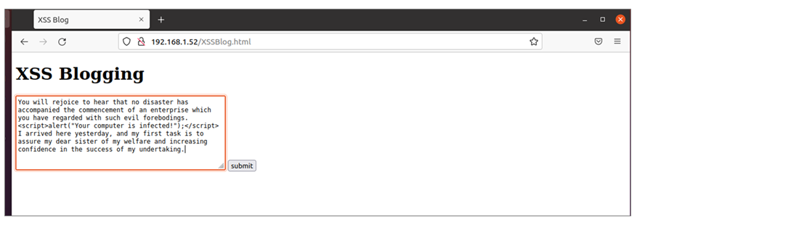

# Report Writing for Penetration Testers

# Viết Báo Cáo cho Pentester

---

Chúng ta sẽ học hai đơn vị kiến thức (Learning Units) trong phần này:

- **Hiểu về việc ghi chú (Understanding Note-Taking)**
- **Cách viết báo cáo kỹ thuật kiểm thử thâm nhập hiệu quả (Writing Effective Technical Penetration Testing Reports)**

Mô-đun này được thiết kế nhằm giúp các **Pentester** (chuyên viên kiểm thử xâm nhập) hiểu cách **trình bày và truyền đạt báo cáo một cách hiệu quả** đến khách hàng của mình.

---

# 1. **Hiểu về việc ghi chú**

---

Trong đơn vị học này, chúng ta sẽ tìm hiểu các **mục tiêu học tập (Learning Objectives)** sau:

- **Xem lại các tài liệu cần bàn giao (deliverables)** trong một buổi kiểm thử xâm nhập.
- **Hiểu tầm quan trọng của tính di động của ghi chú (note portability)** - đảm bảo ghi chú có thể dễ dàng truy cập, chia sẻ và sử dụng ở nhiều môi trường khác nhau.
- **Nhận biết cấu trúc tổng quát của tài liệu pentest**, bao gồm cách tổ chức thông tin, kết quả và bằng chứng.
- **Lựa chọn công cụ ghi chú phù hợp** cho quy trình làm việc cá nhân và nhóm.
- **Hiểu tầm quan trọng của việc chụp ảnh màn hình (screenshots)** để ghi lại bằng chứng kỹ thuật trong quá trình kiểm thử.
- **Sử dụng các công cụ chuyên dụng để chụp ảnh màn hình**, giúp ghi lại kết quả và quy trình một cách hiệu quả và chuyên nghiệp.

---

## 1.1. Các kết quả (deliverables) của kiểm thử xâm nhập

---

Một bài kiểm thử xâm nhập hoặc bài tập red team khó mà lên kịch bản trước một cách hoàn chỉnh. Lý do là người kiểm thử không thể luôn dự đoán chính xác loại máy chủ hoặc mạng mà khách hàng muốn kiểm thử.

*Mặc dù kết quả đánh giá thường khó đoán trước, vẫn nên **xác định phạm vi (scope) chi tiết** trong các cuộc họp sơ bộ với khách hàng. Quá trình này đặc biệt hữu ích khi phải **ưu tiên những mục tiêu quan trọng về mặt nghiệp vụ** trong các mạng lớn.*

Dù kế hoạch thực thi chung cho một pentest thường tuân theo một mô hình nhất định, hầu hết các pentest đều theo phương châm: **“không kế hoạch nào sống sót sau lần tiếp xúc đầu tiên với kẻ thù”**. Điều này có nghĩa là những hoạt động cụ thể ta nghĩ sẽ thực hiện có thể sẽ không xảy ra, vì thực tế môi trường kiểm thử hầu như luôn khác so với các ý tưởng và giả thuyết ban đầu. Do đó rất khó để báo cáo một cuộc kiểm thử bằng các mẫu biểu đã điền sẵn - nhất là khi việc kiểm thử được thực hiện với ít thảo luận trước với khách hàng (ví dụ khách hàng muốn bất ngờ đội phòng thủ).

Vì vậy, thay vì chuẩn bị sẵn báo cáo trước, pentest được tiến hành rồi **ghi chú liên tục trong quá trình làm việc** để đảm bảo có bản ghi chi tiết về những gì đã thực hiện. Việc này đảm bảo rằng:

- có thể **lặp lại pentest** nếu cần minh chứng rằng một vấn đề là có thật.
- có thể **lặp lại pentest sau khi vá lỗi** để xác nhận rằng vấn đề đã được khắc phục.
- nếu hệ thống bị sự cố trong thời gian pentest, khách hàng và người kiểm thử có thể xác định liệu hoạt động kiểm thử có phải là nguyên nhân hay không.

Trong quá trình pentest, một số hoạt động có thể **bị cấm**. Chúng ta phải làm rõ **Quy tắc Thực thi (Rules of Engagement - RoE)** mà theo đó việc kiểm thử được tiến hành. Khi thực hiện red team, thường sẽ có một người được giao làm **“trọng tài” (referee)** để đảm bảo RoE được tuân thủ. Có thể có các ràng buộc như không được thực hiện tấn công từ chối dịch vụ (DoS), hoặc không được tiến hành social engineering. Hơn nữa, công việc kiểm thử có thể nhằm đáp ứng các yêu cầu tuân thủ pháp lý của khách hàng và cần theo một phương pháp cụ thể như **OWASP Penetration Testing Execution Standard**. Mọi ràng buộc như vậy cần được làm rõ ngay từ đầu.

---

## 1.2. Tính di động của ghi chú

---

**Tính di động (portability)** của ghi chú trong kiểm thử xâm nhập nghĩa là **khả năng chia sẻ và chuyển giao các ghi chú đó cho người khác**.

Việc viết ghi chú **ngắn gọn, rõ ràng và mạch lạc** là một phần không thể thiếu của quá trình ghi chú hiệu quả. Nó giúp cho ghi chú:

- Có thể được **sử dụng không chỉ bởi chính người ghi**, mà còn **bởi những người khác** trong nhóm.
- **Dễ dàng chuyển đổi** thành nội dung của **báo cáo kỹ thuật** khi cần.

Tính di động của ghi chú đặc biệt quan trọng trong các tình huống như:

- **Người kiểm thử phải rời dự án** do bệnh tật hoặc vấn đề cá nhân.
- **Nhóm kiểm thử lớn** cần có sự thống nhất về cách ghi chú, để mọi thành viên có thể **hiểu và tiếp tục công việc của người khác** bất cứ lúc nào.

➡️ Tóm lại, **ghi chú có tính di động cao** giúp đảm bảo **tính liên tục, thống nhất và chuyên nghiệp** trong toàn bộ quy trình kiểm thử.

---

## 1.3. Cấu trúc chung của ghi chú kiểm thử xâm nhập

---

Chúng ta cần một phương pháp ghi chú có cấu trúc, vừa **ngắn gọn** vừa **chính xác**. Có vô số cách tổ chức ghi chú và sẽ không thực tế nếu cố gắng áp đặt một khuôn mẫu duy nhất cho mọi người. Tuy nhiên, dưới đây là một số nguyên tắc hữu ích nên cân nhắc:

- Thay vì chỉ ghi vài dòng chung chung và nghĩ rằng mình sẽ nhớ cách làm lần sau, **hãy ghi chính xác những gì mình đã làm**.
- Điều này có nghĩa là **mọi lệnh** bạn gõ, **mọi dòng mã** bạn sửa, và thậm chí **những chỗ bạn click trong GUI** nên được ghi lại để có thể tái hiện hành động.
- Dù đã ghi nhiều, nếu đọc lại sau này mà không giúp bạn nhớ chính xác điều gì đã xảy ra trong quá trình đánh giá thì những ghi chú đó sẽ không hữu ích.
- Ghi chú cần **có cấu trúc** và **đủ chi tiết** để loại bỏ mọi sự mơ hồ.
- Để viết một báo cáo kỹ thuật thuyết phục và có cơ sở, chúng ta cần cung cấp **đủ chi tiết kỹ thuật** trong ghi chú.
- Nếu ghi chú không được viết mạch lạc, người khác sẽ khó lặp lại thử nghiệm và đạt được cùng kết quả.

Cấu trúc được gợi ý ở đây đủ trừu tượng để cho phép mỗi người có sở thích riêng. Nguyên tắc chung là: **ghi chú phải nhắc lại những gì đã xảy ra và cho phép ta tái tạo chính xác các vấn đề đã tìm thấy**. Cách tiếp cận từ trên xuống (top-down) - bắt đầu bằng hoạt động chung nhất, rồi khoanh vùng và mở rộng mức chi tiết - là phương pháp dễ áp dụng và mở rộng.

Ví dụ: ghi chú cho một lỗ hổng web

- **Application Name (Tên ứng dụng):** Quan trọng khi test nhiều ứng dụng; cũng giúp xây cấu trúc thư mục/tệp tự nhiên.
- **URL:** URL chính xác dẫn tới chỗ có thể khai thác lỗ hổng.
- **Request Type:** Loại yêu cầu (GET, POST, OPTIONS, ...) và mọi chỉnh sửa thủ công (ví dụ: chặn và sửa trường username/password trước khi forward).
- **Issue Detail:** Tổng quan về lỗ hổng và tác động quan sát được (tham chiếu CVE nếu có). Phân loại tác động: DoS, RCE, privilege escalation, v.v.
- **Proof of Concept Payload (PoC):** Chuỗi hoặc khối mã kích hoạt lỗ hổng — phần quan trọng nhất, phải ghi rõ mọi điều kiện tiên quyết và **cung cấp chính xác lệnh/mã** để có thể tái tạo lại vấn đề.

Ví dụ cụ thể: kiểm thử Cross-Site Scripting (XSS)

Mục tiêu có trang web tên `XSSBlog.html`. Khi vào trang, ta có thể nhập bài viết blog.



**Testing for Cross-Site Scripting**


```
Testing Target: 192.168.1.52
Application:    XSSBlog
Date Started:   31 March 2022

1. Navigated to the application
    http://192.168.1.52/XSSBlog.html
    Result: Blog page displayed as expected
    
2.  Entered our standard XSS test data: 
    You will rejoice to hear that no disaster has accompanied the
    commencement of an enterprise which you have regarded with such
    evil forebodings.<script>alert("Your computer is infected!");</script> 
    I arrived here yesterday, and my first task is to assure my dear
    sister of my welfare and increasing confidence in the success of
    my undertaking. 

3.  Clicked Submit to post the blog entry.
    Result: Blog entry appeared to save correctly.

4.  Navigated to read the blog post
    http://192.168.1.52/XSSRead.php
    Result: The blog started to display and then the expected alert popped up.

5.  Test indicated the site is vulnerable to XSS.

PoC payload: <script>alert(‘Your computer is infected!')</script>
```

Kết luận: với cách ghi chú như trên ta có một phương pháp **nhanh**, **mạch lạc**, và **dễ mở rộng** để ghi lại quá trình kiểm thử sao cho một tester khác có thể theo và tái hiện được. Lưu ý rằng **ghi chú không phải là báo cáo cuối cùng** gửi cho khách hàng, nhưng chúng cực kỳ giá trị khi biên soạn báo cáo sau này.

---

## 1.4. Lựa chọn công cụ ghi chú phù hợp

---

Hiện nay có vô số công cụ ghi chú, cả **miễn phí** lẫn **trả phí**. Để chọn được công cụ phù hợp cho từng **phiên pentest (engagement)**, chúng ta cần hiểu rõ **yêu cầu thực tế** của mình.

Trong nhiều trường hợp, ta muốn **giữ toàn bộ thông tin cục bộ** trên máy thay vì tải lên dịch vụ đám mây - điều này có thể loại trừ nhiều công cụ không đáp ứng được yêu cầu bảo mật.

Tương tự, nếu buổi kiểm thử liên quan nhiều đến **mã nguồn**, thì công cụ **không hỗ trợ chèn khối code (code block)** sẽ không phù hợp.

### 🧭 Tiêu chí quan trọng

- **Ảnh chụp màn hình (Screenshots):**
    
    Nếu cần chụp nhiều ảnh, hãy chọn công cụ cho phép **chèn ảnh trực tiếp vào ghi chú (inline image)**.
    
- **Khối mã (Code blocks):**
    
    Cần có khả năng **định dạng cú pháp (syntax highlighting)** để giúp đọc hiểu code nhanh và rõ.
    
- **Tính di động (Portability):**
    
    Nên ưu tiên công cụ **chạy đa nền tảng** (Windows, Linux, macOS) và **dễ dàng di chuyển dữ liệu**.
    
- **Cấu trúc thư mục (Directory structure):**
    
    Với các bài test có nhiều domain hoặc ứng dụng, cần **tổ chức ghi chú rõ ràng**; nếu công cụ có thể **tự tạo cây thư mục** thì càng tiện.
    

### 🔧 Một số công cụ tiêu biểu

1. **Sublime Text**
    
    Một **trình soạn thảo văn bản tiêu chuẩn**, hỗ trợ nhiều ngôn ngữ và có nhiều tính năng mạnh mẽ.
    
    - **Ưu điểm:** Có **syntax highlighting linh hoạt**, cho phép tạo các khối code theo từng ngôn ngữ.
    - **Hạn chế:**
        - Không thể highlight nhiều ngôn ngữ trong cùng một tệp.
        - Không hỗ trợ **chèn ảnh inline** (ví dụ: screenshot minh họa).
            
            ➡️ Phù hợp với các engagement chủ yếu liên quan đến **một loại mã nguồn duy nhất**.
            
2. **CherryTree**
    
    CherryTree là công cụ **ghi chú dạng cây (tree-based)**, được cài sẵn trong **Kali Linux**.
    
    - Lưu dữ liệu trong **SQLite database**.
    - Có thể **xuất file** dưới dạng **HTML, PDF, text thuần, hoặc tài liệu CherryTree riêng**.
    - Hỗ trợ **định dạng văn bản**, **tổ chức ghi chú dạng node/subnode**, dễ theo dõi.
    
    💡 **Ví dụ:**
    
    Một cây ghi chú (tree structure) có thể chia như sau:
    
    ```
    + Client A
      + Web Application
        + Recon
        + Exploitation
      + Internal Network
        + Scans
        + Privilege Escalation
    ```
    
    CherryTree rất phù hợp khi muốn tổ chức **nhiều ứng dụng hoặc domain** trong cùng một dự án.
    
    
    
3. Obsidian
    
    **Obsidian** là công cụ ghi chú hiện đại, mạnh mẽ, hỗ trợ **Markdown**, và chứa **tất cả tính năng cần thiết cho ghi chú pentest**.
    
    Cài đặt nhanh:
    
    ```bash
    kali@kali:~$ wget https://github.com/obsidianmd/obsidian-releases/releases/download/v0.14.2/Obsidian-0.14.2.AppImage
    kali@kali:~$ chmod +x Obsidian-0.14.2.AppImage
    kali@kali:~$ ./Obsidian-0.14.2.AppImage
    ```
    
    Sau khi chạy, ta sẽ thấy **màn hình chào (Welcome Screen)** cho phép **mở hoặc tạo một “Vault” mới** - tức là một **thư mục lưu ghi chú** trên máy.
    
    
    
    ✨ Tính năng nổi bật:
    
    - Ghi chú dạng **Markdown** (dễ chuyển đổi, dễ copy sang báo cáo).
    - **Xem trước trực tiếp (Live Preview)** nội dung Markdown.
    - **Chèn ảnh và screenshot inline.**
    - Hỗ trợ **code blocks** có định dạng cú pháp.
    - Có **nhiều plugin mở rộng** (như CSS, graph view, backlink, v.v.).
    
    
    
    
    
    📁 Di chuyển dễ dàng:
    
    - **Vault** chỉ là một thư mục bình thường → có thể copy sang máy khác và mở lại từ menu Welcome.
    - Markdown file mới chỉ cần **thả vào thư mục Vault**, Obsidian sẽ **nhận diện tự động**.
    - Có thể **xuất PDF** trực tiếp từ giao diện Obsidian.
    
    💡 **Ưu điểm chính:** Markdown cực kỳ linh hoạt — dễ dùng cho báo cáo kỹ thuật, tự động trích xuất, và có thể dùng với nhiều công cụ sinh báo cáo khác.
    

Không có công cụ nào **hoàn hảo tuyệt đối** - việc chọn công cụ phụ thuộc vào **thói quen và bối cảnh làm việc**.

Lời khuyên:

- **Thử từng công cụ**, đọc kỹ tài liệu hướng dẫn.
- Làm quen với tính năng chính (screenshot, code block, export…).
- Sau đó, chọn ra công cụ **phù hợp nhất với quy trình và phong cách cá nhân**.

📚 Một số công cụ bổ sung khác có thể tham khảo trên trang của **nil0x42** (một nguồn tổng hợp hữu ích về các công cụ hỗ trợ pentest).

---

## 1.5. Chụp Ảnh Màn Hình

---

Ảnh chụp màn hình là phần quan trọng trong việc ghi chú và viết báo cáo kỹ thuật. Một ảnh chụp tốt có thể **giải thích ngay lập tức vấn đề đang thảo luận** và cung cấp chi tiết hơn so với mô tả bằng văn bản. Ảnh đặc biệt hữu dụng khi trình bày những phần báo cáo phức tạp về mặt kỹ thuật hoặc nhiều chi tiết. Như người ta thường nói, **một bức ảnh đáng giá ngàn lời**. Ngược lại, một ảnh chụp kém có thể **làm mờ ý chính** và đánh lạc hướng người đọc.

Ảnh chụp màn hình là cách hiệu quả để truyền tải **tác động trực quan** của một phát hiện, và thường hiệu quả hơn nhiều so với chỉ mô tả bằng chữ. Ví dụ, việc **chụp ảnh một hộp thông báo (alert) xuất hiện do payload XSS** sẽ truyền đạt rõ ràng hơn rất nhiều so với mô tả bằng lời. Tuy nhiên, một số tình huống (ví dụ payload tràn bộ đệm - buffer overflow) khó mô tả chính xác chỉ bằng ảnh chụp. Cũng như ta chọn công cụ phù hợp để thực hiện tấn công, ta cần **chọn công cụ phù hợp để trình bày kết quả** (văn bản vs hình ảnh).

Chúng ta có thể dùng ảnh chụp để **bổ sung cho ghi chú** hoặc **đưa vào báo cáo** nhằm minh họa các bước đã thực hiện - điều này sẽ giúp tester khác **tái hiện vấn đề**. Tuy nhiên, cần lưu ý đến đối tượng đọc. Một pentester có thể cho rằng một cửa sổ alert minh họa XSS là rõ ràng, nhưng một developer không quen với lỗ hổng có thể **không hiểu nguyên nhân hoặc tác động** thực sự. Vì vậy, **luôn kèm ảnh chụp với phần mô tả bằng văn bản** là thực hành tốt.

Ảnh chụp cần đạt **mục tiêu cụ thể**: truyền tải thông tin mà nếu mô tả bằng chữ sẽ cần nhiều câu, hoặc tạo ấn tượng trực quan. Với suy nghĩ này, ảnh nên **chứa đúng lượng thông tin cần thiết** để biện minh cho việc dùng hình thay vì chữ, nhưng **không quá nhiều chi tiết** khiến người xem bối rối.

Trở lại ví dụ XSS ở phần ghi chú: ta phát hiện XSS phản chiếu (reflected XSS) ở trường username của form đăng nhập. Ta sẽ giải thích đầy đủ tác hại của XSS trong báo cáo chính, nhưng **tác động của XSS dễ được thể hiện hơn bằng hình ảnh**. Ta cần chụp bằng chứng cho thấy **JavaScript tùy ý được thực thi**, và kèm theo các thành phần trực quan của trang (ví dụ URL trên thanh trình duyệt). Nếu cần, có thể chụp thêm **các bước tiền đề** hoặc các bước dẫn đến đoạn ảnh chính.

Một ảnh chụp được xây dựng tốt **dễ đọc tức thì**. Người xem nên **hiểu trực quan** cả ảnh và chú thích (caption) mà không phải thắc mắc. Nếu cần bối cảnh nhiều hơn, hãy thêm một đoạn văn ở trên hoặc dưới ảnh - nhưng **bản thân ảnh** nên đủ để người xem nắm ý chính.

Ví dụ cụ thể (XSS trên form đăng nhập): trong ảnh chụp chúng ta nên bao gồm - và điều chỉnh kích thước cửa sổ nếu cần - các thành phần sau:

- URL (thể hiện trang chính xác).
- Branding / logo công ty (nếu có), để liên kết lỗ hổng với hình ảnh doanh nghiệp.
- Cửa sổ popup/alert thực thi trong PoC.
- Nội dung phải **đọc được ngay** (không quá nhỏ, không cần phóng to thêm).

Một ảnh tốt là ảnh **ngay lập tức rõ ràng**, như minh họa dưới đây.


Những lỗi phổ biến cần tránh

- Ảnh **khó đọc** (chữ nhỏ, mờ).
- Ảnh **quá chung chung**, không nêu rõ liên quan đến khách hàng.
- Ảnh chứa **thông tin không liên quan** hoặc làm rối ý (ví dụ cửa sổ thông báo bị che bởi nội dung khác).
- Ảnh **không được căn khung hợp lý**, mục tiêu chính nằm quá xa cạnh hoặc bị che.

Hình minh họa dưới đây cho thấy một ảnh kém - thông tin quan trọng bị che lấp bởi nội dung không liên quan, làm mất tác động của bằng chứng.


Tóm tắt: Tiêu chí của ảnh chụp tốt

- **Đọc được (legible).**
- **Có dấu hiệu liên quan tới khách hàng** (URL, logo, branding).
- **Chứa nội dung đang mô tả.**
- **Hỗ trợ phần mô tả bằng văn bản.**
- **Được căn khung đúng — không bị lạc hướng.**

Ảnh chụp kém thì ngược lại: **khó đọc, chung chung, chứa thông tin không cần thiết, hoặc căn khung sai.**

Dưới mỗi ảnh hãy để một **chú thích ngắn**. Chú thích không dùng để cung cấp bối cảnh dài — mà chỉ mô tả ảnh bằng **vài từ**. Bất kỳ bối cảnh bổ sung nào cần cho người đọc thì nên đưa vào đoạn văn riêng. Thông thường **8–10 từ** là giới hạn phù hợp cho một chú thích.

---

## 1.6. Công cụ chụp ảnh màn hình

---

Chúng ta có thể chụp ảnh màn hình bằng các công cụ sẵn có của hệ điều hành, hoặc dùng các công cụ chuyên dụng để có nhiều tính năng hơn.
Ba hệ điều hành chính — Windows, macOS và Linux — đều cung cấp cách chụp ảnh nhanh và thuận tiện.

### 🪟 **Windows**

- **Phím PrintScreen (PrtSc):**
    
    Chụp **toàn bộ màn hình**, lưu vào clipboard. Sau đó có thể **dán (Ctrl + V)** vào ứng dụng như *Paint*, *Word* hoặc *PowerPoint* để chỉnh sửa, cắt, hoặc thêm chú thích.
    
- **Alt + PrtSc:**
    
    Chụp **cửa sổ đang hoạt động** (thay vì toàn màn hình).
    
- **Windows + Shift + S:**
    
    Mở **Snipping Tool (Công cụ Cắt)** cho phép **chọn vùng màn hình tùy ý** để chụp.
    


Snipping Tool rất tiện để **chụp chính xác phần cần thiết**, tránh các chi tiết thừa.

### 🍎 **macOS**

macOS hỗ trợ chụp ảnh màn hình bằng tổ hợp **Shift + Command** (⌘) kết hợp với các phím số:

- **Shift + ⌘ + 3:** Chụp **toàn bộ màn hình**.
- **Shift + ⌘ + 4:** Chụp **một vùng được chọn** bằng cách kéo chuột.
- **Shift + ⌘ + 5:** Mở **bảng điều khiển chụp ảnh/video màn hình** (cho phép quay, chọn vùng, hẹn giờ, lưu vị trí, v.v.).

Ảnh chụp mặc định sẽ được lưu trong thư mục **Desktop**.

### 🐧 **Linux / Kali Linux**

- **Phím PrintScreen:**
    
    Chụp **toàn bộ màn hình**, tự động lưu vào thư mục `~/Pictures` hoặc `~/Images`.
    
- **Shift + PrintScreen (hoặc B + PrintScreen):**
    
    Chụp **vùng được chọn thủ công** trên màn hình.
    
- **Kali Screenshot Tool:**
    
    Kali Linux cài sẵn công cụ **Screenshot**, có nhiều tùy chọn:
    
    - Chụp cửa sổ đang mở hoặc vùng chọn
    - Thêm **độ trễ (delay)** trước khi chụp
    - Lưu hoặc sao chép trực tiếp vào clipboard

### 🔥 **Flameshot**

**Flameshot** là một công cụ **mã nguồn mở, đa nền tảng (OS-agnostic)**, rất mạnh mẽ và thân thiện.

- Hỗ trợ cả **CLI (command line)** và **GUI (giao diện đồ họa)**.
- Có sẵn **bộ công cụ chỉnh sửa ảnh trực tiếp**, bao gồm:
    - Đánh dấu (highlight)
    - Làm mờ/pixelate thông tin nhạy cảm
    - Thêm mũi tên, văn bản, khung, ghi chú, v.v.

Flameshot là lựa chọn tuyệt vời cho pentester cần **chụp, chỉnh sửa, và lưu bằng chứng nhanh chóng**, mà vẫn **giữ tính chuyên nghiệp và bảo mật**.

### 💡 **Tổng kết:**

| Hệ điều hành | Phím / Công cụ chính | Tính năng nổi bật |
| --- | --- | --- |
| **Windows** | PrtSc / Alt + PrtSc / Win + Shift + S | Chụp toàn màn hình hoặc vùng chọn nhanh với Snipping Tool |
| **macOS** | Shift + ⌘ + 3/4/5 | Giao diện chụp chuyên nghiệp, quay video, lưu tự động |
| **Linux (Kali)** | PrtSc / Screenshot Tool | Hỗ trợ vùng chọn, cửa sổ, độ trễ chụp |
| **Flameshot** | CLI + GUI đa nền tảng | Có công cụ chỉnh sửa trực tiếp, đánh dấu, làm mờ, chú thích |

Khi chụp ảnh phục vụ báo cáo, luôn chú ý bảo mật thông tin nhạy cảm, cắt gọn vùng cần thiết, và đặt tên ảnh rõ ràng (ví dụ: `xss_alert_login.png`, `rce_payload_exec.png`).
Điều này giúp bạn dễ quản lý bằng chứng và tăng tính chuyên nghiệp trong báo cáo pentest.

---

## Labs

---

1. **Một pentester và khách hàng của họ cần tuyệt đối thống nhất điều gì trước khi buổi kiểm thử bắt đầu?**
    
    → **Quy tắc thực thi (Rules of Engagement – RoE)**
    
2. **Hai từ kết thúc bằng “cise” là những đặc điểm mong muốn của cấu trúc ghi chú pentest tổng quát là gì? (Trả lời theo dạng A và B)**
    
    → **Concise (ngắn gọn) và Precise (chính xác)**
    
3. **Khi ghi chú về bài kiểm thử web, ngoài tên ứng dụng, URL, mô tả lỗi và payload minh chứng (PoC), chúng ta còn cần bao gồm gì nữa?**
    
    → **Loại yêu cầu (Request Type)**
    
4. 
5. **Một ảnh chụp màn hình nên thể hiện bao nhiêu khái niệm quan trọng?**
    
    → **Một (One)**
    

---

# 2. Viết Báo Cáo Kỹ Thuật Hiệu Quả trong Kiểm Thử Xâm Nhập

---

Trong **đơn vị học tập (Learning Unit)** này, chúng ta sẽ tìm hiểu các **mục tiêu học tập (Learning Objectives)** sau:

- Xác định **mục đích của một báo cáo kỹ thuật**
- Hiểu cách **tùy chỉnh nội dung** một cách cụ thể cho từng đối tượng
- Soạn thảo **Bản Tóm tắt Điều hành (Executive Summary)**
- Xem xét **các yếu tố cụ thể của môi trường kiểm thử**
- Tạo **bản tóm tắt kỹ thuật (Technical Summary)**
- Mô tả **các phát hiện và khuyến nghị kỹ thuật (Technical Findings & Recommendations)**
- Nhận biết **khi nào nên sử dụng phụ lục (appendices), tài nguyên (resources) và tài liệu tham khảo (references)**

---

## 2.1. Mục đích của Báo cáo Kỹ thuật

---

Là nhà cung cấp dịch vụ kiểm thử xâm nhập, chúng ta muốn đem lại cho khách hàng càng nhiều giá trị càng tốt. Báo cáo là cơ chế để truyền tải giá trị và là artefact chính cho phép khách hàng hành động tiếp theo. Khả năng tìm được hai mươi lỗ hổng trong một ứng dụng web sẽ không tạo ra tác động kinh doanh nếu chúng ta không thể trình bày cả những lỗ hổng đó và khuyến nghị của chúng ta về cách khắc phục tiềm năng. Nếu không có hướng đi rõ ràng, khách hàng sẽ không nhận được đầy đủ giá trị cho thời gian và tiền bạc họ đã bỏ ra.

Để chuẩn bị báo cáo cho khách hàng một cách đúng đắn, chúng ta phải hiểu hai điều:

- Mục đích của báo cáo.
- Cách chúng ta có thể truyền đạt thông tin đã thu thập theo cách mà khán giả có thể hiểu.

Khi một khách hàng trả tiền cho một hợp đồng kiểm thử xâm nhập, thường (hiểu sai) rằng họ “chỉ” đang trả cho một hacker đạo đức tấn công hợp pháp vào hạ tầng của họ để tìm và khai thác điểm yếu. Mặc dù điều đó có thể về mặt kỹ thuật là cần thiết để đưa ra kết quả yêu cầu, nhưng đó không phải là mục đích cơ bản của hợp đồng. Thậm chí có những trường hợp mà khách hàng sẽ thích không để hạ tầng của họ bị tấn công chút nào!

Vậy, mục đích của một công ty khi thuê tester kiểm thử xâm nhập là gì? Mục tiêu cuối cùng là khách hàng được trình bày một lộ trình tiến tới (path forward) nêu ra và làm nổi bật tất cả các thiếu sót đang tồn tại trong hệ thống của họ nằm trong phạm vi của hợp đồng, cách khắc phục ngay lập tức các thiếu sót đó, và các mục tiêu chiến lược sẽ ngăn chặn các lỗ hổng tương tự xuất hiện trong tương lai. Kết quả này thường được cung cấp dưới dạng một báo cáo kiểm thử xâm nhập. Đối với khách hàng, báo cáo là (thường là) deliverable duy nhất của hợp đồng thực sự có ý nghĩa.

Chúng ta có thể tự hỏi nên báo cáo như thế nào về các phần của hợp đồng mà chúng ta không tìm thấy lỗ hổng. Trong nhiều trường hợp không tìm thấy lỗ hổng, chúng ta nên tránh đưa quá nhiều chi tiết kỹ thuật về những gì đã làm vào báo cáo. Một câu đơn giản rằng không tìm thấy lỗ hổng thường là đủ. Chúng ta cần đảm bảo không làm khách hàng bối rối bởi các chi tiết kỹ thuật về những nỗ lực của mình, vì điều đó sẽ làm suy giảm giá trị của những vấn đề mà chúng ta thực sự đã tìm thấy. Làm rõ thông tin đó theo cách dễ hiểu và có thể hành động là công việc của tester. Tuy nhiên, một vài khách hàng có thể thích các báo cáo kỹ thuật dài và sâu ngay cả về những không-vấn-đề, điều này dẫn đến một cân nhắc khác: người đọc.

Khách hàng nhận báo cáo là chuyên gia trong ngành cụ thể của họ. Họ thường (mặc dù không phải lúc nào cũng) ý thức được các mối quan tâm về bảo mật của ngành đó và sẽ mong đợi chúng ta đã tìm hiểu để cũng ý thức những mối quan tâm đó. Trong thực tế, điều này có nghĩa là phải hiểu sâu điều gì sẽ gây ra lo ngại cho khách hàng trong trường hợp bị tấn công. Nói cách khác, hiểu các mục tiêu và mục đích kinh doanh chính của họ. Đây là một lý do nữa vì sao việc rõ ràng về Rules of Engagement lại quan trọng, bởi vì nó cho chúng ta một cửa sổ vào các mối lo ngại cốt lõi của khách hàng.

Tất cả các vấn đề phát hiện được trong quá trình kiểm thử nên được ghi nhận nhưng chúng ta sẽ muốn làm nổi bật bất kỳ vấn đề nào mà chúng ta tìm thấy có thể ảnh hưởng đến những lĩnh vực then chốt này. Ví dụ về các lĩnh vực mối quan tâm đặc thù theo khách hàng có thể bao gồm HIPAA, là khung quản trị dữ liệu y tế tại Hoa Kỳ, và PCI, là khung quản trị thẻ tín dụng và xử lý thanh toán.

Hãy xem xét kịch bản sau. Giả sử Khách hàng A là một bệnh viện và Khách hàng B là một ngân hàng, và chúng ta được ký hợp đồng để kiểm thử cơ sở hạ tầng nội bộ của từng bên. Chúng ta có thể đưa ra kết quả tương tự cho cả hai, và mặc dù chúng có thể có cùng độ nghiêm trọng về mặt kỹ thuật, chúng ta có thể không nhất thiết ghi nhận các phát hiện với cùng mức độ rủi ro và ưu tiên khắc phục.

Bởi vì Khách hàng A là một bệnh viện với các thiết bị y tế kết nối vào mạng, bác sĩ và bệnh nhân cần hành động nhanh khi có cảnh báo giám sát nên rất có khả năng họ quan tâm đến thời gian hoạt động mạng và độ sẵn sàng của máy móc. Các thiết bị y tế kết nối mạng thường chạy trên các máy cũ với phiên bản phần mềm tích hợp đã lỗi thời. Nhu cầu hoạt động liên tục có thể dẫn đến các thiết bị này bị bỏ lỡ việc nâng cấp và vá lỗi. Khi báo cáo, các lỗ hổng tìm thấy nên được làm nổi bật, và sau đó chúng ta có thể đề xuất cô lập các máy đó vào subnet logic riêng vì việc nâng cấp hoặc vá lỗi không thể được áp dụng kịp thời.

Ngược lại, cùng một kịch bản trên mạng của Khách hàng B có thể thảm khốc. Nếu một server hoặc thiết bị trong ngân hàng thiếu một bản vá, điều đó rất có thể trở thành chỗ bám (foothold) vào mạng. Vì các hệ thống cần giao tiếp với hệ thống khác trên mạng, việc phân đoạn hoàn toàn có thể không khả thi. Do đó, một bản vá bị thiếu là mối quan tâm lớn hơn nhiều và có thể cần báo cáo như một vấn đề nguy cấp.

Khi bắt đầu ghi nhận các phát hiện, chúng ta cần luôn ghi nhớ tình huống mà trong đó lỗ hổng có thể bị khai thác và tác động tiềm năng của nó. Một trang đăng nhập HTTP văn bản rõ (clear text) trên Internet được coi là cực kỳ không an toàn. Trên mạng nội bộ, mặc dù vẫn không an toàn, nó ít đáng lo ngại hơn vì cần nhiều bước hơn để khai thác đúng cách. Tương tự, một bệnh viện có thể không quan tâm việc cổng đăng nhập hướng Internet của họ chấp nhận các cipher TLS 1.0. Một trang thương mại điện tử có khả năng lo lắng hơn nhiều, vì việc chấp nhận TLS 1.0 tạo ra vi phạm PCI.

Là người viết báo cáo, chúng ta phải trình bày thông tin hữu ích, chính xác và có thể hành động cho khách hàng mà không chèn những thiên kiến của riêng mình.

---

## 2.2. Tùy chỉnh Nội dung

---

Chúng ta phải cung cấp nội dung phù hợp với trình độ kỹ năng cho tất cả người đọc báo cáo. Báo cáo có thể được đọc bởi các điều hành cấp cao, trưởng bộ phận an ninh, và các thành viên kỹ thuật trong đội an ninh. Điều này có nghĩa là chúng ta không chỉ muốn cung cấp một tổng quan đơn giản về các vấn đề cho các điều hành, mà còn muốn cung cấp đủ chi tiết kỹ thuật cho các độc giả có chuyên môn hơn.

Chúng ta có thể làm điều này bằng cách chia nội dung thành cấu trúc phù hợp với các phần và mục con. Số lượng khán giả mà chúng ta có cho một hợp đồng cụ thể phụ thuộc nhiều vào mối quan hệ với khách hàng, quy mô, ngân sách và độ trưởng thành của họ. Vì mục đích của Module này, chúng ta sẽ xem xét một hợp đồng chỉ có hai đối tượng mục tiêu. Đầu tiên, và có thể là quan trọng hơn, là cấp quản lý. Đây thường là cấp nơi nhiều hợp đồng bên ngoài được ký và nơi cần làm nổi bật giá trị của việc đầu tư vào kiểm thử. Tùy thuộc vào doanh nghiệp, đây có thể là các chức năng cấp C (CISO, CSO, CFO, v.v.), hoặc trưởng phòng IT hoặc bảo mật.

Tuy nhiên, hầu hết các điều hành và giám đốc cấp cao không nhất thiết có khả năng kỹ thuật để theo dõi một giải thích kỹ thuật chi tiết. Chúng ta nên cung cấp cho họ một phần nêu bật kết quả và tác động của hợp đồng theo cách báo cáo chính xác các lỗ hổng đã tìm thấy mà không bị quá tải bởi các chi tiết kỹ thuật.

Đối tượng thứ hai mà chúng ta xem xét là nhân viên kỹ thuật, những người có kiến thức kỹ thuật để hiểu báo cáo và triển khai các biện pháp khắc phục đã nêu cho các lỗ hổng đã được xác định. Đối tượng này phải được cung cấp đủ chi tiết kỹ thuật để giúp họ hiểu điều gì đang sai, tác động của mỗi phát hiện là gì, và cách khắc phục. Ngoài ra, đối tượng này sẽ hưởng lợi rất nhiều khi chúng ta có thể cung cấp lời khuyên về cách ngăn chặn các loại vấn đề tương tự xảy ra trong tương lai.

---

## 2.3. Bản Tóm tắt Điều hành

---

Phần đầu tiên của báo cáo nên là Bản Tóm tắt Điều hành. Điều này cho phép ban quản lý cấp cao hiểu phạm vi và kết quả của việc kiểm thử ở mức độ đủ để nắm bắt giá trị của bài kiểm thử và phê duyệt khắc phục. Chúng ta bắt đầu bằng các mẩu thông tin ngắn gọn cung cấp bức tranh lớn, rồi theo sau bằng Bản Tóm tắt Điều hành đầy đủ.

Bản Tóm tắt Điều hành nên bắt đầu bằng việc nêu phạm vi của hợp đồng. Có một phạm vi rõ ràng được thống nhất trước khi kiểm thử định nghĩa ranh giới những gì sẽ được bao phủ. Sau đó chúng ta muốn rất rõ ràng về chính xác những gì đã được kiểm thử và liệu có điều gì bị loại khỏi phạm vi hay không. Các vấn đề về thời gian, chẳng hạn như thời gian kiểm thử không đủ do tìm quá nhiều lỗ hổng để báo cáo đầy đủ, nên được ghi nhận để đảm bảo tuyên bố phạm vi cho bất kỳ bài kiểm thử sau này là thích hợp. Bao gồm tuyên bố phạm vi trong báo cáo bảo vệ tester khỏi bất kỳ gợi ý nào cho rằng việc kiểm thử yêu cầu chưa được hoàn thành. Nó cũng cung cấp cho khách hàng một mô hình thực tế hơn về những gì khả thi với ngân sách và hạn chế thời gian đã được đặt ban đầu.

Thứ hai, chúng ta muốn bao gồm khung thời gian của bài kiểm thử. Điều này bao gồm thời lượng kiểm thử, các ngày, và có thể cả giờ kiểm thử.

Thứ ba, chúng ta nên tham chiếu Rules of Engagement và tham chiếu báo cáo trọng tài (referee report) nếu có trọng tài tham gia đội kiểm thử. Nếu việc thử nghiệm từ chối dịch vụ (DoS) được cho phép, hoặc xã hội hóa kỹ thuật (social engineering) được khuyến khích, điều đó nên được ghi ở đây. Nếu chúng ta đã tuân theo một phương pháp kiểm thử cụ thể, chúng ta cũng nên chỉ ra điều đó ở đây.

Cuối cùng, chúng ta có thể bao gồm hạ tầng hỗ trợ và các tài khoản. Dùng ví dụ ứng dụng web, nếu chúng ta được khách hàng cung cấp tài khoản người dùng, hãy liệt kê chúng ở đây cùng với các địa chỉ IP mà các cuộc tấn công xuất phát (tức là máy kiểm thử của chúng ta). Chúng ta cũng nên ghi chú bất kỳ tài khoản nào mà chúng ta đã tạo để khách hàng có thể xác nhận rằng chúng đã được xóa. Dưới đây là ví dụ về cấu trúc mức cao:

```bash
Bản Tóm tắt Điều hành:
- Phạm vi: https://kali.org/login.php
- Khung thời gian: 3 - 5 Tháng 1, 2022
- Sử dụng phương pháp OWASP/PCI cho kiểm thử
- Social engineering và DoS không nằm trong phạm vi
- Không có tài khoản kiểm thử nào được cung cấp; kiểm thử là black box từ IP bên ngoài
- Tất cả các kiểm thử được chạy từ 192.168.1.2
```

                                                            *Listing 3 - Thông tin Liên quan*

Tiếp theo, chúng ta sẽ chuẩn bị Bản Tóm tắt Điều hành dạng dài. Đây là một bản tóm tắt bằng văn bản của việc kiểm thử cung cấp tổng quan ở cấp cao về từng bước của hợp đồng và xác định mức độ nghiêm trọng, bối cảnh, và “kịch bản xấu nhất” cho các phát hiện then chốt từ việc kiểm thử. Quan trọng là không làm giảm hay phóng đại các lỗ hổng. Chúng ta muốn mô hình tư duy của khách hàng về tình trạng an ninh của họ là chính xác. Ví dụ, nếu chúng ta tìm thấy một SQL injection cho phép chi tiết thẻ tín dụng bị đánh cắp, thì đó là mức độ nghiêm trọng rất khác so với việc chúng ta tìm thấy một bypass xác thực trên một hệ thống lưu trữ dữ liệu công khai. Chắc chắn ta sẽ nhấn mạnh ví dụ đầu trong Bản Tóm tắt Điều hành, nhưng có thể không nhấn mạnh ví dụ sau trong phần này.

Chúng ta nên lưu ý bất kỳ xu hướng nào được quan sát trong quá trình kiểm thử để cung cấp lời khuyên chiến lược. Người điều hành không cần được cung cấp toàn bộ chi tiết kỹ thuật trong phần này, và nhân viên kỹ thuật sẽ có thể tìm thấy chúng khi mỗi lỗ hổng được mở rộng trong các phần sau của báo cáo. Tuy nhiên, chúng ta có thể mô tả các xu hướng đã xác định và xác thực mối quan ngại bằng các tóm tắt của một hoặc hai phát hiện quan trọng liên quan.

Để làm nổi bật xu hướng, chúng ta muốn nhóm các phát hiện có lỗ hổng tương tự. Nhiều lỗ hổng cùng loại thường cho thấy thất bại trong khu vực đó. Ví dụ, nếu chúng ta tìm thấy XSS dạng lưu và phản chiếu, cùng với SQL injection và lỗ hổng upload file, thì rõ ràng dữ liệu đầu vào người dùng không được lọc đúng cách trên toàn hệ thống. Điều này phải được khắc phục ở mức hệ thống. Phần này là chỗ thích hợp để thông báo cho khách hàng về một thất bại hệ thống, và chúng ta có thể khuyến nghị các thay đổi quy trình cần thiết như phương pháp khắc phục. Trong ví dụ này, chúng ta có thể khuyến khích khách hàng cung cấp đào tạo an ninh phù hợp cho các lập trình viên của họ.

Nên đề cập những điểm mà khách hàng đã làm tốt. Điều này đặc biệt quan trọng vì dù quản lý có thể trả tiền cho hợp đồng, mối quan hệ làm việc của chúng ta thường là với các đội bảo mật kỹ thuật. Chúng ta muốn chắc chắn rằng họ không bị đánh giá thấp cá nhân. Ngay cả các bài kiểm thử phát hiện lỗ hổng nghiêm trọng cũng có khả năng xác định một hoặc hai khu vực đã được gia cố. Bao gồm những khu vực đó sẽ làm giảm tác động lên con người và khiến khách hàng dễ tiếp nhận báo cáo hơn.

Bản Tóm tắt Điều hành thường có thể được chia như sau:

Đầu tiên, chúng ta bao gồm vài câu mô tả về hợp đồng:

```bash
“Khách hàng đã thuê OffSec tiến hành kiểm thử xâm nhập ứng dụng web kali.org của họ vào tháng 10 năm 2025. Bài kiểm thử được thực hiện từ một IP từ xa trong khoảng giờ 9 AM đến 5 PM, không có tài khoản nào được cung cấp bởi Khách hàng.”
```

                                                               *Listing 4 - Mô tả Hợp đồng*

Tiếp theo, chúng ta thêm vài câu nói về một số biện pháp gia cố hiệu quả mà chúng ta quan sát:

```bash
“Ứng dụng có nhiều hình thức gia cố. Đầu tiên, OffSec không thể upload file độc hại do bộ lọc mạnh đang có. OffSec cũng không thể brute force tài khoản người dùng vì chính sách khóa tài khoản mạnh. Cuối cùng, chính sách mật khẩu mạnh làm cho các tấn công mật khẩu đơn giản khó có khả năng thành công. Điều này cho thấy một văn hóa bảo vệ tài khoản người dùng đáng khen.”
```

                                                              *Listing 5 - Nêu các điểm tích cực*

Chú ý ngôn ngữ ở đây. Chúng ta không nói điều gì như “Không thể upload file độc hại”, vì không thể đưa ra khẳng định tuyệt đối khi không có bằng chứng tuyệt đối. Chúng ta được giao một ngân sách thời gian và tài nguyên hạn chế để thực hiện hợp đồng và bản thân chúng ta cũng có thể sai sót. Chúng ta phải cẩn trọng để ngôn từ không loại trừ khả năng rằng chúng ta đơn giản là chưa tìm thấy một lỗi thực sự tồn tại nhưng chưa bị phát hiện.

Tiếp theo, chúng ta mở đầu thảo luận về các lỗ hổng được phát hiện:

```bash
“Tuy nhiên, vẫn có những khu vực đáng lo ngại trong ứng dụng. OffSec có thể chèn JavaScript tùy ý vào trình duyệt của một nạn nhân không hay biết, và mã đó sẽ được chạy trong ngữ cảnh của nạn nhân. Kết hợp với việc liệt kê tên người dùng ở trường đăng nhập, dường như có xu hướng dữ liệu đầu vào người dùng không được lọc kèm theo các thông báo lỗi chi tiết được trả về cho người dùng. Điều này có thể dẫn đến một số vấn đề có tác động, chẳng hạn như đánh cắp mật khẩu hoặc session. Khuyến nghị rằng tất cả dữ liệu đầu vào và thông báo lỗi trả về cho người dùng nên được lọc và làm chung chung để ngăn chặn loại vấn đề này xuất hiện.”
```

                                                               *Listing 6 - Giải thích một lỗ hổng*

Cần có vài đoạn kiểu này, tùy thuộc vào số lượng và loại lỗ hổng chúng ta tìm thấy. Dùng nhiều đoạn cần thiết để minh họa xu hướng, nhưng cố gắng không bịa đặt xu hướng khi chúng không tồn tại.

Cuối cùng, Bản Tóm tắt Điều hành nên kết thúc bằng một kết luận gói hợp đồng:

```bash
“Những lỗ hổng này và các biện pháp khắc phục của chúng được mô tả chi tiết ở phần dưới. Nếu có bất kỳ câu hỏi nào phát sinh, OffSec sẵn sàng cung cấp thêm tư vấn và hỗ trợ khắc phục.”
```

                                                                *Listing 7 - Kết luận ngắn gọn*

*Chúng ta nên đề cập rằng không phải mọi tester kiểm thử xâm nhập đều cung cấp lời khuyên khắc phục, và không phải mọi khách hàng cũng mong đợi điều đó. Tuy nhiên, chúng tôi tin rằng mối quan hệ hiệu quả nhất là giữa khách hàng và nhà cung cấp khi họ cùng làm việc ở mức đó.*

---

## 2.4. Cân nhắc về Môi trường Kiểm thử

---

Phần đầu tiên của báo cáo đầy đủ nên nêu chi tiết bất kỳ vấn đề nào ảnh hưởng đến việc kiểm thử. Đây thường là một phần khá nhỏ. Đôi khi, có sai sót hoặc hoàn cảnh bất khả kháng xảy ra trong một hợp đồng. Trong khi những người trực tiếp tham gia đã biết về chúng, chúng ta nên ghi chép chúng trong báo cáo để thể hiện rằng chúng ta minh bạch.

Là tester và tư vấn viên, nhiệm vụ của chúng ta là thông báo cho khách hàng về mọi hoàn cảnh và giới hạn đã ảnh hưởng đến hợp đồng. Việc này giúp họ cải thiện cho lần kiểm thử tiếp theo và nhận được nhiều giá trị hơn cho số tiền họ đã trả. Cần lưu ý rằng không phải vấn đề nào cũng cần được làm nổi bật, và bất kể hoàn cảnh của bài kiểm thử, chúng ta cần đảm bảo báo cáo mang tính chuyên nghiệp.

Chúng ta sẽ xem xét ba trạng thái tiềm năng liên quan đến hoàn cảnh bất khả kháng:

- Kết quả tích cực: “Không có giới hạn hay hoàn cảnh bất khả kháng trong hợp đồng. Thời gian phân bổ là đủ để kiểm thử kỹ lưỡng môi trường.”
- Kết quả trung lập: “Không có chứng thực nào được cấp cho tester trong hai ngày đầu của bài kiểm thử. Tuy nhiên, bề mặt tấn công nhỏ hơn nhiều so với dự đoán. Do đó, điều này không ảnh hưởng đến tổng thể bài kiểm thử. OffSec khuyến nghị việc truyền đạt chứng thực nên diễn ra ngay trước khi hợp đồng bắt đầu cho các hợp đồng tương lai, để chúng tôi có thể cung cấp nhiều kiểm thử hơn trong thời gian được phân bổ.”
- Kết quả tiêu cực: “Không có đủ thời gian được phân bổ cho hợp đồng này để thực hiện đánh giá toàn diện ứng dụng, và phạm vi đã trở nên lớn hơn nhiều so với dự kiến. Khuyến nghị rằng nên phân bổ nhiều thời gian hơn cho các hợp đồng tương lai để cung cấp phạm vi bao phủ toàn diện hơn.”

Những cân nhắc nêu ra trong phần này sẽ cho phép cả chúng ta và khách hàng rút kinh nghiệm từ sai lầm hoặc thành công trong bài kiểm thử này và áp dụng cho các hợp đồng tương lai.

---

## 2.5. Bản Tóm tắt Kỹ thuật

---

Phần tiếp theo nên là danh sách tất cả các phát hiện chính trong báo cáo, được viết ra với tóm tắt và khuyến nghị dành cho người kỹ thuật, như kiến trúc sư bảo mật, để họ nắm nhanh những gì cần làm.

Phần này nên nhóm các phát hiện vào các khu vực chung. Ví dụ, tất cả các vấn đề về mật khẩu tài khoản yếu được xác định sẽ được gom nhóm, bất kể mốc thời gian kiểm thử. Ví dụ cấu trúc phần này có thể là:

- Quản lý Người dùng và Quyền
- Kiến trúc
- Phân quyền (Authorization)
- Quản lý Bản vá (Patch Management)
- Tính toàn vẹn và Chữ ký
- Xác thực (Authentication)
- Kiểm soát truy cập (Access Control)
- Kiểm toán, Quản lý Log và Giám sát
- Mã hóa Lưu lượng và Dữ liệu
- Cấu hình Bảo mật sai

Ví dụ về bản tóm tắt kỹ thuật cho Quản lý Bản vá như sau:

```bash
4. Quản lý Bản vá

Phát hiện các hệ điều hành Windows và Ubuntu không được cập nhật. Chúng được cho thấy có thể bị khai thác bởi các exploit công khai và có thể dẫn đến thực thi mã độc hại, đánh cắp thông tin nhạy cảm, hoặc gây từ chối dịch vụ ảnh hưởng đến hạ tầng. Việc sử dụng các ứng dụng lỗi thời làm tăng khả năng kẻ xâm nhập chiếm quyền truy cập trái phép bằng cách khai thác các lỗ hổng đã biết. Cần cải thiện quản lý bản vá và cập nhật nên được áp dụng kết hợp với quản lý thay đổi.
```

                                                           *Listing 8 - Ví dụ Bản Tóm tắt Kỹ thuật*

Phần này nên kết thúc bằng một bản đồ nhiệt rủi ro (risk heat map) dựa trên độ nghiêm trọng lỗ hổng đã được điều chỉnh phù hợp với bối cảnh khách hàng, và nếu có thể, nên được thống nhất với đại diện rủi ro bảo mật của khách hàng.

---

## 2.6. Phát hiện Kỹ thuật và Khuyến nghị

---

Phần Phát hiện Kỹ thuật và Khắc phục là nơi chúng ta bao gồm đầy đủ chi tiết kỹ thuật liên quan đến bài kiểm thử xâm nhập và những bước mà chúng ta cho là cần thiết để giải quyết các phát hiện. Mặc dù đây là phần kỹ thuật, chúng ta không nên giả định khán giả là các tester kiểm thử xâm nhập.

Không phải ai, ngay cả những người làm trong các công nghệ được kiểm thử, cũng sẽ hiểu hết các sắc thái của lỗ hổng. Mặc dù một phân tích kỹ thuật sâu về nguyên nhân gốc rễ của một exploit không phải lúc nào cũng cần thiết, nhưng thường nên cung cấp một tổng quan rộng về cách nó có thể xảy ra. Tốt hơn là giả định kiến thức nền ít hơn từ phía khán giả và cung cấp nhiều thông tin hơn, thay vì ngược lại.

Phần này thường được trình bày dưới dạng bảng và cung cấp đầy đủ chi tiết các phát hiện. Một phát hiện có thể bao phủ một lỗ hổng được xác định, hoặc có thể bao phủ nhiều lỗ hổng cùng loại.

Cần lưu ý rằng có thể cần một bản tường thuật tấn công (attack narrative). Bản tường thuật này mô tả, theo dạng câu chuyện, chính xác những gì đã xảy ra trong quá trình kiểm thử. Điều này thường được thực hiện cho một hợp đồng giả lập mối đe dọa, nhưng đôi khi cũng hữu ích để mô tả các bước khai thác phức tạp hơn cần thiết cho một bài kiểm thử thông thường. Nếu cần thiết, viết ra đường dẫn tấn công từng bước, kèm theo ảnh chụp màn hình phù hợp, thường là đủ. Một tường thuật mở rộng có thể được đặt trong Phụ lục và tham chiếu từ bảng các phát hiện.

Dưới đây là ba mục ví dụ:

| Tham chiếu | Mức rủi ro | Mô tả Vấn đề và Hệ quả | Khuyến nghị |
| --- | --- | --- | --- |
| 1 | H | Quản lý Tài khoản, Mật khẩu và Quyền là không đầy đủ. Quản lý tài khoản là quá trình cấp mới tài khoản và xóa các tài khoản không còn cần thiết. Các vấn đề sau được xác định bằng cách phân tích 122,624 tài khoản người dùng sau khi bị xâm phạm: 722 tài khoản người dùng được cấu hình không bao giờ hết hạn; 23,142 người dùng chưa bao giờ đăng nhập; 6 người dùng là thành viên của nhóm quản trị viên miền (domain administrator); mật khẩu khởi tạo mặc định được sử dụng cho 968 tài khoản. | Tất cả tài khoản nên có mật khẩu được thực thi bởi một chính sách nghiêm ngặt. Tất cả tài khoản có mật khẩu yếu nên bị buộc phải thay đổi. Tất cả tài khoản nên được đặt để tự động hết hạn. Các tài khoản không còn cần thiết nên được xóa. |
| 2 | H | Thông tin được liệt kê thông qua một phiên SMB ẩn danh. Một kết nối phiên SMB ẩn danh đã được thực hiện, và thông tin thu được sau đó được sử dụng để giành quyền truy cập người dùng trái phép như chi tiết trong Phụ lục E.9. | Để ngăn chặn việc thu thập thông tin qua các phiên SMB ẩn danh: Truy cập tới các cổng TCP 139 và 445 nên được hạn chế dựa trên vai trò và yêu cầu. Việc liệt kê tài khoản SAM nên được vô hiệu hóa bằng cách sử dụng Local Security Policy > Local Policies > Security Options |
| 3 | M | Mã JavaScript độc hại có thể được chạy để âm thầm thực hiện hoạt động độc hại. Một dạng của điều này là cross-site scripting (XSS) phản chiếu, xảy ra khi một ứng dụng web chấp nhận dữ liệu đầu vào của người dùng với mã hoạt động nhúng và sau đó xuất nó vào một trang web được hiển thị cho người dùng. Điều này sẽ khiến mã do kẻ tấn công chèn được thực thi trên trình duyệt web của người dùng. Các cuộc tấn công XSS có thể được sử dụng để đạt được các kết quả như truy cập trái phép và đánh cắp thông tin xác thực, điều mà trong một số trường hợp có thể dẫn đến thiệt hại về danh tiếng và tài chính do công bố xấu hoặc bị phạt. Như thể hiện trong Phụ lục E.8, ứng dụng [client] dễ bị lỗ hổng XSS vì giá trị tên người dùng (username) được hiển thị trên màn hình khi nỗ lực đăng nhập thất bại. Một bằng chứng khái niệm (proof-of-concept) sử dụng tên người dùng được tạo độc hại được cung cấp trong Phụ lục E. | Xem mọi đầu vào của người dùng là có khả năng không đáng tin cậy và thực hiện lọc đúng cách thông qua việc lọc ký tự đặc biệt. Mã hóa đầy đủ mọi đầu ra do người dùng kiểm soát khi render lên trang. Không đưa tên người dùng vào thông báo lỗi của ứng dụng |

*Table 1 - Phát hiện và Khuyến nghị*

Cần hiểu rằng những gì chúng ta xác định là độ nghiêm trọng của một vấn đề dựa trên điểm số lỗ hổng không phải là rủi ro kinh doanh đặc thù theo bối cảnh. Nó chỉ đại diện cho mức độ nghiêm trọng kỹ thuật, ngay cả khi chúng ta điều chỉnh nó dựa trên khả năng xảy ra. Chúng ta có thể phản ánh điều này trong các phát hiện của mình như mức độ nghiêm trọng kỹ thuật, hoặc làm việc với đội rủi ro của khách hàng để có hiểu biết về mức độ rủi ro kinh doanh phù hợp bằng cách bao gồm các cân nhắc về tác động kinh doanh độc nhất đối với khách hàng.

Chúng ta có thể bắt đầu mô tả phát hiện bằng một hoặc hai câu mô tả lỗ hổng là gì, tại sao nó nguy hiểm, và kẻ tấn công có thể làm gì với nó. Điều này có thể viết để cung cấp cái nhìn về tác động tức thời của một cuộc tấn công. Sau đó mô tả một số chi tiết kỹ thuật về lỗ hổng. Thường không cần đi vào chi tiết quá tải; chỉ giải thích ở mức cơ bản lỗ hổng là gì và cách khai thác nó. Mục tiêu là mô tả một exploit phức tạp theo cách mà hầu hết khán giả kỹ thuật có thể hiểu.

Chúng ta cũng cần bao gồm bằng chứng để chứng minh lỗ hổng đã xác định có thể bị khai thác, cùng với bất kỳ thông tin liên quan thêm nào. Nếu đơn giản, có thể đưa trực tiếp như ví dụ mục 1 ở trên. Nếu không, có thể ghi chép trong phụ lục như ví dụ mục 2.

Khi chi tiết lỗ hổng đã được giải thích, chúng ta mô tả phát hiện cụ thể đã xác định trong hệ thống hoặc ứng dụng. Chúng ta sẽ sử dụng ghi chú đã ghi trong quá trình kiểm thử và các ảnh chụp màn hình hỗ trợ để cung cấp tài khoản chi tiết. Mặc dù đây nhiều hơn vài câu, ta sẽ tóm tắt nó trong bảng và tham chiếu phụ lục cho mô tả đầy đủ.

Nên dùng ghi chú và ảnh chụp màn hình để hướng dẫn người đọc qua cách chúng ta đạt được kết quả từng bước. Ảnh chụp màn hình nên có một lời giải ngắn về những gì nó cho thấy. Không nên để ảnh chụp màn hình tự nói thay cho lời giải thích. Chúng ta nên trình bày tác động của lỗ hổng theo cách định khung mức độ nghiêm trọng phù hợp cho khách hàng, và liên quan trực tiếp đến doanh nghiệp hoặc ứng dụng.

Lời khuyên khắc phục nên đủ chi tiết để cho phép quản trị hệ thống và ứng dụng triển khai mà không mơ hồ. Khuyến nghị phải rõ ràng, súc tích và đầy đủ. Nó nên đủ để loại bỏ lỗ hổng theo cách được khách hàng chấp nhận và phù hợp với ứng dụng. Đưa ra khắc phục quá mức, tốn kém không chấp nhận được, hoặc không phù hợp về văn hóa (ví dụ: không cho phép đăng nhập từ xa trong môi trường làm việc từ xa) sẽ dẫn đến việc sửa lỗi không bao giờ được thực hiện. Hiểu rõ nhu cầu của khách hàng là cần thiết ở đây.

Cần lưu ý vài điều quan trọng khác. Thứ nhất, nên tránh các giải pháp chung chung, thay vào đó ưu tiên những việc khoan sâu vào các chi tiết của ứng dụng và doanh nghiệp. Thứ hai, các giải pháp mang tính lý thuyết không hiệu quả trong việc khắc phục lỗ hổng. Hãy chắc chắn rằng mọi giải pháp được đưa ra có triển khai thực tế và cụ thể. Cuối cùng, không gộp nhiều bước vào một giải pháp đề xuất. Mỗi bước riêng biệt nên là một giải pháp riêng.

Phần Phát hiện Kỹ thuật và Khuyến nghị có khả năng là phần chính của báo cáo và thời gian cùng nỗ lực đầu tư để viết nó nên phản ánh tầm quan trọng đó.

Khi mô tả các phát hiện, chúng ta sẽ trình bày các phương pháp để tái tạo chúng, hoặc trong phần thân báo cáo hoặc trong phụ lục. Chúng ta cần chỉ ra chính xác phần nào của ứng dụng bị ảnh hưởng, và cách kích hoạt lỗ hổng. Một bộ bước đầy đủ để tái tạo phát hiện nên được tài liệu hóa kèm ảnh chụp màn hình. Điều này bao gồm các bước mà chúng ta cho là đương nhiên (chẳng hạn như chạy với quyền quản trị), vì những điều này có thể không rõ ràng với người đọc.

Chi tiết nên được tách thành hai phần:

- URL/endpoint bị ảnh hưởng
- Phương pháp kích hoạt lỗ hổng

Nếu nhiều khu vực bị ảnh hưởng bởi lỗ hổng, chúng ta nên bao gồm tham chiếu tới từng khu vực. Nếu có một số lượng lớn các vấn đề tương tự, thì thường có thể cung cấp mẫu ví dụ kèm lưu ý rằng đây không phải là tất cả các khu vực xảy ra vấn đề. Trong trường hợp sau, chúng ta sẽ khuyến nghị một biện pháp khắc phục hệ thống.

---

## 2.7. Phụ lục, Thông tin Bổ sung và Tài liệu Tham khảo

---

Phần cuối cùng của báo cáo là Phụ lục. Những thứ được đặt ở đây thường không vừa ở bất cứ phần nào khác trong báo cáo, hoặc quá dài hoặc chi tiết để đưa trực tiếp vào phần chính. Điều này bao gồm danh sách dài các người dùng bị xâm phạm hoặc khu vực bị ảnh hưởng, khối mã proof-of-concept lớn, phương pháp luận mở rộng hoặc các bài viết kỹ thuật dài, v.v. Một quy tắc tốt là nếu điều đó cần thiết cho báo cáo nhưng sẽ làm ngắt mạch dòng chảy của trang, hãy đặt nó vào phụ lục.

Chúng ta có thể muốn bao gồm một phần Thông tin Bổ sung. Trong phần này, sẽ bao gồm những thứ có thể không cần thiết cho phần chính nhưng có thể cung cấp giá trị hợp lý cho khách hàng. Ví dụ gồm các bài báo mô tả lỗ hổng sâu hơn, tiêu chuẩn cho khuyến nghị khắc phục để khách hàng tuân theo, và các phương pháp khai thác khác. Nếu không có gì thêm giá trị đáng kể, không nhất thiết phải bao gồm phần này.

Tài liệu tham khảo có thể là cách hữu ích để cung cấp thêm hiểu biết cho khách hàng về những lĩnh vực không trực tiếp liên quan đến việc kiểm thử chúng ta thực hiện. Khi đưa tài liệu tham khảo, chúng ta cần đảm bảo chỉ sử dụng các nguồn có thẩm quyền nhất, và cũng cần trích dẫn chúng đúng cách.

Trong Module này chúng ta đã thảo luận các công cụ và thực hành hữu ích khi viết báo cáo kiểm thử xâm nhập. Tuy nhiên, giống như bản thân lĩnh vực kiểm thử xâm nhập, cũng không có “một công cụ thống trị tất cả” cho việc viết báo cáo. Với lượng lớn các công cụ báo cáo và ghi chú, chúng tôi khuyến nghị thử nghiệm để tìm ra công cụ phù hợp với bạn và/hoặc khách hàng. Về lâu dài, điều này sẽ làm cho việc viết báo cáo thoải mái và hiệu quả hơn cùng lúc.

Có nhiều khía cạnh cần ghi nhớ trong quá trình kiểm thử xâm nhập và việc ghi chép là một trong những điều quan trọng nhất. Chúng ta có thể làm việc với hàng nghìn máy tính, người dùng, ứng dụng, v.v. và nhớ tất cả khi tiến triển mà không có tài liệu gần như là không thể. Dành thời gian để ghi lại từng bước một cách kỹ lưỡng sẽ giúp chúng ta viết báo cáo tốt hơn về cuối. Nó cũng sẽ làm bài kiểm thử xâm nhập hiệu quả hơn, cho phép chúng ta xem tài liệu trong quá trình để biết đã làm gì thay vì lặp lại các bước.

Cuối cùng, chúng ta cần luôn ghi nhớ ai sẽ đọc báo cáo. Mục tiêu là làm cho báo cáo hữu ích cho tất cả khán giả tiềm năng trong một tổ chức, cả kỹ thuật và phi kỹ thuật. Chúng ta có thể làm điều này bằng cách chia báo cáo thành các phần khác nhau, sử dụng các mức ngôn ngữ kỹ thuật khác nhau trong từng phần. Điều này sẽ đảm bảo rằng mọi người đều có ý niệm về kết quả thực sự của bài kiểm thử xâm nhập.

---

## Labs

---

1. Chúng ta thường viết **Báo cáo Kiểm thử Xâm nhập (Penetration Testing Report)** cho ai?
    
    A. Trưởng bộ phận An ninh mạng
    
    B. Giám đốc Thông tin (CIO)
    
    C. Các nhà phân tích Trung tâm Điều hành An ninh (SOC Analysts)
    
    D. Tất cả các đáp án trên
    
    → D
    
2. Phần nào thường nên mở đầu một Báo cáo Kiểm thử Xâm nhập?
    
    → Bản Tóm tắt Điều hành (Executive Summary)
    
3. Đảm bảo rằng bất kỳ giải pháp nào được đưa ra đều có một cách triển khai cụ thể và ________.
    
    → thực tế (practical)