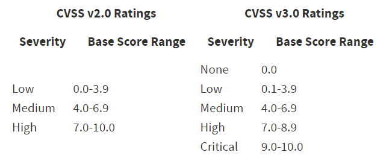

# Vulnerability Scanning

# Quét lỗ hổng

Trong Mô-đun Học tập này, chúng ta sẽ học các Bài học sau:

- Lý thuyết về quét lỗ hổng
- Quét lỗ hổng với Nessus
- Quét lỗ hổng với Nmap

Việc phát hiện lỗ hổng là một phần không thể thiếu của mọi đánh giá bảo mật. Quy trình xác định “bề mặt tấn công” của một phần mềm, hệ thống hoặc mạng được gọi là **quét lỗ hổng**.

Trình quét lỗ hổng có nhiều dạng khác nhau, từ các script đơn lẻ chỉ phát hiện một lỗ hổng cụ thể cho đến các giải pháp thương mại phức tạp có thể quét một loạt lớn lỗ hổng. Các trình quét tự động đặc biệt hữu ích cho pentester vì chúng giúp nhanh chóng thiết lập “mặt bằng” (baseline) về tình trạng của mạng mục tiêu trước khi tiến hành phân tích thủ công chuyên sâu hơn để đạt mức độ bao phủ đầy đủ. Các loại trình quét lỗ hổng phổ biến gồm **trình quét lỗ hổng ứng dụng web** và **trình quét lỗ hổng mạng**.

Trong Mô-đun này, chúng ta sẽ phân tích việc **quét lỗ hổng mạng tự động**. Trước tiên, ta tìm hiểu lý thuyết đằng sau quét lỗ hổng, sau đó sử dụng **Nessus** và **Nmap** để thực hiện các kiểu quét khác nhau.

---

# 1. **Lý thuyết về Quét Lỗ hổng**

---

Bài học này bao gồm các **mục tiêu học tập** sau:

- Nắm được hiểu biết cơ bản về quy trình quét lỗ hổng
- Tìm hiểu các loại hình quét lỗ hổng khác nhau
- Hiểu những lưu ý/cân nhắc khi thực hiện quét lỗ hổng

Trong bài học này, chúng ta sẽ thảo luận về cơ sở lý thuyết của việc quét lỗ hổng. Trước khi xem xét các công cụ, chúng ta cần phác thảo **luồng làm việc cơ bản** của một trình quét lỗ hổng và hiểu **cách nó phát hiện lỗ hổng**. Chúng ta cũng sẽ điểm qua **các loại quét** và **những cân nhắc/lưu ý** khi tiến hành quét lỗ hổng.

---

## 1.1. Cách các Trình quét Lỗ hổng Hoạt động

---

Mỗi trình quét lỗ hổng có quy trình làm việc (workflow) riêng, nhưng quy trình cơ bản đằng sau việc quét lỗ hổng thì độc lập với cách triển khai. Quy trình cơ bản của một trình quét lỗ hổng tự động thường gồm:

- **Phát hiện host** (*Host discovery*)
- **Quét cổng** (*Port scanning*)
- **Nhận diện hệ điều hành, dịch vụ và phiên bản** (*OS/service/version detection*)
- **Đối sánh kết quả với cơ sở dữ liệu lỗ hổng** (*Matching to a vulnerability database*)

**Host Discovery** cho biết mục tiêu có đang “bật” và phản hồi hay không. Sau đó, trình quét dùng nhiều kỹ thuật để xác định tất cả các cổng mở trên hệ thống và phát hiện mọi dịch vụ có thể truy cập từ xa kèm phiên bản tương ứng. Bên cạnh đó, bước này cũng sẽ thực hiện **nhận diện hệ điều hành**.

Dựa trên toàn bộ thông tin thu thập được, trình quét sẽ truy vấn **cơ sở dữ liệu lỗ hổng** để đối sánh dữ liệu tìm thấy với các lỗ hổng đã biết. Ví dụ về các cơ sở dữ liệu như **National Vulnerability Database (NVD)** và chương trình **Common Vulnerabilities and Exposures (CVE)**.

*Hầu hết các trình quét thương mại còn có khả năng **xác minh lỗ hổng** bằng cách thử khai thác một phần hoặc toàn phần. Điều này có thể giảm đáng kể việc bỏ sót lỗ hổng, nhưng có thể ảnh hưởng đến **tính ổn định** của dịch vụ hoặc hệ thống.*

Các lỗ hổng được định danh bởi hệ thống **CVE**. Nhờ đó ta có thể nhận diện và tra cứu các lỗ hổng đã được xác minh; tuy nhiên **mã CVE** không cung cấp thông tin về **mức độ nghiêm trọng** của lỗ hổng.

**Common Vulnerability Scoring System (CVSS)** là một khung đánh giá đặc trưng và **mức độ nghiêm trọng** của lỗ hổng. Mỗi CVE được gán một **điểm CVSS**. Hai phiên bản chính là **CVSS v2** và **CVSS v3**. Cả hai dùng thang điểm **0 đến 10** để phân loại mức độ với các nhãn nghiêm trọng khác nhau. Hình sau từ **NIST** liệt kê khoảng điểm cơ bản (base score) và mức độ tương ứng cho **CVSS v2.0** và **CVSS v3.0**.



                                                 ***Hình 1: Thang điểm CVSS (CVSS Ratings)***

Để lấy **điểm CVSS**, ta có thể xem mục CVE trong một cơ sở dữ liệu lỗ hổng; nếu **chưa có CVE**, ta có thể dùng **máy tính CVSS (CVSS calculator)**. Năm 2019, **CVSS v3.1** được phát hành, bổ sung làm rõ và cải thiện phiên bản hiện có.

*Cần lưu ý rằng **kết quả quét lỗ hổng** có thể **không đầy đủ** hoặc chứa **phát hiện sai**.*

- **Dương tính giả (false positive):** Xảy ra khi trình quét phát hiện một lỗ hổng nhưng mục tiêu **không** thực sự dễ tổn thương. Nguyên nhân có thể do nhận diện **dịch vụ/phiên bản sai**, hoặc cấu hình khiến mục tiêu **không thể khai thác**. Dương tính giả cũng có thể xảy ra khi **bản vá được backport -** tức là bản sửa lỗi bảo mật được áp dụng cho **phiên bản phần mềm cũ**.
- **Âm tính giả (false negative):** Xảy ra khi trình quét **bỏ sót** lỗ hổng.

Trong một bài **kiểm thử xâm nhập (penetration test)**, ta thường phải tìm được **cân bằng hợp lý** giữa **quét thủ công** và **quét tự động**. Dưới đây là tóm lược hai lựa chọn:

- **Quét thủ công:** Tất yếu sẽ **tốn tài nguyên** và **tốn thời gian**. Khi có **khối lượng dữ liệu lớn** cần phân tích, chúng ta dễ **chạm ngưỡng nhận thức** và bỏ qua chi tiết quan trọng. Ngược lại, quét thủ công cho phép phát hiện các **lỗ hổng phức tạp** và **logic -** những thứ **khó** được phát hiện bằng trình quét tự động.
- **Quét tự động:** Vô cùng **quý giá** trong tác vụ thực địa vì nhiều lý do. Thứ nhất, hầu như mọi đánh giá đều có **ràng buộc thời gian**; với một mạng doanh nghiệp lớn, ta **không thể** xem xét thủ công từng hệ thống - đặc biệt với các lỗ hổng **mới** hoặc **phức tạp**. Thứ hai, dùng trình quét tự động giúp nhanh chóng tìm ra **các lỗ hổng dễ thấy** và **“trái chín thấp”** (low-hanging fruit).

Chúng ta nên dành thời gian **tìm hiểu nội tại** của mọi công cụ tự động dự định sử dụng trong đánh giá bảo mật. Điều này không chỉ giúp **cấu hình công cụ** và **diễn giải kết quả** đúng đắn, mà còn giúp chúng ta hiểu rõ **giới hạn** cần được bù đắp bằng **chuyên môn thủ công**.

---

## Labs

---

1. Đây là dương tính giả (false positive) hay âm tính giả (false negative)?
    
    Một trình quét lỗ hổng xác định một lỗ hổng cho **máy chủ web Linux**. Mục tiêu thực tế chạy **Windows** và lỗ hổng chỉ khai thác được trên **Linux**.
    
    → *false positive (dương tính giả)*
    
2. Đây là dương tính giả hay âm tính giả?
    
    Trình quét lỗ hổng **phát hiện sai phiên bản** của dịch vụ FTP. **Phiên bản bị phát hiện** thì **không có lỗ hổng**, nhưng **phiên bản thực tế đang chạy** lại **có lỗ hổng**.
    
    *→ false negative (âm tính giả)*
    

---

## 1.2. Các loại Quét Lỗ hổng

---

Trong phần này, chúng ta sẽ xem xét **quét nội bộ** và **quét bên ngoài**, cũng như **quét không xác thực** và **quét có xác thực**.

**Vị trí** thực hiện quét quyết định **mức độ nhìn thấy mục tiêu**. Nếu khách hàng yêu cầu **quét bên ngoài (external)**, nghĩa là phân tích một hay nhiều hệ thống **truy cập được từ Internet**. Mục tiêu thường là **ứng dụng web**, **hệ thống trong DMZ (vùng phi quân sự)**, và **dịch vụ public-facing**.

Mục đích của khách hàng là có cái nhìn tổng quan về **trạng thái bảo mật** của mọi hệ thống **kẻ tấn công bên ngoài** có thể truy cập. Thông thường, chúng ta nhận **danh sách IP** để quét; đôi khi, họ muốn ta **tự lập bản đồ** toàn bộ hệ thống/dịch vụ bên ngoài. Lý tưởng là công ty phải biết rõ hệ thống nào đang public, nhưng thực tế **không phải lúc nào cũng vậy**. Do đó, ta thường phát hiện **hệ thống/dịch vụ nhạy cảm** lộ ra ngoài mà công ty **không hay biết**.

Ngược lại là **quét nội bộ (internal)**, khi ta có quyền truy cập trực tiếp vào **một phần** hoặc **toàn bộ** mạng nội bộ của khách hàng. Với loại này, ta sẽ được **VPN** hoặc **quét tại chỗ**. Mục đích là có cái nhìn tổng quan về **an ninh mạng nội bộ**, phân tích **các vector** mà kẻ tấn công có thể dùng **sau khi vượt qua vành đai bảo mật**.

Hai kiểu quét tiếp theo là **có xác thực (authenticated)** và **không xác thực (unauthenticated)**. Khi quét **không cung cấp thông tin đăng nhập**, đó là **quét không xác thực**. Loại này nhằm tìm lỗ hổng trong **dịch vụ truy cập từ xa**, vì vậy nó **lập bản đồ cổng mở**, suy ra **bề mặt tấn công** bằng cách đối sánh thông tin với **các CSDL lỗ hổng** đã nêu.

Tuy nhiên, quét **không xác thực** **không** cho ta thông tin về **lỗi bảo mật cục bộ**, như **thiếu bản vá**, **phần mềm lỗi thời**, hay **cấu hình yếu** trên chính hệ thống. Ví dụ, khi quét không xác thực một máy **Windows**, ta **không xác định** được hệ thống đã vá **HiveNightmare** (lỗ hổng cho phép user không đặc quyền đọc file hệ thống nhạy cảm) hay chưa. Đây là lúc **quét có xác thực** phát huy tác dụng.

Hầu hết trình quét có thể cấu hình để chạy **quét có xác thực**, trong đó công cụ **đăng nhập** vào mục tiêu bằng **thông tin xác thực hợp lệ**. Thường dùng **tài khoản đặc quyền** để có **khả năng quan sát tốt nhất**. Mục tiêu của quét có xác thực là kiểm tra **gói dễ tổn thương**, **bản vá còn thiếu**, hoặc **cấu hình không an toàn**.

Chúng ta sẽ thực hiện cả **quét có xác thực** và **không xác thực** ở Bài học tiếp theo; trước hết, hãy bàn cách **đạt kết quả chính xác và có tính kết luận**.

---

## Labs

---

1. Bạn cần **quét có xác thực** hay **không xác thực** trong tình huống sau?
    
    Bạn muốn xác định **tất cả bản vá hiện tại** trên một hệ thống **Linux** đã được cài đặt đầy đủ chưa.
    
    *→ Authenticated scan (quét có xác thực)* — vì cần đăng nhập để kiểm tra gói/bản vá nội bộ.
    
2. Bạn cần **quét có xác thực** hay **không xác thực** trong tình huống sau?
    
    Bạn muốn phân tích **chu vi (perimeter)** của một máy chủ trên Internet từ góc nhìn của **kẻ tấn công**.
    
    *→ Unauthenticated scan (quét không xác thực)* — vì mục tiêu là quan sát bề mặt tấn công từ ngoài vào.
    

---

## 1.3. Những điều cần cân nhắc khi Quét Lỗ hổng

---

Trong phần này, chúng ta sẽ đề cập đến một số yếu tố cần cân nhắc khi **lên kế hoạch** và **thực hiện** quét lỗ hổng. Với các dự án lớn, cần **cấu hình** trình quét thật cẩn thận để thu được **kết quả có ý nghĩa và phù hợp**.

1. **Thời lượng quét (scanning duration).**

Tùy thuộc vào **kiểu quét** và **số lượng mục tiêu**, thời gian cho một lượt quét tự động có thể chênh lệch rất lớn. Đặc biệt, **quét bên ngoài qua Internet** thường tốn thời gian do có nhiều **hop** và **hệ thống trung gian** trên đường đi mạng; vì vậy, nếu có một **danh sách IP lớn**, ta phải lên kế hoạch tương ứng.

1. **Khả năng nhìn thấy mục tiêu (target visibility).**

Dù việc nhập một địa chỉ IP rồi bấm quét rất dễ, ta thường phải cân nhắc kỹ về **khả năng truy cập** mục tiêu: có cần **VPN** hay **quyền mở tường lửa** không? Thông thường, khi khách hàng **cung cấp danh sách IP** để quét bên ngoài thì không có gì đáng lo. Nhưng nếu ta **tự xác định bề mặt tấn công** hạ tầng public của khách, phải hiểu rằng có thể tồn tại **tường lửa** hay cơ chế **hạn chế truy cập** khiến một số hệ thống/dịch vụ **không truy cập được**.

*Ví dụ:* Một khách hàng quốc tế có hệ thống ở nhiều quốc gia và **chặn mọi IP** ngoài quốc gia sở tại của từng hệ thống. Từ vị trí của ta, chỉ truy cập được các hệ thống trong **quốc gia của ta**; các hệ thống khác **không thể truy cập**.

1. **Target visibility trong nội bộ.**

Trong bài toán **nội bộ**, cần cân nhắc **vị trí** của ta trong mạng để có kết quả có ý nghĩa, nhất là khi muốn quét **khác subnet**. Hãy nhớ rằng **tường lửa**, **IPS**, và các thiết bị mạng trung gian (như **router**) có thể **lọc** hoặc **thay đổi** lưu lượng. Ví dụ, nếu trình quét gửi **ICMP** trong bước **Host Discovery** nhưng thiết bị trung gian **không chuyển tiếp** ICMP, trình quét có thể **đánh dấu nhầm** mục tiêu là **offline**.

1. **Giới hạn tốc độ (rate limiting).**

Mạng có thể áp dụng **rate limit** để hạn chế lượng lưu lượng. Khi quét vượt các ngưỡng như **throughput**, **số gói**, hoặc **số kết nối**, máy nguồn của trình quét có thể bị **hạn chế nghiêm trọng** về năng lực mạng. Nếu các probe **host discovery** và **service detection** bị rate-limit làm **chậm lại**, trình quét có thể **bỏ sót** host hoặc dịch vụ đang sống. Đa số trình quét cho phép **đặt delay, timeout**, và **giới hạn kết nối song song** để xử lý vấn đề này.

1. **Tác động lên mạng và hệ thống.**

Trình quét thường tạo **rất nhiều lưu lượng**, nhất là khi quét **song song nhiều mục tiêu**—có thể khiến mạng **khó sử dụng**. Cách xử lý: **giảm số phiên quét song song** hoặc **giảm tốc độ quét**. Vấn đề lớn hơn là **độ ổn định của hệ thống**: mỗi cuộc quét đều có thể **gây bất ổn** cho hệ thống/dịch vụ được quét, cần **cân nhắc rủi ro** này trước khi triển khai.

---

## Labs

---

1. Mệnh đề sau đúng hay sai?
    
    “Một cuộc quét lỗ hổng **không bao giờ** ảnh hưởng đến **độ ổn định** của hệ thống hay dịch vụ mục tiêu.”
    
    **Trả lời:** *False* — quét có thể tạo nhiều lưu lượng hoặc thử khai thác, gây bất ổn dịch vụ/hệ thống.
    
2. Mệnh đề sau đúng hay sai?
    
    “**Rate limiting** có thể là lý do khiến trình quét đánh dấu **một hệ thống đang hoạt động** thành **offline**.”
    
    **Trả lời:** *True* — rate limit làm chậm/giảm probe (ICMP, service detection), dẫn đến nhận định sai.
    

---

# 2. Quét Lỗ hổng với Nessus

---

Bài học này bao gồm các **mục tiêu học tập** sau:

- Cài đặt **Nessus**
- Hiểu **các thành phần** của Nessus
- Cấu hình và thực hiện **một cuộc quét lỗ hổng**
- Hiểu và làm việc với **kết quả quét lỗ hổng bằng Nessus**
- Cung cấp **thông tin xác thực** để thực hiện **quét có xác thực**
- Nắm được hiểu biết cơ bản về **plugin của Nessus**

Trong bài học này, chúng ta sẽ tập trung vào **Nessus** — một trong những **trình quét lỗ hổng phổ biến nhất**, chứa hơn **67.000 CVE** và **168.000 plugin**.

Nessus có hai phiên bản chính: **Nessus Essentials** và **Nessus Professional**.

Chúng ta sẽ sử dụng **phiên bản miễn phí – Nessus Essentials**, phiên bản này có **một số giới hạn**, ví dụ:

- Chỉ quét được **tối đa 16 địa chỉ IP khác nhau**
- Một số **mẫu quét (templates)** và **chức năng nâng cao** không khả dụng

Tuy nhiên, **Nessus Essentials** vẫn giúp chúng ta **hiểu cách sử dụng** phiên bản thương mại đầy đủ, và các **khái niệm tổng quát** trong phần này cũng **áp dụng cho hầu hết trình quét thương mại khác**.

---

## 2.1. Cài đặt Nessus

---

Trong Bài học này, ta sẽ cài **Nessus** trên máy ảo **Kali Linux** (dùng để kết nối môi trường lab PEN-200). Cần có **kết nối Internet** và **email doanh nghiệp** để tải xuống và kích hoạt Nessus. Tenable khuyến nghị cấu hình tối thiểu **4 nhân CPU** và **8GB RAM**; tuy nhiên cho bài tập này, **2 nhân CPU** và **4GB RAM** là **đủ dùng**.

**Nessus không có trong kho Kali**, nên phải cài **thủ công**. Ta có thể tải bản hiện tại dưới dạng **.deb 64-bit** cho Kali từ **trang Tenable**. Tại đó cũng cung cấp **checksum SHA256** và **MD5** cho bộ cài.

Người học dùng máy Apple với chip ARM có thể cài Nessus trên máy ảo Kali bằng cách tải **trình cài cho Linux – Ubuntu – arch64**.

Hãy chọn nền tảng **Linux – Debian – amd64** và tải trình cài đặt.


Sau khi tải xong, ta sẽ **kiểm tra checksum SHA256** để xác thực tệp. Nhấn nút **Checksum**, sao chép giá trị **SHA256** vào clipboard bằng biểu tượng copy.

Tiếp theo, ta **echo** checksum vừa chép **kèm tên file cài đặt** vào một tệp tên `sha256sum_nessus`. (Nút copy cạnh SHA256 chỉ copy **giá trị checksum**, nên **tên file** phải gõ **thủ công**.) Tệp `sha256sum_nessus` cần ở **cùng thư mục** với file cài đặt Nessus. Sau đó dùng `sha256sum -c` để **xác minh**.

```bash
kali@kali:~$ cd ~/Downloads

kali@kali:~/Downloads$ echo "4987776fef98bb2a72515abc0529e90572778b1d7aeeb1939179ff1f4de1440d Nessus-10.5.0-debian10_amd64.deb" > sha256sum_nessus

kali@kali:~/Downloads$ sha256sum -c sha256sum_nessus
Nessus-10.5.0-debian10_amd64.deb: OK
```

                                                                 *Liệt kê 1 – Xác minh checksum*

Kết quả cho thấy checksum **khớp**, nghĩa là có thể cài gói. Nếu có **phiên bản Nessus mới hơn**, checksum trong ví dụ trên sẽ **khác** và cần **cập nhật** tương ứng.

Để cài gói Nessus, dùng `apt install` với đường dẫn tệp `.deb`:

```bash
kali@kali:~/Downloads$ sudo apt install ./Nessus-10.5.0-debian10_amd64.deb
...
Preparing to unpack .../Nessus-10.5.0-debian10_amd64.deb ...
Unpacking nessus (10.5.0) ...
Setting up nessus (10.5.0) ...
...
Unpacking Nessus Scanner Core Components...
 - You can start Nessus Scanner by typing /bin/systemctl start nessusd.service
 - Then go to https://kali:8834/ to configure your scanner
```

                                                                     *Liệt kê 2 – Cài đặt Nessus x64*

Sau khi cài xong, khởi động dịch vụ **nessusd** qua `systemctl`:

```bash
kali@kali:~/Downloads$ sudo systemctl start nessusd.service
```

                                                                     *Liệt kê 3 – Khởi động Nessus*

Khi Nessus đã chạy, mở trình duyệt tới [**https://127.0.0.1:8834**](https://127.0.0.1:8834/). Trình duyệt sẽ cảnh báo **chứng chỉ không rõ nhà phát hành** - điều này **bình thường** vì dùng **self-signed certificate**. Chọn **Advanced…** rồi **Accept the Risk and Continue** để chấp nhận.


Khi trang tải xong, hệ thống sẽ yêu cầu **cấu hình tiền cài đặt**. Chọn **Continue** để cài với **mặc định**.


Tiếp theo, chọn **sản phẩm Nessus**. Trong bài này, chọn **Register for Nessus Essentials** rồi **Continue**.


Sau đó, hệ thống yêu cầu **nhận mã kích hoạt** cho Nessus Essentials. Điền thông tin cần thiết và bấm **Register**.


Đăng ký xong, **mã kích hoạt** sẽ hiển thị ở cửa sổ kế tiếp.


Tiếp theo, tạo **tài khoản cục bộ** cho Nessus. Chọn tên người dùng **`admin`** và đặt **mật khẩu mạnh** để bảo vệ kết quả quét. Ta sẽ dùng thông tin này để **đăng nhập** Nessus.


Cuối cùng, Nessus sẽ **tải và biên dịch toàn bộ plugin**. Bước này có thể **mất nhiều thời gian**.


Sau khi plugin được tải và cài đặt, ta đã có một **bản Nessus Essentials** sẵn sàng hoạt động.

---

## 2.2. Các thành phần của Nessus

---

Trước khi bắt đầu phiên quét lỗ hổng đầu tiên với Nessus, hãy làm quen với các **thành phần cốt lõi**. Khi đăng nhập lần đầu, bạn sẽ thấy cửa sổ chào mừng cho phép nhập mục tiêu. Tạm thời có thể **đóng** mà **chưa nhập gì**.

Đầu tiên, hãy xem các **tab** trong bảng điều khiển của Nessus. Ở bản **Nessus Essentials**, có hai tab: **Scans** và **Settings**.


                                             ***Hình 9: Khám phá phần Settings của Nessus***

- Tab **Settings** cho phép **cấu hình ứng dụng**. Ví dụ, nhập thông tin **SMTP** để nhận kết quả quét qua email. Mục **Advanced** cho phép chỉnh các **thiết lập toàn cục** từ giao diện, hành vi quét và ghi log, đến các tùy chọn **bảo mật** và **hiệu năng**.
- Như trong Hình 9, mục **About** liệt kê thông tin cơ bản về **Nessus**, **giấy phép**, và **số host còn có thể quét**. Để biết thêm cách **tùy biến/cấu hình**, hãy xem **tài liệu Nessus**.

Tiếp theo, hãy xem **policies** và **templates** bằng cách vào tab **Scan** rồi chọn **Policies**. **Policy** là một **tập các tùy chọn cấu hình định sẵn** cho một bài quét Nessus. Khi **lưu policy**, ta có thể dùng nó như **template** cho lần quét mới.

Bây giờ chọn **Scan Templates**. Nessus đã cung cấp sẵn nhiều **mẫu quét** được **nhóm** thành 3 danh mục: **Discovery**, **Vulnerabilities**, và **Compliance**.


                                                         ***Hình 10: Các mẫu Policy của Nessus***

- Danh mục **Compliance** chỉ có ở **phiên bản doanh nghiệp**, tương tự **Mobile Device Scan**.
- Danh mục **Discovery** chỉ có mẫu **Host Discovery** dùng để **liệt kê host đang hoạt động** và **các cổng mở**.
- Danh mục **Vulnerabilities** gồm các mẫu cho **lỗ hổng nghiêm trọng** hoặc **nhóm lỗ hổng** (ví dụ **PrintNightmare**, **Zerologon**), cũng như các mẫu cho các mảng quét phổ biến (**Web Application Tests**, **Malware Scans**).

Nessus cũng cung cấp **ba mẫu quét lỗ hổng tổng quát**:

1. **Basic Network Scan**: thực hiện **quét đầy đủ** với **đa số thiết lập định sẵn**. Mẫu này phát hiện **rộng** nhiều loại lỗ hổng và là **mẫu được khuyến nghị**. Bạn vẫn có thể **tùy chỉnh** các thiết lập/khuyến nghị này.
2. **Advanced Scan**: **không có thiết lập sẵn**. Dùng khi muốn **tùy chỉnh hoàn toàn** hoặc có **nhu cầu đặc thù**.
3. **Advanced Dynamic Scan**: cũng **không có thiết lập sẵn** hay khuyến nghị. **Khác biệt lớn nhất** so với Advanced Scan là **không cần chọn plugin thủ công**; bạn có thể cấu hình **bộ lọc plugin động (dynamic plugin filter)**.

**Nessus Plugins** là các chương trình viết bằng **NASL (Nessus Attack Scripting Language)**, chứa **thông tin** và **thuật toán** để phát hiện lỗ hổng. Mỗi plugin thuộc về một **nhóm plugin (plugin family)**, phục vụ các **trường hợp sử dụng** khác nhau. Ở phần cuối của Bài học này, chúng ta sẽ làm việc với **mẫu Advanced Dynamic Scan** và **các plugin**.

---

## Labs

---

1. Nhóm thứ ba của các danh mục template: **DISCOVERY, COMPLIANCE và __________?**
    
    **Trả lời:** *VULNERABILITIES*
    
2. Vào tab **Settings** của Nessus rồi mở **Advanced**. Hỏi: mặc định cho phép **bao nhiêu web users truy cập đồng thời**?
    
    **Trả lời:** *1024*
    

---

## 2.3. Thực hiện một cuộc Quét Lỗ hổng

---

Trong phần này, chúng ta sẽ thực hiện **bài quét lỗ hổng đầu tiên**. Bắt đầu bằng cách nhấp **New Scan** trên bảng điều khiển trong tab **Scans**.


                                                                        ***Hình 11: Tạo một Scan***

Nessus hiển thị danh sách các **template** khác nhau. Ở phần này, ta sẽ dùng **Basic Network Scan** bằng cách nhấp vào nó.


                                                       ***Hình 12: Chọn Basic Network Scan***

Màn hình cấu hình scan sẽ xuất hiện với các nhóm thiết lập: **BASIC**, **DISCOVERY**, **ASSESSMENT**, **REPORT**, và **ADVANCED**.


                                              ***Hình 13: Các nhóm thiết lập trong cấu hình Scan***

Mặc định là trang **General**, gồm hai tham số bắt buộc: **tên** cho lượt quét và **danh sách mục tiêu**. Nessus hỗ trợ nhiều cách chỉ định mục tiêu: một **địa chỉ IP**, một **dải IP**, danh sách **FQDN** cách nhau bởi dấu phẩy, hoặc một **tệp danh sách IP**.

Trong ví dụ này, ta sẽ quét các máy: **POULTRY, JENKINS, WK01**, và **SAMBA**. Nhập **"Basic Vulnerability Scan"** vào trường **Name** và nhập **địa chỉ IP** của các máy vào trường **Targets**.


                                           ***Hình 14: Đặt tên scan và danh sách mục tiêu***

Vì chọn template **Basic Network Scan**, Nessus đã **điền sẵn phần lớn thiết lập**. Tuy nhiên, cấu hình mặc định có thể **chưa phù hợp** với nhu cầu cụ thể. Tùy theo **kiểu quét**, **môi trường**, **ràng buộc thời gian**, và **mục tiêu**, ta có thể cần **điều chỉnh**.

Theo mặc định, template này quét **danh sách các cổng phổ biến**. Trong demo này, ta chỉ muốn quét cổng **80** và **443**. Vào **Discovery**, chọn **Custom** trong menu thả xuống.


                                                 ***Hình 15: Chọn Discovery kiểu Custom***

Menu thả xuống (Hình 15) có nhiều lựa chọn dựng sẵn; để quét **cổng cụ thể**, ta **chọn Custom**.

Sau khi chọn **Custom**, các menu cấu hình bổ sung xuất hiện dưới **DISCOVERY**. Lúc này có thể **tùy biến** template **Basic Network Scan** tương tự như **Advanced Scan** trong phạm vi **DISCOVERY**. Ở phần **Port Scanning**, đặt **Port scan range** thành `"80,443"`. Đồng thời bật tùy chọn **Consider unscanned ports as closed** để Nessus **coi các cổng khác là đóng**, vì ta chỉ quan tâm 80/443.


                                                          ***Hình 16: Chỉ định cổng 80 và 443***

Trong demo này, ta đã tùy chỉnh để chỉ quét **hai cổng TCP**. Ngay cả ở mặc định, Nessus **không** quét **UDP**. Nếu muốn quét UDP, cần **bật thủ công**. Tắt UDP có thể khiến **bỏ sót** dịch vụ UDP quan trọng; nhưng bật UDP sẽ **tăng đáng kể thời lượng scan**. Do bản chất UDP, thường **khó phân biệt** giữa cổng **mở** và **bị lọc**.

Để **tiết kiệm thời gian** và quét **êm hơn**, ta sẽ **tắt Host Discovery** vì **biết trước** các host đang hoạt động. Vào **Discovery > Host Discovery** và **tắt** **Ping the remote host**.


                                                     ***Hình 17: Tắt ping host trong Discovery***

Trong quá trình cấu hình định nghĩa scan, ta **không cấu hình** thông tin xác thực nào, nên lượt quét này sẽ chạy ở chế độ **unauthenticated**.

Ta cũng **không thay đổi** mặc định của menu **ASSESSMENT** trong **Basic Network Scan**; tức là **không brute-force** thông tin đăng nhập. Dù brute-force bị tắt, lượt quét vẫn **tạo nhiều lưu lượng mạng** và vì **quét nhiều máy**, nó sẽ **dễ bị nhận thấy**.

Khi đã nắm cơ bản cách **tùy biến template** theo nhu cầu, ta có thể **khởi chạy** lượt quét đầu tiên: nhấp mũi tên cạnh **Save** và chọn **Launch**.


                                                                    ***Hình 18: Khởi chạy Scan***

Ban đầu, trạng thái scan sẽ là **Running** trong bảng điều khiển Nessus, mục **My Scans**.


                                                   ***Hình 19: Scan đang chạy trong Dashboard***

Hình 19 cho thấy lượt quét đang chạy và cung cấp tùy chọn **dừng** hoặc **tạm dừng**. Khi hoàn tất, trạng thái sẽ chuyển sang **Completed**.


                                                   ***Hình 20: Scan đã hoàn tất trong Dashboard***

Như vậy là kết thúc **lượt quét lỗ hổng đầu tiên** với Nessus. Ở Bài học tiếp theo, ta sẽ **xem xét kết quả** của lượt quét.

---

## 2.4. Phân tích Kết quả

---

Trong phần này, chúng ta sẽ phân tích kết quả của lượt quét lỗ hổng đầu tiên.

> **Cảnh báo**
Nhóm máy ảo (VM group) dùng cho phần này **khác** với nhóm ở phần trước. Hãy đảm bảo bạn **khởi động và sử dụng** nhóm VM ở **cuối** phần này.
> 

Do Nessus và các plugin liên tục được cập nhật, kết quả quét có thể hơi khác nhau. Ta có thể nhấp vào bài quét trong danh sách **My Scans** để mở **bảng điều khiển kết quả**.


                                   ***Hình 21: Bảng điều khiển kết quả (Result Dashboard)***

Màn hình ban đầu hiển thị trang **Hosts**, liệt kê tất cả host đã quét và trực quan hóa dữ liệu lỗ hổng. Điều này giúp ta nhận ra các phát hiện quan trọng trong nháy mắt và có cái nhìn tổng quan về tình trạng bảo mật của từng hệ thống. Ở góc dưới bên phải, Nessus hiển thị biểu đồ phân bố thông tin lỗ hổng của toàn bộ mục tiêu; phía trên là thông tin chung về lượt quét.

*Các plugin của Nessus được cập nhật thường xuyên, vì vậy **phát hiện, cách nhóm và thông tin** trình bày trong bài học này có thể hơi khác so với kết quả thực tế của bạn.*

Để xem **danh sách phát hiện của một host cụ thể**, hãy nhấp vào dòng tương ứng. Màn hình sẽ liệt kê lỗ hổng của host đã chọn. Hãy nhấp vào mục của **192.168.50.124**.


                                              ***Hình 22: Bảng kết quả lỗ hổng của 192.168.50.124***

Cột **Severity** cho ta biết nhanh phát hiện đó có **nghiêm trọng** hay không. Hình 22 còn cho thấy có ba phát hiện với mức **MIXED**; Nessus dùng mức này khi **gộp** nhiều phát hiện. Cột **Count** cho biết mỗi nhóm có bao nhiêu mục. Ta có thể nhấp vào một nhóm để xem **danh sách chi tiết** các phát hiện trong nhóm. Hãy nhấp vào **Apache Httpd (Multiple Issues)**, thuộc nhóm **Web Servers** ở cột **Family**.


                                               ***Hình 23: Danh sách các phát hiện trong một nhóm***

Hình 23 hiển thị thông tin các phát hiện vốn được nhóm lại. Để xem chi tiết hơn, nhấp vào một phát hiện cụ thể. Hãy chọn **Apache 2.4.49 < 2.4.51 Path Traversal Vulnerability**.


                                                  ***Hình 24: Thông tin chi tiết của một phát hiện***

Mỗi phát hiện chứa **rất nhiều thông tin** về chính lỗ hổng cũng như **plugin** đã phát hiện nó. Ngoài ra còn có dữ liệu về **mức rủi ro**, **tình trạng khai thác**, và các **tài liệu tham chiếu** khác.

Tiếp theo, quay lại **bảng điều khiển kết quả** ở Hình 21 để khám phá thêm.

Phân tích chi tiết **một mục tiêu** cho ta nhiều thông tin sâu. Tuy nhiên, đôi khi ta muốn **tổng quan các lỗ hổng quan trọng nhất trên tất cả mục tiêu**. Nessus cung cấp tính năng **VPR Top Threats** (ưu tiên theo **Vulnerability Priority Rating – VPR**) để hiển thị **top 10** lỗ hổng của lượt quét.


                                                            ***Hình 25: Danh sách VPR Top Threats***

Trong ví dụ này, danh sách chỉ có **sáu** lỗ hổng do cấu hình quét hiện tại không tìm thấy nhiều hơn.

*Lưu ý: Tùy phiên bản Nessus, tab **VPR Top Threats** có thể **không xuất hiện**. Tuy vậy, **mỗi phát hiện** vẫn có **VPR** kèm theo.*

Trang tiếp theo là **Remediations** (Khắc phục). Nếu Nessus phát hiện lỗ hổng, các plugin thường kèm **chiến lược khắc phục** hoặc cách **giảm thiểu**. Với các lỗ hổng **Apache** ở Hình 22, ta sẽ nhận được thông tin như sau.


                                                        ***Hình 26: Khuyến nghị khắc phục lỗ hổng***

Trang báo cáo cuối là **History** (Lịch sử). Trang này liệt kê **mọi lượt quét** với cấu hình hiện tại, dùng để **xem lại/so sánh** kết quả các lần quét trước.

Đến đây, ta đã hiểu cách **xem kết quả** của một lượt quét Nessus. Bây giờ hãy **xuất báo cáo PDF**. Thao tác tại **bảng điều khiển Report**: ngoài tạo báo cáo, bạn còn có thể **đổi cấu hình quét**, **chạy lại**, hoặc **xuất dữ liệu**. Ta cũng có thể cấu hình **Audit Trail** để phân tích **vì sao một plugin** lại hành xử như vậy—hữu ích để **giảm âm tính giả**.

Hãy tạo báo cáo PDF cho lượt quét đầu tiên bằng cách nhấp **Report**.


                                                                          ***Hình 27: Tạo báo cáo***

Khi nhấp nút, một cửa sổ mới cho phép chọn **mẫu báo cáo** khác nhau; mỗi mẫu có **cấu trúc, trọng tâm và nội dung** riêng.

Trong ví dụ này, ta chọn mẫu **Detailed Vulnerabilities By Host**, trình bày **chi tiết phát hiện** theo **từng host**. Chọn định dạng **PDF** rồi nhấn **Generate Report**.


                                                ***Hình 28: Chọn định dạng và mẫu báo cáo***

Sau đó, ta có thể **tải xuống** hoặc **mở** file PDF.

Ta cũng có thể dùng mẫu **Complete List of Vulnerabilities by Host** để tạo **bản tóm tắt** thay vì đầy đủ chi tiết.

*Để biết thêm cách **tùy biến báo cáo**, tham khảo phần **scan exports and reports** trong **Tài liệu Tenable** ([https://docs.tenable.com/nessus/Content/ScanReportFormats.htm](https://docs.tenable.com/nessus/Content/ScanReportFormats.htm)).*

Trong hai phần trước, chúng ta đã **thực hiện quét**, **xem kết quả**, và **tạo báo cáo PDF** chứa thông tin chi tiết cho mọi host. Bạn có thể làm quen Nessus hơn bằng cách **tùy biến cấu hình quét** và phân tích **sự khác biệt về hành vi/kết quả**.

---

## 2.5. Thực hiện Quét Lỗ hổng **Có Xác thực**

---

Trong phần này, chúng ta sẽ thực hiện một lượt quét **có xác thực** bằng cách cung cấp **thông tin đăng nhập** cho Nessus. Như đã bàn trước đó, quét có xác thực cho **thông tin chi tiết hơn** và **giảm số lượng dương tính giả**. Để minh họa, ta sẽ quét có xác thực đối với mục tiêu **DESKTOP**.

*Lưu ý: quét có xác thực không chỉ tạo **nhiều lưu lượng mạng** mà còn gây **nhiễu lớn** trên chính hệ thống (log, cảnh báo antivirus/AV…).*

Bắt đầu bằng cách nhấp **New Scan** trên dashboard của Nessus.


                                                                ***Hình 29: Tạo một Scan mới***

Dù mọi template của Nessus đều chấp nhận **credentials**, ta sẽ dùng template **Credentialed Patch Audit**, vốn được cấu hình sẵn để thực thi **local security checks** trên mục tiêu.

Khác biệt giữa template này với **Basic Network Scan** (khi có cấp credential) là **Credentialed Patch Audit chỉ thực hiện local checks**, **không** chạy quét lỗ hổng thông thường theo **góc nhìn bên ngoài**. Template này không chỉ tìm **thiếu bản vá hệ điều hành** mà còn phát hiện **ứng dụng lỗi thời**, có thể dẫn tới **leo thang đặc quyền**.


                                                  ***Hình 30: Chọn Credentialed Patch Audit***

Tiếp theo, đặt **tên** cho lượt quét và đặt **mục tiêu** là **DESKTOP**.


                                               ***Hình 31: Thiết lập cơ bản cho quét có xác thực***

Chuyển sang tab **Credentials**, trong **Host** chọn **SSH**. Ở **Authentication method**, chọn **password** và nhập:

- Username: `offsec`
- Password: `lab`
    
    Ở mục **Elevate privileges with**, chọn **sudo**, nhập **sudo user** là `root` và **password** `lab`.
    


                                       ***Hình 32: Cấu hình SSH và Sudo cho quét có xác thực***

Trong ví dụ này ta dùng **SSH**, nhưng còn nhiều **cơ chế xác thực** khác. Để xem đầy đủ, mở menu **Categories** và chọn **All** (xem thêm **Tenable Documentation**).

Với **Linux** và **macOS**, thường dùng **SSH**. Với **Windows**, có thể dùng SSH nhưng phổ biến hơn là **SMB** và **WMI** để quét có xác thực; cả hai đều hỗ trợ **local/domain account** và các cách xác thực khác nhau.

Để kết quả có ý nghĩa, cần đảm bảo **mục tiêu** được **cấu hình đúng**:

- Không có **tường lửa** chặn kết nối từ máy quét.
- **Antivirus (AV)** trên Linux/Windows có thể coi quét là độc hại và **chặn** hoặc làm sai lệch kết quả → hãy **thêm ngoại lệ** cho IP/máy quét hoặc **tạm tắt** (nếu chính sách cho phép).
- Trên Windows, cân nhắc **UAC**: UAC chạy ứng dụng với **quyền chuẩn** và chỉ nâng quyền khi cần, có thể **cản trở** quét. Có thể **cấu hình UAC** để cho phép Nessus hoặc **tạm thời vô hiệu hóa** (tham khảo kỹ **Tenable Documentation** trước khi quét Windows).

Mục tiêu của ta là **Linux** và **không có AV**, vì vậy có thể nhấp mũi tên cạnh **Save** để **Launch** quét. Sau khi hoàn tất, ta xem **kết quả**. Ở trang **Vulnerabilities**, ta thấy danh sách phát hiện của lượt quét có xác thực. Trước đó, ta có các nhóm phát hiện với mức **MIXED**; lần này, hãy **tắt nhóm** bằng cách nhấp **biểu tượng bánh răng** và chọn **Disable Groups**.


                                       ***Hình 33: Tắt nhóm kết quả (Disable Grouped Results)***

Khi tắt nhóm, **mỗi phát hiện** được liệt kê **riêng lẻ**.


                                                             ***Hình 34: Kết quả quét có xác thực***

Ta sẽ thấy các lỗ hổng của **Ubuntu** thuộc **plugin family** *Ubuntu Local Security Checks*.

**Plugin families** gom các plugin kiểm tra **cùng ngữ cảnh** (ví dụ: cơ sở dữ liệu, tường lửa, web server…). **Ubuntu Local Security Checks** chứa rất nhiều plugin để kiểm tra **lỗ hổng cục bộ** và **bản vá thiếu** trên Ubuntu.

Cột **Name** cho biết **phiên bản Ubuntu dễ tổn thương**, **mô tả ngắn**, và **mã bản vá** liên quan.


                                             ***Hình 35: Dữ liệu lỗ hổng của Firefox và cURL***

Danh sách cũng bao gồm lỗ hổng của **ứng dụng cục bộ** như **Firefox** hay **cURL**.

---

## 2.6. Làm việc với Plugin của Nessus

---

Mặc định, Nessus sẽ bật một số plugin ngầm định khi chạy một template mặc định. Mặc dù điều này hữu ích trong nhiều tình huống, ta cũng có thể tinh chỉnh để nhanh chóng chạy **một plugin duy nhất**. Tính năng này hữu ích để xác thực một phát hiện trước đó hoặc để nhanh chóng tìm các mục tiêu trong môi trường có rủi ro với một lỗ hổng cụ thể.

Trong ví dụ này, ta sẽ đặt **bộ lọc plugin** để kiểm tra xem máy **DESKTOP** có dễ bị **CVE-2021-3156** hay không — đây là lỗ hổng có thể khai thác cục bộ, cho phép user không đặc quyền leo thang lên root.

Để dùng **dynamic plugin filter**, bắt đầu bằng **New Scan**.


                                                                           ***Hình 36: Tạo Scan mới***

Lần này ta dùng template **Advanced Dynamic Scan** — template này cho phép dùng **dynamic plugin filter** thay vì bật/tắt plugin thủ công.


                                                           ***Hình 37: Chọn Advanced Dynamic Scan***

Nhập tên và target như trước.


                                                                   ***Hình 38: Nhập tên và target***

Tiếp theo cung cấp cùng credentials SSH + sudo như ví dụ trước (tức là đây là quét có xác thực).

Bây giờ chọn plugin muốn dùng cho lượt quét. Advanced Dynamic Scan cho phép dùng **filter** thay vì chọn plugin từng cái.

Vào tab **Dynamic Plugins**. Ở dropdown trái chọn **CVE** để lọc theo CVE. Ở dropdown giữa chọn **filter argument** (kiểu so khớp). Ở dropdown phải nhập số CVE — nhập **CVE-2021-3156** rồi nhấp **Preview Plugins** (có thể mất vài phút).


                                                                  ***Hình 39: Lọc plugin theo CVE***

Khi Preview xong, ta nhận danh sách những **plugin families** phủ CVE này.


                                        ***Hình 40: Chọn plugin family liên quan tới CVE-2021-3156***

Một tính năng hữu ích là **kết hợp nhiều bộ lọc**. Vì biết target là Ubuntu, ta thêm bộ lọc thứ hai (nhấn dấu +) để giới hạn plugin family. Chọn **Plugin Family** ở trái và **Ubuntu Local Security Checks** ở phải.


                                                          ***Hình 41–42: Thêm và kết hợp bộ lọc***

*Tùy phiên bản Nessus, dropdown phải có thể không hiện giá trị — khi đó bỏ bộ lọc thứ hai và tiếp tục.*

Nhấp **Preview Plugins** lại, chọn **Ubuntu Local Security Checks** từ dropdown để xem thông tin plugin (phiên bản Ubuntu ảnh hưởng, mô tả, mã bản vá, Plugin ID).


                             ***Hình 43: Plugin Ubuntu Local Security Check cho CVE-2021-3156***


                                       ***Hình 44: Thông tin chi tiết plugin (ví dụ Plugin 145463)***

Đóng cửa sổ, khởi chạy scan như trước. Khi xong, vào tab **Vulnerabilities** để xem kết quả.


                                             ***Hình 45: Các phát hiện của Advanced Dynamic Scan***

Kết quả liệt kê một phát hiện với **HIGH severity**, do plugin ta chọn tìm thấy. **Hình 46** cho thấy chi tiết, xác nhận mục tiêu **dễ bị CVE-2021-3156**.

Plugin output còn ghi rõ Nessus **chỉ** dùng **phiên bản báo cáo** của ứng dụng và **không** cố gắng xác nhận bằng cách khai thác. Trong một bài đánh giá, ta cần **xác minh thủ công** những kết quả này để khẳng định liệu chúng có **thực sự có thể khai thác** hay không.

---

# 3. Quét lỗ hổng với Nmap

---

Đơn vị học này bao gồm các **mục tiêu học tập** sau:

- Hiểu các kiến thức cơ bản về **Nmap Scripting Engine (NSE)**
- Thực hiện **quét lỗ hổng nhẹ** với Nmap
- Làm việc với **script NSE tùy chỉnh**

Trong đơn vị học này, chúng ta sẽ khám phá **Nmap Scripting Engine (NSE)** và cách tận dụng Nmap như một **trình quét lỗ hổng nhẹ**. Bên cạnh đó, chúng ta sẽ tìm hiểu **các nhóm (category) của script NSE**, cách **sử dụng script NSE trong Nmap**, và cách **làm việc với các script NSE tùy chỉnh**.

---

## 3.1. Script phát hiện lỗ hổng

---

Là một lựa chọn thay thế cho Nessus, chúng ta cũng có thể dùng **NSE** để thực hiện các lần quét lỗ hổng tự động. Các script NSE mở rộng chức năng cơ bản của Nmap để làm nhiều tác vụ mạng khác nhau. Những tác vụ này được nhóm theo **category** như: phát hiện lỗ hổng (vulnerability detection), brute force, và khám phá mạng (network discovery). Các script cũng có thể mở rộng khả năng phát hiện phiên bản dịch vụ (version detection) và thu thập thông tin (information gathering) của Nmap.

Một script NSE có thể thuộc **nhiều category**. Ví dụ, một script có thể được phân loại vừa là `safe` vừa là `vuln`, hoặc `intrusive` và `vuln`. Các script thuộc nhóm **“safe”** không có khả năng ảnh hưởng đến sự ổn định hệ thống, trong khi các script thuộc nhóm **“intrusive”** có thể làm **crash** dịch vụ hoặc hệ thống mục tiêu. Để tránh vấn đề ổn định, **cần kiểm tra cách script được phân loại** và **không bao giờ** chạy một script hoặc một category NSE khi **chưa hiểu rõ hệ quả**. Ta có thể xác định category của một script bằng cách duyệt **tài liệu NSE** (NSE Documentation) hoặc xem **cục bộ trong thư mục script của NSE**.

Trong phần này, chúng ta sẽ tập trung vào **category `vuln`** để tận dụng Nmap như một **trình quét lỗ hổng nhẹ**.

Trên **Kali VM**, các script NSE nằm ở thư mục **`/usr/share/nmap/scripts/`** với phần mở rộng **`.nse`**. Thư mục này cũng chứa file **`script.db`**, đóng vai trò **chỉ mục** cho tất cả các script NSE hiện có. Ta có thể dùng nó để liệt kê các script trong **category `vuln`**.

```bash
kali@kali:~$ cd /usr/share/nmap/scripts/

kali@kali:/usr/share/nmap/scripts$ cat script.db  | grep "\"vuln\""
Entry { filename = "afp-path-vuln.nse", categories = { "exploit", "intrusive", "vuln", } }
Entry { filename = "broadcast-avahi-dos.nse", categories = { "broadcast", "dos", "intrusive", "vuln", } }
Entry { filename = "clamav-exec.nse", categories = { "exploit", "vuln", } }
Entry { filename = "distcc-cve2004-2687.nse", categories = { "exploit", "intrusive", "vuln", } }
Entry { filename = "dns-update.nse", categories = { "intrusive", "vuln", } }
...
```

                                                                *Liệt kê 4 – CSDL script của Nmap*

Mỗi mục có **tên file** và **các category**. **Tên file** chính là tên script NSE trong thư mục NSE.

Một số script NSE tiêu chuẩn đã khá **lỗi thời**. May mắn là **script `vulners`** đã được tích hợp, cung cấp **thông tin lỗ hổng hiện hành** cho các phiên bản dịch vụ được phát hiện dựa trên **Vulners Vulnerability Database**. Bản thân script này có các category: **`safe`**, **`vuln`**, và **`external`**.

Trước khi bắt đầu lần quét lỗ hổng đầu tiên với NSE, ta sẽ xem tham số **`--script`** của Nmap. Tham số này quyết định **script NSE nào sẽ được chạy** trong một lần quét. Đối số của tham số này có thể là:

- **một category**,
- **biểu thức Boolean**,
- **danh sách category** ngăn cách bởi dấu phẩy,
- **tên đầy đủ hoặc ký tự đại diện** khớp tên một script NSE trong `script.db`,
- hoặc **đường dẫn tuyệt đối** tới một script cụ thể.

Hãy bắt đầu với một lần quét Nmap sử dụng **tất cả script** thuộc **category `vuln`**. Lệnh dùng tham số `--script` với đối số `vuln`, tức là chạy mọi script thuộc category này. Bên cạnh đó, ta cung cấp **`-sV`** để bật **phát hiện dịch vụ** của Nmap. Cuối cùng, ta dùng **`-p`** để chỉ quét **cổng 443**.

```bash
kali@kali:~$ sudo nmap -sV -p 443 --script "vuln" 192.168.50.124
[sudo] password for kali:
Starting Nmap 7.92 ( https://nmap.org )
...
PORT    STATE SERVICE VERSION
443/tcp open  http    Apache httpd 2.4.49 ((Unix))
...
| vulners:
|   cpe:/a:apache:http_server:2.4.49:
...
        https://vulners.com/githubexploit/DF57E8F1-FE21-5EB9-8FC7-5F2EA267B09D	*EXPLOIT*
|     	CVE-2021-41773	4.3	https://vulners.com/cve/CVE-2021-41773
...
|_http-server-header: Apache/2.4.49 (Unix)
MAC Address: 00:0C:29:C7:81:EA (VMware)
```

                                 *Liệt kê 5 – Dùng các script category `vuln` của NSE với máy SAMBA*

Nmap phát hiện dịch vụ **Apache** với phiên bản **2.4.49** và chạy toàn bộ script thuộc **category `vuln`**. **Phần lớn output** đến từ **script `vulners`**, script này dùng thông tin về **dịch vụ và phiên bản** đã phát hiện để cung cấp **dữ liệu lỗ hổng liên quan**.

Script `vulners` không chỉ hiển thị thông tin về **CVE** tìm thấy mà còn có **điểm CVSS** và **liên kết** để xem thêm. Ví dụ, ở *Liệt kê 5*, Nmap kết hợp `vulners` đã phát hiện mục tiêu **dễ bị tấn công với CVE-2021-41773**.

Một tính năng hữu ích khác của `vulners` là **liệt kê các Proof of Concept (PoC)** cho lỗ hổng tìm thấy, được đánh dấu bằng **“*EXPLOIT*”**. Tuy nhiên, **nếu không phát hiện được dịch vụ/phiên bản** một cách thành công thì script `vulners` **sẽ không trả về kết quả**.

---

## 3.2. Làm việc với các script NSE

---

Ở phần trước, ta đã tìm hiểu về category `vuln` của NSE và script `vulners`. Mặc dù `vulners` cung cấp cái nhìn tổng quan về tất cả CVE được ánh xạ với phiên bản dịch vụ đã phát hiện, đôi khi ta muốn **kiểm tra một CVE cụ thể**. Điều này đặc biệt hữu ích khi muốn quét một mạng để xem **lỗ hổng đó có tồn tại hay không**. Nếu làm việc này bằng `vulners`, ta sẽ phải đọc một lượng thông tin khổng lồ. Với hầu hết lỗ hổng hiện đại, ta cần **tự tích hợp** các script NSE chuyên dụng.

Hãy thực hành với **CVE-2021-41773**. Để tìm script NSE phù hợp, ta có thể dùng công cụ tìm kiếm với từ khóa **mã CVE + “nse”** (ví dụ: `CVE-2021-41773 nse`).


                                        *Hình 47: Tìm script NSE cho một CVE cụ thể trên Google*

Một trong những kết quả đầu tiên thường là trang GitHub cung cấp script kiểm tra lỗ hổng này. Hãy tải script đó và lưu thành **`/usr/share/nmap/scripts/http-vuln-cve2021-41773.nse`** để đồng bộ với quy ước đặt tên của các script NSE khác. Trước khi dùng, ta cần cập nhật **`script.db`** bằng **`--script-updatedb`**.

```bash
kali@kali:~$ sudo cp /home/kali/Downloads/http-vuln-cve-2021-41773.nse /usr/share/nmap/scripts/http-vuln-cve2021-41773.nse

kali@kali:~$ sudo nmap --script-updatedb
[sudo] password for kali:
Starting Nmap 7.92 ( https://nmap.org )
NSE: Updating rule database.
NSE: Script Database updated successfully.
Nmap done: 0 IP addresses (0 hosts up) scanned in 0.54 seconds
```

                                *Liệt kê 6 – Sao chép script NSE và cập nhật cơ sở dữ liệu `script.db`*

Để sử dụng script NSE, ta chỉ định **tên script**, **mục tiêu** và **cổng**, đồng thời bật **phát hiện dịch vụ**.

```bash
kali@kali:~$ sudo nmap -sV -p 443 --script "http-vuln-cve2021-41773" 192.168.50.124
Starting Nmap 7.92 ( https://nmap.org )
Host is up (0.00069s latency).

PORT    STATE SERVICE VERSION
443/tcp open  http    Apache httpd 2.4.49 ((Unix))
| http-vuln-cve2021-41773:
|   VULNERABLE:
|   Path traversal and file disclosure vulnerability in Apache HTTP Server 2.4.49
|     State: VULNERABLE
|               A flaw was found in a change made to path normalization in Apache HTTP Server 2.4.49. An attacker could use a path traversal attack to map URLs to files outside the expected document root. If files outside of the document root are not protected by "require all denied" these requests can succeed. Additionally this flaw could leak the source of interpreted files like CGI scripts. This issue is known to be exploited in the wild. This issue only affects Apache 2.4.49 and not earlier versions.
|
|     Disclosure date: 2021-10-05
|     Check results:
|
|         Verify arbitrary file read: https://192.168.50.124:443/cgi-bin/.%2e/%2e%2e/%2e%2e/%2e%2e/etc/passwd
...
Nmap done: 1 IP address (1 host up) scanned in 6.86 seconds
```

                                                     *Liệt kê 7 – Script NSE cho CVE-2021-41773*

Kết quả cho thấy mục tiêu **dễ bị tấn công** (vulnerable) với **CVE-2021-41773** và cung cấp thêm thông tin bối cảnh.

Mặc dù Nmap **không phải** là trình quét lỗ hổng theo nghĩa truyền thống, NSE là một tính năng **mạnh mẽ** cho phép ta thực hiện **quét lỗ hổng nhẹ**. Trong một bài kiểm thử thâm nhập, ta có thể dùng Nmap khi không có sẵn công cụ quét lỗ hổng đầy đủ, hoặc khi muốn **xác minh** phát hiện từ các công cụ khác.

Tuy nhiên, cũng như mọi trình quét lỗ hổng, ta phải cân nhắc một số yếu tố. **Category** của script NSE cung cấp thông tin hữu ích (ví dụ script **intrusive** hay **safe**), nhưng ta cũng cần nhớ rằng **script NSE có thể chứa mã độc**, cho phép kẻ tấn công chiếm quyền hệ thống của ta. Vì vậy, ta luôn phải **xác minh** rằng script **không chỉ** làm được việc mình cần mà còn **an toàn**.

---

# 4. Tổng kết

---

Mô-đun này đã cung cấp cái nhìn tổng quan về quét lỗ hổng với **Nessus** và **Nmap**, đồng thời nêu bật các **loại hình** và **yếu tố cần cân nhắc** khi thực hiện quét lỗ hổng.

Quét lỗ hổng có thể cực kỳ hữu ích trong mọi dạng đánh giá an ninh. Khi được cấu hình đúng, các công cụ quét sẽ cung cấp một lượng lớn dữ liệu có ý nghĩa. Tuy vậy, cần hiểu rằng **việc rà soát thủ công kết quả vẫn là bắt buộc**, và trình quét chỉ có thể phát hiện **những lỗ hổng mà nó đã được cấu hình để tìm**. Cuối cùng, luôn ghi nhớ rằng các công cụ quét lỗ hổng **có thể thực hiện những hành động gây ảnh hưởng xấu** đến một số mạng hoặc mục tiêu; vì thế, **phải thận trọng** khi sử dụng chúng.

---

# 5. Luyện tập

---

## TryHackMe

---

[Threat and Vulnerability Management](https://tryhackme.com/module/threat-and-vulnerability-management?utm_source=chatgpt.com)

[Nmap](https://tryhackme.com/room/furthernmap?utm_source=chatgpt.com)

---

## HackTheBox

---

[Vulnerability Assessment Course | HTB Academy](https://academy.hackthebox.com/course/preview/vulnerability-assessment?utm_source=chatgpt.com)

---

# 6. WriteUp

---

['Labs/Vulnerability Scanning' 카테고리의 글 목록](https://longhd.tistory.com/category/Labs/Vulnerability%20Scanning)